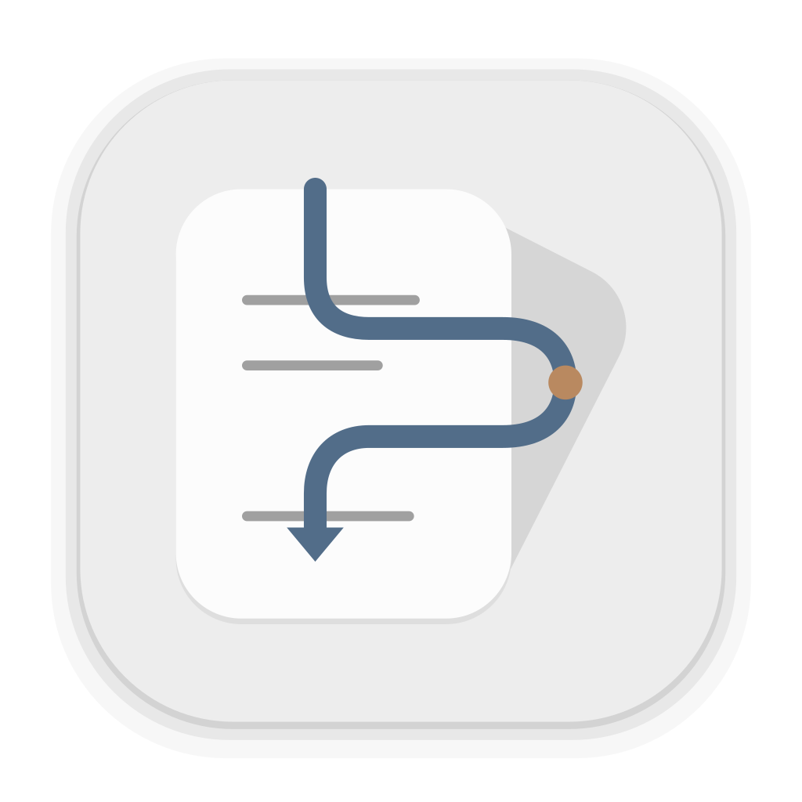

# Placekeeper

Placekeeper is a focused everyday PDF reader and annotator for serious readers. It preserves your place and train of thought across annotation, search, and nested reference lookup, produces a portable reviewed PDF from a recoverable session, and can supply task-scoped live PDF and annotation context to its Codex plugin.



## Install

On an Apple-silicon Mac running macOS 13 or newer, download or clone this repository and run one command from the repository folder:

```sh
./install.sh
```

The installer uses a checksum-pinned local Node toolchain, installs locked dependencies, builds into a temporary directory, verifies the packaged PDF writer offline, and transactionally installs the app under `~/Applications`. A failed update restores the previous app. It does not require an Apple Developer account or a global Node installation.

See [Install and uninstall](docs/installation.md) for first-launch, update, optional Codex/VS Code integration, and removal instructions. See [Privacy and recovery](docs/privacy-and-recovery.md) for local storage behavior.

### Web beta (not yet published)

A front-end-only web beta is implemented as a lightweight, export-only companion to the full Placekeeper app. It can open one local PDF or a compatible public HTTPS PDF, create and edit Review Items, export a reviewed copy, and restore Placekeeper-owned items as editable when that copy is uploaded again. It has no autosave or reload recovery: exporting is the only durability action. The project-site build is for non-confidential PDFs, and remote URL use discloses the complete URL and ordinary request metadata to the remote host.

The public link is intentionally absent. Publication under the Placekeeper name remains blocked until the external clearance, protected deployment, live-origin smoke, and real-Safari qualification in the [web beta runbook](docs/web-beta.md) are complete. See [Privacy and recovery](docs/privacy-and-recovery.md#front-end-only-web-beta) and [Support and diagnostics](docs/support.md#web-beta) before testing a local build.

## Use

After installation, select one local PDF in Finder and choose **Open With -> Placekeeper**. You can also open `~/Applications/Placekeeper.app` and choose a PDF. PDFs open in a native Mac app window with bundled review and PDF assets. The app performs no telemetry, and leaves the original PDF unchanged unless you explicitly choose the separately confirmed Replace Original action.

Chrome 151 or newer can render top-level PDFs in the complete Placekeeper review client without leaving the PDF's original tab or URL. Load the installed **Placekeeper PDF Viewer** extension from `~/Applications/Placekeeper Chrome Extension`, then turn on **Open PDFs automatically** from its Placekeeper toolbar popup. It begins paused, offers a one-PDF **Use Chrome viewer** bypass before activation, and does not change Placekeeper's macOS PDF-handler rank. See [Install and uninstall](docs/installation.md#open-chrome-pdfs-automatically) for setup and troubleshooting.

Finder and app launches open native windows; Codex launches continue to use its in-app browser with readable local review addresses whose fragment records only the current page or a saved Placekeeper item. Chrome-intercepted PDFs instead retain their source URL; Placekeeper Back and Forward traverse document locations without adding browser-history entries, so browser Back returns to the page before the PDF. Chrome therefore omits the redundant document-level **Copy Link**, while precise item links still emit capability-free `placekeeper:///…` app links. A matching verified source and PDF digest rejoin the same service-owned review after reload or reopen, while every tab receives its own presentation lease.

With the bundled Codex plugin installed, ask Codex to open one explicit local PDF in Placekeeper. The hosting task is bound automatically after the in-app browser loads. Each later prompt refreshes the current Review Items, Existing PDF Annotations, and save status; Codex retrieves bounded PDF text, layout, render, or annotation evidence only when needed. Finder, ordinary-browser, and VS Code launches remain unbound and show no Codex control.

### Review LaTeX in VS Code

App updates also refresh an already-installed Placekeeper extension in standard VS Code installations; reload the VS Code window after updating. The installer reports extension update failures separately from a successful app replacement. For a custom VS Code location, run `node packaging/macos/update-vscode.mjs ~/Applications/Placekeeper.app /absolute/path/to/code`.

Install the bundled extension from `~/Applications/Placekeeper.app/Contents/Resources/integrations/vscode`, open a local trusted LaTeX workspace, and run **Placekeeper: View PDF** or **Placekeeper: Forward SyncTeX**. The extension opens the shared Placekeeper client directly in one reusable VS Code panel. Its JavaScript, CSS, inline PDFium worker, and PDFium WASM are integrity-checked local extension assets; the working loop uses no iframe, external browser, or network fallback.

Placekeeper observes successful LaTeX output replacement but does not build LaTeX or write the generated PDF. After a rebuild, the same panel refreshes atomically, preserves current or explicitly unresolved Review Items, and shows **possibly stale** when a saved source has no valid successor. **Placekeeper: Export Reviewed PDF** is the only reviewed-PDF write path and always targets a distinct file.

LaTeX Workshop 10.18.x users may opt into **Placekeeper: Configure LaTeX Workshop** after opening the output in Placekeeper. The command previews workspace-only changes and uses the installed scoped launcher at `~/Applications/Placekeeper.app/Contents/MacOS/placekeeper-vscode`; it never changes user settings. Because LaTeX Workshop does not provide a supported custom-viewer API, this compatibility route is best-effort. If its probe fails, if LaTeX Workshop is absent, or on the VS Code 1.95 support floor, use the supported **Placekeeper: View PDF** and **Placekeeper: Forward SyncTeX** commands. **Placekeeper: Restore LaTeX Workshop Settings** restores only values Placekeeper still owns.

## Supported release scope

The current personal release is source-first and Apple-silicon-only. Developer ID signing, notarization, Intel/x64, DMG/PKG packaging, auto-update, and release CI are optional future work, not installation requirements.
