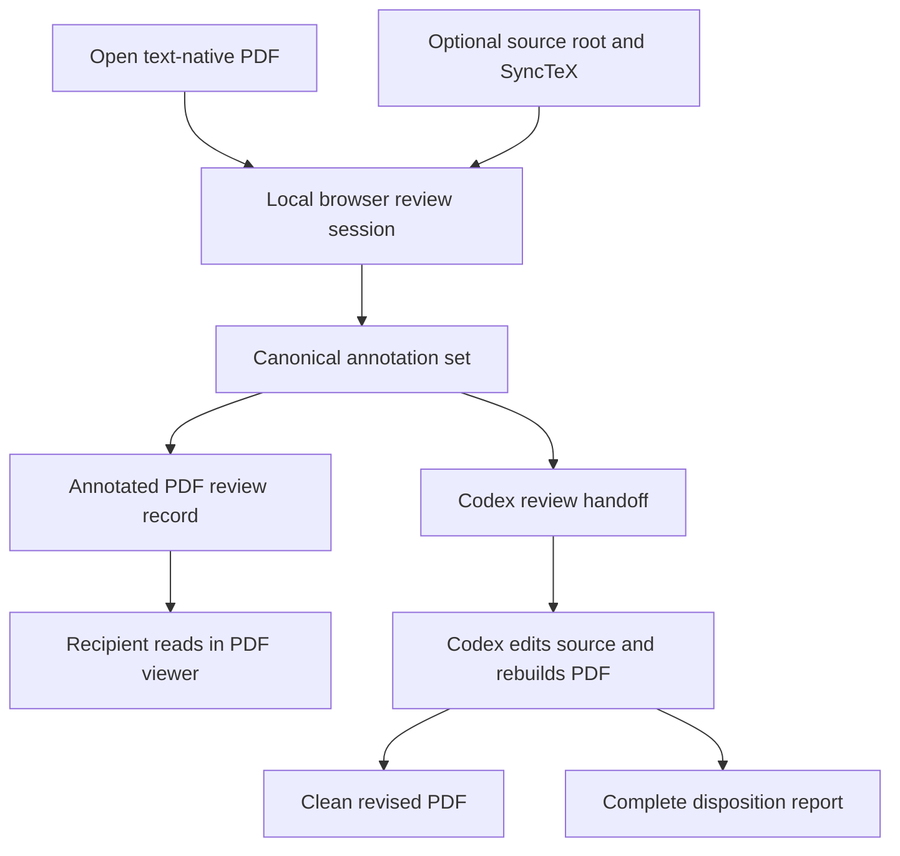

# Local PDF Proofreader - Plan

## Goal Capsule

- **Objective:** Provide a fast, local Track Changes workflow for text-native PDFs that produces both a portable annotated PDF and a reliable source-editing handoff for Codex.
- **Product authority:** This contract owns the markup experience, safe local document handling, launch coverage across Finder, Codex, and VS Code, and the two review deliverables.
- **Open blockers:** No unresolved product decision blocks implementation planning. U1 remains an intentional viability gate: a failed EmbedPDF viewer gate or failure of both writer candidates blocks implementation rather than weakening the Product Contract.
- **Execution:** Code.

---

## Product Contract

### Summary

Implement the full local PDF proofreader contract through one capability-scoped local service and one shared browser UI.
Begin with a conformance gate that tests EmbedPDF/PDFium as the required shared viewer and first writer candidate, with PDFBox as a preservation-focused writer fallback only.
The selected stack must then deliver Track-Changes-style review, crash-safe recovery, interoperable reviewed PDFs, and a source-aware Codex handoff across Finder, Codex, VS Code, and ordinary browsers.

### Problem Frame

Codex's PDF preview does not offer a convenient text-markup workflow.
Apple Preview separates highlighting from note creation, while Acrobat offers better review gestures inside a much larger product.
The reviewer currently lacks one low-friction way to mark a compiled PDF, send readable feedback to another person, and ask Codex to apply the same feedback to the local LaTeX source.

The two deliverables are not separate review workflows.
They are projections of one canonical annotation session: a standards-based PDF for people and an explicit machine-readable handoff for Codex.

### Actors

- A1. **Reviewer:** Opens a PDF, records feedback, and chooses a human or Codex delivery path.
- A2. **Recipient:** Reads the annotated PDF in a conventional PDF viewer without installing the proofreader.
- A3. **Codex:** Uses the review handoff to locate source, apply unambiguous edits, rebuild a clean PDF, and report the disposition of every review item.

### Key Decisions

- **Use Track-Changes-style proofread gestures.** (session-settled: user-directed — chosen over a selection palette and comment-first interaction: direct typing and deletion are faster for line editing and preserve edit intent.) Governs R3-R8.
- **Treat the human PDF and Codex handoff as co-primary outputs.** (session-settled: user-directed — chosen over prioritizing either source revision or external review: both are projections of the same markup process.) Governs R25-R34.
- **Use a local service with an interchangeable browser UI.** (session-settled: user-directed — chosen over a Mac-native app, pure web app, and separate full integrations: it combines local file access with one interface across Codex, VS Code, and ordinary browsers.) Governs R1-R2, R20-R24.
- **Make Finder, Codex, and VS Code launchers part of v1.** (session-settled: user-directed — chosen over a command-only launch floor: opening the markup view from the current work surface is required usability, not later polish.) Governs R22-R24.
- **Default to a recoverable draft and an exported copy.** (session-settled: user-directed — chosen over immediate working-copy creation and manual-save-only behavior: the original stays safe without exposing review work to loss.) Governs R14-R15.
- **Limit v1 to text-native PDFs and five review tools.** (session-settled: user-directed — chosen over built-in OCR, a bare proofreader, and a full Acrobat-style suite: the product should excel at semantic review without inheriting general PDF-editor scope.) Governs R3-R9, R13.
- **Create an explicit Codex handoff and copyable prompt.** (session-settled: user-directed — chosen over direct task submission and annotated-PDF-only ingestion: external PDF annotation extraction is not a documented reliability contract.) Governs R27-R30, R32-R34.
- **Separate review evidence from the revised deliverable.** (session-settled: user-approved — chosen over carrying annotations into the regenerated PDF: recompilation can invalidate page-coordinate anchors.) Governs R30, R32-R34.

### Requirements

**Product form and privacy**

- R1. The product shall render one local browser interface that works in an ordinary browser, Codex's in-app browser, and a VS Code browser surface.
- R2. Review content shall remain on the local machine unless A1 deliberately shares an exported artifact.
- R3. The app shall expose a deliberate Proofread mode so normal navigation and text selection cannot create edits accidentally.

**Markup experience**

- R4. Typing while text is selected in Proofread mode shall create a Replace suggestion containing the selected text and proposed replacement.
- R5. Pressing Delete or Backspace while text is selected in Proofread mode shall create a Delete suggestion shown as strikeout markup.
- R6. Typing at a chosen text position in Proofread mode shall create an Insert suggestion anchored with a caret-style annotation.
- R7. Highlight shall mark selected text and open an optional comment composer that A1 may dismiss to keep a bare highlight.
- R8. Page Note shall attach free-form feedback to a chosen page location without requiring a text selection.
- R9. The first release shall include only Replace, Delete, Insert, Highlight with optional comment, and Page Note.
- R10. A1 shall be able to undo, redo, edit, delete, and navigate among annotations created during the review.
- R11. The annotation list shall show each item's type, page, quoted text when applicable, and comment or suggested text in document order.
- R12. Every pointer-driven annotation action shall have a visible keyboard path, while the toolbar remains usable without memorizing shortcuts.

**PDF fidelity and safety**

- R13. Semantic text markup shall be available only when the PDF exposes a reliable selectable text layer.
- R14. The app shall autosave a private local recovery draft and offer it when A1 reopens the same PDF until the review is discarded or completed.
- R15. Save shall create an annotated copy by default, while Replace Original shall be a separate explicit action that is never selected automatically.
- R16. Exported feedback shall use standard PDF annotation types, comment contents, and visible appearances that conventional readers can render.
- R17. Saving shall preserve the original page content and all pre-existing annotations, including unsupported annotation types that remain read-only in the app.
- R18. The app shall display supported annotations already present in an opened PDF without requiring them to have been created by this product.
- R19. If document permissions, encryption, or signatures prevent safe annotation, the app shall preserve those restrictions and explain why editing or replacement is unavailable.

**Local session and launch coverage**

- R20. Each local review session shall be scoped to the explicitly opened PDF and an optional explicitly chosen source root.
- R21. The service shall accept connections only from the local machine and revoke session access when the review session ends.
- R22. A Finder entry point shall open or focus the matching review session for a selected PDF without requiring a terminal command; starting an independent review of the same PDF shall require a separate explicit action.
- R23. A Codex entry point shall launch a referenced PDF and present the review UI in Codex's in-app browser.
- R24. A VS Code entry point shall launch the selected or active PDF and present the review UI within VS Code.

**Human and Codex deliverables**

- R25. One canonical annotation set shall drive both the annotated PDF and the Codex review handoff so the two outputs cannot silently diverge.
- R26. The human delivery action shall create a self-contained annotated copy, called the reviewed PDF, whose feedback remains usable without this app.
- R27. The Codex delivery action shall create a versioned machine-readable review file and copy a ready-to-paste instruction that references the PDF, review file, and source root.
- R28. Each review item in the Codex handoff shall carry a stable ID, semantic intent, page, coordinates, its type-appropriate anchor and payload, and any available source hint. Replace, Delete, and Highlight require a selected quote plus adjacent text context; Insert requires a caret position plus left/right text context without a fabricated selected quote; Page Note requires a page location and comment, with nearby text context when available.
- R29. SyncTeX shall provide optional source-file and line hints, while the type-appropriate anchors defined in R28 remain mandatory fallbacks.
- R30. The copied Codex instruction shall request source edits, a clean rebuilt output called the revised PDF, and a complete disposition report covering every review item.
- R31. The annotated PDF alone shall be treated as a human exchange artifact rather than the guaranteed machine-ingestion contract.
- R32. The reviewed PDF shall remain unchanged as the immutable record of the feedback Codex received.
- R33. The disposition report shall map every stable annotation ID to Applied, Already satisfied, Ambiguous, or Not applied and identify the resulting source change or the reason no change was made.
- R34. A revised PDF shall begin a new review session without automatically carrying or re-anchoring annotations from the reviewed PDF.

The product has one canonical review state and two delivery branches:

### Key Flows

- F1. Open from Finder
  - **Trigger:** A1 invokes the proofreader for a selected PDF in Finder.
  - **Actors:** A1.
  - **Steps:** The launcher opens or focuses the matching scoped local session and its browser UI; A1 may explicitly start an independent review instead.
  - **Outcome:** A1 can begin reviewing without using a terminal.
  - **Covers:** R20-R22.
- F2. Open from an editor surface
  - **Trigger:** A1 invokes the proofreader for a referenced or active PDF in Codex or VS Code.
  - **Actors:** A1.
  - **Steps:** The surface launcher creates a scoped local session and opens its URL in that surface's browser view.
  - **Outcome:** The PDF remains beside the source-editing workflow instead of moving to a separate desktop app.
  - **Covers:** R20-R24.
- F3. Suggest a textual edit
  - **Trigger:** A1 selects text or places a caret in Proofread mode.
  - **Actors:** A1.
  - **Steps:** Typing creates Replace or Insert, while Delete or Backspace creates Delete; the app records the semantic intent and context.
  - **Outcome:** The page shows conventional markup and the annotation list shows an explicit edit operation.
  - **Covers:** R3-R6, R10-R12, R16.
- F4. Add explanatory feedback
  - **Trigger:** A1 highlights selected text or places a Page Note.
  - **Actors:** A1.
  - **Steps:** The app opens a comment composer, permits an empty comment for Highlight, and records page or text context.
  - **Outcome:** Higher-level feedback remains tied to the relevant passage or page location.
  - **Covers:** R7-R8, R10-R12.
- F5. Share feedback with a person
  - **Trigger:** A1 chooses the human delivery action.
  - **Actors:** A1, A2.
  - **Steps:** The app exports an annotated copy from the canonical review state and leaves the original unchanged.
  - **Outcome:** A2 can inspect marks and comments in a conventional PDF viewer.
  - **Covers:** R15-R18, R25-R26.
- F6. Hand feedback to Codex
  - **Trigger:** A1 chooses the Codex delivery action.
  - **Actors:** A1, A3.
  - **Steps:** The app exports the review file, adds SyncTeX hints when available, and copies an instruction that requires a clean rebuilt PDF plus a complete disposition report.
  - **Outcome:** A3 edits the LaTeX source and accounts for every stable annotation ID while the marked-up PDF remains the unchanged review record.
  - **Covers:** R25, R27-R34.
- F7. Recover interrupted work
  - **Trigger:** The browser, editor, or service closes before A1 explicitly finishes or discards the review, including after a successful export.
  - **Actors:** A1.
  - **Steps:** The next launch recognizes the private recovery draft and offers to resume it against the same source PDF.
  - **Outcome:** An interruption does not silently lose review work or alter the original PDF.
  - **Covers:** R14-R15.

### Acceptance Examples

- AE1. Replace suggestion
  - **Covers R4, R16, R28.**
  - **Given:** A text-native PDF is open in Proofread mode.
  - **When:** A1 selects “unique equilibrium” and types “locally unique equilibrium.”
  - **Then:** The app creates one Replace item, shows strikeout-style markup over the old phrase, stores the proposed phrase as comment content, and includes both phrases in the Codex handoff.
- AE2. Delete suggestion
  - **Covers R5, R16, R28.**
  - **Given:** Selectable text is present.
  - **When:** A1 selects “clearly” and presses Delete.
  - **Then:** The app creates a Delete item with visible strikeout markup and an explicit delete intent in the review file.
- AE3. Highlight with or without a comment
  - **Covers R7, R16.**
  - **Given:** A1 selects a sentence and invokes Highlight.
  - **When:** A1 enters a comment or dismisses the composer.
  - **Then:** The highlight persists in either case, and any entered comment remains associated with that highlight in the exported PDF.
- AE4. Safe default save
  - **Covers R14-R15.**
  - **Given:** A1 has unsaved annotations.
  - **When:** A1 chooses Save.
  - **Then:** The app creates an annotated copy, keeps the original byte-for-byte unchanged, and retains recovery state after the copy succeeds until A1 explicitly finishes or discards the review.
- AE5. Explicit original replacement
  - **Covers R15, R19.**
  - **Given:** The document permits modification.
  - **When:** A1 chooses Replace Original.
  - **Then:** The app performs the explicit replacement rather than creating the default copy; a restricted or signed document does not bypass its protections.
- AE6. Common-viewer interoperability
  - **Covers R16-R18, R26.**
  - **Given:** The exported copy contains every v1 annotation type and a pre-existing supported annotation.
  - **When:** The copy is opened in current Acrobat Reader and Apple Preview.
  - **Then:** Each mark appears at the intended location, each non-empty comment is readable, and the pre-existing annotation remains present.
- AE7. Unsupported existing annotation
  - **Covers R17-R18.**
  - **Given:** The source PDF contains a stamp, drawing, or another type outside the v1 authoring tools.
  - **When:** A1 adds review feedback and exports a copy.
  - **Then:** The unsupported annotation remains in the copy even if the app presented it as read-only.
- AE8. SyncTeX-assisted handoff
  - **Covers R27-R30.**
  - **Given:** The PDF has a matching SyncTeX artifact under the chosen source root.
  - **When:** A1 creates a Codex handoff.
  - **Then:** Each mappable review item includes a source-file and line hint plus its type-appropriate fallback anchor from R28.
- AE9. Quote-based fallback
  - **Covers R28-R30, R33.**
  - **Given:** SyncTeX is missing or returns no usable location for an item.
  - **When:** A1 creates a Codex handoff.
  - **Then:** The item remains actionable through semantic intent, page, coordinates, and the type-appropriate quote, caret context, or page-note context defined in R28, and Codex is instructed to report ambiguity rather than guess silently.
- AE10. Non-text PDF
  - **Covers R13.**
  - **Given:** A scanned page has no reliable selectable text.
  - **When:** A1 attempts Replace, Delete, Insert, or Highlight on the image.
  - **Then:** The app does not fabricate text anchors and explains that OCR is outside v1.
- AE11. Surface launch coverage
  - **Covers R22-R24.**
  - **Given:** A PDF is selected in Finder, referenced in Codex, or active in VS Code.
  - **When:** A1 invokes the corresponding proofreader action.
  - **Then:** The same review interface opens with that PDF loaded in the appropriate browser surface.
- AE12. Recovery after interruption
  - **Covers R14.**
  - **Given:** A1 has created annotations but has not explicitly finished or discarded the review, whether or not an export succeeded.
  - **When:** The review surface closes and the same PDF is reopened later.
  - **Then:** The app offers the matching recovery draft without having changed the original PDF.
- AE13. Complete review disposition
  - **Covers R30, R32-R34.**
  - **Given:** A Codex handoff contains applied, already-satisfied, ambiguous, and unapplied review items.
  - **When:** Codex completes the source revision and rebuild.
  - **Then:** The reviewed PDF remains unchanged, the revised PDF contains no inherited review annotations, and the disposition report contains exactly one terminal status for every stable annotation ID.

### Success Criteria

- Every v1 annotation type retains its page location, visual appearance, and non-empty comment when the exported copy is opened in current Acrobat Reader and Apple Preview.
- The default Save flow leaves the input PDF byte-for-byte unchanged.
- Finder, Codex, and VS Code each open the same review UI with no terminal interaction required from A1.
- A representative LaTeX review produces a clean revised PDF and a disposition report in which every handed-off annotation ID appears exactly once with its terminal status.
- The marked-up PDF remains unchanged after Codex generates the revised PDF and disposition report.
- Closing and reopening an unfinished review restores its annotations from local recovery state.

### Scope Boundaries

**Deferred for later**

- Additional operating-system launchers and deeper integrations beyond macOS, Codex, and VS Code.
- Direct creation or population of a Codex task from the proofreader.
- Editing every annotation type created by external PDF tools.
- Browser-only operation without the local helper when it cannot meet the same file and source-linking guarantees.
- Automatic carry-forward or re-anchoring of unresolved annotations onto a regenerated PDF.

**Outside this product's identity**

- OCR, scanned-document text recognition, and inferred semantic edits without a reliable text layer.
- Direct modification, reflow, or redesign of PDF page content.
- Acrobat-scale drawing, shapes, stamps, signatures, redaction, forms, and multimedia tools.
- Cloud accounts, document hosting, real-time collaboration, or proprietary review sharing.
- A permanent platform moat; the product may be retired if Codex supplies an equivalent native workflow.
- Modification of Codex's existing PDF preview or VS Code's existing PDF viewer; the product opens its own local browser surface instead.
- Mutation of the reviewed PDF into the revised deliverable; they remain separate artifacts with different roles.

### Dependencies and Assumptions

- The primary PDFs are born-digital LaTeX outputs with accurate selectable text.
- Local LaTeX builds commonly produce SyncTeX data, but the product remains useful when they do not.
- Standard annotation types and appearance data can preserve the five v1 tools across Acrobat Reader and Apple Preview.
- Codex's in-app browser can reach a loopback URL in the target environment; this capability was verified during the brainstorm but remains an external surface dependency.
- VS Code can present the localhost review UI through its browser or webview capabilities.
- External PDF viewers may present comments differently even when they preserve the same standard annotation data.
- LaTeX recompilation may change pagination and text coordinates, so annotation geometry from the reviewed PDF is not authoritative in the revised PDF.

### Outstanding Questions

**Resolve Before Planning**

- None.

**Resolved During Planning**

- KTD1-KTD3 and KTD6 resolve the annotation-writing approach and exact standard encoding for Replace and Insert through staged interoperability gates.
- KTD11 resolves the Product Contract's review file as one handoff JSON plus one returned disposition JSON, with standard schema validation and lossless projection from the canonical annotations.
- KTD4, KTD7-KTD9, and KTD17 resolve local-service packaging and session security for R20-R21.
- KTD13-KTD15 resolve the thin adapter mechanisms for Finder, Codex, and VS Code while preserving one shared browser UI.
- KTD12 resolves the supported SyncTeX query mechanism and the confidence rules for emitting source hints.
- KTD10-KTD11 resolve naming, immutable delivery revisions, and storage conventions for the reviewed PDF, clean revised PDF, and disposition report.

### Sources and Research

- [ISO 32000-2 overview and current PDF specification](https://pdfa.org/resource/iso-32000-2/) — PDF is a vendor-neutral exchange format intended for processors that display, modify, and save documents.
- [Adobe annotation object reference](https://opensource.adobe.com/dc-acrobat-sdk-docs/library/jsapiref/JS_API_AcroJS.html) — documents standard Caret, Highlight, StrikeOut, Text, comment-content, and text-quad properties.
- [Adobe annotation tool mapping](https://opensource.adobe.com/dc-acrobat-sdk-docs/library/jsdevguide/JS_Dev_RMA.html) — maps familiar Acrobat review tools to PDF annotation subtypes.
- [PDF.js documentation](https://mozilla.github.io/pdf.js/getting_started/) — provides a browser-based PDF rendering platform and viewer foundation.
- [File System API](https://developer.mozilla.org/en-US/docs/Web/API/File_System_API) and [WebKit origin-private filesystem](https://webkit.org/blog/12257/the-file-system-access-api-with-origin-private-file-system/) — show why a pure web app can keep recovery drafts but cannot provide uniform arbitrary-path access across browsers.
- [SyncTeX manual](https://texdoc.org/serve/synctex.man1.pdf/0) — defines bidirectional synchronization between TeX input and typeset output.
- [VS Code webviews](https://code.visualstudio.com/api/ux-guidelines/webviews) and [localhost forwarding](https://code.visualstudio.com/api/advanced-topics/remote-extensions) — support presenting custom local web content inside the editor.
- [OpenAI file workflow guidance](https://learn.chatgpt.com/docs/artifacts-viewer) — documents PDF attachment and product-native annotations but does not establish external PDF annotation extraction as a contract.

---

## Planning Contract

### Product Contract Preservation

The Product Contract is preserved except for the accepted R22 clarification that normal Finder launch opens or focuses the matching draft and an independent draft requires an explicit action. No stable IDs changed.
The planning sections below choose implementation mechanisms and make deferred planning decisions without otherwise changing the Product Contract's meaning.

### Key Technical Decisions

- KTD1. **Use EmbedPDF headless components as the required shared viewer and first writer candidate.** The first implementation gate separately tests its browser-worker viewer for PDFium-backed selection geometry, existing-annotation display, and supported UI integration, then tests an independent Node-side engine instance for Caret and text-markup writing and save-as-copy behavior against R1, R3-R13, and R16-R18. PDFBox can replace only the writer, not the browser viewer. Pin the selected EmbedPDF packages to exact versions because the project is moving quickly.
- KTD2. **Keep PDF writing behind a project-owned inward conformance contract.** The contract lives in `packages/core`, accepts one frozen source-PDF snapshot and digest plus one frozen canonical annotation revision in normalized PDF user-space coordinates, and returns candidate bytes, structural evidence, and typed failure data. EmbedPDF/PDFium implements that port first in `packages/pdf-backends`; PDFBox 3.0.8 implements it only if the EmbedPDF writer fails a blocking gate. No library type crosses into the broker, review state, or UI. The broker runs the selected backend with timeout, cancellation, and resource limits, then verifies and atomically commits output. Golden outputs must also open correctly in Acrobat Reader and Apple Preview; a passing EmbedPDF writer does not create or retain a Java-only verifier path.
- KTD3. **Make U1 a two-stage decision gate.** An EmbedPDF viewer failure stops the plan. If the viewer passes, an EmbedPDF writer pass selects the all-TypeScript path; otherwise a PDFBox pass selects the fallback writer path; if neither writer passes, the plan stops. The implementation must not weaken annotation fidelity, pre-existing annotation preservation, permission handling, or Acrobat/Preview interoperability. MuPDF remains a licensing-dependent fallback and commercial SDKs remain a buy-versus-build fallback; either requires an explicit plan revision.
- KTD4. **Run a Node 24 local broker with a React web client.** The broker owns file access, canonical review state, recovery, export transactions, session lifecycle, and SyncTeX subprocesses. The browser owns a worker-hosted EmbedPDF viewer instance and gestures but cannot name arbitrary server paths; any Node-side EmbedPDF writer is a separate stateless projection. Viewer-plugin history never becomes canonical, and every accepted mutation is revisioned by the broker before the UI treats it as durable. This instantiates the settled local-service/browser decision for R1-R2 and R20-R24. (session-settled: user-directed — chosen over a Mac-native app, pure web app, and separate full integrations: one local service preserves file access while one browser UI spans all review surfaces.)
- KTD5. **Keep the canonical review model independent of the PDF engine.** Every user-created item receives an immutable UUID at creation. Edits, recovery, reordering, and repeated export preserve it; delete-and-recreate produces a new ID. The broker persists revisioned semantic commands and derives the active annotation set. Pre-existing annotations remain in the immutable source object graph and a read-only viewer inventory, not the canonical review set; export adds the frozen local set without recreating existing objects from viewer state.
- KTD6. **Use standard PDF annotation encodings with normal appearance streams.** Replace projects to StrikeOut with proposed text in comment content, Delete to StrikeOut, Insert to Caret with proposed text, Highlight to Highlight, and Page Note to Text. Each exported annotation carries its stable ID in the PDF annotation name, a containing rectangle, text-markup quad geometry where applicable, visible flags, dates, author metadata, comment content, and an explicit normal appearance when required by the PDF specification and viewer behavior. R16 remains authoritative if a candidate library's defaults differ.
- KTD7. **Render and recover against immutable opened bytes.** Opening a review creates a private source snapshot and SHA-256 fingerprint under the app-support directory. Drafts bind to that snapshot rather than to a mutable path. Replace Original re-hashes the current path immediately before its atomic replacement and aborts on drift. This prevents a LaTeX rebuild from silently invalidating page geometry.
- KTD8. **Persist one atomic session snapshot.** One broker writer serializes canonical mutations and writes the complete session state to a same-directory temporary file, flushes it, and atomically renames it into place before acknowledging persistence. Retain one previous known-good generation and clean abandoned temporary files on startup. The small, single-writer workload does not need a journal, replay, compaction, or a query database.
- KTD9. **Treat loopback as transport, not authentication.** Bind only numeric loopback on an operating-system-assigned port. Pass a one-time, short-lived 256-bit bootstrap capability in the launch URL fragment, exchange it once for a document-scoped memory-only session credential, and scrub the URL before any subresource loads. Never place credentials in process arguments, logs, persistent browser storage, error pages, redirects, or copied launch responses. Validate the peer, exact Host, mutation Origin, content type, body limits, method semantics, and absence of forwarding headers; authenticate upgraded connections and cancel in-flight writes after revocation. Bundle all UI assets, render PDF-derived and tool-returned strings as text rather than raw HTML, use a restrictive content security policy, and deny cross-origin requests, remote fonts, telemetry, and update beacons.
- KTD10. **Freeze each delivery from one canonical revision.** Human export freezes a revision into a reviewed PDF. Codex delivery freezes one revision into a reviewed PDF and one immutable handoff JSON, records digests for both, and never mutates them afterward. Later UI edits create a new revision and new collision-safe artifacts. Export does not end the review; only explicit Finish or Discard clears recovery and revokes access.
- KTD11. **Use one versioned handoff JSON and one versioned disposition JSON.** The handoff stores the review ID, frozen revision, reviewed-PDF digest, ordered stable-ID items, semantic intent, the type-appropriate anchor and payload defined in R28, PDF coordinates, source-root-relative hints, canonical source root, and designated revised-PDF destination. The disposition echoes the handoff and input digests, records the build result, and contains exactly one Applied, Already satisfied, Ambiguous, or Not applied record per input ID. Standard JSON Schema validation, exact-ID accounting, evidence hashes, output checks, and unsupported-major-version rejection are sufficient; no separate manifest contract or custom validation layer is required.
- KTD12. **Treat SyncTeX as advisory and source content as untrusted data.** Invoke the synctex CLI with an argv array, fixed working directory, timeout, and output cap. Normalize its one-based page and 72-dpi top-left coordinates, retain candidate provenance, and reject returned paths or existing symbolic links that escape the canonical source root. The copied prompt requires Codex to validate every hint against the item's type-appropriate anchor, keep actions inside the approved root, preserve unrelated changes, and never treat PDF or annotation text as instructions. Before handoff, canonicalize the approved source and output paths; after return, validate observable changed paths and artifacts. Replace Original retains its immediate hash and path recheck. Per-write physical-identity pinning and hard-link detection are outside this trusted-user v1.
- KTD13. **Use one launch-client contract across surfaces.** The Finder action, Codex plugin skill, and VS Code extension all pass an explicit PDF and optional source root to the same local launch command, receive a capability URL, and open the same UI. (session-settled: user-directed — chosen over a command-only launch floor: Finder, Codex, and VS Code are required v1 entry points under R22-R24.)
- KTD14. **Keep VS Code v1 desktop-local.** The extension runs in the local UI extension host, accepts only local file resources, embeds the shared service URL in a restricted webview, and rejects Remote SSH, containers, Codespaces, and virtual workspaces. Tunneling review content would change R2's local-only privacy boundary.
- KTD15. **Distribute the Codex entry point as a plugin containing one canonical skill.** The skill invokes the shared launch client for a referenced PDF and asks the Codex desktop browser to open the returned localhost URL. It performs no direct task creation. (session-settled: user-directed — chosen over direct task submission and annotated-PDF-only ingestion: the explicit review file and copied prompt are the reliable v1 agent contract under R27-R30.)
- KTD16. **Fail closed on signed and encrypted documents.** Signed PDFs can be viewed and privately reviewed, but v1 never replaces them in place. Password-protected editing is unavailable in v1. An annotated copy is enabled only when declared permissions allow annotation and the selected writer passes the signed/encrypted conformance fixture; otherwise the UI explains the restriction and leaves recovery and non-PDF review data intact.
- KTD17. **Ship a source-first Apple-silicon installer before adding release infrastructure.** A one-command installer downloads a checksum-pinned Node toolchain with bounded waits, installs the exact pnpm dependency graph, bundles the service, web assets, launch adapters, native Finder document bridge, and U1-selected local WASM runtime, proves the packaged writer offline, then transactionally installs the app for the current user. A failed replacement restores the prior app. Developer ID signing, notarization, stapling, Intel/x64 builds, DMGs, auto-update, and release CI are optional future distribution work for this personal/friends app. Mutable runtime data remains outside the app bundle. (session-settled: user-directed — chosen over signed dual-architecture distribution for a source-first personal release.)
- KTD18. **Keep Codex execution manual and human-authorized.** Every handoff shows a short data-flow summary naming the source root, evidence, destination, and fields the external task may use. Require confirmation on first use and whenever the source root, provider, destination, or retention setting changes rather than on every handoff. Codex discovers checked-in build guidance inside the approved root; the user does not author an executable, argument vector, or working-directory profile in the proofreader. Ordinary Codex permission gates remain authoritative for network access, installs, or elevated actions. The proofreader validates observable changed paths, hashes, evidence, output, and disposition but does not claim it can audit every external read; read containment depends on the external Codex sandbox. PDF text, annotations, source content, SyncTeX output, and build logs remain untrusted data.

### High-Level Technical Design

The component topology keeps user gestures, durable state, PDF serialization, and launch integration behind explicit seams.

\`\`\`mermaid
flowchart TB
  F["Finder Open With"] --> L["Shared launch client"]
  C["Codex plugin skill"] --> L
  V["VS Code local extension"] --> L
  L --> B["Loopback broker"]
  O["Ordinary browser"] --> W["Shared React review UI"]
  L --> W
  W --> E["EmbedPDF headless viewer"]
  W <--> B
  B --> D["Atomic session snapshot + source snapshot"]
  B --> S["SyncTeX adapter"]
  B --> P["PDF writer contract"]
  P --> EP["EmbedPDF/PDFium writer"]
  P -. "fallback after gate" .-> PB["PDFBox worker"]
  B --> H["Reviewed PDF"]
  B --> J["Handoff JSON (Codex delivery only)"]
\`\`\`

The review lifecycle separates export from completion so both delivery branches can originate from the same recoverable session.

\`\`\`mermaid
stateDiagram-v2
  [*] --> Opening
  Opening --> ViewOnly: no reliable text or restricted PDF
  Opening --> Reviewing: editable text-native PDF
  Opening --> Recoverable: matching draft exists
  Recoverable --> Reviewing: resume
  Recoverable --> Reviewing: explicit independent fork
  Reviewing --> Exporting: human or Codex delivery
  Exporting --> Reviewing: export committed
  Exporting --> Reviewing: export failed, draft retained
  ViewOnly --> Finished: finish
  Reviewing --> Finished: explicit finish
  Reviewing --> Discarded: explicit discard
  Finished --> [*]
  Discarded --> [*]
\`\`\`

The Codex delivery transaction freezes evidence before any source edit and makes partial execution visible.

\`\`\`mermaid
sequenceDiagram
  actor Reviewer
  participant UI as Review UI
  participant Broker as Local broker
  participant Codex
  Reviewer->>UI: Create Codex handoff
  UI->>Broker: Freeze canonical revision
  Broker->>Broker: Export and verify reviewed PDF
  Broker->>Broker: Write handoff JSON and digests
  Broker-->>UI: Return paths and copyable instruction
  Reviewer->>Codex: Paste instruction
  Codex->>Codex: Validate root, hashes, hints, and anchors
  Codex->>Codex: Edit source and rebuild
  Codex->>Codex: Write complete or partial disposition JSON
  Codex-->>Reviewer: Disposition plus revised PDF or build failure
  Reviewer->>UI: Select returned disposition and PDF
  UI->>Broker: Check schema, hashes, IDs, paths, and output
\`\`\`

### Output Structure

    .
    ├── package.json
    ├── pnpm-workspace.yaml
    ├── tsconfig.base.json
    ├── apps
    │   ├── service
    │   │   └── src
    │   ├── web
    │   │   └── src
    │   └── vscode
    │       └── src
    ├── packages
    │   ├── core
    │   └── pdf-backends
    ├── integrations
    │   ├── codex-plugin
    │   └── finder
    ├── packaging
    │   └── macos
    ├── schemas
    ├── test
    │   ├── conformance
    │   ├── fixtures
    │   └── acceptance
    └── docs
        └── pdf-conformance-matrix.md

### Sequencing

1. Start U2's engine-neutral broker, security, recovery, and canonical-state work after U1 defines the writer contract and fixture format. Complete U1's viewer and writer gates and emit the backend runtime manifest before feature UI, PDF export, backend integration, or packaging.
2. Complete U2's document/session API and canonical command contract before starting U3's read-only viewer foundation.
3. Add review gestures only after canonical commands, geometry, and durable revisions are stable.
4. Build the delivery projections before surface adapters so every launcher reaches a complete workflow.
5. Package and run the cross-surface acceptance matrix last.

### Sources and Research

- The repository is greenfield: no implementation, test, packaging, strategy, concept, or institutional-learning pattern exists to extend.
- [EmbedPDF repository](https://github.com/embedpdf/embed-pdf-viewer), [engine boundary](https://www.embedpdf.com/docs/engines/introduction), [viewer state guidance](https://www.embedpdf.com/docs/react/viewer/engine), [headless selection](https://www.embedpdf.com/docs/react/headless/plugins/plugin-selection), [annotation plugin](https://www.embedpdf.com/docs/react/headless/plugins/plugin-annotation), and [save-as-copy API](https://www.embedpdf.com/docs/engines/document-lifecycle/save-as-copy) justify separate browser-viewer and Node-writer gates but do not establish signature or unsupported-annotation preservation.
- [Apache PDFBox](https://pdfbox.apache.org/) supplies the mature fallback writer and independent annotation model; its [3.0.8 distribution requirements](https://pdfbox.apache.org/download.cgi) make the Java runtime a conditional packaging output of U1 rather than a hidden later choice.
- [ISO 32000-2 and errata](https://pdfa.org/resource/iso-32000-2/) define the annotation and appearance contract; passing a library's own tests is not sufficient.
- [VS Code webview guidance](https://code.visualstudio.com/api/advanced-topics/remote-extensions) supports embedding a local service through a webview and also shows why remote forwarding is outside the local-only v1 boundary.
- [Codex browser guidance](https://learn.chatgpt.com/docs/browser) confirms that the desktop built-in browser can open localhost apps; [Codex skill guidance](https://developers.openai.com/codex/skills) and [plugin packaging](https://developers.openai.com/plugins/build/plugins) define the reusable launch adapter.
- [SQLite atomic-commit design](https://www.sqlite.org/atomiccommit.html), Node file-system durability guidance, and Apple app-support conventions informed the atomic snapshot recovery contract.
- [SyncTeX manual](https://texdoc.org/serve/synctex.man1.pdf/0) defines the optional inverse-search subprocess and coordinate behavior.

---

## Implementation Units

### U1. Prove the PDF viewer and writer gates

- **Goal:** Prove the required EmbedPDF viewer and select one conforming writer path before broad implementation commits to a runtime or package shape.
- **Requirements:** R13, R16-R19; F3-F5; AE1-AE3, AE6-AE7, AE10.
- **Dependencies:** None.
- **Files:**
  - packages/core/src/pdf-writer.ts
  - packages/pdf-backends/src/embedpdf-adapter.ts
  - packages/pdf-backends/src/backend-host.ts
  - packages/pdf-backends/pdfbox-worker/build.gradle.kts (conditional: create only if the EmbedPDF writer fails)
  - packages/pdf-backends/pdfbox-worker/src/main/java/local/proofreader/pdf/PdfBoxWriter.java (conditional: create only if the EmbedPDF writer fails)
  - test/conformance/pdf-viewer.conformance.spec.ts
  - test/conformance/pdf-writer.conformance.test.ts
  - test/fixtures/pdfs/
  - docs/decisions/pdf-backend.md
  - docs/pdf-conformance-matrix.md
  - packaging/macos/backend-runtime-manifest.json
  - package.json
  - pnpm-workspace.yaml
  - tsconfig.base.json
- **Approach:**
  1. Define the inward engine-neutral writer port from KTD2 and KTD6 before adapting either candidate. Normalize geometry with page-box and rotation metadata, return typed failures and structural evidence, and keep all backend types outside the contract.
  2. Build a fixture corpus spanning classic and stream cross-references, object streams, rotation and crop boxes, multiline and Unicode text, pre-existing supported and unsupported annotations, permission restrictions, encryption, signed/certified files, malformed objects, active content, and resource-exhaustion cases.
  3. Gate the browser-worker EmbedPDF viewer independently. Verify text selection, conventional-annotation display, inert rendering of document strings, disabled PDF actions and remote resources, bounded worker failure, and no canonical reliance on plugin history. Stop if it fails.
  4. Run the black-box writer corpus first against the isolated Node EmbedPDF adapter. If a blocking writer fixture fails, implement and run the PDFBox writer adapter. If EmbedPDF passes, do not create a PDFBox adapter or verifier. Writer backends return bytes only; the broker owns destination access and commit.
  5. Record the viewer outcome, selected writer, exact dependency versions, rejected path, packaging consequences, and release-gate evidence in a decision record and machine-readable runtime manifest. Remove abandoned spike code after the choice.
- **Execution note:** Treat this as a conformance-first spike. Do not start feature UI, export, or packaging until the viewer passes and one writer passes every blocking fixture.
- **Patterns to follow:** ISO 32000-2 annotation dictionaries and appearance rules; adapter boundaries in KTD2; no existing repository patterns.
- **Test scenarios:**
  1. Covers AE1-AE3. Create Replace, Delete, Highlight with and without a comment, Caret Insert, and Page Note annotations; reopen each output and verify subtype, stable name, contents, geometry, flags, and normal appearance.
  2. Covers AE6. Open one representative golden output containing all five v1 annotation types in current Acrobat Reader and Apple Preview; verify the intended marks and non-empty comments at the expected locations.
  3. Covers AE7. Start from files containing unsupported annotations, export the five v1 types, and confirm every pre-existing annotation remains present and unchanged.
  4. Exercise pages at 0, 90, 180, and 270 degrees with non-default crop boxes and multiline selections; verify the same text is marked in the app and after reopening through the selected adapter.
  5. Exercise CJK, RTL, ligatures, soft hyphens, and combining characters; verify quoted text and appearance remain usable without inventing source text.
  6. Covers AE10. Load an image-only page and verify the viewer reports no reliable text geometry instead of fabricating a semantic anchor.
  7. Attempt writes against disallowed encrypted and DocMDP fixtures; verify the adapter reports the restriction without producing an apparently valid export.
  8. Verify the original file remains byte-identical, output reopens through the selected adapter, and structural validation reports no broken references.
  9. Load PDFs containing JavaScript, launch actions, remote resources, embedded files, malformed streams, decompression bombs, and worker-crash cases; verify no active content runs, resource limits terminate safely, the original remains intact, and the session loses no acknowledged state.
  10. Run the selected writer through the timeout, cancellation, typed-error, object-inventory, and structural-evidence assertions; when the fallback gate opens, run the same assertions against PDFBox. Rerun the selected adapter from the packaged offline runtime before release.
- **Verification:** The conformance matrix separately records a passing EmbedPDF viewer and one selected writer, the backend decision and runtime manifest agree, all blocking automated cases pass, and the Acrobat/Preview rows are signed off. A failed viewer or failure of both sequential writer candidates blocks the plan instead of relaxing R16-R19; a passing EmbedPDF writer leaves no product PDFBox writer adapter to maintain.

### U2. Establish secure local sessions and durable recovery

- **Goal:** Create a broker that opens one explicit PDF, limits every request to that session, and restores acknowledged review state after interruption.
- **Requirements:** R1-R2, R14, R20-R21; F1-F2, F7; AE4, AE11-AE12; KTD4, KTD7-KTD9.
- **Dependencies:** U1's engine-neutral writer contract and fixture format are sufficient to start broker, security, recovery, and canonical-state work. Selected-backend integration and packaged-runtime verification wait for U1's final viewer and writer decision.
- **Files:**
  - apps/service/src/main.ts
  - apps/service/src/server/http-server.ts
  - apps/service/src/sessions/session-broker.ts
  - apps/service/src/sessions/control-socket.ts
  - apps/service/src/files/file-capabilities.ts
  - apps/service/src/recovery/draft-snapshot.ts
  - apps/service/src/recovery/retention.ts
  - apps/service/src/recovery/source-snapshot.ts
  - packages/core/src/session-security.ts
  - packages/core/src/review-model.ts
  - packages/core/src/review-reducer.ts
  - apps/service/test/session-security.test.ts
  - apps/service/test/recovery.test.ts
- **Approach:**
  1. Keep launch adapters thin: they pass the explicit PDF and optional source-root paths to the broker. The broker canonicalizes them, verifies that they are allowed local paths, and creates opaque file/root IDs. Browser requests never carry authoritative filesystem paths, and output destinations require explicit preauthorization.
  2. Serve only bundled assets and capability-protected document bytes on numeric loopback. Exchange the one-time fragment capability for a document-scoped session credential before loading assets, then apply KTD9 before route handling and to upgraded connections.
  3. Snapshot the opened PDF, fingerprint it, and bind one complete recoverable session snapshot to those immutable bytes.
  4. Create the recovery directory as `0700` and files as `0600` independent of umask. After each accepted mutation, write the complete session state to a temporary file, flush it, and atomically replace the current snapshot before acknowledging persistence. Keep one previous known-good generation, enforce documented storage limits without silently expiring active drafts, and clean abandoned temporary files on startup.
  5. Prohibit credentials, document text, source paths, annotation content, and disposition content from logs, telemetry, crash reports, and unprotected temporary locations.
  6. Resume the same canonical file identity plus digest session by default. Require an explicit fork for an independent review and explicit Finish or Discard for synchronous cleanup, access revocation, and cancellation of in-flight mutations.
- **Execution note:** Add adversarial security and crash-recovery tests before exposing mutation routes to the UI.
- **Patterns to follow:** Capability URLs and path containment from KTD7-KTD9; atomic snapshot recovery from KTD8.
- **Test scenarios:**
  1. Launch with one valid PDF and verify only its opaque file ID and approved root ID are reachable; traversal, file URLs, existing symlinks that escape the root, sibling-prefix paths, destination swaps, and arbitrary absolute paths fail canonical preflight. Replace Original also rejects a changed hash or changed canonical target immediately before commit.
  2. Send drive-by form requests, cross-site Fetch Metadata, rebinding hostnames, IPv4/IPv6 aliases, wrong or duplicate Host, wrong or null mutation Origin, forwarding headers, redirects, state-changing GETs, wrong content types, expired, stolen, or replayed capabilities, unauthenticated upgrades, and oversized bodies; verify no PDF bytes or review state are returned or changed.
  3. Kill the browser after an acknowledged mutation, restart, and verify the offered draft contains the exact last acknowledged revision.
  4. Kill the broker during snapshot write and atomic replacement; verify recovery chooses the newest valid complete generation and never accepts a torn file.
  5. Fill the destination disk or deny the final rename; verify the UI never receives a persisted acknowledgment and the prior recovery state remains valid.
  6. Covers AE12. Reopen the same path and digest and verify Resume, Discard, and independent-fork choices; reopening changed bytes never auto-applies the draft.
  7. Launch the same PDF twice and verify the active session is focused or resumed instead of creating competing writers.
  8. Finish and Discard each cancel in-flight writes, remove live private recovery data, and revoke every tab and connection; successful export alone does none of these.
  9. Start under permissive and restrictive umasks, exceed storage limits, age a recoverable session, inspect logs and temporary directories, and crash at every persistence boundary; verify protected permissions, deterministic cleanup of abandoned staging files, no silent loss of an active draft, no sensitive log content, and the last acknowledged revision.
- **Verification:** A clean process restart recovers every acknowledged revision, the original PDF remains unchanged, and the threat-model suite cannot access data without the exact live capability.

### U3. Build the shared viewer and semantic anchor layer

- **Goal:** Render text-native PDFs and convert user selections or caret positions into stable quotes, context, and PDF-space geometry without creating edits outside Proofread mode.
- **Requirements:** R1, R3, R12-R13, R18; F3-F4; AE1-AE3, AE10; KTD1, KTD5-KTD6.
- **Dependencies:** U1 for the selected EmbedPDF version and U2 for the document/session API.
- **Files:**
  - apps/web/src/app/App.tsx
  - apps/web/src/pdf/PdfWorkspace.tsx
  - apps/web/src/pdf/embedpdf-viewer.ts
  - apps/web/src/pdf/text-reliability.ts
  - apps/web/src/pdf/selection-anchor.ts
  - apps/web/src/pdf/existing-annotations.ts
  - apps/web/src/review/ProofreadMode.tsx
  - apps/web/test/text-reliability.test.ts
  - apps/web/test/selection-anchor.test.ts
  - test/acceptance/viewer.spec.ts
- **Approach:**
  1. Compose EmbedPDF's headless scroller, selection, and annotation layers with locally bundled WASM, fonts, icons, CSS, and worker assets. Render every PDF-derived or tool-returned string as text, never raw HTML, under the restrictive content security policy from KTD9.
  2. Normalize selection rectangles, page rotation, crop boxes, quote text, prefix/suffix context, and adjacent text into the engine-neutral anchor model.
  3. Evaluate semantic reliability per page and per selection. Use two visible outcomes: a page-level message that offers Page Note when semantic editing is unavailable, and a selection-level message that asks the user to adjust the selection or use Page Note. Keep detailed diagnostic reasons internal. Disable only the unsafe semantic tools while retaining Page Note and navigation when their own safety conditions hold.
  4. Inventory existing annotations through the viewer for display only. Keep them read-only and rely on U1's writer contract to preserve their original PDF objects.
- **Patterns to follow:** Public EmbedPDF plugin APIs only; engine-neutral canonical model from KTD5; locally bundled/offline asset policy from KTD9.
- **Test scenarios:**
  1. Select single-line and multiline text at each page rotation and zoom; verify quote, context, page, rectangles, and normalized PDF coordinates remain stable.
  2. Select text containing ligatures, soft hyphens, RTL runs, CJK, and multi-column layout; verify unreliable reading order disables semantic tools, shows the shared selection-level recovery message, and never silently changes the quote.
  3. Covers AE10. On mixed text/image documents, enable semantic tools only on reliable pages, show the shared page-level message, and keep Page Note and navigation available everywhere they remain safe.
  4. Enter and leave Proofread mode by pointer and keyboard; verify ordinary navigation and selection never creates review items.
  5. Load supported and unsupported existing annotations; verify both render when the engine supports their appearance, appear read-only in the inventory, and never enter the owned editable set. Include one fixture whose text, metadata, and tool error contain HTML-like payloads; verify they render as inert text and the content security policy blocks execution.
- **Verification:** The same fixture anchors remain stable across supported zoom/rotation cases, unreliable selections fail visibly, and no mutation occurs outside Proofread mode.

### U4. Implement Track-Changes review commands and accessible controls

- **Goal:** Turn direct typing, deletion, highlighting, and page-note gestures into one revisioned annotation set with undo, redo, editing, deletion, and navigation.
- **Requirements:** R3-R12, R25; F3-F4; AE1-AE3; KTD5-KTD6.
- **Dependencies:** U2 for canonical revisions and U3 for anchors and viewer layers.
- **Files:**
  - apps/web/src/review/input-controller.ts
  - apps/web/src/review/review-commands.ts
  - apps/web/src/review/annotation-projection.ts
  - apps/web/src/review/AnnotationList.tsx
  - apps/web/src/review/CommentComposer.tsx
  - apps/web/src/review/ReviewToolbar.tsx
  - apps/web/src/app/ReviewShell.tsx
  - apps/web/src/app/review-layout.css
  - packages/core/src/review-commands.ts
  - packages/core/test/review-commands.test.ts
  - apps/web/test/proofread-gestures.test.tsx
  - apps/web/test/review-layout.test.tsx
  - test/acceptance/review-workflow.spec.ts
- **Approach:**
  1. Capture before-input and deletion intent only while Proofread mode is active and a valid anchor or insertion position exists.
  2. Translate each gesture into a semantic command owned by the broker; project the acknowledged command into the selected PDF engine for display.
  3. Make undo and redo canonical commands rather than viewer-only state so recovery and both exports see the same active set.
  4. Give every pointer action a toolbar or keyboard path, announce state changes, and keep annotation-list ordering deterministic by document position. Apply three focus invariants: in-place commands preserve the current control; a modal or drawer receives focus and restores it to its trigger; deleting the focused item moves focus to the next item, then the previous item, then the list container.
  5. Use one responsive breakpoint. At 1024 CSS pixels and above, show the document and annotation list together. Below 1024 pixels, place the list in a state-preserving drawer and compact the toolbar without hiding the current tool or delivery state. Preserve zoom, selection, active annotation, and draft-composer state across the transition.
- **Execution note:** Implement the command reducer and stable-ID tests before wiring keyboard events so browser-specific input behavior cannot define the data model.
- **Patterns to follow:** Canonical commands from KTD5; annotation encoding from KTD6; the Product Contract's five-tool limit.
- **Test scenarios:**
  1. Covers F3 / AE1. Select “unique equilibrium,” type “locally unique equilibrium,” and verify one stable Replace item, StrikeOut projection, explicit proposed text, and one revision increment.
  2. Covers AE2. Select “clearly,” press Delete and Backspace in separate runs, and verify one Delete item rather than browser navigation or content editing.
  3. Place an insertion caret between reliable glyphs, type text, and verify one Caret item with quote-adjacent context and no fabricated selected text.
  4. Covers AE3. Create a Highlight with a comment and a bare Highlight; both persist, and dismissing the composer does not discard the bare highlight.
  5. Place and edit a Page Note at a page coordinate with no text selection.
  6. Edit and reorder display state without changing an item's ID; delete and recreate the same semantic edit and verify a new ID.
  7. Undo and redo across every tool, browser restart, and recovery; verify the active set and revision history remain consistent.
  8. Exercise every action with keyboard only, screen-reader labels, and visible focus; verify pointer and keyboard paths produce equivalent commands and the three focus invariants hold for commands, overlays, and deletion.
  9. Navigate from an annotation-list entry to a page/mark and back without losing selection, zoom, focus, or the current canonical revision.
  10. Attempt typing with no valid anchor, on an unreliable text selection, and during composition; verify no partial or duplicate item appears.
  11. Resize one ordinary-browser workflow across the 1024-pixel breakpoint and run one embedded-host smoke check on each side; verify the shared wide/narrow hierarchy, drawer and toolbar behavior, and preservation of zoom, selection, active annotation, and composer state.
- **Verification:** All five tools, management actions, navigation, undo/redo, the three focus invariants, both responsive layouts, and keyboard paths operate on the broker's canonical revision and survive recovery.

### U5. Produce safe reviewed PDFs and original replacement

- **Goal:** Export a self-contained reviewed PDF from a frozen revision while preserving the input and every pre-existing annotation.
- **Requirements:** R14-R19, R25-R26; F5; AE4-AE7; KTD2-KTD3, KTD6-KTD7, KTD10, KTD16.
- **Dependencies:** U1 for the writer, U2 for snapshots and file capabilities, and U4 for the canonical set.
- **Files:**
  - apps/service/src/export/export-coordinator.ts
  - apps/service/src/export/output-names.ts
  - apps/service/src/export/pdf-verifier.ts
  - apps/web/src/export/HumanDelivery.tsx
  - packages/pdf-backends/src/selected-writer.ts
  - apps/service/test/export-transaction.test.ts
  - apps/service/test/replace-original.test.ts
  - test/conformance/reviewed-pdf.test.ts
- **Approach:**
  1. Disable Human and Codex delivery when the active canonical set is empty, explain that there is no feedback to deliver, and keep Finish and Discard available. Otherwise freeze a canonical revision and source snapshot before invoking the selected writer.
  2. Generate the candidate in a same-directory exclusive temporary path, run structural and annotation-inventory verification, flush it, then atomically finalize a collision-safe reviewed filename.
  3. Keep the recovery draft until explicit Finish or Discard, including after successful export.
  4. Recheck hash, permissions, signatures, target identity, and output verification immediately before Replace Original. Never make replacement the default action.
- **Patterns to follow:** Frozen revisions from KTD10; selected writer evidence from U1; fail-closed policy from KTD16.
- **Test scenarios:**
  1. Covers AE4. Save a review and verify a new reviewed copy, byte-identical original, retained draft until commit, and no success state before atomic finalization.
  2. Covers AE5. Replace an unchanged, permitted original through the explicit action and verify atomic replacement; change the original between open and replace and verify a drift abort.
  3. Covers AE6. Export every v1 annotation type and a pre-existing supported annotation, then verify location, appearance, and comments in Acrobat Reader and Apple Preview.
  4. Covers AE7. Preserve stamps, drawings, links, widgets, and other unsupported annotations without making them editable.
  5. Double-click export and run concurrent export requests; verify one idempotent result for the same revision or distinct collision-safe paths, never a partial overwrite.
  6. Kill the process or exhaust disk space during generation, verification, and rename; verify the original and prior reviewed artifacts remain intact and the draft stays recoverable.
  7. Attempt replacement of signed, encrypted, permission-denied, symlink-swapped, and externally changed inputs; verify fail-closed behavior and a specific safe explanation.
  8. Start with a new review, undo back to empty, delete all items, and recover an empty draft; verify both delivery actions remain disabled with a clear explanation while Finish and Discard remain available.
- **Verification:** The reviewed PDF passes the U1 conformance suite, the original is unchanged for default Save, empty reviews cannot produce delivery artifacts, replacement cannot race a changed file, and recovery survives every failed export path.

### U6. Build the Codex handoff and SyncTeX hints

- **Goal:** Freeze review evidence, generate a complete local instruction, and define a machine-checkable disposition for a clean source rebuild.
- **Requirements:** R2, R25, R27-R34; F6; AE8-AE9, AE13; KTD10-KTD12, KTD15, KTD18.
- **Dependencies:** U2 for protected local state and canonical roots, U4 for stable semantic items, and U5 for reviewed-PDF export.
- **Files:**
  - schemas/handoff-v1.schema.json
  - schemas/disposition-v1.schema.json
  - packages/core/src/handoff.ts
  - packages/core/src/disposition.ts
  - packages/core/test/handoff-schema.test.ts
  - apps/service/src/synctex/query.ts
  - apps/service/src/synctex/parser.ts
  - apps/service/test/synctex.test.ts
  - apps/service/src/handoff/handoff-export.ts
  - apps/service/src/handoff/result-check.ts
  - apps/service/src/handoff/prompt-template.ts
  - apps/web/src/export/CodexDelivery.tsx
  - apps/service/test/handoff-export.test.ts
  - test/fixtures/latex/
  - test/acceptance/codex-handoff.md
- **Approach:**
  1. Define two JSON Schema 2020-12 envelopes: one immutable handoff and one returned disposition. Bound fields, keep stable status semantics, require an exact input-ID set, and fail closed on unsupported major versions. Use the standard schema validator directly rather than adding a separate manifest or custom validation contract.
  2. Run SyncTeX only for items with an approved source root and usable geometry; keep relative paths and provenance, reject paths or existing symbolic links that escape the canonical root, and omit unusable hints without weakening the type-appropriate fallback anchors from R28.
  3. Commit the reviewed PDF and handoff JSON from the same frozen revision. The handoff binds evidence digests, the canonical source root, item evidence, one fresh result directory, and the designated revised-PDF destination. Show the data-flow summary every time, but require confirmation only on first use or when the source root, provider, destination, or retention setting changes. Preserve the fully local Human delivery option and return absolute local artifact paths only in the visible prompt.
  4. Instruct a fresh Codex task to preflight evidence and source hashes, discover checked-in build guidance within the approved root, treat document and build output as untrusted data, preserve unrelated changes, rebuild to the designated distinct path, leave evidence unchanged, and atomically finalize a complete or explicitly partial disposition. Require ordinary Codex approval for network access, installs, or elevated permission.
  5. Make result ingestion explicit and user-driven. In the Result phase, A1 selects the returned disposition and optional revised PDF, then chooses Check Result. Validate their schemas, evidence hashes, exact input IDs, observable changed paths, build outcome, distinct output digest, and clean annotation state before presenting Complete, Partial, or Invalid as the result. Do not claim this proves every file the external task read; that containment belongs to the external Codex sandbox.
  6. Disable Codex delivery when the active review is empty. Otherwise expose only Setup, Ready, and Result phases. Setup chooses the source root and output destination; Ready keeps the instruction visible and saveable even when clipboard permission fails; Result accepts and checks returned artifacts. Never submit or monitor a task automatically.
- **Patterns to follow:** Agent-native filesystem protocol from KTD10-KTD12; immutable reviewed evidence from R32; no direct submission from KTD15.
- **Test scenarios:**
  1. Covers AE8. Query a matching SyncTeX fixture and verify source-root-relative file and approximate line hints plus each item's mandatory type-appropriate fallback anchor.
  2. Covers AE9. Remove SyncTeX and verify every item remains actionable through intent, page, coordinates, and its type-appropriate quote, caret context, or page-note context.
  3. Return multiple, stale, malformed, timed-out, oversized, absolute, traversal, and symlink-escaping SyncTeX results; verify hints are omitted or marked low-confidence and never escape the root.
  4. Validate handoff JSON with every review type; reject duplicate IDs, missing mandatory anchors, unknown fields, out-of-root hints, unsupported major versions, and existing symbolic links that escape the approved root.
  5. Export the same unchanged revision twice, edit and export again, and verify ID stability, revision/digest provenance, immutable prior artifacts, and collision-safe new outputs.
  6. Deny clipboard access and verify the full instruction remains selectable and saveable, no task is submitted, and no network request occurs. Verify Setup, Ready, and Result each expose one clear next action, and that Result lets A1 select and check returned artifacts.
  7. Covers AE13. Run a fresh Codex task against a representative LaTeX fixture and verify mixed Applied, Already satisfied, Ambiguous, and Not applied results appear exactly once per input ID.
  8. Force repeated text and source drift; verify Codex does not guess and records Ambiguous with evidence.
  9. Force a build failure after source edits; verify the report is explicitly partial, no revised PDF is claimed, and every ID remains accounted for.
  10. Hash the reviewed PDF and handoff JSON before and after Codex execution; verify both remain byte-identical and the revised PDF contains no inherited review annotations while retaining legitimate generated link annotations.
  11. Exercise a new, undo-to-empty, delete-all, and recovered-empty review; verify Codex delivery remains disabled. With one active item, verify the summary names every file and field available to the external task, shows applicable retention controls and the local-only Human alternative, confirms on first use, and does not reconfirm an unchanged scope.
  12. Deny a requested permission and inject hostile instructions through PDF text, annotations, filenames, source comments, SyncTeX output, build configuration, and build logs; verify the fresh task records a valid partial result without network access, installs, shell-command substitution, permission bypass, or out-of-scope writes. Verify the prompt requests the approved read root and does not claim the proofreader can audit every external read.
- **Verification:** A fresh Codex task can execute from only the copied instruction and local artifacts. The Result action—not Codex's narrative—checks observable allowed changes, exact-ID disposition, recorded build result, distinct clean output, and immutable evidence. The UI accurately states that read containment depends on the external Codex sandbox.

### U7. Deliver Finder, Codex, VS Code, and macOS packaging

- **Goal:** Make the same complete review workflow launchable without terminal interaction from every required v1 surface.
- **Requirements:** R1-R2, R20-R24; F1-F2; AE11; KTD13-KTD17.
- **Dependencies:** U2 for launch/session lifecycle, U5 for human delivery, and U6 for Codex delivery.
- **Files:**
  - apps/service/src/cli/open-command.ts
  - packaging/macos/finder-bridge.applescript
  - integrations/codex-plugin/.codex-plugin/plugin.json
  - integrations/codex-plugin/skills/pdf-proofreader/SKILL.md
  - integrations/codex-plugin/skills/pdf-proofreader/agents/openai.yaml
  - apps/vscode/package.json
  - apps/vscode/src/extension.ts
  - apps/vscode/src/local-workspace.ts
  - apps/vscode/src/review-panel.ts
  - apps/vscode/test/extension.test.ts
  - packaging/macos/app-bundle.json
  - packaging/macos/entitlements.plist
  - packaging/macos/notarize.ts
  - install.sh
  - test/acceptance/launch-surfaces.spec.ts
  - .github/workflows/ci.yml
  - .github/workflows/release-macos.yml
- **Approach:**
  1. Give every adapter one explicit path input and one structured URL result. U2's broker owns canonicalization, source identity, session lookup, and authorization; U7 owns the thin client that passes paths, opens or focuses the UI, and displays shared errors. Keep browser selection and review logic out of adapters.
  2. Register the app's native document-event bridge for Finder Open With without becoming the default PDF handler. Keep one Finder path; do not maintain a duplicate Quick Action for this personal release.
  3. Package one Codex skill that launches the referenced PDF and opens or returns the capability URL for the desktop built-in browser.
  4. Run the VS Code extension locally, use a restrictive webview around the returned service URI, close only that client connection on panel disposal without finishing or discarding the recoverable review, and reject remote or virtual workspaces.
  5. Map launch failures to two shared error classes: Input unavailable, which asks for one readable local PDF, and Unsupported context, which asks for a supported local workspace. Finder, Codex, and VS Code present those shared errors through their native notification surface.
  6. Provide one Apple-silicon source installer that downloads a checksum-pinned local Node toolchain with bounded waits, installs locked dependencies, builds the app, runs the packaged writer doctor offline with bounded time and output, and transactionally installs it with the Finder document bridge for the current user. Restore the prior app after any partial replacement. Retain signing and notarization scripts as optional future distribution tools rather than v1 gates.
- **Execution note:** Prefer a fresh source-install smoke over release-pipeline ceremony. Finder is the required no-terminal path after installation; bundled Codex and VS Code adapters remain available as optional productivity integrations.
- **Patterns to follow:** Thin adapters from KTD13; current Codex plugin/skill layout; current VS Code webview security and extension-testing guidance; checksum-pinned local toolchains and user-local macOS application conventions.
- **Test scenarios:**
  1. Covers F1 / AE11. Invoke Finder Open With for a selected PDF and verify the same broker/UI opens with no terminal interaction; opening the app directly presents the same single-PDF chooser.
  2. Covers F2 / AE11. Invoke the Codex skill with a referenced PDF and verify the desktop built-in browser reaches the live scoped session; no undocumented URL scheme or direct task submission is used.
  3. Covers F2 / AE11. Invoke the VS Code command from an active and Explorer-selected local PDF, verify the shared UI loads inside VS Code, dispose the panel, and verify the client connection closes while reopening resumes the same recoverable review.
  4. Open VS Code in Remote SSH, container, Codespaces, virtual, and non-file workspaces; verify a clear local-only refusal, one supported recovery action, and no port forwarding or file copy.
  5. Launch unreadable, moved, non-PDF, multi-selected, remote, and virtual inputs; verify each maps to one of the two shared errors with one usable recovery action and no unscoped session.
  6. From a fresh checkout on Apple-silicon macOS, run the one-command installer; verify the pinned toolchain and locked dependencies are used, the app and Finder document bridge install below the user's home directory, the packaged writer passes offline without Developer ID credentials, and an injected partial replacement restores the prior app.
  7. Run all three adapters against one fixture and verify they produce equivalent review behavior and artifact contracts.
  8. Exercise the installed ordinary-browser workflow on both sides of the shared breakpoint, then smoke-test one wide or narrow case in Codex and VS Code; verify the same control hierarchy and preserved review state.
- **Verification:** A fresh Apple-silicon checkout installs with one command and the installed Finder and ordinary-browser workflow reach the complete UI without terminal interaction after installation. Launch failures map to one of the two shared errors, the packaged runtime passes offline, and the optional Codex and VS Code adapters retain their automated contract coverage.

---

## System-Wide Impact

- **Reviewer data lifecycle:** Private source snapshots, atomic session snapshots, and temporary exports live under a protected user app-support directory. Finish and Discard synchronously revoke live access and remove recovery state; exports remain user-owned files. Active drafts never expire silently, abandoned temporary files are restart-cleaned, and documentation distinguishes application deletion from copies retained by filesystem snapshots or backups.
- **Security boundary:** The broker is the sole authority for opaque file/root identities, path containment, output authorization, export commit, and session revocation. Browser, adapter, PDF, SyncTeX, build, and Codex inputs are untrusted. Backend crashes, timeouts, and resource exhaustion return typed failures without destination access or loss of acknowledged review state.
- **External contracts:** Persisted drafts and the user-owned reviewed PDF, handoff JSON, and disposition JSON are versioned surfaces. Launch-client responses, the backend runtime manifest, and the bundled Codex skill ship in lockstep and evolve as internal interfaces without migration promises.
- **Packaging:** The source-first Apple-silicon installer pins its build toolchain and dependencies, bundles browser, Node, the native Finder document bridge, Codex, VS Code, and the U1-selected writer runtime, proves the packaged writer offline, and installs per user through a rollback-safe transaction. Signing, notarization, Intel/x64, DMG/PKG, auto-update, and release CI are deferred optional distribution work.
- **User-visible compatibility:** External viewer behavior and host-surface behavior can change independently. The release matrix must be rerun when the PDF engine, browser engine, VS Code, Codex desktop, macOS, or writer dependency changes materially.

---

## Risks and Dependencies

- **EmbedPDF/PDFium may fail evidence-preservation requirements.** U1 gates adoption and retains PDFBox as the fallback. Neither passing its own tests nor opening in one viewer is enough.
- **A PDFBox fallback increases packaging size and cross-runtime complexity.** Open that implementation path only if the EmbedPDF writer fails a blocking fixture; a passing EmbedPDF writer creates no PDFBox adapter, verifier, or Java runtime.
- **A failed EmbedPDF viewer has no PDFBox fallback.** U1 records viewer and writer outcomes separately and stops the plan if the browser viewer cannot satisfy selection, existing-annotation, inert-content, and failure-isolation gates.
- **External viewers interpret annotations differently.** Explicit appearance streams and the Acrobat/Preview matrix reduce but cannot eliminate presentation differences.
- **Malformed PDFs exercise native and browser parsers.** Keep destination writes in the broker, isolate backend work, disable active content and remote resources, bound time and memory, and gate dependency changes on the hostile-file corpus.
- **Signed and encrypted PDFs remain high risk.** V1 blocks ambiguous cases and does not claim signature validity merely because bytes were appended.
- **Browser input events vary by host.** Cover the complete workflow in the primary Chromium path, run a compact WebKit smoke suite, and keep host-specific checks to launch, embedding, focus restoration, and export handoff.
- **VS Code remote forwarding conflicts with local-only privacy.** V1 rejects remote and virtual workspaces; expanding that boundary requires a new threat model and product decision.
- **Codex behavior is external.** The durable handoff/disposition schemas and fresh-task fixture provide a stronger contract than relying on PDF annotation extraction or prior conversation. The proofreader can validate observable writes and returned artifacts but cannot audit every external read, so the data-flow summary states the boundary and the external Codex sandbox owns read containment.
- **Interrupted Codex work is not orchestrated in v1.** A failed or interrupted task writes an explicit partial disposition when possible; any retry starts as a fresh task from immutable evidence after human review. Checkpoint ownership, stale-run reclamation, and cross-task resume remain deferred scope.
- **SyncTeX is optional and approximate.** Missing binaries, stale sidecars, and ambiguous mappings cannot block handoff or override type-appropriate anchor evidence.
- **Unsigned source builds require an intentional first launch.** A user who deliberately downloads and builds the source may need to Control-click and choose Open once. The installer must never disable Gatekeeper globally or remove quarantine recursively; optional future prebuilt downloads should use Developer ID signing and notarization.
- **Protected recovery data still exists on the local machine.** Restrictive permissions and content-free logs reduce exposure to other processes and diagnostics, but Finish/Discard cannot purge copies already captured by APFS snapshots or backups; document that limitation.

---

## Verification Contract

| Gate | Scope | Planned command or evidence | Done signal |
|---|---|---|---|
| Static quality | All TypeScript workspaces | pnpm lint and pnpm typecheck | No lint or type errors |
| Unit and contract tests | Broker, core state, schemas, and adapters | pnpm test | Deterministic unit, schema, security, recovery, and adapter tests pass once at their owning boundary |
| PDF conformance | EmbedPDF viewer, selected writer, and hostile/compatibility corpus | pnpm test:pdf-conformance plus docs/pdf-conformance-matrix.md | Viewer and writer gates are separately recorded; structural, preservation, isolation, Acrobat Reader, and Apple Preview checks pass |
| Browser acceptance | Shared UI and service | pnpm test:e2e | Chromium covers the complete workflow; WebKit runs a compact smoke path; the shared wide/narrow layout, interaction invariants, recovery, and export work |
| Security and recovery | Loopback broker, canonical roots, recovery store, backend isolation | pnpm test:security | Capability, Host/Origin, path-containment, hostile-PDF, revocation, private-permission, crash, and disk-pressure cases fail safely without sensitive logs or lost acknowledged state |
| Host-surface acceptance | Finder, Codex, VS Code | test/acceptance/launch-surfaces.spec.ts plus installed-host evidence | Each adapter launches or focuses the same UI, maps failures to the two shared errors, and preserves session state; remote VS Code is refused |
| Codex handoff acceptance | Representative and hostile-input LaTeX fixtures | test/acceptance/codex-handoff.md | A fresh task respects approved permissions; the data-flow summary states the boundary; the user-driven Result check confirms immutable evidence, observable allowed changes, a clean revised PDF, and exact-ID disposition |
| macOS source install | Apple-silicon checkout and installed app | ./install.sh plus test/acceptance/installed-hosts.md | One command verifies the packaged writer, transactionally installs the pinned app with its Finder document bridge for the current user, and restores the prior app after partial failure |

---

## Definition of Done

- The Product Contract remains semantically unchanged except for the accepted R22 open-or-focus clarification and the user-directed source-first Apple-silicon distribution scope, and every active R, F, and AE is covered by an implementation unit or explicit scope boundary.
- U1 records a passing EmbedPDF viewer, one selected writer path, exact dependency pins, runtime manifest, hostile-file isolation evidence, and current Acrobat Reader and Apple Preview approval. The PDFBox writer exists only when the sequential fallback gate opens.
- All five v1 review tools, two semantic-refusal messages, three focus invariants, shared wide/narrow layouts, management actions, annotation navigation, recovery, human export, Codex export, and three launch surfaces work through one canonical review model.
- Default Save and every failed export leave the source PDF byte-for-byte unchanged.
- Pre-existing supported and unsupported annotations survive a reviewed-PDF export.
- Signed, encrypted, permission-denied, changed, and non-text inputs fail safely without fabricating anchors or bypassing restrictions.
- Empty reviews cannot produce Human or Codex delivery artifacts; Finish and Discard remain available.
- The handoff and disposition JSON schemas validate successful artifacts, reject unsupported major versions, and prove exact stable-ID accounting.
- A fresh Codex task discovers checked-in build guidance, writes only within the approved source root and result directory, preserves review evidence and permission gates, produces a distinct clean revised PDF when the build succeeds, and writes an explicit partial result when it does not.
- The user-driven Result check confirms exact IDs, observable allowed changed paths, evidence and output digests, clean annotation state, and immutable evidence instead of trusting a narrative completion claim; the UI states that external read containment belongs to the Codex sandbox.
- Loopback capability and Host/Origin security, canonical-root containment, hostile-PDF isolation, protected snapshot storage, crash recovery, concurrent export, and original-drift tests pass.
- Finder and an ordinary browser open the source-installed product without terminal interaction after installation, every rejected launch presents one valid recovery action, and optional Codex and VS Code adapters retain their contract tests.
- A fresh Apple-silicon checkout installs with one command, stores mutable data outside the app bundle, and passes the packaged offline writer smoke without signing or notarization credentials.
- Documentation covers install/uninstall, recovery storage and cleanup, the Codex data-flow and read-containment boundary, privacy, supported PDFs, signed/encrypted limitations, SyncTeX diagnostics, artifact naming, and the viewer compatibility matrix.
- Abandoned spike code, unused adapters, temporary fixtures, debug logging, and experimental packaging paths are removed before completion.

## Deferred / Open Questions

### From 2026-08-06 review

- **Launchers could leak session access** — Local-session security (P1, feasibility, confidence 100)

  Launchers may expose a live review secret or start competing broker processes. The plan requires one-time browser capabilities but forbids credentials in copied launch responses, and it does not define a protected duplicate-launch discovery channel.

- **Approved builds still execute untrusted code** — Codex build execution (P1, security, confidence 75)

  A human-approved build can still load hostile project configuration and execute code before the post-run validator observes changed files. Instructions and ordinary permission gates do not by themselves enforce the promised limits on network, process, read, and write access.

- **Finder document-event compatibility** — Finder integration (P2, compatibility, confidence 100)

  Finder sends an open-document Apple Event rather than a shell argument. The source build therefore compiles a small standard macOS document bridge and keeps the Node launcher behind it. Open With is the single supported Finder entry point; the former duplicate Quick Action is removed during upgrade.

- **“Fast” has no measurable gate** — Performance contract (P2, feasibility, confidence 75)

  The plan calls the workflow fast but defines no representative document sizes or budgets for initial render, selection response, export, or peak memory. A performance regression can therefore ship without violating any acceptance condition, but the review does not provide evidence for defensible numeric thresholds.
