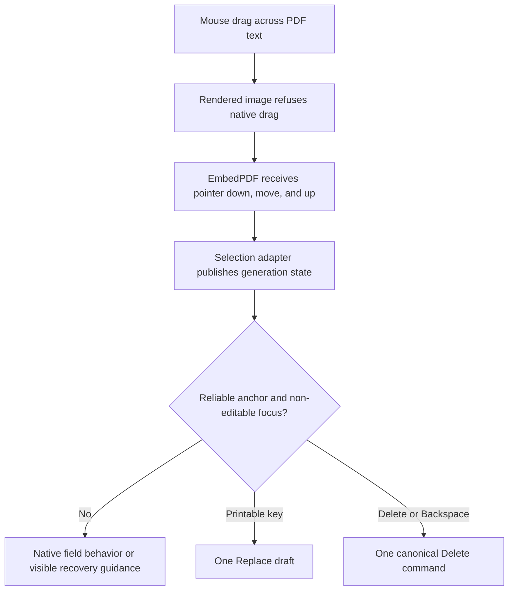

# Reliable PDF Text Selection and Proofread Commands - Plan

## Goal Capsule

- **Objective:** Make a normal mouse drag select PDF text reliably, then make typing and Delete or Backspace perform the promised Proofread actions without a native image-drag gesture stealing the interaction.
- **Product authority:** This focused Product Contract is authoritative for proofreading interaction. It supersedes the earlier plan's deliberate Proofread-mode requirement while retaining that plan's semantic anchors, commands, recovery, and delivery constraints as background authority.
- **Execution profile:** Lightweight code plan with three ordered units. U1 owns page interaction, U2 owns always-on proofreading gestures and their guards, and U3 owns production and embedded-browser proof.
- **Stop conditions:** Do not fork EmbedPDF, add a second text-selection implementation, or weaken semantic-anchor reliability. Stop and surface evidence if the public EmbedPDF 2.14.4 React seams cannot preserve the full pointer sequence in both Chrome and WebKit.
- **Open blockers:** None.

---

## Product Contract

### Summary

Repair the shared viewer so its rendered page image cannot begin a native browser drag.
Keep EmbedPDF selection geometry as the sole anchor source.
Remove Proofread mode so reliable selections and annotation tools are always ready for proofreading gestures.
Suppress gesture commands only while focus is inside an editable field or the current selection is not reliable.
Prove the whole gesture-to-command path with real mouse and keyboard input in the production review tree.

### Problem Frame

Each rendered PDF page currently contains a normal HTML `img` produced by EmbedPDF's `RenderLayer`.
The image has the browser default `draggable=true`, so dragging across a phrase can start an image drag before EmbedPDF receives a complete pointer sequence.
Without a reliable internal selection anchor, the existing keyboard controller correctly declines to open a Replace composer or create a Delete item, which makes the downstream features appear broken.
The separate Proofread-mode gate adds another invisible failure state without adding enough value for this personal productivity app.
Existing tests miss this failure because viewer tests stop after selection and command tests inject a synthetic anchor.

### Actor

- A1. Reviewer using a mouse and keyboard in the ordinary browser, Codex in-app browser, or another supported local browser surface.

### Requirements

**Pointer selection**

- R1. Dragging across text on a rendered PDF page shall not start the browser's native image-drag behavior.
- R2. A completed real mouse drag over reliable text shall produce the current EmbedPDF selection and canonical anchor, without deriving text or geometry from the DOM or retaining a superseded phrase while the new selection is resolved.
- R3. After a completed selection, the app shall receive the first proofreading keyboard intent from any non-editable focus target. It shall not force page focus unless a production-equivalent failing test proves that the existing event route loses the intent.

**Proofread commands**

- R4. With reliable text selected and focus outside an editable field, uninterrupted printable input shall open one Replace composer containing the exact typed string, and Apply shall create one Replace item and one revision increment for that phrase.
- R5. With reliable text selected and focus outside an editable field, Delete or Backspace shall create exactly one Delete item for that phrase and shall not trigger browser navigation or native content editing.
- R6. Proofreading commands shall be suppressed when focus is inside an input, textarea, contenteditable region, dialog editor, or other recognized editing host, or when the current selection is pending, cleared, or unreliable. In an editing host, typing and deletion shall retain their native field behavior.

**Availability and compatibility**

- R7. The interface shall not render a Proofread-mode toggle or inactive-mode status. Replace, Delete, Insert, Highlight, and Page Note shall remain available whenever their anchor preconditions are satisfied, with visible selection-readiness guidance when a requested command cannot run.
- R8. The repair shall work in the shared production tree in Chrome, WebKit, and the Codex in-app browser without changing canonical review commands, PDF anchor geometry, or source-annotation behavior.

### Key Flow

- F1. Select and edit a phrase
  - **Trigger:** A1 drags across a phrase and types a replacement or presses Delete or Backspace.
  - **Steps:** The rendered image refuses native dragging, EmbedPDF receives pointer down, move, and up, and the existing adapter produces a reliable anchor. The app accepts the keyboard intent when focus is not inside an editable field.
  - **Outcome:** The app opens one frozen Replace draft or persists one Delete command from the selected phrase.
  - **Covers:** R1-R8.

### Acceptance Examples

- AE1. Real drag followed by replacement
  - **Covers:** R1-R4, R8.
  - **Given:** A text-native PDF is open and no editable field has focus.
  - **When:** A1 drags across a phrase and immediately types `revised` without waiting for private selection state.
  - **Then:** No `dragstart` occurs, one Replacement text composer opens with exactly `revised`, and Apply creates one Replace item for the dragged phrase.
- AE2. Real drag followed by deletion
  - **Covers:** R1-R3, R5, R8.
  - **Given:** A second reliable phrase, distinct from AE1, is selected by a fresh mouse drag.
  - **When:** A1 presses Delete or Backspace.
  - **Then:** Exactly one Delete item for the second phrase is acknowledged and browser navigation does not occur.
- AE3. Command guards
  - **Covers:** R2, R6-R7.
  - **Given:** A1 has a reliable PDF selection, then focuses an editable field; separately, the viewer reports a pending or unreliable selection.
  - **When:** A1 types or presses Delete or Backspace in each state.
  - **Then:** The editable field keeps native typing and deletion with no review mutation; the non-reliable selection produces no mutation and visible recovery guidance; returning focus to a non-editable app target with a reliable selection makes the next proofreading gesture available without a mode toggle.
- AE4. Embedded browser regression
  - **Covers:** R8.
  - **Given:** The current source build is open in Codex's in-app browser.
  - **When:** A1 repeats AE1 and AE2 with a mouse and keyboard.
  - **Then:** Selection behaves like text selection rather than image dragging, and both commands complete through the same shared UI.

### Scope Boundaries

**Included**

- Native image-drag suppression on rendered PDF pages.
- Complete pointer-selection and first-key delivery through the existing EmbedPDF providers and review surface.
- Removal of Proofread-mode state, toggle UI, and mode-gated shortcuts.
- Always-on semantic tools with editable-focus and selection-reliability guards.
- Real-input regressions that connect the viewer selection to Replace and Delete commands.

**Deferred**

- Zoom controls, toolbar wrapping, and the stale opening-status message observed in the narrow Codex surface.
- Touch selection handles, stylus-specific interaction, OCR, and image-only PDF text recognition.
- A replacement selection engine, DOM-derived anchors, or a vendor fork of EmbedPDF.

### Success Criteria

- A1 can drag across the fixture phrase on the first attempt without seeing a ghost image or drag cursor.
- The same real selection drives Replace and Delete in the production tree without injected test state.
- Editable fields retain native behavior, while reliable PDF selections are immediately actionable everywhere else in the app.
- Chrome, WebKit, and a Codex in-app Browser smoke pass the repaired flow.

---

## Planning Contract

### Key Technical Decisions

- KTD1. **Prove the smallest native-drag boundary before layering fallbacks.** Start with a proof-first branch that makes only the rendered page image pointer-inert and lets `PagePointerProvider` receive the gesture. If real selection, empty-space clearing, Page Note placement, and annotation behavior all pass in Chrome and WebKit, keep that single boundary rule. If target identity proves necessary, keep the image pointer-active, pass `draggable={false}` through `RenderLayer`, add image-scoped `-webkit-user-drag: none` only for a demonstrated WebKit failure, and add wrapper `dragstart` cancellation only for a remaining named surface failure. Preserve a stable test marker and do not override EmbedPDF's image-load handler, which owns object-URL cleanup. Governs R1-R2.
- KTD2. **Preserve interaction semantics through acceptance evidence.** Keep `SelectionLayer` and annotation overlays non-interactive, and keep the page provider as the coordinate owner in either KTD1 branch. The branch decision must be based on real glyph selection, empty-space clearing, Page Note placement, source annotations, and owned annotations rather than an assumption about event-target identity. Do not add a DOM observer or vendor patch. Governs R2, R8.
- KTD3. **Route always-on gestures through the mounted review surface.** Keep the existing input controller as the semantic gate, but remove its Proofread-mode condition. Accept printable and deletion intents from non-editable targets while the review surface is mounted; reject editing hosts, composition intermediates, handled events, unsupported modifiers, and non-reliable anchors. First prove the joined keyboard path without changing focus. Add programmatic page focus or a scoped document listener only when a production-equivalent red test identifies that exact missing boundary, and keep the listener scoped to the active review mount. Do not add custom pointer capture. Governs R3-R6.
- KTD4. **Remove Proofread mode and keep semantic tools available.** Delete the mode state, toggle, inactive status, and shortcut gate. Keep Replace, Delete, Insert, Highlight, and Page Note available subject only to their anchor requirements and the KTD3 editing-host guard. Undo and redo remain the recovery mechanism for accidental commands. (session-settled: user-directed; rejected alternative: a deliberate Proofread-mode toggle) Governs R4-R7.
- KTD5. **Make selection authority explicit and generation-bound.** Define one project-owned selection update union with `cleared`, `pending`, `reliable`, and `unreliable` states, and include a monotonically increasing generation on every update across the `App` to `ProductionReviewApp` boundary. Publish `pending` synchronously when capture starts and `cleared` when the viewer reports no selection; publish a terminal result only when its generation is still current. Treat every state except current `reliable` as non-authoritative for mutations. Buffer at most one generation-bound pending keyboard command slot so immediate printable input or Delete is applied exactly once after that same generation becomes reliable; a Replace slot accumulates the uninterrupted printable sequence in order, while Delete or Backspace remains one non-accumulating intent. Discard the slot on clear, unreliable resolution, editing-host focus, or supersession, and keep IME composition under the existing input-controller contract. Governs R2, R4-R6, R8.

### High-Level Technical Design

### Implementation Constraints

- Use only the pinned public EmbedPDF 2.14.4 React and capability APIs.
- Preserve `captureViewerSelection`, anchor normalization, reliability checks, and canonical reducer semantics while exposing the KTD5 lifecycle at the existing viewer-to-production boundary.
- Keep source and owned annotation layers pointer-inert as they are today.
- Do not modify the unrelated source-first installer, Finder bridge, packaging manifests, or distribution documentation already changed in the working tree.

### Sequencing

U1 establishes page interaction and the first failing regression.
U2 removes Proofread mode and makes the existing semantic commands always available behind explicit reliability and editing-host guards.
U3 joins the real viewer and review shell, proves the anchor-readiness race with a deterministic delay, then runs cross-browser and embedded-surface proof.

### Risks and Responses

- **Browser event differences:** Chrome and WebKit can order native drag and pointer events differently. Run the same interaction matrix in both engines, keep the pointer-inert image only if all target-sensitive behaviors pass, and add each fallback separately behind a named failing regression.
- **Selection capture latency:** Text extraction is asynchronous, and the previous anchor currently remains usable while a new one is read. Clear stale authority as soon as a new generation starts, and use a deterministic delayed-capture test to exercise the first-key interval. The generation-bound bridge may release an intent only for the exact generation that becomes reliable; it must not use timing sleeps, private-state polling, or a prior phrase.
- **Keyboard event reachability:** The first key may target the page, body, or another non-editable control depending on browser focus behavior. Test the existing route first, then add only the smallest scoped focus or listener repair demonstrated by a red production-equivalent case. Every route must reject editable fields and preserve native field behavior.
- **False confidence from harnesses:** Synthetic anchors cannot prove this bug. U3 prohibits injected selection state for Replace and Delete acceptance.

### Sources and Research

- `docs/plans/2026-08-06-001-feat-local-pdf-proofreader-plan.md` supplies the earlier command, semantic-anchor, recovery, and delivery contracts; this plan explicitly supersedes its deliberate Proofread-mode requirement.
- `apps/web/src/pdf/PdfWorkspace.tsx` composes `PagePointerProvider`, `RenderLayer`, and `SelectionLayer` for every shared page.
- `apps/web/src/app/App.tsx` enables selection and converts EmbedPDF selections into generation-guarded canonical anchors.
- `apps/web/src/app/ReviewShell.tsx` and `apps/web/src/review/input-controller.ts` already produce the correct commands when a reliable anchor exists.
- `test/acceptance/viewer.spec.ts`, `test/acceptance/review-workflow.spec.ts`, and `test/acceptance/production-flow.spec.ts` reveal the current gap between real selection, injected commands, and the production tree.
- No `CONCEPTS.md` or `solutions/` learning corpus exists in the repository as of 2026-08-07.

---

## Implementation Units

### U1. Restore page pointer ownership

- **Goal:** Prevent native image dragging and keep the full mouse selection gesture inside EmbedPDF.
- **Requirements:** R1-R3, R6, R8; F1; AE1-AE3; KTD1-KTD3.
- **Dependencies:** None.
- **Files:**
  - `apps/web/src/pdf/PdfWorkspace.tsx`
  - `apps/web/src/pdf/pdf-workspace.css` (new only if the browser-specific style cannot remain clear and typed inline)
  - `test/acceptance/viewer.spec.ts`
- **Approach:**
  1. Add a proof-first assertion that the current rendered page can emit native image dragging and lose the selection pointer sequence.
  2. Test the KTD1 pointer-inert image branch first. If every KTD2 interaction passes, keep it as the sole drag boundary; otherwise preserve the failing test and add the pointer-active fallbacks one at a time in the stated order.
  3. Leave focus behavior unchanged for the first joined test. Add the smallest KTD3 focus or scoped-listener repair only if a reliable real selection still loses its first non-editable keyboard intent.
  4. Preserve the current layer order and pointer-inert owned/source annotation overlays.
- **Test Scenarios:**
  1. Assert the current rendered image can begin a native drag before production edits.
  2. Under the pointer-inert branch, perform a real mouse drag over the text fixture and assert zero native `dragstart` events and visible selection rectangles; U3 owns proof that the resulting canonical anchor and first keyboard intent match the phrase.
  3. Click empty page space, place a Page Note, and exercise supported and unsupported source annotations plus an owned annotation. Verify clearing, placement, navigation, and pointer-inert overlay behavior before selecting the branch.
  4. If the pointer-inert branch fails, prove the failure, restore a pointer-active image, and verify each added fallback removes the named failure without changing the other cases.
  5. Focus an editable field after the drag and assert that typing and deletion remain native and create no review mutation.
  6. Scroll and zoom to verify the chosen pointer boundary remains stable across viewport changes.
- **Verification:** `pnpm test:web` passes, including the real-pointer regression, with no anchor-geometry changes.

### U2. Remove Proofread mode and guard always-on commands

- **Goal:** Make proofreading gestures and annotation tools always available while preserving native editing behavior inside real input fields.
- **Requirements:** R3-R7; F1; AE1-AE3; KTD3-KTD4.
- **Dependencies:** U1.
- **Files:**
  - `apps/web/src/review/ReviewToolbar.tsx`
  - `apps/web/src/app/ReviewShell.tsx`
  - `apps/web/src/app/ProductionReviewApp.tsx`
  - `apps/web/src/app/review-layout.css`
  - `apps/web/test/review-layout.test.tsx`
  - `apps/web/test/proofread-gestures.test.tsx`
  - `test/acceptance/review-workflow.spec.ts`
- **Approach:**
  1. Remove `proofreadActive`, its toggle, inactive guidance, disabled-mode styling, and mode-gated command branches from the shared production tree.
  2. Keep all five semantic tools available according to their anchor requirements, and preserve current-tool pressed state independently of any mode.
  3. Centralize an `isEditableTarget` guard covering input, textarea, contenteditable, and the app's suggestion/comment editors. Apply it before printable, Delete, Backspace, and tool-shortcut capture so field input remains native.
  4. Treat only current reliable selection or caret anchors as mutation authority. Show concise pending and unreliable guidance when a gesture cannot run, without recreating an on/off mode.
  5. Preserve the current input controller's frozen draft, IME, composition, command serialization, and undo/redo behavior; Undo remains the recovery path for accidental always-on gestures.
- **Test Scenarios:**
  1. Render the shell and assert there is no Proofread toggle or inactive status and all five semantic tools expose their normal accessible names and anchor-based availability.
  2. With a reliable real or harness selection and non-editable focus, type a multi-character replacement and press Delete or Backspace in clean cases; verify the same one-command behavior without activation.
  3. Repeat printable, Delete, Backspace, and tool shortcuts from each supported editable host and during IME composition; verify zero review commands and unchanged native field behavior.
  4. Exercise pending, cleared, and unreliable selection states; verify zero mutation, no stale phrase reuse, and visible pending or reselect guidance.
  5. Verify toolbar state, selected phrase, composer draft, undo/redo, and viewer identity survive the existing 1024-pixel breakpoint and narrow drawer layout without mode state.
- **Verification:** `pnpm test:review` passes with always-on commands, editing-host guards, selection readiness, IME, focus, history, and responsive assertions intact.

### U3. Prove the complete real-input workflow

- **Goal:** Connect a real PDF mouse selection to production Replace and Delete commands across supported browser surfaces.
- **Requirements:** R1-R8; F1; AE1-AE4; KTD1-KTD5.
- **Dependencies:** U1 and U2.
- **Files:**
  - `test/acceptance/production-flow.spec.ts`
  - `apps/web/src/pdf/selection-state.ts` (new)
  - `apps/web/src/app/App.tsx`
  - `apps/web/src/app/ProductionReviewApp.tsx`
  - `apps/web/src/app/ReviewShell.tsx`
  - `apps/web/src/review/input-controller.ts` (only if pending-intent routing belongs in the pure controller)
  - `apps/web/test/selection-state.test.ts` (new)
  - `apps/web/test/proofread-gestures.test.tsx`
  - `test/acceptance/installed-hosts.md`
  - `package.json`
- **Approach:**
  1. Extend the installed-style production test to locate the real rendered page image, verify the selected KTD1 drag-boundary invariant, and drag over a known text fixture without setting selection state through a test seam.
  2. Add the KTD5 project-owned update type and expose it through the existing `App` to `ProductionReviewApp` boundary. Increment the generation before asynchronous capture, synchronously publish `pending` or `cleared`, ignore late terminal results from superseded generations, and clear mutation authority for every non-reliable state.
  3. Without any activation step, type a multi-character replacement immediately after mouse up, assert one composer with the exact value, Apply it, then drag a different phrase and assert one Delete command whose quote and geometry match that second phrase.
  4. Keep the existing Page Note, responsive state, Human Save, source digest, and Codex preparation checks in the same production tree.
  5. Add a test-only capture-delay seam at the selection adapter boundary. While the real pointer selection is pending, deliver a printable sequence and, in a separate clean case, Delete; release capture and require the exact generation-bound command slot to execute once. Prove that the Replace slot preserves the full ordered string and that clearing, unreliable resolution, editing-host focus, or a newer selection discards the slot. Do not add timing sleeps or poll private state.
  6. Add the selection-state unit test to the existing `test:review` Vitest file list so generation, terminal-result, and discard rules run under a documented gate.
  7. Run the full Replace and Delete flow in Chrome and WebKit with the generation-bound pending-intent bridge active only during a pending selection.
  8. Build the current source, start a clean isolated review, repeat AE1 and AE2 in Codex's in-app browser, and record the phrase, composer value, item count, and revision evidence.
- **Test Scenarios:**
  1. Perform AE1 as one uninterrupted image-originating drag and keyboard sequence on one production page instance. Do not remount, inject an anchor, call the selection callback, poll private state, or bypass the rendered image.
  2. Verify the composer value equals the full typed string with no missing or duplicate first character, then verify one Apply, one Replace item, one revision increment, and the dragged quote.
  3. Perform AE2 on a different phrase with Delete and Backspace in separate clean sessions. Verify one item, one revision increment, and the second phrase's quote and geometry per key.
  4. Perform AE3 from supported editable fields and every non-reliable selection state. Verify native field behavior, no command or browser navigation, no stale phrase reuse, and visible pending or reselect guidance; then return to reliable selection with non-editable focus and verify the next gesture succeeds without activation.
  5. Delay anchor capture deterministically after a real drag. Verify the full ordered printable sequence and pending Delete each release once for the matching reliable generation, while clear, unreliable, editing-host focus, and superseding updates release nothing and never reuse the prior phrase.
  6. Resize across 1024 pixels once with a completed selection and once with the Replace composer open. Verify the same viewer instance, selected quote, focus destination, exact draft value, and always-available toolbar survive.
  7. Repeat the full joined flow in WebKit and the evidence-recorded smoke in Codex's in-app browser.
- **Verification:** `pnpm test:review`, `pnpm test:e2e`, `pnpm test:e2e:webkit`, and the recorded Codex in-app Browser smoke all pass without injected anchors or arbitrary sleeps.

---

## Verification Contract

| Gate | Command or action | Units | Done signal |
|---|---|---|---|
| Static correctness | `pnpm typecheck` and `pnpm lint` | U1-U3 | No TypeScript diagnostics. |
| Viewer interaction | `pnpm test:web` | U1 | Real pointer selection is reliable and native drag is blocked. |
| Review behavior | `pnpm test:review` | U2, U3 | Always-on commands, editable-focus guards, selection generations, pending-command discard, typing, deletion, IME, focus, history, and responsive behavior pass. |
| Production Chrome flow | `pnpm test:e2e` | U3 | The shared production tree passes real selection, Replace, Delete, delivery, and existing end-to-end coverage. |
| Production WebKit flow | `pnpm test:e2e:webkit` | U1, U3 | The same installed-style gesture and command path passes in WebKit. |
| Codex embedded smoke | Build the current source, open the text-native fixture in Codex's in-app browser, and perform AE1 and AE2 | U3 | Mouse drag behaves as text selection and both commands are acknowledged. |

`pnpm validate:distribution` and macOS packaging validation are not required because this plan changes no runtime manifest or packaging artifact.

---

## Definition of Done

- R1-R8 and AE1-AE4 are satisfied through the shared production UI.
- U1 is complete when the image and wrapper invariants block native dragging while preserving reliable EmbedPDF selection and first-key delivery.
- U2 is complete when Proofread mode is absent, semantic tools remain available, reliable selections accept gestures immediately, and editable fields retain native behavior.
- U3 is complete when real mouse selections drive one Replace and one Delete in Chrome, WebKit, and a Codex in-app Browser smoke without injected anchor state.
- Existing anchor, IME, undo/redo, responsive, Page Note, Human Save, and Codex handoff tests remain green, with mode-specific assertions replaced by always-on and editing-host cases.
- No stale anchor, cross-generation pending intent, unscoped document-global keyboard interception, vendor patch, second selection engine, custom pointer capture, or timing sleep remains in the diff.
- All experimental or abandoned code from failed interaction approaches is removed before handoff.
