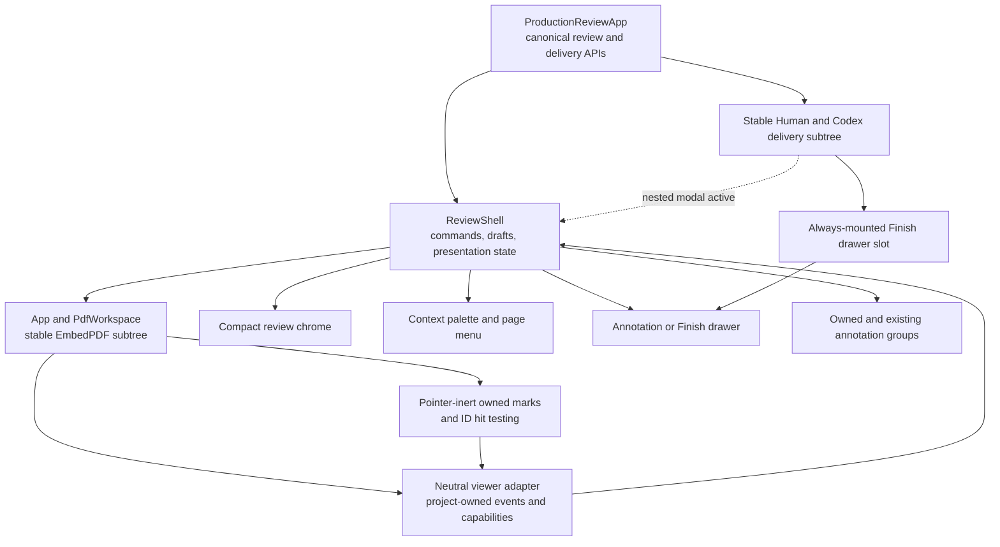
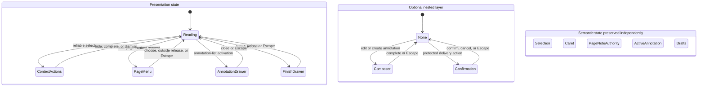
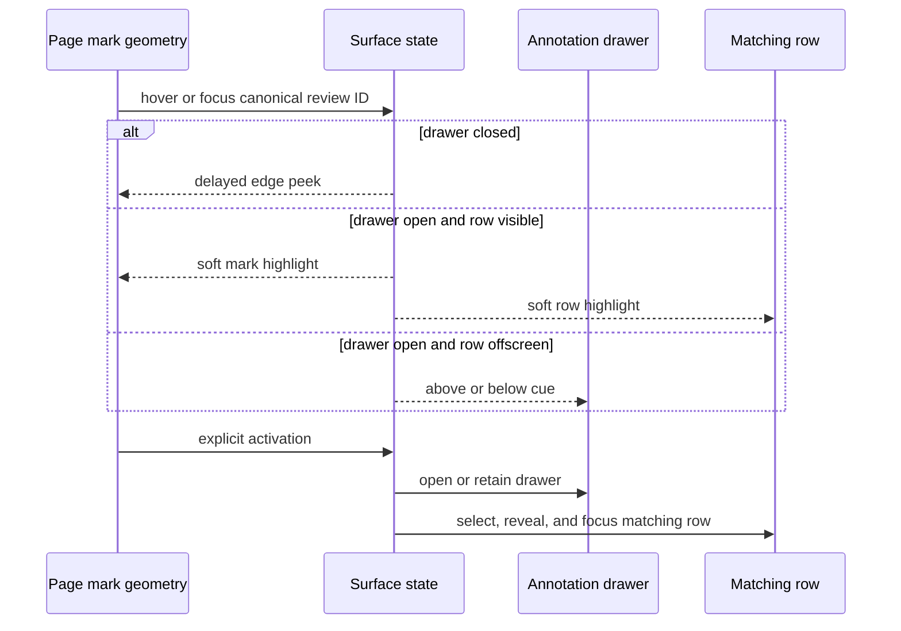

# Reading-First PDF Review Interface - Plan

## Goal Capsule

- **Objective:** Redesign the PDF Proofreader interface around uninterrupted reading while keeping markup, annotation review, and delivery easy to discover and use.
- **Product authority:** This contract owns the review shell, progressive disclosure, annotation peek and drawer behavior, Page Note entry, Finish Review flow, responsive behavior, and visual direction. The existing product plans remain authoritative for annotation semantics, recovery, exports, and the Codex handoff.
- **Open blockers:** None. Exact styling and implementation choices remain for planning, bounded by the curated mockups and this Product Contract.
- **Execution:** Code.

---

## Product Contract

### Summary

Create a reading-first review interface in which the PDF occupies nearly the entire available surface.
Reveal markup tools, annotation context, and delivery actions only when they are relevant, without shifting the document.

### Problem Frame

The current review surface gives permanent space to a toolbar and, on wide screens, a 22-rem annotation column.
Human and Codex delivery controls also remain mounted below the reader.
These controls make the product functional but compete with the document, weaken hierarchy, and reduce the space available for reading.

The reviewer primarily needs to read and mark a PDF.
Controls should support that activity without making the interface feel like a general-purpose editor or dashboard.

### Actors

- A1. **Reviewer:** Reads a PDF, creates and inspects annotations, and chooses a human or Codex delivery path from an ordinary browser, Codex, or VS Code.

### Key Decisions

- **Use a reading-first canvas.** (session-settled: user-directed — chosen over persistent-inspector and review-queue layouts: the PDF should receive nearly all available space.) Governs R1-R3, R17-R19.
- **Reveal review actions contextually.** (session-settled: user-directed — chosen over a persistent toolbar and current-tool control: controls should disappear until selection, caret placement, or a shortcut makes them relevant.) Governs R3-R5.
- **Use an edge peek and stable drawer correspondence.** (session-settled: user-approved — chosen over margin notes, anchored bubbles, and hover-driven scrolling: annotation context should appear without moving the PDF or list.) Governs R8-R13.
- **Open Page Note from the page context menu.** (session-settled: user-directed — chosen over a page-edge reveal and top-bar overflow entry: secondary-click keeps the canvas clean while preserving a location-specific action.) Governs R6-R7.
- **Use a Finish Review drawer.** (session-settled: user-directed — chosen over a modal and separate completion screen: the product should reuse one disclosure pattern and preserve document context.) Governs R14-R16.
- **Treat every required surface as first-class.** (session-settled: user-approved — chosen over desktop-first and embedded-first optimization: the same reading workflow should remain coherent in ordinary browsers, Codex, and VS Code.) Governs R17-R19.
- **Preserve curated mockups with the plan.** (session-settled: user-approved — chosen over leaving exploratory sketches outside the repository: implementers need a durable visual target without inheriting rejected alternatives.) Governs R20-R21.

The selected wireframes are [core reading states](../../.context/compound-engineering/ce-brainstorm-visual/ui-refresh-20260807/reading-first-core-states.html) and [drawer and contextual states](../../.context/compound-engineering/ce-brainstorm-visual/ui-refresh-20260807/reading-first-drawer-states.html).
They illustrate only the accepted direction.

### Requirements

**Reading-first shell**

- R1. The PDF workspace shall use all available content space except the compact global chrome needed for document, navigation, annotation-list, undo or redo, and Finish Review actions.
- R2. The PDF shall remain centered with only the padding needed to distinguish page edges and permit scrolling.
- R3. The reading state shall render neither a persistent review-tool toolbar nor a current-tool control.
- R4. Text selection, caret placement, or a review shortcut shall reveal only the actions relevant to that anchor without shifting the PDF.
- R5. Dismissing or completing a contextual action shall return to the uncluttered reading state while preserving the proofread gestures and keyboard paths defined by the existing interaction contract.

**Page Note**

- R6. Secondary-clicking a safe page location shall expose Add Page Note in a contextual page menu and anchor the resulting note to that location.
- R7. Page Note shall retain its visible keyboard shortcut and a lightweight discoverability cue without adding persistent canvas chrome.

**Annotation context and drawer**

- R8. The annotation list shall be hidden by default and open as a right-side overlay drawer without resizing or recentering the PDF.
- R9. Hovering or keyboard-focusing an annotated marking while the drawer is closed shall reveal a compact edge peek after a short delay.
- R10. The edge peek shall identify the annotation type and page and show its meaningful payload without obscuring the corresponding marking when space permits.
- R11. Activating a marking or its edge peek shall open the annotation drawer with the corresponding item selected.
- R12. When the drawer is open, hovering or focusing a marking shall suppress the edge peek and softly highlight both the marking and any visible matching list row without automatic scrolling.
- R13. When the matching row is outside the visible drawer region, the drawer shall show a quiet directional cue and move only after explicit activation.

**Finish and delivery**

- R14. Finish Review shall open a right-side overlay drawer rather than a modal or separate screen.
- R15. The Finish Review drawer shall present a concise review summary and the existing Reviewed PDF and Codex handoff actions as co-primary delivery paths.
- R16. Closing the Finish Review drawer shall resume reviewing without losing or changing review state.

**Responsive behavior and state**

- R17. The same interaction hierarchy shall work as a first-class experience in ordinary browsers, Codex, and VS Code.
- R18. A narrow surface may let an open drawer cover most of the PDF, but the drawer shall remain dismissible and shall not create a parallel mobile workflow.
- R19. Opening, closing, or reflowing overlays shall preserve page, zoom, scroll position, selection, active annotation, and any annotation draft or composer state.

**Visual direction and accessibility**

- R20. The curated wireframes linked above shall govern hierarchy, disclosure behavior, and spatial stability for this redesign.
- R21. Exact colors, typography, shadows, radii, and pixel measurements in the wireframes shall remain illustrative rather than normative.
- R22. Every hover behavior shall have a keyboard-focus equivalent, and no state or relationship shall depend on color alone.
- R23. Motion shall clarify state changes, avoid gratuitous animation, and respect reduced-motion preferences.

### Key Flows

- F1. Read and mark text
  - **Trigger:** A1 opens a PDF and begins reading.
  - **Actors:** A1.
  - **Steps:** The PDF fills the content surface; A1 selects text, places a caret, or invokes a shortcut; relevant review actions appear; A1 completes or dismisses the action.
  - **Outcome:** A1 returns to a clean reading state with the annotation recorded.
  - **Covers:** R1-R5.
- F2. Inspect an annotation with the drawer closed
  - **Trigger:** A1 hovers or focuses an annotated marking.
  - **Actors:** A1.
  - **Steps:** The edge peek appears after a short delay; A1 reads the annotation context and may activate it.
  - **Outcome:** The context is readable without moving the PDF, and activation opens the selected annotation in the drawer.
  - **Covers:** R8-R11, R22-R23.
- F3. Correlate markings with an open drawer
  - **Trigger:** A1 opens the annotation drawer and hovers or focuses a marking.
  - **Actors:** A1.
  - **Steps:** The marking and visible matching row highlight together; an offscreen match produces a directional cue; explicit activation moves to the row.
  - **Outcome:** A1 preserves list position during exploration and navigates only by intent.
  - **Covers:** R8, R12-R13, R22.
- F4. Add a Page Note
  - **Trigger:** A1 secondary-clicks a safe page location or invokes the Page Note shortcut.
  - **Actors:** A1.
  - **Steps:** Secondary-click exposes Add Page Note at the chosen location, while the shortcut enters the equivalent placement path; A1 completes the existing note composer.
  - **Outcome:** A Page Note is anchored without requiring persistent tools.
  - **Covers:** R6-R7.
- F5. Finish and deliver a review
  - **Trigger:** A1 chooses Finish Review.
  - **Actors:** A1.
  - **Steps:** The Finish Review drawer opens over the anchored PDF; A1 chooses Reviewed PDF or Codex handoff, or closes the drawer to continue reviewing.
  - **Outcome:** Delivery remains clear without occupying the reading surface between uses.
  - **Covers:** R14-R16.
- F6. Continue on a narrow surface
  - **Trigger:** The viewport narrows or A1 opens a drawer in an embedded surface.
  - **Actors:** A1.
  - **Steps:** The interface compacts; the drawer may cover the PDF; A1 dismisses it after acting.
  - **Outcome:** The exact reading and draft state returns across the transition.
  - **Covers:** R17-R19.

### Acceptance Examples

- AE1. Uncluttered reading state
  - **Covers R1-R3.**
  - **Given:** A text-native PDF is open with no active selection or composer.
  - **When:** A1 reads and scrolls the document.
  - **Then:** The PDF remains centered and nearly edge-to-edge, with no persistent review toolbar, current-tool control, annotation list, or delivery panel.
- AE2. Contextual text actions
  - **Covers R4-R5.**
  - **Given:** A1 is in the uncluttered reading state.
  - **When:** A1 selects reliable text.
  - **Then:** Only selection-relevant review actions appear, and clearing the selection removes them without changing page position.
- AE3. Edge peek
  - **Covers R9-R11, R22-R23.**
  - **Given:** The annotation drawer is closed and a page marking is visible.
  - **When:** A1 hovers or keyboard-focuses the marking.
  - **Then:** A delayed edge peek identifies the annotation without shifting the page, and activation opens its selected drawer item.
- AE4. Stable open-drawer correspondence
  - **Covers R12-R13.**
  - **Given:** The annotation drawer is open with several items.
  - **When:** A1 hovers a marking whose row is visible and then a marking whose row is offscreen.
  - **Then:** The visible pair highlights without scrolling, while the offscreen match produces a directional cue until A1 activates it.
- AE5. Page Note without persistent tools
  - **Covers R6-R7.**
  - **Given:** No text is selected and the reading canvas is clean.
  - **When:** A1 secondary-clicks a safe page location and chooses Add Page Note.
  - **Then:** The note composer opens for that location, and the shortcut provides the equivalent keyboard path.
- AE6. Finish Review drawer
  - **Covers R14-R16.**
  - **Given:** The review contains annotations.
  - **When:** A1 chooses Finish Review.
  - **Then:** A right-side drawer shows the review summary and both delivery paths while the PDF remains anchored behind it.
- AE7. Responsive restoration
  - **Covers R17-R19.**
  - **Given:** A1 has a zoom level, scroll position, selection, and annotation draft in a narrow embedded surface.
  - **When:** A1 opens and closes a drawer or the surface crosses its responsive breakpoint.
  - **Then:** The exact reading, selection, and draft state returns without a separate workflow.

### Success Criteria

- The default reading state reserves no permanent content column or row for review tools, the annotation list, or delivery panels.
- Opening and closing every overlay leaves the PDF at the same page, zoom, and scroll position.
- Replace, Delete, Insert, Highlight, Page Note, annotation inspection, and both delivery paths remain reachable by pointer and keyboard.
- Ordinary-browser, Codex, and VS Code layouts share the same interaction hierarchy and state model.
- A planner can map every load-bearing layout and disclosure requirement to one of the two curated wireframes without consulting rejected exploratory sketches.

### Scope Boundaries

- This plan does not change the meaning, anchoring, editing, ordering, persistence, recovery, or export format of annotations.
- This plan does not change the Reviewed PDF or Codex handoff contracts.
- This plan does not add new review tools, OCR, general PDF editing, or new launch surfaces.
- The visual redesign includes hierarchy, spacing, typography, color, focus, and motion polish, but it does not require literal reproduction of the mockup styling.

### Sources and Research

- `apps/web/src/app/ReviewShell.tsx` and `apps/web/src/review/ReviewToolbar.tsx` show the current persistent review toolbar and annotation-list composition.
- `apps/web/src/app/review-layout.css` defines the current wide 22-rem annotation column and narrow off-canvas list.
- `apps/web/src/app/ProductionReviewApp.tsx` mounts Human and Codex delivery controls below the review shell.
- `docs/plans/2026-08-06-001-feat-local-pdf-proofreader-plan.md` remains the product authority for the shared interface, markup model, recovery, and two delivery paths.
- `docs/plans/2026-08-07-001-fix-pdf-text-selection-commands-plan.md` remains the product authority for always-ready proofread gestures and visible keyboard paths.

---

## Planning Contract

**Product Contract preservation:** Product Contract unchanged.

### Key Technical Decisions

- KTD1. **Use one mounted review-surface presentation state machine.** (session-settled: user-approved — chosen over independent overlay booleans: one state owner gives drawers, contextual surfaces, and nested dialogs a deterministic dismissal and focus order.) `ReviewShell` owns `baseSurface` (`reading`, contextual actions, page menu, annotation drawer, or Finish drawer), an orthogonal optional `nestedLayer`, and focus-return metadata. Selection, caret, Page Note placement authority, active annotation ID, command state, and drafts remain independent semantic state; hiding a palette or opening a drawer must not clear them. Escape clears the nested layer first, then the base surface, and restores focus to the canonical logical trigger. Governs R3-R5, R8, R14-R16, R19, R22.
- KTD2. **Keep one viewer mounted below non-sizing overlays and behind a neutral adapter boundary.** (session-settled: user-directed — chosen over persistent layout columns and below-reader delivery panels: the PDF must receive the content surface.) `App` and `PdfWorkspace` publish project-owned viewer event and capability DTOs upward through props; PDF modules never import review-shell state or EmbedPDF types into `ReviewShell`. The compact chrome and every drawer, peek, menu, palette, and dialog remain siblings or descendants of the stable viewer subtree. Opening a surface changes visibility and interactivity, not grid tracks, viewer keys, engine instances, plugin registrations, or document identity. Governs R1-R3, R8, R14, R17-R21.
- KTD3. **Drive compact chrome from public viewer capabilities.** Observe current page, page count, zoom, and scroll through the pinned EmbedPDF capabilities. Keep previous/next page and zoom controls in the compact chrome with Undo, Redo, annotation count, and Finish Review. Do not use CSS scaling, DOM scraping, or a second viewer-state model. Governs R1-R2, R17-R19.
- KTD4. **Anchor contextual text actions through the public selection seam and a project-owned caret seam.** (session-settled: user-directed — chosen over a persistent toolbar and current-tool control: text actions exist only while a valid anchor exists or a shortcut is being handled.) Use selection completion for Replace, Delete, and Highlight placement. For Insert, treat the existing engine-backed `extractText` plus `getPageTextRects` output as the only glyph-geometry authority: normalize the page event into the same unrotated, unscaled, pre-crop page space used by `createCaretAnchor`; monotonically align each rectangle's `content` to one contiguous offset range in `extractedText`; and form caret candidates only at exact mapped rectangle edges (or before/after an atomic one-character rectangle according to its midpoint). Do not estimate internal character widths inside a multi-character rectangle. Accept the nearest same-line candidate only within the lesser of 6 page units and half that rectangle's height; reject out-of-tolerance points, non-unique text alignment, overlapping candidates with different offsets, tied nearest candidates, invalid geometry, and unsupported reading order. Return a typed reliable anchor or diagnostic result to `ReviewShell`; a failure clears the caret surface, exposes no Insert action, and announces the existing unavailable message once. The pinned selection menu placement is the preferred selection-palette seam; characterize its exact local contract before broad UI work and fall back only to public formatted-selection geometry. Governs R3-R5.
- KTD5. **Handle Page Note through scoped page DOM events and invocation-scoped placement authority.** (session-settled: user-directed — chosen over page-edge and top-bar entry: the action belongs to the page location.) Use the page provider's React context-menu event because EmbedPDF 2.14.4 exposes no public context-menu interaction event. Convert the invocation point to canonical PDF space once and suppress the native menu only for a safe page target. A `PageNotePlacementAuthority` has exactly two sources: a single-use context-menu point valid only while that menu invocation remains open, or a visible keyboard placement cursor bound to the current document, page, and viewport generation. Ordinary clicks never create remembered Page Note authority, and the global Page Note shortcut always enters keyboard placement rather than reusing pointer history. Consume a context-menu point when its Add Page Note action opens the composer; invalidate it on menu dismissal. Consume the keyboard cursor on Enter or pointer release; invalidate it on cancellation, composer completion, document replacement or close, or surface supersession. Reinitialize rather than reuse the keyboard cursor when page, scroll, zoom, rotation, or layout generation changes. Governs R6-R7, R19, R22.
- KTD6. **Use canonical review IDs and geometric hit testing for owned marks.** (session-settled: user-approved — chosen over margin notes, anchored bubbles, and hover-driven scrolling: correspondence must not disturb reading.) Keep rendered mark rectangles pointer-inert so text selection can pass through them. Resolve hover, focus, click, and touch intent by page-space hit testing grouped by canonical review ID, with one keyboard target per logical annotation. Persist IDs and PDF geometry rather than virtualized DOM nodes. Governs R9-R13, R19, R22.
- KTD7. **Put both annotation populations in one hidden drawer with different capabilities.** (session-settled: user-approved — chosen over dropping the existing inventory or keeping it persistently visible: all annotations remain reachable without occupying reading space.) Owned review items support peek, reciprocal correspondence, selection, edit, delete, and navigation. Existing PDF annotations appear in a separate read-only group with page navigation; they do not acquire edit semantics or owned-mark correspondence. Governs R8-R13, R20-R22.
- KTD8. **Keep delivery workflows mounted in a nonmodal Finish Review drawer.** (session-settled: user-directed — chosen over a modal and separate completion screen: delivery keeps document context and one disclosure pattern.) `ProductionReviewApp` continues to instantiate Human and Codex delivery and passes that stable subtree through an always-mounted Finish-drawer slot; disclosure changes hidden, inert, and interactive state rather than component identity. A narrow registration callback reports only whether a delivery confirmation is the active nested modal, without leaking delivery phases or API state into the surface reducer. The drawer does not trap focus; existing Replace Original and Codex confirmation surfaces remain modal alert dialogs above it. Empty reviews retain Finish and Discard lifecycle actions while both delivery paths use their existing disabled explanation. Governs R14-R16, R19, R22.
- KTD9. **Match semantics to behavior and make motion optional.** The selection surface is a nonmodal toolbar, the page surface is a menu, both drawers are labelled nonmodal complementary regions, the edge peek is an interactive preview rather than a tooltip, and existing composers and safety confirmations remain modal dialogs. Hover always has a focus equivalent, transient correspondence does not move focus or emit live-region chatter, pointer activation completes on release, and reduced-motion mode removes spatial transitions. Governs R4, R7-R13, R17-R23. Follow [WAI-ARIA tooltip guidance](https://www.w3.org/WAI/ARIA/apg/patterns/tooltip/), [WAI-ARIA dialog guidance](https://www.w3.org/WAI/ARIA/apg/patterns/dialog-modal/), and WCAG guidance for [hover or focus content](https://www.w3.org/WAI/WCAG22/Understanding/content-on-hover-or-focus.html), [pointer cancellation](https://www.w3.org/WAI/WCAG22/Understanding/pointer-cancellation.html), [reflow](https://www.w3.org/WAI/WCAG22/Understanding/reflow.html), and [reduced motion](https://www.w3.org/WAI/WCAG22/Techniques/css/C39).
- KTD10. **Retain one shared web tree across every host.** (session-settled: user-approved — chosen over desktop-first and embedded-first implementations: browser, Codex, and VS Code must expose the same hierarchy.) Host differences remain launch and viewport concerns. No native or embedded-only review UI is added. Use resilient role/name and canonical-ID locators per [Playwright locator guidance](https://playwright.dev/docs/locators). Governs R17-R19, R22.

### High-Level Technical Design

The reader stays mounted while review-surface state coordinates compact chrome, page interactions, annotations, and delivery.

The base surface is exclusive, while nested modal state and semantic review state are orthogonal. Dismissal changes presentation without erasing the active selection, caret, annotation, Page Note authority, or draft.

Annotation correspondence separates transient exploration from explicit navigation.

### Implementation Constraints

- Preserve `ReviewShell` command serialization, frozen draft behavior, input-host guards, IME handling, live announcements, undo, redo, and composer focus restoration.
- Preserve `ProductionReviewApp` as the owner of canonical `ReviewState`, viewer registry, session API wiring, and delivery callbacks.
- Keep dependency direction one-way: `App` and `PdfWorkspace` emit normalized project-owned events and capability facades through props; `ReviewShell` consumes them; PDF modules never import `review-surface-state`, shell components, or delivery components. Do not expose EmbedPDF plugin objects outside the PDF adapter layer.
- Keep semantic anchors and canonical review data outside the presentation reducer. Surface transitions may hide contextual UI but may not clear selection, caret, Page Note authority, active annotation, drafts, or delivery-local state unless the semantic action itself requires it.
- Keep `baseSurface` and `nestedLayer` orthogonal. Nested composers and confirmations unwind first, and focus recovery resolves a canonical annotation ID or logical control when a virtualized DOM trigger no longer exists.
- Use the pinned EmbedPDF 2.14.4 public selection, scroll, viewport, zoom, and page-provider seams. Official documentation is available for [selection](https://www.embedpdf.com/docs/react/headless/plugins/plugin-selection), [scroll](https://www.embedpdf.com/docs/react/headless/plugins/plugin-scroll), and [zoom](https://www.embedpdf.com/docs/react/headless/plugins/plugin-zoom); local package types govern exact 2.14.4 payloads when the site differs.
- Treat a review item ID as one-to-many DOM geometry because a multiline annotation produces several rectangles and the virtual scroller may unmount them.
- Render every PDF-derived and annotation-derived string as text. Keep icons, fonts, and other visual assets locally bundled; the mockups' remote rendering dependencies are not production dependencies.
- Scope full-height and margin-reset CSS to the production root and review shell so standalone viewer harness behavior remains intentional.

### Risks and Dependencies

- **Selection-menu API shape:** The pinned viewer exposes selection-menu placement, but its exact render contract is weakly surfaced. Characterize the local type/runtime seam first; the defined fallback uses public formatted-selection geometry rather than DOM selection scraping.
- **Selection through marks:** A full pointer-active annotation rectangle can steal drag selection. KTD6 and a real pointer regression are release gates.
- **Virtualized focus targets:** A mark can unmount while focused. Preserve the canonical ID and return focus to the matching drawer row or current page container when the original node no longer exists.
- **Nested delivery state:** Closing the Finish drawer during preparation or result checking must not cancel or reset local delivery state. Destructive confirmation remains explicit and modal.
- **Host viewport variance:** Browser engines and embedded viewports may differ in focus, context-menu, and selection behavior. Chromium, WebKit, Codex, and VS Code checks are required at the interaction boundaries, not through separate implementations.

---

## System-Wide Impact

- **State lifecycle:** Canonical `ReviewState`, recovery data, command history, and persisted delivery outputs remain unchanged. The new presentation reducer is memory-only and lives in the existing mounted review tree; it does not become a second source of annotation truth.
- **Viewer boundary:** EmbedPDF selection, page, viewport, scroll, and zoom capabilities are normalized into project-owned event and control contracts before they reach `ReviewShell`. Viewer virtualization and plugin instances remain private to the PDF layer.
- **Annotation populations:** Owned review items remain interactive and exportable. Source PDF annotations remain a separate read-only inventory. Moving both into one drawer changes presentation only, not projection, source inventory, ordering, recovery, or export schemas.
- **Delivery boundary:** `ProductionReviewApp` continues to own API wiring and instantiate both delivery state machines. An always-mounted content slot moves their presentation into the Finish drawer without changing service routes, payloads, confirmation rules, or local async state.
- **Host parity:** Browser, Codex, and VS Code continue to load the same production route and web tree. VS Code panel disposal remains an existing host recovery lifecycle; this plan guarantees state across in-app overlays and reflow, not after host disposal.
- **Performance:** Owned-mark hit testing indexes only rectangles on rendered pages and reuses canonical geometry. Do not scan every annotation in the document on each pointer move or retain virtualized DOM nodes.
- **Accessibility:** Interactive surfaces use behavior-matched roles, explicit labels and focus return, non-color correspondence cues, keyboard/touch equivalents, and reduced-motion variants. Only nested composers and protected confirmations are modal.
- **Packaging and operations:** No runtime manifest, install asset, launch adapter, remote dependency, export format, or service API change is expected. Existing distribution validation remains out of scope unless implementation crosses one of those boundaries.

---

## Implementation Units

### U1. Establish the stable reading surface and compact chrome

**Goal:** Establish the mounted reader, compact global controls, presentation reducer, and stable overlay slots that later units populate without remounting the PDF.

**Requirements:** R1-R2, R14, R17-R23; F5-F6; AE6-AE7; KTD1-KTD3, KTD8-KTD10.

**Dependencies:** None.

**Files:**

- `apps/service/src/server/http-server.ts`
- `apps/web/src/production-entry.tsx`
- `apps/web/src/app/App.tsx`
- `apps/web/src/app/ProductionReviewApp.tsx`
- `apps/web/src/app/ReviewShell.tsx`
- `apps/web/src/app/review-layout.css`
- `apps/web/src/review/ReviewChrome.tsx` (new)
- `apps/web/src/review/review-surface-state.ts` (new)
- `apps/web/src/pdf/viewer-controls.ts` (new)
- `apps/web/src/pdf/viewer-interaction-events.ts` (new)
- `apps/web/src/pdf/PdfWorkspace.tsx`
- `apps/web/test/review-layout.test.tsx`
- `apps/web/test/review-surface-state.test.ts` (new)
- `apps/web/test/production-review-app.test.tsx`
- `package.json`

**Approach:**

1. Move the document title and saved state into compact chrome, remove the redundant viewer heading and orphaned bootstrap loading paragraph, and create non-sizing hosts for contextual UI, both drawers, and nested layers. Keep the existing toolbar and annotation inventory reachable until U2 and U3 replace them; do not delete `ReviewToolbar.tsx` in this unit.
2. Introduce the KTD1 pure presentation reducer and trigger registry in `ReviewShell`. Model `baseSurface` and optional `nestedLayer` separately from selection, caret, Page Note authority, active annotation, drafts, and delivery-local state.
3. Have `ProductionReviewApp` continue instantiating Human and Codex delivery and pass the subtree into an always-mounted Finish-drawer slot. Remove the below-reader delivery layout by changing visibility and inert state, not component identity; U4 completes the drawer content hierarchy and protected-action integration.
4. Normalize viewer page, zoom, scroll, readiness, and interaction events in project-owned PDF adapter contracts. Feed chrome state and actions upward through props without importing surface state into PDF modules or recreating the viewer configuration.
5. Make the shell and viewer fill the production root. Replace the fixed `70vh` and 480-pixel reader constraints with parent-sized layout and minimal page-edge padding.
6. Update the hard-coded `test:web` and `test:review` script file lists whenever this unit adds a test so the documented gates actually execute it.

**Patterns to follow:** Existing `ReviewShell` command/draft ownership, `ProductionReviewApp` viewer registry, and public EmbedPDF capability access.

**Test scenarios:**

1. Render the production foundation and verify compact chrome and the stable viewer occupy the new full-height surface, the delivery subtree no longer consumes a below-reader row, and the temporary toolbar or inventory does not become a second state owner.
2. Toggle each base surface and verify only one is active, semantic anchors remain unchanged, the viewer component and registry remain mounted, and opening a surface does not change viewer layout tracks.
3. Change current page and zoom through viewer capabilities and verify compact chrome follows the public state; use chrome navigation and verify the same document instance moves.
4. Initialize with page, zoom, or scroll capability absent and not ready. Verify the relevant controls are disabled with an accessible explanation, no exception or shadow state occurs, and controls recover when the public capability becomes ready.
5. Verify the Human and Codex components keep the same mounted identity while their Finish slot is hidden, shown, and hidden again; protected confirmation behavior is specified and tested in U4.
6. Render the standalone viewer path and production path and verify scoped full-height styles do not remove the standalone recovery messages or existing viewer-only behavior.

**Verification:** The reader foundation is full-height, compact controls fail safely around viewer readiness, presentation state is exclusive without owning semantic state, delivery has a stable hidden slot, and the viewer does not remount during disclosure changes. U2 and U3 remove the remaining transitional toolbar and inventory chrome.

### U2. Add contextual text actions, reliable caret placement, and Page Note entry

**Goal:** Reveal only anchor-relevant review actions and provide fresh pointer and keyboard placement for Insert and Page Note without a persistent tool mode.

**Requirements:** R3-R7, R19, R22-R23; F1, F4; AE2, AE5, AE7; KTD1, KTD4-KTD5, KTD9.

**Dependencies:** U1.

**Files:**

- `apps/web/src/app/App.tsx`
- `apps/web/src/app/ProductionReviewApp.tsx`
- `apps/web/src/app/ReviewShell.tsx`
- `apps/web/src/app/review-layout.css`
- `apps/web/src/pdf/PdfWorkspace.tsx`
- `apps/web/src/pdf/viewer-interaction-events.ts`
- `apps/web/src/pdf/selection-anchor.ts`
- `apps/web/src/pdf/viewer-selection-adapter.ts`
- `apps/web/src/review/ReviewToolbar.tsx` (remove)
- `apps/web/src/review/review-actions.ts` (new)
- `apps/web/src/review/ContextActionPalette.tsx` (new)
- `apps/web/src/review/PageActionMenu.tsx` (new)
- `apps/web/src/review/review-surface-state.ts`
- `apps/web/test/selection-anchor.test.ts`
- `apps/web/test/proofread-gestures.test.tsx`
- `apps/web/test/review-layout.test.tsx`
- `apps/web/test/review-surface-state.test.ts`
- `test/acceptance/review-harness/main.tsx`
- `test/acceptance/review-workflow.spec.ts`
- `package.json`

**Approach:**

1. Move shortcut metadata and direct action dispatch out of `ReviewToolbar`, stop rendering and delete that module, and remove presentation-only `currentTool` state while preserving editable-host guards, pending-selection buffering, IME handling, and current reliable-anchor authority.
2. Render Replace, Delete, and Highlight from the completed reliable selection placement. Add a project-owned caret hit-test helper that consumes the engine-backed page text rectangles already read by `createEngineAnchorPageReader`, aligns their content monotonically to `extractedText`, and applies KTD4's coordinate, tolerance, ambiguity, and failure rules before calling `createCaretAnchor`. Render Insert only from that reliable result. Propagate the typed diagnostic through the neutral viewer adapter to `ReviewShell`; clear the surface when the anchor clears, becomes unreliable, or is superseded, and deduplicate its accessible unavailable announcement.
3. Handle secondary-click on a safe page target, retain its client position only for menu placement, and retain its canonical PDF point only for that invocation. Reject owned marks, source annotation UI, selection controls, contextual UI, and points outside the page. Show the Page Note shortcut in the menu and let Context Menu or Shift+F10 open the same menu from a focused page target.
4. Implement KTD5's two-source `PageNotePlacementAuthority`. The context menu owns its canonical point only until its Add Page Note action consumes it or the menu closes. The global shortcut never reads pointer history: it focuses the current or nearest visible page and enters a transient keyboard placement state with a visible cursor initialized at that page's visible center. Arrow keys move the cursor in canonical page space; page, scroll, zoom, rotation, or layout changes create a new viewport generation and reinitialize it from the newly visible center; Enter consumes it and opens the composer; and Escape cancels and restores focus. Pointer release may consume the active keyboard-placement state, but ordinary page clicks never cache a future authority. Document replacement or close, surface supersession, and composer completion invalidate either source. Keep the cue transient rather than adding a persistent Page Note button.
5. Update the hard-coded `test:web` and `test:review` script file lists to include every new selection, surface-state, and interaction test.

**Execution note:** Begin with a narrow characterization test for the pinned selection-menu placement seam and the page-coordinate transform. Use the public-geometry fallback only if that test proves the preferred seam insufficient.

**Patterns to follow:** `SelectionReadAuthority`, `createCaretAnchor`, `captureViewerSelection`, `createProofreadInputController`, and `CommentComposer` focus restoration.

**Test scenarios:**

1. Covers AE2. Complete a reliable text selection and verify only Replace, Delete, and Highlight appear after selection completion; clearing or superseding the selection removes the palette without changing page position.
2. Click a reliable boundary between atomic mapped text rectangles on unrotated and rotated/zoomed pages and verify one caret anchor, only Insert appears, and typing or activating Insert creates one canonical insertion with the expected adjacent context. Exercise a multi-character rectangle, ambiguous/overlapping mappings, an equal-distance tie, invalid geometry, and a point beyond the bounded same-line tolerance; verify no proportional internal offset is invented, no Insert action appears, and one accessible unavailable message is emitted per failed attempt.
3. Invoke every existing semantic shortcut with valid anchors and verify direct command behavior remains unchanged; repeat inside each supported editable host and during IME composition and verify no review command runs.
4. Covers AE5. Secondary-click a safe rotated and zoomed page location, choose Add Page Note, and verify the canonical point is transformed once and the composer restores focus on dismissal.
5. Secondary-click a mark, source-annotation control, selection UI, contextual surface, and off-page point and verify the app does not suppress the browser menu or create a Page Note anchor.
6. Open the page context menu and verify Add Page Note consumes that invocation's canonical point exactly once; dismiss it by Escape and outside interaction and verify the point becomes unusable. In a keyboard-only session with no prior pointer input, invoke the global shortcut, move the visible placement cursor, change pages, press Enter, and verify one note uses the new page's canonical coordinates. Repeat across scroll, zoom, rotation, and layout changes and verify the cursor reinitializes instead of reusing stale coordinates; repeat with Escape, surface supersession, document replacement, and composer completion and verify authority invalidation, focus restoration, and no extra mutation.
7. Resize while the selection palette, Page Note menu, or an unsaved composer is open and verify the semantic anchor, text, and focus intent survive without duplicate commands.

**Verification:** Selection, caret, shortcuts, and Page Note expose only relevant transient UI, preserve current command semantics, and never use stale or unsafe placement authority.

### U3. Build annotation peek, correspondence, and the hidden all-annotations drawer

**Goal:** Make owned markings easy to inspect and correlate while keeping both owned and existing PDF annotations out of the reading layout until requested.

**Requirements:** R8-R13, R17-R23; F2-F3, F6; AE3-AE4, AE7; KTD1-KTD2, KTD6-KTD7, KTD9-KTD10.

**Dependencies:** U1 and U2.

**Files:**

- `apps/web/src/app/App.tsx`
- `apps/web/src/app/ProductionReviewApp.tsx`
- `apps/web/src/app/ReviewShell.tsx`
- `apps/web/src/app/review-layout.css`
- `apps/web/src/pdf/existing-annotations.ts`
- `apps/web/src/pdf/PdfWorkspace.tsx`
- `apps/web/src/pdf/owned-overlay.ts`
- `apps/web/src/pdf/owned-mark-hit-test.ts` (new)
- `apps/web/src/pdf/viewer-interaction-events.ts`
- `apps/web/src/review/AnnotationList.tsx`
- `apps/web/src/review/AnnotationPeek.tsx` (new)
- `apps/web/src/review/review-surface-state.ts`
- `apps/web/test/annotation-projection.test.ts`
- `apps/web/test/owned-overlay.test.ts`
- `apps/web/test/owned-mark-hit-test.test.ts` (new)
- `apps/web/test/production-review-app.test.tsx`
- `apps/web/test/review-layout.test.tsx`
- `apps/web/test/review-surface-state.test.ts`
- `test/acceptance/review-harness/main.tsx`
- `test/acceptance/review-workflow.spec.ts`
- `package.json`

**Approach:**

1. Group every projected rectangle by canonical review ID. Keep visible rectangles pointer-inert and use page-coordinate hit testing plus one logical focus proxy per annotation so multiline marks do not create repeated tab stops or block drag selection.
2. Register page-level pointer down, move, up, and cancel events through the neutral viewer adapter. Feed canonical PDF coordinates into `owned-mark-hit-test`, distinguish activation from drag selection with the existing movement threshold, and cancel when pointer capture is lost or release occurs outside the candidate geometry. Resolve overlapping rectangles by visible overlay paint order, then canonical ID as a deterministic tie-breaker; do not scan annotations on unrendered pages.
3. Store transient corresponding ID separately from persistent active ID. With the drawer closed, show a delayed, hoverable edge preview derived from the canonical `ReviewItem` payload; focus shows the same preview without requiring hover.
4. Extend the annotation list's existing row-ref map with visibility measurement. Highlight a visible match without scrolling. Show an above or below cue for an offscreen match. Scroll and focus only after explicit activation.
5. Reuse the existing `ExistingAnnotation` DTO, `inventoryExistingAnnotations`, and `inventoryDocumentAnnotations`; do not introduce a parallel summary model. Extend `App` with a typed discovery callback while retaining its explicit `existingAnnotations` input for harnesses. Isolate document inventory from viewer initialization so a discovery rejection cannot prevent PDF reading. Tag each request with the current document/session generation and report a discriminated `loading`, `ready`, `empty`, or `error` result; ignore late results from a superseded generation. Let `ProductionReviewApp` hoist that view-only result and pass it to `ReviewShell` as a group distinct from canonical owned `ReviewItem`s. A ready result preserves source subtype, page, contents, and navigation without edit, delete, peek, or owned-mark state; empty renders the genuine empty state; error keeps the viewer usable and renders an accessible Existing annotations unavailable state with a retry bound to the current generation, never the misleading empty label and never a write into `ReviewState`.
6. Update the hard-coded `test:web` and `test:review` script file lists to include the new hit-test, inventory, and surface-state tests.

**Patterns to follow:** `documentOrderedItems`, `positionOwnedRect`, current annotation row focus recovery, existing-annotation inventory types, and canonical ID navigation.

**Test scenarios:**

1. Project a multiline owned annotation and verify every rectangle maps to one canonical ID, one logical keyboard target, one selected row, and one edge peek.
2. Drag-select text through an owned marking and verify selection geometry and the first proofread intent remain reliable; click or tap without a drag and verify explicit annotation activation instead. Release outside the candidate or deliver pointer-cancel and verify no activation.
3. Overlap two owned annotation geometries and verify hit testing follows paint order and the canonical-ID tie-breaker consistently for pointer and focus-proxy activation.
4. Covers AE3. Hover rapidly across several markings and verify the delay cancels fly-by previews; hover or focus one mark and verify the peek stays readable, dismisses with Escape, and activation opens its selected row.
5. Covers AE4. With the drawer open, hover or focus a visible match and verify both sides highlight without focus transfer, announcement, or scroll movement.
6. Correlate a row above and below the drawer viewport and verify the correct directional cue while `scrollTop` remains unchanged; explicitly activate and verify the row then scrolls into view and receives focus.
7. Scroll a marked page out of the virtualized range and verify the active ID survives, stale DOM refs are not used, and focus falls back to the selected row or current page container.
8. Feed discovered and explicit existing annotations through the production and acceptance trees. Verify the existing DTO and inventory helpers remain the only representation, the callback does not duplicate inventory, both drawer groups are reachable, and only owned items expose edit, delete, peek, or correspondence.
9. Hold inventory discovery in loading, resolve it to populated and empty results, and reject it. Verify each state is distinct, failure never rejects viewer initialization, the error state is announced as unavailable rather than empty, and retry is scoped to the current document generation. Resolve an earlier slow request after document replacement or retry and verify the stale result is ignored.

**Verification:** Annotation exploration never shifts the PDF or list, owned correspondence is ID-stable across virtualization, existing PDF annotations remain read-only and reachable, and explicit activation is the only navigation trigger.

### U4. Move delivery into the mounted Finish Review drawer

**Goal:** Present review summary, Reviewed PDF delivery, Codex handoff, and lifecycle actions in one state-preserving drawer without changing service contracts.

**Requirements:** R14-R19, R22; F5-F6; AE6-AE7; KTD1-KTD2, KTD8-KTD10.

**Dependencies:** U1.

**Files:**

- `apps/web/src/app/ProductionReviewApp.tsx`
- `apps/web/src/app/ReviewShell.tsx`
- `apps/web/src/app/review-layout.css`
- `apps/web/src/export/HumanDelivery.tsx`
- `apps/web/src/export/CodexDelivery.tsx`
- `apps/web/src/export/FinishReviewDrawer.tsx` (new)
- `apps/web/test/production-review-app.test.tsx`
- `apps/web/test/codex-delivery.test.tsx`
- `apps/web/test/finish-review-drawer.test.tsx` (new)
- `test/acceptance/human-delivery.spec.ts`
- `test/acceptance/codex-delivery.spec.ts`
- `test/acceptance/production-flow.spec.ts`
- `package.json`

**Approach:**

1. Populate and style the always-mounted Finish-drawer slot introduced in U1. `ProductionReviewApp` continues to instantiate both delivery components; keep their identity, API props, frozen-revision behavior, scope confirmation, prepared handoff, result checking, save, replace, Finish, and Discard callbacks unchanged.
2. Add a concise summary and treat Save reviewed copy and Prepare Codex handoff as co-primary paths. Keep Replace Original and lifecycle Finish or Discard visibly secondary and preserve their safety language.
3. Keep the drawer nonmodal. Use labelled structure, a close button, Escape, and trigger focus restoration. Existing Replace Original and Codex confirmation alert dialogs remain modal and use the narrow nested-layer registration callback so Escape and focus recovery unwind the confirmation before the drawer without coupling the surface reducer to delivery phases.
4. Preserve busy, error, success, prepared handoff, file-selection, and result state through drawer close, reopen, and breakpoint changes. Do not cancel operations merely because the drawer is hidden.
5. Update the hard-coded delivery and review test script file lists so `finish-review-drawer.test.tsx` and every changed delivery test run under the documented gates.

**Patterns to follow:** Existing `HumanDelivery` and `CodexDelivery` local state machines, delivery-disabled explanation, and alert-dialog confirmation semantics.

**Test scenarios:**

1. Covers AE6. Open Finish Review and verify the summary, both co-primary paths, Replace Original, Finish, and Discard are reachable while the PDF remains anchored behind the drawer.
2. Open an empty review and verify both delivery paths use the existing disabled explanation while Finish, Discard, close, and resume remain available.
3. Advance Codex delivery to Ready and Result, close and reopen the drawer, and verify prepared paths, instruction, selected files, phase, and messages remain intact.
4. Start Save, Replace, Prepare, or Check Result and verify duplicate submission is disabled, failure keeps the relevant content open with an announcement, and success does not dismiss before state is visible.
5. Open Replace Original and Codex scope confirmations and verify the modal layer receives focus, Escape returns to its drawer trigger, and a second Escape closes the drawer.
6. Resize between wide and narrow layouts with a confirmation or multi-step delivery state active and verify no remount, lost state, or hidden focused control.

**Verification:** The reading surface contains no delivery panel by default, every existing delivery and lifecycle action remains wired, and drawer disclosure never resets or changes review state.

### U5. Prove responsive, accessible, and cross-host reading behavior

**Goal:** Finish the visual system and prove the same state-preserving interaction hierarchy across the supported browser and embedded surfaces.

**Requirements:** R1-R23; F1-F6; AE1-AE7; KTD1-KTD10.

**Dependencies:** U1-U4.

**Files:**

- `apps/web/src/app/review-layout.css`
- `apps/web/src/app/ReviewShell.tsx`
- `apps/web/src/pdf/PdfWorkspace.tsx`
- `apps/web/src/review/ContextActionPalette.tsx`
- `apps/web/src/review/PageActionMenu.tsx`
- `apps/web/src/review/AnnotationPeek.tsx`
- `apps/web/src/review/AnnotationList.tsx`
- `apps/web/src/export/FinishReviewDrawer.tsx`
- `apps/web/test/review-layout.test.tsx`
- `apps/web/test/review-surface-state.test.ts`
- `package.json`
- `test/acceptance/review-harness/main.tsx`
- `test/acceptance/review-workflow.spec.ts`
- `test/acceptance/production-flow.spec.ts`
- `test/acceptance/installed-hosts.md`

**Approach:**

1. Apply the curated mockups' hierarchy, disclosure, and spatial-stability direction with locally bundled assets, clear focus indicators, non-color correspondence cues, compact typography, restrained elevation, and minimal canvas padding.
2. Use presentation-only responsive rules. Wide and narrow widths share the same mounted surfaces and state; a narrow drawer may cover most of the PDF and must remain dismissible without obscuring its focused control.
3. Remove spatial transition motion under reduced-motion preferences. Keep opacity or instantaneous state cues sufficient to communicate changes.
4. Replace static layout assertions with joined browser interactions that record viewer mount identity, current page, zoom, scroll, selection, active annotation, drawer position, composer or delivery draft, and focus before and after each disclosure and resize.
5. Exercise one shared production URL in ordinary Chromium and WebKit, add a production-layout case using the VS Code `?embed=vscode` query at narrow width, and run the existing host contract suite. Do not create a host-specific review component.
6. Treat installed Codex and VS Code UI checks as manual release evidence. Use `test/fixtures/pdfs/text-native-with-annotations.pdf` from the release-candidate install: launch Codex with the installed plugin workflow and launch VS Code with **PDF Proofreader: Open Local PDF** or the PDF Explorer action. Record surface, build identifier, viewport width, page/zoom/scroll before and after a drawer, open surface, final focus target, and a screenshot or completed checklist in `test/acceptance/installed-hosts.md`; never record the capability URL.

**Patterns to follow:** Existing production and review acceptance harnesses, canonical review IDs for test locators, the selected mockups, and KTD9 accessibility sources.

**Test scenarios:**

1. Covers AE7. At wide, narrow, 200-percent zoom, and approximately 320 CSS pixels, open and close each surface and cross the responsive breakpoint with an active selection, annotation, and unsaved draft; verify exact state restoration and visible focus.
2. Capture viewer mount identity, page, zoom, scroll metrics, page bounds, and selection before and after annotation and Finish drawer disclosure; verify no remount, recenter, or unwanted scroll.
3. Use mouse, keyboard, and touch-equivalent activation for contextual actions, Page Note, edge peek, drawer navigation, and Finish Review; verify pointer release can cancel and outside release does not activate the underlying PDF.
4. Use keyboard-only navigation to open and dismiss every surface and nested dialog. Verify the focus-return fallback when a virtualized mark or responsive trigger no longer exists.
5. Enable reduced motion and verify no drawer slide, peek translation, or moving correspondence animation remains while every state cue is still perceivable.
6. Run screen-reader smoke checks for the palette, menu, annotation drawer, edge preview, Finish drawer, composer, and safety confirmations; verify roles, labels, expanded state, modal state, and announcement frequency match behavior.
7. Load the production tree in ordinary browser and the automated `?embed=vscode` narrow case, then collect the defined manual release evidence in installed Codex and VS Code. Verify one compact chrome, one disclosure hierarchy, equivalent keyboard paths, and preserved canonical review state.

**Verification:** The selected visual direction is recognizable at wide and narrow widths, every disclosure and correspondence behavior is accessible, and all required surfaces use one stable state model without host-specific UI forks.

---

## Verification Contract

| Gate | Command or action | Units | Done signal |
|---|---|---|---|
| Static correctness | `pnpm typecheck` and `pnpm lint` | U1-U5 | No TypeScript diagnostics. |
| Viewer and anchor behavior | `pnpm test:web` | U1-U3 | The updated script executes `selection-anchor.test.ts`, `owned-mark-hit-test.test.ts`, the viewer acceptance case, and related geometry tests; real selection, caret placement, source inventory, deterministic overlap, pointer cancellation, and pointer-inert overlays pass. |
| Review interaction | `pnpm test:review` | U1-U5 | The updated script executes `review-surface-state.test.ts`, `review-layout.test.tsx`, `production-review-app.test.tsx`, `finish-review-drawer.test.tsx`, and `review-workflow.spec.ts`; contextual actions, shortcuts, annotation correspondence, focus, history, IME, delivery disclosure, and responsive cases pass. |
| Delivery behavior | `pnpm test:u5` and `pnpm test:u6` | U4 | Human and Codex delivery contracts remain unchanged inside the Finish drawer. |
| Joined Chromium flow | `pnpm build:web` then `playwright test test/acceptance/review-workflow.spec.ts test/acceptance/production-flow.spec.ts` | U2-U5 | Real PDF input, Page Note context placement, annotation disclosure, delivery, viewer stability, and breakpoint state pass in the shared production tree. |
| Joined WebKit flow | `pnpm test:e2e:webkit` | U2-U5 | The updated script runs both `review-workflow.spec.ts` and `production-flow.spec.ts` under `playwright.webkit.config.ts`; contextual interaction and the installed-style production flow pass with the same hierarchy and state invariants. |
| Host adapter contract | `pnpm test:u7-host` | U5 | Launch manifests and adapters still target the shared service, and the automated narrow `?embed=vscode` production case renders the same review tree. |
| Full regression | `pnpm test` and `pnpm test:e2e` | U1-U5 | Existing service, export, handoff, launch, packaging, viewer, review, and production contracts remain green. |
| Manual installed-host evidence | With the release-candidate install, open `test/fixtures/pdfs/text-native-with-annotations.pdf` through the installed Codex plugin and the VS Code command or Explorer action | U5 | `test/acceptance/installed-hosts.md` records date, build identifier, surface, viewport width, initial and final page/zoom/scroll, drawer state, focus target, and screenshot or checklist for each host; compact chrome, keyboard paths, viewer retention, and delivery entry match the automated ordinary-browser tree without recording a capability URL. |
| Visual comparison | Compare the implemented core and drawer states with both curated HTML mockups | U1-U5 | Hierarchy, disclosure, and spatial stability match; styling differences remain within R21. |

`pnpm validate:distribution` is not a required gate because this plan does not change runtime manifests, packaged assets, launch contracts, or installation behavior.

---

## Definition of Done

- R1-R23, F1-F6, and AE1-AE7 are satisfied in the shared production interface.
- U1 is complete when the PDF owns the content surface, compact chrome works through public viewer capabilities, and disclosure never remounts or resizes the viewer.
- U2 is complete when selection, true caret placement, semantic shortcuts, and fresh Page Note placement expose only relevant transient controls and preserve canonical commands.
- U3 is complete when owned marks support delayed peek and reciprocal drawer correspondence without blocking text selection or automatic scrolling, and existing PDF annotations remain reachable and read-only.
- U4 is complete when the Finish drawer preserves all Human and Codex delivery state and every existing delivery, replacement, Finish, and Discard action remains wired.
- U5 is complete when wide, narrow, reduced-motion, keyboard, pointer, screen-reader, Chromium, and WebKit automation passes; host adapter contracts remain green; and the defined Codex and VS Code manual release evidence satisfies the shared hierarchy and state-restoration contract.
- The two curated mockups remain in `.context/compound-engineering/ce-brainstorm-visual/ui-refresh-20260807/` and the Product Contract links remain valid.
- No annotation schema, export format, service API, recovery rule, launch adapter, remote dependency, host-specific review tree, stale Page Note anchor, pointer-active full mark rectangle, hover-driven scroll, or persistent current-tool control enters the diff.
- All abandoned experiments, duplicate surface state, dead toolbar code, and superseded CSS are removed before handoff.

---

## Deferred / Open Questions

### From 2026-08-08 review

- **Define cross-surface replacement behavior** — Planning Contract — KTD1 (single presentation-state owner) and Presentation state diagram (P2, design-lens, confidence 75)

  Opening a drawer while a contextual palette or page menu is visible has no defined replacement or focus-return behavior. The state graph only opens these surfaces from the clean reading state, so implementations can overlap controls, discard the contextual action, or return focus inconsistently.

- **Page Note discoverability cue remains unspecified** — U2. Add contextual text actions, reliable caret placement, and Page Note entry (P2, product-lens, confidence 75)

  Users who do not already know to secondary-click, and keyboard users who do not already know the shortcut, receive no pre-invocation signal that Page Note exists. Showing the shortcut inside the context menu and the placement cursor after invocation does not provide the separately required lightweight discoverability cue, so Page Note may remain effectively hidden.
