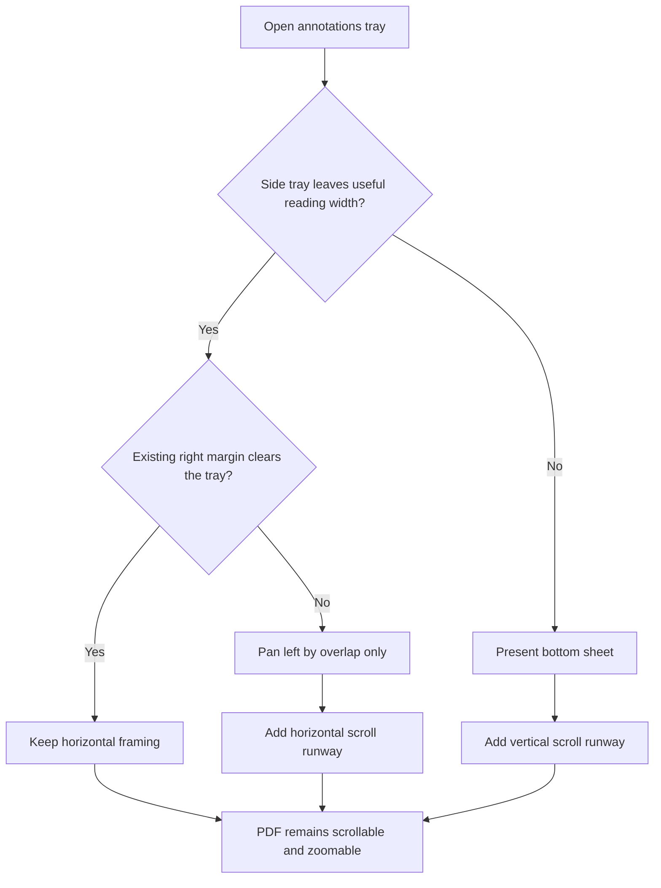
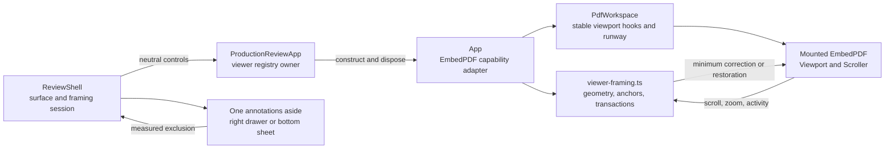
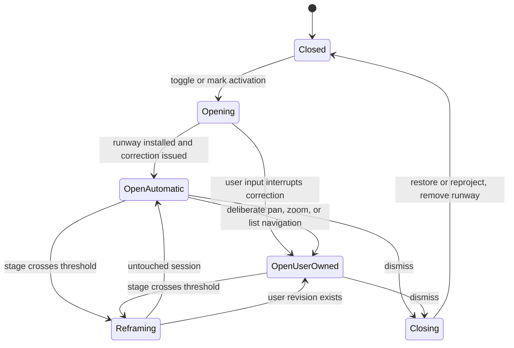

# Adaptive Annotation Tray Reflow - Plan

## Goal Capsule

- **Objective:** Keep every part of a zoomed PDF reachable and readable while the annotations tray is open, with the least automatic movement necessary.
- **Product authority:** This contract governs annotation-tray layout and viewer movement across the shared browser, Codex, and VS Code review surface. It supersedes only the conflicting no-movement drawer rules in `docs/plans/2026-08-07-002-feat-reading-first-pdf-review-interface-plan.md`.
- **Open blockers:** None. Product behavior, responsive thresholds, viewer movement ownership, and verification scope are settled.

---

## Product Contract

### Summary

On wide surfaces, the annotations tray remains pinned to the right and adaptively reveals the PDF: it uses existing margin first, then pans only enough to clear the remaining overlap. On narrow surfaces, the tray becomes a bottom sheet so a useful, interactive reading region remains visible.

### Problem Frame

The current fixed right-edge tray overlays a full-size viewer. When a page is zoomed or positioned near the right edge, the tray can permanently cover part of the page even though the reader still supports scrolling and zooming. A reviewer must close the tray to inspect hidden content, breaking the intended side-by-side relationship between a mark and its annotation.

### Key Decisions

- **Use adaptive reveal on wide surfaces** (session-settled: user-directed — chosen over always docking and manual-only runway: it eliminates permanent coverage with less motion). Governs R1-R5.
- **Respect user intent when the tray closes** (session-settled: user-approved — chosen over always restoring or always keeping the shift: automatic motion stays reversible without discarding deliberate navigation). Governs R8.
- **Anchor to the interaction that opened the tray** (session-settled: user-approved — chosen over one universal centering rule: the relevant reading context remains visible). Governs R6-R7.
- **Use a bottom sheet when a side tray would leave too little reading width** (session-settled: user-approved — chosen over letting the side tray consume most of a narrow surface: the PDF remains meaningfully usable). Governs R10-R12.
- **Keep toggle and light-dismiss behavior without a close button** (session-settled: user-directed — chosen over a persistent close control: the tray stays visually quiet while retaining two obvious dismissal paths). Governs R13-R14.

### Visual References

- The selected desktop, annotation-anchor, and narrow-screen states are captured in `docs/plans/assets/2026-08-08-adaptive-annotation-tray/selected-behavior.html`. This is the normative visual direction; the IDed requirements below control if text and illustration differ.
- The alternatives considered are preserved in `docs/plans/assets/2026-08-08-adaptive-annotation-tray/behavior-options.html`. Option B, Adaptive reveal, is selected.

### Requirements

**Wide-screen reveal**

- R1. On a surface that can sustain a side tray and a useful reading region, the annotations tray remains pinned to the right edge without changing PDF zoom or vertical position.
- R2. Opening the tray consumes existing right-side margin before moving the PDF and pans left only by the remaining overlap between the relevant page content and the tray's exclusion zone.
- R3. If the existing margin already clears the tray, opening it does not move the PDF horizontally.
- R4. While the tray is open, the viewer provides enough horizontal scroll runway for every part of the current zoomed page to enter the unobscured reading region.
- R5. Pan, wheel scroll, keyboard scroll, pinch or command zoom, and viewer zoom controls remain available while the tray is open.

**Anchoring and restoration**

- R6. Opening from the Annotations control preserves the current reading region and applies only the minimum movement required by R2.
- R7. Opening from an annotation mark keeps that mark fully visible in the unobscured region adjacent to the tray and selects its corresponding row, using only the minimum additional movement required.
- R8. Closing the tray reverses its automatic shift when the user has not deliberately panned or zoomed; after deliberate navigation, closing preserves the user's chosen reading anchor and clamps only when the expanded viewport requires it.
- R9. Tray opening, closing, and presentation changes preserve the active annotation, text selection, draft content, page, zoom, every scroll-position component not intentionally changed by R2, R7, R8, or R12, and the logical focus target.

**Responsive presentation**

- R10. When a side tray would leave too little width for useful reading, the same annotations surface appears as a bottom sheet occupying roughly 40–45 percent of the available height.
- R11. The PDF remains visible, scrollable, pannable, and zoomable above the bottom sheet, with enough vertical runway for every part of the page to enter the unobscured reading region.
- R12. If a mark opens the bottom sheet, the minimum required vertical movement keeps that mark visible above the sheet; a general Annotations-control opening does not move the PDF automatically.

**Tray controls and gestures**

- R13. The Annotations control toggles the tray open and closed in every presentation, and no persistent close button appears inside the tray.
- R14. A short outside tap dismisses the tray without activating underlying PDF content, while scroll, pan, zoom, selection, and drag gestures do not dismiss it.
- R15. Crossing the responsive threshold changes only the tray presentation and preserves the state named in R9 without closing the tray.
- R16. Tray and page movement honors reduced-motion preferences and never obscures the current keyboard focus without moving focus to its logical equivalent.

### Actor

- A1. **Reviewer:** Reads and navigates the PDF, opens annotations generally or from a specific mark, and moves between the page and annotation list without losing context.

### Key Flows

- F1. General tray opening
  - **Trigger:** A1 activates the Annotations control on a wide surface.
  - **Steps:** The product measures available right margin, keeps the page still when the margin is sufficient, or pans by only the uncovered overlap; horizontal runway becomes available.
  - **Outcome:** The current reading region remains visible and the full page remains reachable while the tray is open.
  - **Covered by:** R1-R6.
- F2. Mark-anchored opening
  - **Trigger:** A1 activates an annotation mark.
  - **Steps:** The tray opens, the corresponding row becomes active, and the viewer moves only enough to keep the mark outside the tray's exclusion zone.
  - **Outcome:** The mark and its annotation can be read together.
  - **Covered by:** R2, R4, R7.
- F3. Navigate and close
  - **Trigger:** A1 scrolls, pans, or zooms with the tray open, then dismisses it.
  - **Steps:** Viewer interaction remains active; closing distinguishes untouched automatic movement from deliberate navigation.
  - **Outcome:** Untouched framing is restored, while deliberate reading changes are preserved.
  - **Covered by:** R5, R8-R9, R13-R14.
- F4. Responsive transition
  - **Trigger:** The available width crosses the useful-reading threshold while the tray is open.
  - **Steps:** The right drawer becomes a bottom sheet or returns to a right drawer; page and review state remain continuous.
  - **Outcome:** A useful PDF region and the annotations surface remain available without a state reset.
  - **Covered by:** R9-R12, R15-R16.

### Acceptance Examples

- AE1. **Covers R1-R3.** Given a wide window with enough right margin to contain the tray, when A1 opens Annotations, then the tray pins to the right and the PDF does not move.
- AE2. **Covers R1-R5.** Given a wide window where the tray would overlap the page by 120 pixels, when A1 opens Annotations, then the page pans left by 120 pixels, zoom and vertical position do not change, and the obscured page edge can be reached through horizontal scrolling.
- AE3. **Covers R2, R7.** Given a mark near the right edge, when A1 activates it, then the mark is fully visible immediately left of the tray and its list row is selected without centering the whole page.
- AE4. **Covers R8-R9.** Given an automatic 120-pixel shift and no deliberate viewer navigation, when A1 closes the tray, then the exact pre-open horizontal framing returns and all other review state remains unchanged.
- AE5. **Covers R5, R8-R9.** Given an open tray, when A1 pans horizontally or changes zoom before closing it, then the chosen document anchor remains stable after the tray and runway disappear.
- AE6. **Covers R10-R12.** Given a narrow window, when A1 opens Annotations, then a bottom sheet occupies roughly the lower 40–45 percent, the PDF remains interactive above it, and page content can scroll fully above the sheet.
- AE7. **Covers R9, R15-R16.** Given an open tray with an active annotation and unfinished draft, when the surface crosses the responsive threshold, then presentation changes without losing the active row, draft, selection, focus target, page, or zoom.
- AE8. **Covers R13-R14.** Given an open tray, when A1 pans or zooms the PDF, then the tray stays open; when A1 performs a short outside tap, the tray closes without activating the PDF; when A1 activates Annotations again, it toggles open.

<!-- ce-section: work-relationships -->
### How This Work Fits Together

This plan owns annotation-tray presentation and the viewer movement needed to keep PDF content reachable.

- **Supersedes:** The no-resize-or-recenter drawer constraint and the narrow-screen coverage allowance in `docs/plans/2026-08-07-002-feat-reading-first-pdf-review-interface-plan.md` where they conflict with R1-R16.
- **Preserves:** The earlier plan's reading-first chrome, contextual editing actions, annotation correspondence, Finish Review flow, export behavior, and shared host surface.
- **Shares:** The same underlying review state and viewer interaction model across ordinary browser, Codex, and VS Code surfaces.

### Scope Boundaries

**In scope**

- Annotation-tray placement, adaptive viewer movement, scroll runway, anchor restoration, responsive bottom-sheet presentation, and gesture coexistence.
- The existing Annotations toggle and outside-tap dismissal as they interact with the new presentation.

**Out of scope**

- Annotation data models, editing semantics, annotation hover peek, Finish Review behavior, delivery/export behavior, or new persistent tool controls.
- Automatic zoom changes, fit-mode changes, page re-rendering, or navigation to unrelated annotations when the tray opens.
- A general redesign of viewer scrolling or the annotation list's contents.

### Dependencies and Assumptions

- The shared review surface can identify the current visible page region, the active mark geometry, and whether a viewer movement was automatic or user initiated.
- The page remains capable of scroll and zoom interaction while an overlay is visible; this plan changes reachable space and framing, not PDF content.
- Presentation is derived from the measured review-stage width rather than a window or device label.
- A side drawer is allowed only when it leaves at least 30rem of unobscured reading width, with 24px of hysteresis around the transition.
- The existing 24rem maximum side-drawer width and 160ms ease-out motion remain the visual baseline, while the bottom sheet uses 43 percent of review-stage height.
- Exact installed EmbedPDF 2.14.4 public capabilities are the integration authority where framework documentation and package behavior differ.

### Sources

- Current overlay and viewer contract: `apps/web/src/app/review-layout.css`, `apps/web/src/app/ReviewShell.tsx`, and `apps/web/src/pdf/PdfWorkspace.tsx`.
- Existing product direction being narrowed: `docs/plans/2026-08-07-002-feat-reading-first-pdf-review-interface-plan.md`.
- Selected visual direction: `docs/plans/assets/2026-08-08-adaptive-annotation-tray/selected-behavior.html`.
- Explored alternatives: `docs/plans/assets/2026-08-08-adaptive-annotation-tray/behavior-options.html`.

---

## Planning Contract

Product Contract preservation: unchanged.

### Key Technical Decisions

- KTD1. Introduce a project-owned `ViewerFramingControls` adapter in `apps/web/src/pdf/viewer-framing.ts`; `ReviewShell` consumes this neutral interface, `App` constructs it from scoped EmbedPDF capabilities, `ProductionReviewApp` retains and threads it, and `PdfWorkspace` owns the DOM used for runway and geometry. This keeps framework imports below the application shell and governs R1-R12.
- KTD2. Model each open interval as a tokenized framing session containing its document generation, opening source, presentation, baseline document anchor, automatic operation identifiers, and user-navigation revision. Closing, reopening, a new mark activation, a responsive presentation change, viewer replacement, or document reinitialization invalidates callbacks from older tokens. This governs R6-R9 and R15.
- KTD3. Classify initial reveal, mark correction, presentation correction, and close restoration as automatic framing, while raw viewport gestures, keyboard and viewer controls, zoom controls, and annotation-list or existing-annotation navigation are deliberate. A deliberate event cancels an in-flight automatic transaction immediately and becomes authoritative for restoration. This governs R5 and R8-R9.
- KTD4. Measure exclusion geometry from `[data-review-stage]` and the drawer's stable `offsetWidth` or `offsetHeight`, not from an animated bounding edge. An Annotations-control opening targets the pre-open visible page intersection; a mark opening targets the union of every rendered rect carrying its canonical review ID plus a 10px gutter. This governs R2-R3 and R6-R7.
- KTD5. Add reachable space through a project-owned trailing overflow sentinel in `PdfWorkspace`, outside the EmbedPDF `Scroller`, instead of changing `Viewport` padding, `Scroller` size, page size, page origin, or zoom. Right-side runway precedes horizontal correction and bottom runway precedes vertical correction. This governs R4 and R11.
- KTD6. Define one stage-scoped prospective side-drawer width through a CSS custom property shared by drawer sizing and presentation calculation. Select the side drawer only when that width leaves at least 30rem of unobscured review-stage width. Use 24px hysteresis: a side drawer switches to a bottom sheet below the minimum and returns only after the stage has recovered the minimum plus 24px. The bottom sheet occupies 43 percent of review-stage height. This is the confirmed implementation of R10 and R15.
- KTD7. Preserve the same mounted annotations `<aside>` while changing `data-annotation-presentation="right|bottom"`; CSS changes placement without remounting the PDF viewer, annotation list, composers, or review state. The Finish Review drawer remains a right-side surface and does not inherit annotation bottom-sheet rules. This governs R9-R10 and R15-R16.
- KTD8. On an untouched close, restore the exact automatic horizontal displacement and preserve unrelated vertical movement component by component. After deliberate pan, zoom, or list navigation, capture the current document-space reading anchor within the unobscured region, remove runway, reproject the anchor into the expanded viewport, and clamp only if required. This governs R8-R9.
- KTD9. Keep the current toggle, Escape, and light-dismiss ownership in `ReviewShell`, but treat an outside dismissal as a primary-pointer tap only when it begins and ends outside drawer, chrome, and nested annotation UI, remains within tap slop, has no second pointer, and has not scrolled, zoomed, selected, dragged, or been cancelled. A successful dismissal suppresses underlying PDF activation. This governs R13-R14.
- KTD10. Record the actual opener for the Annotations control, mark focus proxy, and peek activation. Restore focus with `preventScroll` to a surviving opener, otherwise to the selected annotation row, otherwise to the Annotations control. Automatic viewer movement is instant under reduced motion and may otherwise settle smoothly through the public scroll-activity signal. This governs R9 and R16.

### High-Level Technical Design

### Implementation Constraints

- Keep the `ReviewShell`, `ProductionReviewApp`, `App`, `PdfWorkspace`, EmbedPDF engine, and scoped document instance mounted through tray open, close, and presentation transitions.
- Do not import EmbedPDF types or hooks into `ReviewShell`, `review-surface-state.ts`, or annotation-list components.
- Do not use CSS transforms on the PDF page or change zoom to reveal content.
- Do not write caller padding onto EmbedPDF `Viewport` or dimensions onto `Scroller`; installed EmbedPDF 2.14.4 overwrites those values and uses them in layout calculations.
- Treat mark identity as a canonical review ID with one or more rendered rects; never retain a virtualized mark element as durable state.
- When the relevant mark is not rendered, install the required runway, preserve current framing, select the row, and avoid navigation to unrelated content.
- When the target is wider or taller than the unobscured region, preserve the current reading anchor and ensure both extremes are reachable rather than attempting impossible simultaneous visibility.
- A temporarily unavailable viewer capability must not block the annotations surface; defer the current token until capabilities are ready and discard it if the token or document generation changes first.
- Keep the drawer and bottom sheet nonmodal so PDF scrolling and zooming remain available.
- Use `ResizeObserver` on `[data-review-stage]`; window width, device category, and host query parameters are not presentation authorities.
- Keep the existing reading-first chrome and do not add a close button, persistent tool palette, or host-specific annotation UI.

### System-Wide Impact

- UI state: `ReviewShell` gains opening-source and framing-session state but remains the sole authority for base-surface exclusivity, active annotation, focus restoration, Escape, toggle, and light dismiss.
- Viewer integration: `App` exposes a second neutral control adapter beside existing page and zoom controls; no annotation, export, or service API contract changes.
- Viewer layout: `PdfWorkspace` exposes stable project-owned viewport/content hooks and a trailing overflow sentinel while preserving the existing EmbedPDF component hierarchy.
- Navigation semantics: mark and peek activation use minimum reveal, while explicit annotation-list and existing-annotation navigation retain intentional page navigation and count as deliberate user movement.
- Responsive CSS: annotations alone can become a bottom sheet; Finish Review and its delivery confirmations remain governed by their current side-drawer and modal behavior.
- Host parity: ordinary browser, Codex in-app browser, and VS Code continue to load the same web tree; presentation derives from the actual embedded stage size.
- Persistence and APIs: annotation state, delivery state, broker contracts, PDF mutation, and export formats are unchanged.

### Risks and Mitigations

- Risk: EmbedPDF layout code may recenter or resize pages if runway is attached to a framework primitive. Mitigation: keep the sentinel in a project-owned overflow layer and prove page client rect, origin, and zoom remain unchanged when runway toggles.
- Risk: automatic scroll events may be mistaken for user intent. Mitigation: tag operations, observe public scroll activity, compare expected and actual targets, and increment the user revision on divergent or direct input.
- Risk: responsive measurements may flap near the boundary. Mitigation: use the confirmed 30rem minimum with 24px hysteresis and a single stage observer.
- Risk: virtualized mark rects may disappear between activation and measurement. Mitigation: use canonical IDs, resolve current rects on demand, and fall back to row selection without unrelated navigation.
- Risk: removing runway can clamp the viewport and appear to jump. Mitigation: capture and reproject a document-space anchor before removal, then clamp once after layout settles.
- Risk: an outside gesture may dismiss during PDF manipulation. Mitigation: require a completed tap disposition and cover wheel, pinch, pan, drag, selection, multi-pointer, and nested-composer races in browser tests.

### Dependencies and Sequencing

- U1 establishes pure geometry, transaction, and public adapter contracts before React effects depend on them.
- U2 adds the non-sizing runway and stable DOM measurement hooks required by U3 corrections.
- U3 integrates wide-screen reveal, source-specific anchoring, and restoration through the existing shell and production ownership chain.
- U4 adds responsive presentation, focus migration, motion, and gesture arbitration on top of the stable framing session.
- U5 proves the combined behavior with the real viewer, narrow embedded surface, both browser engines, and hard-coded package scripts.

---

## Implementation Units

### U1. Establish viewer framing math and adapter boundaries

**Goal**

Create a framework-neutral, testable contract for minimum reveal, runway, automatic-operation tracking, deliberate-user revisions, anchor restoration, and capability lifecycle.

**Requirements**

- Covers R1-R12 and R15.

**Dependencies**

- None.

**Files**

- Add `apps/web/src/pdf/viewer-framing.ts`.
- Add `apps/web/test/viewer-framing.test.ts`.
- Update `apps/web/src/pdf/viewer-controls.ts` only if a shared public DTO or capability readiness type belongs beside the existing control adapter.
- Update `apps/web/src/pdf/viewer-interaction-events.ts` only for typed deliberate-input signals that cannot remain private to the framing adapter.
- Update `package.json` so the new test is included by the hard-coded review test script.

**Approach**

- Define project-owned rect, anchor, exclusion, presentation, runway, session-token, document-generation, and control types without importing EmbedPDF.
- Implement pure functions for overlap-only reveal, canonical multi-rect union, oversized-target reachability, right and bottom runway, document-anchor capture and reprojection, and post-removal clamping.
- Implement the tokenized session reducer or controller that distinguishes expected automatic movement from direct or divergent user movement.
- Define a disposable `ViewerFramingControls` interface for measurement, runway, scroll, anchor capture, event subscription, capability readiness, and document generation.
- Make missing or not-yet-ready capabilities a typed no-op/deferred state rather than an exception or a second viewer state model.

**Existing Patterns**

- Follow the neutral DTO boundary in `apps/web/src/pdf/viewer-controls.ts` and the typed event adapters in `apps/web/src/pdf/viewer-interaction-events.ts`.
- Keep pure surface decisions consistent with `apps/web/src/review/review-surface-state.ts` rather than hiding product state inside a component effect.

**Test Scenarios**

- Existing right margin produces zero displacement.
- A 120px overlap produces exactly 120px of horizontal correction and runway.
- Multi-rect mark geometry uses the canonical union and 10px gutter.
- An oversized page or mark preserves its reading anchor while both edges remain reachable.
- A general bottom-sheet opening produces no vertical correction; a mark overlap produces only the required correction.
- An untouched close restores the exact automatic horizontal displacement while preserving unrelated vertical scroll.
- A deliberate horizontal pan, zoom, or list navigation causes anchor reprojection and clamping instead of baseline restoration.
- Close during open, rapid reopen, responsive correction, and a newer mark activation invalidate stale operation callbacks.
- Missing mark geometry, missing capabilities, capability recovery, and document generation replacement remain safe.
- The side/bottom decision uses 30rem of remaining width and does not flap within the 24px hysteresis band.

**Verification**

- `pnpm exec vitest run apps/web/test/viewer-framing.test.ts`
- Done when the pure contract covers every automatic/deliberate transition and contains no EmbedPDF import.

### U2. Add non-sizing viewer runway and stable measurement hooks

**Goal**

Make hidden page edges reachable without resizing, recentering, remounting, or changing the zoomed PDF.

**Requirements**

- Covers R1-R5, R9, and R11.

**Dependencies**

- U1.

**Files**

- Update `apps/web/src/pdf/PdfWorkspace.tsx`.
- Update `apps/web/src/app/App.tsx`.
- Update `apps/web/src/app/ProductionReviewApp.tsx` for adapter registration and disposal only.
- Update `apps/web/test/viewer-controls.test.ts` or add focused adapter coverage to `apps/web/test/viewer-framing.test.ts`.
- Update `apps/web/test/production-review-app.test.tsx`.
- Update `test/acceptance/production-flow.spec.ts` with a real-viewer runway characterization.
- Update `package.json` if any new focused test file is introduced.

**Approach**

- Add stable project-owned DOM hooks for the review viewport, page content, and runway without changing the required `Viewport` → `ZoomGestureWrapper` → `Scroller` composition.
- Render one trailing overflow sentinel whose width or height is controlled by the current framing session and whose zero state contributes no layout space.
- Construct the public framing adapter from scoped `ViewportPlugin`, `ScrollPlugin`, and `ZoomPlugin` capabilities in `App`, then publish and dispose it through the existing production viewer registry.
- Resolve current page and mark rects on demand by canonical page/review identity because pages and mark spans are virtualized.
- Observe capability and document lifecycle so deferred actions resume only for the current session token and current document generation.

**Existing Patterns**

- Preserve the existing viewer registry and neutral controls wiring in `apps/web/src/app/ProductionReviewApp.tsx`.
- Reuse `[data-page-index]`, `[data-owned-mark]`, `[data-review-id]`, and `[data-owned-focus-id]` as stable identity hooks, without retaining element references.
- Preserve geometry calculations already owned by `apps/web/src/pdf/owned-overlay.ts`.

**Test Scenarios**

- Toggling right and bottom runway leaves page bounding rect, page origin, zoom, current page, and vertical scroll unchanged before correction.
- A zoomed page can scroll until its right edge enters the unobscured side region and until its bottom edge enters the region above the sheet.
- Wheel, trackpad, keyboard, pinch, command zoom, and viewer controls continue to reach the real EmbedPDF viewport while runway is active.
- Viewer capability absence disables only framing work, never tray rendering or the existing viewer.
- Viewer replacement and document reinitialization dispose subscriptions and prevent stale corrections.
- Virtualizing a mark out of the DOM produces the defined no-navigation fallback.

**Verification**

- `pnpm exec vitest run apps/web/test/viewer-framing.test.ts apps/web/test/viewer-controls.test.ts apps/web/test/production-review-app.test.tsx`
- `pnpm build:web`
- `pnpm exec playwright test test/acceptance/production-flow.spec.ts --grep "runway|page geometry"`
- Done when a real PDF gains reachable overflow while its page geometry and zoom remain invariant.

### U3. Integrate adaptive wide-screen reveal and intent-aware close

**Goal**

Connect annotations surface transitions to minimum viewer movement, source-specific anchoring, and reversible or user-preserving close behavior.

**Requirements**

- Covers R1-R9 and R13.

**Dependencies**

- U1 and U2.

**Files**

- Update `apps/web/src/app/ReviewShell.tsx`.
- Update `apps/web/src/app/ProductionReviewApp.tsx`.
- Update `apps/web/src/review/review-surface-state.ts` if framing-session transitions are represented in the pure surface reducer.
- Update `apps/web/test/review-layout.test.tsx`.
- Update `apps/web/test/review-surface-state.test.ts` if its reducer changes.
- Update `apps/web/test/production-review-app.test.tsx`.
- Update `test/acceptance/review-workflow.spec.ts`.
- Update `test/acceptance/production-flow.spec.ts`.

**Approach**

- Record whether the open request came from the Annotations control, an owned mark/focus proxy, or the edge peek, along with its activation token and real focus-restoration target.
- Keep the current page's pre-open visible intersection as the general reading anchor and union all currently rendered rects for a mark-anchored request.
- Open the tray, measure its stable exclusion size, install runway, and issue only the calculated overlap correction.
- Remove the universal `scrollToPage({ alignX: 50, alignY: 35 })` behavior from mark and peek activation; retain explicit navigation for list rows and existing annotations and record it as deliberate.
- On every annotation-close path, reconcile the session before removing runway: exact component-wise restoration for untouched sessions or document-anchor reprojection for user-owned sessions.
- Apply the same close reconciliation when the user toggles, presses Escape, outside-taps, activates another base surface such as Finish Review, or replaces the viewer/document.

**Existing Patterns**

- Preserve `ReviewShell` as owner of `activeItemId`, base-surface exclusivity, focus restoration, command serialization, drafts, and list disclosure.
- Preserve the existing production `ReviewState` and viewer registry rather than introducing a parallel state container.
- Follow the existing annotation-row navigation path for deliberate list navigation.

**Test Scenarios**

- Annotations-control opening with sufficient margin leaves the page stationary.
- Annotations-control opening with 120px overlap moves exactly 120px and leaves zoom and vertical position unchanged.
- Clicking any segment of a right-edge annotation opens the same row and minimally reveals the complete canonical mark without centering the page.
- Opening through edge peek follows the same mark-anchored contract.
- An offscreen or virtualized mark opens and selects the row without navigating to unrelated content.
- Toggle, Escape, outside tap, and Finish Review transition all run the same restoration path.
- Untouched close returns the exact baseline; vertical-only scrolling remains; pan, zoom, and explicit list navigation retain their document anchor after close.
- Rapid open/close/reopen and document replacement do not apply stale movement.
- Focus returns to the opener or its documented logical fallback without scrolling the viewer.

**Verification**

- `pnpm exec vitest run apps/web/test/review-layout.test.tsx apps/web/test/review-surface-state.test.ts apps/web/test/production-review-app.test.tsx apps/web/test/viewer-framing.test.ts`
- `pnpm exec playwright test test/acceptance/review-workflow.spec.ts`
- Done when all open and close sources share one transaction path and mark activation no longer applies universal centering.

### U4. Add responsive bottom-sheet presentation and robust gesture coexistence

**Goal**

Change the same annotations surface between a right drawer and a bottom sheet without resetting review state or interfering with PDF interaction.

**Requirements**

- Covers R5, R9-R16.

**Dependencies**

- U1-U3.

**Files**

- Update `apps/web/src/app/ReviewShell.tsx`.
- Update `apps/web/src/app/review-layout.css`.
- Update `apps/web/src/review/review-surface-state.ts` if presentation selection remains pure state.
- Update `apps/web/test/review-layout.test.tsx`.
- Update `apps/web/test/review-surface-state.test.ts`.
- Update `test/acceptance/review-workflow.spec.ts`.
- Update `test/acceptance/production-flow.spec.ts`.

**Approach**

- Observe `[data-review-stage]` and compute the annotations presentation from the shared prospective side-drawer width, 30rem remaining reading width, and 24px hysteresis; never use the bottom sheet's full-width measurement to decide when the side drawer can return.
- Keep one `<aside>` mounted and switch only `data-annotation-presentation`; right presentation remains pinned to the stage's right edge and bottom presentation occupies 43 percent of stage height.
- Scope bottom-sheet CSS to the annotations surface so the co-primary Finish Review drawer remains a right drawer.
- In bottom presentation, install vertical runway before minimally revealing a mark; an Annotations-control opening adds reachability but performs no automatic vertical movement.
- Carry active row, drafts, selection, page, zoom, session token, and logical focus across continuous stage resize and orientation changes.
- Refine outside-tap arbitration around one tap disposition and ensure viewer scroll, pan, zoom, selection, drag, multi-pointer, and nested composer interactions leave the tray open.
- Preserve the Annotations toggle and omit a tray close button in both presentations.
- Disable spatial viewer and tray animations under `prefers-reduced-motion: reduce`, apply required corrections instantly, and preserve state changes and reachability.

**Existing Patterns**

- Extend the existing `.review-drawer-host`, `.review-list`, `data-list-open`, and base-surface attributes in `apps/web/src/app/review-layout.css`.
- Preserve the current chrome exception that lets the Annotations button toggle an open tray.
- Preserve cancellation of the underlying PDF action on a successful outside dismissal.

**Test Scenarios**

- A side presentation remains stable while at least 30rem is available, switches below the threshold, and does not return until the extra 24px is recovered.
- The bottom sheet is anchored to the stage bottom at 43 percent height and leaves an interactive PDF region above it.
- A general bottom-sheet opening does not move the PDF; a mark opening minimally reveals the mark above the exclusion edge.
- Continuous 1280→760→1280 resizing yields side→bottom→side without remounting `PdfWorkspace` or losing active annotation, draft, selection, page, zoom, or focus.
- The Finish Review drawer never becomes a bottom sheet through annotation CSS.
- Wheel, trackpad, pinch, keyboard, viewer controls, pan, selection drag, second pointer, and cancelled gestures keep the annotations surface open.
- A qualifying outside tap closes once, suppresses the trailing click, and never activates a page or mark.
- Toggle and Escape close; no persistent close button is present.
- Reduced motion produces instant correction and presentation changes with unchanged functionality.

**Verification**

- `pnpm exec vitest run apps/web/test/review-layout.test.tsx apps/web/test/review-surface-state.test.ts apps/web/test/viewer-framing.test.ts`
- `pnpm exec playwright test test/acceptance/review-workflow.spec.ts`
- `pnpm exec playwright test test/acceptance/production-flow.spec.ts --grep "annotation tray|bottom sheet|responsive"`
- Done when presentation follows measured stage capacity and every supported PDF gesture remains usable while the annotations surface is open.

### U5. Lock real-viewer and shared-host regressions

**Goal**

Make the adaptive framing contract executable across the installed viewer, wide and embedded dimensions, Chromium and WebKit, and the shared launch surfaces.

**Requirements**

- Verifies R1-R16 and AE1-AE8.

**Dependencies**

- U1-U4.

**Files**

- Update `test/acceptance/production-flow.spec.ts`.
- Update `test/acceptance/review-workflow.spec.ts`.
- Update `test/acceptance/review-harness/main.tsx` only when deterministic state exposure is needed by a browser assertion.
- Update `test/acceptance/launch-surfaces.spec.ts` only if a shared bootstrap contract must expose the same responsive review stage.
- Update `package.json` to include every new unit file and both affected acceptance specs in Chromium and WebKit gates.

**Approach**

- Replace the conflicting narrow VS Code expectation that the annotations drawer remains right-anchored with the selected bottom-sheet contract.
- Use stable production hooks and public viewer metrics instead of mutating rendered DOM to discover private scroll containers.
- Exercise the same built production URL with ordinary and `?embed=vscode` dimensions; retain launch-contract coverage that Codex and VS Code point at the shared web tree.
- Record a manual Codex in-app browser smoke as release evidence for native host chrome, while keeping deterministic assertions in the shared Playwright production fixture.

**Existing Patterns**

- Extend the installed-style PDF cases already in `test/acceptance/production-flow.spec.ts` for right-click, keyboard cursor, rotation, zoom, and annotation overlay behavior.
- Use role/name locators for controls and canonical `data-review-id` selectors for one-to-many mark geometry.
- Preserve the current WebKit acceptance configuration and make its spec list explicit.

**Test Scenarios**

- AE1: wide viewer with sufficient margin produces no page movement.
- AE2: a measured 120px overlap produces a 120px correction, stable zoom and vertical position, and both reachable page edges.
- AE3: a real right-edge owned mark is fully visible and its row selected without universal centering.
- AE4: untouched close restores exact horizontal framing and review state.
- AE5: pan, zoom, and list navigation during open preserve the user-owned document anchor after close.
- AE6: a 760px or narrower embedded stage uses a 43 percent bottom sheet with interactive PDF content above it and vertical reachability.
- AE7: an open tray survives wide→narrow→wide transition with the same viewer mount, active row, draft, text selection, page, zoom, and logical focus.
- AE8: toggle and outside tap close, scroll and zoom do not close, and no close button exists.
- Browser parity: the complete workflow passes on Chromium and WebKit.
- Host parity: launch contracts still resolve ordinary browser, Codex, and VS Code to the same production surface without host-specific UI branches.

**Verification**

- `pnpm test:review`
- `pnpm build:web`
- `pnpm exec playwright test test/acceptance/review-workflow.spec.ts test/acceptance/production-flow.spec.ts`
- `pnpm test:e2e:webkit`
- `pnpm typecheck`
- Done when AE1-AE8 pass against the built production viewer in Chromium and WebKit and launch-surface contracts remain shared.

---

## Verification Contract

| Gate | Command or evidence | Covers | Done signal |
| --- | --- | --- | --- |
| Framing unit contract | `pnpm exec vitest run apps/web/test/viewer-framing.test.ts` | U1; R1-R12, R15 | Overlap, runway, anchors, tokens, user revisions, responsive hysteresis, and lifecycle cases pass. |
| Component integration | `pnpm exec vitest run apps/web/test/review-layout.test.tsx apps/web/test/review-surface-state.test.ts apps/web/test/viewer-controls.test.ts apps/web/test/production-review-app.test.tsx` | U1-U4; R1-R16 | One mounted viewer and annotations aside expose correct controls, presentation, focus, and disposal behavior. |
| Review interaction acceptance | `pnpm exec playwright test test/acceptance/review-workflow.spec.ts` | U3-U5; R6-R16; AE3, AE7-AE8 | Source-specific activation, state continuity, toggle, Escape, light dismiss, and gesture arbitration pass. |
| Real-viewer Chromium acceptance | `pnpm build:web` then `pnpm exec playwright test test/acceptance/production-flow.spec.ts` | U2-U5; R1-R16; AE1-AE8 | Page geometry stays stable, required runway exists, movement is minimal, close honors intent, and side/bottom transitions pass. |
| Real-viewer WebKit acceptance | `pnpm test:e2e:webkit` | U2-U5; R1-R16; AE1-AE8 | The same review and production scenarios pass with the WebKit configuration. |
| Shared-host contract | `pnpm exec playwright test test/acceptance/launch-surfaces.spec.ts` plus recorded Codex in-app browser smoke | U5; R9-R16 | Browser, Codex, and VS Code continue to use the shared production surface; native host smoke shows no clipping or blocked gestures. |
| Static correctness | `pnpm typecheck` | U1-U5 | TypeScript accepts the neutral adapter, lifecycle, React, and test contracts. |
| Review regression | `pnpm test:review` | U1-U5 | Every existing and newly added review unit is included by the package script and passes. |
| Full regression | `pnpm test` then `pnpm test:e2e` | U1-U5 | Repository unit and end-to-end suites pass with no unrelated regression. |

### Proof Requirements

- Record pre-open and post-open page bounding rect, page origin, zoom, horizontal scroll, vertical scroll, exclusion size, and computed correction for AE1-AE2.
- Record the canonical mark union and selected row identity for AE3.
- Record the baseline, user revision, restored or reprojected document anchor, and final clamp for AE4-AE5.
- Record review-stage width, drawer width, selected presentation, sheet height, and viewer mount identity across AE6-AE7.
- Assert that pointer, wheel, zoom, and keyboard gestures reach the viewer while the tray is open and that only a qualifying outside tap dismisses it for AE8.
- Prefer public viewer metrics or stable project-owned hooks; do not stamp ad hoc test attributes onto rendered framework DOM.

---

## Definition of Done

### Global Completion Criteria

- Every requirement R1-R16 is implemented and traced to at least one automated acceptance or focused unit assertion.
- Every acceptance example AE1-AE8 passes against the built production viewer on Chromium and WebKit.
- The annotations surface is a pinned right drawer only when it leaves at least 30rem of reading width and is otherwise a 43 percent bottom sheet, with 24px hysteresis.
- No zoom change, page resize, page recenter, viewer remount, or unrelated navigation is used to reveal content.
- All page edges remain reachable and all supported PDF gestures remain usable while annotations are open.
- Untouched automatic framing is reversible, deliberate navigation is preserved, and stale automatic callbacks cannot affect a newer session or document.
- Active annotation, drafts, text selection, page, zoom, viewer mount, and logical focus survive open, close, and side/bottom transitions.
- The Annotations control toggles, outside tap and Escape dismiss, viewer gestures do not dismiss, and no close button is present.
- Ordinary browser, Codex, and VS Code continue to share one implementation without host-specific presentation branches.
- `pnpm typecheck`, `pnpm test:review`, `pnpm test`, `pnpm test:e2e`, and the explicit WebKit gate pass.

### Unit Completion Criteria

- U1 is complete when the project-owned framing adapter and pure tests fully specify overlap, runway, token, user-intent, restoration, responsive, and lifecycle behavior without importing EmbedPDF into the shell.
- U2 is complete when a real zoomed PDF gains right and bottom reachability while page geometry, zoom, current page, and viewer mount remain invariant.
- U3 is complete when Annotations-control, mark, peek, toggle, Escape, outside tap, and base-surface transitions share one source-aware framing and reconciliation path.
- U4 is complete when measured stage capacity selects a stable right drawer or bottom sheet and PDF gestures, focus, state, and reduced-motion behavior remain correct.
- U5 is complete when all new tests are included in package scripts and AE1-AE8 pass in both supported browser engines with shared-host launch coverage.

---

## Deferred / Open Questions

### From 2026-08-08 review

- **Outside dismissal can clear text selection** — Planning Contract — Key Technical Decisions (P1, feasibility, confidence 75)

  A qualifying outside tap can erase the reviewer's active PDF text selection before the annotations surface closes. EmbedPDF handles pointer-down before the app can classify the gesture as a tap, while intercepting pointer-down could block genuine selection and drag gestures. The implementation needs an explicit event-ownership or selection-restoration contract that preserves both behaviors.
