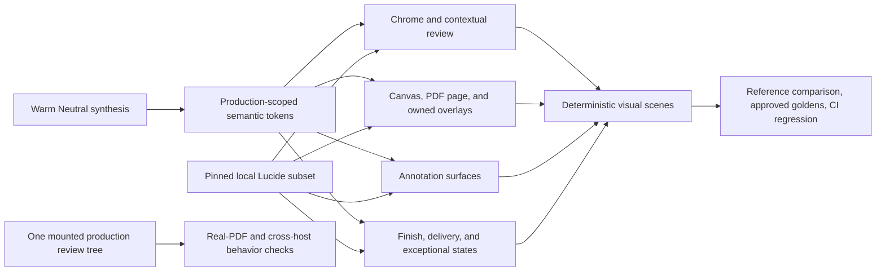

# Warm Neutral Review Design Language - Plan

## Goal Capsule

- **Objective:** Apply a production-grade Warm Neutral visual system to the complete in-session PDF review experience, with high-fidelity perceptual matching to the selected visual reference.
- **Product authority:** This contract owns visual language across review-session typography, iconography, color roles, geometry, borders, elevation, density, and state appearance. The reading-first interface and adaptive Annotation Tray plans retain authority over interaction, layout behavior, annotation semantics, and responsive framing.
- **Open blockers:** None. KTD2-KTD4 resolve the exact token, typography, and icon choices within the Product Contract's visual and accessibility constraints.
- **Execution:** Code.
- **Tail ownership:** U5 owns the visual-reference sign-off, committed screenshot baselines, cross-host evidence, and final regression gate after all visual surfaces have landed.

---

## Product Contract

### Summary

Create one Warm Neutral light-theme design language for the complete in-session review experience.
Preserve the accepted reading-first behavior while making every visible surface feel like one authored production system.

### Problem Frame

The review workflow and spatial hierarchy are close to the intended product shape, but the styling does not yet communicate the same level of authorship.
Generic glyphs, loosely related surface treatments, and insufficiently differentiated hierarchy make a functional interface read like an internal tool.
The design language must add coherence and polish without reintroducing chrome or weakening the PDF's visual priority.

### Key Decisions

- **Adopt Warm Neutral as the visual direction.** (session-settled: user-approved — chosen over pure Editorial Precision and Studio Monochrome: the product needs A's warmth and soft geometry with C's neutral contrast discipline.) Governs R1-R13.
- **Use the curated synthesis as the visual authority.** High-fidelity perceptual matching, not a text-only interpretation, is the primary implementation target. Governs R1-R3.
- **Cover the complete review experience.** (session-settled: user-approved — chosen over core-reader-only and every-product-surface scopes: no in-session surface should remain visually unfinished, while installation and diagnostics are separate product moments.) Governs R14-R18.
- **Ship one excellent light theme.** (session-settled: user-approved — chosen over simultaneous light-and-dark or system-following themes: concentrating polish and QA is more valuable in this pass.) Governs R19.
- **Preserve the settled product behavior.** (session-settled: user-approved — chosen over reopening the layout and workflow: the reading-first interaction model is already close to right.) Governs R20-R23.

### Visual Reference

The selected target is the [Warm Neutral synthesis](assets/2026-08-09-warm-neutral-design-language/warm-neutral-synthesis.html).
It is normative for the visual relationships, overall temperament, and perceptual result described by R1-R13.
Its example copy, document content, placeholder glyphs, and literal pixel values are not normative.

### Requirements

**Visual authority and fidelity**

- R1. The selected Warm Neutral synthesis shall govern the implemented review experience at high perceptual fidelity.
- R2. Fidelity shall be judged across warmth, neutrality, contrast hierarchy, corner softness, border subtlety, typography density, control treatment, and elevation relationships.
- R3. A visual deviation shall be permitted only when required by actual content, accessibility, settled product behavior, inherited responsive behavior, or a host constraint, and it shall preserve the design-language relationship shown by the reference.

**Color and material roles**

- R4. Large environmental surfaces shall use warm gray and ivory tones while primary ink and routine controls remain near-black or neutral.
- R5. Routine chrome shall not use a brand-color wash; color shall appear only when it carries selection, focus, annotation, success, warning, or danger meaning.
- R6. Selection and focus shall use a cool blue family, success shall use restrained green, danger shall use restrained red, and annotation color shall remain subordinate to text hierarchy.
- R7. Every colored state shall retain a non-color cue, and neutral surfaces shall maintain clear light-theme contrast without hard black outlines.

**Geometry, borders, and elevation**

- R8. Panels, palettes, and controls shall use the larger soft radii established by the visual reference, with related nested elements following a consistent radius hierarchy.
- R9. Borders shall be soft and low-contrast while still defining interactive and layered surfaces without relying on shadow alone.
- R10. Elevation shall be reserved for the PDF page, floating contextual surfaces, and overlay review surfaces rather than applied to every card or control.

**Typography, iconography, and density**

- R11. Review UI typography shall use one coherent compact sans-serif voice with clear role, weight, and size hierarchy while leaving PDF document rendering untouched.
- R12. Review controls shall use one coherent locally available icon language rather than mixed Unicode, browser-default, or unrelated symbol styles.
- R13. Global chrome and contextual palettes shall remain compact while drawers, dialogs, delivery choices, and status content retain enough whitespace for fast scanning.

**Surface coverage and states**

- R14. Warm Neutral shall cover global review chrome, viewer controls, contextual actions, page actions, Page Note placement and composition, and annotation peeks.
- R15. Warm Neutral shall cover the Annotation Tray, Finish Review and delivery surfaces, dialogs, confirmations, status messages, and loading, empty, and error states.
- R16. Hover, focus, pressed, selected, active, and disabled states shall remain visually distinct without changing the established interaction behavior.
- R17. Side-tray and bottom-sheet presentations shall express the same design language while retaining the adaptive behavior owned by the Annotation Tray plan.
- R18. Ordinary-browser, Codex, and VS Code review surfaces shall share the same visual hierarchy and shall not introduce host-specific themes.
- R19. This work shall ship a light theme only.

**Behavior, accessibility, and locality**

- R20. Visual changes shall preserve the reading-first disclosure model, state restoration, annotation behavior, delivery behavior, and viewer framing contracts.
- R21. Icons and other app-owned design assets shall be bundled locally, typography may use locally installed system fonts, and no design asset shall require a remote visual dependency.
- R22. Focus indicators, non-color correspondence cues, and readable state contrast shall preserve the existing accessibility contract.
- R23. Motion shall remain restrained, communicate state changes, and respect reduced-motion preferences.

### Acceptance Examples

- AE1. Wide reading state
  - **Covers R1-R13.**
  - **Given:** A reviewer opens a PDF in a wide ordinary-browser review surface.
  - **When:** No contextual surface is active.
  - **Then:** The canvas, page, compact chrome, controls, typography, and surface relationships match the Warm Neutral visual target at high perceptual fidelity.
- AE2. Contextual review state
  - **Covers R1-R16.**
  - **Given:** A text selection or caret reveals contextual review actions, or the reviewer opens the Annotation Tray as a separate state.
  - **When:** The reviewer moves among default, hover, focus, active, and disabled controls within either state.
  - **Then:** The palette and tray each retain soft geometry and neutral hierarchy while every state remains unmistakable without color alone.
- AE3. Finish and exceptional states
  - **Covers R13-R16, R21-R23.**
  - **Given:** The reviewer opens Finish Review and encounters delivery choices, a confirmation, a status message, or an error.
  - **When:** Each surface appears and receives keyboard focus.
  - **Then:** None falls back to browser-default or one-off styling, and each remains recognizably part of Warm Neutral.
- AE4. Adaptive Annotation Tray
  - **Covers R17, R20, R22-R23.**
  - **Given:** Available reading width causes the Annotation Tray to change between side-tray and bottom-sheet presentation.
  - **When:** The presentation changes or closes.
  - **Then:** The visual language remains consistent and the current adaptive framing and state-restoration behavior remain intact.
- AE5. Embedded review surfaces
  - **Covers R18, R20-R23.**
  - **Given:** The same session is opened in ordinary browser, Codex, and VS Code review surfaces.
  - **When:** The reviewer performs the same reading, annotation, and finish actions.
  - **Then:** The product presents one visual hierarchy without a host-specific theme or remote asset dependency.
- AE6. Visual fidelity review
  - **Covers R1-R3.**
  - **Given:** The implemented wide review surface and selected Warm Neutral synthesis are viewed side by side.
  - **When:** A reviewer compares the dimensions named by R2.
  - **Then:** No visually material mismatch remains without an R3 justification.

### Success Criteria

- High-fidelity visual matching to the Warm Neutral synthesis is the primary implementation success signal.
- Every in-session review surface appears to belong to one system, including transient, delivery, empty, loading, confirmation, and error states.
- No in-scope control reads as browser-default, Unicode-placeholder, or one-off component styling.
- Wide, adaptive-tray, Codex, and VS Code presentations retain the same Warm Neutral hierarchy.
- Existing interaction, accessibility, responsive framing, recovery, and delivery behavior remains intact.

### Scope Boundaries

- This plan does not add a dark theme.
- This plan does not redesign the reading-first layout, disclosure rules, Annotation Tray behavior, viewer framing, annotation semantics, recovery, or delivery contracts.
- Presentation spacing and control sizing may change inside settled regions only to achieve R1-R13.
- This plan does not cover installation, diagnostics, packaging, host-shell chrome, marketing pages, logos, or broader brand identity.
- This plan does not add review tools or new user-facing workflows.

### Dependencies and Assumptions

- `docs/plans/2026-08-07-002-feat-reading-first-pdf-review-interface-plan.md` remains product authority for the reading-first review shell and interaction model.
- `docs/plans/2026-08-08-001-fix-adaptive-annotation-tray-reflow-plan.md` remains authority for current Annotation Tray presentation and framing behavior where it amends the earlier plan.
- The Planning Contract resolves the exact production tokens, typeface choice, icon assets, and measurements within R1-R23 and the curated visual reference.

### Sources and Research

- `docs/plans/assets/2026-08-09-warm-neutral-design-language/warm-neutral-synthesis.html` is the selected visual target.
- `apps/web/src/app/review-layout.css` contains the current light-theme tokens and review-surface styling.
- `apps/web/src/app/ReviewShell.tsx` composes the in-session chrome, contextual actions, Page Note surfaces, Annotation Tray, and transient states.
- `apps/web/src/app/ProductionReviewApp.tsx` composes the Finish Review delivery surfaces.
- `docs/plans/2026-08-07-002-feat-reading-first-pdf-review-interface-plan.md` and `docs/plans/2026-08-08-001-fix-adaptive-annotation-tray-reflow-plan.md` define the behavior and accessibility constraints this visual system must preserve.

---

## Planning Contract

The Product Contract remains authoritative and its requirement and acceptance-example IDs are unchanged. This section resolves the production tokens, assets, component posture, and verification approach that the requirements-only artifact left to planning.

### Key Technical Decisions

- KTD1. Compare the implementation with the [Warm Neutral synthesis](assets/2026-08-09-warm-neutral-design-language/warm-neutral-synthesis.html) through canonical production scenes. (session-settled: user-approved — chosen over reproducing the synthesis's impossible composite state: the current product intentionally does not show the contextual palette and Annotation Tray at the same time.) The wide contextual scene owns the chrome, canvas, PDF page, and palette comparison. The wide Annotation Tray scene owns the drawer comparison. Any material deviation must name its R3 reason in the final visual-review record. Covers R1-R3 and R20.

- KTD2. Replace the current small component-colored variable set with production-root-scoped semantic tokens. Components consume role tokens without repeated literal fallbacks. `#root[data-production-root="true"]` remains the scope boundary, and the root uses `color-scheme: only light`. The synthesis values below are the initial production values and the reference point for high-fidelity tuning. Covers R1-R11, R16, R19, and R22-R23.

  | Role | Token | Initial value |
  |---|---|---|
  | Primary ink | `--review-ink-primary` | `#181a17` |
  | Muted ink | `--review-ink-muted` | `#676a63` |
  | Quiet ink | `--review-ink-quiet` | `#8b8e87` |
  | Canvas | `--review-surface-canvas` | `#e8e9e4` |
  | Main panel | `--review-surface-panel` | `#fffefa` |
  | Subtle panel | `--review-surface-subtle` | `#f1f2ed` |
  | Neutral hover/pressed | `--review-surface-interactive` | `#e5e6e1` |
  | Border | `--review-border` | `#d1d5cc` |
  | Subtle border | `--review-border-subtle` | `#e2e4de` |
  | Strong border | `--review-border-strong` | `#aeb6aa` |
  | Selection fill | `--review-selection-bg` | `#dbe7ff` |
  | Selection ink | `--review-selection-ink` | `#244b87` |
  | Focus | `--review-focus` | `#245c9c` |
  | Success | `--review-success` | `#2d684d` |
  | Danger | `--review-danger` | `#9a3d34` |
  | Warning/highlight | `--review-warning` | `#d9ad2b` |
  | Backdrop | `--review-backdrop` | `rgb(24 26 23 / 42%)` |

  | Relationship | Token | Initial value |
  |---|---|---|
  | Compact control radius | `--review-radius-control` | `9px` |
  | Row/surface radius | `--review-radius-row` | `11px` |
  | Floating palette radius | `--review-radius-float` | `13px` |
  | Dialog radius | `--review-radius-dialog` | `16px` |
  | Round badge radius | `--review-radius-round` | `999px` |
  | Compact icon control | `--review-control-compact` | `31px` |
  | Default compact control | `--review-control-default` | `34px` |
  | Coarse-pointer target | `--review-control-touch` | `44px` |
  | Chrome height | `--review-chrome-height` | `58px` |
  | Floating elevation | `--review-shadow-float` | `0 14px 34px rgb(24 27 23 / 17%), 0 2px 7px rgb(24 27 23 / 8%)` |
  | PDF page elevation | `--review-shadow-page` | `0 2px 4px rgb(25 27 23 / 7%), 0 19px 48px rgb(25 27 23 / 10%)` |
  | Side surface elevation | `--review-shadow-side` | `-14px 0 34px rgb(30 32 28 / 13%)` |
  | Bottom surface elevation | `--review-shadow-bottom` | `0 -14px 34px rgb(30 32 28 / 13%)` |
  | Fast feedback | `--review-motion-fast` | `120ms` |
  | Surface disclosure | `--review-motion-surface` | `160ms` |

  Use a 4px spacing rhythm and the synthesis's compact type roles: 11px metadata/action text, 12px secondary text, 13px UI body/document identity, and 17px drawer/dialog titles. Use tabular numerals for page, zoom, revision, and count values. Tune these values only when an R3 constraint is observed in a real canonical scene.

- KTD3. Use the local system sans stack and remove the unbundled `Inter` preference. (session-settled: user-approved — chosen over adding a font package or WOFF2 asset: the system stack is offline, deterministic within each host environment, and matches the reference's compact sans posture without expanding the asset pipeline.) Use `ui-sans-serif, system-ui, -apple-system, BlinkMacSystemFont, "Segoe UI", sans-serif`. PDF document rendering remains untouched. Covers R11, R18, and R21.

- KTD4. Add exact-pinned `lucide-react@1.27.0` and expose only a static approved icon subset through an ordinary local function component. (session-settled: user-approved — chosen over mixed Unicode and a bespoke SVG family: Lucide supplies one maintained neutral stroke grammar while bundling inline with no runtime asset request.) Use direct named imports, `currentColor`, a 16px default size, a consistent 1.75-2 stroke width, `aria-hidden="true"`, and `focusable="false"`. Do not use `DynamicIcon`, wildcard imports, `forwardRef`, remote icon URLs, or SVG-path assertions. Existing buttons retain their labels, visible text, roles, refs, handlers, disabled behavior, and focus ownership. Covers R12 and R20-R22. See [Lucide React](https://lucide.dev/guide/react/getting-started), [Lucide accessibility](https://lucide.dev/guide/react/advanced/accessibility), and [Lucide 1.27 package metadata](https://raw.githubusercontent.com/lucide-icons/lucide/1.27.0/packages/lucide-react/package.json).

- KTD5. Keep one mounted production review tree and make the change presentation-only. Move inline visual colors, borders, and shadows from the viewer and status surfaces into semantic CSS classes or data-state selectors. Keep geometry and interaction values inline where they are computed from PDF coordinates. Do not change the surface reducer, drawer mounts, viewer mount, placement math, adaptive tray policy, delivery lifecycle, or focus-restoration logic. Do not add an Annotation Tray close button or a persistent active contextual action. Remove the sticky-header `backdrop-filter` because the selected direction excludes glass effects. Covers R14-R20 and R23.

- KTD6. Validate accessibility as a state system, not as a final color review. Normal text must meet WCAG 2.2 AA contrast. Focus rings and required graphical state indicators must reach 3:1 against adjacent surfaces. The shared focus treatment starts at a 3px `--review-focus` outline with a 2px offset. Selected, active, corresponding, success, warning, danger, loading, and error states each keep a non-color cue such as fill, outline style, side marker, icon, or visible label. Coarse-pointer targets remain at least 44px. Reduced motion removes only nonessential transition and scroll movement while preserving final state, focus, and geometry. Covers R6-R7, R16, and R22-R23. See [WCAG contrast minimum](https://www.w3.org/WAI/WCAG22/Understanding/contrast-minimum), [WCAG non-text contrast](https://www.w3.org/WAI/WCAG22/Understanding/non-text-contrast), [WCAG focus appearance](https://www.w3.org/WAI/WCAG22/Understanding/focus-appearance), and [MDN reduced motion](https://developer.mozilla.org/en-US/docs/Web/CSS/Reference/At-rules/%40media/prefers-reduced-motion).

  | State | Required visual cues |
  |---|---|
  | Hover | Neutral interactive fill plus a stronger border or ink value |
  | Pressed | Neutral interactive fill plus a restrained inset shadow |
  | Keyboard focus | Shared 3px focus outline with 2px offset; never replace it with the selected treatment |
  | Selected / expanded / active | Selection fill plus strong border and weight or solid-outline change |
  | Corresponding | Selection tint plus a side marker; use the existing dashed/solid distinction on owned marks |
  | Disabled | Reduced luminance/opacity, disabled cursor, and suppressed hover/pressed treatment |
  | Loading | Visible status text plus a loader icon; reduced motion may stop rotation but not remove the icon |
  | Success | Visible success text plus a check icon |
  | Warning / confirmation risk | Visible warning text plus a warning icon and bordered notice treatment |
  | Danger / error | Visible danger or error text plus an alert icon and bordered notice treatment |

  U2-U5 must expose and verify every applicable row. The state table is normative; component-specific styling may vary only when it preserves the same cue relationship.

- KTD7. Extend the existing review acceptance harness with deterministic visual-scene mode and add a separate installed-style production capture. Query-driven visual scenes reuse the harness's fixture controller, render the real review components under the production-root selector, and isolate a product-only captured locator; normal behavior-harness mode remains unchanged. A dedicated Playwright config uses the bundled Chromium from pinned Playwright 1.61.1 on macOS 15, device scale factor 1, a fixed locale, a fixed light color scheme, fixed viewports, and one worker. Screenshot updates occur only after human two-up or overlay review against the Warm Neutral synthesis. CI compares committed baselines and never updates them. Existing Chrome and WebKit behavior tests remain separate gates. Covers R1-R3 and R14-R23. See [Playwright visual comparisons](https://playwright.dev/docs/test-snapshots) and [`toHaveScreenshot`](https://playwright.dev/docs/api/class-pageassertions#page-assertions-to-have-screenshot-1).

### High-Level Technical Design

The design system flows from one token owner and one icon owner into the existing shared component tree. The existing review harness gains deterministic appearances without becoming a second product implementation. The installed-style production path remains the authority for viewer geometry, state restoration, offline assets, and host parity.

### Implementation Constraints

- Use semantic role tokens rather than component-named color tokens. Do not scatter new hex, radius, or shadow literals through component selectors.
- Keep token declarations under `#root[data-production-root="true"]`. Do not style Codex, VS Code, browser, or diagnostic host chrome outside the production review root.
- Use `color-scheme: only light`. Do not add `prefers-color-scheme`, dark-mode tokens, decorative gradients, glass blur, or shadow to every surface.
- Preserve the existing 24rem maximum side tray, 43% bottom sheet, `--annotation-side-width`, stage measurement, hysteresis, runway, and per-axis ownership rules.
- Keep the reference's contextual palette and Annotation Tray as separate comparison scenes because production behavior makes them mutually exclusive.
- Keep the existing button elements around new icons. Do not make nested SVGs focusable or duplicate their accessible names.
- Scope broad control styles to named review components so they do not affect invisible focus proxies or EmbedPDF internals.
- Keep dynamically computed PDF positions and dimensions inline. Move only presentational constants to CSS/data attributes.
- Do not add jsdom, Testing Library, Vitest Browser Mode, a CSS framework, a component library, or a font dependency.
- Do not update screenshot baselines until the reference comparison has passed. Do not mask stable product surfaces or use a broad global tolerance.

### Visual Acceptance Matrix

| Scene | Canonical viewport | Source | Visual proof |
|---|---:|---|---|
| Wide reading | 1280×900 | Installed-style real local PDF | Canvas warmth, PDF page elevation, compact chrome, typography hierarchy, and neutral controls |
| Wide contextual | 1280×900 | Deterministic visual harness | Selection treatment, contextual palette, icon-plus-label actions, hover, keyboard focus, and disabled state |
| Wide Annotation Tray | 1280×900 | Deterministic visual harness | Ivory side surface, soft row, blue correspondence marker, typography, and drawer elevation |
| Narrow Annotation Tray | 320×720 | Deterministic visual harness | Same visual language in bottom-sheet form, long content handling, focus, and touch targets |
| Peek, Page Note, and composer | 1280×900 | Deterministic visual harness | Floating-surface radii/elevation, placement cursor, fields, action hierarchy, and dismissal controls |
| Finish and delivery | 1280×900 | Deterministic visual harness | Finish drawer, Human/Codex cards, file controls, disabled/busy actions, confirmation, and lifecycle hierarchy |
| Exceptional states | 1280×900 | Deterministic visual harness | Loading, empty, success, warning, and error treatments with non-color cues |

The reference comparison pairs the wide contextual scene with the synthesis's topbar, canvas, page, and palette. It pairs the wide Annotation Tray scene with the synthesis's drawer. The visual-review record must identify adaptive tray geometry and the absent tray close control as expected R3 settled-behavior deviations. Real content and Lucide icons are expected non-normative differences, not R3 deviations.

### System-Wide Impact

- The root runtime dependency graph gains one exact-pinned package. Lucide output stays inside `app.js`, so the authenticated asset server, CSP, packaging manifest, and MIME map do not gain a new asset type.
- The production CSS becomes the single visual-role owner for review-session components and the app-owned viewer overlays. PDF raster and text content remain owned by EmbedPDF.
- CI gains a bundled-Chromium visual gate and committed macOS 15 baselines. Existing installed-Chrome and WebKit suites remain behavior gates.
- Ordinary browser, Codex, and VS Code continue to use the same route and production component tree. Host parity is therefore verified as presentation of one tree, not three themed implementations.
- No session data, review commands, delivery payloads, recovery format, authentication rule, or network origin changes.

### Risks and Mitigations

- System fonts can render differently across operating systems. Keep one canonical screenshot environment on macOS 15 and use cross-host checks for hierarchy and behavior rather than cross-OS pixel identity.
- A committed golden can preserve an implementation that already missed the reference. Require KTD7's human reference comparison before the first baseline or any intentional redesign update.
- Inline SVG can change accessible names when nested incorrectly. Keep SVG decorative and preserve button-owned labels and visible text.
- Compact controls and larger radii can overflow at 320px or with long titles, paths, messages, and counts. Seed narrow fixtures with long deterministic values and verify wrapping, ellipsis, scrolling, and 44px touch targets.
- Token migration can collapse hover, focus, selected, active, and corresponding states into one blue treatment. Verify each state separately and retain non-color markers.
- Broad CSS selectors can restyle viewer internals or invisible focus proxies. Limit primitive selectors to named review regions and run the real-PDF interaction suite after each surface group.
- Screenshot output can drift with installed Chrome. Use Playwright-managed Chromium for goldens and keep installed Chrome for functional acceptance only.
- Snapshot generation can churn while surfaces are still changing. Build deterministic scenes early, but approve and commit baselines only after U2-U4 are complete.

### Sources and Research

- `docs/plans/assets/2026-08-09-warm-neutral-design-language/warm-neutral-synthesis.html` is the normative visual reference and token seed.
- `docs/solutions/architecture-patterns/adaptive-annotation-tray-framing.md` requires presentation changes to preserve the mounted viewer, stage-local presentation policy, runway, and user-owned movement.
- `docs/plans/2026-08-07-002-feat-reading-first-pdf-review-interface-plan.md` owns the reading-first disclosure and accessibility model.
- `docs/plans/2026-08-08-001-fix-adaptive-annotation-tray-reflow-plan.md` owns side-tray/bottom-sheet presentation and viewer framing where it amends the reading-first plan.
- [MDN custom properties](https://developer.mozilla.org/en-US/docs/Web/CSS/Guides/Cascading_variables/Using_custom_properties) supports inherited semantic tokens at the production root.
- [Lucide React](https://lucide.dev/guide/react/getting-started) and [Lucide accessibility](https://lucide.dev/guide/react/advanced/accessibility) support named tree-shaken inline SVG components with button-owned names.
- [React static rendering](https://react.dev/reference/react-dom/server/renderToStaticMarkup) supports the existing semantic markup tests without adding a DOM simulator.
- [Playwright visual comparisons](https://playwright.dev/docs/test-snapshots) defines the committed-golden and stable-environment workflow.

---

## Implementation Units

### U1. Establish the Warm Neutral foundation and icon language

- **Goal:** Create the shared production tokens and coherent local icon primitive before changing individual surfaces.
- **Requirements:** R1-R13, R16, R19, R21-R23; AE1, AE2, AE6; KTD2-KTD4 and KTD6.
- **Dependencies:** None.
- **Files:**
  - `package.json`
  - `pnpm-lock.yaml`
  - `apps/web/src/app/review-layout.css`
  - `apps/web/src/review/ReviewIcon.tsx` (new)
  - `apps/web/test/review-layout.test.tsx`
- **Approach:**
  - Add exact-pinned `lucide-react@1.27.0` as a root runtime dependency and update the lockfile with pnpm.
  - Add the KTD4 static wrapper/export subset with direct named imports. Include only icons used by the review session.
  - Replace the root token declarations with KTD2's semantic roles, type roles, radius ladder, elevations, control sizes, and motion values.
  - Remove the bare `Inter` preference and apply KTD3's system stack to the production root and review shell.
  - Add narrowly scoped base control, field, focus, disabled, badge, status, and icon primitives. Keep component-level layouts for U2-U4.
  - Update static markup assertions so icon-plus-label buttons are checked by semantic text and accessible ownership instead of exact child adjacency. Do not assert Lucide SVG paths or React-generated IDs.
- **Test Scenarios:**
  - Direct named icon imports render hidden, non-focusable SVG inside a button whose accessible label remains button-owned.
  - Icon-plus-text actions retain visible text and keyboard shortcuts.
  - The production root exposes `color-scheme: only light`, the approved token values, the system font stack, and distinct focus/selection/success/danger roles.
  - No remote icon or font URL appears in source or built CSS/JS.
- **Verification:**
  - `pnpm install --frozen-lockfile`
  - `pnpm typecheck`
  - `pnpm exec vitest run apps/web/test/review-layout.test.tsx`
  - `pnpm build:web`

### U2. Apply Warm Neutral to reading, navigation, and contextual review

- **Goal:** Match the synthesis's wide reading and contextual scenes without changing review commands or viewer behavior.
- **Requirements:** R1-R14, R16, R18-R23; AE1, AE2, AE5, AE6; KTD1-KTD6.
- **Dependencies:** U1.
- **Files:**
  - `apps/web/src/review/ReviewChrome.tsx`
  - `apps/web/src/review/ContextActionPalette.tsx`
  - `apps/web/src/review/PageActionMenu.tsx`
  - `apps/web/src/pdf/PdfWorkspace.tsx`
  - `apps/web/src/app/App.tsx`
  - `apps/web/src/app/review-layout.css`
  - `apps/web/test/review-layout.test.tsx`
  - `apps/web/test/proofread-gestures.test.tsx`
  - `test/acceptance/review-workflow.spec.ts`
  - `test/acceptance/production-flow.spec.ts`
- **Approach:**
  - Add the file badge, saved-status dot, tabular page/zoom stat classes, annotation count badge, neutral history controls, and near-black Finish action shown by the [Warm Neutral synthesis](assets/2026-08-09-warm-neutral-design-language/warm-neutral-synthesis.html).
  - Replace previous/next, zoom, undo, redo, and Page Note cursor Unicode with the U1 icon subset while retaining the existing button elements and accessible labels.
  - Add icon-plus-label presentation to contextual selection/insert actions and the Page Note menu. Keep visible labels, placement math, keyboard shortcuts, and immediate-action semantics.
  - Use neutral hover and pressed fills. Reserve cool blue for focus, selection, owned-mark correspondence, and active review state.
  - Move the viewport canvas color, PDF page appearance, owned overlay fills/borders, and viewer status material into production-scoped CSS/data-kind selectors. Keep coordinate geometry inline and leave PDF pixels unchanged.
  - Apply KTD2's canvas and page elevation relationship in the installed production tree. Do not add chrome to the viewer content region.
- **Test Scenarios:**
  - Viewer readiness, disabled navigation, Undo/Redo, Annotations, and Finish retain current roles, labels, descriptions, focus, and `aria-expanded` behavior.
  - Selection, caret, and Page Note actions still open, dismiss, compose, and restore focus through keyboard and pointer paths.
  - Owned highlight, insert, replace, delete, and Page Note marks use semantic kind/state hooks with distinct active and corresponding cues.
  - A wide real PDF shows the Warm Neutral canvas, page elevation, compact 58px chrome, and no remote asset request.
  - The 320px chrome still wraps without horizontal overflow and coarse-pointer controls reach the KTD2 touch target.
- **Verification:**
  - `pnpm exec vitest run apps/web/test/review-layout.test.tsx apps/web/test/proofread-gestures.test.tsx`
  - `pnpm exec playwright test test/acceptance/review-workflow.spec.ts`
  - `pnpm build:web`
  - `pnpm exec playwright test test/acceptance/production-flow.spec.ts`

### U3. Apply Warm Neutral to Annotation Tray, peek, and annotation states

- **Goal:** Give owned and existing annotation surfaces one soft, neutral hierarchy in both adaptive presentations.
- **Requirements:** R1-R23; AE2, AE4-AE6; KTD1-KTD2 and KTD4-KTD7.
- **Dependencies:** U1-U2.
- **Files:**
  - `apps/web/src/review/AnnotationList.tsx`
  - `apps/web/src/review/AnnotationPeek.tsx`
  - `apps/web/src/app/ReviewShell.tsx`
  - `apps/web/src/app/review-layout.css`
  - `apps/web/test/review-layout.test.tsx`
  - `apps/web/test/existing-annotations.test.ts`
  - `apps/web/test/viewer-framing.test.ts`
  - `test/acceptance/review-workflow.spec.ts`
  - `test/acceptance/production-flow.spec.ts`
- **Approach:**
  - Add explicit kind and state hooks to owned and existing annotation rows. Use KTD2's soft row material, compact metadata, and a non-color side marker for correspondence.
  - Style empty, loading, error, active, corresponding, edit, delete, and direction-cue states. Preserve the distinct read-only treatment for source annotations.
  - Replace peek dismissal Unicode with the U1 close icon. Style peek content and actions as a floating Warm Neutral surface.
  - Apply the same surface, border, type, and state roles to right-tray and bottom-sheet presentations. Preserve all geometry and framing rules from the adaptive tray plan.
  - Remove sticky-header blur and use an opaque ivory surface plus subtle divider. Do not add the illustrative close button to the Annotation Tray.
  - Compare the wide tray with the drawer portion of the [Warm Neutral synthesis](assets/2026-08-09-warm-neutral-design-language/warm-neutral-synthesis.html), then verify the same relationships in the narrow bottom sheet.
- **Test Scenarios:**
  - Opening, closing, editing, deleting, navigating, and light-dismissing annotations preserves mount identity and focus restoration.
  - Right and bottom presentations keep the same visual hierarchy while stage-local measurement, hysteresis, runway, minimal reveal, and per-axis user ownership remain unchanged.
  - Active and corresponding marks and rows remain distinguishable without color alone.
  - Empty, loading, existing-annotation error, long annotation text, large counts, and direction cues remain readable and contained.
  - Reduced motion removes tray transition and smooth movement without changing the final open/closed geometry.
- **Verification:**
  - `pnpm exec vitest run apps/web/test/review-layout.test.tsx apps/web/test/existing-annotations.test.ts apps/web/test/viewer-framing.test.ts`
  - `pnpm exec playwright test test/acceptance/review-workflow.spec.ts`
  - `pnpm build:web`
  - `pnpm exec playwright test test/acceptance/production-flow.spec.ts`
  - `pnpm test:e2e:webkit`

### U4. Apply Warm Neutral to composers, Finish Review, delivery, and exceptional states

- **Goal:** Finish the in-session visual system so no dialog, field, status, or delivery state falls back to browser-default styling.
- **Requirements:** R1-R3, R7-R16, R18-R23; AE3, AE5, AE6; KTD2-KTD7.
- **Dependencies:** U1-U3.
- **Files:**
  - `apps/web/src/review/CommentComposer.tsx`
  - `apps/web/src/app/FinishReviewDrawer.tsx`
  - `apps/web/src/export/HumanDelivery.tsx`
  - `apps/web/src/export/CodexDelivery.tsx`
  - `apps/web/src/app/ReviewShell.tsx`
  - `apps/web/src/app/review-layout.css`
  - `apps/web/test/finish-review-drawer.test.tsx`
  - `apps/web/test/production-review-app.test.tsx`
  - `apps/web/test/codex-delivery.test.tsx`
  - `test/acceptance/human-delivery.spec.ts`
  - `test/acceptance/codex-delivery.spec.ts`
  - `test/acceptance/production-flow.spec.ts`
- **Approach:**
  - Add explicit header, body, field, action, metadata, status, and error hooks to composer and delivery components without changing their ownership or lifecycle.
  - Replace the Finish close glyph with the U1 icon subset while preserving dialog and alertdialog semantics and focus behavior.
  - Style textarea, file input, `::file-selector-button`, definition lists, disabled/busy controls, primary/secondary/destructive actions, and long paths with the Warm Neutral hierarchy.
  - Use near-black for primary actions. Use success green only for saved/completed feedback, restrained red for error/destructive feedback, warning for confirmation risk, and visible icon/text/border cues in every colored state.
  - Style Finish drawer, Human delivery, Codex delivery, confirmation backdrop, confirmation surface, loading, empty, success, Ready, Result, and error states. Preserve the continuously mounted delivery subtree and close/reopen state.
  - Extrapolate the [Warm Neutral synthesis](assets/2026-08-09-warm-neutral-design-language/warm-neutral-synthesis.html) through KTD2's surface and elevation hierarchy rather than inventing a separate delivery theme.
- **Test Scenarios:**
  - Composer save/cancel, optional-comment, whitespace, disabled, and keyboard paths retain their current semantics and focus restoration.
  - Finish opens/closes without shifting or remounting the viewer, and Human/Codex state survives drawer close/reopen.
  - Empty delivery, busy, confirmation, success, Ready, Result, error, finish, and discard states show distinct hierarchy and non-color cues.
  - Long source paths, hashes, messages, and output locations wrap without covering actions or escaping the drawer.
  - File input and alertdialog controls match the design system in wide and 320px layouts.
- **Verification:**
  - `pnpm exec vitest run apps/web/test/finish-review-drawer.test.tsx apps/web/test/production-review-app.test.tsx apps/web/test/codex-delivery.test.tsx`
  - `pnpm exec playwright test test/acceptance/human-delivery.spec.ts test/acceptance/codex-delivery.spec.ts`
  - `pnpm build:web`
  - `pnpm exec playwright test test/acceptance/production-flow.spec.ts`

### U5. Prove visual fidelity, cross-host parity, and regression safety

- **Goal:** Make reference fidelity and visual consistency durable release gates instead of a one-time subjective check.
- **Requirements:** R1-R23; AE1-AE6; KTD1-KTD7.
- **Dependencies:** U2-U4.
- **Files:**
  - `test/acceptance/review-harness/main.tsx`
  - `test/acceptance/review-harness/visual-scenarios.tsx` (new)
  - `test/acceptance/review-visual.spec.ts` (new)
  - `test/acceptance/review-visual.spec.ts-snapshots/` (new approved baselines)
  - `playwright.visual.config.ts` (new)
  - `package.json`
  - `.github/workflows/ci.yml`
  - `test/acceptance/production-flow.spec.ts`
  - `test/acceptance/installed-hosts.md`
- **Approach:**
  - Add a query-driven visual-scene mode to the existing review harness and reuse its fixture controller. Keep the visual scene catalog in `visual-scenarios.tsx`, set the production-root attribute, use fixed fixture data, drive real controls, and omit harness controls from the captured `[data-production-review]` region.
  - Seed unavailable viewer controls, selection/caret/page actions, owned and existing annotations, right and bottom tray, peek, all composers, Finish, Human/Codex delivery, confirmation, disabled, busy, success, Ready, Result, loading, empty, and error states.
  - Add long deterministic document titles, paths, messages, and large counts to the narrow and Finish scenes.
  - Add a dedicated bundled-Chromium config and `test:visual` script. Fix viewport, device scale factor, locale, color scheme, reduced-motion default, and worker count. Await stable rendering and `document.fonts.ready` before capture.
  - Add named locator screenshots for the Visual Acceptance Matrix. Use a default maximum of 100 changed pixels per image; any larger or image-specific tolerance requires a documented rendering reason. Do not mask the PDF page or other stable product surfaces.
  - Add one installed-style real-PDF named screenshot to the bundled-Chromium visual suite after the page image is ready. Extend production-flow checks without adding an installed-Chrome golden. Preserve the single-origin, `app.css`, `pdfium.wasm`, stable-mount, responsive, and console-error contracts.
  - Before creating first baselines, view the implementation and [Warm Neutral synthesis](assets/2026-08-09-warm-neutral-design-language/warm-neutral-synthesis.html) side by side or as an overlay. Record pass/fail by R2 dimension, the expected non-normative differences, and every R3 deviation in `test/acceptance/installed-hosts.md`.
  - Commit only human-approved baselines. Add a macOS 15 CI comparison step that runs `pnpm test:visual` without an update flag.
  - Verify the installed review in ordinary browser, Codex, and VS Code. Record the final screenshots/checklist in `test/acceptance/installed-hosts.md`.
- **Test Scenarios:**
  - Each matrix scene matches its approved named baseline under bundled Chromium on macOS 15.
  - Wide contextual and wide tray scenes jointly match the synthesis without forcing an impossible simultaneous state.
  - Focus, hover, selected, active, corresponding, disabled, loading, success, warning, and error states are visibly distinct.
  - Snapshot comparison fails on a material token, radius, icon, spacing, elevation, or hierarchy change and cannot self-update in CI.
  - The installed real-PDF scene retains the same canvas/page relationship, single mounted viewer, local-only asset requests, and no browser errors.
  - Ordinary browser, Codex, and VS Code retain one hierarchy with no host theme branch.
- **Verification:**
  - First approved generation only: `pnpm exec playwright test --config playwright.visual.config.ts --update-snapshots=changed`
  - `pnpm test:visual`
  - `pnpm typecheck`
  - `pnpm test:review`
  - `pnpm test:e2e`
  - `pnpm test:e2e:webkit`
  - `pnpm validate:distribution`

---

## Verification Contract

### Test Layers

- **Semantic component contract:** Existing `renderToStaticMarkup` tests verify roles, labels, visible action text, state attributes, mounted/inert semantics, and decorative icon ownership. They do not verify layout or generated React ID spellings.
- **Interaction and framing contract:** Existing Chrome-channel Playwright tests verify commands, focus restoration, mounted viewer/delivery state, adaptive tray geometry, reduced motion, responsive behavior, and local-only production requests.
- **Cross-engine contract:** Existing WebKit tests verify the same behavior and layout invariants without requiring WebKit pixel baselines.
- **Visual contract:** The new bundled-Chromium suite verifies the approved Warm Neutral appearances from the Visual Acceptance Matrix with committed macOS 15 goldens.
- **Human reference contract:** A reviewer compares the canonical implementation scenes directly with the durable synthesis before approving goldens and records justified R3 deviations.

### Required Command Sequence

Run these gates after U5 has integrated U1-U4:

1. `pnpm install --frozen-lockfile`
2. `pnpm lint`
3. `pnpm typecheck`
4. `pnpm test:review`
5. `pnpm build:web`
6. `pnpm test:e2e`
7. `pnpm test:e2e:webkit`
8. `pnpm test:visual`
9. `pnpm validate:distribution`

Use `--update-snapshots=changed` only during the intentional, human-reviewed baseline approval step. Never add an update flag to CI or the ordinary `test:visual` script.

### Required Manual Evidence

- Compare wide contextual and wide Annotation Tray screenshots with `docs/plans/assets/2026-08-09-warm-neutral-design-language/warm-neutral-synthesis.html` at matched scale.
- Review warmth, neutrality, contrast hierarchy, corner softness, border subtlety, type density, control treatment, and elevation one dimension at a time.
- Exercise keyboard focus on every control family and verify that the ring is not clipped by overflow or overlay stacking.
- Inspect 1280×900 and 320×720 layouts with long title/path/message fixtures.
- Inspect ordinary-browser, Codex, and VS Code presentations and record whether any host changes the hierarchy.
- Record every accepted visual difference with its R3 reason in `test/acceptance/installed-hosts.md`.

### Release Gate

The work is not ready to ship when behavior tests pass but the human reference comparison fails. It is also not ready when the screenshots match but the behavior, reduced-motion, adaptive framing, local-only asset, or cross-host checks fail. Both halves of the contract must pass.

---

## Definition of Done

### Global

- The implementation matches the Warm Neutral synthesis at high perceptual fidelity across every R2 dimension, with only recorded R3 deviations.
- The Product Contract's complete in-session surface and state scope uses one coherent light-theme system.
- No in-scope control uses a Unicode placeholder, browser-default appearance, remote icon/font request, or one-off visual literal that bypasses KTD2.
- The existing reading-first disclosure, commands, viewer framing, adaptive tray, state restoration, delivery, recovery, and focus behavior remains unchanged.
- WCAG 2.2 AA text contrast, required 3:1 non-text/focus contrast, non-color state cues, 44px coarse-pointer targets, and reduced-motion behavior pass.
- The first human-approved visual baselines are committed, CI compares them under bundled Chromium on macOS 15, and ordinary snapshot runs cannot update them.
- Ordinary browser, Codex, and VS Code use the same production hierarchy with no host-specific theme branch.
- All commands in the Verification Contract pass and `test/acceptance/installed-hosts.md` contains the final reference and host-parity evidence.
- Dead-end CSS, unused icons, abandoned fixture states, broad temporary tolerances, and experimental markup are removed from the final diff.

### Per Unit

- U1 is done when semantic tokens and the static Lucide subset build offline, accessible names remain button-owned, and no ambiguous Inter dependency remains.
- U2 is done when the real wide reading/contextual scene matches the synthesis's chrome, canvas, page, and palette relationships without command or viewer regressions.
- U3 is done when owned/existing annotations, peek, right tray, and bottom sheet share the Warm Neutral hierarchy without framing, mount, or focus regressions.
- U4 is done when every composer, Finish, delivery, confirmation, field, disabled/busy, loading, success, and error state uses the shared visual system without lifecycle regressions.
- U5 is done when the reference review passes, justified deviations are recorded, approved goldens and CI comparison exist, and real-PDF plus cross-host evidence passes.
