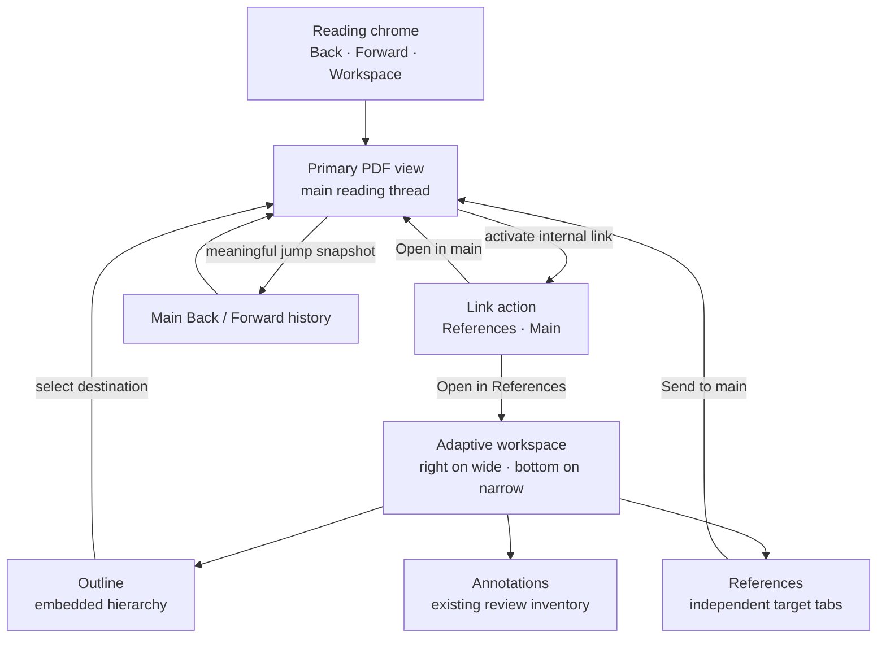
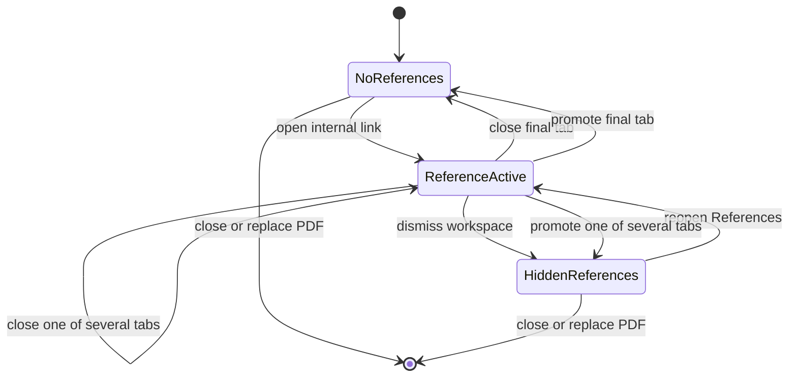
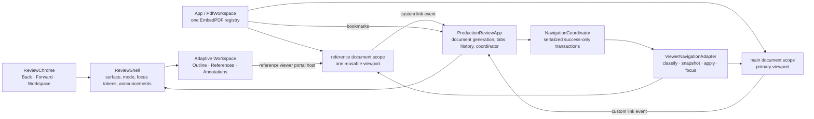
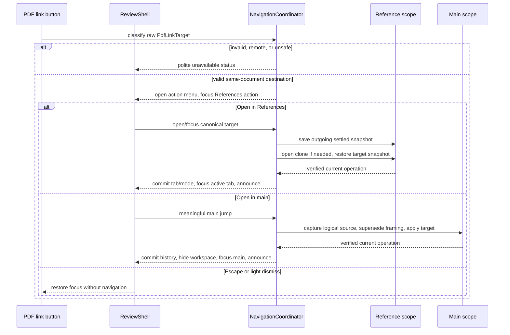
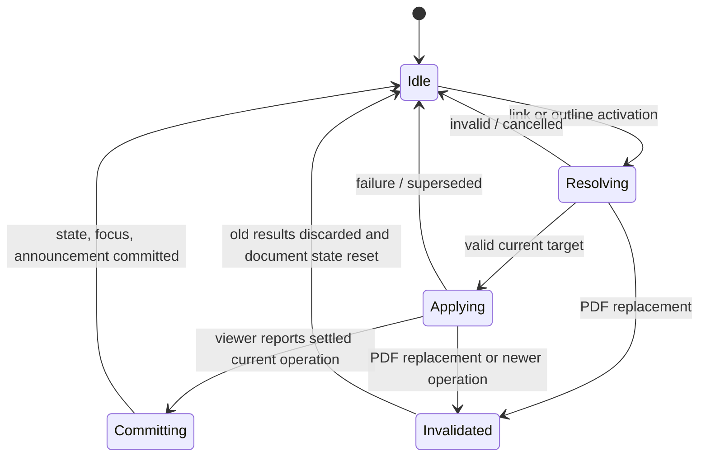
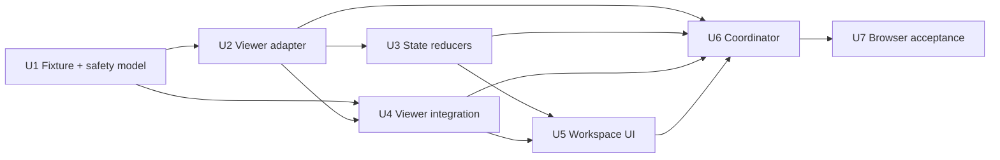

# Reference Navigation Workspace - Plan

## Goal Capsule

- **Objective:** Let a reviewer inspect and compare internal PDF references without losing the primary reading thread or opening a second copy of the document.
- **Product authority:** This contract owns same-document reference tabs, embedded-outline navigation, main-view Back and Forward history, and the extension of the Annotation Tray into a shared adaptive workspace. The reading-first interface contract remains authoritative for the stable viewer, review actions, delivery, and responsive framing outside that extension.
- **Open blockers:** None. A seven-paper public academic corpus passes the link-coverage threshold recorded below, outline availability is reported separately, and the installed EmbedPDF 2.14.4 surface provides a public fail-closed interception path plus an independent second document scope.
- **Execution:** Code.

---

## Product Contract

### Summary

Add a reference-navigation workspace to the existing adaptive side or bottom tray.
In-body internal links offer a compact choice between independently navigable reference tabs and direct main-view navigation, while the embedded document outline and explicit main-view actions move the reading thread through a meaningful Back and Forward history.

### Problem Frame

Academic PDFs often place figures, tables, proofs, equations, and appendix material far from the prose that cites them.
A conventional link jump plus Back requires repeated context switching and makes it difficult to compare the source and target at the same time.
Reviewers work around this by opening two copies of the PDF side by side.

The problem compounds in theoretical papers.
Results and proofs form chains or directed graphs across the main text and appendices, so a reviewer may need several live reference locations while keeping the original argument visible.
Ordinary page-by-page history also fails because it buries meaningful jumps beneath routine reading movement.

### Actors

- A1. **Reviewer:** Reads and marks up one text-native PDF, follows internal references, compares their nearby context, and navigates the document outline.

### Key Decisions

- **Use a tabbed reference workspace.** (session-settled: user-directed — chosen over Back-only navigation, a single companion view, floating overlays, and a detached window: several reference locations must remain available for comparison without moving the primary reader.) Governs R1-R6.
- **Offer an in-place link-action chooser.** (session-settled: user-directed — activating an internal link presents compact `Open in References` and `Open in main` actions: reference lookup remains the default fast path, while navigation-oriented links such as body tables of contents and footnote returns can move the reading thread directly.) Governs R1, R4, R9-R11.
- **Use author-encoded relationships first.** (session-settled: user-approved — chosen over inferred references and a semantic reference atlas: native links and outline metadata provide a reliable first boundary.) Governs R19-R21.
- **Put Outline, References, and Annotations in one adaptive workspace.** (session-settled: user-approved — chosen over independent edge surfaces and layered trays: one surface preserves reading width and predictable responsive behavior.) Governs R13-R18.
- **Let the embedded outline navigate the main view.** (session-settled: user-approved — chosen over opening outline selections as reference tabs or asking on every activation: outline use represents deliberate movement of the reading thread.) Governs R10, R15-R16.
- **Consume a reference tab when it is sent to main.** (session-settled: user-directed — chosen over copying or swapping views: promotion should not leave duplicate locations, and an empty References mode should dismiss itself.) Governs R7-R8, R12.
- **Focus an existing target tab.** (session-settled: user-approved — chosen over duplicate tabs and replacement of the active tab: one live identity per target preserves context without tab proliferation.) Governs R2.
- **Preserve tabs when the tray is dismissed.** (session-settled: user-approved — chosen over clearing all tabs or persisting them across documents: visibility and current-document working state are distinct.) Governs R17-R18.
- **Record meaningful jumps only.** (session-settled: user-approved — chosen over page-by-page history and promotion-only history: explicit destinations should be reversible without routine reading movement flooding the stack.) Governs R9-R12.

### Workspace Shape

The main reader and one adaptive workspace remain part of the same reading surface.
Only one workspace mode is visible at a time, but each mode keeps its own working state.

### Requirements

**Reference tabs**

- R1. Activating an author-encoded same-document link shall present a compact, keyboard-operable action popover offering `Open in References` and `Open in main`; the popover shall not move either view before a choice, and `Open in References` shall receive initial focus as the default fast path. Escape or outside activation shall dismiss the popover without navigation and return focus to the originating PDF link; a successful choice shall continue into the destination-specific focus behavior in R22.
- R2. If the chosen `Open in References` target already has an open reference tab, the action shall focus the existing tab and preserve its current view instead of opening a duplicate.
- R3. Each reference tab shall provide an independently scrollable and zoomable view of the same PDF with enough surrounding context to read beyond the exact destination.
- R4. From either the main PDF or a reference tab, choosing `Open in References` shall open or focus the target tab without moving the main view or discarding an originating tab; choosing `Open in main` shall navigate the main view, record a meaningful history jump, preserve all open reference tabs, and hide the workspace so focus can move to the main destination.
- R5. Switching among reference tabs shall preserve each tab's page, within-page position, zoom, and nearby reading context. Closing a tab shall activate and focus the adjacent tab to its right when available, otherwise the adjacent tab to its left; closing the final reference tab shall close the workspace and return focus to the workspace control.
- R6. Each tab and link-action popover shall identify its destination with the best author-provided label and page context available, while remaining usable when the PDF supplies only a destination or page number. Author-provided labels shall render as inert plain text with markup disabled, bidirectional and control characters neutralized, display length bounded, and page context retained when truncation is necessary.

**Promotion and main history**

- R7. Send to main shall move the selected tab's current document location into the main view and consume that tab.
- R8. Send to main shall always hide the workspace and focus the promoted location in the main PDF. Any remaining reference tabs and their view state shall be preserved for reopening; consuming the final reference tab shall leave no reference-tab state to restore, while preserving References as the last-used workspace mode when applicable.
- R9. Main-view history shall add entries for explicit destination jumps, including `Open in main`, outline selections, and Send to main, but not for ordinary scrolling, sequential page turns, or zoom changes.
- R10. Each history entry shall restore the main page, within-page position, and zoom that were current immediately before the meaningful jump.
- R11. Back and Forward shall behave as a browser-like stack, including discarding the forward branch when a new meaningful jump follows Back.
- R12. Back and Forward shall restore main-view locations without recreating a reference tab consumed by Send to main.

**Shared adaptive workspace**

- R13. Outline, References, and Annotations shall be modes of one nonmodal adaptive workspace rather than simultaneous competing sidebars.
- R14. The workspace shall retain the existing wide right-side and constrained-width bottom presentations without creating a separate narrow-screen workflow.
- R15. Outline mode shall render the PDF's embedded outline as a hierarchical, expandable navigator and indicate the current main-view destination when the metadata permits. Author-provided outline labels shall follow the same inert-text, control-character, length, and page-context rules as reference labels.
- R16. Activating an outline item shall navigate the main view and record a meaningful history jump; a PDF without outline metadata shall show an honest unavailable or empty state rather than inferred structure.
- R17. Dismissing a workspace that has reference tabs shall hide the workspace while preserving those tabs and their view state for the current PDF.
- R18. Switching workspace modes, dismissing and reopening the workspace, or crossing its responsive presentation threshold shall preserve the main view, open reference tabs, active tab, and each mode's scroll and interaction state. Reopening shall restore the last-used mode and its most recently focused surviving item, falling back to the most recent reference tab in References mode or the mode's primary surface. If References is restored with no surviving tab, it shall retain workspace-mode navigation, show an informative empty state explaining that an internal PDF link can open a reference, and programmatically focus a stable primary empty-state region rather than switching modes or presenting a blank panel.

**Boundaries and resilience**

- R19. Reference navigation shall operate on author-encoded internal destinations in the current PDF and shall not infer destinations from unlinked prose.
- R20. A missing, malformed, unsupported, or unsafe destination shall leave the main view unchanged, create no unusable tab, and provide a quiet failure indication.
- R21. External URIs, launch actions, embedded content, and cross-document navigation shall remain governed by the product's existing local-only safety boundary.
- R22. Every workspace, tab, outline, link-choice, promotion, dismissal, and history action shall have a visible keyboard path and expose accessible names, roles, and states. This semantic contract includes the link-action popover, workspace modes, tab list and active tab panel, outline hierarchy and expansion state, current destination, and navigation controls. Opening a reference shall focus its tab; Send to main and direct `Open in main` navigation shall hide the workspace and focus the main PDF at the destination; workspace dismissal shall return focus to the workspace control; link-action popover dismissal shall return focus according to R1; reopening shall restore focus according to R18. Changes to the active tab, current destination, and quiet failure status shall be announced without moving focus except where these explicit transitions require it.

### Key Flows

- F1. Inspect a body reference
  - **Trigger:** A1 activates an internal figure, table, equation, result, proof, section, or appendix link in the main PDF.
  - **Actors:** A1.
  - **Steps:** A compact link-action popover opens; A1 chooses `Open in References`; References mode opens and receives focus; the target opens or focuses in a tab; A1 scrolls or zooms around the target while the source remains anchored.
  - **Outcome:** A1 compares the source and referenced context without opening another PDF copy.
  - **Covers:** R1-R3, R6, R13-R14, R20-R22.
- F2. Follow a reference chain
  - **Trigger:** A1 follows a link from an open reference tab.
  - **Actors:** A1.
  - **Steps:** A1 chooses `Open in References`; a second target opens or focuses in another tab; A1 switches among result, proof, equation, or appendix locations; every tab retains its view.
  - **Outcome:** A1 explores a reference chain without disturbing the main reading thread or losing earlier targets.
  - **Covers:** R2, R4-R6, R18-R19.
- F3. Promote a reference to the reading thread
  - **Trigger:** A1 chooses Send to main on a reference tab.
  - **Actors:** A1.
  - **Steps:** The tab's current location becomes the main view; the tab is consumed; the previous main view enters history; the tray hides; focus moves to the main destination; any remaining reference tabs stay preserved for reopening.
  - **Outcome:** A1 continues primary reading from the referenced context and can use Back to return.
  - **Covers:** R7-R12.
- F4. Navigate the document outline
  - **Trigger:** A1 opens Outline mode and chooses an embedded outline item.
  - **Actors:** A1.
  - **Steps:** The hierarchy expands or collapses without moving the document; selection moves the main view and adds a history entry.
  - **Outcome:** A1 makes deliberate section-level jumps and reverses them with Back.
  - **Covers:** R9-R11, R13, R15-R16, R22.
- F5. Pause and resume reference work
  - **Trigger:** A1 dismisses the tray, switches to Annotations, or resizes the surface.
  - **Actors:** A1.
  - **Steps:** The workspace hides, changes mode, or reflows; A1 later reopens it and returns to the last-used mode, scroll position, and focused surviving item.
  - **Outcome:** The main view and every current-document workspace state resume where A1 left them.
  - **Covers:** R13-R18, R22.
- F6. Follow a navigation-oriented link in main
  - **Trigger:** A1 activates a body table-of-contents link, footnote return, continuation link, or another valid internal destination intended to move the reading thread.
  - **Actors:** A1.
  - **Steps:** The link-action popover opens; A1 chooses `Open in main`; the workspace hides if visible; the main view moves to and focuses the destination while preserving reference tabs and recording the prior main location.
  - **Outcome:** A1 can navigate the document directly without creating and then consuming an unnecessary reference tab.
  - **Covers:** R1, R4, R9-R11, R18, R20-R22.

### Reference Lifecycle

### Acceptance Examples

- AE1. Side-by-side equation lookup
  - **Covers R1-R3, R13-R14.**
  - **Given:** A1 is reading prose that links to an earlier equation.
  - **When:** A1 activates the link, chooses `Open in References`, and scrolls above the equation in its reference tab.
  - **Then:** The prose remains at the same main location and zoom while the tab exposes the equation and its preceding context.
- AE2. Repeated theorem target
  - **Covers R2, R4-R6.**
  - **Given:** Lemma A.7 is already open and scrolled into its proof.
  - **When:** A1 follows another link to Lemma A.7 and chooses `Open in References`.
  - **Then:** The existing tab becomes active at its preserved proof context and no duplicate tab is created.
- AE3. Result and proof chain
  - **Covers R4-R5, R18.**
  - **Given:** A1 has separate reference tabs for a theorem, proposition, lemma, and proof.
  - **When:** A1 switches among them, visits Annotations, and returns to References.
  - **Then:** Every reference tab resumes its own reading position and the main theorem discussion remains unchanged.
- AE4. Send to main and return
  - **Covers R7-R12.**
  - **Given:** One reference tab is open and A1 has scrolled beyond its original destination.
  - **When:** A1 sends the tab to main and then chooses Back.
  - **Then:** The tab is consumed, the empty tray closes, Back restores the exact prior main view, and Forward returns to the promoted location without recreating the tab.
- AE5. Meaningful history
  - **Covers R9-R11.**
  - **Given:** A1 scrolls through several pages, changes zoom, selects an outline destination, and later scrolls again.
  - **When:** A1 chooses Back.
  - **Then:** Back reverses the outline jump rather than replaying routine scrolling, page turns, or zoom changes.
- AE6. Outline availability
  - **Covers R15-R16.**
  - **Given:** One PDF has an embedded outline and another does not.
  - **When:** A1 opens Outline mode in each document.
  - **Then:** The first shows its author-provided hierarchy and the second reports that no outline is available without inventing one.
- AE7. Responsive workspace
  - **Covers R14, R17-R18, R22.**
  - **Given:** A1 has several reference tabs and an expanded outline branch on a wide surface.
  - **When:** The workspace reflows from the right side to the bottom and A1 dismisses and reopens it by keyboard.
  - **Then:** The main view, tabs, active tab, reference positions, outline state, and annotation state remain intact.
- AE8. Invalid destination
  - **Covers R19-R21.**
  - **Given:** An internal link has no usable same-document destination.
  - **When:** A1 activates it.
  - **Then:** The main view stays fixed, no broken reference tab appears, and the interface indicates that the target could not be opened.
- AE9. Direct body navigation
  - **Covers R1, R4, R9-R11, R18, R22.**
  - **Given:** A1 activates a body table-of-contents link or footnote return while several reference tabs are open.
  - **When:** A1 chooses `Open in main` from the link-action popover.
  - **Then:** The workspace hides, the tabs remain preserved, the main PDF receives focus at the destination, and Back restores the exact prior main view.
- AE10. Hostile author-provided label
  - **Covers R6, R15, R20-R21.**
  - **Given:** A PDF supplies a destination or outline label containing markup, bidirectional controls, control characters, or excessive text.
  - **When:** The label appears in the workspace or link-action popover.
  - **Then:** It renders as bounded inert text with unsafe controls neutralized and enough page context to identify the destination.
- AE11. Cancel a link action
  - **Covers R1, R22.**
  - **Given:** A1 activates an internal link by keyboard and the link-action popover focuses `Open in References`.
  - **When:** A1 presses Escape or dismisses the popover outside it.
  - **Then:** Neither PDF view moves, no reference tab opens, and focus returns to the originating link.
- AE12. Reopen empty References
  - **Covers R8, R18, R22.**
  - **Given:** References was the last-used workspace mode and its final tab was closed or consumed.
  - **When:** A1 reopens the workspace.
  - **Then:** References remains selected, workspace-mode navigation remains available, an informative empty state explains how to open a reference, and its stable primary region receives focus.
- AE13. Announce reference navigation state
  - **Covers R15, R20, R22.**
  - **Given:** A1 uses a screen reader while navigating reference tabs and the document outline.
  - **When:** The active tab or destination changes, an outline branch expands, or a destination fails quietly.
  - **Then:** Names, roles, active and expanded states, destinations, and failure status are exposed or announced without an unrelated focus move.

### Success Criteria

- For PDFs in the metadata-supported cohort established by representative-corpus validation, A1 can inspect a distant figure, table, equation, result, proof, section, or appendix with its nearby context while the citing prose remains visible.
- For that supported cohort, A1 can explore several linked locations and return to each without reopening the PDF or reconstructing prior view positions.
- The main view changes only through deliberate main-navigation actions and returns exactly through a compact, meaningful history.
- Outline, References, and Annotations remain coherent across wide and constrained surfaces without remounting the primary viewer or losing current-document workspace state.

### Scope Boundaries

- No inference of unlinked equations, results, proofs, figures, tables, or section references.
- No exhaustive semantic reference atlas or generated theorem-and-proof graph.
- No reference tabs that span multiple PDFs, survive document replacement, or persist across app sessions.
- No change to annotation meaning, review commands, recovery, export, delivery, or external-link safety policy.
- No independent floating or operating-system-level companion window in this work unit.

### Dependencies and Assumptions

- The 2026-08-10 planning sample contains seven public academic PDFs spanning mechanism design, causal inference/econometrics, learning theory, and appendix-heavy ML research (270 pages total). Six of seven papers contain usable same-document destinations; 2,066 of 2,104 link annotations classify as usable internal links. Five of seven contain embedded outline items. The implementation gate passes when at least 70% of sampled papers contain one usable internal target and at least 90% of discovered link annotations classify as usable internal destinations; the sample passes at 85.7% and 98.2%, respectively. Outline coverage is reported separately at 71.4% and is not a gate because R16 already defines an honest empty state.
- Useful reference behavior depends on the source PDF belonging to the resulting metadata-supported cohort; Outline mode additionally depends on embedded outline metadata.
- `docs/plans/2026-08-07-002-feat-reading-first-pdf-review-interface-plan.md` remains the product authority for the reading-first shell and shared viewer.
- `docs/solutions/architecture-patterns/adaptive-annotation-tray-framing.md` remains the product authority for adaptive side or bottom presentation and reading-state preservation.

### Sources and Research

- `apps/web/src/pdf/embedpdf-viewer.ts` establishes the current single-document viewer and plugin composition.
- `docs/decisions/pdf-backend.md` establishes the current local-only link-safety boundary.
- `apps/web/src/pdf/viewer-controls.ts` exposes current main-view page, scroll, and zoom events and controls.
- `apps/web/src/app/ProductionReviewApp.tsx` contains the existing explicit page-and-coordinate navigation seam.
- `apps/web/src/review/review-surface-state.ts` shows that the project-owned review interface does not yet model Outline, References, or main Back and Forward history.
- `apps/web/src/app/ReviewShell.tsx` and `apps/web/src/review/use-annotation-tray-framing.ts` establish the current nonmodal tray and responsive framing behavior.
- EmbedPDF 2.14.4 public model and plugin types establish resolved `PdfLinkTarget` values, document-scoped Viewport/Scroll/Zoom state, a two-document `DocumentManager`, and engine bookmark discovery. Official plugin references: [Document Manager](https://www.embedpdf.com/docs/react/headless/plugins/plugin-document-manager), [Viewport](https://www.embedpdf.com/docs/react/headless/plugins/plugin-viewport), [Scroll](https://www.embedpdf.com/docs/react/headless/plugins/plugin-scroll), and [Zoom](https://www.embedpdf.com/docs/react/headless/plugins/plugin-zoom).
- WAI-ARIA Authoring Practices establish the [menu](https://www.w3.org/WAI/ARIA/apg/patterns/menubar/), [tabs](https://www.w3.org/WAI/ARIA/apg/patterns/tabs/), and [disclosure](https://www.w3.org/WAI/ARIA/apg/patterns/disclosure/) interaction patterns selected below. The HTML [popover](https://html.spec.whatwg.org/multipage/popover.html) and [inert subtree](https://html.spec.whatwg.org/dev/interaction.html#inert-subtrees) models govern light dismissal and hidden mounted panels.
- Representative-corpus evidence was measured on the public arXiv PDFs `1305.4002`, `1606.03976`, `1607.00699`, `1706.03762`, `2107.00856`, `2301.13654`, and `2406.07585`. The temporary measurement counted PDF link annotations and outline items without adding third-party paper content to the repository.

## Planning Contract

### Planning Scope

This plan extends the existing production review shell; it does not replace the viewer, review model, export path, or delivery flows.
The implementation introduces a document-scoped navigation authority, one reusable reference document view, and a generalized adaptive workspace.
Every EmbedPDF operation remains behind project-owned adapters, and every state mutation is committed only after the corresponding viewer operation succeeds.

### Assumptions

- The authenticated same-origin document URL may be opened a second time in the existing EmbedPDF registry under a stable reference document ID. That produces a second full-fetch/open cost but reuses the existing PDFium engine and plugin registry.
- Only one reference tab is visible at a time. Inactive tabs retain semantic viewer snapshots in application state rather than mounted page stacks.
- Outline activation keeps the workspace open and focus on the activated outline control while the main PDF moves and announces the destination. Direct `Open in main` and Send to main retain their settled hide-and-focus-main behavior.
- A Framing Session may temporarily displace pixels to keep source content reachable, but it never changes the logical Main Reading Thread destination, zoom, semantic location, or history.
- Reference-tab activation uses manual tab activation because restoring a PDF location is asynchronous. Arrow keys move focus; Enter or Space activates.
- The custom EmbedPDF renderer ID `link` is an upstream integration convention in pinned version 2.14.4. A characterization test must fail visibly if a package upgrade stops replacing the built-in renderer.

### Key Technical Decisions

- **KTD1 — Use one EmbedPDF registry with two document IDs.** Keep the existing main document active and lazily open the same authenticated URL as `reference` with `autoActivate: false`; render one reference viewport for the active Reference Tab and store inactive-tab snapshots in application state. Build a fresh reference `LoadDocumentUrlOptions` through the existing safe document-options helper so both opens use the validated same-origin URL, `credentials: 'omit'`, and the same memory-only Authorization header. Request options, credentials, and raw load errors never enter reducer state, logs, announcements, or retry UI. This provides independent document-scoped Viewport, Scroll, and Zoom state without one worker or registry per tab. Governs R3-R5, R7-R8, R17-R18, R21.
- **KTD2 — Intercept link annotations before EmbedPDF navigation.** Replace the locked built-in `link` annotation renderer with a project-owned native button that emits the raw public `PdfLinkTarget`; never call `navigateTarget()` for internal links because it scrolls immediately when Scroll is installed. A fail-closed classifier accepts only direct destinations and same-document `Goto` actions, and rejects `RemoteGoto`, URI, Launch, unsupported, malformed, non-finite, and out-of-range targets before UI or history mutation. Governs R1, R4, R19-R22.
- **KTD3 — Use canonical semantic destinations and locations.** A target identity contains the current document generation plus normalized page index, zoom mode and parameters, and normalized view coordinates. A live viewer snapshot contains page index, a natural within-page anchor, viewport alignment percentages, and actual numeric zoom; raw scroll offsets are optional transient optimization only. Aliases resolving to the same semantic target deduplicate, while distinct coordinates on the same page remain distinct. Governs R2-R7, R10, R18-R20.
- **KTD4 — Serialize all viewer work through a generation-guarded navigation coordinator.** Main jumps, Back/Forward, reference restores, document replacement, and framing settlement receive operation generations. Stale asynchronous completions cannot commit tabs, history, focus, announcements, or viewer movement. Governs R4-R12, R16, R18, R20-R22.
- **KTD5 — Model meaningful history as live browser-style entries.** Before a meaningful jump, Back, or Forward, refresh the departing entry from the current settled main view. A successful new jump truncates the forward branch and appends the verified destination; failed or semantic no-op jumps do not mutate history. Ordinary reading updates the current entry lazily but never pushes a new one. Governs R9-R12.
- **KTD6 — Generalize the existing tray in place.** Replace annotation-specific surface naming with one continuously mounted Workspace shell containing hidden/inert Outline, References, and Annotations panels. Preserve the existing measured-stage right/bottom presentation, Viewer Runway, hysteresis, and tokenized Framing Session behavior. Governs R13-R18, R22.
- **KTD7 — Use established accessible composites only where they fit.** Outline, References, and Annotations form an outer manual-activation `tablist` with one selected/tabbable mode tab, arrow and Home/End focus movement, Enter/Space activation, and explicit tab/panel relationships. The link chooser is a nonmodal `menu` opened by a native button with `aria-haspopup="menu"`; References uses a nested `tablist`/`tab`/`tabpanel` with manual activation; Outline uses a labelled `nav`, nested native lists, destination buttons, and separate disclosure buttons rather than imposing a desktop tree. Closed or inactive mounted panels use `hidden` and `inert`; one persistent polite status region announces non-urgent changes. Governs R1, R5-R6, R13-R15, R18, R20, R22.
- **KTD8 — Discover outline and labels through shared safe adapters.** Load bookmarks from `PdfEngine.getBookmarks()`, scope results to the current document generation, route bookmark targets through the same classifier, and render normalized bounded text. Link labels prefer safe `contents` or `subject`, then intersecting source text when available, then trusted page context. Governs R6, R15-R16, R19-R22.

### Higher-Level Technical Design

#### Components and state ownership

State ownership is deliberately non-overlapping:

| Owner | Durable for current document | Transient |
| --- | --- | --- |
| `ProductionReviewApp` | document generation, reference tabs and snapshots, active tab, outline result, meaningful history | navigation operations and clone-open status |
| `ReviewShell` | last workspace mode, per-mode scroll/focus tokens, outline expansion, active presentation state | chooser placement, opener fallback, live announcement revision |
| `PdfWorkspace` | main and reference document scopes inside one registry | rendered pages, link-button elements, viewer plugin subscriptions |
| `ViewerNavigationAdapter` | none | generation-scoped snapshot/apply work |

#### Internal-link protocol

#### Transaction and invalidation lifecycle

For any main-navigation transaction, the coordinator must:

1. Validate the target and acquire a new operation generation.
2. Capture the current logical main location without interface-owned runway displacement.
3. Supersede pending Framing Session work and settle workspace visibility/runway as the action requires.
4. Apply zoom, wait for the current document layout, then apply semantic page coordinates.
5. Verify that the operation and document generation are still current.
6. Commit history and tab consumption only after success.
7. Move focus and publish one polite announcement.

For any reference-tab switch, the coordinator must:

1. Save the outgoing active tab's settled semantic snapshot.
2. Select the incoming logical tab and invalidate any earlier restore.
3. Open the reference document scope lazily if necessary.
4. Restore the saved snapshot or initial destination after layout readiness.
5. Commit active state and focus only if the switch generation remains current.

The first clone open has a transient, destination-labelled Reference Tab and panel immediately after the chooser action. The transient panel is `aria-busy="true"` and does not enter durable tab or history state until the viewer verifies the destination. Failure keeps prior durable tabs unchanged and turns the transient panel into a stable unavailable state with one `Retry reference` action; retry preserves focus and the pending target.

### Failure and Recovery Matrix

| Condition | Required behavior |
| --- | --- |
| Invalid, malformed, remote, launch, unsupported, or out-of-range target | No chooser for unsafe targets, no tab/history change, no main movement; publish bounded polite status |
| Reference document fails to open | Keep existing tabs and main state unchanged; References shows retryable unavailable state and keeps stable focus |
| Destination apply or layout settlement fails | Do not commit history, consume a tab, or change logical active state; retain origin focus/workspace |
| Outline load fails | Show an unavailable state distinct from loaded-empty; keep Annotations and References usable |
| Rapid A→B→A tab switches or Back/Forward | Only the latest generation may restore/commit; stale callbacks are ignored |
| Link origin virtualizes out of the DOM before dismissal | Restore focus to the owning main/reference viewer region or active Reference Tab fallback |
| PDF identity changes mid-operation | Atomically invalidate operations; dismiss chooser; close reference scope; clear tabs, history, outline, mode scroll/focus tokens, and old announcements |
| Send to main fails | Preserve the active tab, workspace visibility, focus, and history; consume only after verified navigation |
| Final tab closes | Dispose/close the reference document scope, hide workspace, settle framing, then focus the Workspace control |
| Reference clone is already in an error state | Retry the stable reference document ID through the document manager's retry operation; retain the pending target, generation-guard the result, and close the error-state document on reset |

## Implementation Units

### U1 — Navigation fixture and fail-closed metadata model

- **Intent:** Establish deterministic internal-link/outline coverage and pure safety/identity primitives before UI work.
- **Dependencies:** None.
- **Files:**
  - Modify `test/fixtures/pdfs/generate.ts`.
  - Add `apps/web/src/pdf/pdf-navigation-target.ts`.
  - Add `apps/web/src/pdf/pdf-navigation-metadata.ts`.
  - Add `apps/web/test/pdf-navigation-target.test.ts` and `apps/web/test/pdf-navigation-metadata.test.ts`.
  - Extend `test/conformance/pdf-viewer.conformance.spec.ts` and its viewer harness where needed.
- **Work:**
  - Generate a multi-page academic-style fixture with repeated and aliased internal links, page-only and XYZ destinations, nested bookmarks, links from one reference target to another, body-TOC and footnote-return cases, hostile labels, URI, RemoteGoto, Launch, malformed, missing, and out-of-bounds targets.
  - Implement canonical target normalization and validation for direct destinations and same-document `Goto` only.
  - Implement bounded inert label normalization that replaces C0/C1/bidirectional controls, collapses disruptive whitespace, and keeps page context separate from author text.
  - Characterize PDFium exposure of links and bookmarks and prove rejected actions make no external request.
- **Covers:** R2, R6, R15-R16, R19-R21; AE2, AE6, AE8, AE10.
- **Exit evidence:** Pure tests prove classification, alias dedupe, same-page distinct targets, label bounds, and hostile-action rejection; the conformance fixture exposes the expected links/bookmarks through the installed engine.

### U2 — Semantic viewer navigation adapter

- **Intent:** Create the only repository seam that captures and applies restorable PDF locations.
- **Dependencies:** U1.
- **Files:**
  - Add `apps/web/src/pdf/viewer-navigation.ts`.
  - Add `apps/web/src/pdf/viewer-navigation-adapter.ts`.
  - Add `apps/web/test/viewer-navigation.test.ts`.
  - Extend `apps/web/src/pdf/viewer-framing-adapter.ts` only for logical-baseline access or cancellation needed by coordinated main jumps.
- **Work:**
  - Capture page index, natural page anchor, viewport alignment, and actual zoom from public Viewport/Scroll/Zoom scopes and page DOM geometry.
  - Map PDF XYZ, FitPage, FitHorizontal, FitVertical, FitRectangle, and bounding-box variants onto public zoom/scroll operations with explicit bottom-origin to top-origin conversion.
  - Define `applyLocation()` as a generation-scoped promise: subscribe before requesting zoom, wait for the requested scoped zoom plus its resulting layout, issue the page-coordinate scroll, wait for scoped scroll activity to become idle plus layout frames, and verify a captured semantic snapshot against explicit coordinate/alignment and zoom tolerances.
  - Reject a location apply on bounded timeout, document replacement, operation supersession, or failed postcondition; restore zoom before final page-coordinate alignment and never infer success from a void plugin method call.
  - Expose focus-at-destination and snapshot equality helpers without leaking EmbedPDF types into shell state.
- **Covers:** R3-R5, R7, R10, R14, R18, R20, R22; AE1, AE4, AE7.
- **Exit evidence:** Adapter tests cover coordinate conversion, fit mappings, zoom-before-scroll ordering, exact semantic round trips, no-op detection, and stale-operation cancellation.

### U3 — Reference tabs, workspace memory, and meaningful-history reducers

- **Intent:** Make lifecycle and branching behavior deterministic before connecting real viewers.
- **Dependencies:** U1 and the neutral location type from U2.
- **Files:**
  - Add `apps/web/src/review/reference-navigation-state.ts`.
  - Add `apps/web/test/reference-navigation-state.test.ts`.
  - Modify `apps/web/src/review/review-surface-state.ts` and `apps/web/test/review-surface-state.test.ts`.
- **Work:**
  - Model one tab per canonical target, original immutable identity plus mutable live snapshot, active-tab switching, right-else-left close/consume behavior, hidden successor selection, and final-tab workspace dismissal.
  - Model `reading | workspace | finish` with `outline | references | annotations` as retained workspace modes and logical per-mode focus/scroll tokens.
  - Model browser-style main history with a cursor, live departing-entry refresh, success-only append, forward truncation, disabled ends, no-op exclusion, and document reset.
  - Add one document-generation invalidation action that clears all current-document navigation and workspace memory.
- **Covers:** R2, R4-R12, R13, R17-R18, R22; AE2-AE5, AE7, AE9, AE12.
- **Exit evidence:** Reducer tests cover dedupe, rapid switch tokens, inactive close, promotion success/failure, hidden successor, history branching/live refresh, mode restoration, and atomic document reset.

### U4 — Viewer interception, second document scope, and outline discovery

- **Intent:** Connect the public EmbedPDF seams without allowing built-in link navigation.
- **Dependencies:** U1-U2.
- **Files:**
  - Modify `apps/web/src/pdf/embedpdf-viewer.ts` to allow two documents while keeping the main active.
  - Modify `apps/web/src/pdf/PdfWorkspace.tsx`, `apps/web/src/pdf/viewer-interaction-events.ts`, and `apps/web/src/app/App.tsx`.
  - Add `apps/web/src/pdf/PdfLinkControl.tsx` and `apps/web/src/pdf/ReferencePdfViewport.tsx` or equivalently focused modules.
  - Extend `apps/web/test/viewer-interaction-events.test.ts`, `apps/web/test/app-interactions.test.ts`, and `apps/web/test/production-review-app.test.tsx`.
- **Work:**
  - Override the pinned `link` renderer with a keyboard-focusable native control, extract safe label/page context, stop page-note/selection fallthrough, and emit a neutral main/reference link event before navigation.
  - Preserve non-link annotation visuals as inert/assistive-hidden while exposing link controls.
  - Lazily open the stable reference document ID with `autoActivate: false` using a fresh result from `buildViewerDocumentOptions`; assert that both opens preserve same-origin validation, `credentials: 'omit'`, and the memory-only Authorization header without exposing credentials or raw load errors.
  - Split `App.tsx` initialization into main and reference paths. Bind active-document tracking, framing, annotation inventory, text reliability, selection, page-note, owned-mark, and review subscriptions exclusively to the fixed main document ID; give the reference document only its scoped viewport, link interception, and navigation subscriptions, with independent disposal.
  - Treat clone open as a document-generation-scoped single flight, mount one reference Viewport/Scroller/Zoom stack through a React portal into the workspace tabpanel, and keep the main document active.
  - Retain a failed clone under its stable document ID and route the unavailable state's Retry action through generation-guarded `retryDocument(referenceId)`; preserve the pending target until success and close the failed document during current-document reset.
  - Load bookmarks once per main document generation via `getBookmarks()`, classify/sanitize them, and publish loading, loaded-empty, loaded-tree, or unavailable results.
  - Close the clone and dispose its subscriptions when the final tab is gone or the PDF is replaced.
- **Covers:** R1, R3-R4, R6, R15-R16, R18-R22; AE1, AE6, AE8, AE10-AE11.
- **Exit evidence:** Tests prove an intercepted link never scrolls either document, unsafe actions never reach chooser/navigation, the reference document remains non-active and independent, nested bookmarks publish safely, and package renderer replacement still works on 2.14.4.

### U5 — Shared adaptive workspace and accessible interaction components

- **Intent:** Turn the Annotation Tray into one coherent retained Workspace without regressing responsive framing.
- **Dependencies:** U3 and the reference portal contract from U4.
- **Files:**
  - Add `apps/web/src/review/LinkActionPopover.tsx`, `apps/web/src/review/ReferenceWorkspace.tsx`, and `apps/web/src/review/OutlineNavigator.tsx`.
  - Modify `apps/web/src/app/ReviewShell.tsx`, `apps/web/src/review/ReviewChrome.tsx`, and `apps/web/src/review/use-annotation-tray-framing.ts` with generalized workspace names while preserving behavior.
  - Modify `apps/web/src/app/review-layout-foundation.css`, `apps/web/src/app/review-layout-annotations.css`, and `apps/web/src/app/review-layout-responsive.css`.
  - Extend `apps/web/test/review-layout.test.tsx` and `apps/web/test/review-surface-state.test.ts`.
- **Work:**
  - Build the light-dismissible menu chooser with first-item focus, Up/Down, Home/End, Enter/Space, Tab dismissal, Escape/outside focus restoration, and source-viewer fallback. Render it in the top layer anchored to the originating link's fixed client rectangle, flip and clamp it inside the visible application viewport, keep both actions visible without horizontal scrolling, recompute on viewport resize, and dismiss through the documented fallback if source scroll, zoom, or virtualization invalidates the anchor.
  - Build Outline, References, and Annotations as the outer manual-activation mode tablist defined by KTD7, restore each activated mode's logical focus target, and expose one selected mode and explicit tab/panel relationships.
  - Build manual-activation reference tabs with arrow navigation, Home/End, Enter/Space, Delete close, an adjacent active-panel close action, Send to main, and one tabpanel hosting the portal.
  - Build the first-open transient Reference Tab/panel with a destination label, `aria-busy`, stable retry focus, and success-only promotion into durable state.
  - Build Outline as a labelled navigation list with separate disclosure and destination buttons, `aria-expanded`, `aria-controls`, and `aria-current="location"`; preserve expansion, scroll, and logical focus. Derive the current item as the deepest valid bookmark at or immediately before the settled main reading anchor, break equal destinations by document order, recompute after settled explicit navigation and ordinary scrolling, and expose no current item when bookmark destinations cannot be ordered safely.
  - Keep all three mode panels mounted only when state retention needs it, otherwise use `hidden`; apply `inert` wherever a mounted panel must remain non-interactive.
  - Move overflow from the shared aside into mode panels so the tablist/header stays fixed and reference PDF context fills available height.
  - Generalize framing attributes without changing measured-stage hysteresis, reduced-motion behavior, user-ownership rules, or main-view mount identity.
- **Covers:** R1, R5-R6, R13-R18, R20, R22; AE3, AE6-AE7, AE10-AE13.
- **Exit evidence:** Component tests prove roles/relationships, one selected and tabbable tab, deterministic close focus, chooser cancellation, empty/loading/error states, mode memory, closed-surface inertness, and no focus move on responsive reflow.

### U6 — Document-scoped navigation coordinator and production integration

- **Intent:** Make main/reference navigation, history, framing, tab consumption, focus, and announcements one success-only transaction.
- **Dependencies:** U2-U5.
- **Files:**
  - Add `apps/web/src/review/navigation-coordinator.ts`.
  - Modify `apps/web/src/app/ProductionReviewApp.tsx`, `apps/web/src/app/ReviewShell.tsx`, and `apps/web/src/review/ReviewChrome.tsx`.
  - Add `apps/web/test/navigation-coordinator.test.ts` and extend `apps/web/test/production-review-app.test.tsx`.
- **Work:**
  - Route link choices from both main and reference viewers through one classifier/menu request path; newer requests supersede older ones.
  - Expose a transient pending reference state immediately after `Open in References`, promote it only after the current clone/location operation verifies, and preserve the current pending target through a generation-guarded retry.
  - Implement the serialized reference-switch protocol and preserve every tab's settled live context.
  - Implement direct main, outline, Send, Back, and Forward through the coordinator sequence above; refresh departing history locations and commit/consume only after verified navigation.
  - Give Back/Forward distinct chrome controls and accessible disabled states without conflating them with annotation Undo/Redo.
  - Ensure direct main and Send close/settle the workspace and framing before focus-main, while outline leaves the workspace open and focus stable.
  - Atomically invalidate the entire navigation domain on document replacement and ignore late old-document callbacks.
  - Ensure repeated link activation shares one clone-open request per document generation and never duplicates the authenticated full fetch.
- **Covers:** R1-R12, R16-R22; F1-F6; AE1-AE13.
- **Exit evidence:** Unit/integration tests cover success, failure, no-op, rapid-operation races, live history refresh, promotion from the tab's current scrolled location, replacement during every async phase, and one polite announcement per committed transition.

### U7 — Installed-viewer, responsive, and safety acceptance

- **Intent:** Prove the interaction against real PDF virtualization, focus, geometry, and browser behavior.
- **Dependencies:** U1-U6.
- **Files:**
  - Extend `test/acceptance/review-workflow.spec.ts`, `test/acceptance/production-flow.spec.ts`, and `test/acceptance/review-visual.spec.ts`.
  - Extend `test/conformance/pdf-viewer.conformance.spec.ts`.
- **Work:**
  - Exercise equation, theorem/proof, figure/table, section/appendix, body-TOC, footnote-return, chained-reference, repeated-alias, malformed, external, no-outline, and hostile-label fixture paths.
  - Prove the main source stays logically anchored while the reference view scrolls/zooms, and tab snapshots survive side→bottom→side reflow.
  - Exercise chooser light dismissal, double activation, source virtualization, rapid A→B→A switching, pending close/promote, rapid Back/Forward, and PDF replacement.
  - Assert clone request cardinality, safe request options on both document opens, retry-from-error success, no credential or raw-load-error disclosure, and isolation of every main-only initialization/subscription from reference events.
  - Verify focus order, no obscured focus, live status, workspace mode restoration, active tab semantics, and current outline location at wide and constrained widths.
  - Run geometry and focus flows in Chromium and WebKit; preserve existing main viewer mount and annotation state.
- **Covers:** All requirements and acceptance examples.
- **Exit evidence:** Targeted Chromium and WebKit acceptance passes with no external requests from rejected PDF actions and no main-view/history mutation from reference-only interactions.

## Verification Contract

### Fast gates during implementation

1. `pnpm fixtures:pdf`
2. `pnpm exec vitest run apps/web/test/pdf-navigation-target.test.ts apps/web/test/pdf-navigation-metadata.test.ts apps/web/test/viewer-navigation.test.ts apps/web/test/reference-navigation-state.test.ts apps/web/test/navigation-coordinator.test.ts`
3. `pnpm exec vitest run apps/web/test/review-surface-state.test.ts apps/web/test/review-layout.test.tsx apps/web/test/app-interactions.test.ts apps/web/test/production-review-app.test.tsx`
4. `pnpm typecheck`

### Integration and release gates

1. `pnpm test:review`
2. `pnpm test:web`
3. `pnpm test:pdf-viewer`
4. `pnpm build:web`
5. `pnpm exec playwright test test/acceptance/review-workflow.spec.ts test/acceptance/production-flow.spec.ts`
6. `pnpm exec playwright test --config playwright.webkit.config.ts test/acceptance/review-workflow.spec.ts test/acceptance/production-flow.spec.ts`

### Manual browser checks

- On a linked fixture at wide width, open an equation reference, keep citing prose visible, scroll/zoom the reference, open a second reference from it, switch back, and confirm both tab contexts and the main context are unchanged.
- Send the active reference's current scrolled position to main, use Back and Forward after additional ordinary scrolling, and confirm exact semantic returns without recreating the consumed tab.
- Resize across right/bottom presentation while focus is in each mode; confirm no remount, focus loss, hidden-panel tab stop, or scroll reset.
- Activate invalid and external actions and confirm no network request, viewer movement, broken tab, raw unsafe label, or assertive announcement.

## Definition of Done

- The corpus gate remains documented and passing; deterministic fixtures cover every supported and rejected target class.
- In-body internal links in both main and reference viewers open the chooser before any navigation.
- Reference tabs deduplicate canonical targets, preserve semantic position/zoom, and follow settled close, hide, reopen, and promotion focus rules.
- Outline, References, and Annotations share one adaptive continuously mounted workspace with retained current-document state.
- Direct main, outline, Send, Back, and Forward use success-only meaningful history and cannot race with framing or stale viewer work.
- PDF replacement atomically clears and disposes all current-document navigation state.
- External/unsafe targets remain inside the existing local-only boundary.
- Keyboard, focus, roles, states, and polite announcements satisfy R22 in Chromium and WebKit.
- `pnpm typecheck`, `pnpm build:web`, the fast unit gates, `pnpm test:review`, `pnpm test:web`, `pnpm test:pdf-viewer`, and targeted Chromium/WebKit acceptance all pass.

## Sequencing and Parallel Work

After U1, U2 and U4's renderer/outline characterization may proceed independently. U3 begins after U2 establishes the neutral location contract. U5 should not invent viewer state and therefore waits for U3/U4 contracts. U6 is the integration convergence point; U7 is the release gate.

## Deferred / Open Questions

### From 2026-08-10 review

- **Reference workspace resource-exhaustion ceilings remain intentionally deferred and non-blocking** — Workspace resilience (P1, security-lens, confidence 75)

  A large or crafted PDF, or a long reading session, could degrade or destabilize the reader because live reference tabs, rendered outline state, and main-navigation history have no specified resource ceilings or non-destructive behavior when a limit is reached. KTD1 bounds mounted reference viewers to one, and all state shapes admit later caps, but this plan does not silently invent tab, outline, or history limits after the user explicitly deferred that product choice.
