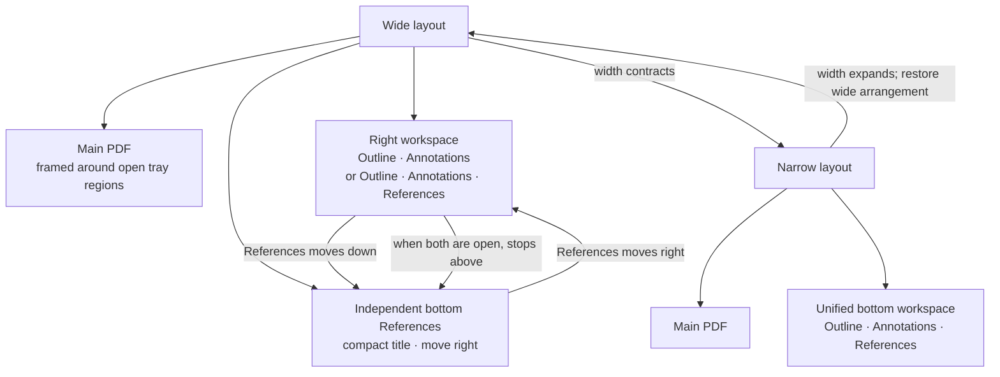
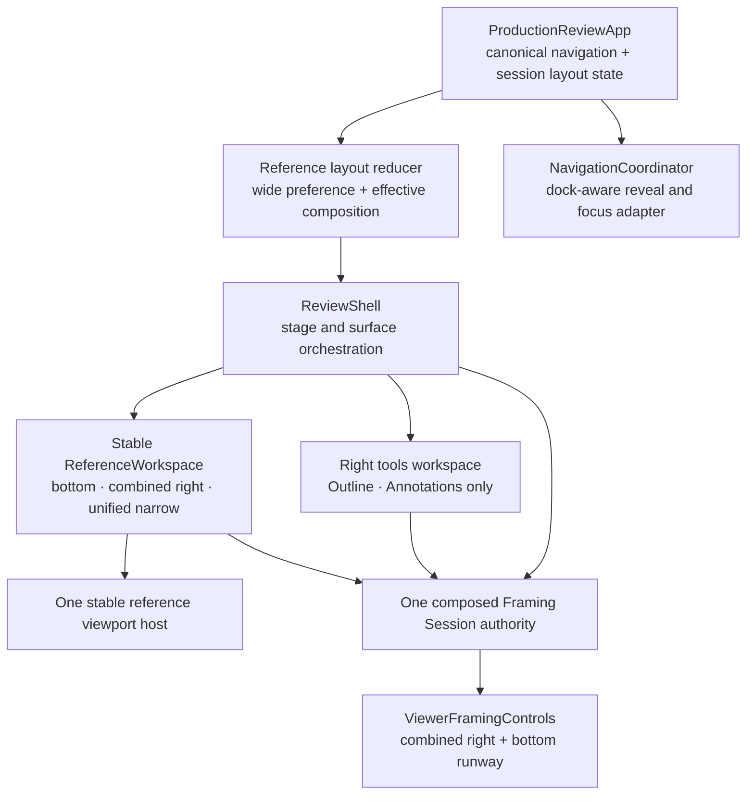
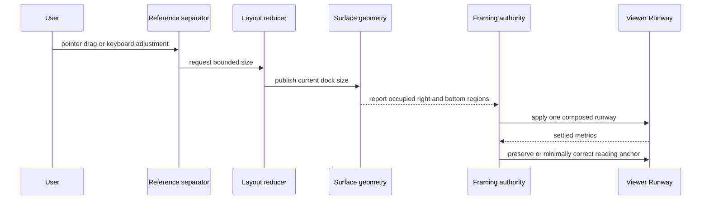

# Dockable References Tray - Plan

## Goal Capsule

- **Objective:** Let a reviewer choose whether References shares the wide right workspace or occupies a separately resizable bottom tray, while preserving a readable and fully reachable main PDF.
- **Product authority:** This contract owns References placement, independent tray visibility, reference-specific sizing and memory, wide-to-narrow recomposition, and the replacement of the global workspace toggle and close button with edge controls; the Reference Navigation Workspace contract remains authoritative for reference tabs, link actions, Send to main, meaningful history, and same-document safety except where its single-workspace layout conflicts with this contract.
- **Open blockers:** None; repository validation confirms the current adaptive workspace, stage-derived presentation, Viewer Runway integration, current-document workspace memory, and absence of a general UI-preferences store.
- **Execution:** Code.

---

## Product Contract

### Summary

Separate reference reading from outline and annotation work on wide screens without turning the reader into a collection of overlapping drawers.
References defaults to a bottom tray, can move into the right workspace when desired, remembers a distinct size for each placement, and recomposes into one bottom workspace when the window becomes too narrow for side-by-side reading.

### Problem Frame

The shared Outline, References, and Annotations workspace keeps the interface coherent, but it forces reference reading to use the same placement and size as short-form navigation and review tools.
That is a poor fit when a reviewer wants enough vertical or horizontal space to read a proof, equation context, appendix section, figure, or table while keeping the citing passage visible.

Simply adding another overlay would create competing shadows, obscure the PDF, and make simultaneous right and bottom surfaces feel accidental.
The desired model is coordinated docking: References may be independent, but every open tray participates in one clean layout and one reader-reachability contract.

### Actors

- A1. **Reviewer:** Reads and annotates a PDF, opens linked destinations in reference tabs, and changes the reference surface to fit the material being compared.

### Key Decisions

- **Use coordinated split docking on wide layouts.** (session-settled: user-directed — chosen over the current fully unified workspace and overlapping independent overlays: Outline and Annotations remain in a right workspace while References may occupy an adjacent bottom tray on the same visual plane.) Governs R1-R5 and R16-R19.
- **Default References to the bottom.** (session-settled: user-directed — the bottom tray offers more readable line width and contextual height for referenced material, while movement into the right workspace remains one direct action.) Governs R1-R4 and R12.
- **Make placement controls contextual and compact.** (session-settled: user-directed — the move-down control belongs inside the combined References tab segment, while the independent bottom tray uses a simple title and a top-right move-to-right control rather than a full-width single-tab selector.) Governs R2-R4 and R18.
- **Replace global open and close chrome with edge rails.** (session-settled: user-directed — small but easily tappable arrow controls at the relevant page edges are less disruptive than a Workspace button and tray close button.) Governs R5 and R18-R20.
- **Resize References without resizing the other modes.** (session-settled: user-directed — References needs reading space, while Outline and Annotations should return to their existing default geometry without erasing the remembered reference size.) Governs R9-R13 and R16-R17.
- **Merge into one workspace on narrow layouts.** (session-settled: user-directed — two stacked trays are not viable on a constrained screen, so the most recently focused wide surface becomes active in a unified bottom workspace and the prior wide arrangement returns when space permits.) Governs R6-R8 and R14-R15.
- **Keep geometry as session working state.** (session-settled: user-approved — chosen over introducing a new durable settings store solely for this feature: right width, bottom height, and dock preference persist for the current app session, while open reference tabs remain document-specific.) Governs R10-R12 and R21.

### Workspace Shape

The wide layout can expose two coordinated tray regions without layering one over the other.
The narrow layout temporarily folds those regions into a single bottom workspace without overwriting the reviewer's wide-layout preference.



### Requirements

**Wide docking and controls**

- R1. On a layout wide enough to support a right workspace, Outline and Annotations shall remain right-side workspace modes while References shall default to an independently openable bottom tray.
- R2. Moving References into the right workspace shall close its bottom tray, open the right workspace with References active, place References as the right-most selector tab, and focus the active reference tab or the References empty state.
- R3. When References occupies the right workspace, its visual selector-tab segment shall contain a compact move-down control, rendered as a sibling of rather than a descendant of the `tab` control, that opens the independent bottom References tray, removes References from the right selector, and closes the right workspace.
- R4. When References occupies the independent bottom tray, the tray header shall show a compact `References` title and a top-right move-to-right control instead of rendering a full-width one-item tab selector.
- R5. If the right workspace and bottom References tray are both open, the right workspace shall stop above the bottom tray so both surfaces meet on one visual plane without overlap, doubled elevation, or a doubled shadow at their shared corner.

**Responsive recomposition**

- R6. When the available reading surface can no longer support the right workspace, all three modes shall appear in one bottom workspace ordered Outline, Annotations, References, with References as the right-most tab.
- R7. If both wide trays were open when the layout becomes narrow, the unified bottom workspace shall activate the surface that was focused most recently while preserving the inactive modes' document-specific state.
- R8. When sufficient width returns, the interface shall restore the prior wide References dock, the independent open or closed state of each wide tray, and the relevant focus target without treating the temporary narrow composition as a new wide-layout preference.

**Reference-only resizing and memory**

- R9. A reviewer shall be able to resize only the References surface by dragging a quiet hit area at its outer left edge when right-docked or its outer top edge when bottom-docked, with the standard directional resize cursor appearing near that edge and no persistent resize label or pill.
- R10. The app shall remember separate right-docked width and bottom-docked height values for References for the current app session.
- R11. Hiding and reopening References, moving it between placements, or visiting another workspace mode shall restore the remembered size for the resulting References placement without discarding the size remembered for the other placement.
- R12. Activating Outline or Annotations in the right workspace shall return that workspace to its existing default width, while returning to right-docked References shall restore its remembered reference width.
- R13. Reference resizing shall be constrained so both the References surface and the remaining main reading area retain a useful interactive region at every supported viewport size.

**State, reachability, motion, and accessibility**

- R14. Opening or focusing a reference from a PDF link shall reveal References in its effective current placement and focus the destination tab or panel without moving the Main Reading Thread.
- R15. Moving, hiding, reopening, resizing, or responsively recomposing References shall preserve open Reference Tabs, the active tab, each tab's scroll and zoom context, and the most recent valid focus target.
- R16. Every open right or bottom tray shall contribute its actual occupied region to PDF framing throughout placement and resize transitions so the reviewer can still pan or scroll to every part of the PDF without an automatic zoom change.
- R17. Tray movement and resize completion shall preserve the reviewer's chosen PDF reading anchor and shall not override later manual scrolling, panning, or zooming.
- R18. The right-workspace rail shall sit at the top edge aligned with the workspace selector, the independent bottom-References rail shall sit at the far-left bottom edge, each applicable rail shall toggle only its corresponding tray with a subtle directional icon and mobile-sized interactive target, and the narrow unified workspace shall use one bottom rail instead of showing a global Workspace button or tray close button.
- R19. Placement, visibility, and tab-list morph transitions shall appear as one continuous reconfiguration without transient overlap, doubled elevation, or remounting the active reference viewer and shall honor reduced-motion preferences.
- R20. Placement, visibility, selection, focus, and size changes shall expose accessible names, roles, values, and expanded or selected states, provide keyboard-operable equivalents for pointer actions including resizing, maintain a logical focus order, and announce material state changes without unrelated focus movement.
- R21. References dock and size memory shall survive document changes within the current app session, while Reference Tabs and their reading state shall remain scoped to the current document and reset on document replacement.

### Key Flows

- F1. Read a reference in the default wide arrangement
  - **Trigger:** A1 opens a linked destination in References on a wide layout.
  - **Actors:** A1.
  - **Steps:** The bottom References tray opens; the destination tab receives focus; the right workspace remains independently available; A1 scrolls the reference while the source passage remains in the main view.
  - **Outcome:** A1 reads the referenced context at a comfortable width without displacing Outline or Annotations from their right-side home.
  - **Covers:** R1, R14-R18.
- F2. Move References into the right workspace
  - **Trigger:** A1 activates the bottom tray's move-to-right control.
  - **Actors:** A1.
  - **Steps:** The bottom tray closes; the right workspace opens; References appears as its right-most tab with its remembered width; focus returns to the active reference content.
  - **Outcome:** A1 compares source and target vertically when the document and window benefit from a side-by-side arrangement.
  - **Covers:** R2, R4, R10-R12, R15-R20.
- F3. Move References back to the bottom
  - **Trigger:** A1 activates the move-down control inside the combined References tab.
  - **Actors:** A1.
  - **Steps:** References leaves the right selector; the right workspace closes; the independent bottom tray opens at its remembered height; the active reference retains focus and reading state.
  - **Outcome:** References regains a wider reading surface without leaving an unrelated right mode open automatically.
  - **Covers:** R3, R10-R12, R15-R20.
- F4. Use both wide trays
  - **Trigger:** A1 opens the right workspace while bottom-docked References is already open.
  - **Actors:** A1.
  - **Steps:** The right workspace opens above the bottom tray; the two surfaces share a clean boundary; the main PDF reframes around both occupied regions.
  - **Outcome:** A1 can inspect an outline or annotation list and a reference while retaining access to the entire PDF.
  - **Covers:** R1, R5, R13, R16-R20.
- F5. Cross the narrow-layout threshold
  - **Trigger:** The available reader width becomes insufficient for the right workspace.
  - **Actors:** A1.
  - **Steps:** The open wide surfaces merge into one bottom tabbed workspace; the most recently focused surface becomes active; when width returns, the prior wide placement, visibility, sizes, and focus context return.
  - **Outcome:** A1 keeps working through responsive changes without stacked trays or lost wide-layout preferences.
  - **Covers:** R6-R8, R10-R11, R15-R21.

### Acceptance Examples

- AE1. Coordinated wide surfaces
  - **Covers:** R1, R5, R16-R18.
  - **Given:** Bottom-docked References is open on a wide layout.
  - **When:** A1 opens Outline in the right workspace.
  - **Then:** Outline occupies a right tray that ends above References, the two trays have one clean shared corner, and the PDF remains reachable around both regions.
- AE2. Move bottom References to the right
  - **Covers:** R2, R4, R10-R12, R15, R19-R20.
  - **Given:** A1 has resized bottom References and has an active tab scrolled into a proof.
  - **When:** A1 activates the move-to-right control.
  - **Then:** The bottom tray closes, References becomes the right-most right-workspace tab at its remembered right width, and the proof tab keeps its reading state and focus.
- AE3. Move right References to the bottom
  - **Covers:** R3, R10-R12, R15, R19-R20.
  - **Given:** References is active in the right workspace and has a remembered bottom height.
  - **When:** A1 activates the move-down control inside the References tab.
  - **Then:** The right workspace closes, the independent bottom tray opens at the remembered height, References no longer appears in the right selector, and the active tab remains active.
- AE4. Remember two reference sizes
  - **Covers:** R9-R13, R19-R21.
  - **Given:** A1 sets a narrow right width and a tall bottom height for References.
  - **When:** A1 moves References between placements, visits Annotations, hides the trays, and later reopens References during the same app session.
  - **Then:** Each References placement restores its own size, Annotations uses the default right width, and neither reference size is erased.
- AE5. Merge and restore across viewport widths
  - **Covers:** R6-R8, R15, R19-R20.
  - **Given:** Outline is open on the right, References is open on the bottom, and References was focused most recently.
  - **When:** The layout narrows and later becomes wide again.
  - **Then:** The narrow workspace activates References in the right-most tab, and widening restores Outline on the right plus References on the bottom with their prior states.
- AE6. Open a link while References is hidden
  - **Covers:** R14-R15, R18-R20.
  - **Given:** References is configured for the bottom but its tray is hidden.
  - **When:** A1 chooses `Open in References` for an internal PDF link.
  - **Then:** The bottom tray opens, the target tab receives focus, and the main PDF remains at the citing passage.
- AE7. Resize without losing document reachability
  - **Covers:** R9, R13, R16-R17.
  - **Given:** A1 is horizontally panned within a zoomed PDF and References is open.
  - **When:** A1 enlarges References and then continues panning.
  - **Then:** The PDF keeps the chosen reading anchor through the resize and every document region remains reachable without an automatic zoom change.
- AE8. Keyboard and reduced-motion operation
  - **Covers:** R18-R20.
  - **Given:** A1 uses a keyboard with reduced motion enabled.
  - **When:** A1 opens each tray from its edge rail, changes References placement, adjusts its size, and closes each tray from the same rail.
  - **Then:** Every action is operable with visible focus, exposes its resulting placement or value, and completes without nonessential morph or sliding animation.

### Scope Boundaries

- No independent docking or user resizing for Outline or Annotations.
- No simultaneous stacked trays on narrow layouts.
- No overlapping, floating, detached, or operating-system-level reference window.
- No new general settings system or cross-restart geometry persistence solely for this feature.
- No change to reference-target discovery, link safety, Send to main, meaningful Back and Forward history, annotation meaning, recovery, export, or delivery.
- No inferred semantic atlas, theorem graph, or cross-document Reference Tabs.
- No reduced first release that omits a core placement, resize, responsive, reachability, state, motion, or accessibility requirement in this contract.

### Dependencies and Assumptions

- The existing stage measurement and responsive hysteresis remain the authority for deciding when a right workspace is supportable; exact threshold tuning belongs to implementation planning and validation.
- The current 24rem right-workspace width and 43% bottom-workspace height are the baseline default geometry for Outline and Annotations and for an uncustomized References placement, subject to usable-region constraints.
- The existing Viewer Runway and framing-session behavior provide the reader-reachability foundation, but implementation planning must validate composed right and bottom exclusions and continuous resize updates in both supported browser engines.
- Current reference navigation state already preserves document-scoped tabs, active mode, scroll context, and focus tokens, while dock and geometry memory require app-session state outside document replacement.
- No repository-wide general UI-preferences store currently exists; persisted service snapshots are recovery-specific and are not a suitable geometry-preference channel.

<!-- ce-section: work-relationships -->
### How This Work Fits Together

- This contract supersedes the single adaptive workspace decision and conflicting shared-workspace requirements R13-R14 and R18 in `docs/plans/2026-08-09-002-feat-reference-navigation-workspace-plan.md` only for placement, visibility, and responsive composition.
- The prior reference plan remains authoritative for reference tabs, link interception, target safety, focus after navigation, Send to main, and meaningful main-view history.
- `docs/plans/2026-08-08-001-fix-adaptive-annotation-tray-reflow-plan.md` remains the behavioral foundation for preserving reading context and document reachability while tray geometry changes, extended here to coordinated right and bottom occupied regions.
- The current global Workspace toggle and tray close control are replaced where this contract introduces independent right and bottom edge rails.

### Sources and Research

- `CONCEPTS.md` defines the Annotation Tray, Viewer Runway, Framing Session, Main Reading Thread, Reference Tab, and Meaningful Jump vocabulary used by this contract.
- `apps/web/src/review/ReferenceWorkspace.tsx` establishes the current one-workspace mode set and tabbed selector structure.
- `apps/web/src/review/reference-navigation-state.ts` establishes current-document workspace, reference-tab, scroll, and focus memory and its reset on document replacement.
- `apps/web/src/review/use-annotation-tray-framing.ts` establishes stage-derived right or bottom presentation, current side sizing, and Viewer Runway updates.
- `apps/web/src/pdf/viewer-framing-adapter.ts` establishes the viewer-side runway and refreshed-metrics boundary.
- `apps/web/src/app/review-layout-annotations.css` establishes the current 24rem right width and 43% bottom height defaults.
- `apps/service/src/recovery/draft-snapshot.ts` and `apps/service/src/sessions/session-broker.ts` establish that durable repository persistence is review-recovery-specific rather than a general UI-preferences channel.
- `docs/plans/2026-08-09-002-feat-reference-navigation-workspace-plan.md` is the existing product contract being extended and partially superseded.
- `docs/plans/2026-08-08-001-fix-adaptive-annotation-tray-reflow-plan.md` is the existing reader-reachability and adaptive-framing product contract.
- [W3C Window Splitter Pattern](https://www.w3.org/WAI/ARIA/apg/patterns/windowsplitter/) defines the keyboard and value semantics for a movable pane separator.
- [WAI-ARIA 1.2 separator role](https://www.w3.org/TR/wai-aria/#separator) defines the required value and orientation semantics for a focusable separator.
- [MDN `setPointerCapture`](https://developer.mozilla.org/en-US/docs/Web/API/Element/setPointerCapture) documents the pointer-capture mechanism used to keep resize gestures coherent outside the handle bounds.

---

## Planning Contract

### Product Contract Preservation

Product Contract unchanged.
The implementation decisions below resolve technical ownership, lifecycle, and verification without changing R1-R21.

### Key Technical Decisions

- KTD1. **Keep layout preference outside document navigation state.** A pure app-session layout reducer shall own the wide References dock, independent tray visibility, separate right and bottom sizes, last-focused wide surface, and effective responsive composition; `reference-navigation-state.ts` shall continue to own document-scoped Reference Tabs, mode memory, and history. This separation implements R6-R12 and R21 without allowing document replacement to erase geometry preferences.
- KTD2. **Keep one stable owner for every mode panel.** The review shell shall render each Outline, Annotations, and References panel exactly once and keep their document state under one canonical owner while presentation chrome and CSS placement change around them. `ReferenceWorkspace` remains the continuously mounted owner of the reference viewport host across independent bottom, combined right, and unified narrow presentations; a tools-only right surface exposes the existing Outline or Annotations panel only when bottom References and a right tool coexist. This prevents duplicate panel trees, portal-container changes, and reference-viewer remounts under R5, R7, R15, and R19.
- KTD3. **Use one composed Framing Session authority with latest-wins scheduling.** The existing workspace framing owner shall measure committed, stage-clamped right and bottom surface bounds, publish one combined Viewer Runway update, and retain one baseline, per-axis user-ownership record, and stale-operation generation across tray open, close, move, resize, and responsive transitions. Resize samples shall coalesce to at most one geometry commit per animation frame, and gesture completion shall request one settled reframe. Every scheduled callback and post-settlement write shall revalidate layout and document generation before changing scroll, focus, or visibility. Two independent framing hooks are rejected because their runway writes and restoration authority would race under R16-R17; treating requested CSS size as occupied geometry is rejected because browser layout and portal readiness may lag the request.
- KTD4. **Implement resizing as an accessible window splitter.** Each active References boundary shall expose one focusable `separator` with the matching orientation, controlled-pane relationship, bounded current value, arrow-key adjustment, and Home or End limits; pointer resizing shall use pointer capture so the gesture remains owned after the pointer leaves the quiet hit area. This applies the W3C window-splitter pattern and MDN pointer-capture guidance to R9, R13, and R20.
- KTD5. **Derive narrow composition without mutating wide preference.** Stage measurement and the existing hysteretic 30rem minimum reading width shall decide whether the right workspace is supportable, while narrow mode shall be a projection of the stored wide tuple rather than a state rewrite. This preserves the current embed-safe measurement pattern and makes R6-R8 reversible.
- KTD6. **Make navigation orchestration dock-aware.** The navigation coordinator shall request reference reveal, reference hide, right-tools reveal, and target-specific rail focus through a layout adapter instead of setting one generic workspace boolean or focusing the removed chrome control. This keeps link open, final close, Send to main, retry, and document replacement consistent with R2-R4, R14-R15, and R21.
- KTD7. **Let the active narrow mode choose bottom geometry.** In the unified narrow workspace, References restores its remembered bottom height and exposes its splitter, while Outline and Annotations use the existing default bottom height and do not expose the splitter. Changing the active narrow mode never overwrites the remembered References height. This applies the reference-only resize decision consistently to R6 and R9-R12.

### High-Level Technical Design

The layout keeps one reference-bearing surface and adds one tools-only surface for the simultaneous wide case.



Responsive mode changes only the effective projection; it does not overwrite the remembered wide tuple.

```mermaid
stateDiagram-v2
  [*] --> WideClosed: bottom preference; right closed; References closed
  WideClosed --> WideBottomOnly: open References
  WideClosed --> WideRightOnly: open right tools
  WideBottomOnly --> WideSplit: open right tools
  WideRightOnly --> WideSplit: open References
  WideSplit --> WideBottomOnly: close right tools
  WideSplit --> WideRightOnly: close References
  WideBottomOnly --> WideRightRefs: move References right
  WideSplit --> WideRightRefs: move References right
  WideRightRefs --> WideBottomOnly: move References down; close right
  WideClosed --> NarrowUnified: narrow projection when opened
  WideBottomOnly --> NarrowUnified: narrow projection
  WideRightOnly --> NarrowUnified: narrow projection
  WideSplit --> NarrowUnified: narrow projection
  WideRightRefs --> NarrowUnified: narrow projection
  NarrowUnified --> WideClosed: widen; restore closed tuple
  NarrowUnified --> WideBottomOnly: widen; restore bottom-only tuple
  NarrowUnified --> WideRightOnly: widen; restore right-only tuple
  NarrowUnified --> WideSplit: widen; restore split tuple
  NarrowUnified --> WideRightRefs: widen; restore right-docked tuple
```

One resize transaction updates presentation and PDF reachability under a shared generation guard.



### Sizing and Interaction Policy

- Right-docked References starts at 24rem, has an 18rem minimum, and has a dynamic maximum that preserves at least 30rem for the main reading area.
- Bottom-docked References starts at 43% of stage height, has a 12rem minimum, and has a dynamic maximum that preserves at least 12rem for the main reading area.
- Arrow keys adjust the active separator by 1rem, Home chooses the minimum, and End chooses the current dynamic maximum.
- Pointer resizing uses the same clamp function as keyboard resizing, with a quiet fine-pointer hit zone and a larger coarse-pointer target that does not add a persistent visible pill.
- The visible rail glyph may stay compact, but each rail and move control retains the existing 44px coarse-pointer target policy.

### Assumptions

- A1. A successful rail or dock command and focus entering either wide surface update the most-recently-focused surface; responsive recomposition itself does not update that memory.
- A2. Closing or consuming the final Reference Tab hides only References and returns focus to the applicable References rail while an independently open right Outline or Annotations surface remains open.
- A3. Document replacement closes both tray visibilities and clears document-scoped tabs and focus snapshots while retaining app-session dock and size preferences.
- A4. Opening Finish temporarily suppresses both tray surfaces without overwriting their remembered visibility, dock, or size, matching the current workspace-versus-Finish behavior.
- A5. Escape closes only the tray that currently contains focus and returns focus to that tray's rail after nested editors or transient menus receive their existing first chance to dismiss; Escape from the main PDF does not close an unfocused tray.
- A6. Opening the narrow rail restores the most recently focused workspace mode when one exists; a fresh session with no mode recency opens Outline, the first tab in the documented narrow order.

### System-Wide Impact

- The review shell changes from one workspace disclosure to two independently disclosed wide regions plus one derived narrow region.
- The main navigation coordinator keeps its reference and history semantics but no longer owns a generic workspace boolean or toolbar focus target.
- PDF layout remains full-stage; only Viewer Runway and scroll framing change, so fit geometry, zoom, render ownership, and EmbedPDF document identity remain stable.
- Review selection actions, page-note placement, annotation editing, Finish, export, service recovery, and document safety remain outside the new layout state and need regression coverage rather than new behavior.
- Resize lifecycle is stage-scoped and single-owner: document replacement or unmount cancels queued frames, delayed settlement, observation, and pointer capture before a disposed viewer can receive a late runway, scroll, focus, or visibility write.

### Risks and Mitigations

- **Portal remount risk:** Rendering separate right and bottom reference hosts could recreate `ReferencePdfViewport`; KTD2 keeps one host and browser tests retain a live mount probe through every transition.
- **Competing framing risk:** Independent runway writers could erase one occupied axis or restore against the wrong baseline; KTD3 makes composed geometry and asynchronous authority single-owner.
- **Responsive preference drift:** Narrow tab activation could overwrite the wide dock or visibility tuple; KTD1 and KTD5 separate stored preference from effective projection and test round trips.
- **Gesture conflict:** A resize drag could leak into PDF selection or panning; KTD4 uses an interaction boundary and pointer capture, while existing viewer user-intent tracking remains authoritative outside the separator.
- **Legacy selector churn:** Review and production acceptance tests currently locate the removed Workspace button and close control; U5 migrates those paths to the edge-rail contract while retaining their original behavioral assertions.
- **Resize scheduling risk:** Pointer movement can outpace the two-frame runway settlement; KTD3 and U3 coalesce to one latest measurement per animation frame, avoid navigation or focus work during intermediate samples, supersede stale operations, and commit one final measurement when the gesture ends.
- **Lifecycle leak risk:** A canceled gesture, breakpoint transition, or document replacement could leave pointer capture, observers, frames, or delayed settlement attached to an obsolete surface; U2-U4 explicitly release and cancel each resource, and U5 exercises replacement during pending geometry work.

### Sequencing

1. Establish the pure app-session layout state and geometry clamps before changing rendered surfaces.
2. Refactor the workspace into one stable reference-bearing surface plus a tools-only wide surface.
3. Replace the single-region framing input with one composed occupied-region authority.
4. Wire production navigation, focus, Finish, and document lifecycle through the layout adapter.
5. Migrate and expand installed browser acceptance after the complete interaction path is available.

---

## Implementation Units

### U1. App-session layout state and geometry policy

- **Goal:** Add a pure, deterministic layout model that separates remembered wide preferences from the effective wide or narrow presentation.
- **Requirements:** R1-R13, R18, R21; KTD1 and KTD5.
- **Dependencies:** None.
- **Files:** `apps/web/src/review/reference-workspace-layout.ts` (new), `apps/web/test/reference-workspace-layout.test.ts` (new), `apps/web/src/pdf/viewer-framing.ts`, `apps/web/test/viewer-framing.test.ts`.
- **Approach:**
  1. Model wide dock preference, independent right and References visibility, per-dock sizes, last-focused surface, and the measured stage regime as separate fields.
  2. Derive the unified narrow open state and active mode without writing those values back into the wide tuple.
  3. Centralize right and bottom clamp calculations and reuse the current 30rem wide-reading threshold and hysteresis.
  4. Preserve layout preference across document replacement while exposing an explicit reset for transient visibility.
- **Execution note:** Implement the reducer and clamp policy test-first because later UI and coordinator work depend on exact transition behavior.
- **Patterns to follow:** Pure action reducers in `apps/web/src/review/reference-navigation-state.ts`, presentation selection in `apps/web/src/pdf/viewer-framing.ts`, and state tests in `apps/web/test/reference-navigation-state.test.ts`.
- **Test scenarios:**
  1. Initial wide state chooses bottom References with both independent surfaces closed and the documented default sizes.
  2. Bottom-to-right and right-to-bottom commands update dock and visibility exactly once, including the right-workspace close rule from R3.
  3. Opening both wide surfaces yields a composed split state and retains the last-focused surface after unrelated actions.
  4. Narrow projection activates the most recently focused open surface and widening restores each prior wide tuple without mutation.
  5. Right and bottom sizes clamp at their minimum, default, dynamic maximum, and a stage size too small for wide presentation.
  6. Document replacement clears transient visibility but preserves dock and both size memories.
- **Verification:** Reducer outputs are immutable, exhaustive, and deterministic for every dock, visibility, focus, responsive, resize, and replacement transition.

### U2. Stable reference surface, tools surface, rails, and splitter controls

- **Goal:** Render the confirmed wide and narrow surface shapes while keeping one reference viewport host mounted and making every layout action accessible.
- **Requirements:** R1-R15, R18-R20; F1-F5; AE1-AE6 and AE8; KTD2 and KTD4.
- **Dependencies:** U1.
- **Files:** `apps/web/src/review/ReferenceWorkspace.tsx`, `apps/web/src/review/OutlineAnnotationsWorkspace.tsx` (new), `apps/web/src/review/WorkspaceEdgeRail.tsx` (new), `apps/web/src/review/ReferenceResizeHandle.tsx` (new), `apps/web/src/review/ReviewIcon.tsx`, `apps/web/src/app/ReviewShell.tsx`, `apps/web/src/app/review-layout-annotations.css`, `apps/web/src/app/review-layout-responsive.css`, `apps/web/test/reference-workspace.test.tsx`, `apps/web/test/review-layout.test.tsx`.
- **Approach:**
  1. Keep `ReferenceWorkspace` continuously mounted and let it render the combined selector only in right-wide or unified-narrow presentations.
  2. Keep one canonical Outline panel, one Annotations panel, and one References panel under the review shell, and let a tools-only right surface expose the applicable existing tool panel during the simultaneous split presentation without duplicating its state or DOM owner.
  3. Replace the workspace close button and chrome toggle with right and bottom edge rails, then place the move-down action inside the combined References tab and the move-right action in the independent header.
  4. Give the active References edge one splitter control whose pointer, keyboard, orientation, value, and focus behavior follow KTD4.
  5. Use one effective mode sequence for rendering and arrow-key indexing so conditional removal of References cannot desynchronize keyboard order.
  6. Express tiled height, remembered dimensions, clean shared corner, and reduced-motion behavior through stage-scoped custom properties without resizing the PDF viewer element.
- **Execution note:** Add DOM and focus assertions before changing the existing header so the stable host, tab semantics, and selection-action overlay remain characterized.
- **Patterns to follow:** Manual tab focus in `apps/web/src/review/ReferenceWorkspace.tsx`, touch targets and reduced motion in `apps/web/src/app/review-layout-responsive.css`, and project-owned icons in `apps/web/src/review/ReviewIcon.tsx`.
- **Test scenarios:**
  1. Covers AE1: wide bottom References and right Outline render as separate labelled regions with one shared corner and no duplicate References selector.
  2. Covers AE2 and AE3: each move control changes presentation, selector membership, focus, and accessible state while preserving the same reference viewport host node.
  3. The combined selector orders Outline, Annotations, References and keeps the move-down control inside the visual References tab segment as a sibling of the `tab` button, never an interactive descendant of that role.
  4. Each rail toggles only its corresponding surface, reports expanded state and controlled region, and retains a 44px coarse-pointer target with a smaller visible glyph.
  5. The splitter exposes role, orientation, bounds, current value, controlled region, visible focus, arrow adjustment, and Home or End limits.
  6. A reliable PDF text selection still renders the annotation action palette while either or both tray surfaces are open.
  7. Responsive recomposition does not steal focus from the main PDF, while a disappearing focused surface restores its logical target in the unified workspace; opening a fresh narrow rail selects Outline when no prior mode exists.
  8. In narrow mode, References restores its remembered bottom height and splitter, while Outline and Annotations use default bottom height without mutating that reference preference.
  9. Reduced motion removes nonessential surface and selector morph transitions without changing terminal layout or focus.
- **Verification:** Static markup, component interaction tests, and stable-node assertions prove the exact header, rail, tab, splitter, focus, and presentation contract without mounting a second reference viewport host.

### U3. Composed runway and framing lifecycle

- **Goal:** Extend the existing Framing Session so simultaneous right and bottom occupied regions remain reachable without changing PDF zoom or mount identity.
- **Requirements:** R5, R9, R13, R16-R17, R19; AE1 and AE7; KTD3.
- **Dependencies:** U1 and the surface refs defined by U2.
- **Files:** `apps/web/src/review/use-annotation-tray-framing.ts`, `apps/web/src/pdf/viewer-framing.ts`, `apps/web/src/pdf/viewer-framing-adapter.ts`, `apps/web/src/pdf/PdfWorkspace.tsx`, `apps/web/test/viewer-framing.test.ts`, `apps/web/test/review-layout.test.tsx`.
- **Approach:**
  1. Replace the single workspace measurement with reference-surface and tools-surface bounds owned by one hook.
  2. Derive one occupied-region snapshot from actual visible geometry and apply its right and bottom values in one runway transaction.
  3. Preserve one baseline and per-axis automatic displacement while dock, size, or responsive presentation changes supersede stale layout work.
  4. Treat splitter motion as interface-owned framing until the user scrolls, pans, or zooms, after which the existing per-axis authority wins.
  5. Keep the right tools surface height derived from stage height minus visible bottom References height so visual tiling and framing use the same measurements.
  6. Coalesce resize-driven runway work to one latest request per animation frame, keep pointer samples free of tab, focus, and navigation restoration, and issue one final settled reframe at gesture completion.
  7. Revalidate the active layout and document generation before and after awaited runway settlement, and cancel queued frames, observers, delayed callbacks, and pointer ownership on cancel, unmount, or document replacement.
- **Execution note:** Start with failing pure and adapter tests for composed axes, stale operations, and resize restoration before integrating live DOM measurements.
- **Patterns to follow:** `FramingSessionAuthority`, `restoreViewportPosition`, `ViewerFramingControls.setRunway`, the WebKit layout-settlement guard, and the native instant-scroll fallback.
- **Test scenarios:**
  1. One update applies nonzero right and bottom runway values together and neither surface can overwrite the other axis.
  2. Continuous right or bottom resizing clamps every destination and keeps all document edges reachable without a zoom event.
  3. A dock move or responsive reflow supersedes an older awaited measurement and only the latest generation may scroll or restore.
  4. Manual horizontal pan, vertical scroll, and zoom transfer ownership per axis and remain authoritative when resizing or closing a tray.
  5. Closing one of two surfaces removes only its runway axis, while closing both restores natural limits and only interface-owned displacement.
  6. Height-only stage changes update bottom occupation and the tiled right height without remounting either viewer.
  7. A rapid drag followed by dock movement, breakpoint oscillation, or document replacement commits only the final valid surface bounds and leaves no late runway, measurement, or scroll mutation.
- **Verification:** Focused framing tests prove composed reachability and restoration, and live shell measurements match the occupied regions presented by CSS.

### U4. Dock-aware production navigation and lifecycle

- **Goal:** Make production link navigation, Reference Tab lifecycle, focus, Finish, and document replacement operate on independent tray visibility.
- **Requirements:** R2-R8, R10-R15, R18-R21; F1-F5; AE2-AE6 and AE8; KTD1, KTD2, and KTD6.
- **Dependencies:** U1-U3.
- **Files:** `apps/web/src/app/ProductionReviewApp.tsx`, `apps/web/src/app/ReviewShell.tsx`, `apps/web/src/review/navigation-coordinator.ts`, `apps/web/src/review/reference-navigation-state.ts`, `apps/web/src/review/review-surface-state.ts`, `apps/web/src/review/ReviewChrome.tsx`, `apps/web/test/navigation-coordinator.test.ts`, `apps/web/test/reference-navigation-state.test.ts`, `apps/web/test/review-surface-state.test.ts`, `apps/web/test/production-review-app.test.tsx`, `apps/web/test/review-layout.test.tsx`.
- **Approach:**
  1. Let `ProductionReviewApp` own the app-session layout reducer beside the existing document-scoped navigation reducer.
  2. Replace generic workspace open and focus callbacks in `NavigationCoordinator` with a dock-aware adapter that reveals References in the effective presentation and returns focus to the applicable rail.
  3. Keep final Reference Tab close and Send to main scoped to References so an independently open tools surface survives.
  4. Derive the legacy review base-surface state from whether any tray is open so closing one of two surfaces does not return the shell to reading while the other remains visible.
  5. Remove the chrome Workspace control while leaving Back, Forward, Undo, Redo, and Finish unchanged.
  6. Reset document-specific navigation and pending callbacks on replacement while preserving layout preference and invalidating stale framing or focus work.
  7. Temporarily suppress both trays during Finish and restore the remembered layout when Finish closes.
- **Execution note:** Characterize existing coordinator success, failure, retry, final-close, Send-to-main, and replacement paths before widening the visibility adapter.
- **Patterns to follow:** Token and document-generation guards in `apps/web/src/review/navigation-coordinator.ts`, controlled surface synchronization in `apps/web/src/app/ReviewShell.tsx`, and production callback-chain tests in `apps/web/test/production-review-app.test.tsx`.
- **Test scenarios:**
  1. Covers AE6: link open reveals wide-bottom, wide-right, or narrow-unified References according to effective layout without changing main location or history.
  2. Switching and deduplicating Reference Tabs preserves dock and size state and focuses the existing target.
  3. Closing or consuming the final tab hides only References, preserves a visible right tools surface, and focuses the References rail.
  4. Send to main still consumes the tab, focuses main, records meaningful history, and does not mutate dock preference.
  5. Finish temporarily hides both surfaces and restoring reading returns the prior layout and focus context.
  6. Document replacement clears tabs, pending reference UI, open surfaces, and stale callbacks while retaining the app-session dock and two sizes.
  7. Failed or retried reference opening keeps its quiet status and focus behavior in every effective layout.
  8. A dock move, responsive transition, or document replacement invalidates delayed focus and visibility work so only the latest layout generation may reveal a tray or restore focus.
- **Verification:** Coordinator and production integration tests prove that layout changes do not alter reference identity, main history, retry, safety, or document-generation behavior.

### U5. Cross-engine acceptance and legacy workflow migration

- **Goal:** Prove the complete interaction against real EmbedPDF geometry in Chromium and WebKit and migrate acceptance helpers from the removed Workspace and close controls.
- **Requirements:** R1-R21; F1-F5; AE1-AE8.
- **Dependencies:** U1-U4.
- **Files:** `test/acceptance/production-flow.spec.ts`, `test/acceptance/review-workflow.spec.ts`, `test/acceptance/review-visual.spec.ts`, `test/acceptance/review-harness/visual-scenarios.tsx`, `apps/web/test/reference-workspace.test.tsx`, `apps/web/test/review-layout.test.tsx`, `apps/web/test/viewer-framing.test.ts`.
- **Approach:**
  1. Replace legacy Workspace-button and close-button helpers with right-rail, bottom-rail, mode, and move-control helpers while retaining the original behavioral checks.
  2. Extend the installed production PDF flow through default bottom open, independent right coexistence, right and bottom resize, right-to-bottom moves, narrow merge, and wide restoration.
  3. Keep DOM mount probes on the main and reference viewers and assert zoom, tab context, selection palette, and user scroll ownership through transitions.
  4. Run geometry-sensitive flows in Chromium and WebKit and cover reduced motion plus keyboard-only operation in at least one real browser.
  5. Record requested runway, committed tray bounds, main-view scroll extents, and final reading anchor during rapid resize and delayed-layout flows so the tests distinguish visual similarity from stale geometry work.
- **Execution note:** Use the deterministic `reference-navigation.pdf` fixture and preserve request-origin, clone-cardinality, and safety assertions from the existing production flow.
- **Patterns to follow:** Installed browser setup and stable mount probes in `test/acceptance/production-flow.spec.ts`, synthetic annotation workflows in `test/acceptance/review-workflow.spec.ts`, and targeted WebKit configuration in `playwright.webkit.config.ts`.
- **Test scenarios:**
  1. Covers AE1: bottom References and right Outline coexist with a clean shared corner, one reference clone, and full PDF reachability.
  2. Covers AE2-AE4: pointer and keyboard resize values survive hide, mode switch, and both dock moves while default tools geometry returns.
  3. Covers AE5: both wide surfaces merge to the most recently focused narrow tab and widen back to the exact prior tuple.
  4. Covers AE6: opening a reference while hidden reveals the effective rail surface and leaves the main reader stable.
  5. Covers AE7: zoomed and panned main content remains reachable and user-owned movement survives resize, move, and close.
  6. Covers AE8: rails, move controls, tabs, and splitters have visible keyboard focus, correct announcements and values, mobile hit targets, and reduced-motion behavior.
  7. Selection actions remain visible while either or both trays are open, and clicking outside the trays does not dismiss them.
  8. Unsafe links, retry, final close, Send to main, Back and Forward, and document replacement retain their existing outcomes in both browser engines.
  9. Rapid drag and release, resize during pending framing, breakpoint oscillation, and document replacement cancel obsolete work; only the last valid generation mutates runway, scroll, focus, or visibility.
- **Verification:** The focused production and review workflows pass in Chromium and WebKit with the same main and reference mount identities observed before and after every presentation transition.

---

## Verification Contract

| Gate | Command | Proves | Units |
|---|---|---|---|
| Type integrity | `pnpm typecheck` | New layout, coordinator, surface, and framing contracts compose across the TypeScript workspace. | U1-U4 |
| Focused layout and framing units | `pnpm exec vitest run apps/web/test/reference-workspace-layout.test.ts apps/web/test/reference-workspace.test.tsx apps/web/test/viewer-framing.test.ts apps/web/test/navigation-coordinator.test.ts apps/web/test/reference-navigation-state.test.ts apps/web/test/review-surface-state.test.ts apps/web/test/review-layout.test.tsx apps/web/test/production-review-app.test.tsx` | Pure transitions, clamps, DOM semantics, composed framing, coordinator lifecycle, and production wiring. | U1-U4 |
| Review regression suite | `pnpm test:review` | Annotation workflows, selection actions, focus, review surfaces, and Chromium review acceptance remain intact after the workspace-control migration. | U2-U5 |
| Viewer regression suite | `pnpm test:web` | Main viewer selection, interaction, overlay, annotation, and Chromium viewer acceptance behavior remain intact. | U2-U5 |
| Production build | `pnpm build:web` | The production bundle includes the new surface composition and no development-only seam masks integration failures. | U2-U5 |
| Chromium production acceptance | `pnpm fixtures:pdf && pnpm exec playwright test test/acceptance/production-flow.spec.ts` | Real EmbedPDF clone lifecycle, stable hosts, composed runway, resize, link navigation, and history behavior. | U3-U5 |
| WebKit geometry acceptance | `pnpm exec playwright test --config playwright.webkit.config.ts test/acceptance/review-workflow.spec.ts test/acceptance/production-flow.spec.ts` | Delayed layout, native scroll fallback, resize settlement, responsive restoration, and focus parity. | U3-U5 |
| Full browser regression | `pnpm test:e2e` | Viewer, review, human delivery, Codex delivery, and production flows remain compatible in Chromium. | U2-U5 |
| Visual regression | `pnpm test:visual` | Wide split, independent bottom, combined right, narrow unified, shared-corner, compact-rail, and reduced-motion compositions remain intentional. | U2, U5 |
| Diff hygiene | `git diff --check` | No whitespace errors or malformed patch artifacts remain. | U1-U5 |

Browser verification must inspect the rendered shared corner, compact rail glyphs with full hit targets, splitter cursors, selector morph, and right-workspace height while bottom References is open; DOM assertions alone do not prove those visual relationships.

---

## Definition of Done

- R1-R21 and AE1-AE8 are covered by the implementation units and passing verification gates without weakening the settled product decisions.
- U1 is complete when wide preference, narrow projection, focus recency, sizing, and replacement transitions are pure, clamped, and fully tested.
- U2 is complete when one stable reference viewport host renders every effective presentation with correct tabs, rails, move controls, splitter semantics, touch targets, focus, and reduced motion.
- U3 is complete when one Framing Session applies composed right and bottom runway, preserves PDF reachability and zoom, and yields per axis to later user navigation.
- U4 is complete when link open, retry, tab switch, final close, Send to main, history, Finish, and replacement operate through dock-aware visibility and focus without collapsing an unrelated surface.
- U5 is complete when the updated installed workflows pass in Chromium and WebKit and retain main and reference mount probes through dock, resize, and responsive transitions.
- Outline and Annotations are not independently resizable, no durable settings store is introduced, and no click-away dismissal returns.
- The global Workspace button and tray close button are absent from the reading shell, with their focus-return responsibilities transferred to the applicable edge rails.
- Selection and annotation action popups remain available while trays are open, and all delivery, safety, clone-cardinality, and meaningful-history regressions remain green.
- Abandoned component splits, duplicate viewport hosts, temporary diagnostics, and experimental framing paths are removed from the final diff.
