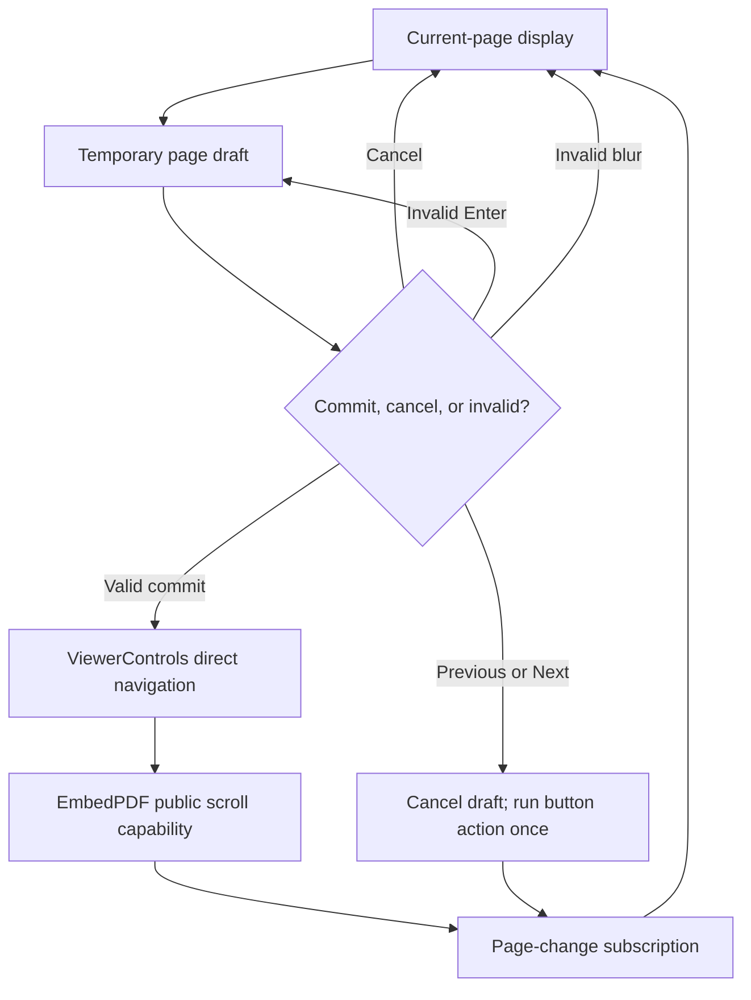

# Editable Page Navigation - Plan

## Goal Capsule

- **Objective:** Let a reviewer activate the current-page value, type a one-based page number, and navigate the existing PDF viewer without replacing its canonical page state.
- **Product authority:** The Product Contract in this plan governs the page-number editing behavior. Existing viewer-control, reading-first, and adaptive-framing contracts remain authoritative for viewer state and user navigation.
- **Execution profile:** Lightweight code plan with three ordered units. U1 adds validated direct navigation to the viewer adapter, U2 adds the in-place editor and event ownership, and U3 proves the joined browser behavior.
- **Stop conditions:** Do not introduce a second page-state model, access private EmbedPDF internals, remount the viewer, or expand the work into a toolbar redesign.
- **Open blockers:** None.

## Product Contract

### Summary

Turn the displayed current-page value into an in-place page editor while page navigation is ready.
Valid commits navigate through the existing viewer controls, and cancel or invalid paths leave the viewer on its reported page.

### Problem Frame

The compact review chrome exposes previous and next page buttons, but the current-page value is static text.
Moving across a long PDF therefore requires repeated button presses or scrolling even when the reviewer already knows the destination page.
The viewer already reports one-based current-page state and supports direct page navigation through its public scroll capability, so the missing behavior is a focused control and adapter extension.

### Actor

- A1. Reviewer navigating a local PDF with pointer or keyboard input.

### Requirements

**Activation and editing**

- R1. When page navigation is ready, A1 can activate the displayed current-page value with a click or keyboard action and receive a focused numeric editor containing the current one-based page number.
- R2. The editor keeps the total page count visible so A1 retains the same navigation context as the normal `current / total` display.
- R3. Enter commits a valid page, Escape cancels without navigation, and a valid blur commits the same way as Enter. Enter and Escape restore focus to the current-page activation control after the editor closes; blur preserves focus on the element A1 selected. If blur moves focus to Previous or Next, that button takes precedence: cancel the page-number draft and execute only the clicked button action.

**Validation and state authority**

- R4. A valid destination is a finite safe integer in the inclusive range from page 1 through the adapter's latest total-page snapshot.
- R5. An invalid Enter submission remains editable, exposes an accessible invalid state, and does not call the viewer. It also presents and announces an associated correction message that names the inclusive whole-page range, such as `Enter a whole page number from 1 to 8`. The message clears when the draft changes, succeeds, or is canceled. An invalid blur cancels the draft and returns to the viewer-reported display.
- R6. A successful commit exits edit mode and waits for the existing viewer subscription to publish the resulting current page; the temporary input buffer never becomes canonical viewer state.

**Compatibility**

- R7. When page navigation is unavailable, the chrome preserves the existing unavailable display and does not offer page editing.
- R8. Page-number editing preserves the mounted viewer, zoom, Annotation Tray state, and surrounding review-surface state. Escape while editing belongs to the editor rather than a parent review-surface dismissal handler.

### Key Flow

- F1. Jump to a known page
  - **Trigger:** A1 activates the current-page value.
  - **Steps:** The chrome opens a temporary input from the latest viewer snapshot. A1 edits the value and commits or cancels. A valid commit crosses the existing viewer-control adapter and the viewer later publishes the new current page.
  - **Outcome:** The existing viewer reaches the requested page, or remains unchanged when the draft is canceled or invalid.
  - **Covers:** R1-R8.

### Acceptance Examples

- AE1. Valid keyboard commit
  - **Covers:** R1-R4, R6, R8.
  - **Given:** A multi-page PDF is ready on page 2 with the Annotation Tray open.
  - **When:** A1 activates the page value, types `7`, and presses Enter.
  - **Then:** The viewer navigates once to page 7, the editor closes, focus returns to the current-page activation control, the subscribed current-page display becomes `7 / total`, and the tray, viewer mount, and zoom remain unchanged.
- AE2. Cancel from the editor
  - **Covers:** R1-R3, R6, R8.
  - **Given:** The page editor is active and contains a changed draft.
  - **When:** A1 presses Escape.
  - **Then:** No page navigation occurs, focus returns to the current-page activation control, the viewer-reported current page is displayed, and no Annotation Tray or finish surface is dismissed.
- AE3. Invalid destinations
  - **Covers:** R4-R5.
  - **Given:** The document has eight pages.
  - **When:** A1 submits an empty value, zero, a fraction, non-numeric text, or a number above eight.
  - **Then:** The viewer is not called. Enter keeps the editor active with an associated, announced `Enter a whole page number from 1 to 8` message; editing the draft clears that message. Invalid blur abandons the draft without stealing focus from the newly selected element.
- AE4. Viewer controls unavailable
  - **Covers:** R7.
  - **Given:** Page navigation has not initialized.
  - **When:** The review chrome renders.
  - **Then:** It shows the existing unavailable page indicator and exposes no editable page-number control.
- AE5. Navigation button takes precedence
  - **Covers:** R3, R6, R8.
  - **Given:** The editor contains a changed valid draft while the viewer is on page 2.
  - **When:** A1 clicks Next.
  - **Then:** The draft is canceled, the existing Next action runs exactly once from page 2, focus follows the button interaction, and direct page navigation is not called for the draft.

### Scope Boundaries

**Included**

- Direct one-based page navigation through the existing viewer-control adapter.
- In-place pointer and keyboard activation, validation, commit, cancel, focus, and invalid-state behavior.
- Capture-phase Escape ownership, compact responsive styling, and layered regression coverage.

**Deferred to Follow-Up Work**

- Page-history menus, recent-page shortcuts, page labels, thumbnails, and a general toolbar redesign.
- Changes to previous/next navigation, zoom behavior, annotation navigation, or automatic viewer framing.

### Success Criteria

- A1 can jump to any valid page by editing the current-page value.
- Invalid or canceled drafts never move the viewer.
- The viewer remains the sole source of displayed page state.
- The behavior is keyboard accessible and does not disturb an open review surface or viewer mount.

## Planning Contract

### Key Technical Decisions

- KTD1. **Extend the project-owned viewer-control seam.** Add one-based direct navigation to `ViewerControls` and forward accepted destinations through the active document's public EmbedPDF scroll capability. Validate against the adapter's latest snapshot before calling the plugin. Governs R4, R6-R8.
- KTD2. **Keep only a temporary edit buffer in the chrome.** `ReviewChrome` owns edit mode, draft text, focus, selection, and invalid presentation. It renders subscribed `viewerState` outside edit mode and does not optimistically replace `currentPage` after a commit. Governs R1-R7.
- KTD3. **Use explicit commit, cancel, and navigation-button arbitration.** Enter and ordinary valid blur commit. Escape cancels. Enter and Escape restore focus to the compact activation control; blur never steals focus from the newly focused element. Invalid Enter stays in edit mode with an associated range message, while invalid blur cancels because an unfocused invalid editor has no useful recovery path. A blur whose next focus target is Previous or Next cancels the draft so the existing button action is the single winning navigation intent. Governs R3-R5.
- KTD4. **Assign Escape to the nearest active editor.** Mark the page editor as owning Escape and exempt it from `ReviewShell`'s capture-phase surface dismissal before the event reaches chrome-level handling. Keep the editor inside the existing viewer-controls group so toolbar interactions retain current tray-framing behavior. Governs R8.

### High-Level Technical Design

### Implementation Constraints

- Preserve the existing one-based page numbering used by EmbedPDF and the review chrome.
- Treat browser number-input text as untrusted; require a finite safe integer and current bounds rather than relying on coercion or native input constraints alone.
- Associate invalid-state guidance with the editor and announce failed submissions without repeatedly announcing ordinary draft changes.
- Restore focus explicitly only for Enter and Escape exits. Let ordinary blur and Previous/Next focus movement retain their native destination.
- Preserve the existing `— / —` readiness behavior and readiness description.
- Do not alter `ProductionReviewApp` or `ReviewShell` prop plumbing unless implementation reveals a missing contract; both already pass the stable controls instance and subscribed snapshot.

### Sequencing

U1 establishes the direct-navigation contract and its validation boundary.
U2 consumes that contract in the review chrome and resolves capture-phase Escape ownership.
U3 joins the interactions in browser coverage and proves the real viewer remains authoritative.

### Sources and Research

- `apps/web/src/pdf/viewer-controls.ts` owns page and zoom capabilities, state subscriptions, readiness, and previous/next actions.
- `apps/web/src/review/ReviewChrome.tsx` owns the current `current / total` display and compact navigation controls.
- `apps/web/src/app/ReviewShell.tsx` owns the capture-phase Escape hierarchy that the editor must not accidentally trigger.
- `apps/web/src/app/ProductionReviewApp.tsx` demonstrates public one-based `scrollToPage` calls and already supplies controls plus subscribed viewer state to the shell.
- `docs/solutions/architecture-patterns/adaptive-annotation-tray-framing.md` requires shell UI to use project-owned viewer capabilities, preserve viewer authority, and treat explicit navigation as user intent.

## Implementation Units

### U1. Add validated direct page navigation

- **Goal:** Expose a direct page action on the existing viewer adapter without adding page state outside the adapter.
- **Requirements:** R4, R6-R8; KTD1.
- **Dependencies:** None.
- **Files:**
  - `apps/web/src/pdf/viewer-controls.ts`
  - `apps/web/test/viewer-controls.test.ts`
- **Approach:**
  1. Extend `ViewerControls` with one direct page-navigation operation that accepts a one-based destination.
  2. Validate each request against the current adapter snapshot and call the active document's public smooth page-navigation capability only when valid.
  3. Leave state updates to the existing page-change and layout-ready subscriptions.
- **Patterns to follow:** Mirror the adapter's previous/next action boundary and the public direct-navigation calls in `apps/web/src/app/ProductionReviewApp.tsx`.
- **Test scenarios:**
  - An in-range safe integer calls direct viewer navigation once with one-based smooth behavior.
  - Zero, a negative number, a fraction, `NaN`, an unsafe integer, and a value above the latest total-page snapshot do not call the viewer.
  - A destination that becomes valid after a later layout or page-count update succeeds, proving validation uses current state.
  - A valid-looking destination remains inert when page navigation is unavailable.
- **Verification:** The adapter forwards only current, valid page requests and continues to derive its snapshot exclusively from viewer events.

### U2. Make the current-page value editable

- **Goal:** Add the in-place editor, focus behavior, validation feedback, and event ownership without changing the surrounding toolbar contract.
- **Requirements:** R1-R8, F1, AE1-AE5; KTD2-KTD4.
- **Dependencies:** U1.
- **Files:**
  - `apps/web/src/review/ReviewChrome.tsx`
  - `apps/web/src/app/ReviewShell.tsx`
  - `apps/web/src/app/review-layout-foundation.css`
  - `apps/web/src/app/review-layout-responsive.css`
  - `apps/web/test/review-layout.test.tsx`
- **Approach:**
  1. Replace the ready-state current-page text with an accessible activation control that swaps in a compact numeric editor and retains the total-page context.
  2. Initialize from the latest viewer snapshot, focus and select the draft on activation, restore focus after Enter or Escape, and leave blur focus untouched.
  3. Associate a concise range message with invalid submissions, announce it once per failure, and clear it on draft change, success, or cancel.
  4. Detect focus transfer to Previous or Next before ordinary blur commit, cancel the draft, and let the existing button handler perform the only navigation action.
  5. Give the editor a narrow ownership marker that `ReviewShell` checks before capture-phase Escape dismissal.
  6. Match the existing Warm Neutral, tabular-number, desktop, narrow, and coarse-pointer control dimensions without causing header reflow.
- **Patterns to follow:** Reuse existing chrome button states and focus conventions. Keep the editor within `.review-chrome__viewer-controls` and preserve unavailable descriptions.
- **Test scenarios:**
  - Covers AE4. An unavailable page state renders the existing non-editable indicator and readiness description.
  - A ready page state renders keyboard-accessible activation semantics and preserves the `current / total` context.
  - The editor exposes numeric input metadata, an accessible label, and an associated inclusive-range error message without replacing the total-page text.
  - Enter and Escape restore focus to the current-page activation control; ordinary blur preserves the newly focused element.
  - Previous and Next focus transfer cancels the draft before the existing button action runs once.
  - The Escape-ownership marker is recognized before parent review-surface dismissal while other Escape paths retain their current behavior.
- **Verification:** The chrome can enter and leave page editing without layout drift, duplicate page state, or regression in unavailable controls and parent Escape behavior.

### U3. Prove the joined browser workflow

- **Goal:** Exercise page editing as a user interaction and confirm a real multi-page viewer navigates without losing adjacent state.
- **Requirements:** R1-R8, F1, AE1-AE5.
- **Dependencies:** U1, U2.
- **Files:**
  - `test/acceptance/review-harness/main.tsx`
  - `test/acceptance/review-workflow.spec.ts`
  - `test/acceptance/production-flow.spec.ts`
- **Approach:**
  1. Give the review harness a small stateful `ViewerControls` fake so browser tests can observe calls and subscribed page-state changes through the production shell contract.
  2. Cover activation, focus and selection, focus restoration, commit, cancel, actionable invalid feedback, ordinary blur, Previous/Next arbitration, and an open Annotation Tray in the shell harness.
  3. Add one installed-style multi-page fixture launch that uses the real viewer adapter and verifies page change, stable mount, stable zoom, and canonical subscribed display.
- **Execution note:** Start with the joined browser scenarios so focus, capture-phase Escape, and asynchronous viewer-state behavior are demonstrated before styling is finalized.
- **Patterns to follow:** Follow `test/acceptance/review-workflow.spec.ts` for shell interaction and `test/acceptance/production-flow.spec.ts` for mounted-viewer state probes.
- **Test scenarios:**
  - Covers AE1. Click activation focuses and selects the current value; entering a valid destination and pressing Enter calls navigation once and later shows the viewer-published page.
  - Covers AE1. A valid blur follows the same commit path as Enter.
  - Covers AE2. Escape cancels the changed draft, restores the current viewer value, and leaves an open Annotation Tray unchanged.
  - Covers AE2. Enter and Escape restore focus to the activation control, while ordinary blur leaves focus on the element A1 selected.
  - Covers AE3. Invalid and out-of-range Enter submissions stay editable, announce the allowed whole-page range, and clear the message after correction; invalid blur abandons the draft.
  - Covers AE4. Unavailable controls cannot enter edit mode.
  - Covers AE5. Clicking Previous or Next with a dirty draft cancels the draft and runs only the clicked button navigation from the viewer-reported page.
  - A real multi-page viewer reaches the requested page while its mount probe, zoom, and surrounding review state remain unchanged.
- **Verification:** Both the shell harness and real viewer demonstrate the complete flow without browser errors, duplicate viewer mounts, or page-display divergence.

## Verification Contract

| Gate | Command | Proves |
|---|---|---|
| Focused adapter and markup tests | `pnpm exec vitest run apps/web/test/viewer-controls.test.ts apps/web/test/review-layout.test.tsx` | Direct-navigation validation, readiness, and accessible chrome structure |
| Shell browser interaction | `pnpm exec playwright test test/acceptance/review-workflow.spec.ts` | Focus restoration, commit, cancel, actionable invalid feedback, blur arbitration, and Escape ownership |
| Installed viewer interaction | `pnpm fixtures:pdf && pnpm build:web && pnpm exec playwright test test/acceptance/production-flow.spec.ts` | Real multi-page navigation with stable viewer and zoom |
| Review regression suite | `pnpm test:review` | Existing review commands, framing, layout, and acceptance behavior |
| Type contract | `pnpm typecheck` | ViewerControls and React integration remain type-safe |

## Definition of Done

- U1 is complete when direct navigation accepts only a valid one-based destination from the latest adapter snapshot and viewer events remain the only source of current-page state.
- U2 is complete when the page display supports accessible in-place editing, the specified commit, cancel, focus, validation-message, and Previous/Next precedence behavior, unavailable-state preservation, responsive Warm Neutral styling, and capture-phase Escape ownership.
- U3 is complete when shell and installed-viewer browser tests cover AE1-AE5 and show stable viewer mount, zoom, tray state, focus behavior, and subscribed page display.
- All Verification Contract gates pass.
- The final diff contains no abandoned page-state model, private viewer access, unrelated toolbar redesign, or dead experimental code.
