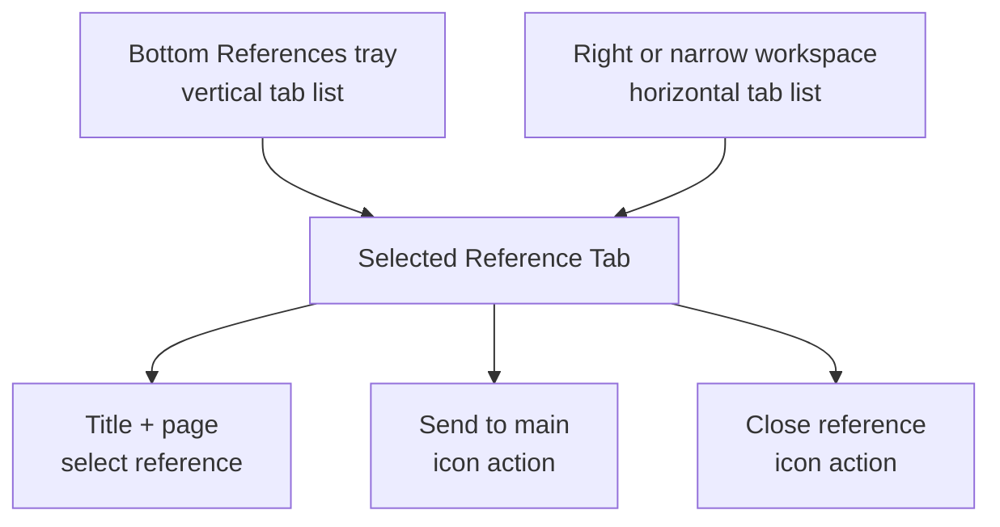
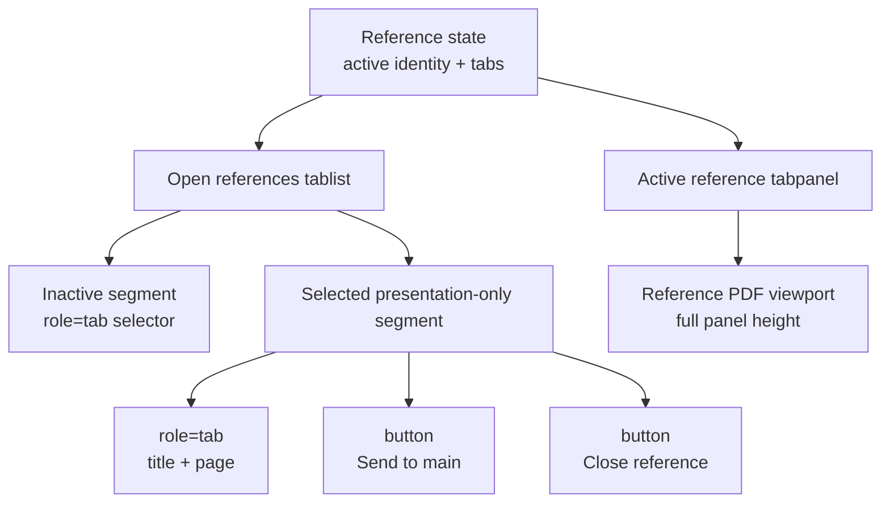

# Compact Reference Tab Actions - Plan

## Goal Capsule

- **Objective:** Reclaim space in References by showing the active destination metadata once and moving its actions into the selected Reference Tab.
- **Product authority:** This contract owns active Reference Tab presentation in bottom, right, and narrow workspace layouts. The existing reference-navigation and dockable-tray contracts remain authoritative for navigation, tab lifecycle, focus outcomes, docking, and resizing.
- **Open blockers:** None.
- **Execution profile:** Code change with component, responsive-style, real-browser, and visual-regression proof.
- **Tail ownership:** `ce-work` implements the units and returns control to LFG; LFG owns simplification, independent review, PR creation, and CI follow-through.

---

## Product Contract

### Summary

Replace the repeated active-reference header with a compound selected tab that visually combines its destination selector, Send to main action, and Close action. Inactive tabs remain simple destination selectors.

### Problem Frame

The active Reference Tab already identifies its destination by title and page context. Repeating that metadata in a second header above the reference PDF consumes reading space without adding orientation, while the header exists primarily to hold two actions.

### Key Decisions

- **Use a compound selected tab.** (session-settled: user-directed — chosen over a fixed action dock and an overflow menu: the actions stay visibly attached to their reference and remain one click away.) Governs R1-R4.
- **Protect actions before text width.** The selected tab may truncate its visible metadata before its action targets shrink or disappear. Governs R5-R6.
- **Preserve Reference Tab behavior.** This work changes presentation only and inherits navigation, consumption, adjacent-tab activation, and focus outcomes from the existing contracts. Governs R7-R8.

### Requirements

**Information hierarchy**

- R1. A ready active reference shall show its title and page context in its selected Reference Tab without repeating either value in a panel header above the PDF.
- R2. Removing the repeated header shall return that height to the reference PDF viewport rather than replacing it with another persistent action row.
- R3. Inactive Reference Tabs shall remain simple destination selectors without Send or Close controls.

**Compound active tab**

- R4. The selected reference shall appear as one visual capsule containing three distinct actions: select the reference, Send to main, and Close reference.
- R5. Send to main and Close shall use recognizable icon-only controls with accessible names, concise tooltips, visible focus treatment, and the app's established comfortable pointer targets.
- R6. The selected tab shall reserve stable space for both action controls while allowing its visible title and page context to truncate; the full destination identity shall remain available to assistive technology.

**Adaptive behavior and continuity**

- R7. The compound selected-tab pattern shall work in the bottom tray's vertical tab list and the right or narrow workspace's horizontal tab list without obscuring adjacent tabs or the reference PDF.
- R8. Selecting, sending, closing, and keyboard-navigating Reference Tabs shall retain their existing outcomes, including the current behavior when an action leaves another tab active or consumes the final tab.

### Key Flows

- F1. Act on the active reference
  - **Trigger:** A reviewer has one or more open Reference Tabs.
  - **Actors:** Reviewer.
  - **Steps:** The selected tab shows destination metadata once; the reviewer activates Send to main or Close from the same capsule; the existing reference action completes.
  - **Outcome:** The reviewer acts on the current destination without spending reference-view height on redundant information.
  - **Covers:** R1-R8.
- F2. Switch among references
  - **Trigger:** A reviewer selects a different Reference Tab.
  - **Actors:** Reviewer.
  - **Steps:** Selection moves to the chosen destination; the compound actions move with the selected state; the previously selected tab returns to a simple selector.
  - **Outcome:** Exactly one tab exposes contextual actions and every destination remains easy to distinguish.
  - **Covers:** R3-R8.

### Acceptance Examples

- AE1. Bottom tray with several references
  - **Given:** Three references are open in the bottom tray's vertical tab list.
  - **When:** The middle reference is active.
  - **Then:** Its row shows title, page context, Send, and Close in one capsule; the other rows show only destination metadata; no duplicate active header appears above the PDF.
  - **Covers:** R1-R7.
- AE2. Resized right tray
  - **Given:** References is right-docked and the tray is resized narrower.
  - **When:** The selected tab no longer has room for its full visible title.
  - **Then:** Its text truncates before either action target shrinks or disappears, and the full destination remains accessible.
  - **Covers:** R5-R7.
- AE3. Action leaves another reference
  - **Given:** More than one Reference Tab is open.
  - **When:** The reviewer sends or closes the selected reference.
  - **Then:** Existing tab-consumption and adjacent-selection behavior runs unchanged, and the newly active tab receives the compound action controls.
  - **Covers:** R3-R8.
- AE4. Keyboard and assistive technology
  - **Given:** A reviewer navigates without a pointer.
  - **When:** Focus reaches the selected Reference Tab and its actions.
  - **Then:** Selection, Send, and Close are distinguishable actions with visible focus and accessible names, while existing tab-list keyboard navigation remains available.
  - **Covers:** R4-R8.

### Scope Boundaries

- No changes to link interception, destination discovery, reference identity, reference PDF rendering, Send-to-main semantics, meaningful history, or tab consumption.
- No changes to tray placement, visibility rails, responsive recomposition, resizing, or remembered geometry.
- No hover-only actions, per-inactive-tab actions, repeated action header, or overflow menu for the two primary actions.
- Loading, unavailable, retry, and empty states retain their dedicated status presentation because they do not duplicate a ready active tab.

### Sources / Research

- `docs/plans/2026-08-09-002-feat-reference-navigation-workspace-plan.md` remains authoritative for Reference Tab behavior, navigation, focus, and accessibility.
- `docs/plans/2026-08-10-001-feat-dockable-reference-tray-plan.md` remains authoritative for dock placement, responsive composition, resizing, and viewer framing.
- `CONCEPTS.md` defines Reference Tab and Main Reading Thread vocabulary used by this contract.

---

## Planning Contract

### Key Technical Decisions

- KTD1. **Use the established compound-segment pattern.** (session-settled: user-directed — chosen over a fixed action dock and an overflow menu: the actions stay visibly attached to their reference and remain one click away.) A presentation-only wrapper shall visually unite the selected `role="tab"` button with sibling Send and Close buttons. Interactive controls shall not be nested inside the tab. Implements R1-R5.
- KTD2. **Move the existing actions without changing their authority.** The selected segment shall call the current activation, Send, and Close callbacks and preserve their focus tokens. Implements R3-R8.
- KTD3. **Give the reclaimed row to the viewer.** Ready-reference rendering shall remove the active-panel action header and let the reference viewport occupy the full panel height. Pending, error, and empty states remain unchanged. Implements R1-R3.
- KTD4. **Use orientation-aware CSS around one semantic structure.** The same compound segment shall adapt to the vertical bottom list and horizontal right or narrow list. Action targets keep their established compact and coarse-pointer sizes while metadata owns the flexible, truncating region. Implements R4-R7.
- KTD5. **Prove semantics, behavior, and appearance in layers.** Component tests shall pin the role and action structure. Installed-browser flows shall pin switching and action outcomes. Seeded visual scenes shall pin all three layout regimes. Implements R1-R8.

### High-Level Technical Design

The selected Reference Tab keeps one state owner and one callback path. Only its presentation changes.

The tab selector remains the only element in each segment that participates in arrow-key tab navigation. Send and Close use ordinary button focus order. The existing coordinator continues to decide which tab survives and where focus moves after each action.

### Implementation Constraints

- Keep `role="tab"`, `aria-selected`, `aria-controls`, tab IDs, roving tab index, and orientation-specific arrow navigation on the destination selector.
- Keep Send and Close as separately named buttons outside the semantic tab.
- Keep DOM and focus order aligned with the visual order: destination selector, Send to main, then Close reference.
- Preserve `data-workspace-focus-token` values so existing focus restoration remains valid.
- Reuse the existing `main` and `close` icons from `ReviewIcon`; do not add a second icon vocabulary for the same actions.
- Follow the app's established icon-control convention with an accessible name and matching concise `title`; do not introduce a separate tooltip subsystem for this presentation-only change.
- Do not change reference state, navigation coordination, dock layout state, viewer framing, or pending-state behavior.

### Sequencing

U1 establishes the semantic component structure and focused contracts. U2 applies the responsive presentation and verifies the integrated behavior across layout regimes and browser engines.

---

## Implementation Units

### U1. Move active-reference actions into the selected tab

- **Goal:** Remove the redundant ready-reference header and expose selection, Send, and Close as one compound selected-tab presentation.
- **Requirements:** R1-R6, R8; F1-F2; AE1, AE3-AE4; KTD1-KTD3.
- **Dependencies:** None.
- **Files:**
  - `apps/web/src/review/ReferenceWorkspace.tsx`
  - `apps/web/test/reference-workspace.test.tsx`
- **Approach:**
  1. Give every Reference Tab a presentation-only segment while retaining the existing tab button as its semantic and keyboard-navigation owner.
  2. Render the existing Send and Close callbacks as icon-only sibling buttons only for the selected ready reference.
  3. Preserve the current action focus tokens, accessible names, concise titles, and adjacent-tab focus behavior.
  4. Remove the ready-reference action header from the active tabpanel while leaving pending, retry, empty, and viewport ownership intact.
- **Execution note:** Add the component-contract assertions before changing the ready-reference markup so role-count, action placement, and header removal have explicit red proof.
- **Patterns to follow:** The compound References workspace-mode selector in `apps/web/src/review/ReferenceWorkspace.tsx`, icon-only link actions in `apps/web/src/review/LinkActionPopover.tsx`, and current manual tab focus helpers in `apps/web/src/review/ReferenceWorkspace.tsx`.
- **Test scenarios:**
  1. Covers AE1. Two ready references render two `role="tab"` selectors, exactly one selected compound segment, and one pair of icon-only Send and Close buttons.
  2. The active destination title and page context appear in the selected tab but not in a repeated ready-panel header.
  3. Rendering with a different active identity moves the action pair to the new selected segment and leaves the former segment selector-only.
  4. Covers AE3. Send and Close keep their existing active identity callbacks and focus-token identities.
  5. Empty, loading, and unavailable reference states render no selected-tab actions and retain their current status and retry content.
  6. Covers AE4. The tab button retains its selected state, roving tab index, controls relationship, and orientation-specific keyboard contract while the two action buttons remain separately named.
- **Verification:** The component markup has no interactive descendant inside `role="tab"`, no ready-reference metadata header remains, and the focused ReferenceWorkspace tests pass.

### U2. Adapt and verify the compound tab across layouts

- **Goal:** Make the selected compound tab compact and readable in vertical bottom, horizontal right, and narrow workspace presentations.
- **Requirements:** R2, R4-R8; F1-F2; AE1-AE4; KTD4-KTD5.
- **Dependencies:** U1.
- **Files:**
  - `apps/web/src/app/review-layout-annotations.css`
  - `apps/web/src/app/review-layout-responsive.css`
  - `test/acceptance/production-flow.spec.ts`
  - `test/acceptance/review-harness/main.tsx`
  - `test/acceptance/review-harness/visual-scenarios.tsx`
  - `test/acceptance/review-visual.spec.ts`
  - `test/acceptance/review-visual.spec.ts-snapshots/wide-bottom-references-darwin.png`
  - `test/acceptance/review-visual.spec.ts-snapshots/wide-split-reference-tools-darwin.png`
  - `test/acceptance/review-visual.spec.ts-snapshots/wide-right-references-darwin.png`
  - `test/acceptance/review-visual.spec.ts-snapshots/narrow-unified-references-darwin.png`
- **Approach:**
  1. Style the selected wrapper as one capsule with a flexible metadata selector and two fixed icon targets.
  2. Let vertical rows use the available tab-column width while horizontal rows truncate metadata before shrinking actions.
  3. Collapse the ready reference panel to one viewport row so the removed header height becomes reading space.
  4. Keep coarse-pointer action targets at the established touch size and preserve visible keyboard focus for all three controls.
  5. Seed the visual reference-layout harness with multiple references and one active identity so each relevant snapshot exercises the real compound state.
  6. Extend installed production flows to switch active references and invoke Send and Close from the compound controls in bottom, right-docked, and narrow-unified layouts.
  7. Record the reference viewer mount identity, active scroll location, zoom, and viewport height before the header removal, then verify that only the viewport height grows after recomposition.
- **Execution note:** Characterize current bottom, right, and narrow geometry before updating snapshots. Run the behavior assertions before accepting visual-baseline changes.
- **Patterns to follow:** Responsive tab-list selectors in `apps/web/src/app/review-layout-annotations.css`, coarse-pointer controls in `apps/web/src/app/review-layout-responsive.css`, reference-chain flows in `test/acceptance/production-flow.spec.ts`, and reference-layout scenes in `test/acceptance/review-visual.spec.ts`.
- **Test scenarios:**
  1. Covers AE1. Bottom-docked References shows a vertical selected compound row beside a taller PDF viewport with no redundant action header.
  2. Covers AE2. Resizing right-docked References keeps both icon targets visible and stable while title and page text truncate within the selector.
  3. Narrow unified References uses the horizontal compound layout without overlapping the outer workspace selector or adjacent Reference Tabs.
  4. Covers F2 / AE3. Clicking another reference moves the selected capsule and its actions; Send or Close then operates on that newly active identity.
  5. Sending with a surviving Reference Tab preserves the open tray and moves the compound controls to the survivor; consuming the final tab keeps its existing close outcome.
  6. Covers AE4. Chromium and WebKit can focus and activate the tab selector, Send, and Close independently.
  7. Coarse-pointer styles keep the two icon controls at the established touch target size without expanding inactive rows.
  8. The four reference-layout visual scenes show one metadata instance, balanced icon spacing, and no clipped actions in wide-bottom, wide-split, wide-right, and narrow-unified states.
  9. In narrow unified References, keyboard traversal reaches the selector, Send, and Close in DOM order; switching, sending, and closing preserve the documented survivor and final-focus outcomes in Chromium and WebKit.
  10. The reference viewer keeps the same mounted instance, scroll location, zoom, and active tab while its viewport gains the removed header height.
- **Verification:** Focused production flows pass in Chromium and WebKit, the four visual references are reviewed before baseline acceptance, and the web build and typecheck remain green.

---

## Verification Contract

| Gate | Command | Proves |
|---|---|---|
| Component contract | `pnpm exec vitest run apps/web/test/reference-workspace.test.tsx` | Selected-segment structure, semantic tabs, conditional actions, pending states, and keyboard helpers |
| Review regression | `pnpm test:review` | Existing workspace, focus, annotation, and review-shell behavior |
| Installed Chromium flow | `pnpm fixtures:pdf` then focused `test/acceptance/production-flow.spec.ts` reference scenarios | Real PDF tab switching, Send, Close, narrow keyboard traversal, panel-height recovery, stable viewer identity, scroll, zoom, and dock integration |
| Installed WebKit parity | Focused `test/acceptance/production-flow.spec.ts` reference scenarios with `playwright.webkit.config.ts` | Equivalent bottom, right, and narrow interaction, focus, and viewer-continuity behavior in WebKit |
| Visual regression | `pnpm test:visual` | Selected compound-tab appearance across all reference-layout scenes |
| Static quality | `pnpm typecheck` and `pnpm build:web` | Type integrity and production bundle viability |
| Diff hygiene | `git diff --check` | No whitespace or patch-format defects |

Browser verification is required because CSS geometry, hit targets, focus movement, and role ownership cannot be proven by server-rendered markup alone. Visual baseline updates are valid only after the corresponding behavior assertions pass and the changed images are inspected.

---

## Definition of Done

- R1-R8 and AE1-AE4 are satisfied in bottom, right, and narrow References presentations.
- U1 and U2 meet their Verification outcomes with no deliberate test exception.
- Ready references show destination metadata once and expose Send and Close only on the selected compound segment.
- `role="tab"` elements contain no nested interactive control, and each icon action has a stable accessible name, tooltip, focus style, and pointer target.
- The reference PDF gains the removed header height without remounting or changing its scroll, zoom, or tab state.
- Existing navigation, consumption, focus-restoration, docking, resizing, and pending-state behavior remains unchanged.
- Focused Chromium and WebKit production flows, reference visual scenes, review regression tests, typecheck, and web build pass.
- All changed visual baselines are inspected for balanced spacing, readable truncation, and unclipped controls.
- Experimental or abandoned markup, styles, selectors, test fixtures, and snapshots are removed from the final diff.
