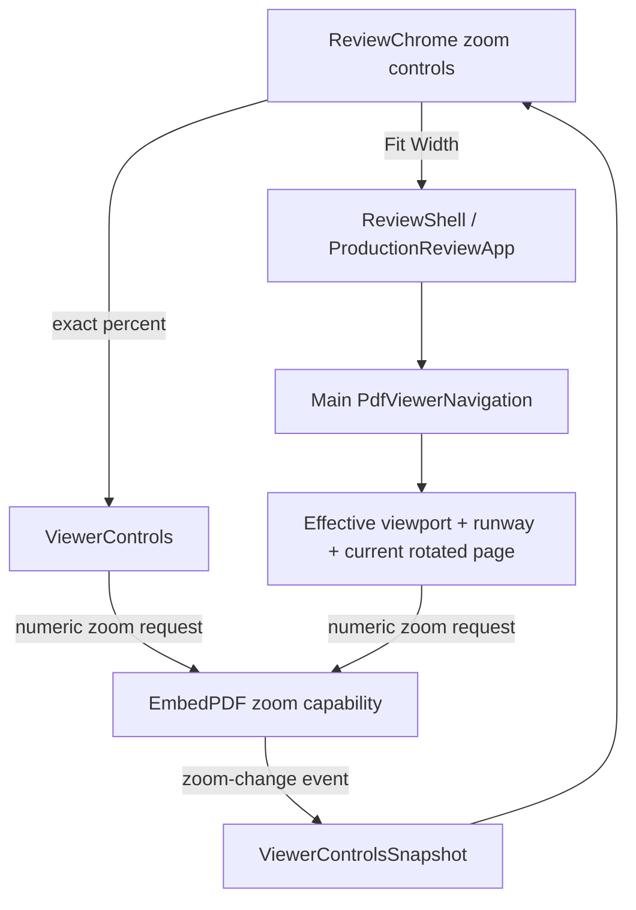
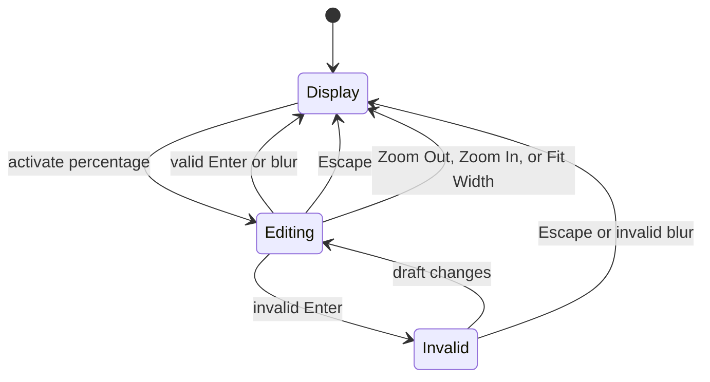

# Editable Zoom and Fit Width - Plan

## Goal Capsule

- **Objective:** Let a reviewer type an exact PDF zoom percentage in the top toolbar and fit the current PDF page to the unobscured reading width with one explicit action.
- **Product authority:** The Product Contract in this plan governs zoom editing and fit-width behavior. Existing viewer-control, Warm Neutral, and adaptive workspace-framing contracts remain authoritative for state ownership and tray behavior.
- **Execution profile:** Standard code plan with four ordered units covering viewer commands, fit geometry, toolbar interaction, and joined browser proof.
- **Stop conditions:** Do not add a second zoom-state model, use private EmbedPDF internals, resize or remount the viewer, make fit-width sticky, or broaden the work to reference-tab zoom controls.
- **Open blockers:** None.

---

## Product Contract

### Summary

Make the displayed zoom percentage editable through the same in-place interaction used by page navigation.
Add a compact fit-width control that sizes the current page to the reading space left after a right-docked workspace, with small margins.

### Problem Frame

The review chrome exposes stepwise zoom buttons and a read-only percentage.
Reviewers cannot enter a known zoom directly, and a page fitted to the full viewer can remain partly covered when a right workspace overlays that viewer.
The application already owns direct viewer-control and tray-aware framing seams, so both improvements can preserve the mounted viewer and its canonical state.

### Actor

- A1. Reviewer reading and annotating the main local PDF with pointer, keyboard, or touch input.

### Requirements

**Editable zoom**

- R1. When PDF zoom is ready, A1 can activate the displayed zoom percentage and receive a focused numeric editor containing the latest viewer-published whole percentage.
- R2. Enter commits a changed valid zoom, Escape cancels, and an ordinary changed valid blur commits; an unchanged draft closes without calling the viewer. Enter and Escape restore focus to the zoom activation control while blur preserves the newly selected focus target.
- R3. A valid zoom is a whole percentage within the configured viewer limits, and the editor shows the percent unit throughout editing.
- R4. Invalid Enter remains editable, announces an associated correction message with the accepted range, and never calls the viewer; invalid blur abandons the draft and returns to the viewer-published percentage.
- R5. A successful commit closes the editor and waits for the existing zoom subscription to publish the displayed value; the draft never becomes canonical zoom state.
- R6. Activating Zoom Out, Zoom In, or Fit Width while editing cancels the draft and runs only the activated action.

**Fit width**

- R7. A compact icon button sits with the existing zoom controls and has the accessible name `Fit PDF to available width`.
- R8. Fit Width sizes and horizontally frames the most-visible current main-document page inside the usable horizontal viewer interval with the viewer's standard left and right gap. Exact width matching applies when the calculated scale is within configured limits; otherwise Fit Width uses the nearest supported scale as a best-effort result.
- R9. An open right-presented workspace reduces the usable width by its measured occupied region, while a bottom-presented workspace does not reduce horizontal fit width.
- R10. Fit Width uses current page and document rotation with the latest settled layout geometry, ignores stale measurements after page, document, or workspace changes, and respects the configured numeric zoom limits. The framing layer exposes an awaitable settled-geometry revision so the navigation request can revalidate workspace measurements immediately before zooming and positioning.
- R11. Fit Width is a one-shot user zoom action. Later window changes, workspace open or close, workspace resizing, and right or bottom presentation changes preserve that zoom until A1 invokes another zoom action.

**Compatibility and presentation**

- R12. When zoom is unavailable, the chrome preserves its existing unavailable display, disables every zoom action, and does not offer zoom editing; Fit Width also remains disabled until main viewer navigation is ready.
- R13. Zoom editing and Fit Width preserve the current page, viewer mount, Annotation Tray or References state, active review state, and surrounding application state.
- R14. The new editor and button follow the Warm Neutral visual language, compact and coarse-pointer control sizes, focus treatment, tabular numerals, and responsive toolbar wrapping.

### Key Flows

- F1. Enter an exact zoom
  - **Trigger:** A1 activates the zoom percentage.
  - **Steps:** The chrome opens a temporary draft from the current viewer snapshot. A1 edits and commits or cancels. A valid commit crosses the viewer-control adapter and the viewer later publishes the actual zoom.
  - **Outcome:** The main PDF reaches the requested zoom, or remains unchanged after cancellation or invalid input.
  - **Covers:** R1-R6, R12-R14.
- F2. Fit the page beside a workspace
  - **Trigger:** A1 activates Fit Width with or without a workspace open.
  - **Steps:** The framing layer settles and publishes workspace geometry. The navigation adapter subtracts any measured right-side occupation and standard gaps, resolves the most-visible page's rotated width, requests a numeric zoom, and horizontally places the page inside that interval.
  - **Outcome:** The page fits cleanly inside the currently unobscured horizontal reading space without changing workspace presentation or viewer identity.
  - **Covers:** R7-R14.

### Acceptance Examples

- AE1. Exact zoom commit
  - **Covers:** R1-R5, R13.
  - **Given:** The viewer reports 110% zoom and a right workspace is open.
  - **When:** A1 activates the percentage, enters `125`, and presses Enter.
  - **Then:** One 125% request reaches the viewer, the editor closes, focus returns to the zoom activation control, the subscribed display becomes `125%`, and the workspace and viewer mount remain unchanged.
- AE2. Cancel and invalid input
  - **Covers:** R2-R5, R13.
  - **Given:** The zoom editor contains a changed draft.
  - **When:** A1 presses Escape or submits an empty, fractional, nonnumeric, below-minimum, or above-maximum value.
  - **Then:** Escape cancels and restores focus. Invalid Enter stays focused with associated range guidance, while invalid blur closes without changing zoom.
- AE3. Adjacent zoom action wins
  - **Covers:** R6.
  - **Given:** The zoom editor contains a changed valid draft.
  - **When:** A1 activates Zoom Out, Zoom In, or Fit Width.
  - **Then:** The draft is canceled and only the selected action runs once from the viewer-published zoom.
- AE3a. Unchanged zoom edit
  - **Covers:** R2, R5.
  - **Given:** Fit Width has produced a fractional internal scale whose display rounds to a whole percentage.
  - **When:** A1 activates the percentage and submits or blurs without changing the draft.
  - **Then:** The editor closes without issuing a zoom request, so the fitted scale remains exact.
- AE4. Fit beside a right workspace
  - **Covers:** R7-R11, R13-R14.
  - **Given:** A wide review stage has an open, right-presented workspace.
  - **When:** A1 activates Fit Width.
  - **Then:** When the scale is within configured limits, the most-visible page width matches the unobscured stage width minus the standard side gaps within browser-layout tolerance, both page edges remain inside that interval, and the workspace stays open. At a configured limit, the page uses the nearest supported scale and remains horizontally framed as cleanly as the available scroll range allows.
- AE5. Bottom workspace and later resize
  - **Covers:** R9-R11, R13.
  - **Given:** The workspace is bottom-presented or closed when A1 activates Fit Width.
  - **When:** The window later resizes or the workspace changes presentation.
  - **Then:** Bottom occupation does not reduce the fitted width, and later layout changes preserve the resulting zoom until another zoom action occurs.
- AE6. Zoom unavailable
  - **Covers:** R12.
  - **Given:** The zoom capability is not ready.
  - **When:** The review chrome renders.
  - **Then:** It shows `—%`, exposes no editable zoom trigger, and disables Zoom Out, Zoom In, and Fit Width with the existing readiness explanation.

### Scope Boundaries

**Included**

- Direct whole-percentage zoom through the existing viewer-control adapter.
- One-shot, tray-aware Fit Width for the main PDF.
- Warm Neutral toolbar presentation, accessibility, focus behavior, and responsive sizing.
- Unit, shell-browser, real-viewer, cross-engine, and visual-regression coverage for the changed surface.

#### Deferred to Follow-Up Work

- Fit Page, preset menus, keyboard shortcuts, sticky responsive fit modes, and zoom-history controls.
- Editable or fit-width controls inside Reference Tabs.
- A general toolbar redesign or changes to workspace docking behavior.

### Success Criteria

- A1 can enter any supported whole zoom percentage without stepping through repeated button presses.
- Fit Width uses the actual unobscured main-viewer width and leaves clean margins when a right workspace is open.
- Viewer subscriptions remain the sole source of displayed zoom state.
- Existing page navigation, workspace framing, responsive behavior, and viewer identity continue to work.

---

## Planning Contract

### Assumptions

- Direct entry accepts whole percentages from 20 through 6000 because the pinned EmbedPDF configuration currently uses the public plugin defaults and the chrome already publishes whole percentages.
- Fit Width applies to the most-visible current page. It does not continuously refit when navigation reaches a page with a different size.
- The existing viewport gap is the clean-margin authority; the feature does not introduce a second hard-coded toolbar margin.
- Fit Width is explicit and one-shot because existing adaptive-framing contracts require ordinary workspace changes to preserve zoom.

### Key Technical Decisions

- KTD1. **Keep direct zoom behind `ViewerControls`.** Add a validated percentage command that calls the active document's public numeric zoom request and leaves display updates to the existing zoom-change subscription. Governs R1-R6, R12-R13.
- KTD2. **Put tray-aware fit geometry in main viewer navigation.** Extend the project-owned `PdfViewerNavigation` seam because it already owns live runway, effective viewport geometry, most-visible page selection, rotation, viewport gap, guarded layout operations, and numeric zoom requests. Do not use the plugin's bare Fit Width mode because the right workspace overlays a full-width viewport. Governs R8-R13.
- KTD3. **Keep editing state temporary and local to the chrome.** Mirror the page editor's draft, validation, focus restoration, accessible error, and sibling-button arbitration without coupling the toolbar to EmbedPDF or workspace DOM. Governs R1-R6, R12-R14.
- KTD4. **Thread Fit Width as a dedicated user action.** Pass one fit callback from the retained main-navigation instance through the production shell to `ReviewChrome`, and let the shell's existing viewer-toolbar intent capture supersede stale automatic framing. Governs R7-R11, R13.
- KTD5. **Extend the existing visual system.** Add one semantic Lucide width-fit glyph to `ReviewIcon`, reuse the icon-control class, and share the page editor's control, focus, error, and responsive sizing rules where their behavior is identical. Governs R7, R12, R14.

### High-Level Technical Design

### Implementation Constraints

- Use only public EmbedPDF zoom, scroll, viewport, document, and rotation state.
- Reuse the effective viewport calculation that subtracts `runway.right`; never derive fit from `window.innerWidth` or `100vw`.
- Request one numeric scale for Fit Width so the right-workspace exclusion participates in the calculation.
- Reuse guarded layout operations so a fit started during page, document, or workspace transition applies only the latest settled geometry.
- Treat bottom runway as vertical reachability only and exclude it from horizontal fit math.
- Preserve the existing capture-phase Escape ownership used by the page editor and parent surfaces.
- Update visual baselines only after verifying the toolbar change is intentional in each canonical scene.

### Sequencing

U1 establishes direct numeric zoom and its validation boundary.
U2 adds tray-aware fit math and threads the action to the shell.
U3 adds the editor, icon control, styling, and action arbitration.
U4 proves joined behavior and updates intentional visual baselines.

### Sources and Research

- `apps/web/src/pdf/viewer-controls.ts` owns current page and zoom snapshots plus step actions.
- `apps/web/src/pdf/viewer-navigation-adapter.ts` owns effective viewport, runway, most-visible page, rotation, gap, and numeric zoom behavior.
- `apps/web/src/review/ReviewChrome.tsx` provides the in-place page-editor interaction to mirror.
- `apps/web/src/review/use-annotation-tray-framing.ts` and `docs/solutions/architecture-patterns/adaptive-annotation-tray-framing.md` require stage-local geometry, overlay-preserving layout, and explicit zoom as user intent.
- `docs/plans/2026-08-10-001-feat-editable-page-navigation-plan.md` supplies the established activation, validation, focus, and browser-test pattern.
- [EmbedPDF Zoom Plugin documentation](https://www.embedpdf.com/docs/react/headless/plugins/plugin-zoom) documents numeric `requestZoom`, current zoom state, Fit Width mode, and the default numeric limits used by the pinned unconfigured plugin.

---

## Implementation Units

### U1. Add validated direct zoom

- **Goal:** Expose exact whole-percentage zoom through the existing viewer adapter without creating shadow state.
- **Requirements:** R1-R6, R12-R13; KTD1.
- **Dependencies:** None.
- **Files:**
  - `apps/web/src/pdf/viewer-controls.ts`
  - `apps/web/src/pdf/embedpdf-viewer.ts`
  - `apps/web/test/viewer-controls.test.ts`
- **Approach:**
  1. Centralize the configured numeric zoom bounds so viewer registration, adapter validation, and chrome metadata share one authority.
  2. Extend `ViewerControls` with a percentage command that accepts only current supported whole values and forwards scale through the public zoom capability.
  3. Preserve event-derived snapshots and current readiness behavior.
- **Patterns to follow:** Mirror validated direct page navigation in the same adapter and numeric `requestZoom` use in `apps/web/src/pdf/viewer-navigation-adapter.ts`.
- **Test scenarios:**
  1. Minimum, ordinary, and maximum whole percentages request the corresponding numeric scales once.
  2. Empty-equivalent invalid numbers, fractions, non-finite values, unsafe integers, and values outside the configured limits do not call the zoom capability.
  3. A successful request leaves the snapshot unchanged until a zoom event publishes the actual level.
  4. Direct zoom remains inert when the zoom capability is unavailable while page controls can remain ready.
- **Verification:** Exact zoom crosses the public adapter only for valid requests, and subscribed viewer events remain authoritative.

### U2. Add tray-aware fit-width geometry

- **Goal:** Fit the most-visible current page to the actual unobscured horizontal reading interval.
- **Requirements:** R7-R13, F2, AE4-AE5; KTD2, KTD4.
- **Dependencies:** U1.
- **Files:**
  - `apps/web/src/pdf/viewer-navigation.ts`
  - `apps/web/src/pdf/viewer-navigation-adapter.ts`
  - `apps/web/src/pdf/viewer-framing.ts`
  - `apps/web/src/review/use-annotation-tray-framing.ts`
  - `apps/web/src/app/App.tsx`
  - `apps/web/src/app/ProductionReviewApp.tsx`
  - `apps/web/src/app/ReviewShell.tsx`
  - `apps/web/test/viewer-navigation.test.ts`
- **Approach:**
  1. Extend main viewer navigation with one explicit fit-width action.
  2. Resolve the most-visible mounted page and its combined rotation through existing geometry helpers.
  3. Expose an awaitable settled-geometry revision from workspace framing, then revalidate it immediately before using the latest measured runway.
  4. Calculate the numeric zoom from effective viewport width after right runway and two standard viewport gaps, then request the bounded zoom through the public capability.
  5. After zoom settlement, use the existing guarded location and scroll helpers to place the page between the effective interval's horizontal gaps while preserving the current page.
  6. Guard transition-time measurement and positioning so a superseded page, document, runway, or fit request cannot apply late.
  7. Thread the retained action and readiness to the shell without exposing workspace geometry to the chrome.
- **Patterns to follow:** Reuse effective viewport, page geometry, rotation, zoom tolerance, and live-runway patterns already in the navigation adapter.
- **Test scenarios:**
  1. With no runway, fit uses viewport width minus two standard gaps.
  2. Right runway reduces the available width by its current measured amount.
  3. Bottom-only runway leaves horizontal available width unchanged.
  4. Rotated and mixed-size pages use the most-visible page's rotated natural width.
  5. Invalid or unavailable viewport, page, zoom, or document geometry produces no request.
  6. Calculated values beyond configured limits are bounded consistently and reported as best-effort rather than asserted as exact fits.
  7. A fit requested during a workspace transition awaits the final geometry revision, and a superseded measurement cannot issue a late zoom or scroll.
  8. After zoom settles, both page edges lie inside the effective horizontal interval whenever the configured scale and natural scroll range permit it.
- **Verification:** Pure geometry and adapter tests prove a numeric fit request for closed, right, bottom, rotated, and unavailable states.

### U3. Build the editable zoom and Fit Width controls

- **Goal:** Add an accessible in-place editor and visually consistent fit button without disturbing the compact toolbar.
- **Requirements:** R1-R7, R12-R14, F1, AE1-AE3, AE6; KTD3, KTD5.
- **Dependencies:** U1, U2.
- **Files:**
  - `apps/web/src/review/ReviewChrome.tsx`
  - `apps/web/src/review/ReviewIcon.tsx`
  - `apps/web/src/app/review-layout-foundation.css`
  - `apps/web/src/app/review-layout-responsive.css`
  - `apps/web/test/review-layout.test.tsx`
- **Approach:**
  1. Replace the ready-state zoom text with an activation control that opens a percentage editor from the latest snapshot.
  2. Reuse page-editor commit, cancel, focus, invalid-state, and Escape conventions with zoom-specific validation and unit text.
  3. Cancel editing before sibling Zoom Out, Zoom In, or Fit Width actions so only the selected action wins.
  4. Add a semantic width-fit icon and reuse existing compact, disabled, hover, focus, touch, tabular-number, and wrapping rules.
- **Patterns to follow:** Mirror `validPageNumber`, page editor state, page-step arbitration, and existing icon-control markup.
- **Test scenarios:**
  1. A ready zoom renders an accessible activation control with the current whole percentage and visible percent unit.
  2. Activation focuses and selects the draft; valid Enter and blur request zoom and close according to R2.
  3. Escape cancels, restores focus, and does not dismiss an open workspace or finish surface.
  4. Invalid Enter associates and announces the supported range, clears on edit, and stays focused; invalid blur closes without a request.
  5. Zoom Out, Zoom In, and Fit Width each cancel a dirty draft and execute once.
  6. Unavailable zoom retains `—%`, offers no editor, and disables all three zoom actions with the readiness description.
  7. Narrow and coarse-pointer styles keep all controls operable without clipping or reducing touch targets.
  8. Submitting or blurring an unchanged draft closes without a viewer request, including after a fractional fit scale rounded for display.
- **Verification:** Static and interactive component coverage proves semantics, validation, focus, arbitration, unavailable state, and design-token reuse.

### U4. Prove joined browser geometry and presentation

- **Goal:** Verify the complete user flows against the shell harness and real PDF viewer across workspace layouts and browser engines.
- **Requirements:** R1-R14, F1-F2, AE1-AE6.
- **Dependencies:** U1-U3.
- **Files:**
  - `test/acceptance/review-harness/main.tsx`
  - `test/acceptance/review-harness/visual-scenarios.tsx`
  - `test/acceptance/review-workflow.spec.ts`
  - `test/acceptance/production-flow.spec.ts`
  - `test/acceptance/review-visual.spec.ts`
  - `test/acceptance/review-visual.spec.ts-snapshots/`
- **Approach:**
  1. Extend the stateful viewer-control harness with observable direct-zoom and fit-width actions.
  2. Exercise exact zoom activation, validation, commit, cancel, focus, unavailable state, and sibling-action precedence in the shell browser.
  3. Measure stage, workspace, viewport, and both page edges in the real viewer before and after Fit Width for closed, resizable right, and bottom presentations.
  4. Prove the mounted viewer, page, workspace, review state, and explicit zoom ownership survive the interactions and later responsive transitions.
  5. Review and update only snapshots whose toolbar change matches the intended Warm Neutral composition.
- **Execution note:** Start with failing joined browser assertions for the input contract and tray-aware geometry before finalizing the toolbar styling.
- **Patterns to follow:** Extend the page-editor acceptance cases and adaptive workspace geometry probes already present in the same specs.
- **Test scenarios:**
  1. Covers AE1-AE3: the shell harness records exact requests, focus outcomes, invalid feedback, cancellation, and one winning sibling action.
  2. Covers AE4: a right workspace remains open while fitted page width equals the unobscured stage interval minus standard gaps within one CSS pixel of layout tolerance and both page edges remain inside that interval.
  3. Covers AE5: bottom presentation does not shrink horizontal fit, and subsequent resize or dock changes preserve zoom until a new explicit action.
  4. Covers AE6: unavailable controls expose no editor and no enabled fit action.
  5. Rotated or mixed-width pages fit from the most-visible current page without remounting or navigating.
  6. Chromium and WebKit complete the geometry flow without browser errors, stale automatic framing, toolbar clipping, or unintended snapshot drift.
- **Verification:** Browser and visual suites prove the feature in the production composition and preserve the established reading-first interface.

---

## Verification Contract

| Gate | Command | Proves |
|---|---|---|
| Focused adapter and markup tests | `pnpm exec vitest run apps/web/test/viewer-controls.test.ts apps/web/test/viewer-navigation.test.ts apps/web/test/review-layout.test.tsx` | Direct zoom validation, fit math, toolbar semantics, and styling contracts |
| Shell browser interaction | `pnpm exec playwright test test/acceptance/review-workflow.spec.ts` | Editing, focus, invalid feedback, Escape ownership, and sibling-action arbitration |
| Real viewer interaction | `pnpm fixtures:pdf && pnpm build:web && pnpm exec playwright test test/acceptance/production-flow.spec.ts` | Right-tray-aware and bottom-tray-neutral fit geometry with stable viewer state |
| WebKit geometry | `pnpm test:e2e:webkit` | Cross-engine layout and focus behavior |
| Visual review | `pnpm test:visual` | Warm Neutral composition across canonical wide, narrow, and unavailable scenes |
| Review regression suite | `pnpm test:review` | Existing page, zoom, framing, and review-surface behavior |
| Type contract | `pnpm typecheck` | Adapter, navigation, shell, and React contracts remain type-safe |

---

## Definition of Done

- U1 is complete when valid whole percentages reach the public zoom capability and viewer events remain the sole displayed-state authority.
- U2 is complete when Fit Width uses settled effective stage-local width, right runway, standard gaps, most-visible page geometry, rotation, configured bounds, and guarded horizontal positioning without responding automatically to later layout changes.
- U3 is complete when the zoom display supports accessible in-place editing and a compact Fit Width button with the specified validation, focus, unavailable, arbitration, and responsive behavior.
- U4 is complete when shell and real-viewer browser tests cover AE1-AE6 across right, bottom, closed, rotated, narrow, coarse-pointer, Chromium, and WebKit states with intentional visual baselines.
- Every Verification Contract gate passes.
- The final diff contains no shadow zoom state, private EmbedPDF access, whole-window fit calculation, sticky auto-refit behavior, unrelated toolbar redesign, or abandoned experimental code.
