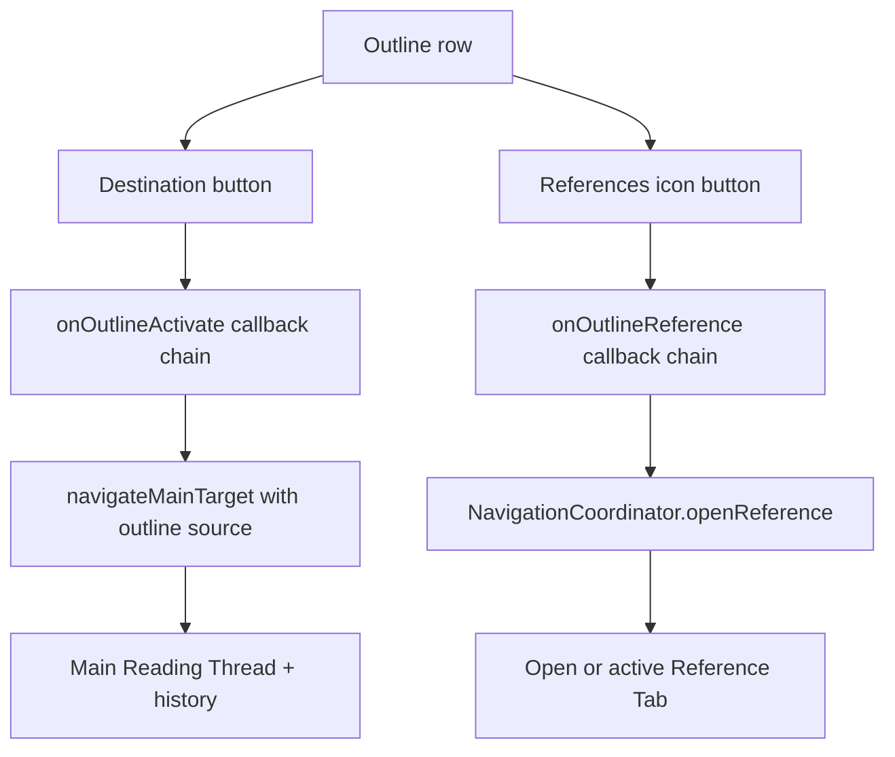

# Outline Reference Actions - Plan

## Goal Capsule

- **Objective:** Let a reviewer open any safe embedded-outline destination as a Reference Tab without moving the Main Reading Thread.
- **Product authority:** This plan extends the existing outline navigator with a secondary action. The current reference-navigation contract remains authoritative for Reference Tab identity, docking, focus, failure handling, and main-history behavior.
- **Open blockers:** None.
- **Execution profile:** Code change with component, responsive-style, installed-browser, and accessibility proof.
- **Tail ownership:** `ce-work` implements and verifies the units, then returns control to LFG for simplification, review, shipping, and CI follow-through.

---

## Product Contract

### Summary

Add a compact action at the right edge of each targetable outline row that opens that destination in References. Keep the existing outline destination action as the way to navigate the main PDF.

### Problem Frame

The outline currently moves the Main Reading Thread for every usable destination. A reviewer who wants to inspect an outlined section beside the current reading location must first move the main PDF or find another link to the same destination.

### Requirements

**Outline row action**

- R1. Each targetable outline row shall expose a right-aligned icon button that uses the same References icon as the PDF link-action popover.
- R2. On fine-pointer devices, the secondary button shall be visually quiet until its row is hovered or contains keyboard focus.
- R3. The secondary button shall remain keyboard reachable with a visible focus treatment and shall remain visible with a comfortable target on coarse-pointer devices.
- R4. The action shall have a destination-specific accessible name and a concise title without duplicating visible row text.

**Navigation behavior**

- R5. Activating the secondary action shall open or select the outline destination as a Reference Tab without changing the main PDF location or main-history index.
- R6. Activating the existing outline destination shall continue to move the Main Reading Thread and record its established Meaningful Jump.
- R7. Outline items without a classified `PdfNavigationTarget` shall expose no operable References action.
- R8. Reference opening shall retain the existing coordinator behavior for tab identity reuse, docking, focus, announcements, pending state, failure, and document-generation invalidation.

**Layout continuity**

- R9. The action column shall remain cleanly aligned at the right edge while nested indentation, long labels, page context, current-location styling, and disclosure controls retain their existing behavior.
- R10. Opening a Reference Tab from Outline shall preserve the mounted main viewer and its page, scroll, and zoom state across wide, bottom-docked, and narrow-unified workspace layouts.

### Key Flows

- F1. Inspect an outline destination in References
  - **Trigger:** A reviewer hovers an outline row, focuses it by keyboard, or uses a coarse pointer.
  - **Actors:** Reviewer.
  - **Steps:** The reviewer activates the References icon; the existing navigation coordinator opens or selects the destination; focus moves to the active Reference Tab.
  - **Outcome:** The destination is available for independent reading while the Main Reading Thread remains unchanged.
  - **Covers:** R1-R5, R8-R10.
- F2. Navigate the main PDF from Outline
  - **Trigger:** A reviewer activates the outline label instead of its secondary action.
  - **Actors:** Reviewer.
  - **Steps:** The existing outline-navigation path runs.
  - **Outcome:** The Main Reading Thread moves and existing Back/Forward behavior remains intact.
  - **Covers:** R6.

### Acceptance Examples

- AE1. Fine-pointer and keyboard discovery
  - **Given:** A targetable outline row is idle on a fine-pointer device.
  - **When:** The reviewer hovers the row or tabs to its secondary action.
  - **Then:** The References action becomes visible at the row's right edge, exposes the shared icon, and shows visible keyboard focus without moving the PDF.
  - **Covers:** R1-R4, R9.
- AE2. Reference opening preserves the reading thread
  - **Given:** The main PDF is on page 1 and an outline entry targets page 3.
  - **When:** The reviewer activates the entry's References action.
  - **Then:** A Reference Tab for page 3 opens or becomes active while the main page, scroll, zoom, and history remain unchanged.
  - **Covers:** R5, R8, R10.
- AE3. Primary outline behavior remains distinct
  - **Given:** The same targetable outline entry exposes its label action and References action.
  - **When:** The reviewer activates the label action.
  - **Then:** The main PDF moves to the target, no Reference Tab is opened by that activation, and Back reverses the Meaningful Jump.
  - **Covers:** R6.
- AE4. Unsafe or grouping-only entry
  - **Given:** An outline item has no classified destination target.
  - **When:** The item renders.
  - **Then:** It provides no operable References action and cannot bypass destination classification.
  - **Covers:** R7.

### Scope Boundaries

- Do not change outline discovery, target classification, label sanitization, expansion state, current-location tracking, or main-history semantics.
- Do not add a chooser or make the entire outline row open References; the existing label remains the primary main-navigation action.
- Do not add a second icon vocabulary, tooltip system, reference state path, or direct viewer/layout manipulation.
- Do not change Reference Tab lifecycle, Send to main, Close, retry, docking, resizing, or viewer framing.

### Sources / Research

- `docs/plans/2026-08-09-002-feat-reference-navigation-workspace-plan.md` defines outline main-navigation and Reference Tab behavior.
- `docs/plans/2026-08-09-001-feat-warm-neutral-review-design-language-plan.md` defines the Warm Neutral interaction language and focus/touch requirements.
- `docs/solutions/architecture-patterns/adaptive-annotation-tray-framing.md` requires orchestration to remain with the existing coordinator and mounted viewer.
- `CONCEPTS.md` defines Main Reading Thread, Reference Tab, Meaningful Jump, and Warm Neutral.

---

## Planning Contract

### Key Technical Decisions

- KTD1. **Render a sibling action, not a nested control.** `OutlineNavigator` shall place the References action beside the existing destination button in the row grid. This preserves valid button semantics and prevents secondary activation from triggering main navigation. Implements R1, R5-R7, and R9.
- KTD2. **Delegate to the existing reference coordinator.** The outline callback chain shall terminate at `NavigationCoordinator.openReference` with the item's classified target and normalized outline metadata. This reuses tab deduplication, responsive reveal, focus, failure, announcement, and generation-safety behavior. Implements R5, R7-R8, and R10.
- KTD3. **Reserve alignment space and vary only visibility.** The row grid shall keep a fixed compact action column. Fine-pointer idle state uses opacity, row hover and focus-within reveal the action, and coarse-pointer styles keep it visible at the established touch size. Implements R1-R4 and R9.
- KTD4. **Verify the seam in layers.** Component tests shall pin safe markup and accessible semantics. Installed-browser tests shall pin the distinct main/reference outcomes, preserved viewer state, responsive recomposition, hover/focus visibility, and touch sizing. Implements R1-R10.

### High-Level Technical Design

The new action joins the current callback chain and stops at the same coordinator used by PDF link choices.

### Assumptions

- Only items with a non-null classified target can open a Reference Tab; grouping-only and rejected targets remain fail-closed.
- The secondary action remains in sequential keyboard order even when visually transparent, matching annotation row actions; focus-within reveals it before activation.
- Opening References may switch the effective workspace mode or dock presentation, but the coordinator remains the sole authority for that recomposition.

### Implementation Constraints

- Reuse `<ReviewIcon name="references" />`, the same icon used by `LinkActionPopover`.
- Keep the action as a sibling of `.outline-navigator__destination` and preserve the disclosure control as a separate sibling.
- Use a row-scoped hover selector so hovering a nested child does not reveal ancestor-row actions.
- Reuse current focus-ring, border, surface, motion, compact-control, and coarse-pointer tokens.
- Match the annotation actions' existing `hover: none` / `pointer: coarse` fallback rather than making the control permanently visible whenever a secondary coarse pointer is present; hybrid devices with hover keep the requested hover-or-focus disclosure.
- Keep target labels and page context sanitized by existing outline discovery; do not derive a new destination identity or inspect raw bookmark actions.
- Preserve the existing logical focus-token and reference-tab focus behavior rather than adding direct DOM focus management.

### Sequencing

U1 establishes the semantic action and coordinator callback path. U2 adds adaptive presentation and proves the behavior in the installed viewer.

---

## Implementation Units

### U1. Add the outline-to-reference action path

- **Goal:** Expose one separately named References action for each safe outline destination and route it through the existing reference coordinator.
- **Requirements:** R1, R4-R8; F1-F2; AE2-AE4; KTD1-KTD2.
- **Dependencies:** None.
- **Files:**
  - `apps/web/src/review/OutlineNavigator.tsx`
  - `apps/web/src/review/OutlineAnnotationsWorkspace.tsx`
  - `apps/web/src/app/ReviewShell.tsx`
  - `apps/web/src/app/ProductionReviewApp.tsx`
  - `apps/web/test/reference-workspace.test.tsx`
  - `apps/web/test/production-review-app.test.tsx`
- **Approach:**
  1. Add a dedicated outline-reference callback through the existing workspace and shell component boundary.
  2. Render a target-only icon button as a sibling of the disclosure and destination buttons, with a destination-specific accessible name and matching concise title.
  3. At the production owner, pass the classified target plus the item's normalized label and page context to the coordinator's reference-opening operation.
  4. Leave the existing destination callback and main-navigation source unchanged.
- **Execution note:** Add component-contract assertions before changing the outline markup so the sibling structure, target-null behavior, shared icon, and accessible naming have explicit red proof.
- **Patterns to follow:** `apps/web/src/review/LinkActionPopover.tsx` for the icon/action name, `apps/web/src/review/OutlineNavigator.tsx` for safe outline controls, and `apps/web/src/app/ProductionReviewApp.tsx` for coordinator-owned navigation.
- **Test scenarios:**
  1. Covers AE1. A targetable outline item renders a separately named References button containing the shared `references` icon.
  2. Covers AE4. A target-null parent can retain its disclosure but renders no operable References action.
  3. The secondary button is a sibling rather than a descendant of the destination button, and the destination retains its current accessible name and current-location state.
  4. Covers AE2. The production callback sends the outline target, normalized label, and page context to `openReference` without calling main navigation.
  5. Covers AE3. Activating the existing destination continues to call `navigateMainTarget` with the outline source and does not call `openReference`.
- **Verification:** Focused component and production-owner tests pass with no changed outline discovery or navigation-coordinator contract.

### U2. Style and verify adaptive outline actions

- **Goal:** Make the action right-aligned, quiet on fine pointers, discoverable by keyboard, and usable in every workspace presentation.
- **Requirements:** R1-R4, R9-R10; F1; AE1-AE2; KTD3-KTD4.
- **Dependencies:** U1.
- **Files:**
  - `apps/web/src/app/review-layout-annotations.css`
  - `apps/web/src/app/review-layout-responsive.css`
  - `test/acceptance/production-flow.spec.ts`
- **Approach:**
  1. Extend the outline row grid with a fixed compact action column while the label column remains the only flexible and truncating region.
  2. Mirror the annotation action's neutral, hover, active, focus-reveal, and motion treatment with outline-scoped selectors.
  3. Keep the action visible and at the established touch target under coarse-pointer media queries.
  4. Extend the real-PDF outline flow to exercise both sibling actions and capture main-view state before and after reference opening.
  5. Cover nested indentation, long labels, repeated reference activation, narrow workspace recomposition, and focus order without changing outline or reference state owners.
- **Execution note:** Characterize the existing main-outline navigation and Back behavior before adding the secondary path. Inspect the rendered row at fine-pointer, keyboard-focus, and coarse-pointer states before accepting the CSS.
- **Patterns to follow:** `.annotation-item__action` and its reveal selectors in `apps/web/src/app/review-layout-annotations.css`, coarse-pointer action rules in `apps/web/src/app/review-layout-responsive.css`, and the installed outline/reference flow in `test/acceptance/production-flow.spec.ts`.
- **Test scenarios:**
  1. Covers AE1. A fine-pointer idle row reserves a right-aligned action column without showing the action; hover and focus-within reveal it with the expected interactive treatment.
  2. Keyboard traversal reaches the destination and References actions as distinct controls with visible focus and no accidental main navigation.
  3. A coarse-pointer outline shows the References action at the established touch size without requiring hover.
  4. A long nested label truncates before the right-aligned action overlaps or leaves the workspace.
  5. Covers AE2. Opening the outline destination in References focuses the new or reused tab while the main page, scroll, zoom, mounted viewer identity, and history index remain unchanged.
  6. Covers AE3. Activating the destination still moves the main PDF, retains focus on the outline control, and creates the reversible history jump.
  7. Repeated activation of the secondary action reuses the existing Reference Tab rather than creating a duplicate.
  8. Narrow-unified, wide right-docked, and bottom-docked layouts recompose through the coordinator with the same navigation outcomes.
- **Verification:** Focused Chromium and WebKit production flows pass, computed styles confirm visibility and hit-target states, and the row remains balanced under long-label and nested-outline fixtures.

---

## Verification Contract

| Gate | Command | Proves |
|---|---|---|
| Component contract | `pnpm exec vitest run apps/web/test/reference-workspace.test.tsx apps/web/test/production-review-app.test.tsx` | Sibling controls, shared icon, accessible naming, target-null safety, and callback separation |
| Navigation regression | `pnpm exec vitest run apps/web/test/navigation-coordinator.test.ts` | Existing reference deduplication, focus, failure, generation, and main-history authority remain intact |
| Review regression | `pnpm test:review` | Workspace, outline, reference, focus, annotation, and review-shell behavior remains coherent |
| Installed browser flow | `pnpm fixtures:pdf` then focused `test/acceptance/production-flow.spec.ts` runs in Chromium and WebKit | Real PDF destinations, main-view preservation, history separation, responsive recomposition, hover/focus visibility, and coarse-pointer sizing |
| Static quality | `pnpm typecheck` and `pnpm build:web` | Type integrity and production bundle viability |
| Diff hygiene | `git diff --check` | No whitespace or patch-format defects |

Browser verification is required because opacity-based discovery, grid alignment, pointer media queries, focus movement, and mounted-viewer continuity cannot be proven by server-rendered markup alone.

---

## Definition of Done

- R1-R10 and AE1-AE4 are satisfied in the installed PDF workflow.
- U1 and U2 meet their Verification outcomes with no deliberate test exception.
- Every safe outline destination has one right-aligned References action that reuses the PDF link popover's icon.
- Fine-pointer hover, keyboard focus, and coarse-pointer states each make the action discoverable and operable.
- The secondary action opens or selects a Reference Tab without moving the Main Reading Thread or changing main history.
- The primary outline destination continues to move the main PDF and create its established Meaningful Jump.
- Target-null outline entries remain fail-closed, and long or nested labels cannot overlap the action.
- Focused component, navigation, review-regression, Chromium, WebKit, typecheck, and web-build gates pass.
- Experimental or abandoned component props, styles, test branches, and selectors are removed from the final diff.
