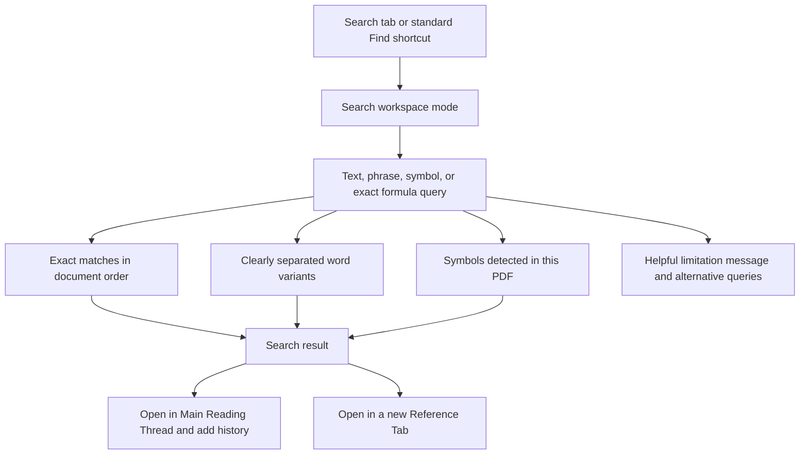
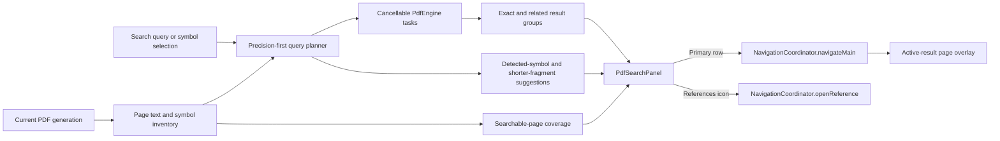

# PDF Search Workspace - Plan

## Goal Capsule

- **Objective:** Let a reviewer find text, word variants, mathematical symbols, and exact formula fragments in the current PDF without abandoning the review workspace or relying on manual scrolling.
- **Product authority:** This contract owns Search as a workspace mode, query and result behavior, math-query assistance, result navigation, and search-specific failure states. The existing workspace contracts remain authoritative for adaptive placement, Reference Tab identity, and Main Reading Thread history except where this contract adds Search behavior.
- **Open blockers:** None. Search quality is bounded to pages with reliable extracted text, and uncertain mathematical queries have an explicit precision-first fallback.
- **Execution:** Code.

---

## Product Contract

### Summary

Add a familiar Smart Find mode to the adaptive workspace for text, phrases, morphological variants, mathematical symbols, and exact formula fragments in the current PDF.
Keep results predictable and document-ordered, with precise notation matching, transparent alternatives when extraction is uncertain, and direct actions for the Main Reading Thread or a new Reference Tab.

### Problem Frame

Reviewers often need to recover every use of a keyword, phrase, or mathematical symbol while reading a technical PDF.
Conventional PDF search is brittle when words appear in several forms or when a LaTeX-rendered symbol is hard to type, name, or extract consistently.

When search fails, the current fallback is to scroll manually or guess a nearby term.
Both approaches are slow and unreliable, especially when the goal is to find the first place notation or terminology appears.
Broad fuzzy symbol matching is not a safe remedy because unrelated mathematical results make the entire search surface feel untrustworthy.

### Key Decisions

- **Use familiar Smart Find as the product shape.** (session-settled: user-directed — chosen over definition-first search and a symbol-first navigator: a predictable find model has lower learning cost and avoids opaque ranking.) Governs R1-R4 and R13-R18.
- **Separate exact and morphological matches in document order.** (session-settled: user-directed — chosen over blended results, on-demand variants, current-location ordering, and relevance ranking: exact hits stay trustworthy while early uses remain easy to find.) Governs R6-R8.
- **Ground notation assistance in the current PDF.** (session-settled: user-directed — chosen over a full symbol catalog: document-local suggestions are immediately relevant and less noisy.) Governs R9-R10.
- **Support exact formula fragments without normalized formula equivalence.** (session-settled: user-directed — chosen over individual-symbol-only search and normalized formula matching: pasted expressions are valuable, but visual equivalence should not create false matches.) Governs R5, R11-R12, and R20-R21.
- **Give every result a main-view action and a References action.** (session-settled: user-directed — chosen over one-step preview history and References-only navigation: result selection should be a normal Main Reading Thread jump while comparison remains one direct action.) Governs R14-R18.
- **Prefer explicit uncertainty to broad mathematical matching.** (session-settled: user-directed — chosen over OCR scope and aggressive fuzzy notation search: false symbol matches are more damaging than an explained limitation.) Governs R19-R22.
- **Place Search with the existing navigation tools.** (session-settled: user-approved — chosen over an independently dockable search tray and tab-only activation: Search should follow the established workspace and standard Find shortcut.) Governs R1-R4.

The interaction shape is:

### Requirements

**Workspace access and state**

- R1. Search shall join the adaptive tools workspace as its right-most mode under the existing wide and narrow placement contract.
- R2. Search shall inherit tools-workspace docking and geometry without changing bottom-docked References on wide layouts.
- R3. The standard platform Find shortcut shall reveal Search in its effective placement and focus the query field without triggering the browser's native find surface.
- R4. Switching modes, hiding and reopening the workspace, or crossing the responsive threshold shall preserve the current document's query, result groups, selected result, and Search scroll position; replacing the document shall reset them.

**Queries and matching**

- R5. The query field shall accept words, phrases, individual mathematical symbols, common symbol names, LaTeX-style symbol commands, and exact formula fragments.
- R6. Exact text and phrase matches shall appear first and shall be ordered by page and position from the beginning of the PDF.
- R7. Morphological word variants shall appear in a separate related-results group with the matched form explained, and they shall never be blended into the exact-results group.
- R8. Morphological phrase variants shall appear only in the secondary group when they preserve the phrase's word order and do not substitute semantic synonyms.
- R9. Symbol autocomplete and the symbol picker shall prioritize symbols confidently detected in the current PDF and expose each symbol by glyph, common name, and LaTeX-style command when known.
- R10. Selecting a symbol suggestion shall create a query for that symbol without adding symbols absent from the current PDF to the primary suggestion set.
- R11. An exact formula-fragment query shall match only occurrences supported by the document's searchable text in the same symbol and token order.
- R12. Search shall not treat visually similar symbols, normalized formula forms, reordered expressions, or semantically related notation as matches for an exact mathematical query.

**Results and navigation**

- R13. Each result shall show its page, a concise surrounding excerpt, and whether it is an exact, morphological-variant, symbol, or exact-formula match.
- R14. Activating a result's primary row shall reveal and highlight that occurrence in the Main Reading Thread and create a Meaningful Jump in Back and Forward history.
- R15. Each separately activated primary result shall create its own history entry rather than collapsing a sequence of result visits into one search-session entry.
- R16. Each result shall expose a compact right-edge Open in References action using the established annotation-row action treatment and References icon.
- R17. Activating Open in References shall open the occurrence in a new or already-live Reference Tab for that target without moving the Main Reading Thread.
- R18. Main-view and References actions shall preserve the query and result list so the reviewer can continue through other matches without reconstructing the search.

**Reliability and accessibility**

- R19. Search shall operate only on pages with reliable extracted text and location geometry, and it shall disclose any unsearchable pages without presenting their absence as evidence of zero matches.
- R20. When a mathematical query cannot be matched confidently, Search shall show a helpful result-state explanation and suggest grounded alternatives such as detected symbols, known names, LaTeX-style commands, or shorter exact fragments when available.
- R21. Alternative mathematical queries shall remain suggestions until the reviewer selects one, and uncertain or related symbols shall not appear as matches for the original query.
- R22. Search shall distinguish idle, searching, results, no-results, partially searchable, and unavailable states without discarding the current query.
- R23. Search tabs, query controls, result rows, result actions, match highlights, and status changes shall expose accessible names and states, support keyboard operation equivalent to pointer operation, and preserve logical focus when the workspace recomposes.

### Key Flows

- F1. Find a word or phrase across the PDF
  - **Trigger:** A reviewer opens Search or uses the standard Find shortcut.
  - **Steps:** The reviewer enters a word or phrase; exact results appear first in document order; any morphological variants appear in a separately labeled group; the reviewer activates a result.
  - **Outcome:** The Main Reading Thread reveals the selected occurrence and records a Meaningful Jump while Search retains the query and results.
  - **Covers:** R3-R8, R13-R15, R18, and R23.
- F2. Find a mathematical symbol that is hard to type
  - **Trigger:** A reviewer types a symbol name or LaTeX-style command, or opens the symbol picker.
  - **Steps:** Search offers symbols detected in the current PDF; the reviewer selects the intended glyph; exact occurrences appear in document order.
  - **Outcome:** The reviewer finds the paper's uses of the intended symbol without unrelated notation entering the result list.
  - **Covers:** R5, R9-R10, R12-R13, and R21.
- F3. Search an exact formula fragment
  - **Trigger:** A reviewer enters or pastes a multi-symbol expression.
  - **Steps:** Search looks for the exact extracted token order; confident matches appear as formula results; an uncertain or unsupported query produces an explanation and grounded alternatives.
  - **Outcome:** Exact formula search remains useful without implying normalized mathematical equivalence or silently broadening the query.
  - **Covers:** R5, R11-R13, and R19-R22.
- F4. Compare a result without losing the current passage
  - **Trigger:** A reviewer activates a result's Open in References action.
  - **Steps:** The result opens in a Reference Tab; the Main Reading Thread stays in place; Search retains its query and result state.
  - **Outcome:** The reviewer compares the occurrence with the current passage and can return to the same result list.
  - **Covers:** R16-R18 and R23.
- F5. Continue searching through layout changes
  - **Trigger:** The workspace is hidden, reopened, or recomposed between wide and narrow layouts.
  - **Steps:** Search returns in the effective tools-workspace placement with its query, result groups, selection, scroll state, and logical focus intact.
  - **Outcome:** Responsive layout changes do not restart the search or create a competing docked surface.
  - **Covers:** R1-R4 and R23.

### Acceptance Examples

- AE1. Exact and variant results stay distinct
  - **Covers:** R6-R8 and R13.
  - **Given:** The PDF contains `stable`, `stabilizes`, and `stability` in several locations.
  - **When:** The reviewer searches for `stable`.
  - **Then:** Exact `stable` matches appear first in document order, the other morphological forms appear in a labeled related-results group, and semantic synonyms do not appear as variants.
- AE2. A named symbol resolves precisely
  - **Covers:** R5, R9-R10, R12-R13, and R21.
  - **Given:** The PDF contains lambda and several visually or semantically unrelated mathematical symbols.
  - **When:** The reviewer types `lambda` or its LaTeX-style command and selects lambda from the detected-symbol suggestions.
  - **Then:** Only confident occurrences of the selected lambda glyph appear as matches, while other symbols remain excluded.
- AE3. An uncertain formula query fails helpfully
  - **Covers:** R11-R13 and R19-R22.
  - **Given:** A pasted formula is rendered visually but is not available as one confident searchable sequence.
  - **When:** The reviewer submits that fragment.
  - **Then:** Search does not return loosely related formulas, explains the limitation, and offers only grounded alternatives such as a detected constituent symbol or shorter exact fragment.
- AE4. Primary and References actions have different location effects
  - **Covers:** R14-R18.
  - **Given:** Search contains several results and the Main Reading Thread is on a different page.
  - **When:** The reviewer activates one result row and later activates another result's Open in References action.
  - **Then:** The first action moves the Main Reading Thread and adds its own history entry, while the second opens a Reference Tab without moving the Main Reading Thread; both actions leave Search state intact.
- AE5. Partially searchable documents do not overclaim
  - **Covers:** R19-R22.
  - **Given:** Some pages have reliable searchable text and other pages do not.
  - **When:** The reviewer runs a query with no matches on the searchable pages.
  - **Then:** Search reports no matches in the searchable portion and identifies the unsearchable coverage rather than claiming the term is absent from the entire PDF.
- AE6. Search survives responsive recomposition
  - **Covers:** R1-R4 and R23.
  - **Given:** Search is active in the wide right workspace with a query, selected result, and scrolled result list.
  - **When:** The layout becomes narrow and later returns to wide.
  - **Then:** Search moves into the unified bottom workspace and back to the right tools workspace with its query, result state, selection, scroll position, and logical focus preserved.

### Scope Boundaries

- Search is limited to the current source PDF; cross-document search and searching review comments, annotations, or Reference Tab state are excluded.
- OCR for scanned or image-only pages is deferred; mixed documents search only their reliably extractable pages per R19.
- A global mathematical symbol glossary and suggestions for symbols absent from the current PDF are excluded from the primary experience.
- Semantic definition detection, synonym search, topical retrieval, and relevance ranking are excluded.
- Normalized mathematical equivalence, algebraic equivalence, and fuzzy formula matching are excluded; exact formula fragments remain governed by R11-R12.
- Search has no independent dock preference or geometry memory; it inherits the tools workspace behavior governed by R1-R4.

### Dependencies / Assumptions

- The current PDF supplies reliable extracted text and location geometry for the pages Search covers; some formula layouts will remain unavailable as contiguous searchable text.
- The existing Reference Navigation Workspace and Dockable References Tray contracts remain authoritative for Reference Tab identity, responsive workspace placement, and Main Reading Thread behavior.
- Common symbol names and LaTeX-style commands can be mapped to confidently detected document glyphs without weakening the precision rules in R12 and R21.

### Sources / Research

- `docs/plans/2026-08-09-002-feat-reference-navigation-workspace-plan.md` defines workspace modes, Reference Tabs, and Main Reading Thread behavior.
- `docs/plans/2026-08-10-001-feat-dockable-reference-tray-plan.md` defines wide and narrow workspace placement and responsive state preservation.
- `docs/plans/2026-08-10-002-feat-compact-reference-tab-actions-plan.md` defines compact Reference Tab actions and keyboard semantics.
- `apps/web/src/review/reference-navigation-state.ts`, `apps/web/src/review/reference-workspace-layout.ts`, and `apps/web/src/review/ReferenceWorkspace.tsx` confirm the current three-mode workspace and tab behavior.
- `apps/web/src/pdf/PdfWorkspace.tsx` and `apps/web/src/pdf/text-reliability.ts` confirm selectable PDF text, extracted text, and location geometry surfaces.
- `apps/web/src/review/AnnotationList.tsx`, `apps/web/src/review/ReviewIcon.tsx`, and `apps/web/src/review/LinkActionPopover.tsx` confirm the existing annotation-row actions and References icon treatment.

---

## Planning Contract

### Product Contract preservation

The Product Contract above is preserved from the confirmed `ce-brainstorm` artifact. Planning decisions may choose implementation mechanisms, but they do not weaken or reinterpret R1-R23, F1-F5, or AE1-AE6.

### Key Technical Decisions

- KTD1. Build search on the public `PdfEngine` seams already used by the viewer adapters. First characterize `searchAllPages` literal matching, flags, progress, offsets, and rectangle coordinates against EmbedPDF 2.14.4. Use it only when its observed semantics satisfy KTD3. Build a canonical per-page text index with source-offset and glyph/rectangle mappings from `extractText`, `getPageGlyphs`, and `getPageTextRects` for required normalization that the engine does not supply. Keep grouped product state outside EmbedPDF's single-query search plugin. This preserves precise occurrence geometry without coupling exact and related-result groups to one mutable plugin result list or adding a runtime dependency. Covers R5-R13 and R19-R22. Sources: [EmbedPDF search plugin capability and task lifecycle](https://github.com/embedpdf/embed-pdf-viewer/blob/main/packages/plugin-search/src/lib/search-plugin.ts), [EmbedPDF search result state](https://github.com/embedpdf/embed-pdf-viewer/blob/main/packages/plugin-search/src/lib/types.ts), and `apps/web/src/pdf/viewer-selection-adapter.ts`.
- KTD2. Add one document-generation-scoped search controller as the sole owner of indexing, query classification, cancellable engine tasks, grouped results, coverage, and selected occurrence. Keep Search focus and scroll tokens in the existing `WorkspaceMemory.modes` owner. Bind every completion to both `documentGeneration` and a monotonic query token. Ignore late extraction, search, suggestion, and highlight work after either value changes. Enforce central work budgets: at most four concurrent page reads, at most 512 Unicode code points per query, and at most 64 MiB of retained canonical text plus mapping data per document generation. Convert budget exhaustion into disclosed partial or unavailable coverage. This follows the generation guards in `apps/web/src/pdf/pdf-outline.ts` and `apps/web/src/pdf/existing-annotations.ts` and prevents a replaced PDF, superseded query, or adversarial document from consuming unbounded client resources or publishing stale state. Covers R4, R18-R22, and AE5-AE6.
- KTD3. Use deterministic, precision-first query planning. Prose exact search is case-insensitive, NFC-normalized, tolerant of extracted whitespace runs, punctuation-preserving, and page-bounded. Formula and symbol search applies NFC only, preserves code points and token order, tolerates layout whitespace, and never applies NFKC, confusable folding, algebraic normalization, reordering, or semantic expansion. Treat ligatures, soft hyphens, replacement characters, private-use glyphs, and unsupported reading order as unreliable rather than silently rewriting them. Related text is limited to conservative English lexeme families found in the reliable document token inventory; phrase variants preserve token count and order. Covers R5-R12, R19-R21, and AE1-AE3.
- KTD4. Give each occurrence a stable identity from `documentGeneration`, page, engine character offset/count, and first reliable rectangle so separate hits on one page cannot collapse. Convert that occurrence into a `PdfNavigationTarget` while preserving the occurrence identity beyond location-tolerance deduplication. Route the primary action through `NavigationCoordinator.navigateMain` as a direct Meaningful Jump, and route the compact References action through `NavigationCoordinator.openReference`. Re-activating the already-current occurrence may be a no-op; activating a distinct occurrence always creates its own history entry. Render a project-owned active-result highlight from the same page-space rectangles so grouped Search state does not have to be rewritten to drive an EmbedPDF plugin layer. Covers R13-R18 and AE4. Sources: `apps/web/src/review/navigation-coordinator.ts`, `apps/web/src/pdf/pdf-navigation-target.ts`, `apps/web/src/pdf/viewer-navigation-adapter.ts`, and [EmbedPDF SearchLayer geometry handling](https://github.com/embedpdf/embed-pdf-viewer/blob/main/packages/plugin-search/src/shared/components/search-layer.tsx).
- KTD5. Extend the existing continuously mounted workspace tree with `search` as the right-most tools mode. Keep active mode, disclosure, and right/bottom presentation independent. Do not add a Search dock, window-width listener, viewer padding, or mode transition that remounts the viewer. Covers R1-R4 and R23. Source: `docs/solutions/architecture-patterns/adaptive-annotation-tray-framing.md`.
- KTD6. Treat the query field as a real searchbox and intercept Meta+F or Ctrl+F at the ReviewShell boundary before the general editable-target guard. The shortcut works from the reading and workspace surfaces, including ordinary editors, but yields to IME composition and active modal or alert-dialog authority. It reveals the effective Search surface and focuses or selects the current query without disturbing other typing shortcuts. Status changes use a polite live region; tabs and result actions follow the existing roving-tab and focus-memory patterns. Covers R3, R23, F1, and F5.

### Assumptions

These planning bets were not separately validated with the user because LFG runs planning headlessly:

- Exact matching defaults to case-insensitive behavior, with no case or whole-word controls in the first version.
- A short debounce starts search while typing, and Enter submits immediately; an empty query returns to the idle state.
- Conservative related-word support initially targets English-like alphabetic tokens. Unsupported scripts still receive exact Unicode search but no claimed morphology.
- Search state lives for the current in-memory document generation. A full application reload does not restore it.
- The symbol alias table is a reviewed source-controlled mapping of common glyph, name, and LaTeX command triples. Only aliases whose glyph is detected in the current PDF enter the primary suggestion set.
- Typing a common symbol name remains an ordinary literal-text query while showing detected-glyph suggestions. It becomes a symbol query only when the reviewer selects a suggestion; a LaTeX-style command is classified directly when it resolves to one detected glyph.
- The active result is the only search occurrence that must be highlighted in the viewer. The results list remains the complete representation of all exact and related occurrences.

### Open Questions

- **Deferred, non-blocking:** Which additional language-specific morphology rule families should follow the initial English lexeme-family coverage? Exact Unicode search remains available for every script, and Search must disclose when related-form support is unavailable rather than implying that no variants exist.

### High-Level Technical Design

The controller is the only layer that calls PDF search and extraction APIs. Pure query-planning and result-grouping functions stay independent of React and EmbedPDF so precision rules are exhaustively unit-tested. UI components consume serializable state and emit semantic actions. ReviewShell adapts those actions to the existing navigation, workspace, and history systems.

### Sequencing and Constraints

1. Establish the pure search model and engine adapter before UI work so matching, stale-task, and coverage behavior have stable contracts.
2. Extend workspace modes and mount the Search panel without changing existing References placement or viewer lifetime.
3. Wire semantic result actions into Main history, Reference Tabs, and the active-result overlay.
4. Add shortcut, focus, responsive, partial-coverage, and installed-style acceptance coverage after the complete flow exists.
5. Preserve the current same-origin and memory-only document credential boundary. Search must use the already loaded `PdfDocumentObject`; it must not refetch the PDF or persist extracted text.

### System-Wide Impact

- **Viewer lifecycle:** Full-document text discovery adds background PDFium work. Tasks must report observable progress, abort on replacement or superseding query, and avoid blocking page rendering.
- **Progressive interaction:** During an incomplete run, publish available hits in stable document order under a “searching remaining pages” status and allow their actions. Do not publish a final no-results claim until searchable-page coverage completes.
- **State lifecycle:** Query and result state is keyed by document generation rather than layout presentation. Recomposition moves the mounted Search surface without reconstructing it.
- **Navigation:** Search produces a new semantic destination source, but Main history and Reference Tab identity remain owned by `NavigationCoordinator`.
- **Rendering:** `PdfWorkspace` gains a non-interactive active-search overlay beside selection and owned-annotation layers. It uses page-space geometry and must remain inert for pointer and accessibility input.
- **Privacy:** Extracted text and symbol inventory stay in memory. No network search, telemetry, or local persistence is introduced.

### Risks and Mitigations

- **False related-word matches:** Conservative document-inventory filtering, separate grouping, and matched-form labels keep variants inspectable. Pure tests use near-collision words and reject semantic synonyms.
- **Math extraction ambiguity:** No visual-equivalence normalization is permitted. Unsupported sequences produce the R20 message and suggestions without changing the submitted query.
- **Large or adversarial PDFs:** Page extraction is cached per generation, concurrency and retained index size are bounded by KTD2, queries are cancellable, progress is surfaced, and stale completions are ignored. Acceptance covers interaction while indexing is incomplete and graceful partial coverage when a work budget is reached.
- **Geometry drift:** Search uses engine result rectangles rather than reconstructing substring geometry from coarse text runs. Navigation and overlay tests cover rotation, crop origins, and Viewer Runway.
- **Responsive regressions:** Search extends existing mode unions and stage-derived layout only. Browser coverage verifies that viewer mount, zoom, and axes stay stable across wide/narrow recomposition.

---

## Implementation Units

### U1. Build the PDF search domain and engine adapter

- **Goal:** Produce precise, cancellable, document-ordered Search results and document-local symbol/coverage data without UI dependencies.
- **Requirements:** R5-R13 and R19-R22. Flows F1-F3. Acceptance examples AE1-AE3 and AE5. Decisions KTD1-KTD3.
- **Files:** Add `apps/web/src/pdf/pdf-search-model.ts`, `apps/web/src/pdf/pdf-search-controller.ts`, `apps/web/src/pdf/pdf-search-morphology.ts`, and `apps/web/src/pdf/pdf-symbol-catalog.ts`. Update `apps/web/src/pdf/text-reliability.ts` only through a search-specific wrapper or additive diagnostic. Add `apps/web/test/pdf-search-model.test.ts`, `apps/web/test/pdf-search-controller.test.ts`, and `apps/web/test/pdf-search-morphology.test.ts`.
- **Approach:** Define serializable query, group, result, suggestion, coverage, and state types. Add conformance coverage for the pinned engine before selecting its fast path. Build canonical page snapshots with normalized-to-source offset/geometry mappings and a detected-symbol inventory per document generation. Resolve symbol aliases before exact search. Generate conservative document-grounded variant candidates, execute matching through the characterized engine or canonical index as required by KTD3, de-duplicate and sort by page plus rectangle position, and reject stale completions.
- **Test scenarios:** Exact word, phrase, Unicode symbol, alias, LaTeX command, and formula queries return stable document order. Prose normalization covers case, NFC, layout whitespace, punctuation, page boundaries, ligatures, and soft hyphens. Formula tests prove exact code-point/token order and reject NFKC look-alikes, confusables, and reordered expressions. `stable` remains exact while accepted lexeme-family forms enter a labeled related group and synonyms or suffix collisions do not. Phrase variants preserve order. Empty, partially searchable, and unavailable documents report the correct coverage. Superseded queries and replaced documents cannot publish late extraction, suggestion, result, or highlight state. Oversized queries, concurrency saturation, and index-budget exhaustion remain responsive and produce explicit bounded states.
- **Verification:** Targeted Vitest passes with a fake `PdfEngine` task seam and asserts task abortion, result geometry, group labels, suggestions, and coverage state.
- **Dependencies:** None.

### U2. Add Search to the adaptive workspace

- **Goal:** Make Search a persistent right-most tools mode with a familiar, accessible Smart Find panel.
- **Requirements:** R1-R10, R13, R18-R23. Flows F1-F3 and F5. Acceptance examples AE1-AE3, AE5-AE6. Decisions KTD2, KTD3, KTD5, and KTD6.
- **Files:** Add `apps/web/src/review/SearchWorkspace.tsx` and `apps/web/src/review/use-pdf-search.ts`. Update `apps/web/src/review/reference-navigation-state.ts`, `apps/web/src/review/reference-workspace-layout.ts`, `apps/web/src/review/OutlineAnnotationsWorkspace.tsx`, `apps/web/src/review/ReferenceWorkspace.tsx`, `apps/web/src/app/App.tsx`, `apps/web/src/app/ProductionReviewApp.tsx`, `apps/web/src/app/ReviewShell.tsx`, and the review workspace CSS. Add `apps/web/test/search-workspace.test.tsx`; update `apps/web/test/reference-navigation-state.test.ts`, `apps/web/test/reference-workspace-layout.test.ts`, `apps/web/test/reference-workspace.test.tsx`, `apps/web/test/production-review-app.test.tsx`, and `apps/web/test/app-interactions.test.ts`.
- **Approach:** Extend the established mode unions, label maps, and `WorkspaceMemory.modes` focus/scroll owner. Keep one mounted Search panel whose controller is keyed to `documentGeneration`; `use-pdf-search.ts` adapts controller events without creating a second reducer. Render searchbox, detected-symbol autocomplete/picker, exact and related groups, matched-form metadata, progressive results, coverage, and alternative-query states. Preserve controller query/selection state and workspace scroll/logical focus while only the presentation container changes. An effective query change immediately clears the prior selection and active highlight. Hiding Search does not invalidate or abort the query; reopening observes the latest state. Available progressive hits are actionable, and final no-results copy waits for coverage completion.
- **Test scenarios:** Search is last in wide and narrow tab order. Meta+F/Ctrl+F reveals the effective surface from reading content and ordinary editors, but not during IME composition or an active modal. Tab, arrows, Enter, Space, and Escape follow current composite patterns. Idle, searching, progressive results, final results, no-results, partial, and unavailable states retain the query and expose searched/total coverage. Rapid query changes clear old selection/highlight and never flash stale results. Hiding and reopening during an incomplete run preserves completed hits and observes continued progress. Wide-to-narrow-to-wide recomposition preserves controller state plus workspace focus/scroll memory and does not change References docking. Screen-reader status announcements do not repeat on unchanged state.
- **Verification:** Component rendering and DOM-event tests prove tab semantics, accessible names, live status, focus memory, symbol selection, separate result groups, and stable state across mode/presentation changes.
- **Dependencies:** U1.

### U3. Connect results to Main history, Reference Tabs, and highlighting

- **Goal:** Give every result the two settled navigation actions with correct history and location effects.
- **Requirements:** R13-R18 and R23. Flows F1, F3-F4. Acceptance example AE4. Decision KTD4.
- **Files:** Update `apps/web/src/pdf/pdf-navigation-target.ts`, `apps/web/src/pdf/PdfWorkspace.tsx`, `apps/web/src/review/navigation-coordinator.ts`, `apps/web/src/app/ProductionReviewApp.tsx`, and `apps/web/src/app/ReviewShell.tsx`. Add `apps/web/src/pdf/SearchMatchOverlay.tsx`. Update `apps/web/test/pdf-navigation-target.test.ts`, `apps/web/test/viewer-framing.test.ts`, `apps/web/test/navigation-coordinator.test.ts`, and `apps/web/test/search-workspace.test.tsx`.
- **Approach:** Create stable targets from result page-space rectangles and page crop data. Primary activation records the current Main location and applies one direct Meaningful Jump per distinct occurrence. The right-edge References action uses the established icon/action treatment and opens the same target without moving Main. Pass the selected result geometry to an inert page overlay, clear it on effective query or document-generation change, and keep Search state unchanged after either navigation action.
- **Test scenarios:** Sequential primary activations create distinct Back/Forward entries. References activation reuses an already-live identical occurrence, leaves Main unchanged, and preserves Search. Target identity distinguishes separate occurrences on one page. Rotated/cropped pages and right/bottom Viewer Runway reveal the selected rectangle. The overlay follows zoom and document rotation, clears on query/replacement, and exposes no focusable content.
- **Verification:** Pure coordinator/target/framing tests and component tests prove observable history, tab reuse, non-movement, and highlight geometry.
- **Dependencies:** U1 and U2.

### U5. Prove installed-style Search behavior

- **Goal:** Verify the user-visible feature against representative text, morphology, notation, navigation, and responsive scenarios in the production viewer.
- **Requirements:** R1-R23. Flows F1-F5. Acceptance examples AE1-AE6.
- **Files:** Extend `test/fixtures/pdfs/generate.ts` with a deterministic searchable fixture if existing fixtures do not contain the required word forms and symbols. Update `test/acceptance/production-flow.spec.ts` and `test/acceptance/review-workflow.spec.ts`. Update `test/acceptance/review-harness/visual-scenarios.tsx` and visual baselines only when Search adds a stable new visual scenario.
- **Approach:** Drive the production build through pointer and keyboard paths. Assert visible result group labels, page/excerpt metadata, selected highlighting, Main history, Reference Tab non-movement, partial-coverage disclosure, and responsive state preservation. Keep geometry-sensitive runs in Chromium and WebKit.
- **Test scenarios:** Exercise AE1-AE6 end to end, including named/LaTeX symbol input, exact formula success and uncertainty, multiple primary jumps, References comparison, and a wide/narrow round trip with Search active. Verify no browser Find surface appears for the app shortcut and no unexpected viewer remount, zoom, or horizontal axis change occurs.
- **Verification:** Production-flow acceptance passes in Chromium and WebKit, and any updated visual scenario is reviewed at wide and narrow sizes.
- **Dependencies:** U1-U3.

---

## Verification Contract

Run the smallest relevant gate after each unit, then the complete feature gates after U5:

- `pnpm vitest run apps/web/test/pdf-search-model.test.ts apps/web/test/pdf-search-controller.test.ts apps/web/test/pdf-search-morphology.test.ts`
- `pnpm vitest run apps/web/test/search-workspace.test.tsx apps/web/test/reference-navigation-state.test.ts apps/web/test/reference-workspace-layout.test.ts apps/web/test/reference-workspace.test.tsx apps/web/test/production-review-app.test.tsx`
- `pnpm vitest run apps/web/test/pdf-navigation-target.test.ts apps/web/test/navigation-coordinator.test.ts apps/web/test/viewer-framing.test.ts apps/web/test/app-interactions.test.ts`
- `pnpm typecheck`
- `pnpm build:web`
- `pnpm fixtures:pdf && pnpm playwright test test/acceptance/production-flow.spec.ts test/acceptance/review-workflow.spec.ts`
- `pnpm fixtures:pdf && pnpm playwright test --config playwright.webkit.config.ts test/acceptance/production-flow.spec.ts`

Quality gates:

- Every R-ID is covered by a unit and at least one unit, component, or acceptance scenario.
- Superseded-query and replaced-document tasks abort or become observationally inert. Hiding Search alone preserves the active query and does not invalidate its task.
- Exact and mathematical precision tests include negative near-matches, not only successful examples.
- Search does not add a network request, text persistence, independent dock, or viewer remount path.
- Existing Review workspace, navigation history, Reference Tab, shortcut, and framing suites remain green.
- `release:validate` does not exist in this repository; the build, typecheck, targeted Vitest, and production Playwright gates above are the release-equivalent contract for this change.

---

## Definition of Done

- U1 is done when exact, related, symbol, formula, suggestion, coverage, cancellation, and stale-generation behavior are represented by stable types and passing pure/adapter tests.
- U2 is done when Search is the persistent right-most tools mode, all result and status states render accessibly, and workspace recomposition preserves Search state.
- U3 is done when primary results create one Meaningful Jump each, References actions do not move Main, and the selected occurrence is visibly highlighted from engine geometry.
- U5 is done when AE1-AE6 pass through the production viewer in Chromium and the geometry-sensitive responsive flow passes in WebKit.
- The complete Verification Contract passes with no unrelated test regressions.
- The final diff contains no abandoned plugin registration, duplicate search state owner, experimental matcher, stale fixture, or dead-end UI from rejected approaches.
- Product behavior remains within the confirmed scope: current-PDF extracted-text search only, with no OCR, semantic definition detection, cross-document search, or fuzzy mathematical equivalence.
