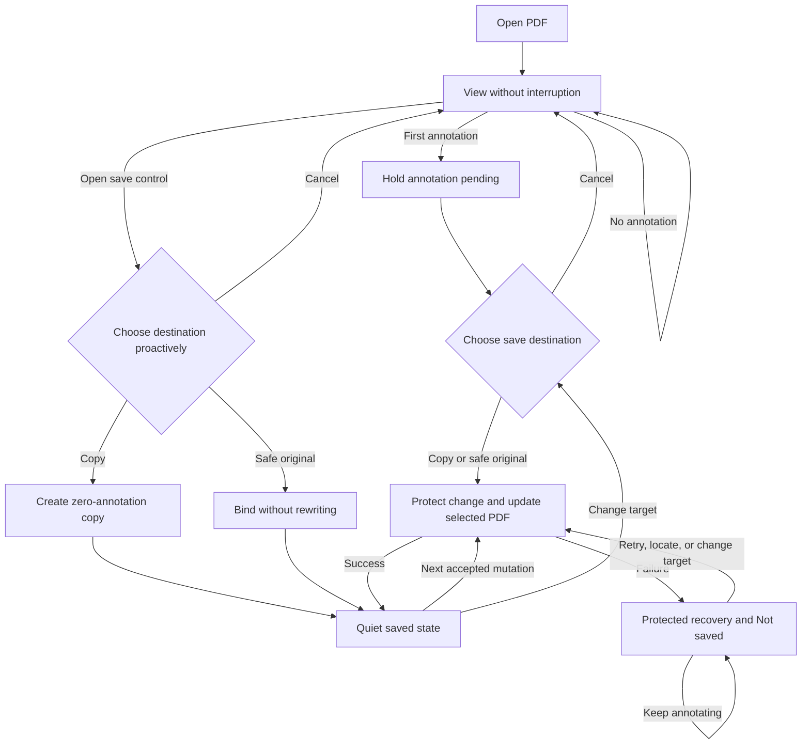
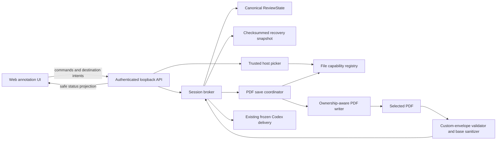

# Saveless PDF Annotation Persistence - Plan

## Goal Capsule

- **Objective:** Replace the export-at-the-end review lifecycle with a quiet, trustworthy saving model in which people can view without interruption, choose an annotation destination when they first need one, and thereafter have every accepted annotation change saved automatically to that PDF.
- **Product authority:** This plan supersedes the file-saving, user-visible review terminology, revision display, and Finish lifecycle requirements in `docs/plans/2026-08-06-001-feat-local-placekeeper-plan.md` and `docs/plans/2026-08-07-002-feat-reading-first-pdf-review-interface-plan.md`. Their other requirements remain authoritative, including existing annotation interactions, source-preservation safeguards, and Codex handoff semantics.
- **Open blockers:** None. The product choices required before technical planning are settled here.

---

## Product Contract

### Summary

Opening a PDF remains a viewing action and never triggers a save prompt.
The first committed app-created annotation, or an earlier explicit use of the document save control, establishes whether annotations will be saved into the original PDF or a separate copy.
After that choice, adding, editing, deleting, undoing, or redoing an annotation automatically persists the current annotation state to the selected PDF without a Finish step or manual export.

App-created annotations remain standards-visible in ordinary PDF readers and fully editable in this app after the saved PDF is closed, renamed, moved, shared, or opened on another Mac with the app.
Private recovery protects accepted changes whenever the selected PDF cannot be updated, while a visible Not saved state and a persistent destination control help the person reconnect, relocate, or replace the save target.

### Problem Frame

The current interface calls an annotation session a review, displays an internal revision number beside Saved, and defers durable PDF output to a Finish drawer containing Save reviewed copy, Replace Original, Codex handoff, Finish, and Discard actions.
That model makes saving feel like a terminal delivery event even though annotation is an ongoing editing activity.
It also creates an important mismatch: routine changes are autosaved only to private recovery, while the PDF a person expects to own remains unchanged until an explicit export.

The replacement model should feel saveless after one necessary destination choice.
It must preserve the safer-copy default, make intentional replacement of the original explicit, keep work recoverable when files move or writes fail, and avoid asking viewers to make an editing decision before they have edited anything.

### Actors

- A1. **Annotator or viewer:** Opens a PDF to read, optionally creates and changes annotations, chooses where those annotations are saved, and expects the document identity and save health to remain understandable.
- A2. **Local annotation application:** Owns accepted annotation state, protects it through recovery, synchronizes it to the selected PDF, and explains any condition that prevents synchronization.
- A3. **Other PDF reader:** Displays standards-compatible annotations without needing this application or its private recovery data.

### Key Decisions

- **Ask on the first annotation, not on open.** (session-settled: user-directed — chosen over an open-time prompt because a person may only want to view the PDF.) Governs R1-R3 and R6-R7.
- **Use a one-step destination dialog with a separate copy preselected.** (session-settled: user-approved — chosen over a two-step wizard and an implicit copy because the consequence should be explicit without becoming laborious.) Governs R3-R6 and R8.
- **Make PDF persistence automatic after destination selection.** (session-settled: user-directed — chosen over manual export through Finish because annotation is ongoing editing rather than a terminal review event.) Governs R7, R9-R15, R25, and R28-R29.
- **Carry editability inside the saved PDF.** (session-settled: user-directed — chosen over same-device recovery and flattened output because app-created marks must remain editable after reopen, move, rename, or transfer.) Governs R16-R22.
- **Keep working in protected recovery when the PDF cannot be saved.** (session-settled: user-directed — chosen over blocking annotation because a missing or unwritable target should not cost work.) Governs R9-R15, R22, and R25-R26.
- **Unify document identity, destination, and save health in one compact control.** (session-settled: user-directed — chosen over a separate status pill and icon-only control so the destination is legible without adding chrome.) Governs R23-R26, R28, and R31.
- **Remove visible review lifecycle and revision language.** (session-settled: user-directed — chosen over preserving Finish and internal version terminology because neither represents the person's ongoing annotation task.) Governs R27 and R29-R30.
- **Leave Codex handoff behavior unchanged.** (session-settled: user-directed — chosen over redesigning saving and handoff simultaneously so this change stays focused on annotation persistence.) Governs R30.

### Requirements

**Activation and destination choice**

- R1. Opening a PDF shall not display a save-destination prompt, create an annotation copy, or modify the opened file.
- R2. The first app-created annotation shall remain pending while the application presents the destination choice, and it shall become committed only after a destination is successfully established.
- R3. The destination choice shall be a one-step dialog with Save to a copy preselected and Modify the original available as the explicit alternative.
- R4. Save to a copy shall initially propose the source folder and the source basename followed by `-annotated.pdf`, while allowing the person to change both filename and location before confirming.
- R5. A copy-name collision shall never silently overwrite an existing file; the application shall propose or require a distinct destination while preserving the person's ability to edit it.
- R6. Canceling the first-annotation destination dialog shall cancel that pending annotation and return to an unchanged viewing state with no destination selected.
- R7. The document save control shall be available before annotation so a person may establish a destination proactively; when they do, the first later annotation shall save automatically without showing the first-annotation dialog.
- R8. Modify the original shall be selectable only when the application can safely write that exact opened PDF. Save to a copy shall remain usable when only filesystem replacement of the original is unsafe. If the PDF itself cannot be rewritten standards-honestly because of encryption, certification, signature, annotation permissions, or conformance restrictions, neither destination shall be offered; the dialog shall explain the specific reason, cancel the pending mark on close, and leave viewing available.

**Automatic persistence and protected recovery**

- R9. Once a destination exists, every accepted annotation mutation, including add, edit, delete, undo, and redo, shall be protected in private recovery and queued for PDF persistence without requiring another save command.
- R10. The application shall serialize or reconcile overlapping writes so the selected PDF never finishes with an older annotation state than the latest state reported as saved.
- R11. A mutation shall be reported as Saved only after the corresponding current annotation state has been committed successfully to the selected PDF; recovery durability alone shall not be labeled as a successful PDF save.
- R12. Save failures shall not block further annotation changes or discard accepted work; the application shall retain the latest accepted state in protected recovery and expose a visible Not saved warning until PDF synchronization succeeds.
- R13. From the Not saved state, the destination control shall offer the applicable recovery actions, including retrying the target, locating a moved target, selecting another copy, or selecting the original when safe.
- R14. Replacement of an existing original, reconnection to a moved target, and subsequent writes shall fail closed when file identity, source drift, permissions, signing, encryption, or another safety condition makes the intended target uncertain.
- R15. Closing a synchronized document shall require no Finish action and shall leave no stale recovery prompt; closing while the PDF is not synchronized shall retain protected recovery for the next open.

**Portable editability and PDF interoperability**

- R16. Every app-created annotation persisted to a PDF shall include sufficient portable identity and semantic data in that PDF for the application to reconstruct it as an editable annotation after the file is closed and reopened.
- R17. Portable editability shall survive renaming, moving, sharing, and opening the PDF on another Mac with this application, without depending on recovery data from the originating device.
- R18. App-created annotations shall remain visually usable in standards-compliant PDF readers that do not understand the application's editing metadata.
- R19. Reopening an app-authored annotated PDF shall reconstruct its app-created annotations for editing and deletion and recognize that opened PDF as the intended current target. When writer and filesystem safety assessment passes, automatic in-place saving shall resume without the first-annotation dialog. When only original replacement is unsafe, the first changed imported annotation shall remain pending until a safe copy is established; when the PDF itself cannot be rewritten standards-honestly, the attempted change shall remain uncommitted and viewing shall continue.
- R20. Existing or foreign PDF annotations shall remain visible, preserved during saving, and read-only unless they carry valid app-authored editing data.
- R21. If app-specific editing data is absent, invalid, or stripped while a standards-visible mark remains, the mark shall remain visible and preserved as a read-only existing annotation rather than being guessed into editable state or discarded.
- R22. Private recovery shall protect unsynchronized work and crash recovery, but it shall not be the long-term authority for editability once a PDF containing the same saved annotation state exists.

**Document identity, save health, and lifecycle language**

- R23. The top-left document identity control shall place a downward-arrow-into-tray save icon immediately before the opened document filename and shall use the application's existing visual language rather than a floppy-disk metaphor.
- R24. When the current destination differs from the opened document, the destination filename shall appear as a subordinate line directly beneath the opened filename; when saving into the opened document, only the opened filename shall appear.
- R25. The entire document identity cluster shall open the destination menu at any time so a person can inspect, locate, or change the current target without searching for a separate completion surface.
- R26. Normal synchronized operation shall remain visually quiet, while Saving and Not saved shall use explicit accessible text when action or attention is needed; color may reinforce but shall never be the only status signal.
- R27. Internal revision numbers shall not appear in regular interface chrome, status announcements, or the destination menu, though the application may continue using them internally for ordering, recovery, conflict checks, and Codex handoff integrity.
- R28. Changing destinations shall leave the previous PDF intact at its last successfully saved state, write the complete current document and annotation state to the newly selected target, and direct subsequent automatic saves only to the new target.
- R29. The interface shall remove the Finish and Discard session-lifecycle actions together with Finish review, reviewed copy, Human delivery, and equivalent completion-oriented language from the annotation-saving flow; ordinary close and normal annotation editing shall replace those lifecycle concepts.
- R30. Codex handoff shall remain reachable through a separate neutrally named action after Finish is removed, while its functional workflow, frozen-state guarantees, files, and confirmation behavior remain unchanged.
- R31. The identity control, dialog, destination menu, save warnings, and status changes shall be keyboard operable, screen-reader understandable, and coherent on narrow surfaces; truncation shall not remove access to the full filenames or recovery actions.

### Key Flows



- F1. View without annotating
  - **Trigger:** A1 opens a PDF.
  - **Actors:** A1, A2.
  - **Steps:** A2 renders the PDF and its existing annotations; A1 reads, navigates, and closes it without creating an app annotation.
  - **Outcome:** No prompt appears, no copy is created, and no PDF bytes are changed.
  - **Covers:** R1, R20.
- F2. Create the first annotation in a copy
  - **Trigger:** A1 completes an annotation action before choosing a destination.
  - **Actors:** A1, A2.
  - **Steps:** A2 holds the annotation pending and opens the one-step dialog; A1 accepts or customizes the preselected copy; A2 establishes the copy, commits the annotation, protects it in recovery, and writes it to that copy.
  - **Outcome:** The source remains unchanged, the identity control shows the source filename above the destination filename, and subsequent changes save automatically.
  - **Covers:** R2-R7, R9-R11, R23-R26.
- F3. Create the first annotation in the original
  - **Trigger:** A1 chooses Modify the original for the pending first annotation or proactively through the save control.
  - **Actors:** A1, A2.
  - **Steps:** A2 explains the consequence and validates that the opened file is the exact safe target; A1 confirms; A2 commits the pending annotation and updates the original.
  - **Outcome:** The original becomes the automatic save target and the identity control needs no destination subtitle.
  - **Covers:** R2-R3, R7-R11, R14, R23-R26.
- F4. Continue annotating with automatic saves
  - **Trigger:** A1 adds, edits, deletes, undoes, or redoes an annotation after choosing a destination.
  - **Actors:** A1, A2.
  - **Steps:** A2 accepts the mutation, makes it durable in protected recovery, applies ordered PDF persistence, and quietly reports success only after the target commit.
  - **Outcome:** The selected PDF converges to the latest accepted annotation state without a manual export or completion action.
  - **Covers:** R9-R11, R15, R26-R27, R29.
- F5. Recover from a missing or unwritable target
  - **Trigger:** Automatic PDF persistence fails because the destination moved, disappeared, changed, or became unwritable.
  - **Actors:** A1, A2.
  - **Steps:** A2 retains accepted mutations in recovery and shows Not saved; A1 may keep annotating, then uses the identity control to retry, locate the intended file, or choose a new target; A2 validates and synchronizes the latest complete state.
  - **Outcome:** Work continues without loss, and Not saved clears only after the chosen PDF catches up.
  - **Covers:** R10-R14, R22, R25-R26.
- F6. Reopen an app-authored PDF elsewhere
  - **Trigger:** A1 opens a saved annotated PDF after closing it, renaming or moving it, sharing it, or transferring it to another Mac.
  - **Actors:** A1, A2, A3.
  - **Steps:** A2 reads the portable editing data, reconstructs app-created annotations, and assesses the opened PDF as a target; A1 edits or deletes an old mark. If safe, A2 automatically saves into the opened PDF. If only original replacement is unsafe, A2 holds the changed command pending until A1 establishes a safe copy. If the PDF itself cannot be rewritten standards-honestly, the changed command remains uncommitted. A3 can display the standards-compatible marks without interpreting app metadata.
  - **Outcome:** The PDF remains interoperable and its app-created marks remain editable without originating-device recovery data; unsafe in-place writes still fail closed.
  - **Covers:** R16-R22.
- F7. Change the destination
  - **Trigger:** A1 opens the identity control and chooses another copy or the original.
  - **Actors:** A1, A2.
  - **Steps:** A2 validates or creates the new target, writes the complete current state to it, changes the identity subtitle as needed, and routes later saves there.
  - **Outcome:** The former target remains intact at its last saved state and the new target becomes authoritative for later automatic persistence.
  - **Covers:** R5, R8, R14, R23-R26, R28.

### Acceptance Examples

- AE1. Read-only visit
  - **Covers:** R1, R20.
  - **Given:** A PDF with or without existing annotations is opened.
  - **When:** A1 reads and closes it without creating an app annotation or proactively choosing a destination.
  - **Then:** No destination question appears, no copy is created, and neither the PDF nor its annotations are changed.
- AE2. First annotation uses the safe copy default
  - **Covers:** R2-R7, R9-R11, R23-R26.
  - **Given:** `paper.pdf` is open with no destination selected.
  - **When:** A1 creates the first annotation, accepts the preselected copy destination, and makes no naming changes.
  - **Then:** The annotation is committed to a collision-safe `paper-annotated.pdf` in the source folder, the source remains unchanged, and later mutations save to that copy automatically.
- AE3. First annotation modifies the original
  - **Covers:** R2-R3, R8-R11, R14, R24-R26.
  - **Given:** The exact opened PDF is writable and passes all replacement safety checks.
  - **When:** A1 selects Modify the original and confirms the consequence.
  - **Then:** The pending annotation is committed to the original, subsequent changes update it automatically, and the identity cluster shows no second filename.
- AE4. Cancel at the first annotation
  - **Covers:** R2, R6.
  - **Given:** The destination dialog was triggered by the first pending annotation.
  - **When:** A1 cancels it.
  - **Then:** The pending annotation disappears, the PDF remains unchanged, and the app returns to viewing without a selected destination.
- AE5. Rapid edit and undo sequence
  - **Covers:** R9-R11, R26-R27.
  - **Given:** A destination is active.
  - **When:** A1 rapidly edits an annotation, deletes another, and undoes the deletion while writes overlap.
  - **Then:** The final PDF state matches the latest acknowledged annotation state, an older write cannot land last, and no revision number is exposed.
- AE6. Save target disappears
  - **Covers:** R12-R14, R22, R25-R26.
  - **Given:** A copy is the current destination and is moved outside the app while the document remains open.
  - **When:** A1 makes another annotation change.
  - **Then:** The change remains recoverable, annotation continues, Not saved is visible, and the identity control offers Locate and alternative destination actions without silently creating or overwriting an uncertain file.
- AE7. Locate and catch up
  - **Covers:** R10-R14, R25-R26.
  - **Given:** Several changes accumulated in recovery after the destination moved.
  - **When:** A1 locates the intended file and it passes identity and drift checks.
  - **Then:** The complete latest state is written to it, the destination association updates, and Not saved clears only after the write succeeds.
- AE8. Portable editing after transfer
  - **Covers:** R16-R19, R22.
  - **Given:** An annotated PDF was saved on one Mac and transferred without any recovery files to another Mac with this application.
  - **When:** A1 opens it and deletes an app-created annotation from an earlier session.
  - **Then:** The annotation is editable without originating-device recovery. If the transferred PDF passes target safety checks, the deletion automatically persists into it with no destination prompt. If only original replacement is unsafe, the deletion remains pending until a safe copy is chosen; if the PDF cannot be standards-honestly rewritten at all, the attempted deletion remains uncommitted and the reason is explained.
- AE9. Interoperability and foreign annotations
  - **Covers:** R18, R20-R21.
  - **Given:** A PDF contains app-created annotations, foreign annotations, and an app-style visible mark whose editing metadata was stripped.
  - **When:** It is viewed elsewhere and later saved again in this application.
  - **Then:** Other readers display the standards-compatible marks, this application preserves all foreign and metadata-stripped marks as read-only, and only annotations with valid app-authored metadata become editable.
- AE10. Close with and without synchronization
  - **Covers:** R12, R15, R22, R29.
  - **Given:** One session is fully synchronized and another has a Not saved state.
  - **When:** A1 closes each without using Finish.
  - **Then:** The synchronized session needs no recovery prompt on reopen, while the unsynchronized session offers the protected latest state and a path to reconnect a destination.
- AE11. Switch destinations
  - **Covers:** R14, R23-R25, R28.
  - **Given:** A1 has been saving annotations to `paper-annotated.pdf`.
  - **When:** A1 chooses a different copy through the identity control.
  - **Then:** The first copy remains at its last successful state, the new copy receives the complete current state, the subtitle changes to its filename, and future changes save only there.
- AE12. Codex remains independent
  - **Covers:** R27, R29-R30.
  - **Given:** Finish and the human delivery section no longer exist.
  - **When:** A1 invokes the neutral Codex action.
  - **Then:** The existing Codex handoff workflow remains available with the same frozen-state and confirmation guarantees, without exposing a review revision in ordinary saving chrome.
- AE13. Accessible identity control on a narrow surface
  - **Covers:** R23-R26, R31.
  - **Given:** A long source filename and a distinct long destination filename are open on a narrow embedded surface.
  - **When:** A1 reaches the identity control by keyboard and opens it while a save warning is active.
  - **Then:** Focus, the opened filename, the destination relationship, Not saved, and every recovery action are announced meaningfully; visible truncation does not hide access to either full filename or any action.
- AE14. Protected PDF remains safely viewable
  - **Covers:** R1, R8, R14, R20.
  - **Given:** A viewable PDF cannot be rewritten standards-honestly under its encryption, certification, signature, annotation-permission, or conformance rules.
  - **When:** A1 attempts the first app annotation.
  - **Then:** The pending mark is not committed, neither original nor copy is falsely offered as writable, the specific restriction is explained, and the PDF remains available for viewing with all existing marks preserved.

### Success Criteria

- A person who only reads a PDF encounters no save decision and causes no file mutation.
- After one destination choice, ordinary annotation never requires Finish, export, or repeated save commands.
- Every Saved indication corresponds to the selected PDF, while every failed write leaves the latest accepted work recoverable and visibly Not saved.
- An app-authored annotation can be edited or deleted after the PDF is transferred to another Mac without accompanying private app state.
- Original-file replacement remains explicit and fails closed under the existing safety constraints.
- Regular interface chrome contains neither a revision number nor review-completion language.

### Scope Boundaries

**Included**

- The destination decision, default copy naming, original-file safety presentation, automatic PDF persistence, protected recovery behavior, and destination switching.
- Portable in-PDF data needed to reconstruct app-created annotations for later editing and deletion.
- The top-bar document identity and save-health control, removal of exposed revision numbers, and removal of the Finish lifecycle from annotation saving.
- Neutral user-facing document and annotation terminology on surfaces touched by this saving change.
- The minimal access change needed to keep the existing Codex handoff reachable after Finish is removed.

**Deferred or unchanged**

- Redesigning the Codex handoff workflow, changing its artifact semantics, or removing its internal frozen-revision guarantees.
- Renaming the application or mechanically renaming internal types, modules, telemetry, tests, or concepts that currently use review terminology.
- Changing annotation tools, visual annotation semantics, page navigation, reference navigation, or annotation-tray behavior except where save status must be represented.
- Cloud sync, collaboration, multi-user conflict resolution, a user-visible version history, and restoration of the prior-session undo stack.
- Converting arbitrary foreign PDF annotations into editable app annotations.

### Dependencies and Assumptions

- The application remains local-first and retains authority to read and write only files the person has explicitly opened, selected, or reconnected.
- The existing original-replacement checks for path identity, content drift, permissions, and safe replacement remain a minimum safety floor.
- Standards-visible PDF annotations and portable app editing data can coexist without requiring other readers to understand the latter.
- The PDF writer must continue preserving source content and foreign annotations while updating app-owned annotation representations.
- Automatic saving may batch physical writes for responsiveness, but batching cannot weaken mutation ordering, recovery durability, Saved semantics, or close behavior defined by R9-R15.

### Outstanding Questions

**Resolve during planning**

- Resolved in the Planning Contract: portable `/NM` plus `/EPDFCustom` ownership (KTD3-KTD5), recovery-first coalescing writes (KTD1 and KTD6), and the Recovery-entry and destination-menu accessibility contract (KTD8 and KTD10-KTD13).

**Intentionally deferred**

- Whether a future product should expose version history or persist undo history across sessions.
- Whether a later redesign should combine or more deeply integrate Codex handoff with the document identity control.

### Sources

- Existing product authority: `docs/plans/2026-08-06-001-feat-local-placekeeper-plan.md`, `docs/plans/2026-08-07-002-feat-reading-first-pdf-review-interface-plan.md`, and `docs/plans/2026-08-09-001-feat-warm-neutral-review-design-language-plan.md`.
- Current interface and lifecycle: `apps/web/src/app/ProductionReviewApp.tsx`, `apps/web/src/app/ReviewShell.tsx`, `apps/web/src/app/FinishReviewDrawer.tsx`, and `apps/web/src/export/HumanDelivery.tsx`.
- Current persistence and safety behavior: `apps/service/src/sessions/session-broker.ts`, `apps/service/src/recovery/draft-snapshot.ts`, `apps/service/src/delivery/review-delivery-service.ts`, and `apps/service/src/export/export-coordinator.ts`.
- Current acceptance evidence: `apps/service/test/recovery.test.ts`, `apps/service/test/replace-original.test.ts`, `test/acceptance/production-flow.spec.ts`, and `test/acceptance/review-workflow.spec.ts`.
- Design guidance: [Apple Human Interface Guidelines — File management](https://developer.apple.com/design/human-interface-guidelines/file-management) and [Apple Document-Based App Programming Guide — Standard Behaviors](https://developer.apple.com/library/archive/documentation/DataManagement/Conceptual/DocBasedAppProgrammingGuideForOSX/StandardBehaviors/StandardBehaviors.html).

---

## Planning Contract

### Execution Profile

- **Implementation mode:** Execute in this repository as one cross-layer feature, in the dependency order expressed by U1-U8. The portable-PDF proof in U1 is the critical path and must pass before UI work is treated as complete.
- **Primary owner:** The service remains the authority for file access, destination identity, recovery, save ordering, and save health. The web app owns pending-interaction presentation and renders service-reported state. `ReviewState` remains the canonical annotation model rather than absorbing paths or filesystem capabilities.
- **Compatibility posture:** Read old recovery drafts, preserve foreign PDF annotations, keep the existing Codex frozen-artifact workflow, and avoid renaming settled internal review-domain types merely to change user-facing language.
- **Stop conditions:** Stop and return to planning if a proof fixture shows that the chosen in-PDF metadata cannot round-trip through the production writer, if deleting an imported app annotation cannot be distinguished safely from preserving a foreign mark, or if custom destination selection would require accepting an untrusted browser path as authority.
- **Tail ownership:** U8 owns the integrated regression pass, installed-app picker smoke test, residual user-visible terminology sweep, and evidence that no synchronized session produces a recovery prompt.

### Context and Research

#### Existing repository patterns that govern the design

- `packages/core/src/review-model.ts` keeps `ReviewState` and `ReviewItem` free of paths and filesystem concerns. `apps/service/src/sessions/session-broker.ts` owns source snapshots, recovery, capabilities, and mutation serialization. Save Destination therefore belongs in service session/recovery state, not in review items or browser-local state.
- `SessionBroker.acceptMutation()` already serializes reducer work, atomically persists a checksummed recovery generation, and acknowledges only afterward. Full PDF output is bounded by a much slower backend timeout, so PDF synchronization must follow acknowledgement on a separate serialized/coalescing queue rather than extending the mutation tail.
- `apps/service/src/export/export-coordinator.ts` already supplies the safety primitives to reuse: immutable-source rendering, verified candidate bytes, temporary-file sync, directory sync, mode preservation, last-moment drift validation, and atomic rename. Its per-revision delivery cache and collision-suffixed-copy behavior are not appropriate for continuous saving.
- `apps/service/src/files/file-capabilities.ts` already fails closed for canonical path, device/inode, parent identity, digest, permission, and source drift. A long-lived copy capability needs refresh and last-committed-digest checks after every atomic replacement.
- `packages/pdf-backends/src/embedpdf-adapter.ts` currently preserves all source annotations and only creates new annotations; `apps/service/src/export/pdf-verifier.ts` verifies source-count-plus-requested-count. Portable editing requires ownership-aware remove/rebuild verification, not repeated use of this create-only contract.
- `apps/web/src/pdf/existing-annotations.ts` deliberately treats existing marks as a read-only inventory. Importing valid app-owned semantics therefore belongs in the trusted backend/service open path, not in viewer heuristics.
- `apps/web/src/app/ReviewShell.tsx` already awaits serialized command submission, which provides the seam for holding exactly one first annotation pending while a destination is established. Its current “revision saved” announcement must no longer equate recovery acknowledgement with PDF persistence.
- The packaged macOS launcher invokes `/usr/bin/osascript` without a shell and passes dynamic values through environment variables. A service-injected native destination picker can follow that trust pattern; HTTP must never accept an arbitrary browser-supplied absolute path as authorization.
- The adjacent tray-layout learning in `docs/solutions/architecture-patterns/adaptive-annotation-tray-framing.md` keeps shell/lifecycle state outside the viewer adapter and preserves the mounted viewer through shell transitions. The new dialog/menu follows that boundary and remains stage-size responsive.

#### Implementation guidance

- Apple’s document guidance supports delaying file-management UI until it is relevant, using familiar document identity, and making save/replace consequences explicit. This supports R1-R8 and the identity-cluster design rather than an open-time prompt or terminal Finish flow.
- Node’s file APIs expose `fsync`, `rename`, and directory handles but do not turn a multi-step write into a transaction. The implementation must retain the repository’s write-temp, sync-file, revalidate, rename, sync-directory sequence and treat capability/digest checks as the concurrency guard.
- EmbedPDF 2.14.4 already maps annotation `id` to standard `/NM` and round-trips `PdfAnnotationObject.custom` as JSON in `/EPDFCustom`; its public annotation layer also supports ID-based create, update, and delete. That supported path is preferable to an experimental raw-key API or a second PDF writer. EmbedPDF “committed” means only in-memory engine state, so disk Saved status still requires `saveAsCopy`, verified atomic replacement, and directory synchronization.
- The PDF representation must use standard visible annotation objects and stable annotation identifiers, with application semantics kept in an ignorable, versioned per-annotation envelope. Unaware readers must remain able to display the annotations and ignore the extra data.

### Key Technical Decisions

- **KTD1 — Keep two durability lanes.** An accepted command first updates `ReviewState` and a checksummed private recovery snapshot on the existing `writeTail`; only then does a distinct save coordinator receive the latest desired state. The coordinator serializes physical commits and coalesces queued intermediate revisions. This preserves R9 and responsiveness while satisfying R10-R12. Rejected alternative: running the production PDF writer inside `acceptMutation`, which would make each interaction wait on full-file output and would convert target failures into editing failures.
- **KTD2 — Keep `ReviewState` as the sole semantic authority and Save Destination beside it.** The viewer is an interaction/projection surface and the PDF writer is an out-of-band projection to bytes; neither becomes a competing mutable source of annotation truth. Add durable destination mode, target display/identity data, last committed target digest, desired revision, and saved revision to the recoverable session envelope; keep in-flight promises and transient error details on `ActiveSession`. Autosave never reloads target bytes into the mounted viewer, preserving overlay uniqueness, zoom, position, and drafts. The browser receives a safe display/status projection, never capability internals; Codex and autosave both project a frozen canonical state.
- **KTD3 — Separate archival source bytes from the sanitized canonical base.** Retain exact opened bytes/fingerprint for recovery and security comparisons. Independently inspect the PDF, validate app-owned envelopes, import valid items, and create an immutable generation base in which only those validated annotations/envelopes are removed. Every target generation is that canonical base plus the complete current `ReviewItem` set. This avoids duplicated marks, makes delete deterministic, preserves foreign/invalid marks structurally and visually, and extends the repository’s existing immutable-source/full-projection pattern (R16-R22).
- **KTD4 — Use EmbedPDF’s per-annotation custom envelope.** Each standards-visible app annotation carries its stable `ReviewItem.id` in `/NM` and a bounded, namespaced, versioned semantic envelope in the supported `custom` field (`/EPDFCustom`). The envelope repeats the item ID and includes canonical kind, timestamps, payload, and a hash of the visible projection. Import requires exactly one matching visible annotation, a known schema, unique/equal IDs, compatible page/subtype/geometry/content, and a matching projection hash. Any missing, malformed, oversized, duplicate, mismatched, or future-version envelope confers no ownership and leaves the visible mark foreign/read-only; no annotation is removed on partial agreement. Ownership and portability are annotation-local: after the final app annotation is deleted and the synchronized PDF is later reopened, it is an ordinary unowned PDF and the next first annotation uses the normal destination flow. Rejected alternatives: `/NM` alone (EmbedPDF supplies IDs to foreign marks), visible `/Contents`, a document-level marker/attachment/manifest, device recovery, or guessed appearance.
- **KTD5 — Keep EmbedPDF as the sole mutable PDF authority and bound its custom-data parser.** Extend the writer/inspector contract to exchange canonical items and ownership evidence, use EmbedPDF/PDFium annotation `custom` plus public create/update/delete, and disable annotation `autoCommit` so one coordinator owns `commit → saveAsCopy → verify → atomic file commit`. Before public model conversion, a checked-in package-manager patch to the pinned EmbedPDF engine queries `/EPDFCustom` length, refuses over-limit input before allocation/`JSON.parse`, applies depth/item/string/prototype-safe validation, and removes raw invalid-payload logging. A packaged-runtime assertion proves the patched dependency is active. This defensive read patch does not write PDF objects or create a second authority. Do not introduce a `pdf-lib` post-pass. U1 must prove `/EPDFCustom`, `/NM`, bounded failure, appearance, and foreign preservation with fresh-engine fixtures before subsequent units depend on it.
- **KTD6 — Use latest-state, generation-barriered autosaving.** Linearize jobs by `(sessionId, targetGeneration, reviewRevision, stateDigest)`. Track at most one in-flight write plus desired/committed state. After a commit, immediately write the newest desired state if it advanced; skipped intermediate physical revisions remain safe in recovery. Destination-generation advancement and each job’s final generation validation plus atomic rename share one session commit mutex. Switching waits until an old-generation job has either committed inside that mutex or been invalidated, advances generation, invalidates queued candidates, seeds the new target from latest `ReviewState`, and only then acknowledges. Thus no old-target rename can occur after switch acknowledgement. The new target remains selected if its initial seed fails, producing Not saved rather than silently resuming writes to the old file. Serialize per canonical target path so two local sessions cannot race the same PDF.
- **KTD7 — Treat every ongoing target as a refreshed capability and coordinate packaged commits.** Initial copy creation rejects collisions. Later copy/original writes require path/parent identity and last-committed digest to match, atomically replace the same target, reopen/verify it, then refresh capability and digest. In the packaged macOS host, perform final revalidation and replacement through an injected file-coordination seam so cooperating editors cannot interleave a save at the commit boundary; development/tests use a deterministic fake. Fail on any symlink, ancestor, inode, device, digest, or generation change detectable before commit. This guarantee covers cooperating file presenters and detectable precommit drift, not an uncoordinated writer that deliberately races the same path after validation. Locate reauthorizes a user-selected file through the host picker and reconnects only when stored identity/digest evidence makes it safe; otherwise the user must choose it as a new copy or select another target. No route accepts a raw client path.
- **KTD8 — Use service-authoritative save health.** The service exposes `unselected | saving | saved | not-saved`, target generation, desired/saved ordering, target display names/location summary, a typed failure reason, and applicable actions. Internal revisions remain hidden. Saved means the selected target was atomically replaced, directory-synced, reopened, and verified to contain the expected portable identity and canonical state digest, after which the recovery synced watermark was durably advanced. Missing target permits Locate/new target and Retry only after reappearance; drift/identity mismatch forbids blind Retry; permission/transient failure permits Retry and alternatives. Extend the authenticated control socket into a framed save-status subscription; do not manufacture state in the client or rely on polling/unload as lifecycle truth. A command acknowledgement means protected/accepted, not “Saved” (R11, R26-R27).
- **KTD9 — Intercept the first command at the application boundary.** `ProductionReviewApp` holds one constructed annotation command outside `ReviewState` while destination is unselected, opens the one-step dialog, validates/authorizes the target, and only then submits the command into canonical state and recovery. Cancel, collision, or authorization failure leaves it uncommitted; a later PDF-write failure leaves the now-protected item accepted and produces Not saved. Proactive copy selection creates/seeds the byte-preserving copy immediately even with zero annotations; proactive original selection validates and binds without rewriting unchanged bytes. Existing composer cleanup follows the command rejection/cancellation path (R2-R7).
- **KTD10 — Keep one destination dialog while using trusted host pickers for filesystem authority.** `SaveDestinationDialog` is the sole decision and confirmation surface: it shows copy/original, editable proposed basename, and current folder. The normal default completes in that dialog. Choosing a different location optionally opens a native folder picker and returns the authorized result to the same still-open dialog; it does not add a second save confirmation. Locate from the later destination menu uses a native file picker directly. Add an injected picker interface with a macOS implementation following the packaged launcher’s direct `osascript` invocation and a deterministic test fake. Treat the browser basename as untrusted: accept one normalized nonempty `.pdf` leaf, reject separators, NUL/control characters and dot segments, resolve it beneath the authorized directory, revalidate parent containment/identity, and use exclusive no-follow creation for the first copy. The browser can request Choose Location/Locate but cannot mint path authority (R3-R5, R13-R14).
- **KTD11 — Suppress clean recovery by synchronization evidence, not unload.** Recovery stores desired/saved revision, target generation, last committed target fingerprint, canonical state digest, and valid owned-annotation ID set. On discovery, reconcile the opened bytes and embedded item set against recovery: a crash before recovery commit omits the mutation; after recovery but before PDF commit offers recovery when the PDF matches the last committed fingerprint; after PDF replacement but before the clean marker recognizes matching canonical state as synchronized; after both offers nothing. A moved target may match by exact last-committed content fingerprint or its validated owned-ID/state evidence. Recovery is never replayed over divergent or ambiguous PDF state. Correctness never depends on `beforeunload` or a Finish transaction (R15, R22, R29).
- **KTD12 — Replace the Finish surface, not Codex semantics.** Remove Human Delivery and Finish/Discard from production composition, replace the passive file identity row with the save/destination control, and expose the existing `CodexDelivery` through a neutral direct action/drawer. Keep frozen export and handoff validation unchanged, including internal revision checks (R27, R29-R30).
- **KTD13 — Retire quiescent sessions by lease, not a user Finish action.** Each open page maintains an authenticated control connection. When the last client disconnects, start a bounded grace lease; reconnect cancels it. On expiry, wait for in-flight recovery, PDF-save, picker, and Codex operations, then remove active-session indexes and revoke session/source/root/destination capabilities. If target verification and the synced watermark agree, atomically delete both recovery generations and the private source snapshot and directory-sync the cleanup; if not, retain them. Startup reconciliation retries interrupted clean cleanup. Treat service restart as immediate lease expiry plus normal recovery reconciliation. Multiple tabs share the lease. The exact short grace duration is a configuration constant covered by fake-clock tests, not a durability boundary.

### High-Level Technical Design

These sketches express ownership and ordering, not exact APIs or class signatures.

#### Component topology



#### Accepted-mutation and coalesced-save sequence

```mermaid
sequenceDiagram
  participant UI as Web UI
  participant B as Session broker
  participant R as Recovery store
  participant S as Save coordinator
  participant P as Selected PDF
  UI->>B: annotation command
  B->>B: validate and reduce
  B->>R: atomically persist desired state
  R-->>B: durable
  B-->>UI: accepted (not yet PDF-saved)
  B->>S: enqueue latest desired state
  S->>S: serialize; coalesce queued revisions
  S->>P: verified atomic replacement
  alt commit succeeds
    S->>R: persist committed state and digest
    S-->>UI: saved status
  else commit fails
    S->>R: persist failure context, keep desired state
    S-->>UI: not-saved status and recovery actions
  end
```

#### Save-health lifecycle

```mermaid
stateDiagram-v2
  [*] --> Unselected: PDF opened for viewing
  Unselected --> Unselected: first-dialog canceled
  Unselected --> Saving: target established and pending item accepted
  Unselected --> Saving: proactive copy is created with zero items
  Unselected --> Saved: proactive safe original is bound without rewriting
  Saved --> Saving: mutation accepted or target switch begins
  Saving --> Saving: newer mutations coalesced
  Saving --> Saved: target commit catches desired state
  Saving --> NotSaved: target commit fails
  NotSaved --> NotSaved: keep annotating in recovery
  NotSaved --> Saving: retry, locate, or choose another target
  Saved --> [*]: close; no recovery offer
  Saving --> [*]: close; recovery remains eligible and restart reconciles target
  NotSaved --> [*]: close; recovery remains eligible
```



#### Restart reconciliation

| Recovery evidence vs. selected PDF | Restart behavior |
|---|---|
| Same portable identity and canonical state digest | Treat as synchronized and suppress the stale warning. |
| PDF matches the last committed digest and recovery is newer | Restore recovery, show Not saved, and resume latest-state synchronization. |
| PDF differs from both last committed fingerprint and recovered canonical state | Preserve recovery, do not overwrite, and require Locate, a new destination, or opening without recovery. |
| Target is missing or cannot be authorized | Preserve recovery and show Not saved with applicable recovery actions. |

False-dirty after a crash is acceptable until this reconciliation completes; false-clean is not.

#### Recovery-entry and destination-menu contract

- A safely matched newer recovery state restores automatically into canonical state, opens the document with persistent Not saved text, and makes the applicable repair action the first menu item; it does not interrupt with a recovery prompt merely because the previous tab closed.
- Ambiguous identity, divergent state, or a newer PDF opens a blocking recovery-choice dialog before either branch becomes editable. It shows full source/target filenames and state relationship, focuses the safest non-overwriting action, and offers recovery into a new copy or opening the PDF without applying recovery. Closing the dialog leaves recovery intact.
- The identity button’s accessible name is `Save options for {opened filename}` plus `saving to {destination filename}` when distinct and the actionable state when Saving/Not saved. Full untruncated names and target location appear in the opened menu for pointer and keyboard users and are also exposed through descriptions. A polite live region announces entry into Not saved and the later return to Saved; routine Saving/Saved cycles remain quiet. On narrow stages, visible filenames truncate independently, status text never disappears, and the entire cluster retains the existing minimum interactive target size.

| Save state | Menu context and enabled actions | Primary action |
|---|---|---|
| Unselected | Opened filename/location; Save to a copy; Modify original when eligible | Save to a copy |
| Saving | Current target and explicit Saving; Change location/target remains available; Retry absent | No destructive primary action |
| Saved | Current target and quiet Saved detail; Save to another copy; Modify original when eligible; Reveal full location | No repair action |
| Not saved — missing | Last target and missing reason; Locate; Save to another copy; safe original; Retry only after reappearance | Locate |
| Not saved — identity/drift conflict | Last target and conflict reason; Locate matching target; Save to another copy; safe original; no blind Retry | Save to another copy |
| Not saved — permission/transient/verification failure | Current target and safe reason; Retry; Locate when identity is uncertain; destination alternatives | Retry |

After a menu/dialog action, focus returns to the identity button unless a blocking validation error keeps focus on the invalid control. “Inspect” is not a separate action; the menu header supplies target details.

### Assumptions

- Physical PDF writes may coalesce intermediate internal revisions, because R9-R12 require the latest accepted state to converge and remain recoverable, not a user-visible file version for every intermediate mutation.
- Imported app-authored items begin a fresh session with empty undo/redo history; cross-session undo history is explicitly deferred, while edit/delete capability is required.
- Portable ownership is structural, not cryptographic. Valid metadata proves that the file contains this application’s format, not who authored it. Schema validation and visible-annotation matching are the trust boundary.
- The shipping host remains macOS and can present a native save/locate picker. Browser-only development and tests use an injected fake rather than relaxing path authorization.
- The threat model includes cooperating external editors, detectable ordinary drift, and untrusted PDF/browser input, but not an uncoordinated or malicious process already executing as the same local OS user and racing after final validation. macOS file coordination, immediate revalidation, atomic same-directory replacement, post-commit verification, and recovery protect the supported boundary; the application does not claim filesystem compare-and-swap or sandboxing of peer same-user processes.
- The opened app-authored PDF becomes its own original destination only after PDF rewrite eligibility and filesystem safety are assessed. If only original replacement fails, imported changes require a safe copy; if the PDF itself is not rewrite-eligible, attempted changes remain uncommitted and the document remains view-only for this session.
- Save health is document-level. A successful status means the selected PDF contains the complete current annotation state, not merely that one operation or one annotation was written.

### System-Wide Impact

- **Core model and writer contract:** Introduces a portable annotation codec/import constructor and expands writer input/evidence from a projected create-only list to ownership-aware full-state reconciliation. `ReviewItem` meaning and command semantics remain stable.
- **PDF backend:** Open becomes inspect/classify/sanitize rather than count-only inventory. Save removes prior valid app-owned marks, preserves all foreign marks, creates one current visible mark and matching private envelope per item, reopens, and verifies identity, appearances, counts, and deletion.
- **Session and recovery:** Recovery gains destination/synchronization fields with backward-compatible, idempotent v1 decoding. Mutation acknowledgement remains recovery-bound; PDF writes and status transitions live on a separate queue. The synced watermark advances only after target verification and never proves cleanliness alone. A control-client grace lease retires quiescent sessions and revokes capabilities without making unload the durability boundary. A clean draft cannot trigger recovery merely because Finish no longer deletes it.
- **Filesystem trust:** Copy targets become long-lived capabilities with digest refresh. Source drift, target drift, collision, permissions, signatures, encryption, and identity ambiguity remain typed fail-closed outcomes. Picker results enter through trusted host mediation only.
- **HTTP/client contract:** Adds authenticated, session-scoped target choice, status, retry, locate, and switch operations with existing JSON/body/auth protections. External errors remain generic while safe typed reasons drive UI actions. Existing state and command routes remain compatible.
- **UI and accessibility:** The file badge becomes one two-line button with a decorative downward-arrow-into-tray icon, accessible full filenames, and explicit Saving/Not saved text. A focused destination dialog/menu owns keyboard trapping and focus return. Narrow layouts retain warning text and action access. Revision and Finish language disappear from regular chrome.
- **Codex parity boundary:** The neutral launcher still reaches the same confirmation, frozen reviewed artifact, handoff files, and integrity validation. Autosave target changes do not silently retarget or mutate the frozen Codex artifact.
- **Performance and concurrency:** Full-file output is bounded to one in flight per session and serialized per canonical target path, with latest-state coalescing. Recovery writes remain the low-latency interaction boundary. Tests must prove rapid mutation does not create unbounded retained results, permit two sessions to race one target, or allow stale completion.
- **Privacy:** Each portable envelope contains only the canonical annotation semantics needed for editing. It excludes local paths, capabilities, recovery identifiers, document/device identifiers, and unrelated nearby document content beyond fields already required by the canonical annotation payload.

### Implementation Units

#### U1 — Prove portable ownership, import, deletion, and round-trip

- **Goal:** Establish the hardest R16-R22 invariant in the production PDF path before autosave or UI depends on it.
- **Requirements:** R16-R22; F6; AE8-AE9.
- **Files:** Add `packages/core/src/portable-annotation.ts` and focused core tests; update `packages/core/src/review-model.ts`, `packages/core/src/pdf-writer.ts`, `packages/core/src/annotation-projection.ts`, `packages/pdf-backends/src/embedpdf-adapter.ts`, `apps/service/src/export/pdf-verifier.ts`, `package.json`, `pnpm-lock.yaml`, a checked-in pnpm dependency patch under `patches/`, and conformance fixtures/tests under `test/conformance/`.
- **Approach:** Define a bounded/versioned namespaced `custom` envelope codec, projection hash, and validated imported-state constructor. Extend inspect/write evidence to classify valid owned, invalid-looking, and foreign annotations. Sanitize only valid owned marks from the immutable base and rebuild current items with stable IDs through EmbedPDF public CRUD with coordinator-owned commit. Retain production fresh-engine reopen/appearance verification.
- **Test scenarios:** Round-trip each supported annotation kind and full semantic payload through `/EPDFCustom` and `/NM`; assert in the packaged/runtime dependency that the checked-in parser patch is active; edit and delete an imported mark across two save/reopen cycles; after deleting the final app mark and synchronizing, reopen as an ordinary PDF and require the normal destination flow for a new first annotation; move/rename and open without recovery; preserve foreign appearance/comment/relationship/vendor data structurally and visually; before parsing, reject oversized/deep, malformed, duplicate, mismatched, future-version, prototype-bearing, or secret-bearing custom payloads without raw logging, and preserve their visible marks read-only; reject out-of-bounds geometry and ID collisions; verify no duplicate visible marks and that removed items are absent; independently check syntax/rendering outside the writing engine.
- **Verification outcome:** A real generated PDF opened from a new session reconstructs current app items with empty history, other readers retain standard visible marks, and ownership-aware verification proves one current mark per item plus unchanged foreign inventory.

#### U2 — Add durable save-destination and recovery migration state

- **Goal:** Represent unselected/saving/saved/not-saved truth durably without contaminating canonical review state.
- **Requirements:** R9-R15, R19, R22, R27; F4-F6; AE5-AE8, AE10.
- **Files:** Update `apps/service/src/recovery/draft-snapshot.ts`, `apps/service/src/sessions/session-broker.ts`, recovery discovery/retention helpers, and related core/session types; add migration and recovery tests in `apps/service/test/recovery.test.ts`.
- **Approach:** Add independent durable destination (`none | establishing | active`), sync (`clean | saving | not-saved`), target-generation/capability evidence, last committed target fingerprint, desired/saved revision, canonical state digest/owned-ID set, and safe failure classification to the checksummed recovery envelope. Dual-read schema v1/v2, migrating v1 losslessly and idempotently to protected destination-unconfigured state rather than inferring the original. On open, combine U1 import evidence with the restart matrix; restore unsynchronized recovery only when the opened/source/located PDF matches last-committed fingerprint or validated owned-state evidence, suppress clean snapshots, and initialize a PDF containing valid app annotations as its intended original target when safe.
- **Test scenarios:** Read/migrate golden v1 drafts idempotently with every item and source snapshot intact; fall back from corrupt current to valid previous generation; recovery write failure prevents state publication/acknowledgement; reopen clean synchronized PDF without a prompt; exercise crash before recovery, after recovery/before PDF, after PDF/before clean marker, and after clean marker; reopen an unsynchronized draft through source identity, exact moved-target fingerprint, or validated owned-state evidence; fail closed on duplicate IDs, wrong digest, same revision/different digest, divergent state, or concurrent-session ambiguity; open transferred app PDF with no recovery; preserve empty undo history; ensure synchronized snapshots are ignored/collected without relying on unload.
- **Verification outcome:** Recovery discovery offers exactly the states that are ahead of a validated target, while transferred annotated PDFs remain independently editable.

#### U3 — Implement capability-safe coalescing autosave

- **Goal:** Automatically converge each selected PDF to the latest accepted state while failures remain recoverable and non-blocking.
- **Requirements:** R5, R8-R15, R28; F3-F5, F7; AE3, AE5-AE7, AE10-AE11.
- **Files:** Add `apps/service/src/saving/pdf-save-coordinator.ts` and `apps/service/src/saving/save-destination.ts`; update `apps/service/src/files/file-capabilities.ts`, `apps/service/src/export/export-coordinator.ts` or extracted atomic-write helpers, `apps/service/src/sessions/session-broker.ts`, and service transaction/security tests.
- **Approach:** Reuse verified-candidate and atomic-replacement primitives behind an injected destination committer. Each job captures desired revision, canonical state digest, target generation, and expected target fingerprint. Maintain desired/in-flight/committed state, coalesce intermediate writes, serialize per canonical target path, hold the session commit mutex across final generation/fingerprint validation and rename, and refresh copy/original capability and digest after each commit. Continue accepting commands after target failure; every retry is idempotent and writes the complete latest state. Retain the separate frozen export path used by Codex.
- **Test scenarios:** Deferred writes complete out of scheduling order but never regress the target or clear current status from an old generation; pause between final validation and rename while switching and prove mutex linearization; rapid add/edit/delete/undo coalesces to latest; two sessions targeting the same canonical path serialize/fail closed; cooperating external save at the coordination boundary cannot be overwritten, while detectable uncoordinated drift fails closed; proactive copy selection with zero annotations creates the explicit copy while proactive original selection does not rewrite bytes; first copy rejects collision; target disappearance/drift/permission loss/signature/encryption becomes typed Not saved or preflight unavailability; later commands remain accepted only after recovery succeeds; retry catches up latest and safely recognizes an already-committed revision; locate reconnects only matching target; switch selects the new generation even when initial seed fails and includes commands accepted during the barrier; coordinator retains bounded state.
- **Verification outcome:** File bytes, committed digest, saved status, and recovery metadata agree after success; failures expose typed recovery actions without losing or blocking mutations.

#### U4 — Add trusted destination picking and authenticated save APIs

- **Goal:** Let all supported surfaces establish, inspect, recover, and switch destinations without granting the browser path authority.
- **Requirements:** R3-R8, R13-R14, R25, R28; F2-F3, F5, F7; AE2-AE3, AE6-AE7, AE11.
- **Files:** Add injected destination-picker and coordinated-file-commit seams under `apps/service/src/host/` with macOS implementations/test fakes; update `apps/service/src/host/placekeeper-host.ts`, `apps/service/src/server/http-server.ts`, `apps/web/src/app/session-api.ts`, packaging manifests/scripts as required, and HTTP/security/host tests.
- **Approach:** Expose session-scoped operations for proposed copy details, choose-copy, choose-original, save status, retry, locate, and switch. Upgrade the existing authenticated control socket to framed status events and client-presence tracking for KTD8/KTD13; implement the last-client grace lease and quiescent cleanup around existing active-session/capability teardown here. Use native folder/file panels only for optional Change location and Locate, return authorized selections to the app dialog/menu, and make the packaged committer coordinate final revalidation/replacement with macOS file presenters. Apply existing bearer auth, origin/session checks, body limits, mutating-route semantics, and safe external error shaping.
- **Test scenarios:** Default `paper-annotated.pdf` proposal; customized Unicode basename/location; reject traversal, separators, NUL/control, empty/dot segments, Unicode-normalization collisions, symlinks, and occupied targets; cancel; collision; original disabled with a specific safe reason while copy eligibility is assessed independently; both choices disabled for a rewrite-ineligible PDF; picker returns outside authority then service authorizes it; arbitrary client path rejected/ignored; Locate binds the exact moved target but rejects a similarly named/drifted PDF; Save to copy rejects an occupied path instead of adopting it; locating a renamed copy updates the subtitle and locating a moved original updates the primary filename; authenticated status ordering/reconnect, mutation/retry/switch during save, clean/dirty last-client disconnect, multiple tabs, reconnect during grace, in-flight operation at expiry, capability revocation, daemon restart, and stale/revoked session; packaged picker arguments cannot become shell syntax.
- **Verification outcome:** The UI can complete every F2/F3/F5/F7 destination action while HTTP alone cannot forge local-file authority.

#### U5 — Build the first-annotation dialog and save-state controller

- **Goal:** Delay the save decision until annotation intent while ensuring the first mark is never committed to an unknown target.
- **Requirements:** R1-R8, R11-R13, R31; F1-F3, F5; AE1-AE4, AE6, AE13.
- **Files:** Add `apps/web/src/save/SaveDestinationDialog.tsx`, `apps/web/src/save/SaveDestinationMenu.tsx`, and a focused save-state controller/model; update `apps/web/src/app/ProductionReviewApp.tsx`, `apps/web/src/app/session-api.ts`, `apps/web/src/app/ReviewShell.tsx`, and focused web tests.
- **Approach:** Intercept exactly one first command, obtain live destination availability/proposal, and submit only after the target is established. Model the dialog as `choosing → establishing → inline-error | committed`: establishing prevents duplicate confirmation but keeps explicit Cancel available; recoverable collision/picker/authorization failure preserves the pending preview and focus, explains the safe reason inline, and allows correction or retry; only explicit Cancel removes the pending mark. Keep copy/original, basename, authorized folder summary, and the sole Confirm action in `SaveDestinationDialog`; optional Choose Location returns focus and its authorized selection to that dialog. The same controller supports proactive selection, authenticated service status, and the recovery-entry UI contract without manufacturing Saved locally. Reuse project dialog focus-trap/focus-return patterns.
- **Test scenarios:** For each supported first command—replace, delete, insert, highlight, and pageNote—the preview remains pending, opens the dialog, submits exactly once after target establishment, and submits nothing on cancel; double-confirm while establishing submits once; collision, picker cancel, authorization failure, and target-establishment failure retain the pending preview with inline recovery while canonical state remains unchanged; default/custom copy commits once; original commits once when safe; rewrite-ineligible PDF explains why and allows viewing; proactive choice suppresses later prompt; safely matched recovery restores automatically with Not saved; divergent recovery blocks with non-overwriting choices and survives dialog close; keyboard escape/focus return/screen-reader labels; status transitions Saving→Saved and Saving→Not saved from service evidence.
- **Verification outcome:** Network/command evidence proves no first mutation reaches canonical state before destination success, and recovery-only acknowledgement never appears as Saved.

#### U6 — Replace top-bar identity/status and remove the Finish lifecycle

- **Goal:** Make destination and save health discoverable in one quiet control while normal editing and Codex remain reachable.
- **Requirements:** R23-R31; F4-F7; AE5-AE7, AE10-AE13.
- **Files:** Update `apps/web/src/review/ReviewChrome.tsx`, `apps/web/src/review/ReviewIcon.tsx`, `apps/web/src/review/review-surface-state.ts`, `apps/web/src/app/ReviewShell.tsx`, `apps/web/src/app/ProductionReviewApp.tsx`, review layout CSS, and visual/acceptance tests. Retire `HumanDelivery.tsx` and replace/remove `FinishReviewDrawer.tsx` from production composition.
- **Approach:** Render one button containing a decorative downward-arrow-into-tray icon, opened filename, conditional target subtitle, and explicit transient/warning text. Implement the Recovery-entry and destination-menu contract exactly, including state-specific actions, full-name/location disclosure, live-region throttling, and focus return. Remove revision, Finish, Discard, Human delivery, and reviewed-copy wording from touched user surfaces. Add a neutral Codex action/drawer around the unchanged `CodexDelivery` workflow.
- **Test scenarios:** Original vs copy identity rendering; exact accessible-name patterns and full-name descriptions with visually truncated long names; quiet routine cycles, single Not saved/recovered live announcements, and persistent visible warning on wide/narrow stages; each menu-state row’s labels/enabled actions/primary action and focus return; recovery ambiguity/full-filename disclosure; no floppy icon, revision, Finish, Discard, Human delivery, or reviewed-copy text; neutral Codex action reaches unchanged confirmation; mounted viewer state/zoom/selection survives menu/drawer transitions.
- **Verification outcome:** Updated visual and DOM acceptance evidence demonstrates R23-R31 across full-width, narrow, keyboard, and warning states.

#### U7 — Preserve Codex handoff and frozen-delivery integrity

- **Goal:** Prove that separating saving from completion does not alter the existing agent handoff contract.
- **Requirements:** R27, R29-R30; AE12.
- **Files:** Update only the minimal presentation seam around `apps/web/src/export/CodexDelivery.tsx`; keep service delivery/export/handoff modules intact unless adaptation to the new session snapshot is necessary; extend `apps/service/test/handoff-export.test.ts`, `apps/service/test/review-delivery-service.test.ts`, `apps/web/test/codex-delivery.test.tsx`, and `test/acceptance/codex-delivery.spec.ts`.
- **Approach:** Invoke the existing freeze, reviewed-artifact creation, confirmation, and handoff path from the neutral surface. Ensure autosave target choice or target switching cannot mutate the frozen artifact and internal revision integrity remains available to handoff validation but absent from ordinary chrome.
- **Test scenarios:** Launch through neutral action with no save destination and confirm no annotation-destination dialog; launch while Not saved and freeze the latest recovery-protected state without changing or overwriting the autosave target; cancel confirmation; successful handoff at a frozen item set; mutate/switch destination after freeze and verify handoff artifact remains unchanged; mismatch checks still reject bad revision/ID set/digest; revised-PDF return flow remains unchanged.
- **Verification outcome:** The pre-existing Codex acceptance suite passes with only launcher terminology/composition changes and the frozen artifact remains byte/integrity stable.

#### U8 — Integrate, package, and close regressions

- **Goal:** Validate the complete lifecycle in production-like browser and installed-host conditions.
- **Requirements:** All; F1-F7; AE1-AE14.
- **Files:** Update `test/acceptance/review-workflow.spec.ts`, `test/acceptance/production-flow.spec.ts`, replace/retire human-delivery acceptance coverage, update visual scenarios/snapshots, package/host smoke tests, and any affected documentation/help text.
- **Approach:** Exercise real viewer/PDF backend flows, the native picker seam, crash/reopen boundaries, and terminology/accessibility sweeps. Keep unit/service tests as the fast fault-localization layers, then run integrated distribution gates.
- **Test scenarios:** End-to-end copy/original choices; first-dialog cancel/collision/recovery failure; proactive zero-annotation copy; rapid autosave; target move plus Locate; change target including failed seed; all crash reconciliation boundaries; close clean/dirty and reopen through source or moved target; stale/divergent PDF conflict; edit/delete after physical transfer without recovery; final-delete then ordinary reopen; foreign/stripped metadata; protected/signed/encrypted eligibility; narrow keyboard flow for each failure class; Codex with no destination and while Not saved; installed app native picker and relaunch.
- **Verification outcome:** Production browser tests, conformance output, visual baselines, build/distribution gates, and installed smoke all agree with the product contract and no old Finish-based path remains reachable in normal UI.

### Verification Contract

- **Core/codec:** Focused Vitest coverage for envelope bounds, schema versions, imported state, all annotation kinds, semantic payload round-trip, document-marker continuity, and adversarial metadata.
- **PDF conformance:** `pnpm test:pdf-conformance` proves visible interoperability, owned delete/update, foreign preservation, reopen, transfer, and no duplication using production writer bytes.
- **Service:** `pnpm test:service` and `pnpm test:security` cover recovery migration, queue ordering/coalescing, atomic replacement, capabilities, drift/collision, picker authorization, authenticated routes, and failure propagation.
- **Review UI:** `pnpm test:review` covers pending-first-command behavior, dialog/menu accessibility, identity/status composition, Finish/language removal, and Codex launcher regression.
- **Acceptance/browser:** `pnpm test:e2e` plus WebKit coverage exercises real viewer annotation and save flows; `pnpm test:visual` updates intentional wide/narrow states and protects warning visibility.
- **Build/distribution:** `pnpm typecheck`, `pnpm build`, host/package tests, `pnpm package:macos`, and installed smoke validate the native picker and production bundle. Exact package commands may be narrowed to repository-supported scripts discovered during execution, but equivalent coverage may not be omitted.
- **Observable pass condition:** For every accepted current item set, either the selected PDF reopens with exactly that editable set and status is Saved, or recovery contains that set and status is Not saved with a valid next action. There is no state in which the UI says Saved while only recovery is current.

### Risks and Dependencies

- **Portable metadata support is the critical risk.** EmbedPDF 2.14.4 documents and implements `custom`→`/EPDFCustom`, `/NM` identity, public ID-based CRUD, and `saveAsCopy`, but it gives no blanket guarantee for every foreign vendor object or external-editor round trip. Mitigation: U1 is a fixture-backed proof using the supported single-writer path and blocks downstream completion if production round-trip or foreign preservation cannot be verified.
- **Full-document rewrite cost may be noticeable.** The current backend has large but finite input/output and timeout bounds. Mitigation: one in-flight write, latest-state coalescing, recovery-first acknowledgement, bounded coordinator state, and stress tests on rapid mutation and representative large files.
- **Target drift could overwrite unrelated work.** Atomic rename alone does not detect external edits. Mitigation: validate canonical path/parent/file identity and last committed digest immediately before replacement; expose Not saved and require Locate/new-target selection on ambiguity.
- **Recovery schema changes can orphan old work.** Current parsing rejects unknown schemas. Mitigation: backward-compatible v1 decoding, fixture tests for old drafts, and no destructive migration until the new envelope is durably written.
- **Private metadata is untrusted input.** A malicious PDF could claim ownership, exhaust memory, or inject invalid geometry/content. Mitigation: hard byte/depth/item/string limits, JSON-only parsing into prototype-free validated values, visible-annotation hash/cross-reference, unique IDs, page bounds, no executable interpretation, generic external errors, and preservation as foreign on any doubt.
- **Third-party PDF editors may strip private data.** The visible marks remain standard, but editability cannot survive deliberate metadata stripping. Mitigation: R21’s fail-safe read-only behavior, tests for stripping, and no guessing. The product promise covers transfer and ordinary viewing, not arbitrary destructive third-party rewrites.
- **Native picker behavior differs from browser tests.** Mitigation: injected deterministic fake for service/UI tests plus packaged macOS smoke using the actual host bridge; never weaken authorization for development convenience.
- **Protected, encrypted, signed, and PDF/A files may have different original/copy eligibility.** Current writer policy rejects several categories globally, while R8 requires a usable safe-copy path whenever only original replacement is unsafe. Mitigation: preflight original and copy independently in U1/U3, preserve certification/encryption/conformance truth, and prove the copy path with fixtures. If the production engine cannot produce a standards-honest editable copy for a category, implementation stops rather than silently stripping protection, invalidating a conformance claim, or pretending R8 is met.
- **Removing Finish changes cleanup timing.** Browser unload is unreliable. Mitigation: synchronization evidence controls recovery eligibility; service retention/garbage collection is housekeeping rather than durability.
- **Codex depends on frozen export internals.** Removing Human Delivery could accidentally remove a shared service path. Mitigation: retain frozen export as an internal Codex dependency and gate with U7’s existing integrity suite.

### Documentation and Operational Notes

- Update user-facing help/empty-state text to explain: viewing never changes a PDF; the first annotation asks where to save; copy is the safe default; Not saved means work is protected but the PDF needs attention.
- Keep internal revision observability in structured service diagnostics/tests, but never expose it in ordinary UI or accessibility announcements.
- Log status transitions and typed failure categories without logging annotation contents, full local paths, custom-envelope payloads, or capability identifiers.
- No cloud migration or background daemon rollout is required. Recovery migration occurs lazily when drafts are read and rewritten.
- Remove or redirect stale acceptance fixtures whose only purpose is the Human Delivery/Finish UI, while retaining reusable original-replacement, atomic-output, and Codex service tests.

### Resolved During Planning

- **Portable encoding:** Stable `/NM` IDs plus a namespaced, versioned, bounded per-annotation `/EPDFCustom` envelope; validated annotation-local ownership is required before import or removal (KTD3-KTD5).
- **Write scheduling:** Recovery-first acknowledgement plus one serialized, coalescing, latest-state PDF coordinator; target switching is a barrier (KTD1, KTD6).
- **Identity accessibility:** One button owns opened filename, optional destination subtitle, and save health; its accessible name exposes full filenames and state, while explicit Saving/Not saved remains visible on narrow surfaces (KTD8, KTD12).
- **Clean close:** Synchronized recovery is suppressed by saved revision/digest evidence, never by a Finish action or unload callback (KTD11).

### Open Questions

No product or planning choice remains. U1 must still prove that the pinned production engine preserves `/EPDFCustom`, standard appearances, foreign objects, and a standards-honest safe-copy path for protected-file fixtures. Failure of that proof is an implementation stop condition, not permission to weaken R8 or R16-R21.

### Definition of Done

- Every R1-R31 requirement is traced to at least one implementation unit and automated or installed-app scenario.
- A viewer-only session performs no write and presents no destination question.
- The first pending annotation commits exactly once after target establishment and not at all on cancel/failure.
- Saved is derived only from a validated target commit of the latest desired state; Not saved retains protected recovery and actionable repair.
- Rapid mutations, failures, retry, Locate, switching, close/reopen, move/rename, and another-Mac-without-recovery scenarios pass.
- Production PDF conformance proves edit/delete/final-delete round-trip of every supported app annotation, structural and visual preservation of foreign/invalid marks, honest protected-file behavior, and no duplicate or orphaned app marks.
- The top bar uses the requested tray-arrow identity control with no visible revision, floppy disk, Finish, Discard, Human Delivery, or reviewed-copy language.
- The neutral Codex action preserves the existing frozen artifact, confirmation, handoff files, integrity checks, and return flow.
- Typecheck, unit, service, security, conformance, browser, visual, build, package/host, and installed smoke gates pass or any environment-only omission is documented with an equivalent deterministic result and explicit follow-up.
- Changed code contains no abandoned feature flags, duplicate save paths, stale reachable Finish routes, or temporary instrumentation; superseded production components/tests are removed or deliberately retained only for internal Codex compatibility.

### Sources and References

- Repository authority and patterns: `packages/core/src/review-model.ts`, `packages/core/src/annotation-projection.ts`, `packages/core/src/pdf-writer.ts`, `packages/pdf-backends/src/embedpdf-adapter.ts`, `apps/service/src/sessions/session-broker.ts`, `apps/service/src/recovery/draft-snapshot.ts`, `apps/service/src/files/file-capabilities.ts`, `apps/service/src/export/export-coordinator.ts`, `apps/service/src/export/pdf-verifier.ts`, `apps/service/src/server/http-server.ts`, `apps/web/src/app/ProductionReviewApp.tsx`, `apps/web/src/app/ReviewShell.tsx`, and `apps/web/src/pdf/existing-annotations.ts`.
- Repository verification: `apps/service/test/recovery.test.ts`, `apps/service/test/export-transaction.test.ts`, `apps/service/test/replace-original.test.ts`, `apps/service/test/session-security.test.ts`, `test/conformance/pdf-writer.conformance.test.ts`, `test/acceptance/review-workflow.spec.ts`, `test/acceptance/production-flow.spec.ts`, and `test/acceptance/codex-delivery.spec.ts`.
- Institutional layout pattern: `docs/solutions/architecture-patterns/adaptive-annotation-tray-framing.md`.
- [Apple Human Interface Guidelines — File management](https://developer.apple.com/design/human-interface-guidelines/file-management).
- [Apple Document-Based App Programming Guide — Standard Behaviors](https://developer.apple.com/library/archive/documentation/DataManagement/Conceptual/DocBasedAppProgrammingGuideForOSX/StandardBehaviors/StandardBehaviors.html).
- [EmbedPDF annotation model](https://www.embedpdf.com/docs/engines/annotations/annotation-models), [annotation plugin API](https://www.embedpdf.com/docs/react/headless/plugins/plugin-annotation), and [saveAsCopy lifecycle](https://www.embedpdf.com/docs/engines/document-lifecycle/save-as-copy).
- [EmbedPDF 2.14.4 PDFium engine implementation](https://github.com/embedpdf/embed-pdf-viewer/blob/v2.14.4/packages/engines/src/lib/pdfium/engine.ts) and [PDFium annotation API](https://pdfium.googlesource.com/pdfium/+/main/public/fpdf_annot.h).
- [Node.js filesystem API](https://nodejs.org/api/fs.html), [POSIX `rename`](https://pubs.opengroup.org/onlinepubs/9799919799/functions/rename.html), and [POSIX durability rationale](https://pubs.opengroup.org/onlinepubs/9799919799/xrat/V4_xbd_chap01.html).
- [PDF Association — Including custom metadata structures in PDF](https://pdfa.org/download-area/publications/Including-custom-metadata-structures-in-PDF.pdf).
