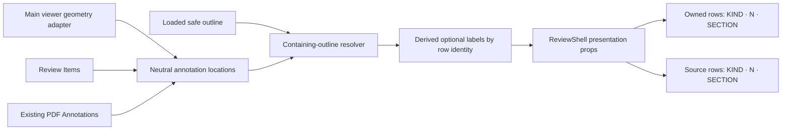

# Annotation Outline Context - Plan

## Goal Capsule

- **Objective:** Make annotation rows easier to scan and group by showing compact page metadata followed by the containing outline subsection.
- **Product authority:** The user's selected Outline Option C establishes the compact visible page treatment. Canonical Review Items and Existing PDF Annotations remain unchanged; subsection text is derived presentation metadata.
- **Open blockers:** None.
- **Execution profile:** Code change with geometry-aware outline resolution, shared row presentation, responsive browser proof, and accessibility verification.
- **Tail ownership:** `ce-work` implements and verifies the units, then returns control to LFG for simplification, review, shipping, and CI follow-through.

---

## Product Contract

### Summary

Render annotation metadata as `KIND · N · SUBSECTION`: use the same compact numeric page treatment as Outline, then place the containing embedded-outline label in a bounded fixed-width slot. Apply the treatment to both reviewer-owned and source-PDF annotation rows without changing their distinct behavior.

### Problem Frame

Annotation rows currently show `Page N` and no document-structure context. The longer page label consumes scarce horizontal space, and reviewers cannot tell which document subsection an annotation belongs to without navigating away from the tray.

### Requirements

**Compact metadata**

- R1. Every Owned Annotation and Existing PDF Annotation row shall show its visible page number as a compact numeric token after a centered dot, with no visible `Page` prefix.
- R2. The page token shall use the same muted, tabular-number treatment as the compact page metadata in Outline.
- R3. When a safe containing outline item can be resolved, the row shall show another centered dot followed by that item's label in a consistent bounded-width slot.
- R4. Long subsection labels shall remain on one line and truncate visually without changing the full accessible label or exposing markup-like outline text as HTML.

**Truthful subsection resolution**

- R5. The subsection shall be the deepest safely orderable outline destination at or before the annotation's document location. Destinations with an authored vertical coordinate shall participate in same-page ordering; coordinate-free destinations shall provide page-level context only under the explicit ambiguity rules in the Planning Contract.
- R6. Outline labels shall be derived display metadata only; they shall not be written into Review Items, review payloads, source-annotation DTOs, handoff data, persistence, or exports.
- R7. Loading, empty, unavailable, stale, targetless, unresolvable, or before-first-destination cases shall keep the page token and omit both the second separator and subsection label rather than guess or show a placeholder.
- R8. If any targeted outline entry makes the containing-section ordering unsafe, the subsection result shall fail closed for that derivation.

**Continuity and accessibility**

- R9. Row accessible names shall continue to say `Page N` and shall include the full subsection label when present, even when the visible label is truncated.
- R10. Adding metadata shall not change annotation ordering, row activation, navigation, correspondence, edit/delete availability, focus handling, tray framing, or the mounted Main Reading Thread.
- R11. The metadata line shall remain cohesive in right-drawer and bottom-sheet presentations, including a 320-pixel viewport, without obscuring annotation actions or forcing the subsection label to wrap.

### Key Flows

- F1. Scan annotations by document structure
  - **Trigger:** A reviewer opens the Annotation Tray after outline discovery succeeds.
  - **Actors:** Reviewer.
  - **Steps:** The tray shows each annotation kind, compact page number, and safely resolved subsection label in aligned inline metadata.
  - **Outcome:** Annotations can be visually grouped by section without navigating the PDF.
  - **Covers:** R1-R6, R9-R11.
- F2. Continue during incomplete outline discovery
  - **Trigger:** Outline data is loading, missing, unsafe, stale, or has no prior target for an annotation.
  - **Actors:** Reviewer.
  - **Steps:** The existing annotation row renders with compact page metadata only.
  - **Outcome:** Annotation work remains available and no false section claim or dangling separator appears.
  - **Covers:** R1-R2, R7-R8, R10.

### Acceptance Examples

- AE1. Owned annotation in a subsection
  - **Given:** An Owned Annotation is on page 3 after the `Nested result` outline destination.
  - **When:** The reviewer opens Annotations.
  - **Then:** Its visible metadata reads `KIND · 3 · Nested result`, its accessible name includes `Page 3 · Nested result`, and its persisted Review Item is unchanged.
  - **Covers:** R1-R6, R9.
- AE2. Source annotation uses the same treatment
  - **Given:** An Existing PDF Annotation has a safely resolved containing outline item.
  - **When:** Its read-only row renders.
  - **Then:** It uses the same numeric page and bounded subsection presentation while retaining source-only behavior.
  - **Covers:** R1-R4, R9-R10.
- AE3. Same-page boundary
  - **Given:** Two outline subsections begin at different vertical positions on one page and annotations occur before, between, and after them.
  - **When:** subsection metadata is derived.
  - **Then:** Each annotation is assigned to the deepest destination at or before its own location, not simply to the last bookmark on that page.
  - **Covers:** R5, R8.
- AE4. No trustworthy match
  - **Given:** Outline discovery is incomplete or no safe containing destination exists.
  - **When:** an annotation row renders.
  - **Then:** it shows `KIND · N` with no placeholder, second separator, or subsection label.
  - **Covers:** R7-R8.
- AE5. Narrow tray with a long label
  - **Given:** A 320-pixel bottom tray contains a delete-only row and a long subsection label.
  - **When:** the row receives focus.
  - **Then:** the label stays in its bounded slot with ellipsis, page and actions remain legible and reachable, and the cohesive row focus treatment is unchanged.
  - **Covers:** R3-R4, R9-R11.

### Scope Boundaries

- Do not reorder, filter, group, or add headings between annotations; the subsection label provides grouping context only.
- Do not persist outline identity or labels into the review schema, source-annotation inventory, handoff, or reviewed PDF.
- Do not invent an `Unsectioned` label or guess from page number when geometry-aware ordering is unavailable.
- Do not change Outline presentation, outline navigation, Reference Tabs, annotation excerpts, or annotation action disclosure.
- Do not make Owned Annotations and Existing PDF Annotations share canonical state; only their metadata presentation is shared.

### Sources / Research

- `CONCEPTS.md` defines Review Items as canonical state, the Annotation Tray as a projection, and Existing PDF Annotations as a separate read-only population.
- `apps/web/src/review/navigation-coordinator.ts` already defines deepest-safe outline containment, including depth and document-order tie breaks.
- `apps/web/src/pdf/viewer-navigation-adapter.ts` owns safe target-to-natural-coordinate conversion and active page crop/rotation context.
- `docs/solutions/architecture-patterns/adaptive-annotation-tray-framing.md` requires the continuously mounted tray/viewer relationship and existing framing ownership to remain stable.

---

## Planning Contract

### Key Technical Decisions

- KTD1. **Share the existing safe traversal policy without reusing synthetic scroll anchors.** Extract the deepest/latest/depth/document-order traversal into a pure result that can return a `PdfOutlineItem`, and retain `resolveCurrentOutlineItemId` as the main-location projection. Annotation containment shall consume authored destination evidence rather than the viewer location that scrolling synthesizes for coordinate-free destinations. This keeps one tie/fail-closed policy without treating a navigation default as document structure. Implements R5, R7-R8.
- KTD2. **Normalize exact and page-level evidence through the viewer adapter.** Add a read-only adapter result that converts canonical annotation geometry and outline targets into a neutral natural, crop-relative order while preserving whether the destination contains an authored vertical coordinate. `XYZ`, horizontal-fit, and rectangle destinations can contribute their authored vertical position; unknown/page-fit/vertical-fit destinations contribute page-level context, not a synthetic center. One page-level item begins at page start; multiple same-page page-level items are orderable only when they form a strict ancestor chain, in which case the deepest applies. Same-page page-level siblings fail closed. An exact-position descendant may supersede its page-level ancestor after the authored coordinate. Production shall not compare raw PDF-space coordinates or synthetic scroll anchors. Implements R5 and R8.
- KTD3. **Derive one presentation map at the production owner.** `ProductionReviewApp` is the sole layer that owns the current document generation, loaded outline, both annotation populations, active page geometry, and main navigation adapter. It shall derive optional labels for both row populations and pass neutral strings to `ReviewShell`; it shall not mutate domain objects. Implements R3-R8 and R10.
- KTD4. **Use one shared metadata renderer.** Owned and source rows shall use the same presentation component or helper for kind, explicit dot separators, compact page token, optional section token, title, and accessible-name composition. This prevents visual or fallback drift between populations. Implements R1-R4, R7, R9-R11.
- KTD5. **Reserve a bounded subsection slot.** *(session-settled: user-directed — chosen over stacked page metadata or replacing the page token during row interaction: the compact inline treatment is robust to resizing and keeps page context stable beside row actions.)* The subsection token shall have a consistent fixed visual measure in normal tray widths, `min-width: 0`, single-line ellipsis, and a narrow-width cap so it yields before page or row actions. Separators are explicit rendered text and appear only with their token. Implements R2-R4, R7, R11.

### High-Level Technical Design

### Assumptions

- “Annotation pills” covers both Owned Annotations and Existing PDF Annotations because both populations share the Annotation Tray row language; their editable/read-only capabilities remain separate.
- The representative point for a rectangular annotation is its natural top-left position, matching current document ordering; insert and page-note items use their stored position.
- Canonical annotation geometry is available for every accepted Review Item kind and every inventoried Existing PDF Annotation. Missing or invalid geometry yields no subsection label.
- Outline metadata may arrive after annotation rows render; derived labels may appear on the next normal React render without a loading placeholder or row remount.
- The fixed subsection measure is a visual alignment slot, not monospace typography. Its full text remains available through the row's accessible name and a concise title on the visible token.

### Implementation Constraints

- Preserve `resolveCurrentOutlineItemId` as a compatible public function for the navigation coordinator and its current tests.
- Keep geometry conversion read-only and neutral; it must not scroll, zoom, capture current view, or expose EmbedPDF objects to row components.
- Validate document generation before combining outline targets and annotation geometry.
- Bind source-annotation inventory to the active source identity before deriving labels; its inventory-local generation alone is not evidence that it belongs to the current outline generation.
- Reuse the already sanitized `PdfOutlineItem.label` and render it as React text.
- Keep `Page N` in accessible labels and action names even though visible metadata shows only `N`.
- Avoid pseudo-element separators whose presence can drift from optional content.
- Memoize derived maps against outline, annotations, and viewer/document readiness so ordinary row renders do not repeatedly traverse and resolve the entire tree.
- Publish viewer-navigation readiness through React-owned state or an equivalent existing update seam so an initially unavailable resolver cannot leave labels absent after the adapter becomes ready.
- Preserve the established row focus ring, minimum height, action columns, hover behavior, and viewer-framing callbacks.

### Sequencing

U1 establishes the neutral location and containing-outline contract. U2 projects that contract into both row types with shared accessible markup. U3 proves real-PDF correctness and responsive visual integrity.

---

## Implementation Units

### U1. Resolve containing outline items from annotation geometry

- **Goal:** Reuse the application's current-outline semantics to determine a trustworthy containing subsection for an arbitrary annotation location.
- **Requirements:** R5-R8; AE3-AE4; KTD1-KTD2.
- **Dependencies:** None.
- **Files:**
  - `apps/web/src/review/navigation-coordinator.ts`
  - `apps/web/src/pdf/viewer-navigation-adapter.ts`
  - `apps/web/test/navigation-coordinator.test.ts`
  - `apps/web/test/viewer-navigation-adapter.test.ts`
- **Approach:**
  1. Generalize the existing traversal so it can return the winning `PdfOutlineItem`; implement `resolveCurrentOutlineItemId` as the compatibility projection of that result.
  2. Add side-effect-free adapter methods/helpers that convert canonical PDF-space annotation geometry and classified outline targets into neutral natural, crop-relative ordering evidence while retaining exact-versus-page-level precision.
  3. Retain page/y/x ordering for exact evidence, deepest-then-later tie breaks, target-null skipping, and generation checks. Apply the explicit page-level ancestor rule, and fail closed on same-page page-level siblings or any targeted item whose required evidence cannot be resolved.
- **Execution note:** Add pure red tests for same-page before/between/after positions and cropped geometry before changing the resolver.
- **Test scenarios:**
  1. An annotation before, between, and after two same-page destinations resolves to the correct prior subsection.
  2. Equal destinations prefer deeper then later document order, matching current main-location behavior.
  3. Cross-page annotations resolve to the latest safe prior target.
  4. One coordinate-free destination supplies page-level context, an exact child supersedes it after the authored position, a page-level ancestor chain chooses the deepest item, and page-level siblings on one page fail closed.
  5. Loading/empty/unavailable, before-first-target, stale generation, invalid annotation geometry, and an unresolvable targeted outline entry return no item.
  6. Crop origins normalize canonical annotation points into the same coordinate space as destinations; rotation does not double-transform canonical evidence.
- **Verification:** Focused navigation and viewer-adapter tests pass with all existing current-outline tests unchanged in meaning.

### U2. Render compact shared metadata for both annotation populations

- **Goal:** Present `KIND · N · SUBSECTION` consistently, accessibly, and without domain-state changes.
- **Requirements:** R1-R4, R6-R11; AE1-AE2, AE4-AE5; KTD3-KTD5.
- **Dependencies:** U1.
- **Files:**
  - `apps/web/src/app/ProductionReviewApp.tsx`
  - `apps/web/src/app/ReviewShell.tsx`
  - `apps/web/src/review/AnnotationList.tsx`
  - `apps/web/src/app/review-layout-annotations.css`
  - `apps/web/src/app/review-layout-responsive.css`
  - `apps/web/test/review-layout.test.tsx`
  - `apps/web/test/production-review-app.test.tsx`
- **Approach:**
  1. At the production owner, derive optional subsection labels for owned and source annotations from the current outline and neutral annotation locations; invalidate naturally with document generation and input changes.
  2. Thread neutral optional labels through `ReviewShell` without modifying `ReviewItem` or `ExistingAnnotation`.
  3. Consolidate the duplicated metadata markup into one renderer/helper used by editable and read-only rows.
  4. Render visible page metadata as an explicit dot plus numeric token, and conditionally render a second dot plus section token.
  5. Preserve `Page N` and the full section in accessible row names; give a truncated visible section token its full-text title.
  6. Add a fixed normal-width slot with responsive shrink protection, ellipsis, no wrapping, and existing type/color tokens.
- **Execution note:** Characterize both row populations in a component test before changing markup; prove the no-match state separately so a dangling second dot cannot pass unnoticed.
- **Test scenarios:**
  1. Owned and source rows both visibly render `· 3 · Nested result` with no visible `Page 3`.
  2. Accessible names retain `Page 3 · Nested result`, and action names retain their existing `on page 3` wording.
  3. Missing labels render page-only metadata with no empty section node or dangling second separator.
  4. A hostile-looking sanitized label remains inert text; a long label exposes the truncation hook and full title.
  5. Review Items, existing-annotation DTOs, and submitted commands contain no outline label or identity.
  6. Navigation, correspondence, edit, delete, focus-return, and read-only behavior remain unchanged.
- **Verification:** Focused shell/component and production-owner tests pass, including both annotation origins and all fallback states.

### U3. Prove responsive geometry and installed-PDF behavior

- **Goal:** Verify subsection correctness and row cohesion in the real viewer across tray presentations and engines.
- **Requirements:** R1-R11; F1-F2; AE1-AE5; KTD5.
- **Dependencies:** U1-U2.
- **Files:**
  - `test/fixtures/pdfs/generate.ts` if the existing fixture cannot express all required positions
  - `test/acceptance/production-flow.spec.ts`
  - `test/acceptance/review-workflow.spec.ts`
  - `test/acceptance/review-harness/visual-scenarios.tsx`
  - `test/acceptance/review-visual.spec.ts`
  - affected visual snapshots, if any
- **Approach:**
  1. Reuse the reference-navigation fixture's existing link annotations where possible, and extend it only if those annotations cannot exercise a cross-page section and distinct same-page subsection positions.
  2. Verify both owned and source rows show the correct derived label after real outline discovery.
  3. At wide right-drawer and 320-pixel bottom-sheet sizes, inspect computed geometry for fixed/bounded width, single-line ellipsis, page visibility, action reachability, and cohesive focus.
  4. Assert row navigation and edit/delete operations still target the same annotation and do not change the Main Reading Thread except through the existing explicit navigation action.
  5. Update only canonical visual scenarios that intentionally exercise annotation metadata.
- **Execution note:** Capture viewer mount/page/scroll/zoom and tray presentation before the metadata interactions; do not accept layout correctness based solely on snapshots.
- **Test scenarios:**
  1. Real annotations before and after a same-page subsection boundary receive different correct labels.
  2. An annotation without a safe containing item shows compact page metadata only.
  3. A long section label ellipsizes in the fixed slot at wide and narrow widths while its title/accessibility expose the full value.
  4. Page number, section slot, edit/delete controls, and row focus remain inside the row at 320 pixels.
  5. Owned and source annotation activation retains established navigation semantics and the main viewer remains continuously mounted.
  6. Chromium and WebKit produce the same metadata and responsive behavior.
- **Verification:** Focused production/review acceptance passes in Chromium and WebKit; deliberate snapshot changes are reviewed for both wide and bottom tray scenes.

---

## Verification Contract

| Gate | Command | Proves |
|---|---|---|
| Resolver contract | `pnpm exec vitest run apps/web/test/navigation-coordinator.test.ts apps/web/test/viewer-navigation-adapter.test.ts` | Safe same-page containment, tie breaks, crop normalization, generation checks, and fail-closed fallback |
| Row contract | `pnpm exec vitest run apps/web/test/review-layout.test.tsx apps/web/test/production-review-app.test.tsx` | Both annotation populations, compact visible metadata, accessible names, no dangling separator, and no state/schema mutation |
| Review regression | `pnpm test:review` | Annotation ordering, actions, focus, correspondence, workspace, and navigation remain coherent |
| Installed browser flow | `pnpm fixtures:pdf` then focused `test/acceptance/production-flow.spec.ts` and `test/acceptance/review-workflow.spec.ts` runs in Chromium and WebKit | Real outline/annotation geometry, wide and narrow layout, truncation, action reachability, and mounted-viewer continuity |
| Visual contract | Focused `test/acceptance/review-visual.spec.ts` run for affected scenes | Intentional metadata hierarchy and spacing remain consistent with the Warm Neutral design language |
| Static quality | `pnpm typecheck` and `pnpm build:web` | Type integrity and production bundle viability |
| Diff hygiene | `git diff --check` | No whitespace or patch-format defects |

Browser verification is required because fixed-width truncation, one-line cohesion, action reachability, crop-aware real-PDF geometry, and mounted-viewer continuity cannot be proven by static markup alone.

---

## Definition of Done

- R1-R11 and AE1-AE5 are satisfied for both Owned Annotations and Existing PDF Annotations.
- Visible page metadata matches Outline's compact `· N` treatment and never displays `Page N`.
- A second explicit dot and bounded subsection label appear only when a safe geometry-aware containing outline item exists.
- Same-page subsection boundaries, exact-versus-page-level destination evidence, nested/equal destinations, crop origins, stale generations, and unsafe targets follow the documented deepest-safe resolver semantics without using synthetic scroll anchors as section boundaries.
- Full `Page N` and subsection wording remain available to assistive technology when the visible label truncates.
- Review Items, source-annotation DTOs, exports, and handoff data contain no derived outline metadata.
- Annotation ordering, activation, navigation, correspondence, edit/delete, read-only separation, focus behavior, tray framing, and mounted-viewer state remain unchanged.
- Wide and 320-pixel tray layouts retain one-line metadata, reachable actions, and cohesive row focus in Chromium and WebKit.
- Focused unit/component/acceptance/visual tests, review regression, typecheck, build, and diff hygiene pass with no deliberate exception.
- Experimental helpers, redundant metadata markup, temporary fixtures, and abandoned implementation paths are removed from the final diff.
