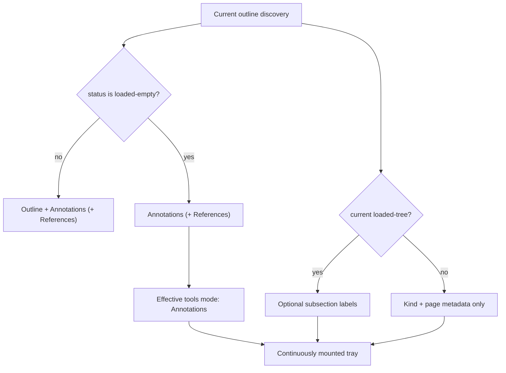

# Outline-Aware Annotation Tray - Plan

## Goal Capsule

- **Objective:** Remove Outline from the workspace when the current PDF definitively has no embedded outline, fall back to Annotations for the tools surface, and simplify the two annotation-section headings into one consistent visual hierarchy.
- **Product authority:** The user's request controls tab availability, subsection-metadata visibility, heading removal, and inline read-only wording.
- **Open blockers:** None.
- **Execution profile:** Code change with workspace-state, accessibility, responsive-layout, and installed-PDF verification.
- **Tail ownership:** `ce-work` implements and verifies the units, then returns control to LFG for simplification, review, browser testing, shipping, and CI follow-through.

---

## Product Contract

### Summary

When outline discovery confirms that a PDF has no embedded outline, remove Outline from the workspace and open the tools surface on Annotations without showing subsection metadata. Simplify the annotation sections to `Annotations` and `Existing PDF annotations (read only)` with matching heading typography and no redundant overlines or read-only pill.

### Problem Frame

An empty Outline tab advertises navigation that the document cannot provide. In the same tray, annotation subsection labels should never imply outline structure when none exists. The current `Review comments` and `Source PDF` overlines add an unnecessary hierarchy, while the owned and source section titles use different typography and a detached read-only badge.

### Requirements

**Outline availability**

- R1. A current-generation `loaded-empty` outline result shall remove Outline from every tools/shared workspace mode selector and omit the Outline panel and empty-state message.
- R2. When the requested tools mode is Outline and the result becomes `loaded-empty`, the effective visible mode shall become Annotations with a valid selected tab, panel labeling, keyboard order, and focus destination.
- R3. Loading and unavailable discovery states shall retain Outline and their existing honest status because neither proves that the PDF lacks an outline.
- R4. A later current-generation `loaded-tree` result shall expose Outline again without remounting the tray or Main Reading Thread.

**Truthful annotation context**

- R5. Owned and Existing PDF Annotation rows shall show subsection metadata only when the current outline is a valid current-generation tree; every other outline state shall omit the subsection token, its separator, and the subsection text in accessible names.
- R6. The presentation boundary shall suppress stale or injected subsection labels when R5 is not satisfied, while preserving the existing production derivation's fail-closed behavior.

**Annotation hierarchy**

- R7. The owned section shall use the single heading `Annotations` with its existing count and no `Review comments` overline.
- R8. The source section shall use the single heading `Existing PDF annotations (read only)` with no `Source PDF` overline or separate read-only pill.
- R9. Both headings shall use the same base type size, weight, spacing, and hierarchy while preserving the editable-owned and read-only-source behavior of their rows.
- R10. Removing the overlines shall not overlap the sticky owned header, correspondence direction cue, annotation rows, or actions in right-drawer or bottom-sheet presentations.

**Continuity**

- R11. The change shall preserve workspace open/close behavior, mode memory, focus restoration, annotation navigation/edit/delete/correspondence, References, viewer mount, reading location, zoom, and responsive dock state.

### Key Flows

- F1. Open an outline-free PDF
  - **Trigger:** Outline discovery settles as `loaded-empty` for the current document.
  - **Actors:** Reviewer.
  - **Steps:** The workspace exposes Annotations but no Outline control or panel; rows show kind and page metadata without subsection context.
  - **Outcome:** The tray offers only working document tools and makes no false structural claim.
  - **Covers:** R1-R2, R5-R6, R11.
- F2. Preserve honest transitional and failure states
  - **Trigger:** Outline discovery is loading or unavailable.
  - **Actors:** Reviewer.
  - **Steps:** Outline remains available with its existing status; annotation subsection metadata stays absent.
  - **Outcome:** A technical discovery failure is not misreported as an outline-free PDF.
  - **Covers:** R3, R5-R6.
- F3. Scan the simplified annotation hierarchy
  - **Trigger:** The reviewer opens Annotations in any tray presentation.
  - **Actors:** Reviewer.
  - **Steps:** The tray shows `Annotations` with its count and `Existing PDF annotations (read only)` in matching typography above their distinct row populations.
  - **Outcome:** Ownership and capability remain clear without redundant secondary labels or a status badge.
  - **Covers:** R7-R10.

### Acceptance Examples

- AE1. Definitive empty outline
  - **Given:** The no-outline installed PDF completes outline discovery with zero bookmarks while Outline is the remembered tools mode.
  - **When:** The reviewer opens the workspace.
  - **Then:** Annotations is selected, no Outline tab/panel/empty message exists, and annotation metadata contains no subsection separator or label.
  - **Covers:** R1-R2, R5-R6, R11.
- AE2. Discovery failure remains visible
  - **Given:** Outline discovery is unavailable.
  - **When:** The reviewer selects Outline.
  - **Then:** The Outline tab and `Outline unavailable` status remain visible, while annotation rows contain no subsection context.
  - **Covers:** R3, R5-R6.
- AE3. Shared workspace without an outline
  - **Given:** References shares the workspace header with tools and the current outline is `loaded-empty`.
  - **When:** The workspace renders in right-docked or narrow-unified form.
  - **Then:** Its modes are Annotations and References; keyboard navigation never targets a missing Outline control.
  - **Covers:** R1-R2, R11.
- AE4. Simplified headings
  - **Given:** Owned and existing annotations are loading, empty, errored, or ready.
  - **When:** Annotations renders.
  - **Then:** The visible headings are `Annotations` and `Existing PDF annotations (read only)` with matching typography, and none of `Review comments`, `Source PDF`, or a separate read-only pill is present.
  - **Covers:** R7-R10.
- AE5. Document and layout continuity
  - **Given:** The main viewer has a non-default location and zoom and the workspace is resized or changes dock presentation.
  - **When:** outline availability changes the exposed modes.
  - **Then:** the same viewer remains mounted at the same reading state, focus lands on a valid workspace target, and a later outline-rich document exposes Outline again.
  - **Covers:** R4, R10-R11.

### Scope Boundaries

- Do not hide Outline during loading or when discovery is unavailable; only `loaded-empty` proves absence.
- Do not replace absent subsection labels with `Unsectioned`, page-based guesses, placeholders, or dangling separators.
- Do not merge Owned Annotations with Existing PDF Annotations or change their canonical state, persistence, export, editing, navigation, or correspondence capabilities.
- Do not remove the owned annotation count.
- Do not change outline navigation, Reference Tabs, annotation ordering, excerpts, or action disclosure.

### Sources / Research

- `CONCEPTS.md` defines the Annotation Tray as a projection of separate Owned Annotation and Existing PDF Annotation populations.
- `apps/web/src/pdf/pdf-outline.ts` defines `loaded-empty` as successful zero-bookmark discovery and `unavailable` as a distinct failure state.
- `apps/web/src/review/annotation-outline-context.ts` already derives empty label maps unless the outline is a current-generation `loaded-tree`.
- `docs/solutions/architecture-patterns/adaptive-annotation-tray-framing.md` requires changes inside the continuously mounted tray to preserve viewer location, zoom, and responsive framing ownership.

---

## Planning Contract

### Key Technical Decisions

- KTD1. **Use one definitive-absence predicate across every workspace owner.** `loaded-empty` removes Outline from the tools-only and shared mode lists and coerces a requested Outline view to an effective Annotations view. Loading and unavailable states keep Outline. This predicate governs R1-R4.
- KTD2. **Coerce presentation without rewriting remembered navigation state.** Preserve the existing logical per-mode memory and derive the effective available mode at the shell/workspace boundary. DOM focus memory shall discard disconnected elements. If the selected Outline control disappears while open, focus shall move to the connected remembered annotation element or fall back to the annotation panel; when Outline returns, a disconnected remembered element shall fall back to the restored Outline panel. This avoids synthetic navigation actions and permits Outline to return cleanly. Implements R2, R4, and R11.
- KTD3. **Gate subsection context twice.** Retain the production derivation's current-generation `loaded-tree` guard and also withhold supplied label maps at `ReviewShell` unless that same presentation condition holds. This makes the final UI fail closed even under stale or test-harness input. Implements R5-R6.
- KTD4. **Use one heading style with capability expressed in copy.** *(session-settled: user-directed — chosen over eyebrow labels, mismatched title typography, and a separate read-only pill: a single consistent hierarchy is clearer and less visually busy.)* Keep `Annotations` plus its count and render `Existing PDF annotations (read only)` as inline heading text using the same base typography. Implements R7-R10.

### High-Level Technical Design

### Assumptions

- `loaded-empty` is the user's “no outline available in the PDF” case. `unavailable` remains a surfaced discovery failure rather than being silently collapsed.
- `Annotations` remains the owned-section title because the user named that heading as the comparison point; only its redundant `Review comments` overline is removed.
- The existing annotation count remains useful quantity metadata and is not equivalent to the redundant read-only status pill.
- Matching typography means both section titles share the same base heading rule; the parenthetical may use inherited heading typography rather than a separate badge treatment.

### Implementation Constraints

- Compute the outline availability before deriving effective layout/mode values so all right, bottom, and narrow surfaces receive the same mode set.
- Keep `aria-selected`, `aria-controls`, `aria-labelledby`, roving `tabIndex`, keyboard traversal, aside labels, hidden/inert panels, and focus targets consistent with the rendered modes.
- Treat `loaded-empty` as definitive absence only when its `documentGeneration` matches the active navigation generation.
- Do not leave an Outline panel labelled by a removed tab or an `Outline and annotations` accessible name on an annotation-only tools surface.
- Preserve References as the active surface if it is selected when outline discovery settles empty; only the tools fallback changes to Annotations.
- Gate both visible section tokens and accessible subsection text at the shell boundary.
- Remove obsolete eyebrow and pill selectors; share the heading rule rather than maintaining two equivalent declarations.
- Recalculate the sticky owned-header height and the above-direction-cue offset together so the simplified header does not overlap content.
- Preserve visual and behavioral read-only treatment on source annotation rows after removing the status pill.

### Sequencing

U1 establishes dynamic workspace availability and truthful metadata projection. U2 simplifies the section hierarchy and proves the combined behavior in responsive and installed-PDF flows.

---

## Implementation Units

### U1. Collapse outline-free workspaces to Annotations

- **Goal:** Make confirmed outline absence remove Outline everywhere while preserving valid mode, focus, and metadata behavior.
- **Requirements:** R1-R6, R11; AE1-AE3, AE5; KTD1-KTD3.
- **Dependencies:** None.
- **Files:**
  - `apps/web/src/app/ReviewShell.tsx`
  - `apps/web/src/review/OutlineAnnotationsWorkspace.tsx`
  - `apps/web/test/reference-workspace.test.tsx`
  - `apps/web/test/review-layout.test.tsx`
  - `apps/web/test/production-review-app.test.tsx`
- **Approach:**
  1. Define a single current-outline availability decision and derive tools-only and shared workspace mode lists from it.
  2. Use Annotations as the effective tools mode when `loaded-empty` would otherwise expose Outline; conditionally omit the Outline tab and panel.
  3. Drive roving keyboard focus and accessible relationships from the dynamic mode list. Discard disconnected DOM focus memories; when the selected Outline surface disappears, focus the connected remembered annotation element first and fall back to the annotation panel.
  4. Suppress owned/source subsection label maps at the shell boundary unless the outline is a current-generation tree.
  5. Keep loading/unavailable/tree behavior and References selection unchanged.
- **Execution note:** First change the component contracts to assert an intentionally invalid `mode="outline"` plus `loaded-empty` input resolves to a valid annotation-only DOM.
- **Test scenarios:**
  1. `loaded-empty` exposes only a selected Annotations tab in the tools workspace and omits the Outline panel and empty message.
  2. A shared workspace exposes Annotations and References but not Outline; arrow-key traversal uses only those rendered controls.
  3. Loading and unavailable retain Outline and its status; loaded-tree retains all current outline controls.
  4. Active References remains active when discovery settles empty, while a requested Outline tools view effectively falls back to Annotations.
  5. Focus moves from a removed Outline control/panel into connected remembered annotation content, or into the annotation panel when no remembered element remains available.
  6. Deliberately injected label maps are ignored for non-tree discovery in visible and accessible metadata; valid-tree labels still render.
  7. A stale `loaded-empty` result from generation N does not hide Outline for active generation N+1, and subsection metadata remains suppressed until current evidence arrives.
  8. A loaded-tree to loaded-empty to loaded-tree transition restores Outline without remounting the workspace or viewer and falls back from disconnected Outline focus memory to the restored panel.
- **Verification:** Focused workspace, shell, and production-owner tests pass; React output contains no orphaned tab/panel relationships.

### U2. Unify annotation-section headings and responsive geometry

- **Goal:** Remove redundant labels and present owned and source annotation sections with consistent, clear headings.
- **Requirements:** R7-R11; AE4-AE5; KTD4.
- **Dependencies:** U1.
- **Files:**
  - `apps/web/src/review/AnnotationList.tsx`
  - `apps/web/src/app/ReviewShell.tsx`
  - `apps/web/src/app/review-layout-annotations.css`
  - `apps/web/src/app/review-layout-responsive.css`
  - `apps/web/test/review-layout.test.tsx`
  - `test/acceptance/production-flow.spec.ts`
  - `test/acceptance/review-visual.spec.ts`
  - `test/acceptance/review-harness/visual-scenarios.tsx`
- **Approach:**
  1. Remove the owned/source overline elements and render the final titles directly in each section heading.
  2. Remove the separate read-only pill and obsolete CSS while preserving source-row read-only semantics and styling.
  3. Consolidate both heading rules, keep the owned count, and tighten the sticky header's single-line geometry.
  4. Couple the above-direction-cue offset to the new header height so correspondence cues remain clear.
  5. Update the real no-outline installed-PDF flow and responsive visual scenarios to exercise the combined tab, metadata, and heading behavior.
- **Execution note:** Characterize the exact heading DOM and removed strings before changing markup, then inspect wide and narrow scenes before accepting snapshot updates.
- **Test scenarios:**
  1. Owned rows are headed by `Annotations` plus the count with no `Review comments` text.
  2. Every source inventory state uses `Existing PDF annotations (read only)` with no `Source PDF` text or separate pill.
  3. Both h2 elements resolve to the same base font size, weight, line height, and tracking.
  4. Ready source rows remain read-only and expose no edit/delete controls.
  5. The above-direction cue sits below the simplified sticky header in wide-right and 320-pixel bottom-sheet layouts.
  6. The installed no-outline PDF opens directly on Annotations, shows page-only metadata, closes back to the rail focus, and retains the main viewer mount/location/zoom.
  7. Outline-rich PDFs retain subsection metadata and all existing Outline navigation.
- **Verification:** Focused shell tests, installed Chromium/WebKit acceptance, and intentional visual snapshot review pass without viewer-framing regressions.

---

## Verification Contract

| Gate | Command | Covers | Done signal |
|---|---|---|---|
| Workspace and shell behavior | `pnpm exec vitest run apps/web/test/reference-workspace.test.tsx apps/web/test/review-layout.test.tsx apps/web/test/production-review-app.test.tsx` | U1-U2 | Dynamic modes, metadata gating, heading copy, and source capabilities pass. |
| Static correctness | `pnpm typecheck` | U1-U2 | TypeScript reports no errors. |
| Production build | `pnpm build:web` | U1-U2 | The production web bundle builds successfully. |
| Installed Chromium flow | `pnpm exec playwright test test/acceptance/production-flow.spec.ts` | U1-U2 | Real outline-empty and outline-rich PDFs satisfy mode, focus, metadata, heading, and viewer-continuity assertions. |
| Installed WebKit flow | `pnpm exec playwright test --config playwright.webkit.config.ts test/acceptance/production-flow.spec.ts` | U1-U2 | The same flows pass in WebKit. |
| Review regression suite | `pnpm test:review` | U1-U2 | Existing annotation, workspace, and framing behaviors remain green. |
| Visual review | `pnpm test:visual` | U2 | Wide/narrow annotation tray changes are inspected and only intended snapshots change. |
| Diff hygiene | `git diff --check` | U1-U2 | No whitespace errors or accidental generated debris remain. |

Browser acceptance is required because the work changes responsive workspace composition, focus handoff, sticky geometry, and continuously mounted viewer framing. Visual snapshots must be reviewed rather than updated blindly.

---

## Definition of Done

- Every R-ID is covered by passing automated evidence or explicit browser inspection from the Verification Contract.
- `loaded-empty` workspaces expose Annotations without any Outline tab, panel, empty-state message, stale subsection content, or invalid accessibility relationship.
- Loading and unavailable discovery remain distinguishable from a truly outline-free PDF.
- The annotation section headings use the approved copy and one typographic hierarchy with no removed overlines or status pill.
- Owned annotations remain editable, Existing PDF Annotations remain read-only, and neither population's canonical data changes.
- Wide, bottom, shared, and narrow layouts preserve focus, row actions, correspondence cues, viewer mount, reading location, zoom, and dock state.
- No abandoned implementation, duplicate selector, stale snapshot, or temporary test fixture remains in the diff.
