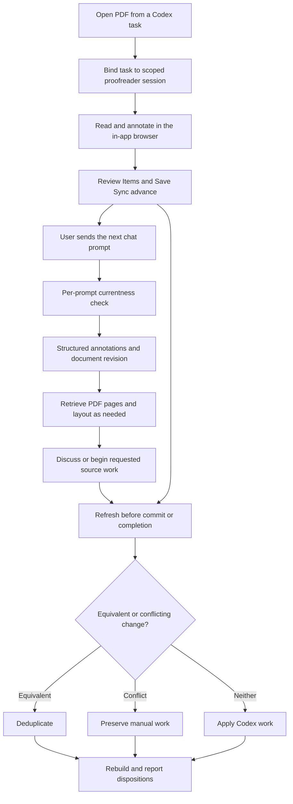
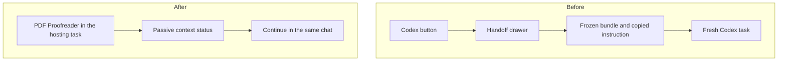
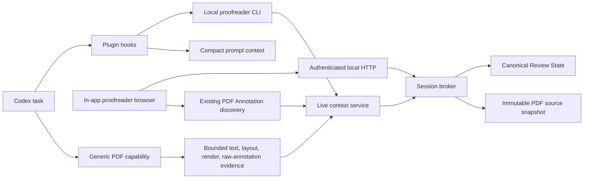
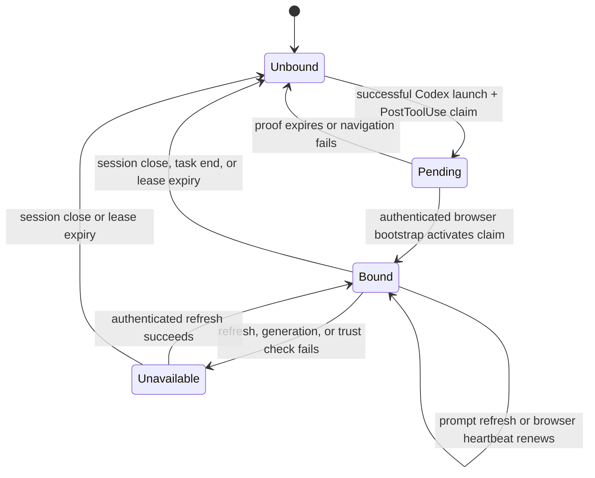
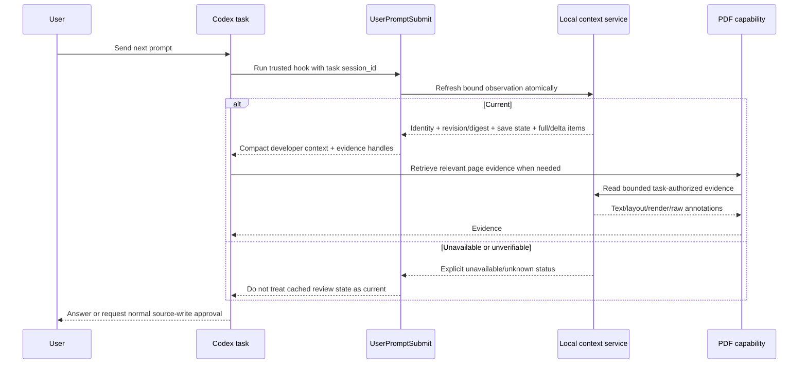
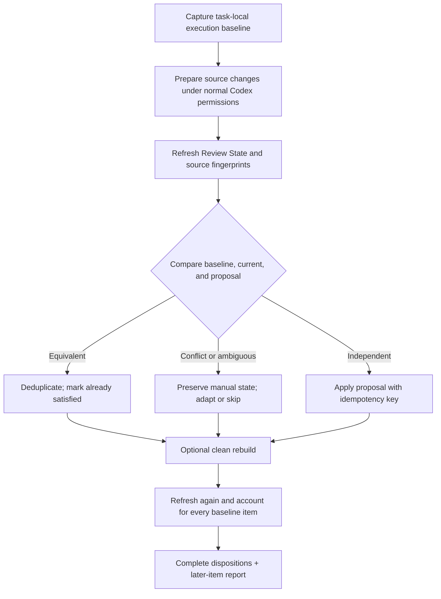
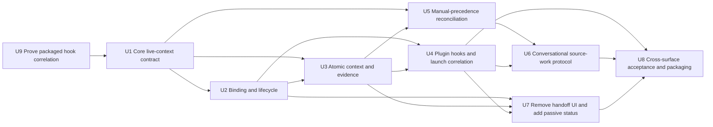

# Live PDF Context for Codex - Plan

## Goal Capsule

- **Objective:** Make the Codex task hosting PDF Proofreader automatically aware of the current PDF, every annotation, and subsequent annotation changes so the user can discuss and act on them without a handoff action.
- **Product authority:** This plan supersedes the user-visible Codex handoff requirements in `docs/plans/2026-08-06-001-feat-local-pdf-proofreader-plan.md`, `docs/plans/2026-08-07-002-feat-reading-first-pdf-review-interface-plan.md`, and `docs/plans/2026-08-11-001-feat-saveless-pdf-annotation-persistence-plan.md`. Their local-file safeguards, portable annotation rules, stable identity, clean rebuild, and complete disposition guarantees remain authoritative unless this plan changes their presentation or synchronization behavior.
- **Open blockers:** None. The implementation must first prove the packaged hook-to-launch correlation in an integration fixture; if that supported hook contract is absent at runtime, the feature must report `unavailable` rather than fall back to global discovery.
- **Execution profile:** Cross-package feature spanning the core model, local service, Codex plugin, web interface, macOS packaging, and browser acceptance coverage. Work in dependency order from the protocol outward.
- **Tail ownership:** The implementation run owns simplification, review remediation, browser verification, the commit, the pull request, and CI stabilization.

---

## Product Contract

### Summary

The existing PDF Proofreader plugin will give the Codex task hosting its in-app browser a fresh, lossless view of the complete PDF and structured annotation state on every user prompt.
Chat will replace the Codex button, frozen handoff bundle, and fresh-task workflow for discussion, source edits, rebuilds, and disposition reporting.

### Problem Frame

Today the plugin can open a local PDF in Codex's in-app browser, but its responsibility ends after launch.
Codex receives no durable association with the live review session and has no automatic reason to check whether the PDF or its annotations changed before answering another question.

Pointing Codex at the raw PDF is not an adequate substitute.
The generic PDF capability can render pages and extract content, but the current workflow does not guarantee semantic interpretation of app-authored Review Items or refresh them after each accepted change.

The existing Codex button solves a different problem by freezing a reviewed PDF and machine-readable handoff, copying an instruction, and directing the user to a fresh task.
That explicit delivery step is redundant when the current task already hosts the live PDF and should own the full conversation and execution loop.

### Actors

- A1. **Reader and annotator:** Reads the PDF, adds or edits annotations, asks questions, and may ask Codex to apply the feedback to source.
- A2. **Bound Codex task:** Hosts the PDF Proofreader browser, refreshes live document context before each response, and performs requested source work under normal Codex permissions.
- A3. **PDF Proofreader:** Owns canonical Review Items, portable PDF persistence, save health, and the task-scoped context made available to Codex.
- A4. **PDF capability:** Supplies lossless page text, layout, rendering, and raw PDF annotation inspection when the conversation needs document evidence beyond the structured review state.

### Key Decisions

- **Bind awareness to the task hosting the PDF.** (session-settled: user-directed — chosen over a frozen handoff and global active-document discovery because each prompt should use the current PDF without cross-task ambiguity.) Governs R1-R3, R23-R25.
- **Extend the existing plugin with a per-prompt hook and structured live context provider.** (session-settled: user-directed — chosen over skill-only refresh and full-document prompt injection because freshness must be reliable without flooding every turn.) Governs R3-R11 and R24-R25.
- **Build on the PDF capability while keeping Review Items authoritative.** (session-settled: user-directed — chosen over raw-PDF-only interpretation because document rendering and app-authored annotation semantics require different authorities.) Governs R5-R11.
- **Replace the explicit handoff with the live conversation.** (session-settled: user-directed — chosen over retaining a separate source-edit authorization flow because the bound task should own discussion, execution, rebuild, and disposition.) Governs R12-R14 and R19-R23.
- **Preserve manual work over Codex work.** (session-settled: user-directed — chosen over last-writer-wins behavior because equivalent changes should deduplicate and genuine conflicts should never overwrite a person's edit or annotation.) Governs R15-R18.
- **Remove the Codex action on every host surface.** (session-settled: user-approved — chosen over retaining a reverse launch path after the loss of that path outside Codex was surfaced.) Governs R20-R23.

### Requirements

**Task binding and freshness**

- R1. Opening a PDF through the PDF Proofreader plugin in Codex shall bind that proofreader session to the Codex task hosting its in-app browser without another user action.
- R2. A bound proofreader session shall be available automatically only to its hosting Codex task and shall never become a globally discoverable active document.
- R3. Every user prompt in a bound task shall trigger a currentness check against the live proofreader session before Codex answers or acts on PDF-related context.
- R4. The currentness check shall expose the PDF identity, canonical review revision, save health, and annotation additions, edits, or removals since the task's previous observation.
- R5. Codex shall receive the latest accepted Review Items even when PDF persistence is still saving or has failed, together with the current Save Sync state.
- R6. An unchanged revision may reuse previously read content only after R3 confirms that the live document and annotation state are still current.
- R7. A failed or unverifiable refresh shall make Codex disclose that currentness is unknown and shall prevent it from presenting cached review state as current.

**Complete PDF and annotation knowledge**

- R8. The bound task shall have lossless on-demand access to every PDF page's text, layout, rendering, and standards-visible annotations rather than relying on one lossy text extraction.
- R9. Each app-authored annotation shall expose its stable identity, semantic type, page, geometry, payload, anchor, nearby document context, and available source hint.
- R10. Existing PDF Annotations shall remain a distinct read-only population with their origin, subtype, location, contents, and other available PDF metadata preserved for Codex.
- R11. Review Items shall remain the semantic authority for app-authored annotations, while the PDF capability supplies page evidence and raw PDF structure without guessing existing marks into Review Items.

**Conversational source work and reconciliation**

- R12. The user shall be able to discuss the PDF, ask about annotations, request source edits, request a clean rebuild, and receive a complete disposition report in the same bound task.
- R13. A source-edit request in chat shall replace the app-specific prepare, confirm, copy-instruction, fresh-task, and result-selection workflow.
- R14. Source work shall capture the current review revision and document digest as an internal execution baseline without creating a user-visible handoff bundle.
- R15. Before Codex commits source changes or reports completion, it shall refresh the live review state and reconcile any manual edits or annotations created after the baseline.
- R16. Semantically equivalent manual and Codex changes shall collapse into one result without duplicate source edits, Review Items, or disposition entries.
- R17. A genuine conflict shall preserve the manual source edit or annotation, and Codex shall adapt or skip its conflicting change and explain the disposition.
- R18. The disposition report shall account for every annotation in the execution baseline and shall identify later annotations that were preserved but not processed by that run.
- R19. A requested clean rebuild shall remain distinct from the annotation-bearing PDF and shall retain the existing source-safety and observable-result guarantees.

**Interface and lifecycle**

- R20. The interface shall remove the Codex button, Codex drawer, frozen-handoff preparation, copied-instruction state, and fresh-task guidance from every host surface.
- R21. The Codex-hosted view shall replace the action with a passive context status that stays visually and assistively quiet when current, announces one polite atomic update when refreshing or unavailable, and tells the user to ask Codex to reopen the PDF when fresh context cannot be restored.
- R22. Finder, VS Code, and ordinary-browser sessions shall expose no reverse launch into Codex and shall gain no ambient Codex binding from this feature.
- R23. Closing the proofreader session or ending its hosting task shall end the automatic binding without affecting the saved PDF or Protected Recovery.

**Privacy and permissions**

- R24. PDF and annotation context shall remain local to the bound task and service, with no upload, remote request, port forwarding, or disclosure of the scoped capability URL.
- R25. Removing the app-specific handoff confirmation shall not bypass Codex sandboxing, filesystem permissions, approval requirements, or the user's need to request source-changing work in chat.

The context flow is task-scoped and prompt-driven:

The interface loses an action surface rather than replacing it with another workflow:

### Key Flows

- F1. Bind a PDF to its hosting task
  - **Trigger:** A1 asks Codex to open one local PDF in PDF Proofreader.
  - **Actors:** A1, A2, A3
  - **Steps:** The existing plugin launches or focuses the scoped session, the in-app browser hosts it, and the task gains live context without a second control.
  - **Outcome:** The task can refresh the current document and review state on later prompts.
  - **Covered by:** R1-R4, R23-R25
- F2. Ask about newly added annotations
  - **Trigger:** A1 adds or changes annotations and then asks another question in the same task.
  - **Actors:** A1, A2, A3, A4
  - **Steps:** The prompt refresh checks the current revision, receives the structured changes, and retrieves the relevant PDF evidence.
  - **Outcome:** The answer reflects the latest accepted annotations without a button click or pasted instruction.
  - **Covered by:** R3-R11
- F3. Apply annotations while manual work continues
  - **Trigger:** A1 asks A2 to apply review feedback to source and continues editing the source or annotations.
  - **Actors:** A1, A2, A3
  - **Steps:** A2 captures a baseline, performs requested work, refreshes current state, deduplicates equivalents, preserves conflicts in A1's favor, and rebuilds when requested.
  - **Outcome:** The result accounts for the targeted feedback without overwriting later manual work.
  - **Covered by:** R12-R19, R25
- F4. Continue safely when live context is unavailable
  - **Trigger:** The proofreader session closes, its capability expires, or the context refresh fails.
  - **Actors:** A1, A2, A3
  - **Steps:** A2 treats currentness as unknown, the browser surfaces the unavailable state, and no stale review state is presented as live.
  - **Outcome:** A1 can restore or reopen the session without hidden context drift.
  - **Covered by:** R7, R21, R23-R25

### Acceptance Examples

- AE1. New annotation appears on the next prompt
  - **Covers R3-R6, R9.**
  - **Given:** The bound task last observed review revision 12.
  - **When:** A1 adds a Replace annotation and asks a new question after the review advances to revision 13.
  - **Then:** A2 refreshes before answering and knows the new annotation's type, page, geometry, text, proposed replacement, nearby context, and source hint when available.
- AE2. A long PDF remains fully available without full prompt injection
  - **Covers R6, R8, R11.**
  - **Given:** The PDF is too large to place every page into each prompt.
  - **When:** A1 asks a question that depends on distant pages and visual layout.
  - **Then:** A2 verifies the current revision and retrieves the necessary text and rendered page evidence without treating omitted pages as unavailable.
- AE3. Accepted work remains visible during a save failure
  - **Covers R4, R5, R7.**
  - **Given:** A1 accepted an annotation that Protected Recovery holds while Save Sync reports Not saved.
  - **When:** A1 asks about the current annotations.
  - **Then:** A2 includes the accepted Review Item, identifies the Not saved condition, and does not misstate the disk PDF as current.
- AE4. Existing comments and highlights retain their origin
  - **Covers R8-R11.**
  - **Given:** The PDF contains app-authored Review Items and foreign comments or highlights.
  - **When:** A1 asks Codex to summarize all feedback.
  - **Then:** A2 can discuss both populations while preserving which items are editable Review Items and which are read-only Existing PDF Annotations.
- AE5. Duplicate manual and Codex edits collapse
  - **Covers R14-R16, R18.**
  - **Given:** A2 begins applying a Replace annotation and A1 independently makes the same source change.
  - **When:** A2 refreshes before completion.
  - **Then:** The source contains one change and the disposition reports the annotation as already satisfied or equivalently deduplicated.
- AE6. A manual conflict wins
  - **Covers R15, R17, R18.**
  - **Given:** A2 proposes one source change while A1 makes a different manual edit or annotation at the same semantic target.
  - **When:** A2 reconciles the live state.
  - **Then:** A1's work remains authoritative, A2 does not overwrite it, and the disposition explains the adaptation or non-application.
- AE7. No Codex context is presented as current after disconnect
  - **Covers R7, R21, R23.**
  - **Given:** A1 closes the proofreader session before asking another PDF question.
  - **When:** The next prompt attempts to refresh the session.
  - **Then:** A2 states that live context is unavailable and does not answer from an unverified cached revision as though it were current.
- AE8. Non-Codex hosts have no handoff button
  - **Covers R20, R22.**
  - **Given:** A1 opens PDF Proofreader from Finder, VS Code, or an ordinary browser.
  - **When:** The review interface loads.
  - **Then:** No Codex action or handoff drawer appears, and the session does not claim an ambient Codex binding.

### Scope Boundaries

- No global catalog or discovery of active PDFs across unrelated tasks; R2 owns task isolation.
- No unsolicited Codex turn when an annotation changes; R3 refreshes at the next user prompt.
- No reverse launch from Finder, VS Code, or ordinary browsers; R22 owns non-Codex host behavior.
- No replacement or fork of the generic PDF capability; R8 and R11 define how the existing capability participates.
- No remote document service or upload path; R24 owns the local-only boundary.

### Dependencies and Assumptions

- Codex continues to support trusted plugin-bundled `PostToolUse`, `UserPromptSubmit`, and `SessionEnd` hooks. Hook-unavailable and hook-untrusted states are explicit degraded states.
- A successful `pdf-proofreader open --surface codex --json` tool result is visible to `PostToolUse` with the hosting Codex `session_id`. U9 verifies this packaging contract before any dependent implementation begins.
- The installed PDF capability remains available for text extraction, page rendering, visual inspection, and raw PDF annotation inspection.
- Review Items, Save Sync, Portable Annotation Identity, and Protected Recovery retain their meanings from `CONCEPTS.md`.
- Existing source containment and ordinary Codex permissions remain the authority for source-changing work.
- One proofreader session has one bound Codex task lease. Reopening it in the same task renews the lease; another task must use `--fork` or wait until the lease ends.

### Outstanding Questions

No launch-blocking questions remain. U4 must verify the documented hook event shapes in the packaged application before automatic binding is considered complete.

### Sources and Research

- `integrations/codex-plugin/.codex-plugin/plugin.json` confirms that the existing plugin currently packages a launch skill without an MCP server or hooks.
- `integrations/codex-plugin/skills/pdf-proofreader/SKILL.md` defines the current scoped browser launch and explicit-handoff boundary.
- `apps/web/src/review/ReviewChrome.tsx`, `apps/web/src/app/CodexDrawer.tsx`, and `apps/web/src/export/CodexDelivery.tsx` define the button, frozen bundle, copied instruction, and fresh-task workflow replaced here.
- `packages/core/src/review-model.ts`, `packages/core/src/annotation-projection.ts`, and `apps/service/src/saving/pdf-save-coordinator.ts` establish Review Items and automatic PDF persistence as the existing annotation authorities.
- `apps/service/src/handoff/handoff-export.ts`, `apps/service/src/handoff/result-check.ts`, and `packages/core/src/handoff.ts` contain the frozen revision, digest, stable-ID, and result-integrity guarantees retained internally.
- [OpenAI plugin architecture](https://developers.openai.com/plugins/concepts/plugins) documents plugins that combine skills with MCP servers and structured model-readable results.
- [Codex hooks](https://learn.chatgpt.com/docs/hooks) documents plugin-bundled lifecycle hooks, common `session_id` input, `PostToolUse` tool results, `UserPromptSubmit` additional context, trust requirements, output-size behavior, and advisory `SessionEnd` timing.
- `docs/solutions/architecture-patterns/recoverable-editable-pdf-annotation-autosave.md` establishes the canonical freshness tuple and separation between Review State, recovery, and PDF durability.
- `docs/solutions/design-patterns/outline-aware-annotation-workspace-presentation.md` establishes generation gating for document-dependent data.
- `docs/solutions/test-failures/wait-for-committed-wheel-zoom-before-pointer-selection.md` and `docs/solutions/test-failures/webkit-recoverable-reference-flow-acceptance-test.md` establish semantic-state synchronization and recoverable convergence for browser tests.

---

## Planning Contract

Product Contract preservation: unchanged. The implementation decisions below realize the settled requirements without adding a new product surface.

### Key Technical Decisions

- **KTD1. Establish binding through a two-stage, task-correlated claim.** The Codex-surface launcher returns a one-time bind proof separate from the browser capability. `PostToolUse` claims that proof for its Codex `session_id`, creating a pending binding. The authenticated browser bootstrap activates the pending binding after navigation succeeds. This avoids a global recent-session heuristic and avoids claiming a browser that never loaded. A claim from another task is denied. Governs R1-R3, R23-R25 and F1.
- **KTD2. Keep the context provider local and use plugin hooks plus the existing CLI/service boundary.** The plugin gains hooks and context instructions, while the service remains the authority. A new public MCP server would add transport, authentication, and deployment surface without improving local task correlation. A successful prompt refresh mints a short-lived, read-only, generation-bound evidence handle. The local CLI validates that handle and materializes bounded text, layout, render, or raw-annotation evidence for the generic PDF capability. Governs R3-R11, R24-R25.
- **KTD3. Refresh one atomic observation snapshot per prompt.** The service projects document generation, source digest, canonical review revision and semantic digest, Save Sync, Review Item changes, and existing-annotation inventory from one serialized read. First observation returns a full item set. Later observations return additions, edits, and removals against a task-owned cursor. A failed refresh does not advance that cursor. This follows the repository's complete-state and digest fencing patterns rather than revision-only freshness. Governs R3-R7 and AE1-AE3.
- **KTD4. Separate semantic review state from PDF evidence.** Review Items retain stable IDs, kinds, anchors, geometry, payloads, nearby context, and source hints. Existing PDF Annotations remain a separate read-only inventory. Page text, layout, rendering, and raw annotation inspection are bounded retrieval operations over the immutable source snapshot. The prompt hook emits a compact envelope and retrieval instructions, never the full PDF. Governs R8-R11 and AE2-AE4.
- **KTD5. Use leases and generation gates for lifecycle isolation.** Pending proofs expire quickly. Active bindings renew on successful prompt refresh and browser heartbeat. Session close, task end, document generation change, or lease expiry revokes the binding and its observation cursor. `SessionEnd` is best-effort because the documented event is advisory. A stale or unavailable binding can never emit cached state as current. Governs R2-R7, R21-R24 and F4.
- **KTD6. Replace frozen delivery with a task-local execution record.** Source work captures a baseline of document identity, review snapshot, item semantics, and scoped source fingerprints. Before apply, commit, rebuild, or completion, the task refreshes and reconciles the record. Reusable containment, digest, source snapshot, result-integrity, and disposition logic moves out of the handoff-specific service rather than being discarded. Governs R12-R19, R25 and F3.
- **KTD7. Define manual precedence as a conservative three-way comparison.** Reconciliation compares baseline, current human-visible state, and the Codex proposal. Equivalent work is recognized by stable item identity plus normalized semantic target and result. Divergent work at the same target is a conflict and preserves current manual state. Ambiguous matches also preserve manual state and require an explanatory skipped or adapted disposition. Later Review Items are reported separately and are not silently absorbed into the run. Governs R15-R18 and AE5-AE6.
- **KTD8. Remove the handoff surface end to end and show status only where truthful.** The web app receives the trusted launch surface and binding status from session scope. Only a Codex-hosted session may show a passive `current`, `refreshing`, or `unavailable` indicator. Finder, VS Code, and browser hosts show neither a Codex action nor an ambient binding indicator. Backend delivery routes, handoff UI, copied instructions, fresh-task harnesses, and obsolete tests are removed or replaced. Governs R20-R23 and AE7-AE8.

### High-Level Technical Design

These diagrams define boundaries and ordering, not exact APIs.

### Protocol and State Contract

- A bind proof is one-time, short-lived, scoped to one proofreader session, and never authorizes document or mutation access. The browser capability remains separate and is never placed in prompt context or logs.
- An evidence handle is distinct from the bind proof and browser capability. It is local-only, read-only, byte bounded, tied to the active task lease plus observation generation, and expires quickly. The CLI rejects a wrong-task, expired, revoked, or stale-generation handle before it materializes evidence.
- A pending binding contains the proofreader session identity, Codex task identity, document generation, creation time, and expiry. Activation requires the same proofreader session and generation observed during authenticated browser bootstrap.
- A current observation is identified by `(proofreaderSessionId, documentGeneration, reviewRevision, stateDigest)`. Its envelope also carries source digest, Save Sync, existing-annotation digest, cursor, and item/evidence counts.
- Observation commits use compare-and-set semantics on the task cursor. Concurrent or stale refreshes may return a snapshot, but only the newest valid observation advances the cursor.
- Delta records contain added, edited, and removed Review Item identities plus the complete structured records required to interpret additions and edits. Unknown or expired cursors receive a full snapshot.
- Evidence retrieval is task-authorized, page/range bounded, byte capped, paginated where needed, and generation gated. Rendered pages are returned as image/file resources rather than base64 prompt text.
- Provider errors are typed as `unbound`, `pending`, `unavailable`, `stale_generation`, `expired`, or `unauthorized`. Only a verified `current` result may assert freshness.

### Implementation Constraints

- `SessionBroker` remains the canonical in-memory authority. The web viewer is not scraped for Review Items or currentness.
- Existing PDF Annotations remain a separate population. Import and portable identity checks must not convert them into Review Items.
- PDF durability and Save Sync remain independent from accepted Review State. A save failure appears in context but does not hide accepted items.
- Hook output must stay below the documented normal context budget in the common case. Large initial state uses a compact summary plus bounded retrieval; it must not spill an uncontrolled full document to temporary prompt context.
- Hook input, tool output, bind proofs, capability URLs, document bytes, and local source paths must not be logged.
- All source writes continue through Codex's normal tools, sandbox, and approval posture. The provider offers read, baseline, proposal/reconciliation, rebuild coordination, and disposition operations; it is not a generic filesystem bypass.
- Document-dependent work uses the current generation. Stale extraction, annotation inventory, render, or source-hint results normalize to unavailable/loading rather than empty.

### Sequencing

### System-Wide Impact

- **Core model:** Adds task-context, observation, delta, evidence, execution-baseline, reconciliation, and disposition contracts while preserving Review Item and portable annotation identities.
- **Local service:** Adds a task-binding registry, atomic live-context projection, bounded evidence access, and task-local execution records. Session close and document generation changes revoke derived state.
- **CLI and plugin:** Adds hook-event handling and model-invokable context/evidence/reconciliation commands. The launch skill no longer describes or initiates a handoff.
- **Browser app:** Carries launch surface through bootstrap, reports binding currentness, and removes all delivery callbacks and UI. Save/recovery behavior remains unchanged.
- **PDF path:** Uses immutable source bytes for evidence. App-authored Review Items and standards-visible existing annotations remain independently addressable.
- **Source workspace:** Reuses containment and fingerprint safeguards. Reconciliation rereads relevant files immediately before apply, rebuild, and completion.
- **Tests and packaging:** Replaces handoff fixtures and scripts with hook, task-isolation, live-context, reconciliation, and host-parity coverage. macOS packaging must include hook declarations and preserve executable discovery.
- **Failure propagation:** Hook or service failure becomes explicit unknown currentness in both task context and the Codex-hosted status. It does not corrupt Review State, Save Sync, PDF persistence, or Protected Recovery.

### Risks and Mitigations

- **Host correlation differs from documented hook fixtures.** Prove `PostToolUse` correlation in U9 at the packaged boundary before dependent implementation. Never compensate with active-tab, URL parsing, PID guessing, or most-recent-session discovery.
- **Prompt context grows with long reviews.** Emit a bounded envelope, full records only for initial or changed items within limits, and retrieval handles for the rest. Test large item sets and deterministic pagination.
- **A stale refresh races an annotation mutation or document switch.** Serialize the projection, include generation plus semantic digest, and advance task cursors only after a valid compare-and-set commit.
- **A leaked proof becomes a capability.** Make proofs one-time, short-lived, non-readable, loopback-only, and useless without a matching hook task plus browser activation.
- **Manual and Codex edits are hard to compare semantically.** Use conservative normalized targets and source fingerprints. Treat ambiguous overlap as a manual-winning conflict and disclose it.
- **Removing delivery code drops safety guarantees.** Extract reusable containment, digest, clean-rebuild, and complete-disposition logic before deleting handoff orchestration. Keep conformance tests around those guarantees.
- **SessionEnd is delayed or absent.** Use TTL and service/session teardown as the authority; treat SessionEnd only as early cleanup.
- **Existing annotation extraction is incomplete for a PDF subtype.** Preserve raw metadata and inventory warnings, expose page render evidence, and never fabricate a Review Item.

---

## Implementation Units

### U9. Prove the packaged hook and task-correlation contract

- **Goal:** Falsify or confirm the load-bearing Codex runtime assumptions before building the live-context protocol.
- **Requirements:** R1-R3, R7, R23-R25; F1, F4; AE7.
- **Dependencies:** None. This unit is the execution gate for U1-U8.
- **Files:** `integrations/codex-plugin/hooks/hooks.json` (new spike shape), `apps/service/test/hook-contract.test.ts` (new), `packaging/macos/build-app.ts`, `packaging/macos/packaging.test.ts`, `docs/plans/2026-08-12-001-feat-live-pdf-codex-context-plan.md` only if the observed supported contract requires a planning correction.
- **Approach:** Package the smallest read-only hook probe and replay documented `PostToolUse` and `UserPromptSubmit` event fixtures through the installed executable boundary. Confirm that the launch result and stable Codex task identity are visible together, that additional context reaches the next prompt, and that no browser credential or capability URL is required. Do not build global discovery or a fallback binding heuristic.
- **Test scenarios:** Successful Codex-surface launch result with task identity; malformed, failed, and wrong-surface results; prompt-context injection; plugin untrusted or disabled; packaged executable resolution; no capability, proof, URL, document content, or path leakage.
- **Verification:** The installed-plugin fixture records the exact supported event contract. If stable task correlation or prompt injection is unavailable, stop execution and return the plan to architecture review; do not implement U1-U8 as an unavailable-only shell.

### U1. Define the live-context and reconciliation contracts

- **Goal:** Add stable, serializable core contracts for task binding status, atomic observations, Review Item deltas, PDF evidence descriptors, execution baselines, reconciliation outcomes, and complete dispositions.
- **Requirements:** R2-R11, R14-R18, R23-R24; F2-F4; AE1-AE7.
- **Dependencies:** U9.
- **Files:** `packages/core/src/live-context.ts` (new), `packages/core/src/disposition.ts`, `packages/core/src/handoff.ts`, `packages/core/src/review-model.ts`, `packages/core/src/index.ts`, `packages/core/test/live-context.test.ts` (new), `packages/core/test/handoff-schema.test.ts`.
- **Approach:** Reuse the current Review Item projection and stable identities. Define semantic digests from canonical content rather than display order or PDF bytes. Keep existing annotations and Review Items distinct. Extract general integrity concepts from handoff-named types where necessary without changing portable annotation behavior.
- **Test scenarios:** Deterministic document ordering; full snapshot followed by add/edit/remove deltas; unchanged snapshot; unknown cursor fallback; semantic digest stability; existing-annotation separation; malformed or duplicate portable evidence rejection; every baseline item receives exactly one terminal disposition.
- **Verification:** Core tests prove round trips, stable digests, delta completeness, and exhaustive disposition accounting.

### U2. Add task binding, activation, lease, and revocation to the local service

- **Goal:** Bind exactly one Codex task to one proofreader session without global discovery or capability leakage.
- **Requirements:** R1-R3, R7, R21-R25; F1, F4; AE7-AE8.
- **Dependencies:** U1.
- **Files:** `apps/service/src/context/task-binding-registry.ts` (new), `apps/service/src/sessions/session-broker.ts`, `apps/service/src/host/proofreader-host.ts`, `apps/service/src/server/http-server.ts`, `apps/service/test/task-binding-registry.test.ts` (new), `apps/service/test/session-security.test.ts`, `apps/service/test/launch-host.test.ts`.
- **Approach:** Issue a one-time bind proof only for the Codex launch surface. Claim it from the matching hook task, then activate it during authenticated browser bootstrap. Store generation-gated pending and active leases keyed by Codex task identity. Revoke on close, generation change, expiry, or explicit task end. Expose only passive binding status through authenticated session scope.
- **Test scenarios:** Successful claim and activation; proof replay; wrong session, generation, or task; concurrent tasks; same-task renewal; lease expiry; task/session close; browser bootstrap never occurs; non-Codex launches produce no proof or binding; credentials and proofs never appear in returned context or logs.
- **Verification:** Service security tests prove task isolation, two-stage activation, lifecycle cleanup, and no global lookup path.

### U3. Build the atomic live-context and PDF-evidence provider

- **Goal:** Give the bound task a current, structured observation on every prompt and lossless bounded access to the complete PDF.
- **Requirements:** R3-R11, R23-R24; F2, F4; AE1-AE4, AE7.
- **Dependencies:** U1, U2.
- **Files:** `apps/service/src/context/live-context-service.ts` (new), `apps/service/src/context/pdf-evidence-service.ts` (new), `apps/service/src/pdf/inspect-pdf.ts`, `apps/service/src/synctex/synctex-service.ts`, `apps/service/src/sessions/session-broker.ts`, `apps/service/src/server/http-server.ts`, `apps/service/src/cli/context-command.ts` (new), `apps/service/test/live-context-service.test.ts` (new), `apps/service/test/pdf-evidence-service.test.ts` (new), `apps/service/test/delivery-http.test.ts`.
- **Approach:** Project state, scope, document generation/digests, save status, Review Items, source hints, and existing annotation inventory within the broker's serialization boundary. Maintain a bounded task observation journal or per-task frozen item map for delta calculation. Mint task-lease and generation-bound read-only evidence handles after verified refreshes. Add CLI-mediated page text/layout/render/raw-annotation operations with page, item, time, and byte limits.
- **Test scenarios:** Initial full state; unchanged compact refresh; add/edit/remove delta; mutation during refresh; failed refresh does not advance cursor; save failure with accepted item; stale generation; document switch during extraction; large PDF pagination; visual-only page render; malformed bounds; wrong-task, expired, revoked, and stale-generation evidence handles; foreign annotations remain read-only with metadata.
- **Verification:** Service tests observe the exact newest revision/digest and evidence generation, with stale results suppressed rather than represented as empty.

### U4. Package automatic task correlation and per-prompt refresh in the plugin

- **Goal:** Make binding and refresh automatic for the hosting Codex task with no extra user control.
- **Requirements:** R1-R7, R21-R25; F1, F2, F4; AE1-AE3, AE7.
- **Dependencies:** U2, U3.
- **Files:** `integrations/codex-plugin/hooks/hooks.json` (new), `integrations/codex-plugin/skills/pdf-proofreader/SKILL.md`, `integrations/codex-plugin/.codex-plugin/plugin.json`, `apps/service/src/cli/hook-command.ts` (new), `apps/service/src/cli/open-command.ts`, `apps/service/src/main.ts`, `apps/service/test/hook-command.test.ts` (new), `apps/service/test/open-command.test.ts`, `packaging/macos/build-app.ts`, `packaging/macos/packaging.test.ts`.
- **Approach:** Route `PostToolUse`, `UserPromptSubmit`, and `SessionEnd` to the installed proofreader executable so no ambient Node runtime is required. Strictly recognize the successful Codex-surface open command and structured result before claiming a bind proof. On every prompt, refresh by hook `session_id` and return concise developer context with currentness, deltas, Save Sync, and bounded retrieval instructions. On failure or missing trust, emit explicit unavailability. End-task cleanup is best-effort.
- **Test scenarios:** Exact successful launch binds; failed or lookalike commands do not bind; structured output parsing; prompt before browser activation; prompt after activation; unchanged and changed prompts; oversized review summary; service unavailable; untrusted/disabled hook behavior; concurrent tasks; SessionEnd cleanup; evidence handle injection followed by same-task retrieval; wrong-task, expired-lease, and stale-generation denial; packaged hook discovery and executable resolution.
- **Verification:** A hook fixture replays documented event JSON and proves PostToolUse claim, browser activation, next-prompt context injection, delta refresh, evidence retrieval through the CLI mediator, and task isolation through the packaged plugin shape.

### U5. Implement conservative manual-precedence reconciliation

- **Goal:** Deduplicate equivalent work and preserve manual edits or annotations when Codex source work overlaps them.
- **Requirements:** R14-R18, R25; F3; AE5-AE6.
- **Dependencies:** U1, U3.
- **Files:** `apps/service/src/context/source-reconciliation-service.ts` (new), `packages/core/src/live-context.ts`, `packages/core/src/disposition.ts`, `apps/service/src/handoff/result-check.ts`, `apps/service/src/handoff/handoff-export.ts`, `apps/service/test/source-reconciliation-service.test.ts` (new), `apps/service/test/review-delivery-service.test.ts`.
- **Approach:** Replace frozen delivery preparation with a task-local execution record. Capture baseline item semantics and scoped source fingerprints. Accept per-item proposals with idempotency keys. Reread relevant source and Review State before apply and completion. Classify equivalent, independent, conflicting, later, removed, and ambiguous outcomes; manual current state wins conflicts and ambiguity. Extract reusable containment and digest code before deleting handoff-specific orchestration.
- **Test scenarios:** Identical manual edit; semantically equivalent whitespace or anchor-stable edit; divergent edit at same target; independent edits; item edited or removed after baseline; later annotation; replayed proposal; source path outside scope; source changed between reconciliation and apply; every baseline ID accounted exactly once.
- **Verification:** Reconciliation tests prove no duplicate application, no overwrite of manual state, stable idempotency, containment, and complete/later-item reporting.

### U6. Replace handoff execution with the same-task source-work protocol

- **Goal:** Support discussion, source edits, clean rebuild, and final dispositions in the bound task under ordinary Codex permissions.
- **Requirements:** R12-R19, R25; F3; AE5-AE6.
- **Dependencies:** U4, U5.
- **Files:** `integrations/codex-plugin/skills/pdf-proofreader/SKILL.md`, `apps/service/src/cli/context-command.ts`, `apps/service/src/delivery/review-delivery-service.ts`, `apps/service/src/handoff/prompt-template.ts`, `apps/service/src/handoff/result-check.ts`, `apps/service/test/live-source-workflow.test.ts` (new), `test/conformance/reviewed-pdf.test.ts`.
- **Approach:** Teach the skill to use the provider's baseline, evidence, reconciliation, rebuild, and disposition operations when the user requests source work. Require refresh before source-changing completion, but keep permissions and approval gates with normal Codex tools. Preserve the clean rebuild and observable-output contract. Remove frozen bundle, copied prompt, and returned-result selection paths once their reusable safeguards have moved.
- **Test scenarios:** Discussion-only request performs no baseline or write; source request captures baseline; later equivalent work deduplicates; conflict skips or adapts; refresh failure blocks current completion; clean rebuild contains no review annotations; rebuilt output is observed; final report includes all baseline items and later-item notice.
- **Verification:** End-to-end service tests prove the same task can move from live annotations through safe source work and an optional clean rebuild without a delivery artifact.

### U7. Remove Codex handoff UI and add truthful passive status

- **Goal:** Delete the obsolete action workflow on every host and show compact currentness only in a genuinely bound Codex view.
- **Requirements:** R20-R23; F1, F4; AE7-AE8.
- **Dependencies:** U2, U3, U4.
- **Files:** `apps/web/src/app/ProductionReviewApp.tsx`, `apps/web/src/app/ReviewShell.tsx`, `apps/web/src/review/ReviewChrome.tsx`, `apps/web/src/app/session-api.ts`, `apps/web/src/app/CodexDrawer.tsx` (remove), `apps/web/src/export/CodexDelivery.tsx` (remove), related delivery CSS, `apps/web/test/production-review-app.test.tsx`, `apps/web/test/codex-delivery.test.tsx` (replace/remove), `test/acceptance/codex-delivery.spec.ts` (replace/remove), `test/acceptance/review-harness/visual-scenarios.tsx`.
- **Approach:** Carry launch surface and passive binding status from authenticated session scope into the app. Remove delivery props, callbacks, drawer state, buttons, instructions, and CSS. Render a non-interactive status only for Codex surface sessions; keep the default visually and assistively quiet when current. Announce one polite atomic update when refresh begins or becomes unavailable. The unavailable message names the loss of live context and directs the user to ask Codex to reopen the PDF, without adding a button, URL, or reverse-launch action. Do not alter Save Sync or Protected Recovery controls.
- **Test scenarios:** Bound Codex current, refreshing, and unavailable states; unchanged checks do not repeat screen-reader announcements; refreshing and unavailable transitions announce once with recovery guidance; Finder, VS Code, and browser hosts show no Codex controls or status; review and autosave continue normally; keyboard and responsive layouts have no empty drawer affordance; session close transitions status without affecting saved state.
- **Verification:** Component and browser tests prove the old workflow is absent on all surfaces and passive status is both host-scoped and semantically synchronized.

### U8. Remove obsolete delivery endpoints and prove packaged cross-surface behavior

- **Goal:** Finish the migration without dead handoff behavior and validate the installed app's full lifecycle.
- **Requirements:** R1-R25; F1-F4; AE1-AE8.
- **Dependencies:** U4, U6, U7.
- **Files:** `apps/service/src/server/http-server.ts`, `apps/service/src/delivery/review-delivery-service.ts` (remove after extraction), `apps/service/src/handoff/handoff-export.ts` (remove after extraction), `apps/service/src/handoff/prompt-template.ts` (remove), `apps/service/test/handoff-export.test.ts` (replace/remove), `apps/service/test/review-delivery-service.test.ts` (replace/remove), `apps/service/test/delivery-http.test.ts`, `test/acceptance/launch-surfaces.spec.ts`, `test/acceptance/production-flow.spec.ts`, `test/acceptance/codex-live-context.spec.ts` (new), `test/acceptance/codex-handoff.md` (remove), `scripts/acceptance/fresh-codex-handoff.ts` (remove), `package.json`, `packaging/macos/packaging.test.ts`.
- **Approach:** Delete `/delivery/codex/*`, handoff receipts, clipboard/fresh-task scripts, and harnesses after their retained safety logic has coverage under U5-U6. Add acceptance coverage that launches a Codex-scoped session, activates binding, mutates annotations, refreshes context, retrieves PDF evidence, and observes disconnect. Exercise non-Codex launch parity and packaged hook presence.
- **Test scenarios:** Full initial context; annotation delta on next prompt; save failure; existing annotation evidence; large-page retrieval; second task denied; session expiry; source-work reconciliation; all host surfaces without handoff; Chromium and WebKit recovery convergence; installed package contains trusted hook configuration and executable support.
- **Verification:** The complete build and acceptance suites pass with no delivery routes, UI symbols, prompt templates, package scripts, or stale handoff fixtures remaining.

---

## Verification Contract

Run narrow tests while each unit is active, then run the full gates after U8.

- `pnpm typecheck` — all core, service, web, plugin-adjacent, and packaging types compile.
- `pnpm test:service` — binding, currentness, evidence, security, reconciliation, rebuild, CLI, and host tests pass. Update this script to name the new suites and remove deleted handoff suites.
- `pnpm test:review` — Review Item behavior, existing-annotation separation, autosave, and the updated shell pass.
- `pnpm test:u7-host` — launch surfaces and packaged plugin shape pass with Codex hooks present and non-Codex hosts unbound.
- `pnpm test:pdf-conformance` — portable identity, reviewed-PDF persistence, existing annotations, and clean rebuilt output remain conformant.
- `pnpm build` — service, web, and VS Code distributions compile after dead delivery imports are removed.
- `pnpm test:e2e` — Chromium proves live context, review workflow, production flow, and host parity. Replace the old Codex delivery spec in this script.
- `pnpm test:e2e:webkit` — WebKit proves the supported recoverable flows converge without fixed sleeps or whole-test retries.
- `pnpm package:macos` followed by `pnpm validate:distribution` — the packaged application contains the skill, hook configuration, and hook-capable executable and contains no obsolete fresh-task acceptance entry point.
- Browser assertions must wait on provider revision/currentness observables and the rendered consequence. They must not infer freshness from stale DOM nodes, arbitrary timeouts, or PDF byte reloads.
- Security assertions must cover proof replay, wrong task, wrong generation, lease expiry, route authentication, no capability disclosure, and no cross-task document exposure.
- Agent-native assertions must cover context injection, unchanged compact output, add/edit/remove deltas, evidence-handle issuance and CLI-mediated retrieval, provider failures, task cleanup, and ordinary permission behavior for source writes.

---

## Definition of Done

- The hosting Codex task becomes bound automatically after a successful plugin launch and authenticated browser bootstrap, with no user handoff action and no global document discovery.
- Every prompt verifies `(session, generation, revision, semantic digest)` before presenting review state as current. Failure is explicit and never advances the task cursor.
- Codex can retrieve every page's text, layout, render, and raw annotation evidence on demand, and can distinguish canonical Review Items from Existing PDF Annotations.
- Each Review Item exposes stable identity, semantic kind, location, geometry, payload, anchor, nearby context, and available source hints.
- Save failures preserve accepted Review Items in live context and accurately report the disk synchronization state.
- Same-task source work captures a baseline, refreshes before completion, deduplicates equivalent work, preserves manual conflicts, supports clean rebuild, and accounts for every baseline item plus later annotations.
- The Codex button, drawer, delivery endpoints, frozen bundle, copied instruction, fresh-task guidance, legacy harness, and obsolete package scripts are absent.
- Only a bound Codex-hosted view shows passive currentness. Finder, VS Code, and browser hosts show no Codex action or ambient binding.
- Session close, task end, document switch, and lease expiry revoke context without affecting the saved PDF or Protected Recovery.
- The complete Verification Contract passes, including packaged hook checks and Chromium/WebKit acceptance coverage.
- The final diff contains no abandoned prototypes, dead feature flags, duplicate protocol types, unused handoff code, or unrelated user changes.
