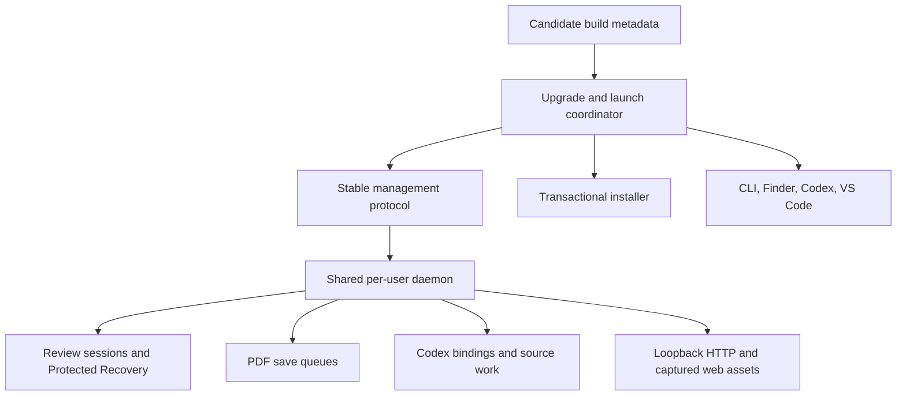
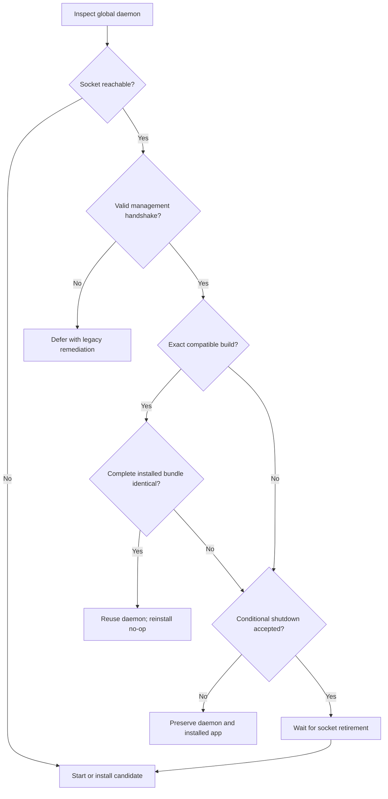

# Upgrade-Safe Shared Daemon - Plan

## Goal Capsule

- **Objective:** Make Placekeeper upgrades detect the running shared daemon, preserve every active PDF review, and replace only an incompatible daemon that has become safely idle.
- **Product authority:** The autosave and quiescent-session rules in `docs/plans/2026-08-11-001-feat-saveless-pdf-annotation-persistence-plan.md` remain authoritative. The task-scoped binding and failure-honesty rules in `docs/plans/2026-08-12-001-feat-live-pdf-codex-context-plan.md` remain authoritative.
- **Open blockers:** None.
- **Execution profile:** Cross-process lifecycle fix spanning the local service, web client presence, launch adapters, macOS installer, package metadata, and installed-bundle acceptance.
- **Tail ownership:** The implementation run owns simplification, review remediation, browser and installed-bundle verification, the commit, the existing pull request update, and CI stabilization.

---

## Product Contract

### Summary

Placekeeper will coordinate app replacement with its one shared per-user daemon.
An ordinary launch will reuse an exact compatible daemon. A reinstall will be a no-op only when the complete installed bundle is identical; otherwise it will gracefully replace an incompatible idle build and leave any active or unverifiable daemon and installed app untouched with clear retry guidance.

### Problem Frame

The installed app can be replaced while an older daemon still owns the global control socket.
The new launcher then reaches that stale process, sends a newer unversioned request, and reports the generic error “Launch service returned an invalid response.”

Killing that process unconditionally is unsafe.
One daemon owns multiple PDF sessions, browser credentials, autosave queues, Protected Recovery, Codex task bindings, and evidence handles.
Stopping it to fix one launch can interrupt unrelated PDFs and invalidate live task context.

Socket reachability also does not prove compatibility or idleness.
The service currently retains broker sessions after browser closure, while the web client does not establish the authenticated presence connection already described by the autosave plan.
The upgrade path therefore needs both a versioned management handshake and the missing quiescent-session lifecycle.

### Actors

- A1. **Reader:** May have one or more PDFs open while reinstalling or launching the app.
- A2. **Installer:** Builds and validates a candidate before attempting transactional replacement.
- A3. **Launcher:** Opens PDFs from Finder, Codex, VS Code, or the CLI through the shared daemon.
- A4. **Shared daemon:** Owns every active review session, save queue, browser connection, and Codex binding for the user.

### Key Decisions

- **Use explicit compatibility evidence.** (session-settled: user-approved — chosen over treating a reachable socket as compatible because the stale daemon reproduced a syntactically invalid launch response.) Governs R1-R4, R11-R12.
- **Preserve any daemon that may own active work.** (session-settled: user-approved — chosen over stopping the existing daemon during every installation because one process can own several PDFs and task bindings.) Governs R5-R10, R13-R15.
- **Keep live session transfer out of this fix.** (session-settled: user-approved — chosen over migrating browser URLs, credentials, task bindings, and evidence handles between processes because safe deferral already preserves active work.) Governs R9, R16.

### Requirements

**Compatibility and identity**

- R1. Every daemon shall expose a bounded management handshake with a stable management protocol version, immutable daemon compatibility identity, lifecycle state, and aggregate activity only.
- R2. The package shall expose two deterministic identities: a daemon compatibility identity covering the service and served web assets, and a complete install-artifact identity covering every bundled file relevant to replacement.
- R3. An exact compatible running daemon shall remain available without losing PDF, browser, or Codex state; an identical installed bundle shall make reinstall a no-op.
- R4. An incompatible or malformed launch response shall produce a typed upgrade-required failure rather than a generic invalid-response error.

**Activity and graceful shutdown**

- R5. Each authenticated review page shall maintain client presence; the last disconnect shall start a bounded grace lease and a reconnect shall cancel retirement.
- R6. Shutdown entry shall require no non-drainable blocker: connected or grace-leased review clients, issued-but-unexchanged bootstrap capabilities, unclaimed bind proofs, pending or active Codex bindings, picker/source work, or launch work for any PDF. Already accepted recovery and Save Sync writes are drainable work rather than entry blockers.
- R7. A conditional shutdown shall atomically stop new launches, verify R6 entry eligibility, drain already accepted recovery and Save Sync work, verify full global idleness including an empty drainable-work set, acknowledge the result, and then close the daemon.
- R8. If any activity appears before final closure, the daemon shall cancel the shutdown and remain available without revoking sessions or capabilities.
- R9. An incompatible daemon with any active PDF or task shall refuse shutdown, disclose only privacy-safe aggregate blocker categories and counts, and remain usable.
- R10. Shutdown-time quiescence shall preserve unsynchronized Protected Recovery and shall remove recovery only when Save Sync proves the session clean under the existing retirement contract; general background session retirement remains owned by the autosave lifecycle plan.

**Installation and host parity**

- R11. The installer shall complete build and offline smoke validation before daemon coordination, but shall finish coordination before moving or replacing the installed app.
- R12. An incompatible idle daemon shall shut down gracefully. The installer shall hold the per-user lifecycle lock through coordination, bundle replacement, and candidate readiness, and shall treat management-socket disappearance as completion only after the old HTTP host and asset readers have closed.
- R13. An active, timed-out, or malformed daemon shall defer replacement and leave the installed app byte-for-byte intact with state-specific retry guidance.
- R14. Finder, CLI, Codex, and VS Code launches shall present the same typed incompatibility outcome without exposing paths, capabilities, task IDs, bind proofs, or evidence handles.
- R15. A blocked upgrade shall leave every existing PDF review and bound Codex task usable and current.
- R16. This fix shall not transfer live review sessions, browser URLs, credentials, task bindings, or evidence handles into a new daemon.

### Key Flows

- F1. Reuse a compatible daemon
  - **Trigger:** A3 launches a PDF while the exact installed build is running.
  - **Actors:** A1, A3, A4
  - **Steps:** A3 verifies management and build compatibility, then sends the launch through the existing daemon.
  - **Outcome:** Existing reviews and task bindings continue unchanged.
  - **Covered by:** R1-R4, R14-R15
- F2. Replace an incompatible idle daemon
  - **Trigger:** A2 installs or A3 launches through a manageable older build with no global activity.
  - **Actors:** A1, A2, A3, A4
  - **Steps:** The coordinator requests conditional shutdown, A4 drains and closes, and the candidate is installed or started only after socket retirement.
  - **Outcome:** The new build launches without interrupting work.
  - **Covered by:** R5-R8, R10-R12
- F3. Defer while another PDF is active
  - **Trigger:** A2 or A3 detects an incompatible daemon with at least one active review or task.
  - **Actors:** A1, A2, A3, A4
  - **Steps:** A4 refuses conditional shutdown and the caller reports clear retry guidance without replacing the app.
  - **Outcome:** All active PDFs and task context remain usable.
  - **Covered by:** R6-R9, R13-R15
- F4. Fail closed for an unreadable daemon
  - **Trigger:** The global socket is reachable but cannot produce a valid management response.
  - **Actors:** A1, A2, A3, A4
  - **Steps:** The caller classifies the daemon as uninspectable and defers replacement or launch.
  - **Outcome:** Unknown activity is never mistaken for idleness.
  - **Covered by:** R4, R13-R16

### Acceptance Examples

- AE1. Incompatible idle daemon is replaced
  - **Covers:** R1-R8, R11-R12.
  - **Given:** An older manageable daemon has no connected, grace-leased, bound, or in-flight work.
  - **When:** A1 reruns the installer.
  - **Then:** The daemon acknowledges conditional shutdown, exits, the candidate replaces the old app transactionally, and a subsequent PDF launch uses the new build.
- AE2. One active PDF blocks replacement
  - **Covers:** R6-R9, R13-R15.
  - **Given:** Two PDFs were opened and at least one still has authenticated client presence or a bound Codex task.
  - **When:** A1 reruns the installer.
  - **Then:** Installation stops before moving the old app, reports that active reviews were preserved, and both existing review URLs remain usable.
- AE3. Reconnect cancels retirement
  - **Covers:** R5-R8, R10.
  - **Given:** The last page disconnects and starts the grace lease.
  - **When:** A review page reconnects before expiry while shutdown eligibility is being considered.
  - **Then:** The review returns to active, conditional shutdown refuses or cancels, and no capabilities or recovery are removed.
- AE4. Unreadable daemon fails closed
  - **Covers:** R4, R13-R16.
  - **Given:** A reachable daemon returns a malformed or timed-out management response.
  - **When:** A1 installs or launches the candidate.
  - **Then:** The daemon and installed app remain untouched, and the user receives explicit instructions to close active work and retry.
- AE5. Accepted annotation survives idle shutdown
  - **Covers:** R6-R8, R10, R12.
  - **Given:** The final annotation command has been accepted and its PDF Save Sync is still converging when the last client disconnects.
  - **When:** The lease expires and an upgrade requests conditional shutdown.
  - **Then:** Protected Recovery and queued saving drain before shutdown; reopening under the new daemon sees the current saved state or an honest recoverable draft.

### Scope Boundaries

**Included**

- Management compatibility and build identity for the shared local daemon.
- Authenticated browser-presence leases, shutdown-time quiescence, aggregate activity, and drain-aware conditional shutdown.
- Installer preflight, launch-time recovery, typed multi-surface failures, packaged smoke, and upgrade documentation.

**Deferred to Follow-Up Work**

- General background quiescent-session garbage collection outside an upgrade attempt; the autosave lifecycle plan retains ownership.
- Migrating live sessions, browser credentials, loopback URLs, Codex bindings, or evidence handles between daemon processes.
- A background auto-updater, signed distribution, launchd service, or cross-user daemon.
- General lifecycle telemetry or a user-facing review-session manager beyond the aggregate upgrade message.

### Success Criteria

- Reinstalling never interrupts an active PDF review or bound Codex task.
- A manageable incompatible idle daemon is replaced without manual process commands.
- An unreadable daemon produces actionable guidance and leaves the installed app untouched.
- Launchers never again surface “Launch service returned an invalid response” for a daemon compatibility mismatch.

---

## Planning Contract

### Key Technical Decisions

- KTD1. **Use a backward-stable management boundary.** A small versioned management envelope owns status and conditional shutdown; exact daemon identity gates reuse. This instantiates R1-R4. (session-settled: user-approved — chosen over socket reachability because a reachable stale daemon already returned the wrong launch protocol.)
- KTD2. **Separate daemon compatibility from complete bundle equality.** The package emits an immutable daemon identity derived from the service and served assets plus an install-artifact identity derived from every bundled replacement input. The daemon captures the former at process start; only the latter can justify a reinstall no-op. This prevents an old process from serving assets that installation replaced under its canonical app path. This instantiates R2-R3 and R11-R12.
- KTD3. **Implement the existing last-client grace lease for upgrade idleness.** Extend the authenticated control connection and presence portion of the quiescent-retirement design from `docs/plans/2026-08-11-001-feat-saveless-pdf-annotation-persistence-plan.md` rather than using broker-session count or browser unload as truth. Ordinary background retirement remains deferred. This instantiates R5-R6 and R10.
- KTD4. **Use one atomic daemon drain gate.** The daemon moves from accepting to draining only when no non-drainable blocker exists, rejects concurrent launches during the gate, drains already accepted recovery/save work, requires both blocker and drainable sets to be empty, writes the response, and then closes. This instantiates R6-R8 and R12. (session-settled: user-approved — chosen over unconditional termination because the daemon can own unrelated PDFs and task bindings.)
- KTD5. **Fail closed on unreadable management state.** A timed-out or malformed management response requires the user to close active work and retry; no caller guesses that the daemon is idle. This instantiates R4 and R13-R16.
- KTD6. **Coordinate before transactional replacement.** The source installer invokes the candidate's bounded coordinator after candidate smoke and before the replacement helper touches the destination. Equal complete install-artifact identities make the install a no-op; every actual bundle change requires the idle-only drain gate even when daemon compatibility identities match. Refusal or timeout exits with the old bundle intact. This instantiates R3 and R11-R13.
- KTD7. **Keep management output aggregate and local.** Status may expose counts grouped as review presence, Codex-task activity, and transient durable work plus lifecycle/build compatibility, but never session IDs, paths, credentials, capabilities, task IDs, or evidence handles. This instantiates R9 and R14-R15.
- KTD8. **Use a shared typed launch failure.** The service CLI emits one bounded upgrade-required error that Finder, VS Code, and Codex launch paths already know how to present; hooks never initiate daemon shutdown. This instantiates R4 and R14-R15.
- KTD9. **Linearize replacement across process boundaries.** Installer coordination, every launcher, and daemon startup share one per-user lifecycle lock. The daemon state machine moves `accepting → draining → shutdown-committed`; every activity-producing route participates, and management-socket removal is the final old-process close marker after HTTP and assets stop. This instantiates R7-R8 and R11-R12.

### High-Level Technical Design

The compatibility boundary spans the packaged candidate, global management socket, running daemon, and every host adapter:



Conditional shutdown is a compare-and-drain operation rather than a status check followed by a separate kill:

```mermaid
sequenceDiagram
  participant C as Candidate coordinator
  participant D as Running daemon
  participant A as Activity authority
  C->>D: Management status
  D-->>C: Epoch, build, lifecycle, aggregate activity
  C->>D: Shutdown if incompatible and idle
  D->>D: Enter drain gate and stop every activity-producing entry point
  D->>A: Check clients, leases, bindings, and operations
  alt Active or activity appears
    A-->>D: Not idle
    D-->>C: Refused; daemon remains available
  else Quiescent
    D->>A: Drain accepted work and recheck
    A-->>D: Idle and durable
    D->>D: Atomically commit shutdown
    D-->>C: Shutdown accepted
    D->>D: Flush response, close HTTP/assets, then remove socket
  end
```

The coordinator uses explicit evidence and fails closed:



### Assumptions

- The management protocol can remain backward-stable across future daemon builds; incompatible management changes advance its own version and therefore defer rather than guess.
- The existing authenticated WebSocket is the presence channel. The server sends a bounded ping every 15 seconds, requires a pong within two intervals, rejects application data frames over 1 KiB or faster than one per second, and expires the presence lease after two missed pongs; reconnect authenticates afresh and cancels pending retirement.
- A short grace duration remains an implementation constant covered by fake-clock tests, not a durability guarantee.
- Candidate build identity can be derived deterministically during packaging without exposing source paths or requiring network access.

### System-Wide Impact

- **Data lifecycle:** Shutdown-time quiescence uses the accepted autosave lifecycle contract and must retain dirty recovery while deleting only verified-clean state.
- **Concurrency:** Launch, disconnect/reconnect, save, source work, and conditional shutdown share one activity decision. The shutdown gate must avoid check-then-act races.
- **Agent parity:** Codex task bindings and prompt context count as activity even when a PDF browser is temporarily disconnected. Plugin hooks may observe failures but cannot stop the daemon.
- **Host parity:** The same typed error crosses JSON CLI output into Finder dialogs and VS Code parsing without weakening URL or secret validation.
- **Packaging:** Build metadata must travel with the app and be captured before installation can replace its source path.

### Risks and Mitigations

- **False idle classification:** Aggregate activity may omit a subsystem. Centralize registration and test every activity owner, with unknown state classified active.
- **Permanent false activity:** Stale browser or task leases could block every future update. Use bounded authenticated leases and deterministic expiry with reconnect renewal.
- **Shutdown response race:** Closing the control server too early can turn success into a transport error. Flush the accepted response before resolving daemon termination and prove it over a real socket.
- **Replacement handoff race:** A launcher or second installer can enter after socket retirement but before bundle replacement. Hold one per-user lifecycle lock across coordination, replacement, and candidate readiness; require launch and daemon startup to honor it.
- **Asset/code mixing:** Reusing a different build can pair old service code with new files. Require exact daemon identity for launch reuse and exact install-artifact identity for reinstall no-op.
- **Recovery cleanup regression:** Session retirement currently lacks production coverage. Reuse recovery-first persistence and test clean versus dirty expiry before relying on it for upgrades.

---

## Implementation Units

### U1. Version the daemon management and build contract

- **Goal:** Make compatibility and build identity inspectable without using launch protocol success as a proxy.
- **Requirements:** R1-R4, R11, R14; KTD1, KTD2, KTD7.
- **Dependencies:** None.
- **Files:** `apps/service/src/host/launch-control.ts`, `apps/service/src/host/service-daemon.ts`, `apps/service/src/cli/open-command.ts`, `packaging/macos/build-app.ts`, `packaging/macos/launcher.mjs`, `packaging/macos/packaging.test.ts`, `apps/service/test/open-command.test.ts`.
- **Approach:**
  1. Add a bounded management request/response envelope with independent management version, captured daemon compatibility identity, lifecycle state, and aggregate activity fields.
  2. Generate deterministic daemon-compatibility and complete install-artifact identities and pass immutable metadata to the CLI and daemon without rereading mutable installed paths.
  3. Classify valid exact, valid incompatible, malformed, timed-out, and legacy responses into typed internal outcomes.
- **Execution note:** Start with failing socket-level compatibility tests, including a simulated legacy responder.
- **Patterns to follow:** Tagged control unions and byte/time limits in `apps/service/src/host/launch-control.ts`; manifest validation in `packaging/macos/validate-manifest.ts`; content-free installed evidence in `packaging/macos/smoke-installed.ts`.
- **Test scenarios:**
  - A matching management version and daemon identity reports exact compatibility.
  - A different daemon identity reports incompatibility without exposing daemon internals.
  - A legacy invalid-request response, malformed JSON, oversized output, timeout, or early close becomes an uninspectable typed result.
  - Daemon identity changes when service or served asset input changes; install-artifact identity changes when any bundled replacement input changes; both remain stable for identical packaged inputs.
- **Verification:** Socket tests prove management compatibility independently from launch, and the packaged launcher supplies the same immutable identity to client and daemon.

### U2. Complete authenticated client presence and shutdown-time quiescence

- **Goal:** Make review activity and safe shutdown eligibility observable after PDFs have been closed.
- **Requirements:** R5-R6, R8-R10, R15; KTD3, KTD7.
- **Dependencies:** U1.
- **Files:** `apps/service/src/sessions/control-socket.ts`, `apps/service/src/sessions/session-broker.ts`, `apps/service/src/server/http-server.ts`, `apps/web/src/app/session-api.ts`, `apps/web/src/app/ProductionReviewApp.tsx`, `apps/service/test/session-security.test.ts`, `apps/service/test/recovery.test.ts`, `apps/service/test/launch-host.test.ts`, `apps/web/test/production-review-app.test.tsx`.
- **Approach:**
  1. Establish authenticated page presence over the existing session control WebSocket and track multiple clients per review using the bounded server-ping/client-pong contract above; reject malformed, oversized, fragmented application data and floods.
  2. Start a bounded lease after the last disconnect and cancel it on reconnect; use expiry to determine upgrade eligibility without adding ordinary background retirement.
  3. At shutdown, preserve dirty recovery and delete only verified-clean recovery under the existing Save Sync contract.
  4. Count issued-but-unexchanged bootstrap capabilities and unclaimed Codex bind proofs as bounded activity until consumption, revocation, or expiry, and publish aggregate activity without identifiers or paths.
- **Execution note:** Implement client-presence and lease behavior test-first with a fake clock before wiring upgrade decisions to it.
- **Patterns to follow:** KTD13 in `docs/plans/2026-08-11-001-feat-saveless-pdf-annotation-persistence-plan.md`; authenticated WebSocket checks in `apps/service/src/server/http-server.ts`; recovery serialization in `apps/service/src/sessions/session-broker.ts`.
- **Test scenarios:**
  - One connected tab is active; two tabs remain active until both disconnect.
  - Last disconnect starts grace, reconnect cancels expiry, and a later disconnect restarts the lease.
  - Dirty shutdown-time expiry retains a recoverable draft; clean shutdown removes recovery only after durable cleanup.
  - An in-flight broker write, save, picker, source execution, or active task binding delays or prevents shutdown.
  - Daemon restart treats prior client presence as expired and reconciles recovery without relying on unload.
  - A shutdown request after launch response but before capability exchange or bind-proof claim refuses until the bounded claim expires or is consumed and later quiesces.
  - Oversized, malformed, fragmented, or flooded presence frames are rejected without extending activity indefinitely.
- **Verification:** Fake-clock and integration tests prove session presence, reconnect, clean/dirty shutdown behavior, and aggregate activity across multiple PDFs.

### U3. Add atomic drain-aware conditional shutdown

- **Goal:** Let an incompatible daemon stop itself only when global activity is durably quiescent.
- **Requirements:** R5-R10, R12, R15; KTD4, KTD5, KTD7.
- **Dependencies:** U1, U2.
- **Files:** `apps/service/src/saving/pdf-save-coordinator.ts`, `apps/service/src/host/placekeeper-host.ts`, `apps/service/src/host/launch-control.ts`, `apps/service/src/host/service-daemon.ts`, `apps/service/test/pdf-save-coordinator.test.ts`, `apps/service/test/open-command.test.ts`, `apps/service/test/launch-host.test.ts`.
- **Approach:**
  1. Give the host a single activity/drain authority covering launches, reconnects, HTTP mutations, broker writes, save queues, picker work, task bindings, and source workflows.
  2. Add an atomic drain gate that blocks new launches, refuses immediately on non-drainable blockers, drains previously accepted recovery/save work when eligible, and requires both activity sets empty before acceptance.
  3. Implement `accepting → draining → shutdown-committed`: atomically commit only after the final recheck; before commit, new activity cancels draining, and after commit every activity-producing route returns a bounded retry outcome.
  4. Flush the management response, close and await the HTTP host and all asset readers, and remove the management socket only as the final shutdown marker.
- **Execution note:** Prove race behavior with controlled promises before adding installer integration.
- **Patterns to follow:** Serialized broker write tails, save queue convergence, and service close sequencing already present in the service layer.
- **Test scenarios:**
  - Globally idle daemon accepts conditional shutdown and exits after its response is fully received.
  - Any one of two active PDFs refuses shutdown and both remain launchable/readable afterward.
  - A concurrent launch cannot enter between idle check and drain; it receives a bounded draining outcome or proceeds after cancellation.
  - A save or recovery write accepted before the gate finishes before shutdown acknowledgement.
  - New activity during final recheck cancels shutdown without revoking session state.
  - Reconnect immediately before shutdown commit cancels; reconnect immediately after commit receives a bounded retry and cannot create doomed state.
  - A pending HTTP-host close prevents management-socket removal and therefore prevents replacement.
- **Verification:** Real-socket tests prove refusal, drain, response ordering, race exclusion, and continued usability after cancellation.

### U4. Coordinate installer and launch surfaces

- **Goal:** Apply the compatibility decision before app replacement and present one actionable outcome on every launch surface.
- **Requirements:** R3-R4, R9, R11-R16; KTD5, KTD6, KTD8-KTD9.
- **Dependencies:** U1, U3.
- **Files:** `apps/service/src/host/service-daemon.ts`, `apps/service/src/cli/open-command.ts`, `packaging/macos/install-built-app.sh`, `install.sh`, `packaging/macos/launcher.mjs`, `apps/vscode/src/local-workspace.ts`, `apps/vscode/src/review-panel.ts`, `apps/service/test/open-command.test.ts`, `apps/vscode/test/extension.test.ts`, `packaging/macos/packaging.test.ts`.
- **Approach:**
  1. Acquire one per-user lifecycle lock honored by installers, launchers, and daemon startup; hold it through coordination, replacement, and candidate readiness.
  2. Reuse exact compatible daemons, make identical reinstall a no-op, and route every actual bundle change through conditional shutdown.
  3. Run candidate coordination after packaged smoke but before the transaction helper changes the installed app.
  4. Wait for confirmed final socket retirement before replacement or daemon respawn.
  5. Extend the shared bounded launch error contract so Finder, CLI, Codex, and VS Code preserve the same remediation.
  6. Present one bounded outcome matrix: review presence → close Placekeeper tabs/windows and retry; Codex-task activity → end the bound Codex task or wait for its lease and retry; transient durable work/draining → retry automatically for up to five seconds, then ask the user to wait and retry; timeout/malformed state → leave the app untouched and retry after closing work.
- **Execution note:** Keep the replacement helper transactional tests intact and add failure cases that assert no destination mutation.
- **Patterns to follow:** Structured `LaunchResponse`, Finder native error presentation, VS Code bounded response parsing, and existing app rollback transaction.
- **Test scenarios:**
  - Exact compatible daemon and installed bundle make reinstall a no-op without a stop request or bundle move.
  - Incompatible idle daemon stops and installation continues only after socket removal.
  - Incompatible active daemon, management timeout, and malformed response all abort before the installed app is moved.
  - Closed pages with an active Codex binding report task-specific aggregate guidance and later succeed after task revocation or lease expiry.
  - A launch during draining retries within the five-second bound and either continues on the new daemon or returns the shared transient-busy outcome.
  - A launch and a second installer entering immediately after old-socket retirement wait on the lifecycle lock and observe only the ready candidate.
  - Finder and VS Code accept the new typed error while retaining strict URL, size, and secret checks.
  - Codex launch failure does not create a bind claim and hooks never issue shutdown.
- **Verification:** Packaging tests prove preflight ordering and byte-preserving deferral; adapter tests prove consistent error presentation.

### U5. Prove installed upgrade behavior and document recovery

- **Goal:** Exercise the real app-bundle launcher and daemon across idle, active, compatible, and legacy-style upgrade cases.
- **Requirements:** R1-R16; KTD1-KTD9.
- **Dependencies:** U1-U4.
- **Files:** `packaging/macos/smoke-installed.ts`, `packaging/macos/packaging.test.ts`, `test/acceptance/launch-surfaces.spec.ts`, `docs/installation.md`, `test/acceptance/installed-hosts.md`, `package.json`.
- **Approach:**
  1. Extend isolated-home installed smoke with a first build daemon and a distinct candidate build.
  2. Prove exact reuse, idle replacement, active multi-PDF deferral, task-context survival, and post-upgrade launch.
  3. Record first-transition legacy remediation and upgrade acceptance evidence without recording paths or capabilities.
  4. Add focused lifecycle coverage to the release gate.
- **Execution note:** Prefer the real packaged launcher and socket over test-only mocks for the final proof.
- **Patterns to follow:** Isolated app symlink, offline environment, real hook timeouts, and process-group cleanup in `packaging/macos/smoke-installed.ts`.
- **Test scenarios:**
  - Installed exact build reuses its running daemon and retains current Codex context.
  - Installed incompatible idle build exits and the candidate launches the fixture successfully.
  - One active PDF among multiple sessions blocks replacement; browser state and current task context remain usable.
  - Legacy-style responder defers with documented remediation and leaves the installed bundle unchanged.
  - SessionEnd, browser disconnect, lease expiry, and retry converge to a successful later upgrade.
- **Verification:** The packaged smoke passes offline from an isolated home and the acceptance record describes the observed upgrade lifecycle without sensitive data.

---

## Verification Contract

| Gate | Scope | Units | Done signal |
|---|---|---|---|
| Focused service lifecycle | Control protocol, leases, recovery, save drain, host shutdown | U1-U3 | New compatibility and quiescence scenarios pass without fixed sleeps |
| Host adapter contract | CLI, Finder, Codex hooks, VS Code | U1, U4 | All surfaces accept the typed outcome and preserve existing secret/URL bounds |
| Packaging transaction | Preflight ordering, deferral, rollback, build identity | U1, U4 | Active, timeout, and malformed cases do not move the installed app |
| Installed-bundle smoke | Real launcher, two builds, daemon, browser exchange, task context | U5 | Exact reuse, idle upgrade, active deferral, and retry pass in an isolated home |
| Repository quality | TypeScript, service/web builds, distribution manifests, diff hygiene | U1-U5 | `pnpm typecheck`, `pnpm build`, `pnpm validate:distribution`, and `git diff --check` pass |
| Release regression | Existing service, review, host, and launch-surface suites | U1-U5 | The applicable `pnpm test:service`, `pnpm test:u7-host`, and launch-surface acceptance gates pass |

---

## Definition of Done

- The management handshake distinguishes exact compatibility, manageable incompatibility, and unknown legacy state without relying on launch responses.
- Browser presence and shutdown-time quiescence make global idle status truthful across multiple tabs, PDFs, and Codex tasks.
- Conditional shutdown is atomic against concurrent launches and drains accepted durable work before process exit.
- The installer never moves the old app when activity or compatibility cannot be disproved.
- Finder, CLI, Codex, and VS Code surface one bounded upgrade-required outcome with no secret disclosure.
- Installed smoke proves exact reuse, idle replacement, active multi-PDF deferral, unreadable-daemon deferral, and a successful retry.
- Documentation explains the normal close-active-work-and-retry flow.
- All Verification Contract gates pass, abandoned approaches are removed, and no unrelated user changes are reverted.
