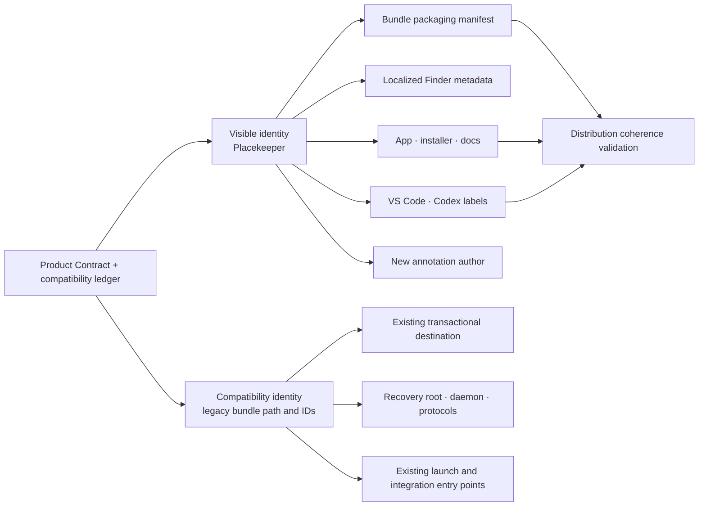
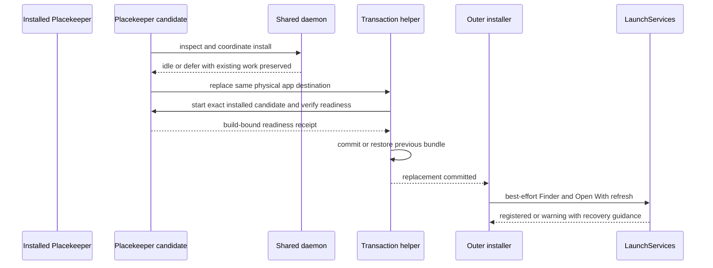

# Placekeeper Rebrand - Plan

> Superseded on 2026-08-13 by the user's clean-break identity decision. The
> implementation now uses Placekeeper for every bundle, executable, storage,
> protocol, integration, annotation, fixture, and documentation identity. This
> artifact remains only as historical design context; its continuity and alias
> decisions are no longer implementation requirements. Historical identity
> tokens were normalized to the current name as part of that decision.

## Goal Capsule

- **Objective:** Rename Placekeeper to Placekeeper and give it an app icon that expresses uninterrupted reading across references.
- **Product authority:** This contract owns the user-facing product name and app icon. Existing product behavior and the Warm Neutral in-session visual language remain authoritative outside those two areas.
- **Open blockers:** None for implementation planning. Public release under the Placekeeper name remains blocked on trademark, marketplace, and domain clearance.
- **Execution:** Code and production design assets.

---

## Product Contract

### Summary

Implement the Placekeeper identity across the supported app, installer, documentation, PDF output, and integrations while extending the existing upgrade and persistence patterns rather than replacing them. Add a native multi-size macOS icon pipeline and preserve existing installations, recovery data, annotations, and entry points.

### Problem Frame

Placekeeper describes only part of the product now that reading, annotation, reference navigation, symbol search, and related tools form one daily workspace. The old name makes the app sound like a narrow correction utility rather than a place to read and work through demanding documents.

Preview makes annotation cumbersome and forces readers to reconstruct nested reference journeys through Back and Forward history. Acrobat offers broad capability at the cost of a heavier interface. The product's distinctive value is preserving reading flow while making annotation and nonlinear reference lookup feel easy.

### Key Decisions

- **Adopt Placekeeper as the product name.** (session-settled: user-directed — chosen over Placekeeper, Turn, and the other explored names because it has warmth, reading association, and room for the product to grow.) Governs R1-R4.
- **Center serious readers and continuity of thought.** (session-settled: user-directed — chosen over proofreading-only and narrowly academic positioning because the product is intended for day-to-day reading and annotation.) Governs R2-R3.
- **Use the two-page reference-and-return icon direction.** (session-settled: user-directed — chosen over generic document, bookmark, and more linear alternatives because it represents the product's distinctive nonlinear reading model.) Governs R5-R12.
- **Limit this rebrand to the name and app icon.** (session-settled: user-approved — chosen over a broader identity or interface redesign because the existing product and Warm Neutral direction already fit.) Governs R13-R14.
- **Protect upgrade and integration continuity.** (session-settled: user-approved — chosen over a clean-break rename because existing users must not lose state or working entry points.) Governs R15-R16.

### Visual Reference

The approved composition is preserved in [the Placekeeper icon reference](assets/2026-08-12-placekeeper-rebrand/placekeeper-icon-reference.svg). It is normative for geometry, optical placement, color relationships, and the reference-and-return metaphor, but it is not itself the complete production icon set.

### Requirements

**Name and positioning**

- R1. The user-facing product name shall be Placekeeper.
- R2. Placekeeper shall be positioned as a focused everyday PDF reader and annotator for serious readers.
- R3. The identity shall emphasize preserving the reader's place and train of thought across annotation, search, and nested reference lookup.
- R4. A concise functional descriptor may accompany the name only where the product category would otherwise be unclear.

**App icon**

- R5. The icon shall depict two fanned sheets, with the front sheet representing the Main Reading Thread and the lower sheet representing a referenced location.
- R6. The lower sheet shall be visibly fanned and tucked behind the front sheet so neither its top-left nor bottom-right corner protrudes beyond the stack.
- R7. One smooth blue bookmark-like line shall leave the front sheet through a single symmetric rounded loop and return to a bookmark notch.
- R8. An amber reference dot shall sit within the exposed interior of the lower sheet rather than near its outer margin.
- R9. The complete page-and-line composition shall be vertically centered and retain the approved slight leftward optical placement within the icon field.
- R10. The icon shall communicate a reference detour with a reliable return rather than only a generic PDF, page, bookmark, or annotation.
- R11. The icon shall use a warm neutral field, ivory paper, restrained dark marks, a cool blue path, and an amber reference dot consistent with the product's visual character.
- R12. Production artwork shall preserve the approved composition and remain legible at every required macOS icon size, including Finder and Dock presentation.

**Surface consistency and continuity**

- R13. Supported user-facing surfaces shall use Placekeeper consistently across the macOS app, Finder and installation touchpoints, the service browser title, documentation, VS Code, and the Codex integration.
- R14. The rebrand shall not change reading, annotation, reference navigation, search, recovery, or delivery behavior, and shall not redesign the existing interface.
- R15. Existing recovery data, Review Items, saved PDF state, and annotation editability shall survive an in-place upgrade to Placekeeper.
- R16. Existing supported launch, Finder, VS Code, and Codex entry points shall continue working after upgrade without manual reconfiguration.
- R17. Public release shall use the Placekeeper name only after appropriate trademark, marketplace, and domain clearance confirms that it is available.

### Acceptance Examples

- AE1. Consistent product name
  - **Covers R1-R4, R13.**
  - **Given:** A fresh build is installed with its supported integrations and documentation.
  - **When:** A user encounters the product in Finder, installation material, the app or browser surface, VS Code, or Codex.
  - **Then:** The visible product identity is Placekeeper, with a functional descriptor only where category context is needed.
- AE2. Upgrade continuity
  - **Covers R15-R16.**
  - **Given:** An existing Placekeeper installation has recovery state, editable annotations, and configured entry points.
  - **When:** The user upgrades to Placekeeper and resumes the same work.
  - **Then:** The prior state remains available and each supported entry point opens the renamed product without user repair.
- AE3. Full-size icon composition
  - **Covers R5-R11.**
  - **Given:** The production icon is viewed at a large size.
  - **When:** Its page stack and reference path are inspected.
  - **Then:** Two tucked and fanned pages, one smooth symmetric detour, an interior reference dot, a return, and the approved centering are all evident.
- AE4. Small-size icon legibility
  - **Covers R9-R12.**
  - **Given:** The production icon is displayed at typical Finder and Dock sizes.
  - **When:** It appears alongside other macOS app icons.
  - **Then:** The page stack, blue reference-and-return path, and amber dot remain recognizable without appearing crowded or vertically off-center.
- AE5. Unchanged product experience
  - **Covers R14.**
  - **Given:** A user performs an existing reading, annotation, reference-navigation, search, recovery, or delivery workflow after the rebrand.
  - **When:** The workflow is compared with the pre-rebrand behavior.
  - **Then:** Only the product name and app icon have changed.

### Scope Boundaries

**Deferred for later**

- A broader messaging system, launch campaign, website identity, or extended marketing asset family may follow this work but is not required for R1-R17.
- Renaming legacy internal identifiers may be considered only in a later migration with its own compatibility case.
- Release-workflow redesign, x64 support, and adoption of Xcode asset catalogs or Icon Composer remain separate work.

**Outside this work**

- Interface layout, interaction, or feature changes are excluded per R14.
- A new typography, color, or component system is excluded; the existing Warm Neutral authority remains in force.
- Historical plans and solutions retain the product name that accurately describes their provenance; only current user guidance and active product surfaces are renamed.
- Alternative product names or icon directions are excluded unless R17 prevents use of Placekeeper.

### Dependencies and Assumptions

- The current recovery root remains `~/Library/Application Support/Placekeeper`; no state directory migration is required or desired for this rebrand.
- The installed bundle remains physically located at `~/Applications/Placekeeper.app`; localized bundle metadata presents Placekeeper in Finder while preserving hard-coded legacy launchers.
- The bundle identifier, executable, daemon/socket ownership and coordination mechanism, environment variables, protocol envelopes, media types, VS Code identifiers and configuration namespace, and portable-annotation private owner and schema remain compatibility contracts. The daemon content hash may change when packaged service or web bytes change.
- The source-first Apple-silicon distribution remains the supported packaging target for this work.
- The [Warm Neutral Review Design Language plan](2026-08-09-001-feat-warm-neutral-review-design-language-plan.md) remains authoritative for the in-session interface and provides the visual context for R11.

<!-- ce-section: work-relationships -->
### How This Work Fits Together

- This plan changes visible identity while deliberately preserving the lifecycle and state contracts established by the local app, upgrade-safe daemon, and recoverable annotation plans.
- The existing transactional installer remains the authority for candidate coordination, rollback, readiness, and LaunchServices registration; this plan changes its packaged content and visible messaging, not its safety model.
- The approved visual reference is the design authority for production icon work; Apple's `.iconset` and `.icns` requirements determine its packaging representation.

### Sources and Research

- `packaging/macos/app-bundle.json`, `build-app.ts`, `install-built-app.sh`, `smoke-installed.ts`, and `packaging.test.ts` establish the current bundle identity, physical install path, transaction, readiness, and packaging validation boundaries.
- `apps/service/src/main.ts`, `apps/service/src/host/service-daemon.ts`, and `docs/solutions/architecture-patterns/recoverable-editable-pdf-annotation-autosave.md` establish the persisted recovery root and why it must remain stable.
- `packages/core/src/annotation-projection.ts`, `apps/service/src/context/live-source-workflow-service.ts`, and `docs/solutions/integration-issues/portable-pdf-annotations-invisible-in-external-viewers.md` establish the annotation author, private owner, and schema compatibility boundary.
- `apps/vscode/package.json`, `apps/vscode/src/extension.ts`, and `integrations/codex-plugin/` establish the visible versus stable integration identifiers.
- `docs/solutions/architecture-patterns/upgrade-safe-shared-per-user-daemon-lifecycle.md` establishes the existing transactional upgrade and shared-daemon lifecycle pattern this plan extends.
- [Apple Information Property List Key Reference](https://developer.apple.com/library/archive/documentation/General/Reference/InfoPlistKeyReference/Articles/CoreFoundationKeys.html) documents localized bundle names and the macOS icon-file key.
- [Apple Bundle Programming Guide](https://developer.apple.com/library/archive/documentation/CoreFoundation/Conceptual/CFBundles/AboutBundles/AboutBundles.html) documents `InfoPlist.strings` localization within bundle resources.
- [Apple High Resolution Guidelines for OS X](https://developer.apple.com/library/archive/documentation/GraphicsAnimation/Conceptual/HighResolutionOSX/Optimizing/Optimizing.html) documents `.iconset` filenames, representations, and `iconutil` conversion.
- [Apple Icon Set Format Reference](https://developer.apple.com/library/archive/documentation/Xcode/Reference/xcode_ref-Asset_Catalog_Format/IconSetType.html) documents the required macOS icon representations.
- [Apple App Icon Human Interface Guidelines](https://developer.apple.com/design/human-interface-guidelines/app-icons/) provide the production legibility and system-presentation guidance.
- [Apple Code Signing Guide](https://developer.apple.com/library/archive/documentation/Security/Conceptual/CodeSigningGuide/Procedures/Procedures.html) establishes that packaged resources must be finalized before signing.

---

## Planning Contract

### Product Contract Preservation

Product Contract unchanged.
The implementation decisions below resolve identity ownership, compatibility, asset production, and verification without changing R1-R17.

### Key Technical Decisions

- KTD1. **Split visible identity from compatibility identity at the bundle-packaging authority.** The app manifest shall distinguish `productName: "Placekeeper"` from the stable physical bundle name `Placekeeper`. `build-app.ts` shall continue emitting `Placekeeper.app`; raw `CFBundleDisplayName` and `CFBundleName` shall match that basename, `LSHasLocalizedDisplayName` shall be true, and `Resources/en.lproj/InfoPlist.strings` shall localize both names to `Placekeeper`. The bundle identifier `local.placekeeper`, executable `placekeeper`, Finder bridge executable `droplet`, and document-handler registration remain unchanged. This uses Apple's supported display-name localization instead of creating two installed bundles or breaking hard-coded entry points.
- KTD2. **Do not migrate mutable state or stable protocol identities.** `~/Library/Application Support/Placekeeper`, the control socket and lifecycle-lock paths, management protocol, receipt semantics, `PLACEKEEPER_*` configuration, CLI names, hook protocol kinds, media types, panel and command identifiers, and private temporary prefixes stay stable. `daemonIdentity` itself is a content hash of the packaged service and web trees and is expected to change when Placekeeper copy changes; the existing exact-versus-incompatible comparison and coordinated old-hash-to-new-hash turnover remain authoritative. This avoids a state copy, dual-daemon ambiguity, or a protocol flag day under R14-R16.
- KTD3. **Treat PDF author text as a versioned compatibility field inside validated ownership.** New app-authored annotations shall use `Placekeeper` as their author, while ingestion, replacement, and round-trip workflows accept both exact author values only after the private `placekeeper` owner, supported schema, safe payload, matching identities, and visible projection establish app ownership. Clean-rebuild classification may intentionally recognize both exact app authors alongside those ownership signals. Author strings never become a global ownership allowlist; stable Review Item IDs and unrelated external author strings remain unchanged.
- KTD4. **Package a complete direct `.icns` asset before identity hashing and signing.** Commit a production master plus all ten named PNG representations in `Placekeeper.iconset`, validate names and pixel dimensions, and run `/usr/bin/iconutil -c icns` to create `Contents/Resources/Placekeeper.icns`. Set `CFBundleIconFile` to `Placekeeper`; include the icon and localized metadata before computing `build-identity.json` and before ad-hoc or release signing. Do not add an Xcode project, asset catalog, or Icon Composer dependency to this non-Xcode source-first build.
- KTD5. **Use one checked-in canonical Placekeeper skill with mechanically enforced legacy parity.** VS Code changes only visible titles and descriptions; its extension package name, command, configuration namespace, panel type, and existing configured launcher path remain stable. The default launcher resolves to the supported user-local compatibility path. The checked-in `$placekeeper` skill is the normative operational and safety body; `$placekeeper` remains a checked-in discoverable alias whose normalized body must match after removing only declared skill identity and user-facing alias metadata. Launch, recovery, live context, pagination, evidence authorization, guarded source work, clean rebuild, completion, capability secrecy, explicit-user-request gates, ordinary permissions, and SessionEnd revocation remain equivalent. Both aliases use the same stable launcher, single plugin-global hook set, `placekeeper-live-context` envelope, task binding, and daemon lifecycle.
- KTD6. **Rename active user surfaces deliberately, not lexically.** Current app titles, human-facing lifecycle and recovery messages, Finder dialogs, installer output, integration metadata, README, installation, privacy/recovery, and support guidance change to Placekeeper. Compatibility paths and identifiers are documented as legacy technical names where users must type or inspect them. Historical plan and solution prose is not rewritten.
- KTD7. **Prove a physical old-to-new upgrade through the existing transaction.** Characterize legacy identities first, then exercise a candidate carrying Placekeeper metadata and icon against an installed Placekeeper bundle with recovery state, active-work deferral, annotations, VS Code configuration, and Codex entry points. Replacement still occurs at one physical destination, so the current coordinate-install, readiness receipt, rollback, and LaunchServices refresh sequence remains authoritative.

### High-Level Technical Design

The Product Contract and compatibility ledger are the conceptual authority. Independently owned product surfaces consume that decision, and distribution validation is the coherence gate; the app manifest owns only bundle-packaging fields.

The upgrade keeps one bundle destination and extends the proven replace-and-readiness transaction.

Production artwork becomes a signed bundle resource through a deterministic macOS-native path.

### Compatibility Identity Ledger

| Surface | New visible value | Stable compatibility value |
|---|---|---|
| Product and Finder display name | `Placekeeper` | Physical bundle `Placekeeper.app` |
| macOS bundle | Localized `CFBundleDisplayName` and `CFBundleName`: `Placekeeper` | Raw bundle names: `Placekeeper`; `local.placekeeper`, `placekeeper`, `droplet` |
| Mutable state | User guidance says Placekeeper | `Library/Application Support/Placekeeper`, socket/lifecycle ownership, and identity algorithm |
| Portable PDF annotations | New author `Placekeeper` | Read old author `Placekeeper`; keep owner `placekeeper` and schemas |
| VS Code | Display name, command title, panel title, messages | `placekeeper-vscode`, `placekeeper.open`, `placekeeper.launcherPath`, `placekeeper.review` |
| Codex | Plugin labels and canonical `$placekeeper` | `$placekeeper`, installed launcher command, hooks, `placekeeper-live-context` |
| Service and CLI | Human-facing text says Placekeeper | CLI command, environment keys, media types, temporary prefixes, protocol kinds |

### System-Wide Impact

- macOS packaging gains localized metadata and a checked-in icon source set but retains one app destination and one executable identity; neither `Placekeeper.app` nor `Application Support/Placekeeper` is created.
- The daemon content hash turns over from the legacy build to the Placekeeper build while socket paths, lifecycle ownership, management protocol, and readiness semantics stay stable.
- The installer, daemon coordination, recovery, and LaunchServices flow retain their current transaction boundaries; visible copy and packaged resources change inside those boundaries.
- PDF serialization changes one new-annotation metadata value and widens one legacy recognition predicate; PDF geometry, appearance streams, Review Item semantics, and external annotations do not change.
- VS Code and Codex present a new name while old automation, settings, and skill invocation continue to resolve the same local launcher.
- Browser UI layout and styling remain unchanged; the browser document title and any explicit product heading are renamed, so existing review visual snapshots should remain byte-for-byte unchanged unless they intentionally capture that text.

### Risks and Mitigations

- **Finder shows the filesystem name:** A mismatched raw display name can cause Finder to expose `Placekeeper`; KTD1 uses localized `InfoPlist.strings` and requires real Finder/Open With validation after registration.
- **Second-bundle ambiguity:** Emitting `Placekeeper.app` alongside the old app could create competing LaunchServices entries and hard-code drift; the plan keeps one physical destination and explicitly rejects a second installed bundle.
- **Lost recovery or active work:** A broad internal rename could create a new state root or daemon; the compatibility ledger is characterized in tests before visible strings change, and the installed upgrade follows the existing readiness transaction.
- **Legacy annotation misclassification:** Replacing the author string without dual-read support could make clean rebuilds retain app annotations or make old output uneditable; KTD3 requires fixtures for both generations and mixed documents.
- **Small-icon collapse:** Mechanical scaling may merge the loop, dot, and paper edges at 16px or 32px; every representation is visually reviewed and size-specific optical adjustments are allowed only when they preserve the approved composition.
- **Post-sign mutation:** Generating the icon or localization after signing invalidates the bundle seal; KTD4 fixes asset creation before identity hashing and signing and adds post-package signature checks.
- **Alias drift:** Two Codex skill names or legacy VS Code configuration can diverge; validators and acceptance tests exercise both aliases and pin stable identifiers.
- **Agent contract drift:** A legacy skill can keep launching while silently losing evidence, secrecy, reconciliation, permission, or lifecycle rules; KTD5 requires a single normative body or mechanically checked normalized equivalence before the shared hook boundary.
- **Post-use downgrade:** Transactional rollback before commit is supported because the candidate cannot write user documents before readiness commits. Manual downgrade after Placekeeper-authored PDFs are created is unsupported and is not expanded into a backward-reader project in this rebrand.
- **Stale LaunchServices registration:** Registration occurs after a healthy bundle transaction and is warning-only; a failed refresh keeps the committed app and reports re-registration/Finder-refresh guidance rather than attempting a late rollback.
- **Accidental scope expansion:** The current release workflow advertises architecture behavior that is broader than the source-first manifest; this plan leaves that mismatch untouched and verifies the currently supported arm64 path only.

### Sequencing

1. Characterize the compatibility ledger and legacy installed behavior before changing identity data.
2. Separate visible and physical bundle identity, then add localized Finder metadata without moving the install destination.
3. Produce and package the complete icon resource before build identity and signing.
4. Change persisted annotation authors with dual-read compatibility.
5. Rename active product surfaces and add integration aliases while preserving stable IDs.
6. Run the installed old-to-new upgrade, cross-surface, and visual icon acceptance gates.

---

## Implementation Units

### U1. Identity authority and compatibility characterization

- **Goal:** Make the app manifest explicitly own visible Placekeeper identity separately from the stable bundle filename, storage, executable, and protocol identities.
- **Requirements:** R1, R13-R16; AE1, AE2, AE5; KTD1, KTD2.
- **Dependencies:** None.
- **Files:** `packaging/macos/app-bundle.json`, `packaging/macos/validate-manifest.ts`, `packaging/macos/build-app.ts`, `packaging/macos/packaging.test.ts`, `packaging/macos/smoke-installed.ts`, `install.sh`.
- **Approach:**
  1. Add an explicit stable bundle-name field while changing `productName` to Placekeeper; reject manifests that silently couple those meanings again.
  2. Keep the output bundle path, bundle identifier, executables, runtime data directory, source-first target, and canonical launcher command unchanged.
  3. Generate raw plist bundle names matching the physical bundle, set the localized-name hint, and localize the English names to Placekeeper in `Contents/Resources/en.lproj/InfoPlist.strings`.
  4. Characterize the full compatibility ledger in packaging tests and dry-run output before later units rename human-facing copy.
- **Test scenarios:**
  1. The validated manifest reports Placekeeper as product name and Placekeeper as stable bundle name.
  2. A build still emits `Placekeeper.app` with the same bundle ID, executables, document role, runtime data directory, and installed launcher command.
  3. Raw plist names match the physical bundle while localized names resolve to Placekeeper and the localization hint is enabled.
  4. A legacy daemon hash and the changed Placekeeper candidate hash coordinate through the same socket, protocol, exact/incompatible classifier, and readiness transaction.
  5. An attempted change to a pinned compatibility identity fails a focused contract assertion, and no build or install creates a Placekeeper-named physical bundle or support directory.
- **Verification:** Packaging unit tests distinguish visible identity from every pinned compatibility value before any installer transaction is exercised.

### U2. Production macOS icon pipeline

- **Goal:** Turn the approved reference-and-return design into a complete, validated, signed macOS icon resource.
- **Requirements:** R5-R12, R14; AE3-AE5; KTD4.
- **Dependencies:** U1 for manifest fields and plist ownership.
- **Files:** `docs/plans/assets/2026-08-12-placekeeper-rebrand/placekeeper-icon-reference.svg`, `packaging/macos/icon/Placekeeper.svg` (new), `packaging/macos/icon/Placekeeper.iconset/` (new), `packaging/macos/build-app.ts`, `packaging/macos/validate-manifest.ts`, `packaging/macos/packaging.test.ts`.
- **Approach:**
  1. Rebuild the approved geometry as a clean production vector master without adding a pre-masked system corner or changing the settled composition.
  2. Commit the ten standard PNG representations: 16, 16@2x, 32, 32@2x, 128, 128@2x, 256, 256@2x, 512, and 512@2x.
  3. Validate exact filenames, square dimensions, PNG format, nonempty alpha/content bounds, and manifest ownership before invoking `iconutil`.
  4. Compile `Placekeeper.icns`, copy it into bundle resources, and point `CFBundleIconFile` to it before build-identity computation and signing.
  5. Begin from deterministic master scaling. If 16px or 32px review fails, allow those representations to increase path/dot weight and simplify subordinate page marks while preserving the two-page silhouette, single-loop topology, palette roles, slight leftward placement, and vertical centering.
  6. Reverse-expand the packaged `.icns` in a Darwin test and visually inspect all representations, with explicit Finder and Dock checks at small sizes and comparison against AE3-AE4 for every adapted representation.
- **Test scenarios:**
  1. Every source representation has the expected pixel dimensions, including 1024px for `icon_512x512@2x.png`.
  2. Missing, misnamed, nonsquare, or wrongly sized representations fail before bundle construction.
  3. `iconutil` produces a readable `.icns` that reverse-expands to the expected representations.
  4. The final plist sets `CFBundleIconFile` to `Placekeeper`, the resource is present in the identity hash, and signature verification succeeds.
  5. Large, Dock-scale, 32px, and 16px review preserves the tucked pages, symmetric loop, interior dot, left optical placement, and vertical centering.
- **Verification:** Automated asset and bundle checks pass on macOS, followed by a recorded manual Finder/Dock visual smoke against AE3-AE4.

### U3. Portable PDF annotation compatibility

- **Goal:** Brand newly written annotations as Placekeeper without losing editability, rebuild cleanliness, or round-trip support for Placekeeper annotations.
- **Requirements:** R13-R16; AE2, AE5; KTD3.
- **Dependencies:** U1 establishes the canonical visible product string.
- **Files:** `packages/core/src/annotation-projection.ts`, `packages/core/src/portable-annotation.ts`, `packages/core/test/portable-annotation.test.ts`, `apps/service/src/context/live-source-workflow-service.ts`, `apps/service/test/live-source-workflow.test.ts`, `apps/service/test/export-transaction.test.ts`, `apps/service/test/replace-original.test.ts`, `test/conformance/reviewed-pdf.test.ts`.
- **Approach:**
  1. Centralize the current and legacy app-author strings beside the existing private owner/schema authority.
  2. Emit `Placekeeper` for new annotations while accepting each exact author alias only within validated owned envelopes and the intentional clean-rebuild classifier.
  3. A modified legacy annotation may be re-emitted with `Placekeeper`; untouched legacy metadata is not mass-rewritten. External author strings, annotation geometry, appearance streams, Review Item IDs, owner, and schema versions remain unchanged.
  4. Add legacy-only, new-only, and mixed-document fixtures through save, replace, export, and clean-rebuild paths.
- **Test scenarios:**
  1. New projection and reviewed-PDF output uses author Placekeeper with the unchanged private owner/schema.
  2. A legacy Placekeeper annotation imports, edits, saves, and reopens without duplication or loss; its stable identity, owner, and schema survive even if the edited output adopts the new author.
  3. An untouched legacy annotation retains its metadata, and an unrelated third-party annotation using either similar or arbitrary author text remains external.
  4. Clean rebuild recognition removes both old and new validated app-authored annotations while preserving unrelated external annotations.
  5. A mixed-generation PDF round-trips both populations and retains portable appearance in Preview and Acrobat conformance checks.
- **Verification:** Focused core, service, save/replace, and reviewed-PDF conformance suites pass with dual-generation fixtures.

### U4. Active app, installer, and documentation surfaces

- **Goal:** Present Placekeeper consistently in every current human-facing app and installation surface without renaming hidden compatibility contracts.
- **Requirements:** R1-R4, R13-R16; AE1, AE2, AE5; KTD2, KTD6.
- **Dependencies:** U1-U3.
- **Files:** `apps/service/src/server/http-server.ts`, `apps/service/src/host/launch-control.ts`, `apps/service/src/host/lifecycle-lock.ts`, `apps/service/src/host/placekeeper-host.ts`, `apps/service/src/cli/hook-command.ts`, `apps/web/src/app/App.tsx`, `packaging/macos/launcher.mjs`, `packaging/macos/finder-bridge.applescript`, `packaging/macos/packaging.test.ts`, `install.sh`, `README.md`, `docs/installation.md`, `docs/privacy-and-recovery.md`, `docs/support.md`, and their focused tests.
- **Approach:**
  1. Rename browser titles, explicit product headings, Finder alerts, installer status, and human-facing lifecycle, recovery, and task-context messages to Placekeeper.
  2. Preserve literal legacy paths and commands wherever the user must execute them; describe them as compatibility paths instead of disguising them.
  3. Update current README and support material to the Placekeeper positioning and icon while accurately documenting the physical bundle and state locations.
  4. Exclude internal-only prefixes, daemon ownership predicates, historical records, and protocol payload values from lexical replacement.
- **Test scenarios:**
  1. Fresh-install and dry-run output visibly say Placekeeper while pointing to the stable physical destination.
  2. Finder error and choose-file dialogs, browser title, and current recovery messages use Placekeeper.
  3. Legacy stop/recovery commands remain executable and are printed with their exact stable path.
  4. A targeted current-surface scan finds no stale visible Placekeeper branding except explicitly documented compatibility paths.
- **Verification:** Focused service, host, installer, launch-surface, and documentation checks prove visible consistency without a blanket repository rewrite.

### U5. VS Code and Codex branding with legacy aliases

- **Goal:** Make Placekeeper canonical in both supported integrations while keeping existing commands, settings, hooks, protocols, and skill invocation working.
- **Requirements:** R1-R4, R13-R16; AE1, AE2, AE5; KTD5.
- **Dependencies:** U1 and U4 for canonical identity and copy.
- **Files:** `apps/vscode/package.json`, `apps/vscode/src/extension.ts`, `apps/vscode/src/local-workspace.ts`, `apps/vscode/src/review-panel.ts`, `apps/vscode/test/extension.test.ts`, `integrations/codex-plugin/.codex-plugin/plugin.json`, `integrations/codex-plugin/hooks/hooks.json`, `integrations/codex-plugin/skills/placekeeper/` (new), `integrations/codex-plugin/skills/placekeeper/`, `.agents/plugins/marketplace.json`, `packaging/macos/validate-manifest.ts`, `test/acceptance/launch-surfaces.spec.ts`.
- **Approach:**
  1. Change VS Code display name, command/configuration titles, webview title, and recovery copy to Placekeeper while pinning extension, command, configuration, and panel identifiers.
  2. Resolve an explicit configured launcher first and otherwise use the supported user-local compatibility path; do not change existing saved configuration.
  3. Keep both skill directories as checked-in artifacts, make `$placekeeper` the canonical body, and compare `$placekeeper` against it after normalizing only declared identity and user-facing alias fields.
  4. Rename plugin, hook status, agent, and local marketplace labels while preserving one global hook set, hook commands, timeouts, live-context kinds, task binding, evidence authorization, and revocation rules.
  5. Extend distribution validation to require both frontmatter/default-prompt entry points and reject missing aliases, divergent workflow/boundary bodies, duplicate hooks, or changed launcher/envelope identifiers.
- **Test scenarios:**
  1. VS Code shows Placekeeper but registers and launches through the existing IDs and saved configuration namespace.
  2. A fresh VS Code install resolves the user-local app destination used by the installer.
  3. Both skill names are discoverable, their default prompts use the corresponding alias, and their normalized operational and boundary sections are identical.
  4. Commands from either alias pass the same fail-closed hook parser and reach the same current/unavailable/full/delta context, paginated items, authorized evidence, cursor acknowledgement, and SessionEnd revocation behavior.
  5. Neither alias exposes capability URLs, bind proofs, task IDs, local paths, or cross-task evidence; both preserve explicit fork/recovery/source/rebuild requests and ordinary permission gates.
  6. Plugin metadata and status copy say Placekeeper while hook commands, timeouts, protocol kinds, and security constraints remain unchanged.
- **Verification:** VS Code unit, launch-surface, hook-contract, live-context integration, and distribution-validation tests pass for fresh and legacy entry points with one task lifecycle.

### U6. Installed old-to-new upgrade and release gate

- **Goal:** Prove that the completed rebrand installs as Placekeeper in user-visible surfaces without changing the physical lifecycle or losing state.
- **Requirements:** R1-R17; AE1-AE5; KTD7.
- **Dependencies:** U1-U5.
- **Files:** `packaging/macos/smoke-installed.ts`, `packaging/macos/packaging.test.ts`, `packaging/macos/test-fixtures/legacy-installation.ts` (new), `test/fixtures/compatibility/placekeeper-pre-rebrand/` (new), `apps/service/test/open-command.test.ts`, `test/acceptance/installed-hosts.md`, `docs/support.md`.
- **Approach:**
  1. Commit a repository-owned legacy compatibility fixture set and deterministic installed-app harness rather than depending on a developer machine, mutable git history, or an unpublished binary. Record source provenance and fixture/artifact digests for an immediate pre-rebrand transactional baseline and a pre-management-handshake baseline.
  2. Seed each applicable baseline with a pending unsaved recovery transaction, an editable old-author annotation, saved VS Code configuration, and the legacy Codex skill. The transactional baseline exercises coordinated replacement; the pre-handshake baseline exercises the documented legacy-stop path before replacement.
  3. Exercise offline-smoke failure, active-review deferral, active-Codex-task deferral, replacement failure, changed-hash candidate readiness, and rollback on readiness failure at the unchanged destination. No candidate may open or autosave a user document before readiness commits.
  4. After successful replacement, resume and save the old pending recovery state, then verify the original/reviewed PDFs, recovery cleanup timing, annotation editing, both integration aliases, and all legacy commands.
  5. Repeat the pending-recovery case through a failed upgrade and verify the restored old build can still resume the same state.
  6. Verify that fresh and upgraded installs present only one app identity, create neither `Placekeeper.app` nor `Application Support/Placekeeper`, and resolve bundle-ID launch to the compatibility path.
  7. Refresh LaunchServices after commit; verify successful Finder/Open With display and separately verify that registration failure warns with recovery guidance without corrupting or rolling back the healthy app.
  8. Document manual post-use downgrade as unsupported; do not add backward-reader implementation or release gates to this rebrand.
  9. Record trademark, marketplace, and domain clearance as a publication prerequisite; implementation may merge before that external release decision, but a public artifact may not ship under Placekeeper without it.
- **Test scenarios:**
  1. Covers AE2: isolated old state survives the exact physical upgrade and every supported entry point works without repair.
  2. Both immutable legacy baselines carry recorded provenance; the transactional baseline coordinates the changed hash, while the pre-handshake baseline requires the documented legacy-stop path and preserves the same state.
  3. Active work defers replacement and leaves the old installation and recovery state untouched.
  4. Offline smoke or coordination failure leaves the old install untouched; replacement or readiness failure restores the previous signed bundle without touching the support directory.
  5. A pending old-build recovery resumes and persists after upgrade, and remains recoverable by the old build after a failed upgrade.
  6. Finder and Open With show Placekeeper with the approved icon after successful registration; registration failure leaves the stable path usable and provides refresh guidance.
  7. Fresh and upgraded installs expose no duplicate LaunchServices app identity or second state root.
  8. Existing reading, annotation, reference, search, recovery, and delivery tests remain behaviorally unchanged.
- **Verification:** The installed smoke and upgrade lifecycle pass on Apple-silicon macOS, with a manual Finder/Open With/Dock record and the publication-clearance gate documented.

---

## Verification Contract

| Gate | Command | Proves | Units |
|---|---|---|---|
| Type integrity | `pnpm typecheck` | Manifest, packaging, annotation, service, VS Code, and integration contracts compose. | U1-U5 |
| Packaging and identity | `pnpm exec vitest run packaging/macos/packaging.test.ts apps/service/test/open-command.test.ts` | Visible/stable identity split, localized-name hint, changed daemon-hash turnover, icon validation, pinned legacy paths, absence of Placekeeper physical paths, and upgrade deferral. | U1, U2, U6 |
| PDF compatibility | `pnpm fixtures:pdf && pnpm exec vitest run packages/core/test/portable-annotation.test.ts apps/service/test/live-source-workflow.test.ts apps/service/test/export-transaction.test.ts apps/service/test/replace-original.test.ts test/conformance/reviewed-pdf.test.ts` | Exact old-read/new-write handling, legacy edits, untouched metadata, third-party exclusion, stable owner/schema/IDs, clean rebuild, and conformance. | U3 |
| Integration compatibility | `pnpm exec vitest run packages/core/test/live-context.test.ts apps/service/test/hook-contract.test.ts apps/service/test/codex-live-context.integration.test.ts apps/vscode/test/extension.test.ts && pnpm exec playwright test test/acceptance/launch-surfaces.spec.ts` | VS Code compatibility plus action, context, evidence, secrecy, permission, and lifecycle parity for both Codex skill names. | U5 |
| Host regression | `pnpm test:u7-host` | App launch, host lifecycle, browser shell, VS Code, packaging, and launch surfaces remain integrated. | U1-U6 |
| Upgrade lifecycle | `pnpm test:upgrade-lifecycle` | Both provenance-pinned legacy baselines, legacy-stop handling, offline failure, active-work deferral, old-to-new hash turnover, replacement failure, readiness rollback, and unchanged transaction ownership. | U1, U6 |
| Recovery upgrade | `pnpm exec vitest run apps/service/test/recovery.test.ts apps/service/test/live-source-workflow.test.ts apps/service/test/export-transaction.test.ts apps/service/test/replace-original.test.ts packaging/macos/packaging.test.ts` | Pending legacy recovery resumes after upgrade and remains recoverable after failed replacement without a second state root. | U3, U6 |
| Distribution validation | `pnpm validate:distribution` | Offline assets, plugin aliases, hook commands, runtime manifests, and icon source contracts are complete. | U1, U2, U5 |
| Production build | `pnpm build && pnpm package:macos -- --arch arm64` | The source-first app builds with localized metadata and the icon before identity/signing. | U1-U6 |
| Installed smoke | `pnpm smoke:installed -- "<built Placekeeper.app>" test/fixtures/pdfs/text-native.pdf` | The packaged writer, launcher, icon resource, integrations, and offline runtime work from the final bundle. | U2-U6 |
| Full CI regression | `pnpm test:ci` | Reading, annotation, reference, search, recovery, delivery, browser, visual, and distribution behavior remains unchanged. | U3-U6 |
| Diff hygiene | `git diff --check` | No malformed patch or whitespace artifacts remain. | U1-U6 |

Manual macOS verification is required in addition to automated gates: inspect the 16px, 32px, Finder large-icon, Dock, and Open With presentations; confirm the visible name is Placekeeper; confirm only the compatibility-path bundle is installed; and run an isolated old-to-new upgrade with both integration aliases and legacy recovery data.

---

## Definition of Done

- R1-R17 and AE1-AE5 are covered by the implementation units and passing verification gates without weakening the settled product decisions.
- Finder, Open With, the app/browser surface, installer, VS Code, Codex, and current documentation visibly use Placekeeper, while the physical bundle path and every pinned compatibility identifier in the ledger remain stable.
- The final `Placekeeper.icns` is built from the complete reviewed iconset before identity hashing and signing, passes reverse-conversion checks, and remains recognizable and optically centered at small Finder and Dock sizes.
- Existing `~/Library/Application Support/Placekeeper` recovery state is neither moved nor copied and resumes after the in-place upgrade; neither `Placekeeper.app` nor `Application Support/Placekeeper` exists after fresh, successful, deferred, or failed installs.
- New annotations use author Placekeeper; old and mixed-generation annotations remain editable, portable, clean-rebuild-aware, and visually valid in Preview and Acrobat checks without mass-rewriting untouched legacy metadata or capturing unrelated annotations.
- Existing VS Code configuration and `$placekeeper` invocations continue working; fresh surfaces prefer Placekeeper and `$placekeeper`, and both skills enforce the same complete operational, evidence, permission, secrecy, and lifecycle contract before one shared hook boundary.
- The isolated upgrade covers offline failure, idle commit, active-work deferral, changed daemon-hash turnover, replacement failure, readiness rollback, post-commit LaunchServices refresh/warning behavior, pending legacy recovery, and absence of duplicate installed app or state identities.
- Transactional rollback is guaranteed only before commit and before candidate user-document writes; manual post-use downgrade is explicitly unsupported.
- Browser layout, interaction, reading, annotation, reference, search, recovery, and delivery behavior show no rebrand-induced regressions; no unrelated visual snapshot updates are accepted.
- Historical plans/solutions, internal slugs, state roots, protocol kinds, environment variables, release architecture, and Xcode tooling remain outside the implementation diff except where a current compatibility assertion or user-facing explanation requires them.
- Temporary icon exports, diagnostic probes, duplicate integration content without a parity check, and abandoned migration code are removed from the final diff.
- Public distribution under Placekeeper remains disabled until trademark, marketplace, and domain clearance is recorded.
