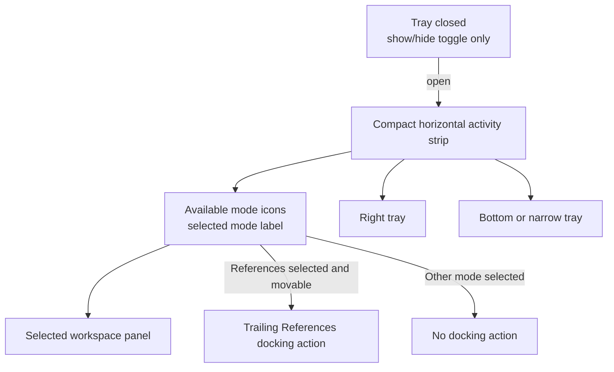
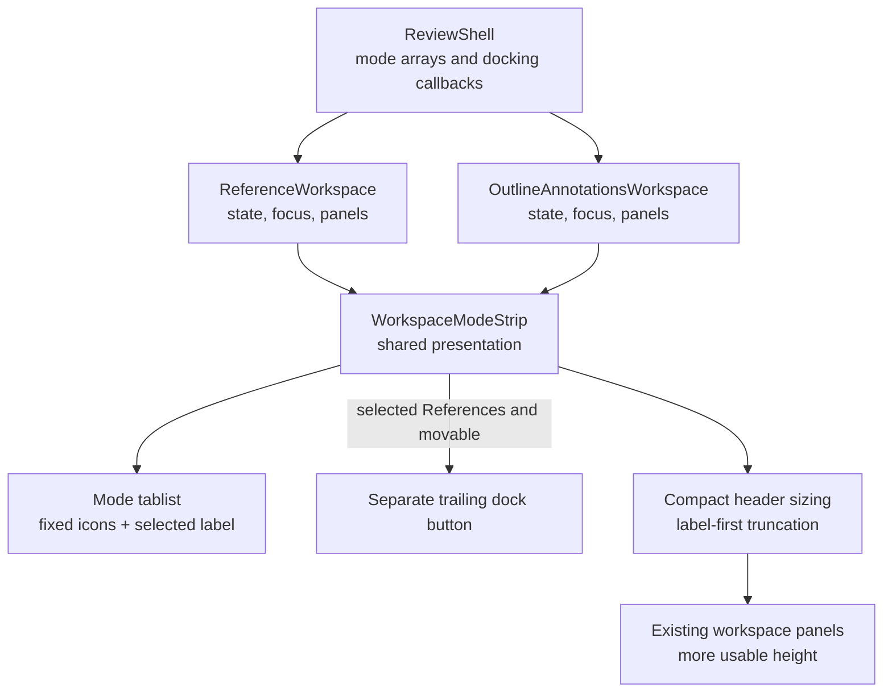

# Compact Workspace Tray Navigation - Plan

## Goal Capsule

- **Objective:** Replace the awkward full-width workspace mode bar with a compact navigation treatment that remains clean as available modes change.
- **Product authority:** This contract owns workspace mode navigation presentation and contextual References docking-action visibility across right, bottom, and narrow trays. Existing contracts remain authoritative for mode availability, tray placement, docking outcomes, panel behavior, and document state.
- **Execution profile:** One local code change with focused component, layout, Chromium, WebKit, and visual verification.
- **Stop conditions:** Preserve the Product Contract, existing workspace state behavior, and all mode/docking outcomes. Stop before any push, pull request, or CI trigger.
- **Tail ownership:** The current LFG run owns implementation, review fixes, local tests, visual inspection, and a local commit. Remote CI and merge automation are excluded by user direction.
- **Open blockers:** None.

---

## Product Contract

### Summary

Replace the full-width labeled workspace selector with one compact horizontal activity strip for every tray presentation.
The strip exposes available modes as icons, names the selected mode, and shows a separate References docking action only while References is selected and movable.

### Problem Frame

The workspace selector projects a dynamic set of modes.
It can show four modes in the full shared workspace, three when Outline is unavailable in the unified tray, two when Outline is unavailable in the tools-only tray, or a References-only presentation.

The current subtle selector surface fills the tray width while its content-sized controls remain centered.
That balance works with four modes but leaves conspicuous dead space and consumes a full navigation row as modes disappear.

### Key Decisions

- **Use a compact horizontal activity strip.** (session-settled: user-directed — chosen over an adaptive labeled selector, a vertical activity rail, and a current-mode dropdown: it reclaims header space while keeping every available mode one action away.) Governs R1-R6.
- **Use one navigation geometry in every tray presentation.** (session-settled: user-directed — chosen over a vertical right-side stack with a horizontal bottom translation: one horizontal model avoids teaching two spatial patterns.) Governs R6.
- **Keep the selected mode label visible.** (session-settled: user-directed — chosen over icons alone or labels revealed only on focus: the strip stays compact without relying entirely on icon recognition.) Governs R2, R4, R11.
- **Hide mode navigation with the closed tray.** (session-settled: user-directed — chosen over persistent all-mode or active-mode shortcuts: the closed reading surface should retain only its show/hide toggle.) Governs R7.
- **Make References docking contextual.** (session-settled: user-directed — chosen over an always-visible action, a compound References selector, or an action inside References content: docking belongs in the strip only while References is selected and movable.) Governs R9-R10.

### Requirements

**Compact mode navigation**

- R1. Every open workspace tray shall present mode navigation as a compact horizontal activity strip aligned to the tray's content edge.
- R2. The strip shall show one icon control for each currently available mode in canonical order and a visible text label for the selected mode.
- R3. The strip shall reserve no control or spacing for unavailable modes as the mode set changes.
- R4. At constrained widths, the selected-mode label shall truncate before any mode or docking target shrinks, disappears, or overlaps, while the full label remains available accessibly.
- R5. The strip shall avoid the full-width tinted selector surface and return any reclaimed header height to the selected workspace panel.
- R6. Right, bottom, and narrow tray presentations shall use the same horizontal control order and interaction model without restacking modes vertically.

**Visibility and continuity**

- R7. Closing a tray shall hide its activity strip and leave only the existing show/hide toggle, while reopening shall reveal the effective current mode and its strip.
- R8. Mode selection, dynamic mode removal, keyboard relationships, panel continuity, and focus fallback shall retain their existing outcomes as presentation changes.

**Contextual References docking**

- R9. A trailing References docking action shall appear only when References is selected and a placement change is available in the current presentation.
- R10. The docking action shall remain visually and semantically separate from mode selection, name its destination, and preserve open Reference Tabs and their reading state when invoked.

**Recognition and accessibility**

- R11. Every icon control shall have a distinct selected state, a visible focus state, an accessible name, and a concise pointer explanation consistent with its mode or action.
- R12. Keyboard users shall be able to traverse and activate the available mode controls in their rendered order and reach the contextual docking action when it is present.
- R13. Mode and docking controls shall retain comfortable pointer targets in every supported tray size and presentation.

### Actors

- A1. **Reviewer:** Reads a PDF while switching among Outline, Search, Annotations, and References as those modes are available.

### Key Flows

- F1. Open and navigate the workspace
  - **Trigger:** The workspace tray is closed.
  - **Actors:** A1.
  - **Steps:** The reviewer opens the tray from its edge toggle, sees the compact strip, and selects an available mode by icon.
  - **Outcome:** The selected panel appears and its name remains visible without a full-width labeled mode bar.
  - **Covers:** R1-R8, R11-R13.
- F2. Move the References surface
  - **Trigger:** References is selected and its current presentation offers a placement change.
  - **Actors:** A1.
  - **Steps:** The trailing docking action appears, the reviewer invokes it, and References moves to the named destination.
  - **Outcome:** The new tray presentation uses the same activity-strip model and preserves the open References state.
  - **Covers:** R6, R9-R13.
- F3. Adapt to a changing mode set
  - **Trigger:** Document capability or responsive composition changes which workspace modes are available.
  - **Actors:** A1.
  - **Steps:** Unavailable mode icons leave the strip, any required selection fallback occurs, and the remaining controls close the gap.
  - **Outcome:** The strip remains compact and focus stays on a valid control or panel destination.
  - **Covers:** R2-R4, R6, R8, R11-R13.

### Acceptance Examples

- AE1. Four-mode right workspace
  - **Given:** Outline, Search, Annotations, and References are available in the right workspace and Search is selected.
  - **When:** The tray opens.
  - **Then:** Four mode icons appear in canonical order, the strip names Search, and no References docking action appears.
  - **Covers:** R1-R3, R6-R9, R11-R13.
- AE2. Contextual References docking
  - **Given:** The right workspace is open and a References placement change is available.
  - **When:** The reviewer selects References.
  - **Then:** The selected label changes to References and the trailing move-to-bottom action appears without becoming part of the References mode target.
  - **Covers:** R2, R9-R13.
- AE3. Outline-free workspace
  - **Given:** Outline is confirmed unavailable for the current document.
  - **When:** The workspace presents three unified modes or two tools-only modes.
  - **Then:** Only those available icons appear, no empty mode slot remains, and selection and focus resolve to a valid remaining mode.
  - **Covers:** R2-R4, R6, R8, R11-R13.
- AE4. Closed and reopened tray
  - **Given:** An open tray has Annotations selected.
  - **When:** The reviewer closes and reopens it.
  - **Then:** Only the show/hide toggle remains while closed, and the reopened strip names Annotations with its mode selected.
  - **Covers:** R7-R8, R11-R13.
- AE5. Constrained narrow tray
  - **Given:** The narrow unified tray is open near its minimum supported width.
  - **When:** The available controls and selected label no longer fit at full intrinsic width.
  - **Then:** The selected label truncates first while every mode target and any applicable References docking action remain distinct and operable.
  - **Covers:** R4, R6, R9, R11-R13.
- AE6. Independently bottom-docked References
  - **Given:** References is the only mode in its independent bottom tray.
  - **When:** The tray opens.
  - **Then:** The strip shows the selected References icon and label with a separate move-to-right action and no space reserved for absent modes.
  - **Covers:** R1-R6, R9-R13.

### Scope Boundaries

- No changes to the available workspace modes, their canonical order, Outline discovery, responsive tray composition, or remembered placement.
- No changes to workspace panel content, mode-selection outcomes, Reference Tab lifecycle, or docking outcomes.
- Persistent mode shortcuts while a tray is closed are excluded by R7.
- No changes to the main PDF toolbar, workspace edge-toggle behavior, or navigation outside the workspace trays.
- No broader tray redesign beyond the compact activity strip and contextual References docking-action presentation.

### Dependencies

- Existing mode availability and responsive layout remain authoritative for which controls the strip renders and where the tray appears.
- Existing keyboard, focus-restoration, panel ownership, and docking callbacks remain authoritative for interaction outcomes.

<!-- ce-section: work-relationships -->
### How This Work Fits Together

- This plan owns the workspace mode selector's presentation and the visibility of its contextual References docking action.
  - **Shares** dynamic mode availability and focus continuity with `docs/plans/2026-08-11-003-feat-outline-aware-annotation-tray-plan.md`.
  - **Shares** tray placement and References docking outcomes with `docs/plans/2026-08-10-001-feat-dockable-reference-tray-plan.md`.
  - **Can proceed independently of** workspace panel-content changes because mode and docking outcomes remain unchanged.

### Sources and Research

- `CONCEPTS.md` defines the Main Reading Thread, Reference Tab, and workspace vocabulary used by this contract.
- `apps/web/src/review/reference-navigation-state.ts` defines the canonical workspace mode order.
- `apps/web/src/review/OutlineAnnotationsWorkspace.tsx` establishes dynamic tools-only mode sets and their keyboard traversal.
- `apps/web/src/review/ReferenceWorkspace.tsx` establishes shared mode selection, focus fallback, and current References docking controls.
- `apps/web/src/app/ReviewShell.tsx` establishes the current right, bottom, narrow, and outline-free mode combinations.
- `apps/web/src/review/WorkspaceEdgeRail.tsx` establishes the independent tray show/hide toggle.
- `apps/web/src/app/review-layout-annotations.css` establishes the current full-width centered selector surface.
- `apps/web/src/app/review-layout-responsive.css` establishes coarse-pointer target sizing and narrow-width adjustments.
- `docs/solutions/design-patterns/outline-aware-annotation-workspace-presentation.md` establishes dynamic mode projection and focus fallback.
- `docs/solutions/conventions/native-control-tooltip-contract.md` establishes accessible-name and native-tooltip requirements for icon controls.
- `docs/solutions/ui-bugs/reliable-compact-right-docked-reference-tabs.md` establishes compact-control sizing, truncation, and cross-browser geometry checks.
- `docs/solutions/architecture-patterns/adaptive-annotation-tray-framing.md` establishes mounted workspace continuity across right, bottom, and narrow presentations.
- `docs/plans/2026-08-10-001-feat-dockable-reference-tray-plan.md` remains authoritative for docking and responsive tray behavior.
- `docs/plans/2026-08-11-003-feat-outline-aware-annotation-tray-plan.md` remains authoritative for dynamic mode availability and fallback behavior.

---

## Planning Contract

### Key Technical Decisions

- KTD1. **Use one shared presentational activity-strip component.** `ReferenceWorkspace` and `OutlineAnnotationsWorkspace` will supply their existing mode arrays, selection callbacks, refs, and key handlers to a shared renderer. Each workspace will retain its current focus memory, panel ownership, and mode-removal fallback logic.
- KTD2. **Keep the existing tab interaction model.** The strip will retain `role="tablist"`, `role="tab"`, stable tab/panel IDs, `aria-controls`, roving `tabIndex`, and `horizontalTabFocusIndex`. Each tab will use a full accessible name and `title`, while only the selected tab renders its label visibly beside its icon.
- KTD3. **Derive the docking control from selected mode and effective placement.** `ReferenceWorkspace` will expose move-to-bottom only for selected References in a right presentation, move-to-right only for the selected one-mode independent bottom tray, and no docking control in the narrow unified bottom presentation where invoking a placement callback would not change the visible placement.
- KTD4. **Make controls fixed and the selected label shrinkable.** Mode icons and the docking action will remain non-shrinking compact targets. The selected label alone will use `min-width: 0`, overflow clipping, and ellipsis, so it yields first at narrow widths.
- KTD5. **Tie shared-panel positioning to the compact header height.** Replace the tools panel's hard-coded `53px` offset with the same header-height custom property used by the compact header. This lets reclaimed header height flow into panel content without a gap or overlap.
- KTD6. **Use existing icon vocabulary plus one outline glyph.** Search, Annotations, and References will keep their existing `ReviewIcon` glyphs; Outline will add Lucide's `ListTree` through the typed `ReviewIcon` map. Visual tests will validate recognition and balance rather than introducing a new icon system.

### High-Level Technical Design

The shell continues to determine which modes and callbacks exist. The workspace owners continue to determine selection, focus restoration, and panel state. The shared strip only renders the common geometry and accessibility contract, which prevents right, bottom, and narrow presentations from drifting without centralizing unrelated state.

### Assumptions

- The current `ReviewIcon` stroke language can distinguish all four modes when Outline uses `ListTree`; visual inspection may adjust only the glyph or size without changing strip behavior.
- The existing compact-control token and coarse-pointer minimum height are sufficient target-size authorities; the implementation may tune local gap and padding values during visual validation.
- The selected label can remain inside the selected tab without changing panel labelling because the tab keeps its stable ID and full `aria-label`.
- No `reference-workspace-layout.ts` state transition must change; visible docking availability can be derived at the presentation boundary.

### Implementation Constraints

- Keep canonical ordering in `reference-navigation-state.ts`; do not duplicate or reorder mode arrays in the shared strip.
- Do not remount the PDF viewer or workspace panel trees while changing the header presentation.
- Keep the docking action outside the tablist so arrow-key traversal remains mode-only and ordinary Tab reaches the contextual action.
- Remove superseded compound-segment and full-width selector CSS rather than layering new rules over it.
- Preserve destination-specific control names: `Move References to bottom` and `Move References to right`.

### Sequencing

1. Establish the shared strip and its metadata while retaining existing parent-owned refs and handlers.
2. Migrate both workspace headers and gate the References docking action by selected mode and effective placement.
3. Replace selector and header geometry, including the coupled tools-panel offset.
4. Update component/layout contracts, then browser semantics and geometry, then intentional visual baselines.

---

## Implementation Units

### U1. Shared workspace activity strip

- **Goal:** Add the reusable icon-and-selected-label renderer and compact layout primitives without moving workspace state ownership.
- **Requirements:** R1-R6, R11-R13; KTD1-KTD2, KTD4-KTD6.
- **Files:** `apps/web/src/review/WorkspaceModeStrip.tsx` (new), `apps/web/src/review/ReviewIcon.tsx`, `apps/web/src/app/review-layout-annotations.css`, `apps/web/src/app/review-layout-responsive.css`, `apps/web/test/reference-workspace.test.tsx`, `apps/web/test/review-layout.test.tsx`, `apps/web/test/control-tooltips.test.ts`.
- **Approach:** Centralize mode labels and icon names in the strip component. Render a compact, content-width tablist with one fixed icon per available mode and a shrinkable visible label only inside the selected tab. Accept callback/ref/key-handler inputs so owners keep their behavior. Replace full-width, centered, tinted, and compound-segment rules with fixed-target and label-first shrink rules. Introduce a shared compact-header height variable and use it for the tools overlay offset.
- **Test scenarios:** Two-, three-, four-, and one-mode arrays render only available controls in canonical input order; the selected tab is the only visibly labelled mode; every icon tab has aligned accessible and tooltip names; the active label owns ellipsis behavior; compact/coarse-pointer target rules remain present.
- **Verification:** Run the focused Vitest command in the Verification Contract and inspect generated markup/CSS assertions for icon names, labels, roles, target sizing, and removed legacy rules.
- **Dependencies:** None.

### U2. Workspace integration and contextual References docking

- **Goal:** Adopt the shared strip in both workspace owners while preserving interaction and showing docking only for selected, visibly movable References.
- **Requirements:** R2-R3, R6-R12; F1-F3; AE1-AE4, AE6; KTD1-KTD3.
- **Files:** `apps/web/src/review/ReferenceWorkspace.tsx`, `apps/web/src/review/OutlineAnnotationsWorkspace.tsx`, `apps/web/src/app/ReviewShell.tsx`, `apps/web/test/reference-workspace.test.tsx`, `test/acceptance/production-flow.spec.ts`.
- **Approach:** Pass each owner's current modes, selected mode, refs, arrow handler, and activation callback into the shared strip. Replace the tabs header and independent References title header with the same strip. Compute the trailing action from selected References plus the current right/independent-bottom presentation; omit it for all other selected modes and narrow unified presentation. Keep shell mode arrays, layout state, panel markup, IDs, focus memory, and docking callbacks unchanged.
- **Test scenarios:** Non-References selections never show a docking button; selecting References in the right tray shows move-to-bottom; independently bottom-docked References shows move-to-right; narrow unified References shows no no-op docking action; arrow keys traverse only rendered modes; Tab can leave the tablist for the docking action; closing/reopening and outline removal preserve effective selection and valid focus.
- **Verification:** Run focused Vitest plus Chromium and WebKit `production-flow.spec.ts`; assert controls through roles, accessible names, `aria-selected`, focus, and settled state instead of tab text content or stale node identity.
- **Dependencies:** U1.

### U3. Responsive and visual regression coverage

- **Goal:** Prove the compact strip remains clean and stable across supported tray geometry and update only intentional image baselines.
- **Requirements:** R1-R7, R9-R13; AE1-AE6; KTD4-KTD5.
- **Files:** `test/acceptance/production-flow.spec.ts`, `test/acceptance/review-visual.spec.ts`, affected files under `test/acceptance/review-visual.spec.ts-snapshots/`.
- **Approach:** Replace text-content and compound-segment measurements with accessible-name and rendered-geometry assertions. Verify fixed icon/dock targets, content-width alignment, selected-label truncation, compact header height, and panel clearance. Refresh the existing wide annotation, narrow annotation, wide bottom References, wide split tools/References, wide right References, and narrow unified References scenes only after semantic tests pass.
- **Test scenarios:** Four-, three-, two-, and one-mode presentations have no empty slots; constrained width truncates the selected label before controls; right-bottom-right and wide-narrow-wide transitions preserve selection, References tabs, reading state, and panel clearance; closed trays show only their existing edge toggle.
- **Verification:** Build the installed web app, run Chromium and WebKit acceptance coverage, run visual tests, and inspect every changed snapshot for intentional differences.
- **Dependencies:** U1, U2.

---

## Verification Contract

| Gate | Command | Proves |
|---|---|---|
| Focused component, layout, and tooltip contracts | `pnpm exec vitest run apps/web/test/reference-workspace.test.tsx apps/web/test/review-layout.test.tsx apps/web/test/control-tooltips.test.ts` | U1-U2 markup, roles, labels, icon tooltips, dynamic modes, and CSS shape |
| Type safety | `pnpm typecheck` | Shared component props, icon names, mode unions, and integration callbacks compile |
| Installed web build | `pnpm build:web` | Production assets compile before browser and visual verification |
| Chromium behavior | `pnpm exec playwright test test/acceptance/production-flow.spec.ts` | Mode selection, contextual docking, focus, continuity, responsive geometry, and constrained width in Chromium |
| WebKit behavior | `pnpm exec playwright test --config playwright.webkit.config.ts test/acceptance/production-flow.spec.ts` | The same semantic outcomes survive WebKit intrinsic sizing and timing |
| Visual regression | `pnpm test:visual` | Intended activity-strip appearance across named wide, bottom, split, right, and narrow scenes |

Remote CI, PR creation, and CI babysitting are not part of this run. A failing local gate must be fixed or reported before the local commit.

---

## Definition of Done

- R1-R13 and AE1-AE6 are represented by focused component, browser, or visual assertions.
- U1 is done when one shared strip renders the dynamic mode set with selected-only visible text, full accessible names/tooltips, stable tab semantics, and compact label-first sizing.
- U2 is done when both workspace owners preserve their current focus/state behavior and References docking is absent until References is selected and a real visible placement change exists.
- U3 is done when right, bottom, narrow, closed, outline-free, and constrained-width states pass in Chromium and WebKit and all changed snapshots have been inspected.
- Typecheck, production build, focused Vitest, Chromium acceptance, WebKit acceptance, and visual verification pass locally.
- No changes exist in workspace mode availability/order, layout state reducers, PDF viewer lifecycle, panel content behavior, Reference Tab state, or edge-toggle behavior.
- Superseded compound-selector styles, stale assertions, abandoned code paths, and experimental artifacts are absent from the final diff.
- The completed diff is locally committed and ready for remote CI, but no remote branch, PR, or CI workflow is started.
