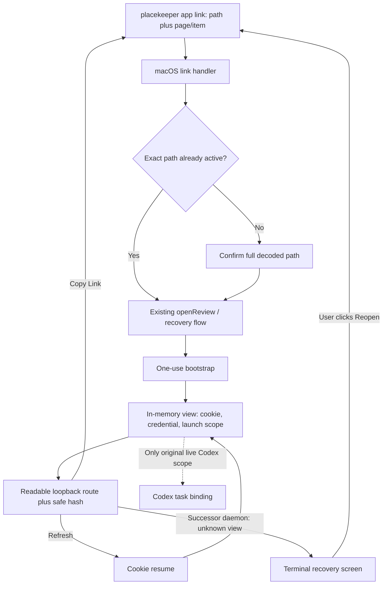

# Reloadable Placekeeper Review Links - Plan

## Goal Capsule

- **Objective:** Give a local PDF a readable Placekeeper link, let a live review tab survive refresh, let the same literal browser URL reopen the current PDF after a daemon replacement, and preserve useful page or saved-item locations without serializing Placekeeper app state.
- **Operating model:** Placekeeper is a demand-started local utility for one cooperative macOS user. A few coworkers may install it on their own Macs, but no Placekeeper service or state is shared between machines.
- **Execution profile:** Standard four-unit change. Keep live authority in the current daemon, reuse existing security and task-binding primitives, and use a fixed production loopback origin plus an explicit fresh-open recovery path after daemon replacement.
- **Stop conditions:** Stop for a product decision only if macOS cannot deliver the complete custom URL to either the existing applet bridge or a small AppKit fallback, Chromium and WebKit cannot reload a live top-level review with an in-memory view cookie, or the packaged updater cannot hand the fixed loopback port to the replacement daemon without weakening rollback behavior.
- **Tail ownership:** The final executor owns installed macOS link smoke tests, one Chromium and one WebKit refresh/history flow, documentation, and removal of any abandoned bridge experiment.

---

## Product Contract

### Summary

Placekeeper will have two related addresses.
The durable address is a readable app link such as `placekeeper:///Users/name/Paper%20One.pdf#v=1&page=12`.
The live browser address remains on a fixed production numeric-loopback origin; its path shows the PDF and its fragment tracks the meaningful reading location.

A live tab can refresh while its original daemon, review session, and in-memory view record still exist.
If that process-lifetime state is gone but a replacement daemon is listening on the fixed origin, the same literal URL becomes a terminal recovery screen. A user-initiated **Reopen in Placekeeper** action opens the canonical app link through the normal path-confirmation and `openReview` flow, using the current PDF bytes and encoded page or portable-item location.
No registry, serialized session, always-running service, service worker, credential migration, unsaved-viewer-state migration, or task-binding migration is added.

**Product Contract revision:** R6-R9 and R16 distinguish live resume from post-restart reopen. Live resume preserves the exact in-memory view and its original still-valid Codex binding. Post-restart reopen recovers only the canonical path plus safe fragment, always creates a fresh non-Codex view, and never adopts the old cookie, credential, session, task binding, or unsaved viewer state.

### Problem Frame

The current launch URL uses an ephemeral port, a session UUID, and a one-use capability in the fragment.
The browser exchanges that capability for a memory-only credential and then removes it.
This is a good initial-launch boundary, but a hard refresh loses the credential and cannot replay the capability.

The browser URL also does not identify the PDF or its page in a useful way.
As a result, refresh, bookmarking, copying page 12, and returning to a saved annotation are more fragile than they need to be for a local reading tool.

### Key Decisions

- **Refresh has two explicit modes.** (session-settled: user-directed — live resume preserves process-memory authority; post-restart reopen preserves only document and location.) Governs R6-R9, R16.
- **The filesystem path identifies the document.** (session-settled: user-directed — chosen over an opaque registry or historical-byte identity: readable links matter more than surviving moves or replacements.) Governs R1, R4, R5.
- **The app link is the portable durable address, and the browser origin is stable on one Mac.** (session-settled: user-directed — a fixed loopback port lets a replacement daemon turn an old browser URL into a safe reopen screen without persisting app state.) Governs R2, R11, R15, R16.
- **Location links are page-first.** (session-settled: user-approved — chosen over serializing viewer state: page and PDF-portable saved-item identity provide the useful continuity.) Governs R10-R14.
- **Links never select a Codex task.** (session-settled: user-approved — chosen over encoding or reconstructing context authority: only the original live Codex launch may own that context.) Governs R8, R9.
- **Unfamiliar paths require confirmation.** (session-settled: user-directed — chosen over silent custom-scheme opening: a web page must not open an arbitrary local file without the reader seeing its path.) Governs R3.

### Actors

- A1. **Reader:** Opens, refreshes, navigates, bookmarks, or copies a review link.
- A2. **Placekeeper host:** Handles the macOS link, owns the live daemon/session/view records, and serves the browser UI on loopback.
- A3. **Bound Codex task:** Receives context only through its existing explicit launch and live lease.

### Requirements

**Readable address and native launch**

- R1. A canonical Placekeeper link must encode the PDF's absolute local path and a versioned meaningful location, and later releases must continue to accept version 1 links.
- R2. Opening a canonical link must invoke the installed Placekeeper app and demand-start its daemon when needed.
- R3. The host must show the full decoded path before opening an unfamiliar link; an exact path already owned by an active review may reopen without another prompt.
- R4. A link must use the current file at that path through the existing `openReview` and Protected Recovery flow.
- R5. A missing, unreadable, or non-PDF path must fail by name without searching for or substituting another file.

**Live refresh and Codex scope**

- R6. A top-level browser or Codex review URL must survive refresh while its original daemon, session, and view record remain live.
- R7. Refresh must use process-memory authorization and must not expose a reusable credential in the visible or copied URL.
- R8. Refreshing a Codex-launched view must preserve its original binding only while the existing task lease remains valid.
- R9. Opening or copying a canonical app link must never create, infer, or transfer a Codex binding.

**Location and history**

- R10. Version 1 links must support a one-based page and may add one Placekeeper-owned saved-item ID that is recoverable from the current PDF.
- R11. Copy Link must emit the canonical app link; targets without a portable saved-item ID must copy a page link and explain the fallback.
- R12. Settled ordinary reading must replace the current browser-history entry, while a successful explicit jump must push one entry.
- R13. A missing saved item must open its page fallback and report that the exact item was unavailable.
- R14. Links must not encode zoom, pan, scroll offset, selection, search query, open panels, reference tabs, or other viewer state.

**Surface and lifecycle boundaries**

- R15. The custom scheme is a macOS contract; Codex and VS Code may keep their existing explicit launch adapters where direct scheme navigation is unavailable.
- R16. Production must reuse one fixed numeric-loopback origin across daemon and app replacements. When an otherwise canonical readable route names an unknown, ended, or revoked view, it must expose only a terminal recovery screen whose user-initiated canonical app link reopens the current PDF and safe location through the normal confirmation flow. This fresh view is non-Codex and must not recover any prior credential, session, task binding, or unsaved viewer state. If no daemon is listening, the browser may fail normally until Placekeeper is started and the reader refreshes again.

### Key Flows

- F1. Open a canonical link
  - **Trigger:** A1 opens `placekeeper:///...#v=1&page=12`.
  - **Actors:** A1 and A2.
  - **Steps:** macOS starts or activates Placekeeper; A2 parses the link without reading the file; A1 confirms an unfamiliar path; A2 reuses the normal open/recovery path and launches an unbound browser view at the requested location.
  - **Outcome:** The current PDF opens at the requested page without creating Codex authority.
  - **Covered by:** R1-R5, R9, R10, R15.
- F2. Refresh a live review
  - **Trigger:** A1 refreshes the readable loopback review route.
  - **Actors:** A1, A2, and A3 when the original view is Codex-bound.
  - **Steps:** A2 serves a generic shell; the shell exchanges its HttpOnly view cookie for the view's existing memory-only browser credential; the UI restores `location.hash` after the document is ready.
  - **Outcome:** The same live review and still-valid original Codex scope return without replaying the bootstrap capability.
  - **Covered by:** R6-R9, R16.
- F3. Copy and revisit a location
  - **Trigger:** A1 settles on a page, follows an explicit jump, or uses Copy Link.
  - **Actors:** A1 and A2.
  - **Steps:** The browser replaces or pushes the safe fragment; Copy Link combines that fragment with the server-provided canonical app-link base; a later open resolves the page or portable item against the current PDF.
  - **Outcome:** Page links are reliable, saved Placekeeper items restore when present, and all other targets degrade to a page.
  - **Covered by:** R10-R14.
- F4. Refresh after daemon replacement
  - **Trigger:** A1 refreshes an old readable loopback route after the original daemon, session, or view authority is gone.
  - **Actors:** A1 and A2.
  - **Steps:** The replacement daemon strictly validates the descriptive route without touching the file and serves an inert recovery shell; the shell validates the fragment, defaults malformed locations to page 1, and exposes a user-gesture-backed canonical app link; A1 chooses Reopen in Placekeeper; the native flow confirms the now-unfamiliar path and performs a normal fresh open.
  - **Outcome:** The current PDF reopens at the recoverable location in a fresh non-Codex browser view, with no authority or unsaved state adopted from the old daemon.
  - **Covered by:** R1-R5, R9-R10, R16.

### Acceptance Examples

- AE1. **Covers R6-R8.** **Given** a live Codex-launched review, **when** the reader refreshes the tab, **then** the same review and location return and the original binding remains available only if its lease is still valid.
- AE2. **Covers R1-R5, R9.** **Given** no running daemon, **when** the reader opens an unfamiliar page-12 app link, **then** Placekeeper starts, confirms the decoded path before file access, opens the current PDF at page 12 after approval, and creates no Codex binding.
- AE3. **Covers R3, R4.** **Given** an exact path already has an active review, **when** the reader opens another link for that path, **then** Placekeeper may reuse the review without another path prompt and still follows the existing current-file and recovery rules.
- AE4. **Covers R10-R14.** **Given** ordinary scrolling and an explicit annotation jump, **when** each navigation settles, **then** scrolling replaces the fragment, the jump pushes once, and Back returns to the prior meaningful page without restoring incidental UI state.
- AE5. **Covers R10, R11, R13.** **Given** a saved Placekeeper item no longer exists in the current PDF, **when** its link opens, **then** Placekeeper opens the encoded page fallback and explains that exact restoration failed.
- AE6. **Covers R16.** **Given** the original daemon or view record is gone and a replacement daemon owns the fixed origin, **when** the old loopback route is refreshed, **then** no session or authority is reconstructed; the terminal screen offers the canonical path/location link, and choosing Reopen in Placekeeper confirms the path and creates a fresh non-Codex view. If Placekeeper is stopped, the browser may show its normal connection failure until it is started and refreshed again.

### Scope Boundaries

- No durable document catalog, session registry, recent-file trust list, service worker, or always-running daemon.
- No credential, live session, unsaved viewer state, or Codex binding migration across daemon/app restart or update; only path and safe location are recoverable from the URL.
- No hostile same-user-process defense beyond the existing local daemon boundary. Web-origin isolation, path confirmation, and secret-free URLs remain required.
- No link survival across file moves, renames, machines, or historical versions.
- No exact v1 deep links for foreign PDF annotations, outlines, search results, or references unless the target is represented by a saved Placekeeper item; these otherwise copy page links.
- No change to VS Code embedded refresh behavior.

### Sources and Research

- `apps/service/src/server/http-server.ts` owns the one-use bootstrap exchange, cap scrubbing, loopback request validation, assets, and authenticated APIs.
- `apps/service/src/sessions/session-broker.ts` owns `openReview`, launch scopes, document generations, Protected Recovery, and browser credentials.
- `apps/service/src/context/task-binding-registry.ts` owns Codex activation and lease validity; this plan does not create a second task-binding model.
- `packaging/macos/finder-bridge.applescript`, `packaging/macos/build-app.ts`, and `packaging/macos/launcher.mjs` are the existing native delivery and daemon-launch seams.
- `apps/web/src/review/navigation-coordinator.ts` and `apps/web/src/app/ProductionReviewApp.tsx` are the existing navigation transaction and production UI owners.
- Apple documents custom scheme registration through `CFBundleURLTypes` and current AppKit delivery through `NSApplicationDelegate.application(_:open:)`.
- The History API can change only same-origin URLs, and URL fragments are not sent in HTTP requests. The browser bar therefore remains loopback HTTP while Copy Link emits `placekeeper://`.

---

## Planning Contract

### Key Technical Decisions

- KTD1. **Use one strict app-link, readable-route, and location codec.** Canonical links use `placekeeper:///absolute/percent-encoded/path.pdf#v=1&page=<one-based>` with optional `&item=<portable-id>`. Readable routes use `/r/<uuid-view-id><the-same-canonical-encoded-path>`. Authority and query are empty. Shared pure codecs reject malformed or noncanonical encoding, encoded separators, dot/empty segments, control characters, invalid UUIDs, duplicate or unknown fragment keys, invalid pages, and oversized input. The service supplies the web UI with a prevalidated app-link base; browser code validates the safe fragment and never concatenates an unchecked route or hash. Governs R1, R5, R10, R14, R16.
- KTD2. **Keep native admission lightweight and pre-read.** Add `CFBundleURLTypes` and first spike a raw `GURLGURL` handler in the existing applet. If cold or warm delivery fails, replace only that bridge with a small AppKit `application(_:open:)` executable. The bridge forwards one opaque URL argument. The launcher asks the daemon whether the decoded lexical path exactly matches an active review, shows a native confirmation for any other path, and then submits the same link to the existing `openReview` path. The daemon rechecks the active-path exemption when it commits the open and returns `confirmation-required` if the exemption disappeared. No durable trust index, continuation protocol, pinned byte snapshot, or prompt queue is introduced. Governs R2-R5, R15.
- KTD3. **Bind packaged production to one fixed numeric-loopback origin.** Tests, local-service helpers, and isolated development may still request port 0. The production daemon alone passes one exported constant through `PlacekeeperHost` to the HTTP listener, never falls back to a random port, and fails explicitly on a foreign collision. The existing lifecycle lock and updater retirement/readiness sequence remain authoritative; after a successful replacement the candidate daemon stays running on the same origin. The fixed origin makes an old literal route reachable but conveys no authority. Governs R6, R16.
- KTD4. **Use one stable in-memory view authorization for live resume only.** The successful bootstrap creates a random non-secret view ID, one random HttpOnly host-only `SameSite=Strict` cookie scoped to `/r/<view-id>/`, and one browser credential stored in the daemon's view record. The readable route mirrors the absolute path after the view prefix, for example `/r/<view-id>/Users/name/Paper%20One.pdf#v=1&page=12`. A same-origin `POST /r/<view-id>/resume` validates exact Host and Origin, matches the cookie and route path to the view record, and returns that view's browser credential to JavaScript memory. Static shell and asset bytes may be served without authorization because every document, mutation, scope, and context API still requires the browser credential. A view has no independent TTL. Its authority disappears on explicit revocation, session closure, or daemon exit and is never adopted by a successor daemon. Governs R6-R9, R16.
- KTD5. **Bind a refreshed Codex view to its original live binding.** Each view record stores the existing immutable launch scope: session ID, document generation, surface, browser credential, and the server-only browser-capability hash already used to activate a Codex binding. Heartbeat and scope status require that discriminator, so an old view becomes document-only instead of attaching to a later task on the same review. An app-link view has no binding discriminator and always uses a non-Codex surface. This adds one process-memory field, not a new binding registry, token family, or browser-visible task identifier. Governs R8, R9, R15.
- KTD6. **Use the URL fragment as the only reloadable location state.** After authentication and document readiness, the UI parses `location.hash` and enters `NavigationCoordinator`. Ordinary settled page changes call `replaceState`; successful explicit jumps call `pushState` once; `popstate` restores without adding an entry. Existing Placekeeper Back and Forward controls use the same browser-history adapter rather than a parallel reducer stack. Copy Link uses the current safe fragment. `history.state` may cache entry index and length for control state but is never required for restoration after reload. Governs R6, R10-R14.
- KTD7. **Make successor-daemon recovery inert until a user gesture.** A syntactically valid readable route whose view record is absent, ended, revoked, or path-mismatched receives a no-store, frame-denied terminal shell. It ignores and clears the stale view cookie, exposes no document/context API, performs no file metadata access, and never invokes native UI automatically. Its primary action is a canonical `placekeeper:` anchor so browser external-protocol handling supplies a user gesture and the existing native pre-read confirmation remains authoritative. Invalid routes return 404. Governs R3-R5, R9, R16.
- KTD8. **Keep v1 deep links and embedded surfaces narrow.** Page links always work. Exact semantic restoration is limited to a saved Placekeeper item whose portable ID is recoverable from the PDF; everything else copies and restores a page. VS Code keeps its current explicit CLI/bootstrap adapter and does not gain custom-scheme or webview-refresh behavior in this plan. Governs R10, R11, R13, R15.

### High-Level Technical Design

The daemon remains shared and demand-started, but packaged production uses a fixed numeric-loopback port so replacement daemons can answer old descriptive routes.
The view record is a small adapter around the current bootstrap credential, not a serialized review snapshot.
The route path is descriptive and must match the view record, but the cookie and browser credential remain the authorization boundary.

The initial bootstrap fragment still carries the one-use capability.
Its server-side launch scope also carries the requested safe location until exchange.
Top-level Finder, browser, and Codex launches without a requested location seed `v=1&page=1`; VS Code keeps its existing embedded startup path.
After exchange, the browser uses `location.replace` to move to the readable cap-free route and applies the requested location hash.

### System-Wide Impact

- **Lifecycle:** A session owns zero or more in-memory views. Closing the session revokes their credentials and deletes their records. Daemon exit discards all authority; a successor can recover only the URL's document/location description through a fresh open.
- **Security:** Static UI code is public on loopback. PDF bytes, state, mutations, Codex scope, and context remain behind the existing credential checks. Exact Host/Origin validation and restrictive headers remain unchanged.
- **Task scope:** Codex continuity is a property of the original live view credential, not the file path, hash, active tab, or current session-wide task.
- **Navigation:** Browser history becomes the reloadable page/item history. Existing reducer history remains internal undo/navigation state and must not be treated as durable app state.
- **Packaging:** The installed app gains one scheme declaration and one URL-delivery bridge while retaining Finder PDF opening, CLI launches, signing, and offline assets.

### Sequencing and Risks

1. Freeze the codec before registering the scheme so every boundary serializes the same address.
2. Prove installed cold and warm URL delivery before building the remaining native prompt flow.
3. Add the minimal view record, fixed production origin, strict readable-route codec, and terminal successor recovery before browser history so reload tests have one stable host contract.
4. Add page/item hash restoration and Copy Link through `NavigationCoordinator`, then close with installed and cross-engine smoke tests.

The main feasibility risk is the existing AppleScript applet's handling of warm custom-URL events.
The bounded fallback is a small AppKit bridge, not a different product architecture.
Cookie-disabled or private browser modes may make refresh unavailable; the UI must fail closed and leave the canonical app link selectable when the server can respond.
The fixed port can be occupied by an unrelated local process; startup and update must fail explicitly rather than killing it or silently choosing another port. A stopped Placekeeper still yields the browser's normal connection failure until the daemon is started and the route is refreshed.

---

## Implementation Units

### U1. Freeze the canonical link and location codec

- **Goal:** Establish one small, human-readable address contract shared by the service and web UI.
- **Requirements:** R1, R5, R10-R14; KTD1, KTD6, KTD8.
- **Dependencies:** None.
- **Files:**
  - Add `packages/core/src/placekeeper-link.ts` and `packages/core/test/placekeeper-link.test.ts` for the fragment and app-link value types, parse/serialize logic, and golden vectors.
  - Add a service wrapper in `apps/service/src/links/placekeeper-link.ts` for Node file-URL conversion, absolute PDF-path validation, strict readable-route parsing, and server-generated app-link bases.
  - Add focused service tests in `apps/service/test/placekeeper-link.test.ts`.
- **Approach:**
  1. Define the canonical triple-slash grammar and the page-plus-optional-item fragment from KTD1.
  2. Use Node's WHATWG URL and file-URL APIs for filesystem conversion. Percent-decode once and reject alternate spellings rather than accepting aliases.
  3. Keep path handling out of the browser. The browser receives only a canonical app-link base and works with the shared safe fragment type.
  4. Classify pages and saved Placekeeper portable IDs as linkable. Classify all other current navigation targets as page-only.
  5. Parse `/r/<uuid><canonical encoded absolute PDF path>` with the same path rules. Do not stat, resolve, normalize, or read the file while constructing a successor recovery response.
- **Test Scenarios:**
  1. Round-trip spaces, Unicode, `#`, `?`, `%`, and a literal `%2F` filename without double-decoding.
  2. Reject a host, userinfo, port, query, relative path, encoded slash, malformed escape, duplicate key, unknown version/key, invalid page, control character, and oversized URL.
  3. Keep accepted v1 links as permanent compatibility vectors even if a later release emits another version.
  4. Prove every semantic link includes a valid page fallback and no session, generation, task, credential, zoom, geometry, or panel state.
  5. Reject wrong/noncanonical readable view IDs and paths, dot or empty segments, encoded slash/backslash, queries, malformed escapes, and oversized routes; round-trip spaces, Unicode, `#`, `?`, and `%` filenames.
- **Verification:** Focused core and service codec tests pass with one canonical serialization for each accepted value.

### U2. Add packaged macOS URL delivery and confirmation

- **Goal:** Open the canonical app link through the installed Placekeeper bundle without adding a durable trust or document registry.
- **Requirements:** R2-R5, R9, R15; F1; AE2, AE3; KTD2.
- **Dependencies:** U1.
- **Files:**
  - Update `packaging/macos/build-app.ts` and `packaging/macos/packaging.test.ts` with one `CFBundleURLTypes` declaration for `placekeeper`.
  - Update `packaging/macos/finder-bridge.applescript` with the raw GURL handler, or replace it with one small AppKit bridge only if the installed spike fails.
  - Update `packaging/macos/launcher.mjs`, `apps/service/src/cli/open-command.ts`, `apps/service/src/host/launch-control.ts`, `apps/service/src/host/placekeeper-host.ts`, `apps/service/src/host/service-daemon.ts`, and `apps/service/src/sessions/session-broker.ts` with the `open-link` path.
  - Extend `apps/service/test/open-command.test.ts`, `apps/service/test/launch-host.test.ts`, and `packaging/macos/smoke-installed.ts`.
- **Approach:**
  1. Forward the complete URL as one opaque argument. Do not parse or interpolate it in AppleScript.
  2. Ask the daemon for a path-only active-review classification that performs no filesystem access.
  3. For an unfamiliar path, show the complete decoded path as labeled, selectable, non-editable native text. Provide Open and Cancel buttons, give Cancel initial focus, map Escape to Cancel, preserve keyboard traversal, and expose the same contract to VoiceOver in either bridge implementation.
  4. Add bounded control request/response variants for lexical preflight and launcher-confirmed opening. Recheck active-path ownership when committing the open; if it vanished, return `confirmation-required` instead of reading the file.
  5. After approval, call the existing PDF approval, digest, `openReview`, and Protected Recovery flow. Carry the requested safe location in the launch scope until bootstrap exchange.
  6. Treat each OS event as an independent request. Do not add shared continuations, a prompt queue, file-handle pinning, or new recovery semantics.
- **Test Scenarios:**
  1. Installed cold and warm links preserve the encoded path and page-12 location into the bootstrap scope without showing the file picker; U4 owns final viewer restoration.
  2. Cancel an unfamiliar path and assert zero PDF reads and zero session creation; approve it and assert the normal validation path runs. Verify keyboard and VoiceOver behavior with a long Unicode path.
  3. Reopen an exact active path without another prompt. Confirm a lexical alias or symlink spelling because it is not an exact active path.
  4. Report missing, unreadable, and non-PDF paths without substitution; preserve the requested location through an existing Protected Recovery choice.
  5. Preserve Finder double-click, CLI, Codex, VS Code, signing, and distribution behavior.
- **Verification:** Packaging tests, service launch tests, and installed cold/warm smoke tests pass with exactly one shipping URL bridge.

### U3. Add live view refresh, a stable production origin, and fresh reopen recovery

- **Goal:** Let a live top-level tab resume through daemon memory and let an old literal route reach a safe fresh-open screen after daemon replacement.
- **Requirements:** R6-R9, R16; F2; AE1, AE6; KTD4, KTD5.
- **Dependencies:** U1.
- **Files:**
  - Add a small view registry beside `apps/service/src/sessions/session-broker.ts`, or add the record directly there if that keeps lifecycle ownership clearer.
  - Update `apps/service/src/server/http-server.ts`, `apps/web/src/production-entry.tsx`, and `apps/web/src/app/session-api.ts` with readable review startup, cookie issuance, `resume`, public static shell/assets, and stale-view responses.
  - Thread an optional HTTP port through `apps/service/src/host/placekeeper-host.ts`; keep port 0 as the test/dev default and pass one exported fixed port from `apps/service/src/host/service-daemon.ts` in packaged production.
  - Extend updater/lifecycle coverage around `apps/service/src/host/upgrade-coordinator.ts`, `apps/service/src/cli/daemon-command.ts`, and `packaging/macos/packaging.test.ts` as needed to prove same-origin replacement and explicit collision failure.
  - Extend `apps/service/test/session-security.test.ts`, `apps/service/test/task-binding-registry.test.ts`, `apps/service/test/live-context-service.test.ts`, and `apps/service/test/codex-live-context.integration.test.ts`.
  - Add refresh coverage to the focused `test/acceptance/reloadable-links.spec.ts`.
- **Approach:**
  1. On successful bootstrap exchange, create the KTD4 view record and set its cookie. Seed page 1 for top-level launches without an app-link location, then use a same-origin replacement navigation to the cap-free readable route.
  2. Give top-level browser, Finder, and Codex launches the generic shell/resume startup. Keep `?embed=vscode` on its current embedded bootstrap and session-scoped asset startup.
  3. Serve only a generic shell and static assets before resume. Keep all existing PDF, command, save, scope, and context endpoints credential-gated.
  4. On `resume`, require POST, exact Host and Origin, the matching route path, the matching view cookie, a live session/generation, and the stored browser credential.
  5. Return the stored credential to JS memory and start the current daemon's UI bundle. Do not rotate the cookie or credential and do not write the record to disk.
  6. Delete views when their session closes or they are explicitly revoked. Let daemon exit delete all views naturally. Do not add an independent TTL or adopt views in a replacement daemon.
  7. Carry the original Codex bootstrap capability hash into its active binding and view record. Require that server-only discriminator for browser scope and heartbeat calls; native app-link views remain unbound.
  8. Bind packaged production to KTD3's fixed numeric-loopback port. Preserve ephemeral-port defaults for tests and local helpers; never fall back if the production port is occupied.
  9. Distinguish a syntactically valid unknown/revoked route from a known live view. The former ignores old authorization, clears its matching stale cookie, and serves only canonical recovery metadata plus inert UI. It must not call `openReview`, inspect the file, consult recovery drafts, or infer an active review/task.
  10. Require a user click on the canonical `placekeeper:` action to begin the existing native link flow. Do not auto-navigate to the custom scheme and do not add a public HTTP endpoint that summons native confirmation.
- **Test Scenarios:**
  1. Refresh a browser view repeatedly and restore the same session after the one-use bootstrap has expired.
  2. Refresh a Codex view and retain its original valid scope. Expire task A, bind task B to the same review generation, and prove A's old view becomes document-only instead of observing or renewing B.
  3. Open a native app-link view for the same document as a Codex view and prove it remains unbound.
  4. Reject missing, wrong-view, wrong-path, wrong-Origin, wrong-Host, ended-session, and stale-daemon resume attempts.
  5. Copy the visible loopback URL to another browser profile without its cookie and prove no PDF or context API is available.
  6. Verify shell/assets contain no PDF data, capability, task ID, credential, or canonical source content beyond the path already present in the address.
  7. Start a successor daemon on the same production origin, refresh an old route with its stale cookie, and prove it gets only the recovery shell; after the user-approved canonical link open, prove the new view is non-Codex and restores only the safe location.
  8. Prove an unrelated fixed-port listener causes explicit daemon/readiness failure with no random-port fallback or process killing, while a normal transactional update leaves the candidate serving the same origin.
- **Verification:** Focused service and Codex integration tests pass, plus one Chromium and one WebKit hard-refresh flow.

### U4. Project page/item location into history and Copy Link

- **Goal:** Keep the readable URL aligned with meaningful reading and emit a durable app link without serializing the viewer.
- **Requirements:** R6, R10-R14, R16; F3; AE4-AE6; KTD1, KTD4, KTD6, KTD8.
- **Dependencies:** U1, U3.
- **Files:**
  - Update `apps/web/src/review/navigation-coordinator.ts` to own initial hash restore, settled replace/push decisions, and `popstate` restoration.
  - Update `apps/web/src/app/ProductionReviewApp.tsx`, `apps/web/src/app/ReviewShell.tsx`, and `apps/web/src/review/AnnotationPeek.tsx` for Copy Link status and fallback explanations.
  - Add focused tests under `apps/web/test/` for URL projection, history, Copy Link, and saved-item fallback.
  - Extend `test/acceptance/reloadable-links.spec.ts` and update `docs/privacy-and-recovery.md` plus installation/troubleshooting documentation.
- **Approach:**
  1. Parse the initial hash after the authenticated document generation and main navigation adapter are ready.
  2. Replace the current fragment after settled ordinary page changes. Push once only after an explicit navigation succeeds.
  3. Handle `popstate` by applying the now-current fragment without writing another entry. Route the existing Placekeeper Back and Forward controls through the same adapter, using `history.state` only to cache index/length for enabled state. Move focus to the restored destination, announce its page or item, and converge the URL on the page actually shown if restoration fails.
  4. Resolve a portable saved-item ID against the current PDF. If it is missing or discovery fails, navigate to the encoded page and show a concise notice.
  5. Put one Copy Link action in the review chrome for the current location and one on a saved-item row/peek for that exact item. Route both through one duplicate-safe command with pending, polite success, and clipboard-failure states; failure shows the generated link in a selectable read-only field with Retry and returns focus to the invoking action.
  6. For unsaved items, foreign annotations, outlines, search results, and references not represented by a saved Placekeeper item, copy the page and explain why.
  7. On a server-reachable missing/revoked view, focus a terminal stale-review heading, explain that the live view cannot resume, and offer a primary user-gesture-backed Open in Placekeeper anchor plus secondary Copy Link around a selectable canonical address. Build the link only from the strictly validated readable route and safe fragment, without reading the file. Never auto-launch, invoke native UI from a public HTTP request, or reconstruct old authority. If no daemon owns the fixed port, the ordinary browser error remains until Placekeeper is started and the user refreshes.
- **Test Scenarios:**
  1. Initial load and hard refresh restore the page from the hash without waiting for `popstate`.
  2. Ordinary page changes do not grow browser history; successful explicit jumps add exactly one entry; Back and Forward restore without recursive entries.
  3. A saved portable item restores exactly. A removed item, foreign annotation, outline, search result, and ordinary reference restore or copy as page-only with the correct notice.
  4. Scrolling away from a semantic item replaces the fragment with the settled page. Zoom, pan, selection, panels, and workspace state never change the link.
  5. Copy Link has honest pending, success, and clipboard-failure states and never includes a bootstrap capability, browser credential, view cookie, task identifier, or session identifier.
  6. Chromium and WebKit refresh, Back, Forward, and Copy Link retain URL/view convergence.
  7. Chromium and WebKit show no external-protocol attempt before the recovery action is clicked; malformed fragments fall back to page 1, and the Copy/selectable fallback remains usable when embedded-browser scheme launch is unavailable.
- **Verification:** Focused web tests and the two-engine acceptance flow pass; documentation describes process-lifetime refresh and canonical reopen behavior accurately.

---

## Verification Contract

| Gate | Commands / evidence | Required outcome |
|---|---|---|
| Codec and native link | `pnpm vitest run packages/core/test/placekeeper-link.test.ts apps/service/test/placekeeper-link.test.ts apps/service/test/open-command.test.ts packaging/macos/packaging.test.ts` | One app-link/readable-route grammar, hostile-input rejection, pre-read confirmation, and scheme metadata pass. |
| Refresh and task scope | `pnpm vitest run apps/service/test/session-security.test.ts apps/service/test/task-binding-registry.test.ts apps/service/test/live-context-service.test.ts apps/service/test/codex-live-context.integration.test.ts` | Live resume, stale-route fresh recovery, fixed-origin lifecycle, and Codex/link scope separation pass without durable authority. |
| Navigation and Copy Link | Focused Vitest files added under `apps/web/test/` | Initial restore, replace/push/pop, page fallback, portable-item restore, and clipboard states pass. |
| Chromium acceptance | `pnpm playwright test test/acceptance/reloadable-links.spec.ts` | Initial launch, hard refresh, history, Copy Link, and stale-view behavior pass. |
| WebKit acceptance | `pnpm playwright test --config playwright.webkit.config.ts test/acceptance/reloadable-links.spec.ts` | The same critical flow passes without engine-specific timing sleeps. |
| Existing contracts | `pnpm typecheck`, `pnpm test:service`, `pnpm test:review`, `pnpm test:u7-host`, and `pnpm build` | Existing service, review, packaging, Codex, VS Code, and production bundles remain valid. |
| Installed macOS smoke | `pnpm package:macos`, `pnpm validate:distribution`, and `pnpm smoke:installed` with cold/warm `placekeeper:///...#v=1&page=12` probes | Launch Services delivers the full URL, the native confirmation boundary works, Finder behavior remains intact, and page 12 opens. |

The two-engine acceptance file should exercise one representative live review rather than duplicate the full production-flow matrix.
Installed smoke should use fixture paths with spaces and Unicode and must not record credentials or task identifiers.

---

## Definition of Done

### Global

- Requirements R1-R16 and acceptance examples AE1-AE6 have automated or installed-smoke evidence.
- `placekeeper:///absolute/path.pdf#v=1&page=12` starts or focuses Placekeeper, confirms unfamiliar paths before file access, and opens the current PDF through the existing recovery flow.
- A live browser or Codex tab refreshes repeatedly while its daemon/session/view remains alive, with no capability replay, URL secret, Web Storage, service worker, serialized registry, or token rotation family.
- After daemon/app replacement on the fixed origin, refreshing the same literal URL exposes only a terminal document/location recovery action; accepting the native confirmation opens current bytes in a fresh non-Codex view and never revives the old credential, session, binding, or unsaved viewer state.
- The readable loopback path names the PDF, the fragment restores the page or portable saved item, and Copy Link emits the canonical app link.
- Ordinary reading replaces browser history, successful explicit jumps push once, and Back/Forward converge the URL and visible page.
- App links and link-launched views stay non-Codex. Only an original live Codex view can retain its still-valid existing binding after refresh.
- Daemon exit, app update, and missing/revoked views do not reconstruct state. A listening successor offers the explicit canonical reopen path; a stopped daemon may produce a normal connection failure until Placekeeper is started and the page is refreshed.
- The installed app passes cold/warm URL delivery, Finder regression, one Chromium flow, one WebKit flow, typecheck, build, and grouped service/review tests.
- No abandoned native bridge, refresh experiment, duplicate parser, debug logging, or unused state-machine type remains in the final diff.

### Per Unit

- **U1:** One codec family owns accepted app-link, readable-route, and safe-fragment values, and page/portable-item classification is explicit.
- **U2:** Exactly one installed URL bridge ships, confirmation is pre-read, and the existing open/recovery behavior remains authoritative.
- **U3:** One small daemon-memory view record enables live resume and preserves the original launch scope plus one server-only binding discriminator; explicit revocation, session end, or daemon exit removes it, while the fixed successor origin can recover only the URL's document/location description.
- **U4:** `NavigationCoordinator` owns browser-location transactions, Copy Link is honest, and Chromium/WebKit behavior matches the contract.
