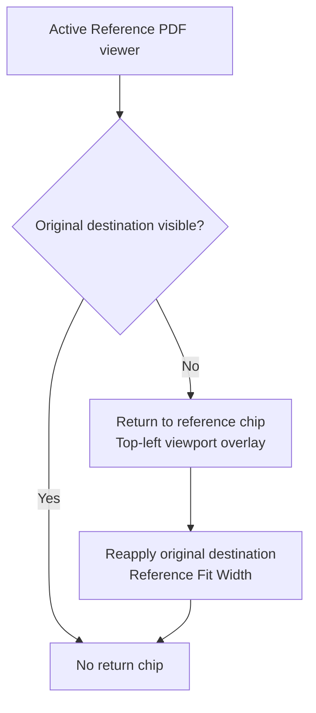
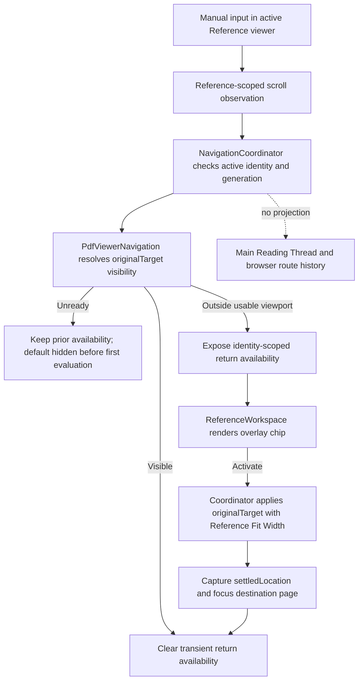

# Reference Destination Return - Plan

## Goal Capsule

- **Objective:** Let a reviewer recover a Reference Tab's original author-encoded destination after exploratory scrolling without recreating the tab or disturbing the Main Reading Thread.
- **Means:** Add a viewer-local return affordance whose visibility is derived by the viewer adapter and whose navigation is committed by `NavigationCoordinator` (KTD1-KTD4).
- **Product authority:** This contract owns the viewer-local return control, its visibility, and its outcome across bottom, right, and narrow References layouts. Existing contracts remain authoritative for Reference Tab navigation and lifecycle, Reference Fit Width, workspace placement, and the Warm Neutral visual language.
- **Execution profile:** Code implementation with local unit, Chromium, WebKit, and visual proof. GitHub billing failures are infrastructure status, not substitutes for local verification.
- **Tail ownership:** The implementing workflow owns implementation, review fixes, local browser validation, commit, push, pull request creation, and CI triage.
- **Open blockers:** None.

---

## Product Contract

### Summary

Add a compact, icon-only Return to reference button to the active Reference viewer when its original destination is no longer visible.
Activating the chip returns to the canonical destination using Reference Fit Width and removes the chip once that destination is visible again.

### Problem Frame

Reference Tabs support nonlinear reading by preserving an independently scrollable and zoomable view.
Exploratory scrolling can move the original citation, figure, equation, or passage out of view, leaving no direct way to recover the destination that created the tab.
The reviewer must then hunt through the document or close and reopen the reference, adding friction to a workflow intended to protect reading context.

### Key Decisions

- **Use a viewer-local return chip.** (session-settled: user-directed — chosen over an inline selected-tab action and active-tab reselection: it keeps the selected tab compact and places recovery where the drift occurs.) Governs R1-R4, R8-R10.
- **Return to the semantic destination.** (session-settled: user-directed — chosen over restoring the exact opening viewport or preserving the current zoom: Reference Fit Width remains reliable across layout changes.) Governs R5-R7.
- **Reveal the chip only after the origin leaves view.** (session-settled: user-directed — chosen over revealing it after any movement or keeping it always visible: the viewer gains no persistent chrome while already centered.) Governs R2-R3.
- **Preserve a stable keyboard-focus outcome.** (session-settled: user-approved — chosen over letting focus disappear with the self-removing chip: keyboard recovery must end at a usable Reference-viewer target.) Governs R9.

### Requirements

**Visibility and presentation**

- R1. A ready active Reference viewer shall expose a compact, icon-only Return to reference button anchored at the top-left of its usable viewport, with `Return to reference` preserved as its accessible name and hover tooltip.
- R2. The chip shall remain hidden while the active tab's original author-encoded destination is visible in the usable Reference viewport.
- R3. The chip shall appear when manual scrolling moves that destination out of the usable viewport and disappear when the destination becomes visible again.
- R4. The chip shall stay anchored to the viewport during continued scrolling without moving the Reference Tab strip, consuming viewer height, or scrolling with PDF content.

**Return behavior**

- R5. Activating the chip shall return the active Reference Tab to its original author-encoded destination using Reference Fit Width.
- R6. A successful return shall become the tab's new settled view so switching away and back preserves the returned framing.
- R7. Returning shall not modify the tab's original destination, create Main Reading Thread history, move the Main Reading Thread, consume the tab, or change other open Reference Tabs.

**Interaction and adaptation**

- R8. The button shall match the Warm Neutral visual language with a recognizable origin icon, compact neutral styling, a truthful accessible tooltip, visible focus, and a comfortable coarse-pointer target.
- R9. Activating the chip by pointer, touch, or keyboard shall not strand focus when the chip disappears; focus shall move to a stable target in the active Reference viewer.
- R10. The chip shall remain legible, reachable, and clear of scrollbars and essential PDF interactions in bottom, right, and narrow References layouts.

### Key Flows

- F1. Explore and return
  - **Trigger:** A reviewer scrolls until the original destination leaves the active Reference viewport.
  - **Actors:** Reviewer.
  - **Steps:** The chip appears at the viewport's top-left; the reviewer activates it; Placekeeper returns to the original destination using Reference Fit Width; the chip disappears and focus settles at a stable viewer target.
  - **Outcome:** The reviewer recovers the reference origin without recreating the tab or disturbing the Main Reading Thread.
  - **Covers R1-R10.**
- F2. Return through ordinary navigation
  - **Trigger:** The original destination is out of view and the chip is visible.
  - **Actors:** Reviewer.
  - **Steps:** The reviewer scrolls back until the original destination is visible.
  - **Outcome:** The chip disappears without changing the current zoom or settled view beyond the reviewer's ordinary navigation.
  - **Covers R2-R4.**

### Acceptance Examples

- AE1. Return after exploratory scrolling
  - **Given:** A ready Reference Tab opened to a destination on page 18 and the reviewer has scrolled until that destination is no longer visible.
  - **When:** The reviewer activates Return to reference.
  - **Then:** The viewer reapplies the page 18 destination with Reference Fit Width, remembers the returned framing, hides the chip, and leaves the Main Reading Thread unchanged.
  - **Covers R2-R7.**
- AE2. Small movement keeps the origin visible
  - **Given:** The reviewer scrolls within the active Reference Tab but the original destination remains visible.
  - **When:** The viewer settles after the movement.
  - **Then:** No return chip appears.
  - **Covers R2-R3.**
- AE3. Layout changes while away from the origin
  - **Given:** The origin is out of view and References moves between bottom, right, or narrow presentation.
  - **When:** The workspace finishes recomposing.
  - **Then:** The chip remains reachable and a return reconstructs the destination for the current usable width rather than restoring stale viewport geometry.
  - **Covers R4-R5, R8, R10.**
- AE4. Keyboard activation removes the chip
  - **Given:** Keyboard focus is on Return to reference.
  - **When:** The reviewer activates it successfully.
  - **Then:** The destination becomes visible, the chip disappears, and focus moves to a stable target in the active Reference viewer.
  - **Covers R5, R8-R9.**

### Scope Boundaries

- No Back or Forward history inside Reference Tabs and no new bookmark, pin, or saved-destination system.
- No changes to Reference Tab identity, selection, switching, Send to main, Close, or consumption behavior.
- No changes to Main Reading Thread navigation or meaningful-history semantics.
- No inline selected-tab return action, active-tab reselect shortcut, persistent viewer toolbar, or exact-opening-viewport restoration.

### Dependencies / Assumptions

- Reference Tab state continues to retain the original author-encoded destination separately from its mutable settled view.
- Reference Fit Width remains the authoritative framing policy for applying the original destination.
- Planning must identify a reliable destination-visibility signal within the usable Reference viewport; this does not change the product rule in R2-R3.

### Sources / Research

- `docs/plans/2026-08-09-002-feat-reference-navigation-workspace-plan.md` defines Reference Tab navigation, independent view state, and Main Reading Thread isolation.
- `docs/plans/2026-08-11-001-feat-reference-fit-width-plan.md` defines destination framing.
- `docs/plans/2026-08-10-002-feat-compact-reference-tab-actions-plan.md` defines the selected-tab action pattern and compact-layout constraints.
- `docs/plans/2026-08-10-001-feat-dockable-reference-tray-plan.md` defines bottom, right, and narrow References layouts.
- `docs/plans/2026-08-09-001-feat-warm-neutral-review-design-language-plan.md` defines the visual language.
- `CONCEPTS.md` defines Reference Tab, Reference Fit Width, and Main Reading Thread terminology.
- `apps/web/src/review/reference-navigation-state.ts` retains each tab's original destination and settled view.
- `apps/web/src/review/navigation-coordinator.ts` already applies the original destination with Reference Fit Width as the semantic fallback when a settled view cannot be restored.

---

## Planning Contract

The Product Contract is unchanged from the `ce-brainstorm` requirements-only artifact.

### Key Technical Decisions

- KTD1. **Keep `NavigationCoordinator` as the only navigation transaction authority.** Add a public Reference-return operation that uses the existing operation token and document-generation guards, waits for layout settlement, applies the active tab's immutable `originalTarget` with `reference-fit-width`, captures the resulting location, refreshes only that tab's `settledLocation`, and focuses the returned page. The operation must not invoke Main navigation, Main reducer actions, `projectExplicitLocation`, or `ReviewLocationHistoryPort`. This extends the ownership rule in `apps/web/src/review/navigation-coordinator.ts` and the Main-only route policy in `docs/plans/2026-08-17-1104-feat-reloadable-placekeeper-review-links-plan.md`. Governs R5-R7, R9.
- KTD2. **Make semantic target visibility a read-only viewer-adapter capability.** Extend `PdfViewerNavigation` with `visible`, `outside`, and `unavailable` results. The adapter resolves a `PdfNavigationTarget` and tests its semantic anchor against the same effective viewport, rotation, crop, scale, scrollbar, runway, and tolerance rules used by navigation postconditions. A valid live target whose page is unmounted is `outside`, because it cannot occupy the usable viewport. Invalid, stale, replaced, disposed, or not-yet-usable document geometry is `unavailable`. React components must not duplicate PDF geometry. Governs R2-R5, R10.
- KTD3. **Treat return availability as transient, identity-scoped presentation state.** Manual Reference-viewer input arms a reference-specific observation channel; the subsequent Reference scroll or layout settlement asks the coordinator to evaluate the active tab's original target. Programmatic open, switch, same-reference navigation, return, document replacement, close, and Send to main clear or recompute the signal without masquerading as manual drift. The state records the active tab identity, availability, and whether a return is pending. A pending return keeps the chip visible but disabled and busy until verified success, failure, or supersession. None of this state enters `ReferenceTab`, browser history, saved review state, or a URL. Governs R2-R3, R6-R7, R9.
- KTD4. **Render the chip beside the portal host as an overlay, not as viewer content or layout.** `ReferenceWorkspace` owns the icon-only control, places it immediately before `reference-panel__viewport` in DOM order, and positions it over that viewport inside a local stacking context. The overlay must not change the viewer's client box, scroll extent, portal identity, tab rail, or global layer scale. It uses the existing Warm Neutral control tokens, a central `ReviewIcon`, `Return to reference` as both its accessible name and truthful `title`, and the existing coarse-pointer sizing contract. Governs R1, R4, R8-R10.
- KTD5. **Use the restored PDF page as the durable focus target.** After the new settled location is verified, the coordinator emits one polite `Returned to reference.` status message and then uses `focusAtDestination`. Failed or superseded operations do not emit success. On failure, the chip becomes enabled again, retains focus, and uses the existing Reference failure announcement. Governs R5, R8-R9.

### High-Level Technical Design

The adapter owns semantic PDF geometry, the coordinator owns stateful navigation and cancellation, and the workspace owns presentation. `ProductionReviewApp` wires these ports and holds only the transient identity-scoped availability snapshot needed to render the active viewer.

### Assumptions

- Manual exploratory scrolling includes wheel, touch, scrollbar pointer gestures, and scrolling keys directed at the Reference PDF viewport. A generic unscoped viewer `scroll` event is not sufficient because current Main scroll handling projects browser-route state.
- Invalid, stale, replaced, disposed, or not-yet-usable document geometry is an unavailable state. It keeps a never-established chip hidden, but preserves an already-true availability flag until visibility is verified or the relevant tab or document lifecycle invalidates it. A valid live target on an unmounted page is outside and reveals the chip after manual drift.
- A successful semantic return may remove the chip before the activation callback completes. The coordinator-owned page focus therefore remains the authoritative post-activation focus path.
- A return can span layout settlement and viewer application. During that interval, the visible disabled and busy chip prevents repeat activation from superseding its own transaction.
- Existing viewer virtualization mounts a target page after an explicit return request, while passive visibility checks fail closed for an unmounted target page.

### Sequencing and Constraints

1. Expose and verify semantic visibility in the adapter before wiring application state.
2. Add the reference-scoped manual observation path and coordinator transaction without changing Main scroll or URL projection.
3. Add the overlay UI only after the application can publish identity-safe availability and complete a return.
4. Add installed-style acceptance and visual coverage after unit tests prove geometry, cancellation, state isolation, and focus.

The implementation must preserve the one reusable Reference viewer tree, the immutable `originalTarget` / mutable `settledLocation` split, and the route policy that only Main reading state is projected into the readable URL fragment.

### Risks and Mitigations

- **False positives from programmatic scrolling:** Scope the intent latch to user input in the Reference viewport and clear or recompute it at every coordinator-owned lifecycle transition.
- **Geometry disagreement:** Reuse the adapter's effective viewport and transform functions rather than comparing only page numbers or React element bounds.
- **Stale async completion:** Recheck operation token, document generation, and active tab identity after every layout or viewer await before publishing availability or settled state.
- **Overlay hit-through:** Establish a Reference-panel stacking context and prove the chip wins `elementFromPoint` within its occupied rectangle without changing global PDF layer values.
- **Engine-specific reconciliation:** Use fresh role locators and semantic visibility assertions in browser tests. Avoid fixed sleeps and exact centering coordinates.

---

## Implementation Units

### U1. Add semantic Reference-target visibility and manual-scroll observation

- **Goal:** Give application code a reliable, read-only signal that the active Reference destination has left the usable viewport after user-directed scrolling.
- **Requirements:** R2-R4, R10; AE2-AE3; KTD2-KTD3.
- **Files:**
  - `apps/web/src/pdf/viewer-navigation.ts`
  - `apps/web/src/pdf/viewer-navigation-adapter.ts`
  - `apps/web/src/pdf/ReferencePdfViewport.tsx`
  - `apps/web/src/pdf/PdfWorkspace.tsx`
  - `apps/web/src/app/App.tsx`
  - `apps/web/test/viewer-navigation.test.ts`
  - `apps/web/test/viewer-interaction-events.test.ts`
- **Approach:**
  1. Add a read-only target-visibility method to `PdfViewerNavigation` and implement it with the adapter's existing target resolution, effective viewport, page geometry, transform, and tolerance primitives.
  2. Define visibility by whether the semantic target anchor is inside the usable viewport. Return outside for a valid live target on an unmounted page. Return unavailable for invalid, unresolved, not-yet-usable, replaced, or disposed document state.
  3. Add a Reference-specific user-intent signal at the portaled viewport boundary for wheel, touch/pointer scrollbar use, and scrolling keys. Pair that intent with Reference document scroll activity without forwarding it through Main's generic scroll-to-history path.
  4. Dispose all new observation subscriptions with the existing Reference navigation lifecycle.
- **Test Scenarios:**
  1. XYZ, fit-page, fit-horizontal, fit-vertical, and fit-rectangle destinations resolve visibility from their semantic anchors.
  2. Cropped or rotated pages, classic-scrollbar client boxes, viewport-edge tolerance, and layout runway geometry use the same usable viewport as navigation.
  3. A valid live target on an unmounted page reports outside. Invalid, wrong-generation, not-yet-usable, replaced, or disposed targets report unavailable.
  4. Wheel, touch/pointer, scrollbar, and keyboard scrolling in the Reference viewport produce a Reference observation; programmatic movement and Main scrolling do not.
- **Verification:** The focused adapter and interaction tests pass without changing existing navigation postconditions or Main scroll events.

### U2. Add coordinator-owned availability and return transactions

- **Goal:** Compute return availability for the correct active tab and restore its original semantic destination without touching Main routing or history.
- **Requirements:** R2-R7, R9; F1-F2; AE1-AE4; KTD1-KTD3, KTD5.
- **Dependencies:** U1.
- **Files:**
  - `apps/web/src/review/navigation-coordinator.ts`
  - `apps/web/src/review/reference-navigation-state.ts`
  - `apps/web/src/app/ProductionReviewApp.tsx`
  - `apps/web/test/navigation-coordinator.test.ts`
  - `apps/web/test/reference-navigation-state.test.ts`
  - `apps/web/test/production-review-app.test.tsx`
- **Approach:**
  1. Add coordinator dependencies for publishing transient `{ tabIdentity, available }` presentation state and clearing it during Reference lifecycle changes. Keep the reducer's tab shape unchanged.
  2. Add a Reference-scroll observation entry point that verifies generation and active identity, queries U1 for `originalTarget`, and publishes availability only for the same live tab.
  3. Add the return operation defined by KTD1. Reuse layout settlement and the existing Reference Fit Width application path, then capture and dispatch the verified settled location.
  4. Mark the matching chip disabled and busy while return is pending. Clear availability only after verified success or verified origin visibility. On failure, restore an enabled recovery affordance, emit the existing Reference failure announcement, and avoid a stale commit.
  5. Reset or recompute availability on open, switch, same-reference navigation, close, Send to main, workspace reflow, Reference controller disposal, and document replacement.
- **Test Scenarios:**
  1. Manual drift reveals availability only when the active tab's original target is outside the usable viewport; manual return into view clears it.
  2. Activation applies the exact immutable `originalTarget` with `reference-fit-width`, captures the actual location, updates only `settledLocation`, emits `Returned to reference.`, and then focuses the destination page.
  3. The return does not call Main navigation, mutate Main history, push or replace browser location history, move another Reference Tab, or rewrite `originalTarget`.
  4. Repeated pointer or keyboard activation is unavailable while the matching return is pending. Failure preserves the existing tab and restores a focused, retryable affordance. A tab switch, close, Send to main, document replacement, or newer navigation supersedes stale observation and return completions without a success announcement.
  5. Switching away and back restores the successful returned framing from the new settled location.
- **Verification:** Focused coordinator, reducer, and application wiring tests pass with explicit negative assertions against Main navigation and `ReviewLocationHistoryPort`.

### U3. Render the adaptive Return to reference overlay

- **Goal:** Present the return action as a compact, accessible, viewer-local control in every References layout without altering viewer geometry.
- **Requirements:** R1, R4, R8-R10; AE3-AE4; KTD4-KTD5.
- **Dependencies:** U2.
- **Files:**
  - `apps/web/src/review/ReferenceWorkspace.tsx`
  - `apps/web/src/app/ReviewShell.tsx`
  - `apps/web/src/app/ProductionReviewApp.tsx`
  - `apps/web/src/review/ReviewIcon.tsx`
  - `apps/web/src/app/review-layout-annotations.css`
  - `apps/web/src/app/review-layout-responsive.css`
  - `apps/web/test/reference-workspace.test.tsx`
  - `apps/web/test/review-layout.test.tsx`
  - `apps/web/test/control-tooltips.test.ts`
- **Approach:**
  1. Thread identity-safe availability and an activation callback through the existing production shell to `ReferenceWorkspace`.
  2. Render a native icon-only button immediately before the active viewport host and overlay it over that host only for a ready active tab whose matching availability is true. Use `Return to reference` as its accessible name and title with a central origin/locate icon. Reflect the pending state with focus-preserving accessible disabled and busy semantics.
  3. Establish local positioning and stacking on `reference-panel` so the chip remains top-left, clear of scrollbars, clickable above PDF content, and outside layout measurement.
  4. Reuse Warm Neutral surface, border, radius, typography, focus-visible, and coarse-pointer tokens. Do not add a persistent toolbar or selected-tab action.
- **Test Scenarios:**
  1. The control is absent for loading, error, empty, inactive, mismatched-tab, and origin-visible states.
  2. The icon-only native button exposes the truthful accessible name and title `Return to reference`, a decorative icon, visible keyboard focus, and an announced pending state without accepting repeat activation.
  3. Bottom, right, and narrow layouts retain the same viewer dimensions and keep the chip reachable and clear of native scrollbars.
  4. The chip's occupied rectangle receives hit testing instead of an underlying PDF link, and reverse-tabbing from focused PDF content reaches the visible chip before focus leaves the active Reference viewer.
- **Verification:** Component, layout, tooltip, and CSS-contract tests pass, including coarse-pointer sizing.

### U4. Prove the complete flow in Chromium, WebKit, and visual layouts

- **Goal:** Demonstrate that real exploratory scrolling reveals the control and that semantic return preserves Reference and Main navigation contracts across engines and layouts.
- **Requirements:** R1-R10; F1-F2; AE1-AE4; KTD1-KTD5.
- **Dependencies:** U1-U3.
- **Files:**
  - `test/acceptance/production-flow.spec.ts`
  - `test/acceptance/review-harness/visual-scenarios.tsx`
  - `test/acceptance/review-visual.spec.ts`
  - `test/acceptance/__screenshots__/`
- **Approach:**
  1. Extend the real reference-chain acceptance flow with user-like wheel and keyboard scrolling rather than direct synthetic scroll offsets alone.
  2. Assert semantic target visibility, Reference Fit Width geometry, settled restoration after a tab switch, focus landing, and automatic chip removal.
  3. Snapshot the visible overlay in wide bottom, wide right, and narrow References presentations after building production assets.
  4. Keep route assertions explicit: the Main page, zoom, scroll state, Back/Forward availability, and readable URL fragment remain unchanged throughout Reference return.
- **Test Scenarios:**
  1. Small exploratory movement that leaves the origin visible never reveals the chip.
  2. Wheel or keyboard movement that hides the origin reveals it; ordinary scrolling back clears it without changing zoom.
  3. Activation returns with Reference Fit Width, survives switch-away-and-back, removes the chip, and focuses the destination page.
  4. Reflow between bottom, right, and narrow while drifted preserves a reachable overlay and reconstructs against the new usable width.
  5. A PDF link geometrically beneath the chip does not receive the chip activation.
- **Verification:** Targeted Chromium, targeted WebKit, and updated-then-clean visual runs pass against rebuilt web assets.

---

## Verification Contract

All substantive gates run locally. A GitHub Actions billing refusal is reported as external CI infrastructure and does not downgrade, replace, or invalidate local results.

| Gate | Command | Proves |
|---|---|---|
| Fixtures | `pnpm fixtures:pdf` | Generated reference fixtures match the current viewer and acceptance harness. |
| Focused unit and component tests | `pnpm exec vitest run apps/web/test/viewer-navigation.test.ts apps/web/test/viewer-interaction-events.test.ts apps/web/test/navigation-coordinator.test.ts apps/web/test/reference-navigation-state.test.ts apps/web/test/reference-workspace.test.tsx apps/web/test/review-layout.test.tsx apps/web/test/production-review-app.test.tsx apps/web/test/control-tooltips.test.ts` | Geometry, intent scoping, transaction isolation, lifecycle reset, presentation, focus, and tooltip contracts pass. |
| Type safety | `pnpm typecheck` | New ports, coordinator dependencies, and shell props are consistent. |
| Production web build | `pnpm build:web` | The installed-style browser and visual suites use current production assets. |
| Chromium acceptance | `pnpm exec playwright test test/acceptance/production-flow.spec.ts --grep "returns an explored reference"` | Real scrolling, return, settled restoration, hit testing, focus, and Main route isolation pass in Chromium. |
| WebKit acceptance | `pnpm exec playwright test --config playwright.webkit.config.ts test/acceptance/production-flow.spec.ts --grep "returns an explored reference"` | The same semantic flow passes without engine-specific timing sleeps. |
| Visual update | `pnpm exec playwright test --config playwright.visual.config.ts test/acceptance/review-visual.spec.ts --grep "Reference return chip" --update-snapshots` | Intended wide-bottom, wide-right, and narrow reference-chip baselines are recorded after inspection. |
| Visual clean rerun | `pnpm exec playwright test --config playwright.visual.config.ts test/acceptance/review-visual.spec.ts --grep "Reference return chip"` | The reviewed baselines reproduce with no unexpected diff. |
| Full local CI-equivalent | `pnpm test:ci` | Unit, type, build, Chromium, WebKit, visual, and distribution gates pass together on the completed branch. |

Browser tests must use fresh locators after React reconciliation, semantic visibility assertions instead of exact pixel centering, and event-driven waits instead of fixed sleeps. Visual snapshots are inspected before acceptance.

---

## Definition of Done

- The active Reference viewer reveals Return to reference only after user-directed scrolling moves its original semantic destination outside the usable viewport.
- Activation reapplies the immutable original destination with Reference Fit Width, commits the captured settled location, focuses the returned page, and removes the control.
- Ordinary scrolling back to the origin clears the control without changing zoom or creating a navigation transaction.
- Main Reading Thread state, browser URL/history, other Reference Tabs, and the tab's original destination remain unchanged.
- Bottom, right, and narrow presentations preserve viewer geometry, usable hit targets, Warm Neutral styling, scrollbar clearance, and keyboard focus visibility.
- Stale, failed, unready, replaced, closed, switched, and superseded operations cannot publish availability or commit navigation for the wrong tab or document.
- U1 is done when semantic visibility and manual Reference intent pass their adapter and interaction tests.
- U2 is done when coordinator and application tests prove successful, failed, and superseded return transactions plus Main route isolation.
- U3 is done when component, layout, tooltip, hit-testing, focus, and coarse-pointer contracts pass.
- U4 is done when targeted Chromium, WebKit, and inspected visual runs pass on production assets.
- `pnpm typecheck`, the focused verification set, and `pnpm test:ci` pass locally. Any GitHub billing-only failure is documented separately from code correctness.
- The final diff contains no abandoned experimental paths, duplicate visibility geometry, unscoped Reference scroll-to-Main routing, debug instrumentation, or unrelated refactors.
