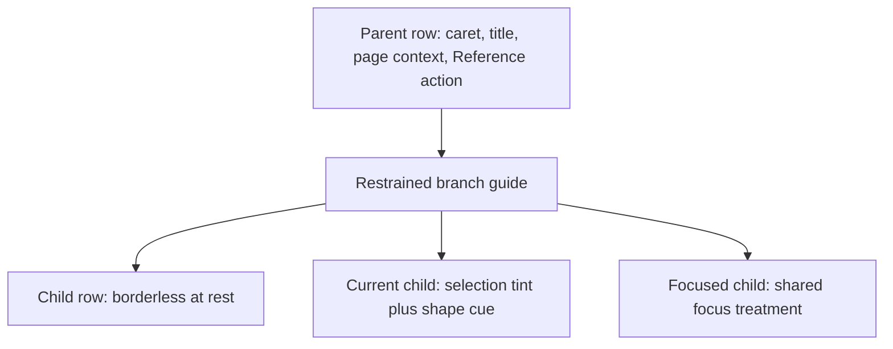

# Quiet Outline Tree - Plan

## Goal Capsule

- **Objective:** Make the Outline tab read as one compact document hierarchy by removing persistent row boxes and regularizing parent-child spacing while preserving its navigation behavior.
- **Product authority:** The confirmed Quiet Tree direction governs hierarchy, row rhythm, disclosure-control presentation, and responsive acceptance coverage. Existing outline navigation and workspace behavior remain authoritative.
- **Product Contract preservation:** Unchanged from the confirmed `ce-brainstorm` contract; planning adds implementation detail without reopening product choices.
- **Open blockers:** None.
- **Execution profile:** Code change with focused unit, Chromium, WebKit, coarse-pointer, and visual verification.
- **Tail ownership:** `ce-work` returns control to the invoking LFG pipeline for simplification, review, shipping, and PR monitoring.

---

## Product Contract

### Summary

Replace the card around every outline entry with a quiet tree whose hierarchy comes from consistent indentation, restrained branch guides, and state-only surfaces. Use Placekeeper's standard disclosure caret in a centered control area with comfortable spacing.

### Problem Frame

Outline entries currently receive the same bordered, rounded card treatment as annotation and search rows. Nested lists also introduce their own indentation and vertical gap, so the space between a parent, its first child, and later siblings can feel inconsistent. The result reads as a stack of separate objects instead of the document's continuous hierarchy.

The existing disclosure control uses Placekeeper's standard caret, but its narrow gutter and shifted button geometry leave little side breathing room. This makes the control feel cramped even when its icon is correct.

### Key Decisions

- **Use a quiet tree instead of persistent row cards.** (session-settled: user-directed — chosen over section bands and a compact index: the borderless tree feels cleaner while remaining consistent with Placekeeper.) Governs R1-R3 and R7-R9.
- **Use the app-standard caret in a centered control area.** (session-settled: user-approved — chosen over the sketch's text glyph and cramped gutter: consistent iconography, centering, and spacing make disclosure feel intentional.) Governs R4-R5 and R10.
- **Change presentation without changing outline capabilities.** Keep destination navigation, expansion, current-location tracking, and opening destinations in References intact. Governs R6 and R8-R10.

### Requirements

**Quiet hierarchy**

- R1. Outline rows shall be borderless and surface-free at rest rather than appearing as individually rounded cards.
- R2. An expanded parent, its first child, and later child siblings shall use one consistent inter-row rhythm without nested list gaps compounding around the parent-child boundary.
- R3. Indentation, restrained branch guides, and parent emphasis shall keep at least three visible hierarchy levels distinguishable without relying on row boxes.

**Controls and state**

- R4. Every expandable row shall use Placekeeper's standard caret, centered vertically and horizontally in the normal compact control area and rotated consistently between collapsed and expanded states.
- R5. The disclosure control shall have comfortable space from the tray edge, branch guide, and destination label while keeping child labels aligned predictably.
- R6. Disclosure, destination navigation, and Open in References shall remain distinct actions with their existing activation outcomes.
- R7. Hover and keyboard focus shall introduce the warm-neutral interactive treatment only for the active row, while the current destination shall retain a selection tint and a non-color shape cue.
- R8. The Open in References action shall remain quiet at rest on fine pointers, reveal for hover, focus, or the current row, and remain visible on coarse pointers.

**Responsive continuity**

- R9. Long labels, inline page context, deep nesting, and the trailing Reference action shall remain legible without overlap or horizontal scrolling in every existing workspace presentation where Outline is available.
- R10. Disclosure controls and row actions shall preserve visible keyboard focus, accessible labels, and the app's established coarse-pointer target size.

### Key Flows

- F1. Scan and navigate a document hierarchy
  - **Trigger:** A reviewer opens an outline with several expanded levels.
  - **Actors:** Reviewer.
  - **Steps:** The reviewer scans parent and child labels, identifies depth from indentation and guides, and activates a destination.
  - **Outcome:** The Outline reads as one continuous document tree and moves the Main Reading Thread as before.
  - **Covers R1-R3, R6-R7, R9.**
- F2. Expand a section or open it in References
  - **Trigger:** A reviewer reaches an outline row with children or an available destination.
  - **Actors:** Reviewer.
  - **Steps:** The reviewer uses the centered caret to expand or collapse the branch, or uses the separate Reference action to inspect the destination without moving the Main Reading Thread.
  - **Outcome:** Each control remains visually clear and behaviorally distinct.
  - **Covers R4-R6, R8, R10.**
- F3. Use a deep outline in a constrained tray
  - **Trigger:** Outline appears in a narrow or unified workspace presentation.
  - **Actors:** Reviewer.
  - **Steps:** The reviewer expands nested branches, scans truncated labels and page context, and uses disclosure and row actions by keyboard or coarse pointer.
  - **Outcome:** The hierarchy and controls remain usable without crowding or clipping.
  - **Covers R2-R5, R8-R10.**

### Acceptance Examples

- AE1. Immediate parent-child rhythm
  - **Given:** A parent has multiple visible children and is followed by another top-level branch.
  - **When:** The parent is expanded.
  - **Then:** The parent-to-first-child spacing matches the tree's base rhythm, child siblings are evenly spaced, and extra group separation appears only before the next peer branch.
  - **Covers R1-R3.**
- AE2. Current destination remains prominent
  - **Given:** The Main Reading Thread corresponds to a nested outline item.
  - **When:** Outline is visible.
  - **Then:** That item has the selection tint and a non-color shape cue without restoring a card around every other row.
  - **Covers R1, R7.**
- AE3. Disclosure control geometry
  - **Given:** An expandable row is shown at any supported depth.
  - **When:** The reviewer views, focuses, and activates its disclosure control.
  - **Then:** The app-standard caret stays centered, has comfortable side spacing, rotates consistently, and does not shift the destination label.
  - **Covers R4-R5, R10.**
- AE4. Quiet secondary action
  - **Given:** A targetable row is idle on a fine-pointer device.
  - **When:** The row is hovered, focused, or becomes current.
  - **Then:** Open in References appears without changing the row's alignment and invokes the established Reference behavior when activated.
  - **Covers R6, R8-R9.**
- AE5. Deep narrow outline
  - **Given:** A deeply nested outline is open in a constrained workspace presentation.
  - **When:** labels truncate and the reviewer uses keyboard or coarse-pointer controls.
  - **Then:** depth remains legible, page context and actions do not overlap, controls preserve their target size, and no horizontal scrolling is required.
  - **Covers R3-R5, R8-R10.**

### Scope Boundaries

- Do not change outline discovery, mode availability, expansion persistence, destination parsing, or current-location derivation.
- Do not change Main Reading Thread navigation, Open in References behavior, Reference Tab identity, or focus ownership.
- Do not apply the borderless tree treatment to Search results, Annotations, Existing PDF Annotations, or Reference Tabs; those rows are not hierarchical outlines.
- Do not add outline search, reordering, user-selectable density, inferred headings, or new document metadata.
- Do not redesign the workspace tabs or the broader warm-neutral visual system.

### Sources / Research

- `apps/web/src/review/OutlineNavigator.tsx` defines the disclosure, destination, and Open in References controls and already uses the shared caret icon.
- `apps/web/src/app/review-layout-annotations.css` applies the shared card treatment to outline, annotation, and search rows and defines the current nested-list rhythm and fine-pointer action disclosure.
- `apps/web/src/app/review-layout-responsive.css` owns coarse-pointer visibility and touch-target behavior for Outline actions.
- `docs/plans/2026-08-11-001-feat-outline-reference-actions-plan.md` preserves the distinction between main navigation and opening an outline destination in References.
- `docs/plans/2026-08-09-001-feat-warm-neutral-review-design-language-plan.md` defines the palette, focus, selection, spacing, control, and responsive design language this refinement extends.

---

## Planning Contract

### Key Technical Decisions

- **KTD1. Give Outline its own tree-row presentation layer.** Remove `.outline-navigator__row` from the shared annotation/search card selectors and define its resting, hover, focus, active, and current states in the Outline block. This prevents the quiet treatment from leaking into non-hierarchical workspace rows. (Implements the user-directed Quiet Tree decision; governs R1-R3 and R7-R9.)
- **KTD2. Treat disclosure, destination, and Reference action as one geometry contract.** Use the existing 31×31px compact-control token for the fine-pointer disclosure, leaf spacer, and trailing action tracks; retain 44×44px tracks for coarse pointers; use no negative disclosure margin; and keep the destination in `minmax(0, 1fr)`. Do not shrink the destination's established 44px minimum target. Compactness comes from removing outer cards and compounded list gaps. (Implements the user-approved caret decision; governs R4-R6 and R8-R10.)
- **KTD3. Add a stable child-group hook and express hierarchy in CSS.** Add `.outline-navigator__children` to the existing child wrapper and make it own the restrained guide, indentation, and parent-to-child spacing. Parent-to-first-child and child-to-child gaps must match within 1px; any larger separation belongs only between peer branch groups. A collapsed group is hidden with no orphan guide. Emphasize branch labels through the existing disclosure-plus-destination structure. Do not calculate depth in JavaScript or change the recursive native-list semantics. (Governs R2-R3 and R9-R10.)
- **KTD4. Preserve current and focus states without reintroducing cards.** Keep warm-neutral hover/focus surfaces state-only. Represent the current destination with a fixed leading marker that is visually distinct from branch guides, does not change layout, and remains visible when focused. Preserve the existing transient row-level focus outline, visible per-control focus, Reference-action reveal, and keyboard order. (Governs R6-R8 and R10.)
- **KTD5. Prove the tree with deterministic deep fixtures.** Add a visual-harness scene with at least four levels, a current nested destination, long labels, page context, and targetable Reference actions. Use it for wide and 320px snapshots and rendered geometry assertions; keep the installed real-PDF flow for navigation and security behavior. (Governs R3-R10 and AE2-AE5.)

### Implementation Constraints

- Preserve `OutlineNavigator` expansion initialization and document-generation reset behavior.
- Preserve `loading`, `loaded-empty`, `loaded-tree`, and `unavailable` capability semantics and their workspace-mode gating.
- Preserve native `<nav>/<ul>/<li>` hierarchy, `aria-expanded`, `aria-controls`, `aria-current`, disabled targets, titles, and accessible names.
- Preserve the Main Reading Thread meaningful-jump path for destination activation and the separate Open in References path.
- Use existing Warm Neutral tokens from `review-layout-foundation.css`; add no component-local color literals.
- Keep coarse-pointer overrides in `review-layout-responsive.css`, which is imported after the base Outline rules.
- Keep the trailing action column reserved while the action is transparent so state changes do not move labels.

### Assumptions

- A 31px disclosure/action track at fine pointers provides the approved breathing room and aligns with existing compact controls. The 44px destination minimum remains the safer established hit area.
- A single base rhythm of 4px between visible rows, plus a larger separation only between top-level peer branches if visual review requires it, satisfies R2 without making the tree loose. Exact token-sized values may be tuned during browser verification while preserving the requirement.
- A subtle guide on child groups and stronger branch-label weight are sufficient to distinguish at least three visible levels without extra component state.
- The visual harness is the right deterministic source for deep responsive geometry; the installed PDF fixture remains authoritative for real navigation, sanitization, history, and Reference behavior.

### Sequencing

1. Establish stable child-group markup and the Outline-specific CSS layer.
2. Replace obsolete card assertions with behavior and geometry assertions while preserving existing navigation coverage.
3. Add the deterministic deep-outline visual scene, verify wide and narrow states, and accept only intentional snapshot changes.

### Risks and Mitigations

- **Deep indentation can starve labels in narrow trays.** Measure a four-level tree at 320px, keep `minmax(0, 1fr)`, and require `scrollWidth <= clientWidth` on the Outline container and rows.
- **Removing the shared card selector can remove focus context or action reveal.** Assert destination, disclosure, and Reference focus styles and row-level `:focus-within` treatment in browser tests.
- **Later responsive rules can override one column in isolation.** Verify the whole three-column contract in Chromium and WebKit at both fine and coarse pointer settings.
- **Visual-only fixtures can miss navigation regressions.** Retain the installed production flow's destination, current-location, Back history, sanitization, and Open in References assertions.

### Research Breadcrumbs

- `apps/web/src/review/OutlineNavigator.tsx:62` owns the recursive semantic tree and three distinct actions.
- `apps/web/src/app/review-layout-annotations.css:893` owns base Outline geometry; its later shared card selectors currently override resting and state presentation.
- `apps/web/src/app/review-layout-responsive.css:89` owns coarse-pointer visibility and 44px control geometry.
- `apps/web/src/app/review-layout-foundation.css:1` defines the Warm Neutral colors, focus color, radii, 31px compact control, and 44px touch control.
- `test/acceptance/production-flow.spec.ts:1545` is the installed Outline behavior and geometry flow whose old card expectations must be replaced rather than removed.
- `test/acceptance/review-harness/visual-scenarios.tsx` and `test/acceptance/review-visual.spec.ts` own deterministic visual states and golden snapshots.
- `docs/solutions/design-patterns/outline-aware-annotation-workspace-presentation.md` records document-generation gating and mode-state invariants.
- `docs/solutions/conventions/native-control-tooltip-contract.md` records the state-aware native-control naming and focus contract.
- `docs/solutions/ui-bugs/reliable-compact-right-docked-reference-tabs.md` records the need to test compact geometry as a coordinated contract across CSS layers and engines.
- `docs/solutions/ui-bugs/preserve-document-history-for-annotation-tray-navigation.md` records the navigation-history invariant for workspace destinations.

---

## Implementation Units

### U1. Build the quiet tree presentation

- **Goal:** Replace persistent Outline cards with a compact, legible tree while preserving the existing component behavior and semantics.
- **Requirements:** R1-R8, R10; F1-F2; AE1-AE4; KTD1-KTD4.
- **Files:**
  - `apps/web/src/review/OutlineNavigator.tsx`
  - `apps/web/src/app/review-layout-annotations.css`
  - `apps/web/src/app/review-layout-responsive.css`
  - `apps/web/test/reference-workspace.test.tsx`
- **Approach:** Add `.outline-navigator__children` to the child wrapper. Split Outline rows from the shared annotation/search card selectors. Define borderless rest, state-only surfaces, fixed current marker, branch guides, branch-label emphasis, consistent child rhythm, centered 31px disclosure and leaf-spacer geometry with no negative margin, and the existing 44px coarse geometry using shared tokens.
- **Test scenarios:** Semantic nested lists and controls remain unchanged; disclosure titles and accessible labels remain state-aware; targetless destinations remain disabled/inert and have no Reference action; current destinations retain `aria-current`; child groups have the stable presentation hook; no non-Outline row receives the tree treatment.
- **Verification:** `pnpm exec vitest run apps/web/test/reference-workspace.test.tsx`
- **Dependencies:** None.

### U2. Replace obsolete card checks with rendered behavior and geometry checks

- **Goal:** Prove the refined presentation without weakening the installed Outline workflow coverage.
- **Requirements:** R1-R10; F1-F3; AE1-AE5; KTD1-KTD4.
- **Files:**
  - `test/acceptance/production-flow.spec.ts`
- **Approach:** Replace exact card background/border/radius assertions and the cramped `<20px` disclosure-track assertion. Assert transparent borderless rest, state-only hover/focus, current tint plus fixed marker, equal parent/child rhythm within 1px, 31px caret centering within 1px, fixed trailing column, long-label truncation, no overlap or horizontal overflow, and retained Reference reveal. Assert label position does not change across disclosure toggle. Keep the existing activation, current-location, Back history, hostile-label, and main-vs-Reference behavior assertions intact. Reuse and extend the coarse-pointer flow for 44px disclosure and Reference targets.
- **Test scenarios:** Fine-pointer idle/hover/focus/current; collapse and re-expand preserves `aria-expanded`, caret rotation, descendant `hidden`/`inert`, guide visibility, column alignment, and disclosure → destination → Reference tab order; 190px constrained Outline; coarse-pointer controls at 320px; Chromium and WebKit; destination navigation and Open in References remain distinct; activating one row does not promote adjacent rows.
- **Verification:**
  - `pnpm exec playwright test test/acceptance/production-flow.spec.ts --grep "keeps outline and rejected link metadata inert|keeps compound reference actions touch sized"`
  - `pnpm exec playwright test --config playwright.webkit.config.ts test/acceptance/production-flow.spec.ts --grep "keeps outline and rejected link metadata inert"`
- **Dependencies:** U1.

### U3. Add deep responsive visual coverage

- **Goal:** Make the chosen Quiet Tree direction reviewable and regression-safe across wide and constrained workspace presentations.
- **Requirements:** R2-R5, R7-R10; F1, F3; AE1-AE5; KTD5.
- **Files:**
  - `test/acceptance/review-harness/visual-scenarios.tsx`
  - `test/acceptance/review-harness/main.tsx`
  - `test/acceptance/review-visual.spec.ts`
  - `test/acceptance/review-visual.spec.ts-snapshots/*outline*.png`
- **Approach:** Add an `outline` scene with four visible levels, a targetless grouping parent, a targetable branch, a long nested label with page context, a targetable leaf, and one current nested item. Pass the current Outline item through the harness. Capture a fine-pointer wide right-workspace state and a 320px bottom/unified state, including a focused row so focus and action disclosure appear in at least one baseline. Add explicit geometry checks for depth, truncation, guide ownership, reserved action space, control alignment, and absence of horizontal scrolling before taking snapshots.
- **Test scenarios:** Wide fine-pointer tree; narrow 320px four-level tree; coarse 320px geometry in the behavioral suite; targetless alignment; current marker remains distinct from guides while focused; focused action reveal does not move text; long-label ellipsis with page context; guides appear only for visible descendants; no clipped controls.
- **Verification:** `pnpm exec playwright test --config playwright.visual.config.ts test/acceptance/review-visual.spec.ts --grep "Outline"`
- **Dependencies:** U1.

---

## Verification Contract

Run from the repository root after implementation:

1. `pnpm exec vitest run apps/web/test/reference-workspace.test.tsx`
2. `pnpm build:web`
3. `pnpm exec playwright test test/acceptance/production-flow.spec.ts --grep "keeps outline and rejected link metadata inert|keeps compound reference actions touch sized"`
4. `pnpm exec playwright test --config playwright.webkit.config.ts test/acceptance/production-flow.spec.ts --grep "keeps outline and rejected link metadata inert"`
5. `pnpm exec playwright test --config playwright.visual.config.ts test/acceptance/review-visual.spec.ts --grep "Outline"`
6. `pnpm typecheck`
7. `git diff --check`

If a test run requires generated PDF fixtures, run `pnpm fixtures:pdf` first. Review every changed visual baseline and confirm that changes are confined to the Outline workspace. Do not update unrelated snapshots.

The behavioral quality gate is satisfied only when destination navigation still records a meaningful jump in the Main Reading Thread, Open in References still leaves Main unchanged, disclosure and row actions retain keyboard/coarse-pointer access, and the deep narrow tree has no horizontal overflow.

---

## Definition of Done

- R1-R10 and AE1-AE5 are covered by the implemented tree, focused assertions, or reviewed visual baselines.
- U1 is complete when Outline rows are quiet at rest; hierarchy, caret geometry, focus, current state, and action reveal use established tokens; and component semantics remain intact.
- U2 is complete when Chromium, WebKit, and coarse-pointer checks pass without deleting the installed navigation, history, sanitization, or Reference behavior coverage.
- U3 is complete when the deterministic four-level Outline passes wide and 320px geometry checks and both snapshots show intentional, app-consistent results.
- Search, Annotations, Existing PDF Annotations, Reference Tabs, workspace modes, and Outline discovery behavior are unchanged outside the planned presentation hooks.
- Type checking, focused unit/browser/visual tests, build, and `git diff --check` pass.
- No abandoned selectors, temporary fixtures, debug output, or superseded snapshot artifacts remain in the diff.
