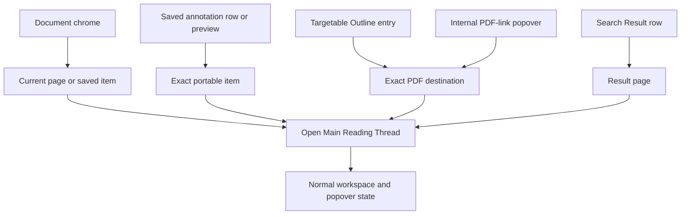
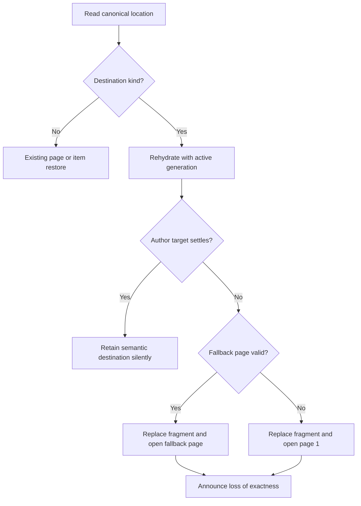
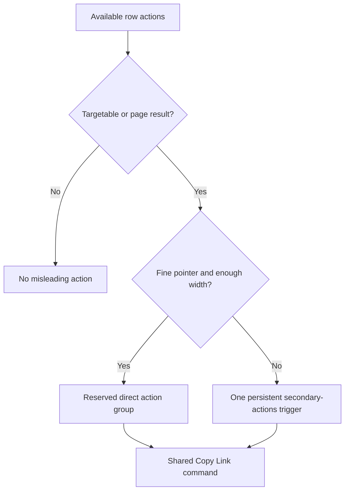
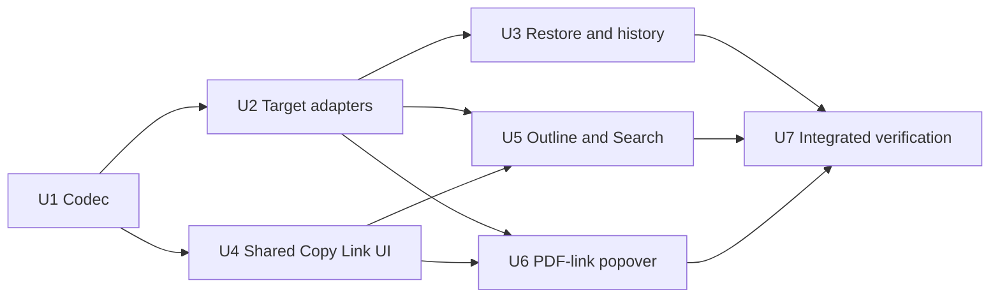

# Durable PDF Destination Links - Plan

## Goal Capsule

- **Objective:** Let a reader copy an honest Placekeeper Link for every supported PDF-native reading destination and reopen that precise destination without restoring unrelated interface state.
- **Means:** Extend Placekeeper Links with a generation-free destination codec, restore it through the navigation coordinator, and expose shared adaptive Copy Link actions across the named surfaces. (KTD1-KTD6)
- **Product authority:** This plan owns destination-link behavior and its Copy Link surfaces. The existing reloadable-link contract remains authoritative for local-file reopening, security, live-session authority, and stale-view recovery.
- **Open blockers:** None.

---

## Product Contract

### Summary

Placekeeper will copy exact durable links for supported author-encoded destinations exposed through the PDF Outline and internal PDF links.
Search Results will continue to copy page links, and every Copy Link action will use the conventional chain-link icon with surface-specific accessible labeling.

### Problem Frame

The current Placekeeper Link contract can restore a page or a portable saved Review Item.
Outline destinations, internal PDF-link destinations, Search Results, and ordinary references otherwise collapse to page links even when the source PDF already provides a more precise same-document destination.

That fallback is honest but unnecessarily coarse for Outline entries and embedded links.
It also makes users navigate to the destination and use the document-level control when the originating surface could copy the same durable reading location directly.

### Key Decisions

- **Use one target-centric durable PDF destination for Outline entries and internal PDF links.** (session-settled: user-directed — chosen over page-only fallback: supported author-encoded targets already provide a precise PDF location.) Governs R2-R4, R7-R9.
- **Keep Search Result links page-level.** (session-settled: user-directed — chosen over exact Search occurrence links: Search occurrences are extracted session data rather than portable PDF metadata.) Governs R5.
- **Restore the destination without restoring its source interface.** (session-settled: user-approved — chosen over reopening Outline state or a link popover: the URL represents a reading location rather than presentation state.) Governs R6, R8.
- **Copy the clicked PDF link's target.** (session-settled: user-approved — chosen over copying its source or offering both: the Copy action should match the popover's navigation destination.) Governs R4.
- **Use the chain-link icon for every Copy Link trigger.** (session-settled: user-directed — chosen over the clipboard icon: the control represents a durable link rather than generic clipboard content.) Governs R10-R11.
- **Keep dense row actions contextual and adaptive.** (session-settled: user-approved — chosen over always-visible buttons on every row: direct access should not turn narrow navigation lists into toolbars.) Governs R12-R15.

### Actors

- A1. A Placekeeper reader copies a durable link from the document chrome, an annotation surface, an Outline entry, a Search Result, or an internal PDF-link popover.
- A2. A link opener uses Placekeeper on a machine where the referenced local PDF path is available and readable.

### Requirements

**Durable location semantics**

- R1. Existing page and portable saved-item Placekeeper Links must continue to parse, copy, and restore with their current behavior.
- R2. Placekeeper Links must support one exact same-document PDF destination location derived from a successfully classified author-encoded target.
- R3. An Outline entry with a successfully classified exact target must copy that exact destination. An Outline entry whose author metadata resolves only to a page must copy that page as the full available precision and label it as a page link. An entry with no safe current target must not offer Copy Link.
- R4. Copy Link in an internal PDF-link popover must encode the link's classified target destination rather than its clickable source location.
- R5. Copy Link for a Search Result must encode that result's page and must not claim to preserve the exact match occurrence.
- R6. Opening an exact PDF destination link must move the Main Reading Thread to the destination without opening or selecting Outline, Search, Annotations, References, or a link popover.
- R7. Equivalent classified destinations must produce the same canonical location regardless of whether they were copied from an Outline entry or an internal PDF link.
- R8. A durable PDF destination must contain only safe reading-location state and must never carry source UI state, live credentials, task authority, session identity, or transient interaction geometry.
- R9. If an exact destination can no longer be restored against the current PDF, Placekeeper must fall back to a valid coarse page when recoverable, otherwise to its existing safe default, and explain that the exact location was unavailable.

**Copy Link controls and feedback**

- R10. Every Copy Link trigger must use the same chain-link icon across document, annotation, Outline, Search, and PDF-link popover surfaces, rendered with the app's existing icon family, stroke language, and sizing rather than a custom or emoji glyph.
- R11. Each icon-only trigger must have a surface-specific accessible name and tooltip that truthfully distinguishes an exact destination, exact annotation, current document location, or page-level Search link.
- R12. On fine-pointer layouts with enough measured row width for the label and two compact actions, linkable Outline and Search rows must expose Copy Link beside Open in References when the row is hovered, contains keyboard focus, or is current or selected.
- R13. Contextual row actions must preserve stable label geometry, remain keyboard reachable, and use the shared compact within-group spacing.
- R14. When a coarse pointer is active or the row container is below the single shared, evidence-derived direct-action breakpoint, one persistent secondary-actions trigger must expose Open in References and Copy Link with text labels. The trigger must have a row-specific accessible name, `aria-haspopup="menu"`, synchronized expanded state, and an owned-menu relationship.
- R15. Annotation previews and PDF-link popovers must keep Copy Link as a direct action while open and must not place it inside a nested transient menu.
- R16. New Copy Link surfaces must reuse the existing pending, duplicate-suppression, success announcement, clipboard-failure fallback, Retry, and focus-restoration behavior.
- R17. Successfully opening a valid durable destination must not show an informational toast, banner, popover, or other arrival message because the restored reading position is sufficient feedback.

### Surface and Location Model

The copied location is determined by the destination's semantics, not by the surface that emitted it.
The surface controls discoverability and labeling but does not become part of the durable URL.

### Key Flows

- F1. Copy an Outline destination
  - **Trigger:** A1 invokes Copy Link on a linkable Outline entry.
  - **Actors:** A1
  - **Steps:** Placekeeper derives the entry's classified destination, creates its canonical Placekeeper Link, and runs the shared copy-feedback behavior.
  - **Outcome:** The clipboard contains an exact destination link and the Main Reading Thread does not move.
  - **Covers:** R2-R3, R7-R8, R10-R13, R16.
- F2. Copy an embedded-link destination
  - **Trigger:** A1 opens an internal PDF-link popover and invokes Copy Link.
  - **Actors:** A1
  - **Steps:** Placekeeper uses the same classified target as the popover's navigation actions and copies its canonical destination link.
  - **Outcome:** The clipboard contains the target location without source-page or popover state.
  - **Covers:** R2, R4, R7-R8, R10-R11, R15-R16.
- F3. Copy a Search Result page
  - **Trigger:** A1 invokes Copy Link for a Search Result.
  - **Actors:** A1
  - **Steps:** Placekeeper copies a page-level link using the result's page and identifies the action as a page link.
  - **Outcome:** The clipboard contains an honest coarse link without a durable Search occurrence claim.
  - **Covers:** R5, R10-R14, R16.
- F4. Reopen a durable destination
  - **Trigger:** A2 opens a Placekeeper Link containing an exact PDF destination.
  - **Actors:** A2
  - **Steps:** Placekeeper completes its normal local-path confirmation and review opening, restores the destination in the Main Reading Thread, and leaves workspace surfaces in their normal state.
  - **Outcome:** The PDF opens silently at the author-encoded reading location without resurrecting the Copy Link source UI.
  - **Covers:** R1-R2, R6, R8, R17.
- F5. Recover from an unavailable exact destination
  - **Trigger:** A2 opens a destination link whose exact target cannot be applied to the current PDF.
  - **Actors:** A2
  - **Steps:** Placekeeper uses the recoverable coarse page when valid or the existing safe default and reports the loss of exactness.
  - **Outcome:** The review remains usable and never silently claims that an unavailable destination was restored.
  - **Covers:** R9.

### Acceptance Examples

- AE1. Outline destination at available precision
  - **Covers R2-R3, R6-R8, R17.**
  - **Given:** A targetable Outline entry resolves to an author-encoded position on page 3.
  - **When:** A1 copies its link and A2 opens that link.
  - **Then:** The Main Reading Thread lands at the exact position on page 3 without opening the Outline workspace or showing an arrival message.
  - **And given:** An Outline entry's author metadata resolves only to page 3.
  - **Then:** Its action is labeled as a page link and reopens page 3 without claiming exact positioning.
- AE2. Equivalent source surfaces
  - **Covers R7.**
  - **Given:** An Outline entry and an internal PDF link resolve to the same classified destination.
  - **When:** A1 copies each destination.
  - **Then:** Both actions produce the same canonical location fragment.
- AE3. Unavailable Outline target
  - **Covers R3.**
  - **Given:** An Outline entry exists but its PDF destination cannot be classified safely.
  - **When:** The entry renders.
  - **Then:** It offers no Copy Link action and does not manufacture a misleading destination.
- AE4. Clicked-link target
  - **Covers R4, R15.**
  - **Given:** A clickable link appears on page 1 and targets a position on page 4.
  - **When:** A1 invokes Copy Link in its popover.
  - **Then:** The copied link opens the page 4 target and does not encode the page 1 source or reopen the popover.
- AE5. Search page fallback
  - **Covers R5, R11.**
  - **Given:** A Search Result identifies one occurrence on page 6.
  - **When:** A1 invokes its Copy Link action.
  - **Then:** The copied link restores page 6 and the action is labeled as a page link rather than an exact result link.
- AE6. Adaptive row actions
  - **Covers R12-R14.**
  - **Given:** An Outline or Search row supports Open in References and Copy Link.
  - **When:** It renders with a fine pointer and sufficient width.
  - **Then:** Both direct actions appear on hover, focus, or active state without shifting the row label.
  - **And when:** It renders where two direct touch targets would crowd the row.
  - **Then:** One persistent secondary-actions trigger exposes both actions with text labels.
  - **And:** The responsive switch is stable just below and just above the shared container breakpoint, and the trigger exposes its menu state and ownership to assistive technology.
- AE7. Consistent Copy Link feedback
  - **Covers R10-R11, R16.**
  - **Given:** Any Copy Link surface is available.
  - **When:** A1 invokes it under success, duplicate-pending, and clipboard-failure conditions.
  - **Then:** The chain-link trigger has an accurate accessible label and the existing feedback, fallback, Retry, and focus behavior remains intact.
- AE8. Backward compatibility and degraded exactness
  - **Covers R1, R9.**
  - **Given:** A2 opens an existing page or portable-item link, or a new destination link whose exact target is unavailable.
  - **When:** Placekeeper restores the location.
  - **Then:** Existing link kinds behave unchanged, while the unavailable destination falls back safely with an honest notice.

### Scope Boundaries

**In scope**

- Exact links for successfully classified, same-document PDF destinations emitted by Outline entries and internal PDF links.
- Page-level Copy Link actions for Search Results.
- Copy Link action placement and responsive disclosure across the named surfaces.
- Chain-link icon adoption for existing and new Copy Link triggers.
- Backward-compatible parsing and safe degradation for durable locations.

**Out of scope**

- Exact durable Search occurrence links.
- Restoring the originating workspace, row selection, Reference Tab, popover, or transient interaction state.
- Durable identity for the clickable source annotation of a foreign PDF link.
- External URI, cross-document, or remote-file destination handling beyond existing behavior.
- File transfer, path remapping, or cross-machine synchronization for the local PDF referenced by a Placekeeper Link.
- Changes to live browser credentials, Codex task binding, session restoration, or stale-view security boundaries.

### Dependencies / Assumptions

- Successfully classified Outline and internal PDF-link targets expose enough normalized same-document destination information to restore the reading location.
- Some Outline entries legitimately have no safe classified target and remain unavailable for exact copying.
- A Placekeeper Link still depends on the referenced local PDF path being readable when opened.
- Existing page and portable-item link behavior remains the compatibility baseline.

### Sources / Research

- `CONCEPTS.md`
- `docs/plans/2026-08-17-1104-feat-reloadable-placekeeper-review-links-plan.md`
- `docs/plans/2026-08-17-1212-feat-quiet-outline-tree-plan.md`
- `docs/plans/2026-08-11-001-feat-pdf-search-workspace-plan.md`
- `packages/core/src/placekeeper-link.ts`
- `apps/web/src/pdf/pdf-navigation-target.ts`
- `apps/web/src/pdf/pdf-outline.ts`
- `apps/web/src/pdf/pdf-search-model.ts`
- `apps/web/src/review/CopyLinkControl.tsx`
- `apps/web/src/review/LinkActionPopover.tsx`
- `docs/solutions/architecture-patterns/reloadable-local-review-url-authority-boundaries.md`
- `docs/solutions/architecture-patterns/reference-tab-return-to-origin-navigation.md`
- `docs/solutions/design-patterns/outline-aware-annotation-workspace-presentation.md`
- `docs/solutions/ui-bugs/reliable-compact-right-docked-reference-tabs.md`
- `docs/solutions/conventions/native-control-tooltip-contract.md`
- `docs/solutions/test-failures/webkit-recoverable-reference-flow-acceptance-test.md`
- [IBM Carbon: Data table usage](https://carbondesignsystem.com/components/data-table/usage/)
- [IBM Carbon: Popover usage](https://carbondesignsystem.com/components/popover/usage/)
- [W3C: WCAG 2.2 Target Size (Minimum)](https://www.w3.org/WAI/WCAG22/Understanding/target-size-minimum.html)

---

## Planning Contract

### Product Contract Preservation

This implementation plan preserves R1-R17, A1-A2, F1-F5, and AE1-AE8 in place. It resolves the two former planning questions through KTD1-KTD6 without changing the Product Contract's meaning.

### Key Technical Decisions

- KTD1. **Give exact destinations a dedicated canonical v2 fragment grammar.** Keep the existing v1 page and item grammar byte-for-byte. A v2 destination carries a one-based fallback page, one app-owned symbolic view-mode token, and only that mode's canonically formatted finite parameters. Normalize a page-only or unknown author target to the existing v1 page location. Reject duplicate or unknown fields, wrong parameter counts, non-canonical numbers, non-finite values, negative zero, oversized input, and session-shaped fields. Governs R1-R2, R7-R9.
- KTD2. **Separate the durable destination value from EmbedPDF's live target.** The shared core type contains no `documentGeneration` or derived `identity`. Web conversion code maps a classified `PdfNavigationTarget` to the durable value and reconstructs a fresh target with the active document generation and recomputed identity when opening. Governs R2, R7-R8.
- KTD3. **Restore exact links as a coordinator-owned transaction.** (session-settled: user-approved — chosen over reopening the source workspace or popover: the link represents the reading destination, not its source UI.) The coordinator applies the reconstructed author target, verifies the settled location, and retains the destination fragment while the viewer remains at its semantic anchor. Exact failure replaces the fragment with its valid fallback page, or page 1 when necessary, before performing the coarse restore. A fresh exact success emits no arrival announcement; degradation remains announced. Governs R6, R8-R9, R17.
- KTD4. **Drive direct and overflow row controls from one action model.** (session-settled: user-approved — chosen over always-visible row toolbars: direct access must not crowd narrow navigation lists.) Target capability determines the available actions: an exact-capable Outline target gets an exact-destination label, a page-only Outline target and every Search result get truthful page-link labels, and a null, invalid, or stale target gets no Copy Link action. A fine pointer above one named CSS container breakpoint renders compact direct actions in a reserved trailing group. Derive and freeze that breakpoint from the minimum stable label allocation plus the two direct-action widths and gaps; test one pixel below and above it. A coarse pointer or container at or below that breakpoint renders one persistent secondary-actions trigger with text-labeled menu items and complete menu-button accessibility semantics. Governs R3, R5, R12-R14.
- KTD5. **Keep one shared Copy Link command lifecycle across every surface.** Preserve `createCopyLinkCommand` as the owner of pending de-duplication, success, clipboard failure, Retry, and failure focus restoration. Let `CopyLinkControl` adapt its role, styling, focus registration, and feedback placement for chrome, rows, and popovers. Link-action and row menus remain mounted through pending, success, and failure feedback; copy alone never dismisses them. Dismissal occurs only through the surface's explicit Escape, outside-pointer, or focus-departure rules, and transient placement is recomputed when feedback changes its bounds. Governs R4, R11, R14-R16.
- KTD6. **Register Lucide's chain-link glyph through `ReviewIcon`.** (session-settled: user-directed — chosen over the clipboard icon: Copy Link represents a durable link rather than generic clipboard content.) Use the registry defaults for icon size and stroke, with only established surface-specific size overrides. Do not add a custom SVG or emoji. Governs R10-R11.

### High-Level Technical Design

The codec remains the only durable-location trust boundary. UI surfaces consume normalized targets or pages and never assemble a fragment themselves.

```mermaid
flowchart LR
  PDF[PDF author metadata] --> Classify[Target classifier]
  Classify --> Durable[Generation-free durable destination]
  Durable --> Codec[Shared core fragment codec]
  Codec --> Link[Placekeeper Link]
  Link --> Decode[Strict shared decode]
  Decode --> Rehydrate[Current-generation target adapter]
  Rehydrate --> Coordinator[Navigation coordinator]
  Coordinator --> Main[Main Reading Thread]
```

Exact restoration is one transaction with an explicit downgrade path.

Row action presentation derives from capability and input regime, while the action definitions remain identical.

### Assumptions

- The plan covers the complete Product Contract in one implementation pass and defers unrelated navigation or workspace refactors.
- Stable symbolic tokens can represent every accepted author destination mode without importing dependency-owned enum values into the core codec.
- The existing `PdfViewerNavigation.applyTarget` path remains the authority for applying author intent; arbitrary captured viewer state is never promoted into a durable destination.
- A same-path PDF byte replacement is not detectable from structurally valid destination geometry alone. Exactness means that the encoded author target remains applicable, not that Placekeeper has proven semantic identity across file replacement.
- Focused unit, SSR, Chromium, WebKit, and visual coverage may update assertions and snapshots for the affected surfaces, but does not rewrite unrelated historical tests.
- The feature remains UI-facing. It adds no agent tool and no Live PDF Context payload; copying or opening a link must not mutate Review State, its semantic digest, or task binding.

### Implementation Constraints

- Recheck document generation when Copy Link is invoked. A target that became stale after rendering must not be copied.
- Validate the fully resolved destination against the viewer's existing zoom bounds before applying it. Extreme XYZ scale, fit-rectangle scale, or near-zero rectangle inputs must fail exact restoration and use the canonical page fallback.
- Keep the one-based fallback page inside every exact destination so a valid coarse restore does not depend on decoding author geometry.
- Preserve the existing 16 KiB link limit and strict path, authority, query, Unicode, and control-character checks.
- Do not let a scroll container clip clipboard-failure input or Retry controls in a row menu or PDF-link popover.
- Keep successful copy feedback. Suppress only successful destination-arrival feedback; malformed or degraded restoration remains truthful and visible.

### Sequencing

### System-Wide Impact

- **Durable URL contract:** Core parsing, stale readable-route projection, native launch, browser history, and installed smoke behavior must agree on the new location kind.
- **Navigation:** Main Reading Thread restoration gains an exact author-target path but retains page and portable-item compatibility.
- **Responsive UI:** Outline, Search, annotation, document chrome, and the PDF-link popover share Copy Link semantics and icon language.
- **Agent boundary:** A copied or reopened destination conveys no task authority, browser credential, evidence handle, or prompt context. Any successor-daemon Codex reattachment depends on a separate private restart ticket plus the exact owning task's next prompt; it is never encoded in or authorized by the destination.

### Risks and Mitigations

- **Numeric ambiguity or future enum drift:** Use app-owned symbolic tokens, canonical numeric formatting, exact arity checks, and exhaustive negative codec tests.
- **Changed PDF content:** Store an explicit page fallback and verify structural applicability before retaining exactness. A replacement PDF whose geometry remains structurally valid can still point at different content; this increment does not claim to detect that semantic drift.
- **Stale document generation:** Recheck generation at action time and reconstruct identities only from the active generation.
- **Disconnected or trapped focus:** Render menus from ordered action metadata, include clipboard fallback controls in focus composition, and test Escape, Tab, arrow, Home, End, outside dismissal, and trigger restoration.
- **Crowded rows:** Reserve action geometry and switch presentation through container and pointer capability instead of hiding individual buttons opportunistically.
- **Stale production assets:** Build the web bundle before installed-style browser verification.

---

## Implementation Units

### U1. Extend the canonical Placekeeper Link codec

**Goal:** Add the generation-free exact destination location while preserving all v1 page and portable-item behavior.

**Requirements:** R1-R2, R7-R9; F4-F5; AE2, AE8.

**Dependencies:** None.

**Files:**

- `packages/core/src/placekeeper-link.ts`
- `packages/core/test/placekeeper-link.test.ts`
- `apps/service/test/placekeeper-link.test.ts`
- `apps/service/test/open-command.test.ts`

**Approach:**

1. Add the app-owned destination type and strict v2 codec under KTD1-KTD2.
2. Keep the service's generic `PlacekeeperLinkLocation` pass-through and add compatibility coverage at its launch boundary.
3. Normalize semantically page-only author targets to the existing page kind so two encodings cannot claim the same location.

**Execution note:** Start with failing codec round-trip and rejection cases because this unit changes a security-sensitive durable grammar.

**Patterns to follow:** The strict path and v1 fragment validation in `packages/core/src/placekeeper-link.ts`; the security boundary in `docs/solutions/architecture-patterns/reloadable-local-review-url-authority-boundaries.md`.

**Test scenarios:**

- Covers AE2. Equivalent destination inputs produce one byte-identical canonical fragment.
- Covers AE8. Existing v1 page and item links retain their exact encoded form and decoded value.
- Every supported symbolic destination mode round-trips with its required finite parameter count and one-based page fallback.
- A page-only author target encodes as v1 page rather than a redundant v2 destination.
- Duplicate keys, unknown keys, unsupported modes, wrong arity, non-finite numbers, negative zero, non-canonical decimals, controls, session fields, generation fields, and oversized input fail closed.
- Native open preparation carries a valid destination location without weakening path confirmation or PDF validation.

**Verification:** The shared codec is the only fragment producer/parser, old golden links are unchanged, and invalid destination data cannot cross the core boundary.

### U2. Map live PDF targets to durable destinations

**Goal:** Convert classified author targets to the core location and rehydrate them safely for the active document.

**Requirements:** R2-R4, R7-R8; F1-F2; AE2-AE4.

**Dependencies:** U1.

**Files:**

- `apps/web/src/pdf/pdf-navigation-target.ts`
- `apps/web/test/pdf-navigation-target.test.ts`
- `apps/web/src/pdf/viewer-navigation-adapter.ts`
- `apps/web/test/viewer-navigation.test.ts`

**Approach:**

1. Add explicit conversion in both directions under KTD2 rather than serializing a live target or dependency enum.
2. Recompute target identity with the current document generation during rehydration.
3. Reuse the viewer adapter's existing author-mode resolution for exact application, then reject any fully resolved request outside the existing viewer zoom bounds before it reaches `requestZoom`.

**Patterns to follow:** `classifyPdfNavigationTarget` for fail-closed normalization and `createPdfTargetLocation` for author-mode semantics.

**Test scenarios:**

- Covers AE2. An Outline target and PDF-link target with equivalent normalized semantics create the same durable location.
- Covers AE3. Missing, unsupported, malformed, out-of-range, or stale-generation targets cannot create an exact location.
- XYZ, fit variants, rectangle, and page-only targets map to their expected durable forms and rehydrate under a new generation.
- Rehydration never preserves the source generation or identity.
- Special numeric cases normalize canonically or fail closed before reaching the viewer adapter.
- Extreme XYZ scales, fit-rectangle-derived scales, and near-zero rectangles cannot bypass the viewer's existing minimum or maximum zoom limits; exact restoration degrades to the encoded page.

**Verification:** Only accepted same-document author metadata can become a durable target, and reconstruction yields a current-generation target accepted by the existing adapter.

### U3. Restore and retain exact destinations in navigation history

**Goal:** Open exact destination links transactionally, preserve them only while semantically current, and downgrade honestly.

**Requirements:** R1-R2, R6, R8-R9, R17; F4-F5; AE1, AE4, AE8.

**Dependencies:** U2.

**Files:**

- `apps/web/src/review/navigation-coordinator.ts`
- `apps/web/src/review/review-location-history.ts`
- `apps/web/test/navigation-coordinator.test.ts`
- `apps/web/test/review-location-history.test.ts`
- `apps/web/src/production-entry.tsx`

**Approach:**

1. Add the destination branch to initial, reload, Back, and Forward restoration under KTD3.
2. Track the settled semantic destination like a portable item; replace it with a page location after material user navigation without synthesizing a new destination from viewer state.
3. Preserve valid destination fragments in stale readable-route recovery and use the existing page-1 convergence for malformed input.

**Execution note:** Add coordinator characterization tests for existing page/item history before extending the location union.

**Patterns to follow:** `restoreCurrentLocation`, `restoreLinkedLocation`, `projectExplicitLocation`, and the semantic-item lifetime in `navigation-coordinator.ts`.

**Test scenarios:**

- Covers AE1. A fresh exact destination opens the Main Reading Thread at the author position with normal workspace state and no arrival announcement.
- Covers AE4. An internal-link target reopens at the destination without recreating its source popover.
- Covers AE8. Page and item restoration remain unchanged.
- Back and Forward reapply exact destinations while retaining their existing movement announcements.
- Exact application failure replaces history with the valid fallback page and announces the loss of exactness once.
- An invalid fallback page converges to page 1 without retaining a false exact fragment.
- Scrolling or navigating away downgrades the current fragment to the settled page; remaining at the semantic anchor retains the destination.
- Copying or opening the location leaves Review Items, save digest, Live PDF Context, and task binding unchanged.

**Verification:** Fresh success is silent and exact; every failed exact restore converges to a truthful canonical coarse location.

### U4. Generalize shared Copy Link controls and icon language

**Goal:** Reuse one copy command lifecycle across direct controls and menus while changing every Copy Link glyph to the app-native chain icon.

**Requirements:** R10-R11, R15-R16; F1-F3; AE7.

**Dependencies:** U1.

**Files:**

- `apps/web/src/review/ReviewIcon.tsx`
- `apps/web/src/review/CopyLinkControl.tsx`
- `apps/web/test/copy-link-control.test.ts`
- `apps/web/test/control-tooltips.test.ts`
- `apps/web/src/app/review-layout-annotations.css`

**Approach:**

1. Register and adopt the chain-link icon under KTD6.
2. Extend `CopyLinkControl` under KTD5 with surface presentation, menu role, external focus composition, and feedback-placement options while leaving its command lifecycle singular.
3. Keep fallback input and Retry reachable within the active surface and restore focus to the invoking trigger after failure.

**Patterns to follow:** `ReviewIcon` defaults, `ContextActionButton` label/title alignment, and the existing `createCopyLinkCommand` state machine.

**Test scenarios:**

- Covers AE7. Chrome, annotation, row, and popover variants share pending de-duplication, success, failure input, Retry, and focus restoration.
- Every Copy Link trigger renders Lucide's registered link glyph with the established default stroke and size language.
- Surface-specific accessible names and titles distinguish current location, annotation, exact destination, and Search page links.
- Clipboard failure fallback remains visible and keyboard reachable when hosted inside a scrollable menu or popover.
- Repeated activation during one pending write performs one clipboard call.

**Verification:** No Copy Link surface implements its own clipboard lifecycle or retains the clipboard glyph.

### U5. Add adaptive Copy Link actions to Outline and Search rows

**Goal:** Expose exact Outline and page-level Search links without destabilizing row labels or crowding constrained layouts.

**Requirements:** R3, R5, R10-R14, R16; F1, F3; AE1, AE3, AE5-AE7.

**Dependencies:** U2, U4.

**Files:**

- `apps/web/src/review/OutlineNavigator.tsx`
- `apps/web/src/review/PdfSearchWorkspace.tsx`
- `apps/web/src/review/OutlineAnnotationsWorkspace.tsx`
- `apps/web/src/app/ReviewShell.tsx`
- `apps/web/src/app/ProductionReviewApp.tsx`
- `apps/web/src/review/RowActionGroup.tsx`
- `apps/web/test/reference-workspace.test.tsx`
- `apps/web/test/review-layout.test.tsx`
- `apps/web/src/app/review-layout-annotations.css`
- `apps/web/src/app/review-layout-responsive.css`

**Approach:**

1. Build ordered action descriptors from target precision and current generation, then render them through the shared row group under KTD4-KTD5. Exact-capable Outline targets use exact-destination copy, page-only Outline targets use the existing v1 page link with a page-link label, and null, invalid, or stale targets omit Copy Link.
2. Reserve direct-action geometry for fine-pointer hover, focus, current, and selected states.
3. Switch to one persistent text-labeled secondary-actions menu through the named CSS container breakpoint and coarse-pointer rules. Derive the breakpoint from the minimum stable row-label allocation plus measured action geometry, expose the trigger as a proper menu button, and test its state at one pixel below and above the boundary.
4. Build Outline links from exact durable targets and Search links from one-based pages at the composition root.

**Patterns to follow:** Existing Outline `data-current` and Search `data-active` states; compact action tokens; `compositeFocusIndex` for ordered menus.

**Test scenarios:**

- Covers AE1. An exact-capable Outline entry copies its exact destination, while a page-only Outline entry copies its page with a truthful page-link label; neither action moves the Main Reading Thread.
- Covers AE3. A null, unsafe, or stale Outline target exposes no Copy Link action.
- Covers AE5. A Search Result copies its page location with a truthful page-link accessible name.
- Covers AE6. Fine-pointer hover, focus, current Outline, and selected Search rows reveal both direct actions without changing label bounds.
- Covers AE6. Constrained or coarse layouts render one 44px persistent secondary-actions trigger whose menu exposes Open in References and Copy Link with text labels.
- The secondary-actions trigger has a row-specific accessible name, menu popup semantics, synchronized expanded state, and an owned-menu relationship in both Outline and Search.
- The named breakpoint renders the direct group one pixel above and the persistent menu trigger at and one pixel below, without shifting label bounds.
- The row menu supports Arrow, Home, End, Escape, outside dismissal, and trigger focus restoration.
- Clipboard failure keeps the menu and fallback controls usable; document replacement disables or removes stale exact actions before copy.

**Verification:** Both row types consume one action model, preserve ellipsis and label geometry, and meet the direct-versus-menu disclosure contract across pointer regimes.

### U6. Add target Copy Link to the PDF-link action popover

**Goal:** Copy the clicked internal PDF link's durable target as a direct action without nesting another popover.

**Requirements:** R2, R4, R7-R8, R10-R11, R15-R16; F2; AE2, AE4, AE7.

**Dependencies:** U2, U4.

**Files:**

- `apps/web/src/review/LinkActionPopover.tsx`
- `apps/web/src/review/navigation-coordinator.ts`
- `apps/web/src/app/ProductionReviewApp.tsx`
- `apps/web/test/reference-workspace.test.tsx`
- `apps/web/test/navigation-coordinator.test.ts`
- `apps/web/src/app/review-layout-annotations.css`

**Approach:**

1. Add Copy Link from `request.target`, never `sourcePageIndex`, `opener`, or activation geometry.
2. Replace hard-coded two/three control focus composition with ordered rendered actions and embedded copy-fallback controls.
3. Keep the popover mounted throughout pending, success, and failure Copy Link states, and dismiss only when focus leaves its complete fallback surface or the existing Escape/outside rules fire.
4. Recompute portal placement whenever Copy Link feedback changes popover bounds so a late clipboard failure cannot clip the fallback input or Retry control.

**Patterns to follow:** The existing portal, placement, anchor invalidation, and focus-return behavior; role-based assertions plus native keyboard activation from the WebKit recovery learning.

**Test scenarios:**

- Covers AE4. Copy Link produces the target destination while the source page differs and does not navigate or dismiss the popover on success.
- Covers AE2. A matching Outline target produces the same canonical fragment.
- Main and Reference source scopes include Copy Link in correct Arrow/Home/End order with accurate role, name, and tooltip.
- Clipboard failure exposes selectable link and Retry without trapping or disconnecting focus.
- Pending, success, and failure feedback do not dismiss the popover, and a feedback-driven size change recomputes placement within the viewport.
- Escape, outside pointer, Tab leaving the complete surface, and anchor invalidation preserve their existing dismissal and focus-return semantics.
- A stale-generation request cannot copy a destination.

**Verification:** The popover has one direct chain-link action, no nested surface, dynamic focus order, and target-only serialization.

### U7. Prove the integrated durable-link and responsive UI contract

**Goal:** Verify exact reopen, safe degradation, silent success, cross-surface equivalence, and adaptive action presentation in built production assets.

**Requirements:** R1-R17; F1-F5; AE1-AE8.

**Dependencies:** U3, U5, U6.

**Files:**

- `test/acceptance/reloadable-links.spec.ts`
- `test/acceptance/production-flow.spec.ts`
- `test/acceptance/review-visual.spec.ts`
- `packaging/macos/smoke-installed.ts`
- `test/acceptance/review-visual.spec.ts-snapshots/`

**Approach:**

1. Extend the real reference-navigation fixture flow to copy and reopen exact Outline and PDF-link destinations and compare their canonical output.
2. Cover Search and page-only Outline links, both sides of the named responsive breakpoint, coarse row menus, popover clipboard failure, out-of-range resolved zoom, and structurally unavailable changed-document fallback.
3. Update only snapshots whose approved action geometry or icon changed, after rebuilding production assets.
4. Preserve the installed smoke proof that link-opened reviews carry no Codex authority.

**Patterns to follow:** Existing reloadable-link acceptance, production reference-flow helpers, Outline visual geometry assertions, and installed link-open smoke coverage.

**Test scenarios:**

- Covers AE1-AE4. Copy from Outline and an equivalent PDF link, launch each exact link, and land at the same author position with all source UI closed and no arrival notice.
- Covers AE5. Copy a Search Result and reopen its page without claiming the exact occurrence.
- Covers AE6. Measure direct action spacing and stable label bounds on wide fine-pointer layouts, then verify one persistent menu trigger on narrow and coarse layouts.
- Covers AE7. Exercise success, duplicate-pending, clipboard denial, selectable fallback, Retry, and focus return on representative direct and popover surfaces.
- Covers AE8. Reopen v1 links unchanged and degrade a valid v2 destination when changed content makes its geometry structurally inapplicable. Do not claim that same-path file replacement is detected when the old geometry remains structurally valid.
- Back and Forward preserve exact destinations until manual movement downgrades them.
- A stale readable route retains a valid exact fragment as an inert click-only Placekeeper Link without itself resuming credentials, task binding, or session authority. A separate verified restart ticket may later promote the fresh successor view for the exact owning task.

**Verification:** Focused Chromium and WebKit acceptance, visual snapshots, and installed smoke prove the same behavior against freshly built assets.

---

## Verification Contract

### Automated Gates

- `pnpm vitest run packages/core/test/placekeeper-link.test.ts apps/service/test/placekeeper-link.test.ts apps/service/test/open-command.test.ts`
- `pnpm vitest run apps/web/test/pdf-navigation-target.test.ts apps/web/test/viewer-navigation.test.ts apps/web/test/navigation-coordinator.test.ts apps/web/test/review-location-history.test.ts apps/web/test/copy-link-control.test.ts apps/web/test/reference-workspace.test.tsx apps/web/test/review-layout.test.tsx apps/web/test/control-tooltips.test.ts`
- `pnpm typecheck`
- `pnpm build:web`
- `pnpm playwright test test/acceptance/reloadable-links.spec.ts test/acceptance/production-flow.spec.ts`
- `pnpm playwright test --config playwright.webkit.config.ts test/acceptance/reloadable-links.spec.ts test/acceptance/production-flow.spec.ts`
- `pnpm playwright test --config playwright.visual.config.ts test/acceptance/review-visual.spec.ts`
- `pnpm validate:distribution`

### Browser and Installed-App Evidence

- Use `test/fixtures/pdfs/reference-navigation.pdf` to verify equivalent Outline and embedded-link destinations, multiple pages, Search results, and row-action regimes.
- Verify the freshly built production assets at wide fine-pointer, narrow fine-pointer, and coarse-pointer emulation sizes.
- Inspect the document chrome, annotation row and peek, Outline, Search, and PDF-link popover to confirm one Lucide chain-link visual language.
- Install the fresh application build before installed smoke or manual Placekeeper review. Confirm an exact link reopens silently at its destination and does not carry Codex context.

### Quality Gates

- No new permissive parsing path or duplicated fragment builder exists outside the shared core codec.
- No target `identity`, document generation, transient geometry, source UI state, credential, or task authority appears in a copied fragment.
- Every icon-only action has a truthful accessible name and `title`; every constrained menu action has visible text.
- Every secondary-actions trigger exposes menu-button semantics, synchronized expanded state, and an owned-menu relationship.
- Clipboard failure and Retry remain keyboard reachable without clipping in every transient surface.
- Row presentation switches deterministically at the named, geometry-derived container breakpoint and is covered immediately on both sides.
- Visual changes are limited to the approved icon and action-layout updates.

---

## Definition of Done

- U1 is done when v1 links are byte-compatible, v2 destinations are canonical and strict, and service launch tests preserve the file-security boundary.
- U2 is done when every supported author mode maps to a generation-free value and rehydrates under the active document generation.
- U3 is done when exact restore, semantic retention, Back/Forward, silent fresh success, and canonical fallback all pass focused tests.
- U4 is done when every Copy Link trigger uses the registered chain icon and one shared clipboard lifecycle across all variants.
- U5 is done when Outline and Search rows meet the fine-pointer and constrained/coarse disclosure, geometry, focus, and labeling requirements.
- U6 is done when the PDF-link popover copies the target directly, keeps fallback controls usable, and preserves its dismissal/focus contract.
- U7 is done when Chromium, WebKit, visual, and installed evidence prove AE1-AE8 against freshly built assets.
- Existing page/item Placekeeper Links, PDF path confirmation, session security, stale-view recovery, Review State, Save Sync, and Live PDF Context remain unchanged outside the stated location behavior.
- All abandoned experimental code, duplicate helpers, stale selectors, and obsolete snapshots from unsuccessful approaches are removed from the final diff.
