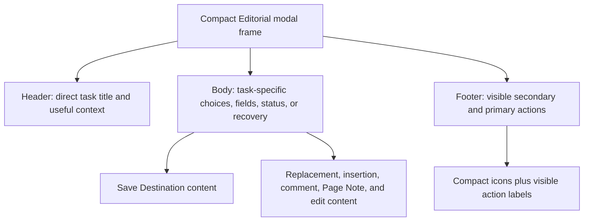
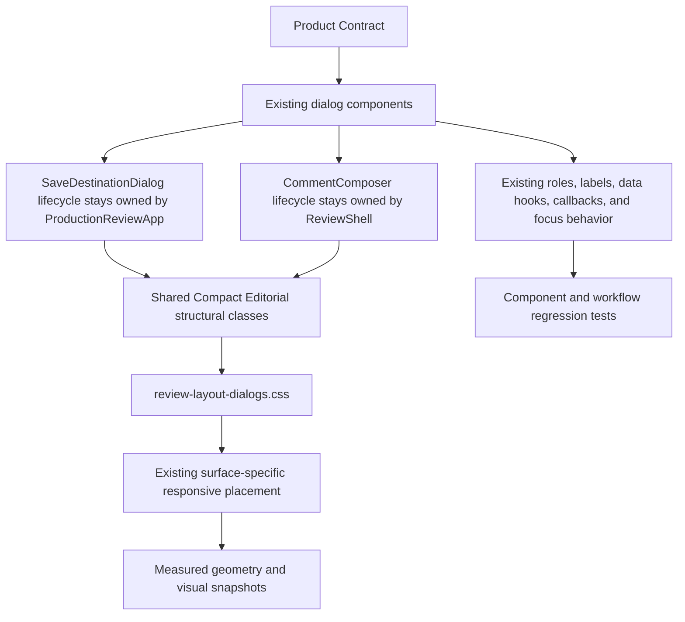

# Compact Editorial Modal Language - Plan

## Goal Capsule

- **Objective:** Make save-location and text-entry modals feel like one authored Warm Neutral system, with clear task hierarchy and immediately understandable actions.
- **Means:** Apply a Compact Editorial frame and an icon-plus-label action grammar to Save Destination and every current text-entry modal (KTD1, KTD2).
- **Product authority:** This contract owns presentation and copy hierarchy for the in-scope modals. Existing review, annotation, and save contracts retain authority over behavior, state, and lifecycle.
- **Open blockers:** None.

---

## Product Contract

### Summary

Unify Save Destination and all current text-entry modals around a Compact Editorial header, body, and footer structure.
Keep task actions visible as compact icon-plus-label controls while preserving the current review behavior.

### Problem Frame

The in-scope modals already share Warm Neutral tokens and button styling, but they do not present information with one structural grammar.
Save Destination uses a direct title, description, task body, and footer, while text-entry modals use a generic eyebrow, title, field, and separate action region.
The inconsistency makes transient review tools feel assembled from adjacent patterns instead of authored as one family.

### Key Decisions

- **Adopt Compact Editorial as the modal direction.** (session-settled: user-directed — chosen over Quiet Regularization and Task-led Panels: it creates a calmer hierarchy without adding more visual machinery.) Governs R1, R4, R10.
- **Use compact icon-plus-label actions.** (session-settled: user-directed — chosen over icon-only and mostly textual action pairs: essential actions remain explicit, touch-friendly, and consistent with the icon language.) Governs R5-R9.
- **Cover Save Destination and every current text-entry modal.** (session-settled: user-directed — chosen over only the named flows and every modal surface: the shared composer family gains consistency without expanding into unrelated dialogs.) Governs R2-R3, R9-R11.
- **Use supporting header copy only when it adds context.** (session-settled: user-approved — chosen over descriptions on every modal: simple composers should not repeat their task title in sentence form.) Governs R4.

The shared region hierarchy is:

### Requirements

**Modal frame and hierarchy**

- R1. Every in-scope modal shall use one Compact Editorial frame whose header, body, and footer rely on typography, spacing, and subtle dividers instead of nested cards.
- R2. Save Destination shall retain its original-versus-copy choice, copy name, folder location, recovery, restriction, and error content inside the shared hierarchy.
- R3. Replacement, insertion, highlight comment, Page Note, and edit modals shall use the shared hierarchy while retaining their task-specific fields and semantics.
- R4. Each header shall lead with a direct task title and show supporting copy only when it provides non-redundant guidance.

**Actions and accessibility**

- R5. Modal actions shall be visible buttons with a compact icon and a short task-appropriate label.
- R6. Each footer shall present the secondary action before the primary action in a consistent end-aligned group.
- R7. The secondary action shall remain visible as Cancel or the existing semantic alternative, and the primary action shall remain visible as Confirm, Apply, or the task-specific save label.
- R8. Escape shall continue to cancel or dismiss wherever currently supported without replacing the visible secondary action with a keyboard hint.
- R9. The cleanup shall preserve accessible names, tooltips, focus indicators, focus trapping, initial focus, and focus restoration where the current flow owns it.

**States and continuity**

- R10. Required, optional, disabled, busy, restricted, recovery, validation, and error states shall remain distinguishable within the shared visual grammar without relying on color alone.
- R11. The cleanup shall preserve modal lifecycle, draft contents, command isolation, save recovery, responsive containment, and underlying review state.

### Key Flows

- F1. Save Destination
  - **Trigger:** A reviewer activates the PDF title control or a review action requires a save destination.
  - **Steps:** The modal presents its title and useful guidance, contains destination choices and state messages in the body, and keeps Cancel plus Confirm visible in the footer.
  - **Outcome:** The reviewer confirms or dismisses the existing destination decision without a visual or behavioral exception.
  - **Covered by:** R1-R2, R4-R11.
- F2. Text entry
  - **Trigger:** A reviewer adds or edits replacement text, insertion text, a highlight comment, a Page Note, or another supported editable review field.
  - **Steps:** The modal focuses the task field, preserves its required or optional semantics, and exposes the existing secondary and primary actions as icon-plus-label buttons.
  - **Outcome:** The reviewer applies, saves, skips, or cancels through the existing workflow and returns to the prior review context.
  - **Covered by:** R1, R3-R11.

### Acceptance Examples

- AE1. Cross-modal family resemblance
  - **Covers R1-R6.**
  - **Given:** A reviewer opens Save Destination and then opens replacement, comment, and Page Note modals.
  - **When:** The reviewer compares their hierarchy, typography, fields, spacing, and actions.
  - **Then:** Each modal reads as the same Compact Editorial family while its task remains immediately identifiable.
- AE2. Explicit modal actions
  - **Covers R5-R9.**
  - **Given:** A modal is open on a pointer, keyboard, or touch-capable surface.
  - **When:** The reviewer locates the existing secondary and primary paths.
  - **Then:** Both actions are visible as icon-plus-label buttons with accessible names, Cancel remains visible where that mode owns it, and Escape also cancels where supported.
- AE3. Composer semantics
  - **Covers R3, R9-R11.**
  - **Given:** A reviewer opens required, optional, new, and edit variants of the text-entry modal.
  - **When:** The reviewer enters valid, empty, or whitespace-only content and chooses the available action.
  - **Then:** Existing validation, skip, save, apply, dismissal, and focus behavior remains unchanged.
- AE4. Save exceptional states
  - **Covers R2, R10-R11.**
  - **Given:** Save Destination is preparing, restricted, recovering from a failed save, or reporting invalid annotation geometry.
  - **When:** The state appears within the modal body.
  - **Then:** Its message and available recovery actions remain clear, accessible, and behaviorally identical to the current flow.
- AE5. Narrow viewport continuity
  - **Covers R9-R11.**
  - **Given:** A reviewer opens an in-scope modal on a narrow viewport with an existing draft.
  - **When:** The modal lays out within the available width and height.
  - **Then:** Content and actions remain reachable, the draft remains intact, and no control overflows the viewport.

### Success Criteria

- A side-by-side review of the in-scope modals shows one header, field, footer, and action grammar without browser-default or one-off treatments.
- A reviewer can identify every essential modal action without interpreting an unlabeled icon or waiting for a tooltip.
- Supporting copy improves orientation where needed and disappears where it would only repeat the task title.
- Existing modal, review, annotation, save, keyboard, focus, and responsive behavior continues to pass its current acceptance coverage.

### Scope Boundaries

- This work does not redesign save choices, annotation commands, modal lifecycle, focus ownership, recovery behavior, or responsive presentation rules.
- This work does not add, remove, or reorder user actions.
- This work does not restyle unrelated confirmations, delivery surfaces, host chrome, or nonmodal review surfaces.
- This work does not add a dark theme or replace the Warm Neutral visual authority.

### Dependencies and Assumptions

- The Warm Neutral plan remains the visual authority for color roles, typography, geometry, borders, elevation, density, states, and accessibility.
- The reading-first review and saveless annotation persistence plans remain authoritative for modal ownership and save behavior.
- Compact Editorial is a refinement of Warm Neutral, not a new product theme.

### Sources and Research

- `docs/plans/2026-08-09-001-feat-warm-neutral-review-design-language-plan.md`
- `docs/plans/2026-08-07-002-feat-reading-first-pdf-review-interface-plan.md`
- `docs/plans/2026-08-11-001-feat-saveless-pdf-annotation-persistence-plan.md`
- `CONCEPTS.md`
- `apps/web/src/save/SaveDestinationDialog.tsx`
- `apps/web/src/review/CommentComposer.tsx`
- `apps/web/src/app/review-layout-dialogs.css`
- `apps/web/src/app/review-layout.css`

---

## Planning Contract

The Product Contract is preserved except for the AE2 wording correction that reconciles visible-action guidance with the existing optional-highlight action set.

### Key Technical Decisions

- KTD1. **Share a presentation grammar, not a stateful dialog component.** Add common Compact Editorial frame, header, body, and footer hooks alongside the existing component-specific classes. This preserves the distinct focus, state, and lifecycle owners in `CommentComposer` and `SaveDestinationDialog`. (session-settled: user-directed — chosen over a broad modal-system rewrite: the user selected focused design-language cleanup across the named family.) Governs R1-R4, R9-R11.
- KTD2. **Reuse the existing decorative icon vocabulary with visible labels.** Render `ReviewIcon` inside existing actions while preserving their text, `title` policy, callback, disabled state, and DOM order, except that edit-highlight uses `Cancel` for its existing dismiss-only secondary handler. (session-settled: user-directed — chosen over icon-only and mostly textual actions: visible labels retain immediate meaning and accessible names.) Governs R5-R9.
- KTD3. **Consolidate modal presentation in the existing dialog stylesheet.** Move Save Destination surface rules from `review-layout.css` into `review-layout-dialogs.css`, delete the migrated declarations, and keep surface-specific responsive placement in `review-layout-responsive.css`. This gives the modal family one CSS owner without changing desktop or narrow placement. Governs R1, R10-R11.
- KTD4. **Verify behavior before visual baselines.** Prove component semantics, destination lifecycle, focus containment, draft preservation, command isolation, responsive containment, and touch geometry before updating deterministic visual snapshots. Governs R9-R11.

### High-Level Technical Design

### Assumptions

- Shared-frame language means shared internal header, body, footer, spacing, and action tokens. It does not mean identical width, vertical placement, overflow behavior, or z-index.
- Save Destination retains its existing useful header description. Comment composers remove the generic `Review note` eyebrow and add no replacement description.
- Icon-plus-label styling applies to footer actions and inline Save Destination recovery or location actions. Inline actions remain in their current regions and order.
- Existing busy styling applies only to Save Destination's `establishing` state. This work does not add a composer submission state.
- New optional highlights retain `Keep without comment` as their secondary completion action. Edit-highlight uses `Cancel` for its existing dismiss-only secondary handler so the label matches the behavior.

### Implementation Constraints

- Preserve every dialog role, `aria-modal`, `aria-labelledby`, `aria-describedby`, data hook, ref, callback, disabled condition, and focus-trap call unless a requirement explicitly changes its presentation.
- Preserve Save Destination radio order, proposal updates, pending-command gating, failure recovery, restriction behavior, and exact-once annotation submission.
- Preserve composer optionality, whitespace rules, keyboard submission, draft ownership, and trigger-focus restoration.
- Keep every native control's explicit `title` policy and retain visible text as the accessible action name.
- Keep responsive state in one mounted application tree. Do not add breakpoint-specific remounts or keys.
- Preserve coarse-pointer targets at the existing `--review-control-touch` size while keeping desktop actions compact.
- Rebuild `dist/web` before browser and visual verification so production-host tests do not exercise stale assets.

### Sequencing

Implement U1 before U2 so the shared structural hooks exist before CSS consolidation. Complete U2 before U3 so behavior and geometry tests exercise the final presentation. Update visual baselines only after all nonvisual gates pass.

---

## Implementation Units

### U1. Apply the Compact Editorial structure and action grammar

- **Goal:** Give Save Destination and every current composer mode one internal hierarchy and visible icon-plus-label actions without changing state ownership or callbacks.
- **Requirements:** R1-R9, R11; F1-F2; AE1-AE4; KTD1-KTD2.
- **Files:** `apps/web/src/review/CommentComposer.tsx`, `apps/web/src/save/SaveDestinationDialog.tsx`, `apps/web/src/app/ReviewShell.tsx`, `apps/web/src/review/ReviewIcon.tsx`.
- **Approach:** Add shared frame/header/body/footer class hooks alongside existing selectors. Remove the generic composer eyebrow. Add decorative icons to the existing primary, secondary, recovery, and location actions. Make the optional secondary label depend on whether `onSkip` exists so new-highlight keeps its completion action and edit-highlight displays Cancel. Do not change action order, handlers, field rules, roles, IDs, data hooks, or focus behavior.
- **Test Scenarios:** Render required, optional, whitespace-enabled, and edit composers; verify direct titles, shared hooks, icon-plus-label actions, enabled rules, and semantic secondary labels. Render default, restricted, establishing, recovery, and invalid-geometry Save Destination states; verify shared hooks, action order, labels, icons, descriptions, and unchanged disabled rules.
- **Verification:** `pnpm exec vitest run apps/web/test/comment-composer.test.tsx apps/web/test/production-review-app.test.tsx apps/web/test/dialog-focus.test.ts apps/web/test/control-tooltips.test.ts`.
- **Dependencies:** None.

### U2. Consolidate the modal presentation and responsive containment

- **Goal:** Make the in-scope dialogs read as one Warm Neutral family while preserving each surface's placement and keeping content and actions reachable.
- **Requirements:** R1, R4-R6, R9-R11; AE1-AE2, AE4-AE5; KTD3.
- **Files:** `apps/web/src/app/review-layout-dialogs.css`, `apps/web/src/app/review-layout.css`, `apps/web/src/app/review-layout-responsive.css`, `apps/web/src/app/review-layout-foundation.css`.
- **Approach:** Move only Save Destination modal-surface declarations into the dialog stylesheet. Define the shared frame, header, body, footer, divider, field, action, state, and focus-visible rules there. Restyle destination choices as editorial rows rather than nested cards. Preserve centered Save Destination placement and the composer's desktop top-offset plus narrow bottom placement. Add bounded height, internal overflow, wrapping footer containment, and coarse-pointer touch sizing.
- **Test Scenarios:** At wide and narrow viewports, each dialog stays within the viewport, its footer remains reachable, labels do not collide with icons, and controls do not overflow. Keyboard focus remains visible in Save Destination and Comment Composer. Coarse-pointer actions meet the existing touch-size token without expanding desktop density.
- **Verification:** `pnpm typecheck` and the focused browser assertions added in U3.
- **Dependencies:** U1.

### U3. Prove lifecycle continuity and update deterministic visuals

- **Goal:** Lock the presentation refinement behind behavioral, responsive, accessibility, and visual evidence.
- **Requirements:** R2-R3, R8-R11; F1-F2; AE1-AE5; KTD4.
- **Files:** `apps/web/test/comment-composer.test.tsx`, `apps/web/test/production-review-app.test.tsx`, `apps/web/test/dialog-focus.test.ts`, `apps/web/test/control-tooltips.test.ts`, `test/acceptance/review-workflow.spec.ts`, `test/acceptance/production-flow.spec.ts`, `test/acceptance/review-harness/visual-scenarios.tsx`, `test/acceptance/review-harness/main.tsx`, `test/acceptance/review-visual.spec.ts`, `test/acceptance/review-visual.spec.ts-snapshots/`.
- **Approach:** Strengthen static assertions for hierarchy and action semantics. Retain the existing draft, focus, command-isolation, and destination lifecycle scenarios. Add deterministic visual scenes for the composer and Save Destination default plus exceptional states. Add measured narrow-viewport containment and action geometry before accepting intentional golden changes.
- **Test Scenarios:** Exercise new and edit replace, insert, highlight, and Page Note variants with their exact empty and whitespace rules. Verify proactive Save Destination cancel, first-annotation cancel, confirmation, recovery, invalid geometry, retry, and locate outcomes without duplicate or lost commands. Verify initial focus, Tab and Shift-Tab containment, Escape behavior, composer focus restoration, responsive draft continuity, command isolation, short-viewport containment, and 44px coarse-pointer actions. Compare the updated modal family in deterministic wide and narrow snapshots.
- **Verification:** Run the Verification Contract gates in order.
- **Dependencies:** U1-U2.

---

## Verification Contract

| Gate | Command | Proves |
|---|---|---|
| Focused component and convention tests | `pnpm exec vitest run apps/web/test/comment-composer.test.tsx apps/web/test/production-review-app.test.tsx apps/web/test/dialog-focus.test.ts apps/web/test/control-tooltips.test.ts` | Shared structure, action semantics, save states, focus trap, and native-control tooltip policy. |
| Type safety | `pnpm typecheck` | TSX, props, and icon names remain valid. |
| Production web build | `pnpm build:web` | Production assets include the final CSS and markup. |
| Chromium review workflow | `pnpm exec playwright test test/acceptance/review-workflow.spec.ts` | Composer modes, drafts, keyboard focus, responsive continuity, and command isolation. |
| Chromium production flow | `pnpm exec playwright test test/acceptance/production-flow.spec.ts` | Save Destination, pending-command, recovery, and installed-host behavior. |
| WebKit review and production flow | `pnpm exec playwright test --config playwright.webkit.config.ts test/acceptance/review-workflow.spec.ts test/acceptance/production-flow.spec.ts` | Focus-sensitive and responsive behavior across the second browser engine. |
| Visual baseline update | `pnpm exec playwright test --config playwright.visual.config.ts test/acceptance/review-visual.spec.ts --update-snapshots` | Records only the intended Compact Editorial visual change after behavioral gates pass. |
| Visual regression | `pnpm test:visual` | Rebuilds production assets and proves all deterministic visual baselines. |

The focused gates are mandatory even if an umbrella suite passes because `test:review` does not include every modal-specific component and convention test. `release:validate` does not apply to this presentation-only web change.

---

## Definition of Done

- U1 is complete when both modal components expose the shared hierarchy, all current actions remain present and ordered, icons are decorative, visible labels stay truthful, and component tests cover every semantic variant.
- U2 is complete when modal presentation has one stylesheet owner, duplicate Save Destination surface rules are removed, wide and narrow placement stays surface-specific, focus is visible, and short or coarse-pointer layouts remain contained.
- U3 is complete when focused unit tests, typecheck, production build, Chromium workflows, WebKit workflows, and visual regression all pass with reviewed intentional snapshots.
- Every Product Contract requirement, flow, and acceptance example is traceable to at least one implementation unit and verification gate.
- Save Destination continues to preserve pending commands, recovery state, generation fencing, and exact-once submission.
- Composer drafts, validation rules, command isolation, focus trapping, and owned focus restoration remain unchanged.
- No unrelated dialog, review surface, save behavior, responsive behavior, new dependency, abandoned experiment, duplicate selector, or dead code remains in the diff.
