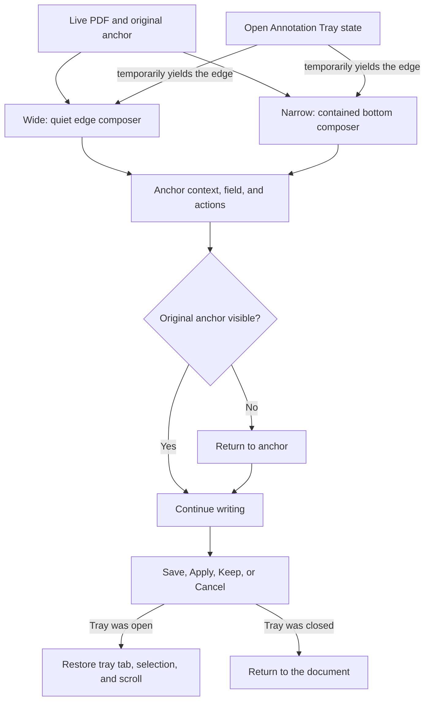
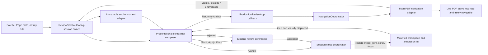

# Contextual Annotation Composer - Plan

## Goal Capsule

- **Objective:** Let reviewers create and revise annotations without abandoning a draft or losing the passage, caret, or page that gives the annotation meaning.
- **Means:** Replace review composer modals with one frozen authoring session, rendered in a non-framing edge surface and connected to guarded anchor visibility and return navigation (KTD1-KTD7).
- **Product authority:** This contract owns the authoring surface and its coordination with the PDF and Annotation Tray. Existing contracts retain authority over Review Item semantics, Save Destination, reading-state precedence, annotation persistence, and delivery.
- **Open blockers:** None.

---

## Product Contract

### Summary

Move all review annotation composers into a nonmodal edge surface that keeps the live PDF available during writing.
Preserve the original anchor, draft, deliberate reading position, and displaced Annotation Tray state throughout the authoring session.

### Problem Frame

The current composer isolates the text field from its source context.
When a reviewer forgets the exact wording or surrounding meaning, the practical workaround is to cancel the annotation, reread the PDF, and recreate the annotation from the beginning.
That interruption discards work, breaks reading flow, and makes longer or precise comments harder to compose confidently.

### Key Decisions

- **Use one quiet edge composer.** (session-settled: user-directed — chosen over a context-rich modal and an expandable modal: the live page provides stronger context with less interruption.) Governs R1-R7.
- **Keep document navigation free with a protected return.** (session-settled: user-directed — chosen over locking the PDF and unguarded navigation: readers can inspect elsewhere without losing the original anchor.) Governs R8-R13.
- **Cover the complete review composer family.** (session-settled: user-directed — chosen over text-anchored-only and creation-only coverage: replacement, insertion, comments, Page Notes, and edits should share one authoring grammar.) Governs R1, R3-R7, R20.
- **Give the edge one active job at a time.** (session-settled: user-directed — chosen over layered coexistence and closing without restoration: temporary takeover avoids clutter while preserving tray continuity.) Governs R14-R16.
- **Use a bottom surface on narrow screens.** (session-settled: user-approved — chosen over forcing the desktop edge shape into limited width: source context and reachability matter more than preserving the wide layout.) Governs R17-R20.

### Requirements

**Contextual authoring surface**

- R1. Replacement, insertion, highlight-comment, Page Note, and editable Review Item flows shall use one contextual composer family instead of a focus-trapping modal.
- R2. On wide surfaces, the composer shall occupy a quiet edge overlay without resizing or recentering the PDF.
- R3. A selection-anchored composer shall show the selected words in enough surrounding prose to disambiguate the target.
- R4. An insertion composer shall show the original caret position between its left and right textual context.
- R5. A Page Note composer shall identify the anchored page while keeping that page available in the live viewer.
- R6. When textual context is unavailable, the composer shall show the best available page and anchor identity without fabricating an excerpt.
- R7. Composer titles, hierarchy, and outcome labels shall follow the existing Compact Editorial authority in `CONCEPTS.md` and `docs/solutions/design-patterns/compact-editorial-language-for-annotation-modals.md`.

**Anchor and document continuity**

- R8. The draft shall remain bound to the anchor that opened it until the reviewer completes or cancels that draft.
- R9. The reviewer shall be able to scroll, zoom, and navigate the PDF without cancelling the draft or retargeting the annotation.
- R10. When the original anchor leaves the viewport, the composer shall expose a clear one-step Return to Anchor action.
- R11. Return to Anchor shall use the existing user-directed Meaningful Jump contract while preserving the draft.
- R12. Saving or cancelling after deliberate document navigation shall leave the PDF at the reviewer’s settled location.
- R13. Draft content and composer state shall survive document movement, Return to Anchor, and responsive presentation changes.

**Annotation Tray coordination**

- R14. When the Annotation Tray is open, the composer shall temporarily take over the same edge region instead of opening beside it.
- R15. Closing the composer shall restore the tray’s prior open state, active tab, selected item, and internal scroll position without moving the PDF.
- R16. When the Annotation Tray was closed before authoring, closing the composer shall return directly to the document without opening the tray.

**Responsive and interaction behavior**

- R17. On narrow surfaces, the same authoring session shall appear as a viewport-contained bottom surface with anchor context above the field.
- R18. The narrow presentation shall preserve the same draft, anchor, actions, validation, and return behavior as the wide presentation.
- R19. Keyboard and pointer users shall be able to move between the composer and PDF without closing the composer, with accessible names and visible focus throughout.
- R20. Existing per-mode optionality, whitespace rules, submission shortcuts, Save, Apply, Keep, Cancel, and Escape outcomes shall remain intact.

### Key Flows

- F1. Create an anchored annotation
  - **Trigger:** A reviewer chooses Replace, Insert, or Highlight from a selection or caret action.
  - **Steps:** The contextual composer opens at the edge, focuses the field, identifies the original anchor, and keeps the live PDF available while the reviewer writes.
  - **Outcome:** The reviewer completes or cancels the annotation without recreating the selection or losing the draft.
  - **Covered by:** R1-R4, R7-R9, R13, R19-R20.
- F2. Inspect elsewhere while drafting
  - **Trigger:** A reviewer scrolls, zooms, or navigates until the original anchor leaves view.
  - **Steps:** The draft remains tied to the original anchor, the composer exposes Return to Anchor, and the reviewer may return or continue writing from the new reading location.
  - **Outcome:** Completion preserves the annotation target and the reviewer’s last deliberate PDF location.
  - **Covered by:** R8-R13, R19.
- F3. Edit from the Annotation Tray
  - **Trigger:** A reviewer begins editing a mutable Review Item while the Annotation Tray is open.
  - **Steps:** The composer temporarily replaces the tray in the edge region and remembers the tray’s presentation state.
  - **Outcome:** Apply or Cancel restores the tray exactly where the reviewer left it without reframing the PDF.
  - **Covered by:** R1, R7-R9, R13-R16, R19-R20.
- F4. Add or edit a Page Note
  - **Trigger:** A reviewer starts a Page Note or edits an existing page-level Review Item.
  - **Steps:** The composer identifies the page, keeps the live page available, and presents the existing per-mode outcome actions.
  - **Outcome:** The Page Note shares the contextual authoring grammar without inventing a text selection.
  - **Covered by:** R1, R5-R7, R13, R17-R20.

### Acceptance Examples

- AE1. Complete a replacement without restarting
  - **Covers R1-R4, R7-R10, R13.**
  - **Given:** A reviewer opens Add Replacement from selected text and begins typing.
  - **When:** The reviewer needs to reread the surrounding passage before finishing.
  - **Then:** The live page and source context remain available, the draft stays intact, and the reviewer can apply the replacement on the first attempt.
- AE2. Keep the original anchor during exploration
  - **Covers R8-R13.**
  - **Given:** An anchored draft is open.
  - **When:** The reviewer navigates elsewhere or creates another transient selection in the PDF.
  - **Then:** The draft remains attached to its original anchor, Return to Anchor reaches that target, and closing preserves the reviewer’s last deliberate location.
- AE3. Restore an occupied Annotation Tray
  - **Covers R14-R16.**
  - **Given:** The Annotation Tray is open to a selected item at a non-default scroll position.
  - **When:** The reviewer edits the item and then applies or cancels the draft.
  - **Then:** The tray returns with the same tab, selected item, and internal scroll position while the PDF remains at its settled location.
- AE4. Preserve mode-specific context and outcomes
  - **Covers R1, R3-R7, R20.**
  - **Given:** A reviewer opens new and edit variants for replacement, insertion, highlight comment, and Page Note.
  - **When:** Each composer renders its source context and actions.
  - **Then:** Selection, caret, or page context matches the mode and the existing Save, Apply, Keep, Cancel, and validation semantics remain truthful.
- AE5. Continue across a narrow-layout change
  - **Covers R13, R17-R20.**
  - **Given:** A reviewer has typed a draft in the wide edge composer.
  - **When:** The viewport becomes narrow.
  - **Then:** The same draft appears in a contained bottom surface with reachable context and actions without remounting or data loss.
- AE6. Degrade safely when context cannot be reconstructed
  - **Covers R6, R8, R10, R13.**
  - **Given:** A mutable Review Item has an anchor but lacks reliable textual context.
  - **When:** Its composer opens or Return to Anchor cannot resolve the visible target.
  - **Then:** The composer preserves the draft and available anchor identity, reports the unavailable context, and never silently retargets the annotation.
- AE7. Move between writing and reading accessibly
  - **Covers R9, R19-R20.**
  - **Given:** A keyboard user opens a composer.
  - **When:** The user moves focus between the field, composer actions, and PDF controls.
  - **Then:** Focus remains visible, document commands do not mutate the draft target, and the user can complete or cancel through the existing keyboard outcomes.

### Success Criteria

- Reviewers can reread or inspect the PDF and complete an annotation without cancelling and recreating it.
- Every composer communicates which selection, caret, or page it will modify before the reviewer submits.
- Wide authoring leaves the PDF stable and available, while narrow authoring retains enough context to finish confidently.
- Tray-launched editing restores the displaced workspace state exactly and never overrides deliberate PDF navigation.
- Existing Review Item validation, action meaning, submission shortcuts, responsive state continuity, and annotation persistence remain unchanged; keyboard focus and navigation follow the nonmodal R19 and KTD6 contract.

### Scope Boundaries

- Save Destination remains a distinct modal workflow.
- This work does not change Review Item meaning, anchor persistence, PDF annotation projection, delivery, or save synchronization.
- This work does not add multiple simultaneous drafts, batch annotation entry, or a persistent authoring mode.
- This work does not place the Annotation Tray and composer side by side.
- This work does not embed a duplicate PDF viewer or frozen page-crop snapshot inside the composer.
- A new PDF selection never retargets an already-open draft.

### Dependencies and Assumptions

- Selection and caret anchors remain the source of textual and geometric context for anchored composers.
- Existing viewer navigation can resolve a stored Review Item anchor for an explicit Return to Anchor action.
- The reading-first overlay contract remains authoritative for preserving mounted viewer and draft state.
- Compact Editorial remains authoritative for title case, supporting-copy restraint, and per-mode action language.

### Sources and Research

- `CONCEPTS.md`
- `docs/plans/2026-08-07-002-feat-reading-first-pdf-review-interface-plan.md`
- `docs/plans/2026-08-08-001-fix-adaptive-annotation-tray-reflow-plan.md`
- `docs/plans/2026-08-21-0954-feat-compact-editorial-modal-language-plan.md`
- `docs/solutions/architecture-patterns/adaptive-annotation-tray-framing.md`
- `docs/solutions/design-patterns/compact-editorial-language-for-annotation-modals.md`
- `apps/web/src/pdf/selection-anchor.ts`
- `apps/web/src/review/CommentComposer.tsx`
- `apps/web/src/review/ContextActionPalette.tsx`
- `apps/web/src/app/ReviewShell.tsx`

---

## Planning Contract

Product Contract preserved except for the final Success Criteria wording correction that distinguishes intentionally changed nonmodal focus navigation from the keyboard semantics that remain unchanged.

### Key Technical Decisions

- KTD1. **Unify the split draft state into one frozen authoring session owned by `ReviewShell`.** Replace `textDraft` and `composer` with a discriminated session that records create-versus-edit mode, immutable source identity and document generation, selection/caret/page anchor, initial and current authoring semantics, trigger focus owner, and any displaced tray state. `ReviewShell` continues to construct and submit review commands; the composer remains presentational. This prevents later selections, navigation, or workspace changes from retargeting an open draft. A source-identity or generation mismatch immediately cancels the old session before the replacement `ReviewState` can become its command authority. Governs R1, R3-R9, R13-R16, R20.
- KTD2. **Render the composer in the existing drawer host without making it a framing surface.** Mount the wide edge surface in `review-drawer-host`, reuse the established workspace width and Warm Neutral tokens, and keep it out of `anyWorkspaceOpen`, Viewer Runway, and settled-reframe inputs. The PDF stays mounted at its current size and location while the composer visually occupies the edge. Governs R1-R2, R9, R12-R16.
- KTD3. **Derive truthful source context from the frozen anchor, with explicit fallbacks.** Selection sessions use stored quote, prefix, suffix, and geometry; insertion sessions place a caret marker between stored left and right context; Page Notes identify the stored page and nearby text; edit sessions derive the same context from the persisted Review Item payload. The page/anchor identity remains visible. Context wraps inside a bounded region; long excerpts use a deterministic compact preview and a Show Full Context disclosure that expands inside that region rather than growing the whole surface. When reliable prose cannot be recovered, show only page and anchor identity. Reuse `reviewItemPoint` for persisted item geometry and never synthesize source prose. Governs R3-R6, R8, R13, R17-R18.
- KTD4. **Treat Return to Anchor as a guarded Main Reading Thread Meaningful Jump.** Add read-only visibility for a neutral page point/location to the viewer navigation boundary, preserving the existing `visible | outside | unavailable` result. Supply a transient composer occlusion inset/rectangle separately from Viewer Runway: a point covered by the wide-right or narrow-bottom composer is `outside`, and Return alignment uses the same unobscured rectangle. This geometry affects only visibility and destination placement; it never enters framing, runway, or reflow state. `ProductionReviewApp` exposes session visibility and return callbacks backed by `NavigationCoordinator.navigateMainAnnotation`, so movement, history commit, operation currency, document generation, failure announcements, manual-intent reset, focus, and physical-no-op suppression remain centralized. This intentionally differs from reference-tab return, whose history policy is reference-local. Governs R8-R13, R19.
- KTD5. **Take over the tray presentation without closing or remounting its state owner.** If a workspace is open, keep `ReferenceWorkspace` and `OutlineAnnotationsWorkspace` mounted, mask the occupied presentation region with the composer, and make the displaced workspace inert and hidden from the accessibility tree for the session. Snapshot the originating mode, active item, actual annotation-viewport scroll, and focus target. While authoring, gate owned-mark activation, hidden-list activation, workspace-opening effects, and mode/rail changes so PDF interaction cannot mutate or open the displaced tray. Restore the snapshot after normal successful or user-cancelled closes without dispatching a workspace toggle or reframe; rejected submissions leave the takeover and draft active. Source replacement discards the old-document snapshot instead of restoring it. Governs R14-R16, R19-R20.
- KTD6. **Replace modal focus containment with explicit nonmodal input authority.** `CommentComposer` becomes a labeled nonmodal region/form with initial textarea focus, visible focus, local submission shortcuts, and no backdrop, `aria-modal`, or focus trap. Global Escape closes the active authoring session before other transient surfaces; authoring entry points are ignored while a session exists; PDF interaction may move focus without changing the session anchor. A Read Document control moves focus from the composer into the PDF, and a Return to Editor control in the reading surface restores focus to the active field. Save Destination remains the higher modal layer and temporarily makes the composer inert. Cancelling first-annotation Save Destination closes only that modal and preserves the authoring session; the composer-close signal advances only after the pending command is accepted. Governs R1, R8-R9, R13, R19-R20.
- KTD7. **Keep one mounted composer across wide and narrow presentations.** Presentation state changes CSS placement from the quiet right edge to a contained bottom surface without changing the session identity or component key. Both shapes render the same context, draft, validation, return state, and action set. The narrow surface is capped to the usable dynamic viewport and safe area; its title and actions remain persistently reachable while a named middle region owns context/field overflow and keeps the focused textarea above the software keyboard. Governs R13, R17-R20.

### High-Level Technical Design

```mermaid
stateDiagram-v2
  [*] --> Closed
  Closed --> OpenVisible: start authoring and anchor is visible
  Closed --> OpenOutside: start authoring and anchor is outside
  Closed --> OpenUnavailable: start authoring and visibility cannot resolve
  OpenVisible --> OpenOutside: reader navigates away
  OpenOutside --> OpenVisible: reader returns manually
  OpenOutside --> ReturnPending: Return to Anchor
  ReturnPending --> OpenVisible: current operation settles
  ReturnPending --> OpenOutside: navigation fails but target remains resolvable
  ReturnPending --> OpenUnavailable: document or geometry becomes unavailable
  ReturnPending --> Closed: Cancel / Escape cancels pending navigation
  ReturnPending --> SourceReplaced: source replaced; cancel pending navigation
  OpenUnavailable --> OpenVisible: geometry becomes ready and anchor is visible
  OpenUnavailable --> OpenOutside: geometry becomes ready and anchor is outside
  OpenVisible --> Closed: Save / Apply / Keep / Cancel
  OpenOutside --> Closed: Save / Apply / Keep / Cancel
  OpenUnavailable --> Closed: Cancel or valid completion
  OpenVisible --> SourceReplaced: source replaced; cancel old session
  OpenOutside --> SourceReplaced: source replaced; cancel old session
  OpenUnavailable --> SourceReplaced: source replaced; cancel old session
  Closed --> [*]: restore displaced tray and owned focus
  SourceReplaced --> [*]: discard old tray and focus snapshot
```

### Assumptions

- A newly opened session captures its anchor and tray origin synchronously before any focus or surface transition; later PDF selections may update the viewer selection state but cannot replace that session.
- Persisted Review Items contain enough page and geometric identity to navigate even when their older payload lacks quote, prefix, suffix, or nearby text. Missing prose uses the R6 fallback rather than blocking edit.
- Anchor visibility is recomputed from live viewer geometry after scroll, zoom, page, layout, and composer-occlusion changes within the captured document generation. A generation mismatch follows KTD1 and cancels the old session instead of refreshing it.
- `outside` is actionable and shows Return to Anchor; `visible` hides it; `unavailable` shows a truthful unavailable/retry state without claiming that the anchor is merely offscreen.
- Return to Anchor is the only composer action that deliberately moves the PDF. Save, Apply, Keep, Cancel, tray restoration, and responsive changes preserve the viewer's settled location.
- Keep the workspace mounted, and always capture and restore the actual annotation-viewport scroll because hidden effects or layout transitions may change it during authoring.
- Focus restoration prefers the originating tray edit control when it remains available, otherwise the originating palette/page control, and finally the stable workspace or viewer fallback already owned by the shell.
- Save Destination may open while a valid draft is pending because first annotation submission still needs destination confirmation. The composer remains mounted and inert until that modal resolves. Cancelling the destination modal does not advance the existing composer-close token; accepted pending-command execution does, and command rejection preserves the draft.

### Implementation Constraints

- Do not change Review Item payload meaning, command validation, selection/caret anchor persistence, Save Destination state ownership, or exact-once save behavior.
- Do not create a second PDF viewport, capture a bitmap excerpt, or copy source prose into mutable composer state.
- Do not add composer presence to `useWorkspaceFraming`, Viewer Runway, `anyWorkspaceOpen`, layout-generation keys, or workspace open/close reducers.
- Keep composer occlusion separate from Viewer Runway: it may alter read-only anchor classification and Return alignment, but it must not resize, recenter, settle, or otherwise move the PDF on its own.
- Do not call viewer scrolling primitives from React components. All Return to Anchor movement must pass through `NavigationCoordinator` and its current-operation/document-generation guards.
- Compare the session's captured source identity and document generation before every submit and pending-destination resume. On mismatch, emit no command, cancel pending return work, close without restoring old-document tray state, and announce that the draft belonged to the previous document.
- Preserve the existing per-mode titles and action language: Save for created comments and Page Notes, Apply for replacements, insertions, and edits, Keep plus Cancel for optional new highlights, and Cancel/Escape dismissal.
- Preserve required, optional, whitespace, Cmd/Ctrl+Enter, command-rejection, and selection-consumption semantics.
- Keep the displaced tray mounted but noninteractive and absent from the accessibility tree. Do not leave two focusable edge surfaces stacked in the same region.
- Keep one composer instance mounted across responsive changes; avoid breakpoint-derived keys or duplicated wide/narrow component branches.
- Rebuild `dist/web` before production-host browser verification.

### System-Wide Impact

- **State lifecycle:** Authoring moves from two nullable states plus nested-surface flags to one explicit session. Opening, command acceptance/rejection, Save Destination interruption, cancellation, document replacement, and unmount must each have a single close policy. Source replacement always cancels the old session before new review state can accept a command.
- **Viewer navigation and history:** A new neutral point/location visibility query extends the existing navigation adapter. Return uses the main annotation navigation transaction so Back/Forward, failure rollback, stale-operation cancellation, announcements, and focus remain consistent with other meaningful jumps.
- **Overlay geometry:** The active composer contributes a transient unobscured-view rectangle to visibility and Return placement only. It does not become framing state, so opening, resizing, or closing the composer cannot initiate PDF movement.
- **Workspace presentation:** Composer takeover affects visual and accessibility presentation only. Existing workspace reducers, active mode, item correspondence, list scroll, and framing state remain authoritative and mounted.
- **Input routing:** Removing the modal trap makes keyboard precedence explicit. Global authoring shortcuts, page actions, palette actions, Escape, save modal focus, PDF controls, and composer-local submit shortcuts must not compete for the same event.
- **Responsive CSS:** The composer shares workspace edge geometry and touch tokens but is not a workspace for framing. Wide right-edge and narrow bottom containment must be verified against short viewports and coarse pointers.
- **Persistence:** Review commands and stored annotations are unchanged. The frozen session supplies the same anchors and payload fields to existing command constructors.

### Risks and Dependencies

- **Accidental viewer movement:** Reusing workspace-open or runway signals for the composer would resize/recenter the PDF. Guard with explicit state assertions and measured browser geometry.
- **False-visible anchors:** A source point can lie inside the raw viewer viewport but under the composer. Classify against the unobscured rectangle and verify Return settles the point outside the overlay on wide and narrow surfaces.
- **Stale or misleading return state:** Geometry can be unavailable during document setup and outside after scrolling. Preserve the three-state result, recalculate after settled viewer events, and never render an unavailable target as a working Return button.
- **History pollution:** Return must commit exactly one meaningful main-thread jump only after movement settles, while already-visible or physically unchanged destinations remain no-ops. Cover Back/Forward and clamped destinations.
- **Lost tray continuity:** PDF interactions currently may clear the active annotation. Capture the session's tray origin before this can occur and restore it independently of the live active-item projection.
- **Competing authoring entry points:** Selection, caret, Page Note, annotation edit, and keyboard shortcuts can arrive while a session is open. Gate them centrally rather than allowing last-write-wins replacement.
- **Hidden tray mutation:** Viewer-owned annotation activation can currently open annotations mode and scroll a list row even when the tray is visually covered. Gate those parent effects during authoring and restore an actual captured viewport offset rather than assuming mounted DOM alone is sufficient.
- **Focus ambiguity:** Nonmodal authoring removes trap guarantees. Test the initial focus, deliberate PDF focus, Save Destination precedence, Escape order, close restoration, and fallbacks with keyboard-only interaction.
- **Browser variance:** Scroll settlement, focus restoration, inert behavior, and viewport geometry need Chromium and WebKit coverage.

### Sequencing

Implement U1 before presentation work so every flow has one durable session identity. Complete U2 before wiring the Return control in U3. Build U4 on the frozen session and existing mounted workspace state. Finish U5 only after behavior and geometry gates pass, updating visual baselines last.

---

## Implementation Units

### U1. Establish one immutable authoring-session contract

- **Goal:** Give every create and edit composer a single lifecycle owner and frozen source/tray context while preserving existing command semantics.
- **Requirements:** R1, R3-R9, R13-R16, R20; F1-F4; AE1-AE4, AE6-AE7; KTD1, KTD3, KTD5-KTD6.
- **Files:** `apps/web/src/app/ReviewShell.tsx`, `apps/web/src/app/ProductionReviewApp.tsx`, `apps/web/src/review/annotation-outline-context.ts`, `apps/web/test/review-layout.test.tsx`, `apps/web/test/review-surface-state.test.ts`, `apps/web/test/production-review-app.test.tsx`.
- **Approach:** Replace `TextDraft` and `Composer` with one discriminated `AuthoringSession` covering new replacement, insertion, highlight comment, Page Note, and mutable-item edits. Capture source identity/document generation, the selection/caret/page or persisted item anchor, selection-consumption generation, initial value, action semantics, originating trigger, current workspace presentation/mode/active item, and annotation viewport scroll at session creation. Route every start function through one guard so an existing session cannot be retargeted. Extend the pending destination record with captured source identity and generation so cancellation, accepted execution, rejection, and source replacement deliver distinct outcomes to `ReviewShell`. Route dismissal and accepted submission through one close coordinator; leave rejected commands and destination-confirmation handoffs open with the typed draft intact. Before submit or pending-command resume, cancel the session without emitting a command if source identity or generation changed.
- **Test Scenarios:** Open every create/edit mode and verify the immutable source context and exact Save/Apply/Keep/Cancel semantics. While typing, make a new PDF selection, invoke a Page Note/palette/global authoring shortcut, change active correspondence, and trigger a rejected command; the original session and draft remain authoritative. Resolve or cancel Save Destination and verify the composer-close token advances only after accepted execution, cancellation restores the draft, and rejection leaves it open. Replace the source while a draft or destination handoff is active and verify no old anchor can affect the new document.
- **Verification:** Focused Vitest coverage for session transitions and rendered ReviewShell state passes before component presentation changes begin.
- **Dependencies:** None.

### U2. Add semantic anchor visibility and guarded return navigation

- **Goal:** Tell the composer whether its frozen page point is visible and return to it through the existing meaningful-jump transaction.
- **Requirements:** R6, R8-R13, R19; F2; AE1-AE2, AE6-AE7; KTD3-KTD4.
- **Files:** `apps/web/src/pdf/viewer-navigation.ts`, `apps/web/src/pdf/viewer-navigation-adapter.ts`, `apps/web/src/review/navigation-coordinator.ts`, `apps/web/src/app/ProductionReviewApp.tsx`, `apps/web/src/app/ReviewShell.tsx`, `apps/web/test/viewer-navigation.test.ts`, `apps/web/test/navigation-coordinator.test.ts`, `apps/web/test/production-review-app.test.tsx`.
- **Approach:** Generalize the adapter's existing semantic visibility calculation so a neutral page index plus natural page point can produce `visible`, `outside`, or `unavailable` against the usable live viewport without moving it. Accept transient composer occlusion geometry as a separate read-only input, subtract it from the usable rectangle for classification, and use the same rectangle to choose or verify Return alignment without publishing runway. Feed the frozen session point from `reviewItemPoint`, selection/caret geometry, or Page Note position through a ProductionReviewApp-owned visibility and Return seam. Implement Return by calling `navigateMainAnnotation`; preserve its operation fencing, cancel-pending behavior, manual-scroll-intent reset, settle-before-history commit, rollback, focus, announcement, and physical-no-op handling. Refresh presentation only for the current session/document generation.
- **Test Scenarios:** Classify mounted visible, mounted outside, unmounted-page outside, wide-right-covered outside, narrow-bottom-covered outside, invalid geometry unavailable, missing viewer unavailable, runway-adjusted, zoomed, and rotated anchors. Return from outside and prove one history entry, Back/Forward traversal, draft preservation, final focus, no workspace close, and an anchor settled inside the unobscured region. Prove tray-closed fit-width and narrow-bottom occlusion do not create runway or reframe. Prove already-visible and clamped physical no-ops do not add history; failed and superseded returns preserve the current reading location and draft with a truthful retry state. Prove stale-generation and source-replacement completions are ignored after the old session is cancelled.
- **Verification:** `pnpm exec vitest run apps/web/test/viewer-navigation.test.ts apps/web/test/navigation-coordinator.test.ts apps/web/test/production-review-app.test.tsx`.
- **Dependencies:** U1.

### U3. Convert `CommentComposer` into a contextual nonmodal surface

- **Goal:** Keep the live PDF usable while showing exactly what selection, caret, or page the current field will affect.
- **Requirements:** R1-R13, R17-R20; F1-F2, F4; AE1-AE2, AE4-AE7; KTD2-KTD4, KTD6-KTD7.
- **Files:** `apps/web/src/review/CommentComposer.tsx`, `apps/web/src/app/ReviewShell.tsx`, `apps/web/src/app/review-layout-dialogs.css`, `apps/web/src/app/review-layout-annotations.css`, `apps/web/src/app/review-layout-responsive.css`, `apps/web/src/app/review-layout-foundation.css`, `apps/web/test/comment-composer.test.tsx`, `apps/web/test/control-tooltips.test.ts`.
- **Approach:** Replace the backdrop/dialog wrapper with a labeled nonmodal authoring region and form. Render a compact source-context block before the textarea: marked selected quote with restrained prefix/suffix, a caret marker between left/right context, or Page N plus reliable nearby text. Keep page/anchor identity visible, wrap short text, and give long excerpts a deterministic compact preview plus Show Full Context expansion inside a bounded context region. Render page/anchor-only or unavailable fallbacks without invented prose. Add visible/outside/unavailable/pending Return presentation, preserve the existing Compact Editorial header/footer and review-button styling, and keep titles free of redundant field labels. Add paired Read Document and Return to Editor focus-transfer controls. Move Escape and focus restoration to the shell-owned lifecycle; cancelling while Return is pending first cancels navigation, then closes normally. Retain initial textarea focus, validation, whitespace rules, and Cmd/Ctrl+Enter.
- **Test Scenarios:** Render all mode/context combinations including long excerpts, compact/expanded disclosure, missing prefix/suffix, empty caret sides, missing persisted prose, unavailable geometry, and long Page Note text. Verify accessible region naming, readable mark/caret semantics, no modal attributes or focus trap, visible focus, paired keyboard focus transfer, exact button labels/states, Return visibility states, pending cancellation, Escape, and submit shortcuts.
- **Verification:** `pnpm exec vitest run apps/web/test/comment-composer.test.tsx apps/web/test/control-tooltips.test.ts apps/web/test/review-layout.test.tsx` and `pnpm typecheck`.
- **Dependencies:** U1-U2.

### U4. Coordinate tray takeover, focus, and responsive continuity

- **Goal:** Let the composer own the occupied edge temporarily, then restore the exact prior workspace experience without moving the document.
- **Requirements:** R2, R9, R12-R20; F2-F4; AE2-AE5, AE7; KTD2, KTD5-KTD7.
- **Files:** `apps/web/src/app/ReviewShell.tsx`, `apps/web/src/review/ReferenceWorkspace.tsx`, `apps/web/src/review/OutlineAnnotationsWorkspace.tsx`, `apps/web/src/review/AnnotationList.tsx`, `apps/web/src/app/review-layout-annotations.css`, `apps/web/src/app/review-layout-responsive.css`, `apps/web/test/review-layout.test.tsx`, `apps/web/test/review-surface-state.test.ts`, `test/acceptance/review-workflow.spec.ts`.
- **Approach:** Render the composer inside `review-drawer-host` above the same right/bottom region as the workspace. Keep both workspace components mounted with their real open/mode state, but apply inert/aria-hidden takeover state while composing. Do not toggle workspace reducers or framing inputs. At the shell boundary, gate owned-mark activation requests, workspace-opening effects, hidden-list activations, and workspace mode/rail controls during authoring. Capture and restore the actual annotation viewport scroll, originating mode/item, and focus owner on close; avoid leaf-component changes unless inert, scroll, or focus evidence requires them. Keep Save Destination above the authoring layer and inert the composer while it is open. Use one DOM instance and presentation attributes for wide-right and narrow-bottom shapes. Cap narrow height with the usable dynamic viewport and safe area, keep header/actions sticky, and put context plus field in an internal scroll region whose focused textarea remains visible above the software keyboard.
- **Test Scenarios:** Start from tray closed and from each open mode; edit a non-first item at a nonzero list scroll, activate a different owned PDF mark, read elsewhere, resize wide-to-narrow-and-back, then Apply or Cancel. Verify hidden parent effects neither open nor mutate the tray, the workspace stayed mounted/inert, and it returns with the same mode, item, exact scroll, and focus; the PDF geometry and settled location do not change. Verify a tray-closed origin stays closed after mark activation. On short narrow viewports and with the software-keyboard-sized visual viewport, verify title/actions remain reachable and the focused field remains visible. Verify Save Destination temporarily owns focus, cancellation restores the draft, accepted execution closes once, and global Escape closes the correct topmost surface.
- **Verification:** Focused ReviewShell unit tests plus `pnpm build:web && pnpm exec playwright test test/acceptance/review-workflow.spec.ts`.
- **Dependencies:** U1-U3.

### U5. Lock browser, accessibility, and visual behavior across the composer family

- **Goal:** Prove the new authoring interface solves the reread/recreate failure without regressing review commands, viewer stability, tray continuity, or responsive access.
- **Requirements:** R1-R20; F1-F4; AE1-AE7; KTD1-KTD7.
- **Files:** `test/acceptance/review-workflow.spec.ts`, `test/acceptance/production-flow.spec.ts`, `test/acceptance/review-harness/visual-scenarios.tsx`, `test/acceptance/review-harness/main.tsx`, `test/acceptance/review-visual.spec.ts`, `test/acceptance/review-visual.spec.ts-snapshots/`.
- **Approach:** Extend the production-style harness to deterministically open every create/edit authoring mode with realistic source context and return states. Add workflow coverage for free PDF navigation, immutable targeting, Return history, unavailable recovery, Save Destination interruption, tray takeover/restoration, keyboard focus, touch geometry, reduced motion, and same-session responsive changes. Measure PDF and tray geometry before accepting visual snapshots; update intentional baselines only after functional gates pass.
- **Test Scenarios:** Complete replacement, insertion, highlight-with-comment, highlight-with-Keep, Page Note, and every edit variant without recreating the source action. Reread nearby and distant pages while preserving the draft; use and decline Return; traverse Back/Forward after Return; survive resize and document geometry settlement; exercise keyboard-only and coarse-pointer flows. Compare wide right-edge, wide tray-takeover, narrow bottom, long-context, unavailable-anchor, and Save-Destination-over-composer scenes under normal and reduced motion.
- **Verification:** Run the Verification Contract gates in order; no visual baseline update may mask a functional, geometry, focus, or accessibility failure.
- **Dependencies:** U1-U4.

---

## Verification Contract

| Gate | Command | Proves |
|---|---|---|
| Focused authoring and navigation units | `pnpm exec vitest run apps/web/test/comment-composer.test.tsx apps/web/test/review-layout.test.tsx apps/web/test/review-surface-state.test.ts apps/web/test/viewer-navigation.test.ts apps/web/test/navigation-coordinator.test.ts apps/web/test/production-review-app.test.tsx apps/web/test/control-tooltips.test.ts` | Frozen session transitions, context semantics, visibility, meaningful return, workspace restoration, save interruption, keyboard labels, and component behavior. |
| Type safety | `pnpm typecheck` | Session unions, viewer/navigation ports, component props, and callbacks compose without unsafe gaps. |
| Review regression suite | `pnpm test:review` | Existing review commands, reducers, persistence, navigation, and layout contracts remain intact. |
| Production web build | `pnpm build:web` | Production-host tests and screenshots use current markup and CSS. |
| Chromium contextual workflow | `pnpm exec playwright test test/acceptance/review-workflow.spec.ts test/acceptance/production-flow.spec.ts` | End-to-end authoring, Save Destination handoff, tray restoration, PDF continuity, and history behavior in the primary engine. |
| WebKit contextual workflow | `pnpm exec playwright test --config playwright.webkit.config.ts test/acceptance/review-workflow.spec.ts test/acceptance/production-flow.spec.ts` | Focus, inert, scroll settlement, and responsive behavior in the second engine. |
| Visual baseline update | `pnpm exec playwright test --config playwright.visual.config.ts test/acceptance/review-visual.spec.ts --update-snapshots` | Records intentional contextual-composer presentation only after behavioral and geometry gates pass. |
| Visual regression | `pnpm test:visual` | Rebuilds production assets and verifies all deterministic wide/narrow baselines. |

The focused unit gate remains mandatory even if `test:review` passes because the umbrella script does not replace every component, tooltip, production-shell, and adapter-specific assertion. Browser failures caused solely by previously acknowledged missing Linux visual baselines or external GitHub billing remain infrastructure residuals; local functional and geometry failures are not waived.

---

## Definition of Done

- U1 is complete when one frozen authoring session owns every create/edit mode, a second entry point cannot retarget it, rejected/destination-gated commands preserve it, and accepted or cancelled flows close exactly once.
- U2 is complete when live page-point visibility distinguishes visible, outside, and unavailable; Return uses guarded main-thread navigation; history, stale operations, failures, no-ops, and focus are covered.
- U3 is complete when the composer is nonmodal, the PDF is keyboard/pointer reachable, every mode shows truthful source context or fallback, and existing title/action/validation semantics remain exact.
- U4 is complete when the composer takes over the occupied edge without joining framing, the tray remains mounted and inert, wide/narrow changes preserve one session, and normal accepted or user-cancelled close paths restore the prior tray mode, item, scroll, and owned focus without moving the PDF; source replacement discards the old-document snapshot.
- U5 is complete when focused units, typecheck, review suite, production build, Chromium workflows, WebKit workflows, and reviewed visual regression pass, subject only to the explicitly accepted external CI/baseline residuals.
- Every Product Contract requirement, flow, and acceptance example traces to at least one implementation unit and verification gate.
- A reviewer can start any supported annotation, reread the live PDF, and finish without cancelling and recreating the annotation.
