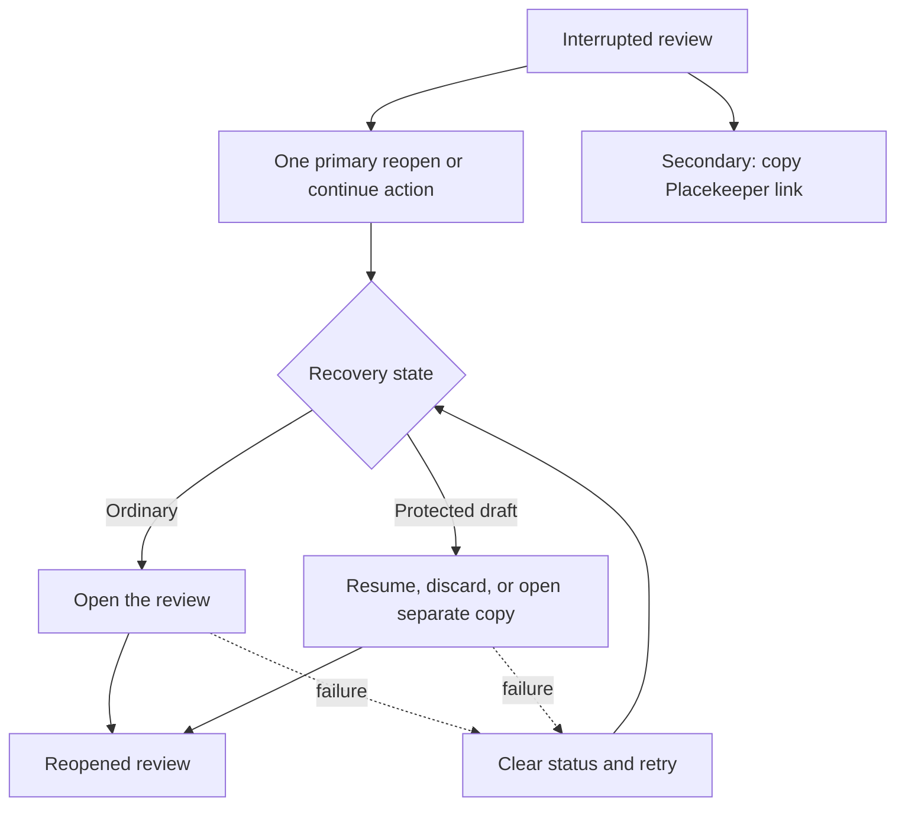

# Compact Editorial Recovery Surface - Plan

## Goal Capsule

- **Objective:** Let a reviewer recover an interrupted Placekeeper review through the fewest meaningful choices while immediately understanding what will happen.
- **Means:** Reframe the terminal refresh page as a state-aware Compact Editorial recovery surface while preserving the existing reopen endpoint and strengthening its recovery and authority boundaries (KTD1-KTD6).
- **Product authority:** This contract owns the recovery page's hierarchy, visible actions, and interaction sequence. Existing Placekeeper link, task binding, protected-draft, authentication, and recovery contracts retain authority over their semantics.
- **Open blockers:** None.
- **Stop conditions:** Stop if ordinary one-click recovery would require filesystem access on stale-page GET, bypass server-side PDF validation, weaken confirmation for other launch surfaces, or infer prior task authority.
- **Execution profile:** Expanded code change with security-sensitive local-file, protected-draft, and restart-reconnect boundaries.
- **Tail ownership:** The implementation workflow owns focused unit, browser, WebKit, visual, and distribution verification before shipping.

---

## Product Contract

### Summary

Turn the interrupted-review page into a dedicated full-page Compact Editorial recovery surface.
Ordinary recovery takes one explicit click, while protected-draft choices appear after the same safe user gesture only when they are meaningful.

### Problem Frame

The current terminal page combines a generic reopen action, a later confirmation, protected-draft recovery choices, status and retry states, copy controls, and two raw link fields in one flat card.
Reviewers must interpret controls with inconsistent sizing and hierarchy, and ordinary recovery asks them to confirm the same intent twice.
The surface does not yet use the Compact Editorial structure established by the application's current modal family.

### Key Decisions

- **Use one state-aware Compact Editorial recovery surface.** (session-settled: user-directed — chosen over styling-only regularization and automatic retry: it simplifies the flow while preserving deliberate local-file action.) Governs R1-R4, R7-R10.
- **Make ordinary reopen a single explicit action.** (session-settled: user-directed — chosen over the current reopen-then-confirm sequence: the first click already expresses the reviewer's intent.) Governs R2.
- **Expose one secondary Placekeeper-link copy action.** (session-settled: user-directed — chosen over displaying both raw link fields: the useful escape hatch remains without making link mechanics part of the main task.) Governs R5-R6.
- **Preserve all protected-draft outcomes.** (session-settled: user-directed — chosen over collapsing the recovery model: resume, discard, and separate-copy remain available with a clear hierarchy.) Governs R3-R4.
- **Keep the recovery page full-screen rather than presenting a literal modal.** (session-settled: user-approved — chosen over changing the host surface: the page adopts Compact Editorial's grammar without pretending an underlying review is still interactive.) Governs R1, R7-R9.
- **Keep protected-draft discovery behind a user gesture.** (session-settled: user-directed — chosen over automatic local-file preflight: the stale page remains inert and filesystem-free until the reviewer acts.) Governs R2-R4, R10.

The recovery surface changes its action region according to the state that requires a decision:



### Requirements

**Surface structure and action grammar**

- R1. The terminal page shall use a dedicated full-page Compact Editorial hierarchy with a direct title, concise task guidance, a human-readable filename plus parent-folder hint derived from the canonical Placekeeper Link, a state-specific body, and a consistent action region. The identity treatment shall distinguish same-named PDFs without showing the full path by default.
- R2. An ordinary interrupted review shall present one primary reopen action whose activation both confirms intent and starts the reopen, with no second confirmation action.
- R3. When the initial user gesture discovers a protected draft, the surface shall replace the ordinary action with Resume draft as the recommended action while keeping Discard draft and Open separate copy available. Concise consequence copy shall explain each outcome. Discard draft shall enter a targeted confirmation state that names the PDF and permanent consequence before the destructive request is sent; this safeguard is distinct from the removed generic reopen confirmation.
- R4. Protected-draft choices shall retain their current resume, discard, and separate-copy meanings and consequences.
- R5. The surface shall offer one secondary Copy Placekeeper link action.
- R6. The surface shall not display persistent raw Browser link or Placekeeper task link fields in its default layout.
- R7. Buttons and button-like links shall share the application's current action sizing, spacing, typography, focus treatment, and primary-versus-secondary hierarchy.

**State, continuity, and safety**

- R8. Busy, success, error, and retry states shall remain clear without displacing the task title or causing the available action hierarchy to jump unpredictably.
- R9. The surface shall preserve keyboard operation, visible focus, appropriate focus movement after state changes, accessible names, touch-sized controls, and narrow-viewport containment.
- R10. The redesign shall preserve existing Placekeeper link validation, explicit user-intent boundaries, task-binding limits, protected-draft safeguards, and recovery outcomes.
- R11. A failed ordinary reopen, protected-draft decision, or copy action shall provide an in-context recovery path without requiring the reviewer to reconstruct or edit a raw link. If clipboard access is unavailable, the copy failure state shall reveal one temporary read-only, selectable canonical Placekeeper Link alongside Retry; raw link fields remain absent in every nonfailure state.

### Key Flows

- F1. Ordinary interrupted review
  - **Trigger:** A reviewer reaches a terminal refresh page and no protected draft requires a choice.
  - **Steps:** The page names the PDF, explains that the review was interrupted and that unfinished work may require a follow-up choice, and presents one primary reopen action plus the secondary copy-link action.
  - **Outcome:** One click reopens the review, or the same surface reports a recoverable failure.
  - **Covered by:** R1-R2, R5-R11.
- F2. Protected-draft recovery
  - **Trigger:** The interrupted review has a protected draft that requires a recovery decision.
  - **Steps:** The reviewer activates the initial recovery action, after which the page explains the discovered draft state and presents Resume draft, Discard draft, and Open separate copy in a clear hierarchy.
  - **Outcome:** The selected recovery path runs with its existing meaning, or the same surface reports a recoverable failure.
  - **Covered by:** R1, R3-R5, R7-R11.
- F3. Link-copy fallback
  - **Trigger:** A reviewer wants to reopen elsewhere or preserve the canonical Placekeeper link.
  - **Steps:** The reviewer activates Copy Placekeeper link and receives clear success or failure feedback.
  - **Outcome:** The canonical link is copied without exposing duplicate raw-address fields.
  - **Covered by:** R5-R6, R8-R9, R11.

### Acceptance Examples

- AE1. One-click ordinary recovery
  - **Covers R1-R2, R7-R10.**
  - **Given:** An interrupted review has no protected draft requiring a choice.
  - **When:** The reviewer activates the primary reopen action.
  - **Then:** The filename and parent-folder hint are visible before activation, same-named PDFs are distinguishable, reopening begins immediately, and no second Open this PDF confirmation appears.
- AE2. Gesture-gated protected-draft decision
  - **Covers R3-R4, R7-R10.**
  - **Given:** An interrupted review has a matching protected draft.
  - **When:** The reviewer activates the initial recovery action and the protected draft is discovered.
  - **Then:** Resume draft becomes visually recommended; all three consequences are explained; Discard draft requires one targeted destructive confirmation; and Open separate copy remains available without another generic confirmation step.
- AE3. Clean secondary utility
  - **Covers R5-R6, R8-R9, R11.**
  - **Given:** Any interrupted-review recovery state is visible.
  - **When:** The reviewer scans the surface or copies the Placekeeper link.
  - **Then:** One copy-link action is available, duplicate raw link fields are absent, and copy success or failure is announced in context. Only a clipboard failure reveals one temporary selectable canonical value alongside Retry.
- AE4. Recoverable failure
  - **Covers R8-R11.**
  - **Given:** A reopen, draft-recovery, or copy operation fails.
  - **When:** The failure is reported.
  - **Then:** The reviewer retains context, focus moves to useful feedback or the next action, and an appropriate retry or alternative remains available.
- AE5. Responsive and accessible continuity
  - **Covers R7-R10.**
  - **Given:** The recovery surface is used with a keyboard, a coarse pointer, or a narrow viewport.
  - **When:** The reviewer navigates ordinary, draft-recovery, and error states.
  - **Then:** Controls remain reachable and consistently sized, focus remains visible, text and actions stay contained, and state is not communicated by color alone.
- AE6. No automatic local-file action
  - **Covers R2, R10.**
  - **Given:** A stale recovery URL loads in a browser.
  - **When:** The reviewer has not activated an action.
  - **Then:** The page derives only descriptive link and location data and does not inspect a local file, query protected-draft state, reopen a file, or mutate recovery state.

### Success Criteria

- Ordinary recovery requires one deliberate click rather than two confirmations.
- Protected-draft recovery preserves all existing outcomes while keeping local-file inspection behind a user gesture and making the safest continuation easiest to identify.
- Every visible action follows one size and hierarchy grammar, and raw link mechanics no longer compete with the recovery task.
- Existing terminal error, retry, focus, and link-label contracts continue to work, with recovery-specific responsive and accessibility coverage added where current coverage is incomplete.

### Scope Boundaries

- This work does not automatically reopen a local file merely because a stale page loads.
- This work does not change Placekeeper link syntax, validation, authentication, task binding, protected-draft semantics, or resume, discard, and separate-copy outcomes.
- This work does not turn the terminal page into an overlay on an inactive review or redesign unrelated modals and menus.
- This work does not add advanced link inspection, link editing, recovery history, or new draft-recovery outcomes.

### Dependencies and Assumptions

- Compact Editorial is the current modal design precedent, not an existing property of the terminal recovery page.
- The initial explicit recovery action is the authority boundary for file confirmation and protected-draft discovery.
- Existing terminal behavior covers status, errors, retry, focus, and labeled link controls, but responsive and accessibility verification must be extended specifically to the redesigned recovery surface.
- The Warm Neutral design language remains authoritative for color, typography, geometry, elevation, and state treatment.

### Sources and Research

- `CONCEPTS.md`
- `docs/plans/2026-08-21-0954-feat-compact-editorial-modal-language-plan.md`
- `apps/service/src/server/http-server.ts`
- `apps/service/src/sessions/session-broker.ts`
- `apps/web/src/production-entry.tsx`
- `apps/web/src/app/review-layout.css`
- `apps/web/src/app/review-layout-dialogs.css`
- `apps/web/src/review/CommentComposer.tsx`
- `apps/web/src/save/SaveDestinationDialog.tsx`
- `test/acceptance/reloadable-links.spec.ts`
- `test/acceptance/review-visual.spec.ts`

---

## Planning Contract

The Product Contract changed after planning research: R3, F2, AE2, AE6, Success Criteria, and one assumption now make protected-draft discovery gesture-gated. The user selected this revision to preserve the inert stale-page security boundary; all other product scope and stable IDs are unchanged.

### Key Technical Decisions

- KTD1. **Treat the first terminal button activation as the file confirmation.** The terminal client shall send the existing reopen request with confirmation on that user gesture, while the service keeps canonicalization, regular-PDF checks, header validation, and recovery discovery immediately after the boundary. (session-settled: user-directed — chosen over reopen followed by a duplicate confirmation: the first explicit button already communicates the exact recovery action.) Governs R2, R8-R11.
- KTD2. **Keep protected-draft discovery on the existing gesture-gated POST.** The stale GET and descriptive route parser remain filesystem-free; an ordinary result redirects, while a recovery-offered result replaces the action region with the three current decisions. (session-settled: user-directed — chosen over automatic local-file preflight: the stale page must remain inert until the reviewer acts.) Governs R3-R4, R8-R10.
- KTD3. **Adopt Compact Editorial through terminal-specific structure and shared visual tokens.** Add a full-page recovery frame with header, body, status, and footer hooks that aliases the established modal grammar without mounting a dialog or changing live-review component ownership. (session-settled: user-approved — chosen over a literal modal or a cross-application component rewrite: the terminal page needs family resemblance without inheriting modal behavior.) Governs R1, R7-R9.
- KTD4. **Make the canonical Placekeeper Link the only copy payload.** Reuse the existing copy-command status model, remove persistent raw address fields from the enhanced DOM, and reveal one temporary selectable canonical value only after clipboard failure. (session-settled: user-directed — chosen over browser-link copying and default raw fields: the portable task link is the useful fallback.) Governs R5-R6, R8-R11.
- KTD5. **Prove authority and interaction semantics before accepting visual baselines.** Keep request-shape, inert-load, recovery-state, copy-payload, focus, and retry assertions independent from responsive geometry and snapshots. Governs R7-R11.
- KTD6. **Bind protected recovery decisions to an exact expiring offer and idempotent operation.** The broker shall identify the offered draft and source state, reject stale or mismatched decisions, replay a committed same-operation result, and remove protected data only after its replacement is durable and active. (review-derived obligation — required by existing protected-work and retry contracts: a stateful recovery UI must not let a retry target different work or duplicate a committed fork.) Governs R3-R4, R8-R11.

### High-Level Technical Design

```mermaid
sequenceDiagram
  participant Browser as Stale browser tab
  participant Route as Loopback route
  participant Link as Placekeeper link opener
  participant Broker as Session broker

  Browser->>Route: GET readable stale URL
  Route-->>Browser: Inert terminal shell and descriptive link base
  Note over Browser,Route: No resume, reopen POST, filesystem access, or authority upgrade
  Browser->>Route: User click POST reopen with confirmed=true
  Route->>Link: Decode and validate the canonical Placekeeper Link
  Link->>Broker: Open validated PDF and inspect recoverable drafts
  alt Ordinary review
    Broker-->>Browser: Opened or focused bootstrap URL
    Browser->>Browser: Navigate to fresh review
  else Protected draft
    Broker-->>Browser: Recovery offered: resume, discard, fork
    Browser->>Route: User choice POST with confirmed=true and recovery decision
    Route-->>Browser: Opened or focused bootstrap URL
    Browser->>Browser: Navigate to fresh review
  else Safe failure
    Route-->>Browser: Rejected or malformed result
    Browser->>Browser: Preserve relevant actions and show retryable feedback
  end
```

### Assumptions

- The enhanced JavaScript surface uses an actual button for the POST-backed recovery action. The existing module-load failure script retains its canonical page-1 external-protocol fallback; with JavaScript disabled entirely, the server shell remains inert.
- The recovery body derives a human-readable filename from the canonical link for an informed first click without showing the full path or restoring raw URL fields.
- A recovery offer is actionable only when it contains exactly the three supported unique choices, in any order. Partial, duplicate, or unknown choice sets are safe retryable failures; visual hierarchy follows semantic choice rather than response order.
- A failed protected-draft choice preserves the draft-choice context. A failed ordinary reopen restores the ordinary primary action.

### Implementation Constraints

- Keep `GET /r/<view-id>/...` descriptive and inert. It must not call the resume or reopen endpoint, inspect the filesystem, query recovery state, navigate to `placekeeper:`, or stage reconnect authority.
- Keep `POST /r/<view-id>/reopen` as the only enhanced recovery action boundary and preserve its method, JSON, Host/Origin, link-validation, and recovery-decision guards.
- Do not weaken the confirmation guard used by native launchers or other clients. Only the terminal client's explicit first action supplies the existing `confirmed: true` signal.
- Preserve the canonical fragment codec and page-1 fallback for malformed or future fragments.
- Keep the user-visible resume, discard, and fork outcomes broker-owned. Harden their selection and retry protocol without changing what each completed outcome means; every follow-up request must retain confirmation and carry exactly the selected recovery decision.
- Bind each recovery offer to the exact recovered session, canonical source identity, source digest, and expiry through an opaque offer identifier. Follow-up decisions must present that identifier, reject changed, mismatched, expired, or replayed offers, and handle more than one matching draft deterministically rather than selecting an unspecified first entry.
- Give each recovery decision an idempotent operation identity. A retry after an ambiguous response must return or focus the already-created outcome instead of creating a second fork, deleting a different draft, or issuing a competing reconnect launch.
- For discard, persist and activate the replacement review before removing protected recovery data. Any failure before successful replacement must leave the original protected draft recoverable; a removal failure may leave redundant protected data but must not lose the reopened review.
- Keep reconnect staging scoped to the exact stale route and fresh browser launch. A reopened browser must not infer a prior task, credential, generation, or agent-context state.
- Use semantic buttons, truthful visible labels, accessible status and alert regions, real disabled and busy states, and deterministic focus movement.
- After each DOM replacement, use this focus contract: initial load to the heading; recovery offer to Resume draft; ordinary failure to its focusable alert followed by the primary retry in tab order; draft-choice failure to its focusable alert while retaining all decisions; and copy failure to Retry while exposing its selectable fallback immediately after it.
- Extend Warm Neutral variables, action tokens, narrow containment, coarse-pointer targets, reduced-motion behavior, and focus styling to the terminal namespace without broadening production-root layout rules.
- Remove Browser link and Placekeeper task link inputs from the enhanced DOM rather than visually hiding them.
- Accept bootstrap navigation only when the returned URL has the exact current loopback origin and canonical bootstrap path, no credentials or query, and one capability fragment. Reject alternate ports, localhost aliases, and other loopback origins before navigation.

### System-Wide Impact

- **Local-file authority:** The first enhanced recovery click moves confirmation earlier in the client sequence but does not move or remove server-side file validation.
- **Protected recovery:** Draft discovery and all resume, discard, and fork state transitions remain broker-owned after an explicit gesture.
- **Recovery transaction:** The HTTP and host protocols carry an opaque offer plus operation identity so the broker can bind, expire, replay, and safely commit each decision.
- **Restart reconnect:** The reopened review still receives fresh browser authority and follows the existing separate task-side reconnect handshake.
- **Browser fallback:** An app-module load failure keeps the existing canonical page-1 external-protocol fallback. A fully JavaScript-disabled page stays inert and gains no local-file authority.

### Risks and Mitigations

- **Confirmation becomes visually under-informed:** Removing raw links could obscure the file being opened or make same-named PDFs indistinguishable. Derive and show the filename plus parent-folder hint, connect that identity to the primary action's accessible description, and keep the action label specific.
- **Destructive recovery looks reversible:** A compact secondary action could hide the effect of discarding a protected draft. State the permanent consequence, require a targeted destructive confirmation, and use a treatment that does not rely on color alone.
- **A retry targets changed or already-processed recovery state:** Bind decisions to an expiring exact offer and an idempotent operation identity, revalidate immediately before mutation, and replay the committed result rather than the mutation.
- **Recovery errors collapse to the wrong state:** A generic catch could erase the three draft choices. Retain the active decision state and restore focus to useful feedback or the recommended retry.
- **Shared selectors leak live-review layout:** Terminal token reuse could accidentally inherit fixed-root or modal semantics. Share values and presentation selectors only; keep root positioning and dialog behavior scoped.
- **Browser timing becomes flaky:** Successor startup and recovery can expose documented loading or retry states. Assert stable semantic outcomes and exercise in-product retries in Chromium and WebKit.

### Sequencing

Implement U1 before U2 so the final state hooks and action semantics exist before styling. Complete U2 before U3 so browser assertions and visual baselines cover the final hierarchy. Keep all nonvisual authority and behavior gates green before accepting snapshot changes.

---

## Implementation Units

### U1. Build the state-aware recovery interaction

- **Goal:** Replace the flat terminal DOM and duplicate confirmation with one semantic recovery renderer that preserves ordinary, protected-draft, copy, busy, and failure states.
- **Requirements:** R1-R6, R8-R11; F1-F3; AE1-AE4, AE6; KTD1-KTD6.
- **Dependencies:** None.
- **Files:** `apps/web/src/production-entry.tsx`, `apps/web/src/app/session-api.ts`, `apps/web/test/production-entry.test.ts`, `apps/web/test/session-api.test.ts`, `apps/service/src/sessions/session-broker.ts`, `apps/service/src/links/placekeeper-link.ts`, `apps/service/src/server/http-server.ts`, `apps/service/src/host/placekeeper-host.ts`, `apps/service/test/session-security.test.ts`, `apps/service/test/recovery.test.ts`, `apps/service/test/placekeeper-link.test.ts`, `apps/service/test/launch-host.test.ts`, `test/acceptance/reloadable-links.spec.ts`.
- **Approach:**
  1. Preserve the server anchor as fallback and descriptive data, then replace the enhanced surface with terminal-specific header, body, status, action, and footer hooks.
  2. Use a real primary button whose first request cites KTD1 and sends confirmation on the existing reopen endpoint.
  3. Model ordinary, recovery-offered, discard-confirmation, pending, and error states so each render owns its available actions and focus destination.
  4. Require exactly the supported resume, discard, and fork choices; retain the opaque recovery-offer and operation identities on every decision; keep requests confirmed; and map choices to truthful consequence copy and fixed visual hierarchy independent of backend order.
  5. Point the copy command at the canonical Placekeeper Link, remove both persistent raw inputs, and reveal one temporary selectable canonical value only when clipboard access fails.
- **Execution note:** Keep fragment and response-shape coverage in Node Vitest. Add DOM, request, focus, and clipboard state-transition coverage to the existing Playwright successor suite before changing the terminal renderer; do not add a browser-emulation dependency solely for this surface.
- **Patterns to follow:** `apps/web/src/review/CopyLinkControl.tsx` for copy status and focus semantics; `apps/web/src/save/SaveDestinationDialog.tsx` for task-specific recovery verbs and action hierarchy; `apps/service/src/links/placekeeper-link.ts` for the confirmation and validation boundary.
- **Test scenarios:**
  - Covers F1 / AE1. Initial render derives the canonical supported fragment and human-readable filename, focuses the heading, issues no reopen request, explains that unfinished work may reveal choices, and shows one ordinary primary action plus Copy Placekeeper link.
  - Covers AE1 / AE6. Activating the primary action sends one POST with the canonical link and `confirmed: true`; an opened or focused result navigates without a generic confirmation state.
  - Covers F2 / AE2. A recovery-offered response with exactly the three unique supported choices and a valid opaque offer shows Resume draft as primary, explains each consequence, renders Discard draft as explicitly destructive, retains Open separate copy, and focuses Resume draft.
  - Covers F2 / AE2. Resume and fork send `confirmed: true`, the exact offer and operation identities, and the matching decision. Discard first enters a targeted confirmation; only its final destructive action sends the request.
  - Expired, mismatched, changed, replayed-with-a-different-choice, or multiply matching offers fail closed without mutating protected work. A same-operation retry after an ambiguous committed response returns the original outcome and creates no duplicate review or reconnect launch.
  - Injected failures before replacement persistence or activation leave a discarded draft recoverable; protected data is removed only after the replacement is durable and active.
  - Covers AE4. An ordinary request failure restores the ordinary action and announces a retryable error without automatic navigation.
  - Covers AE4. A draft-choice failure preserves all three decisions and useful focus instead of collapsing to the ordinary state.
  - Covers F3 / AE3. Copy Placekeeper link writes the canonical `placekeeper:` value, retains focus, reports success accessibly, and turns failure into an in-context Retry action plus one temporary selectable canonical value.
  - Malformed reopen JSON; bootstrap URLs on an alternate port, localhost alias, credentialed origin, query, or noncanonical path; partial, duplicate, empty, or unknown recovery choices; and rejected responses remain safe failures.
  - Server security tests continue to reject non-POST, cross-origin, malformed-body, invalid-link, and unconfirmed nonterminal callers while accepting the exact terminal confirmation request.
  - Broker recovery tests continue to prove resume integrity, discard removal, fork isolation, and protected-work preservation.
- **Verification:** The terminal client has no generic confirmation branch in its normal enhanced flow, while service confirmation and recovery tests retain their current authority guarantees.

### U2. Apply the Compact Editorial recovery presentation

- **Goal:** Give every terminal recovery state one Warm Neutral hierarchy and consistent action grammar across wide, narrow, keyboard, and touch use.
- **Requirements:** R1, R3, R5-R9; F1-F3; AE2-AE5; KTD3-KTD6.
- **Dependencies:** U1.
- **Files:** `apps/web/src/app/review-layout-foundation.css`, `apps/web/src/app/review-layout-dialogs.css`, `apps/web/src/app/review-layout-responsive.css`, `apps/web/src/app/review-layout.css`, `test/acceptance/review-harness/main.tsx`, `test/acceptance/review-harness/visual-scenarios.tsx`, `test/acceptance/review-visual.spec.ts`, `test/acceptance/review-visual.spec.ts-snapshots/`.
- **Approach:**
  1. Replace the standalone raw-color card rules with a terminal namespace that receives Warm Neutral variables and aliases the Compact Editorial frame, header, body, status, and footer presentation.
  2. Extend shared action selectors to the terminal namespace without changing fixed production-root layout or dialog semantics.
  3. Keep Copy Placekeeper link secondary and visually separated from the state-specific primary group while giving every button the same height, padding, typography, and focus treatment.
  4. Let the document body own vertical scrolling, keep the footer in normal flow rather than sticky, and add terminal-specific narrow, short-height, coarse-pointer, long-content, and reduced-motion rules. Focus transitions may scroll the active alert or action into view without introducing a nested scroll trap.
  5. Add deterministic visual states for ordinary recovery, protected-draft choice, and recoverable error at wide and narrow sizes.
- **Patterns to follow:** `apps/web/src/app/review-layout-dialogs.css` for Compact Editorial regions and actions; `apps/web/src/app/review-layout-foundation.css` for Warm Neutral tokens and focus; `apps/web/src/app/review-layout-responsive.css` for 44px touch controls and contained dialog layouts.
- **Test scenarios:**
  - Covers AE3 / AE5. Ordinary recovery has one clear primary group, one secondary copy utility, no raw inputs, and no uneven control geometry.
  - Covers AE2 / AE5. Protected recovery distinguishes Resume draft from permanently destructive Discard draft and Open separate copy through labels, consequence copy, targeted confirmation, and styling without using color alone.
  - Covers AE4 / AE5. Error and retry content remains inside the body or status region and does not reorder the entire card.
  - Covers AE5. At narrow and short viewports, the document body scrolls, the normal-flow footer remains reachable, footer actions wrap predictably, focused feedback scrolls into view, and no control or long filename overflows.
  - Covers AE5. Coarse-pointer actions meet the existing 44px token while desktop density remains compact.
  - Covers AE5. Heading, primary, draft, copy, and retry focus rings remain visible; reduced-motion preference suppresses nonessential transitions.
- **Verification:** Deterministic snapshots and measured geometry show one Compact Editorial family while semantic browser assertions remain independent of pixels.

### U3. Prove successor recovery across authority and browser boundaries

- **Goal:** Lock the redesigned flow behind real successor-daemon, reconnect, recovery, retry, focus, and cross-engine evidence.
- **Requirements:** R2-R11; F1-F3; AE1-AE6; KTD1-KTD6.
- **Dependencies:** U1-U2.
- **Files:** `test/acceptance/reloadable-links.spec.ts`, `apps/service/test/session-security.test.ts`, `apps/service/test/codex-live-context.integration.test.ts`, `packaging/macos/smoke-installed.ts`.
- **Approach:**
  1. Rewrite the successor-daemon scenario around the one-click confirmed request, canonical copy payload, absent raw fields, and state-preserving failures.
  2. Record browser requests before the initial click to prove there is no resume, reopen POST, session request, or external-protocol launch. Separately instrument the service's file-validation, recovery-discovery, reconnect-staging, and capability-issuance boundaries so a stale GET test fails if any is invoked.
  3. Add a dirty-draft successor scenario that exercises the real broker offer and each terminal recovery payload while leaving exact-offer, idempotency, multi-draft, and transactional-discard semantics in service tests.
  4. Preserve restart reconnect coverage so the fresh browser may be promoted only through the independent exact task-side handshake.
  5. Run the focused successor flow in Chromium and WebKit, accepting documented intermediate states but requiring one strong semantic postcondition.
- **Patterns to follow:** The existing successor-daemon and restarted-browser scenarios in `test/acceptance/reloadable-links.spec.ts`; the strict request denial matrix in `apps/service/test/session-security.test.ts`; installed replacement smoke in `packaging/macos/smoke-installed.ts`.
- **Test scenarios:**
  - Covers AE6. Reloading the stale route clears stale cookies, preserves the canonical fragment, and issues no reopen POST or protected request before activation. A focused service test also proves the GET never invokes file validation, draft lookup, reconnect staging, or browser/task capability issuance.
  - Covers AE1. One Reopen review click sends a confirmed request and reaches a fresh browser review without rendering Open this PDF or Cancel.
  - Covers AE2. A real protected draft appears only after the first click, then Resume draft, targeted Discard draft confirmation, and Open separate copy each retain their existing outcome.
  - Covers AE4. Ordinary and protected-draft failures retain the correct action state, focus, and in-product retry path in Chromium and WebKit.
  - Covers AE3. Copy Placekeeper link copies the canonical destination without moving the browser, changing selection, or exposing raw fields.
  - Covers AE5. Keyboard order, initial and transition focus, status and alert semantics, narrow containment, and coarse-pointer control size remain correct.
  - Reopened browser authority stays browser-scoped until the exact reconnect-token and owning-task prompt handshake succeeds.
  - Installed replacement smoke retains canonical-link confirmation, stable origin, location propagation, and absence of inherited Codex authority.
- **Verification:** The real successor flow converges in both browser engines, all authority-negative assertions remain green, and installed lifecycle smoke still proves fail-closed restart behavior.

---

## Verification Contract

| Gate | Command | Proves |
|---|---|---|
| Focused terminal and security units | `pnpm exec vitest run apps/web/test/production-entry.test.ts apps/web/test/session-api.test.ts apps/service/test/session-security.test.ts apps/service/test/recovery.test.ts apps/service/test/restart-reconnect-store.test.ts apps/service/test/codex-live-context.integration.test.ts` | Pure fragment and response shape, exact and bound recovery offers, idempotent and transactional recovery semantics, exact-origin link validation, instrumented inert stale-route boundaries, and reconnect denial/replay authority. DOM, focus, and clipboard behavior are covered by Playwright rather than a simulated DOM runtime. |
| Type safety | `pnpm typecheck` | Terminal renderer, API contracts, CSS hooks, and test fixtures remain type-correct. |
| Production web build | `pnpm build:web` | The terminal page loads the final enhanced asset and Compact Editorial styles. |
| Chromium successor acceptance | `pnpm exec playwright test test/acceptance/reloadable-links.spec.ts` | One-click ordinary reopen, gesture-gated protected recovery, canonical copy, retries, focus, and real successor behavior. |
| WebKit successor acceptance | `pnpm exec playwright test --config playwright.webkit.config.ts test/acceptance/reloadable-links.spec.ts` | The same recovery and timing contract across the second browser engine. |
| Visual baseline update | `pnpm exec playwright test --config playwright.visual.config.ts test/acceptance/review-visual.spec.ts --update-snapshots` | Records only the intended ordinary, protected-draft, error, wide, and narrow presentation changes after semantic gates pass. |
| Visual regression | `pnpm test:visual` | Rebuilds production assets and verifies the complete deterministic visual suite. |
| Installed lifecycle smoke | `pnpm build && pnpm smoke:installed` | The packaged launcher, app-module failure fallback, stable-origin replacement, and fresh-authority restart path still work. |

The focused unit and successor gates are mandatory even if an umbrella suite passes because the terminal entry tests are not included in every review script. Update snapshots only after all nonvisual gates pass.

---

## Definition of Done

- U1 is complete when ordinary recovery uses one confirmed request, protected drafts retain all three outcomes after the initial gesture, Copy Placekeeper link uses the canonical payload, raw fields are absent, and errors preserve the correct action state.
- U2 is complete when ordinary, protected-draft, busy, error, and retry states share Compact Editorial structure, uniform controls, visible focus, narrow containment, coarse-pointer sizing, reduced-motion behavior, and reviewed deterministic snapshots.
- U3 is complete when the real successor-daemon flow passes in Chromium and WebKit, stale GET remains inert, reconnect authority stays fail-closed, and installed lifecycle smoke passes.
- Every R-ID, F-ID, and AE-ID is traceable to an implementation unit and at least one verification gate.
- No production behavior bypasses canonical link parsing, confirmation, PDF validation, protected-draft safeguards, or task-binding boundaries.
- No abandoned selectors, obsolete confirmation controls, raw-link fields, stale labels, dead test routes, or experimental recovery code remains in the diff.
