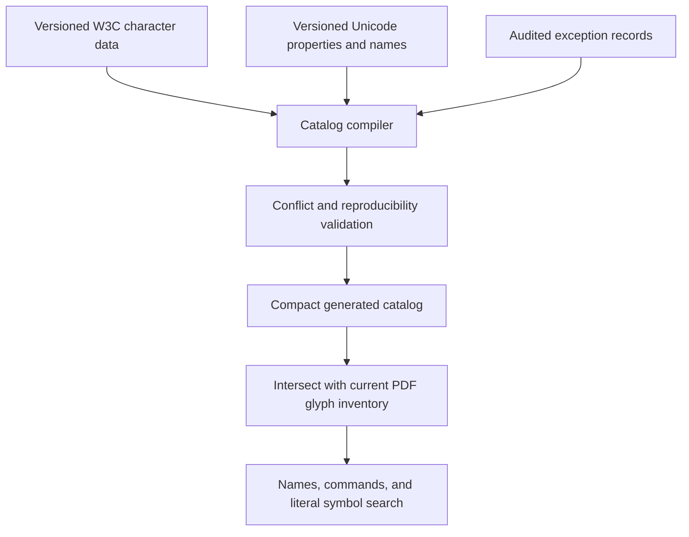
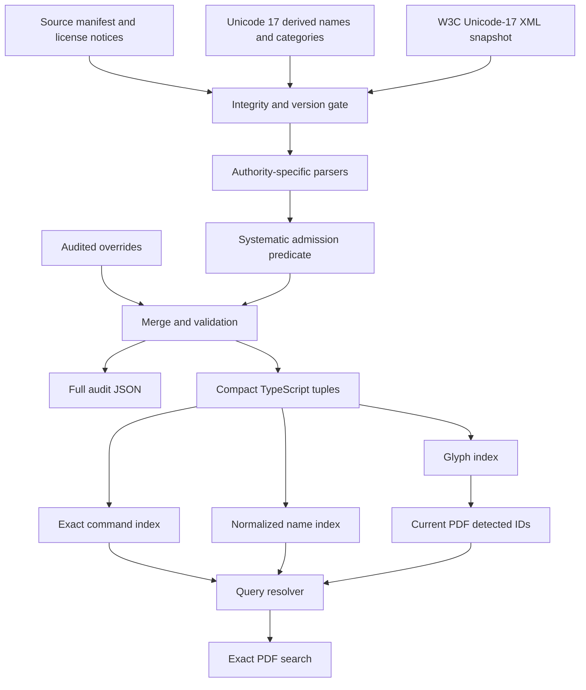
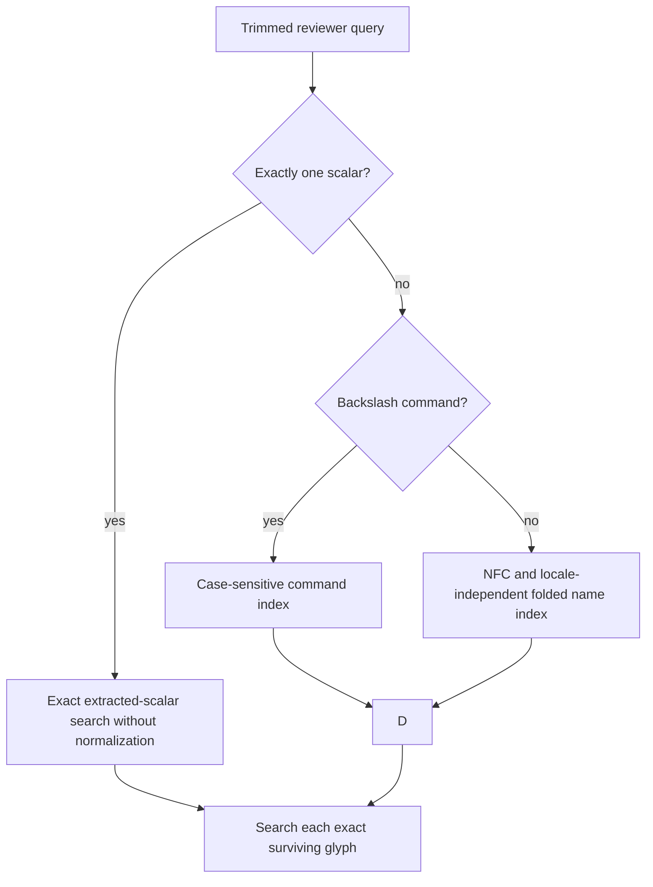

# Generated Mathematical Symbol Catalog - Plan

## Goal Capsule

- **Objective:** Make every reliably extracted single-character Unicode mathematical symbol in the current PDF searchable by its literal glyph and authoritative names or standard commands when those names or commands exist.
- **Means:** Compile pinned Unicode 17 derived data and the last Unicode-17 W3C XML Entities revision into a compact catalog bundled with Placekeeper, with a small audited exception layer for documented conflicts. (KTD1-KTD4)
- **Product authority:** This contract owns symbol-catalog coverage, provenance, generation, update behavior, and runtime alias semantics, superseding only the earlier plan's hand-authored mapping assumption. The existing PDF Search Workspace contract remains authoritative for indexing, document-local suggestions, result navigation, coverage disclosure, and exact-formula behavior.
- **Open blockers:** None. KTD1 resolves source transport, KTD4 resolves generated representation, and KTD4-KTD5 resolve bundle and runtime optimization.
- **Execution profile:** Code implementation with generated-data, runtime-search, CI, production-bundle, and offline-install verification.
- **Tail ownership:** The shipping pipeline owns simplification, independent review, browser verification, commit/PR update, and CI follow-through after every implementation unit passes.

---

## Product Contract

### Summary

Replace the hand-maintained mathematical-symbol repertoire with a reproducible catalog generated from pinned standards data. Placekeeper will ship only the compiled result and will continue to expose symbols only when they are detected in the current PDF.

### Problem Frame

The existing catalog is a manually reviewed list of glyph, name, command, and alias records. The target mathematical PDF exposed the weakness of that model: search extraction was healthy, but symbols were unavailable by name or command until each missing code point was added by hand.

Adding entries reactively cannot establish coverage or prevent regressions in other notation-heavy PDFs. A downstream planner also has no objective way to tell whether the list is complete, which aliases came from an authority, or whether an entry is an intentional compatibility exception.

### Key Decisions

- **Use W3C and Unicode data as the catalog authority.** (session-settled: user-directed — chosen over a KaTeX-derived catalog and a multi-source consensus compiler: it provides broad Unicode coverage without coupling search to renderer internals or several conflicting update tracks.) Governs R1-R7, R10-R12.
- **Compile a pinned static artifact.** (session-settled: user-approved — chosen over runtime or unpinned build-time fetching: installed search must remain deterministic and offline.) Governs R8-R9, R13-R16.
- **Keep symbol assistance grounded in the current PDF.** (session-settled: user-directed — chosen over a global symbol glossary: the primary experience should contain only relevant notation.) Governs R17-R19.
- **Preserve exact mathematical matching.** (session-settled: user-directed — chosen over visual, compatibility, or semantic normalization: a symbol query must not silently match another code point.) Governs R5-R7, R18-R22.
- **Keep hand-authored data exceptional.** The override layer records upstream conflicts and product compatibility decisions; it does not define the ordinary repertoire. Governs R10-R12, R15.

### Requirements

**Catalog coverage and meaning**

- R1. The catalog source set shall include every assigned Unicode scalar in the pinned Unicode `Math` derived property plus every assigned single scalar admitted by the systematic W3C mathematical-evidence predicate in KTD3.
- R2. R1 shall include W3C-covered Greek letters, mathematical alphanumeric characters, punctuation used as mathematical notation, and technical extension glyphs even when they are outside the Unicode `Math` derived property.
- R3. Every source-side generated record shall retain its Unicode code point, literal glyph, official Unicode name, applicable W3C names and descriptions, standard single-symbol TeX commands, and upstream provenance when those fields exist; the bundled runtime projection may omit audit-only fields under R16.
- R4. A generated record without a TeX command shall remain searchable by its glyph and official Unicode name and shall not receive an invented command.
- R5. A trimmed single-scalar literal glyph query shall compare the scalar exactly, without Unicode normalization, and shall never enter alias resolution or redirect to a different code point.
- R6. Backslash commands and W3C entity identifiers shall remain case-sensitive, while official names, descriptions, and natural-language overrides shall use the existing case-insensitive NFC matching policy.
- R7. One authoritative name or command may resolve to every matching glyph variant detected in the document; selecting or typing a literal glyph shall resolve only that glyph.

**Generation and provenance**

- R8. Catalog generation shall use explicitly versioned, integrity-pinned W3C and Unicode inputs and shall never resolve an unversioned `latest` source during an ordinary build or application launch.
- R9. The same inputs, generator version, and override file shall produce byte-identical catalog output across supported build environments.
- R10. Hand-authored overrides shall be limited to documented upstream ambiguity, compatibility with established mathematical input conventions, and high-value friendly aliases that cannot be derived from the authorities.
- R11. Every override shall identify the affected code point or alias, its rationale, and the upstream behavior it corrects or supplements.
- R12. Generation shall reject invalid scalars, duplicate records, ambiguous command casing, undocumented alias conflicts, stale overrides, and aliases that would rewrite a literal ASCII query to another Unicode glyph.
- R13. Updating an upstream version shall be an explicit maintainer action that produces a reviewable report of added and removed code points, changed names or aliases, conflicts, output size, and override count.
- R14. Repository verification shall fail when the checked-in or build-consumed generated artifact differs from the deterministic generator output.
- R15. The generated artifact and required attribution or license notices shall be source-controlled or otherwise integrity-pinned so a frozen dependency installation is sufficient to reproduce it without an additional live data fetch.
- R16. The application bundle shall contain only the compact compiled catalog needed by search, not the full upstream XML or Unicode database, and shall require no catalog network access at runtime.

**Document-local search behavior**

- R17. Runtime symbol suggestions shall be the intersection of the generated catalog and glyphs reliably extracted from the current PDF.
- R18. An alias query shall search only the detected glyphs to which that alias resolves and shall not introduce a result for a glyph absent from the current PDF.
- R19. Suggestions shall display the glyph, a deterministic human-readable name, and a standard TeX command when one exists; absence of a command shall not hide the symbol.
- R20. Literal formula and symbol matching shall preserve code-point identity and order without Unicode normalization, confusable substitution, visual equivalence, semantic expansion, or algebraic normalization; NFC and case folding may apply only to textual name aliases.
- R21. Private-use, replacement, malformed, or otherwise unidentified extracted characters shall not receive guessed names or commands; when reliable literal matching is possible, it shall remain available without claiming semantic identity.
- R22. Generated catalog use shall preserve the existing search indexing limits, current-document privacy boundary, and no-results or uncertainty disclosures.

### Catalog Flow

The standards sources own the ordinary repertoire. The exception records alter only documented conflicts, and the current PDF inventory remains the gate between the bundled catalog and reviewer-visible suggestions.

### Key Flows

- F1. Build a reproducible catalog
  - **Trigger:** A maintainer runs the normal verification or production build from frozen dependencies.
  - **Steps:** The compiler reads pinned standards data and audited exceptions, validates their integrity and conflicts, and produces the compact catalog.
  - **Outcome:** The generated output is byte-identical to the expected artifact or the build fails with a reviewable discrepancy.
  - **Covered by:** R1-R16.

- F2. Search a detected symbol by name or command
  - **Trigger:** A reviewer types an authoritative name or standard command for notation present in the current PDF.
  - **Steps:** Search resolves the alias against the generated catalog, intersects the candidates with detected glyphs, and runs exact searches for each remaining code point.
  - **Outcome:** Every detected matching variant appears in document order without absent or visually similar glyphs entering the result set.
  - **Covered by:** R3-R7, R17-R20, R22.

- F3. Search an unusual extracted symbol
  - **Trigger:** The PDF contains a Unicode symbol with an official name but no standard TeX command.
  - **Steps:** The document inventory recognizes the generated record and exposes its literal glyph and official name without inventing a command.
  - **Outcome:** The reviewer can find every exact occurrence by glyph or official name.
  - **Covered by:** R1-R4, R17-R21.

- F4. Review an upstream catalog update
  - **Trigger:** A maintainer intentionally advances the pinned W3C or Unicode version.
  - **Steps:** Generation validates integrity, produces the new artifact, and reports repertoire, alias, conflict, size, and exception changes.
  - **Outcome:** Upstream drift is explicit and reviewable rather than entering an installation opportunistically.
  - **Covered by:** R8-R16.

### Acceptance Examples

- AE1. Target PDF symbol inventory
  - **Covers R1-R7, R17-R20.**
  - **Given:** Reliable extracted text containing `· Π α δ θ κ λ ν ξ ρ σ τ ϕ ϵ ˜ → ∂ ∈ ∑ − ∗ ∝ ∫ ≡ ≤ ≥ ⏐` and the ASCII operators `+ < = > | /`.
  - **When:** The reviewer searches each literal glyph and each authoritative name or standard command available in the pinned sources.
  - **Then:** Every literal query finds only that exact code point, and every sourced alias finds all matching detected variants.

- AE2. Shared phi command
  - **Covers R5-R7, R18-R20.**
  - **Given:** Both `φ` and `ϕ` are detected and the generated data associates a standard phi command with both variants.
  - **When:** The reviewer searches the shared command and then searches the literal `φ`.
  - **Then:** The command returns exact occurrences of both detected variants, while the literal query returns only `φ`.

- AE3. ASCII hyphen versus Unicode minus
  - **Covers R5, R10-R12, R18-R20.**
  - **Given:** A page contains both ASCII `-` and Unicode `−`.
  - **When:** The reviewer searches `-`, then searches an authoritative minus name or command.
  - **Then:** The literal query finds only ASCII hyphen occurrences, while the named or command query finds only detected Unicode minus occurrences.

- AE4. Vertical line extension without a command
  - **Covers R1-R4, R17-R21.**
  - **Given:** U+23D0 `⏐` (General Category `So`) is reliably extracted and the source data supplies its official name but no accepted TeX command.
  - **When:** The reviewer searches `⏐` or `vertical line extension`.
  - **Then:** Both queries find exact U+23D0 occurrences, and the suggestion does not claim a fabricated command.

- AE5. Deterministic upstream update
  - **Covers R8-R16.**
  - **Given:** The source versions and overrides are unchanged.
  - **When:** Catalog generation runs repeatedly on supported clean build environments.
  - **Then:** It produces byte-identical output and an empty semantic change report.

- AE6. Unknown private-use extraction
  - **Covers R20-R22.**
  - **Given:** A reliable page contains a private-use scalar whose mathematical identity cannot be established from the pinned authorities.
  - **When:** Search inventories the page.
  - **Then:** Placekeeper does not assign a guessed name or command; exact literal search remains available if the extracted scalar and geometry are reliable.

### Scope Boundaries

- Arbitrary document-defined or user-defined LaTeX macros are excluded because PDF extracted text does not retain source macro identity.
- OCR and recovery of missing or incorrect PDF character maps remain outside this work; the catalog operates on reliably extracted Unicode text.
- Global symbol browsing and suggestions for symbols absent from the current PDF remain excluded from the primary experience.
- Multi-character LaTeX structures, semantic formula parsing, algebraic equivalence, visual confusable matching, and fuzzy mathematical retrieval remain excluded.
- The generated catalog does not promise every colloquial synonym for every symbol. It guarantees official names, upstream standardized aliases and commands, and documented product exceptions.

### Dependencies / Assumptions

- Unicode 17.0.0 `DerivedName.txt`, `DerivedGeneralCategory.txt`, and `DerivedCoreProperties.txt` remain the authority for official names, categories, and the `Math` property under the Unicode License v3.
- W3C XML Entities commit `ed8b732d7d38112f258e74aadecbb1e409eafdd9` remains the immutable Unicode-17 authority for entity, description, and TeX metadata under the W3C Software Notice and License.
- Reliable PDF extraction yields Unicode scalars and geometry. Private-use mappings, missing `ToUnicode` maps, replacement characters, and glyph fragments without stable Unicode identity remain extraction limitations rather than catalog gaps.
- The existing frozen pnpm installation, TypeScript build, static web bundle, and offline installed-app smoke remain the authoritative distribution path.

### Sources / Research

- The current hand-authored catalog and runtime resolution live in `apps/web/src/pdf/pdf-symbol-catalog.ts` and `apps/web/src/pdf/pdf-search-controller.ts`.
- The existing behavioral authority is `docs/plans/2026-08-11-001-feat-pdf-search-workspace-plan.md`, especially its exact matching, current-document grounding, and excluded normalized-equivalence rules.
- The source installer and static packaging path are defined by `install.sh`, `package.json`, `apps/web/vite.production.config.ts`, and `packaging/macos/build-app.ts`.
- The W3C Math Working Group describes `unicode.xml` as machine-readable source data containing Unicode names, entity-set names, TeX equivalents, and related metadata: [XML Entity Definitions for Characters](https://w3c.github.io/xml-entities/).
- The Unicode Consortium publishes versioned character names, General Categories, and related properties through the [Unicode Character Database](https://www.unicode.org/ucd/) and defines their interpretation in [UAX #44](https://www.unicode.org/reports/tr44/).
- [UAX #15](https://unicode.org/reports/tr15/) establishes that NFC can change scalar identity, which is why R5 and R20 keep literal glyph lookup outside normalization.
- The W3C input is pinned to [commit `ed8b732`](https://github.com/w3c/xml-entities/commit/ed8b732d7d38112f258e74aadecbb1e409eafdd9), the last Unicode-17 revision before the repository moved to a Unicode-18 draft.
- The rejected renderer-derived alternative was evaluated against [KaTeX supported functions](https://katex.org/docs/supported) and its published package contents.
- The rejected multi-source alternative was evaluated against the [unicode-math symbol table](https://github.com/latex3/unicode-math/blob/master/unicode-math-table.tex) and [CTAN package metadata](https://ctan.org/pkg/unicode-math-).

---

## Planning Contract

### Key Technical Decisions

- KTD1. **Vendor checksum-pinned standards snapshots.** Commit compressed local copies of Unicode 17.0.0 `DerivedName.txt`, `DerivedGeneralCategory.txt`, and `DerivedCoreProperties.txt` plus W3C `unicode.xml` at commit `ed8b732d7d38112f258e74aadecbb1e409eafdd9`. A manifest records immutable URLs, versions, SHA-256 values, and licenses. Ordinary generation, build, install, and runtime paths never fetch data. This resolves the source-transport question under R8, R9, and R15.
- KTD2. **Keep Unicode and W3C authority separate.** Unicode derived files own assignment, official names, and General Categories. W3C owns entity identifiers, descriptions, TeX fields, math-mode metadata, and their provenance. Generation reports cross-source disagreements instead of letting W3C's duplicated Unicode fields override the UCD. This resolves the authority split under R1-R4 and R12.
- KTD3. **Admit symbols through a reproducible evidence predicate.** The repertoire is the union of assigned UCD `Math` scalars with assigned single-scalar W3C records that carry explicit mathematical evidence: `mode=math|mixed`, a non-alphabetic mathematical class, a math/science application marker, or a directly typeable single-symbol TeX command. General Category `So`, general entity membership, or a description alone does not admit a scalar. W3C multi-scalar records are excluded and reported. This prevents emoji, pictographs, and ordinary prose letters from becoming suggestions while satisfying R1-R4.
- KTD4. **Emit separate audit and runtime projections.** The generator writes a deterministic source-side audit JSON with full provenance and a compact TypeScript tuple table containing only fields needed by search. Both are checked in and drift-checked. Only the tuple table is imported into the web bundle. This resolves the representation question under R3, R9, R14, and R16.
- KTD5. **Index the standards-sized catalog once.** The runtime adapter builds glyph, exact-command, and normalized-text-alias maps once, then the controller accumulates only newly detected catalog record IDs for semantic suggestions and aliases. Alias lookup intersects indexed candidates with those IDs rather than rescanning the complete catalog after every page. Exact literal search remains independent of catalog membership. This resolves the runtime-structure question under R17-R22.
- KTD6. **Separate literal, command, entity, and name namespaces.** A trimmed one-scalar query bypasses catalog lookup and searches the extracted scalar directly without normalization. Backslash commands and W3C entity identifiers use exact case. Official names, descriptions, and natural-language overrides use deterministic locale-independent NFC/case normalization and intersect current-document catalog IDs. Every one-to-many alias must name an audited code-point group and rationale; upstream collisions may propose groups but never authorize fan-out by themselves. This implements R5-R7, R12, and R21 without cross-namespace rewriting.
- KTD7. **Accept only directly typeable TeX tokens.** Trim W3C `latex`, `varlatex`, and `mathlatex` fields, but admit only a whole-field TeX control word or explicitly allowed control symbol that denotes one scalar. Reject and report arguments, braces, whitespace composition, or multiple tokens. Retain package/set provenance and do not present package-specific commands as generic LaTeX. This implements R3, R4, and R12.
- KTD8. **Treat updates as atomic reviewed data changes.** The explicit update command stages downloads and outputs in temporary paths, verifies bytes before parsing, disables DTD/external-entity resolution, validates versions and schema assumptions, produces a deterministic semantic report, and changes repository files only after every check succeeds. Normal `generate` and `check` commands use local sources only. This implements R8-R16.
- KTD9. **Choose reviewer-visible labels by declared provenance order.** Display names use an audited compatibility override when present, then the lowercase official Unicode name. Preferred displayed commands use an audited preference when present, then a valid generic W3C `latex` token, then `varlatex`; package-scoped `mathlatex` commands remain searchable with provenance but are not displayed as generic LaTeX. Tie-breaking within one source field uses byte order. This makes standards updates reviewable instead of depending on XML insertion order.

### High-Level Technical Design

### Assumptions

- Compressed vendored source snapshots are acceptable repository inputs because they make frozen installation reproducible while keeping raw standards data out of the installed app.
- `fast-xml-parser` or an equivalent direct development dependency may be added if it supports DTD/external-entity rejection; no transitive package is treated as a supported parser API.
- The initial generated artifact establishes deterministic record-count, index-cardinality, artifact-byte, and production-bundle-byte baselines. Environment-qualified timing measurements remain test evidence outside committed deterministic report bytes.
- Existing friendly inputs are preserved only when sourced from Unicode/W3C or represented as audited overrides with a rationale. The override layer is not a fallback repertoire.

### System-Wide Impact

- **Reviewer experience:** Symbol suggestions remain current-document-only. Records without commands display glyph and name without empty parentheses.
- **Indexing performance:** Page preparation changes from repeated full-catalog scans to indexed glyph lookup and incremental detected-ID accumulation.
- **Build and CI:** Generation drift becomes a required precondition for the web build and the explicit CI workflow. The update command remains opt-in and networked.
- **Distribution:** Vite bundles only compact generated tuples. Distribution validation proves that raw source snapshots, catalog-fetch endpoints, and update code are absent from executable/runtime assets while required attribution URLs remain in the notice resource.
- **Maintenance:** Standards updates become reviewable source, artifact, report, and attribution changes rather than hand-edited symbol entries.

### Risks and Mitigations

- **Overbroad W3C admission could inventory prose.** KTD3 separates mathematical evidence from general entity presence, and ordinary-letter regression tests keep the reviewer catalog sparse.
- **Normalization could collapse distinct notation.** KTD6 keeps literal scalar lookup outside normalization and adds OHM SIGN/omega, phi-variant, and minus/hyphen regression pairs.
- **Generated data could inflate indexing or bundle cost.** KTD4 and KTD5 use compact tuples and indexes; deterministic reports measure record, index, artifact, and bundle size while environment-qualified tests measure timing separately.
- **Source or schema drift could silently corrupt output.** KTD1 and KTD8 verify hashes, versions, scalar IDs, W3C `dec` values, UCD ranges, XML structure, and byte-identical regeneration before publication.
- **TeX metadata could expose compound or package-specific expressions as commands.** KTD7 applies a strict whole-token grammar and keeps source/set provenance.
- **Licensing notices could be lost when raw inputs are excluded from the bundle.** The source manifest, generated header, and distributed `THIRD_PARTY_NOTICES` retain the Unicode License v3, W3C Software Notice, Carlisle notice, modification date, and source URI.

### Sequencing

1. Establish pinned sources, compiler contracts, and validation fixtures before changing runtime behavior.
2. Generate and drift-check audit/runtime projections before replacing the manual catalog.
3. Introduce indexed runtime resolution and incremental document inventory together so standards-scale data never enters the old scan path.
4. Wire optional-command presentation and the target-PDF behavior through unit and production-flow tests.
5. Add CI, bundle, notice, and offline distribution gates after the artifacts and runtime imports are stable.

---

## Implementation Units

### U1. Establish pinned standards inputs and compiler contracts

- **Goal:** Create the reproducible, offline source boundary and a pure compiler that can parse, merge, validate, and report standards data.
- **Requirements:** R1-R4, R8-R13, R15; F1, F4; AE5; KTD1-KTD3, KTD7-KTD8.
- **Dependencies:** None.
- **Files:** `scripts/pdf-symbol-catalog/source-manifest.json`, `scripts/pdf-symbol-catalog/sources/**`, `scripts/pdf-symbol-catalog/overrides.json`, `scripts/pdf-symbol-catalog/compile.ts`, `scripts/pdf-symbol-catalog/compile.test.ts`, `THIRD_PARTY_NOTICES.md`, `package.json`, `pnpm-lock.yaml`, `tsconfig.base.json`.
- **Approach:**
  1. Vendor compressed Unicode derived-name/category/core-property data and the immutable Unicode-17 W3C XML snapshot with declared hashes and full notices.
  2. Parse UCD ranges, algorithmic names, categories, and the `Math` property under Unicode authority; parse only single-scalar W3C character records with DTD/external-entity processing disabled.
  3. Apply KTD3, retain provenance, filter TeX through KTD7, and validate scalars, duplicate records, alias namespaces, allowed one-to-many mappings, and override freshness.
  4. Produce an in-memory catalog and deterministic semantic report without writing until validation succeeds.
- **Execution note:** Start with fixture-sized failing compiler tests before adding full upstream snapshots.
- **Patterns to follow:** Strict readonly TypeScript data contracts, explicit dependencies, deterministic `Map`/`Set` processing, and the repository's Vitest conventions.
- **Test scenarios:**
  - Parse singleton and range UCD records, including an astral scalar, and produce correct official names/categories.
  - Reject a checksum mismatch, Unicode-version mismatch, invalid scalar, surrogate, malformed W3C ID, mismatched `dec`, duplicate record, stale override, and undocumented alias conflict without changing outputs.
  - Exclude a W3C multi-scalar record and count it in the report rather than attaching its alias to the first scalar.
  - Admit UCD `Math`, Greek/math records with explicit W3C math evidence, U+23D0, and required mathematical punctuation while excluding emoji, pictographs, and ordinary prose letters admitted only by category, general entity, or name data.
  - Accept direct single-symbol TeX control tokens and reject compound expressions such as commands with arguments or multiple tokens.
  - Preserve a documented audited phi-variant group while rejecting an unaudited upstream or override-created one-to-many collision.
- **Verification:** Fixture tests prove authority separation, safe parsing, evidence admission, deterministic validation errors, and no partial writes.

### U2. Generate compact and auditable artifacts

- **Goal:** Replace the hand-maintained repertoire with checked-in deterministic audit/runtime projections and explicit generate/check/update workflows.
- **Requirements:** R3, R8-R16; F1, F4; AE5; KTD4, KTD8.
- **Dependencies:** U1.
- **Files:** `scripts/pdf-symbol-catalog/generate.ts`, `scripts/pdf-symbol-catalog/update.ts`, `scripts/pdf-symbol-catalog/generated/catalog.audit.json`, `scripts/pdf-symbol-catalog/generated/update-report.json`, `apps/web/src/pdf/pdf-symbol-catalog.generated.ts`, `scripts/pdf-symbol-catalog/generate.test.ts`, `package.json`.
- **Approach:**
  1. Serialize full audit records and compact code-point-sorted TypeScript tuples with fixed UTF-8/LF output and byte-order-sorted alias/command arrays.
  2. Implement offline `generate` and non-mutating byte-for-byte `check` commands plus an explicit network-capable atomic update command.
  3. Report source hashes, category/provenance counts, added/removed/changed records, multi-scalar and invalid-TeX exclusions, alias collisions, overrides, index cardinalities, and artifact bytes; keep wall-clock measurements outside deterministic report bytes.
  4. Reference applicable licenses and source revisions from generated headers without importing audit data or snapshots into web code.
- **Execution note:** Run the generator twice under differing locale/timezone settings and require identical bytes before accepting the first artifact.
- **Patterns to follow:** Existing checked-in build inputs and static Vite module imports; no runtime fetch path.
- **Test scenarios:**
  - Covers AE5. Identical sources and overrides produce byte-identical audit, runtime, and report artifacts across repeated runs, independent of environment-qualified timing evidence.
  - `catalog:check` succeeds on committed output and fails with a focused diff after a generated tuple is edited.
  - A failed update leaves the source manifest, snapshots, generated artifacts, and report unchanged.
  - The generated runtime module imports no source snapshot, network client, update helper, or audit-only provenance payload.
- **Verification:** The committed artifact regenerates cleanly offline, the update report is deterministic, and generated output contains the catalog rather than a hand-authored repertoire.

### U3. Replace runtime scans with indexed exact resolution

- **Goal:** Preserve exact query semantics and current-document grounding at standards scale.
- **Requirements:** R4-R7, R12, R17-R22; F2, F3; AE1-AE4, AE6; KTD5-KTD7.
- **Dependencies:** U2.
- **Files:** `apps/web/src/pdf/pdf-symbol-catalog.ts`, `apps/web/src/pdf/pdf-search-model.ts`, `apps/web/src/pdf/pdf-search-controller.ts`, `apps/web/test/pdf-symbol-catalog.test.ts`, `apps/web/test/pdf-search-model.test.ts`, `apps/web/test/pdf-search-controller.test.ts`.
- **Approach:**
  1. Project generated tuples into records with zero-or-more commands and build glyph, exact-command, and normalized-name indexes once.
  2. Add a raw code-point-preserving formula/symbol match path that may remove layout whitespace but never applies NFC; route one-scalar literals and resolved glyphs through it while retaining NFC only for textual aliases.
  3. Incrementally accumulate detected catalog IDs during page indexing and resolve aliases by intersecting indexed candidates with those IDs.
  4. Preserve the controller's geometry, coverage, result-order, progressive-index, privacy, and uncertainty paths.
- **Execution note:** Add characterization tests for the manual implementation's exact/document-local behavior before swapping the data source and scan path.
- **Patterns to follow:** Existing `PdfSearchController` progressive indexing and immutable `PdfSearchState`; existing NFC/case policy only for textual queries.
- **Test scenarios:**
  - Covers AE1. Every reported-PDF glyph and each available authoritative name/command resolves only to detected exact occurrences.
  - Covers AE2. Shared phi aliases return all detected variants, while literal `φ` and `ϕ` remain separate.
  - Covers AE3. ASCII hyphen and U+2212 minus remain distinct by literal and named search.
  - Covers AE4. U+23D0 resolves by literal and official name with no fabricated command.
  - U+2126 OHM SIGN and U+03A9 GREEK CAPITAL LETTER OMEGA remain distinct literal queries despite NFC equivalence.
  - An ordinary prose page does not populate suggestions with letters, and an alias never introduces a glyph absent from the PDF.
  - Covers AE6. A private-use scalar bypasses catalog lookup, remains absent from semantic suggestions, and is still exactly searchable when extraction and geometry are reliable.
  - An astral mathematical alphanumeric scalar preserves UTF-16 geometry mapping and resolves by official name.
- **Verification:** Focused catalog/controller tests prove exact scalar identity, indexed one-to-many resolution, document-local intersection, optional commands, and unchanged progressive coverage behavior.

### U4. Present optional commands without changing search UX boundaries

- **Goal:** Render and filter generated suggestions truthfully when records have zero, one, or multiple commands.
- **Requirements:** R4-R7, R17-R19, R21-R22; F2, F3; AE4; KTD6, KTD9.
- **Dependencies:** U3.
- **Files:** `apps/web/src/pdf/pdf-search-controller.ts`, `apps/web/src/review/PdfSearchWorkspace.tsx`, `apps/web/test/pdf-search-controller.test.ts`, `apps/web/test/pdf-search-workspace.test.tsx`.
- **Approach:** Use KTD9 in one label builder that displays glyph and name and appends only the preferred sourced command when present. Filter glyphs by exact scalar identity, backslash commands and W3C entity identifiers by exact case, and official names, descriptions, and natural-language overrides by locale-independent NFC/case normalization without exposing symbols absent from the current document.
- **Patterns to follow:** Existing `PdfSearchAlternative` boundary and current combobox/listbox behavior.
- **Test scenarios:**
  - A symbol with one command keeps the existing readable label and remains filterable by glyph, name, and command.
  - Covers AE4. U+23D0 displays `vertical line extension` without empty parentheses or a command claim.
  - A record with multiple commands chooses a stable preferred display command while every command remains searchable.
  - A wrong-case backslash command does not filter or activate a suggestion, while a case-only natural-language variation does.
  - Case-distinct W3C entity identifiers such as `Alpha` and `alpha` remain distinct and do not create an artificial shared alias.
  - Normalization-equivalent but scalar-distinct glyphs remain separate in the suggestion filter.
  - An absent generated symbol never enters suggestions during empty or partial queries.
- **Verification:** Controller and workspace tests prove optional-command rendering and current-PDF-only filtering without changing interaction semantics.

### U5. Make generation and distribution drift impossible to miss

- **Goal:** Put the catalog compiler, runtime behavior, attribution, and production-bundle boundaries into authoritative CI and distribution gates.
- **Requirements:** R8-R16, R22; F1, F4; AE1, AE5; KTD1, KTD4, KTD8.
- **Dependencies:** U2-U4.
- **Files:** `.github/workflows/ci.yml`, `vitest.ci.config.ts`, `package.json`, `packaging/macos/build-app.ts`, `packaging/macos/validate-manifest.ts`, `packaging/macos/packaging.test.ts`, `test/acceptance/production-flow.spec.ts`.
- **Approach:**
  1. Run non-mutating catalog drift verification before production web builds and in the explicit CI workflow.
  2. Include generator tests in the CI allowlist and extend the production search flow with the target inventory and no-command case.
  3. Inspect executable/runtime assets for the compact catalog behavior while rejecting raw XML/UCD snapshots, catalog-fetch endpoints, and update code.
  4. Copy `THIRD_PARTY_NOTICES.md` into a stable macOS app resource path before build-identity calculation, require it in packaging/distribution validation, and allow its required attribution URLs.
- **Execution note:** Prefer production-output and installed/offline evidence over source-only assertions for distribution boundaries.
- **Patterns to follow:** Existing explicit CI test graph, `validate:distribution`, packaging tests, and production-flow browser acceptance.
- **Test scenarios:**
  - Covers AE5. CI fails when generated output drifts and passes from frozen dependencies without a catalog network request.
  - Covers AE1. The built production viewer searches the complete reported-PDF inventory by its representative sourced aliases.
  - Executable/runtime assets contain no raw W3C XML, Unicode derived files, catalog-fetch endpoints, or update client code; attribution URLs remain present only in the required notice resource.
  - Distribution validation finds the Unicode/W3C/Carlisle notices and the generated artifact remains functional offline.
  - A deliberate size-baseline regression fails until its reviewed baseline/report is updated.
- **Verification:** CI-equivalent unit, type, build, browser, distribution, and offline checks prove the generated catalog that ships is the catalog that was verified.

---

## Verification Contract

| Gate | Command or evidence | Proves |
|---|---|---|
| Generator drift | `pnpm catalog:check` | Pinned local inputs reproduce committed audit/runtime/report bytes without fetching or rewriting. |
| Generator and runtime unit tests | `pnpm exec vitest run scripts/pdf-symbol-catalog/compile.test.ts scripts/pdf-symbol-catalog/generate.test.ts apps/web/test/pdf-symbol-catalog.test.ts apps/web/test/pdf-search-controller.test.ts apps/web/test/pdf-search-workspace.test.tsx` | Parsing, admission, validation, exact matching, indexed resolution, optional commands, and current-PDF behavior. |
| Static correctness | `pnpm typecheck` | Compiler, generated module, runtime adapter, and UI contracts remain type-safe. |
| CI unit graph | `pnpm test:ci:unit` | New tests are included in the repository's explicit allowlist. |
| Production bundle | `pnpm build:web` plus distribution inspection | Compact generated data ships; raw sources, update paths, and audit payload do not. |
| Browser acceptance | Focused `test/acceptance/production-flow.spec.ts` PDF-search scenario | The production viewer searches the target inventory and no-command symbol. |
| Distribution/offline | `pnpm validate:distribution` and the existing installed-app offline smoke | Required notices ship and catalog search needs no network at runtime. |
| Diff quality | `git diff --check` and independent code review | No formatting damage, generated/manual drift, abandoned attempts, or unreviewed catalog exceptions remain. |

The initial generated outputs establish explicit record-count, index-cardinality, artifact-byte, and production-bundle-byte baselines. Environment-qualified timing checks are non-committed test evidence. A future standards update may change deterministic baselines only through the reviewed manifest, update report, and baseline diff.

---

## Definition of Done

- U1-U5 satisfy their verification outcomes and all cited R/F/AE coverage.
- The manual `SYMBOLS` repertoire no longer owns ordinary catalog coverage; every non-upstream behavior is a documented audited override.
- Unicode 17 and W3C source versions, hashes, authority boundaries, license notices, and generated provenance are reviewable from the repository.
- Repeated offline generation is byte-identical, and ordinary build/install paths never fetch or mutate catalog sources or outputs.
- Every target-PDF symbol is searchable by exact glyph and by each accepted authoritative name/command available for it.
- Literal queries remain code-point exact across normalization-equivalent, visual, semantic, and ASCII/Unicode variants.
- Suggestions and aliases remain limited to glyphs detected in the current PDF, including progressive indexing and coverage-limited states.
- U+23D0 and every other no-command record display truthfully without a fabricated or empty command.
- Production and packaged output contain only the compact runtime projection plus required notices, not raw standards inputs or update code.
- The generated catalog stays within its reviewed record, index-cardinality, artifact-byte, and bundle-byte baselines, or the update contains an explicit reviewed baseline change.
- CI, focused browser acceptance, distribution validation, and offline smoke pass, or any external CI/service blocker is recorded separately from code evidence.
- All dead-end, duplicate, experimental, and obsolete manual-catalog code from implementation is removed before handoff.
