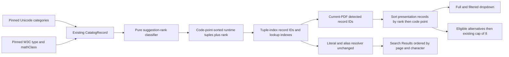

# Standards-Derived Symbol Suggestion Ranking - Plan

## Goal Capsule

- **Objective:** Put letter-like mathematical symbols first in every reviewer-visible symbol suggestion list, followed by numbers, operators and relations, delimiters and diacritics, then punctuation and formatting symbols.
- **Means:** Derive one compact suggestion rank per generated catalog record from the already pinned Unicode General Category and W3C mathematical metadata, then sort only presentation-facing detected-symbol projections by rank and code point. (R1-R8, KTD1-KTD4)
- **Product authority:** This follow-up contract owns reviewer-visible ordering for the existing Mathematical Symbol Catalog. The generated-catalog plan remains authoritative for repertoire, provenance, matching, Controlled Symbol Families, artifact generation, and distribution boundaries; the PDF Search Workspace contract remains authoritative for Search Result ordering and navigation.
- **Open blockers:** None. The classification precedence, bucket order, tie-breaker, UI surfaces, and non-goals are settled.
- **Execution profile:** Code implementation spanning the catalog generator, runtime adapter, search controller tests, browser acceptance coverage, and distribution baselines.

---

## Product Contract

### Summary

Replace raw Unicode code-point ordering in symbol suggestions with a deterministic search-likelihood order. The result remains one flat, current-PDF-only list: identifier-like symbols appear first, followed by number-like symbols, operators and relations, delimiters and diacritics, and finally punctuation and formatting symbols.

The ranking is compiled from the standards metadata already used to build the catalog. It is not a hand-maintained symbol-priority dictionary, does not change which symbols are searchable, and does not affect the order of actual Search Results.

### Problem Frame

The generated catalog fixed symbol-search coverage, but its compact tuples and runtime record IDs are intentionally ordered by Unicode code point. `detectedSymbolSuggestions()` currently exposes that implementation order directly. As a result, punctuation and operators can appear before Greek letters and other identifier-like symbols even though the latter are more likely to be the reviewer’s intended search term.

Reordering the generated tuples themselves would be risky: tuple position is the runtime record ID, and record-ID order is also used by alias and Controlled Symbol Family resolution. A manual priority list would reintroduce the maintenance problem that the generated catalog was designed to eliminate. The change therefore needs a standards-derived presentation rank that leaves catalog identity and matching semantics alone.

### Key Decisions

- **Prioritize likely search terms over raw code-point order.** (session-settled: user-approved — chosen over preserving the current Unicode order because letter-like notation is more likely to be the intended search term than operators or punctuation.) Governs R1-R5.
- **Derive ordinary ranking from pinned standards metadata.** (session-settled: user-approved — chosen over a manual per-symbol priority dictionary because the policy should remain systematic, exhaustive over the generated repertoire, and reviewable during standards updates.) Governs R2-R3, R7-R8.
- **Keep one flat list.** (session-settled: user-approved — chosen over visible category headings because ranking should improve scan order without adding sections or UI clutter.) Governs R4-R5.
- **Order numbers before operators.** (session-settled: user-approved — chosen over operators-before-numbers so styled mathematical numerals remain close to letter-like identifiers.) Governs R1-R2.
- **Preserve code-point identity and matching behavior.** (session-settled: user-approved — chosen over reordering generated tuples or result candidates because this work changes presentation priority, not symbol identity, alias expansion, or Search Result semantics.) Governs R3-R6.

### Requirements

**Ranking policy**

- R1. Every record in the generated Mathematical Symbol Catalog shall receive exactly one integer suggestion rank with this ascending reviewer-visible order: `0` identifier-like, `1` number-like, `2` operator/relation/other mathematical symbol, `3` delimiter/diacritic, and `4` punctuation/formatting.
- R2. The rank classifier shall apply the following precedence to each existing `CatalogRecord`, stopping at the first match:
  1. Unicode General Category beginning with `C` maps to rank `4`.
  2. Unicode General Category beginning with `N` maps to rank `1`.
  3. Unicode General Category beginning with `L`, W3C `type=alphabetic`, or W3C `mathClass=A` maps to rank `0`.
  4. W3C `type=opening|closing|diacritic`, W3C `mathClass=O|C|F|D|G`, or Unicode General Category beginning with `M` or equal to `Sk|Ps|Pe|Pi|Pf` maps to rank `3`.
  5. W3C `type=punctuation` or W3C `mathClass=P` maps to rank `4`.
  6. W3C `type=relation|binaryop|large`, W3C `mathClass=R|B|L|N|U|V|X`, or Unicode General Category beginning with `S` maps to rank `2`.
  7. Any remaining admitted record maps to rank `4`.
- R3. Suggestion rank shall be a generated runtime-projection field derived from the pinned source records; it shall not alter source-side `CatalogRecord` semantics, override data, catalog admission, tuple position, record IDs, or the generated tuple array’s code-point order.

**Reviewer-visible ordering**

- R4. The full detected-symbol catalog shall sort by ascending suggestion rank and then ascending Unicode code point. Discovery order, locale, source XML order, and sort stability shall not affect the result.
- R5. The same ranked order shall govern all existing suggestion surfaces: the full current-PDF dropdown, every filtered dropdown as an order-preserving subsequence, and no-match alternatives before the existing eight-item cap is applied. The dropdown shall remain uncapped and no category headings shall be added.
- R6. Ranking shall not change literal glyph matching, exact command/entity/name lookup, Controlled Symbol Family expansion, detected-symbol eligibility, alternative eligibility, Search Result matching, or Search Result ordering. Resolver output that is not a reviewer-visible suggestion list shall retain its existing record-ID/code-point behavior.
- R7. As progressive PDF indexing discovers more symbols, each emitted suggestion inventory shall satisfy R4-R5 for the records known at that moment. A newly discovered higher-priority record may move ahead of already visible records; the final order shall be independent of page-read completion order.

**Generated-data and distribution contract**

- R8. Catalog generation and verification shall report deterministic counts for every rank and shall prove that rank counts sum to the total record count. The compact runtime catalog and concise update report remain committed and drift-checked; the exhaustive audit remains local/CI-derived and uncommitted. Production validation shall update reviewed byte/hash baselines from actual generated and built artifacts and shall continue to exclude sources, audits, and generator code from the installed runtime.

### Key Flows

- F1. Show the current PDF’s symbol catalog
  - **Trigger:** The reviewer focuses an empty symbol-search input after one or more pages have been indexed.
  - **Steps:** Detected record IDs are projected to runtime records, sorted by suggestion rank and code point, and rendered as the existing flat list.
  - **Outcome:** Identifier-like symbols are easiest to reach, while every detected catalog symbol remains available.
  - **Covered by:** R1-R5, R7.

- F2. Filter symbol suggestions
  - **Trigger:** The reviewer types text that matches multiple catalog suggestions.
  - **Steps:** The existing filter evaluates the already ranked current-PDF catalog without re-sorting it.
  - **Outcome:** Matching suggestions retain their relative rank/code-point order.
  - **Covered by:** R4-R6.

- F3. Offer alternatives for an uncertain formula
  - **Trigger:** A formula-like query cannot be matched confidently and detected symbol alternatives are eligible.
  - **Steps:** Placekeeper filters the ranked detected-symbol catalog, then applies the existing eight-item limit.
  - **Outcome:** The most search-likely eligible symbols occupy the limited alternative slots.
  - **Covered by:** R4-R6.

- F4. Search by a literal or alias
  - **Trigger:** The reviewer submits a literal symbol, exact command, entity, or natural-language name.
  - **Steps:** The existing exact lookup and Controlled Symbol Family rules resolve candidates and search the PDF; ranking metadata is not consulted.
  - **Outcome:** Matches and Search Results are identical to pre-ranking behavior.
  - **Covered by:** R3, R6.

### Acceptance Examples

- AE1. Mixed categories use the confirmed priority
  - **Covers R1-R5.**
  - **Given:** The detected inventory contains `,` (punctuation), `(` (opening delimiter), `+` (operator), `𝟘` (number), and `α` (identifier-like), discovered in any order.
  - **When:** The full suggestion dropdown is shown.
  - **Then:** Their relative order is `α`, `𝟘`, `+`, `(`, `,`, with no visible category headings.

- AE2. Code point breaks ties deterministically
  - **Covers R4, R7.**
  - **Given:** `λ` and `β` are detected in reverse order or on pages whose reads complete out of order.
  - **When:** Suggestions are projected after either incremental update and after indexing completes.
  - **Then:** Both identifier-like records are ordered `β` then `λ`; the final order is the same for every completion sequence.

- AE3. Classification precedence handles misleading metadata systematically
  - **Covers R1-R3.**
  - **Given:** The generated corpus contains styled digit `𝟘` with alphabetic W3C metadata, `℘` with alphabetic metadata, solidus `/` with punctuation Unicode category and binary-operator W3C class, and function application `⁡` with format Unicode category and binary-operator W3C class.
  - **When:** Rank generation runs.
  - **Then:** `𝟘` is number-like, `℘` is identifier-like, `/` is operator-like, and `⁡` is formatting; no code-point-specific override is required.

- AE4. Filtered suggestions preserve ranked order
  - **Covers R4-R6.**
  - **Given:** A ranked detected catalog contains multiple suggestions matched by one input substring across two or more categories.
  - **When:** The reviewer types that substring.
  - **Then:** The visible matches are the exact order-preserving subsequence of the full ranked catalog, and clearing the input restores the complete ranked catalog.

- AE5. Alternative cap follows ranking
  - **Covers R4-R6.**
  - **Given:** More than eight detected symbols are eligible alternatives for an uncertain formula and the eligible set spans multiple ranks.
  - **When:** The no-match alternatives are built.
  - **Then:** The list contains the first eight eligible symbols in rank/code-point order; lower-priority punctuation cannot consume a slot ahead of an eligible identifier, number, operator, or delimiter.

- AE6. Search semantics remain unchanged
  - **Covers R3, R6.**
  - **Given:** A query expands through an existing Controlled Symbol Family and produces matches on multiple pages.
  - **When:** The same query is run before and after ranking metadata is introduced.
  - **Then:** The resolved glyph set, exact match identity, result count, and page/character Search Result order are unchanged even if the suggestion dropdown is reordered.

### Scope Boundaries

- Visible category sections, headings, separators, legends, or filters are excluded.
- Usage telemetry, corpus frequency, per-document frequency, recency, personalization, and learned ranking are excluded.
- Manual priority overrides for ordinary symbols and per-code-point ranking tables are excluded; upstream-data corrections remain governed by the existing audited override contract.
- Fuzzy matching, prefix scoring, alias precedence changes, and Controlled Symbol Family changes are excluded.
- Reordering the generated tuple array, changing tuple-index record identity, or changing resolver candidate order is excluded.
- Search Result ranking and ordering are excluded.
- A new cap on the full or filtered suggestion dropdown is excluded; only the existing eight-alternative cap remains.
- Recovery of symbols that PDF extraction fails to identify remains outside this work.

### Dependencies / Assumptions

- Every admitted `CatalogRecord` already has an authoritative Unicode General Category and may have W3C `type` and `mathClass` provenance from the pinned snapshots.
- The generated tuple array remains sorted by code point, so existing tuple indexes remain stable record IDs.
- `PdfSearchWorkspace` continues to filter with order-preserving `Array.filter` semantics.
- No database, persisted user state, protocol, or service migration is required.

### Sources / Research

- `scripts/pdf-symbol-catalog/compile.ts` defines authoritative source records and currently returns them in code-point order.
- `scripts/pdf-symbol-catalog/generate.ts` owns the compact runtime projection, local exhaustive audit, concise committed report, and deterministic drift check.
- `apps/web/src/pdf/pdf-symbol-catalog.ts` maps tuple indexes to record IDs, resolves aliases and Controlled Symbol Families, and currently exposes detected records in record-ID order.
- `apps/web/src/pdf/pdf-search-controller.ts` consumes detected suggestions for the full catalog and filters alternatives before applying the existing eight-item cap; Search Results have a separate page/character comparator.
- `apps/web/src/review/PdfSearchWorkspace.tsx` filters the controller-provided catalog while preserving input order.
- `packaging/macos/validate-manifest.ts` owns reviewed generated-artifact hashes, byte counts, and production JavaScript limits.
- `docs/solutions/architecture-patterns/deterministic-standards-derived-mathematical-symbol-catalog.md` establishes the authoritative-source, compact-runtime-projection, and uncommitted-audit boundaries preserved here.
- `docs/solutions/integration-issues/exclude-navigation-links-from-existing-pdf-annotations.md` reinforces the pattern of keeping a complete low-level representation while exposing a narrower consumer projection.

---

## Planning Contract

### Key Technical Decisions

- KTD1. **Classify in the runtime projection generator.** Add an exported/testable pure classifier in `scripts/pdf-symbol-catalog/generate.ts` that consumes the existing `CatalogRecord` metadata and implements R2. Ranking is a presentation projection, so `compile.ts`, source admission, source records, and `overrides.json` remain unchanged.
- KTD2. **Append a numeric tuple field without reordering tuples.** Add `suggestionRank` as the ninth field of `GeneratedPdfSymbolCatalogTuple` while retaining code-point tuple order. Map it to an internal `PdfSymbolRecord` field but omit it from the public `PdfSymbolSuggestion` interface so UI components cannot become coupled to category labels. This preserves tuple-index record IDs under R3 and R6.
- KTD3. **Sort only the presentation projection.** Change `sortedDetectedRecords()` in `apps/web/src/pdf/pdf-symbol-catalog.ts` to compare internal records by `(suggestionRank, codePoint)`. Do not change `resolveDetectedSymbolQueries()`, alias indexes, family expansion, result construction, or the Search Result comparator. Existing catalog and alternative consumers then inherit R4-R7 without duplicating sorting logic.
- KTD4. **Audit rank coverage at the generation boundary.** Add deterministic rank counts to `runtimeProjection` in the local audit and a concise equivalent under the committed report’s counts. Generator tests assert the five-rank domain, full-record coverage, sum-to-total, representative precedence cases from AE3, and byte-identical output. Regenerate committed runtime/report artifacts, but leave `catalog.audit.json` ignored and uncommitted as required by R8.
- KTD5. **Treat artifact and bundle baselines as measured outputs.** After regeneration and `build:web`, update `CATALOG_DISTRIBUTION_BASELINE` with actual record/index cardinalities, runtime/report byte sizes and SHA-256 values, and the actual production JavaScript byte ceiling. Do not estimate or loosen baselines before producing the artifacts.

### High-Level Technical Design

The generated tuple’s position remains the stable runtime identity. The new rank travels alongside each record only far enough to order reviewer-visible projections; matching follows the existing branch and never reads it.

### Assumptions

- Rank values are an internal ordinal contract rather than user-facing category names; no localization or accessibility label changes are required.
- Numeric ranks are smaller than repeating strings across roughly 3,060 tuples and are sufficient for deterministic sorting and reporting.
- Progressive ranking may visibly insert a newly discovered identifier ahead of earlier lower-priority suggestions. That is acceptable because every intermediate inventory is correct and deterministic for the data then known.
- Existing listbox keyboard behavior follows DOM order and therefore automatically follows the new ranked projection.

### System-Wide Impact

- **Generator:** One deterministic presentation classifier and one extra compact tuple scalar are added; source compilation remains unchanged.
- **Runtime memory and bundle:** Each record gains one small numeric field. Artifact and production-bundle deltas are measured and locked into distribution validation.
- **Search controller:** Existing full-catalog and alternative flows consume the ranked projection; match and Search Result paths remain unchanged.
- **Review UI:** The visible list reorders without new elements, headings, state, or styling.
- **Maintenance:** Upstream catalog updates automatically classify every admitted record and expose rank-count drift in the concise report and exhaustive local/CI audit.
- **Installed app:** Only the compact tuple rank ships. Standards sources, full audit, and generator logic remain excluded.

### Risks and Mitigations

- **Conflicting metadata could place unusual records in the wrong bucket.** R2 defines explicit precedence, with representative conflicts locked by AE3 and generator unit tests.
- **Tuple reordering could corrupt record identity or family expansion.** KTD2 prohibits tuple reordering; tests assert tuple code-point order and unchanged family resolution.
- **A broad sort could alter matches rather than suggestions.** KTD3 confines the comparator to `sortedDetectedRecords()` and adds regression coverage for resolver outputs and Search Result order.
- **A filtered or capped surface could accidentally restore code-point order.** Controller, workspace, and browser tests cover the full list, an order-preserving filtered subsequence, and cap-after-ranking alternatives.
- **The new field could inflate or leak audit data into the bundle.** KTD2 uses one ordinal, while `catalog:check` and distribution validation measure exact artifacts and retain forbidden-runtime-marker checks.
- **Progressive indexing can move visible options.** R7 makes the behavior explicit; tests use different discovery sequences and require the same final order.

### Sequencing

1. Implement and test the classifier and generated tuple/report projection before changing runtime consumers.
2. Regenerate committed artifacts so the runtime adapter can consume the new tuple shape.
3. Add the internal runtime rank and switch only the detected-suggestion comparator.
4. Lock the behavior at adapter, controller, and workspace levels, including search-semantics regressions.
5. Add focused production-flow browser coverage, build the production web artifact, and replace measured distribution baselines.
6. Run the complete catalog, type, unit, browser, build, and distribution verification contract.

---

## Implementation Units

### U1. Compile a standards-derived suggestion rank

**Purpose:** Produce one deterministic, auditable rank per catalog record without changing source semantics or runtime record identity.

**Governing contract:** R1-R3, R8; AE1, AE3; KTD1, KTD2, KTD4.

**Files:**

- `scripts/pdf-symbol-catalog/generate.ts`
- `scripts/pdf-symbol-catalog/generate.test.ts`
- `apps/web/src/pdf/pdf-symbol-catalog.generated.ts` (generated)
- `scripts/pdf-symbol-catalog/generated/update-report.json` (generated)

**Implementation notes:**

1. Define named rank constants or a narrow numeric union for the five R1 values, plus a pure classifier whose branch order exactly owns the R2 precedence.
2. Read W3C `type` and `mathClass` only from existing record provenance; handle missing W3C provenance through Unicode/fallback rules.
3. Append the rank after `semanticFamilyCodePoints` in every generated tuple. Keep `records.map(...)` in its existing compiler-provided code-point order.
4. Add deterministic rank-count output to `audit.runtimeProjection` and to the concise report. Use stable rank keys and assert their sum equals `counts.records`.
5. Keep rank out of source `CatalogRecord` and semantic `changes`, so a presentation projection change does not report all 3,060 source records as modified.
6. Regenerate the compact runtime and report. Generate the full audit locally for inspection, but do not add it to Git.

**Unit verification:**

- Test all seven R2 precedence branches, including records with no W3C metadata.
- Lock the AE3 conflict cases (`𝟘`, `℘`, `/`, `⁡`) plus representative base math symbols such as `∂` and `∇` in the operator tier, `(` in the delimiter tier, `˜` in the diacritic tier, and `,` in the punctuation tier.
- Assert every compiled record receives exactly one allowed rank, rank counts total the record count, tuples stay strictly code-point ordered, and two builds remain byte-identical across locale/timezone settings.
- Assert the concise report remains within its existing size guard and the local audit/report rank summaries agree.

**Completion evidence:**

- `pnpm catalog:generate` produces only the expected committed runtime/report diff plus the ignored local audit.
- Focused generator tests pass and the generated diff shows a ninth numeric field without tuple reordering.

### U2. Rank reviewer-visible suggestions without changing search

**Purpose:** Apply the generated ordinal to every existing suggestion surface while preserving resolution and match behavior.

**Governing contract:** R3-R7; AE1, AE2, AE4-AE6; KTD2, KTD3.

**Files:**

- `apps/web/src/pdf/pdf-symbol-catalog.ts`
- `apps/web/test/pdf-symbol-catalog.test.ts`
- `apps/web/test/pdf-search-controller.test.ts`
- `apps/web/test/pdf-search-workspace.test.tsx`

**Implementation notes:**

1. Destructure the ninth tuple field into private `PdfSymbolRecord.suggestionRank`; do not add rank/category to `PdfSymbolSuggestion` or render category text.
2. In `sortedDetectedRecords()`, resolve IDs to valid records and sort records by rank, then code point. Avoid comparing raw record IDs before records are resolved.
3. Leave `resolveDetectedSymbolQueries()` and all lookup indexes unchanged, including their record-ID ordering.
4. Retain the controller’s existing pattern: `catalogFor()` receives the ranked list, `alternativesFor()` filters that list and only then calls `.slice(0, 8)`, and Search Results use their existing page/character comparator.
5. Leave `PdfSearchWorkspace` filtering and rendering structurally unchanged; add assertions that its filter preserves controller order and the dropdown is not capped.

**Unit and integration verification:**

- Build a deliberately scrambled mixed-category detected set and assert AE1 order.
- Add same-bucket code-point and multiple discovery-order tests for AE2/R7.
- Assert a multi-match filter is an order-preserving subsequence and the empty query restores the entire ranked catalog.
- Construct more than eight eligible alternatives across ranks and assert the cap is applied after ranking.
- Preserve existing literal, name, command, epsilon/phi family, distinct-lookalike, and current-PDF-only tests; add a focused assertion that resolver candidate order remains code-point based where observable.
- Assert Search Results remain ordered by page and character index for a query whose suggestion order differs.

**Completion evidence:**

- Focused catalog, controller, and workspace tests pass.
- The runtime diff has one suggestion comparator and no changes to match construction, family expansion, or Search Result sorting.

### U3. Prove production UX and distribution boundaries

**Purpose:** Verify the flat ranked list in the real review flow and accept only measured artifact/bundle changes.

**Governing contract:** R4-R8; AE1, AE4-AE6; KTD4, KTD5.

**Files:**

- `test/acceptance/production-flow.spec.ts`
- `packaging/macos/validate-manifest.ts`

**Implementation notes:**

1. Extend the existing production search flow with a mixed detected inventory assertion that reads listbox option order and proves identifiers precede numbers, operators, delimiters/diacritics, and punctuation/formatting without headings.
2. Add one multi-match filter assertion whose visible order is the ranked subsequence of the full catalog.
3. Exercise an uncertain query with more than eight eligible alternatives and assert the visible eight are the highest-ranked eligible records; reuse the existing PDF fixture/inventory when possible rather than creating a parallel test-only catalog.
4. Keep the existing exhaustive target-PDF alias loop and exact-search assertions intact.
5. After `catalog:generate` and `build:web`, calculate the actual committed runtime/report bytes and hashes plus the production web JavaScript byte count, then replace the reviewed constants in `CATALOG_DISTRIBUTION_BASELINE`. Do not change record or index cardinalities unless actual output proves they changed.
6. Confirm distribution validation still rejects catalog sources, the full audit, update report, and generator modules from runtime assets.

**Acceptance and distribution verification:**

- Run the focused Chromium production-flow test covering the symbol catalog and uncertain-formula alternatives.
- Run the same focused flow under the existing WebKit configuration to catch listbox/order differences.
- Run `pnpm build:web` and `pnpm validate:distribution` from regenerated committed artifacts.
- Inspect the production bundle diff/measurements; no standards source paths, audit data, category strings, or generator code may ship beyond the numeric rank already present in compact tuples.

**Completion evidence:**

- Browser assertions prove full, filtered, and capped-alternative ordering in the production review surface.
- Exact generated-artifact and production-bundle baselines match the built output, and distribution validation passes.

---

## Verification Contract

| Level | Command / evidence | Contract proved |
| --- | --- | --- |
| Generated artifacts | `pnpm catalog:generate` followed by `pnpm catalog:check` | Deterministic ninth tuple field, rank summaries, committed runtime/report drift contract, local-only audit (R1-R3, R8) |
| Focused tests | `pnpm exec vitest run scripts/pdf-symbol-catalog/generate.test.ts apps/web/test/pdf-symbol-catalog.test.ts apps/web/test/pdf-search-controller.test.ts apps/web/test/pdf-search-workspace.test.tsx` | Classification precedence, rank/code-point order, filter and cap behavior, matching non-regression (R1-R7) |
| Static correctness | `pnpm typecheck` | Generated tuple and private runtime field agree across TypeScript consumers |
| Full unit regression | `pnpm test:ci:unit` | Existing catalog, PDF search, review UI, packaging, and unrelated unit behavior remain sound |
| Production build | `pnpm build:web` | The committed projection bundles successfully and produces measured JavaScript bytes |
| Chromium acceptance | `pnpm exec playwright test test/acceptance/production-flow.spec.ts --grep "searches extracted PDF text"` | Real full/filtered/alternative ordering and exact search behavior |
| WebKit acceptance | `pnpm exec playwright test --config playwright.webkit.config.ts test/acceptance/production-flow.spec.ts --grep "searches extracted PDF text"` | Cross-engine listbox and search-flow behavior |
| Distribution | `pnpm validate:distribution` | Exact artifact hashes/bytes and exclusion of source/audit/generator data (R8) |
| Change hygiene | `git diff --check` and `git status --short` | Clean patch formatting and no accidentally tracked local audit |
| Independent review | Diff-scoped code review after all checks pass | No record-ID, alias-resolution, Search Result, generated-data, or packaging regression escaped the focused checks |

If the production test’s title changes during implementation, use its final exact title in the `--grep` commands rather than broadening the test scope.

---

## Definition of Done

- Every generated catalog record receives one deterministic rank using the exact R2 precedence, and reported rank counts cover all records.
- Generated tuples remain code-point ordered with stable tuple-index record IDs; the rank is appended as a compact internal field.
- Full and filtered symbol dropdowns and no-match alternatives use rank then code point, with the eight-alternative cap applied afterward.
- No visible category headings, new full-dropdown cap, manual per-symbol priority dictionary, or user-facing category metadata is introduced.
- Literal, alias, Controlled Symbol Family, detected-only, and Search Result behavior remains unchanged and has regression coverage.
- The compact runtime catalog and concise update report are regenerated and committed; the full audit is generated for inspection/CI but remains ignored and uncommitted.
- Actual artifact hashes/bytes and production JavaScript bytes are reflected in distribution validation, with raw standards/audit/generator data still excluded from the installed app.
- Focused tests, typecheck, full unit tests, Chromium and WebKit acceptance, production build, distribution validation, diff hygiene, and independent review all pass.

