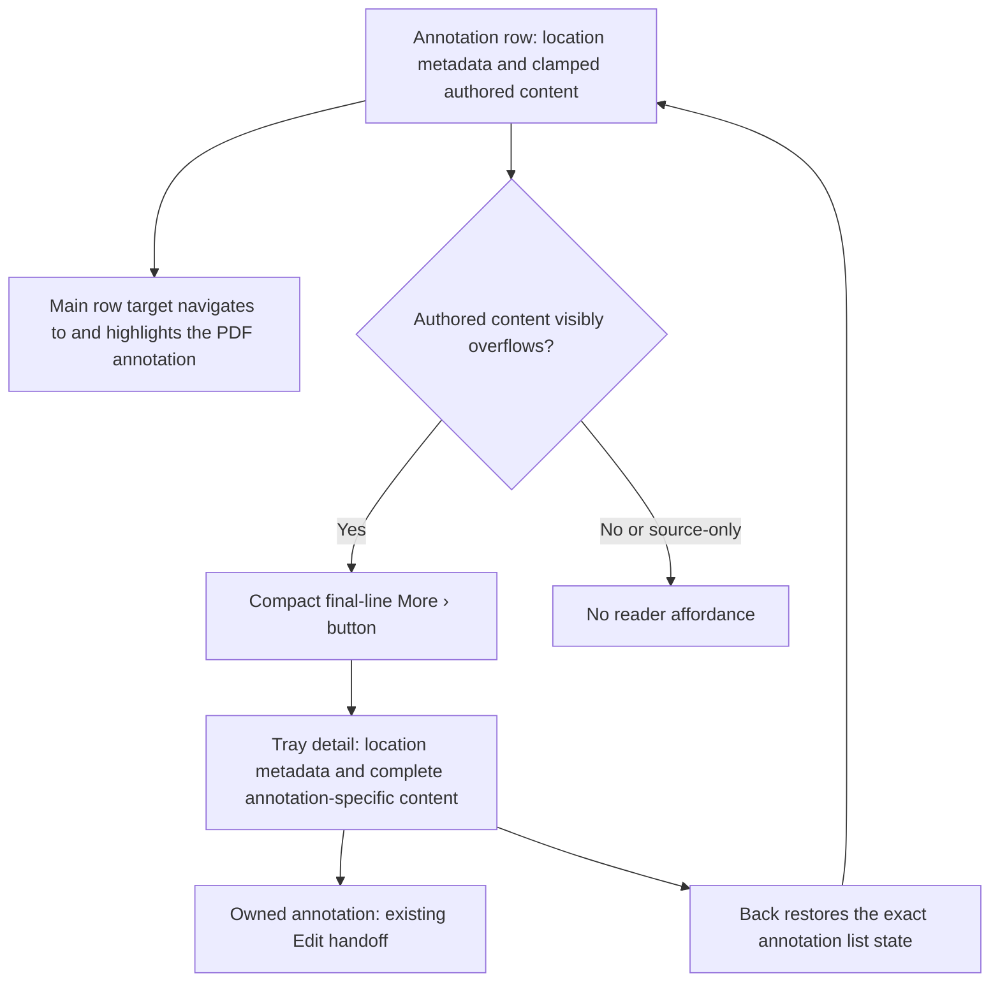
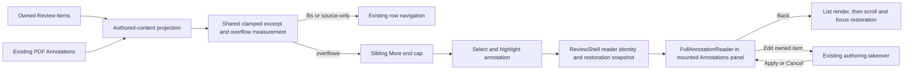
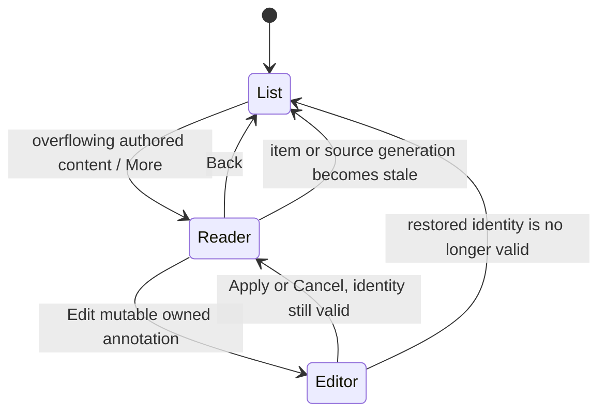

# Full Annotation Reader - Plan

## Goal Capsule

- **Objective:** Let reviewers read all authored annotation content from the Annotation Tray without losing the annotation’s highlighted PDF location or the tray position they were scanning.
- **Means:** Add an overflow-measured `More ›` end cap and a derived, identity-keyed reader view inside the mounted tray. (KTD1-KTD4)
- **Product authority:** This contract owns full-text reading for Review Items and Existing PDF Annotations in the Annotation Tray. Existing contracts retain authority over Review Item meaning, PDF annotation projection, tray presentation, document navigation, editing, persistence, and links.
- **Open blockers:** None.
- **Execution profile:** Implement the dependency-ordered units in this file, then run the Verification Contract.
- **Stop conditions:** Stop if overflow cannot be measured without changing row geometry, reader restoration conflicts with the existing authoring authority model, or implementation evidence invalidates a session-settled product decision.
- **Tail ownership:** The autonomous shipping pipeline owns implementation, review, browser verification, commit, pull request creation, and merge-readiness monitoring.

---

## Product Contract

### Summary

Give visually truncated authored annotation content a dedicated full-text reader inside the Annotation Tray.
Keep source context in the highlighted PDF and preserve the compact list, navigation, editing, responsive, and accessibility grammar already established by Placekeeper.

### Problem Frame

Annotation rows clamp long text to preserve a compact, scannable tray.
The current row still navigates to the annotation’s highlighted PDF location, but the reviewer has no way to read authored content beyond the visible clamp.
Using the PDF as the source-context surface is already effective; the missing capability is access to the annotation-specific text itself.

### Key Decisions

- **Use a dedicated tray detail state.** (session-settled: user-directed — chosen over inline card expansion and a floating reader: the dedicated surface handles arbitrary text length consistently in right and bottom trays.) Governs R6-R10.
- **Keep source context exclusively in the PDF.** (session-settled: user-directed — chosen over repeating original, quoted, or nearby text in the reader: activating an annotation already highlights its location in the live document.) Governs R4-R5, R7.
- **Offer the reader only for overflowing authored content.** (session-settled: user-directed — chosen over readers for source-only annotation types: Delete and uncommented Highlight annotations are already fully represented by their highlighted PDF targets.) Governs R1-R3.
- **Keep the reader single-item and return through the list.** (session-settled: user-directed — chosen over Previous and Next controls: the Annotation Tray remains the primary browsing surface.) Governs R8-R10.
- **Retain editing for mutable annotations.** (session-settled: user-approved — chosen over a reading-only surface: an owned annotation can hand off to the established editor and return to its refreshed reader state.) Governs R11-R12.
- **Use a compact final-line `More ›` end cap.** (session-settled: user-directed — chosen over a persistent footer button and an action-rail icon: the end cap preserves scan density without adding a fourth object-action control.) Governs R14-R17.

### Requirements

**Reader eligibility and content**

- R1. The reader affordance shall be available only when authored annotation-specific content is visually truncated by the annotation row’s clamp.
- R2. Eligible authored content shall include replacement text, insertion text, Highlight comments, Page Note comments, and Existing PDF Annotation contents; Delete annotations and Highlights without comments shall remain source-only navigation rows.
- R3. Eligible Owned Annotations and Existing PDF Annotations shall share the full-text reading capability, while Existing PDF Annotations remain read-only.
- R4. The reader shall not repeat selected, original, quoted, nearby, or other source-document text that the live PDF already presents and highlights.
- R5. The reader shall show annotation type, page number, available section label, and the annotation’s complete authored content; an Existing PDF Annotation shall also show its author when available and shall omit unavailable metadata rather than showing placeholders.

**Tray detail behavior**

- R6. Activating the reader affordance shall first select the annotation and apply its existing PDF navigation and highlight behavior, then replace the annotation list with a dedicated detail state inside the same Annotation Tray while keeping the live PDF visible.
- R7. The detail state shall order a visible reader heading, location metadata, optional author, content label, and complete authored content. Content labels shall be `Replacement text` for Replace, `Insertion text` for Insert, `Comment` for Highlight, `Page note` for Page Note, and `Annotation contents` for an Existing PDF Annotation.
- R8. Complete annotation content shall use one tray-level scroll without nested scrolling inside content blocks.
- R9. Back shall restore the exact annotation-list scroll position, selected annotation, and `More ›` focus target that opened the reader; if that control is no longer eligible, focus shall fall back to its row-navigation target, then to the established workspace or PDF focus target when no annotation row remains.
- R10. The reader shall not add Previous or Next annotation navigation; reviewers shall return to the list to choose another item.
- R11. A mutable Owned Annotation shall retain access to the existing Edit action from its reader; an Existing PDF Annotation shall expose no editing action.
- R12. Cancelling an Edit handoff shall restore the same reader state. Applying an edit shall restore the refreshed reader when authored content remains reader-eligible, or the restored source-only list row when the edit removes all reader-eligible content; both outcomes shall preserve the PDF’s settled location.
- R13. The annotation row’s main target and copied annotation links shall retain their existing PDF navigation and highlight behavior rather than opening the reader automatically.

**Compact reader affordance**

- R14. The visible reader control shall be a real button labeled `More ›`, positioned as a compact end cap over the end of the final clamped line and rendered only under R1.
- R15. At rest, `More ›` shall remain text-style with no persistent border, fill, or pill shape; pointer hover shall use lightweight emphasis without changing the control’s geometry.
- R16. Keyboard focus shall use the Annotation Tray’s existing card-level focus ring plus one continuous bottom rule beneath the complete `More ›` label, including the space and chevron, without an individual button box or fill.
- R17. The control shall have a larger invisible touch target, an accessible name that identifies the full annotation and page, and a desktop tooltip of `Read full annotation`; it shall remain a separate focus target from the row-navigation button and shall not add a control to the annotation action rail.

### Key Flows

- F1. Read a long owned annotation
  - **Trigger:** A reviewer encounters an Owned Annotation whose authored content is clamped.
- **Steps:** The reviewer activates `More ›`; Placekeeper selects and highlights that annotation in the PDF, then the tray opens the type-specific detail state.
  - **Outcome:** The reviewer reads the complete authored content and returns to the exact list position and focused row.
  - **Covered by:** R1-R2, R5-R10, R13-R17.
- F2. Read a long existing annotation
  - **Trigger:** An Existing PDF Annotation contains authored contents that overflow its row.
  - **Steps:** The reviewer opens the reader; the detail state shows complete contents, location metadata, and the author when available, with no editing affordance.
  - **Outcome:** Imported feedback is fully readable without becoming editable application state.
  - **Covered by:** R1, R3-R10, R13-R17.
- F3. Navigate a source-only annotation
  - **Trigger:** A reviewer encounters a Delete annotation or a Highlight without a comment.
  - **Steps:** No `More ›` control appears; the reviewer activates the existing row target.
  - **Outcome:** Placekeeper navigates to and highlights the complete source passage in the PDF.
  - **Covered by:** R1-R4, R13.
- F4. Edit from the reader
  - **Trigger:** A reviewer chooses Edit from a mutable Owned Annotation’s reader.
  - **Steps:** The established editor temporarily takes over, preserves its origin, and returns after Apply or Cancel.
- **Outcome:** The reader resumes with current content when it remains eligible; clearing the only Highlight comment returns to the restored source-only row. The PDF and tray context remain stable.
  - **Covered by:** R9, R11-R13.

### Acceptance Examples

- AE1. Show the reader only for real overflow
  - **Covers R1-R3, R14.**
  - **Given:** Two otherwise similar Page Notes render in the Annotation Tray, one fitting within the clamp and one exceeding it.
  - **When:** The rows finish layout at any supported tray width.
  - **Then:** Only the visually truncated Page Note shows `More ›`.
- AE2. Read replacement text without duplicating the source passage
  - **Covers R4-R8.**
  - **Given:** A long replacement annotation is active and its original PDF text is highlighted in the viewer.
  - **When:** The reviewer opens the reader.
  - **Then:** The tray shows the full replacement text and location metadata, but no copy of the original or nearby PDF text.
- AE3. Keep source-only annotations in the navigation flow
  - **Covers R1-R4, R13.**
  - **Given:** A Delete annotation targets a passage longer than the list clamp.
  - **When:** The annotation row renders and the reviewer activates it.
  - **Then:** No reader affordance appears, and the existing row target navigates to and highlights the complete deletion target in the PDF.
- AE4. Read imported feedback without granting editability
  - **Covers R3, R5-R8, R11.**
  - **Given:** An Existing PDF Annotation has long contents and an available author.
  - **When:** The reviewer opens its reader.
  - **Then:** The reader shows the complete contents, type, page, section when available, and author, with no Edit action.
- AE5. Restore the annotation list exactly
  - **Covers R6, R8-R10.**
  - **Given:** The reviewer opens a reader from a focused annotation at a non-default list scroll position.
  - **When:** The reviewer activates Back.
  - **Then:** The list returns at the same scroll position with the originating annotation selected and focused.
- AE6. Restore the reader after editing
  - **Covers R9, R11-R12.**
  - **Given:** A mutable Owned Annotation reader is open.
  - **When:** The reviewer edits the annotation and applies or cancels the editor.
  - **Then:** The same reader returns when content remains eligible, accepted changes are reflected, cancelled content remains unchanged, and the settled PDF location is preserved. Clearing the only Highlight comment returns to its source-only list row instead of an empty reader.
- AE7. Preserve the compact affordance across input modes
  - **Covers R14-R17.**
  - **Given:** An eligible annotation is rendered in wide, bottom-tray, keyboard, pointer, and coarse-pointer conditions.
  - **When:** `More ›` rests, hovers, receives keyboard focus, or is touched.
  - **Then:** Its visible geometry remains compact, touch reachability increases without a persistent pill, and keyboard focus shows the card ring plus one uninterrupted rule beneath the full label.

### Success Criteria

- Reviewers can read every eligible authored annotation in full without leaving the Annotation Tray or losing the highlighted PDF location.
- Source-document prose appears once, in the live PDF, while the reader presents only annotation-specific content and minimal location metadata.
- The new affordance does not add a fourth action-rail control or make non-overflowing and source-only rows taller or busier.
- Returning from reading or editing preserves the reviewer’s exact tray and PDF context.
- Keyboard, pointer, and touch users can discover and operate the reader without a persistent button box or ambiguous icon.

### Scope Boundaries

- The reader does not expand annotation cards inline and does not open a floating popover or modal.
- The reader does not duplicate original, selected, quoted, or nearby PDF text.
- The reader does not appear for Delete annotations or Highlights without comments.
- The reader does not add sequential Previous or Next navigation.
- The reader does not change annotation-row navigation, Placekeeper Link behavior, Review Item meaning, Existing PDF Annotation ownership, annotation persistence, or save synchronization.
- This work does not redesign the existing annotation editor; it only preserves the established Edit handoff and restoration contract.

### Dependencies and Assumptions

- The Annotation Tray continues to preserve the mounted PDF and adaptive right-versus-bottom presentation defined by its existing product contracts.
- Activating an annotation continues to navigate to and highlight its source location in the PDF.
- Existing editor takeover and restoration behavior remains authoritative for Edit launched from the reader.
- Section labels and Existing PDF Annotation authors remain optional metadata and may be absent.

### Sources and Research

- `CONCEPTS.md`
- `docs/plans/2026-08-08-001-fix-adaptive-annotation-tray-reflow-plan.md`
- `docs/plans/2026-08-21-1453-feat-contextual-annotation-composer-plan.md`
- `apps/web/src/review/AnnotationList.tsx`
- `apps/web/src/review/AnnotationMetadata.tsx`
- `apps/web/src/app/ReviewShell.tsx`
- `apps/web/src/app/review-layout-annotations.css`
- `apps/web/src/app/review-layout-responsive.css`
- `apps/web/src/pdf/existing-annotations.ts`
- `test/acceptance/review-workflow.spec.ts`
- `test/acceptance/review-visual.spec.ts`

---

## Planning Contract

### Product Contract Preservation

This implementation plan preserves the requirements, flows, acceptance examples, success criteria, and scope boundaries established by the brainstorm. It adds implementation detail without changing Product Contract meaning or stable IDs.

### Key Technical Decisions

- KTD1. Keep list and reader as derived views inside the mounted Annotations panel. Key reader state is a discriminated owned-or-source identity, not a copied annotation object or durable Review State. This extends the existing workspace lifecycle and avoids PDF or tray remounting. (session-settled: user-directed — chosen over inline expansion and a floating surface: R6-R10 require one dedicated tray detail state.)
- KTD2. Project authored reader content through one kind-aware adapter. Replace and Insert use proposed text; Highlight and Page Note use non-empty comments; Existing PDF Annotations use contents; Delete, uncommented Highlight, and source quote text return no reader content. This prevents the current generic excerpt fallback from making source text reader-eligible. (R1-R5, R7)
- KTD3. Detect visual overflow from rendered geometry at the actual excerpt width, with the `More ›` end-cap width reserved during measurement. Recompute after content, width, and font-layout changes. Do not use character counts or the clamped element's exposed height as the sole signal. (R1, R14-R17)
- KTD4. Render `More ›` as a sibling of the native row-navigation button and position its larger hit target in a reserved, unobscured final-line slot. This preserves valid native-control semantics, independent focus, row navigation, authored-text legibility, the card focus ring, and action-rail ownership. (session-settled: user-directed — chosen over a footer button and action-rail icon: R13-R17 require a compact final-line end cap.)
- KTD5. Let `ReviewShell` own reader entry, Back restoration, stale-record fallback, and Edit handoff. Capture the originating identity, active selection, list scroll offset, and focus target before the view swap; derive current content by identity on every render. (R6-R13)
- KTD6. Verify semantic projection, browser geometry, lifecycle restoration, and visual finish as separate concerns. Unit and server-render tests cannot establish real line-clamp overflow, hit routing, touch size, or exact focus and scroll restoration. (R1-R17)

### High-Level Technical Design

The reader extends the existing Annotation Tray without changing durable annotation models or the workspace mount boundary.

Reader and editor transitions use identities so current annotation data remains authoritative.

### Assumptions

- The full brainstorm scope ships together; this plan does not narrow to one annotation origin, tray presentation, or input mode.
- The work extends the existing mounted tray, authoring takeover, focus-memory, and responsive presentation patterns instead of introducing a new application-level navigation layer.
- A hidden or otherwise intrinsic same-style measurement surface may be used when browser line-clamp metrics do not expose unclamped height reliably. The implementation must avoid a measurement loop in which showing `More ›` creates the overflow that justifies it.
- Reader entry focuses its visible heading, whose accessible name identifies the annotation type and page; Back follows immediately in tab order. This announces the list-to-reader transition without adding a live region.
- Back returns focus to the originating `More ›` control after restoring list scroll and active selection. If reflow removes that control, restoration falls back to the row-navigation target, then to the established workspace or PDF focus policy when no row remains.
- If an owned item disappears, or an Existing PDF Annotation identity or discovery generation becomes stale, the reader returns safely to the list when annotations remain. When the final annotation disappears, the established workspace or PDF fallback receives focus instead of retaining an empty annotation surface.
- Adjacent annotation-list refactors, editor redesign, sequential reader browsing, and persistence changes remain outside this implementation.

### System-Wide Impact

- **State:** Reader state is transient UI state. It must not enter `packages/core`, persistence, history, save synchronization, or Placekeeper Link payloads.
- **Workspace lifecycle:** The existing Annotations panel remains mounted across list, reader, and authoring takeover transitions so PDF framing and responsive right-versus-bottom presentation remain stable.
- **Accessibility:** The feature adds a focusable control per eligible row and a labelled detail region. Existing row navigation, tooltip policy, action semantics, and coarse-pointer sizing remain authoritative.
- **Testing:** Real-browser coverage is required because overflow truth, end-cap geometry, hit routing, and restoration depend on layout and focus behavior.

### Risks and Mitigations

- **Circular overflow measurement:** Reserving space for `More ›` can itself cause wrapping. Measure against a stable reserved end-cap width before deciding visibility, reserve the same unobscured slot in the rendered third line, and assert that repeated measurements settle without glyph overlap.
- **Stale restoration targets:** Editing, deletion, document replacement, or responsive reflow can invalidate the opening element. Restore by identity after render and use the row target or panel as an explicit fallback.
- **Touch overlap:** The invisible coarse-pointer target can overlap row navigation or the action rail. Verify hit boxes and click routing at narrow widths, not only screenshots.
- **Cross-browser clamp differences:** Chromium and WebKit can report clamped geometry differently. Keep semantic eligibility pure, isolate geometric measurement, and run focused browser coverage in both engines.

---

## Implementation Units

### U1. Define authored-content and reader identity contracts

**Goal:** Create one semantic source of truth for which annotation-specific text can open a reader and how an open reader resolves live data.

**Requirements:** R1-R5, R7, R11-R13; F2-F3; AE2-AE4; KTD2, KTD5.

**Dependencies:** None.

**Files:**

- `apps/web/src/review/annotation-reader.ts`
- `apps/web/src/pdf/existing-annotations.ts`
- `apps/web/test/review-layout.test.tsx`

**Approach:**

1. Add pure projections for owned Review Items and Existing PDF Annotations that return type-specific authored content, display label, page, optional section, optional author, mutability, and stable origin identity.
2. Exclude Delete, uncommented Highlight, and every source-text fallback such as quote or original text.
3. Keep imported annotations as display-only DTOs and use page-plus-ID with discovery generation or document authority for source identity.
4. Resolve reader records from current props/state on render so accepted edits refresh content and stale records can be rejected.

**Patterns to follow:** `payloadText` and metadata assembly in `apps/web/src/review/AnnotationList.tsx`; display-only imported DTOs and `existingAnnotationKey` in `apps/web/src/pdf/existing-annotations.ts`; canonical labels in `apps/web/src/review/AnnotationMetadata.tsx`.

**Test scenarios:**

- Covers AE2. A Replace or Insert with proposed text projects the complete proposed text and never its quote.
- A Highlight with a non-empty comment and a Page Note with a comment project reader content; an empty-comment Highlight and Delete project no reader content.
- Covers AE4. An imported annotation projects contents and available author as read-only, and omits an empty author without a placeholder.
- A missing owned item or mismatched imported discovery generation cannot resolve an open reader identity.

**Verification:** Every eligible and source-only kind has an explicit semantic test, and no durable model or persistence format changes.

### U2. Add the shared overflow end cap to owned and imported rows

**Goal:** Show `More ›` only when semantically eligible authored content is visually truncated, while preserving row geometry and navigation.

**Requirements:** R1-R4, R13-R17; F1-F3; AE1, AE3, AE7; KTD2-KTD4.

**Dependencies:** U1.

**Files:**

- `apps/web/src/review/AnnotationExcerpt.tsx`
- `apps/web/src/review/AnnotationList.tsx`
- `apps/web/src/app/ReviewShell.tsx`
- `apps/web/src/app/review-layout-annotations.css`
- `apps/web/src/app/review-layout-responsive.css`
- `apps/web/test/review-layout.test.tsx`
- `apps/web/test/control-tooltips.test.ts`
- `test/acceptance/review-workflow.spec.ts`
- `test/acceptance/review-harness/main.tsx`

**Approach:**

1. Extract a shared excerpt presentation used by owned and imported rows, with semantic eligibility supplied by U1.
2. Measure intrinsic text geometry after layout at the rendered width with stable end-cap space reserved. Observe size changes, remeasure after font readiness, and clean up frames and observers.
3. Render a native sibling `More ›` button only after overflow is confirmed. Keep it outside the action rail and the row-navigation button.
4. Preserve the three-line card height and reserve an unobscured rendered slot for the complete visible label and enlarged target. Style text-only rest, lightweight pointer hover, one full-label focus rule plus the row `:focus-within` ring, and a larger non-overlapping coarse-pointer target.
5. Give the control `title="Read full annotation"` and a page-specific accessible name. Keep the main row target and copied links unchanged.

**Execution note:** Establish browser-based fit-versus-overflow coverage before finalizing the geometry algorithm; DOM-only tests do not prove line-clamp behavior.

**Patterns to follow:** observer and animation-frame cleanup in `apps/web/src/app/ReviewShell.tsx`; three-line clamp and row focus ring in `apps/web/src/app/review-layout-annotations.css`; coarse-pointer control sizing in `apps/web/src/app/review-layout-responsive.css`; native tooltip contract in `apps/web/test/control-tooltips.test.ts`.

**Test scenarios:**

- Covers AE1. At the same tray width, a fitting Page Note has no `More ›` and a genuinely clamped Page Note has one.
- Changing between right and bottom presentations recomputes eligibility from current geometry without a visibility loop or row-height jump.
- Covers AE3. Delete and uncommented Highlight rows never show `More ›`, even when source quote text is long.
- Activating the main row target retains its current behavior; activating `More ›` independently applies the same annotation selection and PDF navigation/highlight behavior before opening the reader, without programmatically clicking the row target.
- Covers AE7. Pointer hover does not change geometry; keyboard focus shows the card ring and one continuous underline; the coarse-pointer hit box meets the tray touch token without overlapping authored glyphs, navigation, or action buttons.
- Owned and imported eligible rows expose the same visible label, exact tooltip, page-specific accessible name, and independent tab stop.

**Verification:** Chromium and WebKit agree on fit-versus-overflow behavior at supported tray presentations, hit routing is unambiguous, and tooltip and focus contracts pass.

### U3. Implement the dedicated reader and exact Back restoration

**Goal:** Replace the annotation list with a complete, type-aware, single-item reader and return to the exact list context.

**Requirements:** R3-R10, R13; F1-F3; AE2, AE4-AE5; KTD1, KTD2, KTD5.

**Dependencies:** U1, U2.

**Files:**

- `apps/web/src/review/FullAnnotationReader.tsx`
- `apps/web/src/app/ReviewShell.tsx`
- `apps/web/src/app/review-layout-annotations.css`
- `apps/web/test/review-layout.test.tsx`
- `test/acceptance/review-workflow.spec.ts`
- `test/acceptance/review-harness/main.tsx`

**Approach:**

1. Before opening, capture reader identity, active selection, annotation viewport scroll offset, and the originating row identity.
2. Apply the annotation's existing selection and PDF navigation/highlight path, then swap only the contents of the mounted Annotations panel to a labelled reader region.
3. Focus a visible heading named `Full annotation — {type}, page {page}` on entry, use it to label the region, place Back next in tab order, and retain the panel as the only scroll container.
4. Render location metadata, optional author, the exact R7 content label, and complete authored content. Never render source-document prose.
5. On Back, render the list first, then restore active selection, scroll offset, and focus to the originating `More ›` control without scrolling the PDF. Fall back to its row-navigation target if `More ›` is no longer rendered.
6. If the record becomes unavailable or its authority changes, restore the list when annotations remain; otherwise use the established workspace or PDF focus fallback.

**Patterns to follow:** workspace ownership and double-frame scroll/focus restoration in `apps/web/src/app/ReviewShell.tsx`; focus memory and mounted annotations panel in `apps/web/src/review/OutlineAnnotationsWorkspace.tsx`; existing `AnnotationMetadata` vocabulary.

**Test scenarios:**

- Covers AE2. A long replacement opens a reader with complete replacement text and location metadata but no quote, selected text, or nearby PDF prose.
- Covers AE4. A long imported annotation shows available author and no Edit action; absent section or author metadata is omitted.
- The reader uses the existing tray viewport for long content and creates no nested scroll container.
- Covers AE5. Back from a nonzero list scroll restores the same active row, exact scroll offset, and opening `More ›` focus while the PDF location remains settled; reflowing that control away falls back to row-navigation focus.
- Reader entry focuses and exposes the accessible name of its visible type-and-page heading, with Back next in tab order.
- Reader entry and Back remain correct in right and bottom presentations, including a reflow while the reader is open.
- Deleting or replacing the source document while a reader identity is stale returns to a current list when available; removal of the last annotation follows the established workspace or PDF fallback rather than retaining frozen content.

**Verification:** Owned and imported readers satisfy the content hierarchy in both tray presentations, and automated focus, scroll, and PDF-location assertions prove exact restoration.

### U4. Preserve Edit-from-reader lifecycle and refresh

**Goal:** Reuse the established owned-annotation editor from the reader and restore the reader after Apply or Cancel.

**Requirements:** R9, R11-R13; F4; AE6; KTD1, KTD5.

**Dependencies:** U3.

**Files:**

- `apps/web/src/app/ReviewShell.tsx`
- `apps/web/src/review/authoring-session.ts`
- `apps/web/src/review/FullAnnotationReader.tsx`
- `apps/web/test/review-layout.test.tsx`
- `apps/web/test/authoring-session.test.ts`
- `test/acceptance/review-workflow.spec.ts`

**Approach:**

1. Extend the displaced-workspace snapshot or restoration origin so an Edit launched from the reader retains reader identity and reader viewport state.
2. Send mutable owned annotations through the existing authoring takeover and pass the reader Edit button as the focus origin.
3. After Cancel, restore the reader when identity remains valid. After Apply, resolve current content from current Review State and restore the refreshed reader only while it remains eligible; otherwise restore its source-only list row.
4. If the item or document authority becomes stale during authoring, use the established safe cancellation path and restore the list instead of an invalid reader.

**Patterns to follow:** `beginAuthoring`, `snapshotAuthoringWorkspace`, and `closeAuthoringSession` in `apps/web/src/app/ReviewShell.tsx`; authority and workspace snapshot types in `apps/web/src/review/authoring-session.ts`.

**Test scenarios:**

- Covers AE6. Apply from a mutable owned reader returns to the same reader with accepted text refreshed and PDF location unchanged.
- Covers AE6. Cancel returns to the same reader with content unchanged and reader scroll/focus restored.
- Covers AE6. Clearing the only Highlight comment on Apply returns to the exact source-only list row with no empty reader or `More ›` control.
- Replace, Insert, commented Highlight, and Page Note expose Edit when mutable; imported annotations expose none.
- A stale document or removed item during takeover does not apply to the wrong annotation and returns to a valid list state.

**Verification:** Existing list-origin editing behavior remains green, and reader-origin Apply, Cancel, and stale-authority paths restore the correct surface and focus.

### U5. Add durable responsive visual and workflow evidence

**Goal:** Lock the final reader hierarchy and compact end-cap behavior across supported presentation and input states.

**Requirements:** R5-R10, R14-R17; F1-F4; AE1-AE7; KTD6.

**Dependencies:** U2-U4.

**Files:**

- `test/acceptance/review-harness/visual-scenarios.tsx`
- `test/acceptance/review-visual.spec.ts`
- `test/acceptance/review-workflow.spec.ts`
- `test/acceptance/review-visual.spec.ts-snapshots/`

**Approach:**

1. Seed deterministic fitting and overflowing owned and imported annotations in the browser and visual harnesses.
2. Add wide right-tray and narrow bottom-tray reader scenes, plus compact end-cap rest, hover, and keyboard-focus scenes.
3. Assert one tray-level scroll, no horizontal overflow, stable row height, end-cap placement over the third line, focus-rule continuity, and non-overlapping interactive bounds.
4. Update snapshots only after behavioral assertions pass, then inspect and rerun the visual suite without snapshot updates.

**Execution note:** Treat screenshots as finish evidence only; keep hit routing, overflow truth, touch geometry, and restoration as browser assertions.

**Patterns to follow:** current Annotation Tray wide and narrow scenes in `test/acceptance/review-visual.spec.ts`; deterministic seed data in `test/acceptance/review-harness/visual-scenarios.tsx`.

**Test scenarios:**

- Covers AE7. Wide and narrow snapshots preserve compact list density and show the intended end-cap states without a pill, footer, or action-rail control.
- Owned and imported reader snapshots show type-specific labels, complete authored content, optional metadata omission, and no duplicate PDF source text.
- Long reader content scrolls only the tray viewport and does not create horizontal or nested overflow.
- Workflow assertions cover all Product Contract acceptance examples in Chromium; overflow, responsive, and focus-sensitive paths also pass in WebKit.

**Verification:** Reviewed snapshots and clean browser reruns show stable geometry and hierarchy at wide and narrow viewports, with behavior assertions passing independently.

---

## Verification Contract

Run focused gates as each unit lands, then the repository review gates in this order:

1. `pnpm exec vitest run apps/web/test/review-layout.test.tsx apps/web/test/authoring-session.test.ts apps/web/test/control-tooltips.test.ts`
2. `pnpm exec playwright test test/acceptance/review-workflow.spec.ts --grep "full annotation|More"`
3. `pnpm exec playwright test --config playwright.webkit.config.ts test/acceptance/review-workflow.spec.ts --grep "full annotation|More"`
4. `pnpm exec playwright test --config playwright.visual.config.ts test/acceptance/review-visual.spec.ts --grep "Annotation Reader|Annotation Tray"`
5. Inspect changed snapshots, rerun the same visual selection without `--update-snapshots`, and confirm no unexpected image diff remains.
6. `pnpm typecheck`
7. `pnpm build:web`
8. `pnpm test:review`

Quality gates:

- Run `git diff --check` before review and again before commit.
- Confirm no change to core Review Item schemas, persistence, save synchronization, links, or PDF navigation contracts.
- Confirm every added native control has a tooltip and specific accessible name.
- Confirm Chromium and WebKit both prove geometry-sensitive behavior; snapshots alone are insufficient.
- Run `release:validate` only if implementation unexpectedly changes packaging, installed application assets, or production distribution behavior.

---

## Definition of Done

- U1 is done when every annotation kind has an explicit authored-content projection and stale identities fail closed.
- U2 is done when only genuine visual overflow produces a separate, accessible `More ›` end cap without changing row navigation or geometry.
- U3 is done when complete owned and imported content is readable in the mounted tray and Back restores the exact list context.
- U4 is done when Apply and Cancel from an owned reader restore the correct live reader, while stale authority falls back safely.
- U5 is done when reviewed wide and narrow visual evidence and Chromium/WebKit workflow assertions cover the end cap and reader states.
- All Product Contract requirements and acceptance examples are covered by passing tests or explicit browser assertions.
- Typecheck, focused unit tests, browser workflow tests, visual tests, the production web build, and `pnpm test:review` pass.
- The final diff contains no abandoned measurement experiments, duplicate reader projections, temporary harness probes, debug logging, or unrelated cleanup.
- The feature is reviewed, committed, pushed, opened as a pull request, and monitored until merge-ready by the autonomous pipeline.
