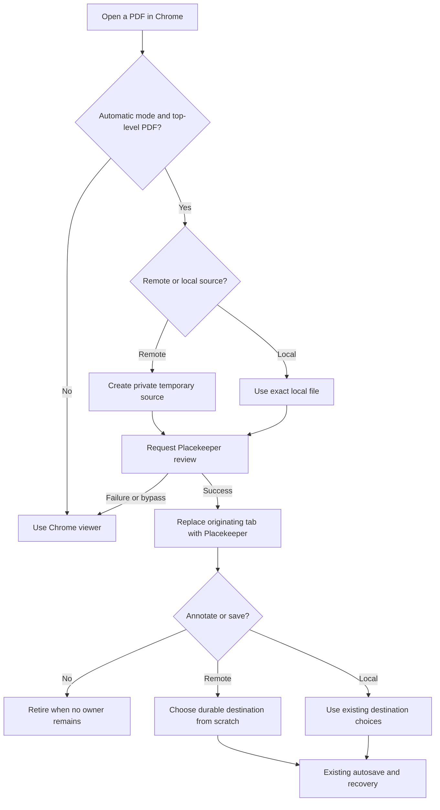
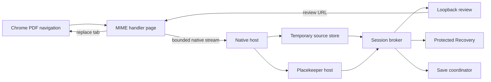
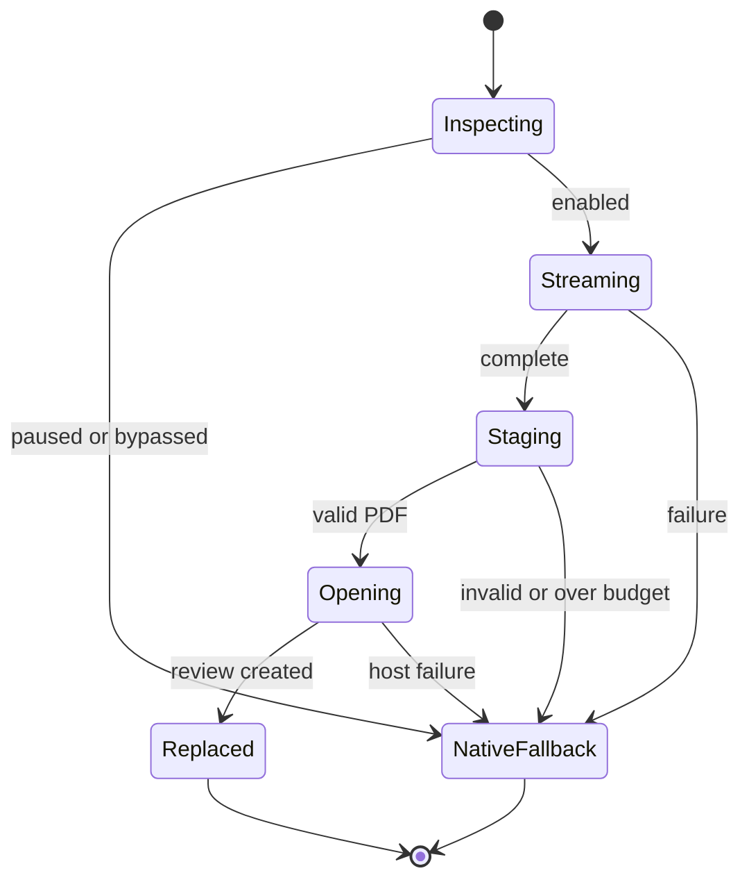
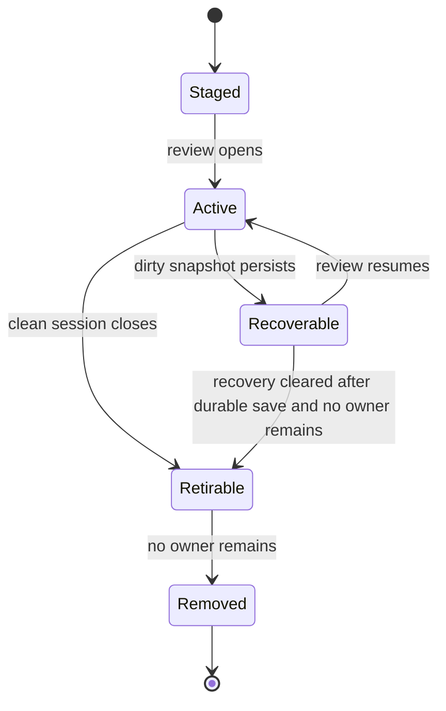
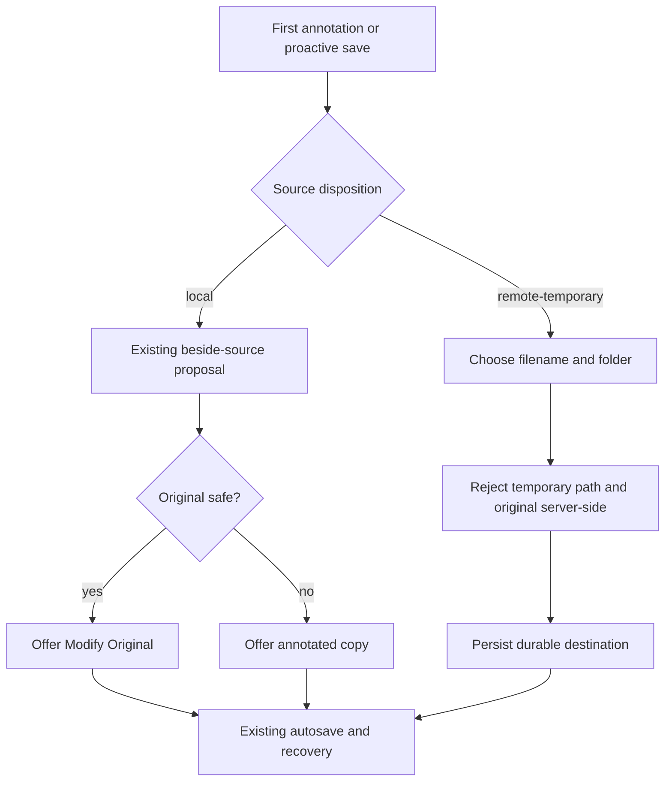
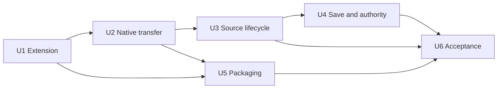

# Chrome PDF Handoff - Plan

## Goal Capsule

- **Objective:** A person can click a PDF link in Chrome and read it in Placekeeper instead of Chrome's built-in PDF viewer, without creating a permanent file merely by viewing it.
- **Means:** An opt-in Chrome MIME-handler extension streams the response to a narrowly authorized installed Placekeeper host and replaces the originating tab with its browser-scoped review. (KTD1-KTD3)
- **Product authority:** This Product Contract governs the Chrome-to-Placekeeper experience. Existing Placekeeper reading, annotation, saving, Protected Recovery, and Codex-authority rules remain authoritative unless a requirement below changes them.
- **Execution profile:** Cross-surface feature; implement in dependency order U1-U6 and preserve safe fallback after every unit.
- **Stop conditions:** Stop if Chrome's public MIME-handler API cannot provide the authenticated PDF body exactly once, the packaged extension cannot retain a stable identity, or the native boundary would need to expose Placekeeper's general daemon-control protocol.
- **Tail ownership:** U6 owns installed-app acceptance proof, distribution validation, and operator documentation.
- **Open blockers:** None.

---

## Product Contract

### Summary

Add an optional Chrome extension that replaces top-level PDF tabs with Placekeeper in the same tab. Remote PDFs use private temporary sources, while already-local PDFs retain their normal filesystem identity and save behavior.

Product Contract preservation: clarified F2 and AE4 to remove an obsolete Chrome local-file-access prerequisite; no scope change.

### Problem Frame

Chrome currently opens PDF links in its built-in viewer. Moving one into Placekeeper requires downloading it, locating it in Finder, and choosing Open With -> Placekeeper. That three-step handoff makes Placekeeper inconvenient for ordinary browser-led reading even though the installed app already accepts local PDFs and serves its viewer through a loopback browser interface.

### Actors

- A1. **Reader:** Opens PDFs in Chrome and may read, annotate, save, or return to the originating page.
- A2. **Chrome extension:** Detects eligible PDF navigations, controls automatic mode, and coordinates acquisition and handoff.
- A3. **Installed Placekeeper host:** Accepts an authorized handoff, establishes the source and review session, and returns the browser-viewable review destination.
- A4. **Placekeeper viewer:** Presents the PDF and applies existing annotation, save-destination, recovery, and browser-surface authority rules.

### Key Decisions

- **Use an extension-to-native handoff.** (session-settled: user-directed — chosen over making Placekeeper the macOS default PDF handler or teaching Placekeeper to act as a remote authenticated web client: it best matches the desired browser workflow while extending the existing local viewer.) Governs R1-R8.
- **Limit the first release to opt-in Chrome interception of top-level PDF tabs.** (session-settled: user-directed — chosen over automatic activation, per-site rules, other browsers, embedded PDFs, and suffix-only detection: it solves the observed workflow with a focused control and coverage boundary.) Governs R1-R3, R13-R14.
- **Treat remote PDFs as temporary viewing sources.** (session-settled: user-directed — chosen over keeping ordinary downloads in the Downloads folder: opening a browser PDF should not create a permanent file.) Governs R5, R9-R10, R12.
- **Choose durable destinations according to source origin.** (session-settled: user-directed — chosen over defaulting every save to Downloads or the last-used folder: remote sources must not expose their private cache location, while local sources should retain the existing source-folder default.) Governs R10-R12.
- **Preserve the originating tab and fail back to Chrome.** (session-settled: user-approved — chosen over opening a disconnected new tab or leaving a failed handoff page: Placekeeper should replace Chrome's viewer without making the PDF unreachable.) Governs R4, R7, R14.

### Requirements

**Activation and coverage**

- R1. Installing the extension shall not enable automatic interception until A1 turns on a clearly visible global automatic-open control.
- R2. While automatic mode is enabled, A2 shall recognize top-level PDF document responses by response identity rather than requiring the requested URL to end in `.pdf`.
- R3. The first release shall cover eligible PDF tabs in Google Chrome on macOS, including redirects and authenticated HTTP or HTTPS navigations that Chrome itself can access.

**Handoff and viewing**

- R4. A successful handoff shall replace the eligible PDF navigation in its originating tab with the Placekeeper review while preserving a usable Back path to the preceding browser page.
- R5. For a remote PDF, the handoff shall establish a private temporary local source without leaving a durable user-visible download solely because A1 viewed the document.
- R6. For an already-local PDF, the handoff shall open that exact local file rather than copying it into temporary storage.
- R7. A detection, acquisition, authorization, native-host, daemon, or session-creation failure shall leave the PDF available through Chrome's viewer and shall not immediately re-intercept the fallback navigation.
- R8. The Chrome handoff shall grant only ordinary browser-scoped review authority: it shall create no Codex task binding, bind proof, Codex context, or task controls. An independently established binding on a reused underlying review remains governed by the existing binding lifecycle.

**Temporary-source lifecycle and saving**

- R9. Opening and closing a remote PDF without annotating or choosing a destination shall show no save prompt and leave no durable PDF copy.
- R10. The first annotation or proactive save for a remote source shall require A1 to choose a durable filename and location from scratch, and the private temporary location shall never be proposed or exposed as the destination.
- R11. The first annotation or proactive save for an already-local source shall retain Placekeeper's existing source-folder copy proposal and safe-original option.
- R12. A remote temporary source shall never be offered as an original that can be modified; after A1 chooses a durable destination, existing automatic saving and Protected Recovery rules shall govern subsequent changes.

**Control and escape**

- R13. A1 shall be able to inspect, enable, and pause automatic mode from the extension without changing Placekeeper's macOS PDF-handler rank.
- R14. Automatic interception shall provide a reliable path to use Chrome's viewer for a failed or intentionally bypassed PDF without disabling the extension permanently.

### Key Flow



- F1. **Open a remote PDF automatically.** A1 opens an eligible remote PDF while automatic mode is enabled; A2 establishes a private temporary source through A3, receives a review destination, and replaces the originating tab. A1 reads in Placekeeper without a manual download or durable copy. Covers R1-R5, R8-R9.
- F2. **Open an already-local PDF.** A1 opens a local PDF in Chrome while automatic mode is enabled; A2 hands the exact local path to A3, which opens or focuses the corresponding review in the originating tab. The file retains its identity and existing save behavior. Covers R4, R6, R8, R11.
- F3. **Fall back safely.** An eligible navigation cannot complete the handoff, or A1 chooses bypass; A2 releases that response to Chrome's native PDF viewer without a loop. The PDF remains readable and the global setting is unchanged. Covers R7, R14.
- F4. **Annotate a remote PDF.** A1 creates the first annotation on a temporary source; A4 holds it pending and asks for a durable destination from scratch, then resumes existing saving and recovery. The private source is never presented as the original. Covers R10, R12.

### Acceptance Examples

- AE1. **Remote PDF without a `.pdf` suffix.** Given automatic mode is enabled and an authenticated URL responds with a PDF after a redirect, opening it displays Placekeeper in the originating tab without a manual download or Codex controls. Covers R2-R5, R8.
- AE2. **Read-only remote visit.** Given a remote PDF opened through the extension, reading and closing it without annotating or choosing a destination produces no save prompt and no durable user-visible PDF. Covers R5, R9.
- AE3. **First annotation on a remote source.** Given a remote temporary source with no destination, the first annotation asks for a new filename and location, does not offer Modify Original, and commits only after selection. Covers R10, R12.
- AE4. **Local PDF keeps local behavior.** Given A1 opens a local PDF in Chrome while automatic mode is enabled, the first annotation proposes an annotated copy beside the source and offers modifying the exact original when existing safety checks permit it. Covers R6, R11.
- AE5. **Placekeeper is unavailable.** Given automatic mode is enabled but the native host or Placekeeper session cannot be reached, the PDF opens once in Chrome's viewer and a later PDF can retry without re-enabling mode. Covers R7, R14.
- AE6. **Automatic mode is paused.** Given the extension is installed and paused, opening a top-level PDF uses Chrome normally and does not change Placekeeper's macOS handler registration. Covers R1, R13.

### Scope Boundaries

- The first release supports Google Chrome 151 or newer on macOS only; other browsers, older Chrome, and mobile are deferred.
- Embedded PDF frames and PDF objects inside otherwise non-PDF pages are excluded.
- Per-site lists are deferred; the first release uses one global control plus Chrome's per-navigation fallback.
- Chrome Web Store publication and managed-enterprise deployment are deferred; source-first distribution bundles an unpacked extension and installation instructions.
- Making Placekeeper the system-wide default PDF handler and direct remote-URL viewing are excluded.
- Existing viewer, annotation, autosave, Protected Recovery, and Codex handoff behavior changes only where R8-R12 require it.

### Dependencies / Assumptions

- Chrome 151+ is available and its public `chrome.mimeHandler` and native-messaging APIs retain documented semantics.
- Source-first installation may require a one-time developer-mode “Load unpacked” action; Web Store publishing is follow-up work.
- The bundled extension keeps one stable identity so the native host can allow-list it exactly.
- Cleanup respects Quiescent Review Session and Protected Recovery ownership.
- Each remote navigation is a distinct acquisition in the first release; cross-navigation deduplication is excluded to avoid retaining sensitive browser identity.

### Outstanding Questions

None. Web Store distribution, other Chromium browsers, and enterprise policy installation are deferred non-blocking follow-up work.

### Sources / Research

- Existing product and save intent: `docs/plans/2026-08-06-001-feat-local-placekeeper-plan.md` and `docs/plans/2026-08-11-001-feat-saveless-pdf-annotation-persistence-plan.md`.
- Current packaging and launch bridge: `packaging/macos/app-bundle.json`, `packaging/macos/launcher.mjs`, and `apps/service/src/host/placekeeper-host.ts`.
- [Chrome `mimeHandler` API](https://developer.chrome.com/docs/extensions/reference/api/mimeHandler), [Manifest `mime_types_handler`](https://developer.chrome.com/docs/extensions/reference/manifest/mime-types-handler), and [Chrome 151 release notes](https://developer.chrome.com/release-notes/151).
- [Chrome native messaging](https://developer.chrome.com/docs/extensions/develop/concepts/native-messaging).

---

## Planning Contract

### Key Technical Decisions

- **KTD1. Use Chrome's public top-level PDF MIME handler.** Declare `application/pdf` without embedded handling and require Chrome 151+. Consume `streamUrl` exactly once and never re-fetch `originalUrl`. Because Chrome initially enables a newly registered handler, require a persisted opt-in sentinel before any native connection and keep the MIME-handler option synchronized as the browser control. (session-settled: user-approved — chosen over DNR, webRequest, suffix matching, or Downloads staging: it directly supplies the already-authorized response and owns native fallback.) Instantiates R1-R3, R6-R7, R13-R14.
- **KTD2. Stream through a narrow, bounded native protocol.** Use start/chunk/finish/cancel with acknowledgements, immutable transfer identity/disposition, phase-closed schemas, a 64 MiB remote-PDF ceiling, a 128 MiB staging ceiling, and strict duration/origin/state limits. The smaller browser-only ceiling bounds Buffer/Wasm/native allocations that V8 heap flags do not govern. The transfer sink owns partial mode-0600 bytes until fsync and isolated existing-backend structural validation produce an opaque sealed-source handle; the daemon repeats portable-item inspection in a bounded, cancellation-aware worker rather than its event loop. The broker atomically persists session/recovery ownership before the sink releases it. Return only a typed browser destination or failure; never proxy general daemon control. (session-settled: user-approved — chosen over one giant message or raw daemon forwarding: it supports large PDFs with least authority.) Instantiates R3-R8.
- **KTD3. Make source disposition explicit in service-owned metadata.** A source is `local` or `remote-temporary`; recovery persists only disposition, opaque acquisition and lease identity, digest/length, and sanitized display name, while portable `ReviewState` stays path-free. Original URL, headers, credentials, native staging path, and raw browser metadata are never persisted or publicly projected. Migrate old recovery records to `local`. (session-settled: user-approved — chosen over inferring origin from a cache path or URL: policy must survive restarts.) Instantiates R5-R12.
- **KTD4. Lease temporary browser sources to review and recovery owners.** One sealed source is authoritative while a live session, dirty draft, or recovery snapshot references it; remove it only after the final owner releases it. Each first-release remote navigation receives a random acquisition identity and never deduplicates across navigations; reuse by URL, path, or digest is intentionally excluded. Instantiates R5, R9-R10, R12.
- **KTD5. Reuse the browser surface without granting agent authority.** Request an ordinary `surface: browser` review and return its loopback URL. Chrome receives no bind proof, Codex context, source-workflow token, or evidence controls; an independently bound reused session keeps its existing authority without Chrome extending it. Instantiates R4, R8.
- **KTD6. Make fallback terminal per intercepted response.** Paused mode and pre-stream bypass invoke Chrome fallback immediately. A failure after streaming starts cancels native staging and drains the single-use browser response within a fixed bound; an explicit user bypass aborts a stalled fetch/read immediately. Authenticated/POST content is never re-fetched, and a network-level stream failure delegates Chrome's own error outcome. A delivered-but-unclaimed Placekeeper bootstrap expires with its clean temporary review. Success accepts only a transfer-bound typed destination at the exact Placekeeper loopback origin and known bootstrap route, then invokes `location.replace` once; late/duplicate results are discarded. No extra redirect-token loop breaker is needed. Instantiates R4, R7, R14.
- **KTD7. Ship a stable source-first extension identity and compatible pair.** A checked-in key produces one ID, the native-host manifest allow-lists only that origin, and installer validation couples the extension, wrapper, host manifest, and protocol-version range before atomic app/registration replacement. A mismatch falls back safely; install/upgrade preserves the reader's existing browser toggle and first install remains defensively paused. The ID is routing authorization, not code-integrity attestation for mutable unpacked code. Instantiates R1, R3, R13.

### High-Level Technical Design

These sketches are directional contracts, not implementation code.

**Component topology**



**Successful remote sequence**

```mermaid
sequenceDiagram
  participant C as Chrome handler
  participant N as Native host
  participant S as Source store
  participant P as Placekeeper service
  C->>C: Read streamUrl once
  C->>N: Start
  loop Chunks with backpressure
    C->>N: Chunk
    N-->>C: Ack
  end
  C->>N: Finish
  N->>S: Validate and seal
  N->>P: Transfer opaque handle and persist broker/recovery lease
  P-->>S: Ownership accepted; release transfer sink
  N->>P: Open browser review
  P-->>N: Review URL
  N-->>C: Success
  C->>C: Replace current tab
```

**Interception state machine**



**Temporary-source lifecycle**



**Save-policy decision tree**



### Output Structure

```text
apps/chrome-extension/       Manifest V3 handler, popup, protocol, tests
apps/service/src/browser/    Native protocol, temporary source store, handoff
packaging/macos/             Native wrapper, manifest, bundle/install validation
test/acceptance/             Extension and installed-handoff browser proofs
```

### System-Wide Impact

- **Data flow:** Chrome owns authenticated acquisition; remote transfers send bytes plus allow-listed metadata, while the distinct local variant necessarily sends the exact file URL/path for native canonicalization. Local paths stay out of logs, recovery metadata, and public projections. Placekeeper creates a private source capability before the review pipeline sees a path.
- **State/recovery:** Source disposition and ownership join the service recovery envelope; historical records migrate to local and cleanup consults live and recovery owners.
- **Security:** Exact origin, closed schemas, secure no-follow/no-clobber staging, per-transfer and aggregate quotas, existing-backend PDF validation, typed loopback-destination validation, and no raw daemon forwarding form one boundary. Native start metadata excludes original URL, response headers, credentials, referrer, and raw local paths. A browser bootstrap capability may remain only if it preserves the existing high-entropy, fragment-only, single-use, short-lived, no-store/no-referrer exchange and cannot upgrade browser authority.
- **Errors:** Every pre-replacement failure ends in Chrome's native viewer. Partial staging is removed and service failure releases transfer ownership.
- **API/observability:** Safe source disposition is additive on service/web projections. Native messages version separately from the control socket; logs use reason codes and never credentials, bytes, private paths, or capabilities.

### Assumptions

- The full brainstorm scope ships together; adjacent viewer redesign and multi-browser parity remain out of scope.
- Source-first installation may require one manual Load unpacked step; Web Store packaging and enterprise deployment are follow-up work.
- Browser acceptance uses a persistent Chromium context plus focused protocol tests where headless automation cannot drive MIME APIs.
- Chrome's MIME-handler fallback is the first-release one-PDF bypass; no per-site policy is added.

### Risks and Dependencies

- `mimeHandler` is new in Chrome 151 and publicly supports only `application/pdf`; enforce the minimum version and cover official semantics.
- Chrome uses the most recently installed eligible MIME handler; document conflicts with other PDF-handler extensions.
- Native-message direction limits differ; chunks stay far below limits and wait for acknowledgement.
- The response stream is single-use; any second fetch is a correctness and authenticated-content regression.
- The stable extension ID authorizes exact routing but does not attest mutable unpacked code. Canonical, non-symlinked, non-group/world-writable packaged paths and a documented same-user trust assumption are required until Store/managed distribution exists.
- A loaded extension can outlive an app update. A version-range handshake must make old/new mismatches fall back without changing automatic-mode state.
- Recovery currently centers canonical source paths; app-owned temporary paths must be recoverable without becoming user destinations.
- Installed smoke needs Chrome 151+ and macOS registration; deterministic unit/packaging validation remains CI-safe without Chrome.

### Sequencing



U1 fixes the browser and message contracts. U2 builds least-authority transport. U3 owns source lifetime. U4 enforces saving and authority. U5 packages stable endpoints. U6 proves the installed journey.

---

## Implementation Units

### U1. Build the opt-in Chrome PDF handler

- **Goal:** A packaged Manifest V3 extension owns only top-level PDF responses, starts paused, exposes one global toggle, and deterministically chooses handoff or Chrome fallback.
- **Requirements:** R1-R3, R7, R13-R14; F1-F3; AE1, AE5-AE6; KTD1, KTD6-KTD7.
- **Files:** New `apps/chrome-extension/manifest.json`, handler, popup, native-protocol codec, assets, build config, and tests; root `package.json` and `tsconfig.base.json` as needed.
- **Approach:** Declare `application/pdf` without embedded handling and Chrome 151 minimum. Treat MIME-handler stream info as the only response source and read `streamUrl` once. A persisted opt-in sentinel defaults false and blocks native connection until the popup explicitly enables it; the popup synchronizes that sentinel with MIME-handler options, and handler fallback is the installation-race backstop. While transfer is pending, show a minimal, keyboard-focusable “Use Chrome viewer” action that enters terminal fallback without changing global mode. Accept only a transfer-bound typed destination at the exact loopback origin/known route; discard late replies. Keep state and codec testable outside Chrome.
- **Execution note:** Write contract/state-machine tests before wiring browser globals.
- **Test scenarios:**
  - Fresh install reports paused and falls through without contacting the host.
  - A PDF opened before install-time option synchronization sees the false opt-in sentinel and never contacts the host.
  - Enabling the popup control changes browser-owned state and survives popup reopen.
  - A suffixless authenticated redirect supplies one stream and enters handoff.
  - A local `file://` PDF is classified local without a separate file-access toggle.
  - Missing stream info, native disconnect, malformed reply, bypass, and double terminal calls each cause exactly one fallback.
  - Evil/ambiguous destinations, duplicate success, and success after timeout/disconnect/bypass never navigate and fall back once.
  - Popup toggle, pending status, and one-PDF bypass have programmatic names, keyboard operation, focus handling, and announced success/failure state.
  - Success replaces the handler page with the loopback URL and never fetches the original URL.
- **Verification:** Unit/type tests pass; manifest validation proves top-level PDF-only handling, Chrome minimum, stable key, nativeMessaging permission, and no broad host permissions.
- **Dependencies:** None.

### U2. Add the bounded Chrome native-transfer boundary

- **Goal:** Chrome can transfer a local path or remote PDF response without exposing general daemon control or exhausting memory on large valid documents.
- **Requirements:** R3-R8, R14; F1-F3; AE1, AE5; KTD2, KTD5-KTD7.
- **Files:** New `apps/service/src/browser/native-messaging.*`, `chrome-handoff.*`, tests, and a native-host entry/wrapper under `packaging/macos/`; minimal `apps/service/src/main.ts` dispatch wiring.
- **Approach:** Implement versioned start/chunk/finish/cancel over Chrome's four-byte framing with immutable IDs/disposition, exact keys, acknowledgement backpressure, a 64 MiB transfer ceiling, and 128 MiB global staging quota. Trust only Chrome's caller-origin argument. Create unique partial files below a mode-0700 service root using no-follow/no-clobber semantics; reserve aggregate capacity at admission, reconcile expired crash remnants, and avoid per-chunk directory scans. Run remote structural validation through the existing EmbedPDF inspection path in a killable, resource-limited subprocess so parser failure cannot stall the main service, then emit an opaque sealed-source handle; U3 owns atomic lease transfer. The separate local variant accepts only the exact file URL/path, canonicalizes a regular PDF, and excludes it from logs/recovery/projections. Return only a typed destination or reason. Never forward general daemon control.
- **Execution note:** Prove codecs, budgets, transitions, and cleanup before connecting the host.
- **Test scenarios:**
  - A valid multi-chunk PDF yields ordered acknowledgements, a sealed private file, and one review URL.
  - A valid local path opens the same canonical file without staging a copy.
  - Out-of-order chunks, duplicate finish, oversized total, timeout, invalid PDF, disconnect, and unauthorized origin fail closed and remove partial files.
  - Absent/lying length, slow-loris chunks, concurrent quota exhaustion, symlink/collision staging, version downgrade, and source-mode mutation fail closed.
  - Malformed PDF-named bytes, encrypted/restricted input, and PDF-engine failure use one Chrome fallback and leave no sealed source.
  - A hostile parser stall or worker/output limit terminates validation, keeps the main service/recovery responsive, removes staging, and triggers bounded fallback.
  - Service launch failure releases staging and returns a typed fallback without daemon details.
  - Existing control-socket commands or extra fields are rejected.
  - Replies remain under Chrome limits and logs redact credentials, bytes, paths, and capabilities.
- **Verification:** Native framing fixtures and service/security tests pass; no general-daemon reachability exists.
- **Dependencies:** U1.

### U3. Introduce temporary browser-source ownership and recovery

- **Goal:** Remote browser bytes become a private source that survives only while live review or Protected Recovery needs it.
- **Requirements:** R5, R9-R10, R12; F1, F4; AE2-AE3; KTD3-KTD4.
- **Files:** New `apps/service/src/browser/browser-source-store.*`; updates to session broker, draft/source snapshot, retention, and tests.
- **Approach:** Add service-owned source disposition, per-navigation random acquisition identity, digest/length, sanitized display name, and sealed-source lease identity to session/recovery metadata, not portable `ReviewState`. The broker takes an opaque sealed handle, atomically persists ownership, and only then releases the transfer sink; it must not create a second competing private copy. Remote acquisitions never reuse an active session across navigations. Upgrade recovery and migrate v1/v2 records to `local`. Track live and recovery leases, delete only when clean/unreferenced, and retain across restart. Keep original URL, headers, credentials, staging path, and private source path out of recovery/public projections.
- **Execution note:** Add migration and ownership characterization tests before cleanup changes.
- **Test scenarios:**
  - Closing an unchanged remote review removes the private source after its last lease, without a prompt.
  - A dirty remote review survives daemon restart with disposition and readable snapshot intact.
  - Durable save plus recovery clearance releases the source only after no active owner remains.
  - Reopening an identical URL or digest creates an independent remote acquisition and never focuses/reuses another navigation's session.
  - Legacy recovery migrates to local behavior.
  - Crash remnants, checksum mismatch, missing staged file, and cleanup failure preserve valid dirty data safely.
- **Verification:** Recovery, retention, broker, and source-store tests pass with restart and multi-owner cases.
- **Dependencies:** U2.

### U4. Enforce source-origin save and authority policy end to end

- **Goal:** Remote reviews require a new durable destination and can never modify or reveal staging, while local reviews remain unchanged and Chrome grants no Codex authority.
- **Requirements:** R8, R10-R12; F2, F4; AE3-AE4; KTD3, KTD5.
- **Files:** Session broker, save coordinator/destination, HTTP server and tests; web session API, `ProductionReviewApp`, `SaveDestinationDialog`, and tests.
- **Approach:** Project a safe source-disposition flag. For remote sources return no source-folder proposal, hide Modify Original, ask for name/location from scratch, and reject original/temporary destinations server-side. The first annotation enters a visible pending-destination state covered by Protected Recovery; cancel/dismiss returns to reading with the annotation intact, an unsaved status, and a keyboard-accessible retry through Save. Validation errors retain context and announce the error. Successful selection resumes existing autosave/recovery. Preserve local behavior. Chrome open requests only browser surface and no binding material.
- **Execution note:** Start with server-side negative tests; UI is not the policy boundary.
- **Test scenarios:**
  - First remote annotation opens blank destination choice, commits after selection, and never displays staging.
  - Cancel/dismiss keeps the annotation visible and recoverable, returns focus predictably, and lets Save retry; validation failure is announced without losing entered filename/location.
  - Proactive Save As follows the same new-destination path.
  - Forged Modify Original, temporary path, and source-folder proposal requests are rejected server-side.
  - After a valid destination, later edits autosave and recover normally.
  - Local source retains sibling proposal and existing original-safety rules.
  - Chrome view exposes no bind proof, task controls, context, or source-workflow authorization; reuse grants nothing new and revokes nothing independent.
- **Verification:** Targeted service security/save and web tests pass; local save and Codex-context regressions stay green.
- **Dependencies:** U3.

### U5. Package and install the stable extension/native-host pair

- **Goal:** A source-first Placekeeper build contains a loadable extension and exact-origin native host without changing macOS PDF-handler rank.
- **Requirements:** R1, R3, R13; AE6; KTD7.
- **Files:** `packaging/macos/app-bundle.json`, build/validate/install scripts and tests, root `install.sh`, extension packaging metadata, host manifest/wrapper, and `docs/installation.md`.
- **Approach:** Embed the extension and wrapper at canonical non-symlinked, non-group/world-writable paths. Before mutation, validate the coupled ID, sole allowed origin, wrapper/extension paths, Chrome minimum, and native protocol range. Extend the existing app-replacement transaction to stage, atomically install, and roll back the exact Placekeeper host manifest with the candidate app; preserve unrelated manifests. Preserve the Alternate PDF role and existing browser toggle on upgrade. Document Load unpacked, same-user trust, conflicts, troubleshooting, pause/removal, and reinstall. Never enable interception from the installer.
- **Test scenarios:**
  - Repeated builds derive the same ID and allowed origin.
  - Validation fails for mismatch, wildcard origin, unbundled path, missing wrapper, or enabled-by-installer behavior.
  - Reinstall atomically updates registration without stale temporary files.
  - Candidate or host-registration failure restores both prior app and prior Placekeeper manifest, and preserves the browser toggle.
  - Old/new extension-host protocol mismatches fall back safely in both upgrade directions.
  - Symlinked or group/world-writable extension/wrapper paths and host-manifest substitution are rejected.
  - Bundle paths with spaces correctly forward Chrome's caller-origin argument.
  - Existing Finder, Codex, VS Code artifacts and Alternate PDF rank remain intact.
  - Removal invalidates host registration without deleting PDFs or recovery data.
- **Verification:** Packaging tests, distribution validation, app build, codesign where available, and installed manifest inspection pass.
- **Dependencies:** U1-U2.

### U6. Prove the installed Chrome-to-Placekeeper journey

- **Goal:** The complete installed flow works for remote, authenticated/redirected, local, paused, failure, save, recovery, history, and authority cases.
- **Requirements:** R1-R14; F1-F4; AE1-AE6; KTD1-KTD7.
- **Files:** New extension fixtures/server and `test/acceptance/chrome-pdf-handoff.spec.ts`; Playwright config, installed smoke, package scripts, and docs.
- **Approach:** Use a persistent Chrome context for deterministic coverage, then require a fresh-profile installed smoke against the actual Google Chrome stable 151+ binary and feature detection. Record app build identity, extension ID, MIME API presence, host-manifest hash/path, paused state, enabled success, fallback, and history. Serve suffixless, redirected, authenticated/POST single-use, slow/chunked, invalid, and failure fixtures. Failure after streaming begins drains the same response within a fixed bound; explicit bypass interrupts a stalled read. Network failure delegates Chrome's native error surface. Observe staging/recovery only through tests or app data, never product UI.
- **Execution note:** Run a smoke-first happy path, then expand; where automation cannot drive MIME handling, retain deterministic protocol proof and require the installed smoke for release.
- **Test scenarios:**
  - Enabled mode opens a suffixless authenticated redirect in Placekeeper in the same tab; Back returns to the preceding page.
  - Read-only remote use creates no Downloads copy or prompt and eventually removes staging.
  - First remote annotation requires a new destination; later edits autosave; restart recovery retains dirty work.
  - Local `file://` opens the exact file with local destination choices.
  - Paused, bypass, unavailable host, service failure, invalid PDF, interrupted stream, and over-budget input each land once in Chrome with mode unchanged.
  - Full stream consumption followed by native fallback renders the original authenticated/POST response exactly once.
  - Upgrade/rollback restores the app and host manifest as one unit; removal deletes only Placekeeper registration, leaves recovery/PDFs intact, and reinstall restores the same ID.
  - Chrome launch grants no Codex controls/binding and history contains no authority secret.
  - Finder, CLI, Codex, VS Code, Chromium, WebKit, saving, and viewer regressions remain green.
- **Verification:** Focused Chrome acceptance and installed smoke pass; full unit, typecheck, Chromium, WebKit, visual, security, distribution, and build gates pass.
- **Dependencies:** U3-U5.

---

## Verification Contract

| Gate | Command / evidence | Proves |
|---|---|---|
| Static contracts | `pnpm typecheck` | Extension, protocol, source disposition, service, and web projections are type-safe. |
| Focused unit/security | `pnpm test:ci:unit` plus focused native/source/save suites | Framing, limits, authorization, recovery, cleanup, policy, and UI. |
| Extension build | `pnpm build:chrome` and manifest validator | Loadable MV3 output, stable identity, PDF-only top-level handler, Chrome minimum, paused install. |
| Browser journey | `pnpm test:chrome-handoff` | Same-tab history, exact-once acquisition, local/remote behavior, fallback, and authority. |
| Existing browser matrix | `pnpm test:ci:chromium`, `pnpm test:ci:webkit`, `pnpm test:ci:visual` | No current review, save, launch, or layout regression. |
| Distribution | `pnpm validate:distribution` and `pnpm package:macos` | Extension/native artifacts embed and exact-origin registration renders. |
| Installed macOS | `pnpm install:local` then `pnpm smoke:installed` against a fresh profile in actual Google Chrome stable 151+ | Records the coupled identities, MIME API, paused state, enabled same-tab/history path, authenticated single-use fallback, upgrade mismatch, and registration rollback. This is a hard release gate. |
| Full release | `pnpm test:ci` | All deterministic repository gates pass together. |

Release is blocked by any fallback loop, durable user-visible download from read-only use, leaked private path/capability, remote Modify Original path, missing recovery owner, unstable identity, or existing-surface regression.

---

## Definition of Done

- The extension starts paused, exposes a global control, and owns only top-level PDFs in Chrome 151+ after opt-in.
- Remote and local PDFs satisfy AE1-AE6, including same-tab replacement, usable Back, exact local identity, authenticated handling, and one-shot fallback.
- The native boundary is versioned, bounded, exact-origin authorized, private-file preserving, and cannot proxy general daemon control.
- Temporary sources survive exactly while live review or recovery owns them, never appear as save originals/destinations, and leave when the final owner releases them.
- Chrome grants no Codex authority and puts no authority secret in browser-visible URL or history.
- Packaging embeds the stable pair, validates registration, preserves Alternate PDF rank, and documents install, pause, bypass, conflict, troubleshooting, and removal.
- U1-U6 and full release gates pass; fresh-profile real-Chrome evidence is recorded as a mandatory release artifact.
- No blocker, temporary instrumentation, abandoned approach, dead artifact, stale manifest, or unrelated generated file remains.

### Unit Completion

- **U1:** Handler, toggle, exact-once acquisition, and fallback proofs pass.
- **U2:** Transfer, limits, cleanup, origin restriction, and narrow-host proofs pass.
- **U3:** Disposition, migration, leases, restart, and cleanup proofs pass.
- **U4:** Remote restrictions, local behavior, UI projection, and no-new-agent-authority proofs pass.
- **U5:** Stable identity, bundle/install rendering, host manifest, and distribution proofs pass.
- **U6:** Chrome acceptance, installed smoke, regression matrix, docs, and cleanup pass.
