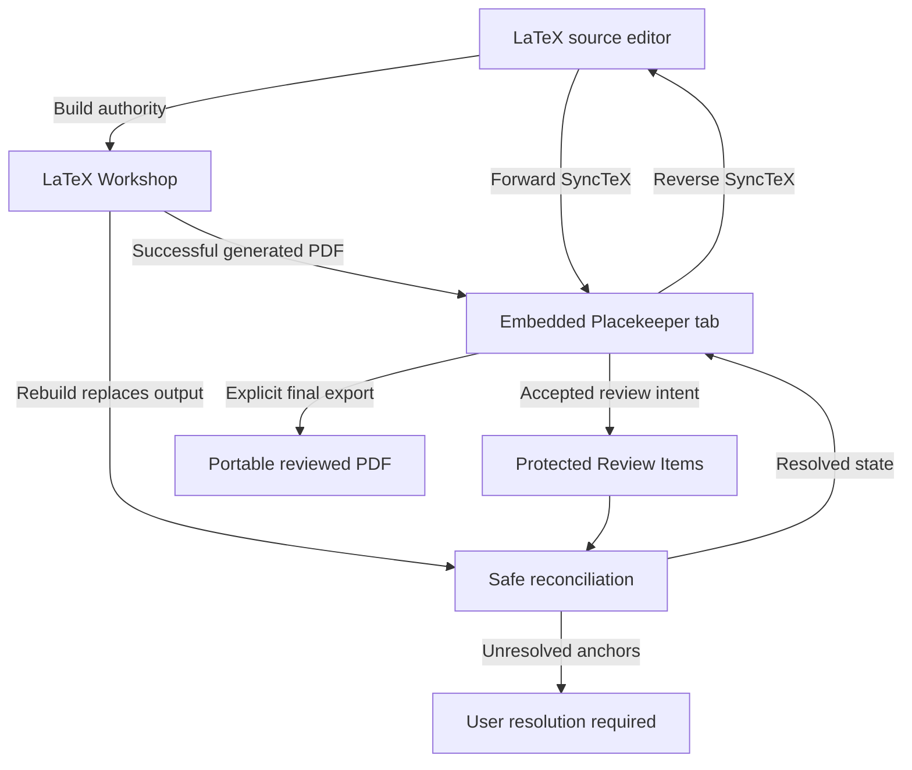
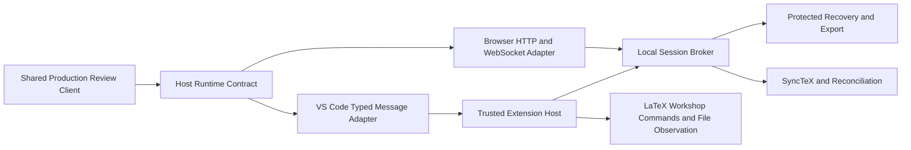
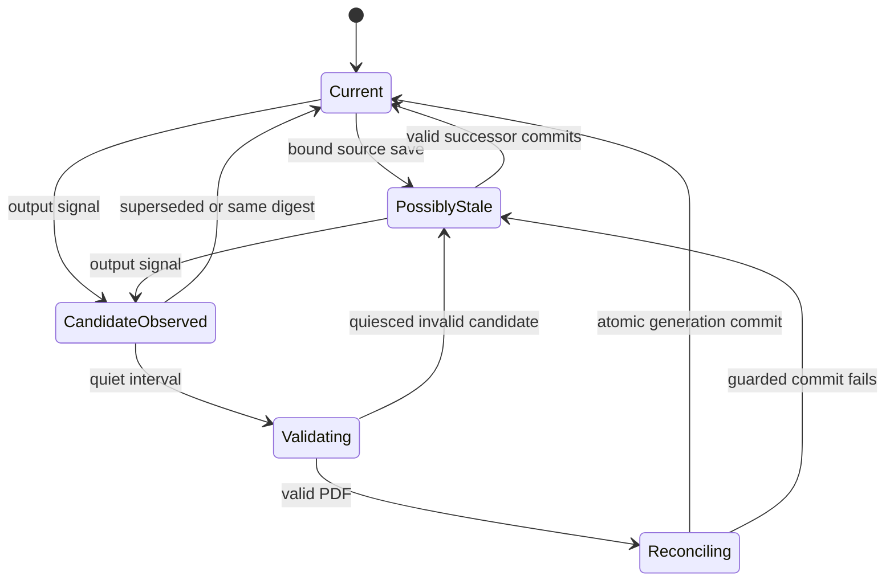
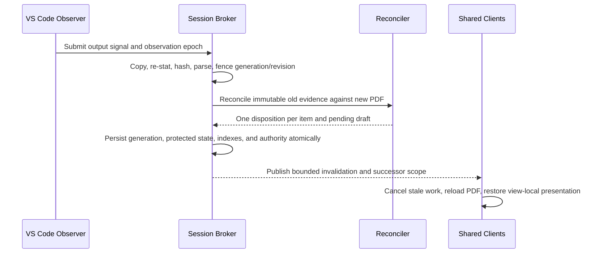

# Fully Embedded VS Code LaTeX Review - Plan

## Goal Capsule

- **Objective:** Let a LaTeX author review a compiled PDF with the full Placekeeper experience inside VS Code, move reliably between source and output, and keep feedback correct across rebuilds.
- **Means:** Run one host-neutral Placekeeper review client through a typed VS Code host adapter and commit rebuilds as atomic document-generation transitions while LaTeX Workshop remains the interactive build authority. (KTD1, KTD3)
- **Product authority:** This contract owns the embedded VS Code review surface, LaTeX Workshop companion behavior, source-PDF navigation, rebuild continuity, Review Item reconciliation, and final reviewed-PDF export behavior.
- **Open blockers:** No product decision blocks execution. Ordinary LaTeX Workshop routing is an opt-in compatibility path with a mandatory fallback because the extension exposes no supported custom-viewer API.
- **Execution profile:** Deep, security-sensitive, cross-surface code change. Implement in U-ID dependency order and prove each protocol boundary before adding host orchestration.
- **Tail ownership:** The implementing run owns packaging, installed-host evidence, documentation updates, and removal of superseded iframe code.

---

## Product Contract

### Summary

Provide a fully embedded Placekeeper review surface that can serve as the primary LaTeX Workshop PDF viewer without creating a second Placekeeper product.
The source and PDF form one bidirectional working loop, while successful rebuilds refresh in place and preserve review intent safely.

### Problem Frame

The current VS Code adapter opens a loopback review page inside a sandboxed iframe.
Current VS Code and Electron local-network restrictions block that nested page even though the Placekeeper service and exact review URL work in an ordinary browser.
Opening the review externally restores the PDF but breaks the source-centered workflow the extension is meant to support.

LaTeX Workshop already gives authors a fast edit, build, forward-SyncTeX, and reverse-SyncTeX loop inside VS Code.
Its PDF viewer does not provide Placekeeper's review model, annotations, reference workspace, search, saving, or Codex context.
Placekeeper also treats opened PDF bytes as stable review authority today, while LaTeX output is routinely replaced by recompilation.

### Actors

- A1. **LaTeX author and reviewer:** Edits source, builds the project, navigates between source and output, records Review Items, and exports the reviewed PDF.
- A2. **LaTeX Workshop:** Owns project discovery, recipes, builds, output selection, and its ordinary view and forward-SyncTeX actions.
- A3. **Placekeeper:** Owns the embedded review experience, canonical Review Items, protected recovery, source-PDF navigation inside its surface, rebuild reconciliation, and reviewed-PDF export.

### Key Decisions

- **Keep the review inside VS Code.** (session-settled: user-directed — chosen over an external-browser launch: remaining inside the source editor is the core value.) Governs R1, R4.
- **Deliver the complete source-PDF loop.** (session-settled: user-approved — chosen over navigation-only or refresh-only variants: forward navigation, reverse navigation, and rebuild continuity are one workflow.) Governs R7-R18.
- **Keep LaTeX Workshop as build authority.** (session-settled: user-approved — chosen over Placekeeper-owned builds or dual build systems: authors should retain their existing project configuration.) Governs R6, R13, R18.
- **Preserve full parity through one host-neutral client.** (session-settled: user-approved — chosen over an extension relay, a reduced subset, or a VS Code-specific rewrite: review behavior must not fork by host.) Governs R2, R3.
- **Open beside source once, then respect placement.** (session-settled: user-directed — chosen after comparing persistent split and user-managed tabs: first use should be helpful without repeatedly rearranging the workspace.) Governs R5, R11.
- **Keep generated output clean during editing.** (session-settled: user-directed — chosen over rewriting the build output or continuously maintaining a reviewed copy: portable annotations are needed only on explicit final export.) Governs R19-R22.
- **Reconcile before exporting.** (session-settled: user-approved — chosen over dropping or exporting uncertain items: feedback must never silently land on the wrong passage.) Governs R16, R17, R21, R22.
- **Prefer LaTeX Workshop routing with a resilient fallback.** (session-settled: user-approved — chosen over strict dependence on an unsupported custom-viewer hook or Placekeeper-only commands: the ordinary path should feel native without becoming brittle.) Governs R7, R8.

### Requirements

**Embedded review and parity**

- R1. The core LaTeX review workflow shall run inside a local VS Code desktop window without opening an external browser.
- R2. The embedded surface shall retain the browser product's reading, Review Item authoring, annotation, search, reference, recovery, Codex-context, and export capabilities, with source-linked durability governed by R19-R22.
- R3. Browser and VS Code surfaces shall share one production review client and one review-state model, with host-specific behavior confined to trusted host adaptation.
- R4. The embedded workflow shall preserve Placekeeper's desktop-local privacy boundary and shall reject remote, web, and virtual-workspace execution.
- R5. One source-linked Placekeeper tab shall be reused per compiled PDF, while tabs for different projects or outputs remain independent.

**LaTeX Workshop companion and navigation**

- R6. LaTeX Workshop shall remain responsible for project discovery, recipes, build triggers, diagnostics, output selection, and file watching.
- R7. After explicit opt-in, LaTeX Workshop's ordinary View PDF and forward-SyncTeX actions shall target the matching Placekeeper tab when its external-viewer compatibility path passes the installed-host probe.
- R8. Placekeeper shall provide first-class view and forward-SyncTeX commands that remain usable when the LaTeX Workshop routing bridge is unavailable.
- R9. Forward SyncTeX shall navigate from the active source cursor to the corresponding PDF location in the matching Placekeeper tab.
- R10. Reverse SyncTeX shall navigate from a PDF location to source through both a modifier-click gesture and a discoverable Go to Source action.
- R11. First use shall open Placekeeper beside the active source, while later navigation shall preserve the user's chosen editor groups and only reveal or focus the target.
- R12. Missing, stale, ambiguous, or unsafe SyncTeX data shall disable only the affected source-navigation action and shall leave ordinary PDF review available with an explanatory state.

**Rebuild continuity and reconciliation**

- R13. A successful LaTeX Workshop rebuild that replaces the matching output shall refresh the existing Placekeeper tab automatically.
- R14. A rebuild refresh shall preserve editor layout, focus, zoom, and the current reading location when that location remains identifiable.
- R15. When the prior reading location cannot be identified, Placekeeper shall remain usable and shall report that the position could not be restored.
- R16. Review Items with confidently matching anchors shall carry forward to the rebuilt PDF without changing their intended meaning.
- R17. Review Items with missing or ambiguous anchors shall remain visible as unresolved and shall never be silently retargeted.
- R18. A known unsuccessful build attempt, an invalid quiesced candidate, or a bound source edit without a valid successor shall retain the last successful PDF and Review Items while marking the output as possibly stale.

**Review durability and export**

- R19. The generated LaTeX PDF shall remain unmodified throughout the live edit and rebuild loop.
- R20. Accepted Review Items and in-progress review state shall remain protected independently of any replaceable generated PDF.
- R21. Reviewed-PDF export shall require every unresolved Review Item to be reattached or explicitly discarded.
- R22. Explicit export shall project the current resolved Review Items onto the latest successfully reconciled PDF and shall not change the generated source artifact.

**Security and trust**

- R23. The embedded host adapter shall preserve scoped session authority without exposing capability material to document content, logs, or ordinary workspace state.
- R24. PDF content, source content, SyncTeX output, build output, and review text shall remain untrusted data throughout navigation, reconciliation, and export.

### Source-PDF Loop

The generated PDF is replaceable input to the review loop, while Review Items remain the durable authority for reviewer intent.
Navigation and rebuild reconciliation connect those authorities without giving the build output ownership of review state.

### Key Flows

- F1. Start or reuse a source-linked review
  - **Trigger:** A1 invokes the Placekeeper view command or, after explicit compatibility setup, LaTeX Workshop's ordinary PDF view action.
  - **Actors:** A1, A2, A3
  - **Steps:** Resolve the active project's output; focus its existing Placekeeper tab or open it beside source on first use; load the full review surface.
  - **Outcome:** One embedded tab owns the live review for that output without disturbing established editor placement.
  - **Covers R1-R8, R11.**
- F2. Navigate from source to PDF
  - **Trigger:** A1 invokes forward SyncTeX from a source cursor.
  - **Actors:** A1, A2, A3
  - **Steps:** Route through the primary LaTeX Workshop bridge or fallback command; validate the mapping; reveal the matching PDF location without rearranging editor groups.
  - **Outcome:** The PDF target is visible and focused, or the unavailable mapping is explained without closing the review.
  - **Covers R7-R9, R11, R12, R24.**
- F3. Navigate from PDF to source
  - **Trigger:** A1 modifier-clicks a PDF location or invokes Go to Source.
  - **Actors:** A1, A3
  - **Steps:** Resolve a safe reverse mapping; reveal the source file and line; preserve the user's editor layout.
  - **Outcome:** Source is focused at the mapped location, or the navigation is declined with an explanatory state.
  - **Covers R10-R12, R24.**
- F4. Refresh after a successful rebuild
  - **Trigger:** LaTeX Workshop successfully replaces the matching generated PDF.
  - **Actors:** A1, A2, A3
  - **Steps:** Refresh the existing tab; restore presentation state where valid; reconcile each Review Item against the new document; expose uncertain items for resolution.
  - **Outcome:** The author sees the latest build without losing reading context or review intent.
  - **Covers R13-R17, R19, R20, R24.**
- F5. Continue after a failed or incomplete rebuild
  - **Trigger:** A known build attempt fails, a candidate becomes quiescent but invalid, a bound source changes without a successor, or required SyncTeX data is unavailable.
  - **Actors:** A1, A2, A3
  - **Steps:** Retain the last successful PDF; mark stale output or unavailable navigation; keep review actions that remain safe enabled.
  - **Outcome:** Build trouble is visible but does not discard or misrepresent review state.
  - **Covers R12, R18, R20.**
- F6. Export the reviewed PDF
  - **Trigger:** A1 explicitly requests a portable reviewed PDF.
  - **Actors:** A1, A3
  - **Steps:** Freeze the last successful reconciled generation and review revision; require resolution or audited discard of every uncertain item or draft; require stale-generation confirmation when applicable; project the resolved set into a distinct export.
  - **Outcome:** The exported PDF contains current review feedback, while the LaTeX-generated PDF remains untouched.
  - **Covers R19-R22.**

### Acceptance Examples

- AE1. Primary viewer reuse
  - **Covers R1, R5, R7, R11.**
  - **Given:** A LaTeX project has a generated PDF, no Placekeeper tab for that output, and its author explicitly enabled the LaTeX Workshop compatibility setup.
  - **When:** A1 invokes LaTeX Workshop's ordinary View PDF action.
  - **Then:** Placekeeper opens beside the active source; repeating the action focuses the same tab without rearranging the workspace.
- AE2. Fallback viewer routing
  - **Covers R7, R8.**
  - **Given:** The installed LaTeX Workshop version cannot route its viewer action to Placekeeper.
  - **When:** A1 invokes the Placekeeper view or forward-SyncTeX command.
  - **Then:** The same embedded review and navigation workflow remains available with an explanation of the bridge limitation.
- AE3. Bidirectional navigation
  - **Covers R9-R12.**
  - **Given:** The PDF and SyncTeX sidecar match the current source root.
  - **When:** A1 invokes forward SyncTeX, then modifier-clicks or chooses Go to Source at the rendered target.
  - **Then:** Placekeeper navigates to the PDF target and back to the corresponding source without changing editor-group placement.
- AE4. Successful rebuild with mixed reconciliation
  - **Covers R13-R17, R20.**
  - **Given:** A1 has Review Items and a visible reading location before a source edit changes pagination.
  - **When:** LaTeX Workshop produces a valid new PDF in the same output relationship.
  - **Then:** The existing tab refreshes in place; confidently matched items follow their anchors; uncertain items remain unresolved; no item silently moves.
- AE5. Failed build continuity
  - **Covers R18, R20.**
  - **Given:** The tab contains the last successful build and accepted Review Items.
  - **When:** A known attempt fails, the replacement becomes quiescent but invalid, or a bound source change has no valid successor.
  - **Then:** The prior PDF remains reviewable, a possibly-stale state is visible, and the Review Items remain protected.
- AE6. Missing SyncTeX degradation
  - **Covers R12.**
  - **Given:** A valid generated PDF has no usable SyncTeX data.
  - **When:** A1 opens the output in Placekeeper.
  - **Then:** Reading, review authoring, search, references, recovery, and export remain available while source-navigation actions explain why they cannot run.
- AE7. Export safety
  - **Covers R19-R22.**
  - **Given:** A rebuild leaves one unresolved Review Item.
  - **When:** A1 requests export.
  - **Then:** Export remains blocked until the item is reattached or explicitly discarded; the eventual reviewed PDF is distinct from the generated PDF.
- AE8. Independent projects
  - **Covers R5.**
  - **Given:** Two local LaTeX projects have different generated PDFs open in the same VS Code window.
  - **When:** A1 invokes view or SyncTeX from either project.
  - **Then:** The action targets that project's existing Placekeeper tab without replacing or retargeting the other review.

### Success Criteria

- An installed-host exercise completes two edit-build-refresh cycles plus forward and reverse SyncTeX without opening an external browser or losing the selected editor layout.
- Full browser-surface Placekeeper workflows remain available in the VS Code tab at wide and narrow editor widths.
- Rebuilds preserve every confidently mapped Review Item and visibly isolate every uncertain item; no acceptance test permits silent retargeting.
- Known failed attempts, possibly stale output, and missing SyncTeX retain all safe review capabilities and show their distinct degraded states.
- The generated PDF remains byte-for-byte outside Placekeeper's write path until the user explicitly exports a distinct reviewed PDF.
- The Placekeeper-command fallback completes view and forward navigation when the primary LaTeX Workshop routing bridge is unavailable.

### Scope Boundaries

- Placekeeper does not own LaTeX recipes, build triggers, diagnostics, general project-output discovery, or recursive project watching; it maintains only an explicit or conservatively confirmed source-output binding.
- The feature does not add remote, web, container, Codespaces, or virtual-workspace support to the local-only VS Code extension.
- The feature does not create a reduced Placekeeper subset or a separately maintained VS Code review product.
- The live loop does not annotate the generated PDF, continuously maintain a reviewed copy, or export unresolved feedback at stale coordinates.
- The work does not require changes to LaTeX Workshop itself; its unsupported external-viewer mode may be configured only through an explicit reversible compatibility action, and the fallback is part of the product contract.
- Browser and Codex review surfaces remain supported and share the same review behavior; host-neutral adaptation must not regress them.

### Dependencies and Assumptions

- LaTeX Workshop is installed and configured to produce a local PDF for the primary companion workflow.
- Bidirectional source navigation depends on usable SyncTeX data that resolves within the approved local source root.
- LaTeX Workshop currently documents browser, tab, and experimental external viewer modes rather than a supported custom embedded-viewer slot.
- Placekeeper's local broker remains the authority for scoped sessions, canonical Review Items, protected recovery, and export.
- The shared review client can be separated from browser-only transport assumptions without changing its product behavior.

### Outstanding Questions

There are no unresolved product questions that block planning.

The Planning Contract resolves the host transport in KTD1-KTD2, rebuild and reconciliation in KTD3-KTD4, navigation in KTD6, compatibility routing in KTD7, and view behavior in KTD9.

### Sources and Research

- `docs/plans/2026-08-06-001-feat-local-placekeeper-plan.md` — original shared-client, local-service, VS Code, immutable-source, and SyncTeX product contracts.
- `apps/vscode/src/extension.ts`, `apps/vscode/src/review-panel.ts`, and `apps/vscode/src/launch-client.ts` — current loopback iframe adapter and scoped launch behavior.
- `apps/vscode/src/local-workspace.ts` and `apps/vscode/package.json` — current local-only host and PDF-only command boundary.
- `apps/service/src/synctex/query.ts` — current contained, advisory SyncTeX source-hint capability.
- `apps/service/src/sessions/session-broker.ts` and `apps/service/src/recovery/draft-snapshot.ts` — canonical Review Items and protected recovery independent of the generated PDF.
- `apps/service/src/context/live-source-workflow-service.ts` — existing guarded clean-rebuild and source reconciliation contracts.
- [LaTeX Workshop viewer documentation](https://github.com/James-Yu/LaTeX-Workshop/wiki/View) — current forward and reverse SyncTeX behavior, automatic viewer refresh, and viewer-integration boundaries.

---

## Planning Contract

The Product Contract is unchanged. The decisions below define how to implement it without weakening browser behavior, protected recovery, or Codex task authority.

### Key Technical Decisions

- KTD1. **Use a complete typed host-runtime contract.** (session-settled: user-approved — chosen over a generic extension relay or a VS Code-specific UI: one shared client must retain full product parity.) The browser adapter keeps HTTP/WebSocket transport. The VS Code webview uses allowlisted, schema-validated `postMessage` RPC to the extension host. The extension host exchanges the one-use launch capability, retains the scoped credential, and acts as an authenticated client of the service's existing allowlisted HTTP/WebSocket domain routes for commands, document streaming, invalidations, cancellation, and reconnect. It never exposes an arbitrary URL, filesystem path, command, or proxy primitive to the webview. Governs R1-R4, R23, R24.
- KTD2. **Bundle the shared production client once for both hosts.** (session-settled: user-approved — chosen over separate browser and VS Code clients: behavior and review-state semantics must not fork.) VS Code loads JavaScript, CSS, PDFium WASM, and a single-file worker through `asWebviewUri` under a restrictive CSP. Each broker-validated PDF generation is copied without following links to a digest-named mode-0600 file in one random mode-0700 session snapshot directory under `globalStorageUri`; that panel exposes only its exact session directory and packaged assets through `localResourceRoots`. Browser URLs retain same-origin validation. The VS Code runtime accepts only resource URLs that the trusted host issued. The browser service continues to serve the same build manifest. Governs R1-R3, R19, R23.
- KTD3. **Model each successful rebuild as an atomic document-generation transition.** (session-settled: user-approved — chosen over reopening the changed PDF: reopening would fork digest-keyed sessions and lose continuity.) A generation record owns an immutable PDF snapshot, optional generation-matched SyncTeX snapshot, source-root identity, digest, byte length, output identity, and commit time. Candidate validation requires a monotonic observation epoch, stable before/after file identity, a private copy, digest, and structural PDF inspection. The broker persists protected state and advances every lineage index in one commit. Same-digest, invalid, partial, and superseded candidates retain the last successful generation. Governs R13-R20, R23, R24.
- KTD4. **Store accepted items and pending authoring as canonical reconciliation state.** (session-settled: user-approved — chosen over UI-only relocation: unresolved feedback and in-progress work must survive recovery and block export.) Preserve semantic payload and stable identity. Bind accepted items and pending drafts to owner view, base generation, revisioned text, compound anchor evidence, and one exhaustive disposition: resolved, ambiguous, missing, or unsupported anchor. A unique quote/context match may resolve; geometry only corroborates. Reattach and audited discard are revisioned commands. Governs R14-R17, R20-R22, R24.
- KTD5. **Give generated LaTeX outputs an immutable export-only durability mode.** (session-settled: user-directed — chosen over autosaving annotations into the build output: generated PDFs must remain clean during editing.) Every surface that joins the session inherits the mode. Accepted items and acknowledged drafts become protected before acknowledgement. Replace Original and continuous PDF autosave are unavailable. Explicit export freezes generation, review revision, and disposition digest. A possibly stale last-successful generation requires confirmation. Governs R2, R19-R22.
- KTD6. **Use generation-private Placekeeper SyncTeX queries for embedded navigation.** LaTeX Workshop exposes no public output, completion, custom-viewer, or reverse-coordinate API. Placekeeper performs bounded `synctex view` and `synctex edit` queries against a generation-private sibling PDF/sidecar pair, validates realpath containment, and fences every result by output, sidecar, generation, and operation identity. Missing, pending, stale, ambiguous, out-of-root, unavailable-tool, and timeout states degrade independently. Governs R6-R12, R24.
- KTD7. **Offer LaTeX Workshop routing as an explicit reversible compatibility setup.** (session-settled: user-approved — chosen over hard dependence on an unsupported custom-viewer hook or Placekeeper-only commands: the ordinary path should feel native without becoming brittle.) LaTeX Workshop 10.18 exposes no public extension API, so the only current ordinary-command route is its unsupported external-viewer configuration. A user-triggered setup action previews workspace-scoped changes, records prior values, installs a real launcher with `%PDF%` and best-effort `%LINE%`/`%TEX%` arguments, and restores only unchanged Placekeeper-owned values. The launcher uses a scoped broker registration rather than topmost-window URI routing. Placekeeper commands remain the supported baseline. Governs R6-R8, R13, R18.
- KTD8. **Preserve only exact task authority across a verified same-output rebuild.** A broker-owned transition may migrate the already bound Codex lease to the successor generation while invalidating observation cursors, evidence handles, source hints, and source-work baselines. An in-flight source execution receives a durable interrupted-by-generation disposition and must establish a fresh baseline. Output identity changes, session forks, expired leases, and failed validation revoke the binding. VS Code credentials cannot acquire or transfer Codex authority. Governs R2, R4, R13-R18, R23, R24.
- KTD9. **Keep presentation state view-local and semantic state session-canonical.** A panel stores only an opaque panel key and small non-secret presentation state. The broker owns output binding, Review Items, pending drafts, generation status, reconciliation, export eligibility, and recovery. A `WebviewPanelSerializer` restores placement, then performs a fresh ready/resubscribe handshake before applying page or zoom state. Panel close detaches observation but preserves protected state. Governs R2-R5, R11, R14-R18, R20, R23.

### Assumptions

- The plan covers the full brainstorm scope; no accepted workflow is deferred to a later implementation phase.
- VS Code 1.95 remains the Placekeeper-only floor. Current LaTeX Workshop 10.18.x integration is tested on its VS Code 1.114+ floor and on the current VS Code 1.135 host.
- A canonical physical output path is the stable session-lineage, panel, and source-output identity independent of digest. A changed output path opens an independent tab rather than retargeting an existing review.
- A source-output binding comes from an explicitly opened PDF, one unambiguous conservative candidate, or a user chooser. Placekeeper does not reproduce LaTeX Workshop root or recipe logic.
- A valid new PDF may commit before a matching SyncTeX sidecar arrives. Review refreshes immediately, while source navigation stays unavailable until the sidecar matches that generation.
- Rapid create, change, delete, and rename signals are coalesced by observation epoch. Only the newest quiescent private snapshot can commit.
- An in-progress annotation draft survives rebuild as frozen old-generation text and intent. It must be reattached or discarded before Apply.
- A bound source save marks the last-successful generation possibly stale until a valid successor commits. Absence of a PDF event alone never claims that a build failed.
- A possibly stale generation remains exportable only through explicit confirmation. Export remains blocked during validation, reconciliation, unresolved-item resolution, pending authoring, or a generation/revision race.
- Generation snapshots count against the existing recovery-retention byte budget. Active referenced generations are never evicted; a successor that would exceed the configured budget is rejected safely and leaves the current generation possibly stale until the user releases references or cleans up the session.
- Adjacent EmbedPDF upgrades, remote workspaces, LaTeX recipe ownership, and changes to LaTeX Workshop itself remain out of scope.

### Implementation Constraints

- Do not mutate LaTeX Workshop settings on activation. Use its unsupported external-viewer hook only after the explicit reversible setup in KTD7.
- Do not depend on private LaTeX Workshop APIs or internal build events.
- Do not register duplicate LaTeX Workshop command IDs, intercept its commands, silently rewrite keybindings, or use system-wide URI routing as the primary multi-window bridge.
- Do not persist bearer credentials, bootstrap capabilities, PDF bytes, canonical Review Items, or pending draft content in webview or workspace state.
- Do not expose a generic HTTP bridge, arbitrary command execution, or arbitrary file access across the webview boundary.
- Restrict `localResourceRoots` to packaged assets and private extension snapshot directories. Never expose the workspace or generated-output directory.
- Bundle webview workers as single files. VS Code webviews permit worker bootstrap only from `blob:` or `data:` URLs.
- Keep `fontFallback: null` for EmbedPDF 2.14.4 so the embedded viewer never attempts an external CDN fallback.
- Preserve the current clean-rebuild boundary: LaTeX Workshop owns interactive builds, while user-requested Codex clean rebuilds remain separate, permission-visible operations.
- Keep Review Item authoring, reattachment, audited discard, and reviewed-PDF export human-only in this plan. Agent mutation requires a separately designed approval and audit contract.
- Respect VS Code Workspace Trust. In an untrusted workspace, do not change LaTeX Workshop settings, launch source navigation, or execute SyncTeX; keep safe PDF review available with an explanatory state.

### High-Level Technical Design

#### Host topology

#### Rebuild state machine

#### Atomic generation transition

### Sequencing

1. Establish canonical live-session durability and reconciliation state before changing transport or UI.
2. Add broker-owned replacement and bidirectional SyncTeX services before host observation can submit rebuilds.
3. Extract the shared host runtime and prove transport conformance before loading it directly in a VS Code webview.
4. Add panel lifecycle, LaTeX companion commands, and rebuild observation after the trusted bridge exists.
5. Complete reconciliation UX, cross-surface/Codex continuity, packaging, and installed-host verification before removing the iframe path.

### System-Wide Impact

- **Review lifecycle:** A stable output-path lineage advances across immutable PDF and SyncTeX generations without losing canonical Review Items or protected pending drafts.
- **Save semantics:** Generated-output sessions separate protected review durability from portable PDF export.
- **Authority:** Session, document-generation, review-revision, panel-instance, and request identities fence every cross-process mutation.
- **Agent parity:** Live PDF Context gains build, generation, reconciliation, unresolved, and export-eligibility state without making prompt refresh mutating.
- **Packaging:** The extension distribution gains the shared client, CSS, PDFium WASM, and worker assets from the same production build manifest as the service.

### Risks and Mitigations

- **LaTeX Workshop compatibility drift:** Keep explicit setup reversible and non-authoritative. Test missing, working, and broken external-viewer configurations while retaining Placekeeper commands.
- **Partially written outputs:** Treat file events and stat stability as hints. Commit only a private snapshot that survives before/after identity checks, digesting, and structural inspection.
- **Anchor misattachment:** Require unique text/context evidence. Keep ambiguous and missing anchors unresolved. Block export until disposition.
- **Cross-surface races:** Fence mutations by generation and revision. Replay the current snapshot after conflicts or reconnects.
- **Webview memory and lifecycle:** Prefer `getState`/`setState` plus rebootstrap over `retainContextWhenHidden`. Test hide/show and reload explicitly.
- **PDFium webview startup:** Package WASM locally and validate `worker-src blob:`, `script-src 'wasm-unsafe-eval'`, and blob image rendering on a real VS Code host.

---

## Implementation Units

### U1. Add canonical generated-output review state

**Goal:** Define durable accepted and pending review state for live LaTeX generations, unresolved anchors, and export-only saving.

**Requirements:** R2, R16-R24; KTD4, KTD5, KTD9.

**Dependencies:** None.

**Files:**

- `packages/core/src/review-model.ts`
- `packages/core/src/structured-review-item.ts`
- `packages/core/src/annotation-projection.ts`
- `packages/core/src/live-context.ts`
- `apps/service/src/recovery/draft-snapshot.ts`
- `apps/service/src/saving/pdf-save-coordinator.ts`
- `apps/service/src/export/export-coordinator.ts`
- `apps/service/src/host/placekeeper-host.ts`
- `apps/service/src/server/http-server.ts`
- `apps/web/src/app/session-api.ts`
- `packages/core/test/review-commands.test.ts`
- `packages/core/test/portable-annotation.test.ts`
- `packages/core/test/live-context.test.ts`
- `apps/service/test/recovery.test.ts`
- `apps/service/test/pdf-save-coordinator.test.ts`
- `apps/service/test/export-transaction.test.ts`

**Approach:**

1. Add versioned generation-bound reconciliation metadata outside kind-specific payloads while preserving stable item IDs and portable migration.
2. Move pending authoring into revisioned canonical state with owner view, base generation, text, compound anchor evidence, and protected persistence before acknowledgement.
3. Add revisioned reattach and audited-discard commands, exhaustive reconciliation reasons, a rebuild history boundary, and complete-state digest coverage.
4. Introduce an immutable generated-output workflow mode with protected-draft status distinct from reviewed-export status.
5. Reject Replace Original, autosave projection, and export when KTD5 makes the operation unsafe. Reject every canonical or symlink alias of the generated output as an export destination.
6. Extend prompt-safe live context and paginated context data with document role, freshness, reconciliation metadata, unresolved identities, and export eligibility.

**Patterns to follow:** `ReviewState` validation and reducer commands; `draft-snapshot.ts` atomic/checksummed recovery; `export-coordinator.ts` frozen delivery fences.

**Test scenarios:**

- A generated-output session accepts a Review Item only after protected recovery succeeds and leaves source PDF bytes unchanged.
- An unresolved item survives serialization, recovery, and portable-state migration with its stable ID and prior anchor evidence.
- A pending draft update is acknowledged only after protected recovery, survives owner disconnect, and freezes against its old generation during replacement.
- Concurrent view updates to one draft conflict by draft revision; Apply racing a generation commit either lands before the fence or remains frozen.
- Reattach replaces generation-bound anchor evidence without changing semantic payload; audited discard is revisioned and undoable within the current generation.
- Undo cannot resurrect predecessor-generation geometry across the rebuild history boundary.
- Export fails while reconciliation is incomplete or when an unresolved item, pending draft, generation race, or revision race exists. A completed reconciled generation remains exportable under KTD5.
- Two generations with the same review revision cannot reuse one export result; the delivery key and final fence include generation and semantic disposition digest.
- Browser, VS Code, and Codex session joins cannot downgrade generated-output mode or enable Replace Original.

**Verification:** Core validators, recovery, save, export, and live-context tests prove the new state is canonical, migratable, and fail-closed.

### U2. Implement atomic live document replacement and reconciliation

**Goal:** Advance an existing review session to a validated rebuilt PDF without reopening or forking it.

**Requirements:** R13-R22, R23, R24; KTD3, KTD4, KTD8.

**Dependencies:** U1.

**Files:**

- `apps/service/src/sessions/session-broker.ts`
- `apps/service/src/files/file-capabilities.ts`
- `apps/service/src/recovery/source-snapshot.ts`
- `apps/service/src/recovery/draft-snapshot.ts`
- `apps/service/src/recovery/retention.ts`
- `apps/service/src/reconciliation/pdf-anchor-reconciler.ts`
- `apps/service/src/context/task-binding-registry.ts`
- `apps/service/src/context/live-context-service.ts`
- `apps/service/src/context/live-source-workflow-service.ts`
- `apps/service/src/context/restart-reconnect-store.ts`
- `apps/service/src/sessions/control-socket.ts`
- `apps/service/test/live-document-replacement.test.ts`
- `apps/service/test/session-security.test.ts`
- `apps/service/test/recovery.test.ts`
- `apps/service/test/codex-live-context.integration.test.ts`
- `apps/service/test/live-source-workflow.test.ts`

**Approach:**

1. Add a broker-owned candidate protocol that copies into a generation-private sibling layout, verifies before/after source identity, hashes and parses the snapshot, and fences the old generation, digest, review revision, and observation epoch.
2. Reconcile every accepted item and pending draft to exactly one KTD4 disposition. Regenerate resolved geometry and retain predecessor evidence for unresolved work.
3. Commit the generation record, source capability, stable output-path lineage indexes, recovery snapshot, pending drafts, reconciliation results, existing annotations, readable-view successor scopes, and task authority as one observable transition.
4. Broadcast a bounded invalidation after commit. Each authenticated view rehydrates through a successor handshake; in-flight commands commit before the fence or receive a typed generation conflict without automatic replay.
5. Abort superseded work and retain the last successful snapshot on invalid, partial, same-digest, or quiesced failed candidates. Retain predecessor snapshots while unresolved items or drafts reference them, account every generation against recovery retention, and reject a successor before quota exhaustion rather than evicting referenced evidence.
6. Migrate only an exact active Codex lease. Persist an interrupted-by-generation source-work disposition, invalidate old handles and baselines, and require a fresh baseline.

**Execution note:** Start with failing broker integration tests that show ordinary digest-keyed reopen is not an acceptable rebuild path.

**Patterns to follow:** Manual-precedence three-way reconciliation; immutable source snapshots; operation-identity and document-generation guards; exhaustive disposition checks.

**Test scenarios:**

- Covers AE4. A mixed rebuild preserves confidently matched item IDs and marks ambiguous or missing anchors unresolved.
- Covers AE5. A truncated or quiesced invalid candidate leaves the prior PDF, Review Items, and pending drafts active and marks the output possibly stale.
- Candidate copy validates stable before/after identity, rejects same digest, and survives crash points before and after the atomic recovery rename as wholly old or wholly new.
- Two rapid candidates commit only the newest stable digest; late reconciliation from the older candidate cannot publish.
- A Review Item command racing the transition is either included before the fence or rejected and retried against the new snapshot.
- A same-output rebuild keeps the exact bound Codex task but invalidates old evidence handles; a different output or task cannot inherit authority.
- A fresh browser, Codex launch, or restored panel for the rebuilt path joins the existing lineage instead of forking by digest.
- Concurrent browser and VS Code views receive successor authority or rehydrate after a missed event; the predecessor cannot mutate after the fence.
- Repeated large rebuilds stay within configured byte/count limits. A referenced predecessor is never silently evicted, and an over-budget successor leaves the current generation active through restart.
- A manual source edit and concurrent Codex source workflow end with a durable interrupted or partial disposition, force baseline refresh, and preserve every guarded apply.

**Verification:** One broker snapshot after commit contains matching PDF identity, generation, Review Items, recovery state, SyncTeX status, and task-binding scope; no observer can read a mixed generation.

### U3. Add generation-bound bidirectional SyncTeX services

**Goal:** Resolve source-to-PDF and PDF-to-source navigation safely for the current PDF generation.

**Requirements:** R7-R12, R24; KTD6.

**Dependencies:** U2.

**Files:**

- `apps/service/src/synctex/parser.ts`
- `apps/service/src/synctex/query.ts`
- `apps/service/src/source-scope.ts`
- `apps/service/src/sessions/session-broker.ts`
- `apps/service/src/recovery/source-snapshot.ts`
- `apps/service/test/synctex.test.ts`
- `test/fixtures/latex/paper.tex`
- `test/fixtures/latex/paper.synctex.sample`

**Approach:**

1. Add bounded forward `synctex view` parsing and querying beside the existing reverse `synctex edit` path.
2. Snapshot the PDF and changed stable sidecar into one generation-private sibling layout while the PDF digest remains current. Never query the mutable build output directly.
3. Bind requests and results to output identity, PDF generation/digest, sidecar fingerprint, approved source root, and operation token.
4. Require a unique contained reverse target before opening source. Reject symlink escapes, ambiguity, stale sidecars, oversized output, and late results.
5. Report missing, pending, stale, ambiguous, out-of-root, unavailable-tool, and timeout states separately so a valid PDF can refresh before its matching sidecar arrives.

**Patterns to follow:** Existing bounded subprocess invocation, realpath containment, advisory confidence, and untrusted-output parsing in `apps/service/src/synctex/query.ts`.

**Test scenarios:**

- Covers AE3. A matching source cursor resolves to the expected page coordinates, and a PDF point resolves back to the contained file and line.
- Covers AE6. A missing or stale sidecar disables navigation without affecting review, search, recovery, or export.
- Multiple reverse candidates remain unavailable instead of selecting the first result.
- Symlink escapes, absolute paths outside the approved root, malformed output, timeout, and oversized output fail safely.
- A late result from an older cursor, panel, sidecar, or generation is ignored.
- Sidecar-before-PDF, sidecar-after-PDF, unchanged old sidecar, equal timestamps, compressed replacement, and rapid successors bind only a proven current pair.

**Verification:** Service tests prove both directions, containment, bounded execution, generation fencing, and graceful degradation.

### U4. Extract the host-neutral runtime and direct webview bundle

**Goal:** Run the complete production review client directly in a VS Code webview without localhost or an iframe.

**Requirements:** R1-R4, R23, R24; KTD1, KTD2.

**Dependencies:** U1, U2, U3.

**Files:**

- `apps/web/src/app/session-api.ts`
- `apps/web/src/app/ProductionReviewApp.tsx`
- `apps/web/src/production-entry.tsx`
- `apps/web/src/pdf/embedpdf-viewer.ts`
- `apps/web/src/host/runtime.ts`
- `apps/web/src/host/browser-runtime.ts`
- `apps/web/src/host/vscode-runtime.ts`
- `apps/web/vite.production.config.ts`
- `apps/vscode/src/review-panel.ts`
- `apps/vscode/src/launch-client.ts`
- `apps/vscode/src/webview-bridge.ts`
- `apps/web/test/session-api.test.ts`
- `apps/web/test/production-review-app.test.tsx`
- `apps/vscode/test/extension.test.ts`
- `test/acceptance/launch-surfaces.spec.ts`

**Approach:**

1. Move session bootstrap, commands, presence, scope, document snapshots, assets, cancellation, invalidation events, SyncTeX, and export behind one typed runtime contract.
2. Keep the browser implementation on current authenticated HTTP/WebSocket routes.
3. Add a versioned, schema-validated VS Code RPC with panel, request, session, generation, revision, cancellation, payload bounds, and ready/resubscribe replay. Keep credentials, paths, and generic transport primitives in the extension host, which connects to the daemon through KTD1.
4. Exchange the one-use launch capability in the extension host. Materialize each broker-approved PDF as a digest-named immutable private snapshot and give the viewer only its `asWebviewUri`; retire it after viewer acknowledgement or panel disposal.
5. Build one shared asset manifest for the service and extension. Restrict `localResourceRoots` to the packaged bundle and private snapshot roots.
6. Split viewer resource validation by host runtime. Preserve browser same-origin checks, and accept only extension-issued `asWebviewUri` resources in VS Code.
7. Use a nonce CSP that permits packaged WASM, a fetched single-file blob worker, blob-rendered images, inline React styles, and scoped local fetches while denying localhost and external network.

**Execution note:** Prove adapter conformance and malicious-message rejection before connecting the full React surface.

**Patterns to follow:** Existing `ProductionSessionApi`, service authorization checks, bootstrap credential exchange, and production Vite asset emission.

**Test scenarios:**

- Covers AE1. The production client boots in a direct webview with no iframe, localhost URL, or capability text in HTML.
- Browser and VS Code adapters pass the same transport conformance cases for state, commands, scope, presence, assets, replacement, and export.
- Malformed, replayed, oversized, wrong-panel, wrong-session, and wrong-generation messages are rejected without leaking credentials or paths.
- One panel cannot fetch a known snapshot path from another session. Snapshot directories and files retain private permissions and reject symlink substitution.
- A large PDF and its rebuilt digest-named successor load without JSON transfer, stale cache, source-directory access, or generated-PDF mutation.
- PDFium starts from packaged WASM and a single-file blob worker with no network request; the first page renders under the production CSP.
- Hidden and restored views re-handshake and receive the current canonical snapshot without persisting secrets.

**Verification:** Unit and acceptance tests demonstrate feature-complete adapter parity, CSP-safe PDF rendering, and removal of the nested iframe path.

### U5. Preserve client behavior across document generations

**Goal:** Refresh the current PDF in place, retain valid presentation state, and expose reconciliation without losing in-progress work.

**Requirements:** R2, R13-R18, R20-R22; KTD3-KTD5, KTD9.

**Dependencies:** U1, U2, U4.

**Files:**

- `apps/web/src/app/ProductionReviewApp.tsx`
- `apps/web/src/app/ReviewShell.tsx`
- `apps/web/src/review/navigation-coordinator.ts`
- `apps/web/src/review/main-location-refresh.ts`
- `apps/web/src/save/save-state-controller.ts`
- `apps/web/src/review/ReconciliationWorkspace.tsx`
- `apps/web/test/app-interactions.test.ts`
- `apps/web/test/navigation-coordinator.test.ts`
- `apps/web/test/viewer-navigation.test.ts`
- `apps/web/test/save-state-controller.test.ts`
- `apps/web/test/annotation-projection.test.ts`
- `apps/web/test/production-review-app.test.tsx`

**Approach:**

1. Feed broker invalidation and successor state through the existing document-source invalidation path and make viewer snapshot URLs generation-aware.
2. Route source/PDF jumps, Review Item selection, Back/Forward, and post-rebuild restoration through `NavigationCoordinator`.
3. Restore zoom, layout, and semantic reading location only after the new document is ready; otherwise show an explicit fallback state.
4. Render broker-canonical pending drafts. A predecessor draft stays frozen until the user reattaches or performs an audited discard; no view may retarget it locally.
5. Define one reattachment flow in the Reconciliation Workspace: enter target-selection mode, select replacement text/caret/page evidence in the current PDF, show validation and ambiguity errors, preview regenerated geometry, confirm the revisioned anchor command, or cancel with the item unresolved.
6. Hide unresolved geometry on the successor PDF and show prior quote/context, reason, and Reattach/Discard actions in a dedicated workspace.
7. Add explicit freshness and export-eligibility states without reintroducing the ordinary save-destination gate.

**Patterns to follow:** Existing document-generation cancellation, semantic navigation history, stale selection snapshot rejection, and authoring authority guards.

**Test scenarios:**

- Covers AE4. Refresh keeps zoom, layout, and an identifiable reading location while mixed reconciliation remains visible.
- Covers AE5. Possibly-stale state leaves the prior document fully reviewable.
- An unidentifiable prior location falls back visibly without blocking reading or Review Item work.
- A rebuild during annotation typing preserves the draft text and old anchor evidence but blocks Apply until disposition.
- Reattach supports successful selection, invalid or ambiguous evidence, cancellation, stale-generation conflict, and confirmation without changing the item body or ID.
- Back/Forward and late search, reference, selection, and navigation completions cannot restore old-generation state.
- Export controls explain unresolved, reconciling, stale, and pending-authoring gates accurately.
- An automatic background refresh preserves source focus and panel placement; an explicit View or Forward action reveals the existing panel; reverse navigation focuses source without moving either editor.

**Verification:** React and navigation tests prove complete state invalidation, presentation restoration, draft survival, and fail-closed export UX.

### U6. Add VS Code panel, LaTeX companion, and rebuild orchestration

**Goal:** Provide the source-centered VS Code workflow, panel reuse, fallback commands, and validated output observation.

**Requirements:** R4-R15, R18; KTD6, KTD7, KTD9.

**Dependencies:** U2-U5.

**Files:**

- `apps/vscode/src/extension.ts`
- `apps/vscode/src/vscode.d.ts`
- `apps/vscode/src/local-workspace.ts`
- `apps/vscode/src/review-panel-controller.ts`
- `apps/vscode/src/latex-project.ts`
- `apps/vscode/src/latex-workshop-bridge.ts`
- `apps/vscode/src/external-launch-registration.ts`
- `apps/vscode/src/rebuild-observer.ts`
- `apps/vscode/package.json`
- `apps/vscode/test/extension.test.ts`
- `apps/vscode/test/latex-workshop-bridge.test.ts`
- `apps/vscode/test/rebuild-observer.test.ts`
- `apps/vscode/test/suite/extension-host.test.ts`
- `test/fixtures/latex/README.md`

**Approach:**

1. Key panels by stable canonical output lineage. Open first use with `ViewColumn.Beside`, reveal later use in its user-selected group, and detach observation on close without discarding protected state.
2. Add Placekeeper View PDF, Forward SyncTeX, Go to Source, Reattach, and Export commands with accessible menus and keybindings.
3. Establish source-output binding from an explicit PDF, one unambiguous conservative candidate, or a chooser. Bind sidecars within the approved root; a changed output path opens a new panel.
4. Register a `WebviewPanelSerializer` with an opaque panel key and the `onWebviewPanel:placekeeper.review` activation event. Restore a retry shell for missing output, changed digest, service restart, or unavailable recovery; never silently fork an empty session.
5. Add an explicit Configure LaTeX Workshop action for KTD7. Preview and store prior workspace settings, register a scoped canonical-output launch client with the broker, diagnose multi-window ambiguity, and restore only unchanged Placekeeper-owned values.
6. Watch only the bound PDF and sidecar basename for create, change, and delete events. Source-save events mark freshness possibly stale. Every output signal schedules latest-only broker validation rather than claiming build success.
7. Revalidate the bound output digest when a panel is revealed or activated and on a bounded interval only while its generation is possibly stale. Lost watcher events cannot leave a visible panel indefinitely behind.

**Patterns to follow:** Current local-only workspace classification, shell-free launcher invocation, recovery choice flow, and scoped launch errors.

**Test scenarios:**

- Covers AE1. First view opens beside source; repeated view and SyncTeX reveal the same user-moved panel.
- Covers AE2. Missing or incompatible LaTeX Workshop reports the limitation and leaves Placekeeper view/forward commands fully functional.
- Covers AE8. Two canonical outputs retain independent panels and navigation targets.
- A changed output path creates a new panel instead of retargeting the old session.
- Manual and automatic builds, same-digest writes, new-inode replacement, truncate/append, delete/create, same-size changes, sidecar skew, and rapid rebuilds produce the expected candidate epochs.
- An automatic rebuild never reveals a hidden panel or steals source focus; explicit View and Forward do.
- A cold VS Code start activates for the serialized panel type, restores a moved panel from non-secret identity, and obtains fresh scoped authority before applying saved presentation state.
- Two VS Code windows may host separate panels for one canonical broker session. Missing or duplicate external-launch registrations fail closed.
- Compatibility setup is opt-in and reversible, respects manual setting edits, and leaves supported Placekeeper commands usable when external forward SyncTeX fails.
- An untrusted workspace cannot change compatibility settings, run SyncTeX, or open source; ordinary safe PDF review remains available.
- A dropped watcher event is recovered on panel activation or the possibly-stale revalidation interval without focus theft or duplicate generation commits.

**Verification:** Vitest and a real Extension Development Host prove panel lifecycle, command routing, output observation, and fallback behavior on supported VS Code bands.

### U7. Preserve browser and Codex parity across rebuilds

**Goal:** Keep every surface on one canonical session while preventing VS Code from acquiring Codex task authority.

**Requirements:** R2-R5, R13-R18, R20, R23, R24; KTD1, KTD3, KTD8, KTD9.

**Dependencies:** U2, U4-U6.

**Files:**

- `apps/service/src/context/live-context-service.ts`
- `apps/service/src/context/task-binding-registry.ts`
- `apps/service/src/server/http-server.ts`
- `apps/web/src/app/session-api.ts`
- `apps/service/test/codex-live-context.integration.test.ts`
- `apps/service/test/task-binding-registry.test.ts`
- `apps/web/test/session-api.test.ts`
- `test/acceptance/production-flow.spec.ts`
- `test/acceptance/reloadable-links.spec.ts`

**Approach:**

1. Publish bounded generation/revision invalidations to all browser and VS Code views of the same canonical session, then require ready/resubscribe rehydration.
2. Add generation-conflict rehydration beside the existing review-revision conflict path. Never replay a rejected mutation automatically.
3. Refresh prompt-safe and paginated Live PDF Context atomically with stable item IDs, generation, freshness, reconciliation reasons, unresolved set, and export eligibility.
4. Migrate only the exact active task lease permitted by KTD8. End any in-flight source execution durably and require a fresh baseline. Keep review mutation and export human-only.
5. Update active source indexes and readable-link successor/recovery records so fresh post-rebuild launches join the lineage without carrying browser history mechanics into the webview.

**Patterns to follow:** Task-binding lease checks, process-local capabilities, terminal recovery, prompt-time observation, and session broker optimistic conflict responses.

**Test scenarios:**

- A VS Code rebuild refreshes a concurrent browser view of the same session instead of forking Review Items.
- Concurrent browser and webview commands rehydrate safely after revision or generation conflict.
- The exact bound Codex task observes one complete successor snapshot on its next prompt, while all old handles, cursors, hints, and source-work baselines fail closed.
- A prompt racing the commit receives a complete predecessor or successor state, never mixed data; a fresh Codex reopen joins the same lineage.
- In-flight guarded source work records every applied change in a durable interrupted disposition before old completion is rejected.
- Another task remains denied, and VS Code messages never receive Codex credentials, task metadata, or mutation authority.
- Unchanged prompt refresh performs no rebuild, navigation, reconciliation mutation, discard, reattach, or export.

**Verification:** Integration tests prove one canonical cross-surface session, atomic live context, and no authority widening.

### U8. Package and prove the installed two-way LaTeX workflow

**Goal:** Ship the direct embedded client and demonstrate the complete edit-build-review loop on a real installed host.

**Requirements:** R1-R24 and all Success Criteria; KTD1-KTD9.

**Dependencies:** U1-U7.

**Files:**

- `apps/web/vite.production.config.ts`
- `apps/vscode/package.json`
- `packaging/macos/build-app.ts`
- `packaging/macos/validate-manifest.ts`
- `packaging/macos/backend-runtime-manifest.json`
- `packaging/macos/packaging.test.ts`
- `packaging/macos/smoke-installed.ts`
- `test/acceptance/installed-hosts.md`
- `test/acceptance/launch-surfaces.spec.ts`
- `test/acceptance/production-flow.spec.ts`
- `test/fixtures/latex/paper.tex`
- `test/fixtures/latex/README.md`
- `README.md`

**Approach:**

1. Install the shared client manifest, CSS, PDFium WASM, worker assets, and extension code as one validated distribution.
2. Add manifest checks that reject missing, duplicated, externally hosted, or stale webview assets.
3. Exercise two edit-build-refresh cycles, forward and reverse SyncTeX, panel reuse, possibly-stale continuity, mixed reconciliation, and explicit export on VS Code 1.135 with LaTeX Workshop 10.18.x.
4. Exercise explicit LaTeX Workshop compatibility setup when its unsupported external-viewer route passes. Exercise the supported Placekeeper-only fallback when it fails and on the VS Code 1.95 floor.
5. Remove the iframe implementation and any dead compatibility experiments after installed-host evidence passes.

**Execution note:** Treat real Extension Host and installed-app proof as release gates; browser-only Playwright cannot validate Electron webview CSP or worker behavior.

**Patterns to follow:** Existing macOS manifest validation, installed smoke checks, production-flow acceptance fixtures, and distribution audit.

**Test scenarios:**

- The installed extension renders the first PDF page with packaged WASM and no external browser or network request.
- Covers AE3 and AE4. Two LaTeX edits compile, refresh the same panel, navigate source-to-PDF and PDF-to-source, and preserve mixed Review Item outcomes.
- Covers AE5. A quiesced invalid candidate or bound source save without a successor retains the prior PDF, Review Items, pending drafts, and protected recovery with a visible possibly-stale state.
- Covers AE7. Export remains blocked for unresolved feedback and writes a distinct reviewed PDF after resolution.
- Hide/show and VS Code restart restore view-local presentation, rebind current session state, and persist no capability material.
- Existing browser, WebKit, visual, PDF conformance, security, packaging, and Codex context suites remain green.

**Verification:** Distribution validation and installed-host evidence prove the extension contains every local asset, runs on the supported host matrix, and completes the full bidirectional LaTeX workflow.

---

## Verification Contract

### Required automated gates

- `pnpm typecheck` for shared TypeScript contracts and VS Code stubs.
- `pnpm test:service` for broker, recovery, security, SyncTeX, export, and Codex context behavior.
- `pnpm test:review` for host-neutral client, document replacement, navigation, authoring, and export UX.
- `pnpm test:u7-host` for VS Code adapter, packaging, launch surfaces, and host parity.
- `pnpm test:pdf-conformance` for rendered and exported PDF correctness.
- `pnpm build` and `pnpm validate:distribution` for shared asset and installed bundle completeness.
- `pnpm test:e2e` and `pnpm test:e2e:webkit` for browser parity and reloadable-session behavior.
- `pnpm test:ci` before shipping to cover unit, browser, WebKit, visual, and distribution gates.

### Required host evidence

- Run a real VS Code Extension Development Host on VS Code 1.135.0 with LaTeX Workshop 10.18.x.
- Prove direct webview boot, PDFium worker/WASM initialization, first-page rendering, and zero external network requests.
- Complete two edit-build-refresh cycles plus forward and reverse SyncTeX without opening an external browser.
- When the opt-in LaTeX Workshop compatibility probe passes, prove ordinary View PDF and forward SyncTeX route through the scoped launcher; when it fails, prove the same loop through Placekeeper commands.
- Move the panel, repeat view and SyncTeX, hide/show it, and reload VS Code; verify placement and non-secret presentation restoration.
- Trigger a partial or quiesced invalid candidate, a source-save-without-successor, sidecar skew, an ambiguous reconciliation, and an export race; verify every path fails closed while protected work remains.
- Run the Placekeeper fallback with LaTeX Workshop absent or incompatible.

### Security and regression gates

- Inspect generated webview HTML and extension logs for capability, credential, absolute source-path, and review-text leakage.
- Reject arbitrary URLs, paths, commands, replayed messages, oversized binaries, wrong-panel requests, and stale-generation replies.
- Confirm generated PDFs remain byte-identical across review, rebuild, recovery, and failed export attempts.
- Confirm browser and Codex surfaces receive the same semantic session state and retain their existing privacy and recovery contracts.

---

## Definition of Done

- U1-U8 verification outcomes pass with no launch-blocking question or skipped security gate.
- Every requirement R1-R24 and acceptance example AE1-AE8 has automated or installed-host evidence.
- The installed VS Code extension runs the shared production client directly, contains no review iframe, and opens no external browser for the working loop.
- One canonical output-path session survives successful, invalid, partial, rapid, and concurrent rebuild scenarios without silent Review Item or draft retargeting.
- Source-to-PDF and PDF-to-source navigation work when SyncTeX matches and degrade locally when it does not.
- Generated LaTeX PDFs remain outside Placekeeper's write path; explicit export is distinct and fail-closed.
- Browser, VS Code, and Codex views preserve semantic parity without widening credentials, task leases, or filesystem authority.
- Packaging, compatibility documentation, and installed-host evidence cover the opt-in LaTeX Workshop route, its supported Placekeeper fallback, and the Placekeeper-only VS Code floor.
- All abandoned iframe, relay, and experimental compatibility code is removed from the final diff.
- The final branch contains only intentional changes, tests, fixtures, and documentation required by this plan.

---

## Appendix

### Research Sources

- `docs/solutions/architecture-patterns/manual-precedence-agent-source-reconciliation.md`
- `docs/solutions/architecture-patterns/recoverable-editable-pdf-annotation-autosave.md`
- `docs/solutions/architecture-patterns/reloadable-local-review-url-authority-boundaries.md`
- `docs/solutions/ui-bugs/preserve-document-history-for-annotation-tray-navigation.md`
- `docs/solutions/ui-bugs/reject-stale-viewer-selection-snapshots.md`
- [VS Code webview guide](https://code.visualstudio.com/api/extension-guides/webview)
- [VS Code Webview API](https://code.visualstudio.com/api/references/vscode-api#Webview)
- [VS Code webview worker guidance](https://code.visualstudio.com/api/extension-guides/webview#using-web-workers)
- [VS Code remote extension guidance](https://code.visualstudio.com/api/advanced-topics/remote-extensions)
- [LaTeX Workshop compile documentation](https://github.com/James-Yu/LaTeX-Workshop/wiki/Compile)
- [LaTeX Workshop viewer documentation](https://github.com/James-Yu/LaTeX-Workshop/wiki/View)
- [W3C Web Annotation text selectors](https://www.w3.org/TR/annotation-model/#text-quote-selector)
- [EmbedPDF 2.14.4 worker engine](https://github.com/embedpdf/embed-pdf-viewer/blob/v2.14.4/packages/engines/src/lib/pdfium/web/worker-engine.ts)
- [EmbedPDF 2.14.4 release](https://github.com/embedpdf/embed-pdf-viewer/releases/tag/v2.14.4)
