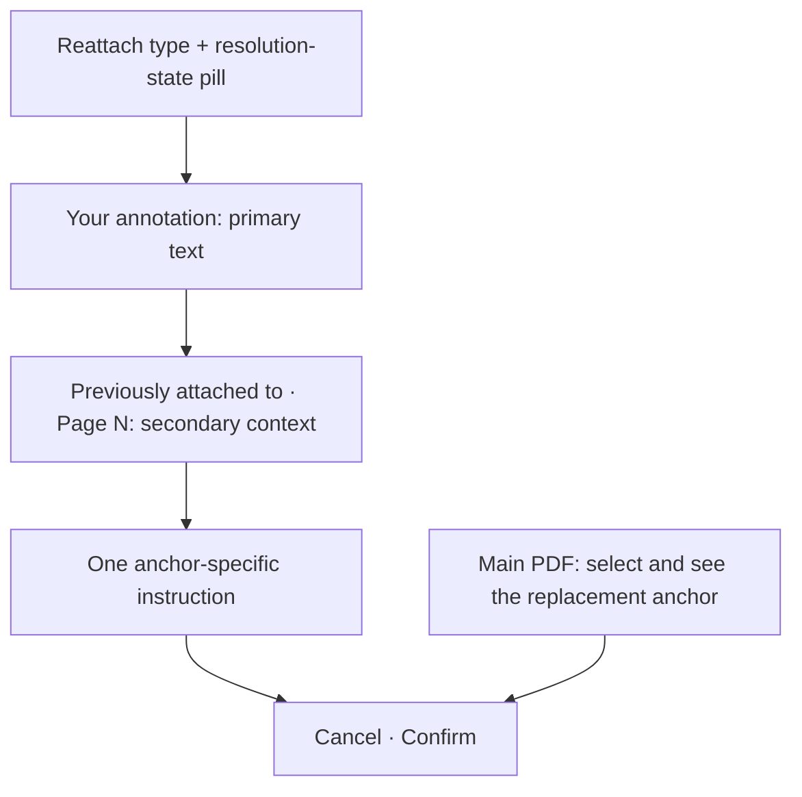

# Focused Reattachment Visual Hierarchy - Plan

## Goal Capsule

- **Objective:** Let reviewers distinguish an unresolved annotation's intent, prior anchor, resolution state, and next action at a glance without duplicating the PDF selection surface.
- **Means:** Simplify the focused reattachment view around an intent-first hierarchy that reuses Placekeeper's established design language (KTD2, KTD5).
- **Product authority:** This contract owns the focused Rebuild Reconciliation reattachment presentation and copy. Existing reconciliation behavior remains authoritative outside the presentation changes named here.
- **Open blockers:** None.

---

## Product Contract

### Summary

Create a minimal focused reattachment view whose title names the annotation type, whose status shares the title row, and whose body clearly separates the authored annotation from its prior PDF context.
Keep the main PDF as the only candidate-selection surface and present the same Warm Neutral and Compact Editorial hierarchy in browser and VS Code review surfaces.

### Problem Frame

The focused reattachment view presents several different kinds of text at similar visual weight: annotation metadata, the authored instruction, old PDF text, resolution status, and selection guidance.
Repeated annotation-type, page, and instructional copy adds chrome without helping the reviewer decide where the annotation belongs.
The result is functional but slower to scan than the surrounding Annotation Tray and annotation-editing surfaces.

### Key Decisions

- **Use an intent-first hierarchy.** (session-settled: user-directed — chosen over problem-first and relationship-first layouts: the annotation being rescued should remain visually primary in the simplest surface.) Governs R1-R4.
- **Keep selection in the main PDF.** (session-settled: user-directed — chosen over a tray-side selection preview: the user already selects and sees candidate text in the main viewer.) Governs R5-R7.
- **Integrate type, status, and page into meaningful roles.** (session-settled: user-directed — chosen over a separate metadata row: type belongs in the task title, status beside it, and page beside the prior-anchor label.) Governs R1-R3.
- **Show Page Note context only when it identifies a real prior location.** (session-settled: user-directed — chosen over page-only and always-present source rows: meaningful nearby text helps, while a fallback that repeats the page number does not.) Governs R4.
- **Reuse Placekeeper's established visual language.** (session-settled: user-approved — chosen over literal sketch styling or host-specific treatment: the focused view should feel native to the rest of the app.) Governs R8-R10.

### Requirements

**Information hierarchy**

- R1. The focused view shall title the task with the annotation type: **Reattach highlight**, **Reattach deletion**, **Reattach insertion**, **Reattach replacement**, or **Reattach page note**.
- R2. The human-readable resolution state, such as **Multiple matches** or **Missing text**, shall appear as a right-aligned pill on the same row as the title.
- R3. The authored content shall be the primary body text, while the old anchor shall be visually secondary under **Previously attached to · Page N**.
- R4. A Page Note shall show nearby old text only when it provides meaningful location context; otherwise the prior-context quote shall be omitted.

**Selection and actions**

- R5. The main PDF viewer shall be the sole visible surface for selecting and displaying the replacement anchor.
- R6. The focused view shall show one anchor-appropriate instruction near Cancel and Confirm, with no duplicate instruction beneath the title.
- R7. Confirm shall become available only when the main PDF holds a valid replacement anchor, while Cancel shall leave the annotation unresolved and return to the previous-annotation list.

**Visual consistency**

- R8. Colors, typography, spacing, borders, radii, pills, icons, focus treatment, and control sizing shall reuse the established Warm Neutral and Compact Editorial design system.
- R9. Browser and VS Code review surfaces shall present the same focused hierarchy without host-specific styling.
- R10. The title, status pill, content hierarchy, and actions shall remain legible without overlap or horizontal scrolling at supported Annotation Tray widths.

The focused layout has this relationship to the main viewer:

### Key Flows

- F1. Reattach an unresolved annotation
  - **Trigger:** The reviewer activates an unresolved annotation in **Previous Annotations to Resolve**.
  - **Steps:** The focused view opens with the type-specific title, current state pill, authored content, and meaningful prior context. The reviewer selects the replacement anchor in the main PDF and confirms it.
  - **Outcome:** The annotation attaches to the valid current-generation anchor and the previous-annotation list reflects the resolved state.
  - **Covered by:** R1-R10.
- F2. Leave an annotation unresolved
  - **Trigger:** The focused reattachment view is open.
  - **Steps:** The reviewer chooses Cancel before confirming a valid candidate.
  - **Outcome:** The annotation remains unresolved and focus returns to its entry in the previous-annotation list.
  - **Covered by:** R6-R7.

### Acceptance Examples

- AE1. Ambiguous highlight
  - **Covers R1-R3, R5-R10.**
  - **Given:** A highlight has more than one plausible match after a PDF rebuild.
  - **When:** The reviewer opens it from the previous-annotation list.
  - **Then:** The header reads **Reattach highlight** with **Multiple matches** on the same row, the authored annotation is primary, the old quote appears under **Previously attached to · Page N**, and no selection preview appears in the tray.
- AE2. Valid replacement selection
  - **Covers R5-R7.**
  - **Given:** A focused reattachment view is waiting for a replacement anchor.
  - **When:** The reviewer selects a valid passage, caret, or page location in the main PDF.
  - **Then:** The main PDF provides the visible selection feedback, Confirm becomes available, and no second instruction or candidate preview is added to the tray.
- AE3. Page Note without meaningful source text
  - **Covers R1, R3-R4, R6.**
  - **Given:** A Page Note needs reattachment and its old anchor contains no useful nearby text.
  - **When:** The reviewer opens its focused view.
  - **Then:** The header reads **Reattach page note**, the prior page appears in **Previously attached to · Page N**, and no quote repeats the same page label.
- AE4. Cross-host presentation
  - **Covers R8-R10.**
  - **Given:** The same unresolved annotation is viewed in the browser and the embedded VS Code panel.
  - **When:** The focused reattachment view opens at each supported tray width.
  - **Then:** Both surfaces use the same hierarchy, design tokens, icon and control scale, and readable title-status composition without host-specific divergence.

### Success Criteria

- A reviewer can identify the operation, annotation type, resolution state, authored intent, and prior location in one scan.
- The focused view contains no duplicated selection preview, metadata row, or instructional copy.
- Visual comparison with adjacent Annotation Tray and annotation-editing surfaces reveals no one-off color, spacing, typography, border, radius, pill, icon, or control-size treatment.
- Browser and VS Code presentations remain behaviorally and visually equivalent.

### Scope Boundaries

- This work changes the focused reattachment view; it does not redesign the **Previous Annotations to Resolve** list.
- This work does not change reconciliation matching, current-generation validation, selection or caret capture, Cancel and Confirm semantics, export eligibility, or source-to-PDF navigation.
- This work does not add a tray-side selection preview, new design tokens, a host-specific theme, nested confirmation cards, or repeated instructional copy.
- Apply-draft and discard confirmation flows retain their current behavior; shared styling may follow R8 only where needed to prevent visual drift.

### Dependencies and Assumptions

- The Warm Neutral plan remains the visual authority for app-wide color, typography, geometry, density, and state roles.
- Compact Editorial remains the presentation grammar for focused task surfaces and action language.
- The fully embedded VS Code LaTeX review plan remains the behavioral authority for Rebuild Reconciliation and the main-viewer anchor-selection flow.
- The main PDF viewer continues to provide authoritative replacement-anchor feedback for selection, caret, and page evidence.

### Sources and Research

- `docs/plans/2026-08-09-001-feat-warm-neutral-review-design-language-plan.md`
- `docs/plans/2026-08-21-1453-feat-contextual-annotation-composer-plan.md`
- `docs/plans/2026-08-27-1706-feat-fully-embedded-vscode-latex-review-plan.md`
- `docs/solutions/design-patterns/compact-editorial-language-for-annotation-modals.md`
- `apps/web/src/review/ReconciliationWorkspace.tsx`
- `apps/web/src/review/AnnotationMetadata.tsx`
- `apps/web/src/app/review-layout-annotations.css`

---

## Planning Contract

Product Contract preservation: unchanged.

### Key Technical Decisions

- KTD1. **Use a reattachment-specific noun label mapping.** Derive the task title from a local noun-form mapping instead of changing the shared `AnnotationMetadata` action labels. This preserves list and menu wording while implementing R1.
- KTD2. **Render a focused semantic header in reattach mode.** (session-settled: user-directed — chosen over retaining the full annotation metadata row: the task title and state pill should carry the useful metadata without a second row.) Replace the metadata bar only for reattachment detail, while preserving existing apply and discard detail behavior. Governs R1-R3 and R8-R10.
- KTD3. **Project prior context through one meaningful-source predicate.** Build the prior-anchor line from the page number and show a secondary quote only when normalized source text adds information beyond that page label. This implements R3-R4 without changing reconciliation data.
- KTD4. **Keep candidate validity owned by the existing viewer evidence.** Render one visible instruction from the current selection, caret, or page candidate state near the actions; keep valid-state feedback accessible without adding a tray preview. This implements R5-R7 without changing capture or validation semantics.
- KTD5. **Extend existing reconciliation hooks and tokens.** (session-settled: user-approved — chosen over new tokens or host-specific CSS: the shared component should remain visually native in both hosts.) Add focused-view classes under the existing reconciliation stylesheet and reuse current typography, pill, focus, spacing, radius, icon, and button rules. Governs R8-R10.

### Implementation Constraints

- The current reattachment, apply-draft, and discard state transitions remain authoritative.
- Existing Back, Discard, Cancel, and Confirm controls retain their actions, focus restoration, and accessible names.
- The embedded VS Code panel consumes the same web component and stylesheet; do not add a VS Code-only presentation branch.
- Use the main PDF's current selection, caret, and page evidence as the only candidate source.

### Sequencing

Implement the semantic hierarchy and its behavior coverage first. Apply the shared styling and responsive visual proof after the component structure is stable.

---

## Implementation Units

### U1. Focused reattachment semantics

- **Goal:** Make the focused detail identify the reattachment task, state, authored intent, prior context, and one next-step instruction without duplicated metadata or candidate previews.
- **Requirements:** R1-R7; F1-F2; AE1-AE3.
- **Dependencies:** None.
- **Files:**
  - `apps/web/src/review/ReconciliationWorkspace.tsx`
  - `test/acceptance/review-harness/main.tsx`
  - `test/acceptance/review-workflow.spec.ts`
- **Approach:**
  1. Add local presentation helpers for the noun-form title, state label, prior-anchor label, and meaningful source context per KTD1 and KTD3.
  2. Replace the reattach-mode metadata row with a focused header and body structure per KTD2, while retaining the existing navigation and discard controls.
  3. Collapse the guidance and candidate feedback into one visible instruction adjacent to Cancel and Confirm per KTD4.
  4. Extend the reconciliation harness only as needed to exercise annotation-type and Page Note context variants.
- **Patterns to follow:** `FullAnnotationReader.tsx` for accessible focused-detail controls, `AnnotationMetadata.tsx` for shared human-readable state labels, and the existing reconciliation entry focus-restoration behavior.
- **Test scenarios:**
  - Covers AE1. Opening an ambiguous highlight shows **Reattach highlight**, one **Multiple matches** state, the authored text, and **Previously attached to · Page 1** without a metadata row or tray preview.
  - Opening each supported annotation kind produces the required noun-form title without changing the action labels in the previous-annotation list.
  - Covers AE2. An invalid selection, caret, or page candidate shows one anchor-appropriate instruction and disables Confirm; valid viewer evidence enables Confirm without adding a second visible preview or instruction.
  - Covers AE3. A Page Note whose source is only a page fallback omits the quote, while a Page Note with meaningful nearby text shows it beneath the prior-anchor label.
  - Choosing Cancel leaves the item unresolved and restores focus to its list entry; choosing Confirm preserves the existing resolution behavior.
  - Apply-draft and discard details retain their current controls, copy, and state transitions.
- **Verification:** The focused acceptance test proves every semantic role, absence rule, action gate, and focus transition without relying on visual coordinates.

### U2. Shared visual hierarchy and responsive proof

- **Goal:** Make the focused reattachment detail match Placekeeper's established hierarchy at supported tray widths in both browser and embedded VS Code rendering.
- **Requirements:** R2-R3 and R8-R10; AE1 and AE4.
- **Dependencies:** U1.
- **Files:**
  - `apps/web/src/app/review-layout-annotations.css`
  - `apps/web/src/app/review-layout-responsive.css`
  - `test/acceptance/review-visual.spec.ts`
  - `test/acceptance/review-visual.spec.ts-snapshots/`
- **Approach:**
  1. Style the title and status as one resilient header row and establish primary authored text, secondary prior context, and compact actions using existing design tokens per KTD5.
  2. Keep existing icon and button sizing, focus treatment, spacing rhythm, radii, and colors instead of introducing reconciliation-specific values where a shared token exists.
  3. Add wide and narrow focused-detail visual states that prove wrapping, alignment, density, and control sizing without horizontal scrolling or overlap.
- **Patterns to follow:** The current Annotation Tray, annotation edit view, Compact Editorial modal treatment, and Warm Neutral token usage in `review-layout-annotations.css`.
- **Test scenarios:**
  - Covers AE1. At a wide Annotation Tray width, the type title and state pill share the header row, authored intent is primary, and prior context is visibly secondary.
  - Covers AE4. At the narrow supported width, the right-aligned status pill remains on the title row while only the title may wrap within its allocated area, without overlap, clipping, horizontal scrolling, or oversized controls.
  - The focused view's Cancel, Confirm, Back, and Discard controls match adjacent app control dimensions and focus treatment.
  - Apply-draft and discard details remain visually stable after shared reconciliation styling changes.
- **Verification:** Updated deterministic snapshots show the same shared component hierarchy at wide and narrow widths, and the web and VS Code builds consume the same stylesheet without host-specific overrides.

---

## Verification Contract

| Gate | Command | Proves |
|---|---|---|
| Type safety | `pnpm typecheck` | Component, harness, and test changes satisfy the shared TypeScript contract. |
| Focused behavior | `pnpm playwright test test/acceptance/review-workflow.spec.ts --grep "resolves previous annotations"` | Reattachment semantics, action gating, cancellation, focus restoration, and absence rules work end to end. |
| Review regression | `pnpm test:review` | The broader Annotation Tray and review workflow remain intact. |
| Visual hierarchy | `pnpm build:web && pnpm playwright test --config playwright.visual.config.ts --grep "focused reattachment"` | Wide and narrow snapshots match the approved hierarchy and design language. |
| Shared host builds | `pnpm build:web && pnpm build:vscode` | Browser and VS Code packaging consume the shared component and styles successfully. |

The visual gate may update snapshots only after the rendered states are inspected against R8-R10. CI-equivalent review tests must pass without retries or skipped reconciliation assertions.

---

## Definition of Done

- U1 is complete when AE1-AE3 pass through semantic acceptance coverage and existing reconciliation state transitions remain unchanged.
- U2 is complete when wide and narrow visual evidence satisfies AE4 and uses only the established shared design language.
- All Verification Contract gates pass.
- The diff contains no host-specific presentation branch, new design token, tray-side candidate preview, duplicated instruction, or abandoned experimental code.
- The implementation remains limited to the focused reattachment presentation and its test fixtures; adjacent reconciliation behavior is unchanged.
