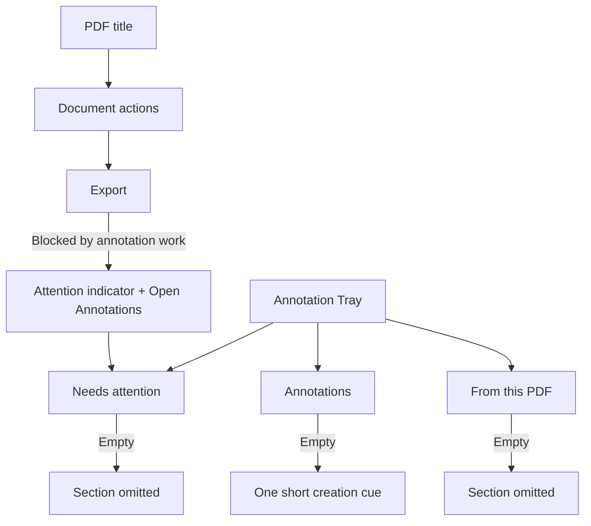
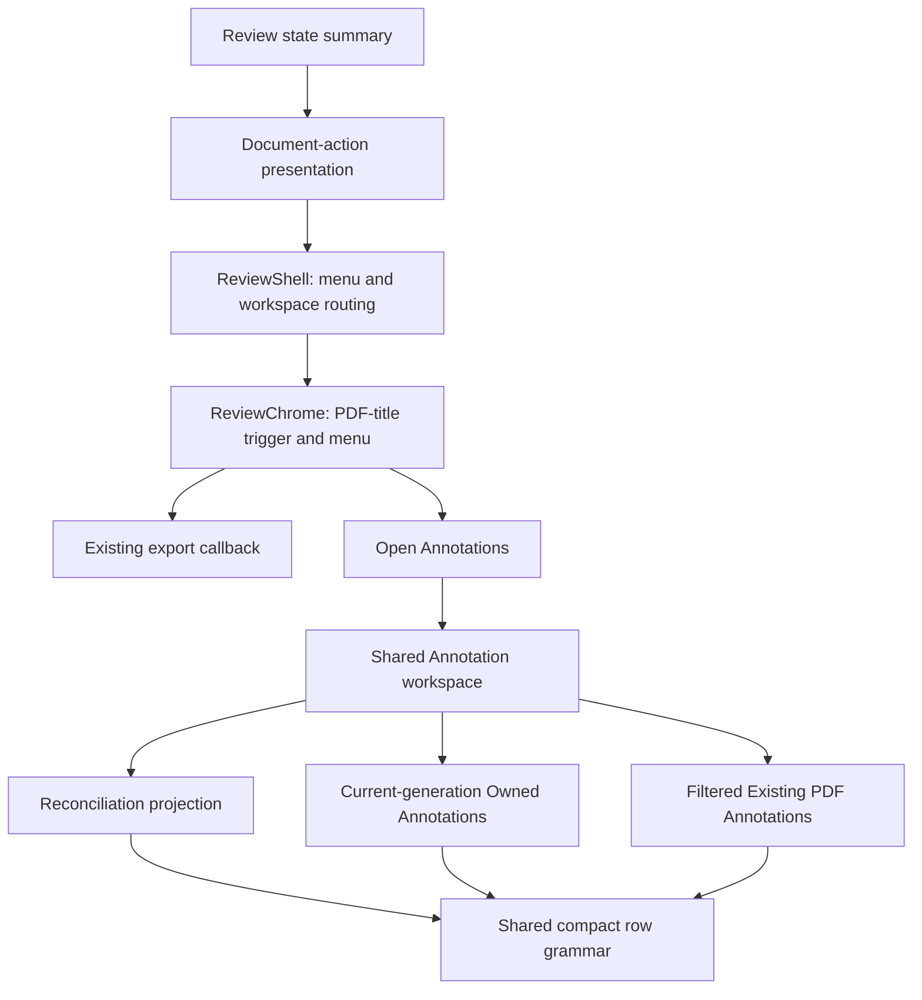
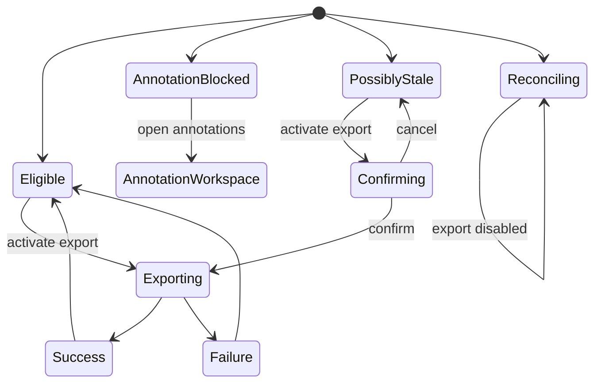
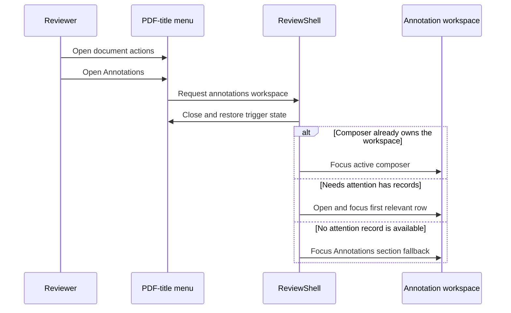

# Streamlined Annotation Tray and Document Export - Plan

## Goal Capsule

- **Objective:** Let reviewers understand and act on annotation work at a glance, while making reviewed-PDF export discoverable as a document action with a clear path back to anything blocking it.
- **Means:** Organize the Annotation Tray around current tasks and move reviewed-PDF export into the PDF-title menu (KTD1-KTD4).
- **Product authority:** This contract owns Annotation Tray list hierarchy and the generated-output document-action entry point. Warm Neutral, Compact Editorial, focused reattachment, annotation semantics, and existing export eligibility retain authority outside the changes named here.
- **Open blockers:** None.

---

## Product Contract

### Summary

Create a compact, task-first Annotation Tray with conditional sections for work needing attention, owned annotations, and read-only annotations from the PDF.
Move reviewed-PDF export into a caret-free PDF-title menu whose ordinary state contains only **Export**. Annotation blockers add one compact attention unit that explains the problem and opens the Annotation Tray directly.

### Problem Frame

The current Annotation Tray places owned annotations, read-only PDF annotations, rebuild-reconciliation work, lifecycle copy, and reviewed-PDF export within one scrolling workspace.
Repeated labels, persistent row controls, and export messaging compete with the annotations themselves, while the document title behaves differently for generated-output reviews.
The result works but makes reviewers scan unrelated interface elements before they can identify the next annotation task or understand where document-level actions belong.

### Key Decisions

- **Use task-first sections with contextual presence.** (session-settled: user-directed — chosen over a unified stream, filter-first list, fixed sections, and persistent completion messages: urgent work should lead without leaving empty interface chrome behind.) Governs R1-R3, R8-R9.
- **Reveal established annotation actions at the moment of intent.** (session-settled: user-directed — chosen over permanently visible controls and overflow menus: annotation text should remain primary while direct actions stay accessible.) Governs R4-R7, R13-R14.
- **Treat export as a document action.** (session-settled: user-directed — chosen over the Annotation Tray export footer: the tray should own annotation work while the PDF-title menu owns whole-document actions.) Governs R10-R12.
- **Keep document actions conditional and task-sized.** (session-settled: user-directed — chosen over two editorial rows, a status-led menu, and a nested recovery card: ordinary export should be one action, with recovery chrome only when attention is required.) Governs R10-R12, R15-R16.
- **Reuse one annotation action identity.** (session-settled: user-directed — chosen over a lookalike or one-off annotations glyph: the recovery action should be visually and semantically identical to the Annotations workspace destination.) Governs R17.
- **Reuse the existing Placekeeper design language across hosts.** (session-settled: user-approved — chosen over sketch-specific or VS Code-specific styling: browser and embedded review should feel like the same product.) Governs R7, R9-R17.

### Requirements

**Task hierarchy**

- R1. The Annotation Tray shall order its sections as **Needs attention**, **Annotations**, and **From this PDF** whenever each is present.
- R2. **Needs attention** shall contain unresolved rebuild-reconciliation items and pending annotation drafts.
- R3. **Annotations** shall contain the reviewer’s owned annotations, while **From this PDF** shall contain reviewer-relevant Existing PDF Annotations as read-only rows with no editing actions.

**Row behavior and actions**

- R4. Every list row shall use one compact content grammar: annotation-type icon, human-readable excerpt or intent, concise type-and-page metadata, and a status only when the reviewer needs it to decide what to do.
- R5. Activating the body of an owned or existing-PDF row shall navigate to its PDF location, while activating an unresolved row shall begin its focused resolution task.
- R6. Secondary actions shall be hidden on resting rows and appear on hover, keyboard focus, or selection; they shall remain visible without hover on touch or coarse-pointer devices.
- R7. Owned-row edit, copy-link, and delete actions and unresolved-row discard actions shall use the same icon-button geometry, spacing, states, accessible names, tooltips, and danger treatment as the established annotation action controls.

**Contextual states**

- R8. **Needs attention** and **From this PDF** shall be omitted when empty, while **Annotations** shall remain as the stable core section and show one short instruction to select PDF text when it contains no items.
- R9. Loading, failure, and retry feedback shall remain local to the affected section, and ordinary empty states shall not be presented as errors or persistent success messages.

**Document actions and export**

- R10. The PDF title shall remain the document-action entry point without a down caret and shall preserve its button, hover, focus, tooltip, and accessibility affordances in browser and fully embedded VS Code sessions.
- R11. An eligible idle menu shall contain one action labeled **Export** with the established download icon and shall show no explanatory status sentence, heading, divider, or Annotation Tray action.
- R12. When annotation work blocks export, **Export** shall remain keyboard- and accessibility-reachable as disabled, followed by one compact attention unit containing a human-readable blocker indicator and an **Open Annotations** button that opens the workspace directly on the Annotations tab.

**Visual and interaction consistency**

- R13. The tray and PDF-title menu shall reuse Warm Neutral and Compact Editorial color roles, typography, spacing, borders, radii, elevation, control sizing, focus treatment, and motion rather than introduce a parallel style vocabulary.
- R14. Browser and fully embedded VS Code review sessions shall expose the same hierarchy, actions, states, copy, and responsive behavior without host-specific presentation branches.
- R15. Possibly stale, reconciling, pending, success, and failure states shall retain their specialized behavior while using the same concise menu hierarchy.
- R16. **Open Annotations** shall appear only when annotation work is the actionable blocker.
- R17. **Open Annotations** shall use the same Annotations icon as the workspace tray navbar rather than a lookalike or one-off glyph.

The two in-scope surfaces divide responsibility as follows:

### Key Flows

- F1. Resolve an annotation needing attention
  - **Trigger:** The reviewer opens the Annotations tab while rebuild-reconciliation work remains.
  - **Steps:** **Needs attention** appears first. The reviewer activates an item, completes or cancels its established focused resolution flow, and returns to the list context.
  - **Outcome:** The item leaves **Needs attention** after resolution, and the section disappears when the queue becomes empty.
  - **Covered by:** R1-R2, R4-R9, R13-R14.
- F2. Navigate or manage an annotation
  - **Trigger:** The reviewer locates an owned annotation or Existing PDF Annotation in the tray.
  - **Steps:** Activating the row body navigates to the PDF location. Hover, keyboard focus, selection, or touch exposes only the actions allowed for that row population.
  - **Outcome:** Owned annotations remain editable and linkable, Existing PDF Annotations remain read-only, and row controls do not dominate the list at rest.
  - **Covered by:** R3-R7, R13-R14.
- F3. Recover from blocked export
  - **Trigger:** The reviewer opens the PDF-title menu while annotation work makes export ineligible.
  - **Steps:** The menu shows disabled **Export** and one compact attention unit with the blocker indicator and **Open Annotations**. Activating the button opens the workspace on the Annotations tab with the relevant work visible first.
  - **Outcome:** The reviewer can act on the blocker without searching for the reconciliation workspace or encountering duplicate export controls.
  - **Covered by:** R1-R2, R8, R10-R17.
- F4. Export a reviewed PDF
  - **Trigger:** The review is eligible for export.
  - **Steps:** The reviewer opens the PDF-title menu and activates **Export**.
  - **Outcome:** The existing reviewed-PDF export completes from the document-actions surface.
  - **Covered by:** R10-R16.

### Acceptance Examples

- AE1. Unresolved work leads the tray
  - **Covers R1-R2, R4-R9.**
  - **Given:** Two prior annotations need reconciliation and owned annotations also exist.
  - **When:** The reviewer opens the Annotations tab.
  - **Then:** **Needs attention** appears first with compact, human-readable rows; activating either row opens its focused resolution task without an extra anchor-action step.
- AE2. Completion removes stale chrome
  - **Covers R1, R8-R9.**
  - **Given:** The final unresolved item has been resolved and the PDF contains no Existing PDF Annotations.
  - **When:** The reviewer returns to the annotation list.
  - **Then:** Neither **Needs attention** nor **From this PDF** is rendered, and no permanent completion message or zero-count placeholder remains.
- AE3. Row actions stay quiet and accessible
  - **Covers R3-R7, R13-R14.**
  - **Given:** An owned annotation row is resting in the list.
  - **When:** The reviewer hovers it, focuses it with the keyboard, selects it, or uses a touch device.
  - **Then:** The allowed annotation icon buttons appear with the same sizing and states as the established annotation actions, remain keyboard and screen-reader accessible, and do not appear on read-only PDF rows.
- AE4. Export is blocked by annotation work
  - **Covers R10-R17.**
  - **Given:** A generated-output review has an unresolved reconciliation item or pending annotation draft.
  - **When:** The reviewer opens the PDF-title menu.
  - **Then:** **Export** is disabled, one compact attention unit identifies how many annotations need attention, and its **Open Annotations** button uses the workspace navbar's Annotations icon before opening that tab.
- AE5. Cross-host document actions
  - **Covers R10-R16.**
  - **Given:** The same generated-output review is open in the browser and the fully embedded VS Code surface.
  - **When:** The reviewer opens the PDF-title menu in each host.
  - **Then:** Both hosts show the same caret-free title trigger, conditional menu hierarchy, specialized export states, control styling, and responsive behavior.

### Success Criteria

- A reviewer can distinguish work needing attention, owned annotations, and read-only PDF annotations without reading explanatory lifecycle copy.
- The Annotation Tray contains no reviewed-PDF export control, redundant generation-status sentence, permanent success card, or empty optional section.
- Secondary row actions match established annotation controls and remain discoverable by mouse, keyboard, screen reader, and touch without filling resting rows with icons.
- An eligible idle PDF-title menu contains only **Export**, while an annotation blocker adds one compact and immediately actionable recovery unit.
- Generated-output title menus and Annotation Tray behavior remain visually and behaviorally equivalent in browser and fully embedded VS Code sessions.

### Scope Boundaries

- This work changes Annotation Tray list organization, row-action presentation, contextual section states, and the generated-output PDF-title menu.
- This work reuses the focused reattachment behavior defined in `docs/plans/2026-08-31-1714-fix-focused-reattachment-visual-hierarchy-plan.md`; it does not redesign that detail view.
- This work does not change annotation ownership, reconciliation matching, anchor capture, draft semantics, export eligibility, stale-generation behavior, export result behavior, or reviewed-PDF contents.
- This work does not make Existing PDF Annotations editable or merge them into the owned annotation population.
- This work does not change PDF and LaTeX synchronization, workspace docking, tray framing, PDF rendering, or the overall viewer layout.

### Dependencies and Assumptions

- The ordinary-review PDF-title interaction remains the product precedent for opening document actions.
- Generated-output review uses the shared production review surface in browser and VS Code, so parity is a single product requirement rather than two independent designs.
- The Warm Neutral plan remains authoritative for visual roles, and Compact Editorial remains authoritative for concise task hierarchy and action language.
- Existing export eligibility and output behavior remain authoritative; this work changes where eligibility is presented and how annotation-related blockers route the reviewer.

### Sources and Research

- `CONCEPTS.md`
- `docs/plans/2026-08-09-001-feat-warm-neutral-review-design-language-plan.md`
- `docs/plans/2026-08-21-0954-feat-compact-editorial-modal-language-plan.md`
- `docs/plans/2026-08-27-1706-feat-fully-embedded-vscode-latex-review-plan.md`
- `docs/plans/2026-08-31-1714-fix-focused-reattachment-visual-hierarchy-plan.md`
- `docs/solutions/design-patterns/contextual-annotation-composer-preserves-document-context-during-authoring.md`
- `docs/solutions/design-patterns/compact-editorial-language-for-annotation-modals.md`
- `docs/solutions/conventions/native-control-tooltip-contract.md`
- `docs/solutions/ui-bugs/preserve-document-history-for-annotation-tray-navigation.md`
- `docs/solutions/architecture-patterns/adaptive-annotation-tray-framing.md`
- `apps/web/src/app/ReviewShell.tsx`
- `apps/web/src/app/ProductionReviewApp.tsx`
- `apps/web/src/review/AnnotationList.tsx`
- `apps/web/src/review/ReconciliationWorkspace.tsx`
- `apps/web/src/review/ReviewChrome.tsx`
- `apps/web/src/review/DocumentActionsMenu.tsx`
- `apps/web/src/review/WorkspaceModeStrip.tsx`
- `apps/web/src/review/ReviewIcon.tsx`

---

## Planning Contract

Product Contract preservation: refined in place. R10-R17 now define the caret-free trigger, single-action idle menu, conditional annotation recovery unit, shared Annotations icon, and preserved specialized export states without changing export eligibility or output behavior.

### Key Technical Decisions

- KTD1. **Project export state through one shared document-action model.** Move the current export presentation rules out of the reconciliation list component without duplicating eligibility or changing the export callback contract. (session-settled: user-directed — chosen over retaining export in the Annotation Tray footer: reviewed-PDF export is a document action.) Governs R10-R12, R15-R16.
- KTD2. **Give the generated-output title a quiet, accessible menu lifecycle.** Remove the visual caret without changing the trigger's button or accessibility semantics. Render only the download-icon **Export** action while eligible and idle, add the compact attention unit only for annotation blockers, preserve specialized exceptional states, and return focus to the title trigger when the reviewer dismisses the menu. (session-settled: user-directed — chosen over two equal action rows, status-first framing, and a nested recovery card: the ordinary state should be minimal and recovery should appear only when actionable.) Governs R10-R16.
- KTD3. **Compose three projections without merging their state owners.** Keep unresolved and pending reconciliation records, current-generation Owned Annotations, and the filtered Existing PDF Annotation inventory distinct while applying one compact row presentation grammar. (session-settled: user-directed — chosen over a unified stream, filter-first list, and fixed empty sections: task status and editability must remain clear.) Governs R1-R5, R8-R9.
- KTD4. **Keep row actions mounted and reveal them through presentation state.** Use row hover, focus-within, active selection, and coarse-pointer rules rather than conditional mounting or accessibility-tree removal. (session-settled: user-directed — chosen over permanently visible controls and overflow menus: annotation text should dominate resting rows without hiding direct actions.) Governs R6-R7, R13-R14.
- KTD5. **Route annotation blockers through the workspace owner.** Use the existing Annotations workspace selection path, preserve active composer state, and focus the nearest actionable annotation target after the menu closes. Governs R2, R8, R12, R14, R16.
- KTD6. **Preserve coordinated PDF navigation and deterministic list focus.** Reuse the existing annotation navigation callbacks and restore focus to a surviving row or section fallback when a row or conditional section disappears. Governs R2, R5-R9, R14.
- KTD7. **Reference one shared Annotations icon token.** Render **Open Annotations** through the same `ReviewIcon` annotations token used by `WorkspaceModeStrip`; do not import a separate glyph or add a second icon mapping. Governs R17.

### High-Level Technical Design

The shared review tree remains the only host presentation path. State moves to the nearest existing owner, while presentation is shared at the row and menu boundaries.

The document-action menu projects the existing export lifecycle rather than creating a second source of truth.

The blocked-action route closes the menu before it moves focus. It does not discard or recreate annotation state.

### Assumptions

- An active annotation composer is already the actionable Annotations surface, so a blocked-export link may focus it without closing or transforming its protected draft.
- The current export summary and callback expose every eligibility, stale-confirmation, pending, success, and failure state required by the new menu.
- The existing stage-size responsive workspace can host the revised tray and title menu without new browser-only or VS Code-only presentation logic.

### Implementation Constraints

- Preserve `NavigationCoordinator` as the authority for Owned Annotation and Existing PDF Annotation jumps.
- Preserve current-generation filtering so unresolved generated annotations do not appear in both **Needs attention** and **Annotations**.
- Preserve the filtered Existing PDF Annotation inventory and its stable restoration keys; do not rebuild it from the raw PDF Annotation Catalog.
- Preserve focused reconciliation detail takeover, Back and Cancel behavior, protected drafts, and list scroll restoration.
- Preserve stale-generation confirmation, export pending state, success and failure feedback, and the service export path.
- Keep the eligible idle menu free of lifecycle copy, and do not use a caret, heading, divider, or persistent Annotation Tray action to signal that the PDF title opens document actions.
- Keep **Open Annotations** on the shared Annotations icon token and match established compact action-button geometry instead of creating a menu-specific glyph or control size.
- Keep contextual action controls mounted and keyboard-reachable even when they are visually quiet.
- Use review-stage dimensions and the existing responsive tray host instead of browser-window media assumptions.

### Sequencing

1. Establish the shared export presentation model and generated-output title menu before removing the tray footer.
2. Route blocked export into the existing Annotations workspace and secure focus restoration across active and disappearing states.
3. Recompose the three annotation populations into task-first conditional sections without changing their projections or navigation callbacks.
4. Apply the shared row grammar and contextual action presentation after the semantic structure is stable.
5. Prove browser, WebKit, touch, narrow, wide, and fully embedded VS Code parity before refreshing visual baselines.

### Risks and Mitigations

- **Duplicate export authority:** Reimplementing eligibility in the menu could drift from stale-generation and reconciliation rules. KTD1 keeps one presentation model over the current summary.
- **Protected-draft loss:** A generic workspace dismissal could discard the draft that blocks export. KTD5 routes and focuses without invoking ordinary Cancel or discard behavior.
- **Keyboard regression:** Removing contextual actions from layout could make them unreachable before focus reveals them. KTD4 keeps them mounted and verifies focus-within behavior.
- **Navigation-history regression:** New card handlers could bypass Meaningful Jump coordination. KTD6 retains the existing owned and imported navigation callbacks.
- **Projection drift:** Regrouping the PDF catalog could reintroduce owned or navigational annotations as read-only feedback. KTD3 reuses the filtered Existing PDF Annotation projection.
- **Responsive host drift:** Window-based styling could pass in the browser and fail in a VS Code split. R14 and KTD4 require stage-size and coarse-pointer coverage on the shared tree.

---

## Implementation Units

### U1. Shared export presentation and generated-output title menu

- **Goal:** Move the complete reviewed-PDF export lifecycle into an accessible PDF-title menu without changing export eligibility or output behavior.
- **Requirements:** R10-R17; F3-F4; AE4-AE5; KTD1-KTD2, KTD7.
- **Dependencies:** None.
- **Files:**
  - `apps/web/src/review/ReconciliationWorkspace.tsx`
  - `apps/web/src/review/ReviewChrome.tsx`
  - `apps/web/src/review/DocumentActionsMenu.tsx`
  - `apps/web/src/app/ReviewShell.tsx`
  - `apps/web/src/app/ProductionReviewApp.tsx`
  - `apps/web/src/app/review-layout.css`
  - `apps/web/test/production-review-app.test.tsx`
  - `apps/web/test/review-layout.test.tsx`
  - `test/acceptance/review-harness/main.tsx`
- **Approach:**
  1. Relocate the export presentation helper so both reconciliation and document chrome can consume it while the existing state summary remains authoritative.
  2. Lift export confirmation, pending, result, and invocation state to the shared review owner.
  3. Remove the title caret without removing the trigger's button treatment, tooltip, hover, focus, or accessible menu semantics. Render a single download-icon **Export** action in the eligible idle state.
  4. Represent annotation-blocked export with an activation-suppressed, keyboard-reachable **Export** action followed by one compact attention unit containing the blocker indicator and **Open Annotations** button. Connect the reason to **Export** programmatically without repeating it as free-standing menu copy. Reuse the exact shared Annotations icon token and the established compact annotation-action geometry for the recovery button.
  5. Keep stale confirmation, reconciliation progress, export pending, success, and retryable failure in their specialized states. Keep focus stable while those states are active, announce results without moving focus, and return focus to the title trigger only when the menu is dismissed.
  6. Remove the reconciliation footer only after the new menu handles every existing export state.
- **Patterns to follow:** `apps/web/src/review/RowActionGroup.tsx` for compact action geometry; `apps/web/src/review/WorkspaceModeStrip.tsx` and `apps/web/src/review/ReviewIcon.tsx` for the canonical Annotations icon; `apps/web/src/review/menu-focus.ts` for menu interaction; `apps/web/src/save/SaveDestinationDialog.tsx` for title-trigger focus restoration; `packages/core/src/live-context.ts` for eligibility authority.
- **Test scenarios:**
  - Covers F4 / AE5. An eligible generated-output review exposes a caret-free title trigger and a menu containing only download-icon **Export**, which invokes reviewed-PDF export exactly once in browser and VS Code launch surfaces.
  - Covers AE4. Unresolved items and pending drafts disable **Export**, keep it keyboard-discoverable with its blocker reason as an accessible description, and add one compact attention unit with **Open Annotations**.
  - The blocked attention unit renders the same shared Annotations glyph as the workspace navbar and uses the established compact action dimensions without adding a divider, nested card, or one-off spacing token.
  - A reconciling review disables export with its current transient reason and does not show an annotation link unless annotation work is the blocker.
  - A possibly stale review opens confirmation; Cancel restores focus to export and Confirm invokes export with stale confirmation.
  - Export pending state prevents a duplicate invocation while the menu stays open; success and retryable failure remain readable and are announced without moving focus, and dismissing the menu restores focus to the PDF title.
  - Ordinary-review title behavior continues to open its existing save destination flow.
- **Execution note:** Start with characterization tests for every current export state before moving the control.
- **Verification:** The tray contains no export control, and the title menu preserves eligible, blocked, stale, pending, success, and failure behavior.

### U2. Blocked-export workspace routing and focus continuity

- **Goal:** Make **Open Annotations** land on a useful, preserved annotation task without losing drafts or keyboard position.
- **Requirements:** R2, R8-R9, R12-R14, R16; F1, F3; AE1-AE2, AE4; KTD5-KTD6.
- **Dependencies:** U1.
- **Files:**
  - `apps/web/src/app/ReviewShell.tsx`
  - `apps/web/src/app/ProductionReviewApp.tsx`
  - `apps/web/src/app/OutlineAnnotationsWorkspace.tsx`
  - `apps/web/src/review/ReconciliationWorkspace.tsx`
  - `apps/web/src/review/AnnotationList.tsx`
  - `apps/web/test/production-review-app.test.tsx`
  - `apps/web/test/review-layout.test.tsx`
  - `test/acceptance/review-workflow.spec.ts`
- **Approach:**
  1. Route the title-menu link through the existing Annotations workspace selection owner.
  2. Focus the active composer when it is the blocker; otherwise focus the first relevant attention row or the stable Annotations fallback.
  3. Add deterministic next, previous, and section-level focus fallbacks when a resolution or discard removes a row or the final conditional section.
  4. Preserve existing Back, Cancel, deletion, reader, and scroll restoration paths.
- **Patterns to follow:** Existing workspace mode selection in `apps/web/src/app/ReviewShell.tsx`, deletion focus fallback in `apps/web/src/review/AnnotationList.tsx`, and the Contextual Annotation Composer restoration contract.
- **Test scenarios:**
  - Covers F3 / AE4. An unresolved annotation blocker opens the Annotations workspace and focuses its **Needs attention** row.
  - A pending draft with no active composer opens the same workspace and focuses its reconciliation record.
  - A pending draft with an active composer closes only the title menu, preserves the latest draft text, focuses the composer, and emits no discard command.
  - Resolving or discarding the first, middle, and final attention row moves focus deterministically and omits the empty section.
  - Back and Cancel return focus to the originating row without changing the unresolved state.
- **Verification:** Every blocked-export route reaches an actionable target, protected drafts survive, and no disappearing row or section strands focus.

### U3. Task-first conditional annotation sections

- **Goal:** Recompose the tray into ordered, conditional populations with one compact row grammar while preserving each population's semantics.
- **Requirements:** R1-R5, R8-R9, R13-R14; F1-F2; AE1-AE2; KTD3, KTD6.
- **Dependencies:** U2.
- **Files:**
  - `apps/web/src/app/ReviewShell.tsx`
  - `apps/web/src/review/ReconciliationWorkspace.tsx`
  - `apps/web/src/review/AnnotationList.tsx`
  - `apps/web/src/review/AnnotationMetadata.tsx`
  - `apps/web/src/review/ReviewIcon.tsx`
  - `apps/web/src/app/review-layout-annotations.css`
  - `apps/web/test/review-layout.test.tsx`
  - `apps/web/test/production-review-app.test.tsx`
  - `test/acceptance/review-workflow.spec.ts`
- **Approach:**
  1. Make reconciliation expose list records and focused detail without its current export or permanent success footer.
  2. Preserve three explicit projections and render their populated sections in the R1 order.
  3. Add one centralized annotation-kind icon mapping and align excerpt, metadata, and status placement across populations.
  4. Keep Existing PDF Annotation loading, error, retry, read-only identity, and navigation local to **From this PDF**.
  5. Keep **Annotations** mounted with the short creation cue when it alone is empty.
- **Patterns to follow:** Existing current-generation filtering in `apps/web/src/app/ReviewShell.tsx`, filtered imported identity in `apps/web/src/pdf/existing-annotations.ts`, and focused detail takeover in `apps/web/src/review/ReconciliationWorkspace.tsx`.
- **Test scenarios:**
  - Covers F1 / AE1. Unresolved items and pending drafts appear only in **Needs attention**, ahead of owned and read-only populations.
  - Covers AE2. Resolving the final item and loading an annotation-free PDF removes both optional sections with no zero-count or success surface.
  - An annotation-free review retains **Annotations** and displays exactly one PDF-selection cue.
  - Existing PDF Annotation loading, retryable failure, ready, and empty states stay local and preserve read-only behavior.
  - Current-generation filtering prevents an unresolved generated annotation from appearing in both attention and owned sections.
  - Navigation-only and portable-owned PDF annotations remain excluded from **From this PDF**.
- **Verification:** The tray order, population membership, conditional presence, empty guidance, and focused detail takeover match R1-R9 without duplicate records.

### U4. Contextual row actions and navigation-safe interaction

- **Goal:** Keep annotation text visually primary while preserving direct, accessible actions and coordinated PDF navigation.
- **Requirements:** R4-R7, R13-R14; F2; AE3; KTD4, KTD6.
- **Dependencies:** U3.
- **Files:**
  - `apps/web/src/review/AnnotationList.tsx`
  - `apps/web/src/review/ReconciliationWorkspace.tsx`
  - `apps/web/src/review/CopyLinkControl.tsx`
  - `apps/web/src/app/ReviewShell.tsx`
  - `apps/web/src/app/review-layout-annotations.css`
  - `apps/web/src/app/review-layout-responsive.css`
  - `apps/web/test/review-layout.test.tsx`
  - `apps/web/test/copy-link-control.test.ts`
  - `apps/web/test/navigation-coordinator.test.ts`
  - `apps/web/test/review-location-history.test.ts`
  - `test/acceptance/review-workflow.spec.ts`
- **Approach:**
  1. Keep all allowed row actions mounted and disclose them through hover, focus-within, active-selection, and coarse-pointer presentation.
  2. Reuse the established annotation button geometry, danger state, accessible names, and tooltip policy, including Copy Link's state-specific exception.
  3. Keep row-body activation separate from nested action activation.
  4. Preserve the current navigation callbacks so owned and imported rows continue through Meaningful Jump coordination.
- **Patterns to follow:** Native control tooltip contract, existing annotation button selectors, `CopyLinkControl` annotation variant, and `NavigationCoordinator` history transactions.
- **Test scenarios:**
  - Covers F2 / AE3. Resting mouse rows hide actions visually; hover, child focus, and active selection reveal the allowed actions without remounting them.
  - Coarse-pointer presentation keeps actions visible and touch-sized without increasing row or tray height unexpectedly.
  - Existing PDF Annotation rows expose no edit, copy, delete, or discard action.
  - Nested action activation does not navigate the row or alter unrelated active/corresponding state.
  - Copy Link retains its enabled and disabled tooltip behavior and does not flash or select an inactive row.
  - Owned and imported row activation preserves Back, Forward, rapid supersession, and clamped-boundary history behavior.
- **Verification:** Mouse, keyboard, screen-reader, and touch users can reach every allowed action, while row navigation still enters the coordinated document history path.

### U5. Shared-host and visual acceptance proof

- **Goal:** Prove the completed tray and title menu behave and render as one feature across browser and fully embedded VS Code surfaces.
- **Requirements:** R1-R17; F1-F4; AE1-AE5.
- **Dependencies:** U1-U4.
- **Files:**
  - `test/acceptance/review-harness/main.tsx`
  - `test/acceptance/review-workflow.spec.ts`
  - `test/acceptance/production-flow.spec.ts`
  - `test/acceptance/review-visual.spec.ts`
  - `playwright.visual.config.ts`
  - `playwright.webkit.config.ts`
- **Approach:**
  1. Extend generated-output harness states for eligible, unresolved, pending-draft, reconciling, stale, success, and failure export presentations.
  2. Add shared-production flow coverage that varies launch surface without adding host presentation branches.
  3. Cover wide drawer, narrow sheet, stage-height changes, focus states, coarse-pointer states, and menu placement before updating snapshots.
  4. Retain the mounted viewer, zoom, tray scroll, selection, and draft state while content sections change.
- **Patterns to follow:** Existing Annotation Tray visual scenes, fully embedded VS Code production-flow coverage, and adaptive stage-size framing tests.
- **Test scenarios:**
  - Covers AE5. Browser and VS Code launch surfaces expose the same generated-output title menu and blocked-export route.
  - Chromium and WebKit produce the same task order, focus behavior, export states, and read-only imported rows.
  - Wide, narrow, height-constrained, and coarse-pointer scenes keep controls legible, touch-sized, and free of horizontal overflow.
  - Viewer zoom, PDF position, active annotation, tray scroll, and protected draft remain stable while sections appear or disappear.
  - Visual baselines show focus-revealed actions, contextual empty sections, the caret-free title trigger, the single-action eligible menu, and the annotation-blocked attention unit without one-off colors, spacing, or control sizes.
- **Execution note:** Update visual snapshots only after semantic and interaction assertions pass.
- **Verification:** Cross-host, cross-engine, responsive, interaction, and visual evidence all confirm one shared implementation.

---

## Verification Contract

| Gate | Command | Proves |
|---|---|---|
| Focused unit behavior | `pnpm exec vitest run apps/web/test/review-layout.test.tsx apps/web/test/production-review-app.test.tsx apps/web/test/copy-link-control.test.ts apps/web/test/navigation-coordinator.test.ts apps/web/test/review-location-history.test.ts` | Title-menu semantics, projection structure, contextual actions, Copy Link behavior, and coordinated history |
| Review workflow | `pnpm exec playwright test test/acceptance/review-workflow.spec.ts` | Task-first tray flows, contextual sections, row actions, focus continuity, and blocked-export routing |
| Shared production surface | `pnpm exec playwright test test/acceptance/production-flow.spec.ts` | Generated-output integration and browser/VS Code shared-tree behavior |
| WebKit parity | `pnpm test:e2e:webkit` | Cross-engine workflow and production behavior |
| Visual contract | `pnpm test:visual` | Warm Neutral and Compact Editorial parity across wide, narrow, and stateful scenes |
| Review regression suite | `pnpm test:review` | Full review-state, navigation, annotation, and workspace regression coverage |
| End-to-end regression suite | `pnpm test:e2e` | Built application behavior across launch, viewer, review, production, and reloadable-link surfaces |
| Static contract | `pnpm typecheck` | Shared types and host integration compile without divergence |

Visual snapshots may change only after the corresponding semantic assertions pass. A snapshot update is evidence of the intended hierarchy, not a substitute for behavior tests.

---

## Definition of Done

- U1-U5 satisfy their cited Requirements, Flows, and Acceptance Examples.
- The requirements and assumptions have no unresolved implementation blocker.
- Generated-output export is available only from the caret-free PDF-title menu; its eligible idle state contains only **Export**, and it preserves every existing eligibility and result state.
- **Open Annotations** uses the same shared Annotations icon as the workspace tray navbar and the same compact action geometry as established annotation controls.
- **Open Annotations** reaches a useful preserved annotation task for unresolved records, pending drafts, and active composers.
- The tray orders and omits sections according to the Product Contract without duplicate records or persistent empty-success chrome.
- Contextual actions remain mounted, keyboard-reachable, touch-appropriate, and visually consistent with established annotation buttons.
- Owned and Existing PDF Annotation navigation preserves document Back and Forward behavior.
- Browser, WebKit, and fully embedded VS Code evidence confirms one shared presentation and interaction model.
- All Verification Contract gates pass, and changed visual baselines contain only intended interface differences.
- No abandoned menu, row-abstraction, focus-routing, or styling experiment remains in the branch diff.
