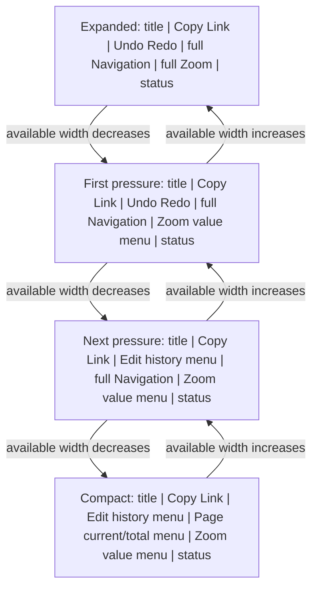
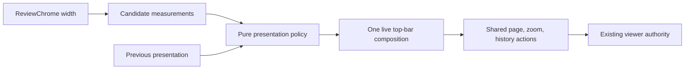
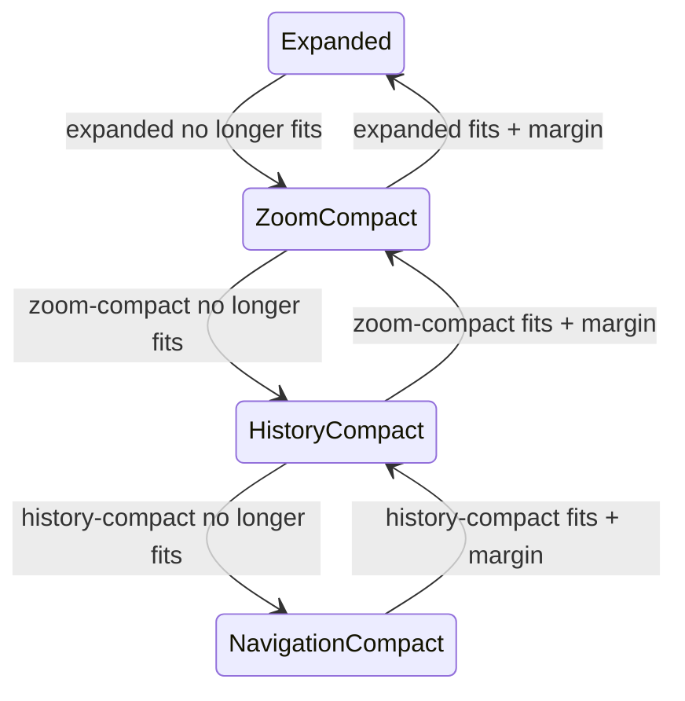
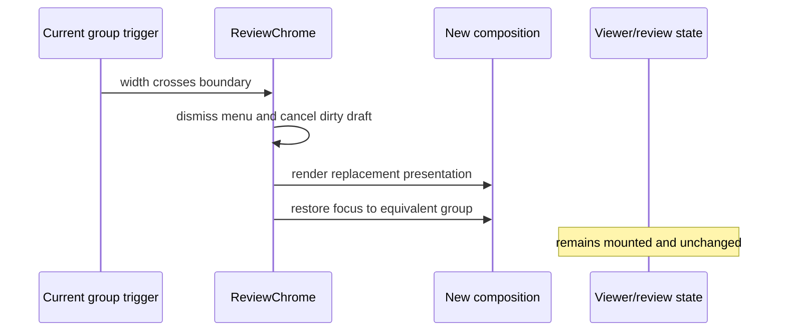

# Responsive Review Top Bar - Plan

## Goal Capsule

- **Objective:** Readers can use Placekeeper in narrow windows and embedded editor columns without the top bar consuming extra PDF reading space or hiding their page context.
- **Means:** Progressively collapse semantic control groups into compact menus as the top bar loses available width.
- **Product authority:** This work owns responsive top-bar presentation and grouped-control interaction while preserving existing document, page, zoom, history, workspace, and review behavior.
- **Open blockers:** None.

---

## Product Contract

### Summary

Keep the review top bar one fixed-height row at every supported width.
Preserve direct controls while they fit, then progressively collapse Zoom, Edit history, and Document navigation into compact group menus that retain live page and zoom context.

### Problem Frame

The current narrow layout changes the top bar from fixed height to automatic height, moves all viewer controls to a second row, and permits that row to wrap.
This consumes vertical reading space and creates unstable control hierarchy in narrow browser windows and VS Code editor columns.

### Key Decisions

- **Use progressive semantic collapse.** (session-settled: user-directed — chosen over one all-at-once breakpoint and permanently split paging controls: preserve direct access for as long as space permits.) Governs R1-R4.
- **Represent compact Navigation and Zoom by their live values.** Keep current page, total pages, and zoom visible on the top line. Governs R5-R7.
- **Delay Edit history compression until its width is needed.** (session-settled: user-directed — chosen over collapsing Edit history first into either a tiny palette or a labeled menu: keep direct actions until the width saving is necessary.) Governs R3, R12.
- **Reuse the existing visual and interaction language.** Extend the established Warm Neutral top-bar and document-menu grammar rather than introducing a second dropdown system. Governs R12-R19.

### Responsive Composition

### Requirements

**Responsive structure**

- R1. The review top bar remains one fixed-height row and never wraps controls onto another line.
- R2. The bar selects its presentation from its own available width and collapses a group before controls overlap, clip, or displace the document identity and trailing status.
- R3. As width decreases, Zoom collapses first, Edit history second, and Document navigation last; increasing width restores groups in reverse order.
- R4. Responsive transitions remain stable near each boundary so small layout changes do not make groups flicker between presentations.

**Top-line context**

- R5. Compact Navigation displays the current page and total pages in the existing `current / total` form.
- R6. Compact Zoom displays the current whole zoom percentage.
- R7. Unavailable page or zoom state remains visible as `— / —` or `—%` and does not expose unavailable editing.
- R8. Compact group triggers omit redundant carets and generic `Page` or `Zoom` labels while retaining clear accessible names and tooltips.
- R9. The document title, Copy Link, and agent-context status retain their existing top-line roles; the title truncates before any control group wraps.

**Grouped menus**

- R10. The Navigation menu contains one compact page row with Previous, editable current page, total pages, and Next, followed by Back and Forward in reading history.
- R11. The Zoom menu contains one compact row with Zoom out, editable percentage, and Zoom in, followed by Fit Width.
- R12. The Edit history menu is a compact two-icon palette containing Undo and Redo, with labels supplied through accessible names and tooltips.
- R13. Each menu disables unavailable actions individually without removing them or changing the menu's layout.
- R14. Only one top-bar menu is open at a time, and each menu remains visually anchored to its trigger within the visible viewport.

**Interaction and continuity**

- R15. Previous, Next, Zoom out, Zoom in, Undo, and Redo keep their menu open so readers can repeat the action while watching the PDF update; Undo and Redo refresh their availability after each operation and retain focus while the activated action remains enabled.
- R16. A valid direct page or zoom commit and Fit Width close the menu; Escape and outside activation dismiss it without changing the document.
- R17. Keyboard users can open, traverse, operate, and dismiss every grouped menu, with focus returning to the surviving trigger after dismissal.
- R18. If a responsive transition replaces an open menu's trigger, the menu closes without running an action and focus moves to the equivalent surviving group control.
- R19. Responsive transitions preserve the mounted viewer, current page, zoom, scroll position, review items, active authoring state, and workspace presentation.

**Visual language**

- R20. The bar retains the current Warm Neutral 58 px height, compact control scale, color roles, borders, radii, focus treatment, and coarse-pointer sizing.
- R21. Group menus use the existing floating panel surface, restrained shadow, compact spacing, selected-trigger treatment, and disabled-state treatment.

### Key Flows

- F1. Compress the top bar
  - **Trigger:** Available top-bar width decreases while a PDF is open.
  - **Steps:** The least costly eligible group collapses before collision; subsequent pressure advances through the defined collapse order.
  - **Outcome:** The bar remains one row, the PDF keeps its vertical reading area, and live page and zoom context remain visible.
  - **Covers:** R1-R9, R19-R21.
- F2. Navigate from the compact bar
  - **Trigger:** A reader opens the `current / total` Navigation trigger.
  - **Steps:** The reader steps pages repeatedly, enters a page directly, or chooses Back or Forward in reading history.
  - **Outcome:** The existing navigation action runs with the grouped menu behavior defined for that action.
  - **Covers:** R5, R7-R10, R13-R17.
- F3. Adjust zoom from the compact bar
  - **Trigger:** A reader opens the percentage Zoom trigger.
  - **Steps:** The reader steps zoom repeatedly, enters an exact percentage, or chooses Fit Width.
  - **Outcome:** The existing zoom action runs and the top-line value continues to reflect viewer-published state.
  - **Covers:** R6-R8, R11, R13-R17.
- F4. Use compact edit history
  - **Trigger:** A reader opens Edit history after that group has collapsed.
  - **Steps:** The reader chooses an available Undo or Redo action from the two-icon palette.
  - **Outcome:** The existing history action runs once and unavailable sibling actions remain visibly disabled.
  - **Covers:** R12-R17.
- F5. Resize during an open menu
  - **Trigger:** Available width crosses a presentation boundary while a grouped menu is open.
  - **Steps:** The open menu dismisses and the bar adopts the new stable presentation.
  - **Outcome:** No viewer or review state changes, and keyboard focus remains on the equivalent control group.
  - **Covers:** R2-R4, R18-R19.

### Acceptance Examples

- AE1. One-row narrow layout
  - **Covers R1-R4, R9, R20.**
  - **Given:** A PDF is open and the review surface narrows below the space needed for all expanded controls.
  - **When:** The bar reaches each responsive boundary.
  - **Then:** Its height remains 58 px, no control wraps or clips, and groups follow the defined collapse order.
- AE2. Compact reading context
  - **Covers R5-R9.**
  - **Given:** The bar is in its compact presentation on page 3 of a 12-page PDF at 125% zoom.
  - **When:** The reader views the top bar without opening a menu.
  - **Then:** `3 / 12` and `125%` remain visible beside the truncated document identity without redundant labels or carets.
- AE3. Repeated page stepping
  - **Covers R10, R13-R17.**
  - **Given:** The Navigation menu is open on page 3 of 12.
  - **When:** The reader activates Next three times.
  - **Then:** The PDF reaches page 6, the live menu value updates after each viewer publication, and the menu remains open with focus on Next.
- AE4. Direct page entry
  - **Covers R7, R10, R13, R16-R17.**
  - **Given:** The Navigation menu is open and page navigation is ready.
  - **When:** The reader enters a valid page and commits it.
  - **Then:** The existing direct navigation runs once, the menu closes, and focus returns to the Navigation trigger displaying the resulting page.
- AE5. Repeated zoom and Fit Width
  - **Covers R6-R8, R11, R13-R17.**
  - **Given:** The Zoom menu is open at 125%.
  - **When:** The reader steps zoom twice and then chooses Fit Width.
  - **Then:** The step actions keep the menu open, Fit Width runs once and closes it, and the top-line percentage reflects the viewer's resulting published zoom.
- AE6. Honest unavailable state
  - **Covers R7, R13.**
  - **Given:** Page or zoom capability is not ready.
  - **When:** The corresponding compact group is shown.
  - **Then:** Its unavailable value remains visible, and actions that require the missing capability are disabled with the existing readiness explanation.
- AE7. Boundary stability
  - **Covers R2-R4.**
  - **Given:** The top bar is near a responsive boundary while a tray is resized by a few pixels in each direction.
  - **When:** Available width fluctuates without materially changing which presentation fits.
  - **Then:** The visible control groups do not oscillate between expanded and compact states.
- AE8. State-preserving transition
  - **Covers R18-R19.**
  - **Given:** A reader has an open annotation editor, a non-default zoom, a current page, and a visible workspace tray.
  - **When:** Resizing crosses one or more top-bar presentation boundaries.
  - **Then:** The top bar recomposes without remounting the viewer or changing the annotation, page, zoom, scroll, or workspace state.
- AE9. Keyboard dismissal
  - **Covers R14, R16-R18.**
  - **Given:** A grouped menu was opened from the keyboard.
  - **When:** The reader presses Escape or a resize replaces its trigger.
  - **Then:** No menu action runs, the menu closes, and focus returns to the equivalent surviving group control.

### Scope Boundaries

- Do not create a generic overflow menu or combine unrelated control groups.
- Do not add a second toolbar row or allow the bar height to respond to wrapped content.
- Do not change the meaning, source of truth, validation, or readiness behavior of page, zoom, history, Fit Width, Copy Link, document actions, or agent context.
- Do not redesign the document-title menu, workspace tray, contextual annotation controls, PDF canvas, or keyboard shortcuts.
- Do not add new zoom presets, navigation modes, or history behavior.

### Dependencies and Assumptions

- Current viewer-published page and zoom state remains the sole authority for displayed values.
- Existing semantic groups remain Edit history, Document navigation, and PDF zoom.
- Existing responsive continuity contracts remain authoritative for preserving viewer and workspace state.
- The same responsive product behavior applies in the standalone web surface and the fully embedded VS Code review surface.

### Outstanding Questions

None. Planning resolves fit from rendered candidate widths, uses a 24 px restoration margin, and keeps one presentation owner in `ReviewChrome`.

### Sources and Research

- `apps/web/src/review/ReviewChrome.tsx` establishes the three current control groups, live page and zoom editors, document identity, Copy Link, and trailing context status.
- `apps/web/src/app/review-layout-responsive.css` establishes the current narrow behavior that creates an automatic-height second row and wrapping controls.
- `apps/web/src/app/review-layout-foundation.css` establishes the 58 px bar, compact control sizing, and Warm Neutral tokens.
- `apps/web/src/review/DocumentActionsMenu.tsx` and `apps/web/src/app/review-layout.css` establish the existing anchored menu, dismissal, focus, and floating-surface patterns.
- `docs/plans/2026-08-10-001-feat-editable-page-navigation-plan.md` and `docs/plans/2026-08-11-001-feat-editable-zoom-fit-width-plan.md` establish current direct page and zoom behavior.
- `docs/solutions/architecture-patterns/adaptive-annotation-tray-framing.md` establishes responsive viewer and review-state continuity requirements.

---

## Planning Contract

The Product Contract above is preserved. Planning clarifies the previously unspecified Undo/Redo menu lifetime as a repeat-action behavior, without changing the settled responsive composition, flows, acceptance outcomes, or scope boundaries.

### Key Technical Decisions

- **KTD1 — Choose presentation from measured candidate widths.** `ReviewChrome` owns a pure four-state policy that receives available width, the rendered width required by each presentation, and the previous presentation. It may collapse multiple levels immediately; it restores one or more levels only when the candidate fits with a 24 px margin. This implements the session-settled progressive-collapse decision in R1-R4 without viewport breakpoints.
- **KTD2 — Measure every presentation without mounting duplicate behavior.** One inert, `aria-hidden` sizing rack renders the four visual compositions for measurement while the live row renders exactly one interactive composition. A `ResizeObserver`, font readiness signal, and animation-frame coalescing update widths; invalid or zero samples are ignored and equal measurements do not cause state updates. The live row uses NavigationCompact until the available width and every candidate width are valid, then publishes the measured state before paint.
- **KTD3 — Keep one interaction authority.** Page and zoom drafts, validation, IME behavior, action readiness, and viewer-published values remain single state paths in `ReviewChrome`; direct and grouped presentations are projections of those paths, not copies.
- **KTD4 — Coordinate all top-bar menus.** `ReviewChrome` owns the active top-bar menu, including the existing document-title menu. Group menus use the established anchored-surface placement and Warm Neutral menu grammar, and the document menu gains a controlled open-state seam without changing export or Open Annotations behavior. A pending export keeps exclusive ownership of the document menu; attempts to open another grouped menu are ignored until it settles, preserving the existing non-dismissible pending state and the one-menu contract.
- **KTD5 — Make presentation replacement explicit.** Crossing a boundary closes a replaced menu, cancels any uncommitted page or zoom draft, and moves focus to a labelled programmatic anchor for the same semantic group in the replacement presentation. Every expanded and compact group exposes such an anchor independent of action readiness; expanded group containers use programmatic-only focus. The shell treats an open top-bar menu as the owner of Escape so tray state is not changed.
- **KTD6 — Give the row explicit geometry ownership.** Replace the narrow two-row rule with a 58 px, non-wrapping, asymmetric layout: document identity may shrink and ellipsize; semantic controls and trailing status keep intrinsic dimensions. Rendered geometry at 320 px is the minimum supported contract, including coarse-pointer controls.

### High-Level Technical Design

The sketches describe responsibility and lifecycle, not exact component APIs.

### Assumptions

- The supported narrow-width floor is 320 px, matching existing acceptance and visual coverage.
- The 24 px restore margin is shared with the repository's existing adaptive-framing convention; required widths remain rendered measurements rather than constants.
- “Only one top-bar menu” includes the document-title menu.
- Undo and Redo are repeat actions: their compact palette stays open and refreshes availability after each operation.
- A pending document export temporarily owns the menu layer; compact group menus cannot open until it settles.
- No external dependency, persisted-data change, or feature flag is required.

### Risks and Mitigations

- **Measurement feedback loops:** Candidate measurements are inert, width-stable, coalesced, and ignored when unchanged; the pure policy is unit-tested at exact boundaries.
- **Focus loss during recomposition:** Track the logical group, not a disappearing element, and restore focus only after the replacement mounts.
- **Duplicate or divergent editing state:** Both presentations call shared handlers and render from the same drafts and viewer snapshot.
- **Portal styling drift:** Reuse the established anchored-surface tokens with explicit fallbacks where a body portal cannot inherit review-root variables.
- **Installed VS Code bundle drift:** Rebuild the web bundle before embedded acceptance and reinstall only from the verified branch artifact.

---

## Implementation Units

### U1 — Measured presentation policy

- **Files:** `apps/web/src/review/review-chrome-layout.ts` (new), `apps/web/src/review/use-review-chrome-layout.ts` only if it materially separates observation lifecycle from `ReviewChrome`, `apps/web/test/review-chrome-layout.test.ts` (new).
- **Requirements:** R1-R4, R9, R20; AE1, AE7.
- **Dependencies:** None.
- **Approach:** Implement KTD1 and KTD2 as a pure ordered policy plus a small measurement adapter. Represent all four states explicitly, support multi-level collapse, require the restoration margin only when expanding, and expose the selected state through a stable data attribute.
- **Patterns:** Follow `viewer-framing.ts` for pure hysteresis and `use-annotation-tray-framing.ts` for element-owned observation.
- **Test scenarios:**
  - Given initialization or collapse from an equally or less compact state, each exact fit and one-pixel-under case selects the least-collapsed fitting state in the required Zoom → Edit history → Navigation order (AE1).
  - Given a compact previous state, width below the candidate plus 24 px does not expand; reaching that margin expands without oscillation (AE7).
  - Given a width too small for intermediate states, the policy jumps directly to the most compact fitting state and never returns an invalid state.
  - Given unchanged observations, the adapter does not publish redundant layout updates.
  - Given missing or zero candidate measurements, the row remains NavigationCompact; once all values are valid, it selects the measured presentation before paint.
- **Verification:** Focused unit suite passes and covers every transition edge in both directions.

### U2 — Shared anchored top-bar menu behavior

- **Files:** `apps/web/src/review/ReviewChrome.tsx`, `apps/web/src/review/menu-focus.ts`, `apps/web/src/review/DocumentActionsMenu.tsx`, a focused reusable top-bar menu component under `apps/web/src/review/`, `apps/web/test/review-layout.test.tsx`.
- **Requirements:** R8, R12-R18, R21; AE3-AE6, AE9.
- **Dependencies:** U1 supplies stable presentation identities and replacement signals.
- **Approach:** Implement KTD4 by centralizing active-menu identity in `ReviewChrome`, making the document menu controllable, and extracting only the placement/focus lifecycle needed from the existing popover precedent. Extend focus traversal to include enabled buttons and editable inputs while retaining truthful `aria-expanded`, menu ownership, tooltips, Escape, outside dismissal, Tab boundaries, and opener-focus return. Arrow/Home/End roving applies only when a non-editable menu action owns the event; page and zoom inputs retain native editing keys. Tab follows DOM order, commits through existing blur behavior when valid, and closes only when focus leaves the menu.
- **Patterns:** Preserve `DocumentActionsMenu` keyboard conventions, `LinkActionPopover` viewport clamping and disconnected-opener fallback, and the native tooltip contract.
- **Test scenarios:**
  - Opening Navigation, Zoom, Edit history, or document actions closes any other top-bar menu and updates expanded-state relationships correctly (R14).
  - Keyboard opening focuses the first enabled interactive item; arrows/Home/End and Tab traverse actionable buttons and inputs; Escape closes only the menu and returns focus (AE9).
  - Outside activation dismisses without executing an action, including WebKit's null-related-target path (R16).
  - A menu near every viewport edge stays visible and anchored while its trigger remains connected (R14).
  - Disabled actions remain present, keep their layout position, and cannot fire (AE6).
  - While document export is pending, grouped-menu activation is ignored, the pending menu remains visible, and normal menu arbitration resumes after settlement.
- **Verification:** Component and real-browser interaction checks pass in Chromium and WebKit.

### U3 — Progressive control compositions and state continuity

- **Files:** `apps/web/src/review/ReviewChrome.tsx`, `apps/web/src/app/ReviewShell.tsx`, `apps/web/test/review-layout.test.tsx`, `test/acceptance/review-workflow.spec.ts`.
- **Requirements:** R1-R19; F1-F5; AE1-AE9.
- **Dependencies:** U1 and U2.
- **Approach:** Implement KTD3 and KTD5. Render expanded or grouped controls from one page/zoom/history action model. Preserve expanded ordering, use the specified compact menu ordering, keep repeated step actions open, close after valid direct commits and Fit Width, and preserve all existing readiness and validation behavior. Give every semantic group a labelled `tabIndex=-1` focus anchor in expanded form and use the compact trigger as its compact anchor. Add the shell-level Escape exemption for open top-bar menus.
- **Patterns:** Reuse the current page/zoom handlers and `ViewerControlsSnapshot`; follow outline-aware presentation for focus revalidation when rendered controls change.
- **Test scenarios:**
  - At successively narrower measured widths, Zoom, then Edit history, then Navigation collapse; widening reverses that order (AE1).
  - Compact triggers display `3 / 12` and `125%` with no redundant labels or carets, and unavailable state displays non-editable em dashes (AE2, AE6).
  - Three Next activations keep Navigation open, move page 3 to page 6, update the value, and retain focus on Next (AE3).
  - Valid page or zoom entry commits once and closes; invalid entry stays editable with existing error semantics; IME composition does not commit early (AE4).
  - Repeated zoom steps stay open; Fit Width runs once after settled geometry and closes (AE5).
  - Resizing an open menu or active top-bar page or zoom editor closes/cancels it, focuses the same semantic group's programmatic anchor, and leaves annotation, viewer, page, zoom, scroll, and workspace state unchanged (AE8, AE9).
- **Verification:** Focused layout tests and the review workflow acceptance suite prove interaction parity and focus behavior.

### U4 — Fixed-height responsive styling

- **Files:** `apps/web/src/app/review-layout-foundation.css`, `apps/web/src/app/review-layout-responsive.css`, `apps/web/src/app/review-layout.css`, `test/acceptance/review-visual.spec.ts` and affected snapshots.
- **Requirements:** R1-R2, R8-R9, R14, R20-R21; AE1-AE2.
- **Dependencies:** U2 and U3 establish final markup and state hooks.
- **Approach:** Implement KTD6. Remove the narrow auto-height/wrapping rule; define shrink ownership, fixed control dimensions, compact group alignment, selected-trigger state, and anchored menu styling with existing Warm Neutral tokens. Keep document identity ellipsized and controls single-line at 320 px and coarse-pointer sizing.
- **Patterns:** Follow the reliable compact reference-tabs solution for explicit flex/grid minimums and rendered geometry checks.
- **Test scenarios:**
  - At 320, 390, 520, 760, and wide widths, the top bar measures 58 px, has one row, contains every visible control inside its bounds, and does not overlap the title or status (AE1).
  - A long PDF title ellipsizes before semantic groups shrink or wrap (R9).
  - Open menus match existing surface colors, radii, borders, shadow, spacing, focus, and disabled states in light and supported themed contexts (R20-R21).
  - Coarse-pointer controls meet the existing 44 px target contract without increasing bar height (R20).
  - Extremely large current/total page values are measured as content and still select a presentation whose controls stay within the 320 px bar.
- **Verification:** Rendered geometry assertions pass before approved visual baselines are updated.

### U5 — Production and embedded continuity coverage

- **Files:** `test/acceptance/production-flow.spec.ts`, `test/acceptance/review-workflow.spec.ts`, `test/acceptance/review-visual.spec.ts`, affected snapshots and harness helpers only as needed.
- **Requirements:** R2-R4, R14-R21; F1-F5; AE1-AE9.
- **Dependencies:** U1-U4.
- **Approach:** Extend real-PDF and embedded-style coverage across every presentation. Rebuild production assets before installed-style checks, wait on committed zoom rather than visual transforms, and assert viewer mount identity and workspace state through resize transitions.
- **Test scenarios:**
  - A real PDF retains viewer mount identity, scroll position, current page, committed zoom, open annotation authoring, and tray presentation through a wide-to-compact-to-wide sweep (AE8).
  - Chromium and WebKit can operate all compact menus at 320 px with first-activation success, correct dismissal, and no viewport clipping (AE3-AE6, AE9).
  - A width oscillation around each measured boundary does not flicker and never produces a two-line bar (AE1, AE7).
  - The rebuilt VS Code-compatible web bundle exposes the same compact states and interactions as standalone web (R19-R21).
- **Verification:** Production, WebKit, and visual suites pass against freshly built assets; installed extension smoke testing follows before handoff.

---

## Verification Contract

| Layer | Command | Proves |
| --- | --- | --- |
| Types | `pnpm typecheck` | New presentation and controlled-menu contracts are type-safe. |
| Policy and component | `pnpm exec vitest run apps/web/test/review-chrome-layout.test.ts apps/web/test/review-layout.test.tsx apps/web/test/control-tooltips.test.ts` | Collapse priority, hysteresis, menu semantics, and tooltip coverage. |
| Review interactions | `pnpm exec playwright test test/acceptance/review-workflow.spec.ts` | Responsive grouping, drafts, focus, dismissal, and repeated actions in Chromium. |
| Production PDF | `pnpm fixtures:pdf && pnpm build:web && pnpm exec playwright test test/acceptance/production-flow.spec.ts` | Real viewer state continuity and freshly built production behavior. |
| WebKit parity | `pnpm build:web && pnpm exec playwright test --config playwright.webkit.config.ts test/acceptance/review-workflow.spec.ts test/acceptance/production-flow.spec.ts` | Menu and focus behavior in the VS Code-relevant browser engine. |
| Visual and geometry | `pnpm test:visual` | Fixed-height layouts and approved responsive appearances. |
| Regression | `pnpm test:review` | Complete review-surface regression contract. |

Manual installed-extension smoke check: install the freshly packaged branch build, open the multi-page fixture in the VS Code Extension Development Host, resize through all four presentations, exercise each menu, and verify PDF/LaTeX navigation still works in both directions.

---

## Definition of Done

- Every R1-R21 requirement and AE1-AE9 example is implemented or directly covered by automated verification.
- The top bar remains 58 px and one line at every tested width down to 320 px, including coarse-pointer sizing.
- Collapse and restoration follow the settled Zoom → Edit history → Navigation order with measured fit and stable hysteresis.
- Direct and compact controls share page, zoom, history, readiness, validation, and focus behavior; no duplicate state path remains.
- All top-bar menus coordinate as one family, remain viewport-safe, and pass keyboard, Escape, outside-dismissal, and focus-return checks in Chromium and WebKit.
- Responsive transitions do not remount the viewer or change PDF, annotation, authoring, scroll, or workspace state.
- The obsolete narrow two-row/wrapping CSS and any superseded selectors or test expectations are removed.
- Production assets and the VS Code extension are rebuilt from the final branch before manual smoke testing.
- The Verification Contract passes, visual changes are intentionally baselined, and the existing pull request contains the complete atomic change.
