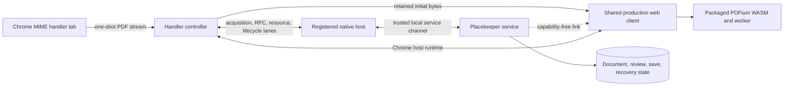
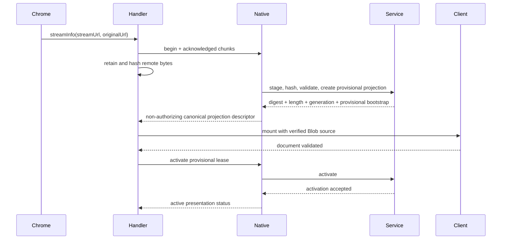
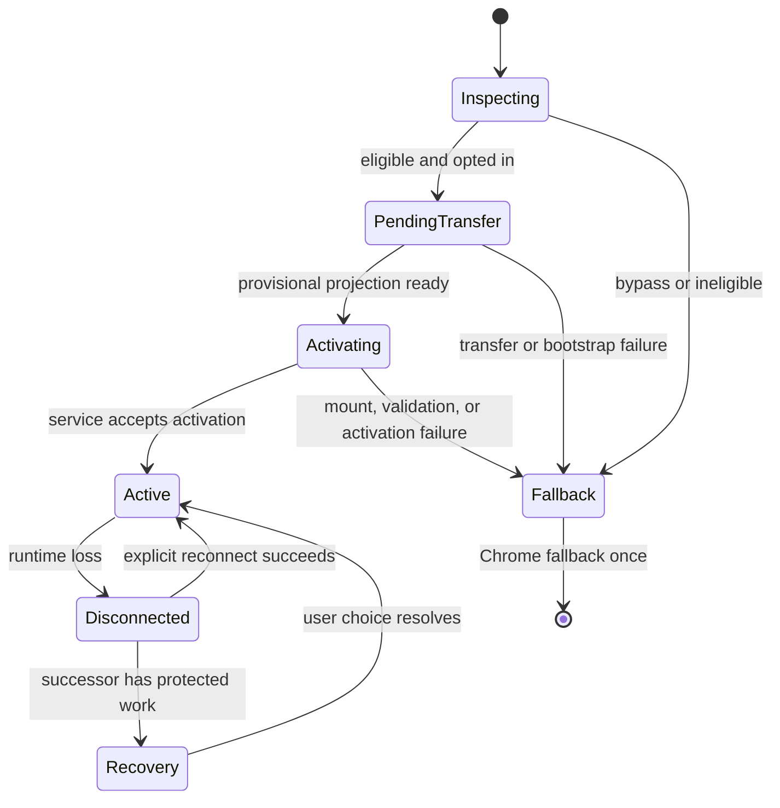
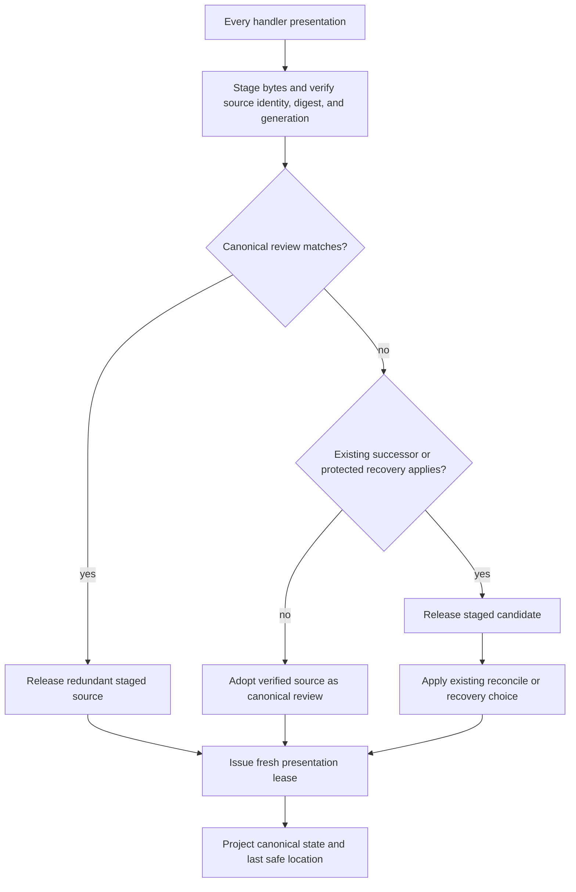
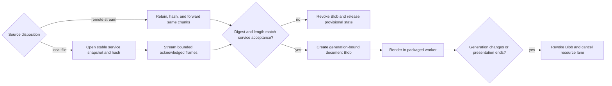
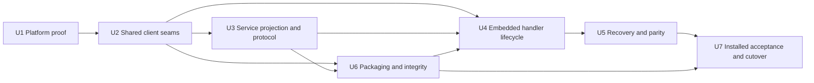

# Embedded Chrome PDF Review - Plan

## Goal Capsule

**Objective:** A top-level PDF opened in Chrome can become a complete Placekeeper review in that same tab, with the original PDF URL still visible and with the same durable review behavior as the app and VS Code surfaces.

**Means:** Run the shared production review client inside the Chrome MIME-handler page and connect it to the Placekeeper service through a Chrome-specific native-messaging runtime (KTD1, KTD2).

**Product authority:** The Product Contract owns user-visible behavior. The prior Chrome default-viewer plan owns activation, acquisition, temporary-source, and fallback behavior unless this plan explicitly supersedes its visible redirect. The service remains authoritative for document identity, review state, persistence, recovery, and canonical Placekeeper links.

**Execution profile:** Deep, security-sensitive, cross-surface implementation. Execute the units in dependency order. Use characterization and protocol tests before changing the active Chrome path.

**Stop conditions:** Stop and revise the plan if installed Chrome cannot expose the PDF metadata title while retaining the original URL, if a packaged PDFium worker cannot satisfy Manifest V3 policy and the required privilege-isolation probe, or if the native bridge cannot meet the large-document acceptance gate without a broader localhost permission. Installed Chrome 152 proved that a MIME-handler reload receives a fresh Navigation API entry, fresh session storage, `navigate` timing, and a different reported tab lease, so handler-local per-tab identity is unavailable without the warning-bearing `webNavigation` permission. The user selected canonical service-owned review identity instead: the same verified source and digest resumes one semantic review across reloads, reopens, and duplicate tabs. Do not add browsing-history or localhost permissions, substitute URL-only identity, silently fork canonical work, weaken R2, or move service authority into the extension.

**Tail ownership:** The implementer owns installed-artifact verification, security regression coverage, documentation, and removal of the superseded redirect path.

## Product Contract

### Summary

Replace the Chrome handoff's visible localhost navigation with the full shared Placekeeper client inside the MIME-handler page. Keep native ingestion and the Placekeeper service as the trusted backend. Give Chrome the ordinary review capabilities users expect without giving it Codex task authority or changing Finder, app, Codex, or VS Code presentation.

### Problem Frame

The current Chrome extension successfully intercepts a PDF and transfers it to Placekeeper, but then replaces the source tab with a loopback server URL. That transition feels less native than the embedded VS Code review surface, loses the source URL from the address bar, and creates a visibly different review experience for the same product.

The VS Code work established a shared production client and an embedded-host runtime boundary. Chrome can reuse that architecture, but its MIME-handler lifecycle, exact-once PDF stream, Manifest V3 policy, reload behavior, and native-messaging limits require a Chrome-specific host implementation.

### Key Decisions

- **Render the complete Placekeeper review in the original Chrome PDF tab.** The user should not see a loopback navigation in the normal path. Governs R1-R3, R7-R9. (session-settled: user-approved — chosen over the existing localhost redirect: the embedded experience is cleaner and preserves the source URL)
- **Preserve service-owned review behavior across surfaces.** Chrome is a presentation host, not a second review backend. Governs R3-R6, R10-R15. (session-settled: user-approved — chosen over a standalone extension viewer: full Placekeeper behavior and recovery must remain consistent)
- **Limit this change to top-level Chrome PDFs.** Embedded PDFs and other Placekeeper launch surfaces keep their current behavior. Governs R1, R16, R18. (session-settled: user-approved — chosen over a broad viewer migration: the request is specifically the Chrome default-PDF flow)
- **Use canonical service-owned review identity.** Every presentation of the same verified source identity and PDF digest joins one semantic review; reloads, reopens, and duplicate tabs are synchronized presentations rather than browser-identified forks. Governs R5, R7-R9, R15. (session-settled: user-approved — chosen after installed Chrome disproved handler-local navigation identity; preferred over the warning-bearing `webNavigation` permission and repetitive resume prompts)

### Requirements

#### In-tab review experience

- R1. When automatic opening is enabled, an eligible top-level PDF renders the shared Placekeeper production client in the intercepted Chrome tab without replacing the original PDF URL.
- R2. The Chrome tab title uses a non-blank PDF metadata title when available and otherwise uses the source filename.
- R3. The Chrome surface supports ordinary Placekeeper reading, navigation, search, annotations, reconciliation, save-a-copy, export, and recovery behavior through the shared client.
- R4. The pending shell shows the sanitized filename before document metadata is available, and the active client updates the title when the document generation changes.

#### Authority and isolation

- R5. The Placekeeper service remains authoritative for source validation, document identity, session state, mutations, save coordination, canonical links, and protected recovery.
- R6. The Chrome surface receives no Codex task identity, bind proof, reconnect authority, source-workspace root, SyncTeX capability, or ability to create or renew a task binding.
- R7. A Chrome review can observe service-owned changes to the same review, but each tab has an independent presentation connection and credential lifetime.

#### Navigation, identity, and links

- R8. Reloading, restoring, reopening, or duplicating a Chrome PDF joins the canonical semantic review only after the service verifies both source identity and the ingested PDF digest.
- R9. Each Chrome tab receives an independent presentation lease and transient viewport over the canonical review. Concurrent tabs observe the same service-owned mutations, while a changed source generation or digest is reconciled or adopted under the existing successor rules rather than silently conflated.
- R10. Placekeeper Back and Forward traverse semantic document locations inside the client, while browser Back leaves the PDF and the address-bar URL and fragment remain unchanged.
- R11. Copy Link produces a capability-free canonical `placekeeper://` link for the current semantic location without exposing the source URL, presentation identity, session credential, or task data.

#### Acquisition, failure, and recovery

- R12. The extension consumes Chrome's one-shot PDF stream exactly once, preserves the existing remote-temporary source policy, and never refetches the original URL.
- R13. Before activation commits, bypass or failure drains or cancels owned transfer work, revokes unclaimed service state, and invokes Chrome's native PDF fallback at most once.
- R14. After activation, connection failures never fall back to Chrome. Before the first accepted mutation or save, the PDF remains visible but read-only and offers Reconnect or Reopen without retaining protected draft state. After the first accepted mutation or save, the same actions retain protected recovery.
- R15. Service replacement, extension reload, or browser restart never silently discards, duplicates, or forks protected work. A matching verified source resumes its canonical review; conflicting successors use the existing explicit recovery choices.

#### Activation and distribution

- R16. The existing opt-in toggle, top-level-only eligibility, temporary bypass, Chrome 151 minimum, native-host requirement, and safe pause behavior remain in force.
- R17. The installed Chrome artifact contains the same production client, styles, PDF engine assets, and compatible runtime contract as the server-hosted and VS Code artifacts.
- R18. Finder, app, Codex in-app browser, canonical Placekeeper links, and VS Code keep their existing launch and presentation behavior.

### Key Flows

- F1. **First open:** Chrome identifies an eligible top-level PDF, the handler consumes the stream once, the native host validates and adopts it, the service creates a Chrome projection, and the embedded client validates the document before the controller commits active presentation. Covers R1-R7, R12-R13, R16-R17.
- F2. **Pre-commit failure:** Any failure through ingestion, service bootstrap, shared-client mount, or document validation releases unclaimed state and invokes the bounded Chrome fallback. Covers R13.
- F3. **Reload, restore, reopen, or duplicate:** Every presentation stages and verifies its source independently, then joins the canonical review only when source identity and digest match. Each tab receives a fresh presentation lease; changed bytes follow the existing reconciliation or successor path. Covers R7-R9, R12.
- F4. **Active disconnect:** The client keeps the PDF visible but read-only and offers explicit Reconnect or Reopen behavior without Chrome fallback. It retains protected draft recovery only after the first accepted mutation or save. Covers R14-R15.
- F5. **Semantic navigation:** Placekeeper navigation updates internal location state and Copy Link output without mutating the browser URL. Covers R10-R11.

### Acceptance Examples

- AE1. Given a PDF whose metadata title is `Quarterly Results`, opening it from a normal HTTPS page leaves that URL in the address bar and sets the Chrome tab title to `Quarterly Results` after activation. Covers R1-R4.
- AE2. Given a PDF with blank or malformed title metadata, activation sets the tab title to the decoded, sanitized filename and keeps it stable across review navigation. Covers R2, R4, R10.
- AE3. Given native-host failure before the client validates the document, the handler opens Chrome's PDF viewer once and leaves no claimable Placekeeper bootstrap or temporary transfer. Covers R13.
- AE4. Given a daemon disconnect after activation, the tab stays read-only and offers Reconnect or Reopen without falling back to Chrome. If the service accepted an annotation or save first, the draft remains protected after the daemon returns. Covers R14-R15.
- AE5. Given an active review, reload, browser-session restore, duplication, or opening the same verified PDF in a new tab joins the same semantic review after source-and-digest verification, while each tab receives a distinct presentation lease. Covers R7-R9.
- AE6. Given several Placekeeper page jumps, browser Back returns to the page visited before the PDF and Placekeeper Back traverses the document locations. Covers R10.
- AE7. Given a Chrome review with no Codex task, Copy Link opens as an ordinary Placekeeper view in Finder or Codex and does not bind the receiving task. Covers R6, R11, R18.
- AE8. Given a protected temporary-source draft after service replacement, Reopen presents the existing resume, discard, or fork decision and applies exactly one valid idempotent choice. Covers R14-R15.

### Scope Boundaries

#### In scope

- The installed macOS Chrome extension and native host.
- A Chrome-specific runtime projection of the shared production client.
- Protocol, recovery, packaging, security, and installed-browser verification required by R1-R18.
- Removal of the normal-path redirect after the embedded path passes its gates.

#### Deferred to follow-up work

- Chrome Web Store publication and store-managed installation.
- A broader installer or onboarding redesign beyond documenting and validating the bundled extension.
- Direct loopback document transport, considered only if measured native transport fails the performance gate and a separate security decision approves the permission expansion.

#### Outside this product's identity

- Intercepting embedded `<iframe>` or object PDFs.
- Supporting other Chromium browsers or Firefox in this work.
- Replacing Finder, app, Codex, canonical-link, or VS Code presentation with an extension page.
- Adding Codex evidence, task binding, source-workspace, or SyncTeX controls to Chrome.

### Sources

- Prior contract: `docs/plans/2026-08-27-1656-feat-chrome-default-pdf-viewer-plan.md`.
- Shared host pattern: `docs/solutions/architecture-patterns/shared-production-review-client-host-runtime-boundaries.md`.
- Chrome MIME handling: <https://developer.chrome.com/docs/extensions/reference/api/mimeHandler> and <https://developer.chrome.com/docs/extensions/reference/manifest/mime-types-handler>.
- Native messaging and limits: <https://developer.chrome.com/docs/extensions/develop/concepts/native-messaging>.
- Manifest V3 extension-page policy: <https://developer.chrome.com/docs/extensions/reference/manifest/content-security-policy> and <https://developer.chrome.com/docs/extensions/develop/migrate/improve-security>.
- Chrome web-navigation permission and warning: <https://developer.chrome.com/docs/extensions/reference/api/webNavigation> and <https://developer.chrome.com/docs/extensions/reference/permissions-list>.

## Planning Contract

### Key Technical Decisions

- KTD1. **Use native messaging as the Chrome runtime broker.** Keep one handler-owned port with independent acquisition, runtime-RPC, document-resource, and lifecycle lanes; the native process owns the service credential and the port stays alive for the presentation. Each lane has bounded frames, concurrency, acknowledgements, cancellation, and idle deadlines. Do not add a localhost host permission or expose service credentials to the extension. (session-settled: user-approved — chosen over a direct loopback client: the native boundary preserves least authority and avoids permission to every localhost port)
- KTD2. **Add a first-class `chrome` launch and runtime surface.** The service returns the credential-bearing provisional bootstrap only to the native process, never to a readable browser view or cookie. Chrome receives a closed, non-authorizing projection descriptor containing only verified canonical review identity, source generation, bounded display data, presentation state, and protocol state. Generalize the proven embedded RPC runtime with closed input and output schemas that expose the ordinary review subset from R3 and exclude every capability in R6.
- KTD3. **Bind every rendered byte to the service-accepted source identity.** The handler hashes and counts the exact remote chunks it retains and forwards. Service acceptance returns the expected digest, byte length, generation, and source disposition. Initial remote presentation uses the matching retained Blob; initial local presentation uses a service snapshot that is hashed from an opened file handle and streamed through the native resource lane. Reload, recovery, and successors use the same verified identity before replacing a Blob.
- KTD4. **Separate canonical semantic identity from presentation authority.** Resolve the semantic review only in the service from verified source identity, PDF digest, and generation; never use URL, Chrome tab ID, handler storage, or browser history as review identity. Every handler connection independently stages and verifies its bytes before the service issues a fresh presentation lease over the canonical review. Rotate or revoke only that presentation lease on disconnect, successor, save, recovery, or expiry; synchronized tabs retain the canonical review and observe service-owned changes.
- KTD5. **Split canonical-link generation from location history.** Inject internal Placekeeper history and a service-issued capability-free link base into the shared client instead of deriving both from `window.location` or `session.appLinkBase`.
- KTD6. **Use a service-owned provisional activation lease.** Bootstrap permits bounded reads but no mutations or saves. The handler activates the lease only after source-identity and document validation; every earlier failure releases the lease, locator candidate, and clean temporary review. After activation, every non-idempotent mutation, save, export, or recovery choice carries a service-scoped idempotency key whose payload digest and result are recorded atomically with the side effect. Retries return only that durable result, changed-payload key reuse fails closed, and disconnects enter a read-only Reconnect or Reopen state. Protected recovery begins only after the first accepted mutation or save.
- KTD7. **Isolate untrusted PDFs behind role-specific packaged resources.** Parse and render only in a packaged worker with no extension APIs and a bounded data-only protocol. Worker and WASM roles accept exact integrity-pinned extension assets; the document role accepts only a digest-and-generation-bound Blob. Reject remote, loopback, file, data, cross-extension, role-swapped, stale, or unissued resources. Keep PDF actions and automatic external-link opening disabled.
- KTD8. **Treat direct loopback transport as a gated contingency, not a hidden fallback.** Measure the native route and current redirect baseline with the same versioned local-and-remote corpus: a small text-first PDF, a representative mixed-content PDF, an image-heavy scan, a structurally complex PDF, and a valid near-64-MiB PDF. Use identical navigation-start and first-render timestamps, at least five cold-profile and ten warm-profile repetitions per fixture, and report p50 and p95 time to first page. The native route's p50 must remain within the slower of 20% or one second of the redirect baseline on the same installed profile; p95 is recorded as regression evidence. Report peak memory for the extension, native host, and service separately and in aggregate. Extension memory may add at most one PDF byte length plus 96 MiB, transient native/service buffers may add at most 32 MiB, and cancellation must release transfer resources within two seconds. A failure stops for an architecture decision that weighs a document-only loopback endpoint against Chrome's broad `http://127.0.0.1/*` permission.
- KTD9. **Preserve the prior Chrome contract except where this plan supersedes presentation.** The opt-in, exact-once stream acquisition, temporary-source ownership, save semantics, recovery authority, and bounded Chrome fallback remain; the destination URL and successful `tabs.update` redirect are removed only when U7 completes the installed cutover.
- KTD10. **Negotiate the native protocol once and forbid downgrade.** Bind the selected version and a random connection identity to the port. Keep v1 and v2 parsers and state machines separate during rolling upgrades, never return a v1 destination capability on a v2 connection, and fail closed on mid-port version changes or cross-version envelopes. A mismatch before `Active` releases provisional state and invokes Chrome fallback once; a mismatch at or after `Active` enters a read-only update-required state, preserves service recovery, and never falls back.
- KTD11. **Use per-boundary data allowlists and bounded display strings.** Acquisition and document-resource frames may carry bounded PDF bytes and the minimum source identity required by their role. Runtime RPC frames carry only closed, sanitized payloads. Private recovery storage retains only the existing minimum review and source fields under its established access controls. Chrome-facing responses, copied links, logs, diagnostics, and crash output omit every sensitive field not explicitly authorized for that sink. Filename and PDF title display removes controls and bidirectional overrides and enforces a browser-safe length while preserving ordinary Unicode.

### High-Level Technical Design

These diagrams establish boundaries and ordering. They are directional and do not prescribe exact types or function signatures.

#### Component topology

The extension owns presentation and retains initial remote bytes when Chrome supplies them. The service owns durable state and snapshots local sources. The native host is the only bridge across that trust boundary.

#### First-open sequence

No normal-path step navigates the tab or refetches `originalUrl`.

#### Presentation state machine

The commit boundary is entry to `Active`. Accepted mutations make the service state recovery-protected even if the presentation disconnects.
An active-but-clean disconnect keeps the current PDF visible and read-only with Reconnect or Reopen actions, but carries no protected draft. No state at or after `Active` transitions to Chrome fallback.

#### Canonical review resolution

No browser-local value identifies a semantic review. The native/service path validates every presentation and grants only a scoped lease over service-owned canonical state.

#### Document-resource integrity flow

No unverified bytes enter the viewer. A local path is never a substitute for a stable snapshot identity.

### System-Wide Impact

- **Shared web client:** Host runtime, history, resource, and copy-link seams become explicit. Browser and VS Code behavior must remain unchanged.
- **Service authority:** Session projection and recovery gain a `chrome` surface. The service must reject Chrome requests for agent-only commands.
- **Native protocol:** The one-shot transfer protocol becomes the acquisition lane of a long-lived, versioned runtime bridge. Service-owned aggregate quotas cap ports, requests, buffers, streams, and file descriptors across native processes; idle detach and withheld acknowledgements reclaim them.
- **Data lifecycle:** Remote PDF bytes stay temporary until the existing save flow creates a user-selected copy. Canonical review records and presentation connections follow the owning review's existing cleanup rules.
- **Distribution:** Web, VS Code, Chrome, and macOS packaging validations must agree on shared-asset versions and integrity.
- **Observability:** Diagnostics follow KTD11 and distinguish interception, ingestion, canonical resolution, activation, active disconnect, reconnect, and recovery with per-sink allowlists, event codes, safe counters, and hashes.

### Risks and Dependencies

- Chrome 151 MIME handling is a recent platform surface. U1 mitigates rollout uncertainty with a real installed-extension gate rather than ordinary extension-page emulation.
- MIME-handler title propagation may not match ordinary extension pages. U1 applies the Goal Capsule stop condition if the outer-tab title cannot meet R2.
- EmbedPDF 2.14.4 assumes an inline Blob worker. U1 must prove an upstream-supported seam or a minimal pinned dependency patch before U2 adopts it.
- Native messaging has asymmetric limits and JSON overhead. KTD1, KTD3, and U3 mitigate exhaustion with per-lane parsers, aggregate quotas, fragmentation, acknowledgements, cancellation, and the versioned KTD8 corpus and measurement protocol.
- Untrusted PDF parsing runs in a privileged extension document unless isolated. KTD7 and U6 require a packaged worker without extension APIs, a closed data-only protocol, and hostile-input coverage.
- Installed Chrome 152 replaces the MIME-handler browsing context on reload, so Navigation API state, handler session storage, performance timing, and the reported tab lease cannot distinguish reload from a fresh presentation. The selected canonical service identity avoids the warning-bearing `webNavigation` permission and makes reloads, reopens, and duplicate tabs synchronized presentations after source-and-digest verification.
- Local files can change between Chrome interception and service adoption. KTD3 and U3 require a stable snapshot digest and length before activation.
- Response loss can replay mutations, saves, exports, or recovery choices. KTD6 and U5 require service-scoped idempotency keys and results recorded atomically with each effect before retry.
- Extension updates and protocol skew invalidate loaded documents. KTD10 and U7 require an explicit upgrade matrix, recoverable state, and a version-gated rollback path.
- Privileged data can leak through broad response objects and diagnostics. KTD2, KTD7, and KTD11 require closed projections, role-specific resources, canary leak tests, and bounded display strings.

### Sequencing

U1 is a stage gate. U3 builds on U2's host-neutral protocol. U6 makes the exact shared assets available before U4 mounts them in the handler.

## Implementation Units

### U1. Prove the Chrome host constraints

**Goal:** Establish executable evidence for the platform assumptions that could invalidate the architecture.

**Requirements:** R1-R2, R8-R9, R12-R13, R16-R17.

**Dependencies:** None.

**Files:** `apps/chrome-extension/handler.html`, `apps/chrome-extension/src/handler-entry.ts`, `apps/chrome-extension/test/`, `test/acceptance/chrome-pdf-handoff.spec.ts`, `test/acceptance/chrome-performance-budget.json` (new), `test/acceptance/installed-hosts.md`, `apps/web/src/pdf/embedpdf-viewer.ts`, `apps/web/vite.production.config.ts`.

**Approach:** Add a development-only installed-extension proof harness. Verify MIME-handler title propagation, characterize the absence of durable handler-local navigation identity, prove packaged-worker startup and effective privilege isolation, and characterize acknowledged native frames. Record the user-selected canonical service identity as the replacement for per-tab attachment state. Identify an upstream-supported EmbedPDF worker seam or a minimal pinned dependency patch. Freeze the versioned KTD8 local-and-remote PDF corpus and measurement contract; capture the current-redirect baseline before cutover and run the native-route comparison in U7 after that route exists. Record only durable fixtures, budgets, and automated probes in the final diff.

**Execution note:** Characterize current redirect and fallback behavior first. Do not change the production success path in this unit.

**Test scenarios:**

- Open titled and untitled PDF fixtures through a real Chrome MIME handler and assert the outer tab URL and title.
- Reload, duplicate, go Back, freshly navigate to the same URL, terminate and relaunch Chrome with session restore, and reload the extension; characterize that the MIME-handler context supplies no durable per-tab identity and record the canonical service-owned identity decision. Later installed acceptance asserts all matching presentations join one review with distinct presentation leases.
- Start the shared PDF engine with a packaged worker under the exact extension CSP and assert no inline-worker or remote-code violation. From that exact worker context, prove `chrome.*`, extension and native messaging, loopback and remote fetch, DOM access, and executable-code loading are unavailable; fail the stage gate if any privileged path is reachable.
- Validate the versioned KTD8 local-and-remote corpus, repetition counts, latency and memory budgets, and cancellation deadline. Capture the current-redirect baseline before cutover; U7 runs the same measurements against the implemented native route and enforces the comparison gate.
- Replace, truncate, and symlink-swap a local fixture between interception and adoption; assert activation cannot bind different rendered and service-owned bytes.
- Disable the native host during the proof and assert the existing Chrome fallback fires once.

**Verification:** The platform matrix in `test/acceptance/installed-hosts.md` has reproducible title, isolation, and handler-identity evidence. The exact packaged-PDFium proof blocks viewer mounting, while the native-route KTD8 comparison remains a cutover gate after that route exists; neither may be waived.

### U2. Make the shared client host-neutral for Chrome

**Goal:** Reuse the complete production client without coupling Chrome to loopback browser history or VS Code-specific naming.

**Requirements:** R1-R6, R10-R11, R17-R18.

**Dependencies:** U1.

**Files:** `packages/core/src/review-runtime-protocol.ts`, `packages/core/test/review-runtime-protocol.test.ts`, `apps/web/src/host/runtime.ts`, `apps/web/src/host/vscode-runtime.ts`, `apps/web/src/host/runtime-document-source.ts`, `apps/web/src/app/ProductionReviewApp.tsx`, `apps/web/src/review/review-location-history.ts`, `apps/web/src/review/copy-link-model.ts`, `apps/web/src/pdf/embedpdf-viewer.ts`, `apps/web/src/production-entry.tsx`, `apps/web/test/host-runtime.test.ts`, `apps/web/test/embedpdf-viewer.test.ts`, `apps/web/test/pdf-document-title.test.ts`, `apps/vscode/src/webview-bridge.ts`, `apps/vscode/test/extension.test.ts`.

**Approach:** Generalize the embedded RPC runtime, method vocabulary, sanitizers, and trusted bridge primitives for named hosts. Add `chrome` to the compiler-visible host identity and define its closed request and response projection. Inject semantic location history, canonical-link access, and role-specific resource policy independently. Preserve centralized title logic and make the PDF engine consume a trusted worker resource without weakening browser or VS Code validation.

**Execution note:** Add contract tests before changing `ProductionReviewApp` call sites. Keep server-hosted and VS Code snapshots and behavior stable.

**Test scenarios:**

- Mount the shared app with browser, VS Code, and Chrome runtime fixtures; assert each receives only its allowed capabilities.
- Navigate within a Chrome fixture and assert internal Back/Forward changes semantic location without changing `window.location`.
- Generate a Copy Link from Chrome and assert it is canonical and capability-free even though address-bar history is disabled.
- Resolve metadata title, blank title, and document-generation replacement through all hosts.
- Reject a Chrome resource URL that is remote, loopback, or outside the packaged extension asset set.
- Inject forbidden paths, credentials, bind proofs, task state, headers, executable authorities, and raw errors into each Chrome response class; assert sanitization or fail-closed rejection.

**Verification:** The new `pnpm test:chrome-runtime`, `pnpm test:review`, and `pnpm typecheck` pass with browser and VS Code regression coverage.

### U3. Add the Chrome service projection and native runtime protocol

**Goal:** Give the embedded Chrome client a least-authority, reconnectable service runtime over the registered native host.

**Requirements:** R5-R9, R11-R15, R17-R18.

**Dependencies:** U1, U2.

**Files:** `apps/chrome-extension/src/native-protocol.ts`, `apps/chrome-extension/src/native-handoff.ts`, `apps/service/src/browser/native-messaging.ts`, `apps/service/src/browser/chrome-native-host.ts`, `apps/service/src/browser/chrome-handoff.ts`, `apps/service/src/browser/browser-source-store.ts`, `apps/service/src/sessions/session-broker.ts`, `apps/service/src/server/http-server.ts`, `apps/service/src/host/placekeeper-host.ts`, `apps/service/src/host/launch-control.ts`, `apps/service/src/host/service-daemon.ts`, `apps/service/src/cli/open-command.ts`, `packages/core/src/session-security.ts`, `apps/service/test/`, `apps/chrome-extension/test/native-protocol.test.ts`, `apps/chrome-extension/test/native-handoff.test.ts`.

**Approach:** Implement the KTD1 lanes with distinct parsers, limits, scheduling, and cleanup. Replace the absolute transfer watchdog with per-transfer and per-request deadlines; the presentation port ends on page detach, extension unload, or an explicit idle lease. Keep the credential-bearing provisional bootstrap inside the native process and expose only the KTD2 non-authorizing projection descriptor to Chrome. Add KTD4 canonical source-and-digest resolution, KTD6 provisional activation and durable operation-result records, KTD10 negotiation, and closed result sanitizers. Stream initial local snapshots and later resources through bounded verified frames. Define single-flight canonical adoption, independent presentation leases, aggregate service quotas across tabs, and idempotent side-effect behavior.

**Execution note:** Build protocol parsers and authorization tests first. Preserve compatibility or fail closed when an installed extension and native host have different protocol versions.

**Test scenarios:**

- Complete ingestion and ordinary review commands through the native bridge; assert response ordering precedes related invalidation delivery.
- Send malformed, oversized, out-of-order, stale-generation, duplicate, cancelled, wrong-role, and unsupported-version messages; assert bounded failure and cleanup.
- Attempt Codex binding, source-root, SyncTeX, and agent-only commands from a Chrome projection; assert service rejection without leaked state.
- Resolve the same verified source and digest twice and assert one canonical review with distinct presentation leases; then try changed bytes, wrong extension identity, stale generation, and an expired review.
- Duplicate an active tab and concurrently reload the original; assert both join the canonical review, receive distinct presentation leases, and observe each accepted mutation once without sharing credentials or transient viewport state.
- Restart the daemon with clean and protected temporary reviews; assert clean expiry and explicit protected recovery.
- Keep an active review past the former 30-second limit, then withhold acknowledgements, exceed per-port and aggregate quotas, kill the native process, and detach the page; assert bounded cancellation and idle shutdown.
- Exercise old-extension/new-host, new-extension/old-host, mid-port version change, and v1/v2 envelope-smuggling cases; assert isolated parsing, no downgrade, and no destination-capability leak.
- Commit each non-idempotent operation and drop its response; assert retry returns the atomically recorded result without repeating the side effect, and changed-payload key reuse fails.

**Verification:** `pnpm test:chrome-runtime`, `pnpm test:chrome-handoff:unit`, `pnpm test:service`, the extended `pnpm test:security`, and `pnpm typecheck` pass.

### U4. Render and activate the shared client in the handler tab

**Goal:** Replace the normal redirect with an embedded client while preserving exact-once acquisition and bounded fallback.

**Requirements:** R1-R4, R8-R10, R12-R14, R16-R17.

**Dependencies:** U2, U3, U6.

**Files:** `apps/chrome-extension/handler.html`, `apps/chrome-extension/src/handler-entry.ts`, `apps/chrome-extension/src/handler-controller.ts`, `apps/chrome-extension/src/native-handoff.ts`, `apps/chrome-extension/src/chrome-api.ts`, `apps/chrome-extension/src/chrome.d.ts`, `apps/chrome-extension/src/extension.css`, `apps/web/src/production-entry.tsx`, `apps/web/src/app/App.tsx`, `apps/web/src/app/ProductionReviewApp.tsx`, `apps/chrome-extension/test/handler-controller.test.ts`, `apps/chrome-extension/test/native-handoff.test.ts`, `test/acceptance/chrome-pdf-handoff.spec.ts`.

**Approach:** Add activation and explicit active-clean and protected-disconnect states to the existing controller. Use verified retained bytes for initial remote input and verified native resource frames for initial local input. Resolve the canonical review before importing the shared client, mount it with a fresh Chrome presentation lease, and complete activation only after the main-document-ready signal. Keep an active-clean PDF visible but read-only with Reconnect or Reopen and no Chrome fallback; retain protected recovery only after a mutation or save. Extend the handler's existing live-status and focused-bypass pattern to every loading, failure, disconnect, update-required, and recovery transition. Keep the previous redirect behind a version gate until U7 owns cutover.

**Execution note:** Keep exact-once fallback tests green after every state transition change. Treat the first accepted mutation or save as the recovery-protection boundary from R14.

**Test scenarios:**

- Open a valid top-level PDF and assert one stream read, one service adoption, one client mount, no URL replacement, and correct title.
- Trigger bypass, invalid PDF, native-host absence, transfer timeout, bootstrap rejection, mount error, and document-validation error; assert fallback once and no orphaned claim.
- Disconnect before activation and assert fallback; disconnect after activation but before mutation and assert a read-only Reconnect or Reopen state without fallback or protected draft; disconnect after an accepted annotation and assert protected recovery.
- Reload, restore, duplicate, and freshly reopen an active review; assert every verified matching source joins the canonical review through a fresh presentation lease and observes the same mutations exactly once.
- Navigate Back from the PDF and assert Chrome returns to the prior site instead of traversing Placekeeper locations.
- Feed wrong digest or length, stale generation, malformed resource frames, oversized metadata and outlines, embedded actions, and a worker crash; assert no native command is invoked by PDF-derived data and cleanup follows the commit boundary.
- Open remote and local inputs, then cancel or disconnect each during resource delivery; assert the Blob is revoked and staged state is released.
- Drive the loading, failure, and disconnect states using only the keyboard; assert status changes are announced, focus moves to the new state heading or primary action, and every action has visible focus and an accessible label.

**Verification:** `pnpm test:chrome-runtime`, `pnpm test:chrome-handoff`, and `pnpm typecheck` pass against the development artifact.

### U5. Complete lifecycle, save, and recovery parity

**Goal:** Make the embedded surface durable across active use, service replacement, browser reload, and concurrent presentation changes.

**Requirements:** R3, R7-R15, R18.

**Dependencies:** U4.

**Files:** `apps/web/src/app/ProductionReviewApp.tsx`, `apps/web/src/host/runtime.ts`, `apps/chrome-extension/src/handler-entry.ts`, `apps/service/src/browser/chrome-handoff.ts`, `apps/service/src/browser/browser-source-store.ts`, `apps/service/src/sessions/session-broker.ts`, `apps/service/test/recovery.test.ts`, `apps/service/test/pdf-save-coordinator.test.ts`, `apps/web/test/production-review-app.test.tsx`, `test/acceptance/chrome-pdf-handoff.spec.ts`.

**Approach:** Project disconnected, stale-generation, replacement, save, update-required, and protected-recovery states through the Chrome runtime. Restore only the last safe internal location. Reuse existing remote-temporary save rules and recovery choices. Ensure a saved successor or recovered review rotates presentation leases and invalidates stale presentations without forking canonical state. Keep blocking recovery choices keyboard-operable and move focus when their state becomes active.

**Execution note:** Use existing service recovery behavior as the contract. Do not create Chrome-only persistence rules.

**Test scenarios:**

- Annotate, save a copy, export, replace the live generation, and reconcile through Chrome; assert the same service results as browser and VS Code clients.
- Kill and restart the service before mutation, after mutation, during save, and after save; assert a read-only clean Reopen state without fallback before mutation and protected recovery afterward.
- Revoke or replace presentation connections while multiple Chrome tabs present the canonical review; assert credentials remain tab-scoped, every tab observes accepted mutations, transient viewport state remains presentation-local, and no mutation is applied twice.
- Drop the response after add, edit, delete, save-copy, export, and each recovery choice; assert one durable side effect and return of the operation's atomically recorded result.
- Enter reconnect, reopen, update-required, and resume/discard/fork states; assert live announcements, visible keyboard focus, transition focus management, and accessible labels.
- Copy a link before and after save/recovery; assert the link follows the service-owned successor and contains no attachment or credential.
- Verify Chrome never exposes Codex status controls or task-bound recovery behavior.

**Verification:** `pnpm test:review`, `pnpm test:service`, `pnpm test:chrome-handoff`, and `pnpm test:e2e` pass.

### U6. Package and validate one shared client artifact

**Goal:** Ship the embedded viewer as part of the bundled Chrome extension with strict CSP and cross-host integrity checks.

**Requirements:** R2-R3, R16-R18.

**Dependencies:** U2, U3.

**Files:** `package.json`, `apps/web/vite.production.config.ts`, `apps/vscode/copy-web-assets.mjs`, `apps/vscode/src/review-panel.ts`, `apps/vscode/src/extension.ts`, `apps/chrome-extension/vite.config.ts`, `apps/chrome-extension/manifest.json`, `apps/chrome-extension/scripts/validate-manifest.ts`, `packaging/macos/build-app.ts`, `packaging/macos/validate-manifest.ts`, `packaging/macos/chrome-integration.ts`, `packaging/macos/chrome-integration.test.ts`.

**Approach:** Migrate the shared asset manifest to an integrity-pinned worker file and make each host materialize the same worker bytes through its trusted URL mechanism. Copy or emit the app, CSS, WASM, worker, and manifest into Chrome. Require identical shared bytes across browser, VS Code, and Chrome while allowing only host-issued URLs to differ. Add focused Chrome runtime and installed-Chrome package scripts. Keep existing permissions and prohibit localhost or remote-code allowances.

**Execution note:** Treat asset hashes, protocol versions, and packaged worker presence as distribution failures, not runtime warnings.

**Test scenarios:**

- Build web, VS Code, and Chrome artifacts and compare declared shared-asset hashes.
- Inspect the packed extension and assert all executable resources are local, declared, and accepted by the production CSP.
- Start browser, VS Code, and Chrome builds and assert each consumes the identical integrity-pinned worker bytes through its host policy.
- Remove or corrupt each required asset in a fixture and assert manifest validation fails with an actionable path.
- Pair mismatched extension and native-host protocol versions on both sides of the activation boundary. Before `Active`, assert provisional cleanup and one Chrome fallback; at or after `Active`, assert a read-only update-required state, preserved recovery, and no fallback.

**Verification:** `pnpm build`, `pnpm test:chrome-runtime`, `pnpm validate:distribution`, and the Chrome-extended `pnpm test:upgrade-lifecycle` pass.

### U7. Prove the installed flow and cut over documentation

**Goal:** Validate the real installed experience end to end and retire the documented localhost redirect.

**Requirements:** R1-R18.

**Dependencies:** U5, U6.

**Files:** `package.json`, `test/acceptance/chrome-pdf-handoff.spec.ts`, `test/acceptance/installed-chrome.ts` (new), `test/acceptance/installed-hosts.md`, `playwright.chrome-handoff.config.ts`, `packaging/macos/smoke-installed.ts`, `docs/installation.md`, `README.md`.

**Approach:** Add a dedicated fresh-profile installed-Chrome runner that launches a non-default Google Chrome profile, presents the exact unpacked-extension path and Developer Mode instructions, and pauses for the user to load it. Detect the expected extension identity and native-host registration before resuming automated outer-tab inspection, MIME interception, and evidence capture. Exercise first open, full review, bypass, fallback, canonical resolution across reload, restore, duplicate, and fresh reopen, save, restart, update skew, recovery, hostile inputs, accessibility, and the complete KTD8 corpus and measurement protocol. Keep fully automated extension-install and MIME tests on Playwright Chromium or Chrome for Testing; non-interactive installation into released Google Chrome remains deferred to Web Store or managed distribution. Keep the previous redirect or a safe paused version gate until this matrix passes; define a rollback artifact that preserves protected service state. Update documentation only after cutover.

**Execution note:** Use the distributable artifact rather than a development server for the release gate.

**Test scenarios:**

- Launch the interactive fresh-profile harness, load the prompted unpacked-extension path in Developer Mode, verify the expected extension identity and native-host registration, enable automatic opening, and complete AE1-AE8 with local-file and authenticated HTTPS fixtures where supported by the existing contract.
- Run every versioned KTD8 fixture through local and remote paths with the required cold and warm repetitions; verify p50 and p95 first-page latency, per-process and aggregate peak memory, responsive progress, cancellation, and comparison with the matching current-handoff baseline.
- Search, create/edit/delete an annotation, navigate and reconcile a Review Item, save a copy, and export; inject a service rejection and disconnect during mutation.
- Temporarily remove the native-host registration and stop the service; assert pre-activation fallback, an active-clean read-only Reconnect or Reopen state without fallback, and protected recovery after mutation or save.
- Upgrade the bundled app and extension across a protocol change; before activation assert cleanup and one Chrome fallback, and after activation assert a keyboard-operable read-only update-required state with preserved recovery and no fallback.
- Seed canaries in a URL query and fragment, local path, filename, metadata title, locator, credential, command payload, and PDF bytes. Assert each acquisition, document-resource, runtime-RPC, and recovery sink contains only fields authorized by its role, and assert Chrome-facing responses, copied links, logs, diagnostics, and crash output contain no unauthorized canary.
- Complete loading, failure, disconnect, update-required, reconnect, reopen, and resume/discard/fork flows using only the keyboard; assert visible focus, live announcements, transition focus management, and accessible action labels in the installed artifact.
- Run Finder, canonical-link, Codex, and VS Code launch smoke tests to prove R18.

**Verification:** `pnpm test:ci`, the new `pnpm test:chrome-installed`, `pnpm smoke:installed -- <app-path> <pdf-path>`, and the evidence checklist in `test/acceptance/installed-hosts.md` pass.

## Verification Contract

| Gate | Command or evidence | Proves |
|---|---|---|
| Static contracts | `pnpm typecheck` | Host identities, protocol unions, and shared client seams are compiler-checked. |
| Chrome runtime contracts | `pnpm test:chrome-runtime` (new) | Core method vocabulary, browser and VS Code regressions, Chrome codecs, title, viewer resources, and service projection. |
| Chrome unit and integration | `pnpm test:chrome-handoff:unit` | Exact-once transfer, protocol validation, fallback, service projection, and native-host behavior. |
| Shared review regression | `pnpm test:review` | Full review UI, history, title, Copy Link, save state, and existing host behavior. |
| Service and security | `pnpm test:service && pnpm test:security` after adding Chrome projection coverage | Authority isolation, closed response projection, recovery, persistence, hostile frames, and forbidden Chrome capabilities. |
| Chrome browser flow | `pnpm test:chrome-handoff` | Handler activation, embedded rendering, failure paths, and browser integration. |
| Cross-surface end to end | `pnpm test:e2e` | Browser, canonical-link, and review regressions outside Chrome. |
| Artifact integrity | `pnpm validate:distribution` | Shared assets, worker, manifests, protocol compatibility, and packaging. |
| Upgrade lifecycle | `pnpm test:upgrade-lifecycle` after adding the Chrome version matrix | Both upgrade directions, downgrade rejection, safe pause, rollback, and protected-state preservation. |
| Full CI | `pnpm test:ci` | Repository-wide release regression suite. |
| Installed app bundle | `pnpm smoke:installed -- <app-path> <pdf-fixture>` | Packaged launcher, daemon, Finder, Codex, and native-host registration prerequisites. |
| Installed Chrome | `pnpm test:chrome-installed` (new) plus `test/acceptance/installed-hosts.md` | Real Chrome 151+, MIME interception, outer-tab title and URL, full review, update, restart, and recovery. |

The installed-Chrome gate is mandatory because ordinary Playwright extension pages cannot prove MIME-handler title propagation, canonical resolution across browser lifecycles, native registration, or packaged CSP. KTD8 evidence must identify the versioned fixture and source disposition, record cold and warm repetition counts, report p50 and p95 first-page latency, peak extension/native/service and aggregate memory, cancellation timing, and comparison with the matching redirect baseline. A failed KTD8 budget triggers its stop decision instead of silently widening permissions.

## Definition of Done

- R1-R18 and AE1-AE8 pass through the installed distributable on Chrome 151 or later.
- The successful Chrome path contains no `chrome.tabs.update` navigation to Placekeeper and leaves the original PDF URL visible.
- Metadata title and filename fallback are verified against the outer Chrome tab, not only the handler document.
- Chrome uses the complete shared production client and its ordinary review behavior; it exposes no Codex or SyncTeX authority.
- Initial ingestion remains exact-once, the normal first render uses retained bytes, and all fallback paths are bounded and leak-free.
- Reload, session restore, duplicate, and fresh reopen join one canonical review only after source-and-digest verification, each through an independent presentation lease; disconnect, service replacement, save, and protected recovery satisfy R8-R15 without post-activation Chrome fallback.
- No browsing-history or localhost host permission, remote executable code, raw service credential, capability-bearing link, presentation identifier, source URL, or document content is exposed beyond its owning boundary; KTD11 canary checks cover diagnostics and recovery artifacts.
- Web, VS Code, Chrome, and macOS distribution checks agree on compatible shared assets and protocol versions.
- Finder, app, canonical-link, Codex, and VS Code launch behavior remains unchanged.
- `docs/installation.md` and troubleshooting guidance describe the embedded behavior, fallback, version requirements, and recovery actions.
- Abandoned proof code, temporary logging, obsolete redirect UI, unused compatibility shims, and dead protocol branches are removed from the final diff.
