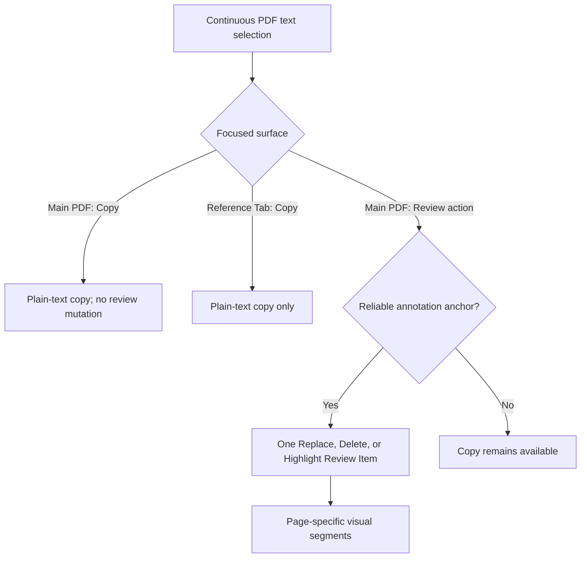
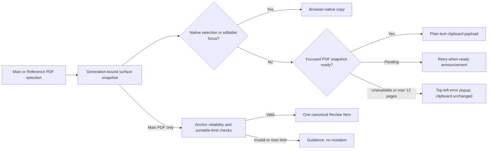
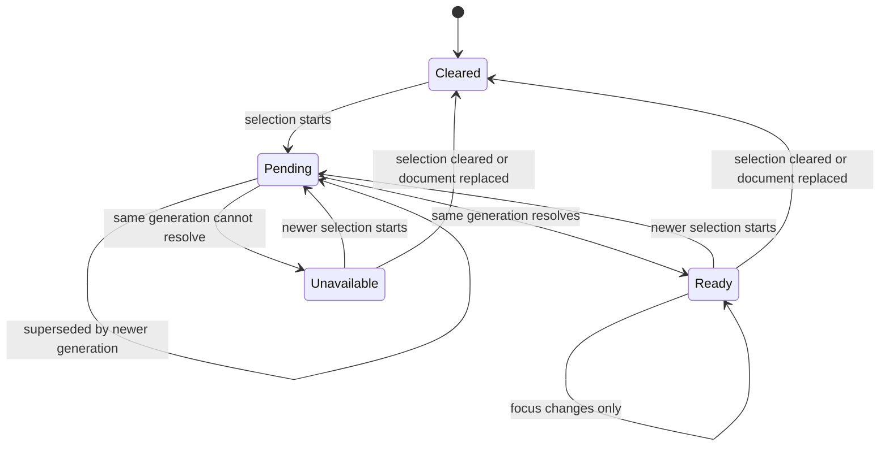
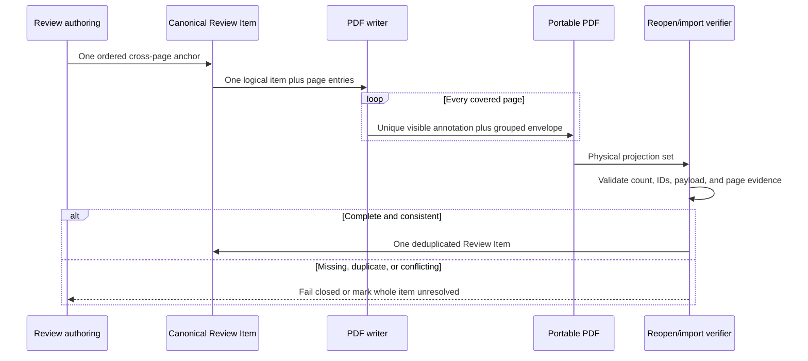

# Cross-Page PDF Selection, Copy, and Annotation - Plan

## Goal Capsule

- **Objective:** Let readers select text naturally across PDF pages, copy it with standard keyboard shortcuts, and use a Main PDF selection as one coherent review instruction.
- **Means:** First prove or repair the pinned viewer's real cross-page selection contract, then maintain generation-bound semantic selection snapshots for each PDF surface, normalize Main PDF selections into one ordered cross-page anchor, and project one logical Review Item into verified page-local PDF annotations when portability requires it. (KTD1-KTD8)
- **Product authority:** This Product Contract governs text selection in the Main Reading Thread and Reference Tabs, clipboard behavior for PDF selections, and selection-based cross-page Review Items. Existing annotation, navigation, and save contracts remain authoritative where this plan does not change them.
- **Open blockers:** None.
- **Execution profile:** Deep, cross-cutting feature work spanning the viewer, review model, portable PDF pipeline, live context, reconciliation, and browser/conformance coverage.
- **Stop conditions:** Do not acknowledge an annotation command unless every page projection for the logical item validates. Do not report save, reopen, recovery, or reviewed-PDF export as successful unless the complete projection group round-trips as one item. Copy must remain usable independently of annotation eligibility.
- **Tail ownership:** U6 owns the joined Chromium/WebKit and portable-PDF evidence after U0 proves the viewer contract and U1-U5 establish their focused contracts.

---

## Product Contract

### Summary

The implementation will extend Placekeeper's semantic-selection and generation-fencing patterns to both PDF surfaces, while adding one canonical cross-page anchor for Main PDF review work. Copy remains a lightweight focused-surface capability; durable annotations fan out to page-local portable marks and regroup as one atomic Review Item throughout their lifecycle.

### Problem Frame

The Main PDF exposes semantic text selection for annotation workflows, but its durable Selection Snapshot accepts only one page. Reference PDFs expose no text-selection layer. Because PDF selection is viewer-managed rather than a native DOM selection, the browser's ordinary copy command has no selected text to copy.

Readers therefore cannot rely on the basic select-copy-paste interaction they expect from a document reader. A selection that crosses a page boundary also stops being usable for review actions even though it represents one continuous editorial intent.

### Actor

- A1. A reader reviewing the Main PDF while consulting zero or more Reference Tabs with a mouse or trackpad and keyboard.

### Key Decisions

- **Treat cross-page copy and annotation as one selection experience.** (session-settled: user-directed — chosen over separate plans: the same continuous selection should support both ordinary reading and review work.) Governs R1, R5.
- **Keep Reference Tab selections copy-only.** (session-settled: user-directed — chosen over reference-document annotations: references remain supporting reading material outside the Main PDF's review state.) Governs R8.
- **Support every existing selection-based action across pages.** (session-settled: user-directed — chosen over cross-page Highlight only: Replace, Delete, and Highlight should share one selection contract.) Governs R5-R7.
- **Copy only plain selected text.** (session-settled: user-approved — chosen over adding file, page, link, or citation context: ordinary paste behavior is the goal.) Governs R2.
- **Use the focused PDF as copy authority.** (session-settled: user-approved — chosen over retaining ambiguous competing selections: copy must never use stale text from another visible PDF.) Governs R3.
- **Cap supported selections at 12 pages and reject over-limit operations as a whole.** (session-settled: user-directed — chosen over unbounded spans or silent truncation: a 13-page selection remains visible, but Copy and review actions change nothing and the existing top-left error popup explains the limit.) Governs R15.

### Requirements

**Selection and clipboard**

- R1. A1 can create one continuous text selection within a page or across consecutive pages in either the Main PDF or the active Reference Tab.
- R2. The normal platform copy shortcut places the complete selected text on the clipboard as plain text in document reading order, using Command-C on macOS and Control-C on Windows and Linux.
- R3. When more than one PDF retains a selection, a copy command uses only the selection owned by the focused PDF surface.
- R4. Copying preserves the visible selection and does not move, scroll, close, or otherwise change either the Main Reading Thread or a Reference Tab.

**Main PDF review actions**

- R5. A reliable Main PDF selection remains eligible for Replace, Delete, and Highlight when it spans one or more pages and fits the supported portable-annotation limits.
- R6. One cross-page review action creates one Review Item that owns the complete selected text and page-specific geometry for every page in the span.
- R7. A cross-page Review Item behaves atomically for creation, editing, deletion, undo, redo, saving, reopening, and reviewed-PDF export while projecting its visible marking on every covered page.
- R8. A Reference Tab selection never exposes or triggers Replace, Delete, Highlight, Insert, or Page Note actions.

**Precedence and compatibility**

- R9. Native copy behavior takes precedence when focus is in an editable field or ordinary selectable interface text rather than a PDF selection.
- R10. A PDF copy command creates no Review Item, opens no annotation composer, and consumes no selection.
- R11. Copy remains available for readable viewer text even when that selection cannot satisfy the stronger reliability requirements for a durable annotation anchor.
- R12. Existing same-page selection actions, insertion carets, Page Notes, PDF navigation, Reference Tab navigation, and Copy Link behavior retain their current semantics.
- R13. If an in-limit readable selection exceeds an annotation-only geometry or portable-metadata limit, it remains copyable; an attempted review action fails before creating or acknowledging a Review Item, preserves the selection, and gives guidance to shorten it.
- R14. If the current PDF selection's text is still being resolved when A1 copies, Placekeeper never supplies text from an older selection and gives a concise retry-when-ready announcement.
- R15. Placekeeper supports Copy and Main PDF review actions for selections spanning at most 12 pages. If a selection spans 13 or more pages, the attempted operation is rejected as a whole: nothing is copied or created, the selection and existing clipboard remain unchanged, no partial text or geometry is used, and the existing top-left error popup explains the 12-page limit.
- R16. Whenever the Main PDF and a Reference PDF both retain visible selections, Placekeeper persistently indicates which PDF currently owns Copy; the same ownership state is exposed to assistive technology.
- R17. Hiding or collapsing a focused Reference PDF revokes that PDF's Copy authority, leaves keyboard focus on the control that performed the transition, and does not transfer Copy authority to another PDF until that PDF receives explicit focus.
- R18. If the focused selection becomes unavailable before Copy completes, Placekeeper leaves both the selection and existing clipboard unchanged, shows the existing top-left error popup with concise reselect-and-retry guidance, and returns the copy flow to ready only after a new selection resolves.

### Key Flows

- F1. Copy selected PDF text
  - **Trigger:** A1 selects text in the Main PDF or active Reference Tab and invokes the normal platform copy shortcut.
  - **Actors:** A1.
  - **Steps:** Placekeeper resolves the focused PDF selection, validates the shared 12-page maximum, reads its complete text in document order, and supplies only that plain text to the clipboard command.
  - **Outcome:** A1 can paste the complete text elsewhere while both PDF locations and the selection remain unchanged.
  - **Covers:** R1-R4, R9-R12, R14-R18.
- F2. Create a cross-page Review Item
  - **Trigger:** A1 selects text across a Main PDF page boundary and invokes Replace, Delete, or Highlight.
  - **Actors:** A1.
  - **Steps:** Placekeeper validates the full selection, preserves each page's geometry under one intent, and creates one Review Item through the existing action flow.
  - **Outcome:** One tray item and one atomic review action represent the full selection, with visible segments on every covered page.
  - **Covers:** R1, R5-R7, R12-R13.

### Acceptance Examples

- AE1. Cross-page copy from the Main PDF
  - **Covers:** R1-R4, R10-R11.
  - **Given:** A1 has a continuous selection beginning near the end of one Main PDF page and ending on the next page.
  - **When:** A1 presses Command-C on macOS or Control-C on Windows or Linux and pastes into a plain-text field.
  - **Then:** The pasted value contains the entire selection once in reading order, and Placekeeper creates no review mutation or navigation change.
- AE2. Cross-page copy from a Reference Tab
  - **Covers:** R1-R4, R8, R10-R11.
  - **Given:** A1 has a continuous cross-page selection in the active Reference Tab.
  - **When:** A1 invokes the normal platform copy shortcut.
  - **Then:** The clipboard contains the selected plain text, no annotation actions appear, and the Main Reading Thread remains unchanged.
- AE3. Focus selects the copy source
  - **Covers:** R3-R4, R9-R10, R16.
  - **Given:** The Main PDF and a Reference Tab each retain different visible selections.
  - **When:** A1 focuses the Reference Tab and copies, then focuses the Main PDF and copies.
  - **Then:** Each clipboard result comes from the newly focused PDF and never from the other retained selection; a persistent visual indicator and its accessible state identify the current PDF copy owner throughout.
- AE4. One annotation spans pages
  - **Covers:** R5-R7, R12.
  - **Given:** A1 has a reliable Main PDF selection spanning two or more pages.
  - **When:** A1 creates a Replace, Delete, or Highlight in separate clean cases.
  - **Then:** Each case creates exactly one Review Item whose complete span is visible on every covered page and whose tray representation identifies the page range.
- AE5. Cross-page Review Items remain atomic
  - **Covers:** R6-R7, R12.
  - **Given:** A saved cross-page Review Item is visible in the Annotation Tray and on each covered page.
  - **When:** A1 navigates to it, edits it where the action is editable, undoes and redoes it, saves and reopens the PDF, and exports a reviewed copy.
  - **Then:** Placekeeper navigates to the first segment while retaining the full span, every lifecycle action applies to the item as a whole, and the reviewed PDF preserves standards-visible markings on every covered page.
- AE6. Native copy precedence
  - **Covers:** R9-R12.
  - **Given:** A PDF selection exists and A1 then selects text inside an editable field or another selectable interface region.
  - **When:** A1 invokes the platform copy shortcut.
  - **Then:** Native copy produces the focused interface text without changing the PDF selection or review state.
- AE7. Copy survives annotation limits
  - **Covers:** R5, R11, R13.
  - **Given:** A1 has a readable Main PDF selection of at most 12 pages whose page geometry or portable metadata exceeds an annotation-only limit.
  - **When:** A1 copies the selection and then attempts Replace, Delete, or Highlight in separate clean cases.
  - **Then:** Copy produces the complete plain text; each review action creates nothing, leaves the selection available, and explains that the selection must be shortened.
- AE8. Pending copy cannot reuse stale text
  - **Covers:** R2-R4, R14.
  - **Given:** A previous PDF selection was ready and A1 has just created a different selection whose text snapshot is still resolving.
  - **When:** A1 invokes the platform copy shortcut before the new snapshot is ready.
  - **Then:** Placekeeper does not place the previous selection on the clipboard, does not clear the new selection, and announces that A1 should retry when the selection is ready.
- AE9. Incomplete portable groups fail closed
  - **Covers:** R6-R7.
  - **Given:** A reviewed PDF contains a multi-page Review Item whose physical page projections are missing, duplicated, or inconsistent.
  - **When:** Placekeeper reopens, recovers, imports, or verifies the document.
  - **Then:** It does not surface several independent Review Items or silently accept a partial span. Portable reopen, import, and verification fail without replacing the current state; semantic recovery and source replacement retain one unresolved logical Review Item that can use the existing manual-reattachment flow.
- AE10. The 12-page selection limit is all-or-nothing
  - **Covers:** R1-R2, R5, R13, R15.
  - **Given:** A1 can create readable selections spanning exactly 12 pages and exactly 13 pages.
  - **When:** A1 copies each selection and invokes each Main PDF review action in separate clean cases.
  - **Then:** Every 12-page operation follows its normal contract; every 13-page operation copies or creates nothing, preserves the selection and prior clipboard, and shows the existing top-left error popup without partial truncation.
- AE11. Hidden References cannot retain invisible Copy authority
  - **Covers:** R3-R4, R16-R17.
  - **Given:** The Main PDF and a focused Reference PDF each retain a visible selection.
  - **When:** A1 hides or collapses the Reference PDF.
  - **Then:** The Reference PDF ceases to own Copy, focus remains on the initiating control, the ownership indicator exposes that no PDF currently owns Copy, and only an explicit focus action grants authority to another PDF.
- AE12. Unavailable copy fails visibly and preserves state
  - **Covers:** R2-R4, R18.
  - **Given:** A current PDF selection becomes unavailable before its text snapshot resolves.
  - **When:** A1 invokes the platform copy shortcut.
  - **Then:** The clipboard and visible selection remain unchanged, the existing top-left error popup asks A1 to reselect and retry, and a newly resolved selection becomes copyable without reviving stale text.

### Scope Boundaries

**Included**

- Same-page and cross-page selection and plain-text copying in the Main PDF and Reference Tabs, with an all-or-nothing 12-page maximum.
- Cross-page Replace, Delete, and Highlight as one Main PDF Review Item.
- One-item tray presentation, first-segment navigation, page-range identity, atomic history, persistence, and reviewed-PDF projection for cross-page Review Items.
- Mouse or trackpad selection with standard desktop copy shortcuts.

**Excluded**

- Reference-document Review Items or annotation actions.
- A dedicated Copy button, custom context menu, rich-text clipboard payload, citation wrapper, filename, page label, or Placekeeper Link in the copied text.
- OCR or copy support for image-only PDFs without readable viewer text.
- Multi-page Insert anchors or Page Notes; both remain single-position actions.
- Touch handles, stylus-specific selection, or new mobile interaction requirements.

### Success Criteria

- A1 can use the same drag-and-copy habit in the Main PDF and Reference Tabs, including across page boundaries.
- Pasted output contains the full selected text once and no Placekeeper metadata.
- All three selection-based review actions accept a reliable cross-page Main PDF selection and remain one Review Item throughout its lifecycle.
- Over-limit and still-resolving selections never produce stale copy or partial Review Items.
- Competing retained selections make Copy ownership visibly and accessibly clear; hidden Reference PDFs never retain invisible ownership.
- Over-12-page and unavailable copy attempts preserve the clipboard and selection while using the existing top-left error popup for recovery guidance.
- Existing native copy targets and same-page review flows do not regress.

### Dependencies and Assumptions

- The PDF exposes readable text in a document order the viewer can return; OCR is outside this plan.
- A cross-page annotation may require several standards-visible page annotations in the reviewed PDF, but Placekeeper must preserve their identity as one Review Item.
- The geometry cache is an implementation resource, not the product limit: it must retain documented headroom above the shared 12-page selection maximum.

### Sources and Research

- `docs/plans/2026-08-07-001-fix-pdf-text-selection-commands-plan.md` established reliable same-page Main PDF selection and always-available selection actions.
- `apps/web/src/pdf/PdfWorkspace.tsx` contains the Main PDF selection surface.
- `apps/web/src/pdf/ReferencePdfViewport.tsx` currently renders Reference PDFs without a selection layer.
- `apps/web/src/app/App.tsx` currently scopes selection subscriptions to the Main PDF.
- `apps/web/src/pdf/selection-anchor.ts` and `apps/web/src/pdf/text-reliability.ts` currently model one-page selection authority and reject cross-page annotation anchors.
- `apps/web/src/app/ReviewShell.tsx` and `apps/web/src/review/input-controller.ts` define current shortcut and review-action precedence.
- EmbedPDF 2.14.4 is pinned in `package.json`; its semantic selection state, formatted selection, and selected-text APIs are the viewer authority for this plan.
- EmbedPDF issue [#668](https://github.com/embedpdf/embed-pdf-viewer/issues/668) reports that cross-page pointer selection may not terminate when pointer-up occurs on a later page; U0 treats this as a prerequisite compatibility gate rather than assuming the pinned viewer satisfies R1.
- `docs/solutions/ui-bugs/reject-stale-viewer-selection-snapshots.md` requires snapshot-signature fencing and separates geometry validity from temporal consistency.
- `docs/solutions/integration-issues/valid-long-highlights-rejected-by-portable-shape-limit.md` establishes the 256-segment and 32-KiB portable-shape limits and pre-acknowledgement validation rule.
- `docs/solutions/integration-issues/portable-pdf-annotations-invisible-in-external-viewers.md` establishes page-local standards-visible annotations, crop-relative geometry, normal appearances, and strict visible/metadata agreement.
- `docs/solutions/architecture-patterns/recoverable-editable-pdf-annotation-autosave.md` establishes semantic state as recovery authority.
- `docs/solutions/architecture-patterns/preserve-document-history-for-annotation-tray-navigation.md`, `docs/solutions/architecture-patterns/reference-tab-return-to-origin-navigation.md`, and `docs/solutions/ui-bugs/reliable-compact-right-docked-reference-tabs.md` constrain navigation and reference-tab behavior.

---

## Planning Contract

Product Contract preservation: restructured without a scope change. R5 was qualified by the already-established portable limits; R13-R18 make copy/annotation independence, no-stale-copy behavior, the user-selected 12-page maximum, perceptible ownership, hidden-Reference focus, and unavailable-copy recovery explicit. AE7-AE12 cover those refinements.

### Key Technical Decisions

- KTD1. **Keep copy readiness separate from annotation-anchor reliability.** Maintain a generation-bound copy snapshot for each PDF surface containing the current semantic plain text and readiness state. Annotation capture may add geometry and reliability evidence, but it cannot be the gate for copying readable text. Publish pending immediately, accept a terminal read only for the same document and selection generation, and never fall back to the prior ready value. An unavailable terminal read preserves selection and clipboard and routes recovery through the existing top-left error popup. Governs R1-R4, R11, R14, R18.
- KTD2. **Resolve Copy through native precedence and perceptible focused-PDF ownership.** Let editable targets and ordinary non-PDF DOM selections retain native copy semantics. Otherwise, the focused Main PDF or active Reference Tab may synchronously supply its already-resolved snapshot through the browser copy event; proofread commands and the existing Copy Link path remain separate. Focus changes choose authority without consuming retained selections. When competing selections are visible, render one persistent accessible owner indicator. Hiding or collapsing the focused Reference revokes authority without transferring it. Governs R2-R4, R8-R10, R12, R14, R16-R17.
- KTD3. **Represent a cross-page selection as one canonical ordered anchor.** Extend the single-page evidence into ordered page entries containing page index, page-local quote/context, bounding rectangle, and text-segment rectangles, with the complete plain text stored once on the logical selection. Store synthetic clipboard page separators distinctly from source text. Keep `ReviewItem.pageIndex` as the lead page for ordering and compatibility, normalize legacy single-page payloads to one page entry, and require forward and reverse drags to produce the same document-ordered anchor. Governs R1, R5-R7, R12.
- KTD4. **Project one logical item into deterministic page-local portable annotations.** Give the Review Item one canonical ID and create one uniquely identified standards-visible physical annotation for each covered page. A versioned grouped portable envelope carries the canonical item ID, projection index/count, canonical payload, and page-local evidence; the existing v2 single-page decoder remains supported. Import accepts children in arbitrary enumeration order, sorts them by projection index, and rejects only duplicate/non-contiguous indices or projection-index/page-order disagreement before deduplicating a complete consistent group to one item. Governs R6-R7, R12.
- KTD5. **Validate and persist the whole group atomically.** Define the grouped-envelope serializer and byte-accounting contract alongside command validation. Before command acknowledgement, construct every final child envelope and require each serialized child plus the complete logical group to satisfy the existing aggregate 256-segment and per-envelope 32-KiB portable metadata limits. Save/export reuses that validator, writes and reopens every projection, verifies the complete group, and reports success only if the group round-trips; undo/redo continue to operate on the existing whole-item reducer history. Copy never inherits these annotation-only segment or metadata limits. Governs R5-R7, R11, R13.
- KTD6. **Reconcile the ordered full passage without synthetic page separators.** After document replacement, locate one unique ordered passage across the document while ignoring the clipboard-only separators recorded between original page fragments, then derive every page projection from that match under the replacement document's pagination. Any missing or ambiguous source text leaves the entire logical item unresolved; manual reattachment accepts one complete cross-page selection. Governs R6-R7.
- KTD7. **Use canonical identity for actions and the lead page for navigation.** The Annotation Tray, readers, links, live context, hit testing, and history expose one Review Item and one canonical ID. Display a page range, navigate initially to the first segment, and retain all page-specific coordinates for consumers that need the full span. Governs R6-R7, R12.
- KTD8. **Make 12 pages a shared all-or-nothing product limit with cache headroom.** Define one shared selection-page-limit constant used by Copy, annotation eligibility, popup copy, and tests. Configure the viewer geometry cache with documented headroom above that limit rather than treating cache eviction as validation. A span above the limit remains selected but cannot mutate the clipboard or review state. Governs R1-R2, R5, R13, R15.

### High-Level Technical Design

Copy and annotation share semantic selection capture but diverge before annotation-only reliability and portability checks.

Each surface snapshot is temporal authority: a newer selection invalidates the older value before asynchronous text or geometry reads finish.

A logical cross-page item fans out only at the PDF projection boundary and must regroup completely on every return path.

### Implementation Constraints

- Use pinned public EmbedPDF selection APIs and the existing viewer snapshot-signature fence; do not derive semantic text or ordering from selection rectangles or scrape private viewer DOM.
- Preserve each page fragment exactly as returned by the viewer's formatted-selection contract and record page boundaries separately. Join fragments with one documented newline for clipboard output, but never treat that synthetic separator as source text during reconciliation.
- Bind Main and Reference snapshots to document generation and selection generation. Also bind Reference snapshots to the active tab identity because one physical reference viewer document ID is reused.
- Clear Reference authority on tab switch, close, replacement, Send to Main, hide, or tray collapse. Hide/collapse leaves focus on its initiating control and grants no other PDF authority; Send to Main explicitly transfers focus to the Main PDF but never turns a prior Reference selection into a Review Item.
- When both PDF surfaces retain selections, expose one persistent visual and assistive-technology-readable indication of the current Copy owner; expose a no-owner state after authority is revoked.
- Preserve native copy for input, textarea, contenteditable, and ordinary DOM selection. A PDF copy handler may prevent the native event only when it has a current ready focused-surface payload to supply synchronously.
- Use one shared 12-page selection limit for Copy and review actions. Keep the viewer geometry cache above that limit with documented headroom, and test the exact 12/13-page boundary; never use cache eviction as implicit truncation or validation.
- Preserve the aggregate 256 text-segment limit and 32-KiB portable metadata limit. Validate all page entries, including rotated and crop-box-relative geometry, before acknowledgement; do not truncate text, geometry, or metadata to fit.
- Keep single-page payloads and portable v2 annotations readable. New grouped metadata must be versioned and additive rather than silently changing v2 identity assumptions.
- Keep physical PDF annotation IDs unique and deterministic per canonical item/page projection. Standards subtype, crop-relative geometry, and normal appearance remain mandatory.
- Grouped import must be independent of physical child enumeration order: sort by declared projection index, then reject duplicate/non-contiguous indices or disagreement between projection-index order and declared page order.
- Treat corrupt grouped state according to the operation: portable reopen/import/verification fails without replacing current state, while semantic recovery or source replacement preserves one unresolved logical Review Item eligible for existing manual reattachment.
- Preserve one reducer command and one history entry per logical review action. Cancellation, failed validation, failed save, or failed verification must not consume the selection or leave partial semantic state.
- Route over-12-page and unavailable-copy failures through the existing top-left `review-toast--error` UI in `ReviewShell.tsx`; preserve the clipboard and selection and provide concise limit or reselect-and-retry guidance.
- Do not modify Insert or Page Note anchoring, reference annotation scope, OCR, touch interaction, or unrelated tray/navigation behavior.

### Sequencing

0. U0 proves the pinned viewer can complete and report real forward/reverse cross-page pointer selections; a checked-in dependency patch or pinned upgrade is required before U1 if it cannot.
1. U1 establishes stable per-surface copy snapshots, the shared 12-page limit, visible ownership, and keyboard precedence without changing the Review Item schema.
2. U2 introduces the canonical cross-page anchor, grouped-envelope serialization contract, and atomic pre-acknowledgement validator while retaining legacy single-page behavior.
3. U3 updates web projections, authoring previews, tray identity, hit testing, and navigation to consume the canonical item.
4. U4 adds grouped portable metadata and transactional writer/import verification after the in-memory model is stable.
5. U5 carries the grouped model through live context, operation-specific recovery, document replacement, and repagination-safe reconciliation.
6. U6 proves the joined behavior in real Chromium/WebKit selection and portable-PDF conformance flows.

### Risks and Mitigations

- **Synchronous clipboard event versus asynchronous extraction:** A copy event cannot safely await viewer text. KTD1 maintains a ready snapshot ahead of the event, while pending generations block only Placekeeper-owned copy and never substitute stale text.
- **Pinned viewer may not complete cross-page pointer selection:** The upstream issue is unresolved for the pinned integration until proven locally. U0 makes real Chromium/WebKit selection completion and ordered API output a hard gate and requires a checked-in patch or pinned upgrade if the contract fails.
- **Reference viewer reuse:** The active tab can change while the physical reference document ID stays constant. Include tab identity in the generation fence and invalidate on every tab lifecycle transition.
- **Schema fan-out creates accidental duplicate items:** Existing portable code equates physical and canonical IDs. KTD4 introduces explicit grouped identity, unique projection IDs, and complete-set validation rather than overloading duplicate IDs.
- **Long selections outlive virtualized geometry:** KTD8 imposes a 12-page all-or-nothing product limit below a geometry-cache setting with documented headroom; exact 12/13-page tests prevent eviction-dependent partial results.
- **Selections within 12 pages can still exceed portable limits:** Copy and annotation have different correctness thresholds. KTD5 validates annotations before acknowledgement and R13 preserves copy plus recovery guidance.
- **Partial save or import corrupts atomicity:** Treat the physical projection set as one transaction and verify after reopen. Never surface a subset as independent Review Items.
- **Cross-page reconciliation creates false matches:** Match the ordered full passage as one unit and require a unique complete result; do not independently reattach pages that happen to match.
- **Navigation consumers assume one rectangle:** Centralize canonical normalization and lead-page projection so downstream consumers stop reading raw single-page payload fields directly.
- **Browser-engine selection differences:** Purpose-built fixtures and identical Chromium/WebKit forward, reverse, scrolled, and focus-precedence cases prevent synthetic selection seams from becoming the only proof.

### Alternatives Considered

- **Create one Review Item per covered page and group them visually:** Rejected because history, editing, links, reconciliation, and agent context would still expose several semantic instructions rather than the one intent required by R6-R7.
- **Reuse the same physical annotation ID on every page:** Rejected because PDF annotations require unique physical identity and current writers/verifiers assume a visible ID occurs exactly once.
- **Use browser DOM selection as clipboard authority:** Rejected because the viewer selection layer owns semantic reading order and can span virtualized pages that do not form one dependable native DOM selection.
- **Resolve selected text only after Command-C with an asynchronous clipboard write:** Rejected because it cannot reliably participate in the synchronous copy event or preserve native copy precedence; the ready-snapshot model makes timing explicit.
- **Relax portable limits or omit excess page geometry:** Rejected because it would recreate known save/reopen corruption and external-viewer visibility failures.
- **Allow unbounded cross-page selection and depend on geometry-cache retention:** Rejected because cache size is an implementation resource whose eviction would make correctness timing-dependent.
- **Silently truncate a selection at the supported page limit:** Rejected because the pasted or annotated passage would no longer match the user's visible selection; the 13-page operation instead fails as a whole with the existing top-left error popup.

---

## Implementation Units

### U0. Pinned viewer cross-page selection compatibility gate

- **Goal:** Prove that the pinned EmbedPDF integration can complete real cross-page pointer selections and return stable semantic evidence before building Placekeeper state on top of it.
- **Requirements:** R1-R2, R15; AE1-AE2, AE10.
- **Dependencies:** None.
- **Files:**
  - `package.json`
  - lockfile containing the EmbedPDF pin
  - `apps/web/src/pdf/embedpdf-viewer.ts`
  - `apps/web/src/pdf/viewer-selection-adapter.ts`
  - `test/fixtures/pdfs/generate.ts`
  - `test/acceptance/viewer.spec.ts`
  - `test/conformance/pdf-viewer.conformance.spec.ts`
- **Approach:**
  1. Add a deterministic multi-page selectable fixture and drive real forward and reverse pointer drags in Chromium and WebKit, including pointer-up on a later page and one offscreen intermediate page.
  2. Verify that the pinned public semantic-selection APIs terminate the gesture and return stable document-ordered formatted text, page slices, geometry, and selection-generation evidence without reading private viewer DOM.
  3. Record the viewer contract in adapter tests. If EmbedPDF 2.14.4 fails any gate, land either a checked-in dependency patch or an upgraded pinned version that passes before starting U1; do not paper over a failed gesture with Placekeeper-only stale-state heuristics.
  4. Establish the shared 12-page selection-limit constant and configure the geometry cache with documented headroom above it so the exact limit does not coincide with eviction pressure.
- **Test Scenarios:**
  - Forward and reverse selection both terminate when pointer-up occurs on the second or later page.
  - A three-page selection with an offscreen intermediate page returns every page slice once in document order with stable generation evidence.
  - Exact 12-page semantic evidence remains available under the configured cache; the 13th page is detectable for explicit product-limit rejection rather than disappearing through cache eviction.
  - Chromium and WebKit satisfy the same public-API contract.
- **Verification:** Focused real-pointer viewer acceptance and conformance cases pass in Chromium and WebKit on the final pinned dependency or checked-in patch.

### U1. Per-surface semantic selection snapshots and native Copy

- **Goal:** Make standard copy shortcuts reliably copy current plain text from the focused Main PDF or Reference Tab without changing review state.
- **Requirements:** R1-R4, R8-R12, R14-R18; F1; AE1-AE3, AE6, AE8, AE10-AE12; KTD1-KTD2, KTD8.
- **Dependencies:** U0.
- **Files:**
  - `apps/web/src/pdf/PdfWorkspace.tsx`
  - `apps/web/src/pdf/ReferencePdfViewport.tsx`
  - `apps/web/src/pdf/viewer-selection-adapter.ts`
  - `apps/web/src/pdf/selection-state.ts`
  - `apps/web/src/app/App.tsx`
  - `apps/web/src/app/ProductionReviewApp.tsx`
  - `apps/web/src/app/ReviewShell.tsx`
  - `apps/web/test/selection-state.test.ts`
  - `apps/web/test/app-interactions.test.ts`
- **Approach:**
  1. Generalize the current Main-only selection subscription into document-scoped updates that publish `cleared`, `pending`, `ready`, or `unavailable` with document and selection generation. Preserve the adapter's pre/post snapshot-signature comparison around every asynchronous read.
  2. Render the viewer selection layer in Reference PDFs and publish updates for the active tab without exposing annotation controls. Bind the result to reference tab identity as well as the reused reference document ID.
  3. Store separate Main and Reference copy snapshots at the shared application owner. Invalidate the Reference snapshot on tab switch, close, document replacement, Send to Main, hide, and tray collapse; invalidate both surfaces when their document generation changes. Hide/collapse revokes authority while retaining focus on the initiating control and grants no implicit successor.
  4. Focus a PDF surface on pointer interaction. Route the browser `copy` event in this order: editable/native DOM selection, ready in-limit selection from the focused PDF, then browser default. Supply `text/plain` synchronously and prevent default only for the second branch.
  5. When both PDF surfaces retain selections, render a persistent visual owner indicator and expose the same owner or no-owner state through accessible name/state. Do not rely on selection color alone.
  6. Enforce the shared 12-page limit before clipboard mutation. For an over-limit selection, preserve selection and clipboard and emit the existing top-left error popup; never copy the first 12 pages.
  7. For a focused pending snapshot, preserve clipboard and selection state and emit the retry announcement required by R14. For `unavailable`, preserve both states, emit the existing top-left error popup with reselect-and-retry guidance, and accept only a newly resolved selection. Do not call annotation authoring or reuse the Copy Link command.
- **Patterns to follow:** `viewer-selection-adapter.ts` snapshot fencing; existing Main page focus behavior; `ReviewShell.tsx` shortcut precedence; current Copy Link clipboard feedback only for announcement style, not command routing.
- **Test Scenarios:**
  - Same-page and multi-page Main and Reference snapshots preserve document order and use one newline between page fragments.
  - A late resolution from a prior selection, document, or Reference Tab cannot replace the current snapshot.
  - Main and Reference selections may remain visible; focus chooses the copied value in each direction without consuming either selection.
  - Competing visible selections always expose one matching visual and assistive-technology-readable owner; hiding or collapsing the focused Reference produces an explicit no-owner state until another PDF is focused.
  - Input, textarea, contenteditable, and ordinary DOM selection retain native copy while a PDF selection exists.
  - A deterministic delayed text read proves Command-C during `pending` never copies the previous phrase and the subsequent retry copies the current phrase exactly once.
  - A deterministic unavailable read proves Copy preserves the prior clipboard and selection, shows the top-left reselect-and-retry error, and cannot revive stale text.
  - Exact 12-page Copy succeeds; 13-page Copy preserves the selection and prior clipboard, shows the top-left limit error, and copies no prefix.
  - Copy changes no Review Item, selection, viewer location, tab, or Copy Link state.
- **Verification:** `pnpm test:web` and `pnpm test:review` pass with focused-surface, generation-race, native-precedence, and reference-lifecycle coverage.

### U2. Canonical cross-page anchor and atomic review commands

- **Goal:** Let Replace, Delete, and Highlight consume one validated cross-page Main PDF selection as one canonical Review Item.
- **Requirements:** R1, R5-R7, R11-R13, R15; F2; AE4, AE7, AE10; KTD3, KTD5, KTD8.
- **Dependencies:** U1.
- **Files:**
  - `apps/web/src/pdf/selection-anchor.ts`
  - `apps/web/src/pdf/text-reliability.ts`
  - `apps/web/src/app/App.tsx`
  - `apps/web/src/review/authoring-session.ts`
  - `packages/core/src/review-model.ts`
  - `packages/core/src/review-commands.ts`
  - `packages/core/src/review-reducer.ts`
  - `packages/core/src/portable-annotation.ts`
  - `apps/web/test/selection-anchor.test.ts`
  - `apps/web/test/text-reliability.test.ts`
  - `apps/web/test/authoring-session.test.ts`
  - `packages/core/test/review-commands.test.ts`
- **Approach:**
  1. Define the canonical ordered page-entry contract and a single normalizer that converts legacy one-page evidence to it. Validate consecutive page order, page-local text/evidence agreement, geometry bounds, total full text, the 12-page maximum, and aggregate segment count. Preserve page fragments and synthetic clipboard-boundary metadata distinctly.
  2. Update semantic selection capture to retain every formatted page slice and geometry result rather than the current first page. Normalize reverse drags into document order and distinguish annotation reliability from copy readability.
  3. Extend `ReviewSelectionAnchor`, selection payload construction, command parsing, reducer allowlists, and stored evidence through the canonical helper. Keep lead `pageIndex` and legacy fields only where the compatibility boundary requires them.
  4. Freeze the full cross-page anchor when Replace or Highlight authoring starts. Later selection changes do not retarget the draft; cancellation and validation failure create nothing.
  5. Define the grouped-envelope serializer at this boundary, construct every final page-specific child envelope before reducer acknowledgement, and apply both the aggregate segment limit and the per-envelope serialized byte limit. Expose the existing shorten-selection recovery style while leaving the copy snapshot intact.
- **Test Scenarios:**
  - Forward and reverse drags over two and three pages normalize to identical ordered text and page entries, including an offscreen intermediate page.
  - Single-page legacy commands and stored items normalize without changing their IDs, lead page, text, or geometry.
  - Replace, Delete, and Highlight each create one item and one history entry; undo/redo removes and restores the whole span.
  - Replace and Highlight drafts remain bound to their frozen span after the viewer selection changes; Cancel creates nothing.
  - Exact aggregate segment boundaries of 256 and 257 pass/fail as expected, and over-limit annotation failure leaves copy available.
  - Exact 12-page review actions succeed when otherwise valid; 13-page actions create and acknowledge nothing, preserve selection, and use the top-left limit popup.
  - A group whose logical payload fits but whose child-specific metadata pushes one final serialized envelope over 32 KiB fails before acknowledgement; the just-under boundary succeeds.
  - Malformed gaps, duplicate pages, out-of-order entries, mismatched text, or invalid later-page geometry fail before acknowledgement.
- **Verification:** `pnpm test:web`, `pnpm test:review`, and `pnpm exec vitest run apps/web/test/authoring-session.test.ts packages/core/test/review-commands.test.ts` pass with legacy normalization, action parity, atomic history, and boundary coverage.

### U3. One-item web projection, tray presentation, and navigation

- **Goal:** Render and operate on every covered page while keeping one Review Item, one tray row, and one navigation identity.
- **Requirements:** R6-R7, R12; F2; AE4-AE5; KTD3, KTD7.
- **Dependencies:** U2.
- **Files:**
  - `packages/core/src/annotation-projection.ts`
  - `apps/web/src/review/annotation-projection.ts`
  - `apps/web/src/review/authoring-session.ts`
  - `apps/web/src/pdf/owned-mark-hit-test.ts`
  - `apps/web/src/review/AnnotationList.tsx`
  - `apps/web/src/app/ProductionReviewApp.tsx`
  - `apps/web/test/annotation-projection.test.ts`
  - `apps/web/test/owned-mark-hit-test.test.ts`
  - `apps/web/test/review-layout.test.tsx`
- **Approach:**
  1. Make core and web annotation projection return one page-local visual projection per canonical page entry, each retaining the logical item ID and deterministic projection identity.
  2. Flatten authoring preview projections for rendering while keeping one draft and one Apply/Cancel lifecycle.
  3. Group pointer hit testing and selection state by canonical item ID so clicking any physical mark activates the same Review Item.
  4. Render one Annotation Tray row with the lead page or page range as appropriate. Existing row actions edit or delete the whole logical item.
  5. Route tray, reader, link, outline, and history navigation to the lead page/first segment, preserving the complete anchor for subsequent page rendering and downstream context.
- **Test Scenarios:**
  - Two- and three-page items render all expected page-local marks but only one tray row and one full-reader item.
  - Clicking a mark on any covered page selects the same canonical item; Edit, Delete, Undo, and Redo affect every projection.
  - Replace and Highlight previews appear on each covered page without duplicating drafts or Apply commands.
  - The row presents a stable page range and navigation first lands on the first segment without creating multiple meaningful-history entries.
  - Existing single-page owned and imported annotations retain their hit targets, row copy, and navigation.
- **Verification:** `pnpm test:review` passes with projection counts, canonical hit testing, one-row identity, page-range presentation, and navigation assertions.

### U4. Grouped portable metadata and transactional PDF round-trip

- **Goal:** Save and export page-local standards-visible marks that reopen as one complete cross-page Review Item.
- **Requirements:** R5-R7, R11-R13; F2; AE5, AE7, AE9; KTD4-KTD5.
- **Dependencies:** U2 and U3.
- **Files:**
  - `packages/core/src/portable-annotation.ts`
  - `packages/core/src/pdf-writer.ts`
  - `packages/pdf-backends/src/embedpdf-adapter.ts`
  - `apps/service/src/export/pdf-verifier.ts`
  - `apps/service/src/saving/pdf-save-coordinator.ts`
  - `packages/core/test/portable-annotation.test.ts`
  - `apps/service/test/pdf-save-coordinator.test.ts`
  - `test/conformance/pdf-writer.conformance.test.ts`
  - `test/conformance/reviewed-pdf.test.ts`
- **Approach:**
  1. Complete the versioned grouped portable envelope around U2's serializer and validator while preserving v2 decode. Encode one canonical payload consistently across children plus child-specific index, count, page, geometry, and deterministic physical ID.
  2. Teach the writer to emit each child with a standards subtype, crop-relative rectangles/quads, and a normal appearance. Ensure physical IDs are unique while the canonical item ID remains stable in grouped metadata.
  3. Change portable import to collect children by canonical ID regardless of physical enumeration order, sort by declared projection index, validate a complete contiguous index set and canonical-payload agreement, confirm that projection-index order agrees with declared page order, and return one normalized Review Item. Raw out-of-order enumeration alone is valid.
  4. Extend verifier and save coordinator expectations from one visible ID per item to one complete declared projection set. Reuse U2's final-envelope validator without recalculating a different size approximation. Original-save, Save a Copy, recovery, and reviewed export share the same transactional success rule.
  5. Fail closed for missing, duplicate, extra, mismatched, malformed, or unsupported grouped children. Portable reopen, import, and verification must leave the current semantic state untouched on failure and must not partially recover a valid-looking page as a separate item.
- **Test Scenarios:**
  - New two- and three-page groups write unique physical IDs, reopen as one canonical ID, and preserve exact page geometry and text.
  - Historical v2 single-page annotations still decode and round-trip unchanged.
  - Arbitrarily enumerated children import successfully after projection-index sorting; duplicate or non-contiguous indices, projection-index/page-order disagreement, extra children, canonical-payload mismatch, and page-evidence mismatch fail closed without replacing current state.
  - Rotations 0/90/180/270 and non-zero crop boxes remain visible in external-conformance rendering and agree with metadata.
  - Exact 256/257 aggregate segment cases and just-under/over 32-KiB final child-envelope cases validate before command acknowledgement without truncation.
  - Original save, Save a Copy, reviewed export, reopen verification, and recovery either preserve the whole group or report failure without partial success.
- **Verification:** `pnpm exec vitest run packages/core/test/portable-annotation.test.ts`, `pnpm test:service`, and `pnpm test:pdf-conformance` pass with grouped identity, backward compatibility, geometry, external visibility, and transactional-failure evidence.

### U5. Live context, recovery, replacement, and reconciliation

- **Goal:** Keep cross-page items atomic and intelligible to Codex and users when the live document is reopened, recovered, or replaced.
- **Requirements:** R6-R7, R12; AE5, AE9; KTD4-KTD6.
- **Dependencies:** U4.
- **Files:**
  - `packages/core/src/structured-review-item.ts`
  - `packages/core/src/live-context.ts`
  - `apps/service/src/context/live-context-service.ts`
  - `apps/service/src/context/live-source-workflow-service.ts`
  - `apps/service/src/reconciliation/pdf-anchor-reconciler.ts`
  - `packages/core/test/live-context.test.ts`
  - `apps/service/test/live-context-service.test.ts`
  - `apps/service/test/live-source-workflow.test.ts`
  - `apps/service/test/source-reconciliation-service.test.ts`
  - `apps/service/test/live-document-replacement.test.ts`
- **Approach:**
  1. Expose one structured Review Item with canonical ID, complete text, lead page, page range, and ordered page-specific coordinates. Preserve the legacy lead-page view for consumers that do not need the full geometry.
  2. Update owned-annotation filtering to recognize deterministic child IDs as projections of one canonical item instead of treating them as unrelated imported annotations.
  3. Preserve grouped semantic state through daemon restart, recovery source selection, and live source replacement; validate the complete group before reporting a healthy owned item. Unlike portable reopen/import/verification, corrupt semantic recovery or source replacement retains one canonical unresolved item so the existing manual-reattachment path remains available.
  4. Reconcile the unique ordered full passage across the replacement PDF using only stored source fragments, ignoring synthetic clipboard page separators, and derive page entries only after the whole match succeeds under the replacement pagination. Mark the whole item unresolved for any ambiguous or missing source text.
  5. Let manual reattachment consume one reliable full cross-page selection and replace the entire old anchor atomically.
- **Test Scenarios:**
  - Live context returns one canonical item with all page coordinates and never leaks child projections as separate items.
  - Owned filtering excludes every child from the imported-annotation inventory while retaining unrelated external annotations.
  - Restart, semantic recovery, and live source replacement preserve one complete item or retain one canonical unresolved item eligible for manual reattachment; they never emit child items.
  - Reconciliation resolves a unique wording-identical cross-page passage after page breaks change because synthetic separators do not participate in matching, and rejects partial, independently matching, or ambiguous source fragments.
  - Manual reattachment replaces every page entry in one command; undo restores the prior full anchor.
- **Verification:** `pnpm exec vitest run packages/core/test/live-context.test.ts` and `pnpm test:service` pass with structured context, owned filtering, recovery, replacement, and all-or-nothing reconciliation coverage.

### U6. Joined browser and portable-PDF acceptance proof

- **Goal:** Prove the complete user workflow with real pointer selection, platform copy events, review actions, and round-tripped PDF output in supported browser engines.
- **Requirements:** R1-R18; F1-F2; AE1-AE12; KTD1-KTD8.
- **Dependencies:** U1-U5.
- **Files:**
  - `test/fixtures/pdfs/generate.ts`
  - `test/acceptance/viewer.spec.ts`
  - `test/acceptance/production-flow.spec.ts`
  - `test/conformance/pdf-viewer.conformance.spec.ts`
  - `test/conformance/reviewed-pdf.test.ts`
- **Approach:**
  1. Add a deterministic selectable multi-page fixture with known end/start phrases, a selectable intermediate page, and variants that exercise scroll, rotation, and crop handling.
  2. Drive real forward and reverse glyph selection across pages without injecting selection state. Assert visible selection, formatted text order, standard `copy` event output, and exact 12/13-page all-or-nothing behavior.
  3. Exercise Main and Reference focus precedence with both surfaces visible, assert the persistent visual and accessible ownership indicator, and cover Reference Tab switching/closing, Send to Main, hide, and collapse. Hidden/collapsed References revoke authority without silently transferring it.
  4. Create Replace, Delete, and Highlight from separate real cross-page selections. Verify one row, one history step, all page marks, save/reopen, reviewed export, and incomplete-group recovery behavior.
  5. Run the joined cases in Chromium and WebKit and retain the existing embedded/responsive reference-tray scenarios.
- **Test Scenarios:**
  - AE1-AE3, AE6-AE8, and AE10-AE12 run through native keyboard copy events, paste into a plain-text field, and assert exact output or unchanged prior clipboard plus unchanged review state and required top-left error popup.
  - Forward and reverse selections over two and three pages include an offscreen intermediate page once and use the documented newline separator.
  - Reference switching, closing, Send to Main, tray hide/show, and competing retained selections always choose the focused current document or native target, keep the owner indicator synchronized, and expose no PDF owner after hide/collapse until explicit focus.
  - AE4-AE5 run separately for Replace, Delete, and Highlight and prove one command/history entry/item across save, reopen, undo/redo, and export.
  - AE7 and AE9 prove over-limit copy independence and complete-set failure in the production path rather than only unit seams.
  - External viewer conformance shows every page-local mark after reviewed export for supported rotations and crop boxes.
- **Verification:** `pnpm test:e2e`, `pnpm test:e2e:webkit`, and `pnpm test:pdf-conformance` pass without injected selection anchors or arbitrary timing sleeps.

---

## Verification Contract

| Gate | Command or action | Units | Done signal |
|---|---|---|---|
| Viewer compatibility gate | Real-pointer focused acceptance/conformance cases in Chromium and WebKit | U0 | The final pinned EmbedPDF dependency or checked-in patch terminates forward/reverse cross-page selection and returns stable ordered page slices, geometry, text, and generation evidence, including an offscreen intermediate page. |
| Static correctness | `pnpm typecheck` and `pnpm lint` | U0-U5 | New selection, grouped-anchor, portable-envelope, and context types compile cleanly with no lint regressions. |
| Web and review units | `pnpm test:web` and `pnpm test:review` | U0-U3 | Generation races, 12/13-page boundaries, copy precedence and ownership UI, canonical anchors, atomic commands, projections, and navigation pass. |
| Core and service integration | `pnpm exec vitest run packages/core/test/review-commands.test.ts packages/core/test/portable-annotation.test.ts packages/core/test/live-context.test.ts` and `pnpm test:service` | U2, U4-U5 | Legacy normalization, grouped import/save, live context, recovery, and reconciliation pass. |
| Portable PDF conformance | `pnpm test:pdf-conformance` | U4, U6 | Every child is externally visible, metadata agrees with geometry, groups verify completely, and v2 remains compatible. |
| Chromium acceptance | `pnpm test:e2e` | U0-U6 | Real pointer selection, native Copy, visible/accessible ownership, 12-page limiting, all Main actions, Reference lifecycle, and save/reopen flows pass. |
| WebKit acceptance | `pnpm test:e2e:webkit` | U0-U6 | The same joined interaction contract passes under WebKit event and selection ordering. |
| Full repository gate | `pnpm test:ci` | U0-U6 | All repository checks pass after focused gates, with no unrelated regressions. |

Operational verification must include one built-source smoke in Codex's in-app browser: select and paste text from the Main PDF and an active Reference Tab, verify the Copy-owner indicator when both selections remain visible, collapse the focused Reference and confirm authority is revoked, confirm a 13-page Copy preserves the previous clipboard and shows the top-left limit error, create one in-limit cross-page Highlight, save and reopen it, and confirm one tray item with markings on every covered page. Record the exact copied phrase, page range, canonical item count, and successful reopened projection count.

---

## Definition of Done

- U0 is done when the final pinned viewer dependency or checked-in patch passes real forward/reverse cross-page selection in Chromium and WebKit, including stable public-API evidence for an offscreen intermediate page and cache headroom above the 12-page limit.
- U1 is done when both PDF surfaces publish current, generation-fenced semantic text; standard Copy obeys native/focused precedence; competing selections expose accessible ownership; hidden References revoke authority; and over-12-page or unavailable attempts preserve state with the required top-left error popup.
- U2 is done when all three Main PDF selection actions create one canonical cross-page item, legacy single-page items remain valid, and the 12-page, aggregate-segment, and final-envelope limits fail before acknowledgement while permitted copy stays available.
- U3 is done when previews, owned marks, the Annotation Tray, readers, actions, and navigation consistently operate on canonical identity while rendering every page segment.
- U4 is done when grouped portable annotations are uniquely identified, standards-visible, backward-compatible, independent of physical child enumeration order, transactionally verified, and fail closed without replacing current state when incomplete or inconsistent.
- U5 is done when live context, owned filtering, restart/recovery, document replacement, repagination-safe reconciliation, and manual reattachment preserve whole-item atomicity and retain one unresolved semantic item where recovery is possible.
- U6 is done when real Chromium and WebKit pointer/keyboard workflows and portable-PDF conformance cover AE1-AE12 without injected anchors or arbitrary sleeps.
- The full repository gate passes, the built-source in-app Browser smoke is recorded, and no previously supported same-page selection, Insert, Page Note, Copy Link, reference navigation, or native editable copy behavior regresses.
- Abandoned experiments, compatibility shims with no remaining caller, debug seams, duplicate selection models, and generated fixture/output files not required by the tests are removed before completion.
