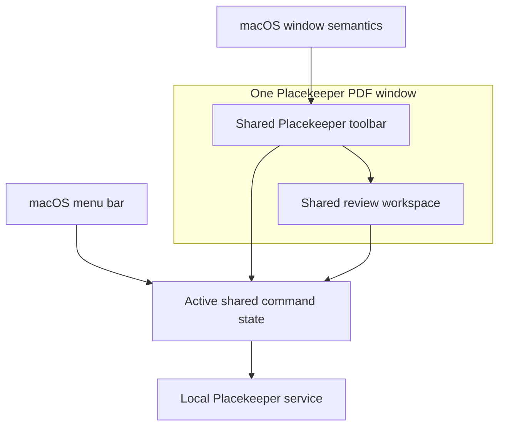
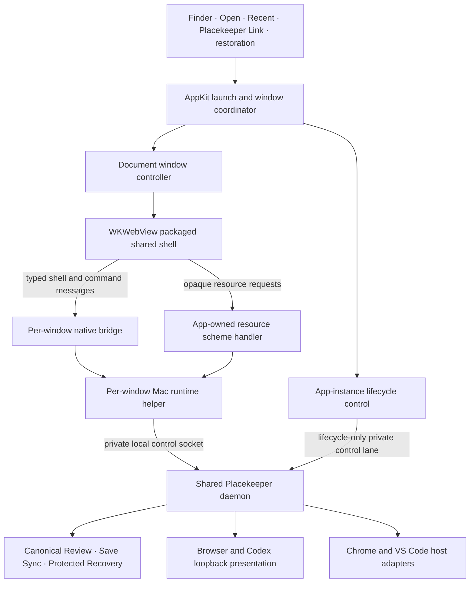
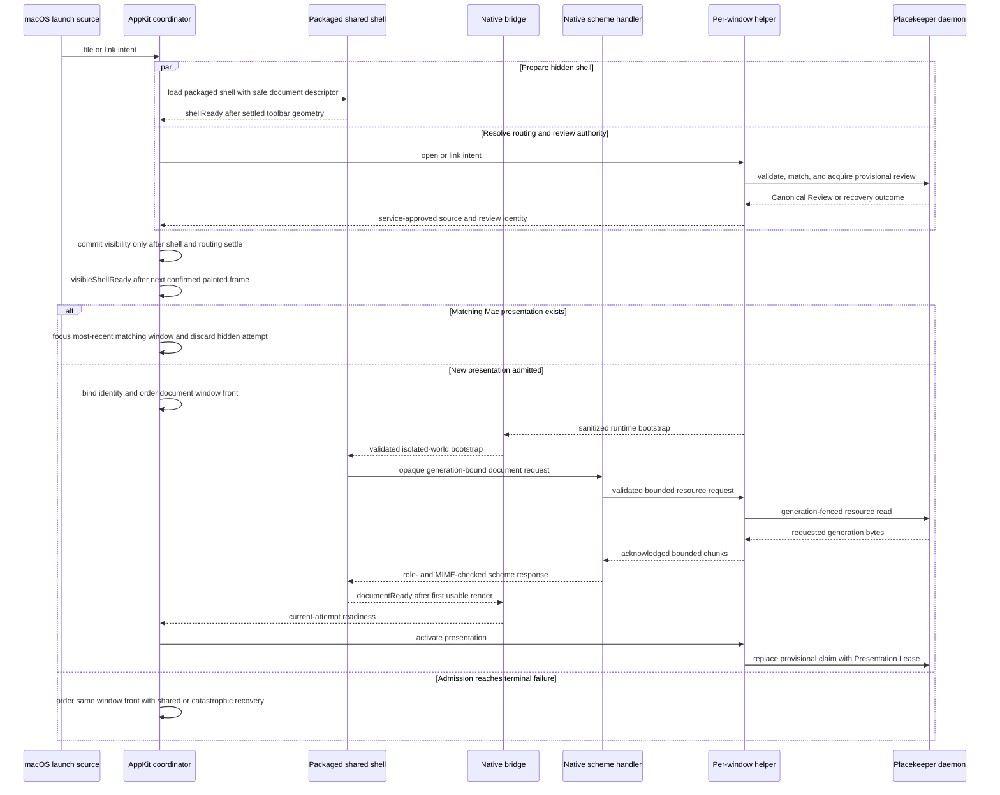
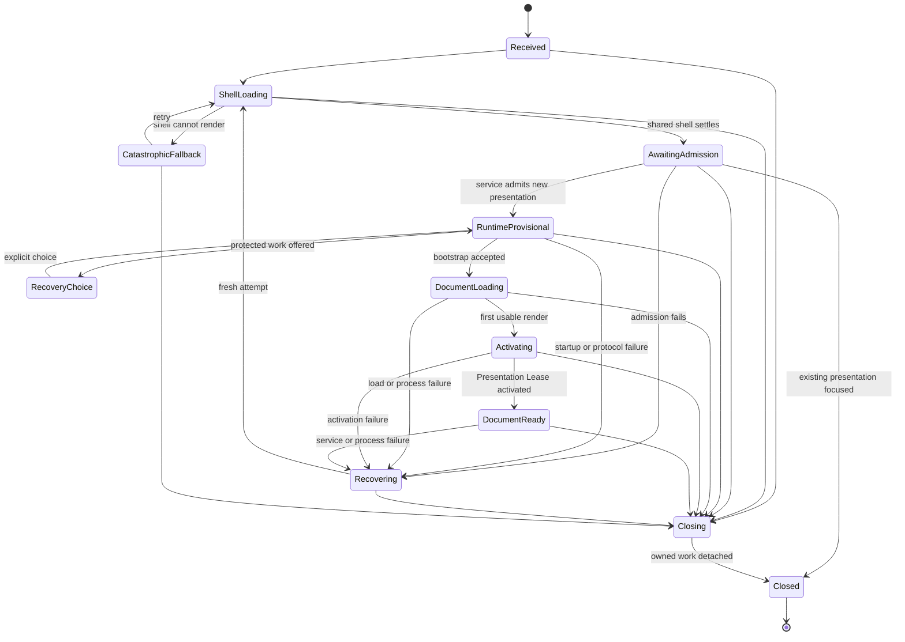
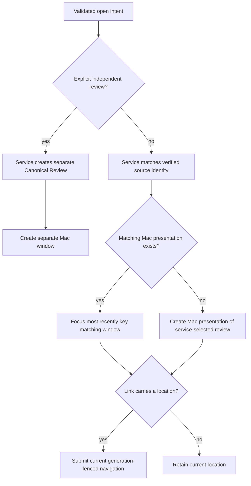

# Unified macOS Document Shell - Plan

## Goal Capsule

- **Objective:** A reviewer opening local PDFs on a Mac experiences Placekeeper as one responsive, branded document application from launch through review and recovery, without duplicated app chrome or visible transport URLs.
- **Means:** Use a document-first AppKit shell whose WKWebView loads the shared Placekeeper client from packaged content and reaches the existing service through a first-class Mac Review Host Runtime (KTD1-KTD5).
- **Product authority:** This work owns the Mac window model, titlebar composition, pre-ready and failure states, native command projection, and Mac packaging. The shared client and local service retain review, document, save, link, and recovery authority.
- **Execution profile:** Deep, security-sensitive, cross-host code change with a risk-first native vertical slice before bundle-entry cutover.
- **Stop conditions:** Stop before production cutover if any stop-class risk in the Planning Contract remains open, if the Product Contract would require a second maintained toolbar, or if installed evidence cannot meet the Success Criteria.
- **Tail ownership:** U8 owns the final installed-artifact, cross-host, accessibility, performance, and cleanup evidence. U7 may switch the production bundle entry point only after the U0 feasibility gate and U1-U6 production gates pass.
- **Open blockers:** None. The confirmed technical defaults and bounded stop conditions below make the artifact executable.

---

## Product Contract

### Summary

Create a document-first macOS host that presents the shared Placekeeper toolbar as its titlebar and opens one window per PDF.
The plan covers the startup, host-boundary, command-state, lifecycle, packaging, signing, upgrade, accessibility, and installed-app work needed for production while treating browser, Codex, Chrome, and VS Code as compatibility targets rather than redesign targets.

### Problem Frame

The production Finder entry point obtains a Loopback Review URL and asks macOS to open it externally.
An AppKit window can hide that URL, but wrapping the existing review page unchanged produces two competing layers of application chrome: a native titlebar and a second web-rendered document bar.
The repeated title and web controls reveal the wrapper even when the underlying review flow works.

Replacing the shared bar with stock macOS controls would remove that duplication at the cost of a separate Mac interface.
Placekeeper instead needs the branded integration common to modern desktop applications: native window behavior around one product-owned command surface.

### Key Decisions

- **Use an AppKit and WKWebView shell.** (session-settled: user-approved — chosen over Electron: retain the shared client in a smaller, more Mac-native application boundary.) Governs R1, R20-R21.
- **Make the shared Placekeeper toolbar the sole visible titlebar.** (session-settled: user-directed — chosen over a stock native toolbar and a native-title-plus-web-context-strip layout: remove duplicated chrome without losing Placekeeper's identity.) Governs R1-R5.
- **Keep the toolbar nearly identical across hosts.** (session-settled: user-directed — chosen over a Mac-specific layout or visibly tailored control skin: users should recognize one Placekeeper interface everywhere.) Governs R2-R3, R22-R23.
- **Keep the app document-first.** (session-settled: user-directed — chosen over a lightweight home or persistent workspace: the PDF review remains the product's organizing object.) Governs R6-R9.
- **Give each PDF its own window.** (session-settled: user-directed — chosen over one reusable window and native tabs: concurrent reviews should remain independent.) Governs R6-R9, R17.
- **Show the final chrome while loading.** (session-settled: user-directed — chosen over a branded launch handoff and a ready-only reveal: loading should be a state of Placekeeper rather than a transition into it.) Governs R10-R12, R29.
- **Recover inside the document window.** (session-settled: user-directed — chosen over explicit or automatic browser fallback: failure must not expose the host boundary.) Governs R13-R14, R30.
- **Integrate the full macOS command surface.** (session-settled: user-directed — chosen over document basics or a minimal app menu: native behavior should complement the branded toolbar.) Governs R15-R19, R33.
- **Keep one review authority.** (session-settled: user-approved — chosen over moving review or persistence logic into the Mac shell: every host should continue to share review behavior and durable state.) Governs R20-R25, R31-R32, R35-R37.
- **Restore ordinary document windows without restoring live authority.** (session-settled: user-approved — chosen over persisting live sessions or silently recreating independent forks: restoration should re-enter through ordinary service authorization.) Governs R34.
- **Permit a minimal native catastrophic fallback.** (session-settled: user-approved — chosen over a blank or crashed window, a duplicated native toolbar, or browser fallback: a window still needs bounded recovery when WebKit cannot render any web content.) Governs R13-R14, R30, R38.

The visible and behavioral ownership is:



### Requirements

**Unified visible shell**

- R1. In every state where WebKit can render the shared shell, a Mac document window shall show the shared Placekeeper toolbar in its titlebar region as the only visible top bar.
- R2. The Mac toolbar shall preserve the shared toolbar's semantic groups, order, labels, status meanings, and Warm Neutral visual language.
- R3. Mac-specific presentation changes shall be limited to traffic-light clearance, draggable space, titlebar geometry, full-screen behavior, and other host-required affordances.
- R4. Whenever WebKit can render the shared shell, the current PDF name and save or recovery status shall appear once in the shared toolbar while the same document identity remains available to macOS windowing and accessibility features.
- R5. No normal loading, review, recovery, or failure state shall display a Loopback Review URL or other internal transport detail.

**Document-window and launch lifecycle**

- R6. Each active PDF review shall have its own Mac document window.
- R7. Opening a PDF already represented by an active Placekeeper window shall focus that window; starting an independent review of the same PDF shall remain a separate explicit action.
- R8. Windows for different PDFs shall load, operate, enter recovery, and close independently without changing another review's page, zoom, edits, or window state.
- R9. Finder Open, Placekeeper Links, Open, and Open Recent shall all follow the same matching-window policy.
- R26. The app shall queue and process cold- and warm-launch file and link events exactly once, including pre-initialization events and batches containing multiple PDFs.
- R27. Matching-window decisions shall commit only from service-approved review and source identity so aliases, concurrent opens, cross-host sessions, and explicit forks have deterministic outcomes.
- R28. A Placekeeper Link targeting an existing Mac presentation shall focus that window and apply the requested location without creating a duplicate presentation.
- R34. Recent-document and restoration records shall contain no live authority; ordinary restoration shall reopen through the service, and independent same-file forks shall not restore automatically.

**Loading and failure continuity**

- R10. For an attempt that can render the shared shell, the first visible frame shall use the final toolbar geometry and known document identity rather than a splash screen, temporary titlebar, or blank browser surface.
- R11. Before a document capability is ready within the shared shell, each toolbar control shall remain in its final position with an honest unavailable value and disabled action state.
- R12. Readiness shall replace only the workspace loading content with the first usable PDF view; document identity and toolbar geometry shall not jump or remount.
- R13. A service-startup, bootstrap, document-load, or embedded-runtime failure shall remain in the same document window and follow the normative Recovery State and Action Contract below.
- R14. Whenever WebKit can render the shared shell, Protected Recovery and terminal recovery shall retain their existing outcomes while appearing within the stable Placekeeper window, with no automatic or suggested browser fallback.
- R29. Shell readiness, first-visible-shell readiness, runtime activation, and document readiness shall be distinct attempt-fenced milestones with bounded timeout and cancellation behavior. `shellReady` may occur while the candidate window is offscreen; `visibleShellReady` occurs only after routing commits, the window is visible, and a subsequent painted frame confirms the final toolbar geometry.
- R30. A WKWebView content-process termination shall revoke stale commands, resources, and presentation attachment before recovering in the same native window.
- R38. If WebKit cannot render the shared shell, this requirement supersedes R4, R10, R11, and R14 for that attempt: the same window may show only a minimal native surface containing document identity, Retry, Diagnostics, and Close until a fresh shell succeeds or the reviewer closes it. Any service-owned Protected Recovery or terminal-recovery outcome remains preserved but is presented only after a shared shell becomes available.

**macOS commands and window behavior**

- R15. Placekeeper shall expose applicable document and review commands through conventional Placekeeper, File, Edit, View, Window, and Help menus.
- R16. A macOS menu command and its shared-toolbar counterpart shall invoke the same active-review action and report the same availability and resulting state.
- R17. Changing the key window shall retarget menu commands to that window's review without affecting another open PDF.
- R18. The shell shall support standard macOS open, close, minimize, full-screen, recent-document, window-switching, Dock-reopen, and keyboard behaviors.
- R19. Titlebar drag regions shall not intercept interactive controls: each published region set shall carry a layout revision and window-geometry identity, update atomically, and fail closed with native drag overlays disabled while stale or transitioning. Every toolbar and menu action shall retain a usable keyboard and VoiceOver path, and every loading, readiness, recovery, replacement, and catastrophic-fallback transition shall follow the Accessibility Transition Contract below.
- R33. Native menus shall consume the shared client's command-state projection, prioritize native and web text editing correctly, and reject stale or wrong-window invocations.

**Shared authority, security, and cross-host continuity**

- R20. The local service shall remain authoritative for document identity, Canonical Review state, mutations, Save Sync, Protected Recovery, and Placekeeper Links.
- R21. The Mac host shall adapt window, menu, launch, and lifecycle behavior without creating a second review-state or command implementation.
- R22. Browser, VS Code, Chrome, Codex, and Mac presentations shall retain one recognizable toolbar structure and visual language, with host-dependent controls appearing only when their capability applies.
- R23. The toolbar shall retain the Responsive Toolbar Presentation contract in `docs/plans/2026-09-02-1014-feat-responsive-review-top-bar-plan.md`; the Mac titlebar safe area contributes to available-width calculation rather than creating a second layout.
- R24. Hosting the review client inside the Mac app shall preserve the existing local-only privacy boundary and capability-scoped session authority.
- R25. Closing a document window shall release only that presentation while preserving any Protected Recovery or pending save work according to the existing service contract.
- R31. The Mac Review Host Runtime shall use versioned, closed-schema, size-bounded messages, expose only per-window capabilities and opaque resource identities to web content, isolate review-helper failure to its owning window, and keep app-instance lifecycle control on a disjoint non-review lane.
- R32. Before activation, each admitted Mac window shall own at most one service-issued provisional claim; after successful activation, it shall own exactly one Presentation Lease instead. Cancellation, close, crash, failed activation, or web-view replacement shall release whichever lifecycle token the window owns exactly once.
- R35. Close and quit behavior shall distinguish unsubmitted UI drafts, acknowledged review mutations, active Save Sync, and Protected Recovery without overstating durability.
- R36. Packaged-shell startup shall reject incompatible app and daemon builds. Every bootstrapping or active Mac window shall participate in upgrade deferral, while a zero-window resident app shall remain registered through a narrow app-instance lifecycle channel and exit under controlled replacement without accepting a racing open.
- R37. Mac-specific protocol, CSS, and startup changes shall leave browser, Codex, Chrome, and VS Code transport, CSP, credential, and host-capability behavior unchanged.

### Key Flows

- F1. Open a local PDF
  - **Trigger:** The reviewer opens a PDF from Finder, Placekeeper, Open Recent, or a Placekeeper Link.
  - **Steps:** Placekeeper finds or creates the matching document window, presents its final toolbar, and resolves the review within the workspace.
  - **Outcome:** The reviewer reaches the usable PDF without seeing a URL, duplicate title, or shell replacement.
  - **Covers:** R1-R12, R20-R24, R26-R29, R31-R32.
- F2. Work with multiple PDFs
  - **Trigger:** The reviewer opens another PDF while one or more Placekeeper windows are active.
  - **Steps:** A different PDF receives an independent window; an already-open PDF brings its matching window forward after service validation.
  - **Outcome:** Every review retains its own document and presentation state.
  - **Covers:** R6-R9, R17, R25-R27, R32.
- F3. Use a native command
  - **Trigger:** The reviewer chooses an applicable macOS menu item or keyboard equivalent.
  - **Steps:** The command resolves against the key document window and runs through the active shared command state.
  - **Outcome:** The toolbar, workspace, and menu availability agree on the result.
  - **Covers:** R15-R19, R21, R33.
- F4. Recover from startup or load failure
  - **Trigger:** The service, review bootstrap, PDF, or embedded runtime cannot become ready.
  - **Steps:** The document window keeps its identity, applies the bounded automatic behavior for the classified failure, and exposes only the actions allowed by the Recovery State and Action Contract.
  - **Outcome:** The reviewer can understand, recover, reopen when applicable, inspect redacted diagnostics, or close the document without being redirected to a browser or guessing what an action will preserve.
  - **Covers:** R5, R10-R14, R20, R24-R25, R29-R32, R35-R38.
- F5. Resize or enter full screen
  - **Trigger:** The reviewer narrows, expands, or full-screens a document window.
  - **Steps:** The shared toolbar uses its existing responsive presentations within the Mac titlebar's measured usable width.
  - **Outcome:** Controls remain recognizable and operable without overlap, wrapping, or a second row.
  - **Covers:** R1-R4, R18-R19, R22-R23.
- F6. Follow a Placekeeper Link into an open review
  - **Trigger:** A confirmed Placekeeper Link resolves to a Canonical Review that already has a Mac presentation.
  - **Steps:** Placekeeper focuses the matching window and submits the generation-fenced location through the shared navigation coordinator.
  - **Outcome:** The existing review navigates once without consuming a redundant presentation or exposing path authority to web content.
  - **Covers:** R7, R9, R20, R24, R27-R28, R31.
- F7. Close or quit during work
  - **Trigger:** The reviewer closes a window or quits while bootstrap, mutation, Save Sync, or recovery work is active.
  - **Steps:** Placekeeper fences late callbacks, reaches the existing durability boundary, terminates the applicable per-window helper, releases only owned presentations, and lets service-owned work finish when required. After the last window closes, the resident app retains only lifecycle control; quit or replacement detaches that app instance before exit.
  - **Outcome:** The requested window closes without losing accepted work or disrupting another host or document, and a zero-window app remains responsive without retaining review authority.
  - **Covers:** R8, R20, R25, R29-R32, R35-R36.

### Acceptance Examples

- AE1. Stable first frame
  - **Covers:** R1-R5, R10-R11, R29.
  - **Given:** A large local PDF is opened while the service and PDF renderer are not yet ready.
  - **When:** The Placekeeper window first becomes visible.
  - **Then:** It shows one Warm Neutral toolbar with the filename once, final control positions, honest unavailable values, and no browser URL or temporary titlebar; only the painted frame after routing and visibility may publish `visibleShellReady`, and assistive technology encounters one document title and one loading status rather than duplicate chrome.
- AE2. Readiness without a shell swap
  - **Covers:** R10-R12, R29.
  - **Given:** A document window is displaying its loading workspace.
  - **When:** The requested generation's first usable PDF page and viewer capabilities become ready.
  - **Then:** The page replaces the loading content, controls enable and publish values in place, the toolbar does not move or remount, focus remains on the same semantic target when it still exists, and document readiness is announced once.
- AE3. Independent document windows
  - **Covers:** R6-R9, R17, R25, R27, R32.
  - **Given:** PDF A is open with an edited review and PDF B is closed.
  - **When:** The reviewer opens PDF B and later opens PDF A again.
  - **Then:** PDF B receives its own window, PDF A remains unchanged, and the ordinary second open of PDF A focuses its existing window.
- AE4. Active-window command targeting
  - **Covers:** R15-R19, R21, R33.
  - **Given:** PDF A and PDF B are open at different pages and zoom values.
  - **When:** PDF A becomes key and the reviewer invokes Zoom In from the View menu.
  - **Then:** Only PDF A changes, its toolbar publishes the resulting zoom, and menu availability matches the toolbar.
- AE5. Embedded startup failure
  - **Covers:** R5, R10, R13-R14, R24, R29, R38.
  - **Given:** A PDF window is opening and the local service cannot complete startup.
  - **When:** The startup attempt reaches a terminal failure.
  - **Then:** The same Placekeeper window follows the classified automatic-retry and action rules, announces the failure once, and presents recovery actions without opening a browser, revealing a Loopback Review URL, or closing another review. If WebKit cannot render, the native fallback exposes only document identity, Retry, Diagnostics, and Close, focuses Retry when the prior web focus was destroyed, and defers any richer recovery outcome until a fresh shared shell succeeds.
- AE6. Narrow and full-screen toolbar
  - **Covers:** R1-R4, R18-R19, R22-R23.
  - **Given:** A PDF is open in a Mac document window.
  - **When:** The window crosses responsive widths or enters and leaves full screen.
  - **Then:** Toolbar groups follow the shared responsive contract, preserve traffic-light and drag clearance, and remain keyboard and VoiceOver operable without wrapping. Native drag overlays disappear during layout transitions and return only after an atomically applied geometry revision matches the current window.
- AE7. Cross-host recognition
  - **Covers:** R2-R3, R22-R23, R37.
  - **Given:** The same available review capabilities are presented in Mac and another supported host.
  - **When:** Their top bars are compared at equivalent usable widths.
  - **Then:** Semantic order, labels, visual language, and responsive grouping agree apart from required host affordances.
- AE8. Cold multi-open
  - **Covers:** R6, R8-R9, R26-R27.
  - **Given:** Finder delivers three pre-launch URLs containing two distinct PDFs and one alias.
  - **When:** Placekeeper finishes app initialization and service validation.
  - **Then:** Two document windows appear in deterministic front order with no chooser flash, transient duplicate window, duplicate review, or lost event.
- AE9. Cross-host join and explicit fork
  - **Covers:** R7, R20, R27, R32.
  - **Given:** A PDF has an active Codex presentation but no Mac window.
  - **When:** The reviewer opens it normally, opens it normally again, and then chooses Open Independent Review.
  - **Then:** The first action creates a Mac presentation of the existing Canonical Review, the second focuses it, and the explicit action creates a separate Canonical Review and window.
- AE10. Existing-window link
  - **Covers:** R7, R9, R20, R28, R31.
  - **Given:** A page, item, or destination Placekeeper Link targets an open PDF.
  - **When:** The service accepts the link and its current generation.
  - **Then:** The matching window focuses and navigates once while preserving shared history semantics and creating no duplicate presentation.
- AE11. Fenced readiness
  - **Covers:** R10-R13, R29.
  - **Given:** Shell assets, daemon startup, bootstrap completion, and first-page rendering finish at different speeds across two attempts.
  - **When:** The older attempt completes after a retry has begun.
  - **Then:** Only the current attempt may change readiness, controls, focus, or announcements; `shellReady` from an offscreen candidate cannot satisfy the visible launch metric, and the first visible painted frame publishes `visibleShellReady` with final geometry.
- AE12. Menu and text targeting
  - **Covers:** R15-R19, R33.
  - **Given:** Two windows are open and a text editor has focus in one of them.
  - **When:** The key window changes while a menu is open and Undo is invoked.
  - **Then:** The invocation either reaches the captured current target once or fails stale, and editable-text Undo never becomes review Undo.
- AE13. Close during work
  - **Covers:** R8, R20, R25, R29, R32, R35-R36.
  - **Given:** One window is pre-activation, one has an accepted save in progress, and another host presents a third review.
  - **When:** The first two windows close and the app later quits.
  - **Then:** Provisional ownership and only those Presentation Leases and per-window helpers release, accepted save or Protected Recovery survives, and the other host remains active. After the last Mac window closes, only the resident app's lifecycle registration remains; quit or process death detaches it exactly once.
- AE14. Runtime recovery
  - **Covers:** R13-R14, R20, R24-R25, R29-R32, R35, R38.
  - **Given:** A per-window helper, the daemon connection, or the WebContent process dies before or after document readiness while another window remains healthy.
  - **When:** Placekeeper performs its bounded automatic attempt and the reviewer retries if needed.
  - **Then:** Only the affected native window follows the Recovery State and Action Contract, obtains fresh authority, rejects stale callbacks, preserves protected work, restores a valid semantic focus target or a defined fallback, announces the outcome once, and never opens a browser; the healthy window's helper and command cache remain intact. If the shared shell itself is unavailable, the native fallback remains limited to its four actions until a fresh shell can present the preserved recovery outcome.
- AE15. Recents and restoration
  - **Covers:** R9, R18, R20, R24, R27, R34.
  - **Given:** Successful, cancelled, missing, aliased, and independently forked opens exist in recent history or prior windows.
  - **When:** Open Recent or app restoration runs.
  - **Then:** Successful files appear once, failed or cancelled opens do not appear, stale files recover visibly, ordinary windows reopen through fresh authority, and forks do not auto-restore.
- AE16. Hostile bridge input
  - **Covers:** R24, R29-R33, R37.
  - **Given:** A wrong-frame, wrong-version, oversized, replayed, stale-generation, or path-bearing message reaches a Mac bridge boundary.
  - **When:** The bridge validates it.
  - **Then:** It fails closed without changing state, disclosing authority, or affecting another window.
- AE17. Installed native app
  - **Covers:** R1-R38.
  - **Given:** A signed, notarized, stapled release bundle is installed under quarantine on supported hardware.
  - **When:** Cold and warm Finder, URL, Open Recent, menu, full-screen, recovery, save-in-flight, zero-window residency, controlled update, and abrupt app-death flows run on macOS 13 and the current release.
  - **Then:** The native shell, CLI integrations, security boundaries, keyboard and VoiceOver paths, transition announcements and focus restoration, and Success Criteria all pass without network access beyond Placekeeper's existing local service boundary.
- AE18. Cross-host regression
  - **Covers:** R20-R24, R36-R37.
  - **Given:** The Mac host changes and zero-default titlebar inputs are present in the shared client.
  - **When:** Existing browser, Codex, Chrome, and VS Code acceptance suites run.
  - **Then:** Readable URL reload, task binding and reconnect, native-extension runtime, editor panel behavior, shared toolbar snapshots, and daemon upgrade behavior remain unchanged.

### Accessibility Transition Contract

Focus and announcement behavior is part of the state machine, not an incidental rendering effect. A stale or hidden attempt may never move focus or announce. Messages below are semantic and localizable; each transition announces at most once for the current attempt.

| Transition | Announcement | Focus rule |
|---|---|---|
| Loading shell to document ready | Announce that the document is ready after the current generation's first usable page is independently confirmed. | Preserve the current semantic target when it still exists and is enabled. If focus was inside replaced loading content, move to the document workspace heading or canvas entry point. Never steal focus from a persistent toolbar control. |
| Shared-shell state to recoverable failure | Announce the classified failure and that recovery actions are available. | Preserve a still-valid persistent toolbar target; otherwise move to the first enabled recovery action defined by the Recovery State and Action Contract. |
| Recoverable failure to retry or reconnect | Announce that Placekeeper is retrying once. | Keep focus on the stable retry/status target while the replacement is prepared. Do not move focus into an offscreen attempt. |
| WebKit replacement to ready shared shell | Announce that the review was restored only after the replacement is visible and current. | Restore the same semantic control only if it exists, is enabled, and belongs to the current generation; otherwise use the document workspace entry point when ready or the first enabled recovery action when recovery remains visible. |
| Shared shell to Protected Recovery or terminal recovery | Announce the service-owned outcome and available actions once. | Preserve a valid persistent target; otherwise focus the first action explicitly advertised by that outcome. Do not synthesize a generic action or focus target. |
| Any web state to catastrophic native fallback | Use one native accessibility announcement that the document could not be displayed. | If web focus was destroyed, focus native Retry. Expose document identity once, followed by Retry, Diagnostics, and Close in conventional keyboard and VoiceOver order. |

### Recovery State and Action Contract

The following action meanings are invariant:

- **Retry** keeps the native window and original source intent but creates a fresh attempt, per-window review helper, WKWebView, provisional claim or attachment, and resource generation. It never reloads stale privileged state or reuses a failed attempt's authority.
- **Reopen** abandons the current source attempt and enters the ordinary Open flow for a user-selected or revalidated source. It never bypasses service admission and appears only when the source is missing, unreadable, changed, or otherwise requires a new open decision.
- **Diagnostics** exposes only KTD14's positive-schema, redacted evidence and never copies a URL, path, filename, document content, review text, credential, raw exception, or helper output.
- **Close** releases exactly the window-owned provisional claim or Presentation Lease and attempt resources; it does not cancel service-owned Save Sync or Protected Recovery work.

At most one bounded automatic replacement may occur for an error explicitly classified as transient. Protocol-version, integrity, hostile-input, resource-budget, and service-declared terminal failures never auto-loop. A new incident after a successful ready state receives a new bounded allowance; repeated failure within the same incident requires an explicit action.

| Failure state | Visible and automatic behavior | Available actions and outcomes |
|---|---|---|
| Service startup, bootstrap, or document load fails before activation while the shared shell renders | Keep final toolbar geometry and document identity. Perform at most one automatic fresh attempt only when the error is explicitly transient; otherwise enter recovery immediately. | **Retry** is available for retryable failures. **Reopen** appears only for source-invalid states. **Diagnostics** and **Close** are available. No Presentation Lease survives the failed attempt. |
| Per-window review helper or daemon connection is lost after activation | Keep the shared shell visible, invalidate that window's command/resource caches, and perform one fresh automatic attachment for the incident. Other window helpers and hosts remain attached. | If automatic recovery fails, offer **Retry**, **Diagnostics**, and **Close**. Offer **Reopen** only if the service subsequently classifies the source as invalid. Accepted mutations and service-owned saves remain canonical. |
| WebContent terminates | Keep the native window identity while preparing a fresh offscreen WKWebView and per-window helper. Perform one automatic replacement for the incident and commit it only after current `shellReady`. | If replacement fails, offer **Retry**, **Diagnostics**, and **Close**; **Reopen** follows the same source-invalid rule. Restore only safe page, zoom, and semantic-focus presentation state. |
| Service returns Protected Recovery | Render the existing Protected Recovery workspace under the shared toolbar. The generic automatic-retry budget does not reinterpret or consume the service-owned recovery choice. | Show exactly the actions and outcomes advertised by the existing Protected Recovery contract. Do not synthesize generic **Retry** or **Reopen**. **Close** detaches the presentation while protected work remains service-owned. |
| Service returns terminal recovery | Render the existing terminal-recovery workspace under the shared toolbar with no automatic retry. | **Retry** is disabled. **Reopen** is available only through ordinary fresh admission when a source can be selected or revalidated; **Diagnostics** and **Close** remain available. |
| WebKit cannot render the shared shell | Show only the native catastrophic surface and preserve any richer service-owned outcome out of view. Never open or suggest a browser and never auto-loop. | Expose document identity, **Retry**, **Diagnostics**, and **Close** only. **Retry** creates a wholly fresh shared-shell attempt; **Reopen** is absent. Protected Recovery or terminal recovery appears only after a shared shell returns. |

### Success Criteria

| ID | Release gate |
|---|---|
| SC1 | Frame-by-frame cold and warm launch captures contain zero white flashes, visible URLs, duplicated titles, stacked top bars, toolbar geometry jumps, or duplicate toolbar accessibility nodes. |
| SC2 | On the qualification Apple-silicon Mac, p95 launch-intent-to-`visibleShellReady` is at most 1,000 ms for cold launches and 500 ms for additional warm windows over at least 20 samples per case. The signpost is attempt-fenced and may fire only after window-routing commit, visible ordering, and the next confirmed painted frame; pre-visibility `shellReady` never satisfies this gate. |
| SC3 | On the same machine, p95 launch-intent-to-first-usable-page is at most 4 seconds for the standard text fixture and 10 seconds for the image-heavy fixture over at least 20 samples per case; an independent pixel-and-navigation oracle, rather than the readiness signpost itself, determines success. |
| SC4 | For the corpus named by the versioned Mac qualification manifest, both peak and 60-second steady physical footprint shall pass: the native app plus lifecycle control is at most 150 MiB, the isolated app/lifecycle-control/per-window-helper/WebKit process coalition for one window is at most 350 MiB, and each individual second-through-fourth-window-plus-helper increment is at most 225 MiB. The shared daemon is reported separately and its same-fixture peak and steady deltas may not regress from the Loopback Review baseline by more than the greater of 10% or 32 MiB; shared mappings shall not be double-counted. |
| SC5 | After every one of 12 sequential open-close cycles, each app-owned window, per-window helper, bridge, task, worker, scheme task, resource stream, handler, observer, command snapshot, provisional claim, and Presentation Lease count shall return to baseline within 2 seconds with no late mutation. At zero windows, exactly the resident app's capability-minimal lifecycle registration may remain; controlled exit or abrupt app death shall return that registration to baseline within the same deadline. Service-owned saves are observed separately. No app-owned high-water counter may grow across cycles, and the longer process-coalition footprint may remain at most 150 MiB above the first-cycle steady value for no more than 60 seconds. |
| SC6 | The exact installed release passes one-, two-, and four-window isolation; macOS 13 and current-macOS behavior; VoiceOver and Full Keyboard Access including transition focus and announcements; full-screen and right-to-left geometry; sleep-wake; isolated helper, lifecycle-control, service, and WebContent recovery; signing, notarization, stapling, Gatekeeper, and old-bundle upgrade gates under the versioned qualification manifest. |

### Scope Boundaries

#### Deferred to Follow-Up Work

- Mac App Store distribution, App Sandbox adoption, security-scoped bookmarks, and sandboxing the Node service remain a separate architecture and product decision.
- Automatic restoration of multiple independent same-file fork windows waits for a durable, non-secret Canonical Review handle.
- Replacing the existing shared save-destination workflow with Mac-only attached sheets is deferred; this plan exposes the existing safe actions through native menus without changing Save Sync semantics.
- Intel or universal-binary distribution remains deferred while the manifest supports only Apple silicon.

#### Outside this Product's Identity

- Do not add a desktop home, PDF library, app-wide sidebar, persistent workspace, or native tab system.
- Do not adopt Electron for the production Mac shell.
- Do not add a dark theme; the existing Warm Neutral light visual language remains authoritative.
- Do not redesign PDF rendering, Annotation Tray behavior, contextual composers, review semantics, toolbar control meanings, or unsubmitted-draft durability.
- Do not replace the local service, expose its transport as product UI, create Mac-only review persistence, or add a second updater.
- Do not redesign Chrome, VS Code, browser, or Codex hosts beyond shared changes required to prevent regression.
- Do not redirect a Mac failure to an external browser.

### Dependencies and Assumptions

- The existing macOS 13 and Apple-silicon deployment baseline remains authoritative.
- The Review Host Runtime, Canonical Review, Presentation Lease, Save Sync, Protected Recovery, Responsive Toolbar Presentation, Warm Neutral, and upgrade-lifecycle contracts remain authoritative.
- Release qualification has access to macOS 13 and current-macOS Apple-silicon systems with 16 GiB or more memory.
- Native builds use a selected full Xcode toolchain whose SDK supports the macOS 13 deployment target; the direct `swiftc` workaround used by the disposable prototype is not a production build path.
- Browser and Codex continue to use the local service's Loopback Review URL because those hosts do not share the Mac app's trusted native bridge.

### Sources and Research

- `CONCEPTS.md` defines Placekeeper, Loopback Review URL, Review Host Runtime, Review Runtime Protocol, Canonical Review, Presentation Lease, Save Sync, Protected Recovery, Responsive Toolbar Presentation, and Warm Neutral.
- `docs/plans/2026-08-06-001-feat-local-placekeeper-plan.md` establishes the shared local client, Finder launch coverage, session scoping, and service authority.
- `docs/plans/2026-08-17-1104-feat-reloadable-placekeeper-review-links-plan.md` establishes capability-free readable routes, explicit link recovery, and native custom-URL admission.
- `docs/plans/2026-09-02-1014-feat-responsive-review-top-bar-plan.md` establishes the measured 58 px one-row shared toolbar.
- `docs/solutions/architecture-patterns/shared-production-review-client-host-runtime-boundaries.md` governs host adapters, resource delivery, activation, revision fencing, and Presentation Lease cleanup.
- `docs/solutions/architecture-patterns/reloadable-local-review-url-authority-boundaries.md` prevents live browser authority from becoming durable Mac restoration state.
- `docs/solutions/architecture-patterns/upgrade-safe-shared-per-user-daemon-lifecycle.md` governs aggregate activity and bundle replacement while other hosts or saves remain active.
- `docs/solutions/architecture-patterns/recoverable-editable-pdf-annotation-autosave.md` governs close-during-save and the distinction between protected and saved work.
- `docs/solutions/design-patterns/measured-one-row-responsive-review-toolbar.md` governs semantic toolbar collapse and available-width measurement.
- `apps/web/src/production-entry.tsx`, `apps/web/src/app/ProductionReviewApp.tsx`, and `apps/web/src/review/ReviewChrome.tsx` show the current post-bootstrap mount, readiness seam, command ownership, and toolbar layout.
- `packages/core/src/review-runtime-protocol.ts`, `apps/web/src/host/vscode-runtime.ts`, and `apps/service/src/browser/chrome-runtime.ts` provide the versioned runtime, sanitizer, idempotency, resource, and lifecycle patterns to extend.
- `apps/service/src/sessions/session-broker.ts`, `apps/service/src/host/launch-control.ts`, and `apps/service/src/host/service-daemon.ts` provide Canonical Review matching, private control transport, fixed-origin daemon, and aggregate lifecycle authority.
- `packaging/macos/app-bundle.json`, `packaging/macos/build-app.ts`, and `packaging/macos/smoke-installed.ts` define the current AppleScript-droplet bundle, embedded CLI, signing, installed smoke, and upgrade boundaries.
- `apps/electron-spike/RESULTS.md` remains a non-adopted comparator for renderer feasibility, launch, and memory.
- Apple's [NSWindowController](https://developer.apple.com/documentation/appkit/nswindowcontroller), [full-size content view](https://developer.apple.com/documentation/appkit/nswindow/stylemask-swift.struct/fullsizecontentview), [standard window buttons](https://developer.apple.com/documentation/appkit/nswindow/standardwindowbutton(_:)), and [window dragging](https://developer.apple.com/documentation/appkit/nswindow/performdrag(with:)) documentation support a normal titled window with hidden native title, measured traffic-light geometry, and native drag handling.
- Apple's [custom WebKit scheme handler](https://developer.apple.com/documentation/webkit/wkurlschemehandler), [replying script bridge](https://developer.apple.com/documentation/webkit/wkscriptmessagehandlerwithreply), [content worlds](https://developer.apple.com/documentation/webkit/wkcontentworld), and [nonpersistent data store](https://developer.apple.com/documentation/webkit/wkwebsitedatastore/nonpersistent()) documentation define the selected packaged-content and per-window WebKit boundary.
- Apple's [WKProcessPool](https://developer.apple.com/documentation/webkit/wkprocesspool) guidance says multiple pools no longer control process assignment, so this plan requires lifecycle isolation rather than one WebContent process per PDF.
- Apple's [state restoration](https://developer.apple.com/documentation/appkit/restoring-your-app-s-state-with-appkit), [code-signing](https://developer.apple.com/library/archive/technotes/tn2206/), and [notarization](https://developer.apple.com/documentation/security/notarizing-macos-software-before-distribution) guidance informs restoration data, nested signing, and release gates.

---

## Planning Contract

This Planning Contract preserves the Product Contract's R1-R38, F1-F7, and AE1-AE18 behavior and may not weaken the existing shared authority contracts it cites.

### Key Technical Decisions

- KTD1. **Load a capability-free packaged Mac shell, not the Loopback Review URL.** (session-settled: user-approved — chosen over loading the current loopback review page inside WKWebView: the real shared toolbar must exist before service startup and no browser transport should enter Mac web content.) Build a Mac-specific web entry from the shared components and serve it through app-owned `placekeeper-app` and `placekeeper-resource` scheme handlers. Governs R1-R5, R10-R14, R20-R24, R29-R31, R37-R38.
- KTD2. **Make `macos` a first-class Review Host Runtime with a closed contract at every hop.** Define four non-interchangeable review surfaces: host-neutral semantic runtime messages between the packaged page and Swift bridge; immutable manifest-keyed bundle reads through `placekeeper-app`; opaque window-, attempt-, role-, and generation-bound document reads through `placekeeper-resource`; and a separately versioned framed Swift-to-Node helper protocol over the daemon control channel. No helper or daemon payload reaches the page except through the receiving Swift bridge or scheme handler's own validation. Each Mac window attempt owns one supervised, non-authoritative review helper; a helper may obtain only that window's capabilities and resources, and its crash invalidates only that window's connection and command cache before a fresh helper and attempt attach. The daemon remains authoritative for Canonical Review identity, replay history, provisional claims, Presentation Leases, fair app-wide quotas, and service-owned work. Separately, the Swift app owns exactly one narrow app-instance lifecycle-control channel or helper with no review, command, document, resource, or persistence capability; it registers process/start/build identity, reports window/bootstrap activity, coordinates prepare-for-replacement and acknowledgement, and lets control-channel EOF or parent death atomically detach all ownership registered to that app instance. The same isolated-world event path carries ordered, attempt/session/generation/revision-fenced invalidations back to each window, with bounded queues and explicit stale-event drops. Keep launch provenance separate from runtime-host identity, and sanitize projections so paths, credentials, capabilities, task identities, socket details, and lifecycle-token values never enter the page. Governs R20-R24, R27-R32, R36-R37.
- KTD3. **Mount the actual shared shell before runtime bootstrap.** (session-settled: user-directed — chosen over a splash, delayed final chrome, or duplicated native toolbar: the final Placekeeper shell must remain stable through loading.) Refactor startup around one persistent shell instance per WKWebView attempt, seeded with a sanitized filename and unavailable controls; emit `shellReady` after styles and measured layout settle, activate the runtime separately, and emit `documentReady` only after the requested generation has a non-zero visible render and usable navigation. A recovery that replaces WebKit prepares an equivalent fresh shell offscreen and commits it only after its own `shellReady`, preserving visible geometry and document identity across attempts. After routing commits and the candidate window is ordered visible, the native host waits for the next confirmed painted frame before emitting `visibleShellReady`; only that milestone owns the visible-launch budget. Readiness and failure transitions publish one current-attempt semantic accessibility event and preserve or restore focus according to the Accessibility Transition Contract. Use a 3-second shell deadline and a 20-second document deadline to enter the in-window failure state. Governs R1-R4, R10-R13, R19, R29, R38.
- KTD4. **Use a normal full-size titled AppKit window with web content in the titlebar region.** (session-settled: user-directed — chosen over stock toolbar chrome, a borderless window, or a second titlebar view: preserve native window behavior around the shared toolbar.) Hide the visual native title and separator, retain `title` and `representedURL`, measure real standard-window-button frames, and feed safe-area variables to the shared responsive layout. Every web-published noninteractive drag-region set carries a monotonic layout revision plus the current window-geometry identity; the native host applies the whole set atomically and disables drag overlays whenever the identity or revision is stale or a resize, full-screen, scale, direction, or accessibility-driven layout transition is in progress. Governs R1-R4, R18-R19, R22-R23.
- KTD5. **Own one `NSWindowController` and fresh WKWebView context per Mac window, with one lifecycle token at a time.** (session-settled: user-directed — chosen over `NSDocument`, native tabs, or a reusable web view: service-owned document and save identity must not become AppKit document authority.) A window holds a provisional claim until document validation and first usable render permit activation; activation atomically replaces that claim with one Presentation Lease. The app coordinator single-flights provisional source intents, indexes active windows by service-approved identity, focuses the most recently key matching Mac presentation after forks, and creates a Mac presentation when the Canonical Review exists only in another host. Governs R6-R9, R17, R20-R21, R25-R27, R32.
- KTD6. **Create one shared semantic command surface and project its cached state to AppKit.** (session-settled: user-directed — chosen over a minimal menu or native reimplementation: menus and toolbar controls must be alternate entrances to the same actions.) The shared client owns command IDs, labels, availability, checked state, focus context, and invocation; each window caches a generation- and snapshot-revision-fenced projection for synchronous menu presentation only. The cache never authorizes work: each review command crosses the current runtime attempt and is revalidated against current service authority, while native window commands and Cocoa text commands remain outside the review catalog. Editable focus uses the WebKit responder chain, Mac-owned shortcuts suppress matching web handlers, and no misleading manual Save command is added to the autosave model. Governs R15-R19, R21, R33.
- KTD7. **Fence every per-window attempt and recover by replacement.** (session-settled: user-directed — chosen over browser fallback or blind reload: recovery must preserve the Placekeeper window and fresh authority.) Use an explicit window-attempt state machine, logical-command idempotency keys, and the Recovery State and Action Contract's one bounded automatic replacement allowance for explicitly transient incidents. Retry creates a fresh per-window review helper, runtime attachment, and WKWebView rather than reloading failed privileged state; restore only safe page, zoom, and current semantic-focus presentation after the new generation is visibly ready. Cancellation and attempt replacement always beat a deadline. Bootstrap, resource, and reconnect deadlines consume accumulated awake execution time rather than wall time: suspend pauses the remaining active-time budget, every resume re-arms that remainder, and exhaustion of the original bounded active-time budget enters recovery. Governs R8, R10-R14, R19, R25, R29-R32, R35-R38.
- KTD8. **Make each WebKit configuration ephemeral, closed, and non-networked.** Create a new configuration, content controller, isolated content world, and nonpersistent website data store per window. Enforce page egress twice: a deny-by-default packaged-shell CSP and an independent WebKit content rule reject HTTP(S), WebSocket, beacon, form, remote image/style/font/worker, and redirect loads while permitting only manifest-owned worker and WASM assets. Native policy may open only compile-time-allowlisted external schemes after a main-frame user gesture; those URLs never load in the WKWebView. The bundle scheme accepts only immutable manifest keys under a canonical packaged root, and the resource scheme accepts only current opaque role-bound identities with verified length, digest, PDF signature, MIME, ordering, and bounded range semantics; neither accepts ambient authority, alternate methods, userinfo, ports, traversal, or free-form queries. If bounded delivery materializes a PDF, the service owns a mode-0700 staging root and creates a mode-0600 regular file exclusively without following links; it verifies canonical containment, length, and digest, binds the artifact to one attempt, and deletes it on success, cancellation, replacement, close, crash reconciliation, and next-startup reconciliation. Disable popups, file uploads, downloads, media capture, release inspection, and arbitrary navigation; remove handlers, rules, tasks, delegates, outstanding tasks, and staged artifacts on every teardown. Do not use `WKProcessPool` as an isolation control, and do not add an ATS local-network exception because the selected WKWebView path performs no HTTP load. Governs R5, R24, R29-R32, R37.
- KTD9. **Restore ordinary windows through fresh service admission.** (session-settled: user-approved — chosen over restoring live sessions or independent forks: durable restoration must not become authority.) Persist only file identity, window UUID and frame, and optional page and zoom; add recents only after service acceptance, deduplicate aliases, surface stale entries visibly, and make Dock reopen show the most recent window or Open PDF when none exists. Governs R9, R18, R24, R27, R34.
- KTD10. **Ship the first native release as Developer ID, hardened-runtime, notarized, and non-sandboxed.** (session-settled: user-approved — chosen over making App Sandbox and Mac App Store compatibility part of this cutover: sandboxing the embedded Node service is a separate architecture project.) Retain the Apple-silicon and macOS 13 baseline. Governs R18, R24, R36.
- KTD11. **Use a SwiftPM native target and restructure the existing bundle instead of adding a second updater.** Replace the AppleScript droplet as `CFBundleExecutable` only after qualification, keep `Contents/MacOS/placekeeper` as the integration CLI, move each Node helper Mach-O into `Contents/Helpers`, and include the native executable, per-window review helper, lifecycle-control helper or channel, Mac web assets, protocols, and daemon in one compatibility handshake and complete artifact identity. Every Swift-to-helper and helper-to-daemon launch constructs a minimal allowlisted environment containing only required Placekeeper values and sanitized system values, explicitly removing Node and dynamic-loader injection variables including `NODE_OPTIONS`, `NODE_PATH`, `DYLD_*`, and `LD_*`. The app intentionally remains resident after its last window closes: all per-window review helpers exit, while the capability-minimal lifecycle-control channel remains registered. An active window or bootstrap defers replacement. For an idle resident app, the updater sends prepare-for-replacement; Swift atomically refuses new opens, acknowledges only after its app-instance ownership is detached, and exits before on-disk replacement. Control-channel EOF, parent death, crash, or `SIGKILL` also causes daemon-side app-instance detachment, and the new build may launch only after replacement completes, so a warm open cannot combine an old process with new assets. Sign nested code inside-out against exact per-Mach-O entitlement allowlists, and reject any unexpected entitlement rather than treating a valid signature as proof of least privilege. Governs R18, R20-R22, R24-R25, R36-R37.
- KTD12. **Use a minimal native surface only for catastrophic shell unavailability.** (session-settled: user-approved — chosen over a blank window, duplicated command toolbar, or browser fallback: the reviewer still needs a bounded path when no web UI can exist.) This surface owns no review commands or persistence, does not present Protected Recovery or terminal-recovery outcomes, and disappears only when a fresh shared shell has reached `shellReady` and commits visibly; the service preserves any such outcome until that shared shell can render it. It emits one native accessibility announcement and exposes document identity, Retry, Diagnostics, and Close in that order, with Retry focused only when the failed web focus no longer exists. Governs R13-R14, R19, R30, R38.
- KTD13. **Keep browser and Codex transport unchanged.** (session-settled: user-approved — chosen over routing every host through the Mac bridge: the native bridge is trusted only inside the packaged Mac app.) Shared startup and toolbar changes use zero-default Mac inputs so browser readable URLs, Codex binding, Chrome native runtime, and VS Code webview authority keep their current paths. Governs R20-R24, R37.
- KTD14. **Measure the installed release with a versioned qualification contract, positive-schema diagnostics, and deterministic ownership counters.** Pin fixture hashes, byte and page counts, content classes, late-cross-reference and adversarial-parser cases, start/end events, cold/warm daemon and app states, cache policy, repetitions, percentile calculation, run order, concurrency, hardware/OS/power metadata, thresholds, per-window decode/render CPU and decoded-byte budgets, and exact stapled build identity in a fail-closed Mac manifest. Record monotonic launch, `shellReady`, `visibleShellReady`, document readiness, recovery, command, resource, lease, close, and update milestones with opaque correlation IDs. Diagnostics may contain only enumerated error codes, bounded counters and timings, and build identities—never raw frames, exceptions, helper output, URLs, filenames, paths, review text, document bytes, credentials, task IDs, capabilities, or lifecycle-token values. Deterministic app-owned counts are the short-deadline cleanup gate; isolated physical-footprint measurements and separately attributed daemon deltas own SC4-SC5. Governs R5, R24-R25, R29-R32, R35-R37.

### High-Level Technical Design

These diagrams fix authority boundaries, ordering, and failure ownership without prescribing class signatures or message layouts.

**Component and data-flow topology**



**Open-to-ready protocol sequence**



**Steady-state command and invalidation path**

```mermaid
sequenceDiagram
  participant Menu as AppKit menu
  participant Web as Shared command surface
  participant Bridge as Native bridge
  participant Host as Per-window helper
  participant Service as Placekeeper daemon
  Web-->>Bridge: safe command snapshot for current attempt
  Bridge-->>Menu: cache presentation state only
  Menu->>Bridge: invoke against captured key window and snapshot
  Bridge->>Web: invoke semantic command once
  Web->>Bridge: fenced runtime command
  Bridge->>Host: validated window request
  Host->>Service: authorize and execute current command
  Service-->>Host: result plus current revision
  Host-->>Bridge: bounded typed result
  Bridge-->>Web: isolated-world result
  Service-->>Host: ordered invalidation or availability change
  Host-->>Bridge: current-window fenced event
  Bridge-->>Web: typed event; stale attempts drop
  Web-->>Bridge: replacement command snapshot
```

**Per-window attempt lifecycle**



The visibility commit waits for both shell preparation and a routing outcome; hidden alias attempts never flash a second window. All local deadlines follow KTD7's suspension rule, so sleep cannot turn a valid in-flight attempt into an immediate false timeout on wake.

**Matching-window decision flow**



### Output Structure

- `apps/macos/`
  - `Package.swift` declares the macOS 13 AppKit/WebKit executable, test library boundaries, and installed-test helper targets.
  - `Sources/PlacekeeperMac/` contains app lifecycle, launch coordination, window control, titlebar geometry, WebKit policy, scheme handlers, bridge, menus, restoration, recovery, and diagnostics.
  - `Tests/PlacekeeperMacTests/` contains pure Swift policy, routing, state-machine, command-cache, restoration, and teardown tests.
- `apps/web/`
  - `macos.html`, `vite.macos.config.ts`, and `src/macos-entry.tsx` define a separately packaged Mac entry built from shared review components.
  - `src/host/macos-runtime.ts` adapts the Mac bridge to the Review Host Runtime.
  - `src/review/review-command-surface.ts` becomes the shared semantic command owner used by toolbar, shortcuts, and native-menu projection.
- `apps/service/src/macos/` contains the supervised per-window review helper, capability-minimal app-instance lifecycle control, daemon-side Mac runtime manager, quota and backpressure policy, window channels, and lifecycle adapter.
- `packages/core/src/macos-shell-protocol.ts` contains the closed semantic page-to-Swift shell, command, readiness, event, and lifecycle envelopes shared by TypeScript validators and Swift fixtures.
- `packages/core/src/macos-helper-protocol.ts` separately contains disjoint closed Swift-to-Node per-window review and app-instance lifecycle lanes; custom-scheme URL grammars and resource roles remain explicit receiving-boundary policies rather than generic protocol methods.
- `packaging/macos/` continues to own the app manifest, bundle assembly, integration CLI, per-executable entitlements, signing order, notarization input, and installed smoke.
- `test/acceptance/` contains shared-host regression coverage, a versioned Mac qualification manifest and validator, plus real installed-Mac launch, menu, recovery, visual, accessibility, performance, and upgrade probes.

### System-Wide Impact

- **Authority and data:** No persistent review schema or migration is added. The new host introduces opaque runtime/resource identities and exactly one lifecycle token per admitted Mac window—a provisional claim before activation, then a Presentation Lease—while Canonical Review and Save Sync remain service-owned.
- **Security:** The WKWebView no longer receives a Loopback Review URL, service credential, filesystem path, or generic native method. The semantic bridge, immutable bundle scheme, opaque document-resource scheme, helper channel, egress controls, signing profiles, and positive-schema diagnostic stream each validate at their own trust boundary and require cross-lane, exhaustion, and redaction coverage.
- **Lifecycle:** Bootstrapping and active Mac windows join daemon aggregate activity through independent per-window review helpers, while one capability-minimal app-instance lifecycle channel represents the resident Swift process. Window close, app quit or crash, isolated helper restart, web-process replacement, sleep/wake, and bundle upgrade must release only their owned claim or lease; a resident zero-window app retains no review helper and participates in the replacement lock until controlled exit.
- **Shared UI:** Pre-bootstrap shell state, readiness signals, command ownership, and Mac safe-area inputs touch the common client. Every non-Mac host receives zero-default behavior and remains covered by existing snapshots and acceptance tests.
- **Distribution:** The bundle entry point changes from AppleScript to Swift, Node moves to an executable helper location, entitlements become exact per-Mach-O allowlists, and native/web/protocol assets join one compatibility handshake and build identity. Existing CLI paths, bundle ID, document registration, URL registration, transactional update, and notarization remain stable.
- **Operations:** Installed qualification gains a versioned corpus and evidence schema, privacy-redacted signposts, ownership and quota counters, version-mismatch state, separately attributed process metrics, and canary inspection. No external telemetry or new update service is introduced.

### Risks and Mitigations

| ID | Risk | Mitigation and gate | Stop class |
|---|---|---|---|
| RSK1 | The packaged scheme, shared shell, PDF engine, or current full-fetch data path cannot produce early usable rendering with bounded memory for every PDF the service accepts, or a hostile compact PDF exhausts decode CPU or memory after admission. | U3 proves shell, packaged worker/WASM, independent first-paint readiness, and an end-to-end incremental or private file-backed path through admission, annotation inspection, helper, scheme handler, and viewer. Before this gate can pass, the qualification manifest pins nonzero per-window active-CPU and decoded-byte limits, breach cancellation behavior, and a corpus covering the near-512-MiB late-cross-reference case plus decompression bombs, extreme page/image dimensions, malformed or cyclic cross-reference/object streams, and deeply nested object graphs. The hostile window must fail closed without violating SC4-SC5 fairness or cleanup; inability to preserve the existing service limit stops for an explicit product decision rather than silently imposing a Mac-only ceiling. | Yes |
| RSK2 | Native drag overlays or traffic-light geometry intercept controls, fail in full screen, or drift across OS versions. | Measure standard buttons and web-published blank regions; revision-fence and atomically apply each drag-region set; disable overlays while stale or transitioning; and test normal, narrow, maximized, full-screen, right-to-left, and accessibility hit testing on macOS 13 and current macOS. | Yes |
| RSK3 | A page, subresource, redirect, forged scheme URL, or role-swapped resource bypasses the intended non-networked WebKit boundary. | Require both deny-by-default CSP and independent WebKit load filtering, closed scheme grammars, manifest containment, integrity and MIME checks, user-gesture-only external opening, and an instrumented egress/hostile-URL suite. A required broad ATS exception is an architecture failure. | Yes |
| RSK4 | Close, retry, or process replacement leaks or deletes the wrong provisional claim, Presentation Lease, quota, or pending work. | Use generation-fenced, idempotent teardown and deterministic ownership counters; prove pre- and post-activation cleanup plus close-during-save after every cycle within SC5's two-second deadline. | Yes |
| RSK5 | Native menus double-run web shortcuts, route review Undo into editable text, or treat a forged cached snapshot as authority. | Publish focus context and cached presentation state, capture the key-window identity at invocation, disable duplicate Mac-host handlers, and require the current runtime/service boundary to reauthorize every review command. | Yes |
| RSK6 | Concurrent fresh WKWebViews and per-window helpers, or a stalled/flooding window, exceed SC4-SC5, retain helper state, or starve another window, host, or committed save. | Keep helpers non-authoritative and window-scoped; enforce daemon-owned per-window and app-wide request, resource, buffered-byte, process-count, and response-queue quotas with acknowledgement backpressure, deadlines, cancellation, and fair scheduling. Run the one/two/four-window and 12-cycle capacity checkpoint at the end of U6 before U7 cutover, then repeat it on the signed artifact. | Yes |
| RSK7 | The Swift main executable inherits Node's JIT, unsigned-memory, debug, dynamic-loader, network, or library-validation exceptions, or a child Node process consumes inherited launch-injection variables before protocol validation. | Split exact entitlement allowlists, justify each Node exception independently, reject every unexpected key, archive extracted entitlements for each signed executable, and launch every helper or daemon with a minimal allowlisted environment that strips Node and dynamic-loader injection variables. | Yes |
| RSK8 | macOS 13 and current WebKit differ in custom-scheme, titlebar, accessibility, or process-recovery behavior. | Run the same installed qualification matrix on both OS baselines, including announcement deduplication and semantic-focus restoration for every Accessibility Transition Contract row, and keep release APIs within the macOS 13 SDK contract. | No |
| RSK9 | Bundle cutover breaks public integrations, leaves orphaned app-instance ownership, or allows a resident old native process to load a new helper, web shell, protocol, or daemon after replacement. | Preserve public paths and identities; require exact cross-component identity agreement; register process/start/build identity on a capability-minimal lifecycle channel; detach all app-instance ownership on controlled acknowledgement, EOF, parent death, crash, or `SIGKILL`; defer with active work; and run idle-resident, open-during-each-replacement-phase, abrupt-death, rollback, and quarantined-install tests before changing `CFBundleExecutable`. | Yes |
| RSK10 | Catastrophic native recovery grows into a second product UI. | Limit KTD12 to four actions and document identity, exclude review commands, and compare its accessibility tree and screenshots against the contract. | No |
| RSK11 | Diagnostics or archived release evidence leak source identity, content, authority, or raw privileged failures. | Emit only KTD14's positive schema, seed hostile canaries in every sensitive field, and reject release evidence containing unauthorized filenames, paths, URLs, review text, document bytes, raw frames, helper output, or credentials. | Yes |

---

## Implementation Units

> **Implementation qualification waiver (2026-09-04):** The user explicitly chose to continue this hobby-app implementation without full Xcode or a macOS 13 runner. Portable tests and the available current-macOS fallback-SDK build/live checks remain required during implementation, while XCTest, macOS 13, signing/notarization, installed-bundle, native performance, and native fault-injection qualification are deferred. This waiver permits U1-U7 implementation work to proceed; it does not convert deferred U8 evidence into a passing release gate.

### U0. Prove the risk-bearing native seams before broad refactors

- **Goal:** Build the thinnest production-shaped AppKit/WKWebView path that can falsify the native architecture before the team invests in the full shared-runtime and toolbar refactors.
- **Requirements sampled by the gate:** R1-R5, R10-R11, R19-R24, R29-R31, R36-R38; F1, F4-F5; AE1, AE5-AE7, AE11, AE16.
- **Key decisions:** KTD1-KTD4, KTD7-KTD8, KTD10-KTD12, KTD14.
- **Dependencies:** None.
- **Files:** `apps/macos/Package.swift` (new), `apps/macos/Sources/PlacekeeperMac/` (new thin executable and policy seams), `apps/macos/Tests/PlacekeeperMacTests/` (new), `apps/web/macos.html` (new), `apps/web/vite.macos.config.ts` (new), `apps/web/src/macos-entry.tsx` (new thin entry), `packages/core/src/macos-shell-protocol.ts` (new minimal slice), `packages/core/src/macos-helper-protocol.ts` (new minimal slice), `apps/service/src/macos/` (new thin adapter), `packaging/macos/entitlements-app.plist` (new), `packaging/macos/entitlements-node.plist` (new), `test/acceptance/macos-qualification-budget.json` (new gate subset), `package.json`.
- **Approach:** Reuse the intended production file locations and trust boundaries, but implement only one provisional admission, one generation-bound resource path, one per-window non-authoritative helper, the capability-minimal app-instance lifecycle lane, one packaged shared-shell frame, and the native titlebar/drag seam. Exercise a small ordinary fixture plus a near-limit or adversarial fixture through custom schemes with instrumented zero-egress policy, visible-paint signposting, bounded decode/resource work, representative minimal child environments, and representative app/helper entitlements. Measure process-coalition overhead with the per-window helper rather than extrapolating from a single process. Stop and revisit the architecture before U1 or U2 broadens shared code if RSK1-RSK3 or RSK7 cannot pass on macOS 13 and current macOS. Retire every proof-only shim as U1-U3 adopt the complete contracts; no U0 shortcut ships.
- **Test scenarios:**
  - **Native seam:** A real full-size titled AppKit window displays the packaged toolbar once, respects traffic-light and revision-fenced drag geometry, and reaches a confirmed visible paint without a URL or white flash.
  - **Authority seam:** One provisional open and resource request crosses the page, Swift, per-window helper, and daemon boundaries without exposing a path, credential, generic native method, or lifecycle token to web content.
  - **Isolation seam:** Killing the review helper fails only its window; killing the resident app or closing its lifecycle-control lane detaches the registered app instance; no review helper remains after the last window closes.
  - **Security and capacity seam:** Hostile scheme input and all forbidden network attempts fail closed, child environments strip Node and dynamic-loader injection variables, representative entitlements remain least-privilege, and ordinary plus adversarial fixtures remain inside provisional CPU, decoded-byte, memory, and cleanup budgets.
- **Verification:** Run the thin Swift, protocol, egress, helper-isolation, lifecycle-death, signing-policy, and installed launch harness on both OS baselines. Record a binary pass/fail gate for RSK1-RSK3 and RSK7 with measurements and screenshots; do not begin U1 or U2 if any stop-class result is unresolved.

### U1. Define the Mac runtime and service authority boundary

- **Goal:** Add a closed, testable `macos` host path that acquires and operates Canonical Reviews without exposing service or file authority to web content.
- **Requirements:** R20-R24, R27-R32, R35-R37; F1, F2, F6, F7; AE9, AE10, AE13, AE16, AE18.
- **Key decisions:** KTD1-KTD2, KTD5, KTD7-KTD8, KTD13-KTD14.
- **Dependencies:** U0's native feasibility gate.
- **Files:** `packages/core/src/review-runtime-protocol.ts`, `packages/core/src/macos-shell-protocol.ts` (new), `packages/core/src/macos-helper-protocol.ts` (new), `packages/core/src/macos-app-control-protocol.ts` (new), `packages/core/test/review-runtime-protocol.test.ts`, `packages/core/test/macos-shell-protocol.test.ts` (new), `packages/core/test/macos-helper-protocol.test.ts` (new), `packages/core/test/macos-app-control-protocol.test.ts` (new), `apps/service/src/sessions/session-broker.ts`, `apps/service/src/host/placekeeper-host.ts`, `apps/service/src/host/launch-control.ts`, `apps/service/src/host/service-daemon.ts`, `apps/service/src/macos/` (new), `apps/service/src/cli/open-command.ts`, `apps/service/test/macos-runtime.test.ts` (new), `apps/service/test/macos-app-lifecycle.test.ts` (new), `apps/service/test/launch-host.test.ts`, `apps/service/test/open-command.test.ts`, `apps/service/test/session-security.test.ts`.
- **Approach:** Separate launch provenance from runtime host identity and encode KTD2's semantic bridge, two scheme lanes, per-window Swift-to-helper review channel, and disjoint app-instance lifecycle lane as closed contracts. Supervise one non-authoritative review helper per window attempt; bind it to that window's parent/liveness and capability set so loss invalidates only its connection and command cache. Register one capability-minimal app-instance control channel by process ID, start identity, and build identity; on controlled detach, EOF, parent death, crash, or `SIGKILL`, make the daemon atomically release every app-instance registration while preserving service-owned work. Reuse Chrome's acquisition-versus-activation, request journal, revision fence, acknowledged resource chunking, aggregate activity, and detach patterns without reusing Chrome origin assumptions. Define daemon-enforced fair per-window and app-wide limits for helper count, connections, concurrent requests, resource identities, buffered bytes, and response queues; reclaim every allocation on acknowledgement timeout, cancellation, process loss, or attempt replacement. Project a safe descriptor, review state, command results, and ordered reverse invalidations; omit or replace path-bearing scope, link, export, and diagnostic values. Add a host action that asks the service/native layer to build and copy a Placekeeper Link from a safe semantic location so the page never receives its absolute-path base.
- **Test scenarios:**
  - **Happy path:** A local open acquires a provisional review, bootstraps sanitized state and resources, activates one Presentation Lease, runs a mutation, copies a Placekeeper Link through the host action, and detaches cleanly.
  - **Cross-host edge:** A PDF active only in Codex returns the existing Canonical Review and allows a separate Mac presentation; an explicit fork creates a different Canonical Review.
  - **Concurrency edge:** Two aliases and two distinct PDFs arrive together; aliases single-flight only after service validation while unrelated opens proceed concurrently. A flooding or non-acknowledging window hits only its own quota and does not starve another Mac window, browser/Codex work, or an accepted save.
  - **Security error:** Wrong protocol versions, unknown keys, excessive depth or size, replayed request IDs, stale generations, path-bearing projections, cross-lane messages, cross-window or role-swapped resources, and aggregate range abuse fail closed.
  - **Lifecycle error:** Crashing one review helper invalidates only its owning window and command cache before that window creates a fresh helper; daemon mismatch, cancellation before activation, duplicate detach, response loss, and closing one of several windows release only the applicable claim, lease, helper slot, and quota. Controlled app exit, lifecycle-channel EOF, parent death, crash, and `SIGKILL` release every registration for that app instance without disturbing another host or service-owned save.
- **Verification:** Run the targeted core and service protocol suite in the Verification Contract and inspect serialized hostile-input fixtures for forbidden authority fields.

### U2. Mount the shared shell before bootstrap and centralize commands

- **Goal:** Make one shared toolbar instance render in final geometry before runtime readiness and become the single command owner for web controls, shortcuts, and native projection.
- **Requirements:** R1-R5, R10-R16, R19, R21-R24, R29, R33, R37; F1, F3-F5; AE1, AE2, AE4-AE7, AE11, AE12, AE18.
- **Key decisions:** KTD1, KTD3-KTD4, KTD6, KTD8, KTD13-KTD14.
- **Dependencies:** U0's native feasibility gate. U1's complete protocol vocabulary may land in parallel, but final Mac adapter integration depends on U1.
- **Files:** `apps/web/macos.html`, `apps/web/vite.macos.config.ts`, `apps/web/src/macos-entry.tsx`, `apps/web/src/production-entry.tsx`, `apps/web/src/host/runtime.ts`, `apps/web/src/host/macos-runtime.ts`, `apps/web/src/app/ProductionReviewApp.tsx`, `apps/web/src/app/ReviewShell.tsx`, `apps/web/src/app/accessibility-transitions.ts` (new), `apps/web/src/review/ReviewChrome.tsx`, `apps/web/src/review/review-command-surface.ts`, `apps/web/src/pdf/PdfWorkspace.tsx`, `apps/web/src/app/App.tsx`, `apps/web/src/pdf/embedpdf-viewer.ts`, `apps/web/src/app/review-layout-foundation.css`, `apps/web/src/app/review-layout-responsive.css`, `apps/web/test/host-runtime.test.ts`, `apps/web/test/production-entry.test.ts`, `apps/web/test/production-review-app.test.tsx`, `apps/web/test/accessibility-transitions.test.ts` (new), `apps/web/test/review-command-surface.test.ts`, `apps/web/test/review-chrome-layout.test.ts`, `apps/web/test/review-layout.test.tsx`, `package.json`.
- **Approach:** Add a separately packaged Mac entry and its `build:macos:web` script, importing the same toolbar, workspace, icons, and design tokens as every other host. Refactor runtime startup so a safe initial descriptor creates the React root immediately and retains the same shell component identity through bootstrap and workspace state changes within one WKWebView attempt. Recovery that requires WebKit replacement prepares an equivalent fresh shell offscreen and commits it only after that attempt reaches `shellReady`, preserving visible toolbar geometry and document identity. Publish pre-visibility `shellReady` after responsive measurement and stable layout; let the native host publish attempt-fenced `visibleShellReady` only after routing commits, the window becomes visible, and the next painted frame confirms that geometry. Publish noninteractive drag rectangles with a monotonic layout revision, the current window-geometry identity, and an explicit transitioning state. Define `documentReady` independently of today's parse-complete callback: the requested generation must finish its first-page render, expose nonzero visible bounds, cross one post-render compositing boundary, and complete one usable navigation probe. Add one attempt-fenced transition coordinator that emits the Accessibility Transition Contract's announcements and semantic focus requests without letting hidden or stale attempts act. Extract a semantic command catalog whose state includes focus context and whose Mac projection contains only safe primitive presentation values; give all other hosts zero safe-area and no-op native-port defaults.
- **Test scenarios:**
  - **Happy path:** The filename and unavailable controls render before a delayed bootstrap, then the first page appears and controls enable without remounting the toolbar node.
  - **Layout edge:** Long filenames, exact-fit widths, hysteresis boundaries, traffic-light insets, full screen, right-to-left layout, 200% zoom, and increased contrast preserve one row and truthful hit areas; every drag-region update carries the current layout revision and transition state.
  - **Readiness error:** Slow CSS, parse-complete-but-unpainted output, hidden or offscreen output, a pre-visibility `shellReady`, stale bootstrap completion, wrong document generation, a zero-size page, a late old-generation render, and a missing worker enter the correct current-attempt state without false `visibleShellReady` or document readiness.
  - **Accessibility transition:** Loading, readiness, recoverable failure, Retry, and replacement each announce once for the current visible attempt; persistent focus is preserved, removed workspace focus uses the defined semantic fallback, and stale or offscreen attempts remain silent.
  - **Command edge:** Review focus, editable focus, dialogs, collapsed toolbar menus, and a stale command snapshot produce the same availability and exactly-once action across toolbar and Mac shim.
  - **Cross-host integration:** Browser, Codex, Chrome, and VS Code build and run with zero Mac geometry and their current credential and resource policies.
- **Verification:** Run the targeted shared-client suite, `pnpm typecheck`, `pnpm build:web`, the new Mac web build, shared WebKit acceptance, and visual snapshots listed below.

### U3. Complete and qualify the one-window AppKit and WKWebView vertical slice

- **Goal:** Build a real native window that shows the packaged shared toolbar as its sole titlebar, uses the Mac runtime boundary, and reaches first usable PDF or in-window failure.
- **Requirements:** R1-R5, R10-R14, R18-R24, R29-R32, R38; F1, F4-F5; AE1, AE2, AE5-AE7, AE11, AE14, AE16.
- **Key decisions:** KTD1-KTD5, KTD7-KTD8, KTD10, KTD12-KTD14.
- **Dependencies:** U0, U1, and U2.
- **Files:** `apps/macos/Package.swift`, `apps/macos/Sources/PlacekeeperMac/AppDelegate.swift`, `apps/macos/Sources/PlacekeeperMac/DocumentWindowController.swift`, `apps/macos/Sources/PlacekeeperMac/WindowGeometryCoordinator.swift`, `apps/macos/Sources/PlacekeeperMac/WebViewPolicy.swift`, `apps/macos/Sources/PlacekeeperMac/ResourceSchemeHandler.swift`, `apps/macos/Sources/PlacekeeperMac/ReviewBridge.swift`, `apps/macos/Sources/PlacekeeperMac/RuntimeHelperClient.swift`, `apps/macos/Sources/PlacekeeperMac/AppLifecycleControlClient.swift`, `apps/macos/Sources/PlacekeeperMac/RecoveryViewController.swift`, `apps/macos/Sources/PlacekeeperMac/Diagnostics.swift`, `apps/macos/Tests/PlacekeeperMacTests/`, `apps/web/src/pdf/embedpdf-viewer.ts`, `apps/web/test/embedpdf-viewer.test.ts`, `apps/service/src/recovery/source-snapshot.ts`, `apps/service/src/sessions/session-broker.ts`, `apps/service/test/session-broker-open.test.ts`, `package.json`.
- **Execution note:** U0 is the initial architectural stop gate; U3 turns that thin evidence into the complete production one-window contract. Do not begin production multi-window work or bundle cutover until U3 reconfirms RSK1-RSK3 and RSK7 with the complete U1/U2 protocols on macOS 13 and current macOS. RSK1 requires a bounded end-to-end path for the existing 512 MiB service limit plus pinned nonzero per-window decode/render CPU and decoded-byte budgets; if the current full-fetch viewer prevents either bound, implement incremental or private file-backed admission, inspection, and viewing before proceeding rather than silently adding a Mac-only size limit or leaving hostile decode work unbounded.
- **Approach:** Complete the U0 skeleton as a SwiftPM executable targeting macOS 13 and link AppKit/WebKit. Construct a normal full-size titled window offscreen, load only the packaged schemes in a per-window nonpersistent WKWebView, seed safe document and geometry arguments without interpolated JavaScript, and commit visibility only after `shellReady` and service routing agree that this attempt owns a new or failed window. After visible ordering, confirm the next painted frame before publishing `visibleShellReady`. Set Warm Neutral backgrounds on every layer, maintain hidden native title metadata, measure traffic lights, and atomically install drag-only native overlays only when a published layout revision matches the current window geometry and no layout transition is active. Carry document bytes through the bounded, acknowledged data path selected by the RSK1 gate; any file-backed path uses KTD8's private service-owned staging and attempt-scoped cleanup. Enforce the manifest's per-window decode/render active-CPU and decoded-byte budgets, cancel the current attempt on breach, and keep other windows and hosts responsive. Apply KTD8's independent CSP and WebKit load filter before loading any page. Implement the native half of the Accessibility Transition Contract, including visible-attempt announcement fencing and semantic focus restoration. Provide the KTD12 surface only if the shared shell itself cannot render.
- **Test scenarios:**
  - **Happy path:** Cold and warm local opens keep preparation hidden until routing commits, show final toolbar geometry, publish `visibleShellReady` only after a confirmed visible paint, stream the requested PDF generation, and publish a first usable page confirmed by pixels and navigation rather than by the signpost under test.
  - **Security edge:** An instrumented endpoint observes zero HTTP(S), WebSocket, beacon, form, remote subresource, or redirect loads. Encoded traversal, userinfo/host/port variants, alternate methods or queries, symlink escape, role swapping, cross-window reuse, truncation, reordered or duplicate chunks, digest or length mismatch, executable MIME confusion, subframes, popups, downloads, upload panels, media requests, JavaScript dialogs, and wrong content worlds fail closed. File-backed probes also verify the staging root and file modes, exclusive no-follow creation, canonical containment, regular-file status, length and digest, attempt ownership, and zero residue after success or interruption.
  - **Hostile PDF edge:** Decompression bombs, extreme page and image dimensions, malformed or cyclic cross-reference and object streams, and deeply nested object graphs breach a pinned CPU or decoded-byte budget, cancel and fail only the current attempt, release every decode/resource allocation, and leave another window and the daemon within SC4-SC5.
  - **Geometry edge:** Traffic-light actions, drag and double-click regions, narrow resizing, maximize, full-screen transitions, right-to-left layout, and interactive control hit testing work on both OS baselines; stale, mismatched, and mid-transition drag-region revisions disable overlays rather than intercepting controls.
  - **Accessibility edge:** Loading to ready, shared-shell failure, Retry, WebKit replacement, and catastrophic fallback produce one current-attempt announcement, preserve a valid semantic target, and otherwise use the specified workspace or recovery fallback in conventional keyboard and VoiceOver order.
  - **Failure path:** Missing helper, incompatible daemon, invalid shell asset, service timeout, malformed resource, first-render timeout, and any number of sleep/resume cycles during bootstrap or resource delivery follow the current attempt's accumulated-awake-time deadline in the same window.
  - **Teardown edge:** Closing before and after `shellReady` removes handlers, delegates, scheme tasks, helper requests, provisional authority, and attempt-owned staged files without retain cycles; crash and next-startup reconciliation remove any orphaned staged artifact.
- **Verification:** Run `swift test --package-path apps/macos`, the targeted native integration harness, release-build shell capture, the instrumented egress suite, and the ordinary, near-limit late-cross-reference, and adversarial-parser document probes through the U3 stop-gate checklist on both supported OS baselines. Block the gate until the qualification manifest pins and enforces nonzero decode/render CPU and decoded-byte budgets and all private-staging residue checks pass.

### U4. Add launch coordination, multi-window routing, links, recents, and restoration

- **Goal:** Make every native entry path converge on deterministic one-PDF-per-window behavior without path-only authority or duplicate sessions.
- **Requirements:** R6-R9, R17-R18, R20-R21, R25-R28, R32, R34, R36; F1-F2, F5-F7; AE3, AE8-AE10, AE13, AE15.
- **Key decisions:** KTD2, KTD4-KTD5, KTD7, KTD9, KTD11, KTD14.
- **Dependencies:** U3.
- **Files:** `apps/macos/Sources/PlacekeeperMac/AppDelegate.swift`, `apps/macos/Sources/PlacekeeperMac/LaunchCoordinator.swift`, `apps/macos/Sources/PlacekeeperMac/DocumentWindowRegistry.swift`, `apps/macos/Sources/PlacekeeperMac/DocumentWindowController.swift`, `apps/macos/Sources/PlacekeeperMac/WindowRestoration.swift`, `apps/macos/Tests/PlacekeeperMacTests/`, `apps/service/src/links/placekeeper-link.ts`, `apps/service/src/sessions/session-broker.ts`, `apps/service/test/placekeeper-link.test.ts`, `apps/service/test/open-command.test.ts`, `test/acceptance/launch-surfaces.spec.ts`.
- **Approach:** Queue file and URL callbacks that arrive before app readiness, preserve batch order, and process unrelated documents concurrently. Prepare candidate windows offscreen, use a provisional input index only to coalesce duplicate in-flight events, then reconcile with service-approved source and Canonical Review identity before committing visibility. Route ordinary opens, cross-host joins, explicit independent review, and link locations per KTD5; disable native tabbing. Record recents after service acceptance, use `NSDocumentController` only for recents, and restore ordinary file identity plus frame/page/zoom through an ordinary reopen. Keep the app running after the last window closes, terminate every per-window review helper at zero windows, retain only the capability-minimal app-instance lifecycle channel, and make Dock reopen reveal a window or show Open PDF.
- **Test scenarios:**
  - **Happy path:** Cold Finder, warm Finder, Open, Open Recent, Placekeeper URL, Dock reopen, and restored ordinary windows all reach the same coordinator and expected window.
  - **Zero-window path:** Closing the last window leaves the app resident and Dock-responsive with no review helper, Presentation Lease, provisional claim, document resource, or command cache; only the registered lifecycle-control channel remains.
  - **Batch edge:** Multiple files, duplicate aliases, symlinks, rapid repeated links, restored-plus-Finder duplicates, and out-of-order service responses produce deterministic windows and front order without any transient extra visible window.
  - **Cross-host edge:** A review active only in another host gets one Mac presentation; ordinary reopen focuses it; explicit independent review creates and retains a second Mac window.
  - **Failure path:** Missing or unreadable recents, cancelled link confirmation, changed bytes at the same path, and expired recovery offers keep only the applicable provisional window and create no recent entry.
  - **Restoration security:** Persisted state containing a URL, credential, session, bridge, task, or lease identity is rejected and ordinary fork windows are not recreated.
- **Verification:** Run Swift coordinator/restoration tests, service link and launch tests, shared launch-surface acceptance, and installed cold/warm batch-launch probes.

### U5. Project the full native menu and shortcut surface

- **Goal:** Make the macOS menu bar a synchronous, key-window projection of the same semantic command surface used by the shared toolbar.
- **Requirements:** R4, R7-R9, R15-R21, R28, R33; F3, F6; AE4, AE10, AE12.
- **Key decisions:** KTD4-KTD6, KTD8, KTD14.
- **Dependencies:** U2, U3, and U4.
- **Files:** `apps/macos/Sources/PlacekeeperMac/MenuCoordinator.swift`, `apps/macos/Sources/PlacekeeperMac/ReviewCommandBridge.swift`, `apps/macos/Sources/PlacekeeperMac/DocumentWindowController.swift`, `apps/macos/Tests/PlacekeeperMacTests/`, `apps/web/src/review/review-command-surface.ts`, `apps/web/src/review/ReviewChrome.tsx`, `apps/web/src/app/ReviewShell.tsx`, `apps/web/test/review-command-surface.test.ts`, `apps/web/test/review-chrome-layout.test.ts`.
- **Approach:** Build standard Placekeeper, File, Edit, View, Window, and Help menus. Keep About, Hide, Quit, Open, Open Recent, Open Independent Review of Current PDF, Close, Minimize, Full Screen, window switching, and Diagnostics native. Project export, Copy Placekeeper Link, Find, history, page movement, zoom, fit, and workspace commands from the shared catalog. Let Cocoa's responder chain own text editing and selection commands. Cache only a safe command snapshot per window, capture the key-window identity when a menu action begins, reject stale snapshots, and disable equivalent Mac-host web shortcut listeners so one keystroke invokes one command.
- **Test scenarios:**
  - **Happy path:** Every visible toolbar action has the specified menu equivalent, state, title, checkmark, and shortcut, and invokes the same command result.
  - **Key-window edge:** Rapid window switching, a menu held open during state change, sheet presentation, and a closing key window never route a command to the wrong review.
  - **Text edge:** Undo, Redo, Cut, Copy, Paste, Delete, Select All, and Find behave natively in editable fields without mutating review history.
  - **Shortcut edge:** Toolbar shortcuts, native menu equivalents, global application commands, and accessibility activation fire exactly once under key repeat and focus changes.
  - **Failure path:** A disconnected bridge, forged-enabled cache, stale generation or snapshot, wrong-window target, invalid command payload, or failed export is rejected by the current runtime/service authority without freezing menus or affecting another review.
- **Verification:** Run Swift menu/command-cache tests, shared command-surface tests, installed keyboard and menu probes, and VoiceOver inspection of menu names, state, and shortcuts.

### U6. Complete recovery, teardown, close, and quit behavior

- **Goal:** Keep each native window stable through service and WebContent failures while preserving exact presentation ownership and already-accepted work.
- **Requirements:** R5, R8, R10-R14, R19-R20, R24-R25, R29-R32, R35-R38; F4, F7; AE2, AE5, AE11, AE13-AE17.
- **Key decisions:** KTD2-KTD3, KTD5-KTD9, KTD11-KTD14.
- **Dependencies:** U3 and U4; U5 supplies command invalidation behavior.
- **Files:** `apps/macos/Sources/PlacekeeperMac/DocumentWindowController.swift`, `apps/macos/Sources/PlacekeeperMac/WindowAttempt.swift`, `apps/macos/Sources/PlacekeeperMac/RecoveryViewController.swift`, `apps/macos/Sources/PlacekeeperMac/RuntimeHelperClient.swift`, `apps/macos/Sources/PlacekeeperMac/AppLifecycleControlClient.swift`, `apps/macos/Sources/PlacekeeperMac/Diagnostics.swift`, `apps/macos/Tests/PlacekeeperMacTests/`, `apps/web/src/production-entry.tsx`, `apps/web/src/app/RuntimeRecoveryWorkspace.tsx`, `apps/web/src/app/ProductionReviewApp.tsx`, `apps/web/src/app/accessibility-transitions.ts`, `apps/web/test/production-review-app.test.tsx`, `apps/web/test/accessibility-transitions.test.ts`, `apps/service/test/macos-app-lifecycle.test.ts`, `apps/service/test/service-daemon-lifecycle.test.ts`, `apps/service/test/session-broker-recovery.test.ts`, `apps/service/test/session-broker-save.test.ts`, `apps/service/test/session-broker-open.test.ts`.
- **Approach:** Put loading, review, recoverable failure, Protected Recovery, terminal recovery, and reconnecting workspaces beneath the persistent shared toolbar within each WKWebView attempt. Implement the Recovery State and Action Contract as an explicit state/action map rather than ad hoc button selection. Fence every callback, bridge response, reverse event, resource task, readiness event, accessibility announcement, focus request, quota, and teardown by immutable attempt generation. Retry by creating a fresh per-window review helper and fresh WKWebView rather than reloading stale privileged state; prepare its equivalent shell offscreen and replace the visible attempt only after the new shell reaches `shellReady`, then publish `visibleShellReady` and restore semantic focus only after the replacement is visibly painted. A review-helper crash invalidates only its owning window, whose current incident may consume one classified automatic replacement without interrupting another window's helper or command cache. Apply KTD7's accumulated-awake-time rule to bootstrap, resource, and reconnect deadlines across every suspend/resume cycle. Make window close asynchronous and idempotent: stop new commands, cancel owned work, release the provisional claim or Presentation Lease once, let service-owned saves finish, invalidate handlers, terminate the window helper, remove attempt-owned staged files, and destroy the controller. Keep the zero-window app registered only through lifecycle control; controlled quit/replacement and abrupt app death must detach the app instance once and refuse racing opens. Reconcile orphaned private staging artifacts after helper/app crashes and again at service startup. Preserve submitted or accepted mutations from Canonical Review; treat only unsubmitted editor drafts as transient. Before U7, run a release-build capacity checkpoint for one, two, and four active windows plus 12 sequential recovery/close cycles against SC2-SC5, including each helper's marginal overhead.
- **Test scenarios:**
  - **Startup failure:** Daemon rejection, helper crash, protocol mismatch, bootstrap timeout, and first-page timeout classify automatic eligibility and expose exactly the action set in the Recovery State and Action Contract; every Retry uses a fresh attempt and failed pre-activation work leaves no lease.
  - **Runtime failure:** Service restart, one of several per-window helper crashes, WebContent termination, stale late events, stalled or flooding resource lanes, resource cancellation, decode-budget breach, and Retry preserve accepted state, isolate healthy windows and hosts, release quotas and staged files, and never duplicate a command or consume more than one automatic replacement per incident.
  - **Recovery outcomes:** Protected Recovery exposes only its service-advertised actions; terminal recovery performs no automatic retry and disables generic Retry; Reopen appears only for ordinary fresh admission after a source-invalid classification.
  - **Accessibility transition:** Every loading, ready, failure, automatic recovery, explicit Retry, Protected Recovery, terminal recovery, WebKit replacement, and catastrophic-fallback transition follows the announcement and semantic-focus table; stale and hidden attempts remain silent.
  - **Close edge:** Close before admission, during bootstrap, during annotation, during save, during retry, and after helper loss releases exactly the owned lifecycle state.
  - **Quit edge:** Quit with zero, one, and multiple windows cancels bootstraps, permits committed saves to complete, refuses new opens, and exits without helper or daemon leaks. Controlled prepare/acknowledge, lifecycle-channel EOF, parent death, crash, and `SIGKILL` before and after activation detach the app instance and all its window registrations once. Repeated sleep/resume cycles during bootstrap, resource delivery, or reconnect pause and re-arm the remaining active-time budget without extending it.
  - **Catastrophic shell failure:** The minimal native surface announces once, exposes only filename, Retry, Diagnostics, and Close in conventional order, focuses Retry only when web focus was destroyed, preserves any service-owned Protected Recovery or terminal outcome without presenting it, and re-enters a fresh shared-shell attempt on Retry so that outcome can render there.
- **Verification:** Run native state-machine, recovery-map, accessibility-transition, and retain-cycle tests; daemon lifecycle/recovery/save and app-instance detachment tests; injected installed faults for every attempt boundary; private-staging permission/residue and startup-reconciliation tests; repeated-suspension deadline tests; and the pre-cutover capacity matrix. Assert ownership, per-window helper, lifecycle registration, quota, decode, and staged-artifact counters return to baseline within two seconds after every scenario, separately track service-owned saves, and block U7 on any SC2-SC5 failure.

### U7. Restructure, sign, upgrade, and cut over the installed bundle

- **Goal:** Make the Swift executable the production bundle entry while preserving CLI behavior, integrations, document and URL registration, transactional updates, signing, and notarization.
- **Requirements:** R5, R9, R18, R20-R25, R31-R32, R34-R37; F1-F2, F6-F7; AE8-AE10, AE13, AE15-AE18.
- **Key decisions:** KTD1-KTD2, KTD8-KTD11, KTD13-KTD14.
- **Dependencies:** U0-U6, every stop gate in U3, and U6's RSK6 pre-cutover capacity gate.
- **Files:** `packaging/macos/app-bundle.json`, `packaging/macos/validate-manifest.ts`, `packaging/macos/build-app.ts`, `packaging/macos/packaging.test.ts`, `packaging/macos/entitlements.plist`, `packaging/macos/entitlements-app.plist` (new), `packaging/macos/entitlements-node.plist` (new), `packaging/macos/notarize.ts`, `packaging/macos/smoke-installed.ts`, `packaging/macos/finder-bridge.applescript`, `packaging/macos/launcher.mjs`, `packaging/macos/launcher.d.mts`, `install.sh`, `package.json`, `.github/workflows/release-macos.yml`, `test/acceptance/installed-hosts.md`.
- **Approach:** Extend packaging to build the SwiftPM executable, Mac web entry, per-window review helper, app-instance lifecycle control, and installed probes. Set `CFBundleExecutable` to the Swift app while retaining the public `placekeeper` CLI and existing integration invocation contract. Move Node Mach-Os to `Contents/Helpers`, remove the AppleScript droplet from production launch, preserve bundle ID, document types, URL schemes, file locations, and installation target, and require exact native/helper/web/protocol/daemon identity agreement before bridge activation. Construct every child environment from a minimal allowlist of required Placekeeper and sanitized system values; never inherit Node or dynamic-loader injection variables, including `NODE_OPTIONS`, `NODE_PATH`, `DYLD_*`, or `LD_*`. Hold one explicit native activity while windows or bootstraps exist. A zero-window resident app has no review helper but remains registered through the lifecycle-only channel; on prepare-for-replacement it atomically refuses new opens, detaches and acknowledges, and exits before replacement, while active work continues to defer. Treat EOF, parent death, crash, and `SIGKILL` as daemon-observed app-instance detachment paths. Sign inside-out with exact per-executable entitlement allowlists, assert the Swift executable lacks JIT, unsigned-memory, debug/task, dynamic-loader, and library-validation exceptions, justify each Node helper exception individually, archive extracted entitlements, notarize and staple the final bundle, verify Gatekeeper, and exercise transactional old-to-new update behavior.
- **Test scenarios:**
  - **Package path:** Unsigned local builds contain the expected executable, helper, web assets, protocols, document types, URL schemes, CLI path, and no legacy production droplet dependency.
  - **Integration path:** Chrome, VS Code, Codex, CLI, Finder, `open -a`, and Placekeeper Links resolve through their preserved public contracts after cutover.
  - **Upgrade path:** A quarantined previous droplet build upgrades transactionally while idle, drives prepare/detach/acknowledge/exit for a zero-window resident old app, defers while active, rejects opens racing every replacement phase, cleans app-instance ownership after abrupt old-app death, relaunches the same ordinary file safely, and rolls back cleanly on validation failure; no mixed-identity window reaches `shellReady`.
  - **Signing error:** Missing nested signatures, wrong or unexpectedly broad entitlements, mutated post-sign assets, invalid hardened runtime, and unstapled artifacts fail distribution validation.
  - **Installed launch:** The packaged app locates its helper and assets independent of source checkout, shell profile, current directory, and developer PATH; hostile `NODE_OPTIONS`, `NODE_PATH`, `DYLD_*`, and `LD_*` values cannot change app, helper, or daemon startup behavior.
- **Verification:** Run packaging and distribution validation, hostile child-environment tests, installed smoke and host acceptance, old-to-new upgrade tests, `codesign --verify --deep --strict`, notarization validation, stapler validation, and Gatekeeper assessment on the release artifact.

### U8. Qualify installed behavior and protect every existing host

- **Goal:** Produce release evidence for native visual quality, accessibility, performance, isolation, cleanup, security, and all existing host contracts.
- **Requirements:** R1-R38; F1-F7; AE1-AE18; SC1-SC6.
- **Key decisions:** KTD1-KTD14.
- **Dependencies:** U0-U7.
- **Files:** `package.json`, `.github/workflows/release-macos.yml`, `test/acceptance/macos-qualification-budget.json` (new), `test/acceptance/installed-macos.ts` (new), `test/acceptance/installed-hosts.md`, `test/acceptance/launch-surfaces.spec.ts`, `test/acceptance/review-shell.spec.ts`, `test/acceptance/production-flow.spec.ts`, `test/acceptance/reloadable-host.spec.ts`, `test/acceptance/review-visual.spec.ts`, `playwright.config.ts`, `playwright.webkit.config.ts`, `playwright.visual.config.ts`, `packaging/macos/smoke-installed.ts`.
- **Approach:** Add a fail-closed Mac qualification manifest and validator following the installed Chrome precedent. Pin fixture hashes, bytes, pages, content class, late-cross-reference and adversarial-parser construction, launch and readiness markers, app-cold versus daemon-cold states, cache policy, repetition count, percentile algorithm without discarded outliers, run order, concurrency semantics, hardware/OS/power metadata, thresholds, per-window decode/render active-CPU and decoded-byte budgets, per-window helper and lifecycle-control accounting, and exact stapled build identity. Probe cold and warm Finder launches, batch opens, links, menu routing, revision-fenced safe-area and drag geometry, every accessibility transition, instrumented egress, isolated per-window helper failure, lifecycle-control loss, WebContent termination, service restart, close-during-save, restoration, resident-app upgrade, hostile launch environments, and positive-schema timing/ownership metrics. Exercise small, 80-page, 160-page, image-heavy, near-limit, decompression-bomb, extreme-dimension, malformed/cyclic cross-reference/object-stream, and deeply nested fixtures; one, two, and four concurrent windows and helpers; 12 sequential open/close cycles; and repeated sleep/wake. Verify private file-backed staging permissions, containment, ownership, and residue after success, cancellation, replacement, close, crash, and next-startup reconciliation. Seed canaries into filenames, paths, links, locators, commands, review text, and document bytes, then inspect UI authorization plus native logs, diagnostics/clipboard output, crash output, screenshots, accessibility trees, and archived artifacts. Keep Playwright responsible for shared-shell and compatibility behavior only; require a real packaged WKWebView for native truth.
- **Test scenarios:**
  - **Visual and accessibility:** Both OS baselines cover normal, narrow, maximized, full-screen, right-to-left, 200% zoom, increased contrast, Reduce Motion, keyboard-only, and VoiceOver flows, including one-shot announcements and semantic-focus behavior for loading, ready, failure, Retry, replacement, Protected Recovery, terminal recovery, and catastrophic fallback.
  - **Performance:** Cold and warm `visibleShellReady` and independently verified first-page budgets pass for every manifest case; isolated coalition and daemon deltas capture peak and steady footprint, each marginal window plus its review helper and every hostile-PDF decode/render budget pass separately, lifecycle-control overhead is reported, and cleanup passes after every cycle.
  - **Isolation:** Multiple windows, aliases, forks, one-helper failure, lifecycle-channel loss, service restart, WebContent replacement, hostile-PDF budget breach, private-staging interruption, close/quit races, abrupt resident-app death, and repeated cycles leave independent state and baseline ownership and residue counters.
  - **Distribution:** Quarantined clean install, notarized upgrade, zero-window resident replacement, opens racing replacement, offline launch after install, missing helper, hostile launch environment, incompatible or mixed-identity components, unexpected entitlements, and rollback all produce deterministic results.
  - **Cross-host:** Browser, Codex, Chrome, VS Code, CLI, Finder, and link routes retain their current security, lifecycle, rendering, and integration contracts.
- **Verification:** Execute the full Verification Contract and require all release gates, screenshots, accessibility checks, timing thresholds, ownership assertions, signing checks, and cross-host suites to pass without waivers.

---

## Verification Contract

| Layer | Command or evidence | Required result |
|---|---|---|
| Early native feasibility gate | U0 release-build Swift/protocol/egress/helper-isolation/lifecycle-death/signing harness on macOS 13 and current macOS, with the gate subset of `macos-qualification-budget.json` | One production-shaped admission/resource path, packaged visible shell, native geometry, per-window helper boundary, app-instance lifecycle lane, ordinary and adversarial fixture, child environment, and representative entitlement set either pass RSK1-RSK3 and RSK7 or stop broad U1/U2 work with explicit evidence. |
| Type and shared builds | `pnpm typecheck && pnpm build:web && pnpm build:macos:web` | TypeScript and both web entries build with no host-specific leakage. |
| Mac protocol and service | Targeted Vitest suites for `macos-shell-protocol`, `macos-helper-protocol`, `macos-app-control-protocol`, session broker, launch control, link routing, security, save, quota/backpressure, per-window helper recovery, app-instance detachment, and lifecycle | Every receiving boundary rejects wrong-lane, wrong-role, stale, replayed, oversized, cross-window, and path-bearing input; a review-helper failure remains window-scoped; lifecycle control cannot obtain review authority; EOF, parent death, crash, and controlled exit detach the app instance; authority, fairness, invalidation ordering, and claim-to-lease ownership remain exact. |
| Shared shell and commands | Targeted Vitest suites for production entry, Review Host Runtime, shared shell, layout, PDF readiness, accessibility transitions, recovery state/action map, and command surface | One toolbar instance, distinct pre-visibility `shellReady` and native visible-paint `visibleShellReady`, independently verified painted-and-usable document readiness, one current-attempt announcement, deterministic semantic focus, revisioned drag geometry, non-authorizing command projection, normative recovery actions, identical semantics, and zero-default behavior for other hosts. |
| Swift and native policy | `swift test --package-path apps/macos` and `pnpm test:macos:native` | Visibility commit and painted-frame signposting, atomic revision-fenced drag overlays, state and recovery-action transitions, accessibility announcement/focus coordination, isolated helper loss, app-instance liveness and detachment, bridge and scheme policy, menus, restoration, repeated-suspension active-time deadlines, private-staging teardown and reconciliation, and retain-cycle checks pass. |
| WebKit egress and scheme integrity | Instrumented endpoint plus hostile bundle/resource URL, content-role, chunk, digest, MIME, private-staging, and adversarial-PDF corpus in a release-build WKWebView | No forbidden network request escapes; only immutable packaged assets and current role-bound document bytes load; external URLs leave the app only through user-gesture native policy; staged files stay private and leave no residue; decode/render budget breaches fail only the current window. |
| Pre-cutover native capacity | End-of-U6 release-build one-, two-, and four-window-plus-helper matrix plus hostile-PDF probes and 12 sequential open/recover/close cycles | SC2-SC5, per-window helper and lifecycle-control overhead, daemon-owned per-window/app quotas, pinned decode/render budgets, cross-window/host fairness, two-second ownership and staged-file cleanup, and separately observed saves pass before `CFBundleExecutable` changes. |
| Shared review acceptance | `pnpm test:review` | Existing review behavior and interaction contracts remain green. |
| Extension hosts | `pnpm test:u7-host && pnpm test:chrome-runtime` | VS Code and Chrome keep their established runtime and lifecycle behavior. |
| Browser and WebKit compatibility | `pnpm test:e2e && pnpm test:e2e:webkit` | Browser/Codex-compatible flows and the shared WebKit shell remain green; this is not native-host evidence. |
| Visual regression | `pnpm test:visual` | Existing hosts and new Mac shell states match reviewed baselines at required sizes and accessibility settings. |
| Packaging | `pnpm validate:distribution` plus the packaging unit suite | Bundle layout, complete compatibility identity, per-window review-helper and lifecycle-control placement, registration, assets, minimal child-environment allowlists, exact per-Mach-O entitlement allowlists, resident-app prepare/detach/acknowledge/exit lock, update manifest, and rollback rules validate. |
| Installed Mac | `pnpm test:macos:installed -- <Placekeeper.app> <fixture-directory>` plus the installed smoke driven by `packaging/macos/smoke-installed.ts` | Real WKWebView cold/warm launch, visible-paint signposting, alias visibility, menus, revision-fenced geometry, links, normative recovery actions, transition focus and announcements, isolated helper and abrupt app failure, egress, hostile launch environment, adversarial-PDF budgets, private-staging cleanup, resident-app upgrade, and rollback pass outside the source checkout. |
| Full repository | `pnpm test:ci` | No regression across core, service, web, CLI, package, and acceptance layers. |
| Signed release | Release workflow artifacts: `codesign`, hardened-runtime and extracted-entitlement allowlist inspection for every Mach-O, hostile child-environment probes, notarization, stapling, Gatekeeper, quarantine launch, and update exercise | The exact distributable artifact passes every signing, least-privilege, launch-environment, identity, and installation gate on both OS baselines. |
| Qualification matrix | Validator-approved `macos-qualification-budget.json` evidence with pinned ordinary and adversarial corpus, decode/render budgets, run conditions, deterministic screenshots, accessibility trees and announcement traces, recovery-action traces, positive-schema diagnostics, `shellReady` and `visibleShellReady` signposts, per-window-helper/lifecycle-control/process-coalition and daemon measurements, quota/ownership/staging-residue counters, canary scan, and exact build identity for macOS 13 and current macOS | SC1-SC6 and every AE are complete, attributable, under budget, free of unauthorized sensitive fields, and impossible to mark passing with stale or partial evidence. |

The new `build:macos:web`, `test:macos:native`, and `test:macos:installed` scripts are deliverables of U2, U3, and U8. Use `ce-test-browser` for changed shared web flows, but never substitute its Playwright evidence for installed AppKit/WKWebView evidence.

---

## Definition of Done

- Every requirement R1-R38, flow F1-F7, acceptance example AE1-AE18, and success criterion SC1-SC6 has an automated or explicitly captured verification result.
- The first visible Mac frame appears only after routing commit and contains the final shared toolbar in final geometry; `visibleShellReady` records only the subsequent confirmed painted frame and is never satisfied by offscreen `shellReady`. Within an attempt the toolbar is never remounted during loading, success, or recoverable failure; a replacement attempt is prepared offscreen and swaps only after its equivalent shell is ready, so the reviewer never sees a transient alias window, duplicated toolbar, native-chrome replacement, or exposed server URL.
- Finder, Open, Open Recent, CLI, URL, Dock reopen, restoration, cross-host join, and explicit independent-review flows route deterministically across cold start, warm app, batches, aliases, and concurrency without transient duplicate windows.
- Native menus mirror the semantic command surface exactly once per action, preserve Cocoa text behavior, follow the key window safely, and remain keyboard and VoiceOver operable. Loading, readiness, failure, Retry, replacement, Protected Recovery, terminal recovery, and catastrophic fallback produce only the current attempt's one-shot semantic announcement and deterministic focus outcome.
- Recovery, close, quit, isolated per-window helper loss, app-instance control loss, daemon restart, WebContent replacement, saving, repeated sleep/wake, and upgrade preserve Canonical Review truth, follow the normative Recovery State and Action Contract, measure deadlines by bounded awake execution time, and return provisional-claim, lease, per-window-helper, app-instance registration, quota, decode, staged-artifact, task, and connection counters to baseline within SC5 while observing service-owned saves separately. Catastrophic native fallback remains limited to document identity, Retry, Diagnostics, and Close; preserved recovery outcomes render only after the shared shell returns.
- WKWebView receives no service credential, absolute path, generic method, direct network authority, persistent website storage, popup, upload, download, remote navigation, unbounded channel, unchecked scheme URL, role-swapped resource, unverified document generation, or stale native drag overlay. Any file-backed PDF artifact is private, attempt-owned, integrity-checked, and removed on every terminal path and startup reconciliation; adversarial decode/render work is budgeted and isolated per window.
- The Swift entry, public CLI, document and URL registrations, per-window review-helper and lifecycle-control layout, complete component identity, minimal child-launch environment, resident-app prepare/detach/acknowledge/exit lock, abrupt-death cleanup, exact entitlement allowlists, hardened runtime, signing, notarization, stapling, Gatekeeper validation, quarantine launch, and transactional upgrade all pass on the exact release artifact.
- SC1-SC6 pass on macOS 13 and current macOS using validator-approved release-build installed evidence for the pinned document, cold/warm, window, cycle, accessibility, power, and sleep/wake matrix.
- Browser, Codex, Chrome, VS Code, CLI, Finder, and Placekeeper Link regressions remain green with no weakened security or lifecycle invariant.
- Core, service, web, Swift, package, integration, installed, visual, accessibility, performance, egress, hostile-canary, and fault-injection coverage is merged with deterministic fixtures and positive-schema evidence.
- No abandoned alternative implementation remains in the production bundle; the existing Electron spike may remain only as an explicitly non-shipping comparator until the native cutover is complete.

| Unit | Done when |
|---|---|
| U0 | The thin production-shaped AppKit/WKWebView path passes RSK1-RSK3 and RSK7 on both OS baselines with real visible-paint, native geometry, per-window helper isolation, lifecycle-control death, zero-egress, representative signing, capacity, and cleanup evidence before broad refactoring begins. |
| U1 | Every KTD2 boundary passes hostile-input, authority, reverse-event, daemon-owned quota/fairness, per-window helper-isolation, app-instance liveness/detachment, lifecycle, and redaction tests without exposing credentials or paths to web content. |
| U2 | The packaged Mac entry mounts one shared shell before bootstrap, separates offscreen shell readiness from visible painted readiness, publishes revisioned drag geometry, applies the accessibility transition contract, centralizes non-authorizing command presentation, and leaves all existing hosts unchanged. |
| U3 | A release-build AppKit/WKWebView vertical slice passes every full production stop gate on macOS 13 and current macOS with gated and confirmed painted visibility, atomically fenced drag geometry, bounded ordinary and adversarial PDF delivery, private file-backed staging, egress and scheme denial, accessibility transitions, recovery, and teardown evidence. |
| U4 | All native entry, matching-window, fork, link, recents, restoration, Dock, and zero-window-residency flows are deterministic under batch and concurrent delivery, with no review helper left at zero windows. |
| U5 | The complete native menu surface mirrors shared presentation state, routes to the captured key window, preserves Cocoa text behavior, reauthorizes review work, and produces exactly one action per shortcut. |
| U6 | Every startup/runtime/close/quit/repeated-sleep fault follows the recovery and accessibility maps, preserves accepted work, uses fresh attempts, isolates per-window helper failures and daemon-owned quotas, detaches app-instance ownership on controlled or abrupt death, reconciles private staged files, passes the pre-cutover capacity matrix, and returns ownership and residue counters to baseline within two seconds. |
| U7 | The Swift-hosted bundle preserves public contracts and passes component-identity, minimal child-environment, resident-app prepare/detach/acknowledge/exit, abrupt-death, exact-entitlement, signed distribution, quarantine, and old-to-new transactional upgrade gates. |
| U8 | The installed two-OS qualification manifest validates all visual, accessibility-transition, recovery-action, visible-readiness, per-window-helper, lifecycle-control, adversarial-PDF, performance, security, isolation, private-staging cleanup, distribution, canary, and cross-host evidence against the exact stapled build. |
