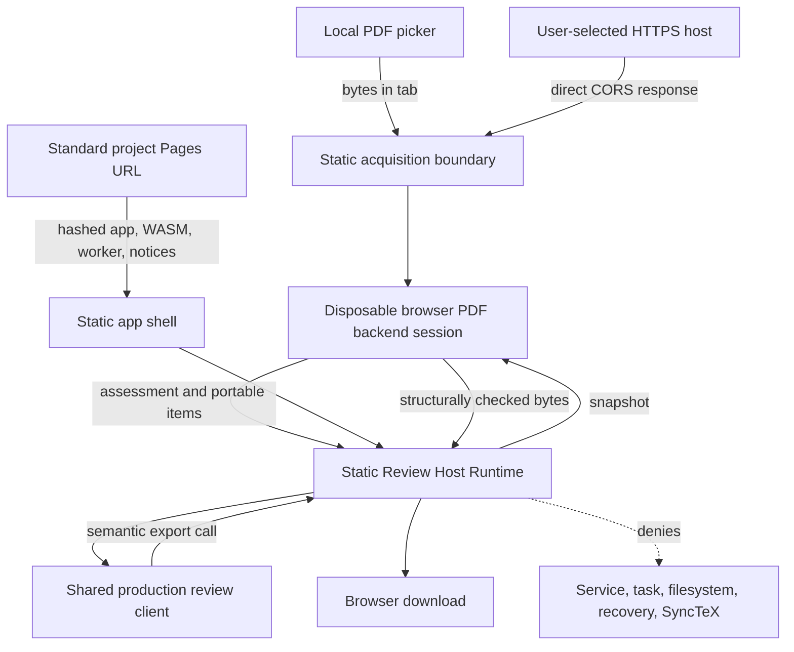
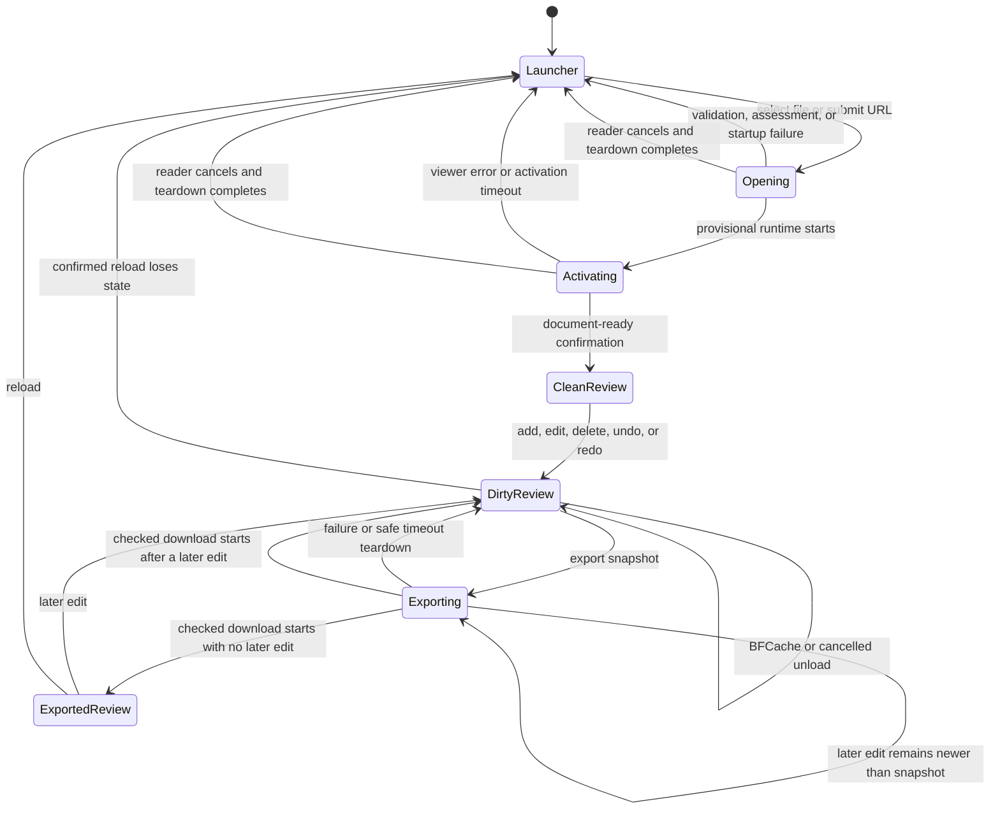
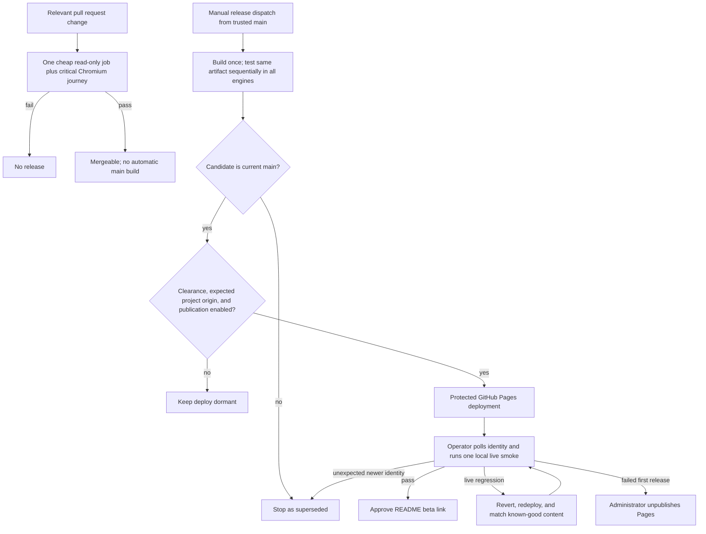

# GitHub Pages Web Beta - Plan

## Goal Capsule

- **Objective:** Readers can use a public browser beta to review a local or CORS-readable remote PDF and take away a structurally checked annotated PDF without Placekeeper storing the document.
- **Means:** Productionize the existing static Review Host Runtime and publish its tested artifact at `https://brad-ross.github.io/placekeeper/` through a gated GitHub Pages workflow. (KTD1, KTD2, KTD7, KTD9)
- **Authority:** The Product Contract governs user-visible behavior. Existing privacy, PDF portability, and public-distribution rules remain authoritative. The Planning Contract governs implementation choices within those rules.
- **Execution profile:** Code changes, browser tests, deployment automation, documentation, and a controlled operator rollout.
- **Stop conditions:** Do not publish under the Placekeeper name or expose a live README link until the existing trademark, marketplace, and domain-clearance record is complete. Do not present the shared-origin project site as appropriate for confidential PDFs. Do not launch if the deployed site cannot render and export a portable reviewed PDF in the supported desktop browsers.
- **Tail ownership:** The repository owner records clearance, verifies the project Pages origin and base, selects GitHub Actions as the Pages source, protects the `github-pages` environment, enables the publication variable, performs the first real-Safari smoke test, and approves the README link after the live smoke passes.

---

## Product Contract

### Summary

Productionize the existing static browser spike as an export-only companion and lightweight tryout for full Placekeeper, with no Placekeeper analytics or application telemetry. The beta is hosted at `https://brad-ross.github.io/placekeeper/`, accepts one local PDF or one user-entered HTTPS PDF URL, runs the shared review client in memory, and creates durability only when the user initiates a structurally checked PDF download. Because the project path shares browser authority with the existing personal site and sibling project pages, the beta is explicitly non-confidential. Deployment remains dormant until the public-distribution gate is satisfied.

### Problem Frame

The current spike proves that Placekeeper can review and export a PDF without the local service, but it is not yet a safe public artifact. It has incomplete startup recovery, URL and privacy semantics, portable-item re-import, clean-runner coverage, project-subpath verification, cache identity, licensing notices, and deployment controls. GitHub Pages also cannot supply arbitrary response headers, so browser security and rollout evidence must match what the platform can actually guarantee.

### Key Decisions

- **Browser-only export durability** (session-settled: user-directed — chosen over a backend autosave service: the beta should avoid server-side document state and its persistence obligations). Governs R1, R4-R8.
- **Local selection plus direct remote URL acquisition** (session-settled: user-directed — chosen over Placekeeper-hosted PDF uploads: the browser can acquire the bytes without adding cloud document storage). Governs R2, R3, R9.
- **Standard GitHub Pages project path with no Placekeeper analytics** (session-settled: user-approved — chosen over a custom-domain and instrumented launch: the beta should minimize infrastructure and data collection). The project path is the initial beta launch target and is explicitly labeled non-confidential because the browser origin is shared with unrelated content. Dedicated-origin hosting is deferred. Governs R1, R9-R13, R16.
- **Public activation remains clearance-gated.** Existing repository policy permits implementation and validation but blocks public distribution under the Placekeeper name until trademark, marketplace, and domain clearance is recorded. Governs R12-R14.
- **No new first-party license grant.** The beta preserves the repository's current licensing posture while satisfying all notices required for the distributed browser artifact. Governs R14.

### Actors

- A1. **Reader:** Selects a PDF, creates Review Items, controls navigation away from unexported work, and initiates a reviewed-copy download.
- A2. **Browser:** Holds the PDF and Review State in memory, directly contacts a user-selected remote PDF host, runs PDFium, and mediates downloads and unload warnings.
- A3. **Remote PDF host:** May receive a direct CORS request with browser-managed credentials omitted; URL query data is still transmitted. The host may allow, reject, redirect, or stall the request.
- A4. **GitHub Pages:** Serves the static application and receives ordinary site-request metadata under GitHub's policies.
- A5. **Repository operator:** Controls the external publication gate, Pages settings, protected environment, first deployment, smoke evidence, promotion, and rollback.

### Requirements

**Application shell and acquisition**

- R1. The configured Pages base loads an empty, retryable beta launcher; the URL and browser history never carry PDF bytes, filenames, remote PDF URLs, Review Items, credentials, task identity, or session authority.
- R2. The launcher accepts exactly one local PDF up to 64 MiB and processes its bytes only in the active tab without application storage or network transfer.
- R3. Remote acquisition accepts one direct HTTPS URL and performs a bounded CORS request with redirects disabled, omitted credentials, no cache, no referrer, local/private destination screening, byte limits, redacted errors, safe filename derivation, and an actionable local-upload fallback.

**In-memory review and export**

- R4. The static Review Host Runtime uses the shared production review client while denying filesystem save, recovery, service credentials, task binding, Placekeeper Links, and SyncTeX capabilities.
- R5. Review State lives only for the tab lifetime; BFCache suspension preserves the live instance, while confirmed reload or close discards it after warning about revisions newer than the last successful export checkpoint.
- R6. PDF rewrite eligibility and portable-item inspection finish within bounded startup operations before authoring begins; unsupported, encrypted, signed, permission-restricted, malformed, or stalled inputs return to an operable launcher.
- R7. Export serializes a snapshot of all five supported Review Item kinds, reopens the output, and performs a lightweight structural read-after-write check before download: the result is parseable, retains the expected page count, and contains each expected Placekeeper-owned annotation exactly once with valid Portable Annotation Identity and a normal appearance. Comprehensive preservation and rendering correctness belong to the fixture/conformance/browser gates rather than every export. User-facing status explains in plain language that Placekeeper confirmed the copy opens and contains the exported review marks, did not comprehensively validate other PDF content, and only asked the browser to start a download. Editing remains available while that snapshot exports; the checkpoint advances only through the exported revision, and success with later edits explicitly says those edits are still unexported and require another export. Failure says the in-memory review remains available and retryable.
- R8. Reopening an exported copy restores valid Placekeeper Review Items as editable items, excludes their owned PDF projections from Existing PDF Annotations, preserves foreign annotations and links, and fails closed on invalid ownership metadata.
- R15. The beta does not claim to detect, remove, or sanitize active PDF content. It treats PDFs as untrusted input, bounds byte size and operations, uses disposable workers, and states that export preserves the source document's other content.

**Privacy, security, and usability**

- R9. The beta adds no analytics, application telemetry, cookies, durable browser storage, service worker, or automatic remote request. Before the source controls, the launcher states that local files remain in the tab, remote URLs are requested directly from their host, there is no autosave or reload recovery, and Export is the only durability action; detailed copy distinguishes GitHub site logging and other external request logging.
- R10. The static document applies an early meta CSP and no-referrer policy that permit only the packaged app, the shared UI's tested style exception, required PDFium/WASM/blob resources, and explicit HTTPS URL acquisition, without claiming protections that require response headers.
- R11. The supported beta path is keyboard-operable and responsive in current desktop Chromium, Firefox, and Safari/WebKit; mobile and PDF-content screen-reader accessibility remain best effort rather than advertised support.
- R16. The project-site beta is labeled non-confidential and fails closed before file selection when it is framed, retains opener authority, or detects a controlling root-scoped service worker. Documentation states that these checks are partial mitigations rather than origin isolation.

**Distribution and operation**

- R12. Cost-aware automation uses one path-scoped, cancel-in-progress pull-request job for unit/type/distribution checks plus the critical Chromium journey, and one manually dispatched two-job release workflow from trusted `main`. The unprivileged package job generates fixtures, runs the exhaustive portability gates, builds once for the resolved Pages base path, and tests that exact artifact sequentially in the supported engines before the protected deploy job may publish it. No scheduled workflow, automatic build on every `main` push, or GitHub-hosted post-deploy browser job is required.
- R13. The artifact uses cache-safe asset identities, contains a payload manifest, separate deployment provenance, dependency inventory, and third-party notices, and passes one operator-run deployed-origin smoke after bounded identity polling for the coherent asset cohort, worker startup, `application/wasm`, CSP, local open/render/export/reopen, and expected payload identity before promotion.
- R14. Public documentation states the beta's durability, privacy, URL/CORS, browser, size, and recovery limits; it does not add a first-party license grant or expose the live beta link before clearance and live-smoke approval.
- R17. The deployed allowlist excludes source maps, fixtures, source PDFs, environment files, repository metadata, symlinks, and undeclared executable assets; a deploy-blocking inventory covers exact runtime packages and the embedded PDFium revision.
- R18. Publication records source SHA, workflow run and attempt, uploaded artifact ID and name, payload-manifest digest, trigger actor, gate state, target origin, and the last-known-good payload identity.

### Key Flows

- F1. **Open a local PDF**
  - **Trigger:** A1 selects or drops one PDF at the empty launcher.
  - **Steps:** A2 validates size and PDF shape, assesses rewrite eligibility, inspects portable annotations, then activates the shared review client or restores the retryable launcher with an error.
  - **Outcome:** The review is ready for authoring only when a structurally checked export remains possible.
  - **Covered by:** R1, R2, R4, R6, R8, R15.
- F2. **Open a remote PDF**
  - **Trigger:** A1 submits an HTTPS URL.
  - **Steps:** A2 validates and clears the input, sends one non-redirecting request to A3 under R3, bounds the response, applies the same pre-authoring checks as F1, and never persists or emits the full URL through Placekeeper-controlled history, durable storage, DOM, console output, workflow artifacts, application diagnostics, or errors.
  - **Outcome:** The review opens or the launcher offers a clear retry and download-then-upload fallback.
  - **Covered by:** R1, R3, R6, R9.
- F3. **Review and export**
  - **Trigger:** A1 edits a review whose current revision is newer than its export checkpoint.
  - **Steps:** A2 warns on destructive navigation, labels the operation as exporting a snapshot, keeps editing available, serializes and structurally checks the captured revision, initiates the download, and advances the checkpoint only through that revision.
  - **Outcome:** Failure leaves the review dirty and retryable; an edit newer than the snapshot remains visibly dirty after success.
  - **Covered by:** R5, R7.
- F4. **Publish and promote**
  - **Trigger:** A trusted `main` revision is ready and A5 has recorded clearance and verified the standard project Pages origin and base.
  - **Steps:** A path-scoped pull-request job cheaply checks affected changes. When A5 intentionally dispatches a release from trusted `main`, automation builds and tests one content-addressed artifact, fences stale candidates, and the protected environment deploys it. A5 then runs the bounded local scripted smoke, records the observed identity and PDF flow, and adds or approves the README link only after it passes.
  - **Outcome:** A verified beta is public; a live regression begins immediate rollback, a superseded run stops without mutation, and a failed first release is unpublished by A5.
  - **Covered by:** R12-R14, R16-R18.

### Acceptance Examples

- AE1. **Local export**
  - **Covers:** R2, R4, R5, R7, R9.
  - **Given:** A supported local PDF and an empty launcher.
  - **When:** The reader adds each supported Review Item kind and selects Export.
  - **Then:** No PDF bytes leave the tab, a structurally checked reviewed-copy download starts, and the current revision becomes the export checkpoint.
- AE2. **Remote CORS success**
  - **Covers:** R3, R6, R9.
  - **Given:** A direct public HTTPS PDF whose response allows CORS and fits the byte limit.
  - **When:** The reader submits its URL.
  - **Then:** The browser sends one request without cookies or referrer, the destination still receives the URL, IP, and CORS `Origin`, the review opens, and neither URL nor bytes enter durable app state.
- AE3. **Remote acquisition failure**
  - **Covers:** R1, R3.
  - **Given:** An HTTP URL, credential-bearing URL, loopback/private literal or local hostname, redirect, CORS rejection, failed status, stalled response, oversized response, or non-PDF response.
  - **When:** The reader submits it.
  - **Then:** No review starts, controls become usable again, and the message recommends download-then-upload when appropriate.
- AE4. **Unexportable PDF**
  - **Covers:** R1, R6, R15.
  - **Given:** A signed, encrypted, permission-restricted, malformed, or assessment-stalled PDF.
  - **When:** The reader opens it.
  - **Then:** Authoring never starts and the launcher explains the limitation without becoming blank or stuck.
- AE5. **Export failure and concurrency**
  - **Covers:** R5, R7.
  - **Given:** A dirty review and a writer that fails, exceeds its deadline, or receives a later edit while exporting a snapshot.
  - **When:** The reader exports or tries to start another writer operation.
  - **Then:** No partial download appears on failure, only one writer operation owns the session, retry is enabled only after safe teardown, and any edit newer than a successful snapshot remains dirty.
- AE6. **Portable re-import**
  - **Covers:** R7, R8.
  - **Given:** A reviewed copy containing valid owned marks, a navigation link, and a foreign annotation.
  - **When:** The reader uploads it, edits an owned item, and exports again.
  - **Then:** The owned item is editable exactly once, the link and foreign annotation remain intact, and the second export has no owned/external duplicate.
- AE7. **Tab lifecycle**
  - **Covers:** R1, R5.
  - **Given:** A dirty review.
  - **When:** The tab enters BFCache, returns, cancels a close, or confirms a true reload.
  - **Then:** BFCache and cancelled navigation retain the live state, while confirmed reload returns to the empty launcher with no resurrection from storage or URL state.
- AE8. **Clearance-gated publication**
  - **Covers:** R12-R14, R16-R18.
  - **Given:** A trusted build before clearance, a stale candidate, or a live smoke failure after deployment.
  - **When:** The deployment workflow evaluates its release gates.
  - **Then:** It skips an ineligible deploy, stops a superseded run, or classifies and rolls back/unpublishes a live failure; only a coherent expected artifact with one complete operator-run scripted live smoke plus the required real-Safari qualification may be promoted.
- AE9. **Shared-origin launch protection**
  - **Covers:** R9, R10, R16.
  - **Given:** The `/placekeeper/` artifact is tested on the existing user Pages origin.
  - **When:** The origin has a root-scoped service worker, the app is framed, or another same-origin page retains opener authority.
  - **Then:** The beta fails closed before file selection. Otherwise the launcher displays its non-confidential shared-origin disclosure and documentation explains that the checks are partial mitigations rather than origin isolation.

### Success Criteria

- A reader completes local upload, annotation, export, and re-import at the project URL in each supported desktop engine.
- Local-file review creates no unexpected network request after packaged assets load and creates no durable browser state.
- Every error before or during export leaves either a retryable launcher or the intact in-memory review; no failure silently claims durable success.
- A public README link exists only after clearance, a protected deployment to the standard project URL, and live-origin verification of the exact payload identity.

### Scope Boundaries

**In scope**

- Production hardening of the existing static Review Host Runtime and shared review client integration.
- Local PDF selection, explicit HTTPS+CORS acquisition, in-memory review, lightweight structural export checking, and portable re-import.
- Project-subpath packaging, CSP/referrer controls, notices, privacy copy, browser/accessibility coverage, deployment, smoke verification, and rollback instructions.
- Standard `/placekeeper/` project-site publication with a pre-selection non-confidential disclosure.

**Deferred to Follow-Up Work**

- Dedicated-origin or header-capable hosting for a future confidential-PDF posture.
- Real-device mobile and iOS qualification.
- A service worker or offline-installable PWA, if cache lifecycle and update semantics are designed separately.
- Action-update automation or broader restoration of the repository's currently manual-only full CI workflow.

**Outside this beta's identity**

- Accounts, backend document storage, autosave, crash recovery, cloud PDF uploads, shared review links, collaboration, task binding, filesystem replacement, and SyncTeX.
- Product analytics, application telemetry, third-party executable resources, and advertising.

---

## Planning Contract

### Key Technical Decisions

- KTD1. **Keep the static surface as a thin Review Host Runtime** (session-settled: user-directed — chosen over a backend autosave host: the shared client already supports an explicit export-only persistence mode). It owns acquisition, activation, object URLs, lifecycle, semantic export calls, and capability denials while shared packages continue to own Review State and portable semantics. Governs R1-R8, R15.
- KTD2. **Resolve the Pages base path without live Pages authority during verification** (session-settled: user-approved — chosen over a custom-domain launch: the standard project path minimizes initial infrastructure). Project-subpath checks use deterministic `/placekeeper/`, local builds retain a relative fallback, and the gated deploy step requires `actions/configure-pages` to report `https://brad-ross.github.io/placekeeper/` with the `/placekeeper/` base. Governs R1, R12, R16.
- KTD3. **Separate functional payload identity from deployment provenance.** Vite-managed hashes cover JavaScript, CSS, PDFium WASM, and the module worker. `content-manifest.json` hashes the functional runtime payload while explicitly excluding itself and `version.json`; `version.json` records source SHA, workflow run and attempt, package/PDFium versions, and the completed payload-manifest digest. Rollback equality uses the payload digest while provenance is verified separately. No service worker participates. Governs R10, R12, R13, R17, R18.
- KTD4. **Use one disposable browser PDF backend session per document.** A browser-safe package owns rewrite and portable inspection, lightweight structural read-after-write checking, its engines and module workers, cancellation, disposal, and operation epochs. Timeout or reset terminates owned workers, fences late results, and completes teardown before retry admission. Governs R6, R7, R15.
- KTD5. **Keep portable semantics browser-neutral and use exact ownership.** Core owns validation rules, a browser-neutral backend helper owns `(pageIndex, annotationId)` preservation and replacement, and the static host consumes that contract without importing the Node-oriented adapter. Author, subtype, appearance, or ID alone never grants ownership. Governs R8.
- KTD6. **Match security claims to Pages capabilities.** An early meta CSP and referrer policy constrain the document. The CSP allows only `wasm-unsafe-eval` for script compilation when required, the narrow inline-style exception required by the shared React UI, and tested same-origin/Blob worker resources. Application logic, not `connect-src https:`, enforces user-initiated URL acquisition. Documentation does not claim header-only controls. Governs R3, R9, R10, R16.
- KTD7. **Keep automation cost-aware while preserving release privilege boundaries** (session-settled: user-directed — chosen over automatic full-matrix builds on every pull request and `main` push). One path-scoped, cancel-in-progress pull-request job receives no secrets or deployment authority and runs the cheap gate plus one critical Chromium journey. A manually dispatched release from trusted `main` uses two security-separated jobs: package and deploy. The package job builds once and tests the same allowlisted artifact sequentially across supported engines, avoiding a build/install matrix. The deploy job checks out no repository and runs no package or repository code; it only consumes the same-run named artifact and invokes pinned official Pages actions. Post-deploy smoke runs from the operator's local checkout/Codex browser with no GitHub token, Pages permission, or additional hosted runner. No scheduled workflow or automatic release build runs on `main`. Governs R12-R14, R17, R18.
- KTD8. **Rollback compares source and payload identities separately.** A rollback commit truthfully becomes the new deployment source while its payload-manifest digest must match the recorded last-known-good digest. A failed first public release is unpublished by an administrator because disabling later deploys does not retract it. Governs R13, R18.
- KTD9. **Treat the standard project origin as non-confidential.** The beta refuses framed, retained-opener, and controlling root-service-worker states when detected, but copy states that these are partial checks on a shared origin rather than isolation. Dedicated-origin hosting is follow-up work. Governs R1, R9, R10, R16.
- KTD10. **Do not follow remote PDF redirects or claim request privacy.** Static validation rejects userinfo and normalized obvious loopback, private, link-local, and local-host targets before one direct HTTPS request. Documentation states that client-side code cannot prove DNS resolution is public, CORS failure occurs after request issuance, and signed query tokens are transmitted to the destination. Governs R3, R9.
- KTD11. **Separate static-browser runtime export assurance from exhaustive correctness testing** (session-settled: user-directed — chosen over repeating the full PDF preservation suite for every browser export). Each static-browser export performs only a lightweight structural read-after-write check: reopen the generated bytes, confirm page count, and confirm each expected owned annotation exactly once with valid portable identity and a normal appearance. It does not exhaustively diff foreign annotations or visually compare rendering. Fixture, conformance, and multi-engine release tests own those comprehensive checks. A discriminated evidence-coverage contract preserves the service-backed host's existing exhaustive runtime verification instead of silently weakening it. Neither layer inspects, removes, or sanitizes active source content; user-facing copy states that the output preserves source content. Governs R7, R15.

### High-Level Technical Design

The diagrams are directional design guidance. The requirements and KTDs remain authoritative.

**Browser data and authority flow**

**Review and export lifecycle**

**Verification, publication, and rollback**

### Assumptions and Implementation Constraints

- The artifact launches at the standard repository project path and is explicitly non-confidential because the origin is shared with unrelated pages.
- The existing 64 MiB source limit remains the beta boundary. Lowering or increasing it requires an explicit Product Contract amendment supported by browser-memory evidence.
- The current non-threaded PDFium integration works without cross-origin isolation. A future `SharedArrayBuffer` requirement invalidates GitHub Pages as the direct host.
- Playwright WebKit is a regression engine, not proof of branded Safari. The first release and PDFium upgrades require a real desktop Safari smoke.
- The absence of a root `LICENSE` is preserved. Third-party notice completeness is a distribution gate, not a substitute for a first-party license decision.
- The static app may allow loopback HTTP URLs only in an explicit local-development mode. The deployed build rejects HTTP and disables redirects.
- Client-side address screening cannot reliably classify DNS results. URL mode therefore remains unsuitable for confidential intranet resources even when the submitted hostname appears public.

### Sequencing

1. Establish the disposable browser PDF backend and harden the browser session before publishing artifacts.
2. Make the static artifact path-safe, cache-safe, self-identifying, and notice-complete.
3. Add comprehensive local/release verification plus the path-scoped Chromium pull-request gate.
4. Add the manual-only, dormant-by-default two-job publication workflow, followed by the operator-run local smoke.
5. Complete operator clearance and standard project Pages configuration, deploy once, classify and smoke the live origin, then promote the link.

### System-Wide Impact

- **Shared review client:** The beta must reuse shared semantics and must not fork annotation behavior. Static activation and browser-backend disposal stay host-local. Changes to portable helpers or viewer/writer worker injection require regression coverage for browser, VS Code, Chrome extension, and packaged desktop hosts.
- **Data lifecycle:** The web host intentionally has weaker durability than the local service. UI copy and save status must never reuse Protected Recovery, Saved, Save Destination, or Replace Original claims.
- **Network boundary:** Local review is same-origin after initial asset load. Remote acquisition is a user-authorized direct fetch that can still reach and disclose a signed URL to the submitted destination before CORS succeeds or fails.
- **Origin boundary:** The initial beta deliberately uses a shared project origin and is not presented as suitable for confidential PDFs. Meta CSP, framing refusal, opener checks, and service-worker checks are partial mitigations only.
- **Operations:** Routine pull requests use one cancel-in-progress job only when the declared static dependency surface changes. Releases are intentional manual dispatches with two security-separated jobs, one build, sequential browser execution, a sealed artifact, a protected environment, an enablement variable, a freshness fence, one operator-run local live smoke, an administrator unpublish path, and an owner-controlled promotion step.

### Risks and Dependencies

- **Naming clearance blocks activation.** `docs/support.md` already records the gate. Mitigation: merge verification and dormant automation while keeping publication disabled and the README unlinked.
- **The standard user Pages URL is a shared origin.** An existing root page or root-scoped service worker can hold authority over `/placekeeper/`. Mitigation: label the beta non-confidential before source selection, fail closed on detected framing/opener/service-worker control, and defer any confidential-PDF claim until dedicated hosting exists.
- **GitHub Pages requires one manual source setting.** `actions/configure-pages` does not replace Settings → Pages → Source → GitHub Actions with the normal workflow token. Mitigation: keep this as an operator checklist item without introducing a PAT.
- **Pages cannot set custom response headers.** Meta CSP cannot enforce every modern browser control. Mitigation: test the narrow supported policy and change hosts if header-only controls become requirements.
- **Cached code and PDFium assets can mismatch.** Stable executable filenames make cross-release failures hard to diagnose. Mitigation: a payload manifest, content hashes, separate deployment provenance, no service worker, and live cohort verification.
- **PDFium and crafted documents can exhaust browser resources.** The 64 MiB limit, operation deadlines, disposable workers, and desktop-only support reduce but do not eliminate renderer denial-of-service risk. Bespoke parser-complexity budgets are deferred.
- **CORS failure does not prevent request issuance.** A URL can disclose a query token or target a local network before the browser blocks response access. Mitigation: direct non-redirecting HTTPS requests, obvious private-target rejection, input clearing/redaction, and precise residual-risk copy.
- **Source active content can survive export.** Structural export checking and annotation portability tests are not sanitization. Mitigation: make no sanitization claim, treat PDFs as untrusted input, and state that other source content is preserved.
- **Browser download initiation is not proof of retention.** Mitigation: use accurate wording and keep the dirty/export checkpoint tied to structurally checked generation and dispatch, not an unverifiable filesystem outcome.
- **Path-scoped pull-request automation can miss a newly introduced dependency edge.** Mitigation: keep the path list broad across the web app, shared packages, test/build configuration, dependency lockfile, and both workflows; require updates to that list when static imports or build inputs move; and rely on the manual full release gate before publication.
- **Action tags can move and platform versions change.** Mitigation: pin full SHAs with release-tag comments and review version changes as code.
- **Third-party notice drift can make the artifact non-compliant.** Mitigation: derive and validate the distributed notice set from the locked runtime dependencies and include the complete PDFium license material.
- **A smoke failure occurs after publication.** The bad artifact may already be live. Mitigation: classify observed identity, roll back immediately, and use administrator unpublish for a failed first release.
- **Concurrency does not prove newest-first deployment.** Mitigation: compare the candidate SHA with current trusted `main` immediately before deployment and stop stale runs as superseded.

### Sources and Research

- Repository architecture: `CONCEPTS.md`, `apps/web/src/host/runtime.ts`, `apps/web/src/host/static-runtime.ts`, and `docs/solutions/architecture-patterns/shared-production-review-client-host-runtime-boundaries.md`.
- Durability and portability: `docs/solutions/architecture-patterns/recoverable-editable-pdf-annotation-autosave.md`, `docs/solutions/integration-issues/portable-pdf-annotations-invisible-in-external-viewers.md`, `docs/solutions/integration-issues/exclude-navigation-links-from-existing-pdf-annotations.md`, and `docs/solutions/integration-issues/valid-long-highlights-rejected-by-portable-shape-limit.md`.
- URL authority and privacy: `docs/solutions/architecture-patterns/reloadable-local-review-url-authority-boundaries.md`, `docs/privacy-and-recovery.md`, and [GitHub Pages data collection](https://docs.github.com/en/pages/getting-started-with-github-pages/what-is-github-pages).
- Browser-origin isolation: [MDN same-origin policy](https://developer.mozilla.org/en-US/docs/Web/Security/Same-origin_policy), [MDN service-worker registration scope](https://developer.mozilla.org/en-US/docs/Web/API/ServiceWorkerContainer/register), and the existing public `brad-ross.github.io` root site.
- Pages build and deployment: [Vite static deployment](https://vite.dev/guide/static-deploy.html), [GitHub Pages custom workflows](https://docs.github.com/en/pages/getting-started-with-github-pages/using-custom-workflows-with-github-pages), [publishing-source configuration](https://docs.github.com/en/pages/getting-started-with-github-pages/configuring-a-publishing-source-for-your-github-pages-site), [GitHub Actions workflow syntax and concurrency](https://docs.github.com/en/actions/reference/workflows-and-actions/workflow-syntax), [GitHub Actions billing](https://docs.github.com/en/billing/concepts/product-billing/github-actions), and [GitHub Actions security](https://docs.github.com/en/actions/reference/security/secure-use).
- Platform boundaries: [GitHub Pages limits](https://docs.github.com/en/pages/getting-started-with-github-pages/github-pages-limits), [GitHub Pages HTTPS](https://docs.github.com/en/pages/getting-started-with-github-pages/securing-your-github-pages-site-with-https), [MDN CORS](https://developer.mozilla.org/en-US/docs/Web/HTTP/Guides/CORS), [MDN mixed content](https://developer.mozilla.org/en-US/docs/Web/Security/Defenses/Mixed_content), [MDN CSP](https://developer.mozilla.org/en-US/docs/Web/HTTP/Guides/CSP), and [MDN WebAssembly streaming](https://developer.mozilla.org/en-US/docs/WebAssembly/Reference/JavaScript_interface/instantiateStreaming_static).

---

## Implementation Units

### U1. Harden the static session boundary

- **Goal:** Make every acquisition and startup path bounded, retryable, privacy-correct, and export-eligible before authoring begins.
- **Requirements:** R1-R6, R9, R15; AE2-AE5, AE7.
- **Dependencies:** None.
- **Files:** `apps/web/src/static-entry.tsx`, `apps/web/src/static-entry.css`, `apps/web/src/production-entry.tsx`, `apps/web/src/host/static-runtime.ts`, `packages/pdf-backends/src/browser-writer.ts`, `packages/pdf-backends/src/browser-document-session.ts`, `apps/web/test/static-runtime.test.ts`.
- **Approach:**
  1. Introduce an `Activating` state and keep retry UI available until the existing document-ready signal confirms the viewer; activation error or deadline disposes the provisional runtime before restoring focus to the launcher. Before the source controls, render the persistent non-confidential privacy and export-only durability disclosure required by R9, and identify the web beta as a companion and tryout for full Placekeeper.
  2. Enforce one-file drop semantics and KTD10 URL rules, including userinfo and obvious private-target rejection, `redirect: error`, bounded streaming bytes, input clearing, safe filenames, redacted diagnostics, and distinct validation, status, CORS/network, and timeout messages. Provide a keyboard-operable Cancel action during remote fetch, assessment, and provisional activation; abort the owned operation, complete worker and object-URL teardown, restore the empty launcher, and return focus to the initiating source control.
  3. Establish the KTD4 browser backend session with operation-owned engine/worker teardown, bounded operations, single-flight admission, and an epoch fence before any late result can download or advance the export checkpoint. Define accessible status text for four states: exporting a snapshot; checked copy with download requested; checked snapshot with newer unexported edits; and failed export with the in-memory review preserved for retry.
  4. Register the unload guard only while R5 is dirty, preserve BFCache, revoke object URLs on terminal disposal, and keep reload empty without durable browser APIs.
- **Patterns to follow:** `apps/web/src/host/browser-runtime.ts` for host capability boundaries, `packages/pdf-backends/src/browser-writer.ts` for eligibility, and `apps/web/src/production-entry.tsx` for shared-client startup.
- **Test scenarios:**
  - Covers AE2. A direct HTTPS CORS response with a valid PDF and safe path filename opens with `credentials: omit`, `cache: no-store`, `redirect: error`, and `referrerPolicy: no-referrer`, then clears the URL field.
  - Covers AE3. HTTP, embedded credentials, encoded loopback/private/link-local literal, local hostname, redirect, failed status, CORS/network rejection, stall, oversize stream, empty bytes, and non-PDF bytes each restore an operable launcher with a redacted fallback.
  - Covers AE4. Signed, encrypted, permission-denied, malformed, and assessment-stalled inputs never enter authoring or leave a blank root.
  - Covers AE5. Assessment and export remain single-flight; timeout or disposal terminates owned workers, rejects late callbacks, waits for teardown, and creates no partial download.
  - Export status never uses “verified” as an unexplained guarantee: it says what the structural check covered, that the browser merely received a download request, whether newer edits remain, and that other PDF content was not comprehensively validated.
  - Covers AE7. BFCache preserves the runtime, cancelled unload preserves state, and a true page hide disposes resources exactly once.
  - Cancelling remote fetch, assessment, or provisional activation completes owned teardown, restores the empty launcher, and returns focus without a late callback activating the viewer.
  - A document-ready timeout or render error disposes the provisional runtime and returns to the launcher without adding activation semantics to the shared client.
  - Dropping zero, one, multiple, or directory-like entries follows the one-file policy and returns focus to the appropriate launcher control.
- **Verification:** Static runtime unit tests prove every acquisition, deadline, epoch, cancellation, and lifecycle transition. A component-level launcher test proves the pre-selection disclosure, document-ready activation, progress, alert announcement, focus recovery, and successful retry without remount leakage.

### U2. Restore portable Review Items on import

- **Goal:** Make an exported reviewed copy round-trip through the static beta without losing editability or duplicating owned annotations.
- **Requirements:** R6-R8, R15; AE1, AE6.
- **Dependencies:** U1.
- **Files:** `apps/web/src/host/static-runtime.ts`, `packages/pdf-backends/src/browser-document-session.ts`, `packages/pdf-backends/src/browser-writer.ts`, `packages/pdf-backends/src/embedpdf-adapter.ts`, `packages/pdf-backends/src/embedpdf-annotation.ts`, `packages/core/src/pdf-writer.ts`, `packages/core/src/portable-annotation.ts`, `apps/service/src/export/pdf-verifier.ts`, `apps/web/test/static-runtime.test.ts`, `packages/core/test/portable-annotation.test.ts`, `test/conformance/reviewed-pdf.test.ts`.
- **Approach:**
  1. Factor browser-neutral catalog, ownership, and preservation behavior out of the Node-oriented adapter so the browser session can inspect and write without importing Node code.
  2. Return portable items and exact `(pageIndex, annotationId)` projection identities from the bounded browser session before creating initial Review State.
  3. Seed the static state with canonical owned items while retaining a clean revision and export checkpoint for the newly opened document.
  4. Replace matched owned projections during write, preserve navigation and foreign annotations, and leave invalid or mismatched Placekeeper metadata read-only.
  5. Replace the single exhaustive `PdfStructuralEvidence` assumption with a discriminated verification-coverage shape. Browser export returns `owned-output` evidence after inspecting only the expected projection pages and checking page count, exact `(pageIndex, annotationId)` uniqueness, canonical portable identity, and normal appearances. The Node/service path retains `exhaustive-preservation` evidence, including its complete pre-existing annotation inventory; the service verifier rejects weaker evidence rather than downgrading silently.
- **Execution note:** Add the exported-copy re-import failure case before changing bootstrap state so ownership mistakes are observable.
- **Patterns to follow:** `apps/service/src/context/live-context-service.ts`, `apps/service/src/context/live-source-workflow-service.ts`, and `docs/solutions/integration-issues/exclude-navigation-links-from-existing-pdf-annotations.md`.
- **Test scenarios:**
  - Covers AE6. A valid exported item reopens once as editable and does not also appear in Existing PDF Annotations.
  - A navigation link and unrelated foreign annotation survive import, edit, and second export without identity or appearance changes.
  - A foreign mark using the Placekeeper author, a same ID on a different page, malformed custom metadata, and visible/custom projection mismatch never become owned.
  - Highlights with 33 and 256 segments round-trip exactly; 257 segments fail without truncating geometry or portable metadata.
  - Imported items begin clean, become dirty after an edit, and export the edited item without duplicating the original owned projection.
  - Browser evidence cannot satisfy the service's exhaustive verification branch; the service-backed export path retains its current source/output annotation and page-fingerprint comparisons.
- **Verification:** Browser and Node backends pass the same portable ownership and preservation fixtures. The browser bundle contains no Node-only adapter dependency.

### U3. Produce a path-safe and auditable static artifact

- **Goal:** Build a cache-safe GitHub Pages artifact whose executable resources, security policy, identity, and notices can be verified before deployment.
- **Requirements:** R1, R9, R10, R12-R14, R16-R18; AE8, AE9.
- **Dependencies:** U1.
- **Files:** `apps/web/vite.static.config.ts`, `apps/web/vite.production.config.ts`, `apps/web/static/index.html`, `apps/web/src/static-entry.tsx`, `apps/web/src/pdf/embedpdf-viewer.ts`, `packages/pdf-backends/src/browser-document-session.ts`, `scripts/generate-static-notices.ts`, `scripts/validate-static-distribution.ts`, `THIRD_PARTY_NOTICES.md`, `package.json`.
- **Approach:**
  1. Accept a build-time Pages base path with a local relative fallback and let Vite create content-addressed names for app code, styles, WASM, and the packaged worker.
  2. Give the static host an exact resource policy for its document object URL, WASM, and worker identities; feed bundle-resolved assets to the viewer and browser backend without changing fixed-asset contracts used by other hosts.
  3. Emit `content-manifest.json` over the functional payload, excluding itself and `version.json`; emit `version.json` separately with deployment provenance and the completed payload-manifest digest. Also emit a browser-readable third-party notice and production dependency inventory that include the complete PDFium license and embedded revision.
  4. Add early CSP and referrer meta elements under KTD6, a frame-busting failure state under R16, a visible notices/privacy link, and no service worker or third-party executable URL.
  5. Validate the exact artifact allowlist, hashes, relative/project-subpath references, notice and dependency drift, source-map/secret/fixture/symlink exclusions, CSP directives, provenance fields, no localhost URLs, and a documented size budget.
- **Execution note:** Treat this as packaging work: verify both the standalone artifact and regressions in the existing production asset manifest.
- **Patterns to follow:** `apps/web/vite.production.config.ts` for offline PDFium and integrity generation, `packaging/macos/validate-manifest.ts` for distribution checks, and `packaging/macos/build-app.ts` for notice inclusion.
- **Test scenarios:**
  - A local build uses relative paths; a Pages build mounted at `/placekeeper/` resolves every app, CSS, WASM, worker, notice, and manifest URL beneath that base.
  - The viewer and writer start under the CSP with no violation or console error; script policy permits no `unsafe-inline` or unrestricted `unsafe-eval`, and style policy contains only the tested shared-UI exception.
  - Changing app, WASM, or worker content changes its asset name and payload digest while `version.json` identifies the build run, attempt, source, and completed payload-manifest digest without participating in that digest.
  - Missing or stale notice/dependency content, an undeclared executable asset, source map, fixture PDF, environment file, repository metadata, symlink, localhost URL, root-relative project asset, or malformed manifest fails distribution validation.
  - A malicious filename, PDF metadata string, or annotation containing HTML, control characters, bidi controls, or overlong text renders inertly and produces a sanitized forced-`.pdf` download name.
  - Existing browser, VS Code, Chrome extension, and desktop production asset-manifest tests retain their current worker and WASM behavior.
- **Verification:** A fresh static build passes the distribution validator, opens beneath `/placekeeper/`, loads all resources from the expected origin, and leaves existing host packaging checks green.

### U4. Establish multi-engine browser and portability gates

- **Goal:** Prove the user journey, privacy boundary, portability contract, and accessibility behavior against the built project-subpath artifact.
- **Requirements:** R1-R13, R15-R17; AE1-AE7, AE9.
- **Dependencies:** U2, U3.
- **Files:** `playwright.static.config.ts`, `test/acceptance/static-web.spec.ts`, `test/acceptance/static-web-url.spec.ts`, `test/conformance/pdf-writer.conformance.test.ts`, `test/conformance/reviewed-pdf.test.ts`, `test/fixtures/pdfs/generate.ts`, `package.json`.
- **Approach:**
  1. Define `test:static:artifact` to serve and test an existing `dist/static-web` without building and accept an engine plus coverage-profile selector. Define `test:static` as a comprehensive local convenience command that generates fixtures, runs static unit/conformance tests, builds once, runs the exhaustive browser PDF corpus in Chromium, and then runs the representative cross-browser profile in Firefox and WebKit against that same artifact at `/placekeeper/`. The release workflow uses the same constituent commands explicitly so it can prove there was exactly one build.
  2. Define `test:static:pr` as the cost-bounded routine gate: reuse focused unit/type/distribution commands, build once, and run only a tagged critical journey in Chromium. Do not use a browser matrix, rebuild per engine, or repeat the full fixture corpus on ordinary pull requests. Keep acquisition, worker startup, review, export/download/reopen, lifecycle, privacy, keyboard, accessibility, one narrow-viewport assertion, and one cancel-or-error recovery with focus/live-region assertions covered in every release engine. The small Firefox/WebKit profile uses one selection-derived multi-segment highlight on a rotated or cropped page containing a foreign annotation, then checks owned/external separation after reopen; the exhaustive five-kind, geometry, image-heavy, and foreign-preservation corpus remains in conformance plus Chromium.
  3. Assert the local flow contacts only expected same-origin packaged assets, uses no browser storage, registers no service worker, and never calls Placekeeper service/task endpoints.
  4. Cover R3 and KTD10 with controlled targets and verify that redirects and obvious private destinations make no secondary request, CORS failures disclose only redacted diagnostics, and no submitted URL survives in Placekeeper-controlled history, durable storage, DOM, console output, workflow artifacts, or application diagnostics.
  5. Keep the per-export runtime assertion narrow under KTD11. In conformance and release tests, exhaustively compare pre-existing annotations, render all five item kinds, and cover rotations, nonzero page boxes, image-heavy files, independent readers where available, and repeated open/dispose cycles.
  6. Add automated accessibility checks plus keyboard-only launcher-to-export coverage, visible focus, busy and error announcements, reduced-motion behavior, and wide/narrow layouts without claiming full PDF-content accessibility conformance.
- **Patterns to follow:** `test/acceptance/production-flow.spec.ts`, `playwright.webkit.config.ts`, `playwright.visual.config.ts`, and `test/conformance/pdf-writer.conformance.test.ts`.
- **Test scenarios:**
  - Covers AE1. Conformance plus Chromium create all five item kinds across the exhaustive PDF corpus, start a structurally checked export, reopen it, render normal appearances, and preserve source annotations. Firefox and WebKit complete the same essential journey with a representative PDF and Review Item against the identical artifact.
  - Covers AE2 and AE3. HTTPS+CORS success and every remote failure class have deterministic requests, messages, retry state, and no URL persistence.
  - Covers AE4 and AE5. Unsupported input, startup exception, export failure, timeout, and post-export edit produce the correct launcher, dirty state, checkpoint, and unload behavior.
  - Covers AE6. Exported-copy re-import preserves exact owned/external separation in every engine.
  - Covers AE7. BFCache, cancelled navigation, true reload, object-URL cleanup, and repeated open/dispose cycles match R5.
  - Covers AE9. A framed build fails before accepting a PDF, and the shared-origin audit detects a root-scoped controlling service worker or retained opener state.
  - Keyboard-only users can choose a file, submit or cancel a URL open, recover from an error, navigate review controls, and initiate export without a focus trap.
  - Cropped and rotated pages, 33/256-segment highlights, representative image-heavy PDFs, and narrow/wide viewports retain usable review and export behavior.
  - Any Firefox/WebKit-only defect becomes a permanent regression in the representative profile. Browser, Playwright, PDFium, selection, worker, object-URL, or download-lifecycle upgrades require one full secondary-engine corpus run before the reduced profile may continue.
- **Verification:** `test:static:pr` proves the cheap Chromium gate used for affected pull requests. `test:static` passes the exhaustive corpus in conformance/Chromium and the representative journey sequentially in Firefox and WebKit for intentional release candidates, retaining failure artifacts sufficient to diagnose asset, console, accessibility, and PDF-output failures.

### U5. Document the web beta contract and operator runbook

- **Goal:** Give readers and operators accurate privacy, durability, compatibility, activation, smoke, and rollback guidance.
- **Requirements:** R9-R18; AE8, AE9.
- **Dependencies:** U2, U3, U4.
- **Files:** `README.md`, `docs/privacy-and-recovery.md`, `docs/support.md`, `docs/web-beta.md`, `THIRD_PARTY_NOTICES.md`.
- **Approach:**
  1. Scope the existing privacy and recovery claims to local service-backed hosts, then add a Web beta section that distinguishes local selection, GitHub serving metadata, direct cookie-free remote fetches, transmitted URL/query/IP/CORS `Origin`, and structurally checked download initiation. State explicitly that browser, operating-system, DNS, enterprise-network, and remote-host logging are outside Placekeeper's control.
  2. Document the 64 MiB limit, desktop browser posture, no autosave or recovery, reload loss, remote URL and DNS limitations, supported annotation kinds, untrusted-PDF posture, non-sanitizing export, unexportable PDFs, and download-then-upload fallback.
  3. Position the web beta as an export-only companion and lightweight tryout for full Placekeeper. Before its source controls, show a concise persistent disclosure that local files remain in the tab, remote URLs are requested directly from their host, there is no autosave or reload recovery, Export is the only durability action, and the shared-origin site is non-confidential; retain the detailed privacy link beneath it.
  4. Add an operator checklist for clearance evidence, the expected project origin/base, the no-new-license assumption, third-party notices, Pages source selection, environment protection, enablement variable, candidate provenance, first Safari smoke, payload-manifest evidence, README promotion, rollback, and first-release unpublish.
  5. Keep the README live link absent or clearly non-live until U7 passes; do not weaken the existing public-distribution gate.
- **Patterns to follow:** `docs/privacy-and-recovery.md`, `docs/support.md`, and `test/acceptance/installed-hosts.md` for user-facing guarantees and evidence-oriented operational notes.
- **Test scenarios:**
  - Copy review rejects claims that nothing leaves the computer, GitHub receives no data, a remote request is credential-free when its URL contains a token, CORS blocks request issuance, export sanitizes the source, a download is retained, or a review can recover after reload.
  - Documentation distinguishes advertised desktop support from mobile best effort and Playwright WebKit from real Safari qualification.
  - The dormant state has no clickable public beta link; the promoted state names the standard project URL, labels it non-confidential, and links visible third-party notices and privacy details.
  - The operator checklist identifies source and content identities, run and attempt, artifact ID, expected origin, terminal smoke classifications, rollback target, unpublish path, and exact next action without relying on retained Pages artifacts.
- **Verification:** Documentation and UI use the same host-specific terms, the public-distribution rule remains intact, and the notice/link audit passes in dormant and promoted release states.

### U6. Add cost-aware Pages verification and protected deployment

- **Goal:** Automate a cheap routine static gate and define a manual, dormant-by-default two-job publication path that deploys the exact comprehensively tested artifact without redundant builds, setup matrices, hosted post-deploy browser work, or mandatory prelaunch rehearsal runs.
- **Requirements:** R12-R14, R16-R18; AE8, AE9.
- **Dependencies:** U3, U4, U5.
- **Files:** `.github/workflows/static-web.yml`, `.github/workflows/deploy-pages.yml`, `scripts/smoke-static-site.ts`, `package.json`, `docs/web-beta.md`.
- **Approach:**
  1. Add one pull-request workflow job with `contents: read`, no secrets, `persist-credentials: false`, frozen dependency installation, pinned Node and pnpm, and `test:static:pr`. Trigger it only when the declared static dependency surface changes: `apps/web/**`, `packages/**`, relevant `test/**` and `scripts/**`, root package/lock/TypeScript/Vite/Playwright configuration, and either static workflow. Use `pull_request`, never `pull_request_target`; add per-PR concurrency with cancellation so superseded commits stop consuming minutes. Upload bounded traces only on failure.
  2. Add one manual-only `workflow_dispatch` publication workflow restricted to trusted `main`; do not trigger it on `push`, a schedule, or every merge. Keep two security-separated jobs: package and deploy. Set workflow-level `permissions: {}`. The package job receives only `contents: read`, uses `persist-credentials: false`, receives no environment or secrets, runs the comprehensive U4 gates, builds `dist/static-web` exactly once, runs exhaustive conformance/Chromium coverage plus representative Firefox and WebKit journeys sequentially against that existing directory, revalidates that tests did not mutate it, and uploads one run-and-attempt-named Pages artifact while recording its artifact ID and payload-manifest digest.
  3. Reuse the package job's single checkout/install/cache across all release engines instead of a matrix. Use only standard Ubuntu runners, set bounded job timeouts, retain no success diagnostics, and give failure-only traces a short retention period. Pin checkout, Node, pnpm, GitHub Script, Pages configuration, Pages artifact upload, Pages deployment, and failure-only diagnostic upload actions to reviewed full commit SHAs with release-tag comments.
  4. Make missing or nonliteral publication enablement fail closed. After environment approval and immediately before deployment, use the pinned GitHub API step to read `refs/heads/main`, compare it with the packaged source SHA, verify that `configure-pages` reports the standard project origin and `/placekeeper/` base, and stop a mismatch as superseded without publishing.
  5. Give `contents: read` plus Pages/OIDC permissions only to the environment-gated deploy job. That job checks out no repository, installs no package, executes no repository script, and deploys only the named same-run artifact through the pinned official action.
  6. After deployment, end the Actions workflow. From a clean trusted local checkout whose `HEAD` equals the deployed source SHA, the operator runs `pnpm smoke:static-pages` with a fresh browser context, cache-busted identity reads, complete payload-manifest verification, and bounded backoff until the expected identity appears or the documented propagation limit expires. Run the complete scripted smoke once after expected identity and emit a machine-readable record of probe commit, target URL, deployed source SHA, payload digest, browser version, timestamp, and result. Retain the real-Safari manual qualification before first promotion. This local step carries no GitHub token or Pages permission and adds no hosted job.
  7. Record actor, gate state, source SHA, run, attempt, artifact name and ID, payload-manifest digest, environment result, deployment result, and `page_url` in the run summary without raw untrusted expression interpolation.
- **Execution note:** Land the workflows with publication disabled and validate their trigger, permission, and condition structure without an exhaustive Actions rehearsal. Ordinary `main` pushes run no static release workflow. The repository owner performs the one-time Pages source and environment configuration only after the code review is complete, then uses the first cleared manual dispatch as the exhaustive release run.
- **Patterns to follow:** `.github/workflows/ci.yml` for Ubuntu, frozen installs, named bounded jobs, cache use, and failure artifacts; official GitHub Pages custom workflow guidance for environment and deployment outputs.
- **Test scenarios:**
  - A relevant fork pull request and a workflow-file-changing pull request run only the single read-only Chromium gate and cannot access secrets, persist checkout credentials, mint an OIDC token, upload a deployable Pages artifact, or reach the protected environment; a superseding commit cancels its older run.
  - A manual dispatch from a non-main ref, missing/variant enablement value, stale main candidate, unexpected configured origin/base, or unapproved environment stops before deployment.
  - A manually dispatched trusted-main run with publication disabled builds once, tests the same directory sequentially in all supported engines, proves it remained unchanged, seals one named artifact, and skips deploy with no README link. An ordinary push to `main` starts no release workflow.
  - An artifact containing a symlink, undeclared file, mismatched manifest, substituted artifact name/ID, or stale run/attempt identity is rejected before deployment.
  - The package job has only read access and no protected environment. The privileged deploy job cannot check out or execute repository content. The local smoke runs after the workflow with no GitHub token, deploy authority, or workflow artifact mutation.
  - Concurrent releases use one mutual-exclusion group, while a separate freshness check prevents an older queued candidate from publishing after newer `main`.
- **Verification:** Static workflow validation and review prove path-filter coverage, per-PR cancellation, no automatic `main` or scheduled release trigger, exactly two release jobs, workflow-level deny-by-default permissions, package-only `contents: read`, one release build, sequential engine reuse, deploy-only Pages/OIDC authority, immutable action pins, exact-artifact provenance, and fail-closed gates. The disabled publication condition is covered without requiring an exhaustive dry run; U6 performs no live Pages publication.

### U7. Activate and promote the cleared beta

- **Goal:** Publish the cleared beta at the standard project URL, classify the live result, and expose the canonical link only after the evidence is complete.
- **Requirements:** R12-R14, R16-R18; AE8, AE9.
- **Dependencies:** U6 and the external naming-clearance record.
- **Files:** `README.md`, `docs/support.md`, `docs/web-beta.md`.
- **Approach:**
  1. Record the completed Placekeeper naming, marketplace, and domain clearance and verify the standard project Pages origin and base without rewriting the clearance record's legal substance.
  2. Select GitHub Actions as the Pages source, verify the `github-pages` environment's main-only reviewer policy, keep publication false, record the sealed candidate and last-known-good tuple or first-release unpublish posture, then enable and approve the deployment.
  3. Classify live identity during the propagation window: prior healthy identity means propagation failure, expected identity plus any broken asset/PDF check means live regression, unexpected newer identity means superseded, and an unreachable first release means publication failure.
  4. For the expected identity, require one complete operator-run local scripted smoke after bounded propagation polling and the documented real desktop Safari upload-export-reopen check before first promotion.
  5. On a live regression, revert and redeploy until the new rollback source identity carries the last-known-good payload digest and passes the complete smoke. On a failed first release, have the administrator unpublish the site and disable publication.
  6. Immediately before promotion, perform a cache-busted identity-only read and require the live source/payload tuple to equal the recorded smoke tuple; if another deployment replaced it, rerun the complete smoke for the current tuple. Add the canonical standard project beta link to the README through a documentation-only path that does not invalidate the tested application artifact, then record the successful source/payload tuple. The release mutex protects workflow execution only and does not replace this promotion-time freshness check.
- **Execution note:** This unit is operator-gated. Stop after U6 when clearance is absent; that is the expected dormant release state, not permission to bypass the gate.
- **Patterns to follow:** The release gate in `docs/support.md` and the evidence format established by `docs/web-beta.md`.
- **Test scenarios:**
  - Covers AE8. An absent clearance record, stale candidate, or failed scripted/manual smoke leaves the README unlinked and invokes the matching no-go, rollback, superseded, or unpublish path.
  - Covers AE9. The first successful release serves the standard project URL with its non-confidential disclosure, passes frame/opener/service-worker checks, matches the expected source and payload identity in one complete operator-run scripted smoke, and completes the Safari local upload-export-reopen journey.
  - The rollback runbook requires a new truthful rollback source identity whose payload-manifest digest matches the prior known-good release and whose complete smoke passes when rollback is actually needed; a benign prelaunch rollback deployment is not required.
  - A README-only promotion does not trigger a new application artifact deployment; if it does, the new revision must complete live verification before the link is considered promoted.
- **Verification:** The repository contains the clearance record, the live manifest and workflow identify the source and payload cohort, one complete operator-run scripted live-smoke result and the real-Safari result are recorded, the rollback/unpublish path is actionable, and the README link resolves to the checked standard project URL.

---

## Verification Contract

| Gate | Command or evidence | Pass condition | Units |
|---|---|---|---|
| Static unit and import behavior | `pnpm exec vitest run apps/web/test/static-runtime.test.ts packages/core/test/portable-annotation.test.ts` | Acquisition, activation, deadline, lifecycle, cancellation, epoch, and ownership cases pass. | U1, U2 |
| PDF durability and portability | `pnpm fixtures:pdf && pnpm test:pdf-writer && pnpm test:reviewed-pdf` | Five-kind export, appearances, rotations, page boxes, foreign preservation, and reopen verification pass. | U2, U4 |
| Static distribution | `pnpm validate:static-distribution` against an existing `dist/static-web` | The once-built Pages-base artifact has the exact allowlist, hashes, provenance, dependency inventory, CSP/referrer metadata, notices, and no forbidden files or URLs. | U3 |
| Routine affected-PR gate | `pnpm test:static:pr` | One cancel-in-progress job runs focused unit/type/distribution checks and the tagged critical Chromium journey with no deploy authority; unrelated paths start no static workflow. | U1-U4, U6 |
| Manual release browser acceptance | Release package sequence: fixtures/unit/conformance → one `pnpm build:static` → distribution validation → exhaustive Chromium artifact profile → representative Firefox and WebKit profiles | The same existing `/placekeeper/` artifact passes exhaustive PDF coverage once and essential acquisition, worker, lifecycle, privacy, accessibility, export, download, and reopen behavior in all supported engines without a rebuild or job matrix. `pnpm test:static` provides the equivalent one-command local convenience path but is not invoked by the release workflow. | U1-U4, U6 |
| Shared-host regression | `pnpm typecheck && pnpm test:ci:unit && pnpm build:web && pnpm build:vscode && pnpm build:chrome:bundle` | Viewer/writer asset changes do not regress existing host contracts or packaging. | U2, U3 |
| Read-only workflow security | Pull-request workflow inspection and one fork-originated run | The run has only read access, cannot deploy, uses immutable action pins, and retains bounded failure artifacts. | U6 |
| Dormant publication | Static workflow validation plus permission/condition review with `PLACEKEEPER_PAGES_ENABLED` absent or false | No automatic `main` or scheduled trigger exists, the disabled condition cannot reach deployment, and no exhaustive prelaunch Actions run is required. | U5, U6 |
| Live Pages smoke | Operator runs `pnpm smoke:static-pages -- --url <page_url> --source <sha> --content <digest>` locally after the deploy workflow | After bounded cache-busted identity polling, one fresh context observes a coherent expected asset cohort and completes the PDF flow, or emits one unambiguous propagation, regression, superseded, or first-release-failure classification within ten minutes, with no additional hosted job or GitHub credential. | U7 |
| Branded Safari qualification | Documented manual desktop Safari journey | Local select, render, annotate, export, independent reopen, and foreign-annotation preservation pass at the live URL. | U7 |
| Rollback readiness | Runbook and workflow-path inspection | A real rollback will create a new source identity, require the recorded last-known-good payload-manifest digest, and rerun the complete live smoke without relying on retained Pages artifacts; no benign deployment rehearsal is required. | U6, U7 |

`release:validate` does not currently exist and is not required for this static beta. The static distribution, shared-host, browser, live-origin, and rollback gates above are the release contract.

---

## Definition of Done

### Per-unit completion

- U1 is done when every source, activation, assessment, deadline, lifecycle, cancellation, and writer failure returns a usable state and no unsupported PDF can enter authoring.
- U2 is done when the browser-safe backend reopens a reviewed PDF with exact editable ownership and no loss or duplication of navigation or foreign annotations.
- U3 is done when the allowlisted artifact is project-path-safe, cache-safe, self-identifying, CSP-compatible, dependency-inventoried, notice-complete, and independently validatable.
- U4 is done when the cheap affected-PR Chromium gate and the comprehensive release/local suite are distinct, and the latter passes exhaustive PDF coverage in conformance/Chromium plus representative essential behavior sequentially in Firefox and WebKit against one build.
- U5 is done when user and operator documentation make only host-accurate claims and preserve the dormant activation gate.
- U6 is done when affected pull requests have one cancel-in-progress read-only Chromium job and a manual trusted-`main` release can seal and deploy one provenance-complete candidate through two least-privilege jobs, one build, and sequential engine reuse while skipping deployment when disabled.
- U7 is done only after external clearance, one-time project Pages configuration, freshness proof, one classified operator-run scripted live smoke, real-Safari live evidence, and README promotion.

### Global completion

- Every R-ID is enforced by an implementation unit and at least one verification outcome.
- The deployed artifact is the exact artifact that passed the trusted publication checks.
- Local PDFs and in-memory Review State are never uploaded, persisted, or exposed through the URL by Placekeeper.
- Exported PDFs remain visible in independent viewers, retain supported editability on re-import, and preserve pre-existing annotations.
- Public copy distinguishes Placekeeper behavior from GitHub Pages and remote-host data handling.
- The standard project path is presented as an export-only companion and is never presented as suitable for confidential PDFs.
- The Placekeeper name is not publicly distributed before the repository's clearance record permits it.
- Rollback has a last-known-good payload-manifest digest, a truthful new source identity, a bounded procedure, and complete smoke evidence; first-release unpublish is documented.
- Experimental or abandoned code, unused asset emissions, temporary workflow bypasses, generated test debris, and stale beta copy are removed before handoff.
