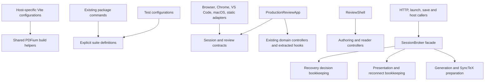
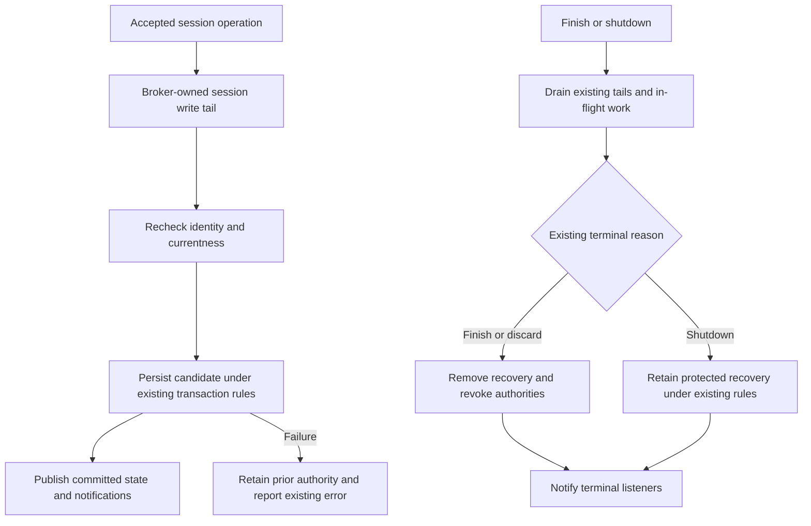

# Repository Organization - Plan

## Goal Capsule

- **Objective:** Maintainers can find the code, tests, and current guidance for a Placekeeper behavior without tracing unrelated concerns across the repository.
- **Means:** Centralize shared tooling and contracts, extract cohesive UI and service internals, and refresh documentation using the boundaries in KTD1–KTD7.
- **Authority:** The user's requirement to preserve current functionality governs R1–R9. Current code and observed baseline behavior establish equivalence; existing tests and independently supported learnings supply evidence. This plan does not authorize correcting unrelated product defects.
- **Execution profile:** Incremental local refactoring with characterization of existing behavior before lifecycle changes. Each unit must leave a usable checkout and pass its relevant verification gates.
- **Stop conditions:** Stop a dependent extraction if it requires changing a public contract, durable format, security decision, UI behavior, or an unexplained baseline result. Record the concrete conflict rather than weakening a test or silently expanding scope.
- **Tail ownership:** The implementation workflow owns code review, focused commits, and final verification. This planning request does not authorize publishing, installing over the user's app, changing CI activation, pushing, or opening a PR.

---

## Product Contract

### Summary

Reorganize all seven areas identified in the repository review: test commands, PDFium build tooling, shared application contracts, UI orchestration, styles, documentation, and session-broker internals. Preserve Placekeeper's current behavior throughout.

### Problem Frame

Shared build utilities live under a particular host, transport types live inside React components, and test lists repeat across scripts and configuration. Several large files mix independent responsibilities: `ReviewShell.tsx` has 2,848 lines, `ProductionReviewApp.tsx` 2,495, and `session-broker.ts` 3,240 at the inspected baseline. Documentation combines operational guidance, captured learnings, design history, and experiments without a contributor entry point.

The September 7 code-quality audit already implemented retention, recovery-scan, search, and prop-grouping improvements. Repeating those changes would add churn. The remaining opportunity is clearer ownership and navigation, with regression evidence for each extraction.

### Requirements

**Behavior and compatibility**

- R1. Preserve current behavior on macOS, ordinary browser/Codex, Chrome, VS Code, and static web, including error outcomes, accessibility, focus, navigation, rendering, and save/recovery semantics.
- R2. Preserve public CLI commands, package-script names, protocol shapes, exported broker identities, persisted data, quotas, expiry rules, deployment posture, dependency versions, and installed output layout.

**Code and tooling organization**

- R3. Give test suite membership and common browser configuration explicit owners while retaining existing suite distinctions and command prerequisites.
- R4. Give shared PDFium build machinery a host-neutral home while retaining each distribution's asset and integrity contract.
- R5. Make host/session/save contracts independent of React components, and separate cohesive UI orchestration responsibilities without replacing their existing domain controllers.
- R6. Make style ownership understandable and reduce redundant declarations only where cascade and computed behavior remain equivalent.
- R7. Decompose session-broker internals while retaining one public broker facade and its existing durable/session authority.

**Documentation and completion**

- R8. Refresh the complete captured-learning store against current code using ce-compound-refresh's accuracy, retrieval-value, vocabulary, and reporting guidance; make current guidance, historical plans, and experiments easy to distinguish.
- R9. Prove each changed area against an identified baseline, preserve coverage, and leave no abandoned helpers, temporary compatibility layers without consumers, or experimental implementation attempts in the final diff.

### Success Criteria

A maintainer can locate the owner and relevant tests for a suite, packaged PDFium asset, host contract, annotation authoring flow, style rule, or recovery decision from the contributor map. Shared contracts no longer require component imports, and each extracted controller owns a cohesive lifecycle rather than forwarding a large bag of state. The learning refresh accounts for every candidate, including unchanged documents and actions that could not be applied.

### Scope Boundaries

No feature removals, UI redesign, host replacement, state-management framework, workspace/package migration, dependency upgrades, new telemetry, performance policy changes, or expanded default test coverage. Preserve the Electron spike in place and identify it as experimental; moving or deleting a runnable experiment is unnecessary to achieve R8. Historical plans remain historical evidence, not current implementation specifications.

Deleting accurate learnings because tests or code comments already explain them is outside this plan's default accuracy refresh. That optional worth audit requires a separate explicit choice under ce-compound-refresh. Age and file length alone never justify deletion.

### Acceptance Examples

- AE1. **Covers R2–R3.** An existing `test:u*` command still selects the same tests and prerequisites after named aliases replace its implementation. A failing prerequisite still prevents dependent stages from running.
- AE2. **Covers R1, R5–R6.** A reader opens References, starts an annotation, cancels it, and returns to the tray. The PDF location, workspace state, focus, and visible appearance match the baseline.
- AE3. **Covers R1, R7.** A PDF rebuild or destination change overtakes an in-flight operation. The stale completion cannot publish state for the successor, and the accepted durable state remains recoverable.
- AE4. **Covers R1–R2, R7.** A Chrome presentation detaches and later reconnects. The Canonical Review remains recoverable; explicit Finish and protected shutdown retain their different cleanup behavior.
- AE5. **Covers R8.** Two learnings cite the same file but address distinct failure modes. Both remain discoverable; a consolidation occurs only when the surviving document preserves all unique guidance.

---

## Planning Contract

### Baseline and Assumptions

The current equivalence baseline is commit `b415ceba1191ee81ba8a16c0b0f07c1947c96e4a`, matching the locally fetched `origin/main` on September 10, 2026. This supersedes the initial research baseline `86503c7199dc6f21c05f0ee619bbdd9ea7028c1d`; all 28 changed files were checked for plan impact. Preserve the merged behavior, not the earlier baseline. The only untracked work at revalidation was this plan. No builds, tests, installation, or runtime probes ran during planning. Implementation must record its actual starting revision and baseline results; the historical audit's passing results are not a current verification claim.

The documentation unit uses an accuracy-and-overlap refresh, not an assumed worth-based cull. Contributor navigation is a separate documentation task because ce-compound-refresh owns `docs/solutions/`, not arbitrary historical plans or product runbooks.

### Key Technical Decisions

- KTD1. **Extract responsibilities incrementally.** Keep current entry points and coordinator lifetimes, move pure helpers before stateful logic, and keep file moves separate from semantic edits. Do not use line-count targets as acceptance criteria. This implements R5–R7 without imposing a new architecture.
- KTD2. **Use explicit suite definitions and thin commands.** Add a small data-oriented suite registry under `scripts/testing/`, consumed by runner/config adapters. Retain exact lists, deliberate omissions, browser profiles, stage order, environment variables, CLI argument forwarding, exit behavior, and fixtures/build prerequisites. Retain existing commands as aliases and introduce descriptive replacements for milestone labels. Do not deduplicate repeated execution or broaden globs as part of this refactor. Governs R2–R3.
- KTD3. **Share PDFium mechanisms, preserve distribution policy.** Move worker-source extraction to `scripts/build/` and share pinned-engine loading and ordinary asset emission. Production, macOS, and static configs continue to own their filenames, worker specialization, manifests, and legal/release rules. Keep exact failure diagnostics where exposed by existing tooling. Governs R2, R4.
- KTD4. **Put contracts below components.** Use `apps/web/src/host/session-contracts.ts` for session/API/host request types and a review-domain contract module for rejected commands. Reuse core `SaveStatus`. Preserve type shapes and broker error-class identity; compatibility re-exports are transitional unless a verified consumer needs them. Governs R2, R5, R7.
- KTD5. **Preserve the CSS cascade before reducing it.** Keep ordered entry imports while splitting by component ownership. Preserve custom-property scope, fallback, specificity, media conditions, and order. Equal-looking `--pk-*` and `--review-*` tokens are not automatically interchangeable: their scopes and some values differ. No automatic snapshot rebaseline is an acceptable proof of equivalence. Governs R1, R6.
- KTD6. **Keep broker authority centralized.** `SessionBroker` retains its facade, active-session indexes, per-output open single-flight, shared `ActiveSession.writeTail`, durable commit/publication ordering, and terminal orchestration. Internal collaborators receive narrow access to existing authorities; they do not acquire independent session maps, credential registries, or write queues. Preparation may move out; mutation and commit remain broker-owned. Manual tail blocks retain their transaction-specific ending rechecks, cancellable `beginWrite`, and guaranteed write completion; they are not interchangeable with `#withSessionTail`. Governs R1–R2, R7.
- KTD7. **Refresh knowledge by evidence, then repair wayfinding.** Apply ce-compound-refresh to all eligible learnings with exactly one Keep/Update/Consolidate/Replace/Delete classification per document. Use its evidence and mode rules for action, stale-marking, link cleanup, vocabulary reconciliation, and complete Applied/Recommended report. Keep general docs navigation separate; neither stale paths nor absence of corroboration proves guidance false. Governs R8.

### Merged Behavior That Must Survive

These are current baseline details of R1–R4, not new cleanup features. The existing 13-unit sequence remains applicable.

| Area | Current contract and evidence | Units |
|---|---|---|
| Build ownership | `apps/vscode/package.json` makes `build` run root `build:web` before `build:bundle`. Root `build` and `test:ci:unit` rely on that transitive prerequisite. Preserve standalone VS Code build freshness without restoring redundant root build stages. | U1–U2 |
| Updater coverage | `vitest.ci.config.ts` includes `packaging/macos/update-vscode.test.mjs`; a TypeScript-only suite registry would drop required coverage. The updater force-refreshes an already-installed extension even at the same version, skips an uninstalled integration, and reports failure separately after successful app replacement. It runs after successful coordination, including an already-current app, outside the replacement/rollback helper. | U1–U2, U13 |
| Recovery startup | `source-snapshot.ts` rejects empty bytes before creating the private snapshot directory. VS Code awaits activation revalidation and rechecks panel disposal before assigning bootstrap HTML; bridge reconciliation still handles later state changes. `PdfWorkspace.tsx` renders an alert for document errors before its loading branch. | U5–U6, U8–U11, U13 |
| Forward and reverse SyncTeX | Forward queries select the final surviving bound record in tool-output order, including multiple Beamer overlay pages, with a 1 MiB output cap and two-second timeout. Reverse queries retain a 64 KiB bound and unique contained source-target requirement. These are intentionally different policies. | U10 |
| VS Code source selection | Exact same-stem sibling PDF lookup precedes the bounded workspace search. A missing sibling or directory falls back to existing discovery/choice. Preserve the compact forward-SyncTeX toolbar icon. | U3, U10, U13 |
| Status presentation | Stale-idle status uses an information icon and “Source changed; waiting for an updated PDF.” Only reconciliation/restoration is busy unless refresh failed; failure/fallback uses the existing alert policy. Preserve `data-generation-busy` animation and reduced-motion suppression. Popup top/left spacing is `.75rem` with matching width allowance. | U4–U7 |
| Zoom menu | Optional Horizontal lock and Fit width precede Zoom out and Zoom in. The step buttons keep their horizontal positions as optional controls appear/disappear; keyboard focus follows current menu order. | U5–U7 |

### High-Level Technical Design

The target dependency direction keeps shared contracts and helpers below their consumers:

The durable lifecycle remains ordered, regardless of which helper prepares the work:

The diagrams describe ownership and ordering, not new transport or transaction behavior. U8–U11 must retain the source code's exact per-operation failure and cleanup paths, including notification in cleanup failure cases.

### Sequencing and Integration

Complete U1–U3 before broad UI/service extraction. U4–U6 proceed in order; U7 follows them to avoid combining React and cascade changes. U8–U11 form a separate ordered service sequence. U12 finishes against the refactored tree so the refresh does not immediately become stale. U13 closes the complete change set.

Capture relevant learning constraints before each code unit even though the full refresh lands near the end. Use focused commits with no mixed styling/React lifecycle/service authority changes. Roll back a failed extraction at its commit boundary while retaining its new characterization test when that test independently protects existing behavior.

### Risks and Dependencies

| Risk | Consequence | Required control |
|---|---|---|
| Suite membership or prerequisite drift | Green checks with missing coverage or absent generated assets | Compare resolved baseline and replacement suite/stage manifests, preserving intentional differences |
| CSS cascade or portal scope changes | Small visual shifts, clipping, or altered hit targets | Same-platform visual evidence plus behavior checks at responsive boundaries |
| Hook extraction changes effects or refs | Stale completion, lost focus, remounted viewers | Preserve identity and order; exercise real browser workflows |
| Broker collaborator duplicates authority | Lost durable writes, credential drift, wrong cleanup | KTD6 ownership boundary and failure/concurrency characterization |
| Build-helper move misses path consumers | Static changes stop triggering checks, or offline host assets fail | Repository-wide path reference scan, workflow tests, distribution verification |
| Historical guidance is mistaken for current policy | Cleanup removes a still-required invariant | Per-doc evidence and retrieval-value checks under KTD7 |

### Sources and Patterns

- `docs/audits/2026-09-07-code-quality.md` — read follow-up implementation and verification, not only original deferred findings.
- `docs/solutions/architecture-patterns/shared-production-review-client-host-runtime-boundaries.md` — shared semantics with distinct host transports and capabilities.
- `docs/solutions/architecture-patterns/atomic-generation-transitions-for-rebuilt-pdf-reviews.md` and `generation-bound-bidirectional-synctex-across-embedded-vscode-reviews.md` — generation and source authority.
- `docs/solutions/architecture-patterns/recoverable-editable-pdf-annotation-autosave.md` and `upgrade-safe-shared-per-user-daemon-lifecycle.md` — durability and terminal lifetime distinctions.
- `docs/solutions/design-patterns/contextual-annotation-composer-preserves-document-context-during-authoring.md` and `full-annotation-reader-preserves-tray-context.md` — UI lifecycle constraints.
- `docs/solutions/ui-bugs/native-webkit-workspace-first-paint-redundant-clipping.md`, `pointer-anchored-zoom-across-custom-viewer-geometry.md`, and `docs/solutions/test-failures/wait-for-committed-wheel-zoom-before-pointer-selection.md` — rendering and timing evidence.
- `docs/solutions/ui-bugs/revalidate-restored-pdf-before-bootstrap.md` and `docs/solutions/integration-issues/refresh-independent-vscode-payload-after-app-install.md` — restored-panel startup and independent installed-extension payload boundaries. Revalidate their historical “pending merge” statements against merged PR #92 during U12.
- `CONCEPTS.md` — established domain vocabulary; no new domain concepts are needed by this refactor.
- User-named skills: `compound-engineering:ce-plan` and `compound-engineering:ce-compound-refresh` version 3.24.0. The latter's scope, classification, per-action, vocabulary, report, and discoverability references govern U12; installation-specific absolute paths are intentionally not embedded here.

---

## Implementation Units

| Unit | Outcome | Primary files | Depends on |
|---|---|---|---|
| U1 | Explicit test suite ownership | `package.json`, `scripts/testing/`, root test configs | None |
| U2 | Neutral PDFium build helpers | `scripts/build/`, web Vite configs | U1 |
| U3 | Component-independent contracts | `apps/web/src/host/session-contracts.ts` | U1 |
| U4 | Pure UI policy helpers | `apps/web/src/app/ProductionReviewApp.tsx`, `review/`, `save/` | U3 |
| U5 | Application lifecycle hooks | `apps/web/src/app/ProductionReviewApp.tsx` | U4 |
| U6 | Shell authoring and reader controllers | `apps/web/src/app/ReviewShell.tsx` | U5 |
| U7 | Clear style ownership | `apps/web/src/app/*.css` | U6 |
| U8 | Broker contracts and recovery bookkeeping | `apps/service/src/sessions/` | U1 |
| U9 | Presentation and reconnect bookkeeping | `apps/service/src/sessions/` | U8 |
| U10 | Generation-scoped SyncTeX preparation | `apps/service/src/sessions/`, `apps/service/src/synctex/` | U9 |
| U11 | Broker transition preparation | `apps/service/src/sessions/session-broker.ts` | U10 |
| U12 | Refreshed learnings and contributor navigation | `docs/solutions/`, `CONCEPTS.md`, `CONTRIBUTING.md`, `docs/README.md` | U2–U11 |
| U13 | Complete equivalence evidence | Existing verification surfaces and cleanup report | U12 |

### U1. Centralize test suites and shared browser settings

**Goal:** Make suite selection understandable without changing what existing commands execute. **Requirements:** R2–R3, R9; AE1. **Dependencies:** None.

**Files:** `package.json`, `vitest.ci.config.ts`, `playwright.config.ts`, `playwright.webkit.config.ts`, `playwright.visual.config.ts`, `playwright.chrome-handoff.config.ts`, `playwright.static.config.ts`, new `scripts/testing/suites.ts`, runner/config helpers and their tests, `test/ci-workflow.test.ts`, `apps/vscode/package.json`, `apps/vscode/test/extension.test.ts`, `packaging/macos/update-vscode.test.mjs`, `tsconfig.base.json` only as needed for new tooling.

**Approach:** Apply KTD2. Inventory the resolved file selections and ordered stages before editing. Keep runtime-selected static profiles explicit. Extract only truly common Playwright settings; WebKit's viewport and server readiness URL, visual settings, and static server semantics remain overrides. Update assertions that pin command strings to verify their actual equivalent contract without weakening prerequisite checks. Keep workflow triggers and permissions unchanged.

**Test scenarios:**

1. Each old entry point and its descriptive alias resolves to the baseline file set, stage order, prerequisites, and environment, including exclusions and repeated stages.
2. A prerequisite failure stops later stages with the same failure result; forwarded test filters and signals reach the child runner.
3. Chromium, WebKit, visual, Chrome handoff, and static profiles retain their distinct effective settings.
4. Canonical CI retains the `.test.mjs` updater test and builds the fresh extension bundle needed by the restored-panel test; standalone VS Code build still refreshes shared web assets through the current prerequisite chain.

**Verification:** A reviewed before/after suite manifest explains any new tests separately from preserved baseline membership. Existing workflow checks and representative runner invocation checks pass. Shared configuration does not create a general task-runner framework.

### U2. Relocate and consolidate shared PDFium build utilities

**Goal:** Remove cross-host ownership through the Chrome app directory. **Requirements:** R2, R4, R9. **Dependencies:** U1.

**Files:** `apps/chrome-extension/scripts/embedpdf-worker-source.ts`, new `scripts/build/pdfium-worker-source.ts`, shared asset helper and `scripts/build/pdfium-worker-source.test.ts`, `apps/web/vite.production.config.ts`, `apps/web/vite.macos.config.ts`, `apps/web/vite.static.config.ts`, `.github/workflows/static-web.yml`, `scripts/static-release.test.ts`, `scripts/validate-static-distribution.test.ts`, affected `packaging/macos/*.test.ts` and `apps/vscode/copy-web-assets.mjs` references if any.

**Approach:** Apply KTD3. Add focused characterization coverage for worker extraction, packaged-worker construction, and pinned-engine rejection before consolidating the helper; no dedicated worker-source test exists at the baseline. Retain the existing distribution/integrity coverage in `packaging/macos/packaging.test.ts` and `packaging/macos/chrome-integration.test.ts`. Scan all consumers and path-based CI triggers. Keep static placeholder rewriting, hashed assets, legal assets, and production shared-manifest policy in their owning configs. Compare worker/WASM content and manifest semantics from the same dependency/input baseline; a changed source revision may legitimately alter static release provenance and must be separated from functional asset changes.

**Test scenarios:**

1. The pinned engine produces equivalent worker code and identical WASM bytes in each expected location.
2. Wrong engine version or incompatible worker source still fails closed; missing/stale/tampered shared assets remain rejected.
3. Browser, Chrome, VS Code, native macOS, and static distributions load packaged resources through their existing paths without a new network fallback.
4. A shared helper change remains covered by static workflow path filters.
5. A standalone VS Code build after a web-source change copies fresh shared assets; installed-extension refresh tests retain same-version reinstall, absent-integration skip, failure reporting, and separation from replacement/rollback.

**Verification:** Worker tests, static distribution checks, shared asset integrity checks, and host build/package checks pass under the Verification Contract.

### U3. Extract shared session and review contracts

**Goal:** Remove transport/save modules' type dependencies on React components. **Requirements:** R2, R5, R9. **Dependencies:** U1.

**Files:** New `apps/web/src/host/session-contracts.ts` and `apps/web/src/review/review-command-result.ts`; `ProductionReviewApp.tsx`, `ReviewShell.tsx`, `app/session-api.ts`, `host/runtime.ts`, host adapters, `production-entry.tsx`, `save/SaveDestinationDialog.tsx`, `save/save-state-controller.ts`; `apps/web/test/session-api.test.ts`, `host-runtime.test.ts`, `save-state-controller.test.ts`.

**Approach:** Apply KTD4 to `ProductionSession`, scope/API/export/copy types, host SyncTeX requests, and `RejectedReviewCommand`. Keep neutral modules free of component/runtime side effects. Migrate all in-repo imports and retain only compatibility exports with identified consumers.

**Test expectation:** No new behavior tests solely for type relocation. Existing API validation, host runtime, and save-state suites plus project typecheck establish equivalence.

**Verification:** An import scan finds no host/API/save dependency on React component files for these contracts, and build output introduces no runtime cycle.

### U4. Extract pure UI policy and coordination helpers

**Goal:** Separate directly testable policies from component composition. **Requirements:** R1, R5, R9. **Dependencies:** U3.

**Files:** `apps/web/src/app/ProductionReviewApp.tsx`, `ReviewShell.tsx`; focused modules under existing `review/`, `save/`, and `host/` directories; `apps/web/test/production-review-app.test.tsx`, `authoring-session.test.ts`, `annotation-reader.test.ts`, `review-layout.test.tsx`.

**Approach:** Apply KTD1. Move cohesive helpers for SyncTeX completion/readiness, destination attempts, canonical-state/context projection, reference presentation, and shell reader/authoring policy. Preserve names and behavior rather than renaming every symbol. Move existing test imports and assertions with their owner; avoid an undifferentiated utilities file.

**Test scenarios:**

1. Equal context responses preserve object identity while changed currentness or unknown fields remain observable.
2. Source/destination generation changes reject stale completion and preserve current state.
3. Controlled `undefined` versus explicit `null` selection/workspace inputs retain their existing meaning.

**Verification:** Existing policy assertions pass with unchanged expectations, and component files delegate these policies without a second implementation.

### U5. Extract application lifecycle hooks

**Goal:** Give search, save-destination interaction, and host/context coordination cohesive owners. **Requirements:** R1, R5, R9; AE2–AE3. **Dependencies:** U4.

**Files:** `apps/web/src/app/ProductionReviewApp.tsx`; hooks beside existing `pdf/pdf-search-controller.ts`, `save/`, and `host/` modules; `apps/web/test/production-review-app.test.tsx`, `authoring-session.test.ts`, `pdf-search-controller.test.ts`, `host-runtime.test.ts`, `navigation-coordinator.test.ts`; `test/acceptance/production-flow.spec.ts`, `annotation-behavior-followup.spec.ts`.

**Approach:** Extract one lifecycle at a time under KTD1: search demand/timer/disposal, destination dialog attempts/pending authoring, and generation-bound host SyncTeX/context polling. Preserve existing controller instances, effect ordering, refs, dependencies, polling cadence, timeouts, and teardown. Keep main navigation/framing/copy composition in the parent where it joins domains; do not force it into a generic aggregate hook.

**Execution note:** Run current lifecycle tests as characterization before moving state; add coverage only where the new boundary would otherwise hide a race.

**Test scenarios:**

1. Search opens lazily, accepts rapid query changes, resets on document replacement, and cannot publish after disposal.
2. Save destination selection cancels or fails with the existing draft intact; an obsolete attempt cannot resolve authoring after replacement.
3. A newer reverse SyncTeX result survives an older failure; forward navigation waits for the correct generation's readiness.
4. Equivalent polling results avoid redundant state publication; reconnect promotion and changed authorization/currentness remain visible.
5. Hook extraction does not remount Main PDF/Reference viewers or change focused copy ownership.
6. Ordinary save-destination choice, generated-output review, remote-command Protected Recovery, and static export-only authoring retain their separate paths, including repeated Saving responses.

**Verification:** Unit and Chromium/WebKit workflow evidence agrees with the baseline; the parent composes domain owners instead of owning their internal timers and attempt state.

### U6. Extract shell authoring and annotation-reader controllers

**Goal:** Separate the two transient interaction lifecycles from shell layout. **Requirements:** R1, R5, R9; AE2. **Dependencies:** U5.

**Files:** `apps/web/src/app/ReviewShell.tsx`, focused controllers near `review/authoring-session.ts` and `review/annotation-reader.ts`; `apps/web/test/authoring-session.test.ts`, `annotation-reader.test.ts`, `review-layout.test.tsx`, `reference-workspace.test.tsx`; `test/acceptance/review-workflow.spec.ts`, `annotation-behavior-followup.spec.ts`, `review-visual.spec.ts`.

**Approach:** Apply KTD1 while retaining the five domain prop objects already introduced by the prior audit. Extract reader/restoration first, then authoring. Each owner retains its complete token/ref/state/cleanup lifecycle, including scheduled restoration frames and the acknowledged-state command tail. Keep shell layout and domain composition explicit.

**Test scenarios:**

1. Opening a full reader from a truncated tray row or PDF popup restores the correct focus/scroll context on close without moving the PDF.
2. Generation replacement, item deletion, or loss of overflow invalidates stale reader/restoration work safely.
3. Annotation creation, editing, rejection, and cancellation preserve frozen anchors, protected draft state, and inert-but-mounted workspaces.
4. Escape, outside interaction, keyboard commands, and successive requests preserve current command ordering and announcement behavior.
5. Stale-idle, reconciling, restoring, failed, and fallback status combinations retain the merged message/icon/busy policy in `apps/web/test/review-layout.test.tsx`; unreadable PDFs produce an alert rather than indefinite loading in `test/acceptance/viewer.spec.ts`.

**Verification:** Existing component and browser suites pass without DOM or snapshot expectation changes justified only by the refactor.

### U7. Clarify and consolidate styles without changing rendering

**Goal:** Make component style ownership traceable. **Requirements:** R1, R6, R9. **Dependencies:** U6.

**Files:** `apps/web/src/app/review-layout.css`, `review-layout-foundation.css`, `review-layout-annotations.css`, `review-layout-dialogs.css`, `review-layout-responsive.css`, `neutral-chrome.css`, `review-design-tokens.css`; component-scoped successors where useful; `test/acceptance/neutral-design-conformance.spec.ts`, `pdf-mark-design.spec.ts`, `review-visual.spec.ts`, `workspace-row-interactions.spec.ts`, `review-workflow.spec.ts`.

**Approach:** Inventory selector/token ownership and winning declarations under KTD5. First split contiguous blocks while retaining import order; then consolidate proven redundant rules one component at a time. Preserve semantic differences between token families. Keep portal, recovery, static launcher, and Chrome handler consumers in the inventory, not just the main review root.

**Test expectation:** No new implementation-mirroring CSS unit tests. Existing visual and interaction tests plus targeted computed-style comparisons provide the proof.

**Verification scenarios:** Wide, narrow, split/bottom/right References, overlay/in-flow trays, composer/reader, menus/tooltips, recovery, static launcher, Chrome handler, long labels, focus/hover/disabled states, and zoomed PDFs retain their baseline dimensions, hit targets, clipping, colors, and motion. Include coarse-pointer controls, native scrollbar insets, enlarged text, and reflow during stale-export confirmation. Cover Chromium and WebKit; retain platform-specific screenshot baselines. Include the merged popup offsets, busy/reduced-motion animation, fixed zoom-step positions, and current keyboard order using `test/acceptance/production-flow.spec.ts` and `test/acceptance/review-workflow.spec.ts`.

Native macOS first-open painting requires separate evidence before any resize, including the existing Mac-only overflow override. Browser WebKit and accessibility bounds alone did not reproduce the historical blank-workspace failure. Use an isolated packaged candidate rather than replacing the installed app.

### U8. Extract broker contracts and recovery-decision bookkeeping

**Goal:** Reduce broker declaration and recovery-record responsibilities. **Requirements:** R1–R2, R7, R9. **Dependencies:** U1.

**Files:** `apps/service/src/sessions/session-broker.ts`, new broker contract/internal-type and recovery-decision modules in `apps/service/src/sessions/`; `apps/service/test/recovery.test.ts`, `session-security.test.ts`, `runtime-retention.test.ts`.

**Approach:** Apply KTD4 and KTD6. Preserve exported validators and error constructors through the facade. Extract recovery offer/operation records with their expiry, exact-offer identity, fingerprint replay, and cleanup. Reuse existing recovery stores and broker ownership; do not change retention scanning or cache policies already improved in the prior audit.

**Test scenarios:**

1. Concurrent resume/discard/fork requests preserve exact-offer matching and allow only the existing winning decision.
2. Retried operation fingerprints return the existing result; expired or mismatched offers fail as before.
3. Failed persistence is never acknowledged, and a discarded prior draft survives until replacement state is durable.
4. Importing broker errors through the facade preserves `instanceof` behavior in existing callers.
5. An empty rebuild output cannot create a recoverable source snapshot; reopening after nonempty output arrives succeeds under the existing validation contract.

**Verification:** Recovery/security tests exercise the public broker, not only the extracted class; exported API and durable format comparisons are unchanged.

### U9. Extract presentation and reconnect bookkeeping

**Goal:** Isolate browser presentation records from durable review operations. **Requirements:** R1–R2, R7, R9; AE4. **Dependencies:** U8.

**Files:** `apps/service/src/sessions/session-broker.ts`, a presentation/reconnect collaborator; existing credential/task-binding/restart store modules as unchanged dependencies; `apps/service/test/session-security.test.ts`, `restart-reconnect-store.test.ts`, `task-binding-registry.test.ts`, `chrome-runtime.test.ts`, `macos-runtime.test.ts`, `runtime-retention.test.ts`.

**Approach:** Move bootstrap/view/reconnect bookkeeping under KTD6. Keep credential and capability authorities shared, and retain surface scope, cookie/path binding, generation checks, expiry, and revocation. Keep review identity separate from presentation lifetime.

**Test scenarios:**

1. A bootstrap cannot be replayed or used for another origin/path/session/generation beyond its current contract.
2. One presentation's detach does not delete an activated Canonical Review or another presentation's state.
3. Restart reconnect promotes only the authorized task/page and handles expired tickets and competing attempts as before.
4. Finish revokes views/tickets and notifies listeners even when cleanup fails; shutdown preserves its separate reason and protected state.

**Verification:** Browser/Codex/Chrome/macOS integration tests pass through existing callers with unchanged response and cleanup behavior.

### U10. Extract generation-scoped SyncTeX preparation

**Goal:** Separate source-artifact binding and queries from session orchestration. **Requirements:** R1–R2, R7, R9; AE3. **Dependencies:** U9.

**Files:** `apps/service/src/sessions/session-broker.ts`, focused SyncTeX collaborator alongside `apps/service/src/synctex/query.ts` and `apps/service/src/synctex/parser.ts`; `apps/service/test/synctex.test.ts`, `live-source-workflow.test.ts`, `live-document-replacement.test.ts`, `apps/vscode/test/rebuild-navigation.test.ts`, `apps/vscode/test/extension.test.ts`; inspect `apps/vscode/src/extension.ts` and `apps/vscode/src/local-workspace.ts` as integration consumers.

**Approach:** Apply KTD6 to binding preparation, currentness, and query coordination. Preserve source-root containment, sidecar fingerprints, observation epochs, operation tokens, cancellation, and existing error classification. Broker remains the authority for which generation is current.

**Test scenarios:**

1. Sidecar-before-PDF and sidecar-after-PDF observations do not borrow evidence across generations.
2. Rapid successors and newer same-generation cursor operations suppress older results.
3. Aborted, missing, malformed, or out-of-root artifacts produce the same outcome and cleanup.
4. A VS Code rebuild retains pending source navigation until the matching binding becomes ready.
5. Multi-page Beamer records select the final bound record in returned order; results above 64 KiB but within 1 MiB succeed, while over-limit forward output remains rejected. Reverse ambiguity and its smaller bound remain separate.
6. Sibling discovery bypasses a truncated 64-result workspace search; missing or directory siblings retain fallback discovery and user choice.

**Verification:** Service and VS Code source-navigation suites pass without changing the runtime protocol or supported editor behavior.

### U11. Extract broker transition preparation while retaining commits

**Goal:** Shorten the remaining large broker workflows without fragmenting transaction authority. **Requirements:** R1–R2, R7, R9; AE3–AE4. **Dependencies:** U10.

**Files:** `apps/service/src/sessions/session-broker.ts`, focused preparation helpers for approved opens and document replacement; `apps/service/test/live-document-replacement.test.ts`, `pdf-save-coordinator.test.ts`, `export-transaction.test.ts`, `replace-original.test.ts`, `recovery.test.ts`, `browser-source-store.test.ts`, `runtime-retention.test.ts`.

**Approach:** Apply KTD6. Move bounded candidate construction, inspection, and reconciliation preparation from approved-open and live-replacement methods. Preserve sequential error/side-effect order rather than introducing parallel work. Keep index changes, tail scheduling, persistence, publication, `drainWrites`, `#end`, and shutdown orchestration in the facade. Avoid an internal context object that simply exposes the entire broker to helpers.

**Test scenarios:**

1. Concurrent opens for one output retain single-flight identity; temporary Chrome sources follow existing ownership/cleanup rules.
2. A replacement candidate overtaken by a newer observation cannot publish; invalid candidates leave current generation and items intact.
3. Overlapping mutation, save, replacement, and Finish operations share one tail and preserve durable acknowledgement order.
   Verify ending rechecks after predecessor completion, cancellation, and write-control completion on both success and failure.
4. A failed save/recovery write leaves the previous committed state authoritative; successful save publishes only after persistence.
5. `drainWrites` includes tails appended while draining; shutdown retains dirty recovery while Finish/discard remove it under existing rules.

**Verification:** Broker integration tests remain facade-based and pass fault/concurrency scenarios. The resulting broker reads as orchestration around narrowly owned preparation/bookkeeping modules, with no new independently mutable session authority.

### U12. Refresh captured learnings and add contributor wayfinding

**Goal:** Make the documentation reliable and navigable against the final code layout. **Requirements:** R8–R9; AE5. **Dependencies:** U2–U11.

**Files:** All eligible `docs/solutions/**/*.md`, `CONCEPTS.md`, new `docs/README.md`, new `CONTRIBUTING.md`, `README.md` links, mechanically affected inbound citations, and a dated refresh report under `docs/audits/`. Inspect `docs/plans/`, `docs/decisions/`, `docs/residual-review-findings/`, and `apps/electron-spike/README.md` for navigation context, not automatic deletion.

**Approach:**

1. Inventory the full learning store again at implementation time. The updated planning baseline has 40 candidate learnings, excluding READMEs and `_archived/`; these exclusions are scope rules, not a permanent count.
2. Apply KTD7 using ce-compound-refresh. Triage by affected module and impact, read each learning against current code and named guidance, and check the set for overlap, supersession, and contradiction. Preserve independent rationale and verification gaps. Record implementation conflicts separately rather than editing product code to satisfy a learning.
3. Complete each evidence-supported action with inbound citation/catalog repair. Use one canonical document when consolidation passes the retrieval-value test; preserve distinct sub-problems. No `_archived/` directory is created. Ambiguous or unavailable actions remain explicitly recommended under the selected mode's rules.
4. Reconcile the full `CONCEPTS.md` scope under the skill's vocabulary criteria. Keep domain definitions; do not turn it into a file map, status tracker, or implementation reference.
5. Add a docs index distinguishing operational runbooks, architecture decisions, current learnings, historical plans/assets, audits, and residual findings. Add a contributor map with app/package responsibilities, canonical test aliases, build prerequisites, and links to relevant learnings and vocabulary. Link it from the root README without duplicating installation instructions.
6. Perform the skill's discoverability check. No root instruction file exists at the inspected baseline, so the refresh does not invent one; contributor navigation supplies the requested wayfinding. If an instruction file exists by execution time, follow the skill's smallest informational addition and mode/authority rules.
7. Deliver and retain the complete per-document Applied/Recommended report, including reviewed Keeps, evidence, canonical/subsumed mappings, failed writes, unresolved conflicts, and exact vocabulary-change counts. Commit only the refresh's own files within its unit boundary.

**Test expectation:** No product tests for documentation-only changes. Verify relative links, anchors, referenced source symbols, catalog rows, report coverage, and vocabulary consistency directly.

**Verification:** Every candidate has an outcome and evidence, with stale/skipped/action status distinguished from classification. General docs navigation does not imply that all historical plans shipped or that a runnable experiment is an adopted host. Worth-based deletions are not silently included.

### U13. Complete cross-host equivalence verification and cleanup

**Goal:** Establish that the combined refactor satisfies the whole contract. **Requirements:** R1–R9. **Dependencies:** U12.

**Files:** Existing suites named below; a dated verification record under `docs/audits/`; only justified final cleanup in previously touched modules.

**Approach:** Run remaining integration gates once after unit-level checks pass. Record actual revision, environment, commands, failures, and results. Remove obsolete imports, unused compatibility exports, duplicate helper implementations, and abandoned attempts introduced by this work. Preserve historical experiments under R8.

**Test scenarios:** Exercise local/Codex launch, Chrome source-tab reload and multi-presentation reconnect, native app command routing and recovery, VS Code rebuild/SyncTeX/export, and static import/edit/export/reimport. Include restored VS Code panels that emit no new focus event: output validation must precede webview bootstrap, and disposal while awaiting validation must prevent a late bootstrap. Retain post-bootstrap bridge reconciliation. Verify empty/unreadable PDF error presentation and the merged status/zoom interaction regressions. Include failure/cancellation and protected-recovery flows, not just successful PDF opening.

**Verification:** The record clearly separates pre-existing failures from regressions and any unavailable environment from a passing check. An unexplained behavioral difference prevents declaring the affected unit complete.

---

## Verification Contract

Run checks during implementation, not plan generation. Keep dependency and fixture inputs fixed for before/after comparisons. Use existing behavior tests first; add targeted tests only for uncovered contracts or lifecycle boundaries.

| Gate | Applies to | Required evidence |
|---|---|---|
| `pnpm typecheck` | All TypeScript/config changes | Strict project checks pass; include new config/helper ownership without incidental broadening |
| `pnpm test:ci:unit` (including `packaging/macos/update-vscode.test.mjs`) and focused files named in units | U1–U6, U8–U11 | Existing expectations retained, new boundary coverage distinguished from baseline membership |
| `pnpm build`, `pnpm build:macos:web`, `pnpm validate:distribution` | U2–U3 and final integration | Service/web/VS Code/Chrome assets and macOS resource paths remain valid |
| `pnpm test:chrome-handoff`, `pnpm test:macos:gate` | U2, U9, final integration | Host runtime and native bridge behavior preserved |
| `pnpm verify:static:distribution`, `pnpm test:static:pr`, `pnpm test:static` | U1–U3, U5, U7 and final integration | Static packaging, profiles, export-only behavior, and browser coverage preserved |
| `pnpm test:e2e`, `pnpm test:e2e:webkit`, `pnpm test:visual` | U5–U7 and final integration | Same-platform layout/interaction evidence; unchanged visual baselines unless a documented nondeterministic difference is independently explained |
| Explicit focused tests outside named suites | Every affected unit | Compare unit file lists with resolved suite selections so existing intentional omissions do not hide relevant tests |
| Isolated host smoke using existing test/acceptance and packaging harnesses | U2, U9–U11, final integration | Real adapters exercise launch, reconnect, recovery, and source transitions without replacing the user's installed app |
| Documentation and diff review | U12–U13 | Complete refresh report, working references, clear ownership, and no unrelated changes |

Verify updater behavior through its injected-run/temp-archive tests; do not invoke `install.sh` or the updater against the user’s actual VS Code installation for this refactor.

Do not change `.github/workflows/ci.yml` from manual-only or alter static publication gates to run these checks. `lint` currently repeats typecheck; one successful execution suffices unless the command changes. There is no `release:validate` command in the inspected manifest; use the repo's actual distribution gates above.

If only a long-running identifiable operation remains, follow the repository's waiting instruction: record its ID, status location, terminal/stall conditions, and next action; use at most one conservative heartbeat and stop polling. A later run must be able to inspect the same operation. Disable the heartbeat at completion or failure.

---

## Definition of Done

- All seven requested areas have landed through U1–U13; each unit's verification outcome is recorded.
- R1–R2 equivalence is supported by suite/config comparisons, asset checks, existing regressions, and cross-host evidence rather than an assertion that moves cannot change behavior.
- Shared test definitions, build helpers, and contracts have one clear owner. No host consumes shared build code through the Chrome app directory, and host/save contracts do not depend on React component files.
- UI and broker extractions meet their ownership goals while retaining the authorities identified in KTD1 and KTD6. Smaller files alone do not satisfy these units.
- CSS remains visually and interactively equivalent with documented component/layer ownership.
- Every eligible learning appears in the complete refresh report, and contributor navigation separates current guidance from historical material.
- Final review finds no abandoned implementation attempts, unsupported general-purpose abstractions, unjustified compatibility layers, unrelated behavior fixes, or unintended dependency/lockfile changes.
- The final report names what changed, verification actually completed, and any genuine remaining blocker. Publishing and installation remain separate from this plan's completion.
