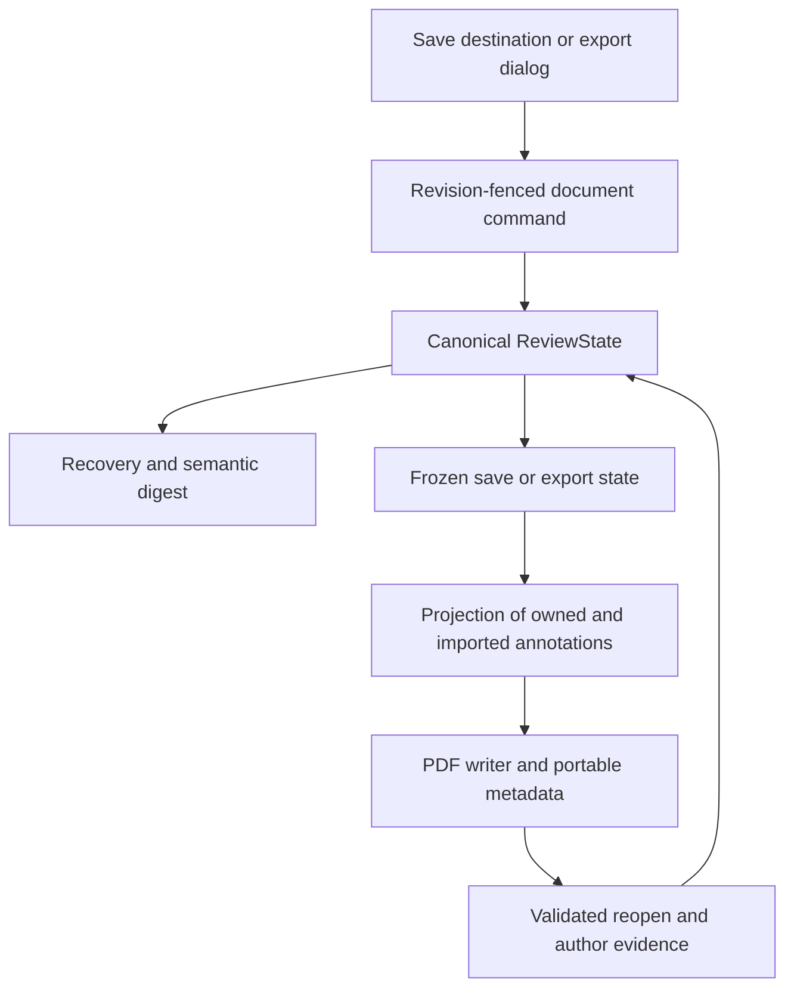
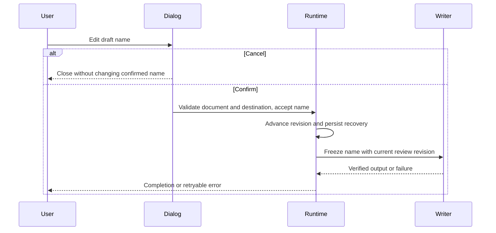
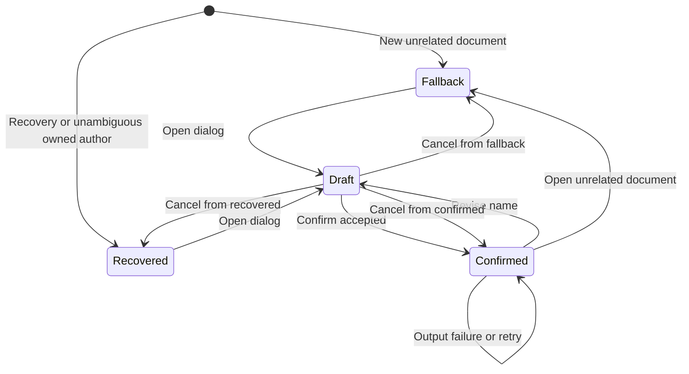

# Document Annotation Name - Plan

## Goal Capsule

- **Objective:** Readers can choose the author credited on a document’s Placekeeper annotations while preserving when each annotation was created.
- **Means:** Add a “Name on annotations” field to the save-destination and export dialogs.
- **Product authority:** The user’s September 11, 2026 discussion and final corrections govern this plan; the existing modal style governs visual details.
- **Execution profile:** Code; implement units in dependency order.
- **Stop conditions:** Surface evidence that a settled product decision cannot be met; choose routine implementation details within this contract.
- **Tail ownership:** LFG owns simplification, review, browser verification, PR creation, and CI follow-through.

---

## Product Contract

### Summary

Let readers specify a document’s annotation author when choosing where annotations are saved or exporting an annotated PDF. Keep the existing modal presentation and preserve original annotation creation times.

### Problem Frame

PDF annotations currently credit Placekeeper, so readers cannot attach their own name when sharing a reviewed document. Authorship must not obscure when comments were actually created.

### Key Decisions

- **Document scope.** Governs R4. (session-settled: user-directed — chosen over an app-wide remembered name: the name should apply only to the document currently being opened.)
- **Save and export placement.** Governs R1, R2. (session-settled: user-directed — chosen over a separate document-menu settings action: authorship belongs with the destination or export decision.)
- **Existing modal styling.** Governs R3. (session-settled: user-directed — chosen over the approximate mockup styling and explanatory helper text: reuse the current interface exactly.)

### Requirements

**Interface**

- R1. The existing “Choose where to save annotations” modal includes a “Name on annotations” text field below the destination controls, visible for both original-PDF and copy choices.
- R2. Browser and VS Code Export entry points expose the same field before writing the exported PDF.
- R3. The added field and export confirmation use the existing modal components and styling, including typography, spacing, input treatment, borders, buttons, focus behavior, and responsive layout; omit the “Remembered for future documents” helper text.

**Document authorship**

- R4. A confirmed name belongs only to the current document and must not become a preference or default for another document.
- R5. Saving or exporting applies the chosen name to all Placekeeper-created annotations included in that output, including annotations created before the name was selected.
- R6. Imported annotations retain their original authors.
- R7. Readers can revise the current document’s name through the applicable save-destination or export flow; cancellation leaves the previously confirmed name unchanged.
- R8. A document with no chosen name retains “Placekeeper” as its fallback author, and an empty or whitespace-only field uses that fallback.
- R9. Custom author names must not prevent saved Placekeeper annotations from reopening as recognizable, editable annotations.

**Timestamps**

- R10. Each Placekeeper-created annotation’s PDF creation timestamp reflects its original creation in Placekeeper and survives name changes, edits, saves, exports, and reopening.
- R11. PDF annotation modification timestamps continue to reflect annotation updates independently of creation timestamps; a save or export without an annotation change must not stamp every annotation with the output time.

### Key Flows

- F1. **Choose a save destination.** The reader chooses original or copy, enters an annotation name, and confirms through the current destination workflow. Covers R1, R3–R8.
- F2. **Export.** The reader invokes Export in browser or VS Code, reviews or edits the document’s name, and exports through the host’s normal destination mechanism. Covers R2–R9.
- F3. **Continue reviewing.** The reader creates additional annotations or changes the document’s name and saves again, then reopens the output. Covers R4–R11.

### Acceptance Examples

- AE1. **Both save choices.** With the destination modal open, switching from copy to original hides only copy-specific controls; Name on annotations remains available and uses the existing input style. Covers R1, R3.
- AE2. **Annotations already exist.** A reader creates three annotations, enters “Brad Ross” during export, and receives a PDF crediting all three to Brad Ross. An imported comment by another reviewer keeps that reviewer’s name. Covers R2, R5, R6.
- AE3. **Document isolation.** After choosing “Brad Ross” for document A, opening unrelated document B does not prefill Brad Ross from A. Cancelling a proposed name change in A preserves A’s previous confirmed value. Covers R4, R7, R8.
- AE4. **Fallback.** Confirming a blank or whitespace-only name produces annotations authored by Placekeeper. Covers R8.
- AE5. **Creation time survives output.** An annotation created at 10:00, edited at 10:05, and exported at 10:20 retains 10:00 as its creation time and 10:05 as its modification time when the saved PDF is inspected and reopened. Covers R10, R11.
- AE6. **Custom-name round trip.** A saved PDF containing a custom author name reopens with the same visible author and editable Placekeeper annotations; changing the author does not reset their creation times. Covers R5, R9, R10.
- AE7. **Visual parity.** The revised dialogs match their existing modal counterparts at supported sizes, with only the required field and any necessary export confirmation added; no global-memory helper text appears. Covers R2, R3.

### Scope Boundaries

No app-wide author preference, separate author-settings menu, first-use prompt, reviewer profiles, or bulk renaming across documents. No timestamp editor or changes to imported annotation authors. The mockup establishes field placement only; it is not a replacement design system.

### Sources and Existing Behavior

- `apps/web/src/save/SaveDestinationDialog.tsx` supplies the existing destination choices, copy controls, modal classes, and Confirm/Cancel behavior. It is the interface reference for R1 and R3.
- `apps/web/src/review/DocumentActionsMenu.tsx` supplies the current Export entry point and eligibility behavior. Existing restrictions must remain effective when adding R2.
- `packages/core/src/review-commands.ts` records annotation creation and update times; `packages/core/src/annotation-projection.ts` projects them into output annotations.
- `packages/pdf-backends/src/embedpdf-annotation.ts` maps stored times into PDF creation and modification fields. This is code evidence, not a completed output verification.
- `packages/core/src/portable-annotation.ts` currently uses the Placekeeper author in portable-annotation validation. Planning must account for that dependency to meet R9.
- `CONCEPTS.md` defines Compact Editorial and Review Items; the former governs the current modal language and the latter supplies canonical annotation state.

---

## Planning Contract

### Key Technical Decisions

- KTD1. **Canonical document setting.** Store an optional annotation name in ReviewState and update it through the existing revision-fenced ReviewCommand path (R4, R7). Include it in normalization, transport validation, recovery, and semantic digests so accepted changes participate in save freshness without changing item timestamps.
- KTD2. **Project at the frozen-state boundary.** Service delivery and static export project the name from the captured ReviewState (R5, R6, R10, R11). Preserve the existing imported-native annotation branch and all revision, destination-generation, and export checkpoint fences.
- KTD3. **Portable identity independent of the literal author.** Single and grouped portable envelopes carry the projected author as a string while retaining owner/schema, semantic identity, geometry, contents, and exact visible-author agreement (R9). Existing Placekeeper envelopes remain readable; an author string alone never establishes ownership.
- KTD4. **Extend existing modal lifecycle owners.** Add a shared name input using the effective Compact Editorial cascade, with draft state owned by the current save dialog and a matching export confirmation (R1–R3, R7). Preserve destination filename synchronization, focus restoration, export eligibility, and stale-output confirmation. (session-settled: user-directed — chosen over a separate settings surface and approximate mock styling: use the existing destination/export interaction and modal style.)
- KTD5. **Verify serialized PDF metadata.** Extend existing conformance fixtures with distinct creation, edit, and output times (R10, R11). Change timestamp code only where saved-PDF evidence reveals a mismatch.

### Assumptions

- **Reopening without recovery:** Infer the document name only when validated owned annotations agree on one author. With mixed owned authors, leave the field at the R8 fallback until confirmation; preserve their existing names on an untouched round trip by retaining per-item imported author evidence. A confirmed document name overrides that evidence for owned annotations per R5.
- **Zero annotations:** Recovery preserves a confirmed name, but a fresh open of a PDF with no owned annotations uses R8. No document-level PDF metadata format is introduced solely to remember a name without annotations.
- **Confirmation and failure:** Commit the name only after the save-destination choice is accepted, or when the export dialog is confirmed. Later output failure keeps that confirmed name available for retry; dismissal before confirmation leaves it unchanged. Stale-document completion cannot mutate the newly active document.
- **Input normalization:** Trim surrounding whitespace; use R8 for an empty result. Reuse existing portable-metadata size and shape bounds, rejecting a name that would make annotations unwritable before acknowledging a semantic change.

### High-Level Technical Design

The component and data path is:

Confirmation and output follow this sequence:

The name lifecycle is:

### System-Wide Impact

The setting crosses service, browser, static, and VS Code runtime boundaries. Their existing command transport should carry it without a parallel preference API. Recovery and export snapshots must include the setting so one view cannot report another revision as saved. Portable validation remains strict enough to protect imported annotations from being treated as owned solely because their author matches.

### Research and Constraints

Adopt the existing boundaries described in `docs/solutions/architecture-patterns/recoverable-editable-pdf-annotation-autosave.md` and `docs/solutions/architecture-patterns/shared-production-review-client-host-runtime-boundaries.md` for KTD1–KTD2. Use `docs/solutions/design-patterns/compact-editorial-language-for-annotation-modals.md` for KTD4 and `docs/solutions/integration-issues/portable-pdf-annotations-invisible-in-external-viewers.md` for KTD5.

---

## Implementation Units

### U1. Document name state and portable output

**Goal:** Give owned annotation projection a durable, document-scoped author without altering review-item dates.

**Requirements:** R4–R11; KTD1–KTD3.

**Dependencies:** None.

**Files:** `packages/core/src/review-model.ts`, `packages/core/src/review-commands.ts`, `packages/core/src/review-runtime-protocol.ts`, `packages/core/src/annotation-projection.ts`, `packages/core/src/portable-annotation.ts`, `packages/core/src/grouped-annotation-envelope.ts`; tests in `packages/core/test/portable-annotation.test.ts`, `packages/core/test/review-runtime-protocol.test.ts`, and `apps/web/test/annotation-projection.test.ts`.

**Approach:**

1. Add the normalized setting and command using current revision and validation conventions.
2. Pass the effective author into single and grouped projections and their portable metadata.
3. Keep validated imported author evidence available for the reopening assumption, without letting native imported authors enter document-name inference.

**Patterns to follow:** ReviewCommand validation and rejection; canonical ReviewItem creation/update times; exact visible-projection matching.

**Test scenarios:**

- Covers AE4. Blank and whitespace input resolves to the fallback; a repeated effective value causes no unnecessary revision change.
- Covers AE2 / AE5. Name changes affect existing owned projections while native imported authors and item timestamps remain unchanged.
- Covers AE6. Custom single and multi-page envelopes validate; changed visible authors or forged ownership metadata still fail.
- An oversized name that breaks metadata bounds is rejected before a state revision is acknowledged.
- A stale expected revision cannot overwrite a newer document setting.

**Verification:** State, projection, and portable validation tests prove the above behavior with legacy envelopes still accepted.

### U2. Runtime persistence, delivery, and reopening

**Goal:** Carry the setting through every supported document host and saved-PDF reopen.

**Requirements:** R4–R11; KTD1–KTD3; reopening and failure assumptions.

**Dependencies:** U1.

**Files:** `apps/service/src/sessions/session-broker.ts`, `apps/service/src/recovery/draft-snapshot.ts`, `packages/pdf-backends/src/embedpdf-adapter.ts`, `apps/web/src/host/static-runtime.ts`, `apps/web/src/host/session-contracts.ts`, `apps/web/src/host/runtime.ts`, `apps/web/src/app/session-api.ts`, `apps/web/src/host/browser-runtime.ts`, `apps/web/src/host/vscode-runtime.ts`, `apps/vscode/src/webview-bridge.ts`; applicable transport validators in `apps/service/src/server/http-server.ts` and `apps/service/src/browser/chrome-runtime-backend.ts`; tests in `apps/service/test/recovery.test.ts`, `apps/service/test/pdf-save-coordinator.test.ts`, `apps/service/test/export-transaction.test.ts`, `apps/web/test/static-runtime.test.ts`, and `apps/web/test/host-runtime.test.ts`.

**Approach:**

1. Include the setting in recovery and semantic digests, and route its command through current host adapters.
2. Project from the frozen state in service delivery and static export.
3. Recover validated author evidence before import reduces envelopes to review items; apply the reopening assumptions at document initialization.

**Patterns to follow:** Existing state-command publication, recovery acknowledgment, and frozen-delivery checkpoint fencing.

**Test scenarios:**

- Covers AE3. Name selection in one document never initializes another; recovery of the first restores its name.
- A name change alone marks output dirty and schedules saving when a destination exists.
- A delayed export finishes for its captured name, leaving a later name revision dirty.
- Covers AE6. Reopening custom-author output restores its name and editable items; mixed-author untouched output retains each owned author until explicit confirmation.
- Zero-annotation recovery retains the name; fresh PDF import without owned author evidence uses fallback.
- Service rejection and host document replacement do not falsely acknowledge a new name.

**Verification:** Recovery, service save/export, static export, and host transport tests pass for the same semantic command.

### U3. Save and export name controls

**Goal:** Readers can review and confirm the name in the existing destination and export flows.

**Requirements:** R1–R8; F1, F2; KTD4; confirmation and failure assumptions.

**Dependencies:** U1, U2.

**Files:** `apps/web/src/save/SaveDestinationDialog.tsx`, `apps/web/src/save/use-save-destination.ts`, `apps/web/src/ProductionReviewApp.tsx`, `apps/web/src/review/DocumentActionsMenu.tsx`, a shared name-field/export-dialog component alongside the save dialog; tests in `apps/web/test/save-destination-dialog.test.tsx` and `apps/web/test/production-review-app.test.tsx`.

**Approach:**

1. Add the exact label beneath destination controls using the current input and modal classes.
2. Stage text locally and commit through the canonical command only at accepted confirmation.
3. Introduce the matching export confirmation before the host's destination mechanism, preserving existing eligibility and stale-output warnings. Include both menu export and VS Code request-token export.
4. Keep rejected-name drafts in the open dialog, associate the existing modal error treatment with the invalid name field, and allow correction and retry.

**Patterns to follow:** Existing modal focus, cancellation, progress labels, document-generation fences, and filename synchronization.

**Test scenarios:**

- Covers AE1. Original/copy switching leaves the field available and preserves draft text.
- Covers AE2. Browser and VS Code export confirmation sends the chosen name before capturing output.
- Covers AE3. Cancel, Escape, and document changes preserve confirmed state and prevent stale dialog results from applying.
- Output failure keeps the confirmed name for retry; destination-choice failure leaves the prior confirmed name intact.
- Name validation rejection keeps draft text and the dialog open with an accessible field-associated error in both save and export flows.
- Covers AE7. Keyboard focus and existing button behavior remain usable at 1280, 620, and 360 pixels; computed input and modal styles match existing controls.

**Verification:** Component tests and real-browser checks exercise both destination choices and export confirmation using production styles.

### U4. Serialized PDF and cross-host acceptance proof

**Goal:** Demonstrate that external PDF metadata and reopened review state satisfy the feature contract.

**Requirements:** R5, R6, R9–R11; AE2, AE5, AE6, AE7; KTD5.

**Dependencies:** U1–U3.

**Files:** `test/conformance/reviewed-pdf.test.ts`, `packages/pdf-backends/test/embedpdf-annotation.test.ts`, `packages/pdf-backends/test/browser-writer.test.ts`; update writer code only if these tests expose a contract violation.

**Approach:** Extend existing five-kind writer fixtures with custom authors, multi-page owned annotations, native imported annotations, and distinct creation/edit/output times. Inspect serialized/reopened PDF values and normal appearances.

**Patterns to follow:** Existing real PDF writer conformance and foreign-inventory assertions.

**Test scenarios:**

- Covers AE5. Creation at 10:00, edit at 10:05, output at 10:20 retains the first two times after reopen.
- Covers AE6. Rename and repeat output preserve original creation dates and owned editability.
- Covers AE2. Native imported annotation author and dictionaries survive alongside renamed owned annotations.
- Unchanged repeat output does not replace modification timestamps with output time.

**Verification:** Serialized writer and save/export conformance pass; browser evidence confirms the visible field's placement and styling.

---

## Verification Contract

| Gate | Scope | Pass condition |
|---|---|---|
| `pnpm typecheck` | U1–U4 | Shared state and all host adapters compile. |
| Targeted Vitest files named by U1–U3 | U1–U3 | State, portable ownership, modal cancellation, and runtime cases pass. |
| `pnpm test:save-export` | U2, U4 | Actual output and frozen-delivery behavior pass. |
| `pnpm test:pdf-writer` | U4 | Writer conformance preserves valid output. |
| Real-browser flow checks with production styles | U3 | Original/copy and export flows work at 1280, 620, and 360 pixels. |

Use repository suite definitions in `scripts/testing/suites.ts` to avoid duplicating expensive fixtures and conformance runs. No release packaging change is planned, so release validation is not an additional gate. LFG owns code review and PR CI checks after local verification.

---

## Definition of Done

- U1: Confirmed document names project to owned annotations and preserve portable validation and dates.
- U2: Runtime transport, recovery, saved output, and reopen satisfy document isolation and frozen-revision behavior.
- U3: Both destination choices and browser/VS Code export expose the exact label in the existing modal style.
- U4: Serialized PDFs prove custom authors and original timestamps, with imported authors preserved.
- Required verification passes, review findings are resolved, and abandoned experimental code is removed.
