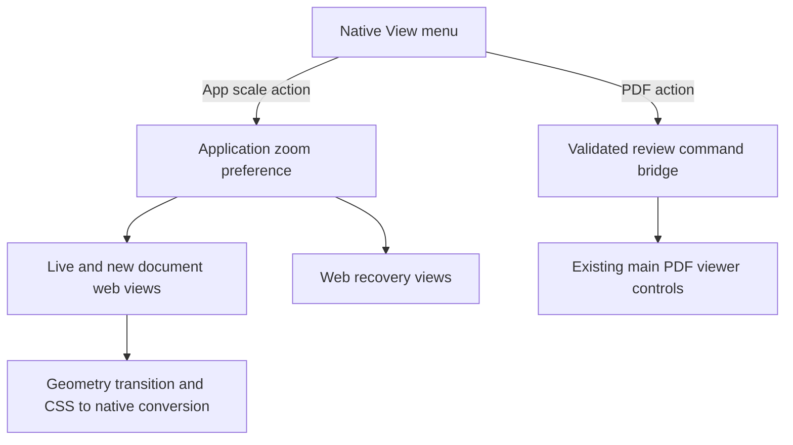
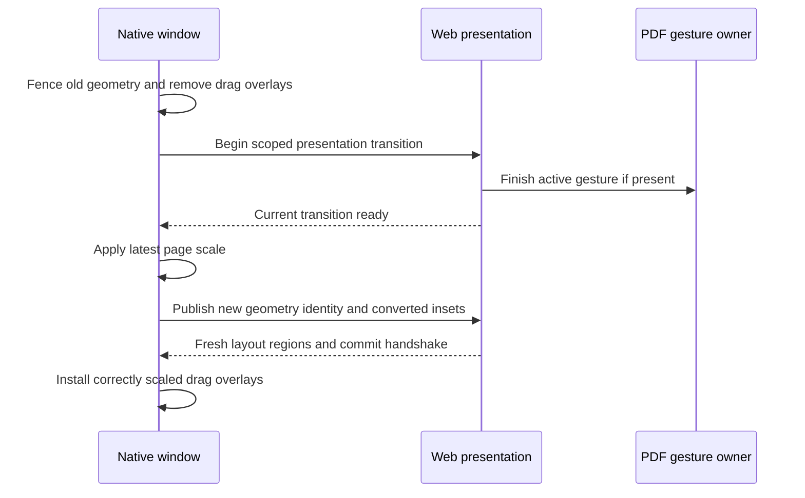

# Mac App Zoom - Plan

## Goal Capsule

- **Objective:** Readers can comfortably size the Mac app's interface for their display while retaining separate PDF zoom controls.
- **Means:** Native WebKit page scaling and separate native menu routes (KTD1–KTD3).
- **Authority:** The Product Contract governs behavior; the Planning Contract governs implementation within it. The user's later instructions take precedence.
- **Execution profile:** Four dependency-ordered units, with native runtime verification before completion.
- **Stop conditions:** Escalate evidence that the chosen WebKit mechanism cannot preserve the interaction requirements. Runtime details listed below are implementation investigations, not reasons to reopen settled scope.
- **Tail ownership:** The implementing agent completes the Verification Contract and removes abandoned experiments. LFG owns final simplification, review, commits, an open PR, and CI follow-through. Verification uses a native candidate without installing over the user's app.

---

## Product Contract

### Summary

Add browser-like scaling to the Mac app's web interface through a View submenu named **Zoom**. Keep app scale and PDF zoom independently controlled, with the requested keyboard shortcuts and an app-wide saved preference.

### Problem Frame

PDF zoom changes the document size but does not make toolbar text, menus, or annotation controls easier to read on a large display.

### Requirements

**Interface scale**

- R1. App zoom scales the whole web interface, including the displayed PDF; it does not directly rewrite the provider-owned PDF Committed Zoom.
- R2. App zoom offers 80%, 90%, 100%, 110%, 125%, 150%, 175%, and 200%, with 100% as the initial and reset value.
- R3. A single app-wide preference updates existing web-backed Mac windows and is restored before their content first appears on later launches.

**Menu and keyboard behavior**

- R4. View contains a submenu named exactly **Zoom**, with **Zoom In**, **Zoom Out**, and **Actual Size** actions for app scaling; Actual Size resets app scale to 100%.
- R5. Command plus/minus changes PDF zoom; Command Shift plus/minus changes app zoom. The physical equal and minus keys distinguish these on US keyboards as defined in KTD3.
- R6. Command 0 retains PDF Fit Width, Command Option 0 resets app zoom, and pinch gestures retain their existing PDF behavior.

**Interaction and lifecycle**

- R7. App zoom remains available in web loading, recovery, and dialog states; PDF commands use the existing main-viewer readiness and dialog gating.
- R8. Zoom changes preserve reading context, review content, editable drafts, and correctly aligned selection, annotations, popovers, draggable regions, and native window controls after layout settles.

### Key Decisions

- **Whole-interface scaling.** Governs R1. (session-settled: user-approved — chosen over interface-only scaling that holds PDF physical size fixed: browser-like scaling meets the requested readability goal.)
- **PDF shortcuts take the unshifted command chords.** Governs R5. (session-settled: user-directed — chosen over Command plus/minus for app zoom: the user explicitly reserves those commands for the PDF.)

### Acceptance Examples

- AE1. **Covers R1–R3, R8.** With manual PDF zoom at 125%, increase app zoom from 100% to 125%. Interface text and the PDF's physical presentation grow, the PDF zoom readout remains 125%, and the reading position remains stable subject to scroll limits.
- AE2. **Covers R4–R6.** On a US keyboard, Command Equal changes only PDF zoom; Command Shift Equal changes only app zoom. Command Minus and Command Shift Minus decrease their respective scales once per invocation.
- AE3. **Covers R3, R7–R8.** Set app scale to 150% with two documents open, quit, and reopen a document. Both existing documents use 150%, and the reopened document paints correctly at that scale before any resize or zoom input.
- AE4. **Covers R7–R8.** With a comment draft open, change app scale. The draft and focus survive and its controls remain usable; PDF zoom commands remain disabled while the existing dialog policy requires it.

### Scope Boundaries

This change targets the native Mac surface. Native menus, traffic lights, file pickers, and native-only fallback controls retain macOS sizing. It adds no browser-extension or VS Code app-zoom preference, per-display override, new settings screen, or focus-dependent Reference Tab zoom command.

---

## Planning Contract

### Key Technical Decisions

- KTD1. **Use WKWebView.pageZoom.** Implements R1 through Apple's supported content-scaling property, avoiding a CSS transform or font-token rewrite. Keep native magnification gestures from competing with PDF gestures. (session-settled: user-approved — chosen over interface-only CSS scaling: the user accepted whole-web-surface browser-style zoom.) Source: [Apple pageZoom documentation](https://developer.apple.com/documentation/webkit/wkwebview/pagezoom).
- KTD2. **Own app scale in the application coordinator.** Implements R2–R3 and R7 with a small injectable UserDefaults-backed preference/policy owned by PlacekeeperMac. Pass the current value into newly constructed document and web recovery controllers, and fan out changes to live controllers. Use a separate preference key, never WindowRestoration's document `zoom`. Reject invalid, nonfinite, wrong-type, or unsupported persisted values to 100%; stepping clamps at the available endpoints. App commands do not depend on a review-command snapshot.
- KTD3. **Route shortcuts once at the native menu boundary.** Implements R4–R7. Use Command Equal/Minus for PDF and Command Shift Equal/Minus for app zoom on US layouts. Normalize shifted plus/underscore and keypad equivalents without installing a PDF plus alias that also consumes the shifted app chord. Match modifiers exactly, accounting for harmless keypad/caps-lock flags. Use AppKit key equivalents rather than hardcoded US hardware keycodes, and verify a non-US layout. Add explicit PDF Zoom In/Out items beside Fit Width; retain the existing Window > Zoom action for window resizing.
- KTD4. **Extend the closed review-command vocabulary only for PDF actions.** Implements R5 and R7. Add PDF zoom-in/out through Swift commands, TypeScript protocol validation, snapshot generation, and ReviewShell dispatch. Invoke the existing main-viewer controls and framing intent; these commands have the same owner as the toolbar and Fit Width, including when a Reference Tab has focus. Keep app preference mutation outside the review bridge.
- KTD5. **Keep the geometry bridge in CSS pixels.** Implements R8. Convert DOM drag rectangles to AppKit points using the current page scale before applying the existing flipped-Y conversion. Convert native traffic-light insets/bounds and trailing margin to CSS pixels before bootstrap and geometry updates. Do not multiply by display backing scale. Invalidate cached overlays when app scale changes and retain geometry-identity rejection of stale messages.
- KTD6. **Treat app scaling as a fenced layout transition.** Implements R1 and R8. Remove drag overlays and invalidate prior geometry authority before changing scale; settle any active PDF gesture through the existing finish-gesture mechanism before it can commit against changed geometry. Use a narrowly scoped native-to-page presentation transition signal if necessary, without exposing an app-zoom review command. Coalesce rapid requests to the latest target, and keep stale acknowledgements scoped to their window attempt and geometry identity. Reinstall overlays only after the existing fresh-layout handshake. Loading/recovery without an active viewer applies scale without waiting for a PDF acknowledgement.

### High-Level Technical Design

The transition uses existing identity/fence machinery wherever possible. It must tolerate no viewer, replacement attempts, and rapid consecutive requests without an indefinite wait or stale overlay installation.

### Assumptions and Implementation Investigations

- **Planning assumption:** With no web-backed window open, native app-zoom menu actions are disabled; the saved preference still applies to the next window.
- **Planning assumption:** Native modal sheets retain standard AppKit event routing. R7 concerns web dialogs and recovery, not bypassing operating-system modality.
- **Deferred runtime check:** Confirm WebKit's actual DOM-to-view mapping at nondefault scale and after display changes before finalizing conversion helpers. The scale relationship in KTD5 is the expected mapping, not a claim of completed runtime testing.
- **Deferred runtime check:** Verify that the existing fit/framing policy responds correctly to the changed CSS viewport. Preserve manual PDF scale; allow only existing fit-mode reflow, with no new always-fit policy.
- **Deferred runtime check:** Confirm PDF raster sharpness at 150–200% page scale. If canvas resolution needs adjustment, make the smallest render-density correction without changing PDF logical scale or annotation geometry.

### Risks and Sources

The review-command lists are strict on both sides of the bridge; partial vocabulary updates can reject whole snapshots. Update their validators and fixtures together in U2.

Native hit regions currently assume CSS pixels equal AppKit points. A scale-only implementation can place invisible drag overlays over controls. U3 makes conversions and stale-message fencing explicit.

AppKit can consume a shortcut before the DOM receives a key event. U3 must explicitly settle gestures rather than relying on existing keyboard listeners. Follow `docs/solutions/ui-bugs/pointer-anchored-zoom-across-custom-viewer-geometry.md`.

Use existing responsive toolbar measurement and framing rules under page-scale reflow: `docs/solutions/design-patterns/measured-one-row-responsive-review-toolbar.md` and `docs/solutions/architecture-patterns/adaptive-annotation-tray-framing.md`.

Cold native rendering is a separate proof from browser WebKit testing: `docs/solutions/ui-bugs/native-webkit-workspace-first-paint-redundant-clipping.md`. Coordinate assertions wait for Committed Zoom and settled layout, following `docs/solutions/test-failures/wait-for-committed-wheel-zoom-before-pointer-selection.md`.

---

## Implementation Units

### U1. Persist and distribute native app scale

**Goal:** Establish one app-scale owner for every web-backed Mac window.

**Requirements:** R1–R3, R7. **Dependencies:** None.

**Files:** `apps/macos/Sources/PlacekeeperMac/PlacekeeperMac.swift`, `apps/macos/Sources/PlacekeeperMac/PlacekeeperWindowController.swift`, `apps/macos/Sources/PlacekeeperMac/RecoveryViewController.swift`, new `apps/macos/Sources/PlacekeeperMac/AppZoomPolicy.swift`, `apps/macos/Tests/PlacekeeperMacTests/MacPoliciesTests.swift`.

**Approach:** Implement KTD1–KTD2 with dependency injection patterned on WindowRestoration's injectable defaults. Cover construction, retry, restoration, and web recovery lifecycles. Apply the initial value before navigation; live changes use U3's transition path rather than a separate direct setter exposed to menus. Account for recovery dialog measurements in native points when sizing a scaled recovery view.

**Test scenarios:**

1. Missing or invalid persisted values yield 100%; valid levels survive a new store instance.
2. Stepping at 80% or 200% stays within bounds; reset returns 100%.
3. Two existing web views and a subsequently created or retried view receive the current preference.
4. Closing a controller prevents subsequent updates to it; a failed PDF load does not erase the preference.

**Verification:** Policy and lifecycle coverage passes with isolated UserDefaults; integration is complete only with U3 and U4.

### U2. Separate menu shortcuts and add PDF zoom commands

**Goal:** Each menu action or chord invokes exactly its intended zoom owner.

**Requirements:** R4–R7. **Dependencies:** U1.

**Files:** `apps/macos/Sources/PlacekeeperMac/MenuCoordinator.swift`, `apps/macos/Sources/PlacekeeperMac/PlacekeeperMac.swift`, `apps/web/src/review/review-command-surface.ts`, `apps/web/src/app/ReviewShell.tsx`, `packages/core/src/macos-shell-protocol.ts`, `apps/macos/Tests/PlacekeeperMacTests/MacPoliciesTests.swift`, `apps/web/test/review-command-surface.test.ts`, `apps/web/test/macos-entry.test.tsx`, `packages/core/test/macos-shell-protocol.test.ts`.

**Approach:** Implement KTD3–KTD4 using existing menu validation, command snapshots, and invocation revision checks. Show bound-aware app actions and readiness-aware PDF actions. Update any exhaustive command fixture discovered in the owning modules. Preserve editable focus and existing zoom-action intent.

**Test scenarios:**

1. Covers AE2. Equal/minus and their shifted variants route once to the correct owner, including keypad variants and no extra modifiers.
2. Command 0 invokes PDF fit; Command Option 0 resets app scale; Window > Zoom retains its native action.
3. A ready main PDF accepts zoom-in/out; a loading PDF or active review dialog disables them while app scale remains usable.
4. Unknown commands and stale snapshots remain rejected, and all valid snapshots include the new PDF actions.
5. With a Reference Tab focused, PDF commands target the same main viewer as the existing toolbar and Fit Width.

**Verification:** Native menu and cross-language protocol coverage pass; U4 proves actual AppKit event routing rather than only synthetic DOM key events.

### U3. Preserve geometry and gestures across app-scale changes

**Goal:** Native hit testing and PDF interactions remain aligned through scaling.

**Requirements:** R1, R6–R8. **Dependencies:** U1–U2.

**Files:** `apps/macos/Sources/PlacekeeperMac/PlacekeeperWindowController.swift`, `apps/macos/Sources/PlacekeeperMac/MacPolicies.swift`, `apps/macos/Sources/PlacekeeperMac/RecoveryViewController.swift`, `apps/web/src/macos-entry.tsx`, `apps/web/src/macos-recovery-entry.ts`, `packages/core/src/macos-shell-protocol.ts`, `apps/web/src/pdf/AnchoredZoomGestureWrapper.tsx`, `apps/web/src/pdf/anchored-zoom.ts`, `apps/macos/Tests/PlacekeeperMacTests/MacPoliciesTests.swift`, `apps/web/test/macos-entry.test.tsx`, `packages/core/test/macos-shell-protocol.test.ts`, new `apps/web/test/macos-app-zoom-transition.test.ts`.

**Approach:** Implement KTD5–KTD6 by extending the existing geometry transition and commit-visible/commit-ready machinery. Keep native conversion helpers testable. Reuse FINISH_ZOOM_GESTURE and responsive measurement rather than introducing a second PDF zoom state or CSS scale compensation.

**Execution note:** Verify the native coordinate relationship early; browser-only evidence cannot establish AppKit overlay alignment.

**Test scenarios:**

1. At 80%, 125%, and 200%, converted rectangles/insets round-trip correctly, including flipped Y and unchanged native traffic-light size.
2. A stale geometry message or acknowledgement after a newer scale request cannot reinstall old overlays or restore an older scale.
3. An active wheel/pinch preview settles before the scale transition; its later callback cannot apply stale anchoring.
4. Changing scale during resize/fullscreen/display transitions eventually installs only current regions.
5. A missing or replaced viewer does not block app scaling; recovery sizing tracks the rendered scaled content.
6. Covers AE1 and AE4. Manual PDF scale, draft contents, focus, and current reading context survive app scaling.

**Verification:** Geometry/transition regression coverage passes, and U4 confirms the same behavior in native WebKit.

### U4. Verify the native surface at saved and live scales

**Goal:** Demonstrate the combined feature under real native rendering and input.

**Requirements:** R1–R8. **Dependencies:** U1–U3.

**Files:** `test/acceptance/macos-interface.spec.ts`, `apps/macos/Tests/PlacekeeperMacTests/MacPoliciesTests.swift`, relevant focused browser tests from U2–U3; update `CONCEPTS.md` only if the final implementation requires clarifying app scale versus Committed Zoom.

**Approach:** Extend existing Mac acceptance coverage where its harness supports the behavior, and record native smoke evidence for genuine AppKit shortcuts, pageZoom, and overlay hit testing. Do not present browser CSS zoom emulation as proof of native pageZoom. Derive pointer coordinates after layout and PDF Committed Zoom settle, with no fixed sleeps.

**Test scenarios:**

1. Covers AE3. Cold-open at saved 150% without resizing; confirm painted toolbar, rail, tray, and readable recovery content.
2. At 80%, 125%, and 200%, click traffic lights and toolbar controls and drag only intended blank titlebar regions; repeat after fullscreen and display changes.
3. Exercise actual equal/minus, shifted punctuation, keypad chords, and a non-US keyboard layout; verify one action and accurate menu equivalents.
4. Select text, create/edit an annotation, open a popover, and pinch/zoom in the main viewer and a Reference Tab at nondefault app scale.
5. Check fit-width and manual PDF modes with docked and bottom References, an open tray, and a comment draft; scaling must not reset independent reference state.
6. Confirm app zoom limits/reset, multiple windows, retry after failure, and the no-window menu state.

**Verification:** Native and shared-web tests pass, smoke evidence demonstrates alignment and first paint, and any discovered regression is fixed within its owning unit.

---

## Verification Contract

- Run `pnpm typecheck` and the focused Swift/Web protocol, command, policy, and transition tests identified in U1–U3.
- Run the repository's `pnpm test:macos:native` and `pnpm test:macos:gate` suites, with `pnpm build:macos:web` for the bundled web surface.
- Run relevant `pnpm test:review` and `pnpm test:pdf-viewer` coverage when shared command or gesture code changes.
- Use a native candidate for U4's real AppKit/pageZoom checks; do not install it over the user's app as a side effect of verification.
- No `release:validate` script exists in the inspected root package manifest. Publishing, notarization, and distribution installation are outside this plan's verification gates.

---

## Definition of Done

- U1: A validated app-wide preference reaches live and newly created web-backed windows.
- U2: Menu labels and shortcuts meet R4–R7, with complete protocol coverage and no double dispatch.
- U3: Scale transitions maintain correct native/web coordinates, gesture ownership, and stale-message rejection.
- U4: Native first-paint and interaction evidence covers the acceptance examples and the Verification Contract passes.
- No PDF data, annotation coordinates, or document restoration field is repurposed to hold app zoom.
- The final diff contains no abandoned experiments, temporary diagnostics, or unneeded zoom implementations.

## Execution Evidence

### U1 — saved application scale

- Implemented in `d022d16`: independent validated preference, initial scale before navigation, live document/recovery fanout, recovery sizing, and closed-controller guards.
- Production policy assertions passed for invalid values, supported-level persistence, clamped stepping, and reset. Native application sources compiled successfully; baseline Mac web build passed.
- Added XCTest coverage for persistence, document-preference independence, and recovery initial/live/retry/close behavior. These tests remain **unexecuted**: both sandbox-adjusted and normal `swift test --package-path apps/macos` fail because the installed Command Line Tools lack the XCTest module; no full Xcode installation was found.
- Test-first exception: no clean red baseline was captured after initial cache/sandbox failures and a cold-build source-change rejection. Coordinator fanout is source-inspected pending combined native verification in U4.
- U1 does not establish U3 geometry safety or U4 acceptance; their verification remains outstanding.

### U2 — separate native zoom commands

- Added native app Zoom submenu, exact modifier-aware PDF/app routes, and PDF zoom commands across both closed protocol vocabularies and main-viewer dispatch.
- Root verification: 23 focused command/protocol/entry tests passed, TypeScript check passed. Worker observed three expected missing-command failures before implementation. Added native menu/shortcut tests remain unexecuted because XCTest is unavailable.
- Actual AppKit input, reference focus, and editable-focus preservation remain U4 checks. The temporary WebKit snapshot probe failed to detect its painted marker and supplies no native coordinate evidence.

### U3 — geometry and gesture transitions

- Added scoped, coalesced presentation transitions; explicit gesture completion and deferred-anchor cancellation; CSS/native coordinate conversions; recovery control and drag geometry scaling.
- Root verification: 24 focused transition/entry/protocol tests passed, TypeScript check passed, native Swift build passed without warnings. Worker production Swift geometry/coalescing assertions passed; initial web tests and standalone Swift compile failed for the missing behavior before implementation.
- Added XCTest geometry/coalescing tests remain unexecuted. Native mapping, saved first paint, draft/focus, reading-context preservation, and actual input remain U4 verification gaps.

### U4 — combined acceptance and discovered modal fix

- Packaged-entry/browser acceptance: nine tests pass, including loading-state transition acknowledgment, stale identity rejection, refreshed geometry, and a regression for parent-owned save dialogs. TypeScript check passes.
- Native candidate testing exposed that parent-owned save dialogs did not reach the review shell's focus handler. Added explicit modal state to the command projection; the browser regression failed before the fix and now verifies PDF zoom/fit are disabled, ignored invocations do not reach viewer controls, and commands resume after dismissal.
- Required PDF viewer suite: six tests pass. Mac gate: all 35 web/protocol tests pass after updating an existing source assertion for CSS-unit traffic-light geometry; its native stage remains blocked by missing XCTest.
- Review suite: 66 browser tests pass and five fail. All five failures reproduce on the isolated pre-change `190b844` snapshot: host-export timing, outline disclosure, fake-viewport tray geometry, hover-menu dismissal, and history disclosure. These are baseline failures, not new zoom regressions.
- Native candidate observations before the modal-fix rebuild: app scales through 125–200% while retaining manual PDF zoom; Command–Minus and Command–keypad-plus change only PDF zoom; app reset works; zoom popup responds at the visible 200% coordinates; native traffic lights retain their size; editable replacement draft text and focus survive scaling; two document windows receive app scale; fullscreen entry/exit and a move to the Retina display preserve rendering.
- Input automation limitation: a separate native key-event probe showed both `super+equal` and `super+shift+equal` arrive with Command+Shift (`1179648`), while minus/keypad-plus arrive with Command (`1048576`). Physical unshifted equal and a non-US layout remain unverified; do not infer their behavior from those CUA inputs. CUA also lost coordinate targeting after a display move, so pointer alignment on the moved display is not established.
- Still outstanding: cold saved-scale first paint, native modal-fix confirmation, native XCTest suite, real pinch/active-gesture transitions, complete reference-pane/annotation alignment and recovery-path matrix. The feature is not yet fully verified or shipped.
