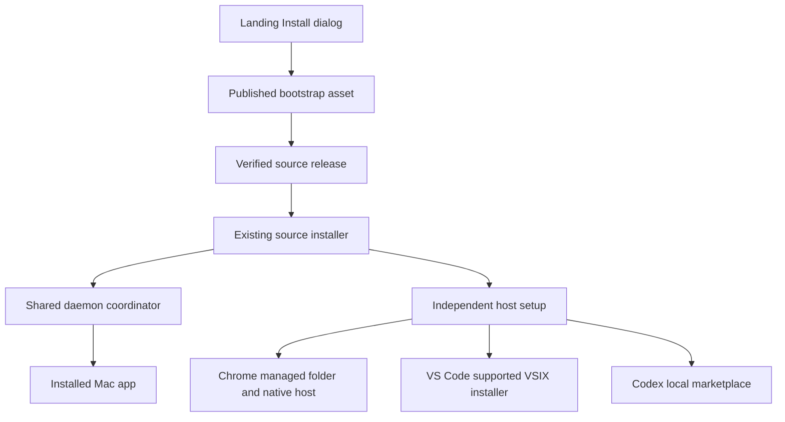
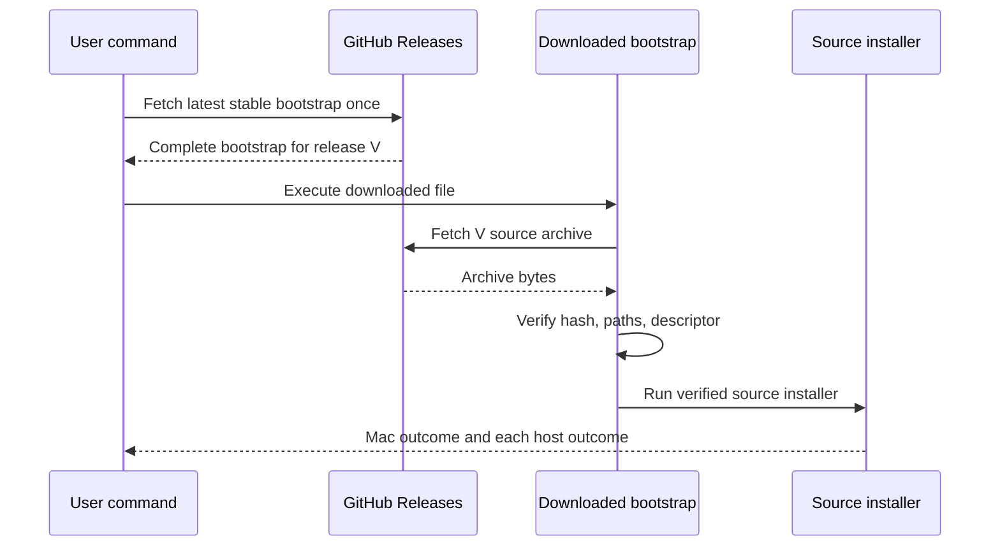
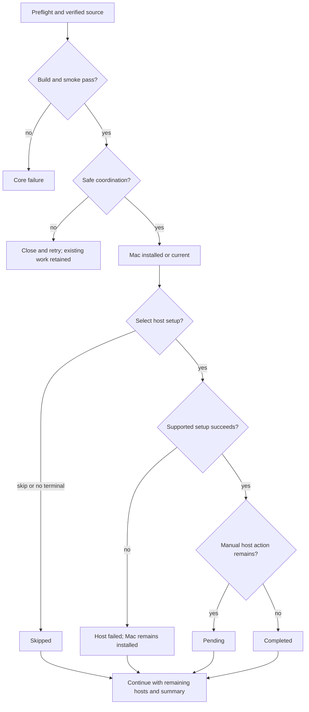
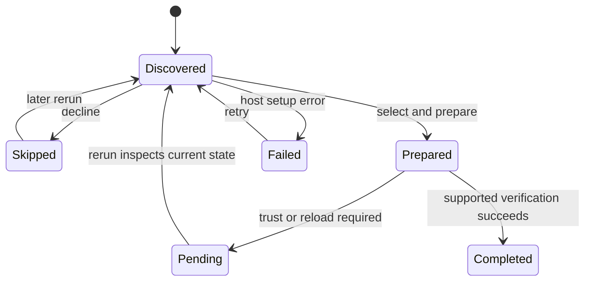

# Release-backed installation from the landing page - Plan

## Goal Capsule

**Objective:** Visitors can install Placekeeper and their chosen integrations from the landing page, then return later to add skipped integrations or update their installation.

**Means:** A compact command dialog backed by tested GitHub Releases and the existing local source installer.

**Product authority:** The Product Contract below records the installation brainstorm and the user's final scope approval on September 13, 2026. It authorizes requirements planning, not publication of a release.

**Execution:** Implement and validate the plan, then open a PR under the user-authorized autonomous shipping flow. Release publication is a separate maintainer action after merge.

**Status update (2026-09-14):** The source installer has been published. The original plan separated implementation from publication; that historical scope remains below. PR #110 subsequently made Chrome experimental and removed its manual installed-host evidence from the source-publication gate. The current workflow accepts only `version` and `notes`; physical Chrome validation remains separate.

**Product Contract preservation:** Product Contract unchanged; source-build toolchain qualifications below clarify the existing prerequisite requirement.

---

## Product Contract

### Summary

Replace the landing page's source-ZIP download with a compact Install dialog. Its command installs a tested source release and guides users through optional integrations, including setup they previously skipped.

### Problem Frame

The hero Install link currently scrolls to the bottom invitation, whose Install link downloads the moving main-branch ZIP. Visitors must discover the source-build instructions and integration setup themselves. The existing installer provides much of the installation machinery, but the landing page does not explain or expose that path.

### Key Decisions

- **Compact dialog.** Governs R1–R4. (session-settled: user-directed — chosen over inline expansion and a separate install page: keep the landing page minimal.)
- **Source releases for now.** Governs R5–R7. (session-settled: user-approved — chosen over signed downloadable packages: avoid signing and notarization setup while accepting a local build.)
- **Guided optional integrations.** Governs R9–R12. (session-settled: user-directed — chosen over leaving setup as a separate follow-up: users can complete setup now or skip and return.)
- **Prerequisite link without Terminal lessons.** Governs R2. (session-settled: user-directed — chosen over embedded Terminal help: keep the dialog concise.)

### Requirements

**Landing dialog**

- R1. Both landing-page Install buttons open the same compact dialog without navigating away or resetting the interactive demo.
- R2. The dialog states Apple-silicon Mac, macOS 13+, and Apple Command Line Tools requirements, linking the latter to Apple's installation instructions without adding Terminal help.
- R3. The dialog shows the complete install command with a Copy control and clear success or failure feedback; the command remains selectable when clipboard access fails.
- R4. The dialog follows Placekeeper's neutral visual language and supports narrow screens, keyboard operation, dismissal, and focus return to its triggering button.

**Release selection and installation**

- R5. The install command resolves the latest published stable GitHub Release once per invocation and uses that exact release throughout the run.
- R6. Source releases are deliberately published from tested revisions with identifiable versions and brief release notes; publishing does not require the signed macOS release workflow.
- R7. Installation builds locally through the existing source-install path and preserves its pinned toolchain and dependency checks.
- R8. Missing prerequisites, unavailable releases, failed downloads, and build failures produce an actionable outcome without claiming installation succeeded or silently falling back to main.

**Integration guidance and reruns**

- R9. After the Mac app is installed or confirmed current, the installer offers Chrome, VS Code, and Codex setup individually with an explicit skip choice.
- R10. Each integration step performs supported setup and guides any host-required manual actions, distinguishing completed setup from pending approval or enablement.
- R11. Rerunning the same command recognizes existing setup and offers skipped or incomplete integrations without removing installed integrations or resetting user settings.
- R12. An unavailable host or failed optional integration does not invalidate a successful Mac installation or prevent setup of the remaining integrations; the final summary names completed, skipped, pending, and failed outcomes.
- R13. Reruns preserve the existing active-review deferral and recovery protections, reporting any required close-and-retry step without discarding user work.

### Key Flows

- F1. First install: a visitor opens the dialog, follows the prerequisite link if needed, copies the command, and runs it. The installer identifies its release, installs the Mac app, offers each integration, and reports outcomes. Covers R1–R10, R12.
- F2. Add an integration later: a user reruns the command after previously skipping VS Code. Existing setup is recognized and preserved while VS Code setup becomes available. Covers R9–R13.
- F3. Manual host action: a selected integration needs a host confirmation. The installer explains that action and reports setup as pending until completion can be established. Covers R10, R12.

### Acceptance Examples

| ID | Scenario | Expected outcome |
| --- | --- | --- |
| AE1 | Open either Install button and dismiss the dialog. | The same UI opens; the demo remains intact and focus returns to the trigger. Covers R1, R4. |
| AE2 | Copy the command with clipboard permission denied. | A failure is reported and the complete command is still selectable. Covers R3. |
| AE3 | A newer release appears during an install. | The running install continues using its initially resolved version. Covers R5. |
| AE4 | No published stable release is available. | The command reports that installation cannot proceed rather than downloading main. Covers R8. |
| AE5 | Install Mac and Chrome, skip VS Code and Codex, then rerun. | Skipped integrations can be added without resetting Chrome or requiring duplicate setup. Covers R9–R11. |
| AE6 | A host is missing or its integration step fails. | The summary reports the outcome and other integration steps remain available. Covers R12. |
| AE7 | An active review prevents an app update. | The installer preserves that work and explains when to retry. Covers R13. |

### Scope Boundaries

This work does not introduce signed or notarized app downloads, DMG/PKG distribution, Intel or non-Mac installation, background automatic updates, host-app installation, or a Terminal tutorial. Host-required trust and enablement remain explicit user actions under R10.

### Companion Landing Correction

The user separately requested equal space between the drop hint and the “or” divider, and between the divider and the URL entry row. Include this small correction alongside the dialog styling, with a visual check at the reported narrow layout and desktop width. Current CSS gives the separator unequal top and bottom margins; this is not caused by a paragraph bottom margin.

### Dependencies and Planning Questions

- Deferred to Planning: choose the bootstrap command and release artifact format, including integrity verification and release-to-installer compatibility. Resolve this before displaying a runnable command.
- Deferred to Planning: select supported integration installation mechanisms and determine which completion states can be verified for each host. Preserve R10 when verification requires a manual step.
- Deferred to Planning: choose the release validation gates and versioning procedure. Existing signed-release credentials must not become prerequisites for R6.
- Assumption: source-install users accept internet access and local build time. The supported platform floor comes from the current installation documentation; planning must check that the actual prerequisite checks enforce it.

### Sources and Research

- `apps/web/src/static-entry.tsx:157` and `apps/web/src/static-entry.tsx:236`: current Install destinations.
- `apps/web/src/static-entry.css:510`: separator margin override, currently 18px above and 14px below.
- `install.sh`: pinned toolchain, local build, installation coordination, Chrome preparation, and refresh of an existing VS Code extension.
- `docs/installation.md`: platform requirements, update protections, and optional integration setup.
- `.github/workflows/release-macos.yml`: existing signing/notarization workflow, distinct from the proposed source release flow.
- [Apple: Installing the command-line tools](https://developer.apple.com/documentation/xcode/installing-the-command-line-tools): dialog prerequisite link.
- [GitHub: About releases](https://docs.github.com/en/repositories/releasing-projects-on-github/about-releases): release tags, notes, and source archives.

The selected visual direction is the compact dialog; rough sketches are exploratory, and their superseded Terminal-help content is not part of this contract.

---

## Planning Contract

### Key Technical Decisions

- KTD1. **Release-contained bootstrap.** Generate an `install-placekeeper.sh` release asset containing the exact version, source commit, source-archive URL, and SHA-256 of that archive. The landing command downloads this asset through GitHub's stable `releases/latest/download` redirect once, saves it completely to a private temporary directory, and only then runs it. Every subsequent download uses the embedded tag-specific asset URL. This avoids a mutable-main executable and a second latest lookup, while requiring no JSON parser or global runtime before the existing pinned toolchain is installed. R5, R7, R8 govern the behavior.
- KTD2. **Uploaded source archive, validated before execution.** Package tracked files from one tested commit into an uploaded source archive; include a small release descriptor with schema version, release version, and full commit. The bootstrap verifies its embedded SHA-256 before extraction and requires the archive descriptor to agree. Reject absolute paths, parent traversal, links escaping the extraction root, unexpected top-level roots, and incompatible descriptor versions before executing `install.sh`. GitHub transport and repository release permissions remain the trust root; the digest proves asset consistency, not independent publisher authentication. Prefer this over generated GitHub source archives whose compressed bytes can change.
- KTD3. **Source publication is separate from signing.** Add a manually dispatched workflow restricted to trusted main, validating an explicit version against the canonical app manifest and rejecting an existing tag/release. Produce all source assets from the one checkout, build and smoke the unsigned local candidate, then publish a draft with all assets and notes before making it stable/latest. Only the publication job receives contents-write permission; no signing secrets are required. Published assets are never silently replaced. This implements R6 while retaining the existing signed workflow separately.
- KTD4. **Keep installation coordination authoritative.** Release versions identify the source and report provenance; they do not replace exact artifact identity, active-review checks, coordinated retirement, rollback, or candidate readiness in the existing daemon lifecycle. Preflight verifies Darwin/arm64, the documented runtime floor, a functioning Swift 6-or-newer compiler, and an available macOS SDK before toolchain downloads. The `/usr/bin/swift` stub alone is insufficient. R7, R8, R13 govern these checks.
- KTD5. **Host setup owns its own transaction.** App coordination commits the Mac bundle first. Move first-time Chrome external-folder/native-host preparation to a separate host stage, retaining its ownership, exact-origin, secure-path, and rollback checks. Existing Chrome endpoints remain untouched by an unsuccessful app transaction. After a successful app update, protocol-incompatible Chrome payloads fail closed; compatible older payloads may continue until their independent update succeeds; never reset the automatic-opening preference. Optional failure cannot roll back a successfully installed Mac app. Keep VS Code mutation outside the replacement helper, including app-no-op reruns. R9–R13 govern this boundary. Before replacing the app, retain a narrowly scoped legacy-ownership receipt containing the validated external Chrome tree fingerprint in the installer support directory. Keep it across skipped or failed Chrome stages until adoption succeeds; accept it only for the same secure managed path and rechecked tree. This migration receipt preserves the previous-bundle ownership proof without storing integration choices or enablement. Each mutating host stage reacquires the shared lifecycle lock, revalidates installed artifact identity, and defers when active work could be interrupted. Never hold that lock while prompting. An app-no-op result does not itself establish host-mutation safety.
- KTD6. **Observe host state, do not create an integration database.** Each run offers Chrome, VS Code, and Codex separately; installed payloads and supported host inspection determine update/repair guidance. Skip performs no new mutation for that host. Keep outcomes in memory; KTD5's temporary legacy-ownership receipt is the sole persisted migration evidence. Read interactive responses from a terminal rather than bootstrap input; with no terminal, skip optional setup and print rerun guidance. Core failure/deferred update stops before host stages. Optional failures produce an explicit Mac-success summary and a distinct optional-failure exit outcome; pending manual actions alone are not failures.
- KTD7. **Use supported host installers and retain manual consent.** Chrome preparation reports pending until the user loads the persistent unpacked folder and enables automatic PDF opening; doctor health proves registration, not enablement. Extend the existing VS Code VSIX builder/CLI updater to allow explicitly selected first installation; list extensions afterward and distinguish payload installation from editor reload. Package a local Codex marketplace alongside the bundled plugin and use its supported marketplace/plugin commands only when available; otherwise show the local marketplace path and host instructions. Codex trust, enablement, and starting a new task remain pending until demonstrably complete. No private host databases, global trust edits, or automatic LaTeX Workshop settings changes.
- KTD8. **One mounted native dialog.** Keep the landing demo mounted, change both Install anchors to buttons, and render one native modal dialog with controlled opening, explicit close, Escape/backdrop dismissal, and saved-trigger focus return. Use existing neutral tokens and status feedback conventions. Keep the prerequisite note concise under R2, and equalize the actual divider margins rather than adding an unrelated paragraph rule.

### Assumptions

- The technical choices KTD1–KTD8 resolve the planning-owned gaps under the approved scope; they are planning defaults, not newly user-settled decisions.
- The app's macOS 13 runtime target is distinct from a source-build host with Swift 6 and a compatible SDK. Apple's Xcode 16 documentation requires macOS 14.5; the independently distributed Command Line Tools minimum was not established from the available official evidence. The dialog and installation guide must qualify the required Swift toolchain rather than promise every macOS 13 machine can source-build. A concrete preflight failure links to Apple instructions and does not silently lower compiler requirements.
- Existing host trust may not be inspectable through public interfaces. “Prepared; finish in host” is an acceptable pending outcome under R10, including reruns; mere files present never establish enablement.

### High-Level Technical Design

Component ownership:

Release and install protocol:

Installation decisions and outcomes:

Host lifecycle:

### System-Wide Impact and Risks

The installer changes user-local app and integration artifacts but never PDF, export, Protected Recovery, Chrome preference, or workspace-setting storage. The app transaction remains coordinated through `apps/service/src/cli/daemon-command.ts`; extracting optional Chrome setup must preserve the lifecycle lock and recheck behavior. Existing Chrome sessions prevent replacement through that same activity boundary. A successfully updated app may temporarily reject a protocol-incompatible Chrome extension by existing checks; the summary must explain reload/repair without attempting recovery-data cleanup.

GitHub release permissions are executable-code publication authority. Use trusted-main dispatch, immutable action pins, read-only validation jobs, HTTPS-only bounded downloads, complete-file execution, temporary-directory cleanup, and no overwrite of published versions. Before the first source release exists, the command must report that a stable installer is unavailable and must not resolve main. Publishing the initial release is deliberately outside this PR's completion claim.

### Research Used

- `docs/solutions/architecture-patterns/upgrade-safe-shared-per-user-daemon-lifecycle.md` governs KTD4 and physical installed verification.
- `docs/solutions/integration-issues/refresh-independent-vscode-payload-after-app-install.md` governs KTD5 and unchanged-version payload refresh.
- `docs/solutions/design-patterns/compact-editorial-language-for-annotation-modals.md` informs KTD8's concise dialog.
- [GitHub latest-release links](https://docs.github.com/en/repositories/releasing-projects-on-github/linking-to-releases) support KTD1; [archive stability](https://docs.github.com/en/repositories/working-with-files/using-files/downloading-source-code-archives) supports KTD2's uploaded archive.
- [Apple Xcode requirements](https://developer.apple.com/xcode/system-requirements) inform KTD4's compiler/runtime distinction.
- [Chrome unpacked loading](https://developer.chrome.com/docs/extensions/get-started/tutorial/hello-world#load-unpacked), [VS Code VSIX installation](https://code.visualstudio.com/docs/configure/extensions/extension-marketplace), and [Codex plugin guidance](https://learn.chatgpt.com/docs/build-plugins) govern KTD7's host boundaries.

---

## Implementation Units

### U1. Package and bootstrap one source release

**Goal:** Produce self-consistent release assets and install their exact source revision.

**Requirements:** R5–R8; F1; AE3, AE4. **Dependencies:** None.

**Files:** Add `scripts/package-source-release.ts`, `scripts/install-release.sh`, `scripts/source-release.test.ts`, and `scripts/install-release.test.ts`; update `package.json` and test-suite registration as needed.

**Approach:** Implement KTD1–KTD2 with a template-generated bootstrap and release descriptor. Keep release-generation validation separate from runtime shell logic. Use the existing source installer inside the verified extraction root. Forward its exit result and retain version/provenance in output; clean only the invocation's private temporary directory.

**Patterns to follow:** `install.sh` download/hash/cleanup discipline; `scripts/static-release.test.ts` distribution workflow contracts.

**Test scenarios:**

- Covers AE3. A newer stable release appears after bootstrap download; only the embedded release source is requested.
- Covers AE4. Latest bootstrap is absent or unavailable; command fails clearly and never executes a partial file or main source.
- Truncated download, wrong hash, mismatched descriptor, unsupported schema, and unsafe archive entries each fail before installer execution.
- A valid archive invokes its own installer, propagates core failure, and cleans temporary files after success or interruption.

**Verification:** Deterministic fixture-based download tests prove release identity and integrity without depending on live GitHub availability; the emitted assets are mutually consistent.

### U2. Isolate app installation from optional Chrome preparation

**Goal:** Preserve safe Mac replacement while making Chrome setup independently recoverable.

**Requirements:** R7–R8, R10–R13; F1–F3; AE6, AE7. **Dependencies:** None.

**Files:** `install.sh`, `packaging/macos/install-built-app.sh`, new `packaging/macos/setup-chrome.mjs`, `packaging/macos/packaging.test.ts`, `packaging/macos/chrome-integration.test.ts`, and `apps/service/test/macos-daemon-runtime.test.ts`, `apps/service/src/cli/daemon-command.ts`, and `apps/service/src/host/upgrade-coordinator.ts`.

**Approach:** Apply KTD4–KTD5. Add real compiler/SDK preflight; retain the existing coordinator and exact artifact checks. Extract Chrome external registration/preparation into a stage with its own staging, ownership checks, rollback, and diagnostics. Existing bundled Chrome assets remain part of the Mac payload. Adapt installed-smoke expectations to app-only installation plus explicitly selected Chrome preparation.

**Execution note:** Add characterization coverage around existing rollback and active-review refusal before separating Chrome mutation.

**Patterns to follow:** `install-built-app.sh` secure managed paths and snapshot rollback; daemon coordinator lock/readiness handling.

**Test scenarios:**

- Missing CLT, old Swift, absent SDK, unsupported CPU/OS each fail before downloads or mutations with Apple prerequisite guidance.
- Covers AE7. Active reviews or a bound task defer replacement with app and all host artifacts unchanged.
- Candidate readiness failure restores the old app and leaves existing Chrome artifacts unchanged.
- Covers AE6. An unmanaged Chrome destination or registration write failure leaves the successful Mac app installed and restores previous Chrome artifacts.
- Existing Chrome on/off preferences are untouched; incompatible older payloads fail closed, while compatible older payloads may continue until repaired.
- A pre-marker managed Chrome folder is recognized from the previous app before replacement, then adopted only if unchanged. A separate rerun after skip or failed setup retains that ownership proof; a changed external tree is rejected and successful adoption removes the receipt.
- A current app with active review defers selected host repair; overlapping installers cannot replace the app while host artifacts are being reconciled.

**Verification:** Existing lifecycle/packaging regressions pass; isolated installed smoke proves Mac replacement and explicit Chrome setup through the actual helper boundaries.

### U3. Guide and reconcile each optional integration

**Goal:** Let first-time users and rerunning users complete, skip, or repair hosts with truthful outcomes.

**Requirements:** R9–R13; F1–F3; AE5, AE6. **Dependencies:** U2.

**Files:** `install.sh`, new `packaging/macos/setup-integrations.mjs` and `packaging/macos/setup-integrations.test.mjs`, `packaging/macos/update-vscode.mjs`, `packaging/macos/update-vscode.test.mjs`, `packaging/macos/build-native-candidate.ts`, `packaging/macos/packaging.test.ts`, `.agents/plugins/marketplace.json` as reference, and bundled integration packaging metadata.

**Approach:** Implement KTD6–KTD7 using the installed app's bundled runtime. Offer each host independently after installed/current Mac status; avoid wrapping optional failures in the shell's fatal path. Extend VSIX preparation to explicit first installs and fallback manual installation. Package the local marketplace with paths valid after temporary source deletion; detect supported Codex commands before using them and preserve unrelated marketplaces. Expose explicit host choices for repeatable CLI/agent use while keeping no-terminal behavior nonblocking.

**Patterns to follow:** `update-vscode.mjs` supported CLI and temporary VSIX construction; `integrations/codex-plugin` manifest/hook conventions.

**Test scenarios:**

- Covers AE5. Install Chrome, skip other hosts, then rerun and add VS Code without changing Chrome settings.
- A current app still offers skipped/incomplete hosts; same-version VS Code payloads can be refreshed.
- Covers AE6. VS Code CLI failure is summarized and Codex setup is still offered; Mac remains reported installed/current.
- Chrome prepared files and healthy registration report pending manual loading/enablement, not completed.
- Missing Codex CLI uses truthful local-marketplace guidance; unavailable trust verification remains pending.
- No terminal skips optional stages without blocking; an explicit skip changes no host settings; released marketplace paths survive source cleanup.

**Verification:** Host adapters use mocked supported command boundaries; isolated host smoke confirms actual VSIX installation and local marketplace discovery without changing the developer's everyday profiles.

### U4. Add the compact landing Install dialog

**Goal:** Expose the verified command and prerequisites from both Install buttons.

**Requirements:** R1–R4; AE1, AE2; companion spacing correction. **Dependencies:** U1 defines the release asset contract.

**Files:** `apps/web/src/static-entry.tsx`, `apps/web/src/static-entry.css`, optional focused `apps/web/src/landing/InstallDialog.tsx`, `apps/web/test/static-entry.test.ts`, and `test/acceptance/static-web.spec.ts`.

**Approach:** Apply KTD8, displaying the complete download-then-execute command from KTD1. Show Apple-silicon/macOS requirements and the working Swift-6 CLT qualification with the official Apple link. Keep copy/select feedback inside the dialog. Use equal separator block margins at desktop and narrow widths.

**Patterns to follow:** Existing landing tokens, review dialog accessibility patterns, static Playwright acceptance harness.

**Test scenarios:**

- Covers AE1. Each trigger opens the same dialog; Escape, close, and backdrop dismiss it and restore focus without resetting demo state.
- Tab navigation remains inside the modal, and narrow screens keep controls usable with selectable command overflow.
- Covers AE2. Clipboard denial produces failure feedback with the full command selectable; success reports copied.
- Both viewport sizes show equal measured space around the divider; Apple prerequisite link and complete command are visible.

**Verification:** Static unit and browser suites pass; inspect desktop and narrow screenshots for focus, readability, overflow, and spacing.

### U5. Validate and document deliberate source publication

**Goal:** Allow maintainers to publish a tested source release without signing credentials and document the complete user flow.

**Requirements:** R2, R5–R8, R10–R13; F1–F3. **Dependencies:** U1–U4.

**Files:** Add `.github/workflows/release-source.yml`; update `scripts/source-release.test.ts`, `README.md`, `docs/installation.md`, and `test/acceptance/installed-hosts.md` where the new setup boundary changes its instructions.

**Approach:** Apply KTD3. Gate publication with typechecking, source-release/bootstrap tests, packaging/lifecycle tests, unsigned candidate build, offline installed smoke, and Chrome protocol/handoff checks. Chrome is an optional experimental integration. Collect its build-bound installed-host evidence separately; do not require it as a source-publication input or treat its absence as a passing Chrome validation. The signed/prebuilt release workflow retains its stricter gate. Document version selection, notes, draft completeness, stable promotion, first-release absence, and rollback by a newly published corrected version. No release is published as part of this PR.

**Test scenarios:**

- Publication refuses non-main input, version mismatch, duplicate tag, incomplete artifacts, and failed validation without creating a public release.
- Validation jobs have no write/signing credentials; publication receives only required release permission after all gates.
- Generated bootstrap source URL/hash/descriptor agree with the published archive and selected version.
- A maintainer can follow the source release procedure without the signed workflow's Apple secrets; documentation describes pending host trust/reload honestly.

**Verification:** Workflow contract tests and local asset generation pass; final PR names the unperformed live publication and physical-host gates explicitly rather than claiming release availability.

---

## Verification Contract

Use the repository's suite runner and pinned package manager. Targeted new tests must be registered so CI runs them. No production release or everyday host-profile mutation is needed to validate the PR.

| Gate | Applies to | Required evidence |
| --- | --- | --- |
| `pnpm typecheck` | All units | Changed TypeScript and existing contracts compile. |
| New source-release/bootstrap tests | U1, U5 | Immutable selection, integrity, archive rejection, failure and workflow permissions pass. |
| Packaging, Chrome integration, and VS Code updater tests | U2, U3 | Independent host failures and existing transaction protections pass. |
| `pnpm test:upgrade-lifecycle` | U2, U3 | Active reviews/task bindings still block replacement; retry and rollback are intact. |
| `pnpm test:static:pr` | U4 | Both triggers, focus, copy fallback, demo preservation and responsive layout pass. |
| `pnpm package:macos` plus `pnpm smoke:installed` | U2, U5 | Unsigned Apple-silicon candidate builds and packaged writer works offline in isolation. |
| `pnpm test:chrome-handoff` | U2, U5 | Chrome protocol and authority boundaries remain intact. |
| `pnpm test:chrome-installed` with build-bound evidence | Separate experimental Chrome validation | Real Chrome 151+ load/enablement and installed host matrix pass; no automated skip substitutes for this evidence. Not a Mac source-publication gate. |

Physical integration validation uses disposable host profiles and temporary installation roots. Confirm a real VSIX installs via the supported host, the local Codex marketplace resolves after source deletion, and active PDFs with a task binding survive deferred updates. If a physical host is unavailable, record the precise remaining check; deterministic tests do not establish manual enablement. Browser screenshots at desktop and the reported narrow layout complete U4's visual verification. There is no `release:validate` script in this repository; use the concrete gates above.

---

## Definition of Done

- U1–U5 satisfy their requirements and enumerated scenarios, with no new source or host-state store beyond their described artifacts.
- Both Install buttons share an accessible compact dialog, the full command is recoverably copyable, and the divider spacing is symmetric.
- A generated source release installs only its verified revision, and no failure path falls back to main or reports false success.
- Optional host outcomes remain independent and rerunnable; active-review and Protected Recovery protections remain intact.
- Required PR gates pass; unsupported local physical checks are explicitly recorded, and source publication runs its automated gates while experimental Chrome physical validation remains separate.
- The release workflow and user/maintainer documentation agree. The PR clearly states that no source release was published by this work.
- Remove abandoned experimental code and temporary artifacts from the diff; open the reviewed implementation PR under the authorized shipping flow.
