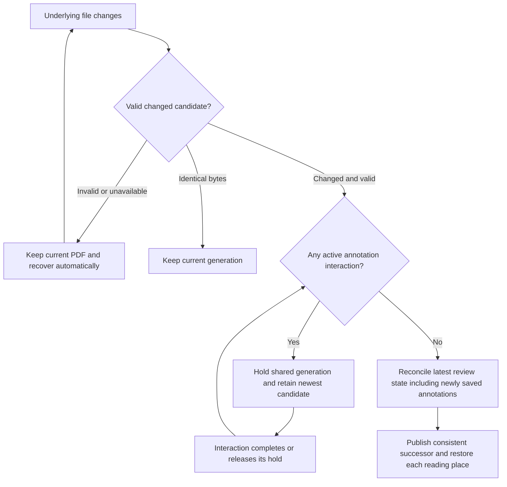
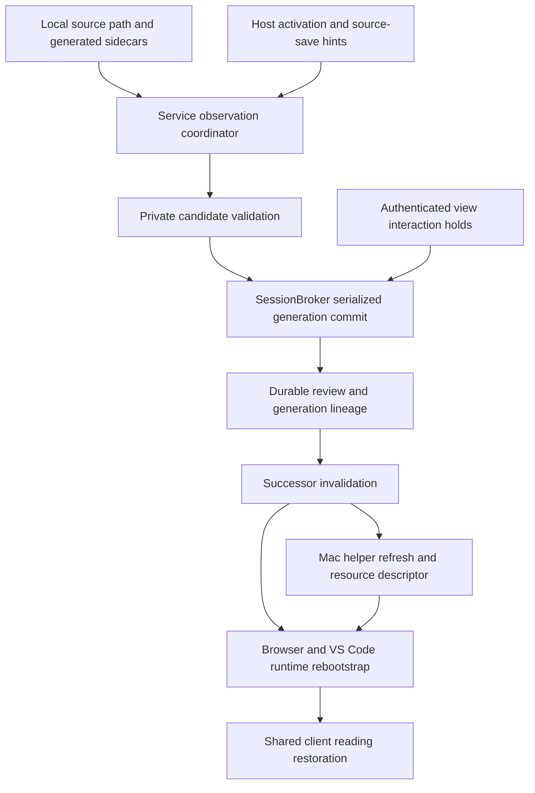
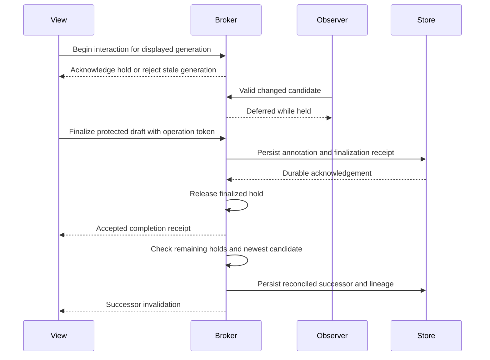
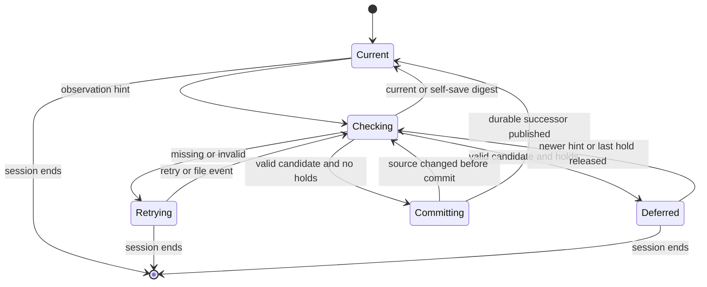
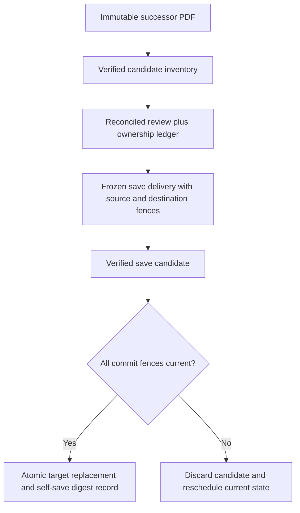

# Automatic Local PDF Refresh - Plan

## Goal Capsule

- **Objective:** Readers see changes to an open local PDF automatically while retaining their annotations and reading place.
- **Means:** Service-owned observation and generation transactions, shared interaction holds, and host-specific successor delivery (KTD1–KTD6).
- **Product authority:** The confirmed Product Contract below governs behavior and scope.
- **Open blockers:** None. Stop implementation if a confirmed product decision cannot be preserved or predecessor PDF bytes could overwrite an external update.
- **Execution profile:** Implement U1–U8 under the Verification Contract. This document authorizes planning only; a later implementation request determines execution and shipping authority.

---

## Product Contract

### Summary

Open local PDFs refresh automatically across the in-Codex browser, Mac app, and VS Code, regardless of which process changes the file.
Refresh preserves annotation work and reading continuity through shared reconciliation behavior.

### Problem Frame

A source edit and LaTeX rebuild can leave the in-Codex browser or Mac window displaying an older PDF.
The same problem applies to any process replacing a local file while it is under review; manual reopening disrupts the reader and risks separating annotations from their intended text.

### Key Decisions

- **Complete annotation work before changing versions.** Governs R6, R7, R9. (session-settled: user-directed — chosen over immediate refresh or an update prompt during editing: preserve the active interaction and include the newly saved annotation in reconciliation.)
- **Defer across the shared Review Session.** Governs R8, R10. (session-settled: user-approved — chosen over letting other windows advance independently: keep the review and its annotations on a consistent document version.)
- **Wait for explicit completion, without an inactivity timeout.** Governs R8, R9. (session-settled: user-approved — chosen over releasing a background editor after inactivity: unfinished annotation work remains protected until completion, cancellation, closure, or disconnection.)
- **Follow the reading passage when confident.** Governs R13–R15. (session-settled: user-approved — chosen over always retaining page number and scroll position: preserve the reader's place when earlier content changes pagination.)
- **Extend existing reconciliation rather than introduce host-specific matching rules.** Governs R11, R12, R16; matcher improvements are separate work.

### Requirements

**Detection and candidate selection**

- R1. Automatically refresh open local PDFs in the in-Codex browser, Mac app, and VS Code when their underlying file changes, including ordinary local PDFs without a LaTeX or generated-output association.
- R2. Treat writes and replacement at the open document's existing path as refresh triggers, regardless of the process responsible.
- R3. Retain the last valid displayed PDF and review state through missing, incomplete, unreadable, or invalid replacement files, and recover automatically when a valid replacement becomes available.
- R4. Do not create a new Document Generation or visibly reload for a candidate whose bytes match the current PDF.
- R5. Coalesce changes that arrive while refresh is deferred or being prepared so a superseded candidate cannot overwrite a newer accepted version.

**Annotation interactions and shared review state**

- R6. Defer document replacement during an active annotation creation, editing, or manual reattachment interaction; passive reading and an existing saved annotation do not hold the deferral.
- R7. On successful annotation completion, save its changes against the displayed generation before reconciling the latest review state, including the just-created or updated annotation, against the newest valid candidate.
- R8. Apply the deferral to every window sharing that Review Session until all active annotation interactions have ended, including those in background windows, without an inactivity timeout.
- R9. Release an interaction's deferral on completion, cancellation, window closure, or disconnection, retaining protected drafts for reconciliation when their owner disappears.
- R10. Once the last deferral ends, immediately resume any pending refresh and publish the replacement PDF with its reconciled review state as one consistent generation transition to participating views.

**Reconciliation and continuity**

- R11. Use the existing shared VS Code reconciliation semantics for Review Items and protected drafts, preserving their identities and authored content through refresh.
- R12. Preserve missing, ambiguous, and unsupported annotation attachments for existing manual recovery rather than silently assigning them to an uncertain location.
- R13. Preserve each view's reading passage and its approximate position on screen when it can be confidently located in the replacement PDF.
- R14. When the reading passage cannot be confidently located, retain that view's previous page and scroll position as far as the replacement document's bounds allow.
- R15. Preserve each view's zoom and avoid stealing keyboard focus during refresh.

**Shared behavior**

- R16. Share detection coordination, replacement rules, and reconciliation code across hosts as far as their platform differences allow, with the same observable behavior for equivalent review states.

### Key Flows

- F1. File changes while reading
  - **Covers R1–R5, R10–R16.**
  - **Trigger:** Another process saves or replaces the open PDF.
  - **Flow:** Detect the change, validate the candidate, reconcile the current review, and publish the successor to participating views.
  - **Outcome:** Each view resumes at its own reading place using the continuity rules.

- F2. File changes during annotation work
  - **Covers R5–R12.**
  - **Trigger:** A candidate arrives while a participating view has an active annotation interaction.
  - **Flow:** Hold the shared generation; allow the annotation to finish against it; commit the annotation; after the last interaction ends, reconcile the latest review state to the newest valid candidate.
  - **Outcome:** The newly saved annotation participates in the same reconciliation as existing items.

- F3. Interrupted write or vanished editing window
  - **Covers R3, R8–R12.**
  - **Trigger:** A file is temporarily unavailable, or a window holding the deferral closes or disconnects.
  - **Flow:** Keep the valid predecessor while no valid candidate exists; release only the vanished window's interaction hold and retain protected drafts; continue once candidate validity and remaining interaction holds permit.
  - **Outcome:** Recovery needs no manual reopen and does not discard protected annotation content.

The refresh decision follows R3–R10:

### Acceptance Examples

| Example | Covers | Given / when | Expected outcome |
| --- | --- | --- | --- |
| AE1. Codex rebuild | R1, R2, R10, R16 | Codex edits LaTeX and recompiles a PDF open in the in-Codex browser or Mac app. | The open review refreshes automatically through the shared replacement behavior. |
| AE2. Ordinary PDF replacement | R1, R2, R11, R16 | Another application replaces a local PDF with no generated-output association. | Refresh and reconciliation work without requiring LaTeX metadata or a VS Code window. |
| AE3. Annotation created during rebuild | R6, R7, R10, R11 | A replacement arrives while a comment is being composed; the user saves it. | The comment saves against the displayed version, then joins existing annotations in immediate reconciliation. |
| AE4. Multiple rebuilds while editing | R5, R7, R8 | Several valid replacements arrive before the final active interaction finishes. | Reconcile to the newest valid candidate, without stepping through the queued versions. |
| AE5. Background editor | R8, R10 | Two windows share a review and one retains an unfinished annotation in the background. | Both retain the existing generation until that interaction ends; inactivity alone does not release it. |
| AE6. Cancel, close, or disconnect | R8–R10, R12 | The last interaction is cancelled, or its window closes or disconnects. | The hold releases; protected drafts survive owner loss and participate in reconciliation; other active holds still apply. |
| AE7. Partial write and recovery | R3, R4 | The file disappears or contains invalid bytes during a save, then becomes valid. | Keep the prior PDF and review state during failure, then refresh automatically if valid bytes differ. |
| AE8. Identical rebuild | R4 | A save changes file metadata but produces identical PDF bytes. | No new generation or visible reload occurs. |
| AE9. Uncertain attachment | R11, R12 | An annotated passage disappears or has multiple plausible matches. | The item and its authored content remain available with the existing unresolved disposition and manual recovery behavior. |
| AE10. Repagination | R13, R15 | New content earlier in the PDF moves the visible passage onto a later page. | Follow a confident passage match at approximately the same screen position while preserving zoom and keyboard focus. |
| AE11. Reading fallback | R14, R15 | The visible passage has no confident match and the document becomes shorter. | Retain page and scroll position within the new bounds, preserving zoom and focus. |
| AE12. Concurrent interactions | R7–R10 | Two participating windows are editing and only one saves. | Save that annotation without refreshing yet; after the second interaction ends, reconcile the latest state containing all completed changes. |

### Scope Boundaries

- This work covers automatic refresh of the existing open local file and the shared behavior in R1–R16.
- Improvements to annotation matching heuristics are deferred; the baseline is the existing shared reconciliation behavior in R11–R12.
- Remote URL monitoring, discovering a renamed file at a different path, and changing source-build commands are outside this change.
- A browser page reload or a new Review Session is not the intended refresh experience under R10.

### Planning Question Resolutions

The original planning questions are resolved by the decisions below: ordinary-PDF persistence by KTD4–KTD5; observation and retries by KTD1–KTD2; interaction lifetime by KTD3; reading continuity by KTD7.
Their implementation work is assigned to U1–U8.

### Sources / Research

- `apps/vscode/src/extension.ts:409` and `apps/vscode/src/rebuild-observer.ts:19`: existing watcher integration, event coalescing, and service validation delegation.
- `apps/service/src/sessions/session-broker.ts:1641`: the existing replacement path is restricted to generated-output reviews; ordinary local-PDF support must be extended, not assumed.
- `apps/service/src/sessions/session-broker.ts:1720`: staged candidates, same-digest handling, and validation before replacement.
- `apps/service/src/sessions/session-broker.ts:1860`: reconciled review state and successor lineage are persisted before activation and publication.
- `apps/service/src/reconciliation/pdf-anchor-reconciler.ts:247`: unique-match resolution and preservation of unsupported, ambiguous, and missing anchors.
- `apps/service/src/reconciliation/pdf-anchor-reconciler.ts:359`: protected-draft reconciliation and frozen unresolved drafts.
- `apps/web/src/host/runtime-document-source.ts:9` and `apps/web/test/host-runtime.test.ts:380`: shared successor coordination and cross-host rebootstrap coverage.
- `apps/service/test/live-document-replacement.test.ts:589`: invalid candidates retain predecessor bytes and protected review state.
- `docs/solutions/architecture-patterns/atomic-generation-transitions-for-rebuilt-pdf-reviews.md`: existing generation-transition constraints.
- `CONCEPTS.md`: canonical Review Session and Document Generation vocabulary.

---

## Planning Contract

**Product Contract preservation:** R1–R16, F1–F3, AE1–AE12, scope, and settled decisions unchanged. Added the Problem Frame from the motivating workflow and replaced answered planning questions with decision references; no scope change.

### Key Technical Decisions

- KTD1. **The service owns observation and ordering.** Governed by R1–R5, R16. Add a session-lifecycle observer for local canonical source paths, shared by both service startup paths. Watch containing directories with exact basename filtering; retain generated-output SyncTeX/source-save hints without moving LaTeX navigation into the generic observer. One service-owned observation sequence orders filesystem, startup, activation, reconnect, and explicit host hints. VS Code's epoch becomes a host hint token, not a competing global sequence. This extends `SessionBroker` ownership and avoids a browser or Mac dependency on VS Code running.

- KTD2. **Stage privately, then commit against current authority.** Governed by R3–R5, R7, R10. Reuse `stageGenerationSnapshot`, PDF inspection, and the broker session tail. Candidate preparation may run outside the tail; final checks and reconciliation use the latest durable review state inside it. Recheck source identity, observation sequence, generation, and interaction holds at commit. A review revision change causes reconciliation from current state, not abandonment of refresh. A newer file observation supersedes the staged candidate. Treat a temporarily absent or unreadable path as retryable; retain the existing rejection of a verified retargeted canonical path. Perform fallible capability preparation before durable publication, or separately revoke write authority afterward without deleting a committed snapshot. No post-persist failure may leave recovery referencing deleted successor bytes. Because recovery persistence can throw after record rename, distinguish definitely-unpublished failure from published or uncertain outcome. On uncertainty retain both snapshots, pause physical saves/publication, and inspect the authoritative recovery record under the session tail before choosing the active generation; cleanup follows that record, never the thrown exception alone.

- KTD3. **Interaction holds are broker-owned, per live attachment, and acknowledged before authoring begins.** Governed by R6–R10. Register a transport-authenticated attachment identity and issue an opaque connection-scoped capability; do not trust a client-supplied `ownerViewId` as authorization. Begin/end operations carry attachment identity, generation, a client interaction token, and monotonic operation order; retries are idempotent and stale releases cannot clear a newer hold. Serialize admission and final replacement on the broker tail. An accepted begin pins the generation; if replacement won the race, reject the stale begin and rebootstrap before opening an editable surface. Finalize through one idempotent broker operation that validates the draft revision, durably records the apply/discard outcome and a terminal receipt, then releases the hold. A failure before persistence retains the editor and hold. Retrying an uncertain completion returns its receipt, even after a successor generation, rather than replaying an add command. Keep unacknowledged receipts recoverable across reconnect; bound storage by admission/backpressure, not by evicting outcomes a client still needs. All host adapters buffer successor invalidations behind pending finalization responses; an accepted older-generation receipt closes the editor without downgrading already-newer canonical state. Holds are transient, while protected drafts are durable; disconnect revokes that connection incarnation and clears only its holds, without deleting its acknowledged drafts. A late old-socket close cannot clear holds on a replacement connection. Retain unsent text locally while its view survives, but do not claim it is protected until acknowledged by the service. Transport liveness checks are distinct from user inactivity and continue in background windows.

- KTD4. **Keep refresh and PDF saving in separate transactions with shared fences.** Governed by R3–R5, R7, R11. Annotation completion means recovery-backed command acceptance, not waiting for the PDF rewrite. An observation installs a physical-save barrier before candidate preparation for both original and copy destinations; an already-running save must check that barrier at the serialized commit boundary. Clear it only when the latest observation proves unchanged/self-save bytes or a valid successor commits. Missing or invalid bytes keep the barrier and bounded observation retries active, while semantic edits remain durable and show the existing unsaved state. Every save candidate is fenced by source digest and Document Generation as well as destination generation and semantic revision. On successor commit, preserve an active destination's kind/path, advance its generation, rebaseline an original destination only from validated successor bytes, and preserve a copy destination's independent target fingerprint. Resume the existing save coordinator on the successor when eligible. Recognize self-saves only by the exact current committed original digest recorded under the broker tail; never suppress an external revert because its digest appears in historical accepted digests. Identical-byte inode replacements refresh file capability identity without changing the displayed generation.

- KTD5. **Reconcile session-authored state and separately establish successor annotation ownership.** Governed by R11–R12. Generalize reconciliation metadata and protected drafts to ordinary local reviews without changing their workflow mode or save UI. Import supported native/portable candidate annotations before committing, reconcile predecessor items through the existing matcher, and merge fresh imports without replacing authored session content. Persist a managed-ID/deletion ledger sufficient to prevent deleted annotations reappearing from stale embedded data. Candidate-only imports already belong to the successor and are not rematched as predecessor anchors. Cross-generation identity uses verified portable identity or provenance-backed native persistent names; page/index-derived native IDs are not continuity evidence even when a prior save promoted them into a Placekeeper-native name. Persist identity provenance and generation-scoped source-object mappings, allocate fresh persistent IDs for newly managed imports, and conservatively classify legacy ordinal-derived names. For a verified native match, adopt successor object geometry and immutable subtype/author attributes while preserving accepted session comment edits and deletions; do not apply the generic text matcher to native geometry that the successor inventory already establishes. Ambiguous native identity remains preserved and non-destructive, never authorizing edit/delete of an unrelated object. Set `nativeAnnotationImportDigest` only after successful inventory reconciliation for that exact candidate, and reassess rewrite eligibility. Where ownership cannot be proven, preserve original source marks and block unsafe rewrite using existing save-failure handling rather than granting blanket deletion authority.

- KTD6. **All hosts consume one successor contract, while resources remain host-issued.** Governed by R1, R10, R16. Browser and VS Code continue through `subscribeRuntimeDocumentSource`; reconnect must invalidate any cached bootstrap and fetch current canonical state even if no event was observed. Treat invalidations as lower-bound hints: accept a same-session authenticated bootstrap ahead of the hint, reject older results by generation/revision and request token, and retry behind-fence or failed responses without requiring another event. The Mac window runs the existing helper keepalive/refresh protocol with one request in flight and a bounded recurring interval (initially one second, one request at a time), including while backgrounded. On a successor, install a trusted descriptor containing resource ID, generation, digest, and byte length before notifying the web page. Install each trusted successor through an explicit generation-specific native-to-page document resource lookup; the renderer must not capture the initial injected blob for its entire lifetime. Keep engine and worker resources stable. Cancel or fence predecessor loads and key document caches by generation/digest. Evict rejected materialization promises so a retry can recover. Retain the predecessor resource until its successor is usable, then release it and revoke owned blobs; dispose abandoned or stale candidates so repeated refreshes retain bounded resources. Keep native credentials and filesystem authority in the host. Static/export-only and remote-temporary sources do not acquire local file monitoring.

- KTD7. **Reading restoration is view-local, using the shared semantic resolver.** Governed by R13–R15. Extend the existing `PdfViewerLocation` capture with a bounded text anchor near the usable viewport's visible center, its offset from the selected text geometry, and generation/viewport identity. Reuse the selection adapter's text/geometry cache and reliability checks. Capture while the predecessor is still mounted; discard stale asynchronous captures after a view movement or generation change. Add a read-only, generation-fenced host operation that resolves this anchor against the current immutable PDF inspection using the existing service matcher; retain one shared inspection per active generation rather than parsing per view. A unique supported match supplies the new position; missing, ambiguous, unreliable, or unavailable evidence uses R14. Restore numeric zoom before geometry placement; clamp page and coordinates to the new PDF, preserve screen alignment, and use non-focus-taking navigation. Automatic successor restoration takes precedence over stale page-history entries, while deliberate newer navigation cancels a pending restore. Initial deep-link navigation keeps its existing behavior.

- KTD8. **Preserve existing context and recovery boundaries.** Governed by R3, R10–R12. Keep generation-lineage persistence, exact active task-binding migration, predecessor evidence invalidation, source-work interruption records, and undo generation boundaries on the existing broker path. No refresh tool or automatic source-work completion is added. Restart recovery restores durable review state and drafts but never resurrects transient interaction holds. Keep explicit separate-review/recovery choices distinct from shared views; monitoring alone does not merge independent reviews of a path.

### Observation Policy and Authority

KTD1 uses native directory events as wake-ups rather than evidence of a complete file. Start with the existing 250 ms coalescing window, a 5 second lightweight path-identity check, and invalid-candidate retries backing off from 250 ms to 5 seconds while a session is live. A forced startup/reconnect/activation check reads current bytes; a digest audit at most once per 60 seconds per live session covers changes that preserve cheap metadata. Use injectable timing and bound the audit cadence and concurrent inspections centrally; healthy unchanged identities do not cause repeated PDF parsing. Timers and watchers stop with the session and must not prevent service idle shutdown.

On platforms where directory watching fails, keep path-identity/digest checks active and retry establishing the watcher. Missing event filenames trigger checks of registered paths in that directory only. Filesystem notification is not authorization: revalidate the approved canonical lineage and no-follow regular-file checks before accepting bytes. These choices follow the [Node 24 file-watch caveats](https://nodejs.org/docs/latest-v24.x/api/fs.html#caveats), particularly inode replacement and optional event filenames.

The viewer's interaction capability belongs to its live transport attachment, not its task binding. Browser WebSocket handshake, VS Code bridge lifetime, and Mac native window/helper registration each establish that identity. Losing a connection releases only its holds after existing transport liveness detection; a connected but idle editor never expires. A reconnect uses a new attachment, fetches the current generation, and then explicitly reacquires any resumed editor's hold. Late commands from revoked attachments fail without applying old geometry.

### High-Level Technical Design

**Ownership and delivery — KTD1–KTD3, KTD6.**

**Interaction and replacement protocol — KTD2–KTD4.**

**Candidate lifecycle — KTD1–KTD4.**

**Save-source data boundary — KTD4–KTD5.**

The protocol's begin/end and read-only location-resolution operations extend the existing typed host/runtime contracts; they do not expose file paths or use agent evidence handles. KTD3 owns their authentication and ordering, KTD7 owns the bounded resolution payload. A transport-version/capability check must prevent an older renderer from accepting editable interactions that the upgraded service cannot protect.

### Alternatives and Scope Discipline

Per-host watchers would duplicate policy and require separate ordering across surfaces; KTD1 keeps hosts as adapters. Client-only deferral would let the shared service advance beneath an editor; KTD3 therefore gates the broker commit itself. Converting every review to generated-output mode would change save behavior; KTD4–KTD5 instead separate reload eligibility from workflow policy. Separate reconciliation algorithms in the viewer and service would drift; KTD7 uses one resolver through a bounded read-only operation.

These choices follow existing ownership boundaries and the confirmed product behavior. They do not require independently developing competing architectures. Broader broker cleanup, new matching heuristics, proactive agent notifications, and source-build changes remain follow-up work.

### Risks and System-Wide Impact

| Boundary | Risk | Required treatment |
| --- | --- | --- |
| Source and save target | Predecessor rewrite overwrites a new PDF | KTD4 source/destination fencing and target compare-before-replace; verify original and copy targets. |
| Native annotations | Index reuse changes edit/delete target | KTD5 verified persistent identity, deletion ledger, and conservative ownership; verify reorder and external save cases. |
| Commit and recovery | Published lineage references removed bytes | KTD2 durable commit boundary and fault injection before/after persist. |
| Background views | User inactivity is mistaken for disconnect | KTD3 transport-owned presence independent of keystrokes and visibility; test stalled and background hosts separately. |
| Mac resources | New state uses old cached PDF or wrong length | KTD6 descriptor installation ordering and generation-specific cache/loading cancellation. |
| Reading restoration | Late asynchronous result overrides user navigation | KTD7 generation and navigation tokens; no automatic focus calls. |
| Agent context | Old evidence is made current by visual refresh | KTD8 invalidates observations and source-work authority while migrating only exact active task binding. |
| Recovery compatibility | Old records lack interaction/ownership metadata | U2/U3 add optional durable fields with conservative migration; no persisted hold is required to recover. |

### Compatibility and Recovery

Additive recovery fields for managed identities, deletion evidence, and finalization receipts require explicit validation and conservative defaults when absent. Preserve existing review schema compatibility; legacy records without verified native identity never gain cross-generation deletion authority by inference. Protocol consumers must negotiate the new interaction capability before enabling local live-refresh authoring; an incompatible old renderer receives the existing reconnect/upgrade path rather than silently bypassing holds.

### Deferred Implementation Details

Exact helper names and timer tuning may change while preserving the ownership and ordering above. Runtime qualification must establish native background scheduling and window closure behavior; mock transport tests alone do not prove them. Existing save-conflict recovery remains authoritative when another process continues writing; this feature does not create a new cross-application lock protocol.

---

## Implementation Units

### U1. Centralize local PDF observation and candidate ordering

**Goal:** Observe local source changes without a VS Code dependency.

**Requirements:** R1–R5, R16; F1, F3.

**Dependencies:** None. Keep automatic successor publication behind integration readiness until U2–U5 are in place.

**Files:** Create `apps/service/src/sessions/local-document-observer.ts` and `apps/service/test/local-document-observer.test.ts`; modify `apps/service/src/sessions/session-broker.ts`, `apps/service/src/sessions/session-contracts.ts`, `apps/service/src/sessions/session-internal-types.ts`, `apps/service/src/main.ts`, `apps/service/src/host/placekeeper-host.ts`, `apps/service/src/server/http-server.ts`, `apps/vscode/src/rebuild-observer.ts`, `apps/vscode/src/extension.ts`, and `apps/vscode/test/rebuild-observer.test.ts`.

**Approach:**

1. Register and dispose the KTD1 observer at broker session activation/end, including restored local sessions and both service entry points.
2. Route VS Code hints into the service ordering authority; preserve SyncTeX navigation/source-save behavior and avoid duplicate global epoch counters.
3. Implement the Observation Policy with injected filesystem and clock seams, bounded candidate work, and explicit startup/reconnect checks.

**Patterns to follow:** `RebuildObserver`, `stageGenerationSnapshot`, and broker activation/shutdown lifecycle.

**Test scenarios:**

1. Covers AE1, AE2. Both generated and ordinary local sessions detect replacement without a VS Code panel.
2. Covers AE4, AE7. Rename/delete/recreate bursts, invalid bytes, watch errors, and missing filenames converge to the newest valid candidate.
3. Covers AE8. Metadata-only changes and identical-byte atomic replacements avoid parse/reload while updating capability identity.
4. Session shutdown cancels watchers, pending retries, and staged work; a late completion cannot reactivate it.
5. Two host hints with unrelated local counters cannot suppress later service observations.

**Verification:** Deterministic observer tests prove bounded work and eventual revalidation; generated-output navigation tests retain existing behavior.

### U2. Generalize the atomic replacement transaction

**Goal:** Commit a validated local successor together with reconciled current review state.

**Requirements:** R3–R5, R7, R10–R12; F1–F3.

**Dependencies:** U1 observation identity contract.

**Integration boundary:** Complete the replacement transaction and its guard seam in this unit. U4 then connects the authenticated hold guard to that seam. Automatic successor publication stays disabled until U3–U5 are integrated, as required by U1; U2 does not depend on U4 to complete its transaction work.

**Files:** Modify `apps/service/src/sessions/session-broker.ts`, `apps/service/src/sessions/document-replacement-preparation.ts`, `apps/service/src/sessions/recovered-review-preparation.ts`, `apps/service/src/sessions/session-internal-types.ts`, `apps/service/src/recovery/draft-snapshot.ts`, `apps/service/src/recovery/source-snapshot.ts`, `apps/service/src/files/file-capabilities.ts`, `packages/core/src/review-model.ts`, `packages/core/src/review-reducer.ts`, `apps/service/test/live-document-replacement.test.ts`, `apps/service/test/recovery.test.ts`, and `packages/core/test/review-commands.test.ts`.

**Approach:**

1. Separate local refresh eligibility from generated-output workflow policy under KTD2 and KTD8.
2. Reconcile against the latest accepted ReviewState in the final serialized commit, initialize reconciliation metadata for ordinary items, and preserve the undo generation boundary.
3. Fix transient missing-path classification and the persist-then-capability-refresh failure path; never delete durable successor bytes during cleanup.
4. Preserve lineage-based reopen for local reviews while retaining explicit separate-copy/recovery semantics.

**Execution note:** Add transaction characterization and fault-injection cases before changing commit ordering.

**Test scenarios:**

1. Covers AE3, AE12. An annotation accepted while candidate inspection is pending appears exactly once in successor state.
2. Covers AE7. Temporarily missing PDF preserves task binding, snapshot, annotations, and retryability.
3. A verified symlink retarget is rejected; no authority expands to the new path.
4. A definitely-unpublished persistence failure leaves the predecessor active. Failures after recovery-record rename but before persistence returns preserve both snapshots until authoritative record inspection establishes the winner; restart always finds complete record/bytes pairs.
5. A second replacement during candidate work cannot publish an older candidate afterward.
6. Restart restores an ordinary dirty successor and its protected drafts, without restoring transient holds or allowing undo into predecessor geometry.

**Verification:** Recovery records, active PDF bytes, generation identity, and reconciled state agree at each failure boundary.

### U3. Make ordinary-PDF saves and annotation ownership successor-safe

**Goal:** Preserve local autosave behavior without overwriting external changes or reviving obsolete marks.

**Requirements:** R1, R3–R5, R11–R12; F1, F3.

**Dependencies:** U2.

**Files:** Modify `apps/service/src/saving/pdf-save-coordinator.ts`, `apps/service/src/sessions/session-broker.ts`, `apps/service/src/sessions/approved-open-preparation.ts`, `apps/service/src/sessions/document-replacement-preparation.ts`, `apps/service/src/sessions/recovered-review-preparation.ts`, `apps/service/src/recovery/draft-snapshot.ts`, `packages/core/src/portable-annotation.ts`, `packages/core/src/native-pdf-annotation.ts`, `packages/pdf-backends/src/native-annotations.ts`; extend `apps/service/test/pdf-save-coordinator.test.ts`, `apps/service/test/live-document-replacement.test.ts`, `apps/service/test/recovery.test.ts`, and `test/conformance/reviewed-pdf.test.ts`.

**Approach:**

1. Apply KTD4 to frozen delivery, target commit, destination rebaselining, and exact self-save digest recognition.
2. Reuse current import and verified-write paths for KTD5; add backward-compatible managed identity/deletion evidence to durable recovery rather than inferring continuity from native ordinal IDs.
3. Reassess rewrite eligibility and native management authority for each successor; preserve unsupported source objects and surface existing save-blocked state when unsafe.

**Test scenarios:**

1. Original-destination autosave produces no reload loop; an external revert to an older historical digest still creates a successor.
2. A save frozen on generation N cannot commit to original or copy after N+1 or while a newer observation is invalid/pending; completion of an annotation during that barrier remains durable without writing predecessor bytes.
3. An active copy destination retains its own target fingerprint while the source advances; no monitoring silently retargets to the copy.
4. Covers AE9. Candidate native/portable marks deduplicate verified identities, retain authored comments, and do not resurrect explicitly deleted IDs.
5. Reordered unnamed native marks, including two unrelated marks independently promoted from the same ordinal into identical legacy persistent names, never receive another mark's edit or deletion.
6. A verified native mark moves/re-pages externally while its comment is edited in the session; successor geometry and authored comment survive save/reopen.
7. Readable but non-rewritable successors load for review while saving remains blocked; failed import never grants native deletion authority.
8. Save/reopen of the successor preserves unmanaged objects and reconciled authored annotations, including across recovery.

**Verification:** Real writer/import round trips supplement transaction tests; bytes and native dictionaries establish correctness, not just item counts.

### U4. Add authenticated interaction holds and transport lifetime

**Goal:** Make annotation deferral a shared service guarantee.

**Requirements:** R6–R10, R16; F2, F3.

**Dependencies:** U2 transaction seam.

**Files:** Create `apps/service/src/sessions/review-interactions.ts` and `apps/service/test/review-interactions.test.ts`; modify `packages/core/src/review-runtime-protocol.ts`, `packages/core/src/macos-helper-protocol.ts`, `packages/core/src/macos-shell-protocol.ts`, `apps/service/src/sessions/session-broker.ts`, `apps/service/src/sessions/control-socket.ts`, `apps/service/src/server/http-server.ts`, `apps/service/src/macos/macos-runtime.ts`, `apps/web/src/host/session-contracts.ts`, `apps/web/src/host/browser-runtime.ts`, `apps/web/src/host/vscode-runtime.ts`, `apps/web/src/host/macos-runtime.ts`, `apps/web/src/host/static-runtime.ts`, `apps/vscode/src/webview-bridge.ts`; extend `apps/service/test/session-security.test.ts`, `apps/service/test/macos-runtime.test.ts`, and `apps/web/test/host-runtime.test.ts`.

**Approach:**

1. Implement KTD3 attachment registration, idempotent holds, ordering, revocation, and broker-tail checks.
2. Carry the contract through browser, VS Code, and Mac transports using host-issued authority; static/export-only runtimes expose an explicit no-local-refresh capability.
3. Wake deferred candidate work after the last successful release and integrate transport disconnection with hold cleanup; do not equate loss of focus with disconnection.
4. Preserve KTD8 context invalidation and maintain a typed capability/version contract across host and renderer.

**Test scenarios:**

1. Covers AE5, AE12. Two views hold a session; only the last release permits replacement, including after long background inactivity.
2. Begin racing replacement either pins the displayed generation or returns stale before editable authoring starts.
3. Duplicate begin/finalize is idempotent; a lost finalization response returns the durable outcome after reconnect or generation advance without duplicating an item. Delayed release cannot clear a newer interaction token.
4. A forged owner ID, another attachment's token, or a revoked connection cannot mutate holds or submit held commands.
5. Covers AE6. One view disconnects: only its incarnation holds release, its acknowledged drafts remain, and late commands fail; an old socket closing after reconnect cannot release a new hold.
6. Connection recovery fetches canonical state before reacquiring an editor hold; missed successor events do not pin stale bootstrap data.

**Verification:** Public transport tests demonstrate the same session-wide behavior across adapters and reject unauthorized/stale lifecycle operations.

### U5. Bind all annotation interactions to durable completion

**Goal:** Include the just-finished annotation in deferred reconciliation.

**Requirements:** R6–R12, R15; F2, F3.

**Dependencies:** U3, U4.

**Files:** Modify `apps/web/src/review/use-authoring-session.ts`, `apps/web/src/review/authoring-session.ts`, `apps/web/src/review/authoring-model.ts`, `apps/web/src/review/ReconciliationWorkspace.tsx`, `apps/web/src/review/input-controller.ts`, `apps/web/src/app/ReviewShell.tsx`, `apps/web/src/app/ProductionReviewApp.tsx`, `apps/web/src/host/session-contracts.ts`; extend `apps/web/test/authoring-session.test.ts`, `apps/web/test/production-review-app.test.tsx`, `packages/core/test/review-commands.test.ts`; add `apps/web/test/refresh-interaction-lifecycle.test.tsx` and `test/acceptance/automatic-pdf-refresh.spec.ts`.

**Approach:**

1. Acquire the KTD3 hold before enabling source-dependent authoring/capture and keep it through nested save-destination UI and command settlement.
2. Generalize protected draft creation, updates, apply, and cancellation beyond generated-output mode while retaining ordinary destination prerequisites.
3. Cover edit, page-note placement, selection-based authoring, and manual reattachment; a passive text selection or saved-item reader is not a hold.
4. Flush/acknowledge latest draft and final command before release. On rejection keep the editor recoverable. Local focus-restoration callbacks must be cancelled if their generation becomes obsolete.

**Test scenarios:**

1. Covers AE3. New comment text is durably applied before release and appears in successor reconciliation.
2. Covers AE6. Cancel acknowledges discard before release; close/disconnect retains acknowledged protected text instead of applying it.
3. Nested destination selection and IME composition keep the interaction alive; a save error does not release the hold.
4. Manual reattachment uses the same hold lifetime and cannot apply predecessor geometry after reconnect.
5. Ordinary-PDF draft protection survives owner loss; generated-output behavior remains equivalent.
6. Passive selection, annotation reading, and scrolling do not indefinitely defer refresh.

**Verification:** Real browser tests cover command acknowledgement ordering and focus continuity in addition to hook/reducer tests.

### U6. Complete Mac and reconnect successor delivery

**Goal:** Deliver external replacements to idle host views with matching PDF resources.

**Requirements:** R1, R3, R8–R10, R16; F1, F3.

**Dependencies:** U2, U4, U5.

**Files:** Modify `apps/macos/Sources/PlacekeeperMac/ReviewBridge.swift`, `apps/macos/Sources/PlacekeeperMac/ResourceSchemeHandler.swift`, `apps/macos/Sources/PlacekeeperMac/PlacekeeperWindowController.swift`, `apps/macos/Sources/PlacekeeperMac/ReviewHelper.swift`, `apps/service/src/macos/macos-runtime.ts`, `apps/web/src/host/macos-runtime.ts`, `apps/web/src/host/browser-runtime.ts`, `apps/web/src/host/runtime-document-source.ts`, `apps/web/src/host/vscode-runtime.ts`; extend `apps/macos/Tests/PlacekeeperMacTests/MacPoliciesTests.swift`, add focused `apps/macos/Tests/PlacekeeperMacTests/ReviewRefreshTests.swift`, and extend `apps/service/test/macos-runtime.test.ts`, `apps/service/test/macos-helper-command.test.ts`, `apps/service/test/macos-daemon-runtime.test.ts`, `apps/web/test/host-runtime.test.ts`, and `test/acceptance/macos-interface.spec.ts`.

**Approach:**

1. Implement KTD6 keepalive scheduling at native window lifetime, with one in-flight request, prompt post-mutation/activation checks, and cleanup on close/helper failure.
2. Update trusted native resource descriptors and generation-aware caches before web invalidation; cancel stale resource work without exposing new path authority.
3. Repair cached-bootstrap reconnect behavior across hosts and retry failed successor bootstrap without waiting for another unrelated edit.

**Test scenarios:**

1. Covers AE1, AE2. An idle Mac window receives a changed generation with different digest and length without a local annotation mutation.
2. Two consecutive native refreshes without recreating the page/runtime load the actual new PDF bytes. Late predecessor resource or refresh responses cannot replace successor data; resource URL and scope belong to the same generation.
3. Covers AE5, AE6. Observation continues in the background and stops on closure; holder release and protected drafts follow the service lifecycle.
4. Browser reconnect after missing the only successor event fetches the current generation; bootstrap N+2 responding to hint N+1 is accepted rather than leaving the view reconciling.
5. A transient materialization failure evicts the rejected cache entry and succeeds on retry for the same generation; old resources remain usable until adoption, then are released. Repeated refreshes retain bounded document resources.

**Verification:** Qualify an isolated native candidate as well as protocol tests; WebKit browser coverage alone is insufficient evidence of native resource loading.

### U7. Restore reading passages through the shared resolver

**Goal:** Retain each view's reading position through repagination.

**Requirements:** R13–R16; F1.

**Dependencies:** U2, U4, U6 resource-currentness seams.

**Files:** Create `apps/web/src/pdf/reading-location.ts` and `apps/web/test/reading-location.test.ts`; modify `apps/web/src/pdf/viewer-navigation.ts`, `apps/web/src/pdf/viewer-navigation-adapter.ts`, `apps/web/src/pdf/viewer-selection-adapter.ts`, `apps/web/src/review/navigation-coordinator.ts`, `apps/web/src/app/ProductionReviewApp.tsx`, `apps/web/src/host/session-contracts.ts`, `apps/web/src/host/browser-runtime.ts`, `apps/web/src/host/vscode-runtime.ts`, `apps/web/src/host/macos-runtime.ts`, `packages/core/src/review-runtime-protocol.ts`, `packages/core/src/macos-helper-protocol.ts`, `apps/service/src/sessions/session-broker.ts`, `apps/service/src/server/http-server.ts`, `apps/service/src/macos/macos-runtime.ts`, `apps/vscode/src/webview-bridge.ts`; extend `apps/web/test/navigation-coordinator.test.ts`, `apps/web/test/viewer-navigation.test.ts`, `apps/web/test/production-review-app.test.tsx`, `apps/web/test/host-runtime.test.ts`, and `apps/service/test/live-document-replacement.test.ts`.

**Approach:**

1. Implement KTD7 capture using existing text/geometry evidence, with a bounded quote/context payload and fallback `PdfViewerLocation`.
2. Add a read-only authenticated resolution operation against the current immutable inspection; bound input size, cache one inspection per active generation, and fence results.
3. Restore before initial framing can overwrite the location; preserve explicit user navigation precedence and cancel obsolete focus/scroll tasks.

**Test scenarios:**

1. Covers AE10. Inserted pages move the visible passage; restore its screen alignment and numeric zoom in independently positioned views.
2. Covers AE11. Deleted/duplicate passage, image-only page, unreliable geometry, and shorter PDF all use bounded fallback.
3. Viewport movement during capture and user navigation during restore prevent stale results from jumping the reader back.
4. Malformed, oversized, foreign-session, or predecessor-generation resolution requests fail safely without disclosing other documents.
5. A browser history page entry does not override automatic passage restoration; initial deliberate deep links still navigate normally.
6. Refresh never invokes destination focus; retained annotation/editor focus callbacks cannot steal focus after generation advance.

**Verification:** Service resolver results and browser-rendered position are checked together; no duplicate annotation matching algorithm is introduced.

### U8. Verify cross-host recovery and document the behavior

**Goal:** Prove the complete local refresh flow and its compatibility boundaries.

**Requirements:** R1–R16; F1–F3; AE1–AE12.

**Dependencies:** U1–U7.

**Files:** Extend `apps/service/test/codex-live-context.integration.test.ts`, `apps/service/test/live-source-workflow.test.ts`, `apps/service/test/live-document-replacement.test.ts`, `apps/service/test/recovery.test.ts`, `apps/web/test/host-runtime.test.ts`, `test/acceptance/automatic-pdf-refresh.spec.ts`, `test/acceptance/macos-interface.spec.ts`, `scripts/testing/suites.ts`, `README.md`, and `docs/installation.md`.

**Approach:**

1. Register new test files in the explicit suite memberships and cover the complete acceptance matrix with real service and host adapters.
2. Verify KTD8 through the actual host generation listener: migrate exact active binding, invalidate predecessor evidence, preserve interrupted source changes, and require fresh authority for later completion.
3. Document automatic refresh, background-editor deferral, recovery through interrupted writes, and conservative unresolved attachments.

**Test scenarios:**

1. Covers AE1–AE12. Exercise generated and ordinary PDFs, one and two live views, successful and failed replacement, and all interaction release paths.
2. Ordinary same-path compile refreshes without invoking clean-rebuild tooling; special clean-rebuild verification remains unchanged.
3. Next Codex observation reports successor generation and reconciled state; old handles and source-work completion tokens are rejected.
4. Recovery after a crash between draft acceptance and refresh retains the annotation and valid generation lineage.
5. Static/export-only and remote-temporary sessions retain existing behavior; explicit independent-review choices are not silently merged.

**Verification:** The acceptance matrix passes on the declared surfaces, with native and browser evidence reported separately.

---

## Verification Contract

No builds or tests run during planning. The implementation must use the repository's Node 24+ and pnpm 11.16.0 toolchain and explicit suite membership in `scripts/testing/suites.ts`.

| Gate | Applicable units | Required evidence |
| --- | --- | --- |
| `pnpm typecheck` | U1–U8 | All extended service/runtime and recovery contracts type-check. |
| `pnpm test:service`, `pnpm test:security` | U1–U4, U6–U8 | Ordering, authenticated holds, source authority, and context invalidation pass. |
| `pnpm test:save-export`, `pnpm test:reviewed-pdf` | U2, U3, U5 | Successor save fences, native ownership, and writer/import round trips pass. |
| `pnpm test:review`, `pnpm test:web` | U4–U7 | Draft completion, client races, passage restoration, and host rebootstrap pass. |
| `pnpm test:source-rebuild`, `pnpm test:host-integration` | U1, U2, U6, U8 | Existing generated-output, SyncTeX, and multi-host lifecycle contracts remain valid. |
| `pnpm test:e2e`, `pnpm test:e2e:webkit` | U5–U8 | Real browser flows cover the acceptance examples; assert canonical generation and rendered effects rather than fixed sleeps. |
| `pnpm test:macos:native`, `pnpm test:macos:gate` | U4, U6, U8 | Native helper/resource/presence contracts and new Swift policy coverage pass. |
| `pnpm build`, `pnpm build:macos:web` | U1–U8 | All shipping host profiles compile against the changed protocol. |
| Isolated native candidate qualification | U6–U8 | Actual Mac window refreshes external bytes while idle and honors background deferral and resource replacement. |

Run focused new tests first, then the affected canonical gates; overlapping aliases need not be rerun when their exact coverage already passed. Record unavailable native qualification as an outstanding implementation verification gap, never as a browser-proven pass. `release:validate` is not a declared script in this repository; distribution validation follows the existing packaging process when shipping is requested.

## Definition of Done

- U1–U8 deliver their stated verification outcomes and all R1–R16 / AE1–AE12 have implementation evidence.
- Shared ordering and reconciliation apply across the in-Codex browser, Mac app, and VS Code, including ordinary local PDFs.
- Failure and recovery tests demonstrate no lost protected annotations, no predecessor overwrite, no stale context authority, and no deleted committed snapshots.
- Native resource delivery is qualified independently of browser layout/runtime tests.
- New tests belong to the intended explicit suites; documentation matches observed behavior.
- Abandoned approaches, duplicate policy paths, temporary diagnostics, and experimental code are removed from the implementation diff.
