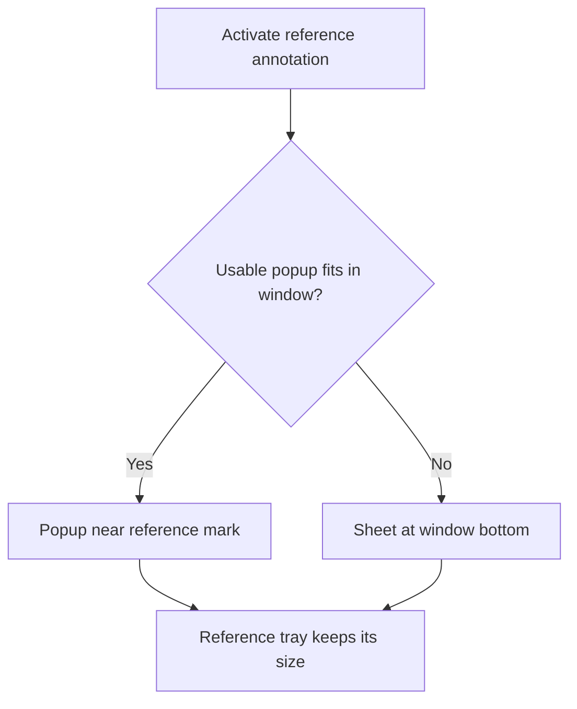
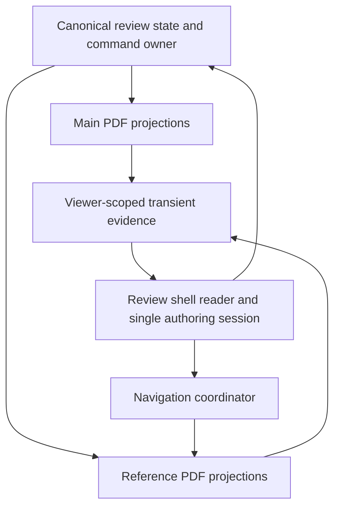
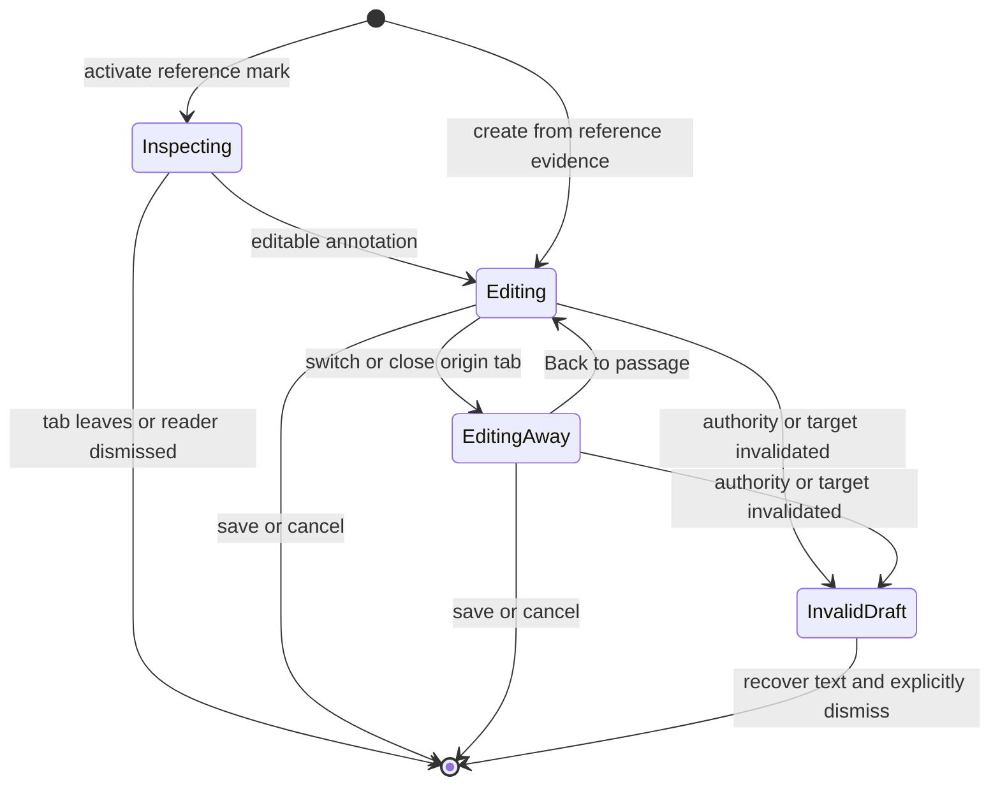

# Reference Tab Annotations - Plan

## Goal Capsule

**Objective:** Reviewers can read and annotate a reference passage without losing their reading position in the main PDF.

**Means:** Extend Reference tabs with annotation marks, content popups, authoring, and annotation-to-reference navigation.

**Product authority:** This Product Contract records the confirmed scope and layout choices. Requirements own behavior; Key Decisions record the choices behind it.

**Open blockers:** None.

**Execution profile:** Implement in the current isolated checkout, verify locally, and deliver an open pull request. The coordinating executor owns integration, verification, commits, and shipping; merging requires separate authorization.

**Stop conditions:** Stop for an invalidated product decision or an unavailable required prerequisite; preserve partial work.

---

## Product Contract

### Summary

Reference tabs will support the document's existing annotation tools and display shared annotations. Annotation actions will open the passage and its content in References. A popup may extend outside the tray, with a bottom sheet fallback when the window cannot accommodate it.

### Problem Frame

Reference PDF views currently separate reading from annotation work. Moving to the main PDF to inspect or author an annotation interrupts the reviewer's reading position.

### Key Decisions

- **Use surrounding window space before a sheet.** Governs R10–R13. (session-settled: user-directed — chosen over automatically enlarging References: retain the chosen tray size while keeping annotation content usable.) The user reaffirmed this after seeing that a sheet can cover the reference passage.
- **Open passage and content together.** Governs R7–R9. (session-settled: user-directed — chosen over passage-only navigation and content-first tabs: the action should reveal the annotation in its PDF context.)
- **Keep the draft open when leaving its tab.** Governs R15–R18. (session-settled: user-directed — chosen over blocking departure or parking drafts per tab: continue writing against the original passage.)
- **Extend existing annotation capabilities.** Governs R1–R6. (session-settled: user-approved — chosen over limiting References to viewing and sending edits to the main PDF: annotating the reference is part of the reading workflow.)

### Requirements

**Marks, content, and shared state**

- R1. Reference PDF pages display the document's Placekeeper annotation marks and supported imported PDF annotation visuals, without duplicating marks that represent the same annotation.
- R2. Activating a Reference annotation mark opens its content popup regardless of whether the annotation workspace is open.
- R3. Reference content surfaces expose the same applicable reading and editing actions as their main-document counterparts, while residual imported source records retain their read-only restrictions.
- R4. Reference tabs support the annotation types and creation gestures already available in the main PDF, subject to the same document and host capabilities.
- R5. Creating, editing, or deleting an annotation through References updates the same annotation shown in the main PDF, annotation list, and other Reference tabs.
- R6. Reference authoring follows existing save, export, pending, and failure behavior, retaining entered text when a save fails.

**Open in References**

- R7. Add an accessible “Open in References” action to the top-right annotation action group in lists, popups, and readers wherever the annotation has a navigable PDF anchor; read-only status alone does not prohibit navigation.
- R8. The action reveals the annotated passage in References and opens its content without changing the main PDF's reading location or history.
- R9. Reopening the same annotation selects and reveals its existing annotation-origin Reference tab, while distinct annotations can open separate tabs even on the same page.

**Placement and constrained space**

- R10. Prefer a popup near a visible fragment of the reference mark, allowing the popup to extend beyond the Reference tray within the application window.
- R11. Opening annotation content must not automatically resize or redock References or reposition the main PDF.
- R12. When no usable popup placement fits within the visible application area, show a sheet attached to the bottom edge of that area and label it with the originating reference and page.
- R13. Long content scrolls within the content surface while dismissal and essential reading or editing actions remain reachable at supported window sizes and zoom levels.
- R14. Resizing, redocking, or changing between popup and sheet preserves the current annotation identity and any draft text, selection, and keyboard focus.

**Editing and navigation continuity**

- R15. Allow one active annotation editor across the review, keeping its target fixed to the annotation or passage where authoring began.
- R16. Switching Reference tabs, closing the originating tab, or hiding References keeps that editor and draft available without silently saving, discarding, or retargeting it.
- R17. When the original passage is no longer visible, provide “Back to passage” that reveals it in its originating Reference tab, recreating that tab if necessary without moving the main PDF.
- R18. Starting another annotation while an editor is active requires finishing or explicitly cancelling the current draft.
- R19. Passive inspection popups close when their originating Reference tab is hidden, closed, or replaced by another tab; drafts follow R16 instead.

**Unavailable targets and interaction safety**

- R20. A deleted annotation closes its passive reader, and a deleted edit target or replaced document invalidates saving the old draft while retaining its text for recovery until explicitly dismissed.
- R21. An unavailable reference or anchor presents an explanation and the applicable recovery action, without substituting another passage or navigating the main PDF.
- R22. Annotation interactions remain keyboard accessible and distinguishable from PDF links and text selection, including when marks overlap or span multiple pages.
- R23. Dismissing passive content returns focus to its originating control when available; closing an editor restores an available control in the current review without rewinding subsequent PDF navigation.

The sheet in R12 overlays the existing workspace; it does not enlarge the Reference tray. Its full-width body may obscure the passage. This is the accepted space tradeoff, and R17 provides explicit passage recovery during authoring.

### Key Flows

- F1. **Read an annotation.** Activate a mark in the active Reference tab. Inspect its content using R2 and R10–R13. Dismiss it and return focus under R23.
- F2. **Open from an annotation card.** Use the top-right References action. Select or create the annotation-origin tab and reveal passage plus content under R7–R9. Other reference navigation continues to use existing tab behavior.
- F3. **Annotate a reference passage.** Select text or use another supported creation gesture under R4. Write in the shared editor, save under R6, and see the resulting annotation across views under R5.
- F4. **Continue a draft after navigation.** Begin F3, switch tabs or close References, and continue typing under R15–R16. Use R17 to recover passage context; Save still targets the original passage.

### Acceptance Examples

- AE1. **Same annotation across views. Covers R1–R6.** Given a passage visible in the main PDF and References, creating and editing its comment in References produces one shared annotation with matching content; deleting it removes its marks and list entry everywhere.
- AE2. **Workspace already open. Covers R2–R3.** Given the annotation list is open beside a bottom Reference tray, activating a reference mark opens its local content without navigating the main PDF or replacing the list with a different workspace mode.
- AE3. **Read-only import. Covers R1–R3, R7.** Given a residual read-only imported annotation with contents, its Reference mark opens those contents and offers navigation, but not edit or delete. A mark without attached text still exposes its available annotation details rather than inventing a comment.
- AE4. **Repeated open. Covers R7–R9.** Given an annotation-origin tab already exists and has been scrolled elsewhere, opening that annotation again selects the tab, reveals the annotation, and opens its content. Opening a different annotation on that page may create a distinct tab.
- AE5. **Short or narrow tray. Covers R10–R12.** Given either a short bottom tray or a narrow right tray with adequate surrounding window space, the popup extends beyond the tray and the tray keeps its size. When the window cannot fit a usable popup, the content uses the labeled bottom sheet.
- AE6. **Long content and layout change. Covers R13–R14.** Given a long comment is being edited, shrinking the window or redocking References may change placement, but text and focus survive and Save and Cancel remain reachable.
- AE7. **Close the originating tab. Covers R15–R18.** Given a draft was started on reference page 14, closing that tab keeps the draft open. Back to passage recreates the reference context; Save annotates page 14 rather than the newly visible page. A second creation attempt cannot replace that draft.
- AE8. **Read versus edit on departure. Covers R16, R19, R23.** Switching tabs closes a passive popup from the old tab. The same action during editing retains the editor and identifies its original passage.
- AE9. **Deleted or stale target. Covers R20–R21.** Deleting the inspected annotation closes its reader. If an edit target disappears or the document is replaced, saving is disabled and the typed text remains recoverable; no annotation is written onto a replacement passage.
- AE10. **Loading or save failure. Covers R6, R21.** A failed Reference load offers retry when available. A failed annotation save retains the editor's text and reports the failure. Neither path moves the main PDF.
- AE11. **Multiple fragments and input methods. Covers R10, R17, R22–R23.** A multi-page annotation opens one content surface from the activated visible fragment. Overlapping marks remain individually reachable, links still navigate as links, and text selection still supports authoring. Keyboard dismissal restores usable focus.

### Scope Boundaries

- This feature concerns Reference tabs within the current document review, not references to unrelated documents.
- New annotation types, new cross-session draft recovery guarantees, and editing otherwise read-only imported annotations are excluded.
- References remains a PDF view. Dedicated content-only annotation tabs and automatic tray enlargement are excluded by R8 and R11.
- Existing main-document authoring behavior changes only where shared editing continuity requires it; this is not a general workspace redesign.

### Dependencies and Assumptions

- Existing document, persistence, and host restrictions remain authoritative under R4 and R6.
- The current Reference viewport renders source annotation visuals inertly and gives links a separate interactive layer. Reference annotation interaction and authoring therefore need new behavior rather than merely exposing existing buttons.
- The current composer makes supporting workspaces inert and suppresses reference activation. R16 intentionally changes that interaction boundary while R15 retains a single draft authority.
- Imported source records currently reach a read-only full reader from the annotation list; the compact owned-annotation peek is not already shared by all source records. R2–R3 describe the desired Reference behavior.

### Planning Inputs

- **Resolved by the Planning Contract:** Determine popup width, minimum usable body height, and sheet sizing from existing UI conventions and validate them across bottom, right, narrow, and zoomed layouts under R10–R14. The planner must not substitute automatic tray enlargement.
- **Resolved by the Planning Contract:** Identify the exact existing annotation tools and host restrictions that R4 inherits, and map their input and save paths to References.
- **Resolved by the Planning Contract:** Determine how to share annotation identity, source-reader handling, and frozen authoring targets across viewers while satisfying R5, R9, and R15–R21.

### Sources and Research

- `apps/web/src/pdf/ReferencePdfViewport.tsx:197` — inert native annotation visuals and separate link interaction layer.
- `apps/web/src/pdf/SourceAnnotationMark.tsx:58` and `apps/web/src/review/annotation-reader.ts:48` — main source-mark rendering and immutable imported records.
- `apps/web/src/review/AnnotationPeek.tsx:34` and `apps/web/src/review/FullAnnotationReader.tsx:112` — existing content surfaces and actions.
- `apps/web/src/review/reference-navigation-state.ts:33` — durable reference identity, original target, and settled location.
- `apps/web/src/review/OutlineNavigator.tsx:76` — existing outline References action.
- `apps/web/src/review/authoring-session.ts:145` and `apps/web/src/review/use-passage-editor-placement.ts:67` — frozen authoring source and popup-to-sheet placement.
- `apps/web/src/app/ReviewShell.tsx:1833` — current suppression of Reference tab activation during authoring.
- `test/acceptance/review-workflow.spec.ts:1935` and `test/acceptance/production-flow.spec.ts:4173` — current workspace inertness and draft continuity checks.
- `docs/solutions/design-patterns/contextual-annotation-composer-preserves-document-context-during-authoring.md` — placement, source authority, and recovery constraints.

---

## Planning Contract

**Product Contract preservation:** Product Contract unchanged in scope; R3 and AE3 clarify existing residual-source permissions, planning inputs are resolved below, and a motivation paragraph was added.

### Key Technical Decisions

- KTD1. **Carry explicit viewer origin through transient interactions.** Reuse the existing `PdfCopySurface` shape as the shared origin containing main/reference scope, document generation, and reference tab identity. Selection, caret, mark, and page-menu evidence carry this origin; authoring freezes it alongside its existing source authority. Existing main-only callers keep their current default. Governs R4, R14–R18, R20, R22.
- KTD2. **Reuse canonical annotation state and commands.** Both viewers project the same accepted annotations, preview geometry, and frozen source-ownership map. Extend document-scoped rendering and input handling rather than saving through the reference engine. Native imports already represented as editable Review Items remain editable; residual source records remain immutable. Governs R1–R6.
- KTD3. **Separate annotation tab identity from PDF target identity.** Preserve the validated geometric `PdfNavigationTarget.identity`; add annotation-origin identity to tab deduplication and coordinator requests. Explicit annotation opens always reveal the current anchor, even when the tab is already active. Publish the content request only after guarded settlement. Governs R7–R9, R17, R19–R21.
- KTD4. **Separate placement bounds from passage visibility.** Use application bounds for Reference content placement and the originating Reference scrollport for visible fragment measurement. Reuse the existing 340px preferred composer width, measured content height, and 12px margins as initial conventions; validate rather than hard-code a tray-size breakpoint. Popup and sheet share one mounted content/editor subtree. Governs R10–R14, R17, R23.
- KTD5. **Retain one shell-owned authoring session.** Extend its frozen origin with the reference target and tab metadata needed for recovery after tab closure. Reference navigation remains usable during a draft, but a second authoring session does not. On completion, restore focus without restoring stale workspace state after subsequent navigation. A stale edit keeps recoverable text with Save disabled. Governs R15–R20, R23.
- KTD6. **Keep passive Reference inspection separate from annotation-list selection.** Resolve current reader records by identity; one Reference inspection surface closes on tab departure without switching the workspace or setting main navigation state. Support metadata-only residual source records in this path without broadening existing list eligibility accidentally. Governs R2–R3, R7–R8, R19–R22.

### High-Level Technical Design

### Assumptions and Implementation Constraints

- This is a shared web review change; existing hosts inherit their current capability restrictions. No new agent command is required because canonical annotation operations and review context already own these actions.
- Only one passive Reference content surface is open at a time. Independent main inspection may be dismissed when authoring starts under existing composer rules.
- Reference-tab provenance is transient view state, not a new persisted PDF annotation schema.
- Keep link layers, owned-mark hit testing, source suppression, and selection reliability guards intact. Do not resolve duplicate main/reference marks with an unscoped document query.
- A valid but unmounted passage is outside the viewport, not an invalid anchor. A sheet covering the passage must not make Back to passage falsely report success; recovery must expose the passage while retaining the mounted draft.
- Shared contracts are established before parallel editing. Files with multiple consumers have one owner per work wave; the coordinator resolves integration changes after that wave.

### Risks and Deferred Execution Details

The highest risks are delayed selection publication after tab changes, stale navigation completions reopening a popup, native source marks reappearing after deletion, and editor focus or text loss during placement changes. U6 tests these across actual viewer instances. Exact helper names and final popup sizing remain execution details; the product behavior in R10–R14 is fixed.

---

## Implementation Units

### U1. Establish viewer-origin contracts

- **Goal:** Make origin and reference recovery identity explicit at shared boundaries.
- **Requirements:** R4, R9, R14–R18, R20–R22; KTD1, KTD3, KTD5.
- **Dependencies:** None.
- **Files:** `apps/web/src/pdf/annotation-surface.ts` (new), `apps/web/src/pdf/viewer-interaction-events.ts`, `apps/web/src/pdf/selection-state.ts`, `apps/web/src/review/authoring-session.ts`; tests in `apps/web/test/annotation-surface.test.ts` (new), `apps/web/test/authoring-session.test.ts`, `apps/web/test/selection-state.test.ts`.
- **Approach:** Generalize the existing `PdfCopySurface` contract rather than duplicate it, then define backward-compatible origin fields and equality/authority checks; extend frozen authoring snapshots with optional reference provenance. Establish the consumer interface packet before U2–U5 begin.
- **Patterns:** Existing `PdfCopySurface`, `AuthoringAuthority`, frozen anchor cloning, and selection generation guards.
- **Test scenarios:** Reject mismatched generation/tab evidence; preserve main defaults; deeply freeze reference recovery metadata; preserve selection generation ordering independently of view identity.
- **Verification:** Focused contract tests and typecheck pass without changing current main behavior.

### U2. Render and author through the Reference viewer

- **Goal:** Supply Reference annotation visuals and reliable scoped input.
- **Requirements:** R1–R6, R10, R22; KTD1–KTD2; F1, F3.
- **Dependencies:** U1.
- **Files:** `apps/web/src/app/App.tsx`, `apps/web/src/pdf/PdfWorkspace.tsx`, `apps/web/src/pdf/ReferencePdfViewport.tsx`, `apps/web/src/pdf/SourceAnnotationMark.tsx`, shared PDF rendering helpers as needed; `apps/web/test/app-interactions.test.ts`, `apps/web/test/owned-overlay.test.ts`, `apps/web/test/viewer-interaction-events.test.ts`.
- **Approach:** Share owned marks and source suppression between document views. Extend existing selection/caret/page-menu registration to the Reference document with captured tab identity and cancellation guards. Publish scoped events and route consuming controls to the correct viewer. Preserve separate link hit targets.
- **Patterns:** Main pointer gesture handling, current Reference copy-selection authority, `OwnedTextMark`, and source-reader styles.
- **Test scenarios:** Covers AE1 and AE3: shared projections, no duplicate source mark, editable native imports versus residual source records. Covers AE11: rotated/multi-page geometry, selection versus mark activation, context click and keyboard page note. Reject a delayed Reference selection after tab change or disposal.
- **Verification:** Focused PDF/input tests pass; U6 exercises actual authoring and persistence.

### U3. Coordinate annotation Reference navigation

- **Goal:** Connect annotation actions and frozen authoring recovery to Reference navigation.
- **Requirements:** R5–R9, R15–R17, R19–R21; KTD1–KTD3, KTD5; F2, F4.
- **Dependencies:** U1.
- **Files:** `apps/web/src/review/reference-navigation-state.ts`, `apps/web/src/review/navigation-coordinator.ts`, `apps/web/src/app/ProductionReviewApp.tsx`; `apps/web/test/reference-navigation-state.test.ts`, `apps/web/test/navigation-coordinator.test.ts`, `apps/web/test/production-review-app.test.tsx`.
- **Approach:** Add annotation deduplication separate from canonical target identity. Route reference events to their own inspection and selection origin. Guard open/reveal completion by operation token, document generation, active tab, and adapter identity. Route authoring recovery to the frozen origin, including recreating a closed tab. Wire the agreed shell/input contracts without touching sibling-owned modules.
- **Patterns:** Existing coordinator navigation cancellation and semantic-target fallback after reflow.
- **Test scenarios:** Covers AE4: repeated same annotation reveals anchor after manual scroll; distinct annotations on one page remain distinct. Covers AE7–AE10: closed-tab recovery, stale completion suppression, load retry, and unchanged main history/zoom/location.
- **Verification:** Coordinator and production integration unit tests pass; U6 verifies actual navigation settlement.

### U4. Integrate Reference inspection and draft continuity

- **Goal:** Keep Reference content and authoring usable across workspace transitions.
- **Requirements:** R2–R4, R7, R10–R23; KTD4–KTD6; F1–F4.
- **Dependencies:** U1.
- **Files:** `apps/web/src/app/ReviewShell.tsx`, `apps/web/src/review/use-authoring-session.ts`, `apps/web/src/review/use-annotation-reader.ts`, `apps/web/src/review/ReferenceWorkspace.tsx`; `apps/web/test/reference-workspace.test.tsx`, `apps/web/test/annotation-reader.test.ts`, new focused session tests if needed.
- **Approach:** Keep Reference inspection identity outside list-selection state. Use origin-scoped target measurement and a mounted shell editor. Relax Reference takeover restrictions while keeping second-draft guards and nested save prerequisites. Preserve recoverable invalid draft text and prevent stale workspace/focus restoration.
- **Patterns:** Existing reader identity resolution, authoring token checks, preview projections, and focus restoration fallbacks.
- **Test scenarios:** Covers AE2, AE6–AE9: no list takeover, switch/close/hide while editing, stable focus/text on placement changes, one editor, stale target disables Save. Covers AE11: return focus to a visible control without scrolling Main.
- **Verification:** Shell/session tests pass and existing main authoring behavior remains protected.

### U5. Extend content actions and placement

- **Goal:** Provide shared References actions and usable popup/sheet content.
- **Requirements:** R3, R7, R10–R14, R17, R22–R23; KTD4, KTD6.
- **Dependencies:** U1.
- **Files:** `apps/web/src/review/AnnotationList.tsx`, `apps/web/src/review/AnnotationPeek.tsx`, `apps/web/src/review/FullAnnotationReader.tsx`, `apps/web/src/review/annotation-reader.ts`, `apps/web/src/review/CommentComposer.tsx`, `apps/web/src/review/use-passage-editor-placement.ts`, affected annotation/overlay CSS; `apps/web/test/annotation-components.test.tsx`, `apps/web/test/comment-composer.test.tsx`, `apps/web/test/neutral-overlay-layout.test.ts`.
- **Approach:** Thread optional References actions through existing action groups without broadening editing permissions. Add explicit Reference placement mode with separate application bounds and origin scrollport. Keep long content bounded and action bars reachable; expose metadata-only source content without altering list filtering unintentionally.
- **Patterns:** Existing action icons, semantic content projection, passage placement solver, and composer bottom-sheet styles.
- **Test scenarios:** Covers AE3, AE5–AE6: read-only navigation, blank source contents, short bottom/narrow right placement, constrained window sheet fallback, long text and mounted input preservation. Verify clipping bounds and focus controls independently of exact pixels.
- **Verification:** Component/placement tests pass; U6 provides browser geometry evidence.

### U6. Verify integrated flows and correct regressions

- **Goal:** Demonstrate all acceptance examples in the integrated application.
- **Requirements:** R1–R23; AE1–AE11; F1–F4.
- **Dependencies:** U2, U3, U4, U5.
- **Files:** `scripts/testing/suites.ts`, `test/acceptance/reference-annotations.spec.ts` (new), `test/acceptance/production-flow.spec.ts`, `test/acceptance/review-workflow.spec.ts`, `test/acceptance/review-visual.spec.ts`; integration corrections in U1–U5 files as evidence requires.
- **Approach:** Register the new acceptance file in the repository suite lists. Use production fixtures and established Reference-ready retry helpers. Update old blanket-inertness expectations only where intentionally changed. Exercise main/reference document separation, mark hit layers, save failures, and layout transitions using semantic assertions and screenshots.
- **Test scenarios:** Cover every AE, including persistence visible after save/reopen, open-current-annotation after scrolling away, close-origin during a draft, no-text source reader, unsupported/read-only capabilities, empty final tab, and stale generation. Run representative flows in Chromium and WebKit; inspect bottom, right, narrow, and zoomed screenshots.
- **Verification:** Required gates below pass, with no unexplained browser errors or unfinished acceptance case.

---

## Verification Contract

- `pnpm typecheck` — all changed contracts and consumers compile.
- `pnpm test:web` and `pnpm test:review` — shared UI, navigation, selection, and session suites pass.
- `pnpm test:save-export` — existing canonical persistence behavior remains valid.
- `pnpm build:web` — rebuild served production assets before browser checks.
- `pnpm exec playwright test --config scripts/testing/config/playwright.config.ts test/acceptance/reference-annotations.spec.ts` — integrated feature cases pass in Chromium.
- `pnpm exec playwright test --config scripts/testing/config/playwright.webkit.config.ts test/acceptance/reference-annotations.spec.ts` — representative feature cases pass in WebKit.
- Run affected existing production/workflow/visual tests and inspect screenshots for popup escape, sheet containment, visible actions, and stable draft focus. Confirm hit-target ownership with actual clicks or `elementFromPoint`, not screenshots alone.
- `git diff --check` — no whitespace errors. No release/install gate applies because this does not alter packaging or the release process.

## Definition of Done

- U1 contracts reject stale origins; U2 supports scoped rendering and input; U3 reveals the intended annotation without changing Main; U4 preserves draft identity and focus; U5 supplies accessible actions and placement; U6 proves AE1–AE11.
- All required verification passes on the integrated tree, and any environment limitation is reported explicitly rather than treated as a pass.
- Every product requirement has implementation and verification evidence; incomplete scope is not silently deferred.
- Abandoned implementation attempts and temporary debug code are removed.
- The reviewed change is committed and pushed in an open PR with CI outcomes and any residual findings recorded. The branch is not merged automatically.
