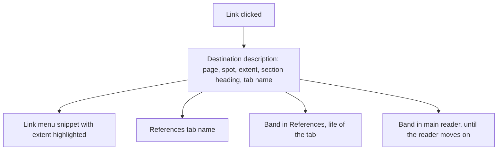
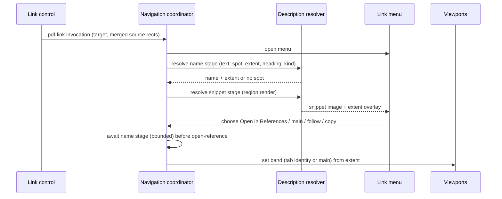
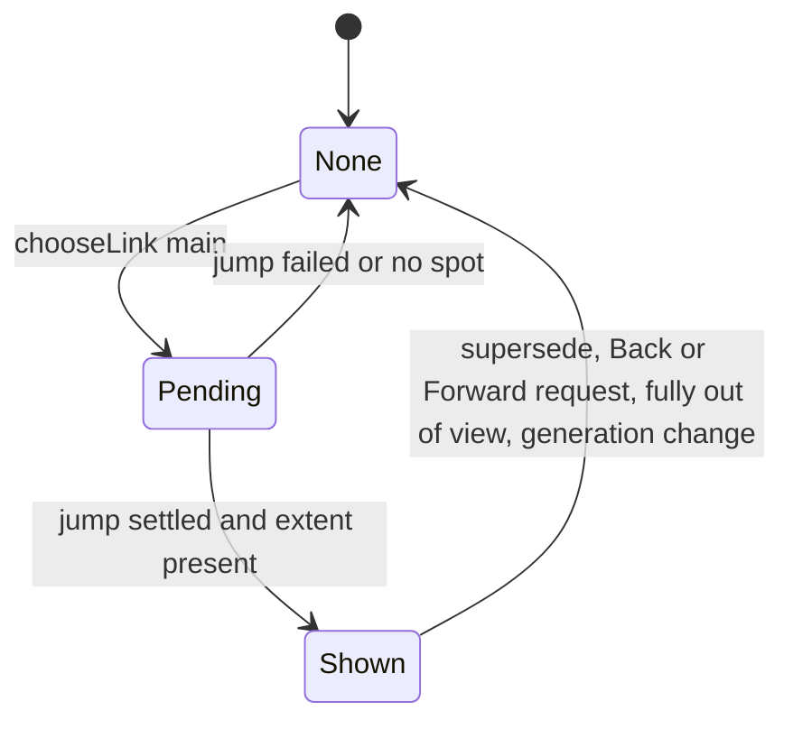

# Legible Link Destinations - Plan

## Goal Capsule

**Objective:** Readers know where a PDF link goes before following it, can tell open References tabs apart, and can see exactly which passage a followed link pointed to.

**Means:** Resolve one destination description per clicked link and feed it to the link menu, References tab naming, and a transient Destination Band overlay (KTD1).

**Product authority:** The Product Contract owns behavior: Requirements state it and Key Decisions record the choices behind it. The Planning Contract owns mechanism within those constraints. R4 amends the neutral soft design contract's link-popover rule.

**Open blockers:** None.

**Execution profile:** Implement in the current isolated checkout, verify locally, and deliver an open pull request. The coordinating executor owns integration, verification, commits, and shipping; merging requires separate authorization.

**Stop conditions:** Stop for an invalidated product decision or an unavailable required prerequisite; preserve partial work.

---

## Product Contract

### Summary

Clicking a PDF link opens its action menu with a rendered snippet of the destination, the exact spot highlighted, above text-labeled actions.
References tabs are named from the text the reader clicked, falling back to the destination's section heading when that text is only a number.
A soft band marks the linked passage in References for the life of the tab, and in the main reader until the reader moves on.

### Problem Frame

Following a citation or cross-reference is the core of Placekeeper's "follow references" workflow, and today it is opaque at every step.
The link menu shows only unlabeled icons, so the reader commits to a destination without knowing what it is.
Nearly every References tab is labeled with a bare page numeral, because links generated by LaTeX carry no author name and the text under the link is never used as a fallback; with several tabs open, the reader cannot tell them apart.
After arriving, the reference view scrolls near the destination but marks nothing, so on a dense page such as a bibliography the reader has to guess which entry the link meant.

### Key Decisions

- **One destination description drives every surface.** The snippet highlight, tab name, and band come from a single description of the destination, so what the menu highlights is exactly what the band marks. Governs R1, R2.
- **The preview lives in the click menu, not on hover.** (session-settled: user-directed — chosen over a hover label, a hover snippet, and a hover snippet that pins on click: nothing should appear while reading, and one surface should answer "where does this go?") Governs R3, R5.
- **Menu actions get visible labels.** This supersedes "Keep the existing icon-forward link-action popover and action order" in `docs/plans/2026-09-05-neutral-soft-design-contract.md`; action order is unchanged. Governs R4.
- **Tab names start from the clicked text, bolstered for numeric references.** (session-settled: user-approved — chosen over always the clicked text, always the destination section, and always the destination text: the clicked text suits citations, while section and equation links need the destination's heading or kind to be recognizable) Governs R7.
- **Equation labels come before section names.** (session-settled: user-directed — chosen over naming equation links after their enclosing section heading: a tab named "Eq. 1" says what the link points to, while the section name does not) Figure and table labels follow the same rule; a section reference is still named by its own heading. Governs R7.
- **Icon-only actions in one row, and a blue highlight-style band.** (session-settled: user-directed after review in the browser — chosen over visibly labeled actions and a green band with an edge stripe: the snippet already says where the link goes, so the actions can stay compact, and the band should read like the app's other text highlights) The action row puts the icons left and the destination page numeral right, in the annotation peek card's page style. Supersedes R4's visible labels and KTD8's green tint and edge. Governs R4, R10.
- **The destination mark is a persistent soft band.** (session-settled: user-directed — chosen over an arrival flash, a margin marker, and a flash that settles into a margin marker: it is the most obvious mark) Governs R10, R11.
- **The band covers the target line and the rest of its block, capped.** (session-settled: user-approved — chosen over the target line only and a fixed-height band: a whole bibliography entry should read as marked, while a long theorem should not be banded in full) Governs R2.
- **The main reader shows the band until the reader moves on.** (session-settled: user-approved — chosen over keeping it as long as References does and over no main-reader mark: jumps in the main reader are equally disorienting, but a lingering band would clutter ongoing reading) Governs R12.

### Requirements

**Destination description**

- R1. Following a link resolves one destination description: its page, its target spot when the link names one, the spot's extent, the heading of the section containing it, and the tab name. The link menu, References tabs, and bands all use this description.
- R2. The extent starts at the line at the target spot and continues to the end of that line's block (a bibliography entry, heading, or paragraph), capped at about three lines.

**Link menu**

- R3. Clicking a link opens its action menu with a rendered snippet of the destination page around the target spot, the extent (R2) highlighted, and the destination's bare page numeral.
- R4. Menu actions stay icon-only with tooltips, in one row below the snippet, keeping today's actions and order: Open in References, Follow in this tab (only inside References), Open in main document, and Copy link. The destination page numeral closes the row on the right.
- R5. Pointing at a link without clicking shows no preview.
- R6. When the link targets a whole page rather than a spot, the snippet shows the top of that page with nothing highlighted.

**References tab names**

- R7. A References tab opened from a link is named by the first available of: the link's author-provided name; the text the reader clicked, unless it reads as only a number or reference code; an equation, figure, or table label such as "Eq. 1" when the destination is recognizably one; the destination's section heading; a "Section 2.3" label when the destination is recognizably a section; the bare page numeral.
- R8. A truncated tab name remains fully available through its tooltip and accessible label.
- R9. Tabs opened from the outline, search results, or annotations keep their existing names.

**Destination band**

- R10. When References shows a link destination that has a target spot, a soft band marks the extent (R2) for as long as the tab stays open, including after the reader scrolls away and back. The band marks the destination that the tab's existing return-to-destination control targets.
- R11. The band is visually distinct from the reader's highlight annotations, cannot be selected or edited, and is never saved, exported, listed as an annotation, or included in Codex context.
- R12. Following a link in the main reader shows the same band there, cleared once the reader scrolls it fully out of view, goes Back, or follows another link.
- R13. Destinations without a target spot get no band.

### Acceptance Examples

- AE1. Citation link. **Covers R3, R4, R7, R10.**
  - **Given:** a paper whose citation "Agarwal, Dahleh, et al. (2023)" links to a spot in the bibliography on page 14, with no author-provided link name.
  - **When:** the reader clicks the citation and chooses Open in References.
  - **Then:** the menu first shows the page 14 bibliography around that entry with the entry highlighted, above labeled actions; the new tab is named "Agarwal, Dahleh, et al. (2023)"; the whole entry carries the band, which is still there after the reader scrolls to page 16 and back.
- AE2. Section cross-reference. **Covers R7.**
  - **Given:** the text "2.3" links to the heading "2.3 The Aggregated Projection Matrix".
  - **When:** the reader opens it in References.
  - **Then:** the tab is named after the heading, not "2.3".
- AE3. Equation reference. **Covers R7.**
  - **Given:** the text "1" links to equation (1), with or without a usable section heading.
  - **When:** the reader opens it in References.
  - **Then:** the tab is named "Eq. 1" if the destination is recognizably an equation, otherwise by its section heading or bare page numeral.
- AE4. Main-reader band clears. **Covers R12.**
  - **Given:** the reader chooses Open in main document on a citation link.
  - **When:** the reader keeps reading the destination, then scrolls until the banded entry is fully off screen.
  - **Then:** the band shows on arrival and while the entry is visible, and is gone after it leaves the view; scrolling back does not restore it.
- AE5. Whole-page link. **Covers R6, R13.**
  - **Given:** a link whose destination is a whole page.
  - **When:** the reader clicks it and opens it in References.
  - **Then:** the menu snippet shows the top of the page with nothing highlighted, and no band appears.
- AE6. Band is not an annotation. **Covers R11.**
  - **Given:** a References tab showing a banded destination.
  - **When:** the reader exports a reviewed PDF or opens the Annotations list.
  - **Then:** the band appears in neither.

### Scope Boundaries

- Hover previews of any kind.
- Renaming tabs opened from the outline, search results, or annotations (R9).
- Marking the source link the reader clicked, or showing where a References tab came from.
- Changing which actions the link menu offers or their order.

### Dependencies / Assumptions

- The viewers render only whole pages today, but the pinned PDF engine already exposes region rendering, which the snippet (R3) uses (KTD3).
- Link destinations that name a spot carry that spot's coordinates, and each References tab keeps its original destination separately from its scrolled position, so R10 can follow the existing return-to-destination behavior.
- Highlight annotations render in a yellow-gold fill, which the band's appearance must avoid (R11).

### Sources / Research

- `apps/web/src/pdf/PdfLinkControl.tsx` builds link names from author contents and subject only; the text under the link is never passed, so LaTeX links fall back to "Page N" (`apps/web/src/pdf/pdf-navigation-metadata.ts`).
- `apps/web/src/review/ReferenceWorkspace.tsx` shows only the bare page numeral when a tab's name equals its page context.
- `apps/web/src/review/LinkActionPopover.tsx` renders the current icon-only actions; the menu opens from the link's click handler.
- `apps/web/src/pdf/pdf-navigation-target.ts` and `apps/web/src/review/reference-navigation-state.ts` carry XYZ coordinates and each tab's original destination.
- `docs/plans/2026-08-17-1129-feat-reference-destination-return-plan.md` defines the return-to-destination control that R10 follows.
- `docs/plans/2026-09-05-neutral-soft-design-contract.md` holds the link-popover rule R4 amends and the bare-page-numeral and tooltip rules R3 and R8 follow.
- `packages/core/src/annotation-appearance.ts` defines the highlight fill that R11 must stay distinct from.

**Product Contract preservation:** Product Contract unchanged, except that Deferred to Planning questions are answered in place by KTD2–KTD5 and the rendering dependency is updated to reflect KTD3.

---

## Planning Contract

### Key Technical Decisions

- KTD1. **A destination description is transient presentation state, resolved on click and keyed by document generation.** Resolution starts when the link menu opens. It is aborted only when the menu is dismissed without a choice or another link invocation supersedes it; choosing an action closes the menu but hands the in-flight name stage to the chosen operation. The result feeds the menu snippet, the `open-reference` label, and band placement. It never enters `ReferenceTab.originalTarget`/`settledLocation`, `ReviewState`, or any persisted reducer, following `docs/solutions/architecture-patterns/reference-tab-return-to-origin-navigation.md`. Governs R1.
- KTD2. **The description resolves in two stages: name first, then snippet.** The name stage reads link text, spot, extent, and heading from cached page text, which is cheap. The snippet stage renders an image, which is slower. Open in References waits only for the name stage, bounded by the navigation timeout, while the chosen action shows a busy state (`aria-busy`, as the Fit width control already does); on timeout it opens with the bare page numeral. Tab names are fixed at open (no rename action exists), so this avoids a new relabel reducer action. Governs R1, R7.
- KTD3. **The snippet is a region render, not a second viewer.** The snippet uses the engine's `renderPageRect` for a page-width strip around the extent, shown as an object-URL image. The object URL is revoked when the menu closes. The extent highlight is a DOM overlay drawn with the same style token as the band, not burned into the bitmap. A second live EmbedPDF viewer was rejected: the reference viewer already holds the only extra document slot. Governs R3, R6.
- KTD4. **A spot exists only for an XYZ destination whose y lies inside the page crop box and more than one point above its bottom edge.** The engine turns a null XYZ top into y = 0, which would otherwise read as the page bottom. Fit, FitH without a top, and null-top XYZ are therefore whole-page destinations. Unreliable page text, as judged by the existing `assessPageTextReliability` gate, keeps the spot but yields no extent: no highlight and no band. Governs R6, R13.
- KTD5. **Extent detection uses merged glyph lines from the destination page.** The glyph-to-line merge in `apps/web/src/pdf/pdf-search-controller.ts` is extracted into a shared helper. The target line is the first line whose top is at or below the spot. The block continues while the gap to the next line stays within 1.5 times the median line pitch and neither font size nor weight changes. A return to the block's opening indent after a hanging-indent line ends a bibliography entry. The block is capped at three lines. Governs R2.
- KTD6. **Clicked text merges same-destination link areas on the source page.** hyperref and natbib split one citation into several link annotations with the same target. The resolver reads glyphs under the same-page annotations whose target identity matches and that chain to the clicked area by adjacency (next to each other on a line, or wrapping from the end of one line onto the next), in reading order, then sanitizes the result with the existing metadata normalizer. A second citation of the same work elsewhere on the page stays separate. "Reads as only a number or reference code" means the merged text contains no run of two or more letters (for example "2.3", "(1)", "[12]"; "1b" and "A.3" count as codes). Governs R7.
- KTD7. **Tab-name precedence is implemented as R7 orders it.** (session-settled: user-directed — chosen over ranking the section heading above equation labels: "Eq. N" names the destination itself) The section heading comes from the existing outline containment resolver. When that resolver is unavailable for the document it counts as no heading, per link. Kind labels are conservative: "Eq. N" when the target line ends in a parenthesized number, "Section N" when the target line begins with the clicked number, "Figure N"/"Table N" when the target line begins with that caption word. Equation, figure, and table labels rank above the heading; the "Section N" label ranks below it. Otherwise the next fallback applies. Governs R7, R9.
- KTD8. **Bands are rendered as a sibling overlay layer to the search-highlight layer in both viewports.** The layer is inert, `aria-hidden`, and has no pointer events. It sits outside `PdfAnnotationLayers` and the source-link layer, and is positioned with `positionOwnedRect`. It carries its own color token, starting from a translucent green tint (about 18% alpha) with a 2px left edge in a darker shade of the same hue. That hue is distinct from the yellow-gold highlight fill and from the blue-gray selection background and search highlight. Keeping it out of `ReviewItem`s and the annotation plugin keeps it out of export, the annotation list, and Codex context (R11). Tests assert this at each projection boundary, per `docs/solutions/integration-issues/exclude-navigation-links-from-existing-pdf-annotations.md`. Governs R10, R11.
- KTD9. **The References band follows the tab's original destination and attaches to any tab reached from a link.** Band state is a transient map from tab identity to band, owned by the navigation coordinator next to the reference-return presentation state. It is set whenever a link opens or deduplicates into a tab with a spot. It is dropped on tab close and on document generation change. A deduplicated outline, search, or annotation tab keeps its name (R9) and gains the band. "Follow in this tab" leaves the band on the original destination, matching the return control. Governs R9, R10.
- KTD10. **The main-reader band clears on the first of four events.** It is set only after a successful `chooseLink('main')` jump settles, never from outline, search, or annotation jumps. It clears on:
  - `supersede()` and `begin()`, which together cover every new link invocation and navigation operation; `chooseLink('main')` sets the band only after its own jump settles;
  - a Back or Forward request, at request time;
  - a new `rectVisibility` query reporting the band's full rectangle outside the unobscured viewport after the jump settled;
  - document generation change.
  Governs R12.
- KTD11. **The menu reserves a fixed snippet height.** The menu keeps its existing placement, flip, and dismissal behavior. A fixed height means the async image never changes the menu's size. Labeled actions use `ReviewTooltipButton` with visible text and `CopyLinkControl`'s existing labeled presentation. Everything stays inside the `.review-document` stacking context (`docs/solutions/ui-bugs/pdf-link-hit-target-escapes-reference-viewer-stacking-context.md`). Governs R3, R4.

### High-Level Technical Design

Resolution and fan-out. The name stage gates tab creation; the snippet stage only feeds the menu.

Band lifecycle in the main reader:

### Assumptions

These defaults were chosen during planning with no user available. Each is recorded so reviewers can redirect it.

- A link inside a References tab gets the same menu, snippet, and naming behavior as one in the main reader. Choosing Follow in this tab does not move the band (KTD9).
- Keyboard activation of a link control (Enter or Space on its button) follows the same flow as a click; R5 governs pointer hover only.
- On document refresh or regeneration, descriptions and bands are discarded rather than re-resolved.
- Dock, resize, and zoom changes reposition bands through the existing page-layout geometry, with no separate handling.
- Rotated destination pages render the snippet through the engine's page rotation. If rotated extent geometry proves unreliable during implementation, it falls back to KTD4's no-extent behavior.
- "Fully out of view" has no buffer: the band clears only when its whole rectangle leaves the unobscured viewport.

### Sequencing

U1 and U2 are independent foundations. U3 wires them into navigation. U4 and U5 build the two surfaces on U3. U6 adds end-to-end fixtures and acceptance coverage last.

---

## Implementation Units

### U1. Destination description resolver

**Goal:** A pure, testable resolver turns a link invocation plus page text into a destination description: spot, extent rectangles, clicked text, heading, kind label, and tab name.

**Requirements:** R1, R2, R6, R7, R13; KTD2, KTD4, KTD5, KTD6, KTD7.

**Dependencies:** None.

**Files:**
- Create `apps/web/src/pdf/destination-description.ts`
- Create `apps/web/src/pdf/glyph-lines.ts` (extracted from `apps/web/src/pdf/pdf-search-controller.ts`)
- Modify `apps/web/src/pdf/pdf-search-controller.ts` (use the shared helper)
- Modify `apps/web/src/pdf/pdf-navigation-metadata.ts` (expose the sanitizer for extracted text)
- Test `apps/web/test/destination-description.test.ts`
- Test `apps/web/test/pdf-search-controller.test.ts` (existing; must stay green)

**Approach:**
1. Split the resolver into a pure core that takes page text/glyph data, crop geometry, the outline containment result, and merged source rects, plus a thin engine-backed reader. Model the reader on `createEnginePdfSearchPageReader` and cache per document generation.
2. Convert XYZ coordinates using the crop-aware conversion that search already uses. Apply KTD4's spot rule before any text lookup.
3. Build lines with the extracted glyph-line helper, then pick the target line and block per KTD5, returning extent rectangles in page space.
4. Merge clicked text per KTD6 and pass it through the metadata sanitizer and length bound.
5. Resolve the name by R7's precedence using KTD7's kind rules. The author name still comes from link contents or subject.

**Patterns to follow:** `apps/web/src/pdf/pdf-search-controller.ts` (glyph reading, crop offsets, reliability gate), `apps/web/src/review/annotation-outline-context.ts` (outline containment without a live viewer), `apps/web/src/pdf/reading-location.ts` (nearest text rect).

**Test scenarios:**
- Covers AE1. A split natbib citation "Agarwal, Dahleh, et al." plus "(2023)" with one target merges into the full clicked text and becomes the tab name.
- Covers AE2. Clicked text "2.3" with an outline heading "2.3 The Aggregated Projection Matrix" names the tab after the heading.
- Covers AE3. Clicked text "1", no usable outline, target line ending "(1)" names the tab "Eq. 1".
- Clicked text "1", no outline, unrecognized destination falls back to the bare page numeral.
- Clicked text "1b" or "[12]" counts as a reference code; "Lemma 3" does not.
- An author contents name wins over clicked text.
- Covers AE5. `/XYZ null null null` (y = 0), Fit, and FitH without a top yield no spot and no extent.
- XYZ y inside the crop box near the top of a bibliography entry selects that entry. The block ends at the next entry's hanging indent and is capped at three lines for a long entry.
- A section heading target yields a one-line extent because the next line changes font size or weight.
- A cropped page (fixture `textPdf({crop})`) maps the spot to the correct line.
- Unreliable page text keeps the spot but returns no extent.
- Extracted text containing control, bidi, or markup characters is sanitized and bounded.
- Search results are unchanged after the glyph-line extraction.

**Verification:** Resolver tests pass across the scenarios, and the existing search controller tests still pass unchanged.

### U2. Link invocation carries source geometry

**Goal:** A link click carries the page-space rectangles of every same-destination link area on its page, so the resolver can read the full clicked text.

**Requirements:** R7; KTD6.

**Dependencies:** None.

**Files:**
- Modify `apps/web/src/pdf/PdfLinkControl.tsx`
- Modify `apps/web/src/pdf/viewer-interaction-events.ts`
- Modify `apps/web/src/pdf/PdfWorkspace.tsx` and `apps/web/src/pdf/ReferencePdfViewport.tsx` (pass same-page sibling link rects to each control)
- Test `apps/web/test/pdf-link-control.test.tsx`
- Test `apps/web/test/viewer-interaction-events.test.ts`

**Approach:**
1. In each viewport's per-page link rendering, group link annotations by classified target identity.
2. Give each control its group's rectangles in reading order.
3. The invocation adds a `sourceRects` field in page space alongside the existing `clientRect`. Reclassification at activation stays as it is.

**Patterns to follow:** existing reclassify-at-activation logic in `PdfLinkControl`; neutral event types in `viewer-interaction-events.ts`.

**Test scenarios:**
- A single link emits its own rect as `sourceRects`.
- Two annotations with the same target on one page both appear in each control's `sourceRects`, in reading order.
- Annotations with different targets are not merged.
- An unclassifiable target still emits `pdf-link-unavailable` with no `sourceRects`.

**Verification:** Invocation tests show merged geometry, and existing link activation tests still pass.

### U3. Coordinator wiring, band state, and rect visibility

**Goal:** The navigation coordinator resolves descriptions on menu open, names new tabs from them, and owns transient band state for References tabs and the main reader.

**Requirements:** R1, R7, R9, R10, R12, R13; KTD1, KTD2, KTD9, KTD10.

**Dependencies:** U1, U2.

**Files:**
- Modify `apps/web/src/review/navigation-coordinator.ts`
- Modify `apps/web/src/app/ProductionReviewApp.tsx` (create the description reader in `onMainDocumentReady`; pass description and band state to the shell and viewports)
- Modify `apps/web/src/pdf/viewer-navigation.ts` and `apps/web/src/pdf/viewer-navigation-adapter.ts` (add `rectVisibility`)
- Test `apps/web/test/navigation-coordinator.test.ts`
- Test `apps/web/test/viewer-navigation.test.ts`

**Approach:**
1. On `requestLink`, start the name stage, then the snippet stage. Guard both by document generation and a per-request abort that fires on menu dismissal without a choice or on supersession by another link invocation. `chooseLink` captures the name-stage promise before it clears the link request.
2. In `chooseLink('references')`, mark the chosen action busy, await the name stage within the bounded timeout, then dispatch `open-reference` with the resolved label. Record the band for the resulting tab identity, including a deduplicated existing tab.
3. In `chooseLink('main')`, after `navigateMainTarget` succeeds, await the name stage within the same bound and set the main band only if that operation is still current. Add KTD10's clearing hooks at `supersede()` and `begin()`, history traversal requests, `refreshMainLocation` (via `rectVisibility` once the jump settled), `replaceDocument`, and `dispose`.
4. Drop tab bands on tab close and document generation change. `same-reference` follow does not touch them.

**Patterns to follow:** `ReferenceReturnPresentationState` handling in `navigation-coordinator.ts` (transient presentation state); `targetVisibility`/`pointVisibility` in the adapter for `rectVisibility`.

**Test scenarios:**
- Covers AE1. Choosing Open in References after the name stage resolves opens a tab labeled with the clicked text and records a band for that tab.
- Choosing Open in References before resolution finishes waits, then opens with the resolved label. When the bound expires it opens with the page numeral and no band.
- A link whose target matches an open outline tab reuses that tab, keeps the outline label, and records a band.
- Follow in this tab leaves the tab's band on the original destination.
- Closing a tab drops its band. A document generation change drops all bands and in-flight descriptions.
- Dismissing the menu aborts in-flight resolution, and a late result is ignored.
- Choosing an action while the name stage is pending does not abort it: Open in References shows a busy action and then uses the resolved name, and Open in main document sets the band once the name stage finishes if the jump is still current.
- An outline, search, or annotation jump started through `begin()` clears an existing main band.
- Covers AE4. A main-reader link jump sets the band after the jump settles. Scrolling until `rectVisibility` reports outside clears it. Scrolling back does not restore it.
- The main band clears on a new link, an outline or search jump, and a Back request.
- Outline and search jumps never set a main band.
- `rectVisibility` reports visible when any part of the rect is inside the unobscured viewport, and outside only when none of it is; runway areas count as obscured.
- Covers AE5. A destination without a spot records no band.

**Verification:** Coordinator and adapter tests cover every band transition in the High-Level Technical Design state diagram.

### U4. Destination Band overlay in both viewports

**Goal:** Bands render over the extent in the main reader and in the active References tab, visually distinct and outside every annotation, export, and context path.

**Requirements:** R10, R11, R12; KTD8.

**Dependencies:** U3.

**Files:**
- Modify `apps/web/src/pdf/PdfWorkspace.tsx` and `apps/web/src/pdf/ReferencePdfViewport.tsx` (band layer beside the search-highlight layer)
- Modify `apps/web/src/app/review-design-tokens.css` (band token) and `apps/web/src/app/review-search-references.css` (band layer styles)
- Test `apps/web/test/reference-pdf-viewport.test.ts`
- Test `apps/web/test/owned-overlay.test.ts` (positioning under rotation and zoom)
- Test `apps/web/test/existing-annotations.test.ts` and the Codex context projection tests (band absence)

**Approach:**
1. Render one inert, `aria-hidden` band element per extent rectangle, positioned with `positionOwnedRect` on the band's page only.
2. Pass the active tab's band into the reference viewport as a prop, the same way search results are passed.
3. Implement KTD8's band token. It must read as marked on a white page and remain distinguishable when a highlight annotation or search hit overlaps it; check this in the U6 acceptance screenshots.

**Patterns to follow:** search highlight layers in both viewports (`data-pdf-search-highlight-layer`), `apps/web/src/pdf/owned-overlay.ts`.

**Test scenarios:**
- Covers AE1. The reference viewport renders band elements on the destination page at the extent positions, and they persist across re-render after scrolling.
- The band layer has `inert`, `aria-hidden`, and no pointer events, and text selection passes through it.
- Band positions track zoom and page rotation.
- Covers AE6. With a band present, the existing-annotation inventory, the annotation list projection, the export input, and the Codex context projection contain no band-derived item.
- Switching the active References tab shows only that tab's band.

**Verification:** Viewport tests render and position bands, and the projection tests prove they are absent from export, annotations, and context.

### U5. Link menu snippet and labeled actions

**Goal:** The link menu shows the destination snippet with its extent highlighted and labeled actions, without changing placement, focus, or dismissal behavior.

**Requirements:** R3, R4, R5, R6; KTD3, KTD11.

**Dependencies:** U1, U3.

**Files:**
- Modify `apps/web/src/review/LinkActionPopover.tsx`
- Create `apps/web/src/review/DestinationSnippet.tsx`
- Modify `apps/web/src/app/neutral-context-status.css` (menu layout, snippet frame, labeled items)
- Modify `docs/plans/2026-09-05-neutral-soft-design-contract.md` (replace the icon-forward link-popover rule with R4's labeled rule)
- Test `apps/web/test/reference-workspace.test.tsx` (update icon-only assertions; add snippet and label assertions)
- Test `apps/web/test/destination-snippet.test.tsx`

**Approach:**
1. `DestinationSnippet` shows a fixed-height frame containing:
   - a loading state until the region image arrives;
   - the image with an extent overlay using the band token;
   - the bare page numeral.
   A whole-page destination renders the top of the page with no overlay. A render failure shows the page numeral alone.
2. The snippet is non-focusable and sits above the menu items, so `menu-focus` keyboard order is unchanged.
3. Actions become labeled `ReviewTooltipButton`s in today's order, and Copy link uses `CopyLinkControl`'s labeled presentation.
4. Revoke the object URL on unmount and on request change.

**Patterns to follow:** `CopyLinkControl` labeled branch, `ReviewTooltipButton` label/tooltip convention (`docs/solutions/conventions/native-control-tooltip-contract.md`), existing popover placement in `LinkActionPopover.tsx`.

**Test scenarios:**
- Covers AE1. With a resolved description, the menu renders the snippet image, the extent overlay, the page numeral, and labeled actions in order: Open in References, Open in main document, Copy link.
- Inside References the menu also shows Follow in this tab, in its existing position.
- Covers AE5. A whole-page destination renders a snippet with no overlay.
- While the snippet stage is pending the frame keeps its reserved height, and the menu's size does not change when the image arrives.
- A render failure leaves labeled actions working and shows the page numeral.
- Arrow-key focus still cycles through actions only, and Escape closes the menu and returns focus to the link.
- Closing the menu revokes the snippet's object URL.
- Hovering a link without clicking renders no menu (R5).
- New literal native controls declare the `title` attribute that `apps/web/test/control-tooltips.test.ts` requires, so none of them appears in that test's missing list.

**Verification:** Menu tests show the snippet and labels, and the placement and dismissal tests in `reference-workspace.test.tsx` still pass.

### U6. Fixtures, acceptance, and visual coverage

**Goal:** End-to-end coverage proves AE1–AE6 in a real browser against generated PDFs that contain LaTeX-style links with no author names.

**Requirements:** R3, R4, R7, R10, R11, R12, R13.

**Dependencies:** U1, U2, U3, U4, U5.

**Files:**
- Modify `test/fixtures/pdfs/generate.ts` (a bibliography page with hanging-indent entries, and links without `Contents`: a split citation, a section reference, an equation reference, and a `/XYZ null null null` link)
- Create `test/acceptance/legible-link-destinations.spec.ts`
- Modify `scripts/testing/suites.ts` (register the new spec in `test:e2e` and `test:ci:chromium`)

**Approach:**
1. Extend `referenceNavigationPdf` or add a sibling fixture so every AE has a concrete link.
2. Assert tab names through their accessible labels, with names long enough to hit the horizontal tab cap and the vertical rail layout.
3. Assert band presence through the band layer's elements.
4. Assert band absence through the annotation list and export.

**Patterns to follow:** `test/acceptance/reloadable-links.spec.ts` and `test/acceptance/production-flow.spec.ts` link-popover flows; reference tab selectors in `test/acceptance/review-visual.spec.ts`.

**Test scenarios:**
- Covers AE1. Click the split citation. The menu shows the snippet and labeled actions. Open in References yields a tab named with the full citation and a banded entry that survives scrolling away and back.
- Covers AE2. The section-reference tab is named after its heading.
- Covers AE3. The equation-reference tab is named "Eq. 1".
- Covers AE4. Open in main document shows a band that clears after scrolling it fully out of view and stays cleared on return.
- Covers AE5. The null-top link shows the top-of-page snippet with no highlight and no band.
- Covers AE6. After opening a banded tab, the Annotations list and an exported reviewed PDF contain no band.
- A long link-derived tab name truncates with ellipsis in the right-docked tab bar and fills the vertical rail, with the full name available as its accessible label (R8).
- The menu over an overlapping References viewer stays below it in stacking order, in Chromium and WebKit.

**Verification:** The new acceptance spec passes in Chromium and WebKit. Visual snapshot regeneration is out of scope for this plan (user-directed); the acceptance screenshots stand in for visual review.

---

## Verification Contract

| Gate | Command | Proves |
| --- | --- | --- |
| Types | `pnpm typecheck` | Types and new interfaces compile. In this worktree `apps/vscode` reports two pre-existing errors from a missing `ws` dependency; no new errors may appear. |
| Web unit | `pnpm exec vitest run apps/web/test` | U1–U5 unit and component tests pass. `control-tooltips.test.ts` already fails on this branch for pre-existing controls; its missing list must not include any control added by this work. |
| CI unit | `pnpm test:ci:unit` | The CI vitest configuration picks up the new test files. |
| Acceptance | `pnpm test:e2e` and `pnpm test:ci:chromium` | U6 acceptance flows, including the newly registered spec, pass. |
| WebKit | `pnpm test:ci:webkit` | Menu stacking and band geometry hold in WebKit. |

---

## Definition of Done

- Every R1–R13 is covered by a unit or acceptance test, and every AE1–AE6 has a `Covers AE<N>` test that passes.
- Each U-ID's Verification outcome holds.
- The neutral soft design contract carries R4's labeled-popover rule in place of the icon-forward rule.
- No band, description, or snippet state is persisted, exported, listed as an annotation, or projected into Codex context.
- Object URLs created for snippets are revoked, and no in-flight resolution survives menu dismissal or document replacement.
- Abandoned experimental code (for example an unused second-viewer snippet attempt) is removed from the diff.
