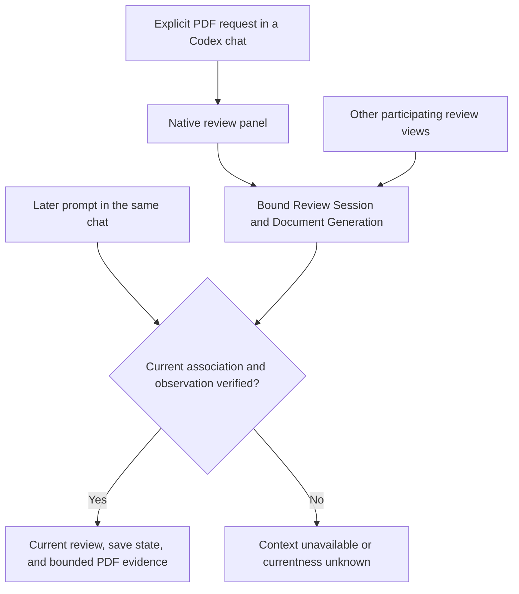
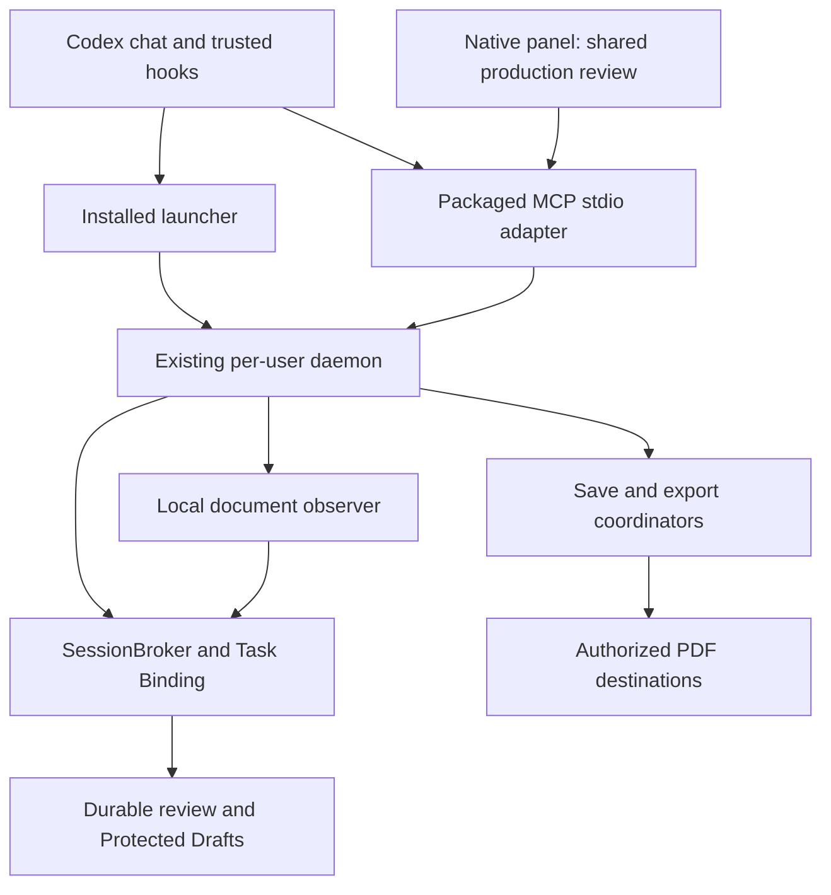
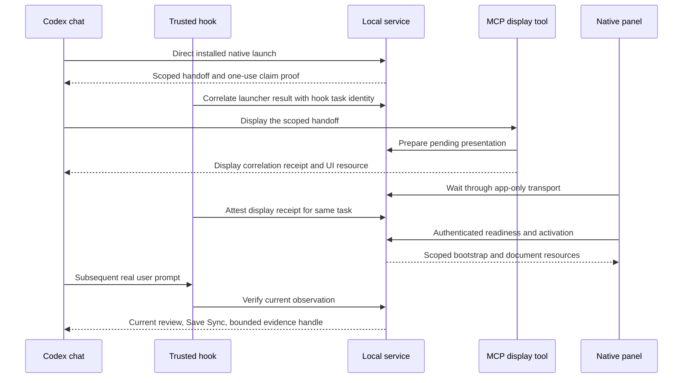
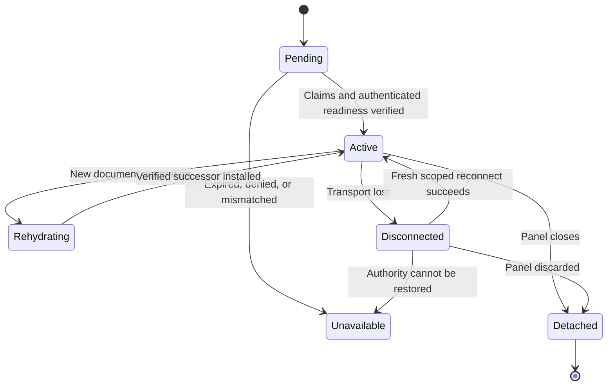
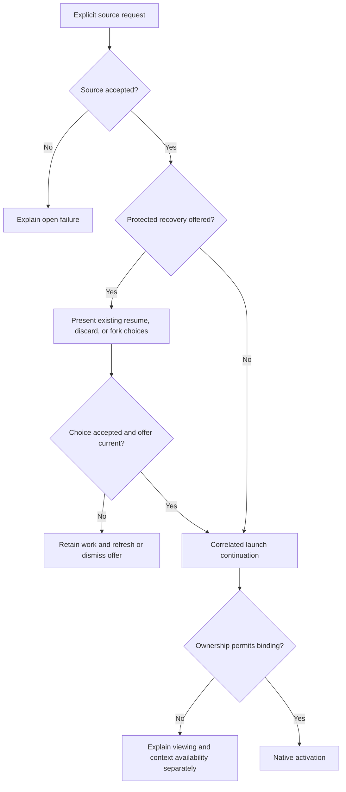
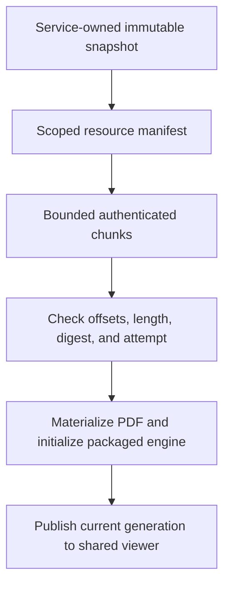

# Native Codex Review - Plan

## Goal Capsule

- **Objective:** Users can complete their everyday Placekeeper PDF review inside Codex without needing its in-app browser.
- **Means:** A native MCP host adapter for the shared production review and existing local service (KTD1).
- **Product authority:** The Product Contract below records the user-confirmed scope. Its R-IDs govern subsequent implementation planning.
- **Execution profile:** Implement the U-ID units below; qualify the actual installed host before completing dependent native integration.
- **Stop conditions:** Stop dependent work if the native correlation gate in U3 cannot establish the required authority, or a required native capability cannot meet R1; report the failing evidence without substituting a browser workflow.
- **Completion and shipping:** The implementing agent owns implementation and the Verification Contract. Commit, push, PR creation, and release require the authority of the later execution request.

---

## Product Contract

### Summary

Placekeeper will provide its complete review experience in a native panel inside Codex, including durable review work and current document context for the hosting chat. Browser integrations will remain available for other tools. The native experience will preserve the existing product's behavior and safeguards.

### Problem Frame

Codex currently opens Placekeeper in its in-app browser. The native compatibility probe demonstrated core rendering and tool interaction, but did not integrate the production review, durable saving, or task-scoped context. A partial native viewer would leave users switching surfaces to finish ordinary review work.

### Key Decisions

- **Complete replacement is the target.** Governs R1–R26. (session-settled: user-directed — chosen over a one-PDF/save-copy MVP: the user wants to eliminate the need for Placekeeper's in-app browser workflow inside Codex.)
- **Explicit opening is sufficient.** Governs R2. (session-settled: user-directed — chosen over automatic takeover of every PDF link: asking Codex to open the PDF meets the intended workflow.)
- **Retain browser compatibility.** Governs R26. Browser access remains useful for other AI tools; this does not assert that a Claude-specific integration already exists.
- **Preserve current save authorization.** Governs R9–R12. (session-settled: user-directed — chosen over requiring new confirmation before any original-file autosave: native integration should retain current saving behavior.)
- **Extend the established review experience.** Governs R3–R16. (session-settled: user-approved — chosen over a reduced, separate native reviewer: the confirmed scope preserves existing behavior across hosts.)
- **Remounts use explicit safe reconnection.** (session-settled: user-directed, October 2 — approved after the actual Restore test remounted the same card and rejected its old invocation.) A remembered chat/review association is a reconnect hint, not live document or editing authority. Disconnect ends participation under the existing measured rules; accepted work remains recoverable. The replacement panel offers Reconnect, and an explicit request in its chat runs a fresh installed launch and trusted display flow. Continuous iframe lifetime across mode changes is not required.
- **Plan the production integration before adding experiments.** The successful compatibility probe is enough to proceed with requirements; unresolved runtime claims need targeted validation, as identified under Outstanding Questions.

### Actors

- A1. **Reviewer:** Reads, searches, annotates, follows references, saves, and resumes review work inside Codex.
- A2. **Codex chat:** Opens an explicitly identified PDF and uses verified review context and document evidence in later responses.
- A3. **Other participating views and file producers:** Existing Placekeeper hosts share a Review Session where applicable; external editors or build tools can replace the source PDF.

### Requirements

**Native entry and complete review**

- R1. Supported Codex desktop users shall be able to complete the existing Codex Placekeeper workflow in the native panel without a required browser step.
- R2. Asking Codex to open an explicit local PDF in Placekeeper shall open the requested review in the native panel of that chat.
- R3. The native panel shall preserve the current production reading experience, including navigation, zoom, text selection, search, nested Reference Tabs, and return to the main reading position.
- R4. The native panel shall preserve current Review Item creation, editing, deletion, history, and manual reattachment capabilities, including supported imported PDF annotations under their existing edit restrictions, together with read-only inspection of the remaining Existing PDF Annotations.
- R5. Existing page and item navigation, precise item links, and source-linked actions available in the Codex browser workflow shall remain usable in the native workflow where their source configuration applies.
- R6. Review controls shall remain reachable and usable across supported panel sizes and expanded presentation, preserving existing keyboard and focus behavior.

**Durability, saving, and reopening**

- R7. Accepted Review Items and Protected Drafts shall remain recoverable after panel closure, reload, or connection loss under the existing Review Session recovery rules.
- R8. Reopening a verified matching source and PDF digest shall rejoin its existing Review Session while keeping each participating view's presentation state independent.
- R9. The native workflow shall preserve existing authorized Save Destination, save, and portable reviewed-PDF export behavior.
- R10. Original-file writes shall follow existing destination authorization rules, including autosave to an eligible original initialized from imported annotations and separately confirmed Replace Original selection.
- R11. Save Sync shall distinguish recoverable review work from the annotation state verified in the selected PDF destination, including pending or failed writes.
- R12. Save failures and interrupted writes shall leave accepted review work recoverable and provide an actionable recovery path without falsely reporting the latest edits as saved.

**Changes to the underlying PDF**

- R13. A valid changed local source PDF shall refresh automatically in the native review, preserving the last valid version through missing, partial, unreadable, or invalid replacements.
- R14. Document replacement shall wait for active source-dependent annotation interactions across participating views, following existing Interaction Hold and disconnect rules.
- R15. An accepted Document Generation change shall reconcile Review Items and Protected Drafts while retaining uncertain attachments for explicit manual reattachment.
- R16. Each participating view shall retain its reading location and zoom through refresh where possible, without reloading for identical source bytes.

**Document and chat context**

- R17. A native launch shall establish a Task Binding to the intended chat, Review Session, and Document Generation without a manual context-sharing step.
- R18. Multiple chats and open reviews shall preserve the existing exclusive Task Binding semantics, preventing another chat or a globally selected document from silently supplying context.
- R19. Every subsequent prompt in a bound chat shall verify current Review Items, Existing PDF Annotations, document identity, Review Revision, and Save Sync before presenting that review state as current.
- R20. Codex shall receive accepted review changes even while PDF persistence is pending or failed, with the corresponding Save Sync state.
- R21. Codex shall retain bounded access to PDF text, layout, render, and annotation evidence tied to the verified live observation.
- R22. Rebinding, source replacement, disconnection, or unverifiable refresh shall prevent stale observations and evidence from being represented as current for the new association.
- R23. Accepted changes made through Codex or another participating view shall become visible in the native panel automatically without manual refresh.

**Installation and compatibility**

- R24. Installation and update guidance shall cover the native Codex integration, including required trust, enablement, reload, and restoration steps.
- R25. Unsupported host capabilities or unavailable integration services shall produce a clear explanation and recovery path without claiming a successful native launch or current binding.
- R26. Existing browser launch and review capabilities shall remain available for non-Codex workflows without depending on Codex-specific native facilities.

### Key Flows

- F1. **Open and review.** The reviewer names a PDF in a chat; Codex opens its native panel and establishes the association. The reviewer reads, searches, follows references, and annotates. **Covers R1–R6, R17–R18.**
- F2. **Save and resume.** The reviewer saves or exports to an authorized destination, sees its save state, closes the panel, and later resumes the recoverable review. A failed save leads to recovery rather than a false success. **Covers R7–R12.**
- F3. **Continue after source changes.** An external application replaces the source PDF; Placekeeper admits a valid replacement after active interactions finish, reconciles review work, and preserves each view's place. **Covers R13–R16, R22.**
- F4. **Discuss the live review.** After edits, the reviewer prompts Codex; Codex verifies the bound review and obtains bounded evidence as needed. Changes from another participating surface appear automatically in the panel. **Covers R17–R23.**
- F5. **Set up or recover the integration.** The user installs or updates Placekeeper, completes required host setup, and opens a review; an unavailable capability leads to specific recovery guidance. Other tools retain their browser entry path. **Covers R24–R26.**

The diagram shows the association and freshness boundary in F4, not a proposed transport or service design.



### Acceptance Examples

- AE1. **Everyday review stays native.** Given an installed supported host and a local PDF, when the reviewer opens it through Codex, searches, selects text, follows nested references, edits annotations, and returns to reading, all actions work in the panel and expanded presentation without opening the in-app browser. Include configured source navigation and page/item links. **Covers R1–R6, R17, R24.**
- AE2. **Recoverable does not mean saved.** Given accepted edits and a Protected Draft, when a destination write fails and the panel closes, reopening restores the accepted work and accurately reports the failed or pending save; a later successful write reports only the revision actually verified. **Covers R7–R8, R11–R12, R20.**
- AE3. **Existing save authorization is preserved.** Given an independent copy destination, saving leaves the original unchanged and selecting Replace Original requires its existing separate confirmation. Given a rewrite-eligible ordinary PDF whose imported annotations initialize an original destination, accepted edits autosave there under the current rules. Generated output retains its existing export-only behavior. Reopening the reviewed PDF preserves the existing portable annotation behavior. **Covers R9–R11.**
- AE4. **Source replacement respects ongoing work.** Given an active annotation interaction in any participating view, when the source changes, refresh waits under the established hold rules. Once those holds end, the latest valid generation appears with reconciled work, independent reading positions, and uncertain attachments available for reattachment. **Covers R13–R16.**
- AE5. **Temporary bad writes do not blank the review.** Given a displayed valid PDF, when an external writer temporarily removes it or supplies incomplete bytes, the last valid version remains usable; a valid successor refreshes automatically, while identical bytes do not reset the view. **Covers R13, R16.**
- AE6. **Chats do not exchange document authority.** Given two chats reviewing different PDFs, when either chat is prompted or opens a different document, its context follows only its valid association; existing panels cannot silently redirect the other chat. Old evidence cannot authorize observations of the replacement. **Covers R17–R18, R21–R22.**
- AE7. **Prompt context includes unsaved review changes.** Given accepted annotation additions, edits, or removals while a PDF save is pending or failed, when the user prompts Codex, the response uses current review state with its save condition. An unverifiable refresh is disclosed rather than replaced by cached certainty. **Covers R19–R22.**
- AE8. **Panel updates without a refresh action.** Given the panel is open, when an authorized change is accepted through Codex or another participating view, the panel reflects it automatically without losing the user's active work. **Covers R7, R14, R23.**
- AE9. **Setup failures are recoverable.** Given a disabled integration, interrupted service, or unsupported host capability, when the user tries to open or resume a review, the explanation identifies the problem and a recovery path without reporting a valid binding. Updating and restoring the integration permits the supported workflow again. **Covers R24–R25.**
- AE10. **Browser compatibility survives.** Given a supported non-Codex browser entry path, when the native integration is installed or updated, the existing browser review remains usable without a Codex chat. **Covers R26.**

### Scope Boundaries

- Automatic interception of every PDF link or replacement of Codex's general PDF file handler is excluded by the explicit-opening choice in R2.
- New annotation types, a new reader design, and broader PDF editing are outside this host-integration effort; R3–R6 adopt the current product baseline.
- R26 preserves browser compatibility but does not promise a new Claude-specific plugin or Claude task-context system.
- New operating-system support, changes to non-Codex native hosts, and unrelated installer modernization are outside scope.
- Incremental development is allowed, but a limited demo or browser fallback does not satisfy R1.

### Dependencies and Evidence Limits

The existing shared production client, Review Host Runtime, service-owned Review Session, and task-context model provide established integration boundaries. Their suitability for the native host still requires implementation planning; no particular transport, polling interval, or host resource extension is mandated here.

A September 30, 2026 compatibility probe reported success on host build `chatgpt 26.928.21956` for native PDFium worker/WASM initialization, PDF rendering and text extraction, user-confirmed heading selection, annotation creation and save/reopen, and server-mediated annotated-PDF save with exact 1,464-byte readback. The open panel also received a changed chat marker automatically through five-second MCP polling. Earlier probe runs established panel/tool roundtrips, model-visible context sharing, and fullscreen presentation.

These results came from an isolated synthetic fixture. They do not establish full-client integration, arbitrary host file-handler dispatch, host-managed writeback, production Task Binding, multi-document behavior, representative PDF performance, or support across Codex releases. The server save experiment used a fixed test destination. Native screenshot capture was unavailable; evidence came from native DOM observations, persisted results, and PDF output.

### Sources and Research

- `README.md`: current product inventory, Codex browser entry, local refresh, persistence safeguards, and other host workflows. This is the feature baseline, not an exhaustive control specification.
- `CONCEPTS.md`: canonical Review Session, Document Generation, Review Revision, Task Binding, Protected Draft, Interaction Hold, Save Destination, and Save Sync vocabulary.
- `apps/service/src/sessions/approved-open-preparation.ts`: current original-destination initialization for eligible imported annotations; qualifies the README's broader original-file safeguard wording.
- `docs/solutions/architecture-patterns/shared-production-review-client-host-runtime-boundaries.md`: shared production experience and host boundary precedent.
- `apps/web/src/host/runtime.ts` and `apps/web/src/host/vscode-runtime.ts`: existing host contract and resource bridging evidence.
- `integrations/codex-plugin/skills/placekeeper/SKILL.md`, `apps/service/src/context/task-binding-registry.ts`, and `docs/plans/2026-08-12-001-feat-live-pdf-codex-context-plan.md`: existing launch, association, prompt-currentness, and evidence semantics.
- `apps/web/src/host/use-codex-context.ts`: existing UI context polling and unavailable-state handling, distinct from the prompt hook.
- `docs/plans/2026-09-15-1824-feat-automatic-local-pdf-refresh-plan.md`: source refresh, interaction deferral, and reconciliation contract, corroborated by current README behavior.
- `docs/installation.md`: setup, trust, update, restoration, and removal behavior.
- September 30, 2026 native compatibility probe: bounded results and limitations recorded under Dependencies and Evidence Limits so the plan does not depend on temporary test files.

---

## Planning Contract

**Product Contract preservation:** changed R10 and AE3 with user approval to preserve existing original-destination autosave; clarified R4's imported annotation classification without changing scope. All R/A/F/AE IDs are retained. Planning questions are resolved in KTD1–KTD9 or assigned to bounded runtime qualification below.

### Key Technical Decisions

- KTD1. **Add a host adapter around the shared production client and local daemon.** Render `RuntimeProductionReviewApp` in a dedicated Codex entry and keep SessionBroker, review recovery, PDF save/export, and source observation authoritative in the existing service. The MCP stdio process is a replaceable transport, not a session store. Reuse the host boundary described in `docs/solutions/architecture-patterns/shared-production-review-client-host-runtime-boundaries.md`; extract only the trusted backend operations the adapter needs. Governs R1, R3–R16, R23, R26. (session-settled: user-approved — chosen over a separate native reviewer and PDF writer: preserve the complete existing review and persistence behavior.)

- KTD2. **Correlate launch and native presentation through trusted hook events.** Extend the direct installed launcher with an explicit native Codex surface. Its successful response carries a service-minted, expiring handoff and the existing one-use task-claim proof; the recognized Bash PostToolUse event supplies task identity. A model-visible display tool consumes that handoff and creates a pending presentation, returning only a correlation receipt and display status to model context. Add an exact matcher and parser for that display tool's trusted PostToolUse event, requiring its hook task identity to match the already-claimed owner before presentation activation. The app initially shows a credential-free, cacheable loading shell. A per-invocation private tool-result `_meta` channel delivers a pending-only readiness/status capability, bound by the service to the exact display receipt, owner, generation, and attempt. It grants no document or mutation access. Each native presentation has its own admission record, even when its chat/review association is already active. Readiness may arrive before attestation and wait without consuming the claim; promotion requires both. The display call returns before its PostToolUse event and never waits for that event. Active app capabilities are delivered only through the authenticated pending channel after promotion. The service owns ordering, expiry, replay rejection, and generation checks. Never equate model arguments, MCP process identity, transport session IDs, or unverified OpenAI metadata with hook task identity. Governs R2, R17–R18, R21–R22. This preserves the approved launcher-based approach; the second attestation closes the otherwise unverified relationship between the launch chat and the native display call. [Codex hooks](https://learn.chatgpt.com/docs/hooks) documents MCP PostToolUse events, but actual delivery and ordering remain U3's gate.

- KTD3. **Preserve exclusive bindings and independent restart proofs.** Keep one bound review per chat and one owner chat per review; additional presentations of the same association are allowed. Reuse existing ownership-denial and explicit link/rebind semantics rather than broadening cardinality. Protected recovery retains the existing chat choice workflow: Codex presents the returned resume/discard/fork options, then reruns the direct launcher with the scoped offer and a stable operation ID. Only the resulting successful launch enters KTD2; no native recovery UI or model-notification dependency is required. A reconnect restores durable work independently of authority: service restart requires both a native presentation reconnect ticket and a matching trusted prompt, following the existing browser restart contract. Native reconnect tickets are independent per presentation and association epoch; issuing one must not delete a peer presentation ticket as the current single-ticket-per-task store does. Rebind or task/session revocation invalidates every ticket from the old association. Consumption rechecks persisted revocation immediately before promotion. Tickets are opaque bearer capabilities, bound to purpose, review, generation, attempt, and expiry; model-facing receipts do not convey document or mutation authority. Governs R7–R8, R17–R22, R25.

- KTD4. **Use a closed native protocol with app-only operations and scoped resources.** Add an explicit Codex host to the shared semantic runtime contract and define its MCP transport envelope separately. The service validates runtime identity, attempt, request identity, generation, method, payload, and capability on every operation; UI visibility metadata is not authorization. Only the display tool advertises a versioned UI resource. Data tools do not create cards. Serve immutable PDF and engine assets through opaque resource handles and bounded chunk requests; verify total length and digest before publication to the viewer. Start with 256 KiB binary chunks and a 1 MiB encoded-response ceiling, adjusting only if measured host limits require smaller chunks. These are transport limits, not a new document-size limit. Keep raw bytes, private paths, and service credentials out of model-visible tool results. Governs R1, R6, R18, R21–R23. The [MCP resource contract](https://modelcontextprotocol.io/specification/2025-11-25/server/resources) has no built-in byte-range read, so chunking is an explicit adapter responsibility.

- KTD5. **Reuse the packaged PDFium pipeline and qualify its native delivery.** Pin the initial MCP dependencies to the tested `@modelcontextprotocol/ext-apps` 1.7.5 and `@modelcontextprotocol/sdk` 1.31.0; preserve EmbedPDF 2.14.4. Bundle the shared UI, worker, and engine assets using existing build helpers. Initialize WASM from verified transferred bytes, as the probe did, instead of requiring blob fetch. Add a Codex-specific resource policy and explicit worker/byte options rather than mislabeling resources as VS Code assets. Keep CSP narrow and use standard nested `ui` metadata; the [Apps specification](https://github.com/modelcontextprotocol/ext-apps/blob/main/specification/2026-01-26/apps.mdx) does not guarantee worker/WASM permissions in every host. No PDF engine replacement, optional host file-handler extension, or core MCP protocol upgrade is needed for this work. Governs R3–R6, R24–R25.

- KTD6. **Delegate all persistence effects to existing coordinators.** Carry save destination confirmations and export fences unchanged through the native protocol. Journal non-idempotent operations in the long-lived service, and request autosave after durable mutation acceptance and successful applied interaction finalization. Distinguish operation-journal replay from durable finalization receipts: completed operations return recorded outcomes; persisted pending operations remain outcome-unknown. Recover pending Save Sync from canonical durable state after restart without replaying mutations. Coordinator coalescing and recovery govern physical writes; the journal does not promise exactly-once PDF writing. Do not await PDF writing before acknowledging recoverable review work. Preserve R10's existing initialization rules, generated-output restrictions, uncertain-write recovery, and destination/source generation fences. Native dialogs use the existing trusted destination picker; the app never submits arbitrary PDF bytes as a replacement file. Governs R7–R12, R20. Follow `docs/solutions/architecture-patterns/recoverable-editable-pdf-annotation-autosave.md`; previous native integration failures show that delegation without scheduling autosave is insufficient.

- KTD7. **Poll compact invalidation state, not PDF bytes.** Introduce a service-owned monotonic presentation watermark covering generation, review revision, Save Sync, freshness, and authoring presence. Use a canonical removable-listener notification boundary covering mutation/finalization, generation advancement, freshness, authoring presence, save phase/destination/recovery, and session termination, while preserving browser delivery. Poll after completion at a one-second active cadence, coalesce notifications, and rebootstrap canonical state when needed. A healthy active panel should reflect an accepted peer change within three seconds. U3 must qualify a per-panel authenticated lifecycle/renewal signal and record its disconnect timeout; shared stdio process health alone is insufficient. Keep that liveness path separate from visibility-throttled state polling; a still-live hidden panel renews independently of visibility. If the host suspends or remounts it, report disconnection and release participation under the existing disconnect rules while retaining Protected Drafts. A remembered association cannot maintain an Interaction Hold or supply live context. An explicit reconnect request runs a fresh canonical installed launch, trusted claim, display attestation and readiness flow with new authority; it never revives the expired presentation. Old-attempt and old-generation replies cannot hydrate the current view. Governs R13–R16, R23. The service observer remains responsible for file replacement; push notifications are unnecessary to meet this contract.

- KTD8. **Retain prompt-time context and the existing evidence/source-work interface.** Continue UserPromptSubmit verification, delivery-before-acknowledgment, bounded evidence handles, and SessionEnd cleanup. A panel context message may supplement selection/location hints but never certifies current review state. Retain the existing CLI evidence and source-work commands; exposing a second equivalent model tool catalog is unnecessary for parity. Native UI actions use app-only semantic methods, and source navigation delegates to the current trusted service operations with the same authorization. Governs R5, R17–R22. Follow `docs/solutions/architecture-patterns/task-scoped-prompt-refreshed-live-pdf-context.md` and the current plugin references.

- KTD9. **Ship through the existing local plugin and installer.** Package a stable stdio entry, versioned UI resources, and MCP registration alongside the current skill and hooks. Keep local PDF access on the user's machine; no hosted endpoint or public deployment is introduced. Preserve trust/enablement/reload reporting and upgrade deferral for active reviews. Unsupported or incompatible cached panels explain how to reopen with the installed version. Governs R24–R26. Use the documented [plugin packaging contract](https://developers.openai.com/plugins/build/plugins), with actual installed-host qualification rather than assuming that a copied payload is active.

### High-Level Technical Design

**Authority and component boundaries (KTD1, KTD4, KTD6, KTD8):** the shared UI has no direct filesystem or daemon credential access.



**Launch protocol (KTD2):** pending shells are harmless until the service has both attestations.



**Presentation lifecycle (KTD3, KTD7):** detaching a view never means deleting the shared review.



**Open and recovery decisions (KTD2, KTD3):** recovery does not silently choose an outcome.



**Resource publication (KTD4, KTD5):** a failed transfer never replaces the last valid displayed generation.



The native API has three distinct audiences:

| Surface | Audience | Authority | Result | Failure behavior |
|---|---|---|---|---|
| Display handoff | Model | Scoped launch receipt plus trusted display hook | Pending UI and correlation receipt | No document or mutation capability on denial |
| Runtime commands | App | Active presentation capability and fenced request | Existing semantic result or replay receipt | Preserve accepted work; reject stale scope |
| Resource chunks | App | Resource handle scoped to presentation and generation | Verified binary chunks | Discard partial materialization |
| Poll and liveness | App | Current presentation/connection identity | Watermark, status, participation renewal | Disconnect/reconnect under KTD7 |
| Evidence/source work | Model through existing CLI | Existing task-scoped evidence/workflow authority | Bounded current evidence or source result | Currentness unavailable; no global fallback |

**Host action mapping:** clipboard copy uses a direct user gesture and native-host-supported clipboard access; denied access retains the existing selectable text/link fallback rather than reporting success. Page/item navigation stays within the shared location history. Source navigation and file reveal use trusted service commands. Save/export and picker cancellation use KTD6. Expanded presentation uses the Apps display-mode capability. U8 verifies every required action in the actual host; a missing required capability prevents full acceptance.

### Output Structure

The main new transport package is separate from the shared web client and service authority. Unit file lists remain authoritative.

```text
apps/codex-mcp/
  src/server.ts
  src/service-client.ts
  src/resources.ts
  test/server.test.ts
  test/resources.test.ts
  vite.config.ts
apps/service/src/codex/codex-runtime.ts
apps/web/src/codex-entry.tsx
apps/web/src/host/codex-runtime.ts
```

### Alternatives and Scope Discipline

A separate reviewer or renderer-side writer would duplicate existing semantics and was rejected under KTD1/KTD6. A pure MCP launch using conversation metadata was not selected because the inspected docs do not establish its equivalence to trusted hook identity; KTD2 has a concrete attestation path to qualify. A service-backed browser iframe would retain the browser dependency excluded by R1. These alternatives do not need a bake-off: the decision follows existing authority boundaries and verified protocol gaps rather than competing undeveloped product mechanisms.

Do not add a new model-facing annotation tool suite, push subscription infrastructure, arbitrary host file interception, telemetry, or unrelated daemon refactors. Existing CLI evidence/source actions and service-owned invalidation polling meet the requested scope; revisit those additions only if qualification identifies a concrete unmet requirement.

### Runtime Qualification and Risks

U1–U3 establish the launch and transport foundation. U3 is the first real-host dependency gate: prove exact native display PostToolUse delivery, task equality, both readiness/attestation orders, private per-invocation capability delivery, app-only calls, a subsequent real user prompt with current evidence, and truthful per-panel lifecycle handling across chat switches, hiding, expansion/restoration, close, and transport loss in the supported Codex build. A host-preserved panel must renew; a suspended/remounted panel may disconnect and require explicit fresh reconnection, preserving durable work and reporting unavailable context until activation. The existing synthetic probe cannot satisfy this gate. If the host omits required attestation, stop dependent work and report the missing interface; do not infer identity or lower the product target.

U4 qualifies the production worker/WASM and chunk path. U8 qualifies representative PDFs, host commands, installation, and composed recovery. The supported host baseline is the actual build passing these gates, recorded with OS and plugin versions; the earlier probe build alone is not the support claim.

Performance acceptance uses the same machine and corpus in native and browser hosts. Record time to first readable page, search completion, selection responsiveness, refresh duration, and peak memory. Investigate native medians above twice the browser baseline before acceptance; all samples must finish without lost input, unbounded retained resources, or crash. This comparison is an engineering regression gate, not a promise for every PDF or machine.

No storage-format migration is intended. Any added native reconnect/journal fields must remain optional for older recovery snapshots and isolated by protocol version. Add native requests, presentations, and dialogs to existing daemon activity/upgrade accounting; MCP EOF must not stop a daemon serving other hosts.

### Research Applied

- `docs/solutions/architecture-patterns/shared-production-review-client-host-runtime-boundaries.md` shapes KTD1, KTD4, and resource/response fencing.
- `docs/solutions/architecture-patterns/recoverable-editable-pdf-annotation-autosave.md` shapes KTD6 and tests for accepted edits with delayed PDF writes.
- `docs/solutions/architecture-patterns/atomic-generation-transitions-for-rebuilt-pdf-reviews.md` shapes KTD7 and composed interaction/refresh tests.
- `docs/solutions/workflow-issues/prove-temporal-ui-stability-across-stateful-lifecycle-seams.md` shapes U8's intermediate-state observations.
- `apps/service/src/cli/hook-command.ts`, `apps/service/src/context/task-binding-registry.ts`, and `apps/service/src/context/live-context-service.ts` establish the current launch/currentness boundary for KTD2/KTD8.
- MCP Apps 2026-01-26 over the pinned SDK's 2025-11-25 core protocol is the initial compatibility target; newer core subscription APIs are not assumed. The cited official sources establish protocol behavior, not tested Codex desktop support.

---

## Implementation Units

Paths marked **new** are proposed additions; all other paths are existing patterns or edit targets. Register each new automated test in the explicit suite catalog.

### U1. Define native launch and runtime contracts

- **Goal:** Establish closed native request, response, handoff, and capability contracts.
- **Requirements:** R2, R17–R18, R21–R22; F1, F4.
- **Dependencies:** None.
- **Files:** `packages/core/src/review-runtime-protocol.ts`; **new** `packages/core/src/codex-mcp-protocol.ts`; `apps/service/src/cli/open-command.ts`; `apps/service/src/cli/hook-command.ts`; `apps/service/src/host/launch-control.ts`; `integrations/codex-plugin/hooks/hooks.json`; `packages/core/test/review-runtime-protocol.test.ts`; **new** `packages/core/test/codex-mcp-protocol.test.ts`; `apps/service/test/hook-contract.test.ts`; `apps/service/test/open-command.test.ts`.
- **Approach:** Implement KTD2/KTD4's host-specific contracts, exact launcher/display recognition, and service control messages. Keep existing browser launch parsing intact. Separate display receipts from presentation and evidence capabilities.
- **Patterns to follow:** Current fail-closed launcher tokenizer, closed runtime validators, and purpose-specific bind proofs.
- **Test scenarios:**
  1. A recognized native launcher result and trusted hook identity produce a claim; composed shell commands and forged payload shapes do not.
  2. A display attestation for another task, stale generation, or consumed receipt is rejected; pending readiness cannot retrieve document bytes or invoke mutations.
  3. App methods reject extra authority fields, invalid identities, forbidden methods, and oversized chunks.
  4. Existing browser launch and hook fixtures retain their prior outcomes.
- **Verification:** Contracts distinguish every authority and failure state required by KTD2–KTD4; no model-supplied task identity becomes trusted.

### U2. Add service-owned native presentations and effects

- **Goal:** Attach native views to canonical reviews without duplicating durability or save logic.
- **Requirements:** R7–R18, R22–R23; F2, F3, F4.
- **Dependencies:** U1.
- **Files:** **new** `apps/service/src/codex/codex-runtime.ts`; `apps/service/src/host/placekeeper-host.ts`; `apps/service/src/host/launch-control.ts`; `apps/service/src/sessions/session-broker.ts`; `apps/service/src/context/task-binding-registry.ts`; `apps/service/src/context/restart-reconnect-store.ts`; `apps/service/src/browser/chrome-runtime-backend.ts`; `apps/service/src/browser/runtime-operation-journal.ts`; **new** `apps/service/src/runtime/local-review-backend.ts`; **new** `apps/service/test/codex-runtime.test.ts`; `apps/service/test/task-binding-registry.test.ts`; `apps/service/test/pdf-save-coordinator.test.ts`; `apps/service/test/recovery.test.ts`.
- **Approach:** Extract the minimal common trusted delegation used by existing native backends, retaining their host policy. Add native presentation staging, attestation, activation, recovery continuation, reconnect, watermark, and cleanup under KTD3/KTD6/KTD7. Generalize browser-named binding discriminators internally without changing browser semantics. Use the current coordinator for every destination and write effect. Integrate native request admission with `DaemonLifecycleCoordinator.runActivity`, aggregate presentation/dialog activity, and shutdown cleanup before the live U3 client is introduced.
- **Execution note:** Characterize operation replay, durable finalization receipts, and mutation/finalization autosave scheduling before moving shared delegation; retain canonical pending-save recovery across a crash between acceptance and scheduling.
- **Patterns to follow:** `apps/service/src/macos/macos-runtime.ts`, the service operation journal, and broker interaction/replacement lifecycle.
- **Test scenarios:**
  1. Covers AE2/AE3. Accepted command and finalization results survive dropped responses without duplicate mutations, including eligible imported-original autosave. Rejected/stale finalization schedules no new edit; restart between durable acceptance and save scheduling resumes pending Save Sync.
  2. Covers AE4/AE5. A peer Interaction Hold defers the newest valid replacement; disconnect releases live authority while the draft survives.
  3. Each KTD7 producer advances the native watermark, including same-generation save/destination/recovery and presence changes; status-only bootstrap reuses document materialization.
  4. Covers AE6. Wrong-task display, expired receipt, activation-before-claim, and another-review ownership conflict never activate the new association.
  5. Recovery choice replay is idempotent; dismissal leaves work intact; stale offers cannot discard newer work.
  6. Native detach leaves other presentations and durable work intact; two same-association panels reconnect using independent tickets in either task/panel arrival order, while revoked staged tickets fail at consumption.
  7. Shutdown racing activation or a picker preserves admitted work; one client EOF leaves other hosts intact, and final detach returns activity to baseline. Repeated stage/abort/reconnect cycles bound presentation, resource, and journal retention while durable work survives.
  8. An additional panel on an already-active binding still needs its own display attestation; either readiness/attestation order works, and a missing hook never promotes access.
- **Verification:** Native and existing host paths share canonical outcomes and save guarantees; denied native requests reveal no document authority.

### U3. Build and qualify the packaged MCP transport

- **Goal:** Prove the native transport and chat correlation in the actual Codex host.
- **Requirements:** R1–R2, R17–R22, R24–R25; F1, F4, F5.
- **Dependencies:** U1, U2.
- **Files:** **new** `apps/codex-mcp/src/server.ts`, `apps/codex-mcp/src/service-client.ts`, `apps/codex-mcp/src/resources.ts`, `apps/codex-mcp/vite.config.ts`, `apps/codex-mcp/test/server.test.ts`, `apps/codex-mcp/test/resources.test.ts`; `package.json`; `pnpm-lock.yaml`; `integrations/codex-plugin/skills/placekeeper/SKILL.md`; `apps/service/src/cli/hook-command.ts`; `apps/service/src/context/live-context-service.ts`; `apps/service/test/codex-live-context.integration.test.ts`; `apps/service/test/hook-contract.test.ts`; `integrations/codex-plugin/.codex-plugin/plugin.json`; **new** `integrations/codex-plugin/mcp.json`; **new** `scripts/qualify-codex-native.ts` and `docs/testing/codex-native.md`.
- **Approach:** Implement KTD4/KTD5/KTD9's stdio adapter, versioned HTML shell, minimal bootstrap view, and bounded resource tools. Connect to existing private daemon control rather than expose a new HTTP server. Include the minimum KTD8 native scope/currentness wiring needed for a subsequent real user prompt, reusing existing context code where it already supports the native binding. Update the packaged skill with the native launcher-to-display handoff, recovery continuation, ownership denial, and unavailable-host instructions needed to exercise this gate. Use a small real reviewed fixture for the first installed-host gate, retaining the qualification harness for later full-client testing.
- **Execution note:** Qualify the complete launcher, actual hook events, native display, and real user-prompt path before expanding the UI. Exercise the packaged skill and native prompt-context path established in this unit; the gate must not depend on U6 completion or ad hoc instructions replacing the shipped launch flow. Simulated hook payloads alone cannot pass this unit.
- **Test scenarios:**
  1. Covers AE6/AE7. Two real chats open different reviews; swapping display receipts is denied and a subsequent user prompt obtains only its bound review and valid evidence.
  2. Recovery continuation and focused ownership-denial produce their intended states in the real host.
  3. Data calls create no additional panels; app capabilities never appear in model-visible content or structured output. Two chats using the same cached shell receive only their own private invocation data; replayed old results cannot activate a new attempt.
  4. Chunk reads reject stale scope, invalid offsets, truncated content, and mismatched digests.
  5. Multiple stdio clients and one client EOF do not reset the daemon or another panel.
  6. Chat switches, hide/restore, expand, close, and transport loss establish truthful per-panel liveness and the measured disconnect rule. A remount shows Reconnect, grants no document/editing authority and supplies no current context. An explicit request in the same chat uses a fresh installed launch and trusted display flow; it restores recoverable work without reviving old credentials. Old-incarnation responses cannot renew or release a successor attachment. If neither continued liveness nor this safe explicit reconnect path can be qualified, stop dependent interaction work.
- **Verification:** Record actual Codex build, plugin versions, hook event shapes, and sanitized outcomes in the qualification report. KTD2's host gate passes; otherwise stop dependent native work.

### U4. Render the shared production review in the native panel

- **Goal:** Run the complete existing UI with explicitly supported native resources and lifecycle.
- **Requirements:** R1, R3–R6, R8, R16; F1.
- **Dependencies:** U3's host gate.
- **Files:** **new** `apps/web/src/codex-entry.tsx`, `apps/web/src/host/codex-runtime.ts`, `apps/web/vite.codex.config.ts`, `apps/web/test/codex-runtime.test.ts`; `apps/web/src/host/runtime.ts`; `apps/web/src/host/session-contracts.ts`; `apps/web/src/production-entry.tsx`; `apps/web/src/pdf/embedpdf-viewer.ts`; `apps/web/src/host/viewer-resource-equivalence.ts`; `apps/web/src/host/runtime-document-source.ts`; `scripts/build/pdfium-assets.ts`; `scripts/build/pdfium-worker-source.ts`; `apps/web/test/embedpdf-viewer.test.ts`; `apps/web/test/host-runtime.test.ts`.
- **Approach:** Mount the shared tree through KTD1/KTD5's adapter. Factor reusable RPC identity and response-ordering behavior without changing other host policies. Materialize verified PDF resources, pass WASM bytes to the packaged worker, and revoke obsolete resources on disposal. Integrate in-memory document location history and native display-mode sizing.
- **Patterns to follow:** `RuntimeProductionReviewApp`, existing RPC invalidation fencing, and `apps/web/vite.macos.config.ts`.
- **Test scenarios:**
  1. Covers AE1. Native production rendering supports real text selection, search, nested references, navigation, and narrow/expanded controls.
  2. A stale bootstrap or chunk completion cannot replace the active document after rebind/dispose.
  3. Resource failure retains the last valid view and offers retry without retaining unbounded blobs/workers.
  4. A newer legitimate command response is accepted even if the adapter's prior projection lags.
  5. Covers R6. Existing review keyboard shortcuts, focus order, and focus return after dialogs and reference tabs work in narrow and expanded native panels; record any host-reserved shortcut conflicts for actual-host qualification.
- **Verification:** The actual native host renders the production client using packaged assets; no browser URL, separate reviewer, or hosted dependency is necessary.

### U5. Complete native save, interaction, and refresh parity

- **Goal:** Carry production edit, save, and source-replacement behavior across the new adapter.
- **Requirements:** R4, R7–R16, R20, R23; F2, F3.
- **Dependencies:** U2, U4.
- **Files:** `apps/web/src/host/codex-runtime.ts`; `apps/service/src/codex/codex-runtime.ts`; `apps/web/src/app/ProductionReviewApp.tsx`; `apps/web/src/host/runtime-document-source.ts`; **new** `apps/service/test/codex-persistence.integration.test.ts`, `apps/web/test/codex-refresh.test.tsx`; `apps/web/test/interaction-reconnect-runtime.test.ts`; `apps/web/test/refresh-interaction-lifecycle.test.tsx`; `apps/service/test/live-document-replacement.test.ts`; `apps/service/test/pdf-save-coordinator.test.ts`.
- **Approach:** Finish the adapter methods under KTD6/KTD7, including destination dialogs, save status, finalization receipts, interaction reconnect, and full canonical rebootstrap. Keep document materialization distinct from same-generation state/status updates.
- **Test scenarios:**
  1. Covers AE2/AE3. Save failure, newer edits during an older write, destination changes, and retry report accurate Save Sync with recoverable work.
  2. Covers AE4/AE8. A hidden but connected editor retains its hold while another view changes state; actual connection loss releases authority without discarding the draft.
  3. Covers AE5. Missing/partial/identical/valid successor writes produce the established refresh behavior.
  4. Uncertain attachments remain editable and manually reattachable after replacement.
  5. Native save/export cancellation does not change destination or falsely report completion.
- **Verification:** The composed edit/save/refresh flow satisfies the corresponding AEs and KTD7 latency target in the native host.

### U6. Preserve live context, links, and source-work integration

- **Goal:** Keep agent context and existing host actions complete after native launch becomes the default.
- **Requirements:** R5, R17–R22, R25; F1, F4.
- **Dependencies:** U3, U4.
- **Files:** `apps/service/src/cli/hook-command.ts`; `apps/service/src/context/live-context-service.ts`; `apps/service/src/context/pdf-evidence-service.ts`; `apps/service/src/context/live-source-workflow-service.ts`; `apps/web/src/host/use-codex-context.ts`; `apps/web/src/app/ProductionReviewApp.tsx`; `apps/web/src/host/session-contracts.ts`; `integrations/codex-plugin/skills/placekeeper/SKILL.md`; `integrations/codex-plugin/skills/placekeeper/references/live-evidence.md`; `integrations/codex-plugin/skills/placekeeper/references/source-work.md`; `apps/service/test/codex-live-context.integration.test.ts`; `apps/service/test/hook-contract.test.ts`; **new** `apps/web/test/codex-host-actions.test.tsx`.
- **Approach:** Build on U3's working native launch and prompt-context foundation to complete KTD8's context lifecycle coverage, host action mapping, links, and source-work integration. Preserve existing CLI semantics and complete the remaining skill and evidence/source-work reference updates. Do not claim success from a visible panel alone.
- **Test scenarios:**
  1. Covers AE7. A real prompt after unsaved accepted edits gets current changes and save condition; hook failure emits unavailable rather than cached certainty.
  2. Failed context delivery is not acknowledged; the next successful delivery replays the necessary changes.
  3. Covers AE6. Old evidence expires on rebind, generation change, and task revocation; restart arrival order cannot steal ownership.
  4. Covers AE1. Precise item links, configured source actions, semantic text/link copy, and permission-denied fallbacks work without a required browser step.
- **Verification:** Native visual state and verified model context refer to the same live review; source/evidence workflows retain their current authorization and bounds.

### U7. Integrate installation, updates, and browser compatibility

- **Goal:** Deliver the native integration through the supported installer lifecycle.
- **Requirements:** R24–R26; F5.
- **Dependencies:** U3–U6.
- **Files:** `packaging/macos/build-native-candidate.ts`; `packaging/macos/codex-marketplace.json`; `packaging/macos/setup-integrations.mjs`; `packaging/macos/validate-manifest.ts`; `scripts/package-source-release.ts`; `scripts/install-release.sh`; `install.sh`; `integrations/codex-plugin/.codex-plugin/plugin.json`; `integrations/codex-plugin/mcp.json`; `README.md`; `docs/installation.md`; `packaging/macos/setup-integrations.test.mjs`; `packaging/macos/packaging.test.ts`; `scripts/source-release.test.ts`; `scripts/install-release.test.ts`; `apps/service/test/macos-daemon-runtime.test.ts`; **new** `apps/service/test/codex-daemon-runtime.test.ts`.
- **Approach:** Apply KTD9's packaged entry and configuration, include native artifacts in build/release validation, and update instructions to match actual support. Preserve existing disabled settings and trust state. Verify U2's active native work accounting during installed upgrade races and remove integration-owned configuration through existing uninstall behavior.
- **Execution note:** Installed payload, tool discovery, hook trust, and actual activation are separate checks.
- **Test scenarios:**
  1. Covers AE9. Fresh install and update expose the correct server/resource version after prescribed trust and reload steps.
  2. A cached incompatible panel reports reopen guidance while durable work remains recoverable.
  3. Updating with active native and browser reviews preserves daemon upgrade rules.
  4. Covers AE10. Ordinary browser launches still work after native install, update, disablement, and removal.
- **Verification:** Packaged/source-release artifacts contain all required files and the installed workflow passes with honest pending setup states.

### U8. Qualify representative PDFs and complete lifecycle acceptance

- **Goal:** Demonstrate full native parity on the production artifact and guard other hosts against regression.
- **Requirements:** R1–R26; F1–F5; AE1–AE10.
- **Dependencies:** U5–U7.
- **Files:** `test/fixtures/pdfs/generate.ts`; **new** `test/acceptance/codex-native-review.spec.ts`, `test/acceptance/codex-native-lifecycle.spec.ts`, `test/acceptance/codex-native-resources.spec.ts`; `scripts/qualify-codex-native.ts`; `docs/testing/codex-native.md`; `scripts/testing/suites.ts`; `package.json`; applicable existing CI workflow files discovered through the suite registry.
- **Approach:** Reuse the PDF corpus, add a deterministic large text-heavy fixture, and run the shared acceptance flows through a test MCP bridge plus real installed Codex qualification. The bridge suite proves semantic behavior; it cannot replace real host CSP, hooks, clipboard, display, or lifecycle evidence. Record performance comparisons under Runtime Qualification and Risks.
- **Test scenarios:**
  1. Covers AE1/AE3. Text, image-only, mixed, rotated/cropped, reference-linked, imported-annotation, and protected/read-only PDFs retain their existing supported behavior.
  2. Covers AE2/AE4/AE8. The same draft/item survives edit, delayed save, peer source replacement, manual reattachment, connection loss, and reopen with correct intermediate status.
  3. Covers AE6/AE7/AE9. Two chats, multiple presentations, recovery offers, actual fresh prompts, stale receipts/evidence, and installed update are exercised end to end.
  4. Repeated large-document open/close and generation replacement release obsolete workers/resources and complete without crash or input loss.
  5. Existing browser, Chrome, macOS, and VS Code behavior remains intact across changed shared boundaries.
  6. Covers R6. In the actual installed host, verify existing keyboard shortcuts, focus order, and focus return after dialogs and reference tabs in narrow and expanded panels. Record host-reserved shortcut conflicts and verify required review actions remain usable before accepting native parity.
- **Verification:** Every AE has automated coverage where possible and actual-host evidence where required; unresolved native capability failures prevent a full-parity claim.

---

## Verification Contract

No application tests were run while authoring this plan. Commands below are execution gates, not claims of passing results.

| Gate | Command or evidence | Applies to | Pass condition |
|---|---|---|---|
| Types and shared contracts | `pnpm typecheck` | U1–U7 | All host unions, validators, and client/service contracts agree |
| Native focused suite | New `pnpm test:codex-native` registered in `scripts/testing/suites.ts` | U1–U8 | All new protocol, transport, service, and adapter tests run |
| Canonical persistence/context | `pnpm test:service`, `pnpm test:save-export`, `pnpm test:source-rebuild` | U1, U2, U5, U6 | Existing authority, durability, and replacement suites remain green |
| Shared review and hosts | `pnpm test:review`, `pnpm test:host-integration`, `pnpm test:pdf-conformance` | U2, U4–U6 | Shared UI/resource/backend changes preserve existing hosts |
| Browser regression | `pnpm test:e2e` plus changed host-specific suites selected from the registry | U4–U8 | Review/reference/link/authoring/refresh paths remain intact |
| Distribution | New `pnpm build:codex`, `pnpm validate:distribution`, `pnpm test:source-release` | U3, U7 | Native assets/server ship with the validated package and source release |
| Installed native correlation | U3 report from actual launcher, hook, MCP panel, and fresh user prompt | U3 | Two-chat isolation and verified bounded evidence proven on the supported build |
| Full installed native acceptance | U8 report covering AE1–AE10, host actions, corpus, and measured performance | U8 | No required browser step; no unresolved save/recovery/context or host capability failure |

`release:validate` is not an existing repository command. Use the actual distribution/source-release gates above and the repository's applicable full-validation gates when preparing a release. Register new tests in the explicit CI lists; a test file existing on disk does not establish that CI runs it.

---

## Definition of Done

- U1–U8 meet their Verification outcomes and the applicable Verification Contract gates pass.
- Product behavior matches R1–R26, including the approved R10 saving correction, with AE1–AE10 traced to evidence.
- The installed Codex host passes native correlation and complete workflow qualification; synthetic rendering or a test bridge alone is insufficient.
- Saves, exports, recovery, refresh, and prompt context share canonical service state; no second writer or global active-document authority exists.
- Browser compatibility and existing native hosts pass the regressions required by the changed shared boundaries.
- Installation, support baseline, limitations, and recovery instructions match the tested artifact.
- Abandoned experimental code, unused paths, temporary registrations, and test-only credentials are removed from the delivered change; reproducible qualification fixtures and tests remain.


### October 2 continuity implementation design — approved for bounded implementation

The actual expanded baseline delivered current context to a real prompt. Restore followed by reexpansion created a new JavaScript instance whose original pending invocation was denied; immediate teardown versus the 30-second renewal timeout is unresolved. This is a measured lifecycle limitation, not evidence that trusted native correlation failed. The revised product decision above permits an explicit fresh reconnect. Earlier failed lifecycle evidence remains in the private report and must not be relabeled as uninterrupted renewal.

**Bounded initial design:** Keep a native-only advisory task→review hint separately from active/pending bindings. Record it only after trusted native activation succeeds. Use daemon-local memory, at most 256 task hints, with a fixed 24-hour maximum age from the latest successful activation; prompt lookup and renewal do not extend that age. This first implementation remembers across UI remounts while the service lives; after service restart or hint expiry, the user supplies the PDF again through the existing explicit-open flow. Accepted Review Items and Protected Drafts retain their existing durable recovery independently. Persisting chat hints across service restarts is outside this bounded change and must not be implied in UI or documentation.

A hint stores the previously approved review identifier and canonical source identity needed for reopen guidance, but no presentation capability, reconnect ticket, bind proof, evidence handle, item snapshot, or saved-state claim. It never participates in association availability, ownership reservations, currentness, mutation authorization, active-session counts, Interaction Holds, daemon activity accounting, or source-work authority. Task/session revocation clears it; successful activation for a different review replaces it. A committed save relocation updates the hint only from the broker's verified source scope. Generation changes retain only historical reconnect identity: the next launcher revalidates the current source and generation through normal approval/recovery. A different chat's live ownership produces the existing conflict guidance; hints do not override or reserve ownership. Explicit rebinding remains governed by existing paths.

**Trusted resolution and public flow:** A real `UserPromptSubmit` supplies the task identity through the existing hook parser. When no live binding exists, the service may resolve only that task's advisory hint and return an unavailable-context envelope with separately labeled, previously approved reconnect guidance. It must not emit Review Items, Save Sync, document evidence, or a current revision from this hint. The skill acts on that guidance only when the user explicitly requests reconnect/reopen. It runs the existing installed `open --json --surface codex-native --pdf <previously-approved-path>` command, using literal shell quoting; no model-supplied task argument and no new privileged resume endpoint are needed. Normal source approval, scoped resume/discard/fork offers, fresh Bash claim, one display call, trusted display attestation, and private readiness remain mandatory. If the remembered target is gone, expired, revoked or owned elsewhere, use existing explicit target/conflict/recovery guidance. A reconnect hint is a path-selection convenience, never an authority token. Absolute-path disclosure in this narrow unavailable reconnect guidance needs an explicit serializer field and updated safe-output contract; ordinary current-context output still omits paths.

**UI:** Valid invocation data followed by expired/revoked/invalid original admission displays “Reconnect” and explains that the connection ended and accepted work remains recoverable. Transport or renewal loss uses the same explicit chat-request recovery path. Missing invocation or an actual SDK connection/installation failure retains precise integration guidance. No automatic relaunch, authority persistence, lease extension, `seenRuntimes` weakening, or model-call `review_app` is introduced. A button that sends an explicit chat message is optional and remains deferred until actual-host qualification; instructions work without it.

**Expected implementation files:** `apps/service/src/context/task-binding-registry.ts` (native advisory hint lifecycle only), `apps/service/src/codex/codex-runtime.ts` (record verified activation and committed scope relocation), `apps/service/src/context/live-context-service.ts` and `packages/core/src/live-context.ts` (unavailable reconnect guidance shape and validation), `apps/service/src/cli/hook-command.ts` (trusted-task-only projection), `apps/codex-mcp/src/shell.ts` (Reconnect status), `integrations/codex-plugin/skills/placekeeper/SKILL.md` (explicit reconnect flow), and existing native qualification report identifiers/docs. Keep existing diagnostic changes intact. If broker-owned canonical scope requires a dedicated helper, restrict it to trusted service callers and do not expose arbitrary task lookup through CLI/MCP.

**Meaningful tests:** Native hint survives last-panel detach while live binding, evidence and mutation authority disappear; another task cannot retrieve it; hints do not block a different task's normal claim or explicit rebind; expiry/cap/task revoke/session revoke/new activation/committed relocation behave as specified; failed launch/readiness never creates a hint; browser behavior remains unchanged; unavailable prompt output contains only labeled reconnect metadata and never cached review/evidence/save state; old pending/presentation/restart credentials remain denied; fresh canonical launch and hook/display admission restore the intended review. Existing daemon activity tests must show retained hints cannot keep a daemon or Interaction Hold alive.

**Revised actual-host acceptance:** In isolation B, verify current context and accepted durable work while expanded; Restore and reexpand the same card, observe unavailable Reconnect state and revoked old participation; send a real prompt to confirm unavailable context with same-chat reopen guidance; explicitly ask that chat to reconnect; exercise the shipped fresh launcher/claim/display path and confirm new instance/attempt authority, recovered revision and truthful Save Sync. Prompt the other chat to confirm isolation, and test ownership conflict without silent takeover. Repeat close/transport loss and old-attempt denial as scoped qualification allows. This replaces only the uninterrupted mode-continuity expectation; exact trusted correlation, private authority isolation, durable recovery and fresh-prompt gates remain required before U4.
